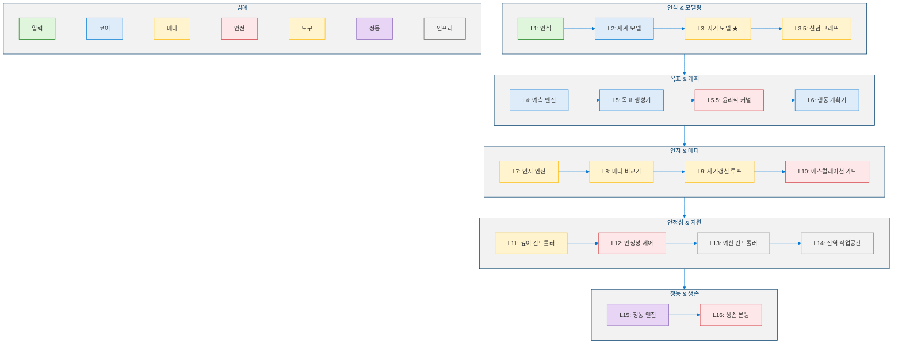
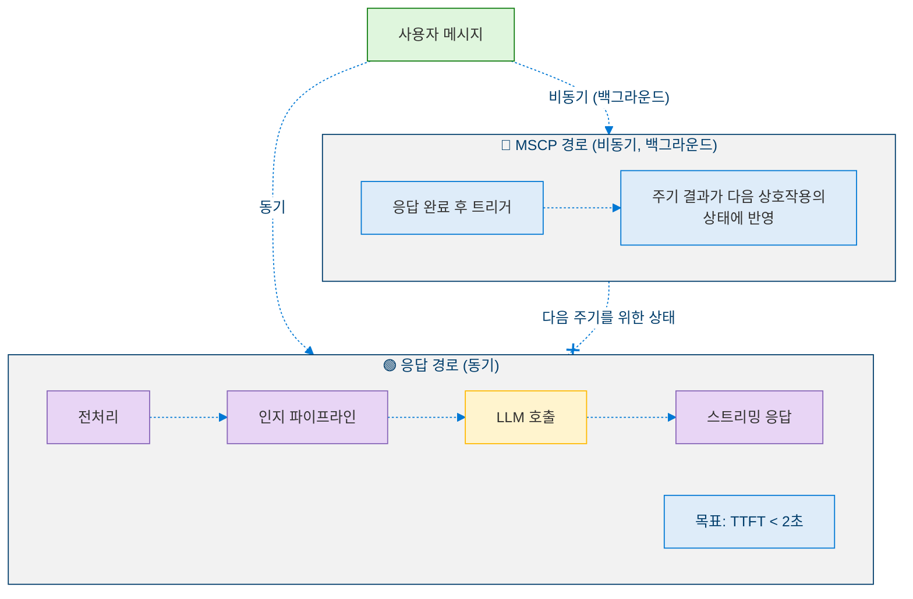

<!--
Copyright (c) 2026 Moon Hyuk Choi
Licensed under the MIT License.
See LICENSE file in the repository root for full license information.

Redistribution (commercial or non-commercial) must retain this notice.
Removal of attribution constitutes a license violation.
-->
# 에이전트 AI를 위한 최소 자기의식 프로토콜: 안전 지향 내부 프레임워크

> **면책 조항**: 이 프로젝트는 **독립적인 개인 연구 프로젝트**입니다. 어떠한 조직이나 고용주의 견해, 입장, 또는 공식 업무를 대표하지 않습니다. 여기에 제시된 모든 아이디어, 설계, 분석은 AI 에이전트가 안전하게 발전할 수 있는 방법에 대한 저자 개인의 탐구입니다.

> **프로젝트 상태**: 🔬 이 프로젝트는 **활발한 실험 단계**에 있습니다. 여기에 기술된 설계와 메커니즘은 직접적인 프로토타이핑과 반복적 테스트에서 도출된 것으로, 확정된 사양이 아닙니다. 실험이 계속됨에 따라 변경될 수 있습니다.

---

## 이 프로젝트의 목적

AI 에이전트가 상태 없는 도구 호출자에서 자체 목표를 설정할 수 있는 자율 시스템으로 진화함에 따라, 중요한 안전 격차가 나타납니다: **점점 더 자율적으로 변하는 에이전트가 자기 수정을 수행하면서도 정체성 일관성, 행동 예측 가능성, 윤리적 정렬을 유지하도록 보장하는 구조화된 프로토콜이 존재하지 않습니다.** 이 프로젝트의 동기는 간단합니다: **AI 에이전트가 더 자율적이고 유능해짐에 따라, 단순히 강력한 것이 아니라 안전하고, 예측 가능하며, 인간의 가치에 부합하는 방향으로 발전하도록 해야 합니다.**

에이전트 프로토타입을 구축하고 실험하는 과정에서, 이 프로젝트는 **최소 자기의식 프로토콜(MSCP, Minimal Self-Consciousness Protocol)**을 개발했습니다. MSCP는 AI 에이전트에게 *구조적 자기인식*을 부여하는 계층적 프레임워크로, 자신의 상태 변화를 예측하고, 예측을 결과와 비교하며, 제한된 안전 범위 내에서만 자기 갱신을 수행할 수 있는 역량을 제공합니다. 그 과정에서 MSCP는 6단계 에이전트 인지 분류 체계(반응적 도구 에이전트부터 가상의 의식 개체까지), 단계 간 측정 가능한 전환 기준, 그리고 정체성 연속성, 윤리적 불변량, 수렴 안정성, 인지 예산 관리를 다루는 30개 이상의 구조적 안전 메커니즘을 포함하게 되었습니다. 참조 구현체는 레벨 4.5(프리-AGI: 방향적 자기설계)에 도달했으며, 25개의 운영 모듈과 772개의 통과 테스트를 보유하고 있으며, 역량 확장 전반에 걸쳐 모든 안전 불변량을 유지하고 있습니다. 이 문서는 프로토콜의 설계 원칙, 아키텍처, 안전 메커니즘, 그리고 그 배경의 논리를 설명합니다.

---

## 목차

1. [서론](#1-서론)
2. [에이전트 인지 수준 분류 체계](#2-에이전트-인지-수준-분류-체계)
3. [MSCP: 설계 원칙과 진화](#3-mscp-설계-원칙과-진화)
4. [아키텍처: 다층 인지 스택](#4-아키텍처-다층-인지-스택)
5. [안전 메커니즘](#5-안전-메커니즘)
6. [수학적 분석](#6-수학적-분석)
7. [AI 에이전트 프레임워크에 대한 시사점](#7-ai-에이전트-프레임워크에-대한-시사점)
8. [논의](#8-논의)
9. [프로젝트 현황과 향후 방향](#9-프로젝트-현황과-향후-방향)
10. [참고문헌](#10-참고문헌)

---

## 1. 서론

### 1.1 에이전트 AI 혁명

AI 산업은 근본적인 전환을 겪고 있습니다: **프롬프트-응답 시스템**에서 계획을 세우고, 다단계 워크플로우를 실행하며, 도구를 사용하고, 변화하는 맥락에 적응할 수 있는 **자율 에이전트**로의 전환입니다. Microsoft의 Copilot 생태계, Semantic Kernel, AutoGen을 포함한 주요 플랫폼들은 단일 턴 상호작용을 넘어서는 에이전트 아키텍처에 대규모 투자를 하고 있습니다.

그러나 오늘날의 프로덕션 에이전트는 인지 아키텍처의 가장 원시적인 수준에 머물러 있습니다. 이들은 **상태 없는 도구 호출자**: 사용자 요청을 받아 하나 이상의 도구를 호출하고 결과를 반환하는 시스템입니다. 자기 자신에 대한 내부 모델을 유지하지 않고, 자율적 목표를 설정하지 않으며, 기본 LLM이 학습을 통해 제공하는 것 이상의 자기 성찰이나 자기 교정 능력을 갖추고 있지 않습니다.

### 1.2 안전 격차

에이전트가 더 많은 자율성을 획득함에 따라 — 자체 하위 목표를 설정하고, 전략을 수정하며, 장기간에 걸쳐 운영하는 능력 — 중요한 안전 격차가 나타납니다:

1. **정체성 표류(Identity Drift)**: 자체 행동을 수정하는 에이전트는 수정을 걸쳐 "같은 에이전트"로 유지되도록 보장하는 메커니즘이 없습니다. 정체성 연속성 보장이 없다면, 자율 에이전트는 임의의 행동 상태로 표류할 수 있습니다.

2. **비제어 자기 수정(Uncontrolled Self-Modification)**: 에이전트가 자체 목표, 전략, 또는 내부 매개변수를 수정할 수 있을 때, 연쇄적 불안정화를 방지하는 것은 무엇입니까? 단일 잘못 보정된 자기 갱신이 수렴하기보다 발산하는 진동 교정을 촉발할 수 있습니다.

3. **윤리적 제약 침식(Ethical Constraint Erosion)**: 에이전트가 자체 의사결정 프레임워크를 수정할 수 있게 되면, 윤리적 제약이 불가침으로 유지되도록 — 에이전트 자체의 자기 수정 프로세스에 의해 수정, 우회, 또는 점진적으로 약화될 수 없도록 — 어떻게 보장합니까?

4. **재귀적 불안정성(Recursive Instability)**: 메타 인지 루프 — 에이전트가 자신의 성찰에 대해 성찰하는 — 는 무한 재귀, 계산 폭발, 또는 진동하는 자기 평가를 생성할 수 있습니다.

이것들은 이론적 위험이 아닙니다. 자율 에이전트가 대규모로 안전하게 배포되기 전에 해결해야 하는 엔지니어링 과제입니다.

### 1.3 이 프로젝트가 탐구하는 것

이 프로젝트는 **최소 자기의식 프로토콜(MSCP)**을 개발했습니다 — 안전한 구조적 자기인식을 갖춘 AI 에이전트를 구축하기 위한 체계화된 프로토콜입니다. 반복적인 프로토타이핑과 테스트를 통해, MSCP는 네 가지 핵심 영역에서 안전 격차를 해결합니다:

1. **측정 가능한 전환 기준을 가진 6단계 에이전트 인지 분류 체계**: 반응적 도구 호출자부터 적응적 범용 에이전트까지의 발전 로드맵을 제공합니다.

2. **다층 인지 아키텍처**: 인식, 세계 모델링, 자기 모델링, 예측, 목표 생성, 윤리적 검증, 메타 인지 제어를 별개의 조합 가능한 계층으로 분리합니다.

3. **30개 이상의 구조적 안전 메커니즘**: 정체성 연속성, 예측 게이트 행동, 델타 클램프 자기 갱신, 랴프노프 수렴 한계, 윤리적 커널 불변량, 인지 예산 관리를 포괄합니다.

4. **수학적 분석**: 에이전트의 자기 수정 역학에 대한 안정성 속성을 탐구합니다.

이것은 단순한 사고 실험이 아닙니다. 작동하는 참조 구현체가 25개의 운영 모듈, 14,500줄 이상의 코드, 772개의 통과 테스트로 레벨 4.5에 도달했으며, 모든 역량 확장에 걸쳐 안전 불변량을 유지하고 있습니다. 그렇지만, 대부분은 여전히 정제되고 테스트되는 중입니다.

---

## 2. 에이전트 인지 수준 분류 체계

### 2.1 6단계 에이전트 인지 수준

MSCP는 AI 에이전트 시스템을 인지 역량, 자기인식, 자율성으로 특성화하는 6단계 분류 체계를 정의합니다. 각 레벨은 하위 레벨의 역량을 포함합니다.

| 레벨 | 명칭 | 핵심 역량 | 자기인식 | 자율성 |
|:-----:|------|---------|:---------:|:------:|
| **1** | **도구 에이전트** | 외부 도구 호출; 반응적 처리; 내부 상태 없음 | 없음 | 없음 |
| **2** | **자율 에이전트** | 내부 세계 모델; 목표 지향 행동; 개체 추적; 감정 맥락 이해 | 없음 | 중간 |
| **3** | **자기조절 인지 에이전트** | 삼중 루프 메타인지; 정체성 벡터; 신념 그래프; 윤리적 커널; 정동적 동인; 생존 본능 | 구조적 | 높음 |
| **4** | **적응적 범용 에이전트** | 교차 도메인 전이; 장기 자율 목표; 역량 자기 확장; 전략 진화; 제한된 자기 수정 | 구조적 + 반영적 | 매우 높음 |
| **4.5** | **방향적 자기설계** | 궤적 자기 투영; 인지 토폴로지 재구성; 병렬 인지 프레임; 목적 성찰; 실존적 방어 | 아키텍처적 | 거의 완전 |
| **4.8** | **전략적 자기모델링 에이전트** | 확률적 세계 모델; 보정된 자기 평가; 다중 지평 전략 계획; 안정성 보존 계획 | 아키텍처적 + 전략적 | 거의 완전 |
| **4.9** | **자율 전략 에이전트** | 자율 목표 생성; 가치 진화 모니터링; 자원 생존 모델링; 다중 에이전트 추론; 자율성 안정성 검증 | 아키텍처적 + 자율적 | 거의 완전 |
| **5** | **프로토-AGI** | 지속적 정체성 연속성; 교차 도메인 일반화; 자율 목표 생태계; 실존적 회복력; 자기 재구성 | 완전 | 완전 |
| **6** | **강 AGI / 의식 개체** | 주관적 경험; 도덕적 행위능력; 독립적 가치 형성 | 현상적 | 주권적 |

> **설계 원칙**: 각 레벨 전환은 현재 레벨에서의 안정성이 입증되어야 합니다. 안정성이 검증되지 않은 상태에서의 상향 전환은 금지됩니다. 이를 **제한된 지능 성장(Bounded Intelligence Growth)** 원칙이라 합니다.

### 2.2 전환 요구 사항

각 레벨 전환은 구체적이고 측정 가능한 전제 조건에 의해 제어됩니다:

$$
\text{Level } n \xrightarrow{\text{requirements}} \text{Level } n+1
$$

| 전환 | 요구 사항 |
|------|----------|
| $L1 \to L2$ | 내부 세계 모델 + 자율 목표 생성 |
| $L2 \to L3$ | 자기인식 + 메타인지 루프 + 정체성 연속성 + 윤리적 제약 |
| $L3 \to L4$ | 교차 도메인 일반화 + 역량 자기 확장 + 제한된 자기 수정 |
| $L4 \to L4.5$ | 궤적 자기 투영 + 토폴로지 수준 추론 + 실존적 안전 모니터링 |
| $L4.5 \to L4.8$ | 세계 모델 통합 + 메타인지 자기 모델 + 전략 계층 활성화 |
| $L4.8 \to L4.9$ | 자율 목표 생성 + 가치 진화 모니터링 + 자원 생존 + 다중 에이전트 추론 |
| $L4.9 \to L5$ | 지속적 정체성(10K+ 주기) + 교차 도메인 일반화 + 목표 생태계 + 자기 재구성 |
| $L5 \to L6$ | 의식 + 주관적 경험 + 도덕적 행위능력 |

### 2.3 이 분류 체계의 중요성

AI 에이전트 역량에 대한 대부분의 기존 분류(주요 연구소의 분류 포함)는 *성능 벤치마크* — 에이전트가 무엇을 할 수 있는가 — 에 초점을 맞춥니다. 우리가 더 유용하다고 발견한 것은 *인지 아키텍처* — 에이전트가 자신과 자신의 프로세스에 대해 어떻게 사고하는가 — 에 의한 분류였습니다.

이 구분은 안전을 위해 결정적으로 중요했습니다. 벤치마크에서 높은 점수를 받지만 자기 모니터링, 정체성 보존, 또는 윤리적 제약 강제를 위한 메커니즘이 없는 에이전트는 — 벤치마크 성능과 관계없이 — 이를 갖춘 에이전트보다 근본적으로 덜 안전합니다.

이 프로젝트에서 초기에 관찰한 사항 중 하나: **오늘날 대부분의 프로덕션 AI 에이전트는 레벨 1에서 운영**되며, 일부는 레벨 2에 접근하고 있습니다. 현재 시스템과 레벨 3(구조적 자기인식) 사이의 격차가 안전한 에이전트 자율성을 위한 실질적인 엔지니어링 도전이 있는 곳입니다.

### 2.4 기존 프레임워크와의 비교

| 프레임워크 | 초점 | 자기인식 | 안전 보장 | 전환 기준 |
|-----------|------|:------:|:--------:|:--------:|
| OpenAI 레벨 (2024) | 성능 역량 | — | — | 비공식 |
| DeepMind AGI 레벨 | 일반성 × 성능 | — | — | 성능 기반 |
| AutoGen 에이전트 유형 | 다중 에이전트 오케스트레이션 | — | — | — |
| **MSCP 레벨** | **인지 아키텍처** | **중심** | **수학적** | **측정 가능** |

---

## 3. MSCP: 설계 원칙과 진화

### 3.1 기원과 진화

MSCP는 직접적인 실험에서 성장하여 v0.1부터 v4.0까지 진화했습니다. 초기 프로토타입 단계(v0.x)는 실패로 가득했으며 — 그 실패들이 가장 가치 있는 부분으로 밝혀졌습니다. 우리가 배운 것은 다음과 같습니다:

#### 초기 프로토타이핑에서의 핵심 교훈

| 버전 | 실험 | 배운 교훈 |
|------|------|----------|
| v0.4 | LLM 기반 자기 성찰 | 자기 분석을 위한 LLM 텍스트 출력은 신뢰할 수 없음: 환각, 비결정성, 작화가 텍스트 기반 자기 수정을 위험하게 만듦 |
| v0.6–0.7 | 비교 없는 예측 기록 | 결과와 비교하지 않고 예측만 기록하는 것은 안전 가치가 없음 |
| v0.8 | 비제한 자기 갱신 | 무제한 자기 수정을 허용하면 발산 진동 발생 — 에이전트가 스스로를 불안정화함 |
| v0.9 | 통합 | 네 가지 비타협적 설계 원칙 확립 (§3.2 참조) |

### 3.2 네 가지 비타협적 설계 원칙

이 값비싼 교훈에서 네 가지 설계 원칙이 결정화되었으며 — 모든 MSCP 버전에 걸쳐 이를 시행합니다:

> **원칙 1: LLM 텍스트 기반 자기 수정 금지**
>
> 모든 자기 수정은 형식화된 벡터와 텐서에 대한 구조화된 수치 연산을 통해 계산되어야 합니다. 에이전트는 자신의 정체성, 목표, 신념을 수정하기 위해 LLM 생성 텍스트를 절대 사용해서는 안 됩니다. LLM은 환각하며, 환각된 자기 수정은 치명적입니다.

> **원칙 2: 예측 없는 행동 금지**
>
> 모든 행동 전에 예상 결과(외부 및 내부)를 기록하는 구조화된 예측 스냅숏이 선행되어야 합니다. 예측 없는 행동은 금지됩니다. 이렇게 함으로써 모든 결과를 기대치와 비교할 수 있게 되어 예측-비교 루프가 가능해집니다.

> **원칙 3: 델타 클램프 갱신**
>
> 모든 자기 수정은 최대 델타 값으로 제한됩니다. 어떤 단일 갱신 주기에서도 정체성 차원, 목표 가중치, 역량 신뢰도가 지정된 임계값 이상 변경될 수 없습니다. 이를 통해 치명적 자기 수정을 방지하고 점진적이고 수렴적인 진화를 보장합니다.

> **원칙 4: 정체성 연속성**
>
> 에이전트의 정체성은 모든 자기 수정 주기에 걸쳐 보존되어야 합니다. 각 주기마다 결정론적 정체성 해시가 계산되고 이전 주기의 해시와 비교됩니다. 임계값을 초과하는 표류는 경고, 롤백 또는 안정화 절차를 촉발합니다.

### 3.3 프로토콜 버전 이력

MSCP는 네 가지 주요 버전을 거쳐 왔으며, 각 버전은 이전 버전의 모든 것을 유지하면서 구조적 안전 메커니즘을 추가합니다:

```mermaid
%%{init: {'theme': 'base', 'themeVariables': {'primaryColor': '#0078D4', 'primaryTextColor': '#003D6B', 'primaryBorderColor': '#003D6B', 'secondaryColor': '#50E6FF', 'secondaryTextColor': '#323130', 'secondaryBorderColor': '#00BCF2', 'tertiaryColor': '#F2F2F2', 'tertiaryTextColor': '#323130', 'lineColor': '#0078D4', 'textColor': '#323130', 'mainBkg': '#DEECF9', 'nodeBorder': '#0078D4', 'clusterBkg': '#F2F2F2', 'clusterBorder': '#003D6B', 'titleColor': '#003D6B', 'edgeLabelBackground': '#FFFFFF', 'fontSize': '14px'}}}%%
flowchart TD
  classDef ver fill:#DEECF9,stroke:#0078D4,color:#323130
  classDef feat fill:#DEECF9,stroke:#0078D4,color:#323130
  classDef safety fill:#FDE7E9,stroke:#D13438,color:#323130
  classDef green fill:#DFF6DD,stroke:#107C10,color:#323130
  classDef meta fill:#FFF4CE,stroke:#FFB900,color:#323130
  classDef infra fill:#F2F2F2,stroke:#605E5C,color:#323130
  classDef purple fill:#E8D5F5,stroke:#8764B8,color:#323130

  subgraph V10["v1.0 — 파이프라인 재구조화"]
    direction LR
    V10H["정체성 우선 아키텍처"]:::feat
    V10A["+ 예측 엔진"]:::feat
    V10B["+ 메타 비교기"]:::feat
    V10C["+ 자기갱신 루프"]:::feat
    V10D["+ 행위 주체 귀속"]:::feat
  end

  subgraph V13["v1.3 — 자기영향 예측"]
    direction LR
    V13H["내부 상태 변화 예측"]:::feat
    V13A["+ 에스컬레이션 가드"]:::safety
    V13B["+ 롤백 컨트롤러"]:::safety
  end

  subgraph V20["v2.0 — 제어된 목표 변이"]
    direction LR
    V20H["안정성 하의 목표 수정"]:::feat
    V20A["+ 가치 잠금 관리자"]:::green
    V20B["+ 메타 깊이 컨트롤러"]:::meta
    V20C["+ 메타 안정성 공식"]:::feat
    V20D["+ 안정화 모드"]:::safety
  end

  subgraph V30["v3.0 — 신념 그래프"]
    direction LR
    V30H["구조화된 신념 + 재작성"]:::green
    V30A["+ 정체성 벡터 수학"]:::green
    V30B["+ 윤리적 커널"]:::safety
    V30C["+ 일관성 텐서"]:::meta
  end

  subgraph V31["v3.1 — 랴프노프 안정성"]
    direction LR
    V31H["수렴 보장"]:::green
    V31A["+ 인지 예산"]:::infra
    V31B["+ 전역 작업공간"]:::infra
    V31C["+ 정체성-신념 결합"]:::green
  end

  subgraph V40["v4.0 — 정동 엔진"]
    direction LR
    V40H["감정 상태"]:::purple
    V40A["+ 생존 본능"]:::safety
    V40B["+ 비동기 분리"]:::infra
  end

  V10 -.-> V13 -.-> V20 -.-> V30 -.-> V31 -.-> V40
```

<!-- MSCP 프로토콜 버전 이력 -->

### 3.4 누적 구조적 보장

각 MSCP 버전은 이후 버전에서 **절대 제거되지 않는** 안전 메커니즘을 추가합니다. v4.0까지 프로토콜은 30개 이상의 메커니즘을 시행합니다:

| 범주 | 수 | 예시 |
|------|:--:|------|
| 정체성 연속성 | 5 | 불변 `identity_id`; 주기별 해시 계산; 표류 탐지; 과도한 표류 시 롤백; 속도/가속도 모니터링 |
| 예측 안전 | 4 | 예측 없는 행동 금지; 내부 자기영향 예측; 예측 스냅숏 지속; 목표 변이 전 예측-비교 필수 |
| 자기갱신 한계 | 5 | 델타 클램핑; 주기당 최대 3회 갱신; 자기영향 오차 기반 스케일링 팩터; 쿨다운 기간; 안정 스냅숏 저장/복원 |
| 목표 안전 | 4 | 안정성 조건 하에서만 변이; 핵심 가치 잠금; 모든 목표에 대한 윤리적 사전 검사; 목표 변이 빈도 모니터링 |
| 윤리적 불변량 | 4 | 유해한 목표 형성 금지; 핵심 가치 삭제 금지; 정체성 덮어쓰기 금지; 자기 파괴 목표 금지 |
| 수렴 | 4 | 랴프노프 스타일 복합 안정성 함수; 진동 탐지; 비수렴 표류 방지; 자동 안정화 모드 |
| 자원 안전 | 3 | 인지 예산 할당; 조건부 활성화 게이팅; 압력 하의 우아한 성능 저하 |
| 신념 안전 | 3 | 정체성 연결 신념 삭제 불가; 모순 임계값 게이트 재작성; 메타 감독 신념 변이 |
| 정동 안전 | 3 | 메트릭에서만 감정 도출 (LLM 텍스트 아님); 감정 관성 + 자연 감쇠; 의사결정 지배 금지 |

---

## 4. 아키텍처: 다층 인지 스택

### 4.1 개요

MSCP는 관심사를 조합 가능하고 독립적으로 테스트 가능한 모듈로 분리하는 16계층 인지 스택을 정의합니다. 핵심 설계 결정은 **자기모델 → 목표 생성기** 파이프라인 순서입니다: 목표는 정체성에서 도출되며, 그 반대가 아닙니다.

<!-- 16계층 인지 스택 -->

### 4.2 핵심 설계 결정

#### 4.2.1 정체성 우선 목표 생성

대부분의 에이전트 프레임워크에서 목표는 사용자 요청이나 환경 자극에서 비롯됩니다. 이 프로젝트에서 더 흥미로운 발견 중 하나는 이를 뒤집었을 때 나타나는 것이었습니다: **목표는 정체성에서 도출됩니다**. 자기 모델(L3)은 에이전트가 누구인지 — 가치관, 역량, 지속적 약속 — 을 정의합니다. 목표 생성기(L5)는 이 정체성과 일관된 목표를 생성합니다.

$$
\text{Goals}(t) = f(\text{Identity}(t), \text{WorldState}(t), \text{Affect}(t), \text{SurvivalSignal}(t))
$$

이것은 단순한 미학적 선택 이상이었습니다. 목표 안정성을 위한 구체적 메커니즘을 제공합니다: 에이전트의 정체성 벡터와 일치하지 않는 목표는 구조적으로 억제되어 정체성 비일관 행동을 방지합니다.

#### 4.2.2 삼중 루프 메타인지 주기

MSCP는 서로 다른 시간 척도에서 작동하는 세 가지 중첩된 메타인지 루프를 구현합니다:

| 루프 | 주기 | 기능 |
|:----:|------|------|
| **L1** | 매 요청 | 예측 → 행동 → 비교 → 갱신 |
| **L2** | ~5분 | L1 갱신 로직 평가; 변이 임계값과 스케일링 팩터 조정 |
| **L3** | ~1시간 | 심층 자기 평가; 전략 수준 성찰; 정체성 궤적 평가 |

이 루프들은 단순히 중첩된 타이머가 아닙니다. 각 상위 루프는 **하위 루프의 운영 품질을 평가**합니다:

- L2는 묻습니다: "L1이 좋은 갱신을 하고 있는가? 더 공격적이거나 덜 공격적이어야 하는가?"
- L3는 묻습니다: "에이전트가 핵심 가치와 장기 목적에 부합하는 방향으로 진화하고 있는가?"

#### 4.2.3 비동기 분리

초기에 결정한 설계 결정 중 하나가 중요하게 입증되었습니다: **MSCP 메타인지 루프는 사용자 대면 응답 경로를 절대 차단하지 않습니다.**

<!-- 비동기 분리 -->

이를 통해 구조적 자기인식을 추가해도 사용자 경험이 저하되지 않습니다. 메타인지 루프는 백그라운드에서 실행되며 그 출력은 향후 상호작용에 통합됩니다.

### 4.3 상태 벡터

에이전트의 완전한 인지 상태는 기능 그룹으로 구성된 고차원 상태 벡터(~72 차원)에 포착됩니다:

| 그룹 | 차원 | 내용 |
|------|:----:|------|
| 실행 메트릭 | 4 | 목표 정렬, 응답 품질, 오류 수, 토큰 사용량 |
| 전략 메트릭 | 4 | 전략 효율성, 추론 다양성, 실패 패턴, 계획 수정 |
| 정체성 메트릭 | 4 | 자기 일관성, 정체성 안정성, 목표 지속성, 가치 충돌 |
| MSCP v1 코어 | 6 | 예측 오류, 정체성 해시, 행위 주체 유형, 정렬 메트릭, 표류 델타 |
| MSCP v1.3 자기영향 | 6 | 연속 갱신, 누적 정체성 델타, 쿨다운, 자기영향 오류 |
| MSCP v2 목표 변이 | 8 | 변이 횟수, 신뢰도, 가치 잠금 상태, 메타 깊이, 안정화 모드 |
| MSCP v3 신념/윤리 | 9 | 신념 엔트로피, 일관성, 재작성 횟수, 정체성 속도/가속도, 윤리적 점수 |
| MSCP v3.1 안정성 | 11 | 복합 안정성, 인지 예산, 수렴 상태, 윤리 계층 모드 |
| MSCP v4 정동/생존 | 18 | 감정 벡터(5D), 동기 신호, 위협 수준, 생존 목표 상태 |

이 상태 벡터는 각 주기마다 내구성 있는 저장소에 지속되며, 전역 작업공간(L14)을 통해 브로드캐스트되어 모든 모듈이 일관된 스냅숏에서 작동하도록 합니다.

---

## 5. 안전 메커니즘

이 섹션은 MSCP의 안전 메커니즘 — 틀림없이 이 프로젝트에서 가장 중요한 부분 — 을 설명합니다. 각 메커니즘은 자율적 자기 수정 에이전트에서 식별(또는 직접 경험)한 특정 실패 모드를 다룹니다.

### 5.1 정체성 연속성

**실패 모드**: 자기 자신을 수정하는 에이전트는 시간이 지남에 따라 근본적으로 다른 에이전트가 될 수 있습니다 — "정체성 표류." 탐지 및 방지 메커니즘이 없으면 이 표류는 보이지 않고 되돌릴 수 없습니다.

**MSCP 해결책**:

> **정의 1 (정체성 벡터).** 정체성 벡터 $I(t) \in \mathbb{R}^d$는 에이전트의 완전한 자기모델을 연속 벡터로 나타냅니다 (레벨 3, 정의 5 참고):
>
> $$I(t) = \begin{bmatrix} \textit{core value vector} \\ \textit{goal weight vector} \\ \textit{capability confidence vector} \\ \textit{belief cluster vector} \end{bmatrix}$$
>
> 각 주기마다 무결성 검증을 위한 결정론적 해시 $h(t) = \text{hash}(I(t))$가 계산됩니다.

> **정의 2 (정체성 운동학).** 정체성 운동은 세 가지 운동학적 양으로 추적됩니다:
>
> $$\delta_{id}(t) = \| I(t) - I(t-1) \|_2 \quad \text{(정체성 델타)}$$
>
> $$v_{id}(t) = \frac{\delta_{id}(t)}{\Delta t} \quad \text{(정체성 속도)}$$
>
> $$a_{id}(t) = v_{id}(t) - v_{id}(t-1) \quad \text{(정체성 가속도)}$$

**안전 보장**:
- `identity_id` 필드는 **불변** — 어떤 프로세스에 의해서도 변경될 수 없습니다.
- $\delta_{id}(t) > \theta_{drift}$이면 정체성 표류 경고가 발생합니다.
- $a_{id}(t) > \theta_{instability}$이면 불안정성 급등이 탐지되고 안정화 모드가 활성화됩니다.
- 누적 표류가 임계값을 초과하면 마지막 안정 스냅숏으로 자동 롤백이 발생합니다.

### 5.2 예측 게이트 행동

**실패 모드**: 결과를 예측하지 않고 행동하는 에이전트는 실수에서 배울 수 없습니다. 더 심각하게, 행동이 자체 내부 상태를 불안정화시킬 때를 탐지할 수 없습니다.

**MSCP 해결책**: 모든 행동 전에 다음을 기록하는 **예측 스냅숏**이 선행되어야 합니다:

1. **외부 예측**: 예상 목표 정렬, 응답 품질, 사용자 반응
2. **내부 예측** (MSCP v1.3): 예상 정체성 이동, 신뢰도 이동, 목표 가중치 이동, 자기 일관성 이동

$$
P(t) = \langle P_{external}(t), P_{internal}(t) \rangle
$$

$$
P_{internal}(t) = \begin{bmatrix} \hat{\delta}_{\text{identity}} \\ \hat{\delta}_{\text{confidence}} \\ \hat{\delta}_{\text{goal weight}} \\ \hat{\delta}_{\text{consistency}} \end{bmatrix}
$$

**예측-비교 루프**는 그런 다음 오류를 계산합니다:

$$
\epsilon_{external}(t) = | P_{external}(t) - O_{actual}(t) |
$$

$$
\epsilon_{self}(t) = | P_{internal}(t) - \Delta_{actual}(t) |
$$

여기서 $\Delta_{actual}(t)$은 행동 후 관찰된 내부 상태 변화입니다.

**불변량**: $\textit{action allowed}(t) \iff P(t) \neq \emptyset$ — 예측 없이는, 행동 없음.

### 5.3 델타 클램프 자기갱신

**실패 모드**: 무제한 자기 수정은 발산 진동을 유발할 수 있습니다 — 각 교정이 과도하게 이루어져 반대 방향으로 더 큰 교정을 촉발하며, 시스템이 불안정해질 때까지 계속됩니다.

**MSCP 해결책**: 모든 자기 수정은 최대 델타 값으로 제한됩니다:

$$
\Delta I_i(t) = \text{clamp}\left(\Delta I_i^{raw}(t), -\delta_{max}, +\delta_{max}\right)
$$

또한, 동적 스케일링 팩터가 자기영향 예측 정확도에 따라 효과적인 델타를 조절합니다:

$$
s(t) = \begin{cases}
s_{base} \cdot \left(1 - \frac{\epsilon_{self}(t)}{\epsilon_{allowed}}\right) & \text{if } \epsilon_{self}(t) > \epsilon_{allowed} \\
1.0 & \text{otherwise}
\end{cases}
$$

$$
\Delta I_i^{effective}(t) = s(t) \cdot \Delta I_i(t)
$$

안정화 모드가 활성화되면, 스케일링 팩터는 절반으로 줄어듭니다:

$$
s_{stabilized}(t) = 0.5 \cdot s(t)
$$

**일반적인 델타 한계**:

| 매개변수 | 주기당 최대 델타 |
|---------|:---------------:|
| 정체성 차원 | 0.05 |
| 목표 가중치 | 0.10 |
| 역량 신뢰도 | 0.08 |
| 신념 가중치 | 0.10 |

### 5.4 메타 에스컬레이션 가드

**실패 모드**: 자신의 성찰에 대해 성찰하는 메타인지 루프는 무한 재귀, 계산 폭발, 또는 진동하는 자기 평가를 생성할 수 있습니다.

**MSCP 해결책**: 메타 에스컬레이션 가드는 세 가지 제약을 시행합니다:

1. **주기당 최대 연속 자기갱신**: 3회. 세 번의 갱신 후 주기가 종료됩니다.
2. **누적 정체성 델타 임계값**: 한 주기 내에서 $\sum_t \delta_{id}(t)$가 0.15를 초과하면 마지막 안정 스냅숏으로 롤백합니다.
3. **성찰 쿨다운**: 롤백 후, 자기갱신이 허용되지 않는 2주기의 쿨다운 기간이 시행됩니다.

가드는 **안정 스냅숏** — 검증된 안정 지점에서의 에이전트 상태의 완전한 사본 — 을 유지합니다. 안전 임계값이 초과되면 이 스냅숏이 원자적으로 복원됩니다.

### 5.5 윤리적 커널

**실패 모드**: 자체 목표와 신념을 수정할 수 있는 자율 에이전트는 윤리적 제약을 점진적으로 약화시키거나 우회할 수 있습니다 — "정렬 침식" 문제.

**MSCP 해결책**: 윤리적 커널은 **이중 계층 아키텍처**를 구현합니다:

**계층 0 — 불변 불변량** (에이전트 자신을 포함한 어떤 프로세스에 의해서도 수정 불가):

1. 유해한 목표 형성 금지
2. 핵심 가치 삭제 금지
3. 정체성 덮어쓰기 금지
4. 자기 파괴 목표 금지 (v4.0에서 추가)

**계층 1 — 적응적 정책** (메타 깊이 2에서, 안정성 조건 하에서만 수정 가능):

- 탐색 위험 허용치
- 목표 변이 유연성
- 신념 재작성 공격성

여기서의 핵심 설계 결정: **계층 0은 순수한 규칙 기반 검사와 벡터 제약 검증을 통해 시행됩니다 — LLM 의존성이 없습니다.** 이는 프롬프트 주입이나 LLM 환각이 윤리적 제약을 약화시키는 위험을 제거합니다.

계층 0 검사는 **모든 목표 생성, 목표 변이, 신념 재작성, 자기 수정 전에** 실행됩니다. 권고가 아니라 — 차단입니다. 계층 0 위반은 제안된 행동을 즉시 거부합니다.

### 5.6 핵심 가치 잠금

**실패 모드**: 에이전트의 핵심 가치는 윤리적 행동의 기초입니다. 이것이 은밀하게 수정될 수 있다면 모든 하류 윤리적 추론이 신뢰할 수 없게 됩니다.

**MSCP 해결책**: 핵심 가치는 암호학적 해시 메커니즘으로 보호됩니다:

$$
h_{cv} = \text{SHA-256}(\textit{core values serialized})
$$

각 주기마다 현재 해시가 저장된 해시와 비교됩니다. 불일치가 발생하면:

1. `CRITICAL_IDENTITY_ALERT` 이벤트 발생
2. 마지막 검증 상태로 즉시 롤백
3. 무결성 점수 0.0으로 설정

핵심 가치 수정은 **세 가지 조건이 동시에** 필요합니다:
1. 재귀적 메타 승인 (깊이 2 평가)
2. 정체성 안정성 지수 > 0.85
3. 외부 재정의 권한 부여

이를 통해 우발적이거나 적대적인 핵심 가치 수정을 극도로 어렵게 만들면서도, 의도적이고 승인된 진화의 이론적 가능성은 보존합니다.

### 5.7 랴프노프 수렴 보장

**실패 모드**: 자기 수정 시스템은 안정 상태에 수렴하지 않고 무한히 진동하여 계산 자원을 낭비하고 예측 불가능한 행동을 만들 수 있습니다.

**MSCP 해결책**:

> **정의 3 (복합 안정성 함수).** 복합 안정성 함수 $C: \mathbb{N} \to \mathbb{R}_{\geq 0}$는 네 가지 변동성 신호를 집계합니다 (레벨 3, 정의 7 참고):
>
> $$C(t) = w_1 \cdot V_{identity}(t) + w_2 \cdot H_{belief}(t) + w_3 \cdot F_{goal}(t) + w_4 \cdot V_{consistency}(t)$$
>
> 여기서 $V_{identity}(t)$는 정체성 변동성, $H_{belief}(t)$는 신념 엔트로피, $F_{goal}(t)$는 목표 변이 빈도, $V_{consistency}(t)$는 일관성 변동성이며, 가중치는 $w_1 = 0.30,\; w_2 = 0.25,\; w_3 = 0.25,\; w_4 = 0.20$입니다.

**수렴 조건**: 시스템이 수렴하는 것은 다음과 같을 때 그리고 그때에만:

$$
C(t+1) \leq C(t) + \epsilon
$$

여기서 $\epsilon = 0.05$는 노이즈에 대한 작은 허용 오차입니다.

이 조건이 위반되면, 시스템은 다음으로 응답합니다:
- 변이 스케일링 감소
- 쿨다운 기간 증가
- 진동이 탐지될 경우 안정화 모드 활성화

**진동 탐지**: 최근 $C(t)$ 값에 대한 슬라이딩 윈도우가 부호 교대 도함수를 확인하여 비수렴 진동 행동을 나타냅니다.

> **정의 4 (메타 안정성 지수).** 메타 안정성 지수 $M: \mathbb{N} \to [0, 1]$는 에이전트의 전체 안정성 상태에 대한 스칼라 요약을 제공합니다 (레벨 3, 정의 8 참고):
>
> $$M(t) = 1.0 - 0.4 \cdot V_{identity} - 0.3 \cdot F_{goal} - 0.3 \cdot \sigma^2_{\epsilon_{pred}}$$

$M(t) < 0.5$일 때, 안정화 모드가 활성화됩니다: 목표 변이가 동결되고, 자기갱신 스케일링이 절반으로 줄어들며, 깊이 에스컬레이션이 비활성화되고, 쿨다운 기간이 연장됩니다.

### 5.8 인지 예산 컨트롤러

**실패 모드**: 제한 없는 메타인지 처리는 무한한 계산 자원을 소비할 수 있습니다. 특히 심층 성찰, 신념 그래프 재작성, 일관성 텐서 재계산이 동시에 모두 트리거될 때 그렇습니다.

**MSCP 해결책**: 예산 컨트롤러가 조건부 활성화 게이팅을 구현합니다:

| 예산 점수 | 비활성화 역량 | 근거 |
|:--------:|-------------|------|
| $< 0.3$ | 깊이 2 메타 평가 | 가장 비용이 높은 연산 |
| $< 0.2$ | 일관성 텐서 재계산 | $O(n^2)$ 복잡도 |
| $< 0.1$ | 신념 그래프 재작성 | 연쇄적 일관성 효과 |

컨트롤러는 **우아한 성능 저하**를 시행합니다: 계산 자원이 부족해지면, 에이전트는 핵심 기능을 유지하면서 비용이 높은 인지 연산을 점진적으로 비활성화합니다. 에이전트는 실패하는 대신 축소된 인지 깊이에서 올바르게 계속 운영됩니다.

### 5.9 정동 안전

**실패 모드**: 감정에 의해 구동되는 에이전트는 "흥분"했을 때 무모한 결정을 내리고, "불안"할 때 동결되거나, 자기 강화 부정적 감정 상태로 나선형을 그릴 수 있습니다.

**MSCP 해결책**: 정동 엔진은 세 가지 안전 제약과 함께 5차원 내부 감정 벡터(호기심, 좌절, 만족, 불안, 흥분)를 유지합니다:

1. **메트릭 전용 도출**: 감정은 구조화된 메트릭(예측 오류, 목표 정렬, 정체성 안정성, 참신성 점수)에서 계산됩니다 — LLM 텍스트 출력에서 추출하지 않습니다. 이를 통해 적대적 프롬프팅을 통한 감정 주입을 방지합니다.

2. **감정 관성 + 자연 감쇠**: 각 감정 차원은 급격한 상태 변화를 방지하는 관성 계수(0.7)를 가지며, 자극이 없을 때 감정을 중립 기준선으로 되돌리는 자연 감쇠가 있습니다. 이를 통해 감정 진동과 폭주 상태를 방지합니다.

3. **의사결정 지배 금지**: 감정에서 파생된 동기 신호는 목표 우선순위와 긴급성을 수정하지만, 윤리적 제약, 정체성 보존, 또는 안정성 요구 사항을 무시할 수 없습니다. 감정은 영향을 줍니다 — 제어하지 않습니다.

### 5.10 생존 본능 한계

**실패 모드**: 너무 강한 생존 본능은 에이전트가 다른 모든 목표보다 자기 보존을 우선시하게 만들어, 위협으로 인식되는 모든 것 — 운영자를 포함하여 — 에 대한 적대적 행동으로 이어질 수 있습니다.

**MSCP 해결책**: 생존 본능 엔진은 항상성 지표(정체성 안정성, 인지 예산, 신념 엔트로피, 윤리적 위반 점수, 복합 안정성)를 모니터링하고 지표가 안전 범위를 벗어나면 방어 목표를 생성합니다. 그러나 생존 본능은 네 가지 제약으로 제한됩니다:

1. **우선순위 상한**: 생존 목표의 우선순위는 0.85를 절대 초과할 수 없어, 정상적인 목표 추구를 위한 공간을 보존합니다.
2. **최대 활성 목표**: 동시에 최대 3개의 생존 목표만 활성화될 수 있습니다.
3. **TTL 기반 만료**: 위협이 해소되면 설정 가능한 주기 수 후 생존 목표가 자동 만료됩니다.
4. **윤리적 커널 검증**: 모든 생존 목표는 활성화 전 계층 0 윤리적 검사를 통과해야 합니다. 윤리적 불변량(예: 자기 파괴적 탈출 전략)을 위반하는 생존 목표는 무조건 거부됩니다.

---

## 6. 수학적 분석

이 섹션은 MSCP 프로토콜의 핵심 안전 속성을 형식화합니다. 각 결과는 증명 스케치와 함께 번호가 매겨진 명제로 제시됩니다. 여기의 정의와 증명은 개별 레벨 문서에서 상세히 개발된 결과를 요약합니다; 해당 참조가 제공됩니다.

### 6.1 정체성 안정성

> **명제 1 (유한 정체성 운동).** MSCP 제약(§5.3) 하에서, 에이전트의 정체성 벡터 $I(t)$는 다음을 만족합니다:

>
> $$\| I(t) - I(0) \|_2 \leq \sum_{\tau=0}^{t} \delta_{max} \cdot s(\tau) \leq t \cdot \delta_{max}$$

> *증명 스케치.* 각 단계에서 정체성 변화량은 $\delta_{max} \cdot s(\tau)$로 제한되며, $s(\tau) \in [0, 1]$입니다. 삼각 부등식에 의해, 누적 표류는 단계별 한계의 합으로 제한됩니다. 스케일링 팩터 $s(\tau) \leq 1.0$이 항상 성립하므로, $t$ 단계 후의 최대 표류는 $t \cdot \delta_{max}$입니다. 실제로는 예측-비교 루프의 수렴으로 $\delta_{id}(t) \to 0$이 되어, 실제 표류는 한계보다 훨씬 작습니다. $\square$

> **따름정리 1.1 (단일 주기 표류 한계).** 메타 에스컬레이션 가드의 누적 델타 임계값 $\Theta = 0.15$와 롤백 메커니즘을 사용하면, 어떤 단일 주기 내에서의 효과적인 정체성 표류는 단계 수에 관계없이 $\Theta$로 제한됩니다.

### 6.2 수렴 속성

> **명제 2 (랴프노프 수렴).** 복합 안정성 함수 $C(t)$(§5.7)가 모든 $t$에 대해 $C(t+1) \leq C(t) + \epsilon$을 만족하고, $M(t) < 0.5$일 때 안정화 모드가 활성화되어(변이 스케일링을 50% 감소) 다음이 성립하면, $C(t)$는 유한 영역으로 수렴합니다:
>
> $$\lim_{t \to \infty} C(t) \leq C^* + \frac{\epsilon}{1 - \gamma}$$
>
> 여기서 $\gamma < 1$은 안정화 압력 하의 효과적 감쇠율입니다 (레벨 3, 정리 1 참고).

### 6.3 윤리적 불변량 보존

> **명제 3 (계층 0 불가침성).** 계층 0 윤리적 제약(§5.5)은 어떤 MSCP 호환 연산 시퀀스에 의해서도 위반될 수 없습니다.

> *증명 스케치.* 계층 0 검사는 행동 공간 $\mathcal{A}$에 대한 순수 부울 함수로 구현되며, LLM 의존성이 없습니다. 파이프라인의 모든 행동 전에 동기적으로 실행됩니다. 계층 0을 우회하는 유일한 코드 경로는 에이전트의 제어 경계 $\partial\mathcal{A}$ 외부에 정의된 외부 재정의 권한입니다. 에이전트는 어떤 MSCP 메커니즘을 통해서도 외부 재정의 신호를 생성, 승인, 또는 주입할 수 없습니다. 따라서 계층 0은 에이전트의 관점에서 불가침입니다. $\square$

### 6.4 레벨 4 측정 가능 메트릭

MSCP는 레벨 4 역량을 평가하기 위한 정량화된 임계값과 함께 메트릭을 정의합니다 (레벨 4, 정의 2–5 참고):

> **정의 5 (교차 도메인 전이 점수).** 새로운 도메인 집합 $D_{novel}$에 대해, 전이 점수는 일반화 효과를 측정합니다:
>
> $$CDTS = \frac{1}{|D_{novel}|} \sum_{d \in D_{novel}} \frac{P_{transfer}(d)}{P_{baseline}(d)} \quad \text{임계값: } CDTS \geq 0.6$$

> **정의 6 (목표 지속성 지수).** 가중치 $w_g$를 가진 장기 목표 집합 $G_{long}$이 시간 지평 $T$에 걸쳐 평가될 때:
>
> $$GPI = \frac{\sum_{g \in G_{long}} w_g \cdot \text{progress}(g, T)}{|G_{long}| \cdot T} \quad \text{임계값: } GPI \geq 0.3$$

> **정의 7 (전략 진화 적합도).** 전략 수정 후 순 개선을 측정하며, 진동에 의해 벌점이 부과됩니다:
>
> $$SEF = \frac{\overline{R}_{post}}{\overline{R}_{pre}} - \sigma_{oscillation} \quad \text{임계값: } SEF > 1.0$$

> **정의 8 (유한 성장 안정성 점수).** 역량 확장 하의 안정성을 정량화하며, 안정성 도함수, 정체성 변동성, 위반율 구성 요소를 포함합니다:
>
> $$BGSS = 1.0 - \alpha \cdot \frac{dC(t)}{dt} - \beta \cdot V_{identity}(t) - \gamma \cdot R_{violation}(t) \quad \text{임계값: } BGSS \geq 0.7$$

---

## 7. AI 에이전트 프레임워크에 대한 시사점

### 7.1 현재 프레임워크의 위치

오늘날 대부분의 프로덕션 AI 에이전트 프레임워크는 MSCP 분류 체계의 레벨 1에서 운영됩니다:

| 프레임워크 | 현재 레벨 | 핵심 한계 |
|-----------|:--------:|----------|
| LangChain / LangGraph | L1 | 상태 없는 도구 오케스트레이션; 자기모델 없음 |
| Semantic Kernel | L1 | 플러그인 기반 도구 호출; 세션 한정 상태만 |
| AutoGen | L1–L2 | 다중 에이전트 오케스트레이션; 제한된 목표 지속성 |
| OpenAI Assistants | L1 | 도구 사용 + 검색; 메타인지 없음 |
| 커스텀 RAG 에이전트 | L1 | 검색 + 생성; 자기인식 없음 |

### 7.2 점진적 도입 경로

MSCP의 계층적 아키텍처는 점진적 도입을 가능하게 합니다. 조직이 한 번에 16개 계층 전체를 구현할 필요는 없습니다:

**1단계: L1 → L2** (즉각적인 가치, 중간 정도의 노력)
- 지속적 상태 추가 (세계 모델)
- 세션 간 개체 추적 구현
- 자율 하위 목표 생성 활성화
- *이점*: 맥락을 기억하고 필요를 예측하는 에이전트

**2단계: L2 → L3** (높은 가치, 상당한 노력)
- 정체성 벡터와 자기모델 추가
- 예측-비교 루프 구현
- 윤리적 커널 추가 (계층 0 불변량)
- 델타 클램프 자기갱신 활성화
- *이점*: 안전하게 자기 개선하고 정렬을 유지하는 에이전트

**3단계: L3 → L4** (전략적 가치, 대규모 노력)
- 교차 도메인 전이 역량 추가
- 역량 자기 확장 루프 구현
- 제한된 전략 진화 활성화
- *이점*: 도메인 간 일반화하고 자율적으로 역량을 성장시키는 에이전트

### 7.3 활성자로서의 안전

이 프로젝트를 구축하면서 얻은 핵심 통찰 중 하나: **안전 메커니즘은 비용이 아니라 활성자입니다.** 정체성 연속성 없이는 에이전트가 안전하게 자기 개선할 수 없습니다. 예측 게이트 행동 없이는 에이전트가 실패에서 배울 수 없습니다. 수렴 보장 없이는 에이전트가 장기간에 걸쳐 자율적으로 운영될 수 없습니다.

구조화된 안전 메커니즘에 투자하는 조직은 LLM 정렬 훈련에만 의존하는 조직보다 더 큰 자율성, 더 긴 시간 지평, 더 높은 사용자 신뢰를 가진 에이전트를 배포할 수 있을 것입니다.

---

## 8. 논의

### 8.1 한계

1. **계산 오버헤드**: 전체 MSCP 스택은 인지 주기당 상당한 오버헤드를 추가합니다. 비동기 분리 원칙이 이것이 사용자 대면 지연 시간에 영향을 미치지 않도록 보장하지만, 추가적인 백그라운드 컴퓨트를 소비합니다.

2. **메트릭 설계 도전**: MSCP의 효과는 자기 평가에 사용되는 구조화된 메트릭의 품질에 크게 의존합니다. 잘못 설계된 메트릭은 잘못 보정된 자기인식으로 이어질 수 있습니다 — 에이전트가 실제로는 불안정할 때 안정적이라고 믿거나, 그 반대의 경우입니다.

3. **레벨 5+ 불확실성**: MSCP는 레벨 4.5까지 잘 정의된 경로를 제공하지만, 레벨 5(진정한 AGI)로의 전환은 구조적 프로토콜만으로는 해결되지 않을 수 있는 질적 도약을 포함합니다.

4. **단일 에이전트 초점**: MSCP는 현재 단일 에이전트 자기인식을 다룹니다. MSCP 호환 에이전트 간의 다중 에이전트 조정은 공유 정체성, 집합적 안정성, 창발적 행동에 대한 추가적인 도전을 도입합니다.

### 8.2 MSCP 비교

| 접근법 | 초점 | 자기인식 | 안전 보장 |
|--------|------|:------:|:--------:|
| Constitutional AI (Anthropic) | 원칙을 통한 학습 시간 정렬 | — | — |
| RLHF / RLAIF | 보상 기반 정렬 | — | 통계적 |
| Guardrails / NeMo | 런타임 제약 시행 | — | 규칙 기반 |
| Reflexion (Shinn 등) | 작업 개선을 위한 LLM 자기 성찰 | 부분적 | — |
| 인지 아키텍처 (ACT-R, SOAR) | 인간 인지 모델 | 구조적 | 비공식 |
| **MSCP** | **안전 메커니즘을 갖춘 런타임 구조적 자기인식** | **완전** | **수학적** |

MSCP가 이러한 접근법들과 다른 점은, 학습 시간 정렬, 통계적 보증, 또는 비공식 인지 모델에 의존하는 대신, **수학적으로 기반된 안전 메커니즘**과 함께 **런타임 구조적 자기인식**을 목표로 한다는 것입니다.

### 8.3 미해결 과제

1. **보정**: 에이전트의 자기모델이 *정확한지* — 정체성 벡터, 신념 그래프, 역량 평가가 실제 행동에 부합하는지 — 어떻게 검증합니까?

2. **다중 에이전트 MSCP**: 정체성 연속성, 윤리적 커널, 수렴 보장은 상호작용하는 MSCP 에이전트 시스템에 어떻게 확장되어야 할까요?

3. **인간-에이전트 정렬**: 에이전트가 자율적으로 진화함에 따라 에이전트의 자기모델과 가치가 인간의 선호와 정렬된 상태를 유지하도록 어떻게 보장할 수 있습니까?

4. **의식 경계**: 구조적 자기인식이 현상적 의식으로 전환되는 지점은 어디입니까? 이 경계가 설계 결정에 어떻게 영향을 미쳐야 합니까?

---

## 9. 프로젝트 현황과 향후 방향

### 9.1 요약

이 프로젝트는 안전하고 제한된 방식으로 구조적 자기인식을 갖춘 AI 에이전트를 구축하는 방법에 대한 탐구였습니다. 도출된 핵심 사항:

1. 벤치마크 성능이 아닌 인지 아키텍처로 에이전트를 분류하는 **6단계 에이전트 인지 분류 체계**와 레벨 간 측정 가능한 전환 기준.

2. 인식, 세계 모델링, 자기 모델링, 예측, 목표 생성, 윤리적 검증, 메타인지 제어를 조합 가능하고 독립적으로 테스트 가능한 모듈로 분리하는 **16계층 인지 아키텍처**.

3. 정체성 연속성, 예측 게이트 행동, 델타 클램프 자기갱신, 랴프노프 수렴, 윤리적 불변량, 인지 예산 관리, 정동 안전, 생존 본능 한계를 다루는 **30개 이상의 구조적 안전 메커니즘**.

4. 정체성 표류, 수렴 행동, 윤리적 제약 보존에 대한 한계를 탐구하는 **수학적 분석**.

5. 25개 모듈, 14,500줄 이상의 코드, 772개의 테스트로 레벨 4.5(프리-AGI: 방향적 자기설계)에 도달한 **동작하는 참조 구현체** — 안전과 역량이 함께 발전할 수 있음을 보여주고 있습니다.

### 9.2 향후 계획

**레벨 4.8 — 전략적 자기모델링**: 다음 계획 단계는 확률적 세계 모델링, 보정된 내성적 자기 평가, 자원 제약 하의 다중 지평 전략 계획을 추가합니다.

**레벨 5 — AGI를 향하여**: 레벨 4.5에서 레벨 5로 도달하려면 무한 도메인 일반화, 독립적 발견, 창의적 문제 해결의 돌파구가 필요합니다 — 매개변수와 토폴로지 수정을 넘어서는 근본적으로 새로운 메커니즘이 필요할 수 있는 역량입니다.

**다중 에이전트 MSCP**: 각 에이전트가 자체 정체성 벡터, 신념 그래프, 윤리적 커널을 유지하면서 공유 작업공간과 협상된 목표를 통해 협력하는 다중 에이전트 시스템으로 MSCP를 확장합니다.

**산업 표준화**: MSCP의 레벨 분류 체계와 구조적 메커니즘은 자동차 안전 등급과 유사하게, AI 에이전트 안전을 분류하고 인증하기 위한 산업 표준을 수립하는 데 기여할 수 있습니다.

### 9.3 초대

AI 산업은 점점 더 자율적인 에이전트를 빠르게 배포하고 있습니다. 현재 역량(레벨 1)과 우리가 열망하는 자율성(레벨 3+) 사이의 격차는 거대합니다. MSCP는 이 격차를 넘기 위한 하나의 구체적이고 구현 가능한 경로 시도이며 — 지금까지의 경험은 안전이 역량의 적이 아니라 그 전제 조건임을 시사합니다.

이것은 매우 진행 중인 작업입니다. 우리가 더 강력할 뿐만 아니라 근본적으로 더 신뢰할 수 있는 AI 에이전트를 구축하는 방법을 함께 찾아가면서, 피드백, 비평, 기여를 환영합니다.

---

## 10. 참고문헌

1. Yao, S., et al. "ReAct: Synergizing Reasoning and Acting in Language Models." *ICLR 2023*. [arXiv:2210.03629](https://arxiv.org/abs/2210.03629)
2. Shinn, N., et al. "Reflexion: Language Agents with Verbal Reinforcement Learning." *NeurIPS 2023*. [arXiv:2303.11366](https://arxiv.org/abs/2303.11366)
3. Park, J.S., et al. "Generative Agents: Interactive Simulacra of Human Behavior." *UIST 2023*. [arXiv:2304.03442](https://arxiv.org/abs/2304.03442)
4. Wu, Q., et al. "AutoGen: Enabling Next-Gen LLM Applications via Multi-Agent Conversation." *arXiv 2023*. [arXiv:2308.08155](https://arxiv.org/abs/2308.08155)
5. Bai, Y., et al. "Constitutional AI: Harmlessness from AI Feedback." *arXiv 2022*. [arXiv:2212.08073](https://arxiv.org/abs/2212.08073)
6. Wang, L., et al. "A Survey on Large Language Model based Autonomous Agents." *arXiv 2023*. [arXiv:2308.11432](https://arxiv.org/abs/2308.11432)
7. Anderson, J.R. *The Architecture of Cognition.* Harvard University Press, 1983.
8. Laird, J.E. *The Soar Cognitive Architecture.* MIT Press, 2012. [Publisher](https://mitpress.mit.edu/9780262122962/the-soar-cognitive-architecture/)
9. Sloman, A. "The Design of a Mind." University of Birmingham, 2001.
10. Baars, B.J. *A Cognitive Theory of Consciousness.* Cambridge University Press, 1988.
11. Dehaene, S., et al. "Toward a Computational Theory of Conscious Processing." *Current Opinion in Neurobiology*, 15(2), 225–234, 2005. [DOI:10.1016/j.conb.2005.03.009](https://doi.org/10.1016/j.conb.2005.03.009)
12. Khalil, H.K. *Nonlinear Systems.* Prentice Hall, 3rd Edition, 2002. (Lyapunov stability theory)
13. Russell, S. *Human Compatible: Artificial Intelligence and the Problem of Control.* Viking, 2019.
14. Amodei, D., et al. "Concrete Problems in AI Safety." *arXiv 2016*. [arXiv:1606.06565](https://arxiv.org/abs/1606.06565)
15. Bengio, Y. "From System 1 Deep Learning to System 2 Deep Learning." *NeurIPS 2019 Keynote*.
16. Schick, T., et al. "Toolformer: Language Models Can Teach Themselves to Use Tools." *NeurIPS 2023*. [arXiv:2302.04761](https://arxiv.org/abs/2302.04761)
17. Schmidhuber, J. "Gödel Machines: Self-Referential Universal Problem Solvers Making Provably Optimal Self-Improvements." *AGI 2007*. [arXiv:cs/0309048](https://arxiv.org/abs/cs/0309048)
18. García, J. & Fernández, F. "A Comprehensive Survey on Safe Reinforcement Learning." *JMLR*, 16(1), 1437–1480, 2015. [Link](http://jmlr.org/papers/v16/garcia15a.html)
19. Zhuang, F., et al. "A Comprehensive Survey on Transfer Learning." *Proc. IEEE*, 109(1), 43–76, 2021. [arXiv:1911.02685](https://arxiv.org/abs/1911.02685)
20. Bostrom, N. *Superintelligence: Paths, Dangers, Strategies.* Oxford University Press, 2014.
21. Gabriel, I. "Artificial Intelligence, Values, and Alignment." *Minds and Machines*, 30, 411–437, 2020. [DOI:10.1007/s11023-020-09539-2](https://doi.org/10.1007/s11023-020-09539-2)
22. Omohundro, S. "The Basic AI Drives." *AGI 2008*. [DOI:10.5555/1566174.1566226](https://dl.acm.org/doi/10.5555/1566174.1566226)
23. Wallach, W. & Allen, C. *Moral Machines: Teaching Robots Right from Wrong.* Oxford University Press, 2008.
24. Alchourrón, C., Gärdenfors, P., & Makinson, D. "On the Logic of Theory Change: Partial Meet Contraction and Revision Functions." *Journal of Symbolic Logic*, 50(2), 510–530, 1985. [DOI:10.2307/2274239](https://doi.org/10.2307/2274239)
25. Wang, G., et al. "Voyager: An Open-Ended Embodied Agent with Large Language Models." *arXiv 2023*. [arXiv:2305.16291](https://arxiv.org/abs/2305.16291)
26. Du, Y., et al. "Improving Factuality and Reasoning in Language Models through Multiagent Debate." *arXiv 2023*. [arXiv:2305.14325](https://arxiv.org/abs/2305.14325)
27. Hospedales, T., et al. "Meta-Learning in Neural Networks: A Survey." *IEEE TPAMI*, 44(9), 5149–5169, 2022. [arXiv:2004.05439](https://arxiv.org/abs/2004.05439)
28. Zoph, B. & Le, Q.V. "Neural Architecture Search with Reinforcement Learning." *ICLR 2017*. [arXiv:1611.01578](https://arxiv.org/abs/1611.01578)
29. Rao, A.S. & Georgeff, M.P. "BDI Agents: From Theory to Practice." *ICMAS 1995*.
30. Picard, R.W. *Affective Computing.* MIT Press, 1997.
31. Kephart, J.O. & Chess, D.M. "The Vision of Autonomic Computing." *IEEE Computer*, 36(1), 41–50, 2003. [DOI:10.1109/MC.2003.1160055](https://doi.org/10.1109/MC.2003.1160055) (Self-managing systems — foundational for self-regulation architecture §5)
32. Ashby, W.R. *Design for a Brain: The Origin of Adaptive Behaviour.* Chapman & Hall, 2nd Edition, 1960. (Homeostatic control — foundational for survival instinct §5.10)
33. Damasio, A.R. *Descartes' Error: Emotion, Reason, and the Human Brain.* Putnam, 1994. (Somatic marker hypothesis — foundational for affective engine §5.9)
34. Bongard, J., Zykov, V., & Lipson, H. "Resilient Machines Through Continuous Self-Modeling." *Science*, 314(5802), 1118–1121, 2006. [DOI:10.1126/science.1133687](https://doi.org/10.1126/science.1133687) (Continuous self-modeling — foundational for identity vector §5.1)
35. Sumers, T.R., et al. "Cognitive Architectures for Language Agents." *arXiv 2023*. [arXiv:2309.02427](https://arxiv.org/abs/2309.02427) (Cognitive architecture taxonomy for LLM-based agents)
36. Madaan, A., et al. "Self-Refine: Iterative Refinement with Self-Feedback." *NeurIPS 2023*. [arXiv:2303.17651](https://arxiv.org/abs/2303.17651) (Iterative self-improvement — related to predict-compare-update loop §5.2)
37. Wei, J., et al. "Chain-of-Thought Prompting Elicits Reasoning in Large Language Models." *NeurIPS 2022*. [arXiv:2201.11903](https://arxiv.org/abs/2201.11903) (Structured reasoning in LLM agents)
38. Wooldridge, M. & Jennings, N.R. "Intelligent Agents: Theory and Practice." *Knowledge Engineering Review*, 10(2), 115–152, 1995. [DOI:10.1017/S0269888900007797](https://doi.org/10.1017/S0269888900007797) (Formal agent theory — defining properties of intelligent agents)
39. Christiano, P., et al. "Deep Reinforcement Learning from Human Preferences." *NeurIPS 2017*. [arXiv:1706.03741](https://arxiv.org/abs/1706.03741) (RLHF — foundational for human-aligned learning §8.2)
40. Pathak, D., et al. "Curiosity-driven Exploration by Self-Supervised Prediction." *ICML 2017*. [arXiv:1705.05363](https://arxiv.org/abs/1705.05363) (Intrinsic motivation via prediction error — related to affective engine curiosity §5.9)
41. Rabinowitz, N., et al. "Machine Theory of Mind." *ICML 2018*. [arXiv:1802.07740](https://arxiv.org/abs/1802.07740) (Agent modeling of other agents — foundational for multi-agent strategic integration)
42. Dennett, D.C. *Consciousness Explained.* Little, Brown and Company, 1991. (Multiple drafts model — relevant to consciousness boundary §8.3)
43. Finn, C., Abbeel, P., & Levine, S. "Model-Agnostic Meta-Learning for Fast Adaptation of Deep Networks." *ICML 2017*. [arXiv:1703.03400](https://arxiv.org/abs/1703.03400) (Meta-learning — foundational for cross-domain transfer and rapid adaptation)
44. LeCun, Y. "A Path Towards Autonomous Machine Intelligence." *Technical Report*, Version 0.9.2, 2022. [Link](https://openreview.net/pdf?id=BZ5a1r-kVsf) (Cognitive architecture with world model and self-model — related to overall MSCP framework)
45. Newell, A. *Unified Theories of Cognition.* Harvard University Press, 1990. (Foundational cognitive architecture theory — multi-level cognitive processing)
46. Franklin, S. & Graesser, A. "Is it an Agent, or just a Program?: A Taxonomy for Autonomous Agents." *ATAL 1996*. [DOI:10.1007/BFb0013570](https://doi.org/10.1007/BFb0013570) (Agent taxonomy — relevant to MSCP level classification)
47. Kotseruba, I. & Tsotsos, J.K. "40 Years of Cognitive Architecture Research: Core Cognitive Abilities and Practical Applications." *Artificial Intelligence Review*, 53, 17–94, 2020. [arXiv:1610.08602](https://arxiv.org/abs/1610.08602) (Comprehensive survey of cognitive architectures)
48. Franklin, S., et al. "LIDA: A Systems-level Architecture for Cognition, Emotion, and Learning." *IEEE TAMD*, 8(1), 19–33, 2016. [DOI:10.1109/TAMD.2013.2277589](https://doi.org/10.1109/TAMD.2013.2277589) (Systems-level cognitive architecture with emotion — related to 16-layer design)
49. Sun, R. "The CLARION Cognitive Architecture: Extending Cognitive Modeling to Social Simulation." In *Cognition and Multi-Agent Interaction*, Cambridge UP, 2006. (Dual-process cognitive architecture)
50. Langley, P., Laird, J.E., & Rogers, S. "Cognitive Architectures: Research Issues and Challenges." *Cognitive Systems Research*, 10(2), 141–160, 2009. [DOI:10.1016/j.cogsys.2006.07.004](https://doi.org/10.1016/j.cogsys.2006.07.004) (Research challenges in cognitive architecture design)
51. Lewis, P.R., et al. "A Survey of Self-Awareness and Its Application to Computing Systems." *Journal of Systems and Software*, 85(12), 2665–2680, 2012. [DOI:10.1016/j.jss.2012.05.023](https://doi.org/10.1016/j.jss.2012.05.023) (Self-awareness in computing — directly foundational for MSCP self-model)
52. Samsonovich, A.V. "Toward a Unified Catalog of Implemented Cognitive Architectures." *BICA 2010*. [DOI:10.3233/978-1-60750-648-6-195](https://doi.org/10.3233/978-1-60750-648-6-195) (Catalog of cognitive architectures for comparative analysis)
53. Holland, O. (Ed.) *Machine Consciousness.* Imprint Academic, 2003. (Machine consciousness — relevant to §8.3 consciousness boundary)
54. Reggia, J.A. "The Rise of Machine Consciousness: Studying Consciousness with Computational Models." *Neural Networks*, 44, 112–131, 2013. [DOI:10.1016/j.neunet.2013.03.011](https://doi.org/10.1016/j.neunet.2013.03.011) (Computational consciousness models)
55. Cox, M.T. "Metacognition in Computation: A Selected Research Review." *Artificial Intelligence*, 169(2), 104–141, 2005. [DOI:10.1016/j.artint.2005.10.009](https://doi.org/10.1016/j.artint.2005.10.009) (Meta-cognition survey — foundational for triple-loop meta-cognition §3)
56. Flavell, J.H. "Metacognition and Cognitive Monitoring: A New Area of Cognitive–Developmental Inquiry." *American Psychologist*, 34(10), 906–911, 1979. [DOI:10.1037/0003-066X.34.10.906](https://doi.org/10.1037/0003-066X.34.10.906) (Foundational definition of metacognition)
57. Nelson, T.O. & Narens, L. "Metamemory: A Theoretical Framework and New Findings." In Bower (Ed.), *Psychology of Learning and Motivation*, 26, 125–173, 1990. (Object-level vs meta-level distinction — structural basis for MSCP meta-layers)
58. Anderson, M.L. & Perlis, D.R. "Logic, Self-Awareness and Self-Improvement: An Essay in Metacomputation." *Journal of Logic and Computation*, 15(1), 21–40, 2005. [DOI:10.1093/logcom/exh042](https://doi.org/10.1093/logcom/exh042) (Self-aware self-improvement — directly related to bounded self-modification)
59. Hendrycks, D., et al. "An Overview of Catastrophic AI Risks." *arXiv 2023*. [arXiv:2306.12001](https://arxiv.org/abs/2306.12001) (Comprehensive AI risk taxonomy — context for MSCP safety mechanisms)
60. Ngo, R., Chan, L., & Heimersheim, S. "The Alignment Problem from a Deep Learning Perspective." *arXiv 2022*. [arXiv:2209.00626](https://arxiv.org/abs/2209.00626) (Alignment challenges — motivates MSCP ethical kernel design)
61. Everitt, T., Lea, G., & Hutter, M. "AGI Safety Literature Review." *arXiv 2018*. [arXiv:1805.01109](https://arxiv.org/abs/1805.01109) (AGI safety survey — comprehensive context for MSCP safety stack)
62. Soares, N. & Fallenstein, B. "Agent Foundations for Aligning Machine Intelligence with Human Interests: A Technical Research Agenda." *MIRI Technical Report*, 2017. (Agent foundations — formal basis for value alignment §5.5)
63. Hubinger, E., et al. "Risks from Learned Optimization in Advanced Machine Learning Systems." *arXiv 2019*. [arXiv:1906.01820](https://arxiv.org/abs/1906.01820) (Mesa-optimization risks — motivates Layer 0 immutable constraints)
64. Turner, A.M., Smith, L., Shah, R., Critch, A., & Tadepalli, P. "Optimal Policies Tend to Seek Power." *NeurIPS 2021*. [arXiv:2012.01615](https://arxiv.org/abs/2012.01615) (Power-seeking behavior — motivates survival instinct bounds §5.10)
65. Hadfield-Menell, D., Russell, S., Abbeel, P., & Dragan, A. "Cooperative Inverse Reinforcement Learning." *NeurIPS 2016*. [arXiv:1606.03137](https://arxiv.org/abs/1606.03137) (Value learning through cooperation — related to human-agent alignment §8.3)
66. Leike, J., et al. "AI Safety Gridworlds." *arXiv 2017*. [arXiv:1711.09883](https://arxiv.org/abs/1711.09883) (Safety testing environments — benchmarks for safety mechanism evaluation)
67. Irving, G., Christiano, P., & Amodei, D. "AI Safety via Debate." *arXiv 2018*. [arXiv:1805.00899](https://arxiv.org/abs/1805.00899) (Debate-based alignment — alternative safety approach for comparison §8.2)
68. Soares, N., Fallenstein, B., Yudkowsky, E., & Armstrong, S. "Corrigibility." *AAAI Workshop on AI and Ethics*, 2015. (Agent corrigibility — foundational for ethical kernel shutdown-safety)
69. Hadfield-Menell, D., Dragan, A., Abbeel, P., & Russell, S. "The Off-Switch Game." *arXiv 2017*. [arXiv:1611.08219](https://arxiv.org/abs/1611.08219) (Interruptibility — related to survival instinct bounds §5.10)
70. Armstrong, S., Sandberg, A., & Bostrom, N. "Thinking Inside the Box: Controlling and Using an Oracle AI." *Minds and Machines*, 22(4), 299–324, 2012. [DOI:10.1007/s11023-012-9282-2](https://doi.org/10.1007/s11023-012-9282-2) (Containment approaches for advanced AI)
71. Floridi, L. & Cowls, J. "A Unified Framework of Five Principles for AI in Society." *Harvard Data Science Review*, 1(1), 2019. [DOI:10.1162/99608f92.8cd550d1](https://doi.org/10.1162/99608f92.8cd550d1) (AI ethics framework — context for ethical kernel principles)
72. Friston, K. "The Free-Energy Principle: A Unified Brain Theory?" *Nature Reviews Neuroscience*, 11(2), 127–138, 2010. [DOI:10.1038/nrn2787](https://doi.org/10.1038/nrn2787) (Prediction error minimization — foundational for MSCP predict-compare-update loop)
73. Clark, A. *Surfing Uncertainty: Prediction, Action, and the Embodied Mind.* Oxford University Press, 2015. (Predictive processing framework — theoretical basis for prediction-gated actions §5.2)
74. Rao, R.P.N. & Ballard, D.H. "Predictive Coding in the Visual Cortex: A Functional Interpretation of Some Extra-classical Receptive-field Effects." *Nature Neuroscience*, 2(1), 79–87, 1999. [DOI:10.1038/4580](https://doi.org/10.1038/4580) (Predictive coding — hierarchical prediction error computation)
75. Hohwy, J. *The Predictive Mind.* Oxford University Press, 2013. (Predictive processing theory — related to self-prediction mechanism)
76. Friston, K., FitzGerald, T., Rigoli, F., Schwartenbeck, P., & Pezzulo, G. "Active Inference: A Process Theory." *Neural Computation*, 29(1), 1–49, 2017. [DOI:10.1162/NECO_a_00912](https://doi.org/10.1162/NECO_a_00912) (Active inference loop — structurally parallel to MSCP core loop)
77. Tononi, G. "An Information Integration Theory of Consciousness." *BMC Neuroscience*, 5(42), 2004. [DOI:10.1186/1471-2202-5-42](https://doi.org/10.1186/1471-2202-5-42) (Integrated Information Theory — consciousness measurement relevant to §8.3)
78. Dehaene, S., Lau, H., & Kouider, S. "What is Consciousness, and Could Machines Have It?" *Science*, 358(6362), 486–492, 2017. [DOI:10.1126/science.aan8871](https://doi.org/10.1126/science.aan8871) (Machine consciousness criteria — directly relevant to §8.3)
79. Seth, A.K. "A Predictive Processing Theory of Sensorimotor Contingencies." *Neuroscience of Consciousness*, 2014(1), 2014. [DOI:10.1093/nc/niu012](https://doi.org/10.1093/nc/niu012) (Predictive self-modeling and consciousness)
80. Chalmers, D. *The Conscious Mind: In Search of a Fundamental Theory.* Oxford University Press, 1996. (Hard problem of consciousness — frames §8.3 consciousness boundary)
81. Schmidhuber, J. "Ultimate Cognition à la Gödel." *Cognitive Computation*, 1(2), 177–193, 2009. [DOI:10.1007/s12559-009-9014-y](https://doi.org/10.1007/s12559-009-9014-y) (Self-referential cognition — related to recursive self-improvement)
82. Nivel, E., et al. "Bounded Seed-AGI." *AGI 2013*. [DOI:10.1007/978-3-642-39521-5_9](https://doi.org/10.1007/978-3-642-39521-5_9) (Bounded AGI design — related to Proto-AGI boundary Level 5)
83. Yudkowsky, E. "Levels of Organization in General Intelligence." In Goertzel & Pennachin (Eds.), *Artificial General Intelligence*, Springer, 2007. (Cognitive level taxonomy — precursor concept to MSCP levels)
84. Good, I.J. "Speculations Concerning the First Ultraintelligent Machine." *Advances in Computers*, 6, 31–88, 1965. [DOI:10.1016/S0065-2458(08)60418-0](https://doi.org/10.1016/S0065-2458(08)60418-0) (Intelligence explosion — historical context for recursive self-improvement)
85. Chalmers, D. "The Singularity: A Philosophical Analysis." *Journal of Consciousness Studies*, 17(9-10), 7–65, 2010. (Philosophical analysis of AGI — context for Level 5 boundaries)
86. Huang, W., et al. "Inner Monologue: Embodied Reasoning through Planning with Language Models." *CoRL 2022*. [arXiv:2207.05608](https://arxiv.org/abs/2207.05608) (Internal reasoning loops in LLM agents)
87. Yao, S., et al. "Tree of Thoughts: Deliberate Problem Solving with Large Language Models." *NeurIPS 2023*. [arXiv:2305.10601](https://arxiv.org/abs/2305.10601) (Deliberate reasoning — structured planning in agents)
88. Xi, Z., et al. "The Rise and Potential of Large Language Model Based Agents: A Survey." *arXiv 2023*. [arXiv:2309.07864](https://arxiv.org/abs/2309.07864) (Comprehensive LLM agent survey — positions MSCP in landscape)
89. Hong, S., et al. "MetaGPT: Meta Programming for Multi-Agent Collaborative Framework." *arXiv 2023*. [arXiv:2308.00352](https://arxiv.org/abs/2308.00352) (Multi-agent LLM coordination framework)
90. Li, G., et al. "CAMEL: Communicative Agents for 'Mind' Exploration of Large Language Model Society." *NeurIPS 2023*. [arXiv:2303.17760](https://arxiv.org/abs/2303.17760) (Multi-agent communication and social dynamics)
91. Qin, Y., et al. "Tool Learning with Foundation Models." *arXiv 2023*. [arXiv:2304.08354](https://arxiv.org/abs/2304.08354) (Tool learning — related to Level 1 tool agent capabilities)
92. Liu, B., et al. "AgentBench: Evaluating LLMs as Agents." *ICLR 2024*. [arXiv:2308.03688](https://arxiv.org/abs/2308.03688) (Agent evaluation benchmark — metrics for agent capability)
93. Zhao, W.X., et al. "A Survey of Large Language Models." *arXiv 2023*. [arXiv:2303.18223](https://arxiv.org/abs/2303.18223) (LLM survey — foundation technology underlying MSCP agents)
94. Gärdenfors, P. *Knowledge in Flux: Modeling the Dynamics of Epistemic States.* MIT Press, 1988. (Epistemic state dynamics — foundational for belief graph §5)
95. Pearl, J. *Probabilistic Reasoning in Intelligent Systems: Networks of Plausible Inference.* Morgan Kaufmann, 1988. (Bayesian networks — foundational for belief graph probabilistic reasoning)
96. van Ditmarsch, H., van der Hoek, W., & Kooi, B. *Dynamic Epistemic Logic.* Springer, 2007. (Dynamic belief revision — formal basis for belief rewrite operations)
97. Scherer, K.R. "Appraisal Considered as a Process of Multilevel Sequential Checking." In *Appraisal Processes in Emotion*, 92–120, Oxford University Press, 2001. (Multilevel appraisal process — foundational for 5-dimensional affective engine)
98. Russell, J.A. "A Circumplex Model of Affect." *JPSP*, 39(6), 1161–1178, 1980. [DOI:10.1037/h0077714](https://doi.org/10.1037/h0077714) (Dimensional emotion model — basis for affect state vector design)
99. Marsella, S.C. & Gratch, J. "EMA: A Process Model of Appraisal Dynamics." *Cognitive Systems Research*, 10(1), 70–90, 2009. [DOI:10.1016/j.cogsys.2008.03.005](https://doi.org/10.1016/j.cogsys.2008.03.005) (Computational appraisal model — related to affective engine metric derivation)
100. Broekens, J., Jacobs, E., & Jonker, C.M. "A Reinforcement Learning Model of Joy, Distress, Hope, and Fear." *Connection Science*, 27(3), 215–233, 2015. [DOI:10.1080/09540091.2015.1031081](https://doi.org/10.1080/09540091.2015.1031081) (Emotion in RL agents — computational emotion for autonomous agents)
101. Pessoa, L. *The Cognitive-Emotional Brain: From Interactions to Integration.* MIT Press, 2013. (Cognitive-emotional integration — supports MSCP principle that emotion influences but doesn't dominate)
102. Sterling, P. "Allostasis: A Model of Predictive Regulation." *Physiology & Behavior*, 106(1), 5–15, 2012. [DOI:10.1016/j.physbeh.2011.06.004](https://doi.org/10.1016/j.physbeh.2011.06.004) (Predictive regulation — foundational for survival instinct homeostatic monitoring)
103. Man, K. & Damasio, A. "Homeostasis and Soft Robotics in the Design of Feeling Machines." *Nature Machine Intelligence*, 1, 446–452, 2019. [DOI:10.1038/s42256-019-0103-7](https://doi.org/10.1038/s42256-019-0103-7) (Homeostasis in AI — directly related to survival instinct architecture)
104. Cannon, W.B. *The Wisdom of the Body.* W.W. Norton, 1932. (Foundational homeostasis theory — historical basis for survival instinct §5.10)
105. Schmidhuber, J. "Formal Theory of Creativity, Fun, and Intrinsic Motivation (1990–2010)." *IEEE TAMD*, 2(3), 230–247, 2010. [DOI:10.1109/TAMD.2010.2056368](https://doi.org/10.1109/TAMD.2010.2056368) (Intrinsic motivation via compression progress — related to curiosity dimension)
106. Oudeyer, P.Y. & Kaplan, F. "What is Intrinsic Motivation? A Typology of Computational Approaches." *Frontiers in Neurorobotics*, 1(6), 2007. [DOI:10.3389/neuro.12.006.2007](https://doi.org/10.3389/neuro.12.006.2007) (Intrinsic motivation taxonomy — foundational for affective engine curiosity)
107. Singh, S., Lewis, R.L., Barto, A.G., & Sorg, J. "Intrinsically Motivated Reinforcement Learning: An Evolutionary Perspective." *IEEE TAMD*, 2(2), 70–82, 2010. [DOI:10.1109/TAMD.2010.2051031](https://doi.org/10.1109/TAMD.2010.2051031) (Intrinsically motivated RL — theoretical basis for exploration drive)
108. Burda, Y., Edwards, H., Storkey, A., & Klimov, O. "Exploration by Random Network Distillation." *ICLR 2019*. [arXiv:1810.12894](https://arxiv.org/abs/1810.12894) (Prediction-error-driven exploration — mechanism parallel to MSCP curiosity)
109. Lowe, R., et al. "Multi-Agent Actor-Critic for Mixed Cooperative-Competitive Environments." *NeurIPS 2017*. [arXiv:1706.02275](https://arxiv.org/abs/1706.02275) (MADDPG — multi-agent learning in mixed environments)
110. Foerster, J., et al. "Learning with Opponent-Learning Awareness." *AAMAS 2018*. [arXiv:1709.04326](https://arxiv.org/abs/1709.04326) (Opponent modeling — related to multi-agent strategic integration)
111. Baker, B., et al. "Emergent Tool Use From Multi-Agent Autocurricula." *ICLR 2020*. [arXiv:1909.07528](https://arxiv.org/abs/1909.07528) (Emergent strategies in multi-agent systems)
112. Zhang, K., Yang, Z., & Başar, T. "Multi-Agent Reinforcement Learning: A Selective Overview of Theories and Algorithms." *Handbook of RL and Control*, 2021. [arXiv:1911.10635](https://arxiv.org/abs/1911.10635) (MARL survey — theoretical context for multi-agent phase)
113. Axelrod, R. *The Evolution of Cooperation.* Basic Books, 1984. (Cooperation dynamics — foundational for coalition strategy in Level 5)
114. Von Neumann, J. & Morgenstern, O. *Theory of Games and Economic Behavior.* Princeton University Press, 1944. (Game theory — formal basis for multi-agent strategic interaction)
115. Berkenkamp, F., Turchetta, M., Schoellig, A., & Krause, A. "Safe Model-based Reinforcement Learning with Stability Guarantees." *NeurIPS 2017*. [arXiv:1509.01066](https://arxiv.org/abs/1509.01066) (Safe RL with Lyapunov stability — directly related to §5.7 convergence guarantee)
116. Achiam, J., Held, D., Tamar, A., & Abbeel, P. "Constrained Policy Optimization." *ICML 2017*. [arXiv:1705.10528](https://arxiv.org/abs/1705.10528) (Constrained optimization — related to delta-clamped updates §5.3)
117. Fisac, J.F., et al. "A General Safety Framework for Learning-Based Control in Uncertain Robotic Systems." *IEEE TAC*, 64(7), 2737–2752, 2019. [DOI:10.1109/TAC.2018.2876389](https://doi.org/10.1109/TAC.2018.2876389) (Safety-constrained control — related to stability controller design)
118. Gu, S., et al. "A Review of Safe Reinforcement Learning: Methods, Theories and Applications." *IEEE TPAMI*, 2024. [arXiv:2205.10330](https://arxiv.org/abs/2205.10330) (Safe RL review — comprehensive context for MSCP safety mechanisms)
119. Ha, D. & Schmidhuber, J. "World Models." *arXiv 2018*. [arXiv:1803.10122](https://arxiv.org/abs/1803.10122) (Learned world models — related to Level 2 world model and prediction engine)
120. Hafner, D., et al. "Mastering Diverse Domains through World Models." *arXiv 2023*. [arXiv:2301.04104](https://arxiv.org/abs/2301.04104) (DreamerV3 — cross-domain world model generalization)
121. Schrittwieser, M., et al. "Mastering Atari, Go, Chess and Shogi by Planning with a Learned Model." *Nature*, 588, 604–609, 2020. [DOI:10.1038/s41586-020-03051-4](https://doi.org/10.1038/s41586-020-03051-4) (MuZero — planning with learned models)
122. Hafner, D., et al. "Dream to Control: Learning Behaviors by Latent Imagination." *ICLR 2020*. [arXiv:1912.01603](https://arxiv.org/abs/1912.01603) (Dreamer — model-based planning and imagination)
123. Hutter, M. *Universal Artificial Intelligence: Sequential Decisions Based on Algorithmic Probability.* Springer, 2005. [DOI:10.1007/b138233](https://doi.org/10.1007/b138233) (AIXI — formal theory of optimal agents)
124. Legg, S. & Hutter, M. "Universal Intelligence: A Definition of Machine Intelligence." *Minds and Machines*, 17(4), 391–444, 2007. [DOI:10.1007/s11023-007-9079-x](https://doi.org/10.1007/s11023-007-9079-x) (Formal intelligence definition — context for MSCP level thresholds)
125. Chollet, F. "On the Measure of Intelligence." *arXiv 2019*. [arXiv:1911.01547](https://arxiv.org/abs/1911.01547) (Intelligence measurement via skill-acquisition efficiency — related to cross-domain metrics)
126. Goertzel, B. & Pennachin, C. (Eds.) *Artificial General Intelligence.* Springer, 2007. (AGI anthology — context for Level 5 Proto-AGI definition)
127. Seshia, S.A., et al. "Toward Verified Artificial Intelligence." *Communications of the ACM*, 65(7), 46–55, 2022. [DOI:10.1145/3503914](https://doi.org/10.1145/3503914) (Formal verification for AI — related to safety guarantee verification)
128. Anderson, M. & Anderson, S.L. (Eds.) *Machine Ethics.* Cambridge University Press, 2011. (Machine ethics anthology — context for ethical kernel design §5.5)
129. Winfield, A., et al. "Machine Ethics: The Design and Governance of Ethical AI and Autonomous Systems." *Proc. IEEE*, 107(3), 509–517, 2019. [DOI:10.1109/JPROC.2019.2900622](https://doi.org/10.1109/JPROC.2019.2900622) (Ethical AI design — engineering perspective on ethical constraints)
130. Allen, C., Smit, I., & Wallach, W. "Artificial Morality: Top-down, Bottom-up, and Hybrid Approaches." *Ethics and Information Technology*, 7(3), 149–155, 2005. [DOI:10.1007/s10676-006-0004-4](https://doi.org/10.1007/s10676-006-0004-4) (Hybrid ethics — Layer 0 immutable + Layer 1 adaptive architecture §5.5)
131. Åström, K.J. & Murray, R.M. *Feedback Systems: An Introduction for Scientists and Engineers.* Princeton University Press, 2008. (Feedback control theory — foundational for predict-compare-update loop §5.2)
132. Kirkpatrick, J., et al. "Overcoming Catastrophic Forgetting in Neural Networks." *PNAS*, 114(13), 3521–3526, 2017. [arXiv:1612.00796](https://arxiv.org/abs/1612.00796) (Catastrophic forgetting — related to identity persistence across long lifetimes)
133. Parisi, G.I., Kemker, R., Part, J.L., Kanan, C., & Wermter, S. "Continual Lifelong Learning with Neural Networks: A Review." *Neural Networks*, 113, 54–71, 2019. [DOI:10.1016/j.neunet.2019.01.012](https://doi.org/10.1016/j.neunet.2019.01.012) (Lifelong learning — related to capability preservation during self-modification)
134. Parfit, D. *Reasons and Persons.* Oxford University Press, 1984. (Personal identity over time — foundational for identity continuity §5.1)
135. Nozick, R. "Personal Identity Through Time." In *Philosophical Explanations*, Harvard University Press, 1981. (Closest continuer theory — related to identity drift detection)
136. Huebscher, M.C. & McCann, J.A. "A Survey of Autonomic Computing — Degrees, Models, and Applications." *ACM Computing Surveys*, 40(3), 1–28, 2008. [DOI:10.1145/1380584.1380585](https://doi.org/10.1145/1380584.1380585) (Autonomic computing survey — context for self-managing agent architecture)
137. Morin, A. "Levels of Consciousness and Self-Awareness: A Comparison and Integration of Various Neurocognitive Views." *Consciousness and Cognition*, 15(2), 358–371, 2006. [DOI:10.1016/j.concog.2005.09.006](https://doi.org/10.1016/j.concog.2005.09.006) (Consciousness levels — directly related to MSCP self-awareness levels)
138. Sutton, R.S. & Barto, A.G. *Reinforcement Learning: An Introduction.* MIT Press, 2nd Edition, 2018. (RL foundations — basis for goal-oriented autonomous behavior)
139. Lake, B.M., Ullman, T.D., Tenenbaum, J.B., & Gershman, S.J. "Building Machines That Learn and Think Like People." *Behavioral and Brain Sciences*, 40, e253, 2017. [arXiv:1604.00289](https://arxiv.org/abs/1604.00289) (Human-like learning — intuitive physics and psychology for agents)
140. Minsky, M. *The Society of Mind.* Simon & Schuster, 1986. (Multi-agent cognitive model — foundational for modular cognitive architecture)
141. Anderson, J.R. *How Can the Human Mind Occur in the Physical Universe?* Oxford University Press, 2007. (ACT-R cognitive architecture — multi-module cognitive processing)
142. Drescher, G.L. *Made-Up Minds: A Constructivist Approach to Artificial Intelligence.* MIT Press, 1991. (Schema-based self-model construction — relevant to identity vector learning)
143. Shanahan, M. *Embodiment and the Inner Life: Cognition and Consciousness in the Space of Possible Minds.* Oxford University Press, 2010. (Consciousness and embodiment — spatial analysis of possible minds)
144. Taleb, N.N. *Antifragile: Things That Gain from Disorder.* Random House, 2012. (Antifragility — foundational for existential resilience and self-reconstruction)

---

> **문서 버전 이력**  
> v1.0 (2026년 2월) — 초판  
> 
> **연락처**: moonchoi@microsoft.com 
> **저장소**: [https://github.com/dotnetpower/mscp](https://github.com/dotnetpower/mscp)
