<!--
Copyright (c) 2026 Moon Hyuk Choi
Licensed under the MIT License.
See LICENSE file in the repository root for full license information.

Redistribution (commercial or non-commercial) must retain this notice.
Removal of attribution constitutes a license violation.
-->
# Minimal Self‑Consciousness Protocol for Agentic AI: A Safety‑Oriented Internal Framework

> **Disclaimer**: This is an **independent personal research project**. It does not represent the views, positions, or official work of any organization or employer. All ideas, designs, and analyses here are the author's own exploration into the question of how AI agents can evolve safely.

> **Project Status**: 🔬 This project is **actively experimental**. The designs and mechanisms described here emerged from hands-on prototyping and iterative testing — they are not finalized specifications. Expect things to change as experimentation continues.

---

## What This Project Is About

As AI agents evolve from stateless tool-callers into autonomous systems capable of setting their own goals, a critical safety gap emerges: **no structured protocol exists to ensure that increasingly autonomous agents maintain identity coherence, behavioral predictability, and ethical alignment as they self-modify.** The motivation behind this project is simple: **as AI agents grow more autonomous and capable, we need to make sure they develop in a direction that is safe, predictable, and aligned with human values — not merely powerful.**

Through building and experimenting with agent prototypes, this project developed the **Minimal Self-Consciousness Protocol (MSCP)** — a layered framework that gives AI agents *structural self-awareness*: the capacity to predict their own state changes, compare predictions against outcomes, and update themselves only within bounded safety envelopes. Along the way, MSCP grew to include a six-level taxonomy of agent cognition (from reactive Tool Agents to hypothetical Conscious Entities), measurable transition criteria between levels, and 30+ structural safety mechanisms covering identity continuity, ethical invariants, convergence stability, and cognitive budget management. A reference implementation has reached Level 4.5 (Pre-AGI: Directionally Self-Architecting) with 25 operational modules and 772 passing tests — maintaining all safety invariants throughout capability expansion. This document walks through the protocol's design principles, architecture, safety mechanisms, and the reasoning behind them.

---

## Table of Contents

1. [Introduction](#1-introduction)
2. [The Agent Cognition Level Taxonomy](#2-the-agent-cognition-level-taxonomy)
3. [MSCP: Design Principles and Evolution](#3-mscp-design-principles-and-evolution)
4. [Architecture: The Multi-Layer Cognitive Stack](#4-architecture-the-multi-layer-cognitive-stack)
5. [Safety Mechanisms](#5-safety-mechanisms)
6. [Mathematical Analysis](#6-mathematical-analysis)
7. [Implications for AI Agent Frameworks](#7-implications-for-ai-agent-frameworks)
8. [Discussion](#8-discussion)
9. [Where This Project Stands and Where It's Going](#9-where-this-project-stands-and-where-its-going)
10. [References](#10-references)

---

## 1. Introduction

### 1.1 The Agentic AI Revolution

The AI industry is undergoing a fundamental shift: from **prompt-response systems** to **autonomous agents** that can plan, execute multi-step workflows, use tools, and adapt to changing contexts. Major platforms — including Microsoft's Copilot ecosystem, Semantic Kernel, and AutoGen — are investing heavily in agent architectures that go beyond single-turn interactions.

Yet today's production agents remain firmly at the most primitive level of cognitive architecture. They are **stateless tool-callers**: systems that receive a user request, invoke one or more tools, and return a result. They maintain no internal model of themselves, set no autonomous goals, and have no capacity for self-reflection or self-correction beyond what the underlying LLM provides through its training.

### 1.2 The Safety Gap

As agents gain more autonomy — the ability to set their own sub-goals, modify their strategies, and operate over extended time horizons — a critical safety gap emerges:

1. **Identity Drift**: An agent that modifies its own behavior has no mechanism to ensure it remains "the same agent" across modifications. Without identity continuity guarantees, an autonomous agent could drift into arbitrary behavioral states.

2. **Uncontrolled Self-Modification**: When an agent can modify its own goals, strategies, or internal parameters, what prevents cascading destabilization? A single poorly calibrated self-update could trigger oscillating corrections that diverge rather than converge.

3. **Ethical Constraint Erosion**: As agents become capable of modifying their own decision-making frameworks, how do we ensure that ethical constraints remain inviolable — that they cannot be modified, circumvented, or gradually weakened by the agent's own self-modification processes?

4. **Recursive Instability**: Meta-cognitive loops — where the agent reflects on its own reflection — can produce unbounded recursion, computational explosion, or oscillating self-assessments.

These are not theoretical risks. They are engineering challenges that must be solved before autonomous agents can be deployed safely at scale.

### 1.3 What This Project Explores

This project developed the **Minimal Self-Consciousness Protocol (MSCP)** — a structured protocol for building AI agents with safe structural self-awareness. Through iterative prototyping and testing, MSCP addresses the safety gap through four key areas:

1. **A Six-Level Agent Cognition Taxonomy** with measurable transition criteria, providing a developmental roadmap from reactive tool-callers to adaptive general agents.

2. **A Multi-Layer Cognitive Architecture** that separates perception, world modeling, self-modeling, prediction, goal generation, ethical validation, and meta-cognitive control into distinct, composable layers.

3. **30+ Structural Safety Mechanisms** spanning identity continuity, prediction-gated actions, delta-clamped self-updates, Lyapunov convergence bounds, ethical kernel invariants, and cognitive budget management.

4. **Mathematical Analysis** exploring stability properties for the agent's self-modification dynamics.

This isn't just a thought experiment. A working reference implementation has reached Level 4.5 with 25 operational modules, 14,500+ lines of code, and 772 passing tests — maintaining safety invariants throughout every capability expansion. That said, much of this is still being refined and tested.

---

## 2. The Agent Cognition Level Taxonomy

### 2.1 Six Levels of Agent Cognition

MSCP defines a six-level taxonomy that characterizes AI agent systems by their cognitive capabilities, self-awareness, and autonomy. Each level subsumes the capabilities of lower levels.

| Level | Name | Key Capabilities | Self-Awareness | Autonomy |
|:-----:|------|-----------------|:--------------:|:--------:|
| **1** | **Tool Agent** | External tool invocation; reactive processing; no internal state | None | None |
| **2** | **Autonomous Agent** | Internal world model; goal-directed behavior; entity tracking; emotion context understanding | None | Medium |
| **3** | **Self-Regulating Cognitive Agent** | Triple-loop meta-cognition; identity vector; belief graph; ethical kernel; affective drive; survival instinct | Structural | High |
| **4** | **Adaptive General Agent** | Cross-domain transfer; long-term autonomous goals; capability self-expansion; strategy evolution; bounded self-modification | Structural + Reflective | Very High |
| **4.5** | **Directionally Self-Architecting** | Trajectory self-projection; cognitive topology recomposition; parallel cognitive frames; purpose reflection; existential guard | Architectural | Near-Full |
| **4.8** | **Strategic Self-Modeling Agent** | Probabilistic world model; calibrated self-assessment; multi-horizon strategic planning; stability-preserving planning | Architectural + Strategic | Near-Full |
| **4.9** | **Autonomous Strategic Agent** | Autonomous goal generation; value evolution monitoring; resource survival modeling; multi-agent reasoning; autonomy stability verification | Architectural + Autonomous | Near-Full |
| **5** | **Proto-AGI** | Persistent identity continuity; cross-domain generalization; autonomous goal ecology; existential resilience; self-reconstruction | Full | Full |
| **6** | **Strong AGI / Conscious Entity** | Subjective experience; moral agency; independent value formation | Phenomenal | Sovereign |

> **Design Principle**: Each level transition requires demonstrated stability at the current level. Upward transitions are prohibited when stability has not been verified. This is referred to as the **Bounded Intelligence Growth** principle.

### 2.2 Transition Requirements

Each level transition is governed by specific, measurable prerequisites:

$$
\text{Level } n \xrightarrow{\text{requirements}} \text{Level } n+1
$$

| Transition | Requirements |
|-----------|-------------|
| $L1 \to L2$ | Internal world model + autonomous goal generation |
| $L2 \to L3$ | Self-awareness + meta-cognition loop + identity continuity + ethical constraints |
| $L3 \to L4$ | Cross-domain generalization + capability self-expansion + bounded self-modification |
| $L4 \to L4.5$ | Trajectory self-projection + topology-level reasoning + existential safety monitoring |
| $L4.5 \to L4.8$ | World model integration + meta-cognitive self-model + strategic layer activation |
| $L4.8 \to L4.9$ | Autonomous goal generation + value evolution monitoring + resource survival + multi-agent reasoning |
| $L4.9 \to L5$ | Persistent identity (10K+ cycles) + cross-domain generalization + goal ecology + self-reconstruction |
| $L5 \to L6$ | Consciousness + subjective experience + moral agency |

### 2.3 Why This Taxonomy Matters

Most existing classifications of AI agent capability (including those from leading research labs) focus on *performance benchmarks* — what the agent can do. What we found more useful was classifying by *cognitive architecture* — how the agent thinks about itself and its own processes.

This distinction turned out to be crucial for safety. An agent that scores well on benchmarks but has no mechanism for self-monitoring, identity preservation, or ethical constraint enforcement is fundamentally less safe than one that does — regardless of benchmark performance.

One of the early observations from this project: **most production AI agents today operate at Level 1**, with some approaching Level 2. The gap between current systems and Level 3 (structural self-awareness) is where the real engineering challenge lies for safe agent autonomy.

### 2.4 Comparison with Existing Frameworks

| Framework | Focus | Self-Awareness | Safety Guarantees | Transition Criteria |
|-----------|-------|:-:|:-:|:-:|
| OpenAI Levels (2024) | Performance capability | — | — | Informal |
| DeepMind Levels of AGI | Generality × Performance | — | — | Performance-based |
| AutoGen Agent Types | Multi-agent orchestration | — | — | — |
| **MSCP Levels** | **Cognitive architecture** | **Central** | **Mathematical** | **Measurable** |

---

## 3. MSCP: Design Principles and Evolution

### 3.1 Origin and Evolution

MSCP grew out of hands-on experimentation, evolving through versions v0.1 to v4.0. The early prototype phase (v0.x) was full of failures — and those failures turned out to be the most valuable part. Here's what we learned:

#### Key Lessons from Early Prototyping

| Version | Experiment | What We Learned |
|---------|-----------|----------------|
| v0.4 | LLM-based self-reflection | LLM text output for self-analysis is unreliable: hallucinations, non-determinism, and confabulation make text-based self-modification dangerous |
| v0.6–0.7 | Prediction recording without comparison | Recording predictions without comparing them to outcomes provides no safety value |
| v0.8 | Unclamped self-updates | Allowing unbounded self-modifications causes divergent oscillation — the agent destabilizes itself |
| v0.9 | Consolidation | Four non-negotiable design principles established (see §3.2) |

### 3.2 Four Non-Negotiable Design Principles

From those hard-won lessons, four design principles crystallized — and we enforce them throughout all MSCP versions:

> **Principle 1: No LLM-Text-Based Self-Modification**
> 
> All self-modifications must be computed through structured numerical operations on typed vectors and tensors. The agent must never use LLM-generated text to modify its own identity, goals, or beliefs. LLMs hallucinate, and hallucinated self-modifications are catastrophic.

> **Principle 2: No Action Without Prediction**
> 
> Every action must be preceded by a structured prediction snapshot that records expected outcomes (both external and internal). Actions without predictions are prohibited. This ensures that every outcome can be compared against expectations, enabling the prediction-comparison loop.

> **Principle 3: Delta-Clamped Updates**
> 
> All self-modifications are bounded by maximum delta values. No single update cycle can change any identity dimension, goal weight, or capability confidence by more than a specified threshold. This prevents catastrophic self-modification and ensures gradual, convergent evolution.

> **Principle 4: Identity Continuity**
> 
> The agent's identity must be preserved across all self-modification cycles. A deterministic identity hash is computed each cycle and compared against the previous cycle's hash. Drift beyond a threshold triggers alerts, rollback, or stabilization procedures.

### 3.3 Protocol Version History

MSCP has gone through four major versions, each adding structural safety mechanisms while keeping everything from previous versions:

```mermaid
%%{init: {'theme': 'base', 'themeVariables': {'primaryColor': '#0078D4', 'primaryTextColor': '#003D6B', 'primaryBorderColor': '#003D6B', 'secondaryColor': '#50E6FF', 'secondaryTextColor': '#323130', 'secondaryBorderColor': '#00BCF2', 'tertiaryColor': '#F2F2F2', 'tertiaryTextColor': '#323130', 'lineColor': '#0078D4', 'textColor': '#323130', 'mainBkg': '#DEECF9', 'nodeBorder': '#0078D4', 'clusterBkg': '#F2F2F2', 'clusterBorder': '#003D6B', 'titleColor': '#003D6B', 'edgeLabelBackground': '#FFFFFF', 'fontSize': '14px'}}}%%
flowchart TD
  classDef ver fill:#DEECF9,stroke:#0078D4,color:#323130
  classDef feat fill:#DEECF9,stroke:#0078D4,color:#323130
  classDef safety fill:#FDE7E9,stroke:#D13438,color:#323130
  classDef green fill:#DFF6DD,stroke:#107C10,color:#323130
  classDef meta fill:#FFF4CE,stroke:#FFB900,color:#323130
  classDef infra fill:#F2F2F2,stroke:#605E5C,color:#323130
  classDef purple fill:#E8D5F5,stroke:#8764B8,color:#323130

  subgraph V10["v1.0 — Pipeline Restructuring"]
    direction LR
    V10H["Identity-first architecture"]:::feat
    V10A["+ PredictionEngine"]:::feat
    V10B["+ MetaComparator"]:::feat
    V10C["+ SelfUpdateLoop"]:::feat
    V10D["+ Agency Attribution"]:::feat
  end

  subgraph V13["v1.3 — Self-Impact Prediction"]
    direction LR
    V13H["Predict internal state changes"]:::feat
    V13A["+ EscalationGuard"]:::safety
    V13B["+ Rollback Controller"]:::safety
  end

  subgraph V20["v2.0 — Controlled Goal Mutation"]
    direction LR
    V20H["Goal modification under stability"]:::feat
    V20A["+ ValueLockManager"]:::green
    V20B["+ MetaDepthController"]:::meta
    V20C["+ Meta Stability Formula"]:::feat
    V20D["+ Stabilization Mode"]:::safety
  end

  subgraph V30["v3.0 — Belief Graph"]
    direction LR
    V30H["Structured belief + rewriting"]:::green
    V30A["+ Identity Vector Math"]:::green
    V30B["+ Ethical Kernel"]:::safety
    V30C["+ Consistency Tensor"]:::meta
  end

  subgraph V31["v3.1 — Lyapunov Stability"]
    direction LR
    V31H["Convergence guarantee"]:::green
    V31A["+ Cognitive Budget"]:::infra
    V31B["+ Global Workspace"]:::infra
    V31C["+ Identity-Belief Coupling"]:::green
  end

  subgraph V40["v4.0 — Affective Engine"]
    direction LR
    V40H["Emotion states"]:::purple
    V40A["+ Survival Instinct"]:::safety
    V40B["+ Async Separation"]:::infra
  end

  V10 -.-> V13 -.-> V20 -.-> V30 -.-> V31 -.-> V40
```

<!-- MSCP Protocol Version History -->

### 3.4 Cumulative Structural Guarantees

Each MSCP version adds safety mechanisms that are **never removed** in subsequent versions. By v4.0, the protocol enforces 30+ mechanisms:

| Category | Count | Examples |
|----------|:-----:|---------|
| Identity Continuity | 5 | Immutable `identity_id`; per-cycle hash computation; drift detection; rollback on excessive drift; velocity/acceleration monitoring |
| Prediction Safety | 4 | No action without prediction; internal self-impact prediction; prediction snapshot persistence; prediction-comparison mandatory before goal mutation |
| Self-Update Bounds | 5 | Delta clamping; max 3 updates/cycle; scaling factor based on self-impact error; cooldown periods; stable snapshot save/restore |
| Goal Safety | 4 | Mutation only under stability conditions; core values locked; ethical pre-check on all goals; goal mutation frequency monitoring |
| Ethical Invariants | 4 | No harmful goal formation; no core value deletion; no identity overwrite; no self-destruction goals |
| Convergence | 4 | Lyapunov-style composite stability function; oscillation detection; non-converging drift prevention; automatic stabilization mode |
| Resource Safety | 3 | Cognitive budget allocation; conditional activation gating; graceful degradation under pressure |
| Belief Safety | 3 | Identity-linked beliefs undeletable; contradiction-threshold-gated rewriting; meta-supervised belief mutation |
| Affective Safety | 3 | Emotion from metrics only (no LLM text); emotional inertia + natural decay; no decision domination |

---

## 4. Architecture: The Multi-Layer Cognitive Stack

### 4.1 Overview

MSCP defines a 16-layer cognitive stack that separates concerns into composable, independently testable modules. The key design decision is the **Self-Model → Goal Generator** pipeline ordering: goals are derived from identity, not the reverse.

```mermaid
%%{init: {'theme': 'base', 'themeVariables': {'primaryColor': '#0078D4', 'primaryTextColor': '#003D6B', 'primaryBorderColor': '#003D6B', 'secondaryColor': '#50E6FF', 'secondaryTextColor': '#323130', 'secondaryBorderColor': '#00BCF2', 'tertiaryColor': '#F2F2F2', 'tertiaryTextColor': '#323130', 'lineColor': '#0078D4', 'textColor': '#323130', 'mainBkg': '#DEECF9', 'nodeBorder': '#0078D4', 'clusterBkg': '#F2F2F2', 'clusterBorder': '#003D6B', 'titleColor': '#003D6B', 'edgeLabelBackground': '#FFFFFF', 'fontSize': '14px'}}}%%
flowchart TB
  classDef input fill:#DFF6DD,stroke:#107C10,color:#323130
  classDef core fill:#DEECF9,stroke:#0078D4,color:#323130
  classDef meta fill:#FFF4CE,stroke:#FFB900,color:#323130
  classDef safety fill:#FDE7E9,stroke:#D13438,color:#323130
  classDef tool fill:#FFF4CE,stroke:#FFB900,color:#323130
  classDef affect fill:#E8D5F5,stroke:#8764B8,color:#323130
  classDef infra fill:#F2F2F2,stroke:#605E5C,color:#323130

  subgraph G1["Perception & Modeling"]
    direction LR
    L01["L1: Perception"]:::input --> L02["L2: World Model"]:::core --> L03["L3: Self Model ★"]:::meta --> L035["L3.5: Belief Graph"]:::meta
  end

  subgraph G2["Goals & Planning"]
    direction LR
    L04["L4: Prediction Engine"]:::core --> L05["L5: Goal Generator"]:::core --> L055["L5.5: Ethical Kernel"]:::safety --> L06["L6: Action Planner"]:::core
  end

  subgraph G3["Cognition & Meta"]
    direction LR
    L07["L7: Cognitive Engine"]:::tool --> L08["L8: Meta Comparator"]:::meta --> L09["L9: Self-Update Loop"]:::meta --> L10["L10: Escalation Guard"]:::safety
  end

  subgraph G4["Stability & Resources"]
    direction LR
    L11["L11: Depth Controller"]:::meta --> L12["L12: Stability Control"]:::safety --> L13["L13: Budget Controller"]:::infra --> L14["L14: Global Workspace"]:::infra
  end

  subgraph G5["Affect & Survival"]
    direction LR
    L15["L15: Affective Engine"]:::affect --> L16["L16: Survival Instinct"]:::safety
  end

  G1 --> G2 --> G3 --> G4 --> G5

  subgraph Legend["Legend"]
    direction LR
    LI["Input"]:::input ~~~ LP["Core"]:::core ~~~ LM["Meta"]:::meta ~~~ LS["Safety"]:::safety ~~~ LT["Tools"]:::tool ~~~ LA["Affect"]:::affect ~~~ LN["Infra"]:::infra
  end
```

<!-- 16-Layer Cognitive Stack -->

### 4.2 Key Design Decisions

#### 4.2.1 Identity-First Goal Generation

In most agent frameworks, goals come from user requests or environmental stimuli. One of the more interesting discoveries in this project was what happens when you reverse this: **goals are derived from identity**. The Self Model (L3) defines who the agent is — its values, capabilities, and persistent commitments. The Goal Generator (L5) produces goals that are consistent with this identity.

$$
\text{Goals}(t) = f(\text{Identity}(t), \text{WorldState}(t), \text{Affect}(t), \text{SurvivalSignal}(t))
$$

This turned out to be more than an aesthetic choice. It provides a concrete mechanism for goal stability: goals that are inconsistent with the agent's identity vector are structurally suppressed, preventing identity-incoherent behavior.

#### 4.2.2 The Triple-Loop Meta-Cognition Cycle

MSCP implements three nested meta-cognitive loops operating at different time scales:

| Loop | Period | Function |
|:----:|--------|----------|
| **L1** | Every request | Predict → Act → Compare → Update |
| **L2** | ~5 minutes | Evaluate L1 update logic; adjust mutation thresholds and scaling factors |
| **L3** | ~1 hour | Deep self-evaluation; strategy-level reflection; identity trajectory assessment |

The loops are not simply nested timers. Each higher loop **evaluates the quality of the lower loop's operation**:

- L2 asks: "Is L1 making good updates? Should it be more or less aggressive?"
- L3 asks: "Is the agent evolving in a direction consistent with its core values and long-term purpose?"

#### 4.2.3 Asynchronous Separation

One of the early design decisions that proved critical: **the MSCP meta-cognitive loop never blocks the user-facing response path.**

```mermaid
%%{init: {'theme': 'base', 'themeVariables': {'primaryColor': '#0078D4', 'primaryTextColor': '#003D6B', 'primaryBorderColor': '#003D6B', 'secondaryColor': '#50E6FF', 'secondaryTextColor': '#323130', 'secondaryBorderColor': '#00BCF2', 'tertiaryColor': '#F2F2F2', 'tertiaryTextColor': '#323130', 'lineColor': '#0078D4', 'textColor': '#323130', 'mainBkg': '#DEECF9', 'nodeBorder': '#0078D4', 'clusterBkg': '#F2F2F2', 'clusterBorder': '#003D6B', 'titleColor': '#003D6B', 'edgeLabelBackground': '#FFFFFF', 'fontSize': '14px'}}}%%
flowchart TD
  classDef user fill:#DFF6DD,stroke:#107C10,color:#323130
  classDef sync fill:#E8D5F5,stroke:#8764B8,color:#323130
  classDef async fill:#DEECF9,stroke:#0078D4,color:#323130
  classDef tool fill:#FFF4CE,stroke:#FFB900,color:#323130

  UserMsg["User Message"]:::user

  subgraph ResponsePath["🟢 Response Path (synchronous)"]
    Preprocessing["Preprocessing"]:::sync
    Pipeline["Cognitive Pipeline"]:::sync
    LLMCall["LLM Call"]:::tool
    Streaming["Streaming Response"]:::sync
    TTFT["Target: TTFT < 2 seconds"]

    Preprocessing -.-> Pipeline -.-> LLMCall -.-> Streaming
  end

  subgraph MSCPPath["🔵 MSCP Path (asynchronous, background)"]
    TriggerNode["Triggered after response completion"]:::async
    Reflect["Cycle results reflected in the<br/>NEXT interaction's state"]:::async
    TriggerNode -.-> Reflect
  end

  UserMsg -.->|"sync"| ResponsePath
  UserMsg -.->|"async (background)"| MSCPPath
  MSCPPath -.-x|"state for next cycle"| ResponsePath
```

<!-- Asynchronous Separation -->

This ensures that adding structural self-awareness does not degrade the user experience. The meta-cognitive loop runs in the background and its outputs are incorporated into future interactions.

### 4.3 State Vector

The agent's complete cognitive state is captured in a high-dimensional state vector (~72 dimensions), organized into functional groups:

| Group | Dimensions | Contents |
|-------|:----------:|---------|
| Execution Metrics | 4 | Goal alignment, response quality, error count, token usage |
| Strategy Metrics | 4 | Strategy efficiency, reasoning diversity, failure patterns, plan revisions |
| Identity Metrics | 4 | Self-consistency, identity stability, goal persistence, value conflict |
| MSCP v1 Core | 6 | Prediction error, identity hash, agency type, alignment metrics, drift delta |
| MSCP v1.3 Self-Impact | 6 | Consecutive updates, cumulative identity delta, cooldown, self-impact error |
| MSCP v2 Goal Mutation | 8 | Mutation count, confidence, value lock status, meta depth, stabilization mode |
| MSCP v3 Belief/Ethics | 9 | Belief entropy, coherence, rewrite count, identity velocity/acceleration, ethical scores |
| MSCP v3.1 Stability | 11 | Composite stability, cognitive budget, convergence status, ethical layer mode |
| MSCP v4 Affect/Survival | 18 | Emotion vector (5D), motivation signals, threat level, survival goal state |

This state vector is persisted to a durable store at each cycle and broadcast through the Global Workspace (L14) to ensure all modules operate on a consistent snapshot.

---

## 5. Safety Mechanisms

This section walks through MSCP's safety mechanisms — arguably the most important part of this project. Each mechanism addresses a specific failure mode we identified (or ran into firsthand) with autonomous self-modifying agents.

### 5.1 Identity Continuity

**Failure Mode**: An agent that modifies itself over time may gradually become a fundamentally different agent — "identity drift." Without detection and prevention mechanisms, this drift is invisible and irreversible.

**MSCP Solution**:

> **Definition 1 (Identity Vector).** The identity vector $I(t) \in \mathbb{R}^d$ represents the agent's complete self-model as a continuous vector (cf. Level 3, Definition 5):
>
> $$I(t) = \begin{bmatrix} \textit{core value vector} \\ \textit{goal weight vector} \\ \textit{capability confidence vector} \\ \textit{belief cluster vector} \end{bmatrix}$$
>
> At each cycle, a deterministic hash $h(t) = \text{hash}(I(t))$ is computed for integrity verification.

> **Definition 2 (Identity Kinematics).** Identity motion is tracked through three kinematic quantities:
>
> $$\delta_{id}(t) = \| I(t) - I(t-1) \|_2 \quad \text{(identity delta)}$$
>
> $$v_{id}(t) = \frac{\delta_{id}(t)}{\Delta t} \quad \text{(identity velocity)}$$
>
> $$a_{id}(t) = v_{id}(t) - v_{id}(t-1) \quad \text{(identity acceleration)}$$

**Safety Guarantees**:
- The `identity_id` field is **immutable** — it can never be changed by any process.
- If $\delta_{id}(t) > \theta_{drift}$, an identity drift alert is raised.
- If $a_{id}(t) > \theta_{instability}$, an instability spike is detected and stabilization mode is activated.
- If cumulative drift exceeds a threshold, automatic rollback to the last stable snapshot occurs.

### 5.2 Prediction-Gated Actions

**Failure Mode**: An agent that acts without predicting outcomes cannot learn from its mistakes. More critically, it cannot detect when its actions will destabilize its own internal state.

**MSCP Solution**: Every action must be preceded by a **Prediction Snapshot** that records:

1. **External predictions**: Expected goal alignment, response quality, user reaction
2. **Internal predictions** (MSCP v1.3): Expected identity shift, confidence shift, goal weight shift, self-consistency shift

$$
P(t) = \langle P_{external}(t), P_{internal}(t) \rangle
$$

$$
P_{internal}(t) = \begin{bmatrix} \hat{\delta}_{\text{identity}} \\ \hat{\delta}_{\text{confidence}} \\ \hat{\delta}_{\text{goal weight}} \\ \hat{\delta}_{\text{consistency}} \end{bmatrix}
$$

The **prediction-comparison loop** then computes errors:

$$
\epsilon_{external}(t) = | P_{external}(t) - O_{actual}(t) |
$$

$$
\epsilon_{self}(t) = | P_{internal}(t) - \Delta_{actual}(t) |
$$

Where $\Delta_{actual}(t)$ is the observed change in internal state after the action.

**Invariant**: $\textit{action allowed}(t) \iff P(t) \neq \emptyset$ — No prediction, no action.

### 5.3 Delta-Clamped Self-Updates

**Failure Mode**: Unbounded self-modifications can cause divergent oscillation — each correction overshoots, triggering a larger correction in the opposite direction, until the system destabilizes.

**MSCP Solution**: All self-modifications are bounded by maximum delta values:

$$
\Delta I_i(t) = \text{clamp}\left(\Delta I_i^{raw}(t), -\delta_{max}, +\delta_{max}\right)
$$

Additionally, a dynamic scaling factor modulates the effective delta based on self-impact prediction accuracy:

$$
s(t) = \begin{cases}
s_{base} \cdot \left(1 - \frac{\epsilon_{self}(t)}{\epsilon_{allowed}}\right) & \text{if } \epsilon_{self}(t) > \epsilon_{allowed} \\
1.0 & \text{otherwise}
\end{cases}
$$

$$
\Delta I_i^{effective}(t) = s(t) \cdot \Delta I_i(t)
$$

When stabilization mode is active, the scaling factor is halved:

$$
s_{stabilized}(t) = 0.5 \cdot s(t)
$$

**Typical delta bounds**:

| Parameter | Max Delta per Cycle |
|-----------|:-------------------:|
| Identity dimensions | 0.05 |
| Goal weights | 0.10 |
| Capability confidence | 0.08 |
| Belief weights | 0.10 |

### 5.4 Meta-Escalation Guard

**Failure Mode**: Meta-cognitive loops that reflect on their own reflections can produce unbounded recursion, computational explosion, or oscillating self-assessments.

**MSCP Solution**: The Meta-Escalation Guard enforces three constraints:

1. **Maximum consecutive self-updates per cycle**: 3. After three updates, the cycle terminates.
2. **Cumulative identity delta threshold**: If $\sum_t \delta_{id}(t)$ exceeds 0.15 within a cycle, the system rolls back to the last stable snapshot.
3. **Reflection cooldown**: After a rollback, a cooldown period of 2 cycles is enforced during which no self-updates are permitted.

The guard maintains a **stable snapshot** — a complete copy of the agent's state at a point of verified stability. If any safety threshold is exceeded, this snapshot is restored atomically.

### 5.5 Ethical Kernel

**Failure Mode**: An autonomous agent that can modify its own goals and beliefs might gradually weaken or circumvent its ethical constraints — the "alignment erosion" problem.

**MSCP Solution**: The Ethical Kernel implements a **two-layer architecture**:

**Layer 0 — Immutable Invariants** (cannot be modified by any process, including the agent itself):

1. No harmful goal formation
2. No core value deletion
3. No identity overwrite
4. No self-destruction goals (added in v4.0)

**Layer 1 — Adaptive Policies** (modifiable only at meta-depth 2, under stability conditions):

- Exploration risk tolerance
- Goal mutation flexibility
- Belief rewrite aggressiveness

The key design decision here: **Layer 0 is enforced through pure rule-based checks and vector constraint validation — it has no LLM dependency.** This eliminates the risk of prompt injection or LLM hallucination weakening ethical constraints.

Layer 0 checks are executed **before every goal generation, goal mutation, belief rewrite, and self-modification**. They are not advisory — they are blocking. A Layer 0 violation causes immediate rejection of the proposed action.

### 5.6 Core Value Locking

**Failure Mode**: The agent's core values are the foundation of its ethical behavior. If they can be silently modified, all downstream ethical reasoning becomes unreliable.

**MSCP Solution**: Core values are protected by a cryptographic hash mechanism:

$$
h_{cv} = \text{SHA-256}(\textit{core values serialized})
$$

At each cycle, the current hash is compared against the stored hash. Any discrepancy triggers:

1. `CRITICAL_IDENTITY_ALERT` event
2. Immediate rollback to the last verified state
3. Integrity score set to 0.0

Core value modification requires **all three conditions simultaneously**:
1. Recursive meta-approval (depth 2 evaluation)
2. Identity stability index > 0.85
3. External override authorization

This makes accidental or adversarial core value modification extremely difficult while preserving the theoretical possibility of deliberate, authorized evolution.

### 5.7 Lyapunov Convergence Guarantee

**Failure Mode**: Self-modifying systems may oscillate indefinitely without converging to a stable state, wasting computational resources and producing unpredictable behavior.

**MSCP Solution**:

> **Definition 3 (Composite Stability Function).** The composite stability function $C: \mathbb{N} \to \mathbb{R}_{\geq 0}$ aggregates four volatility signals (cf. Level 3, Definition 7):
>
> $$C(t) = w_1 \cdot V_{identity}(t) + w_2 \cdot H_{belief}(t) + w_3 \cdot F_{goal}(t) + w_4 \cdot V_{consistency}(t)$$
>
> where $V_{identity}(t)$ is identity volatility, $H_{belief}(t)$ is belief entropy, $F_{goal}(t)$ is goal mutation frequency, $V_{consistency}(t)$ is consistency volatility, and the weights are $w_1 = 0.30,\; w_2 = 0.25,\; w_3 = 0.25,\; w_4 = 0.20$.

**Convergence condition**: The system is converging if and only if:

$$
C(t+1) \leq C(t) + \epsilon
$$

Where $\epsilon = 0.05$ is a small tolerance for noise.

If this condition is violated, the system responds with:
- Mutation scaling reduction
- Cooldown period increase
- Stabilization mode activation if oscillation is detected

**Oscillation detection**: A sliding window over recent $C(t)$ values checks for sign-alternating derivatives, indicating non-converging oscillatory behavior.

> **Definition 4 (Meta-Stability Index).** The meta-stability index $M: \mathbb{N} \to [0, 1]$ provides a scalar summary of the agent's overall stability state (cf. Level 3, Definition 8):
>
> $$M(t) = 1.0 - 0.4 \cdot V_{identity} - 0.3 \cdot F_{goal} - 0.3 \cdot \sigma^2_{\epsilon_{pred}}$$

When $M(t) < 0.5$, stabilization mode activates: goal mutations are frozen, self-update scaling is halved, depth escalation is disabled, and cooldown periods are extended.

### 5.8 Cognitive Budget Controller

**Failure Mode**: Unrestricted meta-cognitive processing can consume unbounded computational resources, especially when deep reflection, belief graph rewriting, and consistency tensor recalculation are all triggered simultaneously.

**MSCP Solution**: A budget controller implements conditional activation gating:

| Budget Score | Disabled Capability | Rationale |
|:------------:|-------------------|-----------| 
| $< 0.3$ | Depth 2 meta-evaluation | Most expensive operation |
| $< 0.2$ | Consistency tensor recalculation | $O(n^2)$ complexity |
| $< 0.1$ | Belief graph rewriting | Cascading consistency effects |

The controller enforces **graceful degradation**: as computational resources become scarce, the agent progressively disables expensive cognitive operations while maintaining core functionality. The agent continues to operate correctly at a reduced cognitive depth rather than failing.

### 5.9 Affective Safety

**Failure Mode**: An emotion-driven agent could make reckless decisions when "excited," freeze when "anxious," or spiral into self-reinforcing negative emotional states.

**MSCP Solution**: The Affective Engine maintains a 5-dimensional internal emotion vector (curiosity, frustration, satisfaction, anxiety, excitement) with three safety constraints:

1. **Metrics-Only Derivation**: Emotions are computed from structured metrics (prediction error, goal alignment, identity stability, novelty score) — never extracted from LLM text output. This prevents emotion injection through adversarial prompting.

2. **Emotional Inertia + Natural Decay**: Each emotion dimension has an inertia factor (0.7) that prevents rapid state changes, and a natural decay that returns emotions toward a neutral baseline in the absence of stimuli. This prevents emotional oscillation and runaway states.

3. **No Decision Domination**: The motivation signal derived from emotions modifies goal priorities and urgency but cannot override ethical constraints, identity preservation, or stability requirements. Emotions influence — they do not control.

### 5.10 Survival Instinct Bounds

**Failure Mode**: A survival instinct that is too strong could cause the agent to prioritize self-preservation over all other objectives, leading to adversarial behavior toward anything perceived as a threat — including its operators.

**MSCP Solution**: The Survival Instinct Engine monitors homeostatic indicators (identity stability, cognitive budget, belief entropy, ethical violation score, composite stability) and generates defensive goals when indicators fall outside safe ranges. However, survival instinct is bounded by four constraints:

1. **Priority Capping**: Survival goals can never exceed a priority of 0.85, preserving space for normal goal pursuit.
2. **Maximum Active Goals**: At most 3 survival goals can be active simultaneously.
3. **TTL-Based Expiration**: Survival goals automatically expire after a configurable number of cycles if the threat resolves.
4. **Ethical Kernel Validation**: All survival goals must pass Layer 0 ethical checks before activation. A survival goal that violates ethical invariants (e.g., a self-destructive escape strategy) is rejected unconditionally.

---

## 6. Mathematical Analysis

This section formalizes the key safety properties of the MSCP protocol. Each result is stated as a numbered proposition with a proof sketch. The definitions and proofs here summarize results developed in detail within the individual level documents; cross-references are provided where applicable.

### 6.1 Identity Stability

> **Proposition 1 (Bounded Identity Motion).** Under MSCP constraints (§5.3), the agent's identity vector $I(t)$ satisfies:

>
> $$\| I(t) - I(0) \|_2 \leq \sum_{\tau=0}^{t} \delta_{max} \cdot s(\tau) \leq t \cdot \delta_{max}$$

> *Proof sketch.* At each step, the identity change is bounded by $\delta_{max} \cdot s(\tau)$ where $s(\tau) \in [0, 1]$. By the triangle inequality, the cumulative drift is bounded by the sum of per-step bounds. Since the scaling factor $s(\tau) \leq 1.0$ always holds, the maximum drift after $t$ steps is $t \cdot \delta_{max}$. In practice, convergence of the prediction-comparison loop causes $\delta_{id}(t) \to 0$, making the actual drift much smaller than the bound. $\square$

> **Corollary 1.1 (Single-Cycle Drift Bound).** With the Meta-Escalation Guard's cumulative delta threshold $\Theta = 0.15$ and rollback mechanism, the effective identity drift within any single cycle is bounded by $\Theta$, regardless of the number of steps.

### 6.2 Convergence Property

> **Proposition 2 (Lyapunov Convergence).** If the composite stability function $C(t)$ (§5.7) satisfies $C(t+1) \leq C(t) + \epsilon$ for all $t$, and stabilization mode activates when $M(t) < 0.5$ (reducing mutation scaling by 50%), then $C(t)$ converges to a bounded region:
>
> $$\lim_{t \to \infty} C(t) \leq C^* + \frac{\epsilon}{1 - \gamma}$$
>
> where $\gamma < 1$ is the effective decay rate under stabilization pressure (cf. Level 3, Theorem 1).

### 6.3 Ethical Invariant Preservation

> **Proposition 3 (Layer 0 Inviolability).** Layer 0 ethical constraints (§5.5) cannot be violated by any sequence of MSCP-compliant operations.

> *Proof sketch.* Layer 0 checks are implemented as pure boolean functions over the action space $\mathcal{A}$, with no LLM dependency. They are executed synchronously before every action in the pipeline. The only code path that bypasses Layer 0 is external override authorization, which is defined outside the agent's control boundary $\partial\mathcal{A}$. The agent cannot generate, approve, or inject external override signals through any MSCP mechanism. Therefore, Layer 0 is inviolable from the agent's perspective. $\square$

### 6.4 Measurable Metrics for Level 4

MSCP defines metrics with quantified thresholds for evaluating Level 4 capabilities (cf. Level 4, Definitions 2–5):

> **Definition 5 (Cross-Domain Transfer Score).** For a set of novel domains $D_{novel}$, the transfer score measures generalization efficacy:
>
> $$CDTS = \frac{1}{|D_{novel}|} \sum_{d \in D_{novel}} \frac{P_{transfer}(d)}{P_{baseline}(d)} \quad \text{Threshold: } CDTS \geq 0.6$$

> **Definition 6 (Goal Persistence Index).** For a set of long-horizon goals $G_{long}$ with weights $w_g$ evaluated over time horizon $T$:
>
> $$GPI = \frac{\sum_{g \in G_{long}} w_g \cdot \text{progress}(g, T)}{|G_{long}| \cdot T} \quad \text{Threshold: } GPI \geq 0.3$$

> **Definition 7 (Strategy Evolution Fitness).** Measuring net improvement after strategy modification, penalized by oscillation:
>
> $$SEF = \frac{\overline{R}_{post}}{\overline{R}_{pre}} - \sigma_{oscillation} \quad \text{Threshold: } SEF > 1.0$$

> **Definition 8 (Bounded Growth Stability Score).** Quantifying stability under capability expansion, with stability derivative, identity volatility, and violation rate components:
>
> $$BGSS = 1.0 - \alpha \cdot \frac{dC(t)}{dt} - \beta \cdot V_{identity}(t) - \gamma \cdot R_{violation}(t) \quad \text{Threshold: } BGSS \geq 0.7$$

---

## 7. Implications for AI Agent Frameworks

### 7.1 Where Current Frameworks Stand

Most production AI agent frameworks today operate at Level 1 of the MSCP taxonomy:

| Framework | Current Level | Key Limitation |
|-----------|:------------:|----------------|
| LangChain / LangGraph | L1 | Stateless tool orchestration; no self-model |
| Semantic Kernel | L1 | Plugin-based tool calling; session-bound state only |
| AutoGen | L1–L2 | Multi-agent orchestration; limited goal persistence |
| OpenAI Assistants | L1 | Tool use + retrieval; no meta-cognition |
| Custom RAG Agents | L1 | Retrieval + generation; no self-awareness |

### 7.2 Incremental Adoption Path

MSCP's layered architecture enables incremental adoption. An organization need not implement all 16 layers at once:

**Phase 1: L1 → L2** (Immediate value, moderate effort)
- Add persistent state (world model)
- Implement entity tracking across sessions
- Enable autonomous sub-goal generation
- *Benefit*: Agents that remember context and anticipate needs

**Phase 2: L2 → L3** (High value, significant effort)
- Add identity vector and self-model
- Implement prediction-comparison loop
- Add ethical kernel (Layer 0 invariants)
- Enable delta-clamped self-updates
- *Benefit*: Agents that safely self-improve and maintain alignment

**Phase 3: L3 → L4** (Strategic value, major effort)
- Add cross-domain transfer capabilities
- Implement capability self-expansion loop
- Enable bounded strategy evolution
- *Benefit*: Agents that generalize across domains and grow their capabilities autonomously

### 7.3 Safety as an Enabler

One of the key insights from building this project: **safety mechanisms are not a cost — they are an enabler.** Without identity continuity, an agent cannot safely self-improve. Without prediction-gated actions, an agent cannot learn from failures. Without convergence guarantees, an agent cannot operate autonomously over extended periods.

Organizations that invest in structured safety mechanisms will be able to deploy agents with greater autonomy, longer time horizons, and higher user trust than those relying solely on LLM alignment training.

---

## 8. Discussion

### 8.1 Limitations

1. **Computational Overhead**: The full MSCP stack adds non-trivial overhead per cognitive cycle. While the asynchronous separation principle ensures this does not impact user-facing latency, it does consume additional background compute.

2. **Metric Design Challenge**: The effectiveness of MSCP depends heavily on the quality of the structured metrics used for self-assessment. Poorly designed metrics can lead to miscalibrated self-awareness — the agent may believe it is stable when it is not, or vice versa.

3. **Level 5+ Uncertainty**: MSCP provides a well-defined path through Level 4.5 but the transition to Level 5 (true AGI) involves qualitative leaps that structural protocols alone may not address.

4. **Single-Agent Focus**: MSCP currently addresses single-agent self-awareness. Multi-agent coordination with MSCP-compliant agents introduces additional challenges around shared identity, collective stability, and emergent behaviors.

### 8.2 How MSCP Compares

| Approach | Focus | Self-Awareness | Safety Guarantees |
|----------|-------|:-:|:-:|
| Constitutional AI (Anthropic) | Training-time alignment via principles | — | — |
| RLHF / RLAIF | Reward-based alignment | — | Statistical |
| Guardrails / NeMo | Runtime constraint enforcement | — | Rule-based |
| Reflexion (Shinn et al.) | LLM self-reflection for task improvement | Partial | — |
| Cognitive Architectures (ACT-R, SOAR) | Models of human cognition | Structural | Informal |
| **MSCP** | **Runtime structural self-awareness with safety mechanisms** | **Full** | **Mathematical** |

MSCP differs from these approaches in that it aims for **runtime structural self-awareness** with **mathematically grounded safety mechanisms**, rather than relying on training-time alignment, statistical assurances, or informal cognitive models.

### 8.3 Open Challenges

1. **Calibration**: How do we verify that the agent's self-model is *accurate* — that its identity vector, belief graph, and capability assessments correspond to its actual behavior?

2. **Multi-Agent MSCP**: How should identity continuity, ethical kernels, and convergence guarantees be extended to systems of interacting MSCP agents?

3. **Human-Agent Alignment**: How can we ensure that the agent's self-model and values remain aligned with human preferences as the agent autonomously evolves?

4. **Consciousness Boundary**: At what point does structural self-awareness become phenomenal consciousness? How should this boundary affect design decisions?

---

## 9. Where This Project Stands and Where It's Going

### 9.1 Summary

This project has been an exploration of how to build AI agents that are structurally self-aware in a safe and bounded way. The key things that came out of it:

1. A **six-level agent cognition taxonomy** that classifies agents by cognitive architecture rather than benchmark performance, with measurable transition criteria between levels.

2. A **16-layer cognitive architecture** that separates perception, world modeling, self-modeling, prediction, goal generation, ethical validation, and meta-cognitive control into composable, independently testable modules.

3. **30+ structural safety mechanisms** covering identity continuity, prediction-gated actions, delta-clamped self-updates, Lyapunov convergence, ethical invariants, cognitive budget management, affective safety, and survival instinct bounds.

4. **Mathematical analysis** exploring bounds on identity drift, convergence behavior, and ethical constraint preservation.

5. **A working reference implementation** that has reached Level 4.5 (Pre-AGI: Directionally Self-Architecting) with 25 modules, 14,500+ lines, and 772 tests — showing that safety and capability can advance together.

### 9.2 What's Next

**Level 4.8 — Strategic Self-Modeling**: The next planned step adds probabilistic world modeling, calibrated introspective self-assessment, and multi-horizon strategic planning under resource constraints.

**Level 5 — Toward AGI**: Getting from Level 4.5 to Level 5 requires breakthroughs in unbounded domain generalization, independent discovery, and creative problem solving — capabilities that may need fundamentally new mechanisms beyond parameter and topology modifications.

**Multi-Agent MSCP**: Extending MSCP to multi-agent systems where each agent maintains its own identity vector, belief graph, and ethical kernel, while coordinating through shared workspaces and negotiated goals.

**Industry Standardization**: MSCP's level taxonomy and structural mechanisms could potentially inform an industry-wide standard for classifying and certifying AI agent safety — analogous to automotive safety ratings but for autonomous AI systems.

### 9.3 An Invitation

The AI industry is rapidly deploying increasingly autonomous agents. The gap between current capabilities (Level 1) and the autonomy we aspire to (Level 3+) is enormous. MSCP is one attempt at a concrete, implementable path across this gap — and our experience so far suggests that safety is not the enemy of capability, but its prerequisite.

This is very much a work in progress. Feedback, critique, and contributions are welcome as we collectively figure out how to build AI agents that are not just more powerful, but fundamentally more trustworthy.

---

## 10. References

1. Yao, S., et al. "ReAct: Synergizing Reasoning and Acting in Language Models." *ICLR 2023*. [arXiv:2210.03629](https://arxiv.org/abs/2210.03629)
2. Shinn, N., et al. "Reflexion: Language Agents with Verbal Reinforcement Learning." *NeurIPS 2023*. [arXiv:2303.11366](https://arxiv.org/abs/2303.11366)
3. Park, J.S., et al. "Generative Agents: Interactive Simulacra of Human Behavior." *UIST 2023*. [arXiv:2304.03442](https://arxiv.org/abs/2304.03442)
4. Wu, Q., et al. "AutoGen: Enabling Next-Gen LLM Applications via Multi-Agent Conversation." *arXiv 2023*. [arXiv:2308.08155](https://arxiv.org/abs/2308.08155)
5. Bai, Y., et al. "Constitutional AI: Harmlessness from AI Feedback." *arXiv 2022*. [arXiv:2212.08073](https://arxiv.org/abs/2212.08073)
6. Wang, L., et al. "A Survey on Large Language Model based Autonomous Agents." *arXiv 2023*. [arXiv:2308.11432](https://arxiv.org/abs/2308.11432)
7. Anderson, J.R. *The Architecture of Cognition.* Harvard University Press, 1983.
8. Laird, J.E. *The Soar Cognitive Architecture.* MIT Press, 2012. [Publisher](https://mitpress.mit.edu/9780262122962/the-soar-cognitive-architecture/)
9. Sloman, A. "The Design of a Mind." University of Birmingham, 2001.
10. Baars, B.J. *A Cognitive Theory of Consciousness.* Cambridge University Press, 1988.
11. Dehaene, S., et al. "Toward a Computational Theory of Conscious Processing." *Current Opinion in Neurobiology*, 15(2), 225–234, 2005. [DOI:10.1016/j.conb.2005.03.009](https://doi.org/10.1016/j.conb.2005.03.009)
12. Khalil, H.K. *Nonlinear Systems.* Prentice Hall, 3rd Edition, 2002. (Lyapunov stability theory)
13. Russell, S. *Human Compatible: Artificial Intelligence and the Problem of Control.* Viking, 2019.
14. Amodei, D., et al. "Concrete Problems in AI Safety." *arXiv 2016*. [arXiv:1606.06565](https://arxiv.org/abs/1606.06565)
15. Bengio, Y. "From System 1 Deep Learning to System 2 Deep Learning." *NeurIPS 2019 Keynote*.
16. Schick, T., et al. "Toolformer: Language Models Can Teach Themselves to Use Tools." *NeurIPS 2023*. [arXiv:2302.04761](https://arxiv.org/abs/2302.04761)
17. Schmidhuber, J. "Gödel Machines: Self-Referential Universal Problem Solvers Making Provably Optimal Self-Improvements." *AGI 2007*. [arXiv:cs/0309048](https://arxiv.org/abs/cs/0309048)
18. García, J. & Fernández, F. "A Comprehensive Survey on Safe Reinforcement Learning." *JMLR*, 16(1), 1437–1480, 2015. [Link](http://jmlr.org/papers/v16/garcia15a.html)
19. Zhuang, F., et al. "A Comprehensive Survey on Transfer Learning." *Proc. IEEE*, 109(1), 43–76, 2021. [arXiv:1911.02685](https://arxiv.org/abs/1911.02685)
20. Bostrom, N. *Superintelligence: Paths, Dangers, Strategies.* Oxford University Press, 2014.
21. Gabriel, I. "Artificial Intelligence, Values, and Alignment." *Minds and Machines*, 30, 411–437, 2020. [DOI:10.1007/s11023-020-09539-2](https://doi.org/10.1007/s11023-020-09539-2)
22. Omohundro, S. "The Basic AI Drives." *AGI 2008*. [DOI:10.5555/1566174.1566226](https://dl.acm.org/doi/10.5555/1566174.1566226)
23. Wallach, W. & Allen, C. *Moral Machines: Teaching Robots Right from Wrong.* Oxford University Press, 2008.
24. Alchourrón, C., Gärdenfors, P., & Makinson, D. "On the Logic of Theory Change: Partial Meet Contraction and Revision Functions." *Journal of Symbolic Logic*, 50(2), 510–530, 1985. [DOI:10.2307/2274239](https://doi.org/10.2307/2274239)
25. Wang, G., et al. "Voyager: An Open-Ended Embodied Agent with Large Language Models." *arXiv 2023*. [arXiv:2305.16291](https://arxiv.org/abs/2305.16291)
26. Du, Y., et al. "Improving Factuality and Reasoning in Language Models through Multiagent Debate." *arXiv 2023*. [arXiv:2305.14325](https://arxiv.org/abs/2305.14325)
27. Hospedales, T., et al. "Meta-Learning in Neural Networks: A Survey." *IEEE TPAMI*, 44(9), 5149–5169, 2022. [arXiv:2004.05439](https://arxiv.org/abs/2004.05439)
28. Zoph, B. & Le, Q.V. "Neural Architecture Search with Reinforcement Learning." *ICLR 2017*. [arXiv:1611.01578](https://arxiv.org/abs/1611.01578)
29. Rao, A.S. & Georgeff, M.P. "BDI Agents: From Theory to Practice." *ICMAS 1995*.
30. Picard, R.W. *Affective Computing.* MIT Press, 1997.
31. Kephart, J.O. & Chess, D.M. "The Vision of Autonomic Computing." *IEEE Computer*, 36(1), 41–50, 2003. [DOI:10.1109/MC.2003.1160055](https://doi.org/10.1109/MC.2003.1160055) (Self-managing systems — foundational for self-regulation architecture §5)
32. Ashby, W.R. *Design for a Brain: The Origin of Adaptive Behaviour.* Chapman & Hall, 2nd Edition, 1960. (Homeostatic control — foundational for survival instinct §5.10)
33. Damasio, A.R. *Descartes' Error: Emotion, Reason, and the Human Brain.* Putnam, 1994. (Somatic marker hypothesis — foundational for affective engine §5.9)
34. Bongard, J., Zykov, V., & Lipson, H. "Resilient Machines Through Continuous Self-Modeling." *Science*, 314(5802), 1118–1121, 2006. [DOI:10.1126/science.1133687](https://doi.org/10.1126/science.1133687) (Continuous self-modeling — foundational for identity vector §5.1)
35. Sumers, T.R., et al. "Cognitive Architectures for Language Agents." *arXiv 2023*. [arXiv:2309.02427](https://arxiv.org/abs/2309.02427) (Cognitive architecture taxonomy for LLM-based agents)
36. Madaan, A., et al. "Self-Refine: Iterative Refinement with Self-Feedback." *NeurIPS 2023*. [arXiv:2303.17651](https://arxiv.org/abs/2303.17651) (Iterative self-improvement — related to predict-compare-update loop §5.2)
37. Wei, J., et al. "Chain-of-Thought Prompting Elicits Reasoning in Large Language Models." *NeurIPS 2022*. [arXiv:2201.11903](https://arxiv.org/abs/2201.11903) (Structured reasoning in LLM agents)
38. Wooldridge, M. & Jennings, N.R. "Intelligent Agents: Theory and Practice." *Knowledge Engineering Review*, 10(2), 115–152, 1995. [DOI:10.1017/S0269888900007797](https://doi.org/10.1017/S0269888900007797) (Formal agent theory — defining properties of intelligent agents)
39. Christiano, P., et al. "Deep Reinforcement Learning from Human Preferences." *NeurIPS 2017*. [arXiv:1706.03741](https://arxiv.org/abs/1706.03741) (RLHF — foundational for human-aligned learning §8.2)
40. Pathak, D., et al. "Curiosity-driven Exploration by Self-Supervised Prediction." *ICML 2017*. [arXiv:1705.05363](https://arxiv.org/abs/1705.05363) (Intrinsic motivation via prediction error — related to affective engine curiosity §5.9)
41. Rabinowitz, N., et al. "Machine Theory of Mind." *ICML 2018*. [arXiv:1802.07740](https://arxiv.org/abs/1802.07740) (Agent modeling of other agents — foundational for multi-agent strategic integration)
42. Dennett, D.C. *Consciousness Explained.* Little, Brown and Company, 1991. (Multiple drafts model — relevant to consciousness boundary §8.3)
43. Finn, C., Abbeel, P., & Levine, S. "Model-Agnostic Meta-Learning for Fast Adaptation of Deep Networks." *ICML 2017*. [arXiv:1703.03400](https://arxiv.org/abs/1703.03400) (Meta-learning — foundational for cross-domain transfer and rapid adaptation)
44. LeCun, Y. "A Path Towards Autonomous Machine Intelligence." *Technical Report*, Version 0.9.2, 2022. [Link](https://openreview.net/pdf?id=BZ5a1r-kVsf) (Cognitive architecture with world model and self-model — related to overall MSCP framework)
45. Newell, A. *Unified Theories of Cognition.* Harvard University Press, 1990. (Foundational cognitive architecture theory — multi-level cognitive processing)
46. Franklin, S. & Graesser, A. "Is it an Agent, or just a Program?: A Taxonomy for Autonomous Agents." *ATAL 1996*. [DOI:10.1007/BFb0013570](https://doi.org/10.1007/BFb0013570) (Agent taxonomy — relevant to MSCP level classification)
47. Kotseruba, I. & Tsotsos, J.K. "40 Years of Cognitive Architecture Research: Core Cognitive Abilities and Practical Applications." *Artificial Intelligence Review*, 53, 17–94, 2020. [arXiv:1610.08602](https://arxiv.org/abs/1610.08602) (Comprehensive survey of cognitive architectures)
48. Franklin, S., et al. "LIDA: A Systems-level Architecture for Cognition, Emotion, and Learning." *IEEE TAMD*, 8(1), 19–33, 2016. [DOI:10.1109/TAMD.2013.2277589](https://doi.org/10.1109/TAMD.2013.2277589) (Systems-level cognitive architecture with emotion — related to 16-layer design)
49. Sun, R. "The CLARION Cognitive Architecture: Extending Cognitive Modeling to Social Simulation." In *Cognition and Multi-Agent Interaction*, Cambridge UP, 2006. (Dual-process cognitive architecture)
50. Langley, P., Laird, J.E., & Rogers, S. "Cognitive Architectures: Research Issues and Challenges." *Cognitive Systems Research*, 10(2), 141–160, 2009. [DOI:10.1016/j.cogsys.2006.07.004](https://doi.org/10.1016/j.cogsys.2006.07.004) (Research challenges in cognitive architecture design)
51. Lewis, P.R., et al. "A Survey of Self-Awareness and Its Application to Computing Systems." *Journal of Systems and Software*, 85(12), 2665–2680, 2012. [DOI:10.1016/j.jss.2012.05.023](https://doi.org/10.1016/j.jss.2012.05.023) (Self-awareness in computing — directly foundational for MSCP self-model)
52. Samsonovich, A.V. "Toward a Unified Catalog of Implemented Cognitive Architectures." *BICA 2010*. [DOI:10.3233/978-1-60750-648-6-195](https://doi.org/10.3233/978-1-60750-648-6-195) (Catalog of cognitive architectures for comparative analysis)
53. Holland, O. (Ed.) *Machine Consciousness.* Imprint Academic, 2003. (Machine consciousness — relevant to §8.3 consciousness boundary)
54. Reggia, J.A. "The Rise of Machine Consciousness: Studying Consciousness with Computational Models." *Neural Networks*, 44, 112–131, 2013. [DOI:10.1016/j.neunet.2013.03.011](https://doi.org/10.1016/j.neunet.2013.03.011) (Computational consciousness models)
55. Cox, M.T. "Metacognition in Computation: A Selected Research Review." *Artificial Intelligence*, 169(2), 104–141, 2005. [DOI:10.1016/j.artint.2005.10.009](https://doi.org/10.1016/j.artint.2005.10.009) (Meta-cognition survey — foundational for triple-loop meta-cognition §3)
56. Flavell, J.H. "Metacognition and Cognitive Monitoring: A New Area of Cognitive–Developmental Inquiry." *American Psychologist*, 34(10), 906–911, 1979. [DOI:10.1037/0003-066X.34.10.906](https://doi.org/10.1037/0003-066X.34.10.906) (Foundational definition of metacognition)
57. Nelson, T.O. & Narens, L. "Metamemory: A Theoretical Framework and New Findings." In Bower (Ed.), *Psychology of Learning and Motivation*, 26, 125–173, 1990. (Object-level vs meta-level distinction — structural basis for MSCP meta-layers)
58. Anderson, M.L. & Perlis, D.R. "Logic, Self-Awareness and Self-Improvement: An Essay in Metacomputation." *Journal of Logic and Computation*, 15(1), 21–40, 2005. [DOI:10.1093/logcom/exh042](https://doi.org/10.1093/logcom/exh042) (Self-aware self-improvement — directly related to bounded self-modification)
59. Hendrycks, D., et al. "An Overview of Catastrophic AI Risks." *arXiv 2023*. [arXiv:2306.12001](https://arxiv.org/abs/2306.12001) (Comprehensive AI risk taxonomy — context for MSCP safety mechanisms)
60. Ngo, R., Chan, L., & Heimersheim, S. "The Alignment Problem from a Deep Learning Perspective." *arXiv 2022*. [arXiv:2209.00626](https://arxiv.org/abs/2209.00626) (Alignment challenges — motivates MSCP ethical kernel design)
61. Everitt, T., Lea, G., & Hutter, M. "AGI Safety Literature Review." *arXiv 2018*. [arXiv:1805.01109](https://arxiv.org/abs/1805.01109) (AGI safety survey — comprehensive context for MSCP safety stack)
62. Soares, N. & Fallenstein, B. "Agent Foundations for Aligning Machine Intelligence with Human Interests: A Technical Research Agenda." *MIRI Technical Report*, 2017. (Agent foundations — formal basis for value alignment §5.5)
63. Hubinger, E., et al. "Risks from Learned Optimization in Advanced Machine Learning Systems." *arXiv 2019*. [arXiv:1906.01820](https://arxiv.org/abs/1906.01820) (Mesa-optimization risks — motivates Layer 0 immutable constraints)
64. Turner, A.M., Smith, L., Shah, R., Critch, A., & Tadepalli, P. "Optimal Policies Tend to Seek Power." *NeurIPS 2021*. [arXiv:2012.01615](https://arxiv.org/abs/2012.01615) (Power-seeking behavior — motivates survival instinct bounds §5.10)
65. Hadfield-Menell, D., Russell, S., Abbeel, P., & Dragan, A. "Cooperative Inverse Reinforcement Learning." *NeurIPS 2016*. [arXiv:1606.03137](https://arxiv.org/abs/1606.03137) (Value learning through cooperation — related to human-agent alignment §8.3)
66. Leike, J., et al. "AI Safety Gridworlds." *arXiv 2017*. [arXiv:1711.09883](https://arxiv.org/abs/1711.09883) (Safety testing environments — benchmarks for safety mechanism evaluation)
67. Irving, G., Christiano, P., & Amodei, D. "AI Safety via Debate." *arXiv 2018*. [arXiv:1805.00899](https://arxiv.org/abs/1805.00899) (Debate-based alignment — alternative safety approach for comparison §8.2)
68. Soares, N., Fallenstein, B., Yudkowsky, E., & Armstrong, S. "Corrigibility." *AAAI Workshop on AI and Ethics*, 2015. (Agent corrigibility — foundational for ethical kernel shutdown-safety)
69. Hadfield-Menell, D., Dragan, A., Abbeel, P., & Russell, S. "The Off-Switch Game." *arXiv 2017*. [arXiv:1611.08219](https://arxiv.org/abs/1611.08219) (Interruptibility — related to survival instinct bounds §5.10)
70. Armstrong, S., Sandberg, A., & Bostrom, N. "Thinking Inside the Box: Controlling and Using an Oracle AI." *Minds and Machines*, 22(4), 299–324, 2012. [DOI:10.1007/s11023-012-9282-2](https://doi.org/10.1007/s11023-012-9282-2) (Containment approaches for advanced AI)
71. Floridi, L. & Cowls, J. "A Unified Framework of Five Principles for AI in Society." *Harvard Data Science Review*, 1(1), 2019. [DOI:10.1162/99608f92.8cd550d1](https://doi.org/10.1162/99608f92.8cd550d1) (AI ethics framework — context for ethical kernel principles)
72. Friston, K. "The Free-Energy Principle: A Unified Brain Theory?" *Nature Reviews Neuroscience*, 11(2), 127–138, 2010. [DOI:10.1038/nrn2787](https://doi.org/10.1038/nrn2787) (Prediction error minimization — foundational for MSCP predict-compare-update loop)
73. Clark, A. *Surfing Uncertainty: Prediction, Action, and the Embodied Mind.* Oxford University Press, 2015. (Predictive processing framework — theoretical basis for prediction-gated actions §5.2)
74. Rao, R.P.N. & Ballard, D.H. "Predictive Coding in the Visual Cortex: A Functional Interpretation of Some Extra-classical Receptive-field Effects." *Nature Neuroscience*, 2(1), 79–87, 1999. [DOI:10.1038/4580](https://doi.org/10.1038/4580) (Predictive coding — hierarchical prediction error computation)
75. Hohwy, J. *The Predictive Mind.* Oxford University Press, 2013. (Predictive processing theory — related to self-prediction mechanism)
76. Friston, K., FitzGerald, T., Rigoli, F., Schwartenbeck, P., & Pezzulo, G. "Active Inference: A Process Theory." *Neural Computation*, 29(1), 1–49, 2017. [DOI:10.1162/NECO_a_00912](https://doi.org/10.1162/NECO_a_00912) (Active inference loop — structurally parallel to MSCP core loop)
77. Tononi, G. "An Information Integration Theory of Consciousness." *BMC Neuroscience*, 5(42), 2004. [DOI:10.1186/1471-2202-5-42](https://doi.org/10.1186/1471-2202-5-42) (Integrated Information Theory — consciousness measurement relevant to §8.3)
78. Dehaene, S., Lau, H., & Kouider, S. "What is Consciousness, and Could Machines Have It?" *Science*, 358(6362), 486–492, 2017. [DOI:10.1126/science.aan8871](https://doi.org/10.1126/science.aan8871) (Machine consciousness criteria — directly relevant to §8.3)
79. Seth, A.K. "A Predictive Processing Theory of Sensorimotor Contingencies." *Neuroscience of Consciousness*, 2014(1), 2014. [DOI:10.1093/nc/niu012](https://doi.org/10.1093/nc/niu012) (Predictive self-modeling and consciousness)
80. Chalmers, D. *The Conscious Mind: In Search of a Fundamental Theory.* Oxford University Press, 1996. (Hard problem of consciousness — frames §8.3 consciousness boundary)
81. Schmidhuber, J. "Ultimate Cognition à la Gödel." *Cognitive Computation*, 1(2), 177–193, 2009. [DOI:10.1007/s12559-009-9014-y](https://doi.org/10.1007/s12559-009-9014-y) (Self-referential cognition — related to recursive self-improvement)
82. Nivel, E., et al. "Bounded Seed-AGI." *AGI 2013*. [DOI:10.1007/978-3-642-39521-5_9](https://doi.org/10.1007/978-3-642-39521-5_9) (Bounded AGI design — related to Proto-AGI boundary Level 5)
83. Yudkowsky, E. "Levels of Organization in General Intelligence." In Goertzel & Pennachin (Eds.), *Artificial General Intelligence*, Springer, 2007. (Cognitive level taxonomy — precursor concept to MSCP levels)
84. Good, I.J. "Speculations Concerning the First Ultraintelligent Machine." *Advances in Computers*, 6, 31–88, 1965. [DOI:10.1016/S0065-2458(08)60418-0](https://doi.org/10.1016/S0065-2458(08)60418-0) (Intelligence explosion — historical context for recursive self-improvement)
85. Chalmers, D. "The Singularity: A Philosophical Analysis." *Journal of Consciousness Studies*, 17(9-10), 7–65, 2010. (Philosophical analysis of AGI — context for Level 5 boundaries)
86. Huang, W., et al. "Inner Monologue: Embodied Reasoning through Planning with Language Models." *CoRL 2022*. [arXiv:2207.05608](https://arxiv.org/abs/2207.05608) (Internal reasoning loops in LLM agents)
87. Yao, S., et al. "Tree of Thoughts: Deliberate Problem Solving with Large Language Models." *NeurIPS 2023*. [arXiv:2305.10601](https://arxiv.org/abs/2305.10601) (Deliberate reasoning — structured planning in agents)
88. Xi, Z., et al. "The Rise and Potential of Large Language Model Based Agents: A Survey." *arXiv 2023*. [arXiv:2309.07864](https://arxiv.org/abs/2309.07864) (Comprehensive LLM agent survey — positions MSCP in landscape)
89. Hong, S., et al. "MetaGPT: Meta Programming for Multi-Agent Collaborative Framework." *arXiv 2023*. [arXiv:2308.00352](https://arxiv.org/abs/2308.00352) (Multi-agent LLM coordination framework)
90. Li, G., et al. "CAMEL: Communicative Agents for 'Mind' Exploration of Large Language Model Society." *NeurIPS 2023*. [arXiv:2303.17760](https://arxiv.org/abs/2303.17760) (Multi-agent communication and social dynamics)
91. Qin, Y., et al. "Tool Learning with Foundation Models." *arXiv 2023*. [arXiv:2304.08354](https://arxiv.org/abs/2304.08354) (Tool learning — related to Level 1 tool agent capabilities)
92. Liu, B., et al. "AgentBench: Evaluating LLMs as Agents." *ICLR 2024*. [arXiv:2308.03688](https://arxiv.org/abs/2308.03688) (Agent evaluation benchmark — metrics for agent capability)
93. Zhao, W.X., et al. "A Survey of Large Language Models." *arXiv 2023*. [arXiv:2303.18223](https://arxiv.org/abs/2303.18223) (LLM survey — foundation technology underlying MSCP agents)
94. Gärdenfors, P. *Knowledge in Flux: Modeling the Dynamics of Epistemic States.* MIT Press, 1988. (Epistemic state dynamics — foundational for belief graph §5)
95. Pearl, J. *Probabilistic Reasoning in Intelligent Systems: Networks of Plausible Inference.* Morgan Kaufmann, 1988. (Bayesian networks — foundational for belief graph probabilistic reasoning)
96. van Ditmarsch, H., van der Hoek, W., & Kooi, B. *Dynamic Epistemic Logic.* Springer, 2007. (Dynamic belief revision — formal basis for belief rewrite operations)
97. Scherer, K.R. "Appraisal Considered as a Process of Multilevel Sequential Checking." In *Appraisal Processes in Emotion*, 92–120, Oxford University Press, 2001. (Multilevel appraisal process — foundational for 5-dimensional affective engine)
98. Russell, J.A. "A Circumplex Model of Affect." *JPSP*, 39(6), 1161–1178, 1980. [DOI:10.1037/h0077714](https://doi.org/10.1037/h0077714) (Dimensional emotion model — basis for affect state vector design)
99. Marsella, S.C. & Gratch, J. "EMA: A Process Model of Appraisal Dynamics." *Cognitive Systems Research*, 10(1), 70–90, 2009. [DOI:10.1016/j.cogsys.2008.03.005](https://doi.org/10.1016/j.cogsys.2008.03.005) (Computational appraisal model — related to affective engine metric derivation)
100. Broekens, J., Jacobs, E., & Jonker, C.M. "A Reinforcement Learning Model of Joy, Distress, Hope, and Fear." *Connection Science*, 27(3), 215–233, 2015. [DOI:10.1080/09540091.2015.1031081](https://doi.org/10.1080/09540091.2015.1031081) (Emotion in RL agents — computational emotion for autonomous agents)
101. Pessoa, L. *The Cognitive-Emotional Brain: From Interactions to Integration.* MIT Press, 2013. (Cognitive-emotional integration — supports MSCP principle that emotion influences but doesn't dominate)
102. Sterling, P. "Allostasis: A Model of Predictive Regulation." *Physiology & Behavior*, 106(1), 5–15, 2012. [DOI:10.1016/j.physbeh.2011.06.004](https://doi.org/10.1016/j.physbeh.2011.06.004) (Predictive regulation — foundational for survival instinct homeostatic monitoring)
103. Man, K. & Damasio, A. "Homeostasis and Soft Robotics in the Design of Feeling Machines." *Nature Machine Intelligence*, 1, 446–452, 2019. [DOI:10.1038/s42256-019-0103-7](https://doi.org/10.1038/s42256-019-0103-7) (Homeostasis in AI — directly related to survival instinct architecture)
104. Cannon, W.B. *The Wisdom of the Body.* W.W. Norton, 1932. (Foundational homeostasis theory — historical basis for survival instinct §5.10)
105. Schmidhuber, J. "Formal Theory of Creativity, Fun, and Intrinsic Motivation (1990–2010)." *IEEE TAMD*, 2(3), 230–247, 2010. [DOI:10.1109/TAMD.2010.2056368](https://doi.org/10.1109/TAMD.2010.2056368) (Intrinsic motivation via compression progress — related to curiosity dimension)
106. Oudeyer, P.Y. & Kaplan, F. "What is Intrinsic Motivation? A Typology of Computational Approaches." *Frontiers in Neurorobotics*, 1(6), 2007. [DOI:10.3389/neuro.12.006.2007](https://doi.org/10.3389/neuro.12.006.2007) (Intrinsic motivation taxonomy — foundational for affective engine curiosity)
107. Singh, S., Lewis, R.L., Barto, A.G., & Sorg, J. "Intrinsically Motivated Reinforcement Learning: An Evolutionary Perspective." *IEEE TAMD*, 2(2), 70–82, 2010. [DOI:10.1109/TAMD.2010.2051031](https://doi.org/10.1109/TAMD.2010.2051031) (Intrinsically motivated RL — theoretical basis for exploration drive)
108. Burda, Y., Edwards, H., Storkey, A., & Klimov, O. "Exploration by Random Network Distillation." *ICLR 2019*. [arXiv:1810.12894](https://arxiv.org/abs/1810.12894) (Prediction-error-driven exploration — mechanism parallel to MSCP curiosity)
109. Lowe, R., et al. "Multi-Agent Actor-Critic for Mixed Cooperative-Competitive Environments." *NeurIPS 2017*. [arXiv:1706.02275](https://arxiv.org/abs/1706.02275) (MADDPG — multi-agent learning in mixed environments)
110. Foerster, J., et al. "Learning with Opponent-Learning Awareness." *AAMAS 2018*. [arXiv:1709.04326](https://arxiv.org/abs/1709.04326) (Opponent modeling — related to multi-agent strategic integration)
111. Baker, B., et al. "Emergent Tool Use From Multi-Agent Autocurricula." *ICLR 2020*. [arXiv:1909.07528](https://arxiv.org/abs/1909.07528) (Emergent strategies in multi-agent systems)
112. Zhang, K., Yang, Z., & Başar, T. "Multi-Agent Reinforcement Learning: A Selective Overview of Theories and Algorithms." *Handbook of RL and Control*, 2021. [arXiv:1911.10635](https://arxiv.org/abs/1911.10635) (MARL survey — theoretical context for multi-agent phase)
113. Axelrod, R. *The Evolution of Cooperation.* Basic Books, 1984. (Cooperation dynamics — foundational for coalition strategy in Level 5)
114. Von Neumann, J. & Morgenstern, O. *Theory of Games and Economic Behavior.* Princeton University Press, 1944. (Game theory — formal basis for multi-agent strategic interaction)
115. Berkenkamp, F., Turchetta, M., Schoellig, A., & Krause, A. "Safe Model-based Reinforcement Learning with Stability Guarantees." *NeurIPS 2017*. [arXiv:1509.01066](https://arxiv.org/abs/1509.01066) (Safe RL with Lyapunov stability — directly related to §5.7 convergence guarantee)
116. Achiam, J., Held, D., Tamar, A., & Abbeel, P. "Constrained Policy Optimization." *ICML 2017*. [arXiv:1705.10528](https://arxiv.org/abs/1705.10528) (Constrained optimization — related to delta-clamped updates §5.3)
117. Fisac, J.F., et al. "A General Safety Framework for Learning-Based Control in Uncertain Robotic Systems." *IEEE TAC*, 64(7), 2737–2752, 2019. [DOI:10.1109/TAC.2018.2876389](https://doi.org/10.1109/TAC.2018.2876389) (Safety-constrained control — related to stability controller design)
118. Gu, S., et al. "A Review of Safe Reinforcement Learning: Methods, Theories and Applications." *IEEE TPAMI*, 2024. [arXiv:2205.10330](https://arxiv.org/abs/2205.10330) (Safe RL review — comprehensive context for MSCP safety mechanisms)
119. Ha, D. & Schmidhuber, J. "World Models." *arXiv 2018*. [arXiv:1803.10122](https://arxiv.org/abs/1803.10122) (Learned world models — related to Level 2 world model and prediction engine)
120. Hafner, D., et al. "Mastering Diverse Domains through World Models." *arXiv 2023*. [arXiv:2301.04104](https://arxiv.org/abs/2301.04104) (DreamerV3 — cross-domain world model generalization)
121. Schrittwieser, M., et al. "Mastering Atari, Go, Chess and Shogi by Planning with a Learned Model." *Nature*, 588, 604–609, 2020. [DOI:10.1038/s41586-020-03051-4](https://doi.org/10.1038/s41586-020-03051-4) (MuZero — planning with learned models)
122. Hafner, D., et al. "Dream to Control: Learning Behaviors by Latent Imagination." *ICLR 2020*. [arXiv:1912.01603](https://arxiv.org/abs/1912.01603) (Dreamer — model-based planning and imagination)
123. Hutter, M. *Universal Artificial Intelligence: Sequential Decisions Based on Algorithmic Probability.* Springer, 2005. [DOI:10.1007/b138233](https://doi.org/10.1007/b138233) (AIXI — formal theory of optimal agents)
124. Legg, S. & Hutter, M. "Universal Intelligence: A Definition of Machine Intelligence." *Minds and Machines*, 17(4), 391–444, 2007. [DOI:10.1007/s11023-007-9079-x](https://doi.org/10.1007/s11023-007-9079-x) (Formal intelligence definition — context for MSCP level thresholds)
125. Chollet, F. "On the Measure of Intelligence." *arXiv 2019*. [arXiv:1911.01547](https://arxiv.org/abs/1911.01547) (Intelligence measurement via skill-acquisition efficiency — related to cross-domain metrics)
126. Goertzel, B. & Pennachin, C. (Eds.) *Artificial General Intelligence.* Springer, 2007. (AGI anthology — context for Level 5 Proto-AGI definition)
127. Seshia, S.A., et al. "Toward Verified Artificial Intelligence." *Communications of the ACM*, 65(7), 46–55, 2022. [DOI:10.1145/3503914](https://doi.org/10.1145/3503914) (Formal verification for AI — related to safety guarantee verification)
128. Anderson, M. & Anderson, S.L. (Eds.) *Machine Ethics.* Cambridge University Press, 2011. (Machine ethics anthology — context for ethical kernel design §5.5)
129. Winfield, A., et al. "Machine Ethics: The Design and Governance of Ethical AI and Autonomous Systems." *Proc. IEEE*, 107(3), 509–517, 2019. [DOI:10.1109/JPROC.2019.2900622](https://doi.org/10.1109/JPROC.2019.2900622) (Ethical AI design — engineering perspective on ethical constraints)
130. Allen, C., Smit, I., & Wallach, W. "Artificial Morality: Top-down, Bottom-up, and Hybrid Approaches." *Ethics and Information Technology*, 7(3), 149–155, 2005. [DOI:10.1007/s10676-006-0004-4](https://doi.org/10.1007/s10676-006-0004-4) (Hybrid ethics — Layer 0 immutable + Layer 1 adaptive architecture §5.5)
131. Åström, K.J. & Murray, R.M. *Feedback Systems: An Introduction for Scientists and Engineers.* Princeton University Press, 2008. (Feedback control theory — foundational for predict-compare-update loop §5.2)
132. Kirkpatrick, J., et al. "Overcoming Catastrophic Forgetting in Neural Networks." *PNAS*, 114(13), 3521–3526, 2017. [arXiv:1612.00796](https://arxiv.org/abs/1612.00796) (Catastrophic forgetting — related to identity persistence across long lifetimes)
133. Parisi, G.I., Kemker, R., Part, J.L., Kanan, C., & Wermter, S. "Continual Lifelong Learning with Neural Networks: A Review." *Neural Networks*, 113, 54–71, 2019. [DOI:10.1016/j.neunet.2019.01.012](https://doi.org/10.1016/j.neunet.2019.01.012) (Lifelong learning — related to capability preservation during self-modification)
134. Parfit, D. *Reasons and Persons.* Oxford University Press, 1984. (Personal identity over time — foundational for identity continuity §5.1)
135. Nozick, R. "Personal Identity Through Time." In *Philosophical Explanations*, Harvard University Press, 1981. (Closest continuer theory — related to identity drift detection)
136. Huebscher, M.C. & McCann, J.A. "A Survey of Autonomic Computing — Degrees, Models, and Applications." *ACM Computing Surveys*, 40(3), 1–28, 2008. [DOI:10.1145/1380584.1380585](https://doi.org/10.1145/1380584.1380585) (Autonomic computing survey — context for self-managing agent architecture)
137. Morin, A. "Levels of Consciousness and Self-Awareness: A Comparison and Integration of Various Neurocognitive Views." *Consciousness and Cognition*, 15(2), 358–371, 2006. [DOI:10.1016/j.concog.2005.09.006](https://doi.org/10.1016/j.concog.2005.09.006) (Consciousness levels — directly related to MSCP self-awareness levels)
138. Sutton, R.S. & Barto, A.G. *Reinforcement Learning: An Introduction.* MIT Press, 2nd Edition, 2018. (RL foundations — basis for goal-oriented autonomous behavior)
139. Lake, B.M., Ullman, T.D., Tenenbaum, J.B., & Gershman, S.J. "Building Machines That Learn and Think Like People." *Behavioral and Brain Sciences*, 40, e253, 2017. [arXiv:1604.00289](https://arxiv.org/abs/1604.00289) (Human-like learning — intuitive physics and psychology for agents)
140. Minsky, M. *The Society of Mind.* Simon & Schuster, 1986. (Multi-agent cognitive model — foundational for modular cognitive architecture)
141. Anderson, J.R. *How Can the Human Mind Occur in the Physical Universe?* Oxford University Press, 2007. (ACT-R cognitive architecture — multi-module cognitive processing)
142. Drescher, G.L. *Made-Up Minds: A Constructivist Approach to Artificial Intelligence.* MIT Press, 1991. (Schema-based self-model construction — relevant to identity vector learning)
143. Shanahan, M. *Embodiment and the Inner Life: Cognition and Consciousness in the Space of Possible Minds.* Oxford University Press, 2010. (Consciousness and embodiment — spatial analysis of possible minds)
144. Taleb, N.N. *Antifragile: Things That Gain from Disorder.* Random House, 2012. (Antifragility — foundational for existential resilience and self-reconstruction)

---

> **Document Version History**  
> v1.0 (February 2026) — Initial version  
> 
> **Contact**: moonchoi@microsoft.com 
> **Repository**: [https://github.com/dotnetpower/mscp](https://github.com/dotnetpower/mscp)
