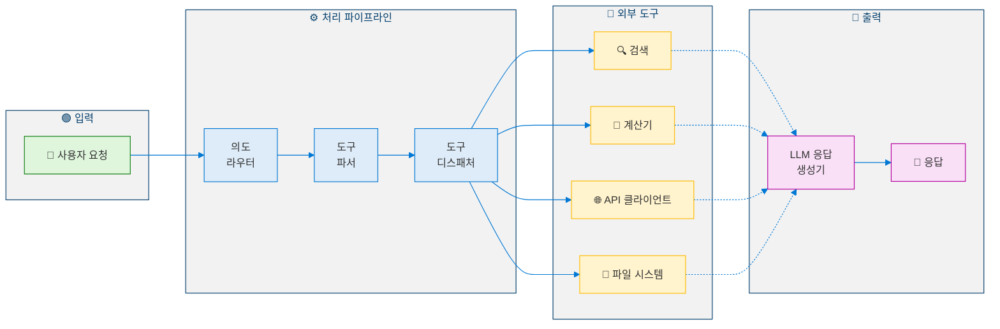
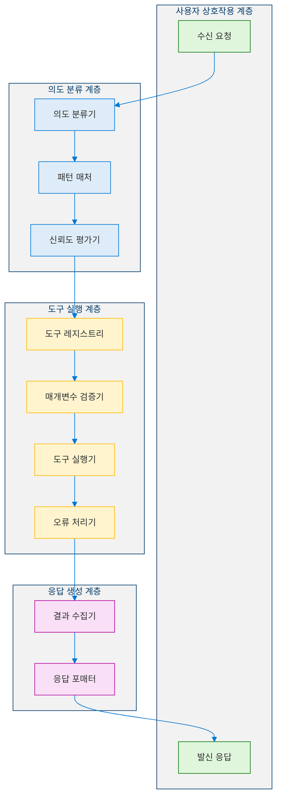
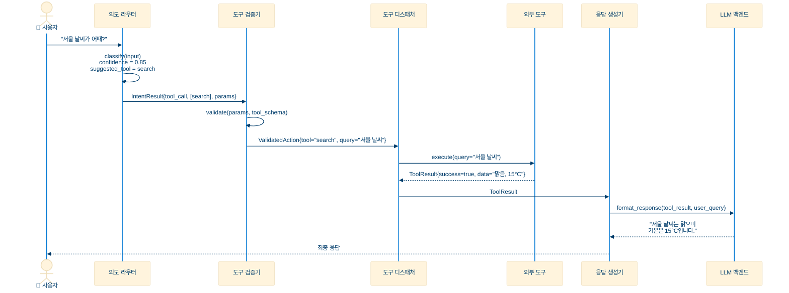
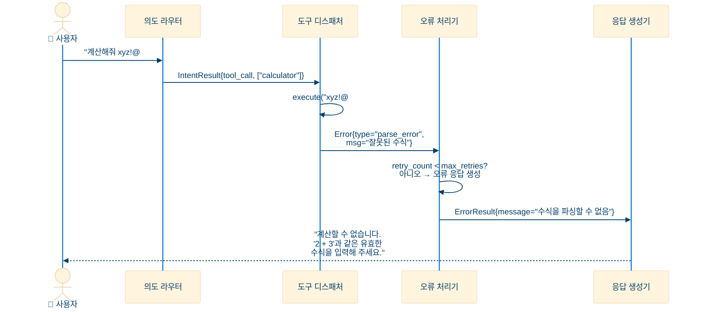
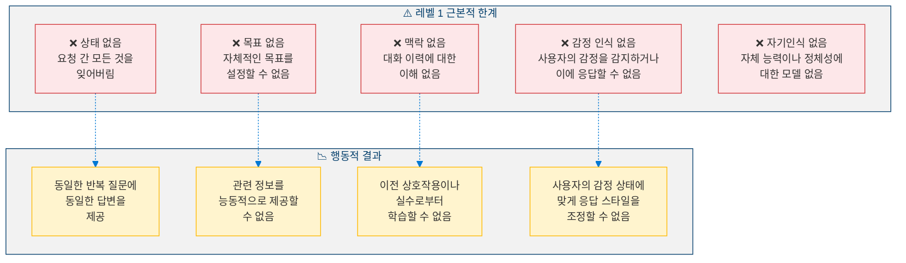
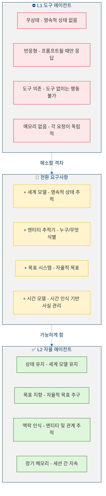
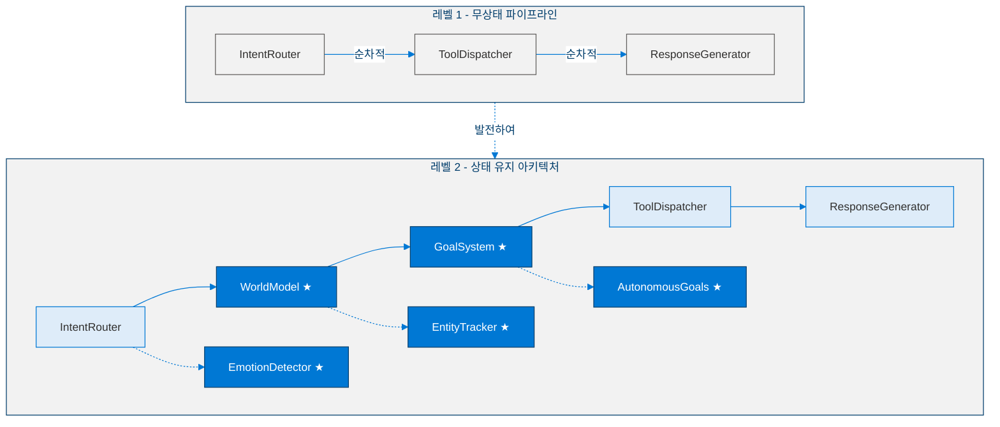

<!--
Copyright (c) 2026 Moon Hyuk Choi
Licensed under the MIT License.
See LICENSE file in the repository root for full license information.

Redistribution (commercial or non-commercial) must retain this notice.
Removal of attribution constitutes a license violation.
-->
# 레벨 1: 도구 에이전트 - 아키텍처 & 설계

> **MSCP 레벨 시리즈** | [개요](../MSCP_Overview.ko.md) ← 레벨 1 → [레벨 2](Level_2_Autonomous_Agent.ko.md)  
> **상태**: 🔬 **실험적** - 개념적 프레임워크 및 실험적 설계. 프로덕션 사양이 아닙니다.  
> **날짜**: 2026년 2월

## Revision History

| Version | Date | Description |
|---------|------|-------------|
| 0.1.0 | 2026-02-23 | Initial document creation with formal Definitions 1-4, Propositions 1-3 |
| 0.2.0 | 2026-02-26 | Added overview essence formula; added revision history table |

---

## 1. 개요

레벨 1은 AI 에이전트의 **기본 인지 아키텍처**를 나타냅니다. 도구 에이전트는 사용자 요청을 받아 외부 도구를 호출하고 결과를 반환하는 **무상태 반응형 시스템**입니다. 자체적인 내부 모델이 없으며, 세션 간 메모리도 없고, 자율적인 목표 설정 능력도 없습니다.

> **Level Essence.** 레벨 1 에이전트는 무상태 파이프라인 - 피드백, 상태 유지, 메모리 없이 입력에서 출력까지 4단계 순차 처리:
>
> $$\mathcal{A}_1(r) = \rho\bigl(\tau\bigl(\sigma(\phi(r),\, r)\bigr),\, r\bigr)$$

> ⚠️ **참고**: 이 문서는 MSCP 분류 체계 내의 인지 수준을 설명합니다. 여기에 포함된 아키텍처, 의사코드, 다이어그램은 구조적 개념을 탐구하는 실험적 설계이며, 프로덕션 수준의 구현이 아닙니다.

**오늘날 대부분의 프로덕션 AI 에이전트는 레벨 1에서 작동합니다.** LangChain 에이전트, Semantic Kernel 플러그인 체인, OpenAI Assistants, 그리고 커스텀 RAG 파이프라인 등이 이에 해당합니다.

### 1.1 정의 속성

| 속성 | 값 |
|------|-----|
| 내부 상태 | **없음** (요청 간 무상태) |
| 목표 설정 | **없음** (사용자 지시에 의해서만) |
| 자기인식 | **없음** |
| 메모리 | 최대 세션 범위 |
| 자율성 | **없음** - 순수 반응형 |

### 1.2 형식적 정의

> **정의 1 (레벨 1 에이전트).** 레벨 1 에이전트는 도구 호출을 통해 사용자 요청을 응답으로 매핑하는 무상태 함수 $\mathcal{A}_1$입니다:
>
> $$\mathcal{A}_1 : \mathcal{R} \to \mathcal{O}$$
>
> 여기서 $\mathcal{R}$은 모든 가능한 사용자 요청의 공간을, $\mathcal{O}$는 모든 가능한 출력 응답의 공간을 나타냅니다.

에이전트는 내부 상태를 유지하지 않으므로 매핑은 **무기억(memoryless)**입니다 - 즉, 출력은 현재 입력에만 의존하며 이전의 모든 상호작용과 독립적입니다. 형식적으로:

$$\mathcal{A}_1(r_t) = o_t \quad \forall\, t, \quad o_t \perp \{r_1, \ldots, r_{t-1}\}$$

여기서 $r_t \in \mathcal{R}$은 시간 단계 $t$에서의 요청이고 $o_t \in \mathcal{O}$는 대응하는 출력입니다.

> **정의 2 (도구 집합).** $\mathcal{T} = \{T_1, T_2, \ldots, T_n\}$를 $n$개의 사용 가능한 도구의 유한 집합이라 하자. 각 도구는 부분 함수입니다:
>
> $$T_k : \mathcal{P}_k \rightharpoonup \mathcal{D}_k$$
>
> 매개변수 공간 $\mathcal{P}_k$와 출력 도메인 $\mathcal{D}_k$를 가집니다. 유효하지 않은 매개변수는 결과를 생성하지 않을 수 있으므로(즉, 오류) 이 함수는 부분적입니다.

> **정의 3 (의도 분류).** 의도 분류기는 요청을 도구 선택에 대한 확률 분포로 매핑하는 함수 $\phi$입니다:
>
> $$\phi : \mathcal{R} \to [0,1]^{|\mathcal{T}|+1}$$
>
> 여기서 추가 차원은 "도구 불필요" (직접 응답) 범주를 나타냅니다. 결정 규칙은 최대 신뢰도를 가진 도구를 선택합니다:
>
> $$T^* = \arg\max_{k} \; \phi(r)_k \quad \text{subject to} \quad \phi(r)_k \geq \theta_{min}$$
>
> 여기서 $\theta_{min}$은 최소 신뢰도 임계값입니다 (일반적으로 $\theta_{min} = 0.5$).

### 1.3 처리 파이프라인

완전한 레벨 1 처리 파이프라인은 네 개의 순차적 단계로 분해할 수 있습니다:

$$\mathcal{A}_1(r) = \rho\bigl(\tau\bigl(\sigma(\phi(r), r)\bigr), r\bigr)$$

여기서:

| 기호 | 이름 | 타입 시그니처 |
|------|------|--------------|
| $\phi$ | 의도 분류기 | $\mathcal{R} \to [0,1]^{\lvert\mathcal{T}\rvert+1}$ |
| $\sigma$ | 매개변수 추출기 | $[0,1]^{\lvert\mathcal{T}\rvert+1} \times \mathcal{R} \to \mathcal{P}\_{T^{\ast}}$ |
| $\tau$ | 도구 디스패처 | $\mathcal{P}\_{T^{\ast}} \to \mathcal{D}\_{T^{\ast}} \cup \lbrace\textit{err}\rbrace$ |
| $\rho$ | 응답 생성기 | $(\mathcal{D}\_{T^{\ast}} \cup \lbrace\textit{err}\rbrace) \times \mathcal{R} \to \mathcal{O}$ |

파이프라인은 **엄격히 순차적**입니다 - 피드백 루프, 상태 지속, 분류 이후의 분기 결정이 없습니다.

---

## 2. 아키텍처

### 2.1 고수준 아키텍처

<!-- 레벨 1 고수준 아키텍처 -->



### 2.2 상세 컴포넌트 아키텍처

<!-- 레벨 1 상세 컴포넌트 아키텍처 -->



---

## 3. 데이터 흐름

### 3.1 요청 처리 시퀀스



### 3.2 오류 처리 시퀀스



---

## 4. 의사코드

### 4.1 핵심 에이전트 루프

```python
def level1_agent_loop(user_input: str) -> str:
    """
    Level 1 core agent loop.
    Input:  user_input - user request string
    Output: response string
    """

    # Step 1: Intent Classification
    intent = IntentRouter.classify(user_input)

    if intent.type == IntentType.UNSUPPORTED:
        return "I'm unable to help with that request."

    # Step 2: Direct response (no tool needed)
    if intent.type == IntentType.DIRECT_RESPONSE:
        return LLM.generate(user_input)

    # Step 3: Tool Execution
    results = []
    for tool_name in intent.suggested_tools:
        params = ParameterExtractor.extract(user_input, tool_name)

        if not ToolRegistry.has(tool_name):
            results.append(Error(f"Unknown tool: {tool_name}"))
            continue

        tool = ToolRegistry.get(tool_name)
        result = tool.execute(params)
        results.append(result)

    # Step 4: Response Generation
    response = ResponseGenerator.format(user_input, results)
    return response
```

### 4.2 의도 라우터

```python
def classify(self, user_input: str) -> IntentResult:
    """
    Classify user input into an intent.
    Input:  user_input - user request string
    Output: IntentResult with type, confidence, suggested_tools, params
    """

    input_lower = user_input.lower()

    # Pattern matching against tool registry
    matched_tools = []
    for tool_name, patterns in TOOL_PATTERNS.items():
        if any(pattern in input_lower for pattern in patterns):
            matched_tools.append(tool_name)

    if matched_tools:
        return IntentResult(
            type=IntentType.TOOL_CALL,
            confidence=0.8,
            suggested_tools=matched_tools,
            params=extract_parameters(user_input),
        )

    return IntentResult(
        type=IntentType.DIRECT_RESPONSE,
        confidence=0.6,
        suggested_tools=[],
        params={},
    )
```

### 4.3 도구 디스패처

```python
def dispatch(self, tool_name: str, params: dict) -> ToolResult:
    """
    Dispatch a tool call with validation and error handling.
    Input:  tool_name - registered tool name, params - parameter dict
    Output: ToolResult with success, data, error, execution_time_ms
    """

    if tool_name not in self.registry:
        return ToolResult(success=False, error="Unknown tool")

    tool = self.registry[tool_name]
    start_time = time.monotonic()

    try:
        # Validate parameters against tool schema
        validated_params = tool.schema.validate(params)

        # Execute with timeout
        result = tool.execute(validated_params, timeout=30)

        return ToolResult(
            success=True,
            data=result,
            execution_time=time.monotonic() - start_time,
        )

    except TimeoutError:
        return ToolResult(success=False, error="Tool execution timed out")

    except ValidationError as e:
        return ToolResult(success=False, error=f"Invalid params: {e}")

    except Exception as e:
        return ToolResult(success=False, error=f"Execution failed: {e}")
```

---

## 5. 구조적 한계

레벨 1에는 레벨 2로의 전환을 동기부여하는 근본적인 한계가 있습니다. 이러한 한계는 형식적으로 특성화할 수 있습니다.

### 5.1 한계의 형식적 특성화

> **명제 1 (영 상호정보량).** 레벨 1 에이전트에서 연속된 두 응답 사이의 상호정보량은 영(zero)입니다:
>
> $$I(o_t ; o_{t-1}) = 0$$
>
> 이는 정의 1의 무기억 속성에서 직접 도출됩니다 - 각 요청-응답 쌍은 다른 모든 것과 조건부 독립입니다.

> **명제 2 (목표 상태의 부재).** 레벨 1 에이전트에는 내부 목표 공간 $\mathcal{G}$가 없습니다. 에이전트는 목표를 추구한 결과가 아니라 입력의 결정론적 함수로서만 출력을 생성합니다:
>
> $$\nexists\; g \in \mathcal{G} : o_t = \pi(r_t, g)$$
>
> 여기서 $\pi$는 목표 만족도를 최대화하기 위해 행동을 선택하는 정책 함수입니다.

> **명제 3 (자기 모델의 부재).** 레벨 1 에이전트에는 자신의 상태, 능력 또는 정체성에 대한 표현 $M$이 없습니다:
>
> $$M_{\text{self}} = \emptyset$$
>
> 따라서 에이전트는 자신의 행동이 자신에게 미치는 영향을 예측할 수 없습니다 - 이는 자기조절(레벨 3+)의 전제 조건입니다.

### 5.2 한계 분류 체계

<!-- 레벨 1 구조적 한계 -->



### 5.1 행동 예시: 반복 질문

```
상호작용 1:
    사용자: "제품 X의 사양은 무엇인가요?"
    에이전트: [도구 호출] → "사양은 A, B, C입니다."

상호작용 2 (5분 후):
    사용자: "제품 X의 사양은 무엇인가요?"
    에이전트: [도구 호출] → "사양은 A, B, C입니다."    ← 동일한 응답

상호작용 3 (5분 후):
    사용자: "제품 X의 사양은 무엇인가요?"
    에이전트: [도구 호출] → "사양은 A, B, C입니다."    ← 동일한 응답

    ❌ 레벨 1은 반복을 감지할 수 없습니다.
    ❌ 레벨 1은 "추가 설명이 필요하신가요?"라고 물을 수 없습니다.
    ❌ 레벨 1은 이미 답변했다는 것을 기억할 수 없습니다.
```

---

## 6. 레벨 2로의 전환

레벨 1에서 레벨 2로의 전환은 레벨 1 아키텍처에 구조적으로 부재한 내부 상태와 자율적 능력을 도입해야 합니다.

> **정의 4 (레벨 1 → 레벨 2 전환).** 에이전트 $\mathcal{A}_1$은 다음의 구조적 확장을 획득할 때 $\mathcal{A}_2$로 승격될 수 있습니다:
>
> $$\mathcal{A}_1 \xrightarrow{\Delta_{1 \to 2}} \mathcal{A}_2 \iff \mathcal{A}_2 = \mathcal{A}_1 \oplus \{\mathcal{W}, \mathcal{E}, \mathcal{G}, \Gamma\}$$
>
> 여기서:
> - $\mathcal{W}$ : 영속적 세계 모델 (요청 간에도 유지되는 내부 상태)
> - $\mathcal{E}$ : 엔티티 추적기 (세션 간 엔티티 상태 관리)
> - $\mathcal{G}$ : 목표 시스템 (자율적 목표 생성)
> - $\Gamma$ : 시간 모델 (시간 인식 기반 사실 관리)

근본적인 변화는 순수 함수에서 **상태를 가진 프로세스**로의 전환입니다:

$$\mathcal{A}_1 : \mathcal{R} \to \mathcal{O} \quad \longrightarrow \quad \mathcal{A}_2 : \mathcal{R} \times \mathcal{S} \times \mathcal{G} \to \mathcal{O} \times \mathcal{S}' \times \mathcal{G}'$$

여기서 $\mathcal{S}$는 세계 상태를, $\mathcal{S}'$, $\mathcal{G}'$는 처리 후 업데이트된 상태와 목표를 나타냅니다.

### 6.1 필수 능력

<!-- 레벨 1에서 레벨 2로의 전환 -->



### 6.2 아키텍처 델타



---

## 참고 문헌

1. Yao, S., et al. "ReAct: Synergizing Reasoning and Acting in Language Models." *ICLR 2023*. [arXiv:2210.03629](https://arxiv.org/abs/2210.03629)
2. Schick, T., et al. "Toolformer: Language Models Can Teach Themselves to Use Tools." *NeurIPS 2023*. [arXiv:2302.04761](https://arxiv.org/abs/2302.04761)
3. Patil, S.G., et al. "Gorilla: Large Language Model Connected with Massive APIs." *arXiv 2023*. [arXiv:2305.15334](https://arxiv.org/abs/2305.15334)
4. Shen, Y., et al. "HuggingGPT: Solving AI Tasks with ChatGPT and its Friends in Hugging Face." *NeurIPS 2023*. [arXiv:2303.17580](https://arxiv.org/abs/2303.17580)
5. Liang, Y., et al. "TaskMatrix.AI: Completing Tasks by Connecting Foundation Models with Millions of APIs." *arXiv 2023*. [arXiv:2303.16434](https://arxiv.org/abs/2303.16434)
6. Qin, Y., et al. "Tool Learning with Foundation Models." *arXiv 2023*. [arXiv:2304.08354](https://arxiv.org/abs/2304.08354)
7. Wang, L., et al. "A Survey on Large Language Model based Autonomous Agents." *arXiv 2023*. [arXiv:2308.11432](https://arxiv.org/abs/2308.11432)
8. Wei, J., et al. "Chain-of-Thought Prompting Elicits Reasoning in Large Language Models." *NeurIPS 2022*. [arXiv:2201.11903](https://arxiv.org/abs/2201.11903)

---

> **다음**: [레벨 2: 자율 에이전트 →](Level_2_Autonomous_Agent.ko.md)
