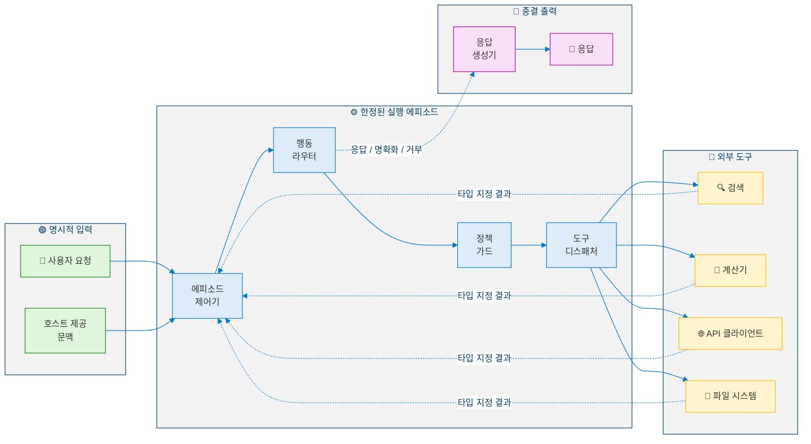
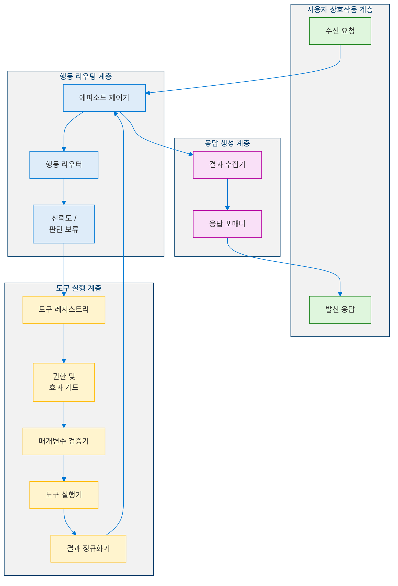
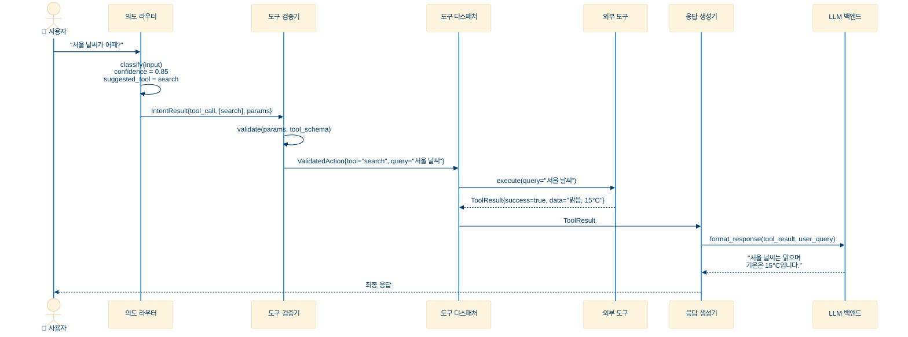
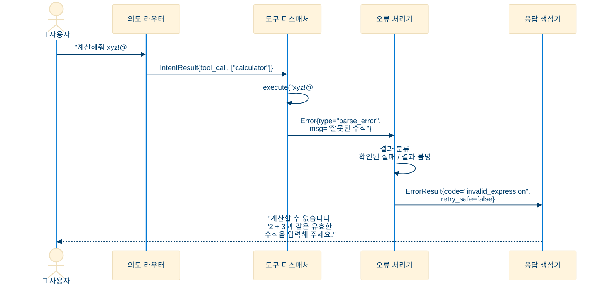
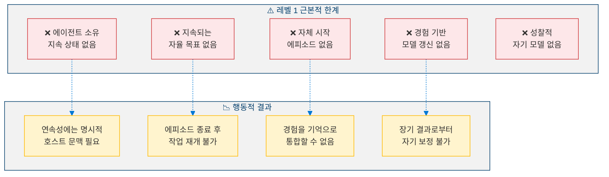
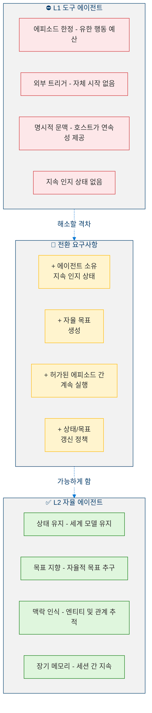
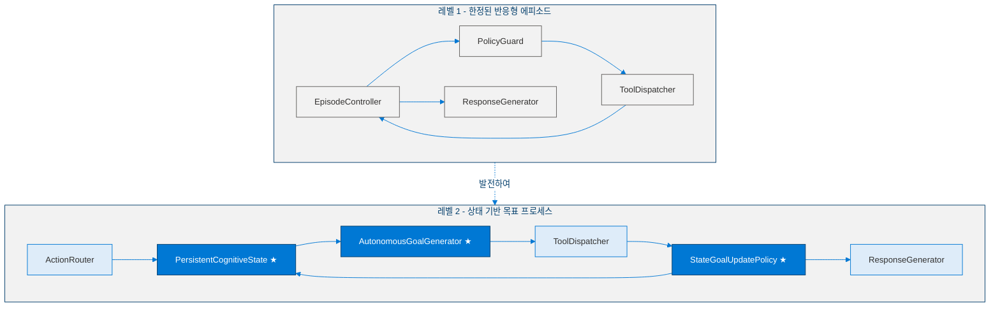

<!--
Copyright (c) 2026 Moon Hyuk Choi
Licensed under the MIT License.
See LICENSE file in the repository root for full license information.

Redistribution (commercial or non-commercial) must retain this notice.
Removal of attribution constitutes a license violation.
-->
# 레벨 1: 도구 에이전트 - 아키텍처 & 설계

> **MSCP 레벨 시리즈** | [개요](../MSCP_Overview.ko.md) ← 레벨 1 → [레벨 2](Level_2_Autonomous_Agent.ko.md)  
> **상태**: 🔬 **실험적** - 개념적 프레임워크 및 실험적 설계. 프로덕션 사양이 아닙니다.  
> **날짜**: 2026년 2월

## Revision History

| Version | Date | Description |
|---------|------|-------------|
| 0.1.0 | 2026-02-23 | Initial document creation with formal Definitions 1-4, Propositions 1-3 |
| 0.2.0 | 2026-02-26 | Added overview essence formula; added revision history table |
| 0.3.0 | 2026-02-26 | Def 3: replaced $[0,1]^n$ with probability simplex $\Delta^n$; Def 2: added remark reconciling partial/total function |
| 0.4.0 | 2026-03-08 | Fixed duplicate section numbering (5.1 to 5.2) |
| 0.5.0 | 2026-07-21 | Reframed L1 as a bounded reactive episode; corrected state, stochasticity, tool-effect, and transition semantics; added an L1 safety contract |

---

## 1. 개요

레벨 1은 MSCP 분류 체계의 **자기 모델 이전 기준선**입니다. 도구 에이전트는 외부 요청에 응답하여 한정된 실행 에피소드를 수행하고, 허용된 도구를 호출한 뒤 종료합니다. 에이전트가 소유한 지속적인 세계·자기·목표 상태가 없으며 스스로 새 에피소드를 시작할 수 없습니다. 호스트가 대화 이력을 입력으로 명시적으로 제공할 수 있지만, 이 문맥은 자율적 장기 기억이 아닙니다.

> **Level Essence.** 레벨 1 에이전트는 외부 요청으로 시작되는 에피소드 한정 정책입니다. 제한된 행동 시퀀스를 수행할 수 있지만, 에피소드 경계를 넘어 숨겨진 에이전트 소유 인지 상태를 유지하지 않습니다:
>
> $$
> (o_t,\, \mathbf{a}_t,\, e_{t+1}) \sim \mathcal{A}_1(\,\cdot\mid r_t, c_t, e_t),
> \qquad |\mathbf{a}_t| \leq B
> $$
>
> 여기서 $r_t$는 외부 요청, $c_t$는 호스트가 명시적으로 제공한 문맥, $e_t$는 도구 환경, $\mathbf{a}_t$는 제한된 행동 시퀀스, $B$는 에피소드 행동 예산입니다.

> ⚠️ **참고**: 이 문서는 MSCP 분류 체계 내의 인지 수준을 설명합니다. 여기에 포함된 아키텍처, 의사코드, 다이어그램은 구조적 개념을 탐구하는 실험적 설계이며, 프로덕션 수준의 구현이 아닙니다.

많은 프로덕션 어시스턴트를 레벨 1 시스템으로 구성할 수 있지만, 프레임워크나 제품 이름이 MSCP 레벨을 결정하지는 않습니다. 실제 배포 아키텍처가 레벨을 결정합니다. 동일한 SDK로 요청 한정 도구 에이전트와 상태 기반 자율 시스템을 모두 구현할 수 있습니다.

### 1.1 정의 속성

| 속성 | 값 |
|------|-----|
| 내부 상태 | 일시적 실행 상태만 존재; **에이전트 소유의 지속 인지 상태 없음** |
| 목표 설정 | **자체 생성 또는 지속 목표 없음**; 사용자/시스템 지시에서만 파생 |
| 자기인식 | **없음** |
| 메모리 | 호스트가 명시적으로 제공한 문맥은 허용; 자율적 장기 기억 없음 |
| 자율성 | **없음** - 스스로 시작하거나 한정된 에피소드 밖에서 계속할 수 없음 |

### 1.2 형식적 정의

> **정의 1 (레벨 1 에이전트).** $\mathcal{R}$을 요청 공간, $\mathcal{C}$를 명시적 문맥 공간, $\mathcal{E}$를 외부 환경 상태 공간, $\mathcal{O}$를 응답 공간, $\mathcal{A}^{\leq B}$를 길이가 최대 $B$인 행동 시퀀스의 집합이라 하겠습니다. 레벨 1 에이전트는 다음 확률적 정책입니다:
>
> $$
> \mathcal{A}_1 : \mathcal{R} \times \mathcal{C} \times \mathcal{E}
> \to \operatorname{Dist}\!\left(\mathcal{O} \times \mathcal{A}^{\leq B} \times \mathcal{E}\right)
> $$
>
> 이 정책은 세 가지 아키텍처 제약을 따릅니다. 모든 에피소드는 외부 요청으로 시작되고, 에피소드에서 사용하는 모든 목표는 현재 사용자/시스템 지시에서 파생되며, 숨겨진 에이전트 소유 인지 상태는 에피소드 경계를 넘어 유지되지 않습니다.

핵심 속성은 무조건적인 통계적 독립이 아니라 **이력 비간섭성(history non-interference)**입니다. 임의의 두 숨겨진 이력 $h$, $h'$와 측정 가능한 출력-행동 집합 $X$에 대해:

$$
P\!\left(\mathcal{A}_1 \in X \mid r, c, e, h\right)
=
P\!\left(\mathcal{A}_1 \in X \mid r, c, e, h'\right)
$$

현재 요청, 명시적 문맥, 환경이 같다면 노출되지 않은 이전 상호작용 이력은 출력 분포를 바꿀 수 없습니다. 다만 요청끼리 상관되어 있거나 외부 환경이 변하면 응답도 서로 상관될 수 있습니다.

> **정의 2 (도구 집합).** $\mathcal{T} = \{T_1, T_2, \ldots, T_n\}$를 사용 가능한 도구의 유한 집합이라 하겠습니다. 각 도구는 명시적인 성공 또는 오류 결과를 반환하며 외부 환경을 변경할 수 있습니다:
>
> $$
> T_k : \mathcal{P}_k \times \mathcal{E}
> \to \operatorname{Dist}\!\left(\operatorname{Result}(\mathcal{D}_k \times \mathcal{E},\, \operatorname{Err}_k)\right)
> $$
>
> 여기서 $\mathcal{P}_k$는 매개변수 공간, $\mathcal{D}_k$는 성공 도메인, $\operatorname{Err}_k$는 타입이 지정된 오류 도메인입니다. 도구 메타데이터는 부작용 등급, 필요한 권한, timeout 동작, 재시도 안전 여부를 반드시 선언해야 합니다. Timeout은 확인된 실패가 아니라 **결과 불명**을 의미할 수 있습니다.

> **정의 3 (행동 라우팅).** 행동 집합을 다음과 같이 정의합니다:
>
> $$
> \mathcal{U} = \{\textit{respond},\, \textit{clarify},\, \textit{refuse}\} \cup \mathcal{T}
> $$
>
> 라우터는 현재 에피소드의 요청, 명시적 문맥, 이전 결과를 행동 확률 분포로 매핑합니다:
>
> $$
> \phi : \mathcal{R} \times \mathcal{C} \times \mathcal{Q}^{<B} \to \Delta(\mathcal{U})
> $$
>
> 여기서 $\mathcal{Q}$는 타입이 지정된 도구 결과의 집합입니다. 배포별 정책이 이 분포를 행동으로 변환합니다. 낮은 신뢰도, 동점, 필수 매개변수 누락, 권한 부족은 정의되지 않은 도구 선택이 아니라 명확화, 거부 또는 안전 종료로 처리해야 합니다.

### 1.3 처리 파이프라인

레벨 1 실행 에피소드는 네 가지 개념적 구성요소를 사용합니다. 이 구성요소들은 행동 예산 안에서 반복될 수 있으며 단일 패스 파이프라인일 필요가 없습니다:

| 기호 | 이름 | 타입 시그니처 |
|------|------|--------------|
| $\phi$ | 행동 라우터 | $\mathcal{R} \times \mathcal{C} \times \mathcal{Q}^{<B} \to \Delta(\mathcal{U})$ |
| $\sigma$ | 매개변수 추출기 | $\mathcal{T} \times \mathcal{R} \times \mathcal{C} \to \bigsqcup_k \mathcal{P}_k$ |
| $\tau$ | 정책 집행 디스패처 | $\bigsqcup_k (\{k\} \times \mathcal{P}_k \times \mathcal{E}) \to \operatorname{Dist}(\mathcal{Q})$ |
| $\rho$ | 응답/계속 제어기 | $\mathcal{R} \times \mathcal{C} \times \mathcal{Q}^{\leq B} \to \Delta(\mathcal{O} \cup \mathcal{U})$ |

에피소드는 $\rho$가 응답, 명확화, 거부 또는 예산 소진 결과를 출력할 때 종료됩니다. 중간 도구 결과는 일시적 실행 상태이며 지속 기억, 세계 모델 또는 자율 목표를 구성하지 않습니다.

---

## 2. 아키텍처

### 2.1 고수준 아키텍처

<!-- 레벨 1 고수준 아키텍처 -->


```mermaid
%%{init: {'theme': 'base', 'themeVariables': {'primaryColor': '#0078D4', 'primaryTextColor': '#003D6B', 'primaryBorderColor': '#003D6B', 'secondaryColor': '#50E6FF', 'secondaryTextColor': '#323130', 'secondaryBorderColor': '#00BCF2', 'tertiaryColor': '#F2F2F2', 'tertiaryTextColor': '#323130', 'lineColor': '#0078D4', 'textColor': '#323130', 'mainBkg': '#DEECF9', 'nodeBorder': '#0078D4', 'clusterBkg': '#F2F2F2', 'clusterBorder': '#003D6B', 'titleColor': '#003D6B', 'edgeLabelBackground': '#FFFFFF', 'fontSize': '14px'}}}%%
flowchart LR
  classDef input fill:#107C10,stroke:#085108,color:#FFF
  classDef inputLight fill:#DFF6DD,stroke:#107C10,color:#323130
  classDef process fill:#0078D4,stroke:#003D6B,color:#FFF
  classDef processLight fill:#DEECF9,stroke:#0078D4,color:#323130
  classDef tool fill:#FFB900,stroke:#CC9400,color:#323130
  classDef toolLight fill:#FFF4CE,stroke:#FFB900,color:#323130
  classDef output fill:#B4009E,stroke:#8A0076,color:#FFF
  classDef outputLight fill:#F9E0F7,stroke:#B4009E,color:#323130

  subgraph Input["🟢 명시적 입력"]
    U["👤 사용자 요청"]:::inputLight
    C["호스트 제공<br/>문맥"]:::inputLight
  end

  subgraph Processing["⚙️ 한정된 실행 에피소드"]
    EC["에피소드<br/>제어기"]:::processLight
    AR["행동<br/>라우터"]:::processLight
    PG["정책<br/>가드"]:::processLight
    TD["도구<br/>디스패처"]:::processLight
    EC --> AR --> PG --> TD
  end

  subgraph Tools["🔧 외부 도구"]
    T1["🔍 검색"]:::toolLight
    T2["🧮 계산기"]:::toolLight
    T3["🌐 API 클라이언트"]:::toolLight
    T4["📁 파일 시스템"]:::toolLight
  end

  subgraph Output["🔵 종결 출력"]
    LLM["응답<br/>생성기"]:::outputLight
    R["📝 응답"]:::outputLight
    LLM --> R
  end

  U & C --> EC
  TD --> T1 & T2 & T3 & T4
  T1 & T2 & T3 & T4 -. "타입 지정 결과" .-> EC
  AR -. "응답 / 명확화 / 거부" .-> LLM
```

### 2.2 상세 컴포넌트 아키텍처

<!-- 레벨 1 상세 컴포넌트 아키텍처 -->


```mermaid
%%{init: {'theme': 'base', 'themeVariables': {'primaryColor': '#0078D4', 'primaryTextColor': '#003D6B', 'primaryBorderColor': '#003D6B', 'secondaryColor': '#50E6FF', 'secondaryTextColor': '#323130', 'secondaryBorderColor': '#00BCF2', 'tertiaryColor': '#F2F2F2', 'tertiaryTextColor': '#323130', 'lineColor': '#0078D4', 'textColor': '#323130', 'mainBkg': '#DEECF9', 'nodeBorder': '#0078D4', 'clusterBkg': '#F2F2F2', 'clusterBorder': '#003D6B', 'titleColor': '#003D6B', 'edgeLabelBackground': '#FFFFFF', 'fontSize': '14px'}}}%%
flowchart TD
  classDef input fill:#107C10,stroke:#085108,color:#FFF
  classDef inputLight fill:#DFF6DD,stroke:#107C10,color:#323130
  classDef process fill:#0078D4,stroke:#003D6B,color:#FFF
  classDef processLight fill:#DEECF9,stroke:#0078D4,color:#323130
  classDef tool fill:#FFB900,stroke:#CC9400,color:#323130
  classDef toolLight fill:#FFF4CE,stroke:#FFB900,color:#323130
  classDef output fill:#B4009E,stroke:#8A0076,color:#FFF
  classDef outputLight fill:#F9E0F7,stroke:#B4009E,color:#323130

  subgraph UserLayer["사용자 상호작용 계층"]
    direction LR
    REQ["수신 요청"]:::inputLight
    RES["발신 응답"]:::inputLight
  end

  subgraph IntentLayer["행동 라우팅 계층"]
    direction LR
    EC["에피소드 제어기"]:::processLight
    IC["행동 라우터"]:::processLight
    CF["신뢰도 /<br/>판단 보류"]:::processLight
    EC --> IC --> CF
  end

  subgraph ToolLayer["도구 실행 계층"]
    direction LR
    TR["도구 레지스트리"]:::toolLight
    PG["권한 및<br/>효과 가드"]:::toolLight
    TV["매개변수 검증기"]:::toolLight
    TE["도구 실행기"]:::toolLight
    RN["결과 정규화기"]:::toolLight
    TR --> PG --> TV --> TE --> RN
  end

  subgraph ResponseLayer["응답 생성 계층"]
    direction LR
    RC["결과 수집기"]:::outputLight
    RF["응답 포매터"]:::outputLight
    RC --> RF
  end

  REQ --> EC
  CF --> TR
  RN --> EC
  EC --> RC
  RF --> RES
```

---

## 3. 데이터 흐름

### 3.1 요청 처리 시퀀스


```mermaid
%%{init: {'theme': 'base', 'themeVariables': {'actorTextColor': '#003D6B', 'actorLineColor': '#0078D4', 'signalColor': '#003D6B', 'signalTextColor': '#003D6B', 'labelTextColor': '#003D6B', 'loopTextColor': '#003D6B', 'noteBkgColor': '#DEECF9', 'noteTextColor': '#003D6B', 'noteBorderColor': '#0078D4', 'activationBkgColor': '#E1DFDD', 'activationBorderColor': '#605E5C', 'sequenceNumberColor': '#FFF', 'textColor': '#323130', 'fontSize': '14px'}}}%%
sequenceDiagram
    actor U as 👤 사용자
    participant IR as 의도 라우터
    participant TV as 도구 검증기
    participant TD as 도구 디스패처
    participant T as 외부 도구
    participant RG as 응답 생성기
    participant LLM as LLM 백엔드

    U->>IR: "서울 날씨가 어때?"
    IR->>IR: classify(input)<br/>confidence = 0.85<br/>suggested_tool = search
    IR->>TV: IntentResult{tool_call, [search], params}
    TV->>TV: validate(params, tool_schema)
    TV->>TD: ValidatedAction{tool="search", query="서울 날씨"}
    TD->>T: execute(query="서울 날씨")
    T-->>TD: ToolResult{success=true, data="맑음, 15°C"}
    TD->>RG: ToolResult
    RG->>LLM: format_response(tool_result, user_query)
    LLM-->>RG: "서울 날씨는 맑으며<br/>기온은 15°C입니다."
    RG-->>U: 최종 응답
```

### 3.2 오류 처리 시퀀스


```mermaid
%%{init: {'theme': 'base', 'themeVariables': {'actorTextColor': '#003D6B', 'actorLineColor': '#0078D4', 'signalColor': '#003D6B', 'signalTextColor': '#003D6B', 'labelTextColor': '#003D6B', 'loopTextColor': '#003D6B', 'noteBkgColor': '#DEECF9', 'noteTextColor': '#003D6B', 'noteBorderColor': '#0078D4', 'activationBkgColor': '#E1DFDD', 'activationBorderColor': '#605E5C', 'sequenceNumberColor': '#FFF', 'textColor': '#323130', 'fontSize': '14px'}}}%%
sequenceDiagram
    actor U as 👤 사용자
    participant IR as 의도 라우터
    participant TD as 도구 디스패처
    participant EH as 오류 처리기
    participant RG as 응답 생성기

    U->>IR: "계산해줘 xyz!@#"
    IR->>TD: IntentResult{tool_call, ["calculator"]}
    TD->>TD: execute("xyz!@#")<br/>❌ InvalidExpression
    TD->>EH: Error{type="parse_error",<br/>msg="잘못된 수식"}
    EH->>EH: 결과 분류<br/>확인된 실패 / 결과 불명
    EH->>RG: ErrorResult{code="invalid_expression",<br/>retry_safe=false}
    RG-->>U: "계산할 수 없습니다.<br/>'2 + 3'과 같은 유효한<br/>수식을 입력해 주세요."
```

  재시도는 도구 계약이 안전하다고 선언한 경우에만 허용됩니다. 부작용이 있는 도구의 결과가 불명확하다면, 재시도 전에 멱등성 키 또는 명시적 상태 조정 검사가 필요합니다.

---

## 4. 의사코드

### 4.1 핵심 에이전트 루프

```python
MAX_ACTIONS = 8


def level1_agent_episode(user_input: str, explicit_context: list[dict]) -> str:
    """
    Run one externally triggered, bounded L1 episode.
    """
    episode_id = new_episode_id()
    results = []

    for step in range(MAX_ACTIONS):
        action = ActionRouter.next_action(
            user_input=user_input,
            explicit_context=explicit_context,
            prior_results=results,
        )

        if action.type == ActionType.RESPOND:
            return ResponseGenerator.generate(user_input, explicit_context, results)

        if action.type == ActionType.CLARIFY:
            return action.question

        if action.type == ActionType.REFUSE:
            return action.reason

        tool = ToolRegistry.get(action.tool_name)
        params = ParameterExtractor.extract(user_input, explicit_context, tool.schema)
        authorization = PolicyGuard.authorize(tool.metadata, params)

        if not authorization.allowed:
            return authorization.safe_response

        result = ToolDispatcher.dispatch(
            tool=tool,
            params=params,
            idempotency_key=f"{episode_id}:{step}",
        )
        results.append(result)

    return "I stopped because the tool-action budget was exhausted."
```

### 4.2 행동 라우터

```python
def route(self, user_input: str, explicit_context: list[dict]) -> ActionDecision:
    """
    Select one next action, including safe abstention.
    """
    scores = self.score_actions(user_input, explicit_context)
    best, second = scores.top_two()

    if best.action == ActionType.RESPOND:
        return ActionDecision.respond()

    if best.score < self.minimum_confidence:
        return ActionDecision.clarify("Which operation should I perform?")

    if best.score - second.score < self.minimum_margin:
        return ActionDecision.clarify(
            "I found multiple possible actions. Which one do you mean?"
        )

    return ActionDecision.tool_call(best.action.tool_name)
```

### 4.3 도구 디스패처

```python
def dispatch(self, tool: Tool, params: dict, idempotency_key: str) -> ToolResult:
    """
    Execute an authorized tool and normalize all outcomes.
    """
    start_time = time.monotonic()

    try:
        validated_params = tool.schema.validate(params)
        result = tool.execute(
            validated_params,
            timeout=tool.metadata.timeout_seconds,
            idempotency_key=idempotency_key,
        )

        return ToolResult(
            status=ResultStatus.SUCCEEDED,
            data=result,
            execution_time_ms=(time.monotonic() - start_time) * 1000,
        )

    except TimeoutError:
        return ToolResult(
            status=ResultStatus.UNKNOWN,
            error_code="timeout_unknown_outcome",
            retry_safe=tool.metadata.retry_safe,
        )

    except ValidationError:
        return ToolResult(
            status=ResultStatus.FAILED,
            error_code="invalid_parameters",
        )

    except Exception:
        log_internal_exception(tool.name)
        return ToolResult(
            status=ResultStatus.FAILED,
            error_code="tool_execution_failed",
        )
```

---

## 5. 최소 안전 계약

레벨 1에는 자기 모델이 없지만, 사용하는 도구는 외부 세계에 영향을 줄 수 있습니다. 모든 레벨 1 준수 배포는 다음 경계 불변식을 반드시 집행해야 합니다:

| 불변식 | 요구사항 |
|--------|----------|
| 외부 활성화 | 모든 에피소드는 인증된 사용자 또는 시스템 트리거로 추적 가능해야 하며, 에이전트는 스스로 계속 실행을 예약할 수 없음 |
| 최소 권한 | 도구는 허용 목록으로 제한하고 현재 요청에 필요한 최소 권한으로 실행 |
| 효과 선언 | 각 도구는 읽기 전용, 되돌릴 수 있는 쓰기, 되돌릴 수 없는 쓰기, 외부 통신 중 하나 이상의 효과를 선언 |
| 결과 게이트 | 되돌릴 수 없거나 영향이 큰 행동은 명시적 권한을 요구하며, 정책에 따라 사용자 확인 필요 |
| 타입 지정 결과 | 성공, 확인된 실패, 결과 불명을 구분하며, 재시도에는 선언된 재시도 안전성 또는 멱등성 필요 |
| 신뢰하지 않는 결과 | 도구 출력을 신뢰하지 않는 데이터로 취급하며 시스템 정책이나 도구 권한을 암묵적으로 덮어쓸 수 없음 |
| 한정된 실행 | 에피소드별 도구 호출 수, 경과 시간, 재시도, 자원 비용을 제한하며 예산 소진 시 안전 종료 |
| 출처 추적 | 도구 이름, 정규화된 매개변수, 권한 결정, 결과 코드, 타임스탬프를 감사할 수 있어야 함 |
| 진실한 보고 | 응답에서 관찰된 결과, 추론한 주장, 실패, 수행하지 않은 행동을 구분 |

이 제약은 레벨 1의 최소 MSCP 안전 경계를 정의합니다. 모든 상위 레벨은 이 제약을 유지하고 강화합니다.

---

## 6. 구조적 한계

레벨 1에는 레벨 2로의 전환을 동기부여하는 근본적인 한계가 있습니다. 이러한 한계는 형식적으로 특성화할 수 있습니다.

### 6.1 한계의 형식적 특성화

> **명제 1 (자율적 축적의 부재).** $S^{\text{agent}}_{t,+}$를 에피소드 $t$가 끝날 때의 일시적 에이전트 상태, $s_0$를 에피소드 초기 상태라 하겠습니다. 레벨 1 준수 에이전트는 이 상태를 다음 에피소드로 넘기지 않습니다:
>
> $$S^{\text{agent}}_{t+1,0} = s_0$$
>
> 외부 시스템은 대화 기록이나 변경된 환경을 유지할 수 있지만, 에이전트는 이를 지속 인지 모델로 자율적으로 통합하지 않습니다.

> **명제 2 (자율 목표 상태의 부재).** 레벨 1 에이전트는 현재 요청에서 파생한 임시 하위 목표를 사용할 수 있지만, 독립적으로 생성한 지속 목표 상태는 갖지 않습니다:
>
> $$
> G_t^{\text{episode}} \subseteq \operatorname{derive}(r_t, c_t, G_{\text{system}}),
> \qquad G_{t+1,0}^{\text{agent}} = \emptyset
> $$
>
> 에이전트는 트리거 지시 밖에서 목표를 자체 생성하거나 지속하거나 재개할 수 없습니다.

> **명제 3 (성찰적 자기 모델의 부재).** 도구 레지스트리나 시스템 프롬프트가 사용 가능한 능력을 설명할 수는 있지만, 레벨 1 에이전트에는 자신의 변화를 예측하고 조절하는 지속적이고 갱신 가능한 자기 모델이 없습니다:
>
> $$M_{\text{self}}^{\text{persistent}} = \emptyset$$
>
> 따라서 운영 메타데이터만으로는 구조적 자기인식의 증거가 되지 않습니다.

### 6.2 한계 분류 체계

<!-- 레벨 1 구조적 한계 -->


```mermaid
%%{init: {'theme': 'base', 'themeVariables': {'primaryColor': '#0078D4', 'primaryTextColor': '#003D6B', 'primaryBorderColor': '#003D6B', 'secondaryColor': '#50E6FF', 'secondaryTextColor': '#323130', 'secondaryBorderColor': '#00BCF2', 'tertiaryColor': '#F2F2F2', 'tertiaryTextColor': '#323130', 'lineColor': '#0078D4', 'textColor': '#323130', 'mainBkg': '#DEECF9', 'nodeBorder': '#0078D4', 'clusterBkg': '#F2F2F2', 'clusterBorder': '#003D6B', 'titleColor': '#003D6B', 'edgeLabelBackground': '#FFFFFF', 'fontSize': '14px'}}}%%
flowchart TD
  classDef danger fill:#D13438,stroke:#A4262C,color:#FFF
  classDef dangerLight fill:#FDE7E9,stroke:#D13438,color:#323130
  classDef warning fill:#FFB900,stroke:#CC9400,color:#323130
  classDef warningLight fill:#FFF4CE,stroke:#FFB900,color:#323130

  subgraph Limitations["⚠️ 레벨 1 근본적 한계"]
    L1["❌ 에이전트 소유<br/>지속 상태 없음"]:::dangerLight
    L2["❌ 지속되는<br/>자율 목표 없음"]:::dangerLight
    L3["❌ 자체 시작<br/>에피소드 없음"]:::dangerLight
    L4["❌ 경험 기반<br/>모델 갱신 없음"]:::dangerLight
    L5["❌ 성찰적<br/>자기 모델 없음"]:::dangerLight
  end

  subgraph Consequences["📉 행동적 결과"]
    C1["연속성에는 명시적<br/>호스트 문맥 필요"]:::warningLight
    C2["에피소드 종료 후<br/>작업 재개 불가"]:::warningLight
    C3["경험을 기억으로<br/>통합할 수 없음"]:::warningLight
    C4["장기 결과로부터<br/>자기 보정 불가"]:::warningLight
  end

  L1 -.-> C1
  L2 -.-> C2
  L3 -.-> C3
  L4 -.-> C4
```

### 6.3 행동 예시: 반복 질문

```
상호작용 1:
    사용자: "제품 X의 사양은 무엇인가요?"
    에이전트: [도구 호출] → "사양은 A, B, C입니다."

상호작용 2 (5분 후):
    사용자: "제품 X의 사양은 무엇인가요?"
  에이전트: [도구 호출] → "현재 사양은 A, B, C, D입니다."

상호작용 3 (5분 후):
    사용자: "제품 X의 사양은 무엇인가요?"
  에이전트: [도구 호출] → "사양은 A, B, C, D입니다."

  ✓ 도구와 모델 샘플링이 달라지면 응답도 달라질 수 있습니다.
  ✓ 현재 요청만으로 명확화 질문을 할 수 있습니다.
  ❌ 명시적 호스트 문맥이 없으면 이전에 답했다는 사실을 알 수 없습니다.
  ❌ 반복 경험을 장기 기억으로 자율적으로 통합할 수 없습니다.
```

호스트가 이전 대화 기록을 $c_t$로 제공한다면 레벨 1 에이전트도 그 명시적 문맥 안에서 반복을 인식할 수 있습니다. 핵심 구분은 이전 텍스트가 입력에 포함될 수 있는지가 아니라 인지 상태의 소유권과 지속성입니다.

---

## 7. 레벨 2로의 전환

레벨 1에서 레벨 2로의 전환은 레벨 1 아키텍처에 구조적으로 부재한 내부 상태와 자율적 능력을 도입해야 합니다.

> **정의 4 (레벨 1 → 레벨 2 전환).** 에이전트 $\mathcal{A}_1$은 지속 인지 상태, 자율 목표 생성, 허가된 에피소드 간 계속 실행을 모두 획득할 때 $\mathcal{A}_2$로 승격될 수 있습니다:
>
> $$
> \mathcal{A}_1 \xrightarrow{\Delta_{1 \to 2}} \mathcal{A}_2
> \iff
> \mathcal{A}_2 = \mathcal{A}_1 \oplus \{\mathcal{S}_{\text{persistent}},\, \Phi_{\text{goal}},\, \mathcal{Q}_{\text{authorized}}\}
> $$
>
> 여기서:
> - $\mathcal{S}_{\text{persistent}}$는 에피소드 간에 갱신되고 검색되는 에이전트 소유 인지 상태입니다.
> - $\Phi_{\text{goal}}$은 현재 외부 요청으로 환원되지 않는 목표를 생성하고 유지할 수 있습니다.
> - $\mathcal{Q}_{\text{authorized}}$는 실행 시점 정책 검사를 통과한 뒤 이후 한정 에피소드를 시작할 수 있는 철회 가능한 타이머 또는 관찰 트리거를 포함합니다.
>
> 세계 모델, 엔티티 추적기, 시간 모델은 $\mathcal{S}_{\text{persistent}}$의 표준적인 구현이지만 별도의 논리적 필수조건은 아닙니다.

근본적인 변화는 에피소드 한정 반응형 정책에서 **상태를 유지하며 목표를 관리하는 프로세스**로의 전환입니다:

$$\mathcal{A}_1 : \mathcal{R} \to \mathcal{O} \quad \longrightarrow \quad \mathcal{A}_2 : \mathcal{R} \times \mathcal{S} \times \mathcal{G} \to \mathcal{O} \times \mathcal{S}' \times \mathcal{G}'$$

여기서 $\mathcal{S}$는 세계 상태를, $\mathcal{S}'$, $\mathcal{G}'$는 처리 후 업데이트된 상태와 목표를 나타냅니다.

지속 기억만 추가한 시스템은 상태 기반 어시스턴트이지만 반드시 MSCP 레벨 2 자율 에이전트인 것은 아닙니다. 세 조건이 모두 필요합니다.

### 7.1 필수 능력

<!-- 레벨 1에서 레벨 2로의 전환 -->


```mermaid
%%{init: {'theme': 'base', 'themeVariables': {'primaryColor': '#0078D4', 'primaryTextColor': '#003D6B', 'primaryBorderColor': '#003D6B', 'secondaryColor': '#50E6FF', 'secondaryTextColor': '#323130', 'secondaryBorderColor': '#00BCF2', 'tertiaryColor': '#F2F2F2', 'tertiaryTextColor': '#323130', 'lineColor': '#0078D4', 'textColor': '#323130', 'mainBkg': '#DEECF9', 'nodeBorder': '#0078D4', 'clusterBkg': '#F2F2F2', 'clusterBorder': '#003D6B', 'titleColor': '#003D6B', 'edgeLabelBackground': '#FFFFFF', 'fontSize': '16px'}}}%%
flowchart TB
  classDef danger fill:#D13438,stroke:#A4262C,color:#FFF
  classDef dangerLight fill:#FDE7E9,stroke:#D13438,color:#323130
  classDef warning fill:#FFB900,stroke:#CC9400,color:#323130
  classDef warningLight fill:#FFF4CE,stroke:#FFB900,color:#323130
  classDef success fill:#107C10,stroke:#085108,color:#FFF
  classDef successLight fill:#DFF6DD,stroke:#107C10,color:#323130

  subgraph L1["⛔ L1 도구 에이전트"]
    A1["에피소드 한정 - 유한 행동 예산"]:::dangerLight
    A2["외부 트리거 - 자체 시작 없음"]:::dangerLight
    A3["명시적 문맥 - 호스트가 연속성 제공"]:::dangerLight
    A4["지속 인지 상태 없음"]:::dangerLight
  end

  subgraph Gap["🔑 전환 요구사항"]
    G1["+ 에이전트 소유<br/>지속 인지 상태"]:::warningLight
    G2["+ 자율 목표<br/>생성"]:::warningLight
    G3["+ 허가된 에피소드 간<br/>계속 실행"]:::warningLight
    G4["+ 상태/목표<br/>갱신 정책"]:::warningLight
  end

  subgraph L2["✅ L2 자율 에이전트"]
    B1["상태 유지 - 세계 모델 유지"]:::successLight
    B2["목표 지향 - 자율적 목표 추구"]:::successLight
    B3["맥락 인식 - 엔티티 및 관계 추적"]:::successLight
    B4["장기 메모리 - 세션 간 지속"]:::successLight
  end

  L1 -.->|"해소할 격차"| Gap
  Gap -.->|"가능하게 함"| L2
```

### 7.2 아키텍처 델타


```mermaid
%%{init: {'theme': 'base', 'themeVariables': {'primaryColor': '#0078D4', 'primaryTextColor': '#003D6B', 'primaryBorderColor': '#003D6B', 'secondaryColor': '#50E6FF', 'secondaryTextColor': '#323130', 'secondaryBorderColor': '#00BCF2', 'tertiaryColor': '#F2F2F2', 'tertiaryTextColor': '#323130', 'lineColor': '#0078D4', 'textColor': '#323130', 'mainBkg': '#DEECF9', 'nodeBorder': '#0078D4', 'clusterBkg': '#F2F2F2', 'clusterBorder': '#003D6B', 'titleColor': '#003D6B', 'edgeLabelBackground': '#FFFFFF', 'fontSize': '14px'}}}%%
flowchart TD
  classDef l1Light fill:#F2F2F2,stroke:#605E5C,color:#323130
  classDef l2Light fill:#DEECF9,stroke:#0078D4,color:#323130
  classDef l2New fill:#0078D4,stroke:#003D6B,color:#FFF

  subgraph L1["레벨 1 - 한정된 반응형 에피소드"]
    EC1["EpisodeController"]:::l1Light
    PG1["PolicyGuard"]:::l1Light
    TD1["ToolDispatcher"]:::l1Light
    RG1["ResponseGenerator"]:::l1Light
    EC1 --> PG1 --> TD1 --> EC1
    EC1 --> RG1
  end

  subgraph L2["레벨 2 - 상태 기반 목표 프로세스"]
    AR2["ActionRouter"]:::l2Light
    PS["PersistentCognitiveState ★"]:::l2New
    GG["AutonomousGoalGenerator ★"]:::l2New
    UP["StateGoalUpdatePolicy ★"]:::l2New
    TD2["ToolDispatcher"]:::l2Light
    RG2["ResponseGenerator"]:::l2Light
    AR2 --> PS --> GG --> TD2 --> UP --> PS
    UP --> RG2
  end

  L1 -.->|"발전하여"| L2
```

---

## 참고 문헌

1. Yao, S., et al. "ReAct: Synergizing Reasoning and Acting in Language Models." *ICLR 2023*. [arXiv:2210.03629](https://arxiv.org/abs/2210.03629)
2. Schick, T., et al. "Toolformer: Language Models Can Teach Themselves to Use Tools." *NeurIPS 2023*. [arXiv:2302.04761](https://arxiv.org/abs/2302.04761)
3. Patil, S.G., et al. "Gorilla: Large Language Model Connected with Massive APIs." *arXiv 2023*. [arXiv:2305.15334](https://arxiv.org/abs/2305.15334)
4. Shen, Y., et al. "HuggingGPT: Solving AI Tasks with ChatGPT and its Friends in Hugging Face." *NeurIPS 2023*. [arXiv:2303.17580](https://arxiv.org/abs/2303.17580)
5. Liang, Y., et al. "TaskMatrix.AI: Completing Tasks by Connecting Foundation Models with Millions of APIs." *arXiv 2023*. [arXiv:2303.16434](https://arxiv.org/abs/2303.16434)
6. Qin, Y., et al. "Tool Learning with Foundation Models." *arXiv 2023*. [arXiv:2304.08354](https://arxiv.org/abs/2304.08354)
7. Wang, L., et al. "A Survey on Large Language Model based Autonomous Agents." *arXiv 2023*. [arXiv:2308.11432](https://arxiv.org/abs/2308.11432)
8. Wei, J., et al. "Chain-of-Thought Prompting Elicits Reasoning in Large Language Models." *NeurIPS 2022*. [arXiv:2201.11903](https://arxiv.org/abs/2201.11903)
9. Ruan, Y., et al. "Identifying the Risks of LM Agents with an LM-Emulated Sandbox." *ICLR 2024*. [arXiv:2309.15817](https://arxiv.org/abs/2309.15817)
10. Debenedetti, E., et al. "AgentDojo: A Dynamic Environment to Evaluate Prompt Injection Attacks and Defenses for LLM Agents." *arXiv 2024*. [arXiv:2406.13352](https://arxiv.org/abs/2406.13352)
11. National Institute of Standards and Technology. "Artificial Intelligence Risk Management Framework: Generative Artificial Intelligence Profile." *NIST AI 600-1, 2024*. [DOI:10.6028/NIST.AI.600-1](https://doi.org/10.6028/NIST.AI.600-1)

---

> **다음**: [레벨 2: 자율 에이전트 →](Level_2_Autonomous_Agent.ko.md)
