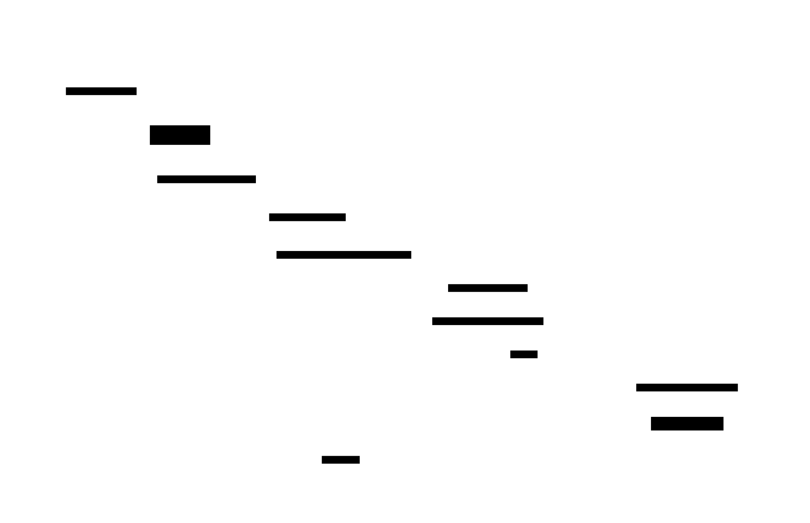

# Level 1: Tool Agent — Architecture & Design

> **MSCP Level Series** | [Overview](../MSCP_Overview.md) ← Level 1 → [Level 2](Level_2_Autonomous_Agent.md)  
> **Status**: 🔬 **Experimental** — Conceptual framework and experimental design. Not a production specification.  
> **Date**: February 2026

---

## 1. Overview

Level 1 represents the **baseline cognitive architecture** for AI agents. A Tool Agent is a **stateless, reactive system** that receives user requests, invokes external tools, and returns results. It has no internal model of itself, no memory across sessions, and no capacity for autonomous goal setting.

> ⚠️ **Note**: This document describes a cognitive level within the MSCP taxonomy. The architectures, pseudocode, and diagrams here are experimental designs exploring structural concepts — not production-ready implementations.

**Most production AI agents today operate at Level 1**, including LangChain agents, Semantic Kernel plugin chains, OpenAI Assistants, and custom RAG pipelines.

### 1.1 Defining Properties

| Property | Value |
|----------|-------|
| Internal State | **None** (stateless between requests) |
| Goal Setting | **None** (user-directed only) |
| Self-Awareness | **None** |
| Memory | Session-scoped at most |
| Autonomy | **None** — purely reactive |

---

## 2. Architecture

### 2.1 High-Level Architecture


### 2.2 Detailed Component Architecture


---

## 3. Data Flow

### 3.1 Request Processing Sequence



### 3.2 Error Handling Sequence


---

## 4. Pseudocode

### 4.1 Core Agent Loop

```python
def level1_agent_loop(user_input: str) -> str:
    """
    Level 1 core agent loop.
    Input:  user_input — user request string
    Output: response string
    """

    # Step 1: Intent Classification
    intent = IntentRouter.classify(user_input)

    if intent.type == IntentType.UNSUPPORTED:
        return "I'm unable to help with that request."

    # Step 2: Direct response (no tool needed)
    if intent.type == IntentType.DIRECT_RESPONSE:
        return LLM.generate(user_input)

    # Step 3: Tool Execution
    results = []
    for tool_name in intent.suggested_tools:
        params = ParameterExtractor.extract(user_input, tool_name)

        if not ToolRegistry.has(tool_name):
            results.append(Error(f"Unknown tool: {tool_name}"))
            continue

        tool = ToolRegistry.get(tool_name)
        result = tool.execute(params)
        results.append(result)

    # Step 4: Response Generation
    response = ResponseGenerator.format(user_input, results)
    return response
```

### 4.2 Intent Router

```python
def classify(self, user_input: str) -> IntentResult:
    """
    Classify user input into an intent.
    Input:  user_input — user request string
    Output: IntentResult with type, confidence, suggested_tools, params
    """

    input_lower = user_input.lower()

    # Pattern matching against tool registry
    matched_tools = []
    for tool_name, patterns in TOOL_PATTERNS.items():
        if any(pattern in input_lower for pattern in patterns):
            matched_tools.append(tool_name)

    if matched_tools:
        return IntentResult(
            type=IntentType.TOOL_CALL,
            confidence=0.8,
            suggested_tools=matched_tools,
            params=extract_parameters(user_input),
        )

    return IntentResult(
        type=IntentType.DIRECT_RESPONSE,
        confidence=0.6,
        suggested_tools=[],
        params={},
    )
```

### 4.3 Tool Dispatcher

```python
def dispatch(self, tool_name: str, params: dict) -> ToolResult:
    """
    Dispatch a tool call with validation and error handling.
    Input:  tool_name — registered tool name, params — parameter dict
    Output: ToolResult with success, data, error, execution_time_ms
    """

    if tool_name not in self.registry:
        return ToolResult(success=False, error="Unknown tool")

    tool = self.registry[tool_name]
    start_time = time.monotonic()

    try:
        # Validate parameters against tool schema
        validated_params = tool.schema.validate(params)

        # Execute with timeout
        result = tool.execute(validated_params, timeout=30)

        return ToolResult(
            success=True,
            data=result,
            execution_time=time.monotonic() - start_time,
        )

    except TimeoutError:
        return ToolResult(success=False, error="Tool execution timed out")

    except ValidationError as e:
        return ToolResult(success=False, error=f"Invalid params: {e}")

    except Exception as e:
        return ToolResult(success=False, error=f"Execution failed: {e}")
```

---

## 5. Structural Limitations

Level 1 has fundamental limitations that motivate the transition to Level 2:


### 5.1 Behavioral Example: Repeated Question

```
Interaction 1:
    User:  "What are the partnership terms for Service X?"
    Agent: [Tool Call] → "The terms are A, B, and C."

Interaction 2 (5 minutes later):
    User:  "What are the partnership terms for Service X?"
    Agent: [Tool Call] → "The terms are A, B, and C."    ← IDENTICAL response

Interaction 3 (5 minutes later):
    User:  "What are the partnership terms for Service X?"
    Agent: [Tool Call] → "The terms are A, B, and C."    ← IDENTICAL response

    ❌ Level 1 cannot detect repetition.
    ❌ Level 1 cannot ask "Do you need clarification?"
    ❌ Level 1 cannot remember it already answered this.
```

---

## 6. Transition to Level 2

### 6.1 Required Capabilities


### 6.2 Architecture Delta

```
Level 1:  IntentRouter → ToolDispatcher → ResponseGenerator
              │                                    │
              └──────── No intermediate layers ─────┘

Level 2:  IntentRouter → WorldModel → GoalSystem → ToolDispatcher → ResponseGenerator
              │              │            │
              ↓              ↓            ↓
          EmotionDet    EntityTracker  AutonomousGoals
```

---

## References

1. Yao, S., et al. "ReAct: Synergizing Reasoning and Acting in Language Models." *ICLR 2023*. [arXiv:2210.03629](https://arxiv.org/abs/2210.03629)
2. Schick, T., et al. "Toolformer: Language Models Can Teach Themselves to Use Tools." *NeurIPS 2023*. [arXiv:2302.04761](https://arxiv.org/abs/2302.04761)
3. Patil, S.G., et al. "Gorilla: Large Language Model Connected with Massive APIs." *arXiv 2023*. [arXiv:2305.15334](https://arxiv.org/abs/2305.15334)
4. Shen, Y., et al. "HuggingGPT: Solving AI Tasks with ChatGPT and its Friends in Hugging Face." *NeurIPS 2023*. [arXiv:2303.17580](https://arxiv.org/abs/2303.17580)
5. Liang, Y., et al. "TaskMatrix.AI: Completing Tasks by Connecting Foundation Models with Millions of APIs." *arXiv 2023*. [arXiv:2303.16434](https://arxiv.org/abs/2303.16434)
6. Qin, Y., et al. "Tool Learning with Foundation Models." *arXiv 2023*. [arXiv:2304.08354](https://arxiv.org/abs/2304.08354)
7. Wang, L., et al. "A Survey on Large Language Model based Autonomous Agents." *arXiv 2023*. [arXiv:2308.11432](https://arxiv.org/abs/2308.11432)
8. Wei, J., et al. "Chain-of-Thought Prompting Elicits Reasoning in Large Language Models." *NeurIPS 2022*. [arXiv:2201.11903](https://arxiv.org/abs/2201.11903)

---

> **Next**: [Level 2: Autonomous Agent →](Level_2_Autonomous_Agent.md)
