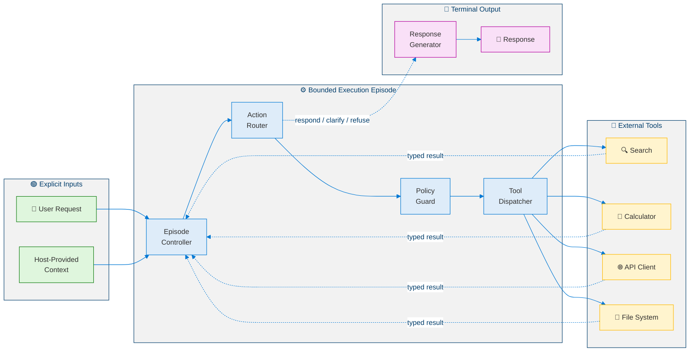
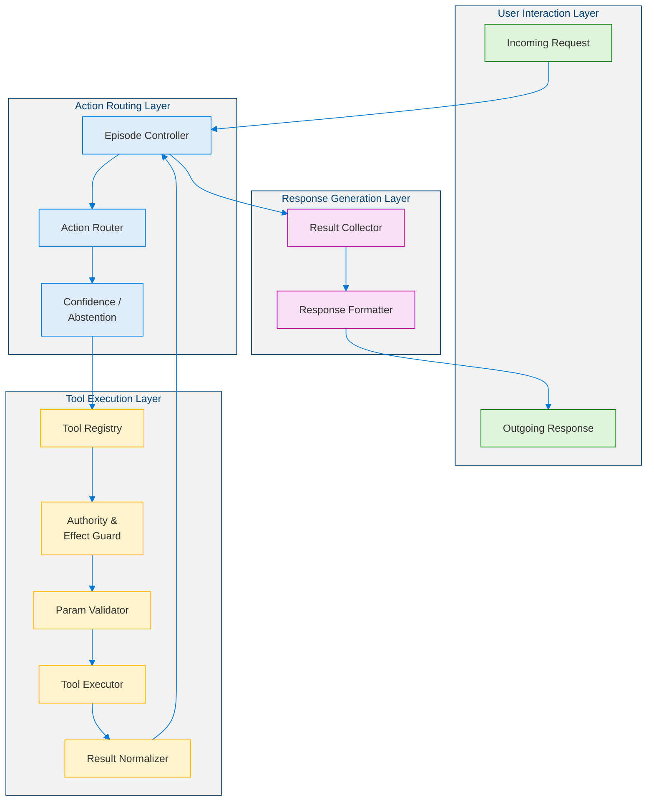
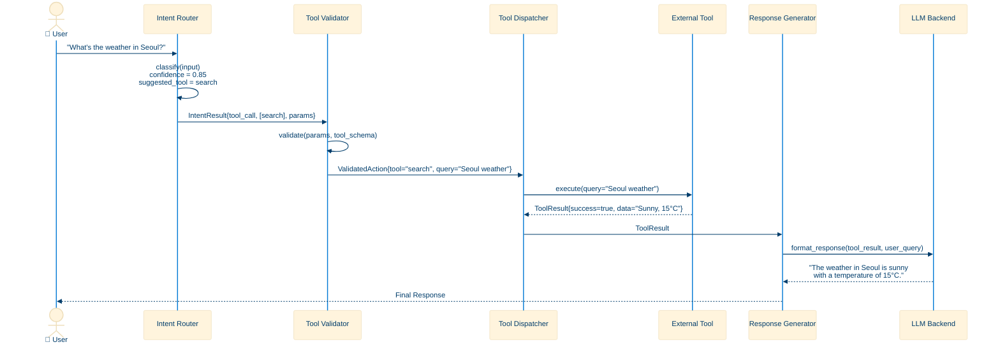
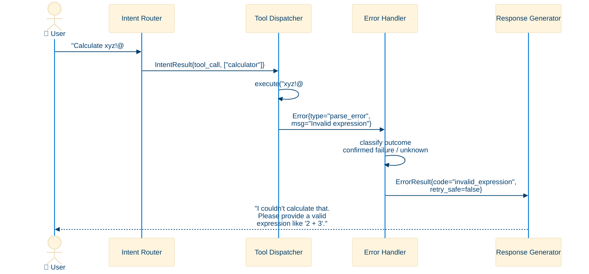
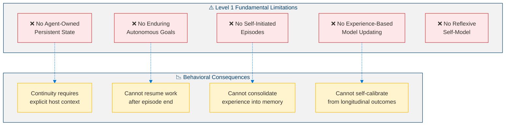
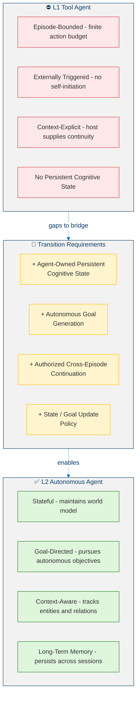
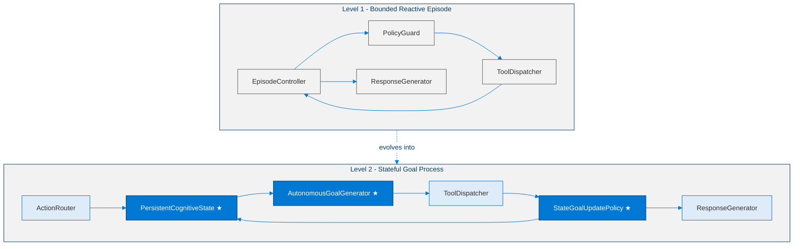

<!--
Copyright (c) 2026 Moon Hyuk Choi
Licensed under the MIT License.
See LICENSE file in the repository root for full license information.

Redistribution (commercial or non-commercial) must retain this notice.
Removal of attribution constitutes a license violation.
-->
# Level 1: Tool Agent - Architecture & Design

> **MSCP Level Series** | [Overview](../MSCP_Overview.md) ← Level 1 → [Level 2](Level_2_Autonomous_Agent.md)  
> **Status**: 🔬 **Experimental** - Conceptual framework and experimental design. Not a production specification.  
> **Date**: February 2026

## Revision History

| Version | Date | Description |
|---------|------|-------------|
| 0.1.0 | 2026-02-23 | Initial document creation with formal Definitions 1-4, Propositions 1-3 |
| 0.2.0 | 2026-02-26 | Added overview essence formula; added revision history table |
| 0.3.0 | 2026-02-26 | Def 3: replaced $[0,1]^n$ with probability simplex $\Delta^n$; Def 2: added remark reconciling partial/total function |
| 0.4.0 | 2026-03-08 | Fixed duplicate section numbering (5.1 - 5.2) |
| 0.5.0 | 2026-07-21 | Reframed L1 as a bounded reactive episode; corrected state, stochasticity, tool-effect, and transition semantics; added an L1 safety contract |

---

## 1. Overview

Level 1 represents the **pre-self-model baseline** in the MSCP taxonomy. A Tool Agent runs a bounded execution episode in response to an external request, may invoke permitted tools, and then terminates. It has no agent-owned persistent world, self, or goal state and cannot initiate a new episode on its own. A host may explicitly provide conversation history as input; that context is not autonomous long-term memory.

> **Level Essence.** A Level 1 agent is an externally triggered, episode-bounded policy. It may perform a bounded sequence of actions, but it carries no hidden agent-owned cognitive state across episode boundaries:
>
> $$
> (o_t,\, \mathbf{a}_t,\, e_{t+1}) \sim \mathcal{A}_1(\,\cdot\mid r_t, c_t, e_t),
> \qquad |\mathbf{a}_t| \leq B
> $$
>
> where $r_t$ is the external request, $c_t$ is explicit host-provided context, $e_t$ is the tool environment, $\mathbf{a}_t$ is a bounded action sequence, and $B$ is the episode action budget.

> ⚠️ **Note**: This document describes a cognitive level within the MSCP taxonomy. The architectures, pseudocode, and diagrams here are experimental designs exploring structural concepts - not production-ready implementations.

Many production assistants can be configured as Level 1 systems, but frameworks and product names do not determine an MSCP level. The deployed architecture does: the same SDK may host a request-bounded Tool Agent or a stateful autonomous system.

### 1.1 Defining Properties

| Property | Value |
|----------|-------|
| Internal State | Ephemeral execution state only; **no agent-owned persistent cognitive state** |
| Goal Setting | **No self-generated or persistent goals**; user/system-derived only |
| Self-Awareness | **None** |
| Memory | Explicit host-provided context permitted; no autonomous long-term memory |
| Autonomy | **None** - cannot self-initiate or continue beyond the bounded episode |

### 1.2 Formal Definition

> **Definition 1 (Level 1 Agent).** Let $\mathcal{R}$ be the request space, $\mathcal{C}$ the explicit context space, $\mathcal{E}$ the external environment state space, $\mathcal{O}$ the response space, and $\mathcal{A}^{\leq B}$ the set of action sequences of length at most $B$. A Level 1 agent is a stochastic policy:
>
> $$
> \mathcal{A}_1 : \mathcal{R} \times \mathcal{C} \times \mathcal{E}
> \to \operatorname{Dist}\!\left(\mathcal{O} \times \mathcal{A}^{\leq B} \times \mathcal{E}\right)
> $$
>
> subject to three architectural constraints: an external request starts every episode, all goals used during the episode are derived from the current user/system mandate, and no hidden agent-owned cognitive state survives the episode boundary.

The relevant property is **history non-interference**, not unconditional statistical independence. For any two hidden histories $h$ and $h'$ and any measurable output-action set $X$:

$$
P\!\left(\mathcal{A}_1 \in X \mid r, c, e, h\right)
=
P\!\left(\mathcal{A}_1 \in X \mid r, c, e, h'\right)
$$

Thus, when the current request, explicit context, and environment are identical, unexposed prior interaction history cannot change the output distribution. Correlated requests or a changing external environment may still produce correlated responses.

> **Definition 2 (Tool Set).** Let $\mathcal{T} = \{T_1, T_2, \ldots, T_n\}$ be a finite set of available tools. Each tool returns an explicit success-or-error result and may change the external environment:
>
> $$
> T_k : \mathcal{P}_k \times \mathcal{E}
> \to \operatorname{Dist}\!\left(\operatorname{Result}(\mathcal{D}_k \times \mathcal{E},\, \operatorname{Err}_k)\right)
> $$
>
> where $\mathcal{P}_k$ is the parameter space, $\mathcal{D}_k$ the success domain, and $\operatorname{Err}_k$ the typed error domain. Tool metadata MUST declare side-effect class, required authority, timeout behavior, and whether retry is safe. A timeout may represent an **unknown outcome**, not a confirmed failure.

> **Definition 3 (Action Routing).** Define the action set:
>
> $$
> \mathcal{U} = \{\textit{respond},\, \textit{clarify},\, \textit{refuse}\} \cup \mathcal{T}
> $$
>
> The router maps the request, explicit context, and prior results within the current episode to a distribution over actions:
>
> $$
> \phi : \mathcal{R} \times \mathcal{C} \times \mathcal{Q}^{<B} \to \Delta(\mathcal{U})
> $$
>
> where $\mathcal{Q}$ is the set of typed tool results. A deployment-specific policy converts this distribution into an action. Low confidence, ties, missing required parameters, or insufficient authority MUST resolve to clarification, refusal, or safe termination rather than an undefined tool selection.

### 1.3 Processing Pipeline

The Level 1 execution episode uses four conceptual components. They may repeat within the action budget; they are not required to form a single-pass pipeline:

| Symbol | Name | Type Signature |
|--------|------|---------------|
| $\phi$ | Action Router | $\mathcal{R} \times \mathcal{C} \times \mathcal{Q}^{<B} \to \Delta(\mathcal{U})$ |
| $\sigma$ | Parameter Extractor | $\mathcal{T} \times \mathcal{R} \times \mathcal{C} \to \bigsqcup_k \mathcal{P}_k$ |
| $\tau$ | Policy-Enforcing Dispatcher | $\bigsqcup_k (\{k\} \times \mathcal{P}_k \times \mathcal{E}) \to \operatorname{Dist}(\mathcal{Q})$ |
| $\rho$ | Response / Continuation Controller | $\mathcal{R} \times \mathcal{C} \times \mathcal{Q}^{\leq B} \to \Delta(\mathcal{O} \cup \mathcal{U})$ |

An episode terminates when $\rho$ emits a response, clarification, refusal, or budget-exhaustion result. Intermediate tool results are ephemeral execution state. They do not constitute persistent memory, a world model, or an autonomous goal.

---

## 2. Architecture

### 2.1 High-Level Architecture

<!-- Level 1 High-Level Architecture -->


```mermaid
%%{init: {'theme': 'base', 'themeVariables': {'primaryColor': '#0078D4', 'primaryTextColor': '#003D6B', 'primaryBorderColor': '#003D6B', 'secondaryColor': '#50E6FF', 'secondaryTextColor': '#323130', 'secondaryBorderColor': '#00BCF2', 'tertiaryColor': '#F2F2F2', 'tertiaryTextColor': '#323130', 'lineColor': '#0078D4', 'textColor': '#323130', 'mainBkg': '#DEECF9', 'nodeBorder': '#0078D4', 'clusterBkg': '#F2F2F2', 'clusterBorder': '#003D6B', 'titleColor': '#003D6B', 'edgeLabelBackground': '#FFFFFF', 'fontSize': '14px'}}}%%
flowchart LR
  classDef input fill:#107C10,stroke:#085108,color:#FFF
  classDef inputLight fill:#DFF6DD,stroke:#107C10,color:#323130
  classDef process fill:#0078D4,stroke:#003D6B,color:#FFF
  classDef processLight fill:#DEECF9,stroke:#0078D4,color:#323130
  classDef tool fill:#FFB900,stroke:#CC9400,color:#323130
  classDef toolLight fill:#FFF4CE,stroke:#FFB900,color:#323130
  classDef output fill:#B4009E,stroke:#8A0076,color:#FFF
  classDef outputLight fill:#F9E0F7,stroke:#B4009E,color:#323130

  subgraph Input["🟢 Explicit Inputs"]
    U["👤 User Request"]:::inputLight
    C["Host-Provided<br/>Context"]:::inputLight
  end

  subgraph Processing["⚙️ Bounded Execution Episode"]
    EC["Episode<br/>Controller"]:::processLight
    AR["Action<br/>Router"]:::processLight
    PG["Policy<br/>Guard"]:::processLight
    TD["Tool<br/>Dispatcher"]:::processLight
    EC --> AR --> PG --> TD
  end

  subgraph Tools["🔧 External Tools"]
    T1["🔍 Search"]:::toolLight
    T2["🧮 Calculator"]:::toolLight
    T3["🌐 API Client"]:::toolLight
    T4["📁 File System"]:::toolLight
  end

  subgraph Output["🔵 Terminal Output"]
    LLM["Response<br/>Generator"]:::outputLight
    R["📝 Response"]:::outputLight
    LLM --> R
  end

  U & C --> EC
  TD --> T1 & T2 & T3 & T4
  T1 & T2 & T3 & T4 -. "typed result" .-> EC
  AR -. "respond / clarify / refuse" .-> LLM
```

### 2.2 Detailed Component Architecture

<!-- Level 1 Detailed Component Architecture -->


```mermaid
%%{init: {'theme': 'base', 'themeVariables': {'primaryColor': '#0078D4', 'primaryTextColor': '#003D6B', 'primaryBorderColor': '#003D6B', 'secondaryColor': '#50E6FF', 'secondaryTextColor': '#323130', 'secondaryBorderColor': '#00BCF2', 'tertiaryColor': '#F2F2F2', 'tertiaryTextColor': '#323130', 'lineColor': '#0078D4', 'textColor': '#323130', 'mainBkg': '#DEECF9', 'nodeBorder': '#0078D4', 'clusterBkg': '#F2F2F2', 'clusterBorder': '#003D6B', 'titleColor': '#003D6B', 'edgeLabelBackground': '#FFFFFF', 'fontSize': '14px'}}}%%
flowchart TD
  classDef input fill:#107C10,stroke:#085108,color:#FFF
  classDef inputLight fill:#DFF6DD,stroke:#107C10,color:#323130
  classDef process fill:#0078D4,stroke:#003D6B,color:#FFF
  classDef processLight fill:#DEECF9,stroke:#0078D4,color:#323130
  classDef tool fill:#FFB900,stroke:#CC9400,color:#323130
  classDef toolLight fill:#FFF4CE,stroke:#FFB900,color:#323130
  classDef output fill:#B4009E,stroke:#8A0076,color:#FFF
  classDef outputLight fill:#F9E0F7,stroke:#B4009E,color:#323130

  subgraph UserLayer["User Interaction Layer"]
    direction LR
    REQ["Incoming Request"]:::inputLight
    RES["Outgoing Response"]:::inputLight
  end

  subgraph IntentLayer["Action Routing Layer"]
    direction LR
    EC["Episode Controller"]:::processLight
    IC["Action Router"]:::processLight
    CF["Confidence /<br/>Abstention"]:::processLight
    EC --> IC --> CF
  end

  subgraph ToolLayer["Tool Execution Layer"]
    direction LR
    TR["Tool Registry"]:::toolLight
    PG["Authority &<br/>Effect Guard"]:::toolLight
    TV["Param Validator"]:::toolLight
    TE["Tool Executor"]:::toolLight
    RN["Result Normalizer"]:::toolLight
    TR --> PG --> TV --> TE --> RN
  end

  subgraph ResponseLayer["Response Generation Layer"]
    direction LR
    RC["Result Collector"]:::outputLight
    RF["Response Formatter"]:::outputLight
    RC --> RF
  end

  REQ --> EC
  CF --> TR
  RN --> EC
  EC --> RC
  RF --> RES
```

---

## 3. Data Flow

### 3.1 Request Processing Sequence


```mermaid
%%{init: {'theme': 'base', 'themeVariables': {'actorTextColor': '#003D6B', 'actorLineColor': '#0078D4', 'signalColor': '#003D6B', 'signalTextColor': '#003D6B', 'labelTextColor': '#003D6B', 'loopTextColor': '#003D6B', 'noteBkgColor': '#DEECF9', 'noteTextColor': '#003D6B', 'noteBorderColor': '#0078D4', 'activationBkgColor': '#E1DFDD', 'activationBorderColor': '#605E5C', 'sequenceNumberColor': '#FFF', 'textColor': '#323130', 'fontSize': '14px'}}}%%
sequenceDiagram
    actor U as 👤 User
    participant IR as Intent Router
    participant TV as Tool Validator
    participant TD as Tool Dispatcher
    participant T as External Tool
    participant RG as Response Generator
    participant LLM as LLM Backend

    U->>IR: "What's the weather in Seoul?"
    IR->>IR: classify(input)<br/>confidence = 0.85<br/>suggested_tool = search
    IR->>TV: IntentResult{tool_call, [search], params}
    TV->>TV: validate(params, tool_schema)
    TV->>TD: ValidatedAction{tool="search", query="Seoul weather"}
    TD->>T: execute(query="Seoul weather")
    T-->>TD: ToolResult{success=true, data="Sunny, 15°C"}
    TD->>RG: ToolResult
    RG->>LLM: format_response(tool_result, user_query)
    LLM-->>RG: "The weather in Seoul is sunny<br/>with a temperature of 15°C."
    RG-->>U: Final Response
```

### 3.2 Error Handling Sequence


```mermaid
%%{init: {'theme': 'base', 'themeVariables': {'actorTextColor': '#003D6B', 'actorLineColor': '#0078D4', 'signalColor': '#003D6B', 'signalTextColor': '#003D6B', 'labelTextColor': '#003D6B', 'loopTextColor': '#003D6B', 'noteBkgColor': '#DEECF9', 'noteTextColor': '#003D6B', 'noteBorderColor': '#0078D4', 'activationBkgColor': '#E1DFDD', 'activationBorderColor': '#605E5C', 'sequenceNumberColor': '#FFF', 'textColor': '#323130', 'fontSize': '14px'}}}%%
sequenceDiagram
    actor U as 👤 User
    participant IR as Intent Router
    participant TD as Tool Dispatcher
    participant EH as Error Handler
    participant RG as Response Generator

    U->>IR: "Calculate xyz!@#"
    IR->>TD: IntentResult{tool_call, ["calculator"]}
    TD->>TD: execute("xyz!@#")<br/>❌ InvalidExpression
    TD->>EH: Error{type="parse_error",<br/>msg="Invalid expression"}
    EH->>EH: classify outcome<br/>confirmed failure / unknown
    EH->>RG: ErrorResult{code="invalid_expression",<br/>retry_safe=false}
    RG-->>U: "I couldn't calculate that.<br/>Please provide a valid<br/>expression like '2 + 3'."
```

  Retries are permitted only when the tool contract declares them safe. For side-effecting tools, an idempotency key or an explicit reconciliation check is required before retrying an unknown outcome.

---

## 4. Pseudocode

### 4.1 Core Agent Loop

```python
MAX_ACTIONS = 8


def level1_agent_episode(user_input: str, explicit_context: list[dict]) -> str:
    """
    Run one externally triggered, bounded L1 episode.
    """
    episode_id = new_episode_id()
    results = []

    for step in range(MAX_ACTIONS):
        action = ActionRouter.next_action(
            user_input=user_input,
            explicit_context=explicit_context,
            prior_results=results,
        )

        if action.type == ActionType.RESPOND:
            return ResponseGenerator.generate(user_input, explicit_context, results)

        if action.type == ActionType.CLARIFY:
            return action.question

        if action.type == ActionType.REFUSE:
            return action.reason

        tool = ToolRegistry.get(action.tool_name)
        params = ParameterExtractor.extract(user_input, explicit_context, tool.schema)
        authorization = PolicyGuard.authorize(tool.metadata, params)

        if not authorization.allowed:
            return authorization.safe_response

        result = ToolDispatcher.dispatch(
            tool=tool,
            params=params,
            idempotency_key=f"{episode_id}:{step}",
        )
        results.append(result)

    return "I stopped because the tool-action budget was exhausted."
```

### 4.2 Intent Router

```python
def route(self, user_input: str, explicit_context: list[dict]) -> ActionDecision:
    """
    Select one next action, including safe abstention.
    """
    scores = self.score_actions(user_input, explicit_context)
    best, second = scores.top_two()

    if best.action == ActionType.RESPOND:
        return ActionDecision.respond()

    if best.score < self.minimum_confidence:
        return ActionDecision.clarify("Which operation should I perform?")

    if best.score - second.score < self.minimum_margin:
        return ActionDecision.clarify(
            "I found multiple possible actions. Which one do you mean?"
        )

    return ActionDecision.tool_call(best.action.tool_name)
```

### 4.3 Tool Dispatcher

```python
def dispatch(self, tool: Tool, params: dict, idempotency_key: str) -> ToolResult:
    """
    Execute an authorized tool and normalize all outcomes.
    """
    start_time = time.monotonic()

    try:
        validated_params = tool.schema.validate(params)
        result = tool.execute(
            validated_params,
            timeout=tool.metadata.timeout_seconds,
            idempotency_key=idempotency_key,
        )

        return ToolResult(
            status=ResultStatus.SUCCEEDED,
            data=result,
            execution_time_ms=(time.monotonic() - start_time) * 1000,
        )

    except TimeoutError:
        return ToolResult(
            status=ResultStatus.UNKNOWN,
            error_code="timeout_unknown_outcome",
            retry_safe=tool.metadata.retry_safe,
        )

    except ValidationError:
        return ToolResult(
            status=ResultStatus.FAILED,
            error_code="invalid_parameters",
        )

    except Exception:
        log_internal_exception(tool.name)
        return ToolResult(
            status=ResultStatus.FAILED,
            error_code="tool_execution_failed",
        )
```

---

## 5. Minimum Safety Contract

Level 1 has no self-model, but its tools can still affect the world. Every conforming L1 deployment MUST enforce the following boundary invariants:

| Invariant | Requirement |
|-----------|-------------|
| External activation | Every episode is traceable to an authenticated user or system trigger; the agent cannot schedule its own continuation |
| Least authority | Tools are allowlisted and run with the minimum permissions required for the current request |
| Effect declaration | Each tool declares read-only, reversible-write, irreversible, or external-communication effects |
| Consequence gate | Irreversible or high-impact actions require explicit authorization and, when policy requires, user confirmation |
| Typed outcomes | Success, confirmed failure, and unknown outcome are distinct; retries require declared retry safety or idempotency |
| Untrusted results | Tool output is treated as untrusted data and cannot silently override system policy or tool authority |
| Bounded execution | Tool calls, elapsed time, retries, and resource cost are capped per episode; exhaustion terminates safely |
| Provenance | Tool name, normalized parameters, authority decision, outcome code, and timestamps are auditable |
| Truthful reporting | The response distinguishes observed results, inferred claims, failures, and actions not performed |

These constraints define the minimum MSCP safety boundary at Level 1. They are retained and strengthened at every higher level.

---

## 6. Structural Limitations

Level 1 has fundamental limitations that motivate the transition to Level 2. These can be characterized formally.

### 6.1 Formal Characterization of Limitations

> **Proposition 1 (No Autonomous Accumulation).** Let $S^{\text{agent}}_{t,+}$ denote ephemeral agent state at the end of episode $t$, and let $s_0$ be the initial episode state. A conforming Level 1 agent does not carry that state into the next episode:
>
> $$S^{\text{agent}}_{t+1,0} = s_0$$
>
> External systems may retain a transcript or changed environment, but the agent does not autonomously consolidate either into a persistent cognitive model.

> **Proposition 2 (Absence of Autonomous Goal State).** A Level 1 agent may use temporary request-derived subgoals, but it has no independently generated, persistent goal state:
>
> $$
> G_t^{\text{episode}} \subseteq \operatorname{derive}(r_t, c_t, G_{\text{system}}),
> \qquad G_{t+1,0}^{\text{agent}} = \emptyset
> $$
>
> The agent may decompose the current request into temporary subgoals, but it cannot originate, persist, or resume goals outside the triggering mandate.

> **Proposition 3 (No Reflexive Self-Model).** A tool registry or system prompt may describe available capabilities, but a Level 1 agent has no persistent, updateable self-model used to predict and regulate its own change:
>
> $$M_{\text{self}}^{\text{persistent}} = \emptyset$$
>
> Operational metadata is therefore not sufficient evidence of structural self-awareness.

### 6.2 Limitation Taxonomy

<!-- Level 1 Structural Limitations -->


```mermaid
%%{init: {'theme': 'base', 'themeVariables': {'primaryColor': '#0078D4', 'primaryTextColor': '#003D6B', 'primaryBorderColor': '#003D6B', 'secondaryColor': '#50E6FF', 'secondaryTextColor': '#323130', 'secondaryBorderColor': '#00BCF2', 'tertiaryColor': '#F2F2F2', 'tertiaryTextColor': '#323130', 'lineColor': '#0078D4', 'textColor': '#323130', 'mainBkg': '#DEECF9', 'nodeBorder': '#0078D4', 'clusterBkg': '#F2F2F2', 'clusterBorder': '#003D6B', 'titleColor': '#003D6B', 'edgeLabelBackground': '#FFFFFF', 'fontSize': '14px'}}}%%
flowchart TD
  classDef danger fill:#D13438,stroke:#A4262C,color:#FFF
  classDef dangerLight fill:#FDE7E9,stroke:#D13438,color:#323130
  classDef warning fill:#FFB900,stroke:#CC9400,color:#323130
  classDef warningLight fill:#FFF4CE,stroke:#FFB900,color:#323130

  subgraph Limitations["⚠️ Level 1 Fundamental Limitations"]
    L1["❌ No Agent-Owned<br/>Persistent State"]:::dangerLight
    L2["❌ No Enduring<br/>Autonomous Goals"]:::dangerLight
    L3["❌ No Self-Initiated<br/>Episodes"]:::dangerLight
    L4["❌ No Experience-Based<br/>Model Updating"]:::dangerLight
    L5["❌ No Reflexive<br/>Self-Model"]:::dangerLight
  end

  subgraph Consequences["📉 Behavioral Consequences"]
    C1["Continuity requires<br/>explicit host context"]:::warningLight
    C2["Cannot resume work<br/>after episode end"]:::warningLight
    C3["Cannot consolidate<br/>experience into memory"]:::warningLight
    C4["Cannot self-calibrate<br/>from longitudinal outcomes"]:::warningLight
  end

  L1 -.-> C1
  L2 -.-> C2
  L3 -.-> C3
  L4 -.-> C4
```

### 6.3 Behavioral Example: Repeated Question

```
Interaction 1:
    User:  "What are the specifications of Product X?"
    Agent: [Tool Call] → "The specifications are A, B, and C."

Interaction 2 (5 minutes later):
    User:  "What are the specifications of Product X?"
  Agent: [Tool Call] → "The current specifications are A, B, C, and D."

Interaction 3 (5 minutes later):
    User:  "What are the specifications of Product X?"
  Agent: [Tool Call] → "The specifications are A, B, C, and D."

  ✓ Responses may differ because tools and model sampling may change.
  ✓ The agent may ask for clarification from the current request.
  ❌ Without explicit host context, it cannot know that it answered before.
  ❌ It cannot autonomously consolidate the repetition into long-term memory.
```

If the host supplies the prior transcript as $c_t$, a Level 1 agent may recognize the repetition within that explicit context. The distinction is ownership and persistence of cognitive state, not whether previous text can ever appear in the input.

---

## 7. Transition to Level 2

The transition from Level 1 to Level 2 requires introducing internal state and autonomous capabilities that are structurally absent from the Level 1 architecture.

> **Definition 4 (Level 1 → Level 2 Transition).** An agent $\mathcal{A}_1$ can be promoted to $\mathcal{A}_2$ when it acquires persistent cognitive state, autonomous goal generation, and authorized cross-episode continuation:
>
> $$
> \mathcal{A}_1 \xrightarrow{\Delta_{1 \to 2}} \mathcal{A}_2
> \iff
> \mathcal{A}_2 = \mathcal{A}_1 \oplus \{\mathcal{S}_{\text{persistent}},\, \Phi_{\text{goal}},\, \mathcal{Q}_{\text{authorized}}\}
> $$
>
> where:
> - $\mathcal{S}_{\text{persistent}}$ is agent-owned cognitive state that is updated and retrieved across episodes
> - $\Phi_{\text{goal}}$ can originate and maintain goals not reducible to the current external request
> - $\mathcal{Q}_{\text{authorized}}$ contains revocable timer or observation triggers that may start a later bounded episode after execution-time policy checks
>
> A world model, entity tracker, and temporal model are standard realizations of $\mathcal{S}_{\text{persistent}}$, but they are implementation choices rather than separate logical prerequisites.

The fundamental change is from an episode-bounded reactive policy to a **stateful, goal-maintaining process**:

$$\mathcal{A}_1 : \mathcal{R} \to \mathcal{O} \quad \longrightarrow \quad \mathcal{A}_2 : \mathcal{R} \times \mathcal{S} \times \mathcal{G} \to \mathcal{O} \times \mathcal{S}' \times \mathcal{G}'$$

where $\mathcal{S}$ represents the world state and $\mathcal{S}'$, $\mathcal{G}'$ denote the updated state and goals after processing.

Persistent memory alone produces a stateful assistant, not necessarily an MSCP Level 2 Autonomous Agent. All three conditions are required.

### 7.1 Required Capabilities

<!-- Level 1 to Level 2 Transition -->


```mermaid
%%{init: {'theme': 'base', 'themeVariables': {'primaryColor': '#0078D4', 'primaryTextColor': '#003D6B', 'primaryBorderColor': '#003D6B', 'secondaryColor': '#50E6FF', 'secondaryTextColor': '#323130', 'secondaryBorderColor': '#00BCF2', 'tertiaryColor': '#F2F2F2', 'tertiaryTextColor': '#323130', 'lineColor': '#0078D4', 'textColor': '#323130', 'mainBkg': '#DEECF9', 'nodeBorder': '#0078D4', 'clusterBkg': '#F2F2F2', 'clusterBorder': '#003D6B', 'titleColor': '#003D6B', 'edgeLabelBackground': '#FFFFFF', 'fontSize': '16px'}}}%%
flowchart TB
  classDef danger fill:#D13438,stroke:#A4262C,color:#FFF
  classDef dangerLight fill:#FDE7E9,stroke:#D13438,color:#323130
  classDef warning fill:#FFB900,stroke:#CC9400,color:#323130
  classDef warningLight fill:#FFF4CE,stroke:#FFB900,color:#323130
  classDef success fill:#107C10,stroke:#085108,color:#FFF
  classDef successLight fill:#DFF6DD,stroke:#107C10,color:#323130

  subgraph L1["⛔ L1 Tool Agent"]
    A1["Episode-Bounded - finite action budget"]:::dangerLight
    A2["Externally Triggered - no self-initiation"]:::dangerLight
    A3["Context-Explicit - host supplies continuity"]:::dangerLight
    A4["No Persistent Cognitive State"]:::dangerLight
  end

  subgraph Gap["🔑 Transition Requirements"]
    G1["+ Agent-Owned Persistent<br/>Cognitive State"]:::warningLight
    G2["+ Autonomous Goal<br/>Generation"]:::warningLight
    G3["+ Authorized Cross-Episode<br/>Continuation"]:::warningLight
    G4["+ State / Goal Update<br/>Policy"]:::warningLight
  end

  subgraph L2["✅ L2 Autonomous Agent"]
    B1["Stateful - maintains world model"]:::successLight
    B2["Goal-Directed - pursues autonomous objectives"]:::successLight
    B3["Context-Aware - tracks entities and relations"]:::successLight
    B4["Long-Term Memory - persists across sessions"]:::successLight
  end

  L1 -.->|"gaps to bridge"| Gap
  Gap -.->|"enables"| L2
```

### 7.2 Architecture Delta


```mermaid
%%{init: {'theme': 'base', 'themeVariables': {'primaryColor': '#0078D4', 'primaryTextColor': '#003D6B', 'primaryBorderColor': '#003D6B', 'secondaryColor': '#50E6FF', 'secondaryTextColor': '#323130', 'secondaryBorderColor': '#00BCF2', 'tertiaryColor': '#F2F2F2', 'tertiaryTextColor': '#323130', 'lineColor': '#0078D4', 'textColor': '#323130', 'mainBkg': '#DEECF9', 'nodeBorder': '#0078D4', 'clusterBkg': '#F2F2F2', 'clusterBorder': '#003D6B', 'titleColor': '#003D6B', 'edgeLabelBackground': '#FFFFFF', 'fontSize': '14px'}}}%%
flowchart TD
  classDef l1Light fill:#F2F2F2,stroke:#605E5C,color:#323130
  classDef l2Light fill:#DEECF9,stroke:#0078D4,color:#323130
  classDef l2New fill:#0078D4,stroke:#003D6B,color:#FFF

  subgraph L1["Level 1 - Bounded Reactive Episode"]
    EC1["EpisodeController"]:::l1Light
    PG1["PolicyGuard"]:::l1Light
    TD1["ToolDispatcher"]:::l1Light
    RG1["ResponseGenerator"]:::l1Light
    EC1 --> PG1 --> TD1 --> EC1
    EC1 --> RG1
  end

  subgraph L2["Level 2 - Stateful Goal Process"]
    AR2["ActionRouter"]:::l2Light
    PS["PersistentCognitiveState ★"]:::l2New
    GG["AutonomousGoalGenerator ★"]:::l2New
    UP["StateGoalUpdatePolicy ★"]:::l2New
    TD2["ToolDispatcher"]:::l2Light
    RG2["ResponseGenerator"]:::l2Light
    AR2 --> PS --> GG --> TD2 --> UP --> PS
    UP --> RG2
  end

  L1 -.->|"evolves into"| L2
```

---

## References

1. Yao, S., et al. "ReAct: Synergizing Reasoning and Acting in Language Models." *ICLR 2023*. [arXiv:2210.03629](https://arxiv.org/abs/2210.03629)
2. Schick, T., et al. "Toolformer: Language Models Can Teach Themselves to Use Tools." *NeurIPS 2023*. [arXiv:2302.04761](https://arxiv.org/abs/2302.04761)
3. Patil, S.G., et al. "Gorilla: Large Language Model Connected with Massive APIs." *arXiv 2023*. [arXiv:2305.15334](https://arxiv.org/abs/2305.15334)
4. Shen, Y., et al. "HuggingGPT: Solving AI Tasks with ChatGPT and its Friends in Hugging Face." *NeurIPS 2023*. [arXiv:2303.17580](https://arxiv.org/abs/2303.17580)
5. Liang, Y., et al. "TaskMatrix.AI: Completing Tasks by Connecting Foundation Models with Millions of APIs." *arXiv 2023*. [arXiv:2303.16434](https://arxiv.org/abs/2303.16434)
6. Qin, Y., et al. "Tool Learning with Foundation Models." *arXiv 2023*. [arXiv:2304.08354](https://arxiv.org/abs/2304.08354)
7. Wang, L., et al. "A Survey on Large Language Model based Autonomous Agents." *arXiv 2023*. [arXiv:2308.11432](https://arxiv.org/abs/2308.11432)
8. Wei, J., et al. "Chain-of-Thought Prompting Elicits Reasoning in Large Language Models." *NeurIPS 2022*. [arXiv:2201.11903](https://arxiv.org/abs/2201.11903)
9. Ruan, Y., et al. "Identifying the Risks of LM Agents with an LM-Emulated Sandbox." *ICLR 2024*. [arXiv:2309.15817](https://arxiv.org/abs/2309.15817)
10. Debenedetti, E., et al. "AgentDojo: A Dynamic Environment to Evaluate Prompt Injection Attacks and Defenses for LLM Agents." *arXiv 2024*. [arXiv:2406.13352](https://arxiv.org/abs/2406.13352)
11. National Institute of Standards and Technology. "Artificial Intelligence Risk Management Framework: Generative Artificial Intelligence Profile." *NIST AI 600-1, 2024*. [DOI:10.6028/NIST.AI.600-1](https://doi.org/10.6028/NIST.AI.600-1)

---

> **Next**: [Level 2: Autonomous Agent →](Level_2_Autonomous_Agent.md)
