<!--
Copyright (c) 2026 Moon Hyuk Choi
Licensed under the MIT License.
See LICENSE file in the repository root for full license information.

Redistribution (commercial or non-commercial) must retain this notice.
Removal of attribution constitutes a license violation.
-->
# Level 1: Tool Agent — Architecture & Design

> **MSCP Level Series** | [Overview](../MSCP_Overview.md) ← Level 1 → [Level 2](Level_2_Autonomous_Agent.md)  
> **Status**: 🔬 **Experimental** — Conceptual framework and experimental design. Not a production specification.  
> **Date**: February 2026

---

## 1. Overview

Level 1 represents the **baseline cognitive architecture** for AI agents. A Tool Agent is a **stateless, reactive system** that receives user requests, invokes external tools, and returns results. It has no internal model of itself, no memory across sessions, and no capacity for autonomous goal setting.

> ⚠️ **Note**: This document describes a cognitive level within the MSCP taxonomy. The architectures, pseudocode, and diagrams here are experimental designs exploring structural concepts — not production-ready implementations.

**Most production AI agents today operate at Level 1**, including LangChain agents, Semantic Kernel plugin chains, OpenAI Assistants, and custom RAG pipelines.

### 1.1 Defining Properties

| Property | Value |
|----------|-------|
| Internal State | **None** (stateless between requests) |
| Goal Setting | **None** (user-directed only) |
| Self-Awareness | **None** |
| Memory | Session-scoped at most |
| Autonomy | **None** — purely reactive |

### 1.2 Formal Definition

> **Definition 1 (Level 1 Agent).** A Level 1 agent is a stateless function $\mathcal{A}_1$ that maps a user request to a response through tool invocation:
>
> $$\mathcal{A}_1 : \mathcal{R} \to \mathcal{O}$$
>
> where $\mathcal{R}$ denotes the space of all possible user requests and $\mathcal{O}$ the space of all possible output responses.

Because the agent carries no internal state, the mapping is **memoryless** — i.e., the output depends solely on the current input and is independent of all prior interactions. Formally:

$$\mathcal{A}_1(r_t) = o_t \quad \forall\, t, \quad o_t \perp \{r_1, \ldots, r_{t-1}\}$$

where $r_t \in \mathcal{R}$ is the request at time step $t$ and $o_t \in \mathcal{O}$ is the corresponding output.

> **Definition 2 (Tool Set).** Let $\mathcal{T} = \{T_1, T_2, \ldots, T_n\}$ be a finite set of $n$ available tools, where each tool is a partial function:
>
> $$T_k : \mathcal{P}_k \rightharpoonup \mathcal{D}_k$$
>
> with parameter space $\mathcal{P}_k$ and output domain $\mathcal{D}_k$. The function is partial because invalid parameters may produce no result (i.e., an error).

> **Definition 3 (Intent Classification).** The intent classifier is a function $\phi$ that maps a request to a probability distribution over tool selections:
>
> $$\phi : \mathcal{R} \to [0,1]^{|\mathcal{T}|+1}$$
>
> where the extra dimension represents the "no tool needed" (direct response) category. The decision rule selects the tool with maximum confidence:
>
> $$T^* = \arg\max_{k} \; \phi(r)_k \quad \text{subject to} \quad \phi(r)_k \geq \theta_{min}$$
>
> where $\theta_{min}$ is the minimum confidence threshold (typically $\theta_{min} = 0.5$).

### 1.3 Processing Pipeline

The complete Level 1 processing pipeline can be decomposed into four sequential stages:

$$\mathcal{A}_1(r) = \rho\bigl(\tau\bigl(\sigma(\phi(r), r)\bigr), r\bigr)$$

where:

| Symbol | Name | Type Signature |
|--------|------|---------------|
| $\phi$ | Intent Classifier | $\mathcal{R} \to [0,1]^{\lvert\mathcal{T}\rvert+1}$ |
| $\sigma$ | Parameter Extractor | $[0,1]^{\lvert\mathcal{T}\rvert+1} \times \mathcal{R} \to \mathcal{P}_{T^{\ast}}$ |
| $\tau$ | Tool Dispatcher | $\mathcal{P}_{T^{\ast}} \to \mathcal{D}_{T^{\ast}} \cup \lbrace\textit{err}\rbrace$ |
| $\rho$ | Response Generator | $(\mathcal{D}_{T^{\ast}} \cup \lbrace\textit{err}\rbrace) \times \mathcal{R} \to \mathcal{O}$ |

The pipeline is **strictly sequential** — there are no feedback loops, no state persistence, and no branching decisions after classification.

---

## 2. Architecture

### 2.1 High-Level Architecture

```mermaid
%%{init: {'theme': 'base', 'themeVariables': {'primaryColor': '#0078D4', 'primaryTextColor': '#003D6B', 'primaryBorderColor': '#003D6B', 'secondaryColor': '#50E6FF', 'secondaryTextColor': '#323130', 'secondaryBorderColor': '#00BCF2', 'tertiaryColor': '#F2F2F2', 'tertiaryTextColor': '#323130', 'lineColor': '#0078D4', 'textColor': '#323130', 'mainBkg': '#DEECF9', 'nodeBorder': '#0078D4', 'clusterBkg': '#F2F2F2', 'clusterBorder': '#003D6B', 'titleColor': '#003D6B', 'edgeLabelBackground': '#FFFFFF', 'fontSize': '14px'}}}%%
flowchart LR
  classDef input fill:#107C10,stroke:#085108,color:#FFF
  classDef inputLight fill:#DFF6DD,stroke:#107C10,color:#323130
  classDef process fill:#0078D4,stroke:#003D6B,color:#FFF
  classDef processLight fill:#DEECF9,stroke:#0078D4,color:#323130
  classDef tool fill:#FFB900,stroke:#CC9400,color:#323130
  classDef toolLight fill:#FFF4CE,stroke:#FFB900,color:#323130
  classDef output fill:#B4009E,stroke:#8A0076,color:#FFF
  classDef outputLight fill:#F9E0F7,stroke:#B4009E,color:#323130

  subgraph Input["🟢 Input"]
    U["👤 User Request"]:::inputLight
  end

  subgraph Processing["⚙️ Processing Pipeline"]
    IR["Intent<br/>Router"]:::processLight
    TP["Tool<br/>Parser"]:::processLight
    TD["Tool<br/>Dispatcher"]:::processLight
    IR --> TP --> TD
  end

  subgraph Tools["🔧 External Tools"]
    T1["🔍 Search"]:::toolLight
    T2["🧮 Calculator"]:::toolLight
    T3["🌐 API Client"]:::toolLight
    T4["📁 File System"]:::toolLight
  end

  subgraph Output["🔵 Output"]
    LLM["LLM Response<br/>Generator"]:::outputLight
    R["📝 Response"]:::outputLight
    LLM --> R
  end

  U --> IR
  TD --> T1 & T2 & T3 & T4
  T1 & T2 & T3 & T4 -.-> LLM
```

<!-- Level 1 High-Level Architecture -->



### 2.2 Detailed Component Architecture

<!-- Level 1 Detailed Component Architecture -->


---

## 3. Data Flow

### 3.1 Request Processing Sequence

```mermaid
%%{init: {'theme': 'base', 'themeVariables': {'actorTextColor': '#003D6B', 'actorLineColor': '#0078D4', 'signalColor': '#003D6B', 'signalTextColor': '#003D6B', 'labelTextColor': '#003D6B', 'loopTextColor': '#003D6B', 'noteBkgColor': '#DEECF9', 'noteTextColor': '#003D6B', 'noteBorderColor': '#0078D4', 'activationBkgColor': '#E1DFDD', 'activationBorderColor': '#605E5C', 'sequenceNumberColor': '#FFF', 'textColor': '#323130', 'fontSize': '14px'}}}%%
sequenceDiagram
    actor U as 👤 User
    participant IR as Intent Router
    participant TV as Tool Validator
    participant TD as Tool Dispatcher
    participant T as External Tool
    participant RG as Response Generator
    participant LLM as LLM Backend

    U->>IR: "What's the weather in Seoul?"
    IR->>IR: classify(input)<br/>confidence = 0.85<br/>suggested_tool = search
    IR->>TV: IntentResult{tool_call, [search], params}
    TV->>TV: validate(params, tool_schema)
    TV->>TD: ValidatedAction{tool="search", query="Seoul weather"}
    TD->>T: execute(query="Seoul weather")
    T-->>TD: ToolResult{success=true, data="Sunny, 15°C"}
    TD->>RG: ToolResult
    RG->>LLM: format_response(tool_result, user_query)
    LLM-->>RG: "The weather in Seoul is sunny<br/>with a temperature of 15°C."
    RG-->>U: Final Response
```



### 3.2 Error Handling Sequence

```mermaid
%%{init: {'theme': 'base', 'themeVariables': {'actorTextColor': '#003D6B', 'actorLineColor': '#0078D4', 'signalColor': '#003D6B', 'signalTextColor': '#003D6B', 'labelTextColor': '#003D6B', 'loopTextColor': '#003D6B', 'noteBkgColor': '#DEECF9', 'noteTextColor': '#003D6B', 'noteBorderColor': '#0078D4', 'activationBkgColor': '#E1DFDD', 'activationBorderColor': '#605E5C', 'sequenceNumberColor': '#FFF', 'textColor': '#323130', 'fontSize': '14px'}}}%%
sequenceDiagram
    actor U as 👤 User
    participant IR as Intent Router
    participant TD as Tool Dispatcher
    participant EH as Error Handler
    participant RG as Response Generator

    U->>IR: "Calculate xyz!@#"
    IR->>TD: IntentResult{tool_call, ["calculator"]}
    TD->>TD: execute("xyz!@#")<br/>❌ InvalidExpression
    TD->>EH: Error{type="parse_error",<br/>msg="Invalid expression"}
    EH->>EH: retry_count < max_retries?<br/>No → generate error response
    EH->>RG: ErrorResult{message="Cannot parse expression"}
    RG-->>U: "I couldn't calculate that.<br/>Please provide a valid<br/>expression like '2 + 3'."
```



---

## 4. Pseudocode

### 4.1 Core Agent Loop

```python
def level1_agent_loop(user_input: str) -> str:
    """
    Level 1 core agent loop.
    Input:  user_input — user request string
    Output: response string
    """

    # Step 1: Intent Classification
    intent = IntentRouter.classify(user_input)

    if intent.type == IntentType.UNSUPPORTED:
        return "I'm unable to help with that request."

    # Step 2: Direct response (no tool needed)
    if intent.type == IntentType.DIRECT_RESPONSE:
        return LLM.generate(user_input)

    # Step 3: Tool Execution
    results = []
    for tool_name in intent.suggested_tools:
        params = ParameterExtractor.extract(user_input, tool_name)

        if not ToolRegistry.has(tool_name):
            results.append(Error(f"Unknown tool: {tool_name}"))
            continue

        tool = ToolRegistry.get(tool_name)
        result = tool.execute(params)
        results.append(result)

    # Step 4: Response Generation
    response = ResponseGenerator.format(user_input, results)
    return response
```

### 4.2 Intent Router

```python
def classify(self, user_input: str) -> IntentResult:
    """
    Classify user input into an intent.
    Input:  user_input — user request string
    Output: IntentResult with type, confidence, suggested_tools, params
    """

    input_lower = user_input.lower()

    # Pattern matching against tool registry
    matched_tools = []
    for tool_name, patterns in TOOL_PATTERNS.items():
        if any(pattern in input_lower for pattern in patterns):
            matched_tools.append(tool_name)

    if matched_tools:
        return IntentResult(
            type=IntentType.TOOL_CALL,
            confidence=0.8,
            suggested_tools=matched_tools,
            params=extract_parameters(user_input),
        )

    return IntentResult(
        type=IntentType.DIRECT_RESPONSE,
        confidence=0.6,
        suggested_tools=[],
        params={},
    )
```

### 4.3 Tool Dispatcher

```python
def dispatch(self, tool_name: str, params: dict) -> ToolResult:
    """
    Dispatch a tool call with validation and error handling.
    Input:  tool_name — registered tool name, params — parameter dict
    Output: ToolResult with success, data, error, execution_time_ms
    """

    if tool_name not in self.registry:
        return ToolResult(success=False, error="Unknown tool")

    tool = self.registry[tool_name]
    start_time = time.monotonic()

    try:
        # Validate parameters against tool schema
        validated_params = tool.schema.validate(params)

        # Execute with timeout
        result = tool.execute(validated_params, timeout=30)

        return ToolResult(
            success=True,
            data=result,
            execution_time=time.monotonic() - start_time,
        )

    except TimeoutError:
        return ToolResult(success=False, error="Tool execution timed out")

    except ValidationError as e:
        return ToolResult(success=False, error=f"Invalid params: {e}")

    except Exception as e:
        return ToolResult(success=False, error=f"Execution failed: {e}")
```

---

## 5. Structural Limitations

Level 1 has fundamental limitations that motivate the transition to Level 2. These can be characterized formally.

### 5.1 Formal Characterization of Limitations

> **Proposition 1 (Zero Mutual Information).** For a Level 1 agent, the mutual information between any two consecutive responses is zero:
>
> $$I(o_t ; o_{t-1}) = 0$$
>
> This follows directly from the memoryless property in Definition 1 — each request–response pair is conditionally independent of all others.

> **Proposition 2 (Absence of Goal State).** A Level 1 agent has no internal goal space $\mathcal{G}$. The agent produces output only as a deterministic function of its input, never as a consequence of pursuing an objective:
>
> $$\nexists\; g \in \mathcal{G} : o_t = \pi(r_t, g)$$
>
> where $\pi$ would be a policy function that selects actions to maximize goal satisfaction.

> **Proposition 3 (No Self-Model).** A Level 1 agent has no representation $M$ of its own state, capabilities, or identity:
>
> $$M_{\text{self}} = \emptyset$$
>
> Consequently, the agent cannot predict the effect of its actions on itself — a prerequisite for self-regulation (Level 3+).

### 5.2 Limitation Taxonomy

<!-- Level 1 Structural Limitations -->


### 5.1 Behavioral Example: Repeated Question

```
Interaction 1:
    User:  "What are the specifications of Product X?"
    Agent: [Tool Call] → "The specifications are A, B, and C."

Interaction 2 (5 minutes later):
    User:  "What are the specifications of Product X?"
    Agent: [Tool Call] → "The specifications are A, B, and C."    ← IDENTICAL response

Interaction 3 (5 minutes later):
    User:  "What are the specifications of Product X?"
    Agent: [Tool Call] → "The specifications are A, B, and C."    ← IDENTICAL response

    ❌ Level 1 cannot detect repetition.
    ❌ Level 1 cannot ask "Do you need clarification?"
    ❌ Level 1 cannot remember it already answered this.
```

---

## 6. Transition to Level 2

The transition from Level 1 to Level 2 requires introducing internal state and autonomous capabilities that are structurally absent from the Level 1 architecture.

> **Definition 4 (Level 1 → Level 2 Transition).** An agent $\mathcal{A}_1$ can be promoted to $\mathcal{A}_2$ when it acquires the following structural extensions:
>
> $$\mathcal{A}_1 \xrightarrow{\Delta_{1 \to 2}} \mathcal{A}_2 \iff \mathcal{A}_2 = \mathcal{A}_1 \oplus \{\mathcal{W}, \mathcal{E}, \mathcal{G}, \Gamma\}$$
>
> where:
> - $\mathcal{W}$ : persistent world model (internal state that survives across requests)
> - $\mathcal{E}$ : entity tracker (cross-session entity state management)
> - $\mathcal{G}$ : goal system (autonomous objective generation)
> - $\Gamma$ : temporal model (time-aware fact management)

The fundamental change is the transition from a pure function to a **stateful process**:

$$\mathcal{A}_1 : \mathcal{R} \to \mathcal{O} \quad \longrightarrow \quad \mathcal{A}_2 : \mathcal{R} \times \mathcal{S} \times \mathcal{G} \to \mathcal{O} \times \mathcal{S}' \times \mathcal{G}'$$

where $\mathcal{S}$ represents the world state and $\mathcal{S}'$, $\mathcal{G}'$ denote the updated state and goals after processing.

### 6.1 Required Capabilities

```mermaid
%%{init: {'theme': 'base', 'themeVariables': {'primaryColor': '#0078D4', 'primaryTextColor': '#003D6B', 'primaryBorderColor': '#003D6B', 'secondaryColor': '#50E6FF', 'secondaryTextColor': '#323130', 'secondaryBorderColor': '#00BCF2', 'tertiaryColor': '#F2F2F2', 'tertiaryTextColor': '#323130', 'lineColor': '#0078D4', 'textColor': '#323130', 'mainBkg': '#DEECF9', 'nodeBorder': '#0078D4', 'clusterBkg': '#F2F2F2', 'clusterBorder': '#003D6B', 'titleColor': '#003D6B', 'edgeLabelBackground': '#FFFFFF', 'fontSize': '16px'}}}%%
flowchart TB
  classDef danger fill:#D13438,stroke:#A4262C,color:#FFF
  classDef dangerLight fill:#FDE7E9,stroke:#D13438,color:#323130
  classDef warning fill:#FFB900,stroke:#CC9400,color:#323130
  classDef warningLight fill:#FFF4CE,stroke:#FFB900,color:#323130
  classDef success fill:#107C10,stroke:#085108,color:#FFF
  classDef successLight fill:#DFF6DD,stroke:#107C10,color:#323130

  subgraph L1["⛔ L1 Tool Agent"]
    A1["Stateless — no persistent state"]:::dangerLight
    A2["Reactive — responds only when prompted"]:::dangerLight
    A3["Tool-Dependent — cannot act without tools"]:::dangerLight
    A4["No Memory — each request is independent"]:::dangerLight
  end

  subgraph Gap["🔑 Transition Requirements"]
    G1["+ World Model — persistent state tracking"]:::warningLight
    G2["+ Entity Tracker — who/what identification"]:::warningLight
    G3["+ Goal System — autonomous objectives"]:::warningLight
    G4["+ Temporal Model — time-aware fact management"]:::warningLight
  end

  subgraph L2["✅ L2 Autonomous Agent"]
    B1["Stateful — maintains world model"]:::successLight
    B2["Goal-Directed — pursues autonomous objectives"]:::successLight
    B3["Context-Aware — tracks entities and relations"]:::successLight
    B4["Long-Term Memory — persists across sessions"]:::successLight
  end

  L1 -.->|"gaps to bridge"| Gap
  Gap -.->|"enables"| L2
```

<!-- Level 1 to Level 2 Transition -->



### 6.2 Architecture Delta

```mermaid
%%{init: {'theme': 'base', 'themeVariables': {'primaryColor': '#0078D4', 'primaryTextColor': '#003D6B', 'primaryBorderColor': '#003D6B', 'secondaryColor': '#50E6FF', 'secondaryTextColor': '#323130', 'secondaryBorderColor': '#00BCF2', 'tertiaryColor': '#F2F2F2', 'tertiaryTextColor': '#323130', 'lineColor': '#0078D4', 'textColor': '#323130', 'mainBkg': '#DEECF9', 'nodeBorder': '#0078D4', 'clusterBkg': '#F2F2F2', 'clusterBorder': '#003D6B', 'titleColor': '#003D6B', 'edgeLabelBackground': '#FFFFFF', 'fontSize': '14px'}}}%%
flowchart TD
  classDef l1Light fill:#F2F2F2,stroke:#605E5C,color:#323130
  classDef l2Light fill:#DEECF9,stroke:#0078D4,color:#323130
  classDef l2New fill:#0078D4,stroke:#003D6B,color:#FFF

  subgraph L1["Level 1 — Stateless Pipeline"]
    IR1["IntentRouter"]:::l1Light
    TD1["ToolDispatcher"]:::l1Light
    RG1["ResponseGenerator"]:::l1Light
    IR1 -->|"sequential"| TD1 -->|"sequential"| RG1
  end

  subgraph L2["Level 2 — Stateful Architecture"]
    IR2["IntentRouter"]:::l2Light
    WM["WorldModel ★"]:::l2New
    GS["GoalSystem ★"]:::l2New
    TD2["ToolDispatcher"]:::l2Light
    RG2["ResponseGenerator"]:::l2Light
    IR2 --> WM --> GS --> TD2 --> RG2

    ED["EmotionDetector ★"]:::l2New
    ET["EntityTracker ★"]:::l2New
    AG["AutonomousGoals ★"]:::l2New
    IR2 -.-> ED
    WM -.-> ET
    GS -.-> AG
  end

  L1 -.->|"evolves into"| L2
```



---

## References

1. Yao, S., et al. "ReAct: Synergizing Reasoning and Acting in Language Models." *ICLR 2023*. [arXiv:2210.03629](https://arxiv.org/abs/2210.03629)
2. Schick, T., et al. "Toolformer: Language Models Can Teach Themselves to Use Tools." *NeurIPS 2023*. [arXiv:2302.04761](https://arxiv.org/abs/2302.04761)
3. Patil, S.G., et al. "Gorilla: Large Language Model Connected with Massive APIs." *arXiv 2023*. [arXiv:2305.15334](https://arxiv.org/abs/2305.15334)
4. Shen, Y., et al. "HuggingGPT: Solving AI Tasks with ChatGPT and its Friends in Hugging Face." *NeurIPS 2023*. [arXiv:2303.17580](https://arxiv.org/abs/2303.17580)
5. Liang, Y., et al. "TaskMatrix.AI: Completing Tasks by Connecting Foundation Models with Millions of APIs." *arXiv 2023*. [arXiv:2303.16434](https://arxiv.org/abs/2303.16434)
6. Qin, Y., et al. "Tool Learning with Foundation Models." *arXiv 2023*. [arXiv:2304.08354](https://arxiv.org/abs/2304.08354)
7. Wang, L., et al. "A Survey on Large Language Model based Autonomous Agents." *arXiv 2023*. [arXiv:2308.11432](https://arxiv.org/abs/2308.11432)
8. Wei, J., et al. "Chain-of-Thought Prompting Elicits Reasoning in Large Language Models." *NeurIPS 2022*. [arXiv:2201.11903](https://arxiv.org/abs/2201.11903)

---

> **Next**: [Level 2: Autonomous Agent →](Level_2_Autonomous_Agent.md)
