# Level 1: Tool Agent — Architecture & Design

> **MSCP Level Series** | [Overview](../MSCP_Overview.md) ← Level 1 → [Level 2](Level_2_Autonomous_Agent.md)  
> **Status**: 🔬 **Experimental** — Conceptual framework and experimental design. Not a production specification.  
> **Date**: February 2026

---

## 1. Overview

Level 1 represents the **baseline cognitive architecture** for AI agents. A Tool Agent is a **stateless, reactive system** that receives user requests, invokes external tools, and returns results. It has no internal model of itself, no memory across sessions, and no capacity for autonomous goal setting.

> ⚠️ **Note**: This document describes a cognitive level within the MSCP taxonomy. The architectures, pseudocode, and diagrams here are experimental designs exploring structural concepts — not production-ready implementations.

**Most production AI agents today operate at Level 1**, including LangChain agents, Semantic Kernel plugin chains, OpenAI Assistants, and custom RAG pipelines.

### 1.1 Defining Properties

| Property | Value |
|----------|-------|
| Internal State | **None** (stateless between requests) |
| Goal Setting | **None** (user-directed only) |
| Self-Awareness | **None** |
| Memory | Session-scoped at most |
| Autonomy | **None** — purely reactive |

---

## 2. Architecture

### 2.1 High-Level Architecture

```mermaid
flowchart LR
    subgraph Input["🟢 Input"]
        U["👤 User Request"]
    end

    subgraph Processing["⚙️ Processing Pipeline"]
        IR["Intent<br/>Router"]
        TP["Tool<br/>Parser"]
        TD["Tool<br/>Dispatcher"]
    end

    subgraph Tools["🔧 External Tools"]
        T1["🔍 Search"]
        T2["🧮 Calculator"]
        T3["🌐 API Client"]
        T4["📁 File System"]
    end

    subgraph Output["🔵 Output"]
        LLM["LLM Response<br/>Generator"]
        R["📝 Response"]
    end

    U --> IR --> TP --> TD
    TD --> T1 & T2 & T3 & T4
    T1 & T2 & T3 & T4 --> LLM --> R

    style Input fill:#e8f5e9,stroke:#4caf50
    style Processing fill:#e3f2fd,stroke:#2196f3
    style Tools fill:#fff3e0,stroke:#ff9800
    style Output fill:#f3e5f5,stroke:#9c27b0
```



### 2.2 Detailed Component Architecture

```mermaid
flowchart TB
    subgraph UserLayer["User Interaction Layer"]
        REQ["Incoming Request<br/>(text / structured)"]
        RES["Outgoing Response<br/>(text / structured)"]
    end

    subgraph IntentLayer["Intent Classification Layer"]
        IC["Intent Classifier"]
        PT["Pattern Matcher<br/>(keyword / regex)"]
        CF["Confidence Scorer<br/>(0.0–1.0)"]
        IC --> PT --> CF
    end

    subgraph ToolLayer["Tool Execution Layer"]
        TR["Tool Registry<br/>(name → schema)"]
        TV["Parameter<br/>Validator"]
        TE["Tool Executor<br/>(sync / async)"]
        EH["Error Handler<br/>(retry / fallback)"]
        TR --> TV --> TE --> EH
    end

    subgraph ResponseLayer["Response Generation Layer"]
        RC["Result Collector<br/>(merge tool outputs)"]
        RF["Response Formatter<br/>(template / LLM)"]
    end

    REQ --> IC
    CF --> TR
    EH --> RC --> RF --> RES

    style UserLayer fill:#e8f5e9,stroke:#4caf50
    style IntentLayer fill:#e3f2fd,stroke:#2196f3
    style ToolLayer fill:#fff3e0,stroke:#ff9800
    style ResponseLayer fill:#f3e5f5,stroke:#9c27b0
```



---

## 3. Data Flow

### 3.1 Request Processing Sequence


### 3.2 Error Handling Sequence


---

## 4. Pseudocode

### 4.1 Core Agent Loop

```
ALGORITHM Level1_AgentLoop(user_input):
    ──────────────────────────────────────────
    INPUT:  user_input : string
    OUTPUT: response : string
    ──────────────────────────────────────────

    // Step 1: Intent Classification
    intent ← IntentRouter.classify(user_input)
    
    IF intent.type = UNSUPPORTED THEN
        RETURN "I'm unable to help with that request."
    END IF

    // Step 2: Direct response (no tool needed)
    IF intent.type = DIRECT_RESPONSE THEN
        RETURN LLM.generate(user_input)
    END IF

    // Step 3: Tool Execution
    results ← []
    FOR EACH tool_name IN intent.suggested_tools DO
        params ← ParameterExtractor.extract(user_input, tool_name)
        
        IF NOT ToolRegistry.has(tool_name) THEN
            results.append(Error("Unknown tool: " + tool_name))
            CONTINUE
        END IF

        tool ← ToolRegistry.get(tool_name)
        result ← tool.execute(params)
        results.append(result)
    END FOR

    // Step 4: Response Generation
    response ← ResponseGenerator.format(user_input, results)
    RETURN response
```

### 4.2 Intent Router

```
ALGORITHM IntentRouter.classify(user_input):
    ──────────────────────────────────────────
    INPUT:  user_input : string
    OUTPUT: IntentResult{type, confidence, suggested_tools, params}
    ──────────────────────────────────────────

    input_lower ← lowercase(user_input)

    // Pattern matching against tool registry
    matched_tools ← []
    FOR EACH (tool_name, patterns) IN TOOL_PATTERNS DO
        IF any(pattern IN input_lower FOR pattern IN patterns) THEN
            matched_tools.append(tool_name)
        END IF
    END FOR

    IF matched_tools IS NOT EMPTY THEN
        RETURN IntentResult{
            type       = TOOL_CALL,
            confidence = 0.8,
            suggested_tools = matched_tools,
            params     = extract_parameters(user_input)
        }
    END IF

    RETURN IntentResult{
        type       = DIRECT_RESPONSE,
        confidence = 0.6,
        suggested_tools = [],
        params     = {}
    }
```

### 4.3 Tool Dispatcher

```
ALGORITHM ToolDispatcher.dispatch(tool_name, params):
    ──────────────────────────────────────────
    INPUT:  tool_name : string, params : map
    OUTPUT: ToolResult{success, data, error, execution_time_ms}
    ──────────────────────────────────────────

    IF tool_name NOT IN registry THEN
        RETURN ToolResult{success=false, error="Unknown tool"}
    END IF

    tool ← registry[tool_name]
    start_time ← now()

    TRY
        // Validate parameters against tool schema
        validated_params ← tool.schema.validate(params)
        
        // Execute with timeout
        result ← tool.execute(validated_params, timeout=30s)
        
        RETURN ToolResult{
            success         = true,
            data            = result,
            execution_time  = now() - start_time
        }

    CATCH TimeoutError
        RETURN ToolResult{success=false, error="Tool execution timed out"}

    CATCH ValidationError AS e
        RETURN ToolResult{success=false, error="Invalid params: " + e.message}

    CATCH ANY error
        RETURN ToolResult{success=false, error="Execution failed: " + error.message}
```

---

## 5. Structural Limitations

Level 1 has fundamental limitations that motivate the transition to Level 2:

```mermaid
flowchart TB
    subgraph Limitations["⚠️ Level 1 Fundamental Limitations"]
        L1["❌ No State<br/>Forgets everything<br/>between requests"]
        L2["❌ No Goals<br/>Cannot set its own<br/>objectives"]
        L3["❌ No Context<br/>No understanding of<br/>conversation history"]
        L4["❌ No Emotion Awareness<br/>Cannot detect or respond<br/>to user sentiment"]
        L5["❌ No Self-Awareness<br/>No model of its own<br/>capabilities or identity"]
    end

    subgraph Consequences["📉 Behavioral Consequences"]
        C1["Identical repeated<br/>questions get<br/>identical answers"]
        C2["Cannot proactively<br/>offer relevant<br/>information"]
        C3["Cannot learn from<br/>previous interactions<br/>or mistakes"]
        C4["Cannot adapt<br/>response style to<br/>user's emotional state"]
    end

    L1 --> C1
    L2 --> C2
    L3 --> C3
    L4 --> C4

    style Limitations fill:#ffebee,stroke:#f44336
    style Consequences fill:#fff3e0,stroke:#ff9800
```



### 5.1 Behavioral Example: Repeated Question

```
Interaction 1:
    User:  "What are the partnership terms for Service X?"
    Agent: [Tool Call] → "The terms are A, B, and C."

Interaction 2 (5 minutes later):
    User:  "What are the partnership terms for Service X?"
    Agent: [Tool Call] → "The terms are A, B, and C."    ← IDENTICAL response

Interaction 3 (5 minutes later):
    User:  "What are the partnership terms for Service X?"
    Agent: [Tool Call] → "The terms are A, B, and C."    ← IDENTICAL response

    ❌ Level 1 cannot detect repetition.
    ❌ Level 1 cannot ask "Do you need clarification?"
    ❌ Level 1 cannot remember it already answered this.
```

---

## 6. Transition to Level 2

### 6.1 Required Capabilities

```mermaid
flowchart LR
    subgraph L1["Level 1: Tool Agent"]
        A1["Stateless"]
        A2["Reactive"]
        A3["Tool-Dependent"]
        A4["No Memory"]
    end

    subgraph Gap["🔑 Transition Requirements"]
        G1["+ World Model<br/>(persistent state)"]
        G2["+ Entity Tracker<br/>(who/what tracking)"]
        G3["+ Goal System<br/>(autonomous objectives)"]
        G4["+ Temporal Model<br/>(time-aware facts)"]
    end

    subgraph L2["Level 2: Autonomous Agent"]
        B1["Stateful"]
        B2["Goal-Directed"]
        B3["Context-Aware"]
        B4["Long-Term Memory"]
    end

    L1 --> Gap --> L2

    style L1 fill:#ffebee,stroke:#f44336
    style Gap fill:#fff9c4,stroke:#fbc02d
    style L2 fill:#e8f5e9,stroke:#4caf50
```



### 6.2 Architecture Delta

```
Level 1:  IntentRouter → ToolDispatcher → ResponseGenerator
              │                                    │
              └──────── No intermediate layers ─────┘

Level 2:  IntentRouter → WorldModel → GoalSystem → ToolDispatcher → ResponseGenerator
              │              │            │
              ↓              ↓            ↓
          EmotionDet    EntityTracker  AutonomousGoals
```

---

## References

1. Yao, S., et al. "ReAct: Synergizing Reasoning and Acting in Language Models." *ICLR 2023*. [arXiv:2210.03629](https://arxiv.org/abs/2210.03629)
2. Schick, T., et al. "Toolformer: Language Models Can Teach Themselves to Use Tools." *NeurIPS 2023*. [arXiv:2302.04761](https://arxiv.org/abs/2302.04761)
3. Patil, S.G., et al. "Gorilla: Large Language Model Connected with Massive APIs." *arXiv 2023*. [arXiv:2305.15334](https://arxiv.org/abs/2305.15334)
4. Shen, Y., et al. "HuggingGPT: Solving AI Tasks with ChatGPT and its Friends in Hugging Face." *NeurIPS 2023*. [arXiv:2303.17580](https://arxiv.org/abs/2303.17580)
5. Liang, Y., et al. "TaskMatrix.AI: Completing Tasks by Connecting Foundation Models with Millions of APIs." *arXiv 2023*. [arXiv:2303.16434](https://arxiv.org/abs/2303.16434)
6. Qin, Y., et al. "Tool Learning with Foundation Models." *arXiv 2023*. [arXiv:2304.08354](https://arxiv.org/abs/2304.08354)
7. Wang, L., et al. "A Survey on Large Language Model based Autonomous Agents." *arXiv 2023*. [arXiv:2308.11432](https://arxiv.org/abs/2308.11432)
8. Wei, J., et al. "Chain-of-Thought Prompting Elicits Reasoning in Large Language Models." *NeurIPS 2022*. [arXiv:2201.11903](https://arxiv.org/abs/2201.11903)

---

> **Next**: [Level 2: Autonomous Agent →](Level_2_Autonomous_Agent.md)
