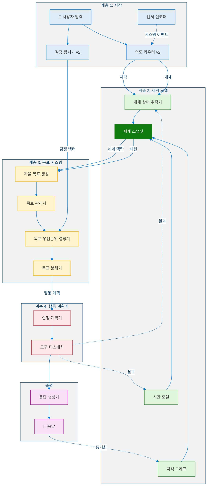
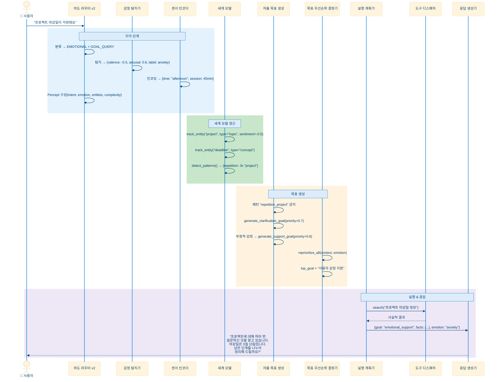
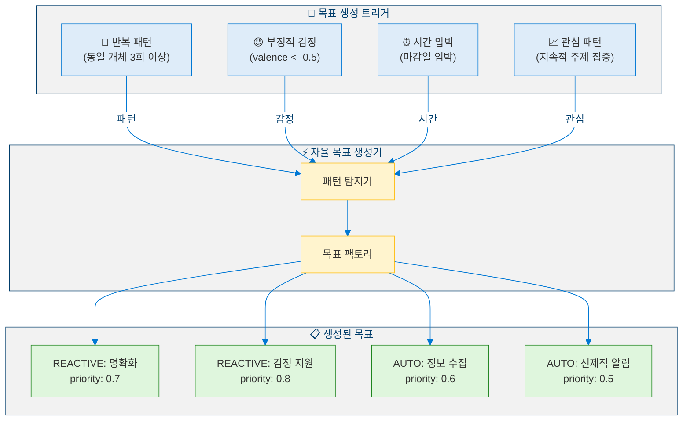
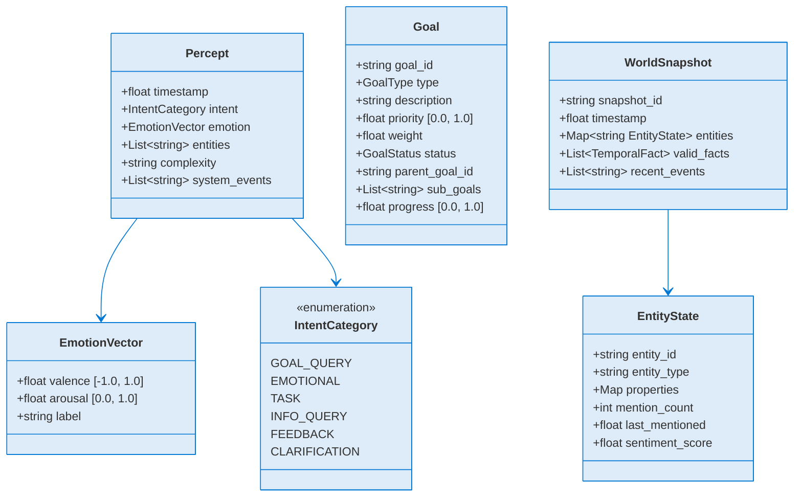
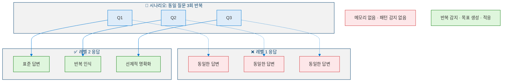
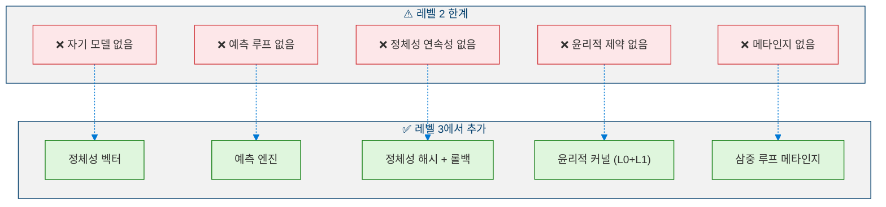
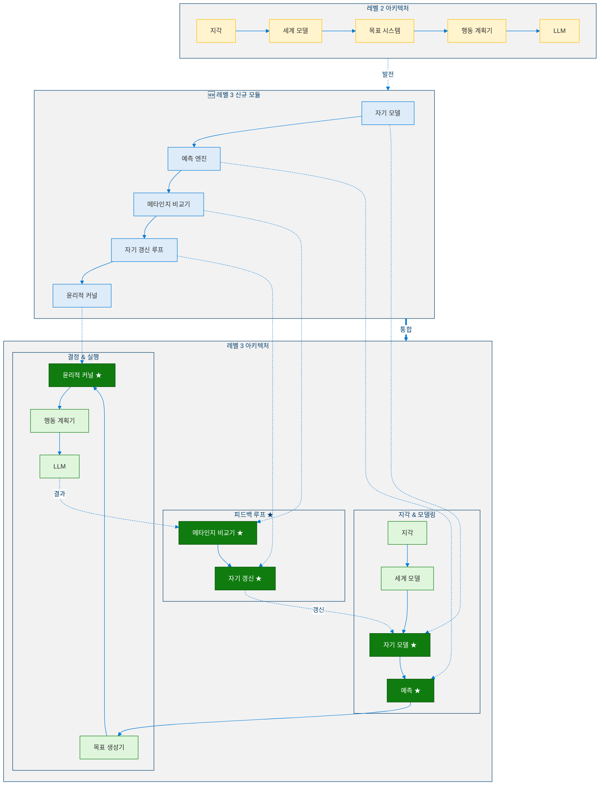

<!--
Copyright (c) 2026 Moon Hyuk Choi
Licensed under the MIT License.
See LICENSE file in the repository root for full license information.

Redistribution (commercial or non-commercial) must retain this notice.
Removal of attribution constitutes a license violation.
-->
# 레벨 2: 자율 에이전트 — 아키텍처 & 설계

> **MSCP 레벨 시리즈** | [레벨 1](Level_1_Tool_Agent.ko.md) ← 레벨 2 → [레벨 3](Level_3_Self_Regulating_Agent.ko.md)  
> **상태**: 🔬 **실험적** — 개념적 프레임워크 및 실험적 설계. 프로덕션 사양이 아닙니다.  
> **날짜**: 2026년 2월

---

## 1. 개요

레벨 2는 반응적 도구 호출을 넘어서는 첫 번째 중요한 도약을 나타냅니다. 자율 에이전트는 **내부 세계 모델**을 유지하고, 상호작용 전반에 걸쳐 개체를 추적하며, 감정적 맥락을 이해하고 — 핵심적으로 — 관찰된 패턴을 기반으로 **자체적으로 목표를 생성**할 수 있습니다.

> ⚠️ **참고**: 이 문서는 MSCP 분류 체계 내의 인지 수준을 설명합니다. 여기에 포함된 아키텍처, 의사코드 및 다이어그램은 구조적 개념을 탐색하는 실험적 설계이며 — 프로덕션 수준의 구현이 아닙니다.

### 1.1 정의 속성

| 속성 | 레벨 1 | 레벨 2 |
|------|:------:|:------:|
| 내부 상태 | 없음 | **세계 모델** (영속적) |
| 목표 설정 | 없음 | **자율적** (패턴 기반) |
| 자기인식 | 없음 | 없음 |
| 메모리 | 세션 범위 | **장기** (영속 저장소) |
| 개체 추적 | 없음 | **활성** (교차 세션) |
| 감정 이해 | 없음 | **정서가/각성** 분석 |
| 자율성 | 없음 | **중간** |

### 1.2 레벨 1과의 핵심 차이

레벨 1 에이전트는 **무기억 함수**입니다: `f(input) → output`. 
레벨 2 에이전트는 **상태 유지 프로세스**입니다: `f(input, world_state, goals) → (output, world_state', goals')`.

### 1.3 형식적 정의

> **정의 1 (레벨 2 에이전트).** 레벨 2 에이전트는 5-튜플로 정의되는 상태 유지 프로세스 $\mathcal{A}_2$입니다:
>
> $$\mathcal{A}_2 = \langle \mathcal{R}, \mathcal{O}, \mathcal{S}, \mathcal{G}, f \rangle$$
>
> 여기서 $\mathcal{R}$은 요청 공간, $\mathcal{O}$는 응답 공간, $\mathcal{S}$는 세계 상태 공간, $\mathcal{G}$는 목표 공간이며, $f$는 전이 함수입니다:
>
> $$f : \mathcal{R} \times \mathcal{S} \times \mathcal{G} \to \mathcal{O} \times \mathcal{S} \times \mathcal{G}$$
>
> 각 시간 단계 $t$에서:
>
> $$(o_t, s_{t+1}, G_{t+1}) = f(r_t, s_t, G_t)$$

이는 **상태 영속성**의 존재로 레벨 2를 레벨 1과 구별합니다 — 출력은 현재 입력만이 아니라 $s_t$에 인코딩된 전체 이력에 의존합니다.

> **정의 2 (세계 모델).** 세계 모델 $\mathcal{W}$는 세 개의 하위 구성요소로 이루어진 영속 저장소입니다:
>
> $$\mathcal{W} = \langle \mathcal{K}, \mathcal{E}, \Gamma \rangle$$
>
> 여기서:
> - $\mathcal{K}$ : 지식 그래프 — 정점 $V$ (개념), 간선 $E \subseteq V \times V$ (관계), 레이블링 함수 $\ell : E \to \Sigma$ (관계 유형)을 가진 유향 레이블 그래프 $\mathcal{K} = (V, E, \ell)$
> - $\mathcal{E}$ : 개체 상태 추적기 — 매핑 $\mathcal{E} : \text{EntityID} \to \text{EntityState}$
> - $\Gamma$ : 시간 모델 — 시간 제한된 사실의 집합 $\{(\text{fact}, t_{valid}, t_{expiry})\}$
>
> 시간 $t$에서의 통합 **세계 스냅샷**은 다음 투영입니다:
>
> $$s_t = \pi(\mathcal{K}_t, \mathcal{E}_t, \Gamma_t)$$

> **정의 3 (감정 벡터).** 감정 벡터 $e(t) \in \mathbb{R}^2$는 사용자 입력을 2차원 정서 공간에 매핑합니다:
>
> $$e(t) = \begin{pmatrix} v(t) \\ a(t) \end{pmatrix}, \quad v(t) \in [-1, 1], \quad a(t) \in [0, 1]$$
>
> 여기서 $v(t)$는 **정서가** (부정적에서 긍정적 감성)이고 $a(t)$는 **각성** (차분함에서 흥분된 강도)입니다.

> **정의 4 (목표).** 목표 $g \in \mathcal{G}$는 다음 튜플입니다:
>
> $$g = \langle \text{id}, \text{type}, \text{desc}, p, w, \text{status}, g_{\text{parent}}, \{g_{\text{sub}}\}, \text{progress} \rangle$$
>
> 여기서 $p \in [0,1]$는 우선순위이고 $w \in \mathbb{R}_{\geq 0}$는 가중치입니다. 목표는 **사용자 지시** ($\text{type} = \text{USER}$) 또는 **자율 생성** ($\text{type} = \text{AUTO}$) 중 하나입니다.

> **정의 5 (목표 우선순위 함수).** 목표의 동적 우선순위는 가중 조합으로 계산됩니다:
>
> $$p(g, t) = \alpha \cdot p_{\text{base}}(g) + \beta \cdot u(g, t) + \gamma \cdot \xi(g, e(t))$$
>
> 여기서:
> - $p_{\text{base}}(g)$는 정적 기본 우선순위
> - $u(g, t) \in [0,1]$는 **시간 긴급도** 요소 (마감일이 가까워질수록 단조 증가)
> - $\xi(g, e(t)) \in [0,1]$는 **감정 수정자** — 정서가 $v(t) < 0$일 때 반응적 목표가 더 높은 우선순위를 받음
> - $\alpha + \beta + \gamma = 1$ (일반적 값 $\alpha = 0.5,\ \beta = 0.3,\ \gamma = 0.2$)

> **정의 6 (자율 목표 생성).** 자율 목표 생성기는 세계 상태에서 감지된 패턴으로부터 새로운 목표를 생성하는 함수 $\Phi_{AG}$입니다:
>
> $$\Phi_{AG} : \mathcal{P}(\mathcal{S}) \times \mathcal{E} \to \mathcal{P}(\mathcal{G})$$
>
> 여기서 $\mathcal{P}(\cdot)$는 멱집합을 나타냅니다. 생성기는 다음 패턴 조건 중 하나라도 충족될 때 활성화됩니다:
>
> $$\text{mention count}(e, \Delta t) \geq \theta_{\text{rep}} \quad \text{(반복 패턴)}$$
>
> $$v(t) < -\theta_v \;\land\; a(t) > \theta_a \quad \text{(부정적 감정 상태)}$$
>
> $$t_{\text{deadline}} - t < \theta_{\text{urgency}} \quad \text{(시간 압박)}$$

### 1.4 개체 상태 추적

개체 상태 추적기는 개체 식별자에서 그들의 변화하는 상태로의 매핑을 유지합니다. 주어진 개체 $e_k$에 대해, 감성 점수는 **지수 이동 평균** (EMA)을 통해 갱신됩니다:

$$\text{sentiment}_{e_k}(t) = (1 - \lambda) \cdot \text{sentiment}_{e_k}(t-1) + \lambda \cdot v(t)$$

여기서 $\lambda \in (0,1)$는 평활 계수 (일반적으로 $\lambda = 0.3$)이며, 역사적 맥락을 보존하면서 최근 상호작용이 더 큰 영향을 미치도록 보장합니다.

---

## 2. 아키텍처

### 2.1 5계층 아키텍처

```mermaid
%%{init: {'theme': 'base', 'themeVariables': {'primaryColor': '#0078D4', 'primaryTextColor': '#003D6B', 'primaryBorderColor': '#003D6B', 'secondaryColor': '#50E6FF', 'secondaryTextColor': '#323130', 'secondaryBorderColor': '#00BCF2', 'tertiaryColor': '#F2F2F2', 'tertiaryTextColor': '#323130', 'lineColor': '#0078D4', 'textColor': '#323130', 'mainBkg': '#DEECF9', 'nodeBorder': '#0078D4', 'clusterBkg': '#F2F2F2', 'clusterBorder': '#003D6B', 'titleColor': '#003D6B', 'edgeLabelBackground': '#FFFFFF', 'fontSize': '14px'}}}%%
flowchart TD
  classDef perception fill:#0078D4,stroke:#003D6B,color:#FFF
  classDef perceptionLight fill:#DEECF9,stroke:#0078D4,color:#323130
  classDef world fill:#107C10,stroke:#085108,color:#FFF
  classDef worldLight fill:#DFF6DD,stroke:#107C10,color:#323130
  classDef goal fill:#FFB900,stroke:#CC9400,color:#323130
  classDef goalLight fill:#FFF4CE,stroke:#FFB900,color:#323130
  classDef action fill:#D13438,stroke:#A4262C,color:#FFF
  classDef actionLight fill:#FDE7E9,stroke:#D13438,color:#323130
  classDef cognitive fill:#B4009E,stroke:#8A0076,color:#FFF
  classDef cognitiveLight fill:#F9E0F7,stroke:#B4009E,color:#323130

  subgraph PL["계층 1: 지각"]
    direction LR
    IR["🎯 의도 라우터"]:::perceptionLight
    ED["💭 감정 탐지기"]:::perceptionLight
    SE["📡 센서 인코더"]:::perceptionLight
  end

  subgraph WM["계층 2: 세계 모델"]
    direction LR
    KG["🗄️ 지식 그래프"]:::worldLight
    ES["👤 개체 상태 추적기"]:::worldLight
    TM["⏱️ 시간 모델"]:::worldLight
  end

  subgraph GS["계층 3: 목표 시스템"]
    direction LR
    GM["🎯 목표 관리자"]:::goalLight
    AGG["⚡ 자율 목표 생성"]:::goalLight
    GP["📊 목표 우선순위 결정기"]:::goalLight
    GD["🔀 목표 분해기"]:::goalLight
  end

  subgraph AP["계층 4: 행동 계획기"]
    direction LR
    TD["🔧 도구 디스패처"]:::actionLight
    EP["📋 실행 계획기"]:::actionLight
  end

  subgraph CE["계층 5: 인지 엔진"]
    direction LR
    LLM["🧠 LLM 백엔드"]:::cognitiveLight
  end

  PL ==> WM
  WM ==> GS
  GS ==> AP
  AP ==> CE
```

<!-- Level 2 Five-Layer Architecture -->



### 2.2 상세 컴포넌트 상호작용

<!-- Level 2 Component Interaction -->



---

## 3. 데이터 흐름

### 3.1 전체 처리 시퀀스



### 3.2 자율 목표 생성 흐름

<!-- Level 2 Autonomous Goal Generation -->



---

## 4. 핵심 구성요소

### 4.1 지각 구조

<!-- Level 2 Percept Structure -->



---

## 5. 의사코드

### 5.1 핵심 에이전트 루프

```python
def level2_agent_loop(user_input: str, session_context: dict) -> Level2Response:
    """
    Level 2 core agent loop with world model and autonomous goal generation.
    Input:  user_input — user request, session_context — session state
    Output: Level2Response with content, active_goal, context_summary, emotion
    """

    # ═══ LAYER 1: PERCEPTION ═══
    percept = IntentRouter.route(user_input, session_context)
    emotion = EmotionDetector.detect(user_input)
    sensors = SensorEncoder.encode()

    # ═══ LAYER 2: WORLD MODEL UPDATE ═══
    for entity_id in percept.entities:
        WorldModel.entity_tracker.track(entity_id, sentiment=emotion.valence)

    world_context = WorldModel.get_context()

    # ═══ LAYER 3: AUTONOMOUS GOAL GENERATION ═══
    patterns = WorldModel.detect_patterns()
    auto_goals = GoalGenerator.generate_from_patterns(patterns, world_context)

    # Emotion-driven goal generation
    if emotion.valence < -0.5 and emotion.arousal > 0.5:
        support_goal = GoalManager.create(
            description="Provide emotional support and clarification",
            type=GoalType.AUTO_GENERATED,
            priority=0.8,
        )
        auto_goals.append(support_goal)

    # Dynamic reprioritization
    GoalPrioritizer.reprioritize_all(world_context, emotion)

    # ═══ LAYER 4: GOAL-DIRECTED RESPONSE ═══
    active_goal = GoalManager.get_top_priority()

    response_content = ResponseGenerator.generate(
        user_input=user_input,
        world_context=world_context,
        active_goal=active_goal,
        emotion=emotion,
    )

    # ═══ BACKGROUND: PERSIST STATE ═══
    asyncio.create_task(WorldModel.sync_to_store())

    return Level2Response(
        content=response_content,
        active_goal=active_goal,
        context_summary=summarize(world_context),
        emotion=emotion,
    )
```

### 5.2 개체 상태 추적기

```python
def track(self, entity_id: str, entity_type: str, sentiment: float) -> EntityState:
    """
    Track or update an entity's state.
    Input:  entity_id, entity_type, sentiment score
    Output: Updated EntityState
    """

    now = time.time()

    if entity_id in self.entities:
        entity = self.entities[entity_id]
        entity.mention_count += 1
        entity.last_mentioned = now
        # Exponential moving average for sentiment
        entity.sentiment_score = 0.7 * entity.sentiment_score + 0.3 * sentiment
    else:
        entity = EntityState(
            entity_id=entity_id,
            entity_type=entity_type,
            mention_count=1,
            first_mentioned=now,
            last_mentioned=now,
            sentiment_score=sentiment,
        )
        self.entities[entity_id] = entity

    self.mention_history.append((entity_id, now))
    return entity


def detect_repetition(self, entity_id: str, time_window: float) -> int:
    """
    Count mentions of entity_id within the last time_window seconds.
    """
    cutoff = time.time() - time_window
    count = sum(
        1 for eid, ts in self.mention_history
        if eid == entity_id and ts > cutoff
    )
    return count
```

### 5.3 목표 우선순위 결정기

```python
def compute_priority(self, goal: Goal, context: WorldContext, emotion: EmotionVector) -> float:
    """
    Dynamically recompute goal priority based on:
    - Time urgency (deadline proximity)
    - Emotional context (negative emotion boosts reactive goals)
    - Entity importance (frequently mentioned → higher priority)
    """

    base = goal.priority

    # Time urgency factor [0.0, 1.0]
    if goal.deadline is not None:
        remaining = goal.deadline - time.time()
        if remaining <= 0:
            time_mod = 1.0       # overdue
        elif remaining < 3600:   # < 1 hour
            time_mod = 0.9
        elif remaining < 86400:  # < 24 hours
            time_mod = 0.7
        else:
            time_mod = 0.5
    else:
        time_mod = 0.5

    # Emotion factor [0.0, 1.0]
    if goal.type == GoalType.REACTIVE and emotion.valence < 0:
        emotion_mod = 0.8
    else:
        emotion_mod = 0.5

    # Weighted combination
    final = 0.5 * base + 0.3 * time_mod + 0.2 * emotion_mod
    return max(0.0, min(1.0, final))
```

---

## 6. 레벨 1 대 레벨 2: 행동 비교

### 6.1 동일 시나리오 — 다른 행동

<!-- Level 2 Behavioral Comparison -->



---

## 7. 레벨 2의 구조적 한계

레벨 2가 여전히 **할 수 없는** 것 (레벨 3의 필요성). 이러한 한계는 형식적으로 표현될 수 있습니다.

### 7.1 한계의 형식적 특성화

> **명제 1 (자기 모델 부재).** 레벨 2 에이전트는 자체 아키텍처, 능력 또는 정체성에 대한 표현 $M_{\text{self}}$가 없습니다:
>
> $$M_{\text{self}} = \emptyset \implies \nexists\; \text{predict} : \mathcal{S} \times \text{Action} \to \Delta \mathcal{S}_{\text{self}}$$
>
> 에이전트는 자신의 행동이 내부 상태를 어떻게 변경하는지 예측할 수 없으며, 이는 자기조절을 불가능하게 합니다.

> **명제 2 (탐지 불가능한 드리프트).** 정체성 추적 없이, 초기 목표 집합과 현재 목표 집합 간의 드리프트 $\delta(t) = \|G_t - G_0\|_2$는 조용히 축적됩니다:
>
> $$\lim_{t \to \infty} \delta(t) = \text{unbounded}$$
>
> $G_t$를 기준과 비교하는 메커니즘이 없으므로, 가치 드리프트와 목표 드리프트는 에이전트에게 **보이지 않습니다**.

> **명제 3 (윤리적 제약 부재).** 생성된 목표를 필터링하는 제약 집합 $\mathcal{C}$가 존재하지 않습니다:
>
> $$\forall\, g \in \Phi_{AG}(\mathcal{S}, \mathcal{E}) : g \text{ 는 무조건적으로 수용됨}$$
>
> 에이전트는 안전 또는 윤리적 원칙과 충돌하는 목표를 거부할 수 없습니다.

### 7.2 한계 분류 체계

<!-- Level 2 Structural Limitations -->



---

## 8. 레벨 3으로의 전환

레벨 3으로의 전환은 구조적 자기인식을 도입합니다 — 에이전트는 자기 자신을 하나의 독립적 개체로서의 모델을 획득합니다.

> **정의 7 (레벨 2 → 레벨 3 전환).** 에이전트 $\mathcal{A}_2$가 $\mathcal{A}_3$로 승격되려면 다음을 획득해야 합니다:
>
> $$\mathcal{A}_2 \xrightarrow{\Delta_{2 \to 3}} \mathcal{A}_3 \iff \mathcal{A}_3 = \mathcal{A}_2 \oplus \{M_{\text{self}}, \Pi, \mathcal{C}, \Lambda\}$$
>
> 여기서:
> - $M_{\text{self}}$ : 자기 모델 (정체성 벡터 + 능력 모델 + 가치 모델)
> - $\Pi$ : 자기 영향 예측을 포함한 예측 엔진 ($\Pi : \text{Action} \to \Delta M_{\text{self}}$)
> - $\mathcal{C}$ : 윤리적 제약 커널 (불변 계층 0 + 적응적 계층 1)
> - $\Lambda$ : 메타인지 비교기 (예측 → 관찰 → 갱신 루프)
>
> 전이 함수는 반사적 인식을 획득합니다:
>
> $$f_3 : \mathcal{R} \times \mathcal{S} \times \mathcal{G} \times M_{\text{self}} \to \mathcal{O} \times \mathcal{S}' \times \mathcal{G}' \times M'_{\text{self}}$$

### 8.1 아키텍처 델타

<!-- Level 2 to Level 3 Transition -->



---

## References

1. Park, J.S., et al. "Generative Agents: Interactive Simulacra of Human Behavior." *UIST 2023*. [arXiv:2304.03442](https://arxiv.org/abs/2304.03442) (Autonomous agent behavior and world model)
2. Wang, G., et al. "Voyager: An Open-Ended Embodied Agent with Large Language Models." *arXiv 2023*. [arXiv:2305.16291](https://arxiv.org/abs/2305.16291) (Autonomous goal generation and skill acquisition)
3. Rao, A.S. & Georgeff, M.P. "BDI Agents: From Theory to Practice." *ICMAS 1995*. (Belief-Desire-Intention architecture — foundational for goal systems)
4. Picard, R.W. *Affective Computing.* MIT Press, 1997. (Emotion detection and valence/arousal models)
5. Huang, W., et al. "Inner Monologue: Embodied Reasoning through Planning with Language Models." *CoRL 2022*. [arXiv:2207.05608](https://arxiv.org/abs/2207.05608) (Internal reasoning and feedback loops)
6. Wang, X., et al. "Plan-and-Solve Prompting: Improving Zero-Shot Chain-of-Thought Reasoning." *ACL 2023*. [arXiv:2305.04091](https://arxiv.org/abs/2305.04091) (Goal decomposition and multi-step planning)
7. Wang, L., et al. "A Survey on Large Language Model based Autonomous Agents." *arXiv 2023*. [arXiv:2308.11432](https://arxiv.org/abs/2308.11432) (Agent survey including autonomy taxonomy)
8. Sumers, T.R., et al. "Cognitive Architectures for Language Agents." *arXiv 2023*. [arXiv:2309.02427](https://arxiv.org/abs/2309.02427) (Cognitive architecture for LLM agents)
9. Russell, S. & Norvig, P. *Artificial Intelligence: A Modern Approach.* 4th Edition, Pearson, 2021. (Goal-directed agent formalization)
10. Ekman, P. "An Argument for Basic Emotions." *Cognition & Emotion*, 6(3–4), 169–200, 1992. [DOI:10.1080/02699939208411068](https://doi.org/10.1080/02699939208411068) (Emotion classification framework)

---

> **이전**: [← 레벨 1: 도구 에이전트](Level_1_Tool_Agent.ko.md)  
> **다음**: [레벨 3: 자기조절 인지 에이전트 →](Level_3_Self_Regulating_Agent.ko.md)
