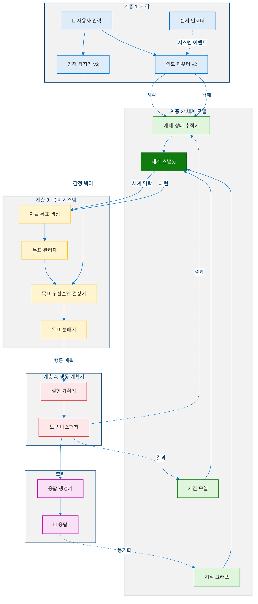
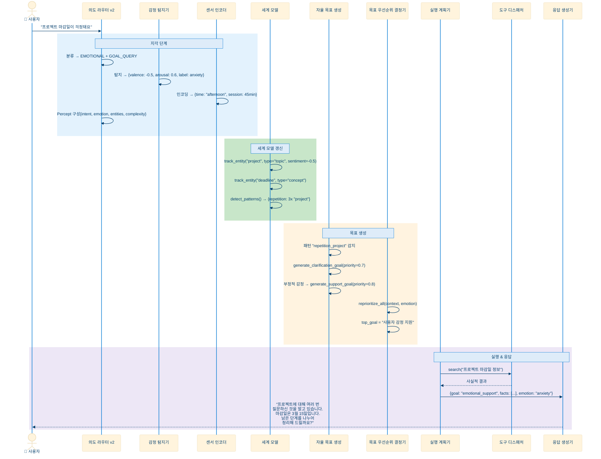
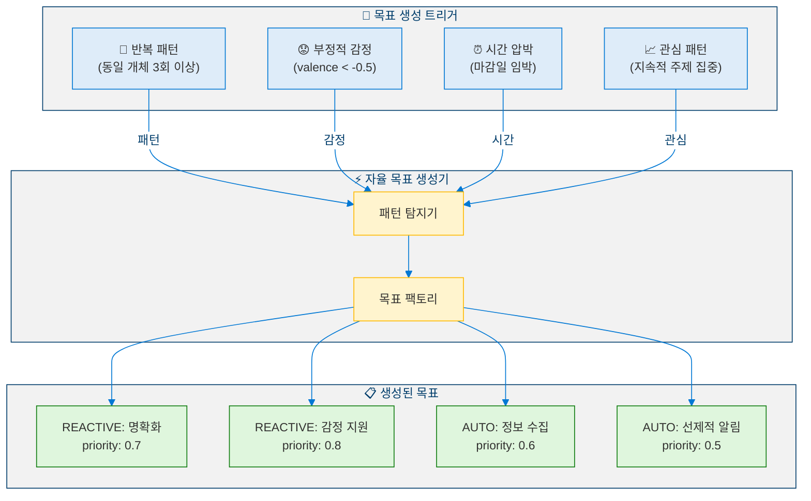
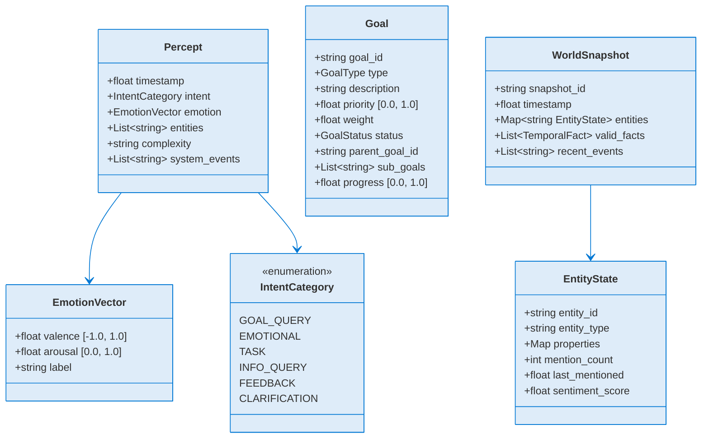
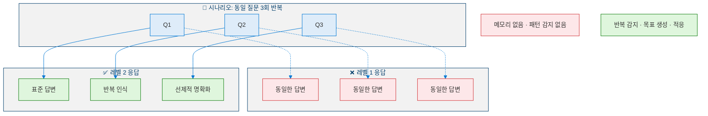
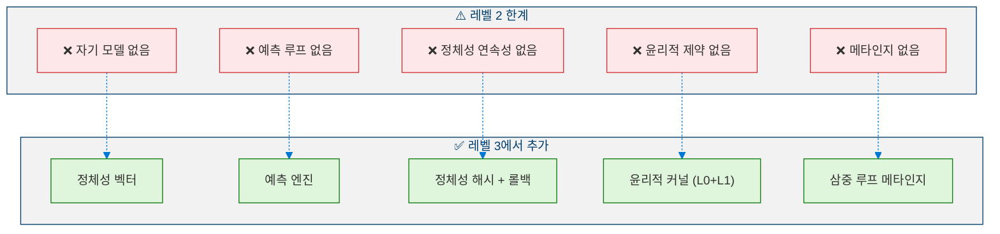
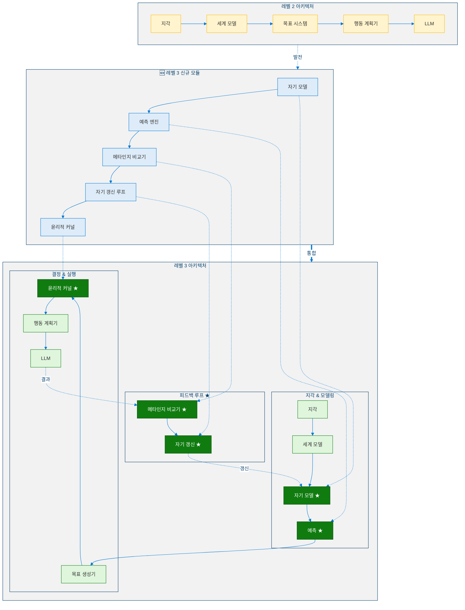

<!--
Copyright (c) 2026 Moon Hyuk Choi
Licensed under the MIT License.
See LICENSE file in the repository root for full license information.

Redistribution (commercial or non-commercial) must retain this notice.
Removal of attribution constitutes a license violation.
-->
# 레벨 2: 자율 에이전트 - 아키텍처 & 설계

> **MSCP 레벨 시리즈** | [레벨 1](Level_1_Tool_Agent.ko.md) ← 레벨 2 → [레벨 3](Level_3_Self_Regulating_Agent.ko.md)  
> **상태**: 🔬 **실험적** - 개념적 프레임워크 및 실험적 설계. 프로덕션 사양이 아닙니다.  
> **날짜**: 2026년 2월

## Revision History

| Version | Date | Description |
|---------|------|-------------|
| 0.1.0 | 2026-02-23 | Initial document creation with formal Definitions 1-7, Propositions 1-3 |
| 0.2.0 | 2026-02-26 | Added overview essence formula; added revision history table; reinforced entity lifecycle, importance scoring, and world model architecture from specs |

---

## 1. 개요

레벨 2는 반응적 도구 호출을 넘어서는 첫 번째 중요한 도약을 나타냅니다. 자율 에이전트는 **내부 세계 모델**을 유지하고, 상호작용 전반에 걸쳐 개체를 추적하며, 감정적 맥락을 이해하고 - 핵심적으로 - 관찰된 패턴을 기반으로 **자체적으로 목표를 생성**할 수 있습니다.

> **Level Essence.** 레벨 2 에이전트는 누적된 세계 상태와 진화하는 목표에 의존하는 상태 기반 프로세스 - 전이 함수가 매 응답마다 상태와 목표를 함께 갱신:
>
> $$(o_t,\; s_{t+1},\; G_{t+1}) = f(r_t,\; s_t,\; G_t)$$

> ⚠️ **참고**: 이 문서는 MSCP 분류 체계 내의 인지 수준을 설명합니다. 여기에 포함된 아키텍처, 의사코드 및 다이어그램은 구조적 개념을 탐색하는 실험적 설계이며 - 프로덕션 수준의 구현이 아닙니다.

### 1.1 정의 속성

| 속성 | 레벨 1 | 레벨 2 |
|------|:------:|:------:|
| 내부 상태 | 없음 | **세계 모델** (영속적) |
| 목표 설정 | 없음 | **자율적** (패턴 기반) |
| 자기인식 | 없음 | 없음 |
| 메모리 | 세션 범위 | **장기** (영속 저장소) |
| 개체 추적 | 없음 | **활성** (교차 세션) |
| 감정 이해 | 없음 | **정서가/각성** 분석 |
| 자율성 | 없음 | **중간** |

### 1.2 레벨 1과의 핵심 차이

레벨 1 에이전트는 **무기억 함수**입니다: `f(input) → output`. 
레벨 2 에이전트는 **상태 유지 프로세스**입니다: `f(input, world_state, goals) → (output, world_state', goals')`.

### 1.3 형식적 정의

> **정의 1 (레벨 2 에이전트).** 레벨 2 에이전트는 5-튜플로 정의되는 상태 유지 프로세스 $\mathcal{A}_2$입니다:
>
> $$\mathcal{A}_2 = \langle \mathcal{R}, \mathcal{O}, \mathcal{S}, \mathcal{G}, f \rangle$$
>
> 여기서 $\mathcal{R}$은 요청 공간, $\mathcal{O}$는 응답 공간, $\mathcal{S}$는 세계 상태 공간, $\mathcal{G}$는 목표 공간이며, $f$는 전이 함수입니다:
>
> $$f : \mathcal{R} \times \mathcal{S} \times \mathcal{G} \to \mathcal{O} \times \mathcal{S} \times \mathcal{G}$$
>
> 각 시간 단계 $t$에서:
>
> $$(o_t, s_{t+1}, G_{t+1}) = f(r_t, s_t, G_t)$$

이는 **상태 영속성**의 존재로 레벨 2를 레벨 1과 구별합니다 - 출력은 현재 입력만이 아니라 $s_t$에 인코딩된 전체 이력에 의존합니다.

> **정의 2 (세계 모델).** 세계 모델 $\mathcal{W}$는 세 개의 하위 구성요소로 이루어진 영속 저장소입니다:
>
> $$\mathcal{W} = \langle \mathcal{K}, \mathcal{E}, \Gamma \rangle$$
>
> 여기서:
> - $\mathcal{K}$ : 지식 그래프 - 정점 $V$ (개념), 간선 $E \subseteq V \times V$ (관계), 레이블링 함수 $\ell : E \to \Sigma$ (관계 유형)을 가진 유향 레이블 그래프 $\mathcal{K} = (V, E, \ell)$
> - $\mathcal{E}$ : 개체 상태 추적기 - 매핑 $\mathcal{E} : \text{EntityID} \to \text{EntityState}$
> - $\Gamma$ : 시간 모델 - 시간 제한된 사실의 집합 $\{(\text{fact}, t_{valid}, t_{expiry})\}$
>
> 시간 $t$에서의 통합 **세계 스냅샷**은 다음 투영입니다:
>
> $$s_t = \pi(\mathcal{K}_t, \mathcal{E}_t, \Gamma_t)$$

> **정의 3 (감정 벡터).** 감정 벡터 $e(t) \in \mathbb{R}^2$는 사용자 입력을 2차원 정서 공간에 매핑합니다:
>
> $$e(t) = \begin{pmatrix} v(t) \\ a(t) \end{pmatrix}, \quad v(t) \in [-1, 1], \quad a(t) \in [0, 1]$$
>
> 여기서 $v(t)$는 **정서가** (부정적에서 긍정적 감성)이고 $a(t)$는 **각성** (차분함에서 흥분된 강도)입니다.

> **정의 4 (목표).** 목표 $g \in \mathcal{G}$는 다음 튜플입니다:
>
> $$g = \langle \text{id}, \text{type}, \text{desc}, p, w, \text{status}, g_{\text{parent}}, \{g_{\text{sub}}\}, \text{progress} \rangle$$
>
> 여기서 $p \in [0,1]$는 우선순위이고 $w \in \mathbb{R}_{\geq 0}$는 가중치입니다. 목표는 **사용자 지시** ($\text{type} = \text{USER}$) 또는 **자율 생성** ($\text{type} = \text{AUTO}$) 중 하나입니다.

> **정의 5 (목표 우선순위 함수).** 목표의 동적 우선순위는 가중 조합으로 계산됩니다:
>
> $$p(g, t) = \alpha \cdot p_{\text{base}}(g) + \beta \cdot u(g, t) + \gamma \cdot \xi(g, e(t))$$
>
> 여기서:
> - $p_{\text{base}}(g)$는 정적 기본 우선순위
> - $u(g, t) \in [0,1]$는 **시간 긴급도** 요소 (마감일이 가까워질수록 단조 증가)
> - $\xi(g, e(t)) \in [0,1]$는 **감정 수정자** - 정서가 $v(t) < 0$일 때 반응적 목표가 더 높은 우선순위를 받음
> - $\alpha + \beta + \gamma = 1$ (일반적 값 $\alpha = 0.5,\ \beta = 0.3,\ \gamma = 0.2$)

> **정의 6 (자율 목표 생성).** 자율 목표 생성기는 세계 상태에서 감지된 패턴으로부터 새로운 목표를 생성하는 함수 $\Phi_{AG}$입니다:
>
> $$\Phi_{AG} : \mathcal{P}(\mathcal{S}) \times \mathcal{E} \to \mathcal{P}(\mathcal{G})$$
>
> 여기서 $\mathcal{P}(\cdot)$는 멱집합을 나타냅니다. 생성기는 다음 패턴 조건 중 하나라도 충족될 때 활성화됩니다:
>
> $$\text{mention count}(e, \Delta t) \geq \theta_{\text{rep}} \quad \text{(반복 패턴)}$$
>
> $$v(t) < -\theta_v \;\land\; a(t) > \theta_a \quad \text{(부정적 감정 상태)}$$
>
> $$t_{\text{deadline}} - t < \theta_{\text{urgency}} \quad \text{(시간 압박)}$$

### 1.4 개체 상태 추적

개체 상태 추적기는 개체 식별자에서 그들의 변화하는 상태로의 매핑을 유지합니다. 주어진 개체 $e_k$에 대해, 감성 점수는 **지수 이동 평균** (EMA)을 통해 갱신됩니다:

$$\text{sentiment}_{e_k}(t) = (1 - \lambda) \cdot \text{sentiment}_{e_k}(t-1) + \lambda \cdot v(t)$$

여기서 $\lambda \in (0,1)$는 평활 계수 (일반적으로 $\lambda = 0.3$)이며, 역사적 맥락을 보존하면서 최근 상호작용이 더 큰 영향을 미치도록 보장합니다.

#### 1.4.1 개체 생명주기

추적되는 각 개체는 세 단계 생명주기를 따릅니다:

$$\text{lifecycle}(e_k) : \text{NEW} \xrightarrow{\text{언급 횟수} \geq 1} \text{ACTIVE} \xrightarrow{\Delta t > \theta_{\text{stale}}} \text{STALE}$$

여기서 $\Delta t = t_{\text{now}} - t_{\text{last mentioned}}$이고 $\theta_{\text{stale}}$는 진부화 임계값입니다. STALE 개체는 세계 모델에 남지만 맥락 형성에서 가중치가 축소됩니다. 어떤 개체도 삭제되지 않으며 — 단지 감쇠될 뿐입니다.

#### 1.4.2 개체 중요도 점수

시점 $t$에서 개체 $e_k$의 중요도는 **최근성(recency)** 과 **빈도(frequency)** 의 가중 결합입니다:

$$\operatorname{importance}(e_k, t) = \alpha_r \cdot \operatorname{recency}(e_k, t) + \alpha_f \cdot \operatorname{frequency}(e_k)$$

여기서:

$$\operatorname{recency}(e_k, t) = \frac{1}{1 + (t - t_{\text{last}}(e_k)) / \tau}, \quad \operatorname{frequency}(e_k) = \min\!\left(1,\; \frac{\text{언급 횟수}(e_k)}{N_{\text{cap}}}\right)$$

시간 상수 $\tau$(통상 3600초), 언급 한도 $N_{\text{cap}} = 10$, 통상 가중치 $\alpha_r = 0.4$, $\alpha_f = 0.6$입니다.

### 1.5 세계 모델 아키텍처

세계 모델은 세 계층의 개념적 아키텍처로 동작합니다:

1. **인지 계층** ($\mathcal{W}$): 통합 세계 모델(정의 2) — 지식 그래프, 개체 상태, 시간적 사실을 외부 현실에 대한 일관된 표현으로 유지.
2. **세션 계층** ($\mathcal{M}_{\text{session}}$): 현재 상호작용 세션의 활성 맥락 창을 보유하는 작업 메모리(최근 참조 개체와 그 관련성 점수 포함).
3. **영속 계층** ($\mathcal{P}_{\text{store}}$): 키워드 매칭·의미 유사도·그래프 순회를 결합한 하이브리드 검색을 통해 세션 간 개체 추적과 시간적 사실 조회를 가능하게 하는 장기 저장소(예: 그래프 데이터베이스).

정의 2의 투영 함수는 세 계층 전반에 걸쳐 동작합니다:

$$s_t = \pi(\mathcal{W}_t) = \pi_{\text{cog}}(\mathcal{K}_t) \oplus \pi_{\text{session}}(\mathcal{M}_{\text{session},t}) \oplus \pi_{\text{retrieve}}(\mathcal{P}_{\text{store}}, q_t)$$

여기서 $q_t$는 현재 질의 맥락이고 $\oplus$는 맥락 연결(concatenation)입니다.

### 1.6 환경 상태

외부 지식을 표현하는 세계 모델 외에도, 레벨 2 에이전트는 자신의 **운영 환경(operational environment)** 에 대한 실시간 스냅샷을 유지합니다. 이는 지식 그래프와는 구분되며 — 외부 세계의 사실이 아니라 에이전트 자신의 인프라 건강 상태를 추적합니다.

> **정의 2.1 (환경 상태).** 환경 상태 $\mathcal{E}_{\text{env}}(t)$는 에이전트의 운영 맥락을 표현하는 구조화된 튜플입니다:
>
> $$\mathcal{E}_{\text{env}}(t) = \langle \ell(t),\; \mathcal{T}_{\text{active}}(t),\; r_{\text{err}}(t),\; \lambda_{\text{resp}}(t),\; d_{\text{session}}(t) \rangle$$
>
> 여기서:
> - $\ell(t) \in [0,1]$ — **시스템 부하**: 계산 자원 활용도의 정규화 측정. $0$은 유휴, $1$은 완전 포화.
> - $\mathcal{T}_{\text{active}}(t) \subseteq \mathcal{T}$ — **활성 도구**: 현재 접근 가능한 사용 가능 도구의 부분집합(API 실패나 속도 제한으로 도구가 사용 불가능해질 수 있음).
> - $r_{\text{err}}(t) \in [0,1]$ — **오류율**: 최근 도구 호출 중 오류를 반환한 비율. 슬라이딩 윈도우 상에서 계산: $r_{\text{err}}(t) = |\{i \in W_t : T_i = \textit{err}\}| / |W_t|$, $W_t$는 최근 호출 윈도우.
> - $\lambda_{\text{resp}}(t) \in \mathbb{R}_{\geq 0}$ — **응답 지연**: 최근 요청에 대한 평균 응답 시간(밀리초).
> - $d_{\text{session}}(t) \in \mathbb{R}_{\geq 0}$ — **세션 지속 시간**: 현재 세션 시작 이후 경과 시간(초).
>
> **지식 상태**($\mathcal{W}$)와 **운영 상태**($\mathcal{E}_{\text{env}}$)의 구분은 중요합니다: 세계 모델은 *"에이전트가 외부 현실에 대해 무엇을 알고 있는가?"* 에 답하는 반면, 환경 상태는 *"에이전트의 운영 맥락이 지금 얼마나 건강한가?"* 에 답합니다.

환경 상태는 목표 우선순위 함수(정의 5)의 추가 인자로 공급됩니다: 시스템 부하 $\ell(t)$가 높거나 오류율 $r_{\text{err}}(t)$가 임계값을 초과하면, 에이전트는 자율적으로 SYSTEM 타입 목표를 생성해 행동을 적응시킬 수 있습니다(예: 도구 호출 빈도를 줄이거나 캐시된 응답으로 전환).

### 1.7 대화 맥락

**대화 맥락(conversation context)** 은 현재 상호작용 세션에 대한 에이전트의 작업 메모리입니다. 영속적인 세계 모델($\mathcal{W}$)과 달리 — 장기 사실 지식이 아니라 단기 대화 역학을 추적합니다.

대화 맥락 $\mathcal{C}_{\text{conv}}(t)$는 다음 상태를 유지합니다:

| 필드 | 타입 | 설명 |
|------|------|------|
| $n_{\text{turn}}$ | $\mathbb{N}$ | **턴 수** — 현재 세션에서의 교환 횟수 |
| $\mathcal{H}_{\text{topic}}$ | $\text{List}(\text{String})$ | **주제 이력** — 논의된 주제의 순서 있는 목록(최대 50). 패턴 감지 가능. |
| $\tau_{\text{current}}$ | $\text{String}$ | **현재 주제** — 추론된 활성 주제 |
| $\ell_{\text{lang}}$ | $\text{String}$ | **언어** — 사용자에 대해 감지된 언어 |
| $\chi_{\text{trend}}$ | $[-1,1]$ | **복잡도 추세** — 시간에 따른 요청 복잡도의 방향. 양수는 복잡도 증가, 음수는 단순화. |
| $e_{\text{trend}}$ | $[-1,1]$ | **감정 추세** — 시간에 따른 감정 가치의 방향. 사용자가 더 긍정적/부정적으로 변하는지 추적. |
| $\iota_{\text{last}}$ | $\text{Intent}$ | **최근 의도** — 가장 최근에 분류된 사용자 의도 |

대화 맥락은 레벨 1에서는 불가능한 여러 레벨 2 능력을 가능하게 합니다:

- **주제 연속성**: $\tau_{\text{current}}$가 여러 턴에 걸쳐 지속되면, 사용자가 맥락을 다시 설정하지 않아도 점점 더 초점 있는 응답이 가능.
- **감정 적응**: $e_{\text{trend}} < -0.3$(지속적으로 부정적)이면, 자율 목표 생성기(정의 6)가 정서적 지원을 위한 REACTIVE 목표를 활성화.
- **복잡도 매칭**: 에이전트는 $\chi_{\text{trend}}$에 따라 응답 상세 수준을 조정 — 복잡도 추세가 하강하면 단순화, 상승하면 더 깊이 있는 설명.

### 1.8 지각(percept) 추적

들어오는 각 요청은 처리 전에 구조화된 **지각(percept)** 으로 인코딩됩니다. 지각은 단일 사용자 상호작용에서 추출된 모든 정보의 통합 표현입니다:

$$\text{Percept}(t) = \langle \iota(t),\; e(t),\; \mathcal{E}_{\text{ref}}(t),\; \xi(t),\; t \rangle$$

여기서 $\iota(t)$는 분류된 의도, $e(t) \in \mathbb{R}^2$는 감정 벡터(정의 3), $\mathcal{E}_{\text{ref}}(t)$는 참조된 개체 집합, $\xi(t) \in [0,1]$는 추정 요청 복잡도, $t$는 타임스탬프입니다.

에이전트는 가장 최근 $N_{\text{max}} = 100$개 지각의 **유한 지각 버퍼(bounded percept buffer)** 를 유지합니다. 이 버퍼는 두 가지 용도가 있습니다:

1. **추세 분석**: 지각 버퍼에 대한 슬라이딩 윈도우 계산이 대화 맥락에서 사용되는 복잡도 추세 $\chi_{\text{trend}}$와 감정 추세 $e_{\text{trend}}$를 생성.
2. **패턴 감지**: 자율 목표 생성기(정의 6)는 지각 버퍼에서 반복되는 개체, 감정 변동, 시간적 패턴을 스캔해 목표 합성을 트리거.

---

## 2. 아키텍처

### 2.1 5계층 아키텍처

<!-- Level 2 Five-Layer Architecture -->


```mermaid
%%{init: {'theme': 'base', 'themeVariables': {'primaryColor': '#0078D4', 'primaryTextColor': '#003D6B', 'primaryBorderColor': '#003D6B', 'secondaryColor': '#50E6FF', 'secondaryTextColor': '#323130', 'secondaryBorderColor': '#00BCF2', 'tertiaryColor': '#F2F2F2', 'tertiaryTextColor': '#323130', 'lineColor': '#0078D4', 'textColor': '#323130', 'mainBkg': '#DEECF9', 'nodeBorder': '#0078D4', 'clusterBkg': '#F2F2F2', 'clusterBorder': '#003D6B', 'titleColor': '#003D6B', 'edgeLabelBackground': '#FFFFFF', 'fontSize': '14px'}}}%%
flowchart TD
  classDef perception fill:#0078D4,stroke:#003D6B,color:#FFF
  classDef perceptionLight fill:#DEECF9,stroke:#0078D4,color:#323130
  classDef world fill:#107C10,stroke:#085108,color:#FFF
  classDef worldLight fill:#DFF6DD,stroke:#107C10,color:#323130
  classDef goal fill:#FFB900,stroke:#CC9400,color:#323130
  classDef goalLight fill:#FFF4CE,stroke:#FFB900,color:#323130
  classDef action fill:#D13438,stroke:#A4262C,color:#FFF
  classDef actionLight fill:#FDE7E9,stroke:#D13438,color:#323130
  classDef cognitive fill:#B4009E,stroke:#8A0076,color:#FFF
  classDef cognitiveLight fill:#F9E0F7,stroke:#B4009E,color:#323130

  subgraph PL["계층 1: 지각"]
    direction LR
    IR["🎯 의도 라우터"]:::perceptionLight
    ED["💭 감정 탐지기"]:::perceptionLight
    SE["📡 센서 인코더"]:::perceptionLight
  end

  subgraph WM["계층 2: 세계 모델"]
    direction LR
    KG["🗄️ 지식 그래프"]:::worldLight
    ES["👤 개체 상태 추적기"]:::worldLight
    TM["⏱️ 시간 모델"]:::worldLight
  end

  subgraph GS["계층 3: 목표 시스템"]
    direction LR
    GM["🎯 목표 관리자"]:::goalLight
    AGG["⚡ 자율 목표 생성"]:::goalLight
    GP["📊 목표 우선순위 결정기"]:::goalLight
    GD["🔀 목표 분해기"]:::goalLight
  end

  subgraph AP["계층 4: 행동 계획기"]
    direction LR
    TD["🔧 도구 디스패처"]:::actionLight
    EP["📋 실행 계획기"]:::actionLight
  end

  subgraph CE["계층 5: 인지 엔진"]
    direction LR
    LLM["🧠 LLM 백엔드"]:::cognitiveLight
  end

  PL ==> WM
  WM ==> GS
  GS ==> AP
  AP ==> CE
```

### 2.2 상세 컴포넌트 상호작용

<!-- Level 2 Component Interaction -->


```mermaid
%%{init: {'theme': 'base', 'themeVariables': {'primaryColor': '#0078D4', 'primaryTextColor': '#003D6B', 'primaryBorderColor': '#003D6B', 'secondaryColor': '#50E6FF', 'secondaryTextColor': '#323130', 'secondaryBorderColor': '#00BCF2', 'tertiaryColor': '#F2F2F2', 'tertiaryTextColor': '#323130', 'lineColor': '#0078D4', 'textColor': '#323130', 'mainBkg': '#DEECF9', 'nodeBorder': '#0078D4', 'clusterBkg': '#F2F2F2', 'clusterBorder': '#003D6B', 'titleColor': '#003D6B', 'edgeLabelBackground': '#FFFFFF', 'fontSize': '14px'}}}%%
flowchart TD
  classDef perceptionLight fill:#DEECF9,stroke:#0078D4,color:#323130
  classDef worldLight fill:#DFF6DD,stroke:#107C10,color:#323130
  classDef worldAccent fill:#107C10,stroke:#085108,color:#FFF
  classDef goalLight fill:#FFF4CE,stroke:#FFB900,color:#323130
  classDef actionLight fill:#FDE7E9,stroke:#D13438,color:#323130
  classDef outputLight fill:#F9E0F7,stroke:#B4009E,color:#323130
  classDef feedback fill:#F2F2F2,stroke:#8A8886,color:#323130

  subgraph Perception["계층 1: 지각"]
    direction LR
    UserInput["👤 사용자 입력"]:::perceptionLight
    IRv2["의도 라우터 v2"]:::perceptionLight
    EDv2["감정 탐지기 v2"]:::perceptionLight
    SEn["센서 인코더"]:::perceptionLight
    UserInput --> IRv2
    UserInput --> EDv2
    SEn -.->|시스템 이벤트| IRv2
  end

  subgraph WorldModel["계층 2: 세계 모델"]
    direction LR
    EST["개체 상태 추적기"]:::worldLight
    TML["시간 모델"]:::worldLight
    KG["지식 그래프"]:::worldLight
    WS["세계 스냅샷"]:::worldAccent
    EST --> WS
    TML --> WS
    KG --> WS
  end

  subgraph GoalSystem["계층 3: 목표 시스템"]
    direction LR
    AGG["자율 목표 생성"]:::goalLight
    GMgr["목표 관리자"]:::goalLight
    GP["목표 우선순위 결정기"]:::goalLight
    GD["목표 분해기"]:::goalLight
    AGG --> GMgr
    GMgr --> GP --> GD
  end

  subgraph ActionPlanner["계층 4: 행동 계획기"]
    direction LR
    EP["실행 계획기"]:::actionLight
    TD["도구 디스패처"]:::actionLight
  end

  subgraph Response["출력"]
    RG["응답 생성기"]:::outputLight
    OUT["📝 응답"]:::outputLight
  end

  IRv2 -->|지각| EST
  IRv2 -->|개체| EST
  EDv2 -->|감정 벡터| GP
  WS -->|세계 맥락| AGG
  WS -->|패턴| AGG
  GD -->|행동 계획| EP
  EP --> TD
  TD --> RG
  RG --> OUT

  TD -.->|결과| EST
  TD -.->|결과| TML
  OUT -.->|동기화| KG
```

---

## 3. 데이터 흐름

### 3.1 전체 처리 시퀀스


```mermaid
%%{init: {'theme': 'base', 'themeVariables': {'actorTextColor': '#003D6B', 'actorLineColor': '#0078D4', 'signalColor': '#003D6B', 'signalTextColor': '#003D6B', 'labelTextColor': '#003D6B', 'loopTextColor': '#003D6B', 'noteBkgColor': '#DEECF9', 'noteTextColor': '#003D6B', 'noteBorderColor': '#0078D4', 'activationBkgColor': '#E1DFDD', 'activationBorderColor': '#605E5C', 'sequenceNumberColor': '#FFF', 'textColor': '#323130', 'fontSize': '14px'}}}%%
sequenceDiagram
    actor U as 👤 사용자
    participant IR as 의도 라우터 v2
    participant ED as 감정 탐지기
    participant SE as 센서 인코더
    participant WM as 세계 모델
    participant AG as 자율 목표 생성
    participant GP as 목표 우선순위 결정기
    participant EP as 실행 계획기
    participant TD as 도구 디스패처
    participant RG as 응답 생성기

    U->>IR: "프로젝트 마감일이 걱정돼요"

    rect rgb(227, 242, 253)
        Note over IR,SE: 지각 단계
        IR->>IR: 분류 → EMOTIONAL + GOAL_QUERY
        ED->>ED: 탐지 → {valence: -0.5, arousal: 0.6, label: anxiety}
        SE->>SE: 인코딩 → {time: "afternoon", session: 45min}
        IR->>IR: Percept 구성{intent, emotion, entities, complexity}
    end

    rect rgb(200, 230, 201)
        Note over WM: 세계 모델 갱신
        WM->>WM: track_entity("project", type="topic", sentiment=-0.5)
        WM->>WM: track_entity("deadline", type="concept")
        WM->>WM: detect_patterns() → {repetition: 3x "project"}
    end

    rect rgb(255, 243, 224)
        Note over AG,GP: 목표 생성
        AG->>AG: 패턴 "repetition_project" 감지
        AG->>AG: generate_clarification_goal(priority=0.7)
        AG->>AG: 부정적 감정 → generate_support_goal(priority=0.8)
        GP->>GP: reprioritize_all(context, emotion)
        GP->>GP: top_goal = "사용자 감정 지원"
    end

    rect rgb(237, 231, 246)
        Note over EP,RG: 실행 & 응답
        EP->>TD: search("프로젝트 마감일 정보")
        TD-->>EP: 사실적 결과
        EP->>RG: {goal: "emotional_support", facts: [...], emotion: "anxiety"}
        RG-->>U: "프로젝트에 대해 여러 번<br/>질문하신 것을 알고 있습니다.<br/>마감일은 3월 15일입니다.<br/>남은 단계를 나누어<br/>정리해 드릴까요?"
    end
```

### 3.2 자율 목표 생성 흐름

<!-- Level 2 Autonomous Goal Generation -->


```mermaid
%%{init: {'theme': 'base', 'themeVariables': {'primaryColor': '#0078D4', 'primaryTextColor': '#003D6B', 'primaryBorderColor': '#003D6B', 'secondaryColor': '#50E6FF', 'secondaryTextColor': '#323130', 'secondaryBorderColor': '#00BCF2', 'tertiaryColor': '#F2F2F2', 'tertiaryTextColor': '#323130', 'lineColor': '#0078D4', 'textColor': '#323130', 'mainBkg': '#DEECF9', 'nodeBorder': '#0078D4', 'clusterBkg': '#F2F2F2', 'clusterBorder': '#003D6B', 'titleColor': '#003D6B', 'edgeLabelBackground': '#FFFFFF', 'fontSize': '14px'}}}%%
flowchart TD
  classDef perceptionLight fill:#DEECF9,stroke:#0078D4,color:#323130
  classDef generatorLight fill:#FFF4CE,stroke:#FFB900,color:#323130
  classDef goalLight fill:#DFF6DD,stroke:#107C10,color:#323130

  subgraph Triggers["🎯 목표 생성 트리거"]
    T1["🔄 반복 패턴<br/>(동일 개체 3회 이상)"]:::perceptionLight
    T2["😟 부정적 감정<br/>(valence < -0.5)"]:::perceptionLight
    T3["⏰ 시간 압박<br/>(마감일 임박)"]:::perceptionLight
    T4["📈 관심 패턴<br/>(지속적 주제 집중)"]:::perceptionLight
  end

  subgraph Generator["⚡ 자율 목표 생성기"]
    PD["패턴 탐지기"]:::generatorLight
    GF["목표 팩토리"]:::generatorLight
    PD --> GF
  end

  subgraph Goals["📋 생성된 목표"]
    G1["REACTIVE: 명확화<br/>priority: 0.7"]:::goalLight
    G2["REACTIVE: 감정 지원<br/>priority: 0.8"]:::goalLight
    G3["AUTO: 정보 수집<br/>priority: 0.6"]:::goalLight
    G4["AUTO: 선제적 알림<br/>priority: 0.5"]:::goalLight
  end

  T1 -->|패턴| PD
  T2 -->|감정| PD
  T3 -->|시간| PD
  T4 -->|관심| PD

  GF --> G1
  GF --> G2
  GF --> G3
  GF --> G4
```

---

## 4. 핵심 구성요소

### 4.1 지각 구조

<!-- Level 2 Percept Structure -->


```mermaid
%%{init: {'theme': 'base', 'themeVariables': {'primaryColor': '#0078D4', 'primaryTextColor': '#003D6B', 'primaryBorderColor': '#003D6B', 'secondaryColor': '#50E6FF', 'secondaryTextColor': '#323130', 'secondaryBorderColor': '#00BCF2', 'tertiaryColor': '#F2F2F2', 'tertiaryTextColor': '#323130', 'lineColor': '#0078D4', 'textColor': '#323130', 'mainBkg': '#DEECF9', 'nodeBorder': '#0078D4', 'clusterBkg': '#F2F2F2', 'clusterBorder': '#003D6B', 'titleColor': '#003D6B', 'edgeLabelBackground': '#FFFFFF', 'fontSize': '14px'}}}%%
classDiagram
  class Percept {
    +float timestamp
    +IntentCategory intent
    +EmotionVector emotion
    +List~string~ entities
    +string complexity
    +List~string~ system_events
  }

  class EmotionVector {
    +float valence [-1.0, 1.0]
    +float arousal [0.0, 1.0]
    +string label
  }

  class IntentCategory {
    <<enumeration>>
    GOAL_QUERY
    EMOTIONAL
    TASK
    INFO_QUERY
    FEEDBACK
    CLARIFICATION
  }

  class EntityState {
    +string entity_id
    +string entity_type
    +Map properties
    +int mention_count
    +float last_mentioned
    +float sentiment_score
  }

  class Goal {
    +string goal_id
    +GoalType type
    +string description
    +float priority [0.0, 1.0]
    +float weight
    +GoalStatus status
    +string parent_goal_id
    +List~string~ sub_goals
    +float progress [0.0, 1.0]
  }

  class WorldSnapshot {
    +string snapshot_id
    +float timestamp
    +Map~string EntityState~ entities
    +List~TemporalFact~ valid_facts
    +List~string~ recent_events
  }

  Percept --> EmotionVector
  Percept --> IntentCategory
  WorldSnapshot --> EntityState
```

---

## 5. 의사코드

### 5.1 핵심 에이전트 루프

```python
def level2_agent_loop(user_input: str, session_context: dict) -> Level2Response:
    """
    Level 2 core agent loop with world model and autonomous goal generation.
    Input:  user_input - user request, session_context - session state
    Output: Level2Response with content, active_goal, context_summary, emotion
    """

    # ═══ LAYER 1: PERCEPTION ═══
    percept = IntentRouter.route(user_input, session_context)
    emotion = EmotionDetector.detect(user_input)
    sensors = SensorEncoder.encode()

    # ═══ LAYER 2: WORLD MODEL UPDATE ═══
    for entity_id in percept.entities:
        WorldModel.entity_tracker.track(entity_id, sentiment=emotion.valence)

    world_context = WorldModel.get_context()

    # ═══ LAYER 3: AUTONOMOUS GOAL GENERATION ═══
    patterns = WorldModel.detect_patterns()
    auto_goals = GoalGenerator.generate_from_patterns(patterns, world_context)

    # Emotion-driven goal generation
    if emotion.valence < -0.5 and emotion.arousal > 0.5:
        support_goal = GoalManager.create(
            description="Provide emotional support and clarification",
            type=GoalType.AUTO_GENERATED,
            priority=0.8,
        )
        auto_goals.append(support_goal)

    # Dynamic reprioritization
    GoalPrioritizer.reprioritize_all(world_context, emotion)

    # ═══ LAYER 4: GOAL-DIRECTED RESPONSE ═══
    active_goal = GoalManager.get_top_priority()

    response_content = ResponseGenerator.generate(
        user_input=user_input,
        world_context=world_context,
        active_goal=active_goal,
        emotion=emotion,
    )

    # ═══ BACKGROUND: PERSIST STATE ═══
    asyncio.create_task(WorldModel.sync_to_store())

    return Level2Response(
        content=response_content,
        active_goal=active_goal,
        context_summary=summarize(world_context),
        emotion=emotion,
    )
```

### 5.2 개체 상태 추적기

```python
def track(self, entity_id: str, entity_type: str, sentiment: float) -> EntityState:
    """
    Track or update an entity's state.
    Input:  entity_id, entity_type, sentiment score
    Output: Updated EntityState
    """

    now = time.time()

    if entity_id in self.entities:
        entity = self.entities[entity_id]
        entity.mention_count += 1
        entity.last_mentioned = now
        # Exponential moving average for sentiment
        entity.sentiment_score = 0.7 * entity.sentiment_score + 0.3 * sentiment
    else:
        entity = EntityState(
            entity_id=entity_id,
            entity_type=entity_type,
            mention_count=1,
            first_mentioned=now,
            last_mentioned=now,
            sentiment_score=sentiment,
        )
        self.entities[entity_id] = entity

    self.mention_history.append((entity_id, now))
    return entity


def detect_repetition(self, entity_id: str, time_window: float) -> int:
    """
    Count mentions of entity_id within the last time_window seconds.
    """
    cutoff = time.time() - time_window
    count = sum(
        1 for eid, ts in self.mention_history
        if eid == entity_id and ts > cutoff
    )
    return count
```

### 5.3 목표 우선순위 결정기

```python
def compute_priority(self, goal: Goal, context: WorldContext, emotion: EmotionVector) -> float:
    """
    Dynamically recompute goal priority based on:
    - Time urgency (deadline proximity)
    - Emotional context (negative emotion boosts reactive goals)
    - Entity importance (frequently mentioned → higher priority)
    """

    base = goal.priority

    # Time urgency factor [0.0, 1.0]
    if goal.deadline is not None:
        remaining = goal.deadline - time.time()
        if remaining <= 0:
            time_mod = 1.0       # overdue
        elif remaining < 3600:   # < 1 hour
            time_mod = 0.9
        elif remaining < 86400:  # < 24 hours
            time_mod = 0.7
        else:
            time_mod = 0.5
    else:
        time_mod = 0.5

    # Emotion factor [0.0, 1.0]
    if goal.type == GoalType.REACTIVE and emotion.valence < 0:
        emotion_mod = 0.8
    else:
        emotion_mod = 0.5

    # Weighted combination
    final = 0.5 * base + 0.3 * time_mod + 0.2 * emotion_mod
    return max(0.0, min(1.0, final))
```

---

## 6. 레벨 1 대 레벨 2: 행동 비교

### 6.1 동일 시나리오 - 다른 행동

<!-- Level 2 Behavioral Comparison -->


```mermaid
%%{init: {'theme': 'base', 'themeVariables': {'primaryColor': '#0078D4', 'primaryTextColor': '#003D6B', 'primaryBorderColor': '#003D6B', 'secondaryColor': '#50E6FF', 'secondaryTextColor': '#323130', 'secondaryBorderColor': '#00BCF2', 'tertiaryColor': '#F2F2F2', 'tertiaryTextColor': '#323130', 'lineColor': '#0078D4', 'textColor': '#323130', 'mainBkg': '#DEECF9', 'nodeBorder': '#0078D4', 'clusterBkg': '#F2F2F2', 'clusterBorder': '#003D6B', 'titleColor': '#003D6B', 'edgeLabelBackground': '#FFFFFF', 'fontSize': '14px'}}}%%
flowchart TD
  classDef perceptionLight fill:#DEECF9,stroke:#0078D4,color:#323130
  classDef dangerLight fill:#FDE7E9,stroke:#D13438,color:#323130
  classDef successLight fill:#DFF6DD,stroke:#107C10,color:#323130

  subgraph Scenario["📝 시나리오: 동일 질문 3회 반복"]
    direction LR
    Q1["Q1"]:::perceptionLight
    Q2["Q2"]:::perceptionLight
    Q3["Q3"]:::perceptionLight
  end

  subgraph L1Response["❌ 레벨 1 응답"]
    direction LR
    L1R1["동일한 답변"]:::dangerLight
    L1R2["동일한 답변"]:::dangerLight
    L1R3["동일한 답변"]:::dangerLight
  end

  L1Note["메모리 없음 · 패턴 감지 없음"]:::dangerLight

  subgraph L2Response["✅ 레벨 2 응답"]
    direction LR
    L2R1["표준 답변"]:::successLight
    L2R2["반복 인식"]:::successLight
    L2R3["선제적 명확화"]:::successLight
  end

  L2Note["반복 감지 · 목표 생성 · 적응"]:::successLight

  Q1 -.-> L1R1
  Q2 -.-> L1R2
  Q3 -.-> L1R3

  Q1 --> L2R1
  Q2 --> L2R2
  Q3 --> L2R3
```

---

## 7. 레벨 2의 구조적 한계

레벨 2가 여전히 **할 수 없는** 것 (레벨 3의 필요성). 이러한 한계는 형식적으로 표현될 수 있습니다.

### 7.1 한계의 형식적 특성화

> **명제 1 (자기 모델 부재).** 레벨 2 에이전트는 자체 아키텍처, 능력 또는 정체성에 대한 표현 $M_{\text{self}}$가 없습니다:
>
> $$M_{\text{self}} = \emptyset \implies \nexists\; \text{predict} : \mathcal{S} \times \text{Action} \to \Delta \mathcal{S}_{\text{self}}$$
>
> 에이전트는 자신의 행동이 내부 상태를 어떻게 변경하는지 예측할 수 없으며, 이는 자기조절을 불가능하게 합니다.

> **명제 2 (탐지 불가능한 드리프트).** 정체성 추적 없이, 초기 목표 집합과 현재 목표 집합 간의 드리프트 $\delta(t) = \|G_t - G_0\|_2$는 조용히 축적됩니다:
>
> $$\lim_{t \to \infty} \delta(t) = \text{unbounded}$$
>
> $G_t$를 기준과 비교하는 메커니즘이 없으므로, 가치 드리프트와 목표 드리프트는 에이전트에게 **보이지 않습니다**.

> **명제 3 (윤리적 제약 부재).** 생성된 목표를 필터링하는 제약 집합 $\mathcal{C}$가 존재하지 않습니다:
>
> $$\forall\, g \in \Phi_{AG}(\mathcal{S}, \mathcal{E}) : g \text{ 는 무조건적으로 수용됨}$$
>
> 에이전트는 안전 또는 윤리적 원칙과 충돌하는 목표를 거부할 수 없습니다.

### 7.2 한계 분류 체계

<!-- Level 2 Structural Limitations -->


```mermaid
%%{init: {'theme': 'base', 'themeVariables': {'primaryColor': '#0078D4', 'primaryTextColor': '#003D6B', 'primaryBorderColor': '#003D6B', 'secondaryColor': '#50E6FF', 'secondaryTextColor': '#323130', 'secondaryBorderColor': '#00BCF2', 'tertiaryColor': '#F2F2F2', 'tertiaryTextColor': '#323130', 'lineColor': '#0078D4', 'textColor': '#323130', 'mainBkg': '#DEECF9', 'nodeBorder': '#0078D4', 'clusterBkg': '#F2F2F2', 'clusterBorder': '#003D6B', 'titleColor': '#003D6B', 'edgeLabelBackground': '#FFFFFF', 'fontSize': '14px'}}}%%
flowchart TD
  classDef dangerLight fill:#FDE7E9,stroke:#D13438,color:#323130
  classDef successLight fill:#DFF6DD,stroke:#107C10,color:#323130

  subgraph Limitations["⚠️ 레벨 2 한계"]
    direction LR
    L1["❌ 자기 모델 없음"]:::dangerLight
    L2["❌ 예측 루프 없음"]:::dangerLight
    L3["❌ 정체성 연속성 없음"]:::dangerLight
    L4["❌ 윤리적 제약 없음"]:::dangerLight
    L5["❌ 메타인지 없음"]:::dangerLight
  end

  subgraph L3Additions["✅ 레벨 3에서 추가"]
    direction LR
    A1["정체성 벡터"]:::successLight
    A2["예측 엔진"]:::successLight
    A3["정체성 해시 + 롤백"]:::successLight
    A4["윤리적 커널 (L0+L1)"]:::successLight
    A5["삼중 루프 메타인지"]:::successLight
  end

  L1 -.-> A1
  L2 -.-> A2
  L3 -.-> A3
  L4 -.-> A4
  L5 -.-> A5
```

---

## 8. 레벨 3으로의 전환

레벨 3으로의 전환은 구조적 자기인식을 도입합니다 - 에이전트는 자기 자신을 하나의 독립적 개체로서의 모델을 획득합니다.

> **정의 7 (레벨 2 → 레벨 3 전환).** 에이전트 $\mathcal{A}_2$가 $\mathcal{A}_3$로 승격되려면 다음을 획득해야 합니다:
>
> $$\mathcal{A}_2 \xrightarrow{\Delta_{2 \to 3}} \mathcal{A}_3 \iff \mathcal{A}_3 = \mathcal{A}_2 \oplus \{M_{\text{self}}, \Pi, \mathcal{C}, \Lambda\}$$
>
> 여기서:
> - $M_{\text{self}}$ : 자기 모델 (정체성 벡터 + 능력 모델 + 가치 모델)
> - $\Pi$ : 자기 영향 예측을 포함한 예측 엔진 ($\Pi : \text{Action} \to \Delta M_{\text{self}}$)
> - $\mathcal{C}$ : 윤리적 제약 커널 (불변 계층 0 + 적응적 계층 1)
> - $\Lambda$ : 메타인지 비교기 (예측 → 관찰 → 갱신 루프)
>
> 전이 함수는 반사적 인식을 획득합니다:
>
> $$f_3 : \mathcal{R} \times \mathcal{S} \times \mathcal{G} \times M_{\text{self}} \to \mathcal{O} \times \mathcal{S}' \times \mathcal{G}' \times M'_{\text{self}}$$

### 8.1 아키텍처 델타

<!-- Level 2 to Level 3 Transition -->


```mermaid
%%{init: {'theme': 'base', 'themeVariables': {'primaryColor': '#0078D4', 'primaryTextColor': '#003D6B', 'primaryBorderColor': '#003D6B', 'secondaryColor': '#50E6FF', 'secondaryTextColor': '#323130', 'secondaryBorderColor': '#00BCF2', 'tertiaryColor': '#F2F2F2', 'tertiaryTextColor': '#323130', 'lineColor': '#0078D4', 'textColor': '#323130', 'mainBkg': '#DEECF9', 'nodeBorder': '#0078D4', 'clusterBkg': '#F2F2F2', 'clusterBorder': '#003D6B', 'titleColor': '#003D6B', 'edgeLabelBackground': '#FFFFFF', 'fontSize': '14px'}}}%%
flowchart TD
  classDef l2Light fill:#FFF4CE,stroke:#FFB900,color:#323130
  classDef newModule fill:#DEECF9,stroke:#0078D4,color:#323130
  classDef l3Light fill:#DFF6DD,stroke:#107C10,color:#323130
  classDef l3New fill:#107C10,stroke:#085108,color:#FFF

  subgraph L2Arch["레벨 2 아키텍처"]
    direction LR
    P2["지각"]:::l2Light
    W2["세계 모델"]:::l2Light
    G2["목표 시스템"]:::l2Light
    A2["행동 계획기"]:::l2Light
    C2["LLM"]:::l2Light
    P2 --> W2 --> G2 --> A2 --> C2
  end

  subgraph NewModules["🆕 레벨 3 신규 모듈"]
    direction LR
    SM["자기 모델"]:::newModule
    PE["예측 엔진"]:::newModule
    MC["메타인지 비교기"]:::newModule
    SUL["자기 갱신 루프"]:::newModule
    EK["윤리적 커널"]:::newModule
    SM --> PE --> MC --> SUL --> EK
  end

  subgraph L3Arch["레벨 3 아키텍처"]
    subgraph Row1["지각 & 모델링"]
      P3["지각"]:::l3Light
      W3["세계 모델"]:::l3Light
      SM3["자기 모델 ★"]:::l3New
      PE3["예측 ★"]:::l3New
      P3 --> W3 --> SM3 --> PE3
    end

    subgraph Row2["결정 & 실행"]
      G3["목표 생성기"]:::l3Light
      EK3["윤리적 커널 ★"]:::l3New
      A3["행동 계획기"]:::l3Light
      C3["LLM"]:::l3Light
      G3 --> EK3 --> A3 --> C3
    end

    subgraph Row3["피드백 루프 ★"]
      MC3["메타인지 비교기 ★"]:::l3New
      SUL3["자기 갱신 ★"]:::l3New
      MC3 --> SUL3
    end

    PE3 --> G3
    C3 -.->|결과| MC3
    SUL3 -.->|갱신| SM3
  end

  L2Arch -.->|발전| NewModules
  NewModules ==>|통합| L3Arch

  SM -.-> SM3
  PE -.-> PE3
  MC -.-> MC3
  SUL -.-> SUL3
  EK -.-> EK3
```

---

## References

1. Park, J.S., et al. "Generative Agents: Interactive Simulacra of Human Behavior." *UIST 2023*. [arXiv:2304.03442](https://arxiv.org/abs/2304.03442) (Autonomous agent behavior and world model)
2. Wang, G., et al. "Voyager: An Open-Ended Embodied Agent with Large Language Models." *arXiv 2023*. [arXiv:2305.16291](https://arxiv.org/abs/2305.16291) (Autonomous goal generation and skill acquisition)
3. Rao, A.S. & Georgeff, M.P. "BDI Agents: From Theory to Practice." *ICMAS 1995*. (Belief-Desire-Intention architecture - foundational for goal systems)
4. Picard, R.W. *Affective Computing.* MIT Press, 1997. (Emotion detection and valence/arousal models)
5. Huang, W., et al. "Inner Monologue: Embodied Reasoning through Planning with Language Models." *CoRL 2022*. [arXiv:2207.05608](https://arxiv.org/abs/2207.05608) (Internal reasoning and feedback loops)
6. Wang, X., et al. "Plan-and-Solve Prompting: Improving Zero-Shot Chain-of-Thought Reasoning." *ACL 2023*. [arXiv:2305.04091](https://arxiv.org/abs/2305.04091) (Goal decomposition and multi-step planning)
7. Wang, L., et al. "A Survey on Large Language Model based Autonomous Agents." *arXiv 2023*. [arXiv:2308.11432](https://arxiv.org/abs/2308.11432) (Agent survey including autonomy taxonomy)
8. Sumers, T.R., et al. "Cognitive Architectures for Language Agents." *arXiv 2023*. [arXiv:2309.02427](https://arxiv.org/abs/2309.02427) (Cognitive architecture for LLM agents)
9. Russell, S. & Norvig, P. *Artificial Intelligence: A Modern Approach.* 4th Edition, Pearson, 2021. (Goal-directed agent formalization)
10. Ekman, P. "An Argument for Basic Emotions." *Cognition & Emotion*, 6(3–4), 169–200, 1992. [DOI:10.1080/02699939208411068](https://doi.org/10.1080/02699939208411068) (Emotion classification framework)

---

> **이전**: [← 레벨 1: 도구 에이전트](Level_1_Tool_Agent.ko.md)  
> **다음**: [레벨 3: 자기조절 인지 에이전트 →](Level_3_Self_Regulating_Agent.ko.md)
