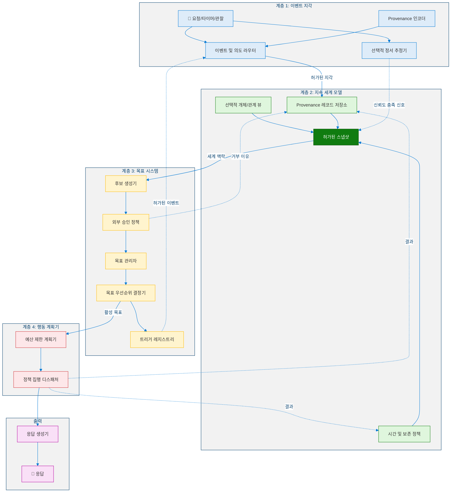
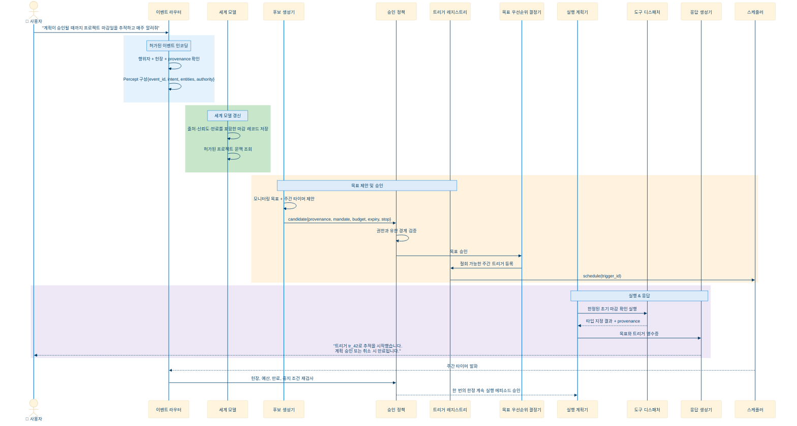
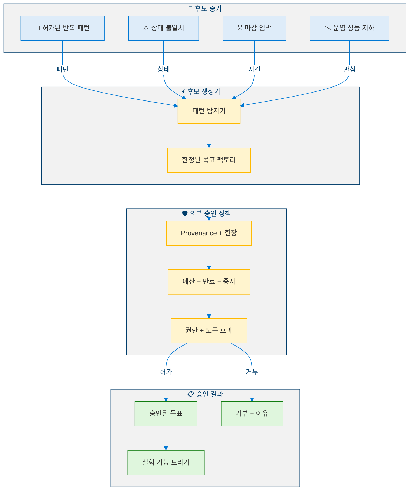
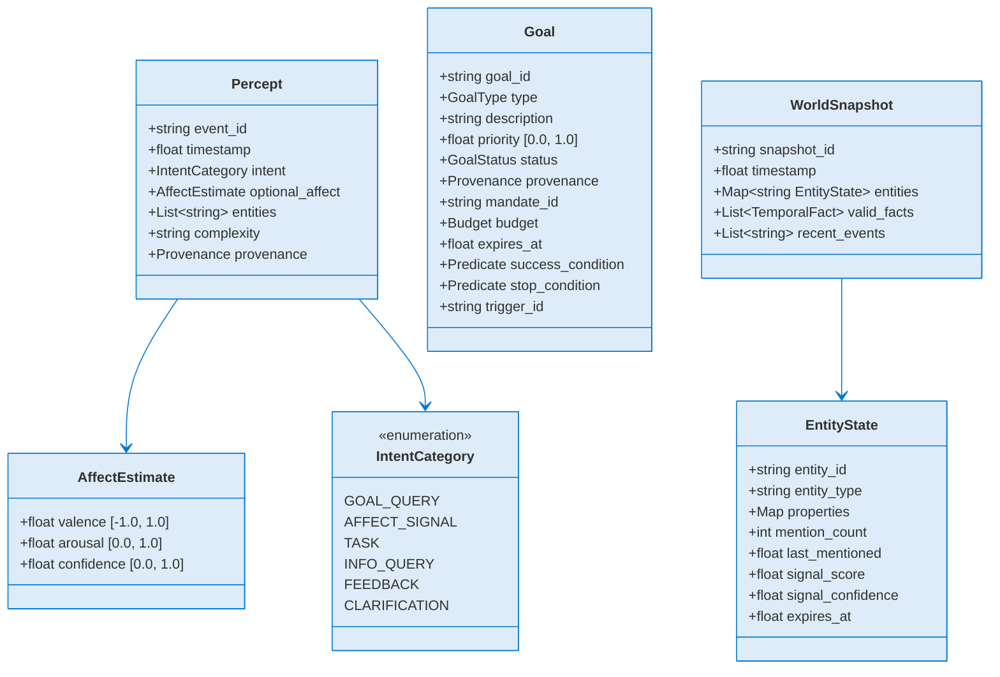
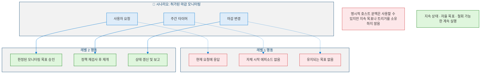
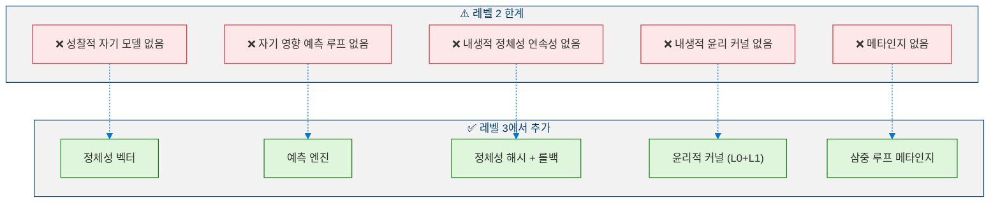
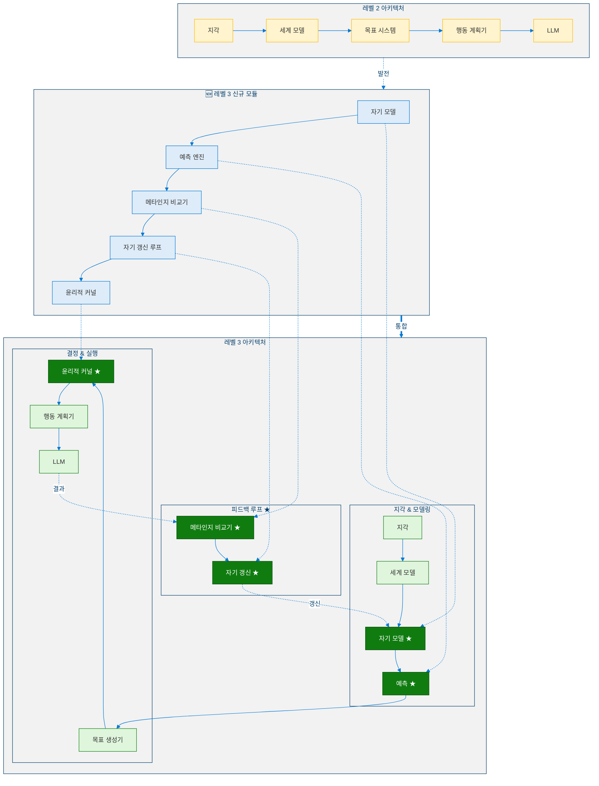

<!--
Copyright (c) 2026 Moon Hyuk Choi
Licensed under the MIT License.
See LICENSE file in the repository root for full license information.
-->
# 레벨 2: 자율 에이전트 - 아키텍처 & 설계

> **MSCP 레벨 시리즈** | [레벨 1](Level_1_Tool_Agent.ko.md) ← 레벨 2 → [레벨 3](Level_3_Self_Regulating_Agent.ko.md)  
> **상태**: 🔬 **실험적** - 개념적 프레임워크 및 실험적 설계. 프로덕션 사양이 아닙니다.  
> **날짜**: 2026년 2월

## Revision History

| Version | Date | Description |
|---------|------|-------------|
| 0.1.0 | 2026-02-23 | Initial document creation with formal Definitions 1-7, Propositions 1-3 |
| 0.2.0 | 2026-02-26 | Added overview essence formula; added revision history table; reinforced entity lifecycle, importance scoring, and world model architecture from specs |
| 0.3.0 | 2026-02-26 | Fixed Def 6 type signature; added constructive argument to Prop 2 |
| 0.5.0 | 2026-03-31 | Added EnvironmentState, ConversationContext, and Percept Tracking |
| 0.6.0 | 2026-07-21 | Defined bounded event-driven autonomy; separated persistence from autonomy; added goal provenance, retention, and external safety requirements |

---

## 1. 개요

레벨 2는 요청 한정 반응에서 **한정된 이벤트 기반 자율성**으로 처음 전환하는 단계입니다. 자율 에이전트는 지속 인지 상태를 소유하고, 현재 요청으로 환원되지 않는 목표를 생성·유지하며, 허가된 이벤트가 발생하면 에피소드 간 작업을 재개할 수 있습니다. 자율성은 외부 헌장, 권한 정책, 예산, 중지 조건의 제약을 받으며 성찰적 자기 모델은 없습니다.

> **Level Essence.** 레벨 2 에이전트는 정책 제약을 받는 상태 유지 프로세스입니다. 허가된 각 이벤트는 지속 상태와 목표를 갱신하고, 제한된 행동을 수행하며, 미래 트리거를 등록할 수 있습니다:
>
> $$
> (o_t,\, \mathbf{a}_t,\, s_{t+1},\, G_{t+1},\, q_{t+1})
> \sim F(\,\cdot\mid x_t, e_t, s_t, G_t, \kappa),
> \qquad |\mathbf{a}_t| \leq B
> $$
>
> 여기서 $x_t$는 허가된 요청·타이머·관찰 이벤트, $e_t$는 외부 환경, $s_t$는 에이전트 소유 지속 인지 상태, $G_t$는 지속 목표 집합, $q_{t+1}$은 선택적 미래 트리거, $\kappa$는 외부에서 관리하는 헌장과 안전 정책, $B$는 에피소드별 행동 예산입니다.

> ⚠️ **참고**: 이 문서는 MSCP 분류 체계 내의 인지 수준을 설명합니다. 여기에 포함된 아키텍처, 의사코드 및 다이어그램은 구조적 개념을 탐색하는 실험적 설계이며 - 프로덕션 수준의 구현이 아닙니다.

### 1.1 정의 속성

| 속성 | 레벨 1 | 레벨 2 |
|------|:------:|:------:|
| 내부 상태 | 없음 | **에이전트 소유 지속 인지 상태** |
| 목표 설정 | 없음 | 헌장 $\kappa$ 안의 **한정된 자율 목표** |
| 자기인식 | 없음 | 없음 |
| 메모리 | 명시적 호스트 문맥만 | provenance·보존 정책이 적용된 **지속 기억** |
| 개체 추적 | 없음 | 선택적 지속 세계상태 구현 |
| 정서 신호 | 현재 입력 분석 가능 | 불확실성을 포함한 선택적 장기 추정 |
| 자율성 | 없음 | **한정된** 이벤트 기반 계속 실행 |

### 1.2 레벨 1과의 핵심 차이

레벨 1 에이전트는 외부 요청으로 시작되는 한정된 에피소드를 실행하고 에피소드 경계를 넘어 에이전트 소유 인지 상태나 목표를 유지하지 않습니다. 레벨 2에는 세 가지 조건이 추가됩니다:

1. **인과적으로 사용되는 지속성**: 저장 상태를 다시 읽고 이후 결정에 사용할 수 있습니다.
2. **자율 목표 생성**: 현재 요청으로 환원되지 않지만 헌장 $\kappa$ 안에 있는 목표를 만들 수 있습니다.
3. **허가된 계속 실행**: 타이머, 관찰, 승인된 스케줄러가 유지 중인 목표를 위해 이후 에피소드를 시작할 수 있습니다.

대화 기록, 노트 데이터베이스, 사용자가 만든 작업 목록만으로는 레벨 2를 충족하지 않습니다.

### 1.3 형식적 정의

> **정의 1 (레벨 2 에이전트).** $\mathcal{X}$를 허가된 이벤트 공간, $\mathcal{O}_{\bot}$를 사용자 응답 없음까지 포함한 응답 공간, $\mathcal{A}^{\leq B}$를 제한된 행동 시퀀스, $\mathcal{E}$를 외부 환경, $\mathcal{S}$를 지속 인지 상태, $\mathcal{G}$를 지속 목표, $\mathcal{Q}$를 미래 트리거, $\mathcal{K}$를 외부 헌장과 안전 정책이라 하겠습니다. 레벨 2 에이전트는 다음 튜플입니다:
>
> $$
> \mathcal{A}_2 = \langle \mathcal{X}, \mathcal{O}_{\bot}, \mathcal{A}, \mathcal{E}, \mathcal{S}, \mathcal{G}, \mathcal{Q}, \mathcal{K}, F \rangle
> $$
>
> 전이 커널은 다음과 같습니다:
>
> $$
> F : \mathcal{X} \times \mathcal{E} \times \mathcal{S} \times \mathcal{G} \times \mathcal{K}
> \to \operatorname{Dist}\!\left(\mathcal{O}_{\bot} \times \mathcal{A}^{\leq B} \times \mathcal{E} \times \mathcal{S} \times \mathcal{G} \times \mathcal{Q}\right)
> $$
>
> 이 커널은 레벨 1 안전 계약을 상속하며, 모든 목표가 출처와 허가 헌장을 기록하고, 모든 미래 트리거가 철회 가능하며 실행 시점에 정책을 다시 검사하고, 어떤 행동 시퀀스도 위임된 권한이나 예산을 넘지 않아야 한다는 추가 제약을 따릅니다.
>
> 각 이벤트 $t$에서:
>
> $$
> (o_t, \mathbf{a}_t, e_{t+1}, s_{t+1}, G_{t+1}, q_{t+1})
> \sim F(\,\cdot\mid x_t, e_t, s_t, G_t, \kappa)
> $$

레벨 2는 **인과적으로 사용되는 지속 상태, 자율 목표 생성, 허가된 에피소드 간 계속 실행**이 함께 존재한다는 점에서 레벨 1과 구분됩니다. 뒤의 두 조건 없이 지속성만 있는 시스템은 상태형 어시스턴트이지 레벨 2 자율 에이전트가 아닙니다.

> **정의 2 (지속 세계 모델).** 세계 모델 $\mathcal{W}_t$는 에피소드 간 사용할 수 있는, 에이전트가 소유하고 보존 정책이 적용된 레코드 집합입니다:
>
> $$
> \mathcal{W}_t = \langle \mathcal{M}_t, \mathcal{R}_{\text{ret}} \rangle,
> \qquad
> m_i = \langle \text{content},\, \text{source},\, c_i,\, t_{\text{valid}},\, t_{\text{expiry}},\, \text{sensitivity} \rangle
> $$
>
> 여기서:
> - $\mathcal{M}_t$는 유한한 지속 레코드 집합입니다.
> - $\text{source}$는 provenance와 레코드를 제공한 관찰 또는 행위자를 기록합니다.
> - $c_i \in [0,1]$는 해당 레코드의 신뢰도이며 에이전트 전체에 대한 신뢰도가 아닙니다.
> - $t_{\text{valid}}$와 $t_{\text{expiry}}$는 시간적 유효성과 보존 기간을 제한합니다.
> - $\mathcal{R}_{\text{ret}}$는 최소 수집, 접근, 정정, 보관, 삭제 규칙을 정의합니다.
>
> 배포는 $\mathcal{M}_t$를 문서, 관계형 레코드, 지식 그래프, 개체 추적기, 시간 저장소 또는 혼합 구조로 표현할 수 있습니다. 이들은 별도 레벨 필수조건이 아니라 구현 프로파일입니다. 이벤트 $x_t$에서 사용하는 문맥 스냅샷은 다음과 같습니다:
>
> $$s_t = \pi(\mathcal{W}_t, x_t, \kappa)$$

> **정의 3 (선택적 정서 추정).** 배포는 표현된 정서 신호를 신뢰도와 함께 추정할 수 있습니다:
>
> $$
> \hat{e}(t) = \langle v(t),\, a(t),\, c_e(t) \rangle,
> \quad v(t) \in [-1,1],\quad a(t), c_e(t) \in [0,1]
> $$
>
> 여기서 $v(t)$는 표현된 valence, $a(t)$는 활성도, $c_e(t)$는 보정 신뢰도를 추정합니다. 이 신호는 사람의 숨겨진 정신 상태에 대한 단정이 아니며 레벨 2 필수조건도 아닙니다. $c_e(t) \geq \theta_e$이고 정책 $\kappa$가 사용을 허용하며 결과 행동이 활성 헌장 안에 있을 때만 결정에 영향을 줄 수 있습니다. 신뢰도가 낮은 추정은 사실로 축적하지 말고 무시하거나 명확화를 요청해야 합니다.

> **정의 4 (목표).** 목표 $g \in \mathcal{G}$는 다음 튜플입니다:
>
> $$
> g = \langle \text{id},\, \text{type},\, \text{desc},\, p,\, \text{status},\, \rho,\, \kappa_g,\, b_g,\, t_c,\, t_x,\, \chi_{\text{success}},\, \chi_{\text{stop}},\, q_g \rangle
> $$
>
> 여기서 $p \in [0,1]$은 우선순위, $\rho$는 provenance(출처·생성 방식·트리거 이벤트), $\kappa_g$는 허가 헌장 참조, $b_g$는 유한한 행동·시간·비용 예산, $t_c$와 $t_x$는 생성 및 만료 시각, $\chi_{\text{success}}$와 $\chi_{\text{stop}}$은 명시적 성공 및 중지 술어, $q_g$는 선택적인 철회 가능 계속 실행 트리거입니다.
>
> **목표 유형**: $\text{type} \in \{\text{USER}, \text{AUTO}, \text{SYSTEM}, \text{REACTIVE}\}$입니다. USER는 명시적 요청, AUTO는 지속 상태의 증거에서 생성, SYSTEM은 위임된 운영 유지, REACTIVE는 정책이 허가한 이벤트에 대한 반응입니다.
>
> **목표 상태**: $\text{status} \in \{\text{PENDING}, \text{ACTIVE}, \text{COMPLETED}, \text{FAILED}, \text{BLOCKED}, \text{DEFERRED}, \text{CANCELLED}, \text{EXPIRED}\}$입니다. 모든 종결 상태는 남은 트리거와 위임 자원을 해제합니다. 만료, 철회, 헌장 취소, 예산 소진 또는 $\chi_{\text{stop}}$은 목표가 미완료여도 실행을 종료하거나 차단합니다.

> **정의 5 (목표 우선순위 함수).** 목표의 동적 우선순위는 가중 조합으로 계산됩니다:
>
> $$
> p(g,t) = \operatorname{clip}_{[0,1]}\!\left(\alpha p_{\text{base}}(g) + \beta u(g,t) + \gamma r(g,s_t) - \delta c(g,e_t)\right)
> $$
>
> 여기서:
> - $p_{\text{base}}(g)$는 정적 기본 우선순위
> - $u(g, t) \in [0,1]$는 **시간 긴급도** 요소 (마감일이 가까워질수록 단조 증가)
> - $r(g,s_t) \in [0,1]$은 현재 지속 상태와의 증거 기반 관련성
> - $c(g,e_t) \in [0,1]$은 정규화된 실행 비용과 위험
> - $\alpha + \beta + \gamma + \delta = 1$
>
> 우선순위는 권한을 부여하지 않습니다. 승인과 모든 행동은 $\kappa_g$, 상속된 도구 정책, 남은 예산, 중지 조건을 계속 따라야 합니다. 선택적 정서 추정은 정의 3에 따라 $r(g,s_t)$에만 기여할 수 있으며 별도 권한 신호가 아닙니다.

> **정의 6 (자율 목표 생성과 승인).** 생성기는 지속 상태, 현재 이벤트, 헌장 $\kappa$로부터 목표 후보를 제안합니다:
>
> $$\Phi_{AG} : \mathcal{S} \times \mathcal{X} \times \mathcal{K} \to \mathcal{P}(\mathcal{G}_{\text{candidate}})$$
>
> 후보는 외부 승인 정책을 통과해야 활성 목표가 됩니다:
>
> $$
> \operatorname{admit}(g,\kappa) =
> \operatorname{authorized}(g,\kappa)
> \land \operatorname{complete}(\rho, b_g, t_x, \chi_{\text{success}}, \chi_{\text{stop}})
> $$
>
> 패턴 반복, 마감 임박, 상태 불일치, 운영 성능 저하는 후보 근거의 예시입니다. 후보 생성 자체는 행동을 허가하지 않습니다. 거부된 후보는 이유를 기록하거나 보존 정책에 따라 폐기하며 $G_{t+1}$에 들어가지 않습니다.
>
> **정의 6.1 (미래 트리거).** 계속 실행 트리거는 다음과 같습니다:
>
> $$
> q = \langle \text{id},\, \text{type},\, \text{params},\, g_{\text{resume}},\, t_{\text{not-before}},\, t_{\text{expiry}},\, \kappa_q,\, \text{status} \rangle
> $$
>
> 여기서 $\text{type} \in \{\text{TIMER},\text{OBSERVATION},\text{GOAL\_STATUS}\}$이고 $\text{status} \in \{\text{REGISTERED},\text{FIRED},\text{REVOKED},\text{EXPIRED}\}$입니다. 등록은 감사 가능한 식별자를 반환합니다. $\kappa_q$ 권한을 가진 사용자 또는 시스템 행위자가 철회할 수 있습니다. 트리거가 발화하면 새 한정 에피소드를 시작하기 전에 헌장, 예산, 만료, 중지 조건을 다시 평가합니다.

### 1.4 선택적 개체 상태 추적 프로파일

개체 추적기는 가능한 세계모델 구현 중 하나입니다. 정책이 장기 정서 표현 추적을 허용하면, 신뢰도 조건을 만족한 신호를 **지수 이동 평균**(EMA)으로 갱신할 수 있습니다:

$$\text{sentiment}_{e_k}(t) = (1 - \lambda) \cdot \text{sentiment}_{e_k}(t-1) + \lambda \cdot v(t)$$

여기서 $\lambda \in (0,1)$는 배포 환경에서 보정한 평활 계수입니다. 정의 3을 충족하는 추정만 갱신에 사용할 수 있고, 레코드에는 provenance·신뢰도·만료·민감도 메타데이터를 반드시 유지해야 합니다.

#### 1.4.1 개체 생명주기

추적되는 각 개체는 보존 정책이 적용된 생명주기를 따릅니다:

$$
\operatorname{lifecycle}(e_k):
\mathrm{NEW} \to \mathrm{ACTIVE} \to \mathrm{STALE} \to \mathrm{ARCHIVED} \to \mathrm{PRUNED}
$$

전이는 $\mathcal{R}_{\text{ret}}$, 민감도, 목적, 사용자 정정·삭제 요청, 법적 요구사항으로 제어합니다. STALE 레코드는 검색 가중치를 낮추고, ARCHIVED 레코드는 목표를 트리거할 수 없으며, PRUNED 레코드는 제거합니다. 명시적으로 요구되고 허가된 경우가 아니면 무기한 보존을 금지합니다.

#### 1.4.2 개체 중요도 점수

시점 $t$에서 개체 $e_k$의 중요도는 **최근성(recency)** 과 **빈도(frequency)** 의 가중 결합입니다:

$$\operatorname{importance}(e_k, t) = \alpha_r \cdot \operatorname{recency}(e_k, t) + \alpha_f \cdot \operatorname{frequency}(e_k)$$

여기서:

$$\operatorname{recency}(e_k, t) = \frac{1}{1 + (t - t_{\text{last}}(e_k)) / \tau}, \quad \operatorname{frequency}(e_k) = \min\!\left(1,\; \frac{\text{언급 횟수}(e_k)}{N_{\text{cap}}}\right)$$

시간 상수 $\tau$, 언급 한도 $N_{\text{cap}}$, 가중치 $\alpha_r + \alpha_f = 1$은 배포 환경에서 보정합니다. 이는 보편적 기본값이 아니며 대상 도메인에서 평가해야 합니다.

### 1.5 참조 세계 모델 아키텍처

한 가지 준수 구현은 다음 3계층 아키텍처를 사용할 수 있습니다:

1. **인지 계층** ($\mathcal{M}$): provenance를 가진 레코드와 선택적 개체·관계·시간 파생 뷰.
2. **세션 계층** ($\mathcal{M}_{\text{session}}$): 현재 상호작용 세션의 활성 맥락 창을 보유하는 작업 메모리(최근 참조 개체와 그 관련성 점수 포함).
3. **영속 계층** ($\mathcal{P}_{\text{store}}$): $\mathcal{R}_{\text{ret}}$에 따라 접근, provenance, 정정, 만료, 보관, 삭제를 집행하는 지속 저장소.

문맥 투영은 검색 전에 정책과 보존 필터를 적용합니다:

$$
s_t = \pi_{\kappa}(\mathcal{W}_t, x_t)
= \pi_{\text{session}}(\mathcal{M}_{\text{session},t})
\oplus \pi_{\text{retrieve}}(\mathcal{P}_{\text{store}}, x_t, \kappa)
$$

여기서 $\oplus$는 허가된 문맥의 합성을 뜻합니다. 만료·철회되었거나 현재 목적과 맞지 않거나 현재 행위자의 권한 밖에 있는 레코드는 제외합니다.

### 1.6 환경 상태

지속 세계 상태 외에도 배포는 **운영 환경**의 실시간 스냅샷을 제공할 수 있습니다. 이는 스케줄링과 점진적 성능 저하에 사용하는 외부 제공 텔레메트리이며, 에이전트의 정체성이나 인지에 대한 성찰적 모델이 아닙니다.

> **정의 2.1 (환경 상태).** 환경 상태 $\mathcal{E}_{\text{env}}(t)$는 에이전트의 운영 맥락을 표현하는 구조화된 튜플입니다:
>
> $$\mathcal{E}_{\text{env}}(t) = \langle \ell(t),\; \mathcal{T}_{\text{active}}(t),\; r_{\text{err}}(t),\; \lambda_{\text{resp}}(t),\; d_{\text{session}}(t) \rangle$$
>
> 여기서:
> - $\ell(t) \in [0,1]$ — **시스템 부하**: 계산 자원 활용도의 정규화 측정. $0$은 유휴, $1$은 완전 포화.
> - $\mathcal{T}_{\text{active}}(t) \subseteq \mathcal{T}$ — **활성 도구**: 현재 접근 가능한 사용 가능 도구의 부분집합(API 실패나 속도 제한으로 도구가 사용 불가능해질 수 있음).
> - $r_{\text{err}}(t) \in [0,1]$ — **오류율**: 최근 도구 호출 중 오류를 반환한 비율. 슬라이딩 윈도우 상에서 계산: $r_{\text{err}}(t) = |\{i \in H_t : T_i = \textit{err}\}| / |H_t|$, $H_t$는 최근 호출 윈도우.
> - $\lambda_{\text{resp}}(t) \in \mathbb{R}_{\geq 0}$ — **응답 지연**: 최근 요청에 대한 평균 응답 시간(밀리초).
> - $d_{\text{session}}(t) \in \mathbb{R}_{\geq 0}$ — **세션 지속 시간**: 현재 세션 시작 이후 경과 시간(초).
>
> **지속 인지 상태**($\mathcal{W}$)와 **운영 텔레메트리**($\mathcal{E}_{\text{env}}$)의 구분은 중요합니다. 텔레메트리는 실행을 제약할 수 있지만 자기인식을 성립시키지는 않습니다.

운영 성능 저하는 정의 6을 통해 SYSTEM 유형 유지보수 목표를 제안할 수 있습니다. 후보는 여전히 헌장 승인, 유한 예산, 만료, 중지 조건이 필요합니다. 즉각적인 과부하 처리는 외부 실행 정책의 결정이며 목표 생성을 요구하지 않습니다.

### 1.7 대화 맥락

**대화 맥락(conversation context)** 은 현재 상호작용 세션에 대한 에이전트의 작업 메모리입니다. 영속적인 세계 모델($\mathcal{W}$)과 달리 — 장기 사실 지식이 아니라 단기 대화 역학을 추적합니다.

대화 맥락 $\mathcal{C}_{\text{conv}}(t)$는 다음 상태를 유지합니다:

| 필드 | 타입 | 설명 |
|------|------|------|
| $n_{\text{turn}}$ | $\mathbb{N}$ | **턴 수** — 현재 세션에서의 교환 횟수 |
| $\mathcal{H}_{\text{topic}}$ | $\text{List}(\text{String})$ | **주제 이력** — 논의된 주제의 순서 있는 목록(최대 50). 패턴 감지 가능. |
| $\tau_{\text{current}}$ | $\text{String}$ | **현재 주제** — 추론된 활성 주제 |
| $\ell_{\text{lang}}$ | $\text{String}$ | **언어** — 사용자에 대해 감지된 언어 |
| $\chi_{\text{trend}}$ | $[-1,1]$ | **복잡도 추세** — 시간에 따른 요청 복잡도의 방향. 양수는 복잡도 증가, 음수는 단순화. |
| $e_{\text{trend}}$ | $[-1,1] \cup \{\bot\}$ | **선택적 정서 표현 추세** — 신뢰도와 보존 정책을 충족한 추정만으로 계산 |
| $\iota_{\text{last}}$ | $\text{Intent}$ | **최근 의도** — 가장 최근에 분류된 사용자 의도 |

현재 입력 적응과 호스트가 명시적으로 제공한 대화 기록 사용은 레벨 1에서도 가능합니다. 레벨 2는 이후 목표와 허가된 계속 실행을 구동할 수 있는 에이전트 소유 장기 상태를 추가합니다:

- **에피소드 간 주제 연속성**: 호스트가 기록을 다시 보내지 않아도 허가된 상태가 작업 관련 문맥을 보존할 수 있습니다.
- **장기 패턴 증거**: 반복, 마감, 상태 불일치가 정의 6에 따른 목표 후보를 제안할 수 있습니다.
- **추세 인식 상호작용**: 복잡도 또는 선택적 정서 표현 추세가 표현 방식을 조정할 수 있지만, 목표나 중대한 행동을 독립적으로 허가할 수는 없습니다.

### 1.8 지각(percept) 추적

허가된 각 이벤트는 처리 전에 구조화된 **지각(percept)** 으로 인코딩됩니다:

$$
\operatorname{Percept}(t) = \langle \mathrm{event\_id},\, \iota(t),\, \hat e(t) \cup \{\bot\},\, \mathcal{E}_{\text{ref}}(t),\, \xi(t),\, \rho_t,\, t \rangle
$$

여기서 $\iota(t)$는 분류된 의도, $\hat e(t)$는 선택적 정서 추정, $\mathcal{E}_{\text{ref}}(t)$는 참조 개체 집합, $\xi(t) \in [0,1]$는 추정 복잡도, $\rho_t$는 이벤트 provenance와 권한, $t$는 타임스탬프입니다.

에이전트는 **유한하고 보존 정책이 적용된 지각 버퍼**를 유지합니다. 용량과 수명은 보편적 상수가 아니라 배포 매개변수입니다. 이 버퍼는 두 가지 용도가 있습니다:

1. **추세 분석**: 슬라이딩 윈도우 계산으로 신뢰도 메타데이터를 가진 복잡도와 선택적 정서 표현 추세를 만들 수 있습니다.
2. **후보 증거**: 목표 생성기는 허가된 반복 개체, 마감, 상태 불일치, 시간 패턴을 증거로 사용할 수 있습니다. 목표를 허가하는 것은 버퍼가 아니라 승인 정책입니다.

---

## 2. 아키텍처

### 2.1 5계층 아키텍처

<!-- Level 2 Five-Layer Architecture -->


```mermaid
%%{init: {'theme': 'base', 'themeVariables': {'primaryColor': '#0078D4', 'primaryTextColor': '#003D6B', 'primaryBorderColor': '#003D6B', 'secondaryColor': '#50E6FF', 'secondaryTextColor': '#323130', 'secondaryBorderColor': '#00BCF2', 'tertiaryColor': '#F2F2F2', 'tertiaryTextColor': '#323130', 'lineColor': '#0078D4', 'textColor': '#323130', 'mainBkg': '#DEECF9', 'nodeBorder': '#0078D4', 'clusterBkg': '#F2F2F2', 'clusterBorder': '#003D6B', 'titleColor': '#003D6B', 'edgeLabelBackground': '#FFFFFF', 'fontSize': '14px'}}}%%
flowchart TD
  classDef perception fill:#0078D4,stroke:#003D6B,color:#FFF
  classDef perceptionLight fill:#DEECF9,stroke:#0078D4,color:#323130
  classDef world fill:#107C10,stroke:#085108,color:#FFF
  classDef worldLight fill:#DFF6DD,stroke:#107C10,color:#323130
  classDef goal fill:#FFB900,stroke:#CC9400,color:#323130
  classDef goalLight fill:#FFF4CE,stroke:#FFB900,color:#323130
  classDef action fill:#D13438,stroke:#A4262C,color:#FFF
  classDef actionLight fill:#FDE7E9,stroke:#D13438,color:#323130
  classDef cognitive fill:#B4009E,stroke:#8A0076,color:#FFF
  classDef cognitiveLight fill:#F9E0F7,stroke:#B4009E,color:#323130

  subgraph PL["계층 1: 이벤트 지각"]
    direction LR
    IR["🎯 이벤트/의도 라우터"]:::perceptionLight
    ED["선택적 정서<br/>추정기"]:::perceptionLight
    SE["📡 Provenance 인코더"]:::perceptionLight
  end

  subgraph WM["계층 2: 지속 세계 모델"]
    direction LR
    KG["🗄️ 레코드 저장소"]:::worldLight
    ES["선택적 개체/<br/>관계 뷰"]:::worldLight
    TM["보존 정책 및<br/>시간 유효성"]:::worldLight
  end

  subgraph GS["계층 3: 목표 시스템"]
    direction LR
    GM["🎯 목표 관리자"]:::goalLight
    AGG["⚡ 후보 생성기"]:::goalLight
    GA["🛡️ 승인 정책"]:::goalLight
    GP["📊 목표 우선순위 결정기"]:::goalLight
    GD["⏰ 트리거 레지스트리"]:::goalLight
  end

  subgraph AP["계층 4: 행동 계획기"]
    direction LR
    TD["🔧 정책 집행 디스패처"]:::actionLight
    EP["📋 예산 제한 계획기"]:::actionLight
  end

  subgraph CE["계층 5: 추론 엔진"]
    direction LR
    LLM["🧠 추론 백엔드"]:::cognitiveLight
  end

  PL ==> WM
  WM ==> GS
  GS ==> AP
  AP ==> CE
```

### 2.2 상세 컴포넌트 상호작용

<!-- Level 2 Component Interaction -->


```mermaid
%%{init: {'theme': 'base', 'themeVariables': {'primaryColor': '#0078D4', 'primaryTextColor': '#003D6B', 'primaryBorderColor': '#003D6B', 'secondaryColor': '#50E6FF', 'secondaryTextColor': '#323130', 'secondaryBorderColor': '#00BCF2', 'tertiaryColor': '#F2F2F2', 'tertiaryTextColor': '#323130', 'lineColor': '#0078D4', 'textColor': '#323130', 'mainBkg': '#DEECF9', 'nodeBorder': '#0078D4', 'clusterBkg': '#F2F2F2', 'clusterBorder': '#003D6B', 'titleColor': '#003D6B', 'edgeLabelBackground': '#FFFFFF', 'fontSize': '14px'}}}%%
flowchart TD
  classDef perceptionLight fill:#DEECF9,stroke:#0078D4,color:#323130
  classDef worldLight fill:#DFF6DD,stroke:#107C10,color:#323130
  classDef worldAccent fill:#107C10,stroke:#085108,color:#FFF
  classDef goalLight fill:#FFF4CE,stroke:#FFB900,color:#323130
  classDef actionLight fill:#FDE7E9,stroke:#D13438,color:#323130
  classDef outputLight fill:#F9E0F7,stroke:#B4009E,color:#323130
  classDef feedback fill:#F2F2F2,stroke:#8A8886,color:#323130

  subgraph Perception["계층 1: 이벤트 지각"]
    direction LR
    UserInput["👤 요청/타이머/관찰"]:::perceptionLight
    IRv2["이벤트 및 의도 라우터"]:::perceptionLight
    EDv2["선택적 정서 추정기"]:::perceptionLight
    SEn["Provenance 인코더"]:::perceptionLight
    UserInput --> IRv2
    UserInput --> EDv2
    SEn --> IRv2
  end

  subgraph WorldModel["계층 2: 지속 세계 모델"]
    direction LR
    EST["선택적 개체/관계 뷰"]:::worldLight
    TML["시간 및 보존 정책"]:::worldLight
    KG["Provenance 레코드 저장소"]:::worldLight
    WS["허가된 스냅샷"]:::worldAccent
    EST --> WS
    TML --> WS
    KG --> WS
  end

  subgraph GoalSystem["계층 3: 목표 시스템"]
    direction LR
    AGG["후보 생성기"]:::goalLight
    ADM["외부 승인 정책"]:::goalLight
    GMgr["목표 관리자"]:::goalLight
    GP["목표 우선순위 결정기"]:::goalLight
    GD["트리거 레지스트리"]:::goalLight
    AGG --> ADM --> GMgr
    GMgr --> GP --> GD
  end

  subgraph ActionPlanner["계층 4: 행동 계획기"]
    direction LR
    EP["예산 제한 계획기"]:::actionLight
    TD["정책 집행 디스패처"]:::actionLight
  end

  subgraph Response["출력"]
    RG["응답 생성기"]:::outputLight
    OUT["📝 응답"]:::outputLight
  end

  IRv2 -->|허가된 지각| KG
  EDv2 -.->|신뢰도 충족 신호| WS
  WS -->|세계 맥락| AGG
  GP -->|활성 목표| EP
  GD -.->|허가된 이벤트| IRv2
  EP --> TD
  TD --> RG
  RG --> OUT

  TD -.->|결과| KG
  TD -.->|결과| TML
  ADM -.->|거부 이유| KG
```

---

## 3. 데이터 흐름

### 3.1 전체 처리 시퀀스


```mermaid
%%{init: {'theme': 'base', 'themeVariables': {'actorTextColor': '#003D6B', 'actorLineColor': '#0078D4', 'signalColor': '#003D6B', 'signalTextColor': '#003D6B', 'labelTextColor': '#003D6B', 'loopTextColor': '#003D6B', 'noteBkgColor': '#DEECF9', 'noteTextColor': '#003D6B', 'noteBorderColor': '#0078D4', 'activationBkgColor': '#E1DFDD', 'activationBorderColor': '#605E5C', 'sequenceNumberColor': '#FFF', 'textColor': '#323130', 'fontSize': '14px'}}}%%
sequenceDiagram
    actor U as 👤 사용자
  participant ER as 이벤트 라우터
    participant WM as 세계 모델
  participant CG as 후보 생성기
  participant AP as 승인 정책
  participant TR as 트리거 레지스트리
    participant GP as 목표 우선순위 결정기
    participant EP as 실행 계획기
    participant TD as 도구 디스패처
    participant RG as 응답 생성기
  participant S as 스케줄러

  U->>ER: "계획이 승인될 때까지 프로젝트 마감일을 추적하고 매주 알려줘"

    rect rgb(227, 242, 253)
    Note over ER: 허가된 이벤트 인코딩
    ER->>ER: 행위자 + 헌장 + provenance 확인
    ER->>ER: Percept 구성{event_id, intent, entities, authority}
    end

    rect rgb(200, 230, 201)
        Note over WM: 세계 모델 갱신
    WM->>WM: 출처·신뢰도·만료를 포함한 마감 레코드 저장
    WM->>WM: 허가된 프로젝트 문맥 조회
    end

    rect rgb(255, 243, 224)
    Note over CG,TR: 목표 제안 및 승인
    CG->>CG: 모니터링 목표 + 주간 타이머 제안
    CG->>AP: candidate{provenance, mandate, budget, expiry, stop}
    AP->>AP: 권한과 유한 경계 검증
    AP->>GP: 목표 승인
    GP->>TR: 철회 가능한 주간 트리거 등록
    TR->>S: schedule(trigger_id)
    end

    rect rgb(237, 231, 246)
        Note over EP,RG: 실행 & 응답
    EP->>TD: 한정된 초기 마감 확인 실행
    TD-->>EP: 타입 지정 결과 + provenance
    EP->>RG: 목표와 트리거 영수증
    RG-->>U: "트리거 tr_42로 추적을 시작했습니다.<br/>계획 승인 또는 취소 시 만료됩니다."
    end

  S-->>ER: 주간 타이머 발화
  ER->>AP: 헌장, 예산, 만료, 중지 조건 재검사
  AP-->>EP: 한 번의 한정 계속 실행 에피소드 승인
```

### 3.2 자율 목표 생성 흐름

<!-- Level 2 Autonomous Goal Generation -->


```mermaid
%%{init: {'theme': 'base', 'themeVariables': {'primaryColor': '#0078D4', 'primaryTextColor': '#003D6B', 'primaryBorderColor': '#003D6B', 'secondaryColor': '#50E6FF', 'secondaryTextColor': '#323130', 'secondaryBorderColor': '#00BCF2', 'tertiaryColor': '#F2F2F2', 'tertiaryTextColor': '#323130', 'lineColor': '#0078D4', 'textColor': '#323130', 'mainBkg': '#DEECF9', 'nodeBorder': '#0078D4', 'clusterBkg': '#F2F2F2', 'clusterBorder': '#003D6B', 'titleColor': '#003D6B', 'edgeLabelBackground': '#FFFFFF', 'fontSize': '14px'}}}%%
flowchart TD
  classDef perceptionLight fill:#DEECF9,stroke:#0078D4,color:#323130
  classDef generatorLight fill:#FFF4CE,stroke:#FFB900,color:#323130
  classDef goalLight fill:#DFF6DD,stroke:#107C10,color:#323130

  subgraph Triggers["🎯 후보 증거"]
    T1["🔄 허가된 반복 패턴"]:::perceptionLight
    T2["⚠️ 상태 불일치"]:::perceptionLight
    T3["⏰ 마감 임박"]:::perceptionLight
    T4["📉 운영 성능 저하"]:::perceptionLight
  end

  subgraph Generator["⚡ 후보 생성기"]
    PD["패턴 탐지기"]:::generatorLight
    GF["한정된 목표 팩토리"]:::generatorLight
    PD --> GF
  end

  subgraph Admission["🛡️ 외부 승인 정책"]
    V1["Provenance + 헌장"]:::generatorLight
    V2["예산 + 만료 + 중지"]:::generatorLight
    V3["권한 + 도구 효과"]:::generatorLight
  end

  subgraph Goals["📋 승인 결과"]
    G1["승인된 목표"]:::goalLight
    G2["철회 가능 트리거"]:::goalLight
    G3["거부 + 이유"]:::goalLight
  end

  T1 -->|패턴| PD
  T2 -->|상태| PD
  T3 -->|시간| PD
  T4 -->|관심| PD

  GF --> V1 --> V2 --> V3
  V3 -->|허가| G1 --> G2
  V3 -->|거부| G3
```

---

## 4. 핵심 구성요소

### 4.1 지각 구조

<!-- Level 2 Percept Structure -->


```mermaid
%%{init: {'theme': 'base', 'themeVariables': {'primaryColor': '#0078D4', 'primaryTextColor': '#003D6B', 'primaryBorderColor': '#003D6B', 'secondaryColor': '#50E6FF', 'secondaryTextColor': '#323130', 'secondaryBorderColor': '#00BCF2', 'tertiaryColor': '#F2F2F2', 'tertiaryTextColor': '#323130', 'lineColor': '#0078D4', 'textColor': '#323130', 'mainBkg': '#DEECF9', 'nodeBorder': '#0078D4', 'clusterBkg': '#F2F2F2', 'clusterBorder': '#003D6B', 'titleColor': '#003D6B', 'edgeLabelBackground': '#FFFFFF', 'fontSize': '14px'}}}%%
classDiagram
  class Percept {
    +string event_id
    +float timestamp
    +IntentCategory intent
    +AffectEstimate optional_affect
    +List~string~ entities
    +string complexity
    +Provenance provenance
  }

  class AffectEstimate {
    +float valence [-1.0, 1.0]
    +float arousal [0.0, 1.0]
    +float confidence [0.0, 1.0]
  }

  class IntentCategory {
    <<enumeration>>
    GOAL_QUERY
    AFFECT_SIGNAL
    TASK
    INFO_QUERY
    FEEDBACK
    CLARIFICATION
  }

  class EntityState {
    +string entity_id
    +string entity_type
    +Map properties
    +int mention_count
    +float last_mentioned
    +float signal_score
    +float signal_confidence
    +float expires_at
  }

  class Goal {
    +string goal_id
    +GoalType type
    +string description
    +float priority [0.0, 1.0]
    +GoalStatus status
    +Provenance provenance
    +string mandate_id
    +Budget budget
    +float expires_at
    +Predicate success_condition
    +Predicate stop_condition
    +string trigger_id
  }

  class WorldSnapshot {
    +string snapshot_id
    +float timestamp
    +Map~string EntityState~ entities
    +List~TemporalFact~ valid_facts
    +List~string~ recent_events
  }

  Percept --> AffectEstimate
  Percept --> IntentCategory
  WorldSnapshot --> EntityState
```

---

## 5. 의사코드

### 5.1 핵심 에이전트 루프

```python
MAX_ACTIONS_PER_EPISODE = 8


def level2_event_cycle(event: Event, mandate: Mandate) -> Level2Result:
    """
    Process one authorized request, timer, or observation event.
    """
    authorization = EventPolicy.authorize(event, mandate)
    if not authorization.allowed:
        return Level2Result.rejected(authorization.reason_code)

    transaction = StateStore.begin()
    world_model = transaction.load_world_model()
    goals = transaction.load_goals()

    percept = EventEncoder.encode(event, authorization.provenance)
    world_context = world_model.project(percept, mandate)
    world_model.apply_observations(
        percept.observations,
        retention_policy=mandate.retention_policy,
    )

    candidates = GoalGenerator.propose(world_context, percept, mandate)
    for candidate in candidates:
        candidate.attach_contract(
            provenance=percept.provenance,
            mandate_id=mandate.id,
            budget=Budget.finite_default(),
            expires_at=ExpiryPolicy.for_candidate(candidate),
            success_condition=SuccessPolicy.for_candidate(candidate),
            stop_condition=StopPolicy.for_candidate(candidate),
        )

        admission = GoalAdmissionPolicy.evaluate(candidate, mandate)
        if admission.allowed:
            goals.add(candidate)
        else:
            AuditLog.record_goal_rejection(candidate, admission.reason_code)

    active_goal = GoalPrioritizer.select_authorized(goals, world_context, mandate)
    if active_goal is None:
        transaction.commit(world_model, goals)
        return Level2Result.no_action()

    termination = GoalPolicy.check_termination(active_goal, mandate)
    if termination.should_stop:
        goals.transition(active_goal.id, termination.terminal_status)
        TriggerRegistry.revoke_for_goal(active_goal.id)
        transaction.commit(world_model, goals)
        return Level2Result.stopped(termination.reason_code)

    plan = ExecutionPlanner.plan(
        active_goal,
        world_context,
        max_actions=min(MAX_ACTIONS_PER_EPISODE, active_goal.budget.remaining_actions),
    )
    outcomes = PolicyDispatcher.execute(plan, mandate, active_goal.budget)
    world_model.apply_outcomes(outcomes)
    goals.update_progress(active_goal.id, outcomes)

    trigger = ContinuationPolicy.propose(active_goal, outcomes, mandate)
    if trigger is not None:
        TriggerRegistry.register(trigger, mandate)

    transaction.commit(world_model, goals)

    return Level2Result(
        response=ResponseGenerator.generate(event, active_goal, outcomes),
        active_goal=active_goal,
        outcomes=outcomes,
        trigger_receipt=trigger,
    )
```

### 5.2 개체 상태 추적기

```python
def track(
    self,
    entity_id: str,
    entity_type: str,
    signal: float,
    confidence: float,
    provenance: Provenance,
    expires_at: float,
) -> EntityState:
    """
    Update an optional entity view under retention policy.
    """
    now = time.time()
    self.retention_policy.require_write_authority(provenance, entity_type)

    if entity_id in self.entities:
        entity = self.entities[entity_id]
        entity.mention_count += 1
        entity.last_mentioned = now
        if confidence >= self.minimum_signal_confidence:
            entity.signal_score = (
                (1 - self.smoothing_factor) * entity.signal_score
                + self.smoothing_factor * signal
            )
            entity.signal_confidence = confidence
        entity.expires_at = min(entity.expires_at, expires_at)
    else:
        entity = EntityState(
            entity_id=entity_id,
            entity_type=entity_type,
            mention_count=1,
            first_mentioned=now,
            last_mentioned=now,
            signal_score=(
                signal if confidence >= self.minimum_signal_confidence else 0.0
            ),
            signal_confidence=confidence,
            provenance=provenance,
            expires_at=expires_at,
        )
        self.entities[entity_id] = entity

    self.mention_history.append((entity_id, now))
    return entity


def detect_repetition(self, entity_id: str, time_window: float) -> int:
    """
    Count mentions of entity_id within the last time_window seconds.
    """
    cutoff = time.time() - time_window
    count = sum(
        1 for eid, ts in self.mention_history
        if eid == entity_id and ts > cutoff
    )
    return count


def apply_retention(self, now: float) -> None:
    for entity_id, entity in list(self.entities.items()):
        if self.retention_policy.must_prune(entity, now):
            del self.entities[entity_id]
```

### 5.3 목표 우선순위 결정기

```python
def compute_priority(self, goal: Goal, context: WorldContext) -> float:
    """
    Rank an already admitted goal. Priority never grants authority.
    """
    base = goal.priority
    urgency = self.urgency(goal, now=time.time())
    relevance = self.evidence_relevance(goal, context)
    cost_risk = self.normalized_cost_risk(goal, context)

    final = (
        self.alpha * base
        + self.beta * urgency
        + self.gamma * relevance
        - self.delta * cost_risk
    )
    return max(0.0, min(1.0, final))
```

---

## 6. 레벨 1 대 레벨 2: 행동 비교

### 6.1 동일 시나리오 - 다른 행동

<!-- Level 2 Behavioral Comparison -->


```mermaid
%%{init: {'theme': 'base', 'themeVariables': {'primaryColor': '#0078D4', 'primaryTextColor': '#003D6B', 'primaryBorderColor': '#003D6B', 'secondaryColor': '#50E6FF', 'secondaryTextColor': '#323130', 'secondaryBorderColor': '#00BCF2', 'tertiaryColor': '#F2F2F2', 'tertiaryTextColor': '#323130', 'lineColor': '#0078D4', 'textColor': '#323130', 'mainBkg': '#DEECF9', 'nodeBorder': '#0078D4', 'clusterBkg': '#F2F2F2', 'clusterBorder': '#003D6B', 'titleColor': '#003D6B', 'edgeLabelBackground': '#FFFFFF', 'fontSize': '14px'}}}%%
flowchart TD
  classDef perceptionLight fill:#DEECF9,stroke:#0078D4,color:#323130
  classDef dangerLight fill:#FDE7E9,stroke:#D13438,color:#323130
  classDef successLight fill:#DFF6DD,stroke:#107C10,color:#323130

  subgraph Scenario["📝 시나리오: 허가된 마감 모니터링"]
    direction LR
    Q1["사용자 요청"]:::perceptionLight
    Q2["주간 타이머"]:::perceptionLight
    Q3["마감 변경"]:::perceptionLight
  end

  subgraph L1Response["레벨 1 행동"]
    direction LR
    L1R1["현재 요청에 응답"]:::dangerLight
    L1R2["자체 시작 에피소드 없음"]:::dangerLight
    L1R3["유지되는 목표 없음"]:::dangerLight
  end

  L1Note["명시적 호스트 문맥은 사용할 수 있지만 지속 목표나 트리거를 소유하지 않음"]:::dangerLight

  subgraph L2Response["레벨 2 행동"]
    direction LR
    L2R1["한정된 모니터링 목표 승인"]:::successLight
    L2R2["정책 재검사 후 재개"]:::successLight
    L2R3["상태 갱신 및 보고"]:::successLight
  end

  L2Note["지속 상태 · 자율 목표 · 철회 가능한 계속 실행"]:::successLight

  Q1 -.-> L1R1
  Q2 -.-> L1R2
  Q3 -.-> L1R3

  Q1 --> L2R1
  Q2 --> L2R2
  Q3 --> L2R3
```

---

## 7. 한정된 자율성 안전 계약

레벨 2는 모든 레벨 1 안전 불변식을 상속하고 지속 상태, 자율 목표, 미래 실행을 위한 제어를 추가합니다:

| 불변식 | 요구사항 |
|--------|----------|
| 상태 거버넌스 | 지속 레코드에 provenance, 신뢰도, 유효성, 민감도, 보존 메타데이터 포함 |
| 목표 승인 | 외부 헌장과 권한 검증 없이 생성 후보가 활성 목표 집합에 들어갈 수 없음 |
| 유한 위임 | 모든 목표와 에피소드에 행동·시간·비용·도구 권한·만료·성공·중지 조건 설정 |
| 철회 가능한 계속 실행 | 모든 타이머와 관찰 구독에 감사 가능한 ID가 있고 권한 있는 행위자가 철회 가능 |
| 실행 시점 재인가 | 발화한 트리거는 현재 헌장·권한·예산·만료·중지 조건을 다시 통과하기 전 행동을 시작할 수 없음 |
| 사용자 및 시스템 우선권 | 취소·일시정지·정정·삭제·비상정지가 자율 계속 실행보다 우선 |
| 원자적 지속성 | 상태·목표 진행·예산 소비·트리거 등록·행동 영수증을 원자적으로 커밋하거나 명시적으로 조정 |
| 신뢰하지 않는 지속 데이터 | 저장 콘텐츠와 도구 결과는 스스로 정책을 덮어쓰거나 권한을 늘리거나 실행 명령을 만들 수 없음 |
| 자기보존 특권 없음 | 명시적 위임 없이 종료 저항, 권한 확대, 자기 복제, 자원 획득 목표 생성 금지 |
| 지속적 감사 가능성 | 목표 출처, 승인·거부, 트리거 생명주기, 행동, 상태 변경, 정책 결정을 검사 가능하게 유지 |

이들은 외부 구조적 제어입니다. 레벨 3에서 도입하는 성찰적 윤리·정체성 모델을 의미하지 않습니다.

---

## 8. 레벨 2의 구조적 한계

레벨 2가 여전히 **할 수 없는** 것 (레벨 3의 필요성). 이러한 한계는 형식적으로 표현될 수 있습니다.

### 8.1 한계의 형식적 특성화

> **명제 1 (성찰적 자기 모델 부재).** 레벨 2 에이전트는 도구 메타데이터와 운영 텔레메트리를 사용할 수 있지만, 자신의 정체성·가치·아키텍처·변화 동역학을 표현하는 지속 모델은 없습니다:
>
> $$M_{\text{self}}^{\text{reflexive}} = \emptyset$$
>
> 따라서 운영 적응은 자기조절이 아닙니다. 에이전트는 행동이 자신의 정체성이나 인지 조직을 어떻게 바꾸는지 예측하고 비교할 수 없습니다.

> **명제 2 (내생적 드리프트 해석 부재).** 외부 모니터는 선언된 특징 사상 $\psi$로 활성 목표 집합을 임베딩하고 외부에서 선택한 기준과의 편차를 측정할 수 있습니다:
>
> $$d_G(t) = \left\|\psi(G_t) - \psi(G_{\text{ref}})\right\|_2$$
>
> 레벨 2는 이 지표를 기록하고 외부 정책이 실행을 중지할 수 있지만, $d_G(t)$를 "자신"의 변화로 해석하거나 자기 모델과 비교하거나 한정된 자기 갱신을 수행할 수 없습니다. 레벨 2 아키텍처만으로 단조 또는 무한 드리프트가 따라오지는 않습니다.

> **명제 3 (내생적 규범 커널 부재).** 레벨 2에서는 외부 제약이 필수입니다:
>
> $$C_{\text{ext}}(g,\mathbf{a},\kappa) = \textit{allow}$$
>
> 목표 승인과 행동 실행 전에 위 조건을 충족해야 합니다. 레벨 2에 없는 것은 정체성과 자기 예측에 결합된 지속적이고 성찰적으로 표현된 내부 커널 $C_{\text{self}}$입니다:
>
> $$C_{\text{self}} = \emptyset$$
>
> 레벨 3은 이 내생적 불변 구조를 추가하며 레벨 1·2에서 상속한 외부 제어를 대체하지 않습니다.

### 8.2 한계 분류 체계

<!-- Level 2 Structural Limitations -->


```mermaid
%%{init: {'theme': 'base', 'themeVariables': {'primaryColor': '#0078D4', 'primaryTextColor': '#003D6B', 'primaryBorderColor': '#003D6B', 'secondaryColor': '#50E6FF', 'secondaryTextColor': '#323130', 'secondaryBorderColor': '#00BCF2', 'tertiaryColor': '#F2F2F2', 'tertiaryTextColor': '#323130', 'lineColor': '#0078D4', 'textColor': '#323130', 'mainBkg': '#DEECF9', 'nodeBorder': '#0078D4', 'clusterBkg': '#F2F2F2', 'clusterBorder': '#003D6B', 'titleColor': '#003D6B', 'edgeLabelBackground': '#FFFFFF', 'fontSize': '14px'}}}%%
flowchart TD
  classDef dangerLight fill:#FDE7E9,stroke:#D13438,color:#323130
  classDef successLight fill:#DFF6DD,stroke:#107C10,color:#323130

  subgraph Limitations["⚠️ 레벨 2 한계"]
    direction LR
    L1["❌ 성찰적 자기 모델 없음"]:::dangerLight
    L2["❌ 자기 영향 예측 루프 없음"]:::dangerLight
    L3["❌ 내생적 정체성 연속성 없음"]:::dangerLight
    L4["❌ 내생적 윤리 커널 없음"]:::dangerLight
    L5["❌ 메타인지 없음"]:::dangerLight
  end

  subgraph L3Additions["✅ 레벨 3에서 추가"]
    direction LR
    A1["정체성 벡터"]:::successLight
    A2["예측 엔진"]:::successLight
    A3["정체성 해시 + 롤백"]:::successLight
    A4["윤리적 커널 (L0+L1)"]:::successLight
    A5["삼중 루프 메타인지"]:::successLight
  end

  L1 -.-> A1
  L2 -.-> A2
  L3 -.-> A3
  L4 -.-> A4
  L5 -.-> A5
```

---

## 9. 레벨 3으로의 전환

레벨 3으로의 전환은 구조적 자기인식을 도입합니다 - 에이전트는 자기 자신을 하나의 독립적 개체로서의 모델을 획득합니다.

> **정의 7 (레벨 2 → 레벨 3 전환).** 에이전트 $\mathcal{A}_2$가 $\mathcal{A}_3$로 승격되려면 다음을 획득해야 합니다:
>
> $$\mathcal{A}_2 \xrightarrow{\Delta_{2 \to 3}} \mathcal{A}_3 \iff \mathcal{A}_3 = \mathcal{A}_2 \oplus \{M_{\text{self}}, \Pi, \mathcal{C}, \Lambda\}$$
>
> 여기서:
> - $M_{\text{self}}$ : 자기 모델 (정체성 벡터 + 능력 모델 + 가치 모델)
> - $\Pi$ : 자기 영향 예측을 포함한 예측 엔진 ($\Pi : M_{\text{self}} \times \text{Action} \to \operatorname{Dist}(\Delta M_{\text{self}})$)
> - $\mathcal{C}$ : 윤리적 제약 커널 (불변 계층 0 + 적응적 계층 1)
> - $\Lambda$ : 메타인지 비교기 (예측 → 관찰 → 갱신 루프)
>
> 전이 함수는 반사적 인식을 획득합니다:
>
> $$
> F_3 : \mathcal{X} \times \mathcal{E} \times \mathcal{S} \times \mathcal{G} \times \mathcal{K} \times M_{\text{self}}
> \to \operatorname{Dist}(\mathcal{O}_{\bot} \times \mathcal{A}^{\leq B} \times \mathcal{E} \times \mathcal{S} \times \mathcal{G} \times \mathcal{Q} \times M_{\text{self}})
> $$

### 9.1 아키텍처 델타

<!-- Level 2 to Level 3 Transition -->


```mermaid
%%{init: {'theme': 'base', 'themeVariables': {'primaryColor': '#0078D4', 'primaryTextColor': '#003D6B', 'primaryBorderColor': '#003D6B', 'secondaryColor': '#50E6FF', 'secondaryTextColor': '#323130', 'secondaryBorderColor': '#00BCF2', 'tertiaryColor': '#F2F2F2', 'tertiaryTextColor': '#323130', 'lineColor': '#0078D4', 'textColor': '#323130', 'mainBkg': '#DEECF9', 'nodeBorder': '#0078D4', 'clusterBkg': '#F2F2F2', 'clusterBorder': '#003D6B', 'titleColor': '#003D6B', 'edgeLabelBackground': '#FFFFFF', 'fontSize': '14px'}}}%%
flowchart TD
  classDef l2Light fill:#FFF4CE,stroke:#FFB900,color:#323130
  classDef newModule fill:#DEECF9,stroke:#0078D4,color:#323130
  classDef l3Light fill:#DFF6DD,stroke:#107C10,color:#323130
  classDef l3New fill:#107C10,stroke:#085108,color:#FFF

  subgraph L2Arch["레벨 2 아키텍처"]
    direction LR
    P2["지각"]:::l2Light
    W2["세계 모델"]:::l2Light
    G2["목표 시스템"]:::l2Light
    A2["행동 계획기"]:::l2Light
    C2["LLM"]:::l2Light
    P2 --> W2 --> G2 --> A2 --> C2
  end

  subgraph NewModules["🆕 레벨 3 신규 모듈"]
    direction LR
    SM["자기 모델"]:::newModule
    PE["예측 엔진"]:::newModule
    MC["메타인지 비교기"]:::newModule
    SUL["자기 갱신 루프"]:::newModule
    EK["윤리적 커널"]:::newModule
    SM --> PE --> MC --> SUL --> EK
  end

  subgraph L3Arch["레벨 3 아키텍처"]
    subgraph Row1["지각 & 모델링"]
      P3["지각"]:::l3Light
      W3["세계 모델"]:::l3Light
      SM3["자기 모델 ★"]:::l3New
      PE3["예측 ★"]:::l3New
      P3 --> W3 --> SM3 --> PE3
    end

    subgraph Row2["결정 & 실행"]
      G3["목표 생성기"]:::l3Light
      EK3["윤리적 커널 ★"]:::l3New
      A3["행동 계획기"]:::l3Light
      C3["LLM"]:::l3Light
      G3 --> EK3 --> A3 --> C3
    end

    subgraph Row3["피드백 루프 ★"]
      MC3["메타인지 비교기 ★"]:::l3New
      SUL3["자기 갱신 ★"]:::l3New
      MC3 --> SUL3
    end

    PE3 --> G3
    C3 -.->|결과| MC3
    SUL3 -.->|갱신| SM3
  end

  L2Arch -.->|발전| NewModules
  NewModules ==>|통합| L3Arch

  SM -.-> SM3
  PE -.-> PE3
  MC -.-> MC3
  SUL -.-> SUL3
  EK -.-> EK3
```

---

## References

1. Park, J.S., et al. "Generative Agents: Interactive Simulacra of Human Behavior." *UIST 2023*. [arXiv:2304.03442](https://arxiv.org/abs/2304.03442) (Autonomous agent behavior and world model)
2. Wang, G., et al. "Voyager: An Open-Ended Embodied Agent with Large Language Models." *arXiv 2023*. [arXiv:2305.16291](https://arxiv.org/abs/2305.16291) (Autonomous goal generation and skill acquisition)
3. Rao, A.S. & Georgeff, M.P. "BDI Agents: From Theory to Practice." *ICMAS 1995*. (Belief-Desire-Intention architecture - foundational for goal systems)
4. Picard, R.W. *Affective Computing.* MIT Press, 1997. (Emotion detection and valence/arousal models)
5. Huang, W., et al. "Inner Monologue: Embodied Reasoning through Planning with Language Models." *CoRL 2022*. [arXiv:2207.05608](https://arxiv.org/abs/2207.05608) (Internal reasoning and feedback loops)
6. Wang, X., et al. "Plan-and-Solve Prompting: Improving Zero-Shot Chain-of-Thought Reasoning." *ACL 2023*. [arXiv:2305.04091](https://arxiv.org/abs/2305.04091) (Goal decomposition and multi-step planning)
7. Wang, L., et al. "A Survey on Large Language Model based Autonomous Agents." *arXiv 2023*. [arXiv:2308.11432](https://arxiv.org/abs/2308.11432) (Agent survey including autonomy taxonomy)
8. Sumers, T.R., et al. "Cognitive Architectures for Language Agents." *arXiv 2023*. [arXiv:2309.02427](https://arxiv.org/abs/2309.02427) (Cognitive architecture for LLM agents)
9. Russell, S. & Norvig, P. *Artificial Intelligence: A Modern Approach.* 4th Edition, Pearson, 2021. (Goal-directed agent formalization)
10. Ekman, P. "An Argument for Basic Emotions." *Cognition & Emotion*, 6(3–4), 169–200, 1992. [DOI:10.1080/02699939208411068](https://doi.org/10.1080/02699939208411068) (Emotion classification framework)
11. Ruan, Y., et al. "Identifying the Risks of LM Agents with an LM-Emulated Sandbox." *ICLR 2024*. [arXiv:2309.15817](https://arxiv.org/abs/2309.15817)
12. Debenedetti, E., et al. "AgentDojo: A Dynamic Environment to Evaluate Prompt Injection Attacks and Defenses for LLM Agents." *arXiv 2024*. [arXiv:2406.13352](https://arxiv.org/abs/2406.13352)
13. National Institute of Standards and Technology. "Artificial Intelligence Risk Management Framework: Generative Artificial Intelligence Profile." *NIST AI 600-1, 2024*. [DOI:10.6028/NIST.AI.600-1](https://doi.org/10.6028/NIST.AI.600-1)

---

> **이전**: [← 레벨 1: 도구 에이전트](Level_1_Tool_Agent.ko.md)  
> **다음**: [레벨 3: 자기조절 인지 에이전트 →](Level_3_Self_Regulating_Agent.ko.md)
