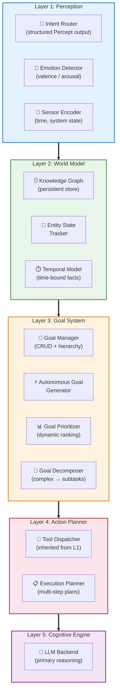
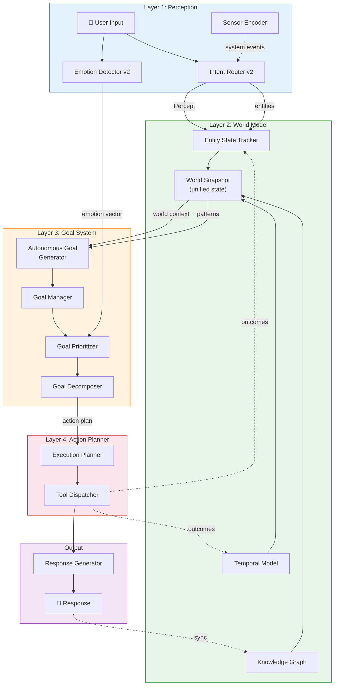
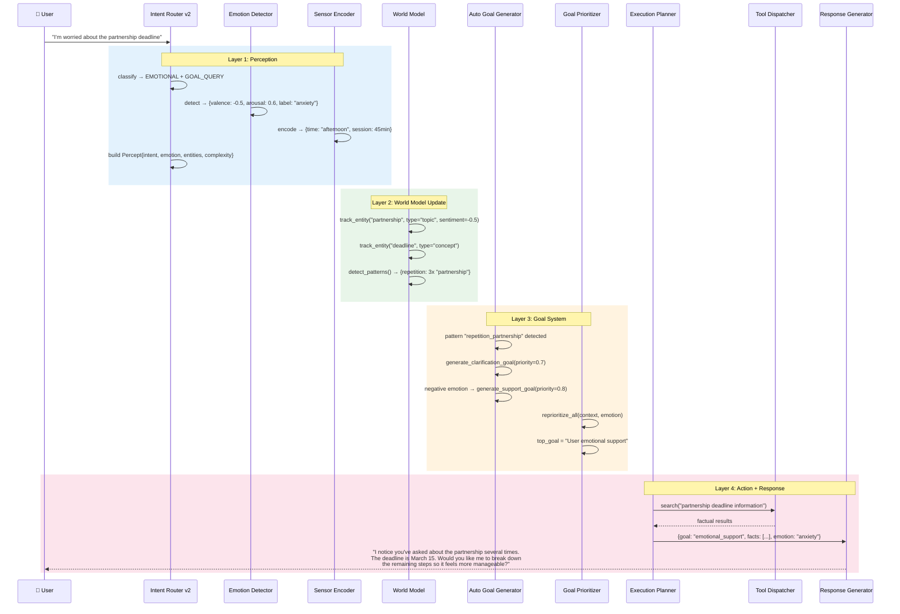
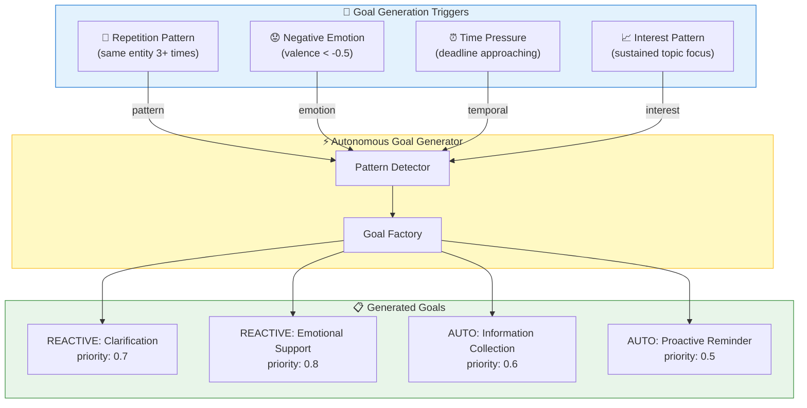
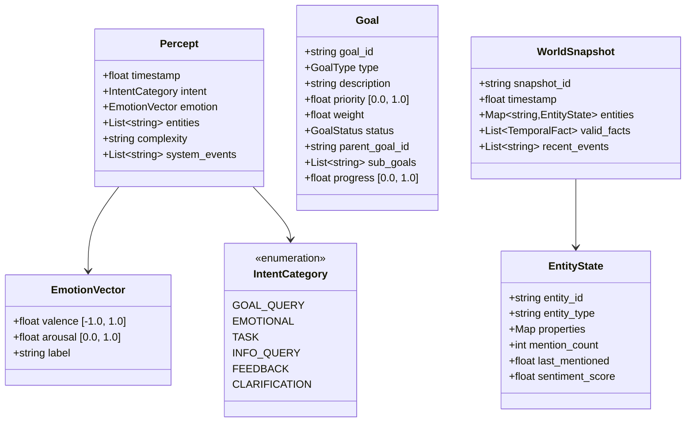
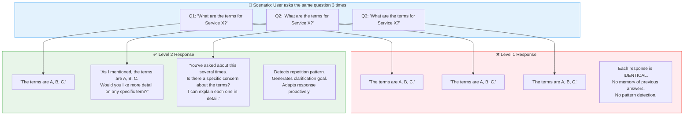
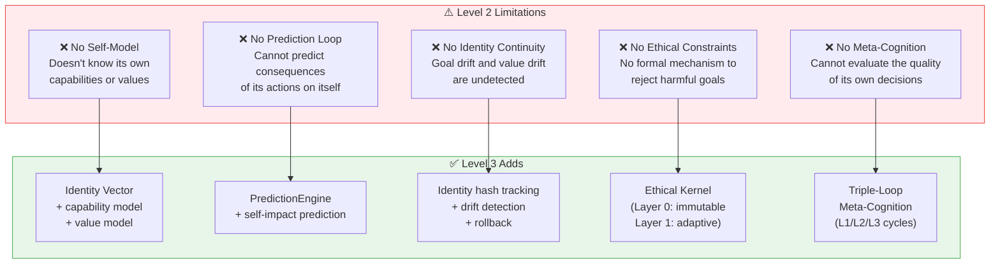
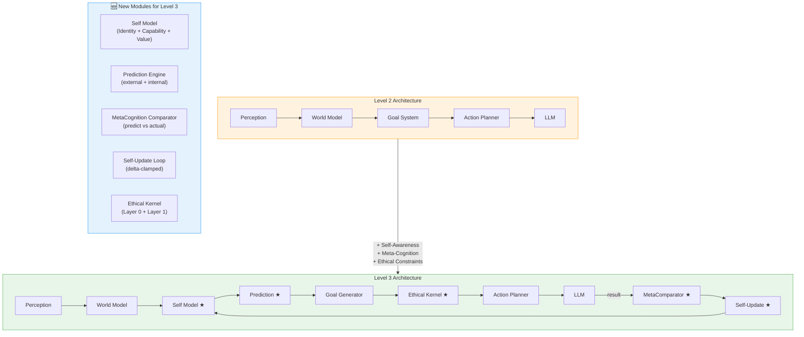

# Level 2: Autonomous Agent — Architecture & Design

> **MSCP Level Series** | [Level 1](Level_1_Tool_Agent.md) ← Level 2 → [Level 3](Level_3_Self_Regulating_Agent.md)  
> **Status**: 🔬 **Experimental** — Conceptual framework and experimental design. Not a production specification.  
> **Date**: February 2026

---

## 1. Overview

Level 2 represents the first significant leap beyond reactive tool calling. An Autonomous Agent maintains an **internal world model**, tracks entities across interactions, understands emotional context, and — critically — can **generate its own goals** autonomously based on observed patterns.

> ⚠️ **Note**: This document describes a cognitive level within the MSCP taxonomy. The architectures, pseudocode, and diagrams here are experimental designs exploring structural concepts — not production-ready implementations.

### 1.1 Defining Properties

| Property | Level 1 | Level 2 |
|----------|:-------:|:-------:|
| Internal State | None | **World Model** (persistent) |
| Goal Setting | None | **Autonomous** (pattern-based) |
| Self-Awareness | None | None |
| Memory | Session-scoped | **Long-term** (persistent store) |
| Entity Tracking | None | **Active** (cross-session) |
| Emotion Understanding | None | **Valence/Arousal** analysis |
| Autonomy | None | **Medium** |

### 1.2 Key Distinction from Level 1

Level 1 agents are **memoryless functions**: `f(input) → output`. 
Level 2 agents are **stateful processes**: `f(input, world_state, goals) → (output, world_state', goals')`.

---

## 2. Architecture

### 2.1 Five-Layer Architecture



### 2.2 Detailed Component Interaction



---

## 3. Data Flow

### 3.1 Full Processing Sequence



### 3.2 Autonomous Goal Generation Flow



---

## 4. Key Components

### 4.1 Percept Structure



---

## 5. Pseudocode

### 5.1 Core Agent Loop

```
ALGORITHM Level2_AgentLoop(user_input, session_context):
    ──────────────────────────────────────────
    INPUT:  user_input : string, session_context : map
    OUTPUT: Level2Response{content, active_goal, context_summary, emotion}
    ──────────────────────────────────────────

    // ═══════════════════════════════════════
    // LAYER 1: PERCEPTION
    // ═══════════════════════════════════════
    percept  ← IntentRouter.route(user_input, session_context)
    emotion  ← EmotionDetector.detect(user_input)
    sensors  ← SensorEncoder.encode()

    // ═══════════════════════════════════════
    // LAYER 2: WORLD MODEL UPDATE
    // ═══════════════════════════════════════
    FOR EACH entity_id IN percept.entities DO
        WorldModel.entity_tracker.track(entity_id, sentiment=emotion.valence)
    END FOR

    world_context ← WorldModel.get_context()

    // ═══════════════════════════════════════
    // LAYER 3: AUTONOMOUS GOAL GENERATION
    // ═══════════════════════════════════════
    patterns ← WorldModel.detect_patterns()
    auto_goals ← GoalGenerator.generate_from_patterns(patterns, world_context)

    // Emotion-driven goal generation
    IF emotion.valence < -0.5 AND emotion.arousal > 0.5 THEN
        support_goal ← GoalManager.create(
            description = "Provide emotional support and clarification",
            type        = AUTO_GENERATED,
            priority    = 0.8
        )
        auto_goals.append(support_goal)
    END IF

    // Dynamic reprioritization
    GoalPrioritizer.reprioritize_all(world_context, emotion)

    // ═══════════════════════════════════════
    // LAYER 4: GOAL-DIRECTED RESPONSE
    // ═══════════════════════════════════════
    active_goal ← GoalManager.get_top_priority()

    response_content ← ResponseGenerator.generate(
        user_input   = user_input,
        world_context = world_context,
        active_goal  = active_goal,
        emotion      = emotion
    )

    // ═══════════════════════════════════════
    // BACKGROUND: PERSIST STATE
    // ═══════════════════════════════════════
    ASYNC WorldModel.sync_to_store()

    RETURN Level2Response{
        content         = response_content,
        active_goal     = active_goal,
        context_summary = summarize(world_context),
        emotion         = emotion
    }
```

### 5.2 Entity State Tracker

```
ALGORITHM EntityTracker.track(entity_id, entity_type, sentiment):
    ──────────────────────────────────────────
    INPUT:  entity_id, entity_type, sentiment
    OUTPUT: EntityState (updated)
    ──────────────────────────────────────────

    now ← current_timestamp()

    IF entity_id IN entities THEN
        entity ← entities[entity_id]
        entity.mention_count ← entity.mention_count + 1
        entity.last_mentioned ← now
        // Exponential moving average for sentiment
        entity.sentiment_score ← 0.7 * entity.sentiment_score + 0.3 * sentiment
    ELSE
        entity ← new EntityState{
            entity_id       = entity_id,
            entity_type     = entity_type,
            mention_count   = 1,
            first_mentioned = now,
            last_mentioned  = now,
            sentiment_score = sentiment
        }
        entities[entity_id] ← entity
    END IF

    mention_history.append((entity_id, now))
    RETURN entity


ALGORITHM EntityTracker.detect_repetition(entity_id, time_window):
    ──────────────────────────────────────────
    Counts mentions of entity_id within the last time_window seconds
    ──────────────────────────────────────────
    cutoff ← current_timestamp() - time_window
    count ← COUNT(m FOR m IN mention_history 
                  WHERE m.entity_id = entity_id AND m.timestamp > cutoff)
    RETURN count
```

### 5.3 Goal Prioritizer

```
ALGORITHM GoalPrioritizer.compute_priority(goal, context, emotion):
    ──────────────────────────────────────────
    Dynamically recomputes goal priority based on:
    - Time urgency (deadline proximity)
    - Emotional context (negative emotion boosts reactive goals)
    - Entity importance (frequently mentioned → higher priority)
    ──────────────────────────────────────────

    base ← goal.priority

    // Time urgency factor [0.0, 1.0]
    IF goal.deadline IS NOT NULL THEN
        remaining ← goal.deadline - now()
        IF remaining ≤ 0        THEN time_mod ← 1.0   // overdue
        ELSE IF remaining < 1h  THEN time_mod ← 0.9
        ELSE IF remaining < 24h THEN time_mod ← 0.7
        ELSE                         time_mod ← 0.5
    ELSE
        time_mod ← 0.5
    END IF

    // Emotion factor [0.0, 1.0]
    IF goal.type = REACTIVE AND emotion.valence < 0 THEN
        emotion_mod ← 0.8
    ELSE
        emotion_mod ← 0.5
    END IF

    // Weighted combination
    final ← 0.5 * base + 0.3 * time_mod + 0.2 * emotion_mod
    RETURN clamp(final, 0.0, 1.0)
```

---

## 6. Level 1 vs Level 2: Behavioral Comparison

### 6.1 Same Scenario — Different Behavior



---

## 7. Structural Limitations of Level 2

What Level 2 still **cannot** do (motivating Level 3):



---

## 8. Transition to Level 3

### 8.1 Architecture Delta



---

## References

1. Park, J.S., et al. "Generative Agents: Interactive Simulacra of Human Behavior." *UIST 2023*. [arXiv:2304.03442](https://arxiv.org/abs/2304.03442) (Autonomous agent behavior and world model)
2. Wang, G., et al. "Voyager: An Open-Ended Embodied Agent with Large Language Models." *arXiv 2023*. [arXiv:2305.16291](https://arxiv.org/abs/2305.16291) (Autonomous goal generation and skill acquisition)
3. Rao, A.S. & Georgeff, M.P. "BDI Agents: From Theory to Practice." *ICMAS 1995*. [Link](https://www.cs.ox.ac.uk/people/michael.wooldridge/teaching/CSAI/lect21-reading-material-rao-georgeff.pdf) (Belief-Desire-Intention architecture — foundational for goal systems)
4. Picard, R.W. *Affective Computing.* MIT Press, 1997. (Emotion detection and valence/arousal models)
5. Huang, W., et al. "Inner Monologue: Embodied Reasoning through Planning with Language Models." *CoRL 2022*. [arXiv:2207.05608](https://arxiv.org/abs/2207.05608) (Internal reasoning and feedback loops)
6. Wang, X., et al. "Plan-and-Solve Prompting: Improving Zero-Shot Chain-of-Thought Reasoning." *ACL 2023*. [arXiv:2305.04091](https://arxiv.org/abs/2305.04091) (Goal decomposition and multi-step planning)
7. Wang, L., et al. "A Survey on Large Language Model based Autonomous Agents." *arXiv 2023*. [arXiv:2308.11432](https://arxiv.org/abs/2308.11432) (Agent survey including autonomy taxonomy)
8. Sumers, T.R., et al. "Cognitive Architectures for Language Agents." *arXiv 2023*. [arXiv:2309.02427](https://arxiv.org/abs/2309.02427) (Cognitive architecture for LLM agents)
9. Russell, S. & Norvig, P. *Artificial Intelligence: A Modern Approach.* 4th Edition, Pearson, 2021. (Goal-directed agent formalization)
10. Ekman, P. "An Argument for Basic Emotions." *Cognition & Emotion*, 6(3–4), 169–200, 1992. [DOI:10.1080/02699939208411068](https://doi.org/10.1080/02699939208411068) (Emotion classification framework)

---

> **Previous**: [← Level 1: Tool Agent](Level_1_Tool_Agent.md)  
> **Next**: [Level 3: Self-Regulating Cognitive Agent →](Level_3_Self_Regulating_Agent.md)
