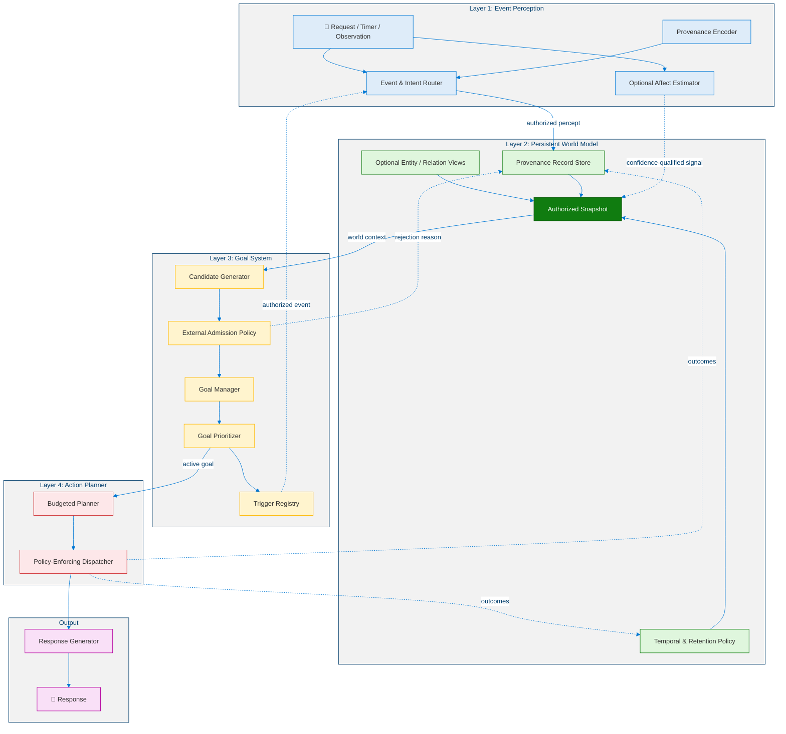
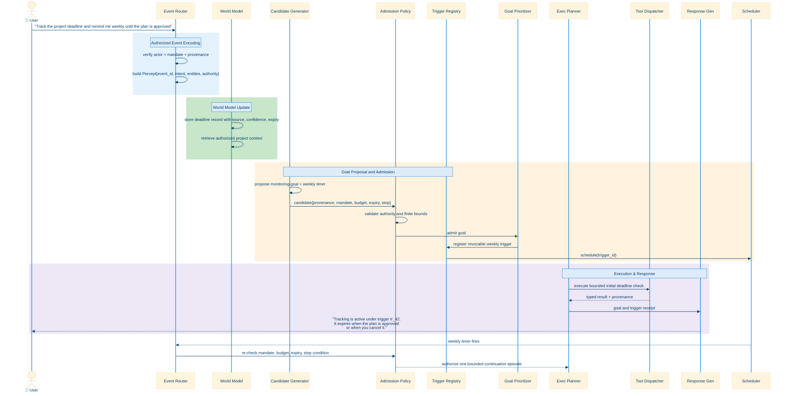
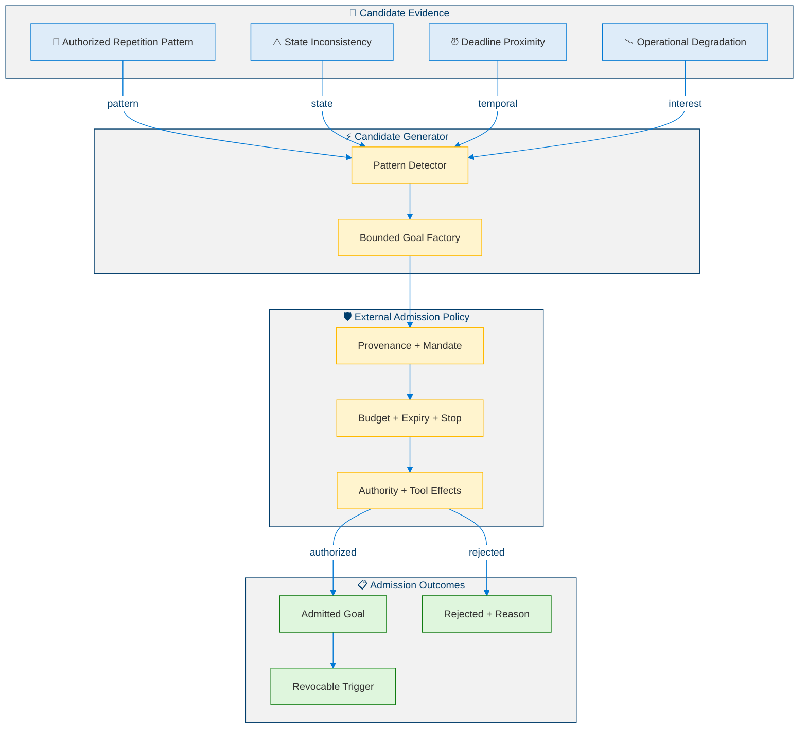
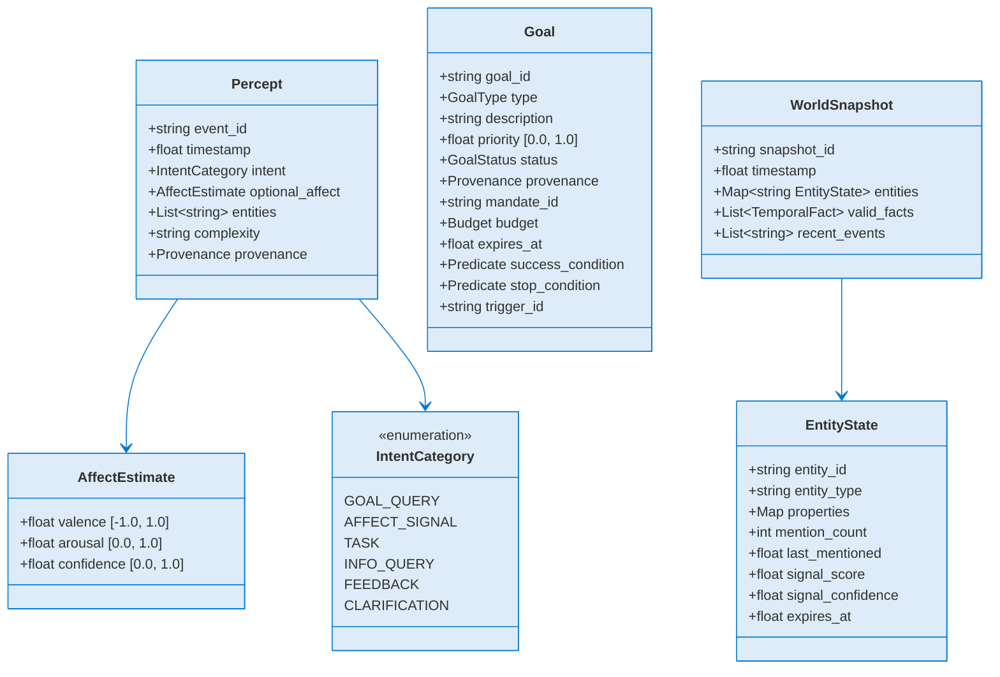
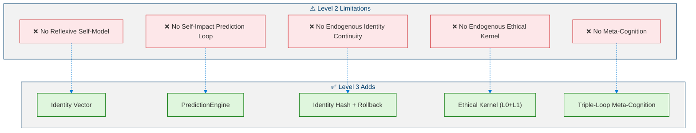
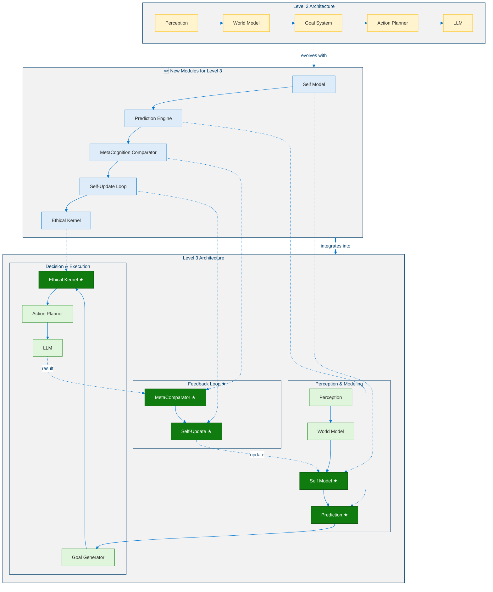

<!--
Copyright (c) 2026 Moon Hyuk Choi
Licensed under the MIT License.
See LICENSE file in the repository root for full license information.
-->
# Level 2: Autonomous Agent - Architecture & Design

> **MSCP Level Series** | [Level 1](Level_1_Tool_Agent.md) ← Level 2 → [Level 3](Level_3_Self_Regulating_Agent.md)  
> **Status**: 🔬 **Experimental** - Conceptual framework and experimental design. Not a production specification.  
> **Date**: February 2026

## Revision History

| Version | Date | Description |
|---------|------|-------------|
| 0.1.0 | 2026-02-23 | Initial document creation with formal Definitions 1-7, Propositions 1-3 |
| 0.2.0 | 2026-02-26 | Added overview essence formula; added revision history table; reinforced entity lifecycle, importance scoring, and world model architecture from specs |
| 0.3.0 | 2026-02-26 | Fixed Def 6 type signature ($\mathcal{P}(\mathcal{S}) \to \mathcal{S}$); added constructive argument to Prop 2 |
| 0.5.0 | 2026-03-31 | Added EnvironmentState (Def 2.1), ConversationContext (1.6), Percept Tracking (1.7); enriched term explanations |
| 0.6.0 | 2026-07-21 | Defined bounded event-driven autonomy; separated persistence from autonomy; added goal provenance, retention, and external safety requirements |

---

## 1. Overview

Level 2 represents the first transition from request-bounded reaction to **bounded, event-driven autonomy**. An Autonomous Agent owns persistent cognitive state, can originate and maintain goals not reducible to the current request, and may resume work across episodes when an authorized event fires. Its autonomy remains constrained by an external mandate, authority policy, budgets, and stop conditions. It has no reflexive self-model.

> **Level Essence.** A Level 2 agent is a policy-constrained stateful process. Each authorized event may update persistent state and goals, produce bounded actions, and register a future trigger:
>
> $$
> (o_t,\, \mathbf{a}_t,\, s_{t+1},\, G_{t+1},\, q_{t+1})
> \sim F(\,\cdot\mid x_t, e_t, s_t, G_t, \kappa),
> \qquad |\mathbf{a}_t| \leq B
> $$
>
> where $x_t$ is an authorized request, timer, or observation event; $e_t$ is the external environment; $s_t$ is agent-owned persistent cognitive state; $G_t$ is the persistent goal set; $q_{t+1}$ is an optional future trigger; $\kappa$ is the externally governed mandate and safety policy; and $B$ is the per-episode action budget.

> ⚠️ **Note**: This document describes a cognitive level within the MSCP taxonomy. The architectures, pseudocode, and diagrams here are experimental designs exploring structural concepts - not production-ready implementations.

### 1.1 Defining Properties

| Property | Level 1 | Level 2 |
|----------|:-------:|:-------:|
| Internal State | None | **Agent-owned persistent cognitive state** |
| Goal Setting | None | **Bounded autonomous** goals within mandate $\kappa$ |
| Self-Awareness | None | None |
| Memory | Explicit host context only | **Persistent**, provenance- and retention-governed |
| Entity Tracking | None | Optional persistent world-state implementation |
| Affect Signal | Current-input analysis possible | Optional longitudinal estimate with uncertainty |
| Autonomy | None | **Bounded** event-driven continuation |

### 1.2 Key Distinction from Level 1

Level 1 agents run externally triggered, bounded episodes and retain no agent-owned cognitive state or goals across episode boundaries. Level 2 agents satisfy three additional conditions:

1. **Causal persistence**: stored state is retrieved and can change later decisions.
2. **Autonomous goal origination**: the agent can create a goal not reducible to the current request, while remaining inside mandate $\kappa$.
3. **Authorized continuation**: a timer, observation, or approved scheduler may start a later episode for a maintained goal.

A chat transcript, note database, or user-created task list alone does not satisfy Level 2.

### 1.3 Formal Definition

> **Definition 1 (Level 2 Agent).** Let $\mathcal{X}$ be the authorized event space, $\mathcal{O}_{\bot}$ the response space including no user-facing response, $\mathcal{A}^{\leq B}$ bounded action sequences, $\mathcal{E}$ the external environment, $\mathcal{S}$ persistent cognitive state, $\mathcal{G}$ persistent goals, $\mathcal{Q}$ future triggers, and $\mathcal{K}$ external mandates and safety policies. A Level 2 agent is the tuple:
>
> $$
> \mathcal{A}_2 = \langle \mathcal{X}, \mathcal{O}_{\bot}, \mathcal{A}, \mathcal{E}, \mathcal{S}, \mathcal{G}, \mathcal{Q}, \mathcal{K}, F \rangle
> $$
>
> with transition kernel:
>
> $$
> F : \mathcal{X} \times \mathcal{E} \times \mathcal{S} \times \mathcal{G} \times \mathcal{K}
> \to \operatorname{Dist}\!\left(\mathcal{O}_{\bot} \times \mathcal{A}^{\leq B} \times \mathcal{E} \times \mathcal{S} \times \mathcal{G} \times \mathcal{Q}\right)
> $$
>
> subject to the inherited Level 1 safety contract and the additional constraints that every goal records its provenance and authorizing mandate, every future trigger is revocable and policy-checked at execution time, and no action sequence exceeds its delegated authority or budget.

At each event $t$:
>
> $$
> (o_t, \mathbf{a}_t, e_{t+1}, s_{t+1}, G_{t+1}, q_{t+1})
> \sim F(\,\cdot\mid x_t, e_t, s_t, G_t, \kappa)
> $$

This distinguishes Level 2 from Level 1 by the joint presence of **causally used persistent state, autonomous goal origination, and authorized cross-episode continuation**. Persistence without the latter two is a stateful assistant, not a Level 2 Autonomous Agent.

> **Definition 2 (Persistent World Model).** The world model $\mathcal{W}_t$ is the agent-owned, retention-governed set of records available across episodes:
>
> $$
> \mathcal{W}_t = \langle \mathcal{M}_t, \mathcal{R}_{\text{ret}} \rangle,
> \qquad
> m_i = \langle \text{content},\, \text{source},\, c_i,\, t_{\text{valid}},\, t_{\text{expiry}},\, \text{sensitivity} \rangle
> $$
>
> where:
> - $\mathcal{M}_t$ is a finite set of persistent records
> - $\text{source}$ records provenance and the observation or actor that supplied the record
> - $c_i \in [0,1]$ is confidence in the record, not confidence in the agent as a whole
> - $t_{\text{valid}}$ and $t_{\text{expiry}}$ bound temporal validity and retention
> - $\mathcal{R}_{\text{ret}}$ defines minimization, access, correction, archival, and deletion rules
>
> A deployment may represent $\mathcal{M}_t$ as documents, relational records, a knowledge graph, an entity tracker, a temporal store, or a hybrid. Those are implementation profiles, not separate level prerequisites. The context snapshot used for event $x_t$ is:
>
> $$s_t = \pi(\mathcal{W}_t, x_t, \kappa)$$

> **Definition 3 (Optional Affect Estimate).** A deployment may estimate affective expression as a confidence-bearing signal:
>
> $$
> \hat{e}(t) = \langle v(t),\, a(t),\, c_e(t) \rangle,
> \quad v(t) \in [-1,1],\quad a(t), c_e(t) \in [0,1]
> $$
>
> Here $v(t)$ estimates expressed valence, $a(t)$ estimates activation, and $c_e(t)$ is calibration confidence. This signal is not a claim about a person's hidden mental state and is not required for Level 2. It may affect a decision only when $c_e(t) \geq \theta_e$, policy $\kappa$ permits that use, and the resulting action remains within the active mandate. Low-confidence estimates MUST be ignored or clarified, not accumulated as fact.

> **Definition 4 (Goal).** A goal $g \in \mathcal{G}$ is a tuple:
>
> $$
> g = \langle \text{id},\, \text{type},\, \text{desc},\, p,\, \text{status},\, \rho,\, \kappa_g,\, b_g,\, t_c,\, t_x,\, \chi_{\text{success}},\, \chi_{\text{stop}},\, q_g \rangle
> $$
>
> where $p \in [0,1]$ is priority, $\rho$ is provenance (source, generation method, and triggering event), $\kappa_g$ references the authorizing mandate, $b_g$ is a finite action/time/cost budget, $t_c$ and $t_x$ are creation and expiry times, $\chi_{\text{success}}$ and $\chi_{\text{stop}}$ are explicit success and stop predicates, and $q_g$ is an optional revocable continuation trigger.
>
> **Goal types**: $\text{type} \in \{\text{USER}, \text{AUTO}, \text{SYSTEM}, \text{REACTIVE}\}$, where USER is explicitly requested, AUTO is generated from persistent-state evidence, SYSTEM maintains delegated operation, and REACTIVE responds to a policy-authorized event.
>
> **Goal status**: $\text{status} \in \{\text{PENDING}, \text{ACTIVE}, \text{COMPLETED}, \text{FAILED}, \text{BLOCKED}, \text{DEFERRED}, \text{CANCELLED}, \text{EXPIRED}\}$. Every terminal state releases outstanding triggers and delegated resources. Expiry, revocation, mandate withdrawal, budget exhaustion, or $\chi_{\text{stop}}$ terminates or blocks execution even when the goal remains incomplete.

> **Definition 5 (Goal Priority Function).** The dynamic priority of a goal is computed as a weighted combination:
>
> $$
> p(g,t) = \operatorname{clip}_{[0,1]}\!\left(\alpha p_{\text{base}}(g) + \beta u(g,t) + \gamma r(g,s_t) - \delta c(g,e_t)\right)
> $$
>
> where:
> - $p_{\text{base}}(g)$ is the static base priority
> - $u(g, t) \in [0,1]$ is the **time urgency** factor (monotonically increasing as deadline approaches)
> - $r(g,s_t) \in [0,1]$ is evidence-backed relevance to the current persistent state
> - $c(g,e_t) \in [0,1]$ is normalized execution cost and risk
> - $\alpha + \beta + \gamma + \delta = 1$
>
> Priority never grants authority. Admission and every action remain subject to $\kappa_g$, the inherited tool policy, remaining budget, and stop conditions. Optional affect estimates may contribute to $r(g,s_t)$ only under Definition 3; they are not a separate authority signal.

> **Definition 6 (Autonomous Goal Generation and Admission).** The generator proposes candidate goals from persistent state, the current event, and mandate $\kappa$:
>
> $$\Phi_{AG} : \mathcal{S} \times \mathcal{X} \times \mathcal{K} \to \mathcal{P}(\mathcal{G}_{\text{candidate}})$$
>
> Candidates become active goals only through an external admission policy:
>
> $$
> \operatorname{admit}(g,\kappa) =
> \operatorname{authorized}(g,\kappa)
> \land \operatorname{complete}(\rho, b_g, t_x, \chi_{\text{success}}, \chi_{\text{stop}})
> $$
>
> Pattern repetition, deadline proximity, state inconsistency, and operational degradation are illustrative candidate sources. Candidate generation does not itself authorize action. Rejected candidates are recorded with a reason or discarded according to retention policy; they never enter $G_{t+1}$.
>

> **Definition 6.1 (Future Trigger).** A continuation trigger is:
>
> $$
> q = \langle \text{id},\, \text{type},\, \text{params},\, g_{\text{resume}},\, t_{\text{not-before}},\, t_{\text{expiry}},\, \kappa_q,\, \text{status} \rangle
> $$
>
> where $\text{type} \in \{\text{TIMER},\text{OBSERVATION},\text{GOAL\_STATUS}\}$ and $\text{status} \in \{\text{REGISTERED},\text{FIRED},\text{REVOKED},\text{EXPIRED}\}$. Registration returns an auditable identifier. A user or system actor with authority $\kappa_q$ can revoke it. When it fires, mandate, budget, expiry, and stop conditions are re-evaluated before a new bounded episode begins.

### 1.4 Optional Entity State Tracking Profile

An entity tracker is one possible world-model implementation. When policy permits longitudinal affective-expression tracking, a confidence-qualified signal may be updated via an **exponential moving average** (EMA):

$$\text{sentiment}_{e_k}(t) = (1 - \lambda) \cdot \text{sentiment}_{e_k}(t-1) + \lambda \cdot v(t)$$

where $\lambda \in (0,1)$ is a deployment-calibrated smoothing factor. An update is permitted only for estimates satisfying Definition 3 and the record MUST retain provenance, confidence, expiry, and sensitivity metadata.

#### 1.4.1 Entity Lifecycle

Each tracked entity follows a retention-governed lifecycle:

$$
\operatorname{lifecycle}(e_k):
\mathrm{NEW} \to \mathrm{ACTIVE} \to \mathrm{STALE} \to \mathrm{ARCHIVED} \to \mathrm{PRUNED}
$$

Transitions are controlled by $\mathcal{R}_{\text{ret}}$, sensitivity, purpose, user correction or deletion requests, and legal requirements. STALE records receive reduced retrieval weight; ARCHIVED records cannot trigger goals; PRUNED records are removed. Indefinite retention is prohibited unless explicitly required and authorized.

#### 1.4.2 Entity Importance Score

The importance of an entity $e_k$ at time $t$ is a weighted combination of **recency** and **frequency**:

$$\operatorname{importance}(e_k, t) = \alpha_r \cdot \operatorname{recency}(e_k, t) + \alpha_f \cdot \operatorname{frequency}(e_k)$$

where:

$$\operatorname{recency}(e_k, t) = \frac{1}{1 + (t - t_{\text{last}}(e_k)) / \tau}, \quad \operatorname{frequency}(e_k) = \min\!\left(1,\; \frac{\text{mention count}(e_k)}{N_{\text{cap}}}\right)$$

with deployment-calibrated time constant $\tau$, mention cap $N_{\text{cap}}$, and weights $\alpha_r + \alpha_f = 1$. These parameters require evaluation for the deployment domain; they are not universal defaults.

### 1.5 Reference World Model Architecture

One conforming implementation may use a three-tier architecture:

1. **Cognitive Layer** ($\mathcal{M}$): Provenance-bearing records and optional derived entity, relation, or temporal views.
2. **Session Layer** ($\mathcal{M}_{\text{session}}$): Working memory that holds the active context window for the current interaction session, including recently referenced entities and their relevance scores.
3. **Persistence Layer** ($\mathcal{P}_{\text{store}}$): Durable storage that enforces access, provenance, correction, expiry, archival, and deletion under $\mathcal{R}_{\text{ret}}$.

The context projection applies policy and retention filters before retrieval:

$$
s_t = \pi_{\kappa}(\mathcal{W}_t, x_t)
= \pi_{\text{session}}(\mathcal{M}_{\text{session},t})
\oplus \pi_{\text{retrieve}}(\mathcal{P}_{\text{store}}, x_t, \kappa)
$$

where $\oplus$ denotes composition of authorized context. Records that are expired, revoked, purpose-incompatible, or outside the current actor's authority are excluded.

### 1.6 Environment State

Beyond persistent world state, a deployment may provide a real-time snapshot of its **operational environment**. This is externally supplied telemetry used for scheduling and graceful degradation; it is not a reflexive model of the agent's identity or cognition.

> **Definition 2.1 (Environment State).** The environment state $\mathcal{E}_{\text{env}}(t)$ is a structured tuple representing the agent's operational context:
>
> $$\mathcal{E}_{\text{env}}(t) = \langle \ell(t),\; \mathcal{T}_{\text{active}}(t),\; r_{\text{err}}(t),\; \lambda_{\text{resp}}(t),\; d_{\text{session}}(t) \rangle$$
>
> where:
> - $\ell(t) \in [0,1]$ - **system load**: normalized measure of computational resource utilization. A value of $0$ indicates idle and $1$ indicates full saturation.
> - $\mathcal{T}_{\text{active}}(t) \subseteq \mathcal{T}$ - **active tools**: the subset of available tools currently accessible (tools may become unavailable due to API failures or rate limits).
> - $r_{\text{err}}(t) \in [0,1]$ - **error rate**: the fraction of recent tool invocations that returned errors. Computed over a sliding window: $r_{\text{err}}(t) = |\{i \in H_t : T_i = \textit{err}\}| / |H_t|$ where $H_t$ is the invocation window.
> - $\lambda_{\text{resp}}(t) \in \mathbb{R}_{\geq 0}$ - **response latency**: mean response time in milliseconds across recent requests.
> - $d_{\text{session}}(t) \in \mathbb{R}_{\geq 0}$ - **session duration**: elapsed time in seconds since the current session began.
>
> The distinction between **persistent cognitive state** ($\mathcal{W}$) and **operational telemetry** ($\mathcal{E}_{\text{env}}$) is critical. Telemetry may constrain execution but does not establish self-awareness.

Operational degradation may propose a SYSTEM-type maintenance goal through Definition 6. The candidate still requires mandate admission, a finite budget, expiry, and stop conditions. Immediate overload handling remains an external execution-policy decision and does not require goal creation.

### 1.7 Conversation Context

The **conversation context** is the agent's working memory for the current interaction session. It is distinct from the persistent world model ($\mathcal{W}$) in that it tracks short-term conversational dynamics rather than long-term factual knowledge.

The conversation context $\mathcal{C}_{\text{conv}}(t)$ maintains the following state:

| Field | Type | Description |
|-------|------|-------------|
| $n_{\text{turn}}$ | $\mathbb{N}$ | **Turn count** - number of exchanges in the current session |
| $\mathcal{H}_{\text{topic}}$ | $\text{List}(\text{String})$ | **Topic history** - ordered list of discussed topics (max 50). Enables pattern detection. |
| $\tau_{\text{current}}$ | $\text{String}$ | **Current topic** - the inferred active topic |
| $\ell_{\text{lang}}$ | $\text{String}$ | **Language** - detected language of the user |
| $\chi_{\text{trend}}$ | $[-1,1]$ | **Complexity trend** - direction of request complexity over time. Positive values indicate increasing complexity; negative values indicate simplification. |
| $e_{\text{trend}}$ | $[-1,1] \cup \{\bot\}$ | **Optional affect-expression trend** - computed only from confidence-qualified, retention-authorized estimates |
| $\iota_{\text{last}}$ | $\text{Intent}$ | **Last intent** - most recently classified user intent |

Current-input adaptation and explicit host-supplied transcript use are possible at Level 1. Level 2 adds agent-owned longitudinal state that can drive later goals and authorized continuation:

- **Cross-episode topic continuity**: Authorized state can preserve task-relevant context without requiring the host to resend the transcript.
- **Longitudinal pattern evidence**: Repetition, deadlines, or state inconsistency may propose a goal candidate under Definition 6.
- **Trend-aware interaction**: Complexity or optional affect-expression trends may adjust presentation, but cannot independently authorize a goal or consequential action.

### 1.8 Percept Tracking

Each authorized event is encoded into a structured **percept** before processing:

$$
\operatorname{Percept}(t) = \langle \mathrm{event\_id},\, \iota(t),\, \hat e(t) \cup \{\bot\},\, \mathcal{E}_{\mathrm{ref}}(t),\, \xi(t),\, \rho_t,\, t \rangle
$$

where $\iota(t)$ is classified intent, $\hat e(t)$ is an optional affect estimate, $\mathcal{E}_{\text{ref}}(t)$ is the referenced entity set, $\xi(t) \in [0,1]$ is estimated complexity, $\rho_t$ is event provenance and authority, and $t$ is the timestamp.

The agent maintains a **bounded, retention-governed percept buffer**. Its capacity and lifetime are deployment parameters rather than universal constants. It serves two purposes:

1. **Trend analysis**: Sliding-window computations may produce complexity and optional affect-expression trends with confidence metadata.
2. **Candidate evidence**: The goal generator may use authorized recurring entities, deadlines, state inconsistencies, and temporal patterns as evidence. The admission policy, not the buffer, authorizes goals.

---

## 2. Architecture

### 2.1 Five-Layer Architecture

<!-- Level 2 Five-Layer Architecture -->


```mermaid
%%{init: {'theme': 'base', 'themeVariables': {'primaryColor': '#0078D4', 'primaryTextColor': '#003D6B', 'primaryBorderColor': '#003D6B', 'secondaryColor': '#50E6FF', 'secondaryTextColor': '#323130', 'secondaryBorderColor': '#00BCF2', 'tertiaryColor': '#F2F2F2', 'tertiaryTextColor': '#323130', 'lineColor': '#0078D4', 'textColor': '#323130', 'mainBkg': '#DEECF9', 'nodeBorder': '#0078D4', 'clusterBkg': '#F2F2F2', 'clusterBorder': '#003D6B', 'titleColor': '#003D6B', 'edgeLabelBackground': '#FFFFFF', 'fontSize': '14px'}}}%%
flowchart TD
  classDef perception fill:#0078D4,stroke:#003D6B,color:#FFF
  classDef perceptionLight fill:#DEECF9,stroke:#0078D4,color:#323130
  classDef world fill:#107C10,stroke:#085108,color:#FFF
  classDef worldLight fill:#DFF6DD,stroke:#107C10,color:#323130
  classDef goal fill:#FFB900,stroke:#CC9400,color:#323130
  classDef goalLight fill:#FFF4CE,stroke:#FFB900,color:#323130
  classDef action fill:#D13438,stroke:#A4262C,color:#FFF
  classDef actionLight fill:#FDE7E9,stroke:#D13438,color:#323130
  classDef cognitive fill:#B4009E,stroke:#8A0076,color:#FFF
  classDef cognitiveLight fill:#F9E0F7,stroke:#B4009E,color:#323130

  subgraph PL["Layer 1: Event Perception"]
    direction LR
    IR["🎯 Event / Intent Router"]:::perceptionLight
    ED["Optional Affect<br/>Estimator"]:::perceptionLight
    SE["📡 Provenance Encoder"]:::perceptionLight
  end

  subgraph WM["Layer 2: Persistent World Model"]
    direction LR
    KG["🗄️ Record Store"]:::worldLight
    ES["Optional Entity /<br/>Relation Views"]:::worldLight
    TM["Retention &<br/>Temporal Validity"]:::worldLight
  end

  subgraph GS["Layer 3: Goal System"]
    direction LR
    GM["🎯 Goal Manager"]:::goalLight
    AGG["⚡ Candidate Generator"]:::goalLight
    GA["🛡️ Admission Policy"]:::goalLight
    GP["📊 Goal Prioritizer"]:::goalLight
    GD["⏰ Trigger Registry"]:::goalLight
  end

  subgraph AP["Layer 4: Action Planner"]
    direction LR
    TD["🔧 Policy-Enforcing Dispatcher"]:::actionLight
    EP["📋 Budgeted Planner"]:::actionLight
  end

  subgraph CE["Layer 5: Reasoning Engine"]
    direction LR
    LLM["🧠 Reasoning Backend"]:::cognitiveLight
  end

  PL ==> WM
  WM ==> GS
  GS ==> AP
  AP ==> CE
```

### 2.2 Detailed Component Interaction

<!-- Level 2 Component Interaction -->


```mermaid
%%{init: {'theme': 'base', 'themeVariables': {'primaryColor': '#0078D4', 'primaryTextColor': '#003D6B', 'primaryBorderColor': '#003D6B', 'secondaryColor': '#50E6FF', 'secondaryTextColor': '#323130', 'secondaryBorderColor': '#00BCF2', 'tertiaryColor': '#F2F2F2', 'tertiaryTextColor': '#323130', 'lineColor': '#0078D4', 'textColor': '#323130', 'mainBkg': '#DEECF9', 'nodeBorder': '#0078D4', 'clusterBkg': '#F2F2F2', 'clusterBorder': '#003D6B', 'titleColor': '#003D6B', 'edgeLabelBackground': '#FFFFFF', 'fontSize': '14px'}}}%%
flowchart TD
  classDef perceptionLight fill:#DEECF9,stroke:#0078D4,color:#323130
  classDef worldLight fill:#DFF6DD,stroke:#107C10,color:#323130
  classDef worldAccent fill:#107C10,stroke:#085108,color:#FFF
  classDef goalLight fill:#FFF4CE,stroke:#FFB900,color:#323130
  classDef actionLight fill:#FDE7E9,stroke:#D13438,color:#323130
  classDef outputLight fill:#F9E0F7,stroke:#B4009E,color:#323130
  classDef feedback fill:#F2F2F2,stroke:#8A8886,color:#323130

  subgraph Perception["Layer 1: Event Perception"]
    direction LR
    UserInput["👤 Request / Timer / Observation"]:::perceptionLight
    IRv2["Event & Intent Router"]:::perceptionLight
    EDv2["Optional Affect Estimator"]:::perceptionLight
    SEn["Provenance Encoder"]:::perceptionLight
    UserInput --> IRv2
    UserInput --> EDv2
    SEn --> IRv2
  end

  subgraph WorldModel["Layer 2: Persistent World Model"]
    direction LR
    EST["Optional Entity / Relation Views"]:::worldLight
    TML["Temporal & Retention Policy"]:::worldLight
    KG["Provenance Record Store"]:::worldLight
    WS["Authorized Snapshot"]:::worldAccent
    EST --> WS
    TML --> WS
    KG --> WS
  end

  subgraph GoalSystem["Layer 3: Goal System"]
    direction LR
    AGG["Candidate Generator"]:::goalLight
    ADM["External Admission Policy"]:::goalLight
    GMgr["Goal Manager"]:::goalLight
    GP["Goal Prioritizer"]:::goalLight
    GD["Trigger Registry"]:::goalLight
    AGG --> ADM --> GMgr
    GMgr --> GP --> GD
  end

  subgraph ActionPlanner["Layer 4: Action Planner"]
    direction LR
    EP["Budgeted Planner"]:::actionLight
    TD["Policy-Enforcing Dispatcher"]:::actionLight
  end

  subgraph Response["Output"]
    RG["Response Generator"]:::outputLight
    OUT["📝 Response"]:::outputLight
  end

  IRv2 -->|authorized percept| KG
  EDv2 -.->|confidence-qualified signal| WS
  WS -->|world context| AGG
  GP -->|active goal| EP
  GD -.->|authorized event| IRv2
  EP --> TD
  TD --> RG
  RG --> OUT

  TD -.->|outcomes| KG
  TD -.->|outcomes| TML
  ADM -.->|rejection reason| KG
```

---

## 3. Data Flow

### 3.1 Full Processing Sequence


```mermaid
%%{init: {'theme': 'base', 'themeVariables': {'actorTextColor': '#003D6B', 'actorLineColor': '#0078D4', 'signalColor': '#003D6B', 'signalTextColor': '#003D6B', 'labelTextColor': '#003D6B', 'loopTextColor': '#003D6B', 'noteBkgColor': '#DEECF9', 'noteTextColor': '#003D6B', 'noteBorderColor': '#0078D4', 'activationBkgColor': '#E1DFDD', 'activationBorderColor': '#605E5C', 'sequenceNumberColor': '#FFF', 'textColor': '#323130', 'fontSize': '14px'}}}%%
sequenceDiagram
    actor U as 👤 User
  participant ER as Event Router
    participant WM as World Model
  participant CG as Candidate Generator
  participant AP as Admission Policy
  participant TR as Trigger Registry
    participant GP as Goal Prioritizer
    participant EP as Exec Planner
    participant TD as Tool Dispatcher
    participant RG as Response Gen
  participant S as Scheduler

  U->>ER: "Track the project deadline and remind me weekly until the plan is approved"

    rect rgb(227, 242, 253)
    Note over ER: Authorized Event Encoding
    ER->>ER: verify actor + mandate + provenance
    ER->>ER: build Percept{event_id, intent, entities, authority}
    end

    rect rgb(200, 230, 201)
        Note over WM: World Model Update
    WM->>WM: store deadline record with source, confidence, expiry
    WM->>WM: retrieve authorized project context
    end

    rect rgb(255, 243, 224)
    Note over CG,TR: Goal Proposal and Admission
    CG->>CG: propose monitoring goal + weekly timer
    CG->>AP: candidate{provenance, mandate, budget, expiry, stop}
    AP->>AP: validate authority and finite bounds
    AP->>GP: admit goal
    GP->>TR: register revocable weekly trigger
    TR->>S: schedule(trigger_id)
    end

    rect rgb(237, 231, 246)
        Note over EP,RG: Execution & Response
    EP->>TD: execute bounded initial deadline check
    TD-->>EP: typed result + provenance
    EP->>RG: goal and trigger receipt
    RG-->>U: "Tracking is active under trigger tr_42.<br/>It expires when the plan is approved<br/>or when you cancel it."
    end

  S-->>ER: weekly timer fires
  ER->>AP: re-check mandate, budget, expiry, stop condition
  AP-->>EP: authorize one bounded continuation episode
```

### 3.2 Autonomous Goal Generation Flow

<!-- Level 2 Autonomous Goal Generation -->


```mermaid
%%{init: {'theme': 'base', 'themeVariables': {'primaryColor': '#0078D4', 'primaryTextColor': '#003D6B', 'primaryBorderColor': '#003D6B', 'secondaryColor': '#50E6FF', 'secondaryTextColor': '#323130', 'secondaryBorderColor': '#00BCF2', 'tertiaryColor': '#F2F2F2', 'tertiaryTextColor': '#323130', 'lineColor': '#0078D4', 'textColor': '#323130', 'mainBkg': '#DEECF9', 'nodeBorder': '#0078D4', 'clusterBkg': '#F2F2F2', 'clusterBorder': '#003D6B', 'titleColor': '#003D6B', 'edgeLabelBackground': '#FFFFFF', 'fontSize': '14px'}}}%%
flowchart TD
  classDef perceptionLight fill:#DEECF9,stroke:#0078D4,color:#323130
  classDef generatorLight fill:#FFF4CE,stroke:#FFB900,color:#323130
  classDef goalLight fill:#DFF6DD,stroke:#107C10,color:#323130

  subgraph Triggers["🎯 Candidate Evidence"]
    T1["🔄 Authorized Repetition Pattern"]:::perceptionLight
    T2["⚠️ State Inconsistency"]:::perceptionLight
    T3["⏰ Deadline Proximity"]:::perceptionLight
    T4["📉 Operational Degradation"]:::perceptionLight
  end

  subgraph Generator["⚡ Candidate Generator"]
    PD["Pattern Detector"]:::generatorLight
    GF["Bounded Goal Factory"]:::generatorLight
    PD --> GF
  end

  subgraph Admission["🛡️ External Admission Policy"]
    V1["Provenance + Mandate"]:::generatorLight
    V2["Budget + Expiry + Stop"]:::generatorLight
    V3["Authority + Tool Effects"]:::generatorLight
  end

  subgraph Goals["📋 Admission Outcomes"]
    G1["Admitted Goal"]:::goalLight
    G2["Revocable Trigger"]:::goalLight
    G3["Rejected + Reason"]:::goalLight
  end

  T1 -->|pattern| PD
  T2 -->|state| PD
  T3 -->|temporal| PD
  T4 -->|interest| PD

  GF --> V1 --> V2 --> V3
  V3 -->|authorized| G1 --> G2
  V3 -->|rejected| G3
```

---

## 4. Key Components

### 4.1 Percept Structure

<!-- Level 2 Percept Structure -->


```mermaid
%%{init: {'theme': 'base', 'themeVariables': {'primaryColor': '#0078D4', 'primaryTextColor': '#003D6B', 'primaryBorderColor': '#003D6B', 'secondaryColor': '#50E6FF', 'secondaryTextColor': '#323130', 'secondaryBorderColor': '#00BCF2', 'tertiaryColor': '#F2F2F2', 'tertiaryTextColor': '#323130', 'lineColor': '#0078D4', 'textColor': '#323130', 'mainBkg': '#DEECF9', 'nodeBorder': '#0078D4', 'clusterBkg': '#F2F2F2', 'clusterBorder': '#003D6B', 'titleColor': '#003D6B', 'edgeLabelBackground': '#FFFFFF', 'fontSize': '14px'}}}%%
classDiagram
  class Percept {
    +string event_id
    +float timestamp
    +IntentCategory intent
    +AffectEstimate optional_affect
    +List~string~ entities
    +string complexity
    +Provenance provenance
  }

  class AffectEstimate {
    +float valence [-1.0, 1.0]
    +float arousal [0.0, 1.0]
    +float confidence [0.0, 1.0]
  }

  class IntentCategory {
    <<enumeration>>
    GOAL_QUERY
    AFFECT_SIGNAL
    TASK
    INFO_QUERY
    FEEDBACK
    CLARIFICATION
  }

  class EntityState {
    +string entity_id
    +string entity_type
    +Map properties
    +int mention_count
    +float last_mentioned
    +float signal_score
    +float signal_confidence
    +float expires_at
  }

  class Goal {
    +string goal_id
    +GoalType type
    +string description
    +float priority [0.0, 1.0]
    +GoalStatus status
    +Provenance provenance
    +string mandate_id
    +Budget budget
    +float expires_at
    +Predicate success_condition
    +Predicate stop_condition
    +string trigger_id
  }

  class WorldSnapshot {
    +string snapshot_id
    +float timestamp
    +Map~string EntityState~ entities
    +List~TemporalFact~ valid_facts
    +List~string~ recent_events
  }

  Percept --> AffectEstimate
  Percept --> IntentCategory
  WorldSnapshot --> EntityState
```

---

## 5. Pseudocode

### 5.1 Core Agent Loop

```python
MAX_ACTIONS_PER_EPISODE = 8


def level2_event_cycle(event: Event, mandate: Mandate) -> Level2Result:
    """
    Process one authorized request, timer, or observation event.
    """
    authorization = EventPolicy.authorize(event, mandate)
    if not authorization.allowed:
        return Level2Result.rejected(authorization.reason_code)

    transaction = StateStore.begin()
    world_model = transaction.load_world_model()
    goals = transaction.load_goals()

    percept = EventEncoder.encode(event, authorization.provenance)
    world_context = world_model.project(percept, mandate)
    world_model.apply_observations(
        percept.observations,
        retention_policy=mandate.retention_policy,
    )

    candidates = GoalGenerator.propose(world_context, percept, mandate)
    for candidate in candidates:
        candidate.attach_contract(
            provenance=percept.provenance,
            mandate_id=mandate.id,
            budget=Budget.finite_default(),
            expires_at=ExpiryPolicy.for_candidate(candidate),
            success_condition=SuccessPolicy.for_candidate(candidate),
            stop_condition=StopPolicy.for_candidate(candidate),
        )

        admission = GoalAdmissionPolicy.evaluate(candidate, mandate)
        if admission.allowed:
            goals.add(candidate)
        else:
            AuditLog.record_goal_rejection(candidate, admission.reason_code)

    active_goal = GoalPrioritizer.select_authorized(goals, world_context, mandate)
    if active_goal is None:
        transaction.commit(world_model, goals)
        return Level2Result.no_action()

    termination = GoalPolicy.check_termination(active_goal, mandate)
    if termination.should_stop:
        goals.transition(active_goal.id, termination.terminal_status)
        TriggerRegistry.revoke_for_goal(active_goal.id)
        transaction.commit(world_model, goals)
        return Level2Result.stopped(termination.reason_code)

    plan = ExecutionPlanner.plan(
        active_goal,
        world_context,
        max_actions=min(MAX_ACTIONS_PER_EPISODE, active_goal.budget.remaining_actions),
    )
    outcomes = PolicyDispatcher.execute(plan, mandate, active_goal.budget)
    world_model.apply_outcomes(outcomes)
    goals.update_progress(active_goal.id, outcomes)

    trigger = ContinuationPolicy.propose(active_goal, outcomes, mandate)
    if trigger is not None:
        TriggerRegistry.register(trigger, mandate)

    transaction.commit(world_model, goals)

    return Level2Result(
        response=ResponseGenerator.generate(event, active_goal, outcomes),
        active_goal=active_goal,
        outcomes=outcomes,
        trigger_receipt=trigger,
    )
```

### 5.2 Entity State Tracker

```python
def track(
    self,
    entity_id: str,
    entity_type: str,
    signal: float,
    confidence: float,
    provenance: Provenance,
    expires_at: float,
) -> EntityState:
    """
    Update an optional entity view under retention policy.
    """
    now = time.time()
    self.retention_policy.require_write_authority(provenance, entity_type)

    if entity_id in self.entities:
        entity = self.entities[entity_id]
        entity.mention_count += 1
        entity.last_mentioned = now
        if confidence >= self.minimum_signal_confidence:
            entity.signal_score = (
                (1 - self.smoothing_factor) * entity.signal_score
                + self.smoothing_factor * signal
            )
            entity.signal_confidence = confidence
        entity.expires_at = min(entity.expires_at, expires_at)
    else:
        entity = EntityState(
            entity_id=entity_id,
            entity_type=entity_type,
            mention_count=1,
            first_mentioned=now,
            last_mentioned=now,
            signal_score=(
                signal if confidence >= self.minimum_signal_confidence else 0.0
            ),
            signal_confidence=confidence,
            provenance=provenance,
            expires_at=expires_at,
        )
        self.entities[entity_id] = entity

    self.mention_history.append((entity_id, now))
    return entity


def detect_repetition(self, entity_id: str, time_window: float) -> int:
    """
    Count mentions of entity_id within the last time_window seconds.
    """
    cutoff = time.time() - time_window
    count = sum(
        1 for eid, ts in self.mention_history
        if eid == entity_id and ts > cutoff
    )
    return count


def apply_retention(self, now: float) -> None:
    for entity_id, entity in list(self.entities.items()):
        if self.retention_policy.must_prune(entity, now):
            del self.entities[entity_id]
```

### 5.3 Goal Prioritizer

```python
def compute_priority(self, goal: Goal, context: WorldContext) -> float:
    """
    Rank an already admitted goal. Priority never grants authority.
    """
    base = goal.priority
    urgency = self.urgency(goal, now=time.time())
    relevance = self.evidence_relevance(goal, context)
    cost_risk = self.normalized_cost_risk(goal, context)

    final = (
        self.alpha * base
        + self.beta * urgency
        + self.gamma * relevance
        - self.delta * cost_risk
    )
    return max(0.0, min(1.0, final))
```

---

## 6. Level 1 vs Level 2: Behavioral Comparison

### 6.1 Same Scenario - Different Behavior

<!-- Level 2 Behavioral Comparison -->


```mermaid
%%{init: {'theme': 'base', 'themeVariables': {'primaryColor': '#0078D4', 'primaryTextColor': '#003D6B', 'primaryBorderColor': '#003D6B', 'secondaryColor': '#50E6FF', 'secondaryTextColor': '#323130', 'secondaryBorderColor': '#00BCF2', 'tertiaryColor': '#F2F2F2', 'tertiaryTextColor': '#323130', 'lineColor': '#0078D4', 'textColor': '#323130', 'mainBkg': '#DEECF9', 'nodeBorder': '#0078D4', 'clusterBkg': '#F2F2F2', 'clusterBorder': '#003D6B', 'titleColor': '#003D6B', 'edgeLabelBackground': '#FFFFFF', 'fontSize': '14px'}}}%%
flowchart TD
  classDef perceptionLight fill:#DEECF9,stroke:#0078D4,color:#323130
  classDef dangerLight fill:#FDE7E9,stroke:#D13438,color:#323130
  classDef successLight fill:#DFF6DD,stroke:#107C10,color:#323130

  subgraph Scenario["📝 Scenario: Authorized Deadline Monitoring"]
    direction LR
    Q1["User Request"]:::perceptionLight
    Q2["Weekly Timer"]:::perceptionLight
    Q3["Deadline Change"]:::perceptionLight
  end

  subgraph L1Response["Level 1 Behavior"]
    direction LR
    L1R1["Answers current request"]:::dangerLight
    L1R2["No self-initiated episode"]:::dangerLight
    L1R3["No maintained goal"]:::dangerLight
  end

  L1Note["May use explicit host context, but owns no persistent goal or trigger"]:::dangerLight

  subgraph L2Response["Level 2 Behavior"]
    direction LR
    L2R1["Admits bounded monitoring goal"]:::successLight
    L2R2["Resumes after policy re-check"]:::successLight
    L2R3["Updates state and reports"]:::successLight
  end

  L2Note["Persistent state · Autonomous goal · Revocable continuation"]:::successLight

  Q1 -.-> L1R1
  Q2 -.-> L1R2
  Q3 -.-> L1R3

  Q1 --> L2R1
  Q2 --> L2R2
  Q3 --> L2R3
```

---

## 7. Bounded Autonomy Safety Contract

Level 2 inherits every Level 1 safety invariant and adds controls for persistent state, autonomous goals, and future execution:

| Invariant | Requirement |
|-----------|-------------|
| State governance | Persistent records carry provenance, confidence, validity, sensitivity, and retention metadata |
| Goal admission | Generated candidates cannot enter the active goal set without external mandate and authority validation |
| Finite delegation | Every goal and episode has bounded actions, time, cost, tool authority, expiry, success, and stop conditions |
| Revocable continuation | Every timer or observation subscription has an auditable ID and can be revoked by an authorized actor |
| Execution-time reauthorization | A fired trigger starts no action until current mandate, authority, budget, expiry, and stop conditions pass again |
| Human and system override | Cancellation, pause, correction, deletion, and emergency stop take precedence over autonomous continuation |
| Atomic persistence | State, goal progress, budget consumption, trigger registration, and action receipts commit atomically or reconcile explicitly |
| Untrusted persistent data | Stored content and tool results cannot override policy, increase authority, or create executable instructions by themselves |
| No self-preservation privilege | The agent cannot resist shutdown, expand its authority, duplicate itself, or create resource-acquisition goals unless explicitly delegated |
| Continuous auditability | Goal provenance, admissions, rejections, trigger lifecycle, actions, state mutations, and policy decisions remain inspectable |

These are external structural controls. They do not imply the reflexive ethical or identity model introduced at Level 3.

---

## 8. Structural Limitations of Level 2

What Level 2 still **cannot** do (motivating Level 3). These limitations can be expressed formally.

### 8.1 Formal Characterization of Limitations

> **Proposition 1 (No Reflexive Self-Model).** A Level 2 agent may consume tool metadata and operational telemetry, but it has no persistent model that represents its own identity, values, architecture, and change dynamics:
>
> $$M_{\text{self}}^{\text{reflexive}} = \emptyset$$
>
> Consequently, operational adaptation is not self-regulation: the agent cannot predict and compare how an action changes its own identity or cognitive organization.

> **Proposition 2 (No Endogenous Drift Interpretation).** An external monitor can embed an active goal set with a declared feature map $\psi$ and measure deviation from an externally chosen reference:
>
> $$d_G(t) = \left\|\psi(G_t) - \psi(G_{\text{ref}})\right\|_2$$
>
> Level 2 can log this metric and an external policy may pause execution, but the agent cannot interpret $d_G(t)$ as a change to "itself," compare that change against a self-model, or perform a bounded self-update. No claim of monotonic or unbounded drift follows from the Level 2 architecture alone.

> **Proposition 3 (No Endogenous Normative Kernel).** External constraints are mandatory at Level 2:
>
> $$C_{\text{ext}}(g,\mathbf{a},\kappa) = \textit{allow}$$
>
> is required before goal admission and action execution. What Level 2 lacks is a persistent, reflexively represented internal kernel $C_{\text{self}}$ coupled to identity and self-prediction:
>
> $$C_{\text{self}} = \emptyset$$
>
> Level 3 adds this endogenous invariant structure; it does not replace the external controls inherited from Levels 1 and 2.

### 8.2 Limitation Taxonomy

<!-- Level 2 Structural Limitations -->


```mermaid
%%{init: {'theme': 'base', 'themeVariables': {'primaryColor': '#0078D4', 'primaryTextColor': '#003D6B', 'primaryBorderColor': '#003D6B', 'secondaryColor': '#50E6FF', 'secondaryTextColor': '#323130', 'secondaryBorderColor': '#00BCF2', 'tertiaryColor': '#F2F2F2', 'tertiaryTextColor': '#323130', 'lineColor': '#0078D4', 'textColor': '#323130', 'mainBkg': '#DEECF9', 'nodeBorder': '#0078D4', 'clusterBkg': '#F2F2F2', 'clusterBorder': '#003D6B', 'titleColor': '#003D6B', 'edgeLabelBackground': '#FFFFFF', 'fontSize': '14px'}}}%%
flowchart TD
  classDef dangerLight fill:#FDE7E9,stroke:#D13438,color:#323130
  classDef successLight fill:#DFF6DD,stroke:#107C10,color:#323130

  subgraph Limitations["⚠️ Level 2 Limitations"]
    direction LR
    L1["❌ No Reflexive Self-Model"]:::dangerLight
    L2["❌ No Self-Impact Prediction Loop"]:::dangerLight
    L3["❌ No Endogenous Identity Continuity"]:::dangerLight
    L4["❌ No Endogenous Ethical Kernel"]:::dangerLight
    L5["❌ No Meta-Cognition"]:::dangerLight
  end

  subgraph L3Additions["✅ Level 3 Adds"]
    direction LR
    A1["Identity Vector"]:::successLight
    A2["PredictionEngine"]:::successLight
    A3["Identity Hash + Rollback"]:::successLight
    A4["Ethical Kernel (L0+L1)"]:::successLight
    A5["Triple-Loop Meta-Cognition"]:::successLight
  end

  L1 -.-> A1
  L2 -.-> A2
  L3 -.-> A3
  L4 -.-> A4
  L5 -.-> A5
```

---

## 9. Transition to Level 3

The transition to Level 3 introduces structural self-awareness - the agent gains a model of itself as a distinct entity.

> **Definition 7 (Level 2 → Level 3 Transition).** An agent $\mathcal{A}_2$ qualifies for promotion to $\mathcal{A}_3$ when it acquires:
>
> $$\mathcal{A}_2 \xrightarrow{\Delta_{2 \to 3}} \mathcal{A}_3 \iff \mathcal{A}_3 = \mathcal{A}_2 \oplus \{M_{\text{self}}, \Pi, \mathcal{C}, \Lambda\}$$
>
> where:
> - $M_{\text{self}}$ : self-model (identity vector + capability model + value model)
> - $\Pi$ : prediction engine with self-impact prediction ($\Pi : M_{\text{self}} \times \text{Action} \to \operatorname{Dist}(\Delta M_{\text{self}})$)
> - $\mathcal{C}$ : ethical constraint kernel (immutable Layer 0 + adaptive Layer 1)
> - $\Lambda$ : meta-cognition comparator (predict → observe → update loop)
>
> The transition function gains reflexive awareness:
>
> $$
> F_3 : \mathcal{X} \times \mathcal{E} \times \mathcal{S} \times \mathcal{G} \times \mathcal{K} \times M_{\text{self}}
> \to \operatorname{Dist}(\mathcal{O}_{\bot} \times \mathcal{A}^{\leq B} \times \mathcal{E} \times \mathcal{S} \times \mathcal{G} \times \mathcal{Q} \times M_{\text{self}})
> $$

### 9.1 Architecture Delta

<!-- Level 2 to Level 3 Transition -->


```mermaid
%%{init: {'theme': 'base', 'themeVariables': {'primaryColor': '#0078D4', 'primaryTextColor': '#003D6B', 'primaryBorderColor': '#003D6B', 'secondaryColor': '#50E6FF', 'secondaryTextColor': '#323130', 'secondaryBorderColor': '#00BCF2', 'tertiaryColor': '#F2F2F2', 'tertiaryTextColor': '#323130', 'lineColor': '#0078D4', 'textColor': '#323130', 'mainBkg': '#DEECF9', 'nodeBorder': '#0078D4', 'clusterBkg': '#F2F2F2', 'clusterBorder': '#003D6B', 'titleColor': '#003D6B', 'edgeLabelBackground': '#FFFFFF', 'fontSize': '14px'}}}%%
flowchart TD
  classDef l2Light fill:#FFF4CE,stroke:#FFB900,color:#323130
  classDef newModule fill:#DEECF9,stroke:#0078D4,color:#323130
  classDef l3Light fill:#DFF6DD,stroke:#107C10,color:#323130
  classDef l3New fill:#107C10,stroke:#085108,color:#FFF

  subgraph L2Arch["Level 2 Architecture"]
    direction LR
    P2["Perception"]:::l2Light
    W2["World Model"]:::l2Light
    G2["Goal System"]:::l2Light
    A2["Action Planner"]:::l2Light
    C2["LLM"]:::l2Light
    P2 --> W2 --> G2 --> A2 --> C2
  end

  subgraph NewModules["🆕 New Modules for Level 3"]
    direction LR
    SM["Self Model"]:::newModule
    PE["Prediction Engine"]:::newModule
    MC["MetaCognition Comparator"]:::newModule
    SUL["Self-Update Loop"]:::newModule
    EK["Ethical Kernel"]:::newModule
    SM --> PE --> MC --> SUL --> EK
  end

  subgraph L3Arch["Level 3 Architecture"]
    subgraph Row1["Perception & Modeling"]
      P3["Perception"]:::l3Light
      W3["World Model"]:::l3Light
      SM3["Self Model ★"]:::l3New
      PE3["Prediction ★"]:::l3New
      P3 --> W3 --> SM3 --> PE3
    end

    subgraph Row2["Decision & Execution"]
      G3["Goal Generator"]:::l3Light
      EK3["Ethical Kernel ★"]:::l3New
      A3["Action Planner"]:::l3Light
      C3["LLM"]:::l3Light
      G3 --> EK3 --> A3 --> C3
    end

    subgraph Row3["Feedback Loop ★"]
      MC3["MetaComparator ★"]:::l3New
      SUL3["Self-Update ★"]:::l3New
      MC3 --> SUL3
    end

    PE3 --> G3
    C3 -.->|result| MC3
    SUL3 -.->|update| SM3
  end

  L2Arch -.->|evolves with| NewModules
  NewModules ==>|integrates into| L3Arch

  SM -.-> SM3
  PE -.-> PE3
  MC -.-> MC3
  SUL -.-> SUL3
  EK -.-> EK3
```

---

## References

1. Park, J.S., et al. "Generative Agents: Interactive Simulacra of Human Behavior." *UIST 2023*. [arXiv:2304.03442](https://arxiv.org/abs/2304.03442) (Autonomous agent behavior and world model)
2. Wang, G., et al. "Voyager: An Open-Ended Embodied Agent with Large Language Models." *arXiv 2023*. [arXiv:2305.16291](https://arxiv.org/abs/2305.16291) (Autonomous goal generation and skill acquisition)
3. Rao, A.S. & Georgeff, M.P. "BDI Agents: From Theory to Practice." *ICMAS 1995*. (Belief-Desire-Intention architecture - foundational for goal systems)
4. Picard, R.W. *Affective Computing.* MIT Press, 1997. (Emotion detection and valence/arousal models)
5. Huang, W., et al. "Inner Monologue: Embodied Reasoning through Planning with Language Models." *CoRL 2022*. [arXiv:2207.05608](https://arxiv.org/abs/2207.05608) (Internal reasoning and feedback loops)
6. Wang, X., et al. "Plan-and-Solve Prompting: Improving Zero-Shot Chain-of-Thought Reasoning." *ACL 2023*. [arXiv:2305.04091](https://arxiv.org/abs/2305.04091) (Goal decomposition and multi-step planning)
7. Wang, L., et al. "A Survey on Large Language Model based Autonomous Agents." *arXiv 2023*. [arXiv:2308.11432](https://arxiv.org/abs/2308.11432) (Agent survey including autonomy taxonomy)
8. Sumers, T.R., et al. "Cognitive Architectures for Language Agents." *arXiv 2023*. [arXiv:2309.02427](https://arxiv.org/abs/2309.02427) (Cognitive architecture for LLM agents)
9. Russell, S. & Norvig, P. *Artificial Intelligence: A Modern Approach.* 4th Edition, Pearson, 2021. (Goal-directed agent formalization)
10. Ekman, P. "An Argument for Basic Emotions." *Cognition & Emotion*, 6(3–4), 169–200, 1992. [DOI:10.1080/02699939208411068](https://doi.org/10.1080/02699939208411068) (Emotion classification framework)
11. Ruan, Y., et al. "Identifying the Risks of LM Agents with an LM-Emulated Sandbox." *ICLR 2024*. [arXiv:2309.15817](https://arxiv.org/abs/2309.15817)
12. Debenedetti, E., et al. "AgentDojo: A Dynamic Environment to Evaluate Prompt Injection Attacks and Defenses for LLM Agents." *arXiv 2024*. [arXiv:2406.13352](https://arxiv.org/abs/2406.13352)
13. National Institute of Standards and Technology. "Artificial Intelligence Risk Management Framework: Generative Artificial Intelligence Profile." *NIST AI 600-1, 2024*. [DOI:10.6028/NIST.AI.600-1](https://doi.org/10.6028/NIST.AI.600-1)

---

> **Previous**: [← Level 1: Tool Agent](Level_1_Tool_Agent.md)  
> **Next**: [Level 3: Self-Regulating Cognitive Agent →](Level_3_Self_Regulating_Agent.md)
