# Level 2: Autonomous Agent — Architecture & Design

> **MSCP Level Series** | [Level 1](Level_1_Tool_Agent.md) ← Level 2 → [Level 3](Level_3_Self_Regulating_Agent.md)  
> **Status**: 🔬 **Experimental** — Conceptual framework and experimental design. Not a production specification.  
> **Date**: February 2026

---

## 1. Overview

Level 2 represents the first significant leap beyond reactive tool calling. An Autonomous Agent maintains an **internal world model**, tracks entities across interactions, understands emotional context, and — critically — can **generate its own goals** autonomously based on observed patterns.

> ⚠️ **Note**: This document describes a cognitive level within the MSCP taxonomy. The architectures, pseudocode, and diagrams here are experimental designs exploring structural concepts — not production-ready implementations.

### 1.1 Defining Properties

| Property | Level 1 | Level 2 |
|----------|:-------:|:-------:|
| Internal State | None | **World Model** (persistent) |
| Goal Setting | None | **Autonomous** (pattern-based) |
| Self-Awareness | None | None |
| Memory | Session-scoped | **Long-term** (persistent store) |
| Entity Tracking | None | **Active** (cross-session) |
| Emotion Understanding | None | **Valence/Arousal** analysis |
| Autonomy | None | **Medium** |

### 1.2 Key Distinction from Level 1

Level 1 agents are **memoryless functions**: `f(input) → output`. 
Level 2 agents are **stateful processes**: `f(input, world_state, goals) → (output, world_state', goals')`.

### 1.3 Formal Definition

> **Definition 1 (Level 2 Agent).** A Level 2 agent is a stateful process $\mathcal{A}_2$ defined as a 5-tuple:
>
> $$\mathcal{A}_2 = \langle \mathcal{R}, \mathcal{O}, \mathcal{S}, \mathcal{G}, f \rangle$$
>
> where $\mathcal{R}$ is the request space, $\mathcal{O}$ the response space, $\mathcal{S}$ the world state space, $\mathcal{G}$ the goal space, and $f$ is the transition function:
>
> $$f : \mathcal{R} \times \mathcal{S} \times \mathcal{G} \to \mathcal{O} \times \mathcal{S} \times \mathcal{G}$$
>
> At each time step $t$:
>
> $$(o_t, s_{t+1}, G_{t+1}) = f(r_t, s_t, G_t)$$

This distinguishes Level 2 from Level 1 by the presence of **state persistence** — the output depends on the full history encoded in $s_t$, not just the current input.

> **Definition 2 (World Model).** The world model $\mathcal{W}$ is a persistent store consisting of three sub-components:
>
> $$\mathcal{W} = \langle \mathcal{K}, \mathcal{E}, \Gamma \rangle$$
>
> where:
> - $\mathcal{K}$ : knowledge graph — a directed labeled graph $\mathcal{K} = (V, E, \ell)$ with vertices $V$ (concepts), edges $E \subseteq V \times V$ (relations), and labeling function $\ell : E \to \Sigma$ (relation types)
> - $\mathcal{E}$ : entity state tracker — a mapping $\mathcal{E} : \text{EntityID} \to \text{EntityState}$
> - $\Gamma$ : temporal model — a set of time-bounded facts $\{(\text{fact}, t_{valid}, t_{expiry})\}$
>
> The unified **world snapshot** at time $t$ is the projection:
>
> $$s_t = \pi(\mathcal{K}_t, \mathcal{E}_t, \Gamma_t)$$

> **Definition 3 (Emotion Vector).** The emotion vector $e(t) \in \mathbb{R}^2$ maps user input to a two-dimensional affective space:
>
> $$e(t) = \begin{pmatrix} v(t) \\ a(t) \end{pmatrix}, \quad v(t) \in [-1, 1], \quad a(t) \in [0, 1]$$
>
> where $v(t)$ is **valence** (negative to positive sentiment) and $a(t)$ is **arousal** (calm to excited intensity).

> **Definition 4 (Goal).** A goal $g \in \mathcal{G}$ is a tuple:
>
> $$g = \langle \text{id}, \text{type}, \text{desc}, p, w, \text{status}, g_{\text{parent}}, \{g_{\text{sub}}\}, \text{progress} \rangle$$
>
> where $p \in [0,1]$ is the priority and $w \in \mathbb{R}_{\geq 0}$ is the weight. Goals are either **user-directed** ($\text{type} = \text{USER}$) or **autonomously generated** ($\text{type} = \text{AUTO}$).

> **Definition 5 (Goal Priority Function).** The dynamic priority of a goal is computed as a weighted combination:
>
> $$p(g, t) = \alpha \cdot p_{\text{base}}(g) + \beta \cdot u(g, t) + \gamma \cdot \xi(g, e(t))$$
>
> where:
> - $p_{\text{base}}(g)$ is the static base priority
> - $u(g, t) \in [0,1]$ is the **time urgency** factor (monotonically increasing as deadline approaches)
> - $\xi(g, e(t)) \in [0,1]$ is the **emotion modifier** — reactive goals receive higher priority when valence $v(t) < 0$
> - $\alpha + \beta + \gamma = 1$ (with typical values $\alpha = 0.5,\ \beta = 0.3,\ \gamma = 0.2$)

> **Definition 6 (Autonomous Goal Generation).** The autonomous goal generator is a function $\Phi_{AG}$ that produces new goals from detected patterns in the world state:
>
> $$\Phi_{AG} : \mathcal{P}(\mathcal{S}) \times \mathcal{E} \to \mathcal{P}(\mathcal{G})$$
>
> where $\mathcal{P}(\cdot)$ denotes the power set. The generator activates when any of the following pattern conditions hold:
>
> $$\text{mention\_count}(e, \Delta t) \geq \theta_{\text{rep}} \quad \text{(repetition pattern)}$$
>
> $$v(t) < -\theta_v \;\land\; a(t) > \theta_a \quad \text{(negative emotional state)}$$
>
> $$t_{\text{deadline}} - t < \theta_{\text{urgency}} \quad \text{(time pressure)}$$

### 1.4 Entity State Tracking

The entity state tracker maintains a mapping from entity identifiers to their evolving states. For a given entity $e_k$, the sentiment score is updated via an **exponential moving average** (EMA):

$$\text{sentiment}_{e_k}(t) = (1 - \lambda) \cdot \text{sentiment}_{e_k}(t-1) + \lambda \cdot v(t)$$

where $\lambda \in (0,1)$ is the smoothing factor (typically $\lambda = 0.3$), ensuring that recent interactions have greater influence while preserving historical context.

---

## 2. Architecture

### 2.1 Five-Layer Architecture

```mermaid
%%{init: {'theme': 'base', 'themeVariables': {'primaryColor': '#0078D4', 'primaryTextColor': '#003D6B', 'primaryBorderColor': '#003D6B', 'secondaryColor': '#50E6FF', 'secondaryTextColor': '#323130', 'secondaryBorderColor': '#00BCF2', 'tertiaryColor': '#F2F2F2', 'tertiaryTextColor': '#323130', 'lineColor': '#0078D4', 'textColor': '#323130', 'mainBkg': '#DEECF9', 'nodeBorder': '#0078D4', 'clusterBkg': '#F2F2F2', 'clusterBorder': '#003D6B', 'titleColor': '#003D6B', 'edgeLabelBackground': '#FFFFFF', 'fontSize': '14px'}}}%%
flowchart TD
  classDef perception fill:#0078D4,stroke:#003D6B,color:#FFF
  classDef perceptionLight fill:#DEECF9,stroke:#0078D4,color:#323130
  classDef world fill:#107C10,stroke:#085108,color:#FFF
  classDef worldLight fill:#DFF6DD,stroke:#107C10,color:#323130
  classDef goal fill:#FFB900,stroke:#CC9400,color:#323130
  classDef goalLight fill:#FFF4CE,stroke:#FFB900,color:#323130
  classDef action fill:#D13438,stroke:#A4262C,color:#FFF
  classDef actionLight fill:#FDE7E9,stroke:#D13438,color:#323130
  classDef cognitive fill:#B4009E,stroke:#8A0076,color:#FFF
  classDef cognitiveLight fill:#F9E0F7,stroke:#B4009E,color:#323130

  subgraph PL["Layer 1: Perception"]
    IR["🎯 Intent Router<br/>(structured Percept output)"]:::perceptionLight
    ED["💭 Emotion Detector<br/>(valence / arousal)"]:::perceptionLight
    SE["📡 Sensor Encoder<br/>(time, system state)"]:::perceptionLight
  end

  subgraph WM["Layer 2: World Model"]
    KG["🗄️ Knowledge Graph<br/>(persistent store)"]:::worldLight
    ES["👤 Entity State<br/>Tracker"]:::worldLight
    TM["⏱️ Temporal Model<br/>(time-bound facts)"]:::worldLight
  end

  subgraph GS["Layer 3: Goal System"]
    GM["🎯 Goal Manager<br/>(CRUD + hierarchy)"]:::goalLight
    AGG["⚡ Autonomous Goal<br/>Generator"]:::goalLight
    GP["📊 Goal Prioritizer<br/>(dynamic ranking)"]:::goalLight
    GD["🔀 Goal Decomposer<br/>(complex → subtasks)"]:::goalLight
  end

  subgraph AP["Layer 4: Action Planner"]
    TD["🔧 Tool Dispatcher<br/>(inherited from L1)"]:::actionLight
    EP["📋 Execution Planner<br/>(multi-step plans)"]:::actionLight
  end

  subgraph CE["Layer 5: Cognitive Engine"]
    LLM["🧠 LLM Backend<br/>(primary reasoning)"]:::cognitiveLight
  end

  PL ==> WM
  WM ==> GS
  GS ==> AP
  AP ==> CE
```

<!-- Level 2 Five-Layer Architecture -->



### 2.2 Detailed Component Interaction

<!-- Level 2 Component Interaction -->


---

## 3. Data Flow

### 3.1 Full Processing Sequence


### 3.2 Autonomous Goal Generation Flow

```mermaid
%%{init: {'theme': 'base', 'themeVariables': {'primaryColor': '#0078D4', 'primaryTextColor': '#003D6B', 'primaryBorderColor': '#003D6B', 'secondaryColor': '#50E6FF', 'secondaryTextColor': '#323130', 'secondaryBorderColor': '#00BCF2', 'tertiaryColor': '#F2F2F2', 'tertiaryTextColor': '#323130', 'lineColor': '#0078D4', 'textColor': '#323130', 'mainBkg': '#DEECF9', 'nodeBorder': '#0078D4', 'clusterBkg': '#F2F2F2', 'clusterBorder': '#003D6B', 'titleColor': '#003D6B', 'edgeLabelBackground': '#FFFFFF', 'fontSize': '14px'}}}%%
flowchart TD
  classDef perceptionLight fill:#DEECF9,stroke:#0078D4,color:#323130
  classDef generatorLight fill:#FFF4CE,stroke:#FFB900,color:#323130
  classDef goalLight fill:#DFF6DD,stroke:#107C10,color:#323130

  subgraph Triggers["🎯 Goal Generation Triggers"]
    T1["🔄 Repetition Pattern<br/>(same entity 3+ times)"]:::perceptionLight
    T2["😟 Negative Emotion<br/>(valence < -0.5)"]:::perceptionLight
    T3["⏰ Time Pressure<br/>(deadline approaching)"]:::perceptionLight
    T4["📈 Interest Pattern<br/>(sustained topic focus)"]:::perceptionLight
  end

  subgraph Generator["⚡ Autonomous Goal Generator"]
    PD["Pattern Detector"]:::generatorLight
    GF["Goal Factory"]:::generatorLight
    PD --> GF
  end

  subgraph Goals["📋 Generated Goals"]
    G1["REACTIVE: Clarification<br/>priority: 0.7"]:::goalLight
    G2["REACTIVE: Emotional Support<br/>priority: 0.8"]:::goalLight
    G3["AUTO: Information Collection<br/>priority: 0.6"]:::goalLight
    G4["AUTO: Proactive Reminder<br/>priority: 0.5"]:::goalLight
  end

  T1 -->|pattern| PD
  T2 -->|emotion| PD
  T3 -->|temporal| PD
  T4 -->|interest| PD

  GF --> G1
  GF --> G2
  GF --> G3
  GF --> G4
```

<!-- Level 2 Autonomous Goal Generation -->



---

## 4. Key Components

### 4.1 Percept Structure

<!-- Level 2 Percept Structure -->


---

## 5. Pseudocode

### 5.1 Core Agent Loop

```python
def level2_agent_loop(user_input: str, session_context: dict) -> Level2Response:
    """
    Level 2 core agent loop with world model and autonomous goal generation.
    Input:  user_input — user request, session_context — session state
    Output: Level2Response with content, active_goal, context_summary, emotion
    """

    # ═══ LAYER 1: PERCEPTION ═══
    percept = IntentRouter.route(user_input, session_context)
    emotion = EmotionDetector.detect(user_input)
    sensors = SensorEncoder.encode()

    # ═══ LAYER 2: WORLD MODEL UPDATE ═══
    for entity_id in percept.entities:
        WorldModel.entity_tracker.track(entity_id, sentiment=emotion.valence)

    world_context = WorldModel.get_context()

    # ═══ LAYER 3: AUTONOMOUS GOAL GENERATION ═══
    patterns = WorldModel.detect_patterns()
    auto_goals = GoalGenerator.generate_from_patterns(patterns, world_context)

    # Emotion-driven goal generation
    if emotion.valence < -0.5 and emotion.arousal > 0.5:
        support_goal = GoalManager.create(
            description="Provide emotional support and clarification",
            type=GoalType.AUTO_GENERATED,
            priority=0.8,
        )
        auto_goals.append(support_goal)

    # Dynamic reprioritization
    GoalPrioritizer.reprioritize_all(world_context, emotion)

    # ═══ LAYER 4: GOAL-DIRECTED RESPONSE ═══
    active_goal = GoalManager.get_top_priority()

    response_content = ResponseGenerator.generate(
        user_input=user_input,
        world_context=world_context,
        active_goal=active_goal,
        emotion=emotion,
    )

    # ═══ BACKGROUND: PERSIST STATE ═══
    asyncio.create_task(WorldModel.sync_to_store())

    return Level2Response(
        content=response_content,
        active_goal=active_goal,
        context_summary=summarize(world_context),
        emotion=emotion,
    )
```

### 5.2 Entity State Tracker

```python
def track(self, entity_id: str, entity_type: str, sentiment: float) -> EntityState:
    """
    Track or update an entity's state.
    Input:  entity_id, entity_type, sentiment score
    Output: Updated EntityState
    """

    now = time.time()

    if entity_id in self.entities:
        entity = self.entities[entity_id]
        entity.mention_count += 1
        entity.last_mentioned = now
        # Exponential moving average for sentiment
        entity.sentiment_score = 0.7 * entity.sentiment_score + 0.3 * sentiment
    else:
        entity = EntityState(
            entity_id=entity_id,
            entity_type=entity_type,
            mention_count=1,
            first_mentioned=now,
            last_mentioned=now,
            sentiment_score=sentiment,
        )
        self.entities[entity_id] = entity

    self.mention_history.append((entity_id, now))
    return entity


def detect_repetition(self, entity_id: str, time_window: float) -> int:
    """
    Count mentions of entity_id within the last time_window seconds.
    """
    cutoff = time.time() - time_window
    count = sum(
        1 for eid, ts in self.mention_history
        if eid == entity_id and ts > cutoff
    )
    return count
```

### 5.3 Goal Prioritizer

```python
def compute_priority(self, goal: Goal, context: WorldContext, emotion: EmotionVector) -> float:
    """
    Dynamically recompute goal priority based on:
    - Time urgency (deadline proximity)
    - Emotional context (negative emotion boosts reactive goals)
    - Entity importance (frequently mentioned → higher priority)
    """

    base = goal.priority

    # Time urgency factor [0.0, 1.0]
    if goal.deadline is not None:
        remaining = goal.deadline - time.time()
        if remaining <= 0:
            time_mod = 1.0       # overdue
        elif remaining < 3600:   # < 1 hour
            time_mod = 0.9
        elif remaining < 86400:  # < 24 hours
            time_mod = 0.7
        else:
            time_mod = 0.5
    else:
        time_mod = 0.5

    # Emotion factor [0.0, 1.0]
    if goal.type == GoalType.REACTIVE and emotion.valence < 0:
        emotion_mod = 0.8
    else:
        emotion_mod = 0.5

    # Weighted combination
    final = 0.5 * base + 0.3 * time_mod + 0.2 * emotion_mod
    return max(0.0, min(1.0, final))
```

---

## 6. Level 1 vs Level 2: Behavioral Comparison

### 6.1 Same Scenario — Different Behavior

<!-- Level 2 Behavioral Comparison -->


---

## 7. Structural Limitations of Level 2

What Level 2 still **cannot** do (motivating Level 3). These limitations can be expressed formally.

### 7.1 Formal Characterization of Limitations

> **Proposition 1 (No Self-Model).** A Level 2 agent lacks a representation $M_{\text{self}}$ of its own architecture, capabilities, or identity:
>
> $$M_{\text{self}} = \emptyset \implies \nexists\; \text{predict} : \mathcal{S} \times \text{Action} \to \Delta \mathcal{S}_{\text{self}}$$
>
> The agent cannot predict how its actions will alter its own internal state, precluding self-regulation.

> **Proposition 2 (Undetectable Drift).** Without identity tracking, the drift $\delta(t) = \|G_t - G_0\|_2$ between initial and current goal sets accumulates silently:
>
> $$\lim_{t \to \infty} \delta(t) = \text{unbounded}$$
>
> Since no mechanism compares $G_t$ to a reference, value drift and goal drift are **invisible** to the agent.

> **Proposition 3 (No Ethical Constraints).** There exists no constraint set $\mathcal{C}$ that filters generated goals, meaning:
>
> $$\forall\, g \in \Phi_{AG}(\mathcal{S}, \mathcal{E}) : g \text{ is unconditionally accepted}$$
>
> The agent cannot reject goals that conflict with safety or ethical principles.

### 7.2 Limitation Taxonomy

```mermaid
%%{init: {'theme': 'base', 'themeVariables': {'primaryColor': '#0078D4', 'primaryTextColor': '#003D6B', 'primaryBorderColor': '#003D6B', 'secondaryColor': '#50E6FF', 'secondaryTextColor': '#323130', 'secondaryBorderColor': '#00BCF2', 'tertiaryColor': '#F2F2F2', 'tertiaryTextColor': '#323130', 'lineColor': '#0078D4', 'textColor': '#323130', 'mainBkg': '#DEECF9', 'nodeBorder': '#0078D4', 'clusterBkg': '#F2F2F2', 'clusterBorder': '#003D6B', 'titleColor': '#003D6B', 'edgeLabelBackground': '#FFFFFF', 'fontSize': '14px'}}}%%
flowchart TD
  classDef dangerLight fill:#FDE7E9,stroke:#D13438,color:#323130
  classDef successLight fill:#DFF6DD,stroke:#107C10,color:#323130

  subgraph Limitations["⚠️ Level 2 Limitations"]
    L1["❌ No Self-Model<br/>Doesn't know its own<br/>capabilities or values"]:::dangerLight
    L2["❌ No Prediction Loop<br/>Cannot predict consequences<br/>of its actions on itself"]:::dangerLight
    L3["❌ No Identity Continuity<br/>Goal drift and value drift<br/>are undetected"]:::dangerLight
    L4["❌ No Ethical Constraints<br/>No formal mechanism to<br/>reject harmful goals"]:::dangerLight
    L5["❌ No Meta-Cognition<br/>Cannot evaluate the quality<br/>of its own decisions"]:::dangerLight
  end

  subgraph L3Additions["✅ Level 3 Adds"]
    A1["Identity Vector<br/>+ capability model<br/>+ value model"]:::successLight
    A2["PredictionEngine<br/>+ self-impact prediction"]:::successLight
    A3["Identity hash tracking<br/>+ drift detection<br/>+ rollback"]:::successLight
    A4["Ethical Kernel<br/>(Layer 0: immutable<br/>Layer 1: adaptive)"]:::successLight
    A5["Triple-Loop<br/>Meta-Cognition<br/>(L1/L2/L3 cycles)"]:::successLight
  end

  L1 -.-> A1
  L2 -.-> A2
  L3 -.-> A3
  L4 -.-> A4
  L5 -.-> A5
```

<!-- Level 2 Structural Limitations -->



---

## 8. Transition to Level 3

The transition to Level 3 introduces structural self-awareness — the agent gains a model of itself as a distinct entity.

> **Definition 7 (Level 2 → Level 3 Transition).** An agent $\mathcal{A}_2$ qualifies for promotion to $\mathcal{A}_3$ when it acquires:
>
> $$\mathcal{A}_2 \xrightarrow{\Delta_{2 \to 3}} \mathcal{A}_3 \iff \mathcal{A}_3 = \mathcal{A}_2 \oplus \{M_{\text{self}}, \Pi, \mathcal{C}, \Lambda\}$$
>
> where:
> - $M_{\text{self}}$ : self-model (identity vector + capability model + value model)
> - $\Pi$ : prediction engine with self-impact prediction ($\Pi : \text{Action} \to \Delta M_{\text{self}}$)
> - $\mathcal{C}$ : ethical constraint kernel (immutable Layer 0 + adaptive Layer 1)
> - $\Lambda$ : meta-cognition comparator (predict → observe → update loop)
>
> The transition function gains reflexive awareness:
>
> $$f_3 : \mathcal{R} \times \mathcal{S} \times \mathcal{G} \times M_{\text{self}} \to \mathcal{O} \times \mathcal{S}' \times \mathcal{G}' \times M'_{\text{self}}$$

### 8.1 Architecture Delta

```mermaid
%%{init: {'theme': 'base', 'themeVariables': {'primaryColor': '#0078D4', 'primaryTextColor': '#003D6B', 'primaryBorderColor': '#003D6B', 'secondaryColor': '#50E6FF', 'secondaryTextColor': '#323130', 'secondaryBorderColor': '#00BCF2', 'tertiaryColor': '#F2F2F2', 'tertiaryTextColor': '#323130', 'lineColor': '#0078D4', 'textColor': '#323130', 'mainBkg': '#DEECF9', 'nodeBorder': '#0078D4', 'clusterBkg': '#F2F2F2', 'clusterBorder': '#003D6B', 'titleColor': '#003D6B', 'edgeLabelBackground': '#FFFFFF', 'fontSize': '14px'}}}%%
flowchart TD
  classDef l2Light fill:#FFF4CE,stroke:#FFB900,color:#323130
  classDef newModule fill:#DEECF9,stroke:#0078D4,color:#323130
  classDef l3Light fill:#DFF6DD,stroke:#107C10,color:#323130
  classDef l3New fill:#107C10,stroke:#085108,color:#FFF

  subgraph L2Arch["Level 2 Architecture"]
    P2["Perception"]:::l2Light
    W2["World Model"]:::l2Light
    G2["Goal System"]:::l2Light
    A2["Action Planner"]:::l2Light
    C2["LLM"]:::l2Light
    P2 --> W2 --> G2 --> A2 --> C2
  end

  subgraph NewModules["🆕 New Modules for Level 3"]
    SM["Self Model<br/>(Identity + Capability + Value)"]:::newModule
    PE["Prediction Engine<br/>(external + internal)"]:::newModule
    MC["MetaCognition Comparator<br/>(predict vs actual)"]:::newModule
    SUL["Self-Update Loop<br/>(delta-clamped)"]:::newModule
    EK["Ethical Kernel<br/>(Layer 0 + Layer 1)"]:::newModule
  end

  subgraph L3Arch["Level 3 Architecture"]
    subgraph Row1["Perception & Modeling"]
      P3["Perception"]:::l3Light
      W3["World Model"]:::l3Light
      SM3["Self Model ★"]:::l3New
      PE3["Prediction ★"]:::l3New
      P3 --> W3 --> SM3 --> PE3
    end

    subgraph Row2["Decision & Execution"]
      G3["Goal Generator"]:::l3Light
      EK3["Ethical Kernel ★"]:::l3New
      A3["Action Planner"]:::l3Light
      C3["LLM"]:::l3Light
      G3 --> EK3 --> A3 --> C3
    end

    subgraph Row3["Feedback Loop ★"]
      MC3["MetaComparator ★"]:::l3New
      SUL3["Self-Update ★"]:::l3New
      MC3 --> SUL3
    end

    PE3 --> G3
    C3 -.->|result| MC3
    SUL3 -.->|update| SM3
  end

  L2Arch -.->|evolves with| NewModules
  NewModules ==>|integrates into| L3Arch

  SM -.-> SM3
  PE -.-> PE3
  MC -.-> MC3
  SUL -.-> SUL3
  EK -.-> EK3
```

<!-- Level 2 to Level 3 Transition -->



---

## References

1. Park, J.S., et al. "Generative Agents: Interactive Simulacra of Human Behavior." *UIST 2023*. [arXiv:2304.03442](https://arxiv.org/abs/2304.03442) (Autonomous agent behavior and world model)
2. Wang, G., et al. "Voyager: An Open-Ended Embodied Agent with Large Language Models." *arXiv 2023*. [arXiv:2305.16291](https://arxiv.org/abs/2305.16291) (Autonomous goal generation and skill acquisition)
3. Rao, A.S. & Georgeff, M.P. "BDI Agents: From Theory to Practice." *ICMAS 1995*. (Belief-Desire-Intention architecture — foundational for goal systems)
4. Picard, R.W. *Affective Computing.* MIT Press, 1997. (Emotion detection and valence/arousal models)
5. Huang, W., et al. "Inner Monologue: Embodied Reasoning through Planning with Language Models." *CoRL 2022*. [arXiv:2207.05608](https://arxiv.org/abs/2207.05608) (Internal reasoning and feedback loops)
6. Wang, X., et al. "Plan-and-Solve Prompting: Improving Zero-Shot Chain-of-Thought Reasoning." *ACL 2023*. [arXiv:2305.04091](https://arxiv.org/abs/2305.04091) (Goal decomposition and multi-step planning)
7. Wang, L., et al. "A Survey on Large Language Model based Autonomous Agents." *arXiv 2023*. [arXiv:2308.11432](https://arxiv.org/abs/2308.11432) (Agent survey including autonomy taxonomy)
8. Sumers, T.R., et al. "Cognitive Architectures for Language Agents." *arXiv 2023*. [arXiv:2309.02427](https://arxiv.org/abs/2309.02427) (Cognitive architecture for LLM agents)
9. Russell, S. & Norvig, P. *Artificial Intelligence: A Modern Approach.* 4th Edition, Pearson, 2021. (Goal-directed agent formalization)
10. Ekman, P. "An Argument for Basic Emotions." *Cognition & Emotion*, 6(3–4), 169–200, 1992. [DOI:10.1080/02699939208411068](https://doi.org/10.1080/02699939208411068) (Emotion classification framework)

---

> **Previous**: [← Level 1: Tool Agent](Level_1_Tool_Agent.md)  
> **Next**: [Level 3: Self-Regulating Cognitive Agent →](Level_3_Self_Regulating_Agent.md)
