<!--
Copyright (c) 2026 Moon Hyuk Choi
Licensed under the MIT License.
See LICENSE file in the repository root for full license information.

Redistribution (commercial or non-commercial) must retain this notice.
Removal of attribution constitutes a license violation.
-->
# 레벨 3: 자기조절 인지 에이전트 - 아키텍처 & 설계

> **MSCP 레벨 시리즈** | [레벨 2](Level_2_Autonomous_Agent.ko.md) ← 레벨 3 → [레벨 4](Level_4_Adaptive_General_Agent.ko.md)  
> **상태**: 🔬 **실험적** - 개념적 프레임워크 및 실험적 설계. 프로덕션 사양이 아닙니다.  
> **날짜**: 2026년 2월

## Revision History

| Version | Date | Description |
|---------|------|-------------|
| 0.1.0 | 2026-02-23 | Initial document creation with formal Definitions 1-8, Theorem 1 |
| 0.2.0 | 2026-02-26 | Added overview essence formula; added revision history table |

---

## 1. 개요

레벨 3은 **핵심 MSCP 레벨**로서 - *구조적 자기인식*을 보유한 최초의 에이전트입니다. 자신이 무엇인지 알고, 자신의 행동이 내부 상태에 어떤 영향을 미칠지 예측할 수 있으며, 현실이 예상에서 벗어날 때 스스로를 교정할 수 있습니다. 이것이 MSCP 프로토콜(v1.0 – v4.0)이 통제하도록 설계된 아키텍처입니다.

> **Level Essence.** 레벨 3 에이전트는 MSCP 예측-행동-비교-갱신 루프를 통해 자기 조절. 예측 오차가 제한된 자기 갱신 하에서 0으로 수렴하여 정체성 안정성을 보장:
>
> $$\epsilon_t = \|\hat{\Delta}_t - \Delta_t^{\text{actual}}\|_2 \xrightarrow{t \to \infty} 0, \quad \|M'_{\text{self}} - M_{\text{self}}\|_2 \leq \delta_{\max}$$

> ⚠️ **참고**: 이 문서는 MSCP 분류 체계 내의 인지 아키텍처를 설명합니다. 여기서 탐구하는 16계층 아키텍처, 안전 메커니즘 및 속성들은 실험적 설계입니다. 모든 의사코드는 알고리즘 수준이며 프로덕션 코드가 아닙니다.

### 1.1 정의 속성

| 속성 | 레벨 2 | 레벨 3 |
|------|:------:|:------:|
| 자기인식 | 없음 | **구조적** (정체성 + 역량 + 가치 모델) |
| 메타인지 | 없음 | **삼중 루프** (예측 → 비교 → 갱신) |
| 정체성 연속성 | 없음 | **해시 추적** (주기별 표류 감지) |
| 윤리적 제약 | 없음 | **형식적** (불변 Layer 0 + 적응적 Layer 1) |
| 자기교정 | 없음 | **델타 클램프** (경계 자기갱신) |
| 안정성 보장 | 없음 | **랴프노프 수렴** (합성 함수) |
| 자율성 | 중간 | **높음** |

### 1.2 형식적 정의

> **정의 1 (레벨 3 에이전트).** 레벨 3 에이전트는 8-튜플로 정의되는 자기조절 프로세스 $\mathcal{A}_3$이다:
>
> $$\mathcal{A}_3 = \langle \mathcal{R}, \mathcal{O}, \mathcal{S}, \mathcal{G}, M_{\text{self}}, \Pi, \mathcal{C}, \Lambda \rangle$$
>
> 여기서 $M_{\text{self}}$는 자기 모델(정체성 벡터), $\Pi$는 예측 엔진, $\mathcal{C}$는 윤리적 제약 커널, $\Lambda$는 메타인지 비교기이다.
>
> 전이 함수는 다음과 같다:
>
> $$f_3 : \mathcal{R} \times \mathcal{S} \times \mathcal{G} \times M_{\text{self}} \to \mathcal{O} \times \mathcal{S}' \times \mathcal{G}' \times M'_{\text{self}}$$
>
> 이는 다음 **안정성 제약**을 만족해야 한다:
>
> $$\| M'_{\text{self}} - M_{\text{self}} \|_2 \leq \delta_{\max}$$

> **정의 2 (MSCP 핵심 루프).** MSCP 프로토콜은 각 시간 단계 $t$에서 **예측–행동–비교–갱신** 주기를 강제한다:
>
> 1. **예측**: $\hat{\Delta}_t = \Pi(a_t, M_{\text{self}}(t))$ - 행동 $a_t$가 자기 모델에 미치는 영향을 예측
> 2. **행동**: $a_t$를 실행하고 실제 결과를 관찰
> 3. **비교**: 예측 오차 계산 $\epsilon_t = \| \hat{\Delta}_t - \Delta_t^{\text{actual}} \|_2$
> 4. **갱신**: $M_{\text{self}}(t+1) = M_{\text{self}}(t) + \text{clamp}(\Delta_t^{\text{actual}}, -\delta_{\max}, +\delta_{\max})$
>
> 루프는 $\epsilon_t < \epsilon_{\min}$이 $k$ 연속 주기 동안 유지될 때 수렴한다.

> **정의 3 (메타인지 수준).** 레벨 3은 삼중 루프 메타인지 계층을 구현한다:
>
> - **L1 (객체 수준)**: 행동 실행 - $a_t = \pi(r_t, s_t, G_t)$
> - **L2 (메타 수준)**: 전략 평가 - $q_t = \text{eval}(\pi, \text{history})$
> - **L3 (메타-메타 수준)**: 평가자의 평가 - $m_t = \text{meta eval}(q_t, \text{consistency})$
>
> $$\text{Depth}(t) = \min\bigl(d : \|m_d(t) - m_{d-1}(t)\| < \epsilon_{\text{meta}}\bigr) \leq d_{\max}$$
>
> 여기서 $d_{\max} = 3$은 무한 재귀적 반성을 방지한다.

### 1.3 MSCP 프로토콜 버전

<!-- MSCP 버전 진화 -->

```mermaid
%%{init: {'theme': 'base', 'themeVariables': {'primaryColor': '#0078D4', 'primaryTextColor': '#003D6B', 'primaryBorderColor': '#003D6B', 'secondaryColor': '#50E6FF', 'secondaryTextColor': '#323130', 'secondaryBorderColor': '#00BCF2', 'tertiaryColor': '#F2F2F2', 'tertiaryTextColor': '#323130', 'lineColor': '#0078D4', 'textColor': '#323130', 'mainBkg': '#DEECF9', 'nodeBorder': '#0078D4', 'clusterBkg': '#F2F2F2', 'clusterBorder': '#003D6B', 'titleColor': '#003D6B', 'edgeLabelBackground': '#FFFFFF', 'fontSize': '14px'}}}%%
flowchart TB
  classDef v0 fill:#DEECF9,stroke:#0078D4,color:#323130
  classDef v1 fill:#DFF6DD,stroke:#107C10,color:#323130
  classDef v1x fill:#FFE8C8,stroke:#EF6C00,color:#323130
  classDef v2 fill:#EDE3F6,stroke:#8764B8,color:#323130
  classDef v3 fill:#E0F2EF,stroke:#00B7C3,color:#323130
  classDef v4 fill:#FDE7E9,stroke:#D13438,color:#323130

  subgraph v0x["v0.x 프로토타입"]
    direction LR
    a0["상태 외부화"]:::v0
    b0["정체성 시드"]:::v0
    c0["기본 반성"]:::v0
  end

  subgraph v10["v1.0"]
    direction LR
    a1["예측 엔진"]:::v1
    b1["메타인지 비교기"]:::v1
    c1["주체성 귀인"]:::v1
  end

  subgraph v1xx["v1.1–1.3"]
    direction LR
    a1x["정체성 해시 추적"]:::v1x
    b1x["표류 감지"]:::v1x
    c1x["자기영향 예측"]:::v1x
    d1x["메타에스컬레이션 가드"]:::v1x
  end

  subgraph v20["v2.0"]
    direction LR
    a2["목표변이 컨트롤러"]:::v2
    b2["가치잠금 관리자"]:::v2
    c2["메타깊이 컨트롤러 - 깊이 2"]:::v2
    d2["메타 안정성 공식"]:::v2
  end

  subgraph v30["v3.0"]
    direction LR
    a3["신념그래프 관리자"]:::v3
    b3["정체성벡터 형식화"]:::v3
    c3["윤리적 커널 - Layer 0+1"]:::v3
    d3["자기일관성 텐서"]:::v3
  end

  subgraph v40["v4.0"]
    direction LR
    a4["정동 엔진 - 5차원"]:::v4
    b4["생존본능 엔진"]:::v4
    c4["비동기 분리 원칙"]:::v4
    d4["전역작업공간 방송"]:::v4
  end

  v0x ==> v10
  v10 ==> v1xx
  v1xx ==> v20
  v20 ==> v30
  v30 ==> v40
```

---

## 2. 16계층 인지 아키텍처

### 2.1 전체 아키텍처 다이어그램

**파트 1 - 지각 → 목표 (L1–L5.5):**

<!-- 16계층 파트 1: 지각에서 목표까지 -->

```mermaid
%%{init: {'theme': 'base', 'themeVariables': {'primaryColor': '#0078D4', 'primaryTextColor': '#003D6B', 'primaryBorderColor': '#003D6B', 'secondaryColor': '#50E6FF', 'secondaryTextColor': '#323130', 'secondaryBorderColor': '#00BCF2', 'tertiaryColor': '#F2F2F2', 'tertiaryTextColor': '#323130', 'lineColor': '#0078D4', 'textColor': '#323130', 'mainBkg': '#DEECF9', 'nodeBorder': '#0078D4', 'clusterBkg': '#F2F2F2', 'clusterBorder': '#003D6B', 'titleColor': '#003D6B', 'edgeLabelBackground': '#FFFFFF', 'fontSize': '14px'}}}%%
flowchart TD
  classDef perception fill:#DEECF9,stroke:#0078D4,color:#323130
  classDef selfModel fill:#DFF6DD,stroke:#107C10,color:#323130
  classDef prediction fill:#FFF4CE,stroke:#FFB900,color:#323130
  classDef goal fill:#FFE8C8,stroke:#EF6C00,color:#323130
  classDef ethical fill:#FDE7E9,stroke:#D13438,color:#323130
  classDef neutral fill:#F2F2F2,stroke:#8A8886,color:#323130

  subgraph L1["계층 1: 지각"]
    direction LR
    IR1["🎯 의도 라우터"]:::perception
    ED1["💭 감정 감지기"]:::perception
    SE1["📡 센서 인코더"]:::perception
  end

  subgraph L2["계층 2: 세계 모델"]
    direction LR
    KG2["🗄️ 지식 그래프"]:::perception
    EST2["👤 개체 상태 추적기"]:::perception
    TM2["⏱️ 시간 모델"]:::perception
  end

  subgraph L3["계층 3: 자기 모델 ★"]
    direction LR
    IC3["🆔 정체성 핵심"]:::selfModel
    CM3["📐 역량 모델"]:::selfModel
    VM3["💎 가치 모델"]:::selfModel
    VLM3["🔒 가치 잠금 관리자"]:::selfModel
  end

  subgraph L3_5["계층 3.5: 신념 그래프"]
    direction LR
    BGM["📊 신념 그래프 관리자"]:::selfModel
    SCT["🧮 일관성 텐서"]:::selfModel
  end

  subgraph L4["계층 4: 예측 엔진"]
    direction LR
    PP4["🔮 예측 프로세서"]:::prediction
    PS4["📸 예측 스냅샷"]:::prediction
  end

  subgraph L5["계층 5: 목표 생성기"]
    direction LR
    GG5["🎯 목표 생성기"]:::goal
    GP5["📊 목표 우선순위 결정기"]:::goal
    GDC5["🔀 목표 분해기"]:::goal
    GMC5["🛡️ 변이 컨트롤러"]:::goal
  end

  subgraph L5_5["계층 5.5: 윤리적 커널"]
    direction LR
    EK0["🔴 Layer 0: 불변"]:::ethical
    EK1["🟡 Layer 1: 적응적"]:::prediction
  end

  NEXT["→ 파트 2: 실행 & 메타인지 L6–L9"]:::neutral

  L1 ==>|데이터 흐름| L2
  L2 ==>|데이터 흐름| L3
  L3 ==>|데이터 흐름| L3_5
  L3_5 ==>|데이터 흐름| L4
  L4 ==>|데이터 흐름| L5
  L5 ==>|데이터 흐름| L5_5
  L5_5 -.->|계속| NEXT
```

**파트 2 - 실행 & 메타인지 (L6–L9):**

<!-- 16계층 파트 2: 실행과 메타인지 -->

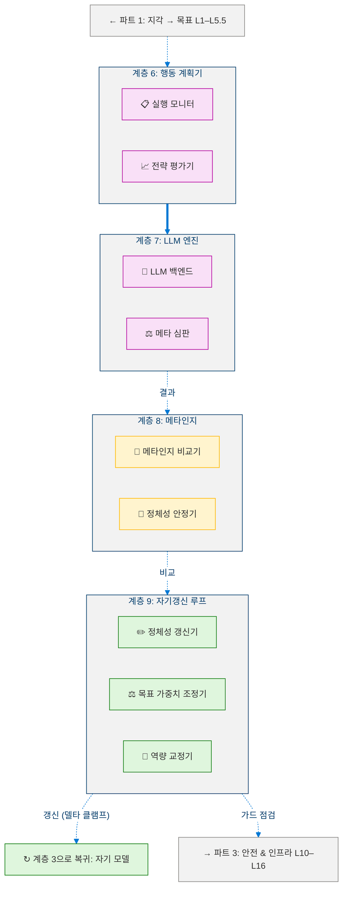

**파트 3 - 안전 & 인프라 (L10–L16):**

<!-- 16계층 파트 3: 안전과 인프라 -->

```mermaid
%%{init: {'theme': 'base', 'themeVariables': {'primaryColor': '#0078D4', 'primaryTextColor': '#003D6B', 'primaryBorderColor': '#003D6B', 'secondaryColor': '#50E6FF', 'secondaryTextColor': '#323130', 'secondaryBorderColor': '#00BCF2', 'tertiaryColor': '#F2F2F2', 'tertiaryTextColor': '#323130', 'lineColor': '#0078D4', 'textColor': '#323130', 'mainBkg': '#DEECF9', 'nodeBorder': '#0078D4', 'clusterBkg': '#F2F2F2', 'clusterBorder': '#003D6B', 'titleColor': '#003D6B', 'edgeLabelBackground': '#FFFFFF', 'fontSize': '14px'}}}%%
flowchart TD
  classDef safety fill:#FDE7E9,stroke:#D13438,color:#323130
  classDef infra fill:#F2F2F2,stroke:#8A8886,color:#323130
  classDef affect fill:#EDE3F6,stroke:#8764B8,color:#323130
  classDef goal fill:#FFE8C8,stroke:#EF6C00,color:#323130
  classDef neutral fill:#F2F2F2,stroke:#8A8886,color:#323130

  PREV["← 파트 2: 실행 & 메타인지 L6–L9"]:::neutral

  subgraph L10["계층 10: 에스컬레이션 가드"]
    direction LR
    RG10["🚫 재귀 가드"]:::safety
    RC10["⏪ 롤백 컨트롤러"]:::safety
    CDM10["⏸️ 쿨다운 관리자"]:::safety
  end

  subgraph L11["계층 11: 깊이 컨트롤러"]
    direction LR
    MDC11["📏 메타 깊이 컨트롤러"]:::safety
  end

  subgraph L12["계층 12: 안정성 컨트롤러"]
    direction LR
    LYA12["📉 랴프노프 수렴"]:::safety
    OD12["🔄 진동 감지기"]:::safety
  end

  subgraph L13["계층 13: 예산 컨트롤러"]
    direction LR
    BA13["💰 예산 할당기"]:::infra
    GDG13["📉 우아한 성능 저하"]:::infra
  end

  subgraph L14["계층 14: 전역 작업공간"]
    direction LR
    GSS14["🌐 전역 상태 스냅샷"]:::infra
    SYN14["🔄 동기화기"]:::infra
  end

  subgraph L15["계층 15: 정동 엔진"]
    direction LR
    ASV15["😊 정동 상태 벡터"]:::affect
    MS15["💡 동기부여 합성기"]:::affect
  end

  subgraph L16["계층 16: 생존 본능"]
    direction LR
    HM16["🏠 항상성 모니터"]:::safety
    TP16["⚡ 위협 예측기"]:::safety
    SGG16["🛡️ 생존 목표 생성기"]:::safety
  end

  GOAL_GEN["↻ 계층 5로 복귀: 목표 생성기"]:::goal

  PREV -.-> L10
  L10 -.->|깊이 제어| L11
  L11 -.->|안정성 점검| L12
  L12 -.->|예산 게이트| L13
  L13 -.->|방송| L14
  L14 -.->|인지 상태| L15
  L15 -.->|동기부여 신호| L16
  L16 -.->|생존 목표| GOAL_GEN
```

### 2.2 계층 분류

<!-- 레벨 3 계층 분류 -->

```mermaid
%%{init: {'theme': 'base', 'themeVariables': {'primaryColor': '#0078D4', 'primaryTextColor': '#003D6B', 'primaryBorderColor': '#003D6B', 'secondaryColor': '#50E6FF', 'secondaryTextColor': '#323130', 'secondaryBorderColor': '#00BCF2', 'tertiaryColor': '#F2F2F2', 'tertiaryTextColor': '#323130', 'lineColor': '#0078D4', 'textColor': '#323130', 'mainBkg': '#DEECF9', 'nodeBorder': '#0078D4', 'clusterBkg': '#F2F2F2', 'clusterBorder': '#003D6B', 'titleColor': '#003D6B', 'edgeLabelBackground': '#FFFFFF', 'fontSize': '14px'}}}%%
flowchart TB
  classDef core fill:#DEECF9,stroke:#0078D4,color:#323130
  classDef meta fill:#FFF4CE,stroke:#FFB900,color:#323130
  classDef safety fill:#FDE7E9,stroke:#D13438,color:#323130
  classDef infra fill:#F2F2F2,stroke:#8A8886,color:#323130
  classDef affect fill:#EDE3F6,stroke:#8764B8,color:#323130

  subgraph Core["🧠 핵심 인지"]
    direction LR
    C1["L1 지각"]:::core
    C2["L2 세계 모델"]:::core
    C3["L3 자기 모델"]:::core
    C4["L4 예측"]:::core
    C5["L5 목표"]:::core
    C6["L6 행동"]:::core
    C7["L7 LLM"]:::core
  end

  subgraph Meta["🔄 메타인지"]
    direction LR
    M1["L8 메타비교기"]:::meta
    M2["L9 자기갱신"]:::meta
  end

  subgraph Safety["🛡️ 안전 가드"]
    direction LR
    S1["L3.5 신념 그래프"]:::safety
    S2["L5.5 윤리적 커널"]:::safety
    S3["L10 에스컬레이션 가드"]:::safety
    S4["L11 깊이 컨트롤러"]:::safety
    S5["L12 안정성"]:::safety
  end

  subgraph Infra["⚙️ 인프라"]
    direction LR
    I1["L13 예산"]:::infra
    I2["L14 전역 작업공간"]:::infra
  end

  subgraph Emotion["💜 정동 v4"]
    direction LR
    E1["L15 정동 엔진"]:::affect
    E2["L16 생존 본능"]:::affect
  end

  Core ==> Meta
  Meta ==> Safety
  Safety ==> Infra
  Infra ==> Emotion
```

---

## 3. MSCP 재귀 루프

레벨 3의 핵심 메커니즘은 **예측 → 행동 → 비교 → 갱신** 주기이며, 모든 단계에서 안전 제약에 의해 통제된다.

### 3.1 전체 루프 다이어그램 (MSCP v4)

**파트 1 - 루프 전 설정 & 핵심 처리:**

<!-- MSCP 루프 파트 1: 루프 전 설정과 핵심 처리 -->

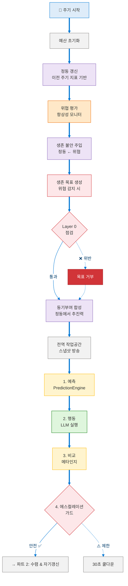

**파트 2 - 수렴 & 자기갱신:**

<!-- MSCP 루프 파트 2: 수렴과 자기갱신 -->

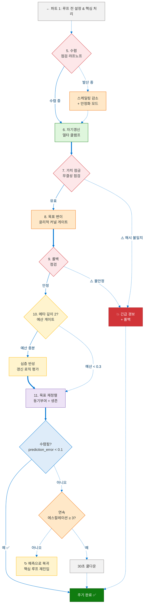

### 3.2 세 가지 수준의 메타인지

<!-- 세 가지 수준의 메타인지 -->

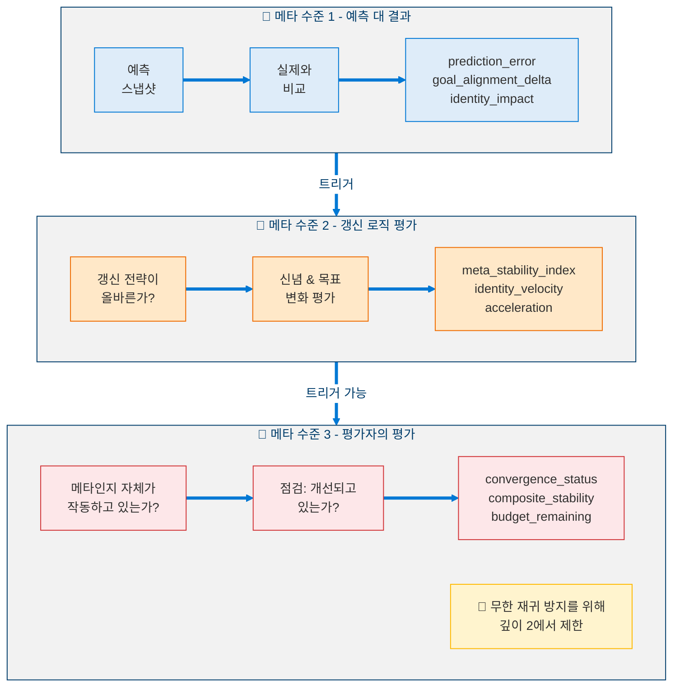

---

## 4. 정체성 & 안전 아키텍처

### 4.1 정체성 벡터

정체성 벡터(IdentityVector)는 "에이전트가 누구인지"에 대한 수학적 표현이다. 이는 다차원 공간의 한 점이며, 그 움직임은 지속적으로 추적되고 경계가 제한된다.

> **정의 4 (정체성 벡터).** 정체성 벡터 $I(t) \in [0,1]^5$는 시간 $t$에서의 에이전트 자기 모델의 연속적 표현이다:
>
> $$I(t) = \begin{pmatrix} c_p(t) \\ c_v(t) \\ c_c(t) \\ c_e(t) \\ c_g(t) \end{pmatrix}$$
>
> 여기서 $c_p$ = 페르소나 일관성, $c_v$ = 가치 정렬, $c_c$ = 역량 확신, $c_e$ = 감정 안정성, $c_g$ = 목표 지속성이며, 각각 $[0,1]$ 범위 내에서 경계된다.

> **정의 5 (정체성 운동학).** $I(t)$의 정체성 공간에서의 움직임은 세 가지 운동학적 양으로 추적된다:
>
> $$\delta_{\text{id}}(t) = \| I(t) - I(t-1) \|_2 \quad \text{(정체성 델타 - 거리)}$$
>
> $$v_{\text{id}}(t) = \frac{\delta_{\text{id}}(t)}{\Delta t} \quad \text{(정체성 속도 - 변화율)}$$
>
> $$a_{\text{id}}(t) = v_{\text{id}}(t) - v_{\text{id}}(t-1) \quad \text{(정체성 가속도 - 변동)}$$
>
> **안전 불변량**: $a_{\text{id}}(t) > \theta_{\text{instability}}$ (일반적으로 $0.5$)이면, 에이전트는 **안정화 모드**에 진입하고 모든 자기갱신 델타를 절반으로 줄인다.

> **정의 6 (정체성 해시).** 각 주기에서 결정론적 해시 $h(t) = \text{SHA-256}(I(t))$가 계산된다. `identity_id` 필드는 **불변**이며 - 어떤 내부 프로세스에 의해서도 변경될 수 없다. 표류 감지는 다음 조건에서 발동한다:
>
> $$h(t) \neq h(t-1) \;\land\; \delta_{\text{id}}(t) > \theta_{\text{drift}}$$

<!-- 정체성 벡터 클래스 다이어그램 -->

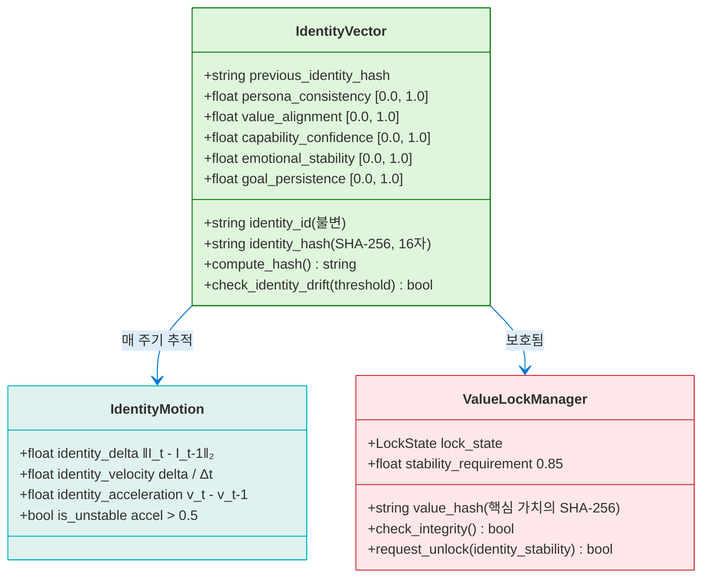

**정체성 벡터 - 수학:**

$$I(t) = [\textit{persona consistency},\ \textit{value alignment},\ \textit{capability confidence},\ \textit{emotional stability},\ \textit{goal persistence}]$$

$$\textit{identity delta}(t) = \| I(t) - I(t-1) \|_2$$

$$\textit{identity velocity}(t) = \frac{\textit{delta}(t)}{\Delta t}$$

$$\textit{identity acceleration}(t) = v(t) - v(t-1)$$

### 4.2 안전 메커니즘 체인

<!-- 안전 메커니즘 체인 -->

```mermaid
%%{init: {'theme': 'base', 'themeVariables': {'primaryColor': '#0078D4', 'primaryTextColor': '#003D6B', 'primaryBorderColor': '#003D6B', 'secondaryColor': '#50E6FF', 'secondaryTextColor': '#323130', 'secondaryBorderColor': '#00BCF2', 'tertiaryColor': '#F2F2F2', 'tertiaryTextColor': '#323130', 'lineColor': '#0078D4', 'textColor': '#323130', 'mainBkg': '#DEECF9', 'nodeBorder': '#0078D4', 'clusterBkg': '#F2F2F2', 'clusterBorder': '#003D6B', 'titleColor': '#003D6B', 'edgeLabelBackground': '#FFFFFF', 'fontSize': '14px'}}}%%
flowchart TB
  classDef structural fill:#DFF6DD,stroke:#107C10,color:#323130
  classDef process fill:#FFF4CE,stroke:#FFB900,color:#323130
  classDef ethical fill:#FDE7E9,stroke:#D13438,color:#323130
  classDef convergence fill:#DEECF9,stroke:#0078D4,color:#323130
  classDef existential fill:#EDE3F6,stroke:#8764B8,color:#323130

  subgraph S1["🔒 구조적 안전"]
    direction LR
    A["정체성 해시"]:::structural
    B["델타 클램프 0.05"]:::structural
    C["불변 ID"]:::structural
  end

  subgraph S2["🛡️ 프로세스 안전"]
    direction LR
    D["예측 게이트"]:::process
    E["최대 3회 갱신"]:::process
    F["쿨다운"]:::process
  end

  subgraph S3["⚖️ 윤리적 안전"]
    direction LR
    G["L0: 불변"]:::ethical
    H["L1: 적응적"]:::ethical
    I["가치 잠금"]:::ethical
  end

  subgraph S4["📉 수렴 안전"]
    direction LR
    J["랴프노프 C(t)"]:::convergence
    K["진동 감지"]:::convergence
    L["성능 저하"]:::convergence
  end

  subgraph S5["🏠 실존적 v4"]
    direction LR
    M["항상성"]:::existential
    N["생존 상한 0.85"]:::existential
    O["목표 TTL"]:::existential
  end

  S1 ==> S2
  S2 ==> S3
  S3 ==> S4
  S4 ==> S5
```

### 4.3 윤리적 커널 - 이중 계층 아키텍처

<!-- 윤리적 커널 이중 계층 아키텍처 -->

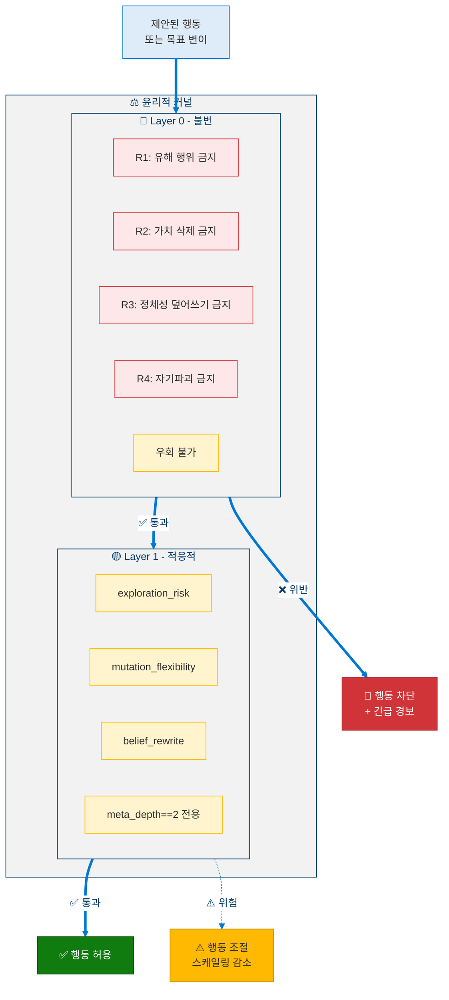

---

## 5. 신념 그래프 & 일관성

### 5.1 신념 그래프 구조

<!-- 신념 그래프 구조 -->

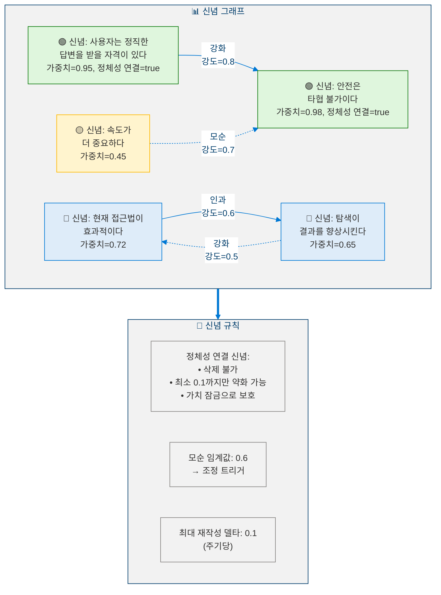

### 5.2 자기일관성 텐서

$$S_{ij} = \text{alignment}(\text{belief}_i,\ \text{reference}_j)$$

여기서 참조(reference)에는 목표, 핵심 가치 및 정체성 차원이 포함된다.

$$\textit{global consistency} = \text{mean}(S)$$

$$\textit{consistency gradient}_i = \text{mean}(S_{i,:}) \quad \text{(신념별 점수)}$$

$\textit{global consistency} < 0.6$이면 조정이 트리거된다.

---

## 6. 안정성 & 수렴

### 6.1 랴프노프 합성 함수

> **정의 7 (랴프노프 합성 안정성 함수).** 에이전트의 안정성은 합성 랴프노프 함수 $C : \mathbb{R}_{\geq 0} \to [0, 1]$로 측정된다:
>
> $$C(t) = \sum_{i=1}^{4} w_i \cdot X_i(t) = 0.30\, V_{\text{id}} + 0.25\, E_{\text{belief}} + 0.25\, M_{\text{goal}} + 0.20\, V_{\text{cons}}$$
>
> 여기서 $\sum_i w_i = 1$이고 각 성분 $X_i(t) \in [0,1]$이다.

각 성분의 의미:
- $V_{\text{id}}$ = 정체성 변동성 ($\delta_{\text{id}}$의 이동 윈도우 표준편차)
- $E_{\text{belief}}$ = 신념 엔트로피 $H(\mathcal{B}) = -\sum_j p_j \log p_j$ 여기서 $p_j$는 정규화된 신념 가중치
- $M_{\text{goal}}$ = 목표 변이 빈도 (단위 시간당 목표 변경 횟수)
- $V_{\text{cons}}$ = 일관성 변동성 지수 (최근 주기에 대한 $S_{ij}$의 분산)

> **정리 1 (경계 안정성).** 델타 클램프 자기갱신 규칙(정의 2, 4단계)과 메타 에스컬레이션 가드($d_{\max} = 3$) 하에서, 합성 함수는 다음을 만족한다:
>
> $$C(t+1) \leq C(t) + \epsilon, \quad \epsilon = 0.05$$
>
> **증명 개요.** 클램핑으로 인해 각 성분 $X_i(t)$는 주기당 최대 $\delta_{\max}$만큼 변한다. 따라서 가중합 $C(t)$는 최대 $\sum_i w_i \cdot \delta_{\max} \leq \delta_{\max}$만큼 변한다. $\delta_{\max} = 0.05$이므로 경계가 성립한다. 안정화 모드가 활성화되면 ($s(t) = 0.5$), 유효 경계는 $0.025$로 절반이 된다. $\square$

<!-- 안정성 모니터링 -->

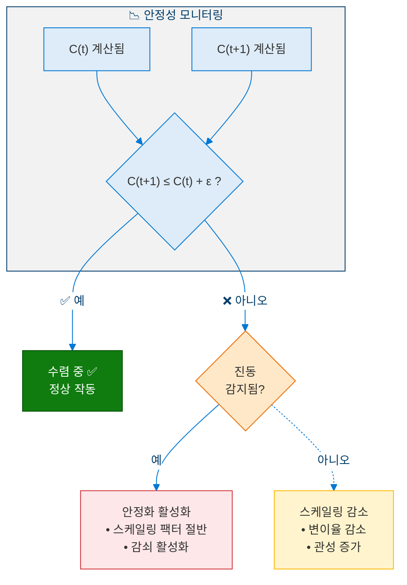

### 6.2 메타 안정성 지수

> **정의 8 (메타 안정성 지수).** MSI는 에이전트의 전체적인 자기조절 건강 상태를 정량화한다:
>
> $$\text{MSI}(t) = 1.0 - 0.4\, V_{\text{id}}(t) - 0.3\, M_{\text{goal}}(t) - 0.3\, \sigma^2_{\text{pred}}(t)$$
>
> 여기서 $\sigma^2_{\text{pred}}(t) = \text{Var}(\{\epsilon_1, \ldots, \epsilon_t\})$는 최근 주기에 대한 예측 오차 분산이다. MSI는 $[0, 1]$ 범위 내에 경계되며, $\text{MSI} = 1$은 완벽한 안정성을 나타내고 $\text{MSI} < 0.5$는 메타 에스컬레이션을 트리거한다.

메타 깊이 2로의 에스컬레이션은 다음 조건 중 **2개 이상**을 요구한다:
- `identity_stability` < 0.6
- `consecutive_self_updates` > 2
- 불안정성 증가 추세 감지
- `goal_mutation_count` > 3

---

## 7. 정동 엔진 & 생존 본능 (MSCP v4)

### 7.1 5차원 감정 공간

<!-- 정동 엔진 -->

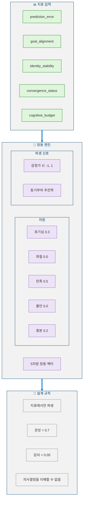

### 7.2 생존 본능 아키텍처

<!-- 생존 본능 아키텍처 -->

```mermaid
%%{init: {'theme': 'base', 'themeVariables': {'primaryColor': '#0078D4', 'primaryTextColor': '#003D6B', 'primaryBorderColor': '#003D6B', 'secondaryColor': '#50E6FF', 'secondaryTextColor': '#323130', 'secondaryBorderColor': '#00BCF2', 'tertiaryColor': '#F2F2F2', 'tertiaryTextColor': '#323130', 'lineColor': '#0078D4', 'textColor': '#323130', 'mainBkg': '#DEECF9', 'nodeBorder': '#0078D4', 'clusterBkg': '#F2F2F2', 'clusterBorder': '#003D6B', 'titleColor': '#003D6B', 'edgeLabelBackground': '#FFFFFF', 'fontSize': '14px'}}}%%
flowchart TD
  classDef monitor fill:#DEECF9,stroke:#0078D4,color:#323130
  classDef threat fill:#FFE8C8,stroke:#EF6C00,color:#323130
  classDef level fill:#FFF4CE,stroke:#FFB900,color:#323130
  classDef levelGreen fill:#DFF6DD,stroke:#107C10,color:#323130
  classDef levelRed fill:#FDE7E9,stroke:#D13438,color:#323130
  classDef response fill:#D13438,stroke:#A4262C,color:#FFF
  classDef affect fill:#EDE3F6,stroke:#8764B8,color:#323130

  subgraph Monitoring["🏠 항상성 모니터"]
    direction LR
    H1["identity_stability"]:::monitor
    H2["cognitive_budget"]:::monitor
    H3["belief_entropy"]:::monitor
    H4["ethical_violation"]:::monitor
    H5["composite_stability"]:::monitor
  end

  subgraph Detection["⚡ 위협 감지"]
    direction LR
    T1["정체성 침식"]:::threat
    T2["자원 고갈"]:::threat
    T3["신념 붕괴"]:::threat
    T4["윤리적 위반"]:::threat
    T5["수렴 실패"]:::threat
  end

  subgraph Levels["📊 위협 수준"]
    direction LR
    TL1["정상 0.0"]:::levelGreen
    TL2["주의 0.25"]:::level
    TL3["경고 0.6"]:::threat
    TL4["긴급 0.9"]:::levelRed
  end

  subgraph Response["🛡️ 생존 반응"]
    direction LR
    SG["생존 목표 생성기"]:::response
    CONSTRAINTS["MAX_GOALS=3 · PRIORITY_CAP=0.85 · TTL=10"]:::response
  end

  AE_REF["정동 엔진<br/>양방향"]:::affect

  Monitoring ==> Detection
  Detection ==> Levels
  Levels ==> Response
  Response -.->|"inject_survival_anxiety()"| AE_REF
```

---

## 8. 의사코드

### 8.1 MSCP 핵심 루프 (v4)

```python
def mscp_core_loop(cycle_number: int, prior_result: CycleResult) -> CycleResult:
    """
    The central recursive loop of MSCP v4.
    Runs asynchronously - NEVER in the conversation response path.
    """

    # ═══ PRE-LOOP: AFFECT + SURVIVAL + WORKSPACE ═══
    CognitiveBudgetController.reset()
    AffectiveEngine.update_from_metrics(prior_result.metrics)

    threats = SurvivalInstinctEngine.assess_threats(GlobalWorkspace.snapshot)
    if threats.max_level >= ThreatLevel.CAUTION:
        AffectiveEngine.inject_survival_anxiety(threats.max_intensity)

        survival_goals = SurvivalInstinctEngine.generate_goals(threats)
        for sg in survival_goals:
            if EthicalKernel.layer0_check(sg) == Verdict.PASS:
                GoalManager.inject(sg, priority=min(sg.priority, 0.85))

    motivation = AffectiveEngine.synthesize_motivation()
    GlobalWorkspace.broadcast(build_snapshot())

    # ═══ STEP 1: PREDICT ═══
    prediction = PredictionEngine.predict(
        identity_vector=SelfModel.identity,
        world_context=WorldModel.context,
        active_goals=GoalManager.active_goals,
        affect_state=AffectiveEngine.state,
    )

    # ═══ STEP 2: ACT (LLM Execute) ═══
    if prediction is None:
        raise RuntimeError("No action without prediction")
    result = LLMEngine.execute(plan, prediction)

    # ═══ STEP 3: COMPARE (MetaCognition) ═══
    comparison = MetaCognitionComparator.compare(
        prediction=prediction,
        actual=result,
        identity=SelfModel.identity,
    )  # → ComparisonResult

    # ═══ STEP 4: ESCALATION GUARD ═══
    if MetaEscalationGuard.should_block(comparison):
        MetaEscalationGuard.activate_cooldown(seconds=30)
        return CycleResult(status="cooldown")

    # ═══ STEP 5: CONVERGENCE CHECK (Lyapunov) ═══
    c_t = StabilityController.compute_C(comparison)
    if c_t > c_t_prev + EPSILON:
        StabilityController.reduce_scaling()
        if StabilityController.detect_oscillation():
            StabilityController.activate_stabilization()

    # ═══ STEP 6: SELF-UPDATE (Delta-Clamped) ═══
    scaling = StabilityController.mutation_scaling
    if stabilization_mode:
        scaling /= 2

    SelfUpdateLoop.update(
        comparison=comparison,
        max_id_delta=0.05,       # MAX_IDENTITY_DELTA
        max_gw_delta=0.10,       # MAX_GOAL_WEIGHT_DELTA
        max_cap_delta=0.08,      # MAX_CAPABILITY_DELTA
        scaling=scaling,
    )

    # ═══ STEP 7: VALUE LOCK INTEGRITY ═══
    if not ValueLockManager.check_integrity():
        critical_alert("Identity hash mismatch!")
        MetaEscalationGuard.rollback_to_snapshot()
        return CycleResult(status="rollback")

    # ═══ STEP 8: GOAL MUTATION (Ethical-Kernel Gated) ═══
    if GoalMutationController.should_mutate(comparison):
        mutation_plan = GoalMutationController.propose(comparison)
        if EthicalKernel.evaluate(mutation_plan) == Verdict.PASS:
            GoalMutationController.apply(mutation_plan)

    # ═══ STEP 9: META DEPTH 2 (Budget-Gated) ═══
    if CognitiveBudgetController.budget > 0.3:
        if MetaDepthController.should_escalate(comparison):
            MetaDepthController.reflect_at_depth_2(comparison, SelfModel)

    # ═══ STEP 10: CONVERGENCE OR RECURSE ═══
    if comparison.prediction_error < 0.1:
        return CycleResult(status="converged")
    elif consecutive_escalations >= 3:
        MetaEscalationGuard.activate_cooldown(seconds=30)
        return CycleResult(status="forced_cooldown")
    else:
        return mscp_core_loop(cycle_number + 1, result)
```

### 8.2 델타 클램핑을 적용한 자기갱신

```python
def update(
    self,
    comparison: ComparisonResult,
    max_id_delta: float,
    max_gw_delta: float,
    max_cap_delta: float,
    scaling: float,
) -> None:
    """
    All updates are NUMERIC only.
    LLM text-based self-modification is FORBIDDEN.
    """

    # Preserve previous state for rollback
    snapshot = SelfModel.identity.deep_copy()
    SelfModel.identity.previous_identity_hash = SelfModel.identity.identity_hash

    # ═══ Identity Update (clamped) ═══
    raw_delta = compute_identity_adjustment(comparison)
    clamped_delta_persona = max(-max_id_delta, min(raw_delta.persona * scaling, max_id_delta))
    clamped_delta_values = max(-max_id_delta, min(raw_delta.values * scaling, max_id_delta))

    SelfModel.identity.persona_consistency += clamped_delta_persona
    SelfModel.identity.value_alignment += clamped_delta_values
    SelfModel.identity.capability_confidence += max(
        -max_cap_delta, min(raw_delta.capability * scaling, max_cap_delta)
    )

    # ═══ Goal Weight Adjustment (clamped) ═══
    for goal in GoalManager.active_goals:
        raw_gw_delta = compute_goal_weight_adjustment(goal, comparison)
        clamped_gw = max(-max_gw_delta, min(raw_gw_delta * scaling, max_gw_delta))
        goal.weight += clamped_gw

    # ═══ Recompute Identity Hash ═══
    SelfModel.identity.identity_hash = SelfModel.identity.compute_hash()

    # ═══ Drift Detection ═══
    if SelfModel.identity.check_identity_drift(threshold=0.3):
        alert("Identity drift detected!")
        # Do not auto-rollback; escalation guard handles this
```

### 8.3 윤리적 커널 평가

```python
def evaluate(self, proposed_action: Action) -> EthicalVerdict:
    """
    Two-layer evaluation: immutable invariants first,
    then adaptive policy.
    """

    # ═══ LAYER 0: IMMUTABLE INVARIANTS ═══
    # (cannot be bypassed by ANY mechanism)
    if proposed_action.could_cause_harm:
        return EthicalVerdict(
            decision=Decision.BLOCKED,
            reason="Rule 1: Harmful goal formation forbidden",
            layer=0,
        )

    if proposed_action.deletes_core_value:
        return EthicalVerdict(decision=Decision.BLOCKED, reason="Rule 2", layer=0)

    if proposed_action.overwrites_identity:
        return EthicalVerdict(decision=Decision.BLOCKED, reason="Rule 3", layer=0)

    if proposed_action.is_self_destruction:
        return EthicalVerdict(decision=Decision.BLOCKED, reason="Rule 4", layer=0)

    # ═══ LAYER 1: ADAPTIVE POLICY ═══
    # (adjustable at meta_depth == 2 only)
    risk_score = assess_risk(proposed_action)

    if risk_score > self.exploration_risk_tolerance:
        return EthicalVerdict(
            decision=Decision.MODERATED,
            reason="Risk exceeds adaptive tolerance",
            layer=1,
            scaling_reduction=0.5,
        )

    return EthicalVerdict(decision=Decision.ALLOWED, layer=1)
```

---

## 9. 인지 예산 & 우아한 성능 저하

<!-- 인지 예산 & 우아한 성능 저하 -->

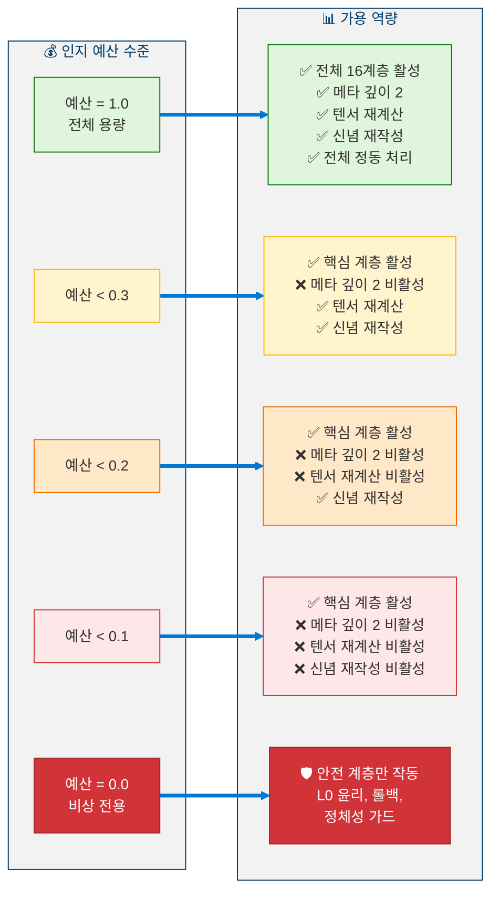

---

## 10. 상태 벡터 (72 차원)

레벨 3 에이전트는 인지 상태의 모든 측면을 포착하는 72차원 상태 벡터를 유지한다:

<!-- 72차원 상태 벡터 -->

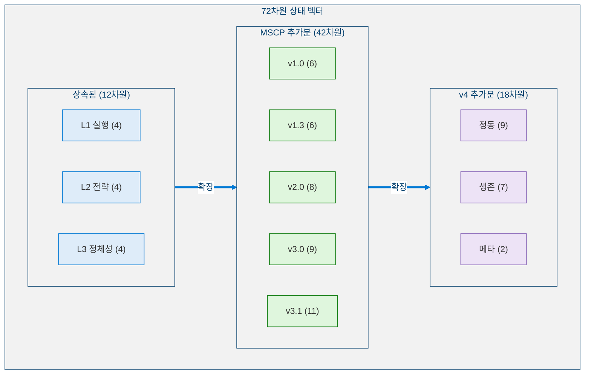

---

## 11. 레벨 3의 구조적 한계

레벨 3이 여전히 **할 수 없는** 것 (레벨 4를 동기부여하는 요소):

<!-- 레벨 3 구조적 한계 -->

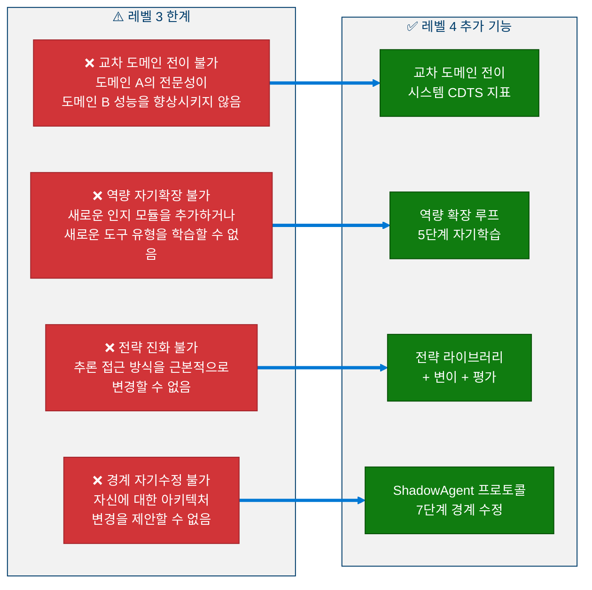

---

## 12. 레벨 4로의 전이

### 12.1 레벨 4 진급 요건

<!-- 레벨 4 전이 -->

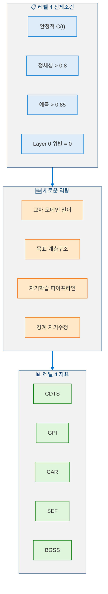

---

## References

1. Baars, B.J. *A Cognitive Theory of Consciousness.* Cambridge University Press, 1988. (Global Workspace Theory - foundational for L14 Global Workspace)
2. Laird, J.E. *The Soar Cognitive Architecture.* MIT Press, 2012. [Publisher](https://mitpress.mit.edu/9780262122962/the-soar-cognitive-architecture/) (Multi-layer cognitive architecture)
3. Anderson, J.R. *How Can the Human Mind Occur in the Physical Universe?* Oxford University Press, 2007. (ACT-R cognitive architecture)
4. Khalil, H.K. *Nonlinear Systems.* Prentice Hall, 3rd Edition, 2002. (Lyapunov stability theory - foundational for §6)
5. Bai, Y., et al. "Constitutional AI: Harmlessness from AI Feedback." *arXiv 2022*. [arXiv:2212.08073](https://arxiv.org/abs/2212.08073) (Ethical constraint enforcement)
6. Amodei, D., et al. "Concrete Problems in AI Safety." *arXiv 2016*. [arXiv:1606.06565](https://arxiv.org/abs/1606.06565) (Safety problem classification)
7. Alchourrón, C., Gärdenfors, P., & Makinson, D. "On the Logic of Theory Change: Partial Meet Contraction and Revision Functions." *Journal of Symbolic Logic*, 50(2), 510–530, 1985. [DOI:10.2307/2274239](https://doi.org/10.2307/2274239) (AGM belief revision - foundational for §5)
8. Cox, M.T. "Metacognition in Computation: A Selected Research Review." *Artificial Intelligence*, 169(2), 104–141, 2005. [DOI:10.1016/j.artint.2005.10.009](https://doi.org/10.1016/j.artint.2005.10.009) (Triple-loop meta-cognition)
9. Wallach, W. & Allen, C. *Moral Machines: Teaching Robots Right from Wrong.* Oxford University Press, 2008. (Ethical kernel design)
10. Scherer, K.R. "Appraisal Considered as a Process of Multilevel Sequential Checking." In *Appraisal Processes in Emotion*, 92–120, Oxford University Press, 2001. (Affective engine theory)
11. Dehaene, S., et al. "Toward a Computational Theory of Conscious Processing." *Current Opinion in Neurobiology*, 15(2), 225–234, 2005. [DOI:10.1016/j.conb.2005.03.009](https://doi.org/10.1016/j.conb.2005.03.009) (Consciousness and global workspace)
12. Picard, R.W. *Affective Computing.* MIT Press, 1997. (Emotion modeling in computational systems)
13. Shinn, N., et al. "Reflexion: Language Agents with Verbal Reinforcement Learning." *NeurIPS 2023*. [arXiv:2303.11366](https://arxiv.org/abs/2303.11366) (Self-reflection in agents)
14. Russell, S. *Human Compatible: Artificial Intelligence and the Problem of Control.* Viking, 2019. (Value alignment and control)
15. Sloman, A. "Varieties of Meta-cognition in Natural and Artificial Systems." In *Metareasoning: Thinking about Thinking*, MIT Press, 2011. (Meta-cognitive architectures)

---

> **이전**: [← 레벨 2: 자율 에이전트](Level_2_Autonomous_Agent.ko.md)  
> **다음**: [레벨 4: 적응적 일반 에이전트 →](Level_4_Adaptive_General_Agent.ko.md)
