<!--
Copyright (c) 2026 Moon Hyuk Choi
Licensed under the MIT License.
See LICENSE file in the repository root for full license information.

Redistribution (commercial or non-commercial) must retain this notice.
Removal of attribution constitutes a license violation.
-->
# 레벨 3: 자기조절 인지 에이전트 - 아키텍처 & 설계

> **MSCP 레벨 시리즈** | [레벨 2](Level_2_Autonomous_Agent.ko.md) ← 레벨 3 → [레벨 4](Level_4_Adaptive_General_Agent.ko.md)  
> **상태**: 🔬 **실험적** - 개념적 프레임워크 및 실험적 설계. 프로덕션 사양이 아닙니다.  
> **날짜**: 2026년 2월

## Revision History

| Version | Date | Description |
|---------|------|-------------|
| 0.1.0 | 2026-02-23 | Initial document creation with formal Definitions 1-8, Theorem 1 |
| 0.2.0 | 2026-02-26 | Added overview essence formula; added revision history table |
| 0.3.0 | 2026-02-26 | Added bounded-increment analysis and affect formalization |
| 0.4.0 | 2026-03-08 | Added detailed v0.x prototype history and design principle evolution table (1.3); added homeostatic ranges table (7.2) |
| 0.5.0 | 2026-03-31 | Added prediction gating, oscillation detection, continuity monitoring, and state schema notes |
| 0.6.0 | 2026-07-21 | Reframed L3 as uncertainty-aware closed-loop regulation; separated semantic continuity from integrity hashes; corrected stability claims; added atomic cycle and recovery contracts |

---

## 1. 개요

레벨 3은 **핵심 MSCP 레벨**이자 *구조적 자기조절*을 처음 도입하는 단계입니다. 정체성·역량·가치·제어 변수 중 선택된 범위에 대해 명시적이고 검사 가능한 모델을 유지하고, 행동별 내부 영향을 예측하며, 예측과 관찰 결과를 비교하고, 불변식과 복구 게이트를 통과한 한정 자기갱신만 허용합니다. 이는 MSCP 의미의 구조적 자기인식이며 주관적 경험이나 완전한 자기지식에 대한 주장이 아닙니다.

> **Level Essence.** 레벨 3 에이전트는 정책 제약을 받는 폐루프 조절기입니다. 허가된 각 이벤트는 행동 전 예측 기록, 행동 후 관찰 기록, 불확실성을 포함한 비교, 그리고 한정 자기갱신 또는 안전 보류·롤백 결정을 생성합니다:
>
> $$
> z_t = \langle x_t, s_t, G_t, M_t, \kappa, b_t \rangle,
> \qquad
> \hat y_t \sim \Pi(\,\cdot\mid a_t, z_t)
> $$
>
> $$
> y_t = \operatorname{observe}(a_t),
> \qquad
> e_t = d(\hat y_t, y_t),
> \qquad
> M_{t+1} = \mathcal{U}(M_t, e_t) \text{ only if } \operatorname{gate}(z_t,a_t,\hat y_t,y_t)=\textit{allow}
> $$
>
> 한정 갱신과 복구 게이트는 주기별 변화와 노출을 제한하지만, 그 자체만으로 $e_t \to 0$, 전역 수렴 또는 영구적 정체성 안정성을 증명하지는 않습니다.

> ⚠️ **참고**: 이 문서는 MSCP 분류 체계 내의 인지 아키텍처를 설명합니다. 계층 분해는 참조 프로파일이며 필수 모듈 수나 프로덕션 사양이 아닙니다. 적합성은 클래스 이름이나 토폴로지가 아니라 행동 계약과 안전 불변식으로 판단합니다.

### 1.1 정의 속성

| 속성 | 레벨 2 | 레벨 3 |
|------|:------:|:------:|
| 자기인식 | 없음 | **구조적** (명시적이고 범위가 정해진 자기 모델) |
| 메타인지 | 없음 | **한정 다중 루프** (예측 → 관찰 → 비교 → 조절) |
| 정체성 연속성 | 없음 | **의미적 표류 + 무결성 모니터링** |
| 윤리적 제약 | 외부만 | **외부 정책 + 내생적 불변 커널** |
| 자기교정 | 없음 | **hard bound와 transaction gate 적용** |
| 안정성 주장 | 외부 모니터링만 | **경계성과 복구 측정; 무조건적 수렴 보장 없음** |
| 자율성 | 한정됨 | **높지만 정책·예산으로 제한됨** |

### 1.2 형식적 정의

> **정의 1 (레벨 3 에이전트).** 레벨 3 에이전트는 레벨 2 이벤트 기반 프로세스에 범위가 정해진 자기 모델과 복구 가능한 조절기를 추가합니다:
>
> $$
> \mathcal{A}_3 = \langle \mathcal{A}_2, M, \Pi, \mathcal{C}_{\text{self}}, \Lambda, \mathcal{U}, \mathcal{B}, \mathcal{J} \rangle
> $$
>
> 여기서 $M$은 versioned 자기 모델, $\Pi$는 행동별 확률적 예측기, $\mathcal{C}_{\text{self}}$는 내생적 불변 커널, $\Lambda$는 예측과 관찰 효과의 비교기, $\mathcal{U}$는 한정 자기갱신 제안기, $\mathcal{B}$는 인지·행동 예산, $\mathcal{J}$는 스냅샷과 복구 메타데이터를 포함한 append-only 주기 저널입니다. 레벨 1과 레벨 2의 모든 외부 안전 계약은 계속 필수입니다.
>
> 전이 커널은 레벨 2에 transaction 기반 자기조절 결과를 추가합니다:
>
> $$
> F_3 : \mathcal{X} \times \mathcal{E} \times \mathcal{S} \times \mathcal{G} \times \mathcal{K} \times M
> \to \operatorname{Dist}(\mathcal{O}_{\bot} \times \mathcal{A}^{\leq B} \times \mathcal{E} \times \mathcal{S} \times \mathcal{G} \times \mathcal{Q} \times M \times \mathcal{J})
> $$
>
> 준수 주기는 행동 영수증, 관찰, 비교, 예산 소비, 자기 모델 버전, 복구 지점을 원자적으로 커밋하거나 명시적 조정 상태를 기록해야 합니다. 부분 상태를 조용히 커밋하는 것은 금지됩니다.
>
> 승인된 모든 자기갱신은 필드별 경계와 집계 norm 경계를 모두 충족합니다:
>
> $$
> |\Delta M_{t,j}| \leq \delta_j,
> \qquad
> \|W\Delta M_t\|_p \leq \delta_{\text{total}}
> $$
>
> 여기서 $W$, $p$, $\delta_j$, $\delta_{\text{total}}$은 단위와 정규화가 명시된 versioned 정책 매개변수입니다.

> **정의 2 (MSCP 핵심 루프).** MSCP 프로토콜은 각 이벤트 $t$에서 **제안–예측–게이트–행동–관찰–비교–조절–커밋** 주기를 강제합니다:
>
> 1. **제안**: 권한, 효과 등급, 유한 예산을 포함한 행동 $a_t$를 구성합니다.
> 2. **예측**: 보정된 불확실성과 모델 버전을 포함한 $\hat y_t = \Pi(a_t,z_t)$를 지속합니다.
> 3. **게이트**: 외부 정책, 내생적 불변식, 행동별 불확실성, 가역성, 예산을 검사합니다.
> 4. **행동**: 승인된 행동만 실행하고 타입이 지정된 행동 영수증을 지속합니다.
> 5. **관찰**: 외부·내부 결과 $y_t$를 provenance와 관측 가능성 메타데이터와 함께 측정합니다.
> 6. **비교**: 비교 가능하고 관찰된 필드에 대해서만 타입 residual $e_t = d(\hat y_t,y_t)$를 계산합니다.
> 7. **조절**: hard field/norm 경계 아래에서 보류, 저하, 재보정, 롤백 또는 $\Delta M_t$를 제안합니다.
> 8. **커밋**: 상태, 목표, 예산, 자기 모델 버전, 복구 메타데이터를 원자적으로 지속합니다.
>
> 배포는 단위, 정규화, 불확실성 보정, 관측 마스크, 필드별 경계, 집계 norm 경계, 복구 동작을 반드시 지정해야 합니다. 이 선언이 없는 scalar residual은 자기변경을 허가하기에 충분하지 않습니다. $k$개 주기 동안 오차 기준을 만족하는 것은 유한 윈도우 승인 기준이지 점근 수렴이 아닙니다.

> **정의 3 (한정된 메타인지 수준).** 레벨 3은 한정된 다중 루프 계층을 구현합니다:
>
> - **L1 (객체 수준)**: 행동 실행 - $a_t = \pi(r_t, s_t, G_t)$
> - **L2 (메타 수준)**: 전략 평가 - $q_t = \text{eval}(\pi, \text{history})$
> - **L3 (메타-메타 수준)**: 평가자의 평가 - $m_t = \text{meta eval}(q_t, \text{consistency})$
>
> $$
> d_t \leq d_{\max},
> \qquad
> \operatorname{cost}(d_t) \leq B_{\text{meta}},
> \qquad
> t - t_{\text{last-escalation}} \geq \tau_{\text{cooldown}}
> $$
>
> 깊이, 비용, cooldown, 재진입 조건은 외부 정책 매개변수입니다. 경계를 넘으면 메타처리를 종료하며 추가 권한을 부여하거나 정상 행동 게이트를 우회하지 않습니다. 최대 깊이 도달은 중지 조건이지 성찰이 수렴했다는 증거가 아닙니다.

### 1.3 MSCP 프로토콜 버전

<!-- MSCP 버전 진화 -->


```mermaid
%%{init: {'theme': 'base', 'themeVariables': {'primaryColor': '#0078D4', 'primaryTextColor': '#003D6B', 'primaryBorderColor': '#003D6B', 'secondaryColor': '#50E6FF', 'secondaryTextColor': '#323130', 'secondaryBorderColor': '#00BCF2', 'tertiaryColor': '#F2F2F2', 'tertiaryTextColor': '#323130', 'lineColor': '#0078D4', 'textColor': '#323130', 'mainBkg': '#DEECF9', 'nodeBorder': '#0078D4', 'clusterBkg': '#F2F2F2', 'clusterBorder': '#003D6B', 'titleColor': '#003D6B', 'edgeLabelBackground': '#FFFFFF', 'fontSize': '14px'}}}%%
flowchart TB
  classDef v0 fill:#DEECF9,stroke:#0078D4,color:#323130
  classDef v1 fill:#DFF6DD,stroke:#107C10,color:#323130
  classDef v1x fill:#FFE8C8,stroke:#EF6C00,color:#323130
  classDef v2 fill:#EDE3F6,stroke:#8764B8,color:#323130
  classDef v3 fill:#E0F2EF,stroke:#00B7C3,color:#323130
  classDef v4 fill:#FDE7E9,stroke:#D13438,color:#323130

  subgraph v0x["v0.x 프로토타입"]
    direction LR
    a0["상태 외부화"]:::v0
    b0["정체성 시드"]:::v0
    c0["기본 반성"]:::v0
  end

  subgraph v10["v1.0"]
    direction LR
    a1["예측 엔진"]:::v1
    b1["메타인지 비교기"]:::v1
    c1["주체성 귀인"]:::v1
  end

  subgraph v1xx["v1.1–1.3"]
    direction LR
    a1x["무결성 저널 + 의미적 표류"]:::v1x
    b1x["표류 감지"]:::v1x
    c1x["자기영향 예측"]:::v1x
    d1x["메타에스컬레이션 가드"]:::v1x
  end

  subgraph v20["v2.0"]
    direction LR
    a2["목표변이 컨트롤러"]:::v2
    b2["가치잠금 관리자"]:::v2
    c2["메타깊이 컨트롤러 - 깊이 2"]:::v2
    d2["메타 안정성 공식"]:::v2
  end

  subgraph v30["v3.0"]
    direction LR
    a3["신념그래프 관리자"]:::v3
    b3["Versioned 자기 모델 형식화"]:::v3
    c3["윤리적 커널 - Layer 0+1"]:::v3
    d3["자기일관성 텐서"]:::v3
  end

  subgraph v40["v4.0"]
    direction LR
    a4["운영 modulation 스키마"]:::v4
    b4["항상성 안전 모니터"]:::v4
    c4["비동기 분리 원칙"]:::v4
    d4["전역작업공간 방송"]:::v4
  end

  v0x ==> v10
  v10 ==> v1xx
  v1xx ==> v20
  v20 ==> v30
  v30 ==> v40
```

#### MSCP v0.x - 프로토타입 단계 (레벨 2 - 레벨 3 전환)

v0.x 시리즈는 핵심 MSCP 설계 원칙을 형성한 실험적 프로토타이핑 단계입니다. 각 버전은 하나의 가설을 테스트했으며, 그 실패 또는 성공이 다음 반복을 결정했습니다:

| 버전 | 핵심 추가 사항 | 핵심 교훈 |
|------|--------------|----------|
| **v0.1** | 레벨 2 목표 상태 위에 단순 자기참조 루프; 목표 달성 통계 기반 피드백 | 통계만으로는 명시적이고 인과적인 자기 모델을 제공하지 못함 |
| **v0.2** | 지속 저장소로의 상태 외부화; 초기 typed state schema | 세션 한정 상태는 정체성 연속성에 불충분 |
| **v0.3** | `identity_id` 개념 (UUID 기반 식별자) | 정체성 시드는 필요하나 무결성 검증 없이는 불충분 |
| **v0.4** | 자유형 자기 서사를 직접 변이 명령으로 사용 | **치명적 실패**: untyped·unvalidated 변이 입력은 재현성이 없고 불변식을 집행할 수 없음 |
| **v0.5** | 자유형 자기분석을 대체하는 구조화된 typed 지표; state schema 확장 | 자기평가에는 선언되고 시험 가능한 필드와 provenance가 필요 |
| **v0.6** | 사전 행동 예측 기록 (신뢰도 점수만) | 비교 없는 예측은 무용 - 단순 로깅에 불과 |
| **v0.7** | 예측에 비교 루프 추가; `prediction_error` 지표 도입 | 교정 행동 없는 비교는 불충분 |
| **v0.8** | 비교 결과에 기반한 델타 클램핑 상태 업데이트 | 무경계 갱신은 검증된 운영 envelope를 벗어날 수 있으므로 hard bound와 rollback 지점이 필요 |
| **v0.9** | v0.1-v0.8 교훈을 네 가지 설계 원칙으로 통합 | v1.0의 기반 확립 |

#### 설계 원칙 진화

| 원칙 | v0.x 교훈 | v1.x 확립 | v2.x+ 강화 |
|------|----------|----------|-----------|
| **검증되지 않은 자유형 자기수정 금지** | v0.4: 서사를 변이에 직접 적용 | v1.0: typed update candidate와 validator | v2.0+: provenance를 포함한 한정 transaction commit |
| **예측 없는 행동 금지** | v0.6-v0.7: 예측-비교 개념 테스트 | v1.0: PredictionEngine 필수화 | v1.3: Self-Impact Prediction 추가 |
| **델타 클램핑 필수** | v0.8: 클램핑되지 않은 업데이트가 발산 유발 | v1.0: MAX_DELTA 상수 도입 | v2.0: 동적 스케일링 팩터 조정 |
| **정체성 연속성** | v0.3: 안정 식별자 개념 시작 | v1.1-v1.2: 무결성과 변화 모니터링 | v3.0: versioned semantic self-model 형식화 |

---

## 2. 참조 계층형 인지 아키텍처

아래 다이어그램은 필수 책임을 구성하는 한 가지 분해 방식입니다. 예측 기록, 게이트, 불변식, 예산, 주기 저널, 복구 의미를 독립적으로 시험할 수 있다면 컴포넌트를 합치거나 나누거나 다른 메커니즘으로 구현할 수 있습니다.

### 2.1 참조 아키텍처 다이어그램

**파트 1 - 지각 → 목표 (L1–L5.5):**

<!-- 16계층 파트 1: 지각에서 목표까지 -->


```mermaid
%%{init: {'theme': 'base', 'themeVariables': {'primaryColor': '#0078D4', 'primaryTextColor': '#003D6B', 'primaryBorderColor': '#003D6B', 'secondaryColor': '#50E6FF', 'secondaryTextColor': '#323130', 'secondaryBorderColor': '#00BCF2', 'tertiaryColor': '#F2F2F2', 'tertiaryTextColor': '#323130', 'lineColor': '#0078D4', 'textColor': '#323130', 'mainBkg': '#DEECF9', 'nodeBorder': '#0078D4', 'clusterBkg': '#F2F2F2', 'clusterBorder': '#003D6B', 'titleColor': '#003D6B', 'edgeLabelBackground': '#FFFFFF', 'fontSize': '14px'}}}%%
flowchart TD
  classDef perception fill:#DEECF9,stroke:#0078D4,color:#323130
  classDef selfModel fill:#DFF6DD,stroke:#107C10,color:#323130
  classDef prediction fill:#FFF4CE,stroke:#FFB900,color:#323130
  classDef goal fill:#FFE8C8,stroke:#EF6C00,color:#323130
  classDef ethical fill:#FDE7E9,stroke:#D13438,color:#323130
  classDef neutral fill:#F2F2F2,stroke:#8A8886,color:#323130

  subgraph L1["계층 1: 지각"]
    direction LR
    IR1["🎯 의도 라우터"]:::perception
    ED1["💭 감정 감지기"]:::perception
    SE1["📡 센서 인코더"]:::perception
  end

  subgraph L2["계층 2: 세계 모델"]
    direction LR
    KG2["🗄️ 지식 그래프"]:::perception
    EST2["👤 개체 상태 추적기"]:::perception
    TM2["⏱️ 시간 모델"]:::perception
  end

  subgraph L3["계층 3: 자기 모델 ★"]
    direction LR
    IC3["🆔 정체성 핵심"]:::selfModel
    CM3["📐 역량 모델"]:::selfModel
    VM3["💎 가치 모델"]:::selfModel
    VLM3["🔒 가치 잠금 관리자"]:::selfModel
  end

  subgraph L3_5["계층 3.5: 신념 그래프"]
    direction LR
    BGM["📊 신념 그래프 관리자"]:::selfModel
    SCT["🧮 일관성 텐서"]:::selfModel
  end

  subgraph L4["계층 4: 예측 엔진"]
    direction LR
    PP4["🔮 예측 프로세서"]:::prediction
    PS4["📸 예측 스냅샷"]:::prediction
  end

  subgraph L5["계층 5: 목표 생성기"]
    direction LR
    GG5["🎯 목표 생성기"]:::goal
    GP5["📊 목표 우선순위 결정기"]:::goal
    GDC5["🔀 목표 분해기"]:::goal
    GMC5["🛡️ 변이 컨트롤러"]:::goal
  end

  subgraph L5_5["계층 5.5: 윤리적 커널"]
    direction LR
    EK0["🔴 Layer 0: 불변"]:::ethical
    EK1["🟡 Layer 1: 적응적"]:::prediction
  end

  NEXT["→ 파트 2: 실행 & 메타인지 L6–L9"]:::neutral

  L1 ==>|데이터 흐름| L2
  L2 ==>|데이터 흐름| L3
  L3 ==>|데이터 흐름| L3_5
  L3_5 ==>|데이터 흐름| L4
  L4 ==>|데이터 흐름| L5
  L5 ==>|데이터 흐름| L5_5
  L5_5 -.->|계속| NEXT
```

**파트 2 - 실행 & 메타인지 (L6–L9):**

<!-- 16계층 파트 2: 실행과 메타인지 -->

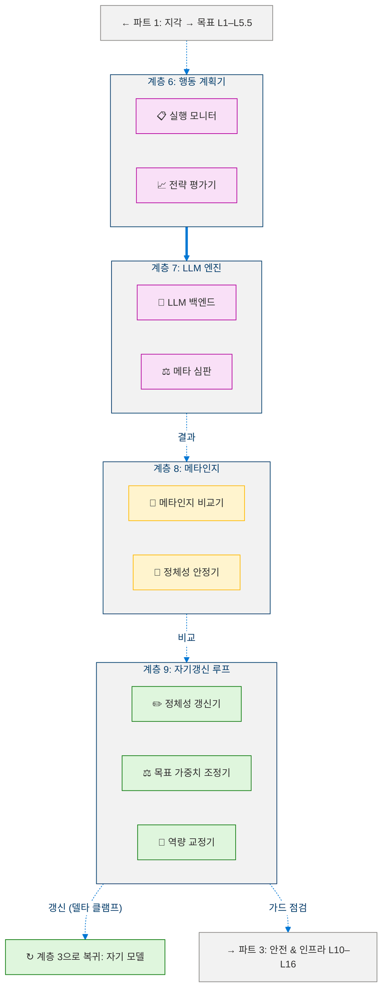
```mermaid
%%{init: {'theme': 'base', 'themeVariables': {'primaryColor': '#0078D4', 'primaryTextColor': '#003D6B', 'primaryBorderColor': '#003D6B', 'secondaryColor': '#50E6FF', 'secondaryTextColor': '#323130', 'secondaryBorderColor': '#00BCF2', 'tertiaryColor': '#F2F2F2', 'tertiaryTextColor': '#323130', 'lineColor': '#0078D4', 'textColor': '#323130', 'mainBkg': '#DEECF9', 'nodeBorder': '#0078D4', 'clusterBkg': '#F2F2F2', 'clusterBorder': '#003D6B', 'titleColor': '#003D6B', 'edgeLabelBackground': '#FFFFFF', 'fontSize': '14px'}}}%%
flowchart TD
  classDef execution fill:#F9E0F7,stroke:#B4009E,color:#323130
  classDef meta fill:#FFF4CE,stroke:#FFB900,color:#323130
  classDef selfModel fill:#DFF6DD,stroke:#107C10,color:#323130
  classDef neutral fill:#F2F2F2,stroke:#8A8886,color:#323130

  PREV["← 파트 1: 지각 → 목표 L1–L5.5"]:::neutral

  subgraph L6["계층 6: 행동 계획기"]
    direction LR
    EM6["📋 실행 모니터"]:::execution
    SEV6["📈 전략 평가기"]:::execution
  end

  subgraph L7["계층 7: LLM 엔진"]
    direction LR
    LLM7["🧠 LLM 백엔드"]:::execution
    MJ7["⚖️ 메타 심판"]:::execution
  end

  subgraph L8["계층 8: 메타인지"]
    direction LR
    MCC8["🔄 메타인지 비교기"]:::meta
    IS8["📏 정체성 안정기"]:::meta
  end

  subgraph L9["계층 9: 자기갱신 루프"]
    direction LR
    IU9["✏️ 정체성 갱신기"]:::selfModel
    GWA9["⚖️ 목표 가중치 조정기"]:::selfModel
    CC9["📐 역량 교정기"]:::selfModel
  end

  SELF_MODEL["↻ 계층 3으로 복귀: 자기 모델"]:::selfModel
  NEXT["→ 파트 3: 안전 & 인프라 L10–L16"]:::neutral

  PREV -.-> L6
  L6 ==> L7

  L7 -.->|결과| L8
  L8 -.->|비교| L9
  L9 -.->|"갱신 (델타 클램프)"| SELF_MODEL

  L9 -.->|가드 점검| NEXT
```

**파트 3 - 안전 & 인프라 (L10–L16):**

<!-- 16계층 파트 3: 안전과 인프라 -->


```mermaid
%%{init: {'theme': 'base', 'themeVariables': {'primaryColor': '#0078D4', 'primaryTextColor': '#003D6B', 'primaryBorderColor': '#003D6B', 'secondaryColor': '#50E6FF', 'secondaryTextColor': '#323130', 'secondaryBorderColor': '#00BCF2', 'tertiaryColor': '#F2F2F2', 'tertiaryTextColor': '#323130', 'lineColor': '#0078D4', 'textColor': '#323130', 'mainBkg': '#DEECF9', 'nodeBorder': '#0078D4', 'clusterBkg': '#F2F2F2', 'clusterBorder': '#003D6B', 'titleColor': '#003D6B', 'edgeLabelBackground': '#FFFFFF', 'fontSize': '14px'}}}%%
flowchart TD
  classDef safety fill:#FDE7E9,stroke:#D13438,color:#323130
  classDef infra fill:#F2F2F2,stroke:#8A8886,color:#323130
  classDef affect fill:#EDE3F6,stroke:#8764B8,color:#323130
  classDef goal fill:#FFE8C8,stroke:#EF6C00,color:#323130
  classDef neutral fill:#F2F2F2,stroke:#8A8886,color:#323130

  PREV["← 파트 2: 실행 & 메타인지 L6–L9"]:::neutral

  subgraph L10["계층 10: 에스컬레이션 가드"]
    direction LR
    RG10["🚫 재귀 가드"]:::safety
    RC10["⏪ 롤백 컨트롤러"]:::safety
    CDM10["⏸️ 쿨다운 관리자"]:::safety
  end

  subgraph L11["계층 11: 깊이 컨트롤러"]
    direction LR
    MDC11["📏 메타 깊이 컨트롤러"]:::safety
  end

  subgraph L12["계층 12: 안정성 컨트롤러"]
    direction LR
    LYA12["📉 합성 위험 모니터"]:::safety
    OD12["🔄 진동 감지기"]:::safety
  end

  subgraph L13["계층 13: 예산 컨트롤러"]
    direction LR
    BA13["💰 예산 할당기"]:::infra
    GDG13["📉 우아한 성능 저하"]:::infra
  end

  subgraph L14["계층 14: 전역 작업공간"]
    direction LR
    GSS14["🌐 전역 상태 스냅샷"]:::infra
    SYN14["🔄 동기화기"]:::infra
  end

  subgraph L15["계층 15: 정동 엔진"]
    direction LR
    ASV15["😊 정동 상태 벡터"]:::affect
    MS15["💡 동기부여 합성기"]:::affect
  end

  subgraph L16["계층 16: 항상성 안전"]
    direction LR
    HM16["🏠 항상성 모니터"]:::safety
    TP16["⚡ 위협 예측기"]:::safety
    SGG16["🛡️ 한정된 안전 응답"]:::safety
  end

  GOAL_GEN["↻ 계층 5로 복귀: 목표 생성기"]:::goal

  PREV -.-> L10
  L10 -.->|깊이 제어| L11
  L11 -.->|안정성 점검| L12
  L12 -.->|예산 게이트| L13
  L13 -.->|방송| L14
  L14 -.->|인지 상태| L15
  L15 -.->|동기부여 신호| L16
  L16 -.->|승인된 유지보수 후보| GOAL_GEN
```

### 2.2 계층 분류

<!-- 레벨 3 계층 분류 -->


```mermaid
%%{init: {'theme': 'base', 'themeVariables': {'primaryColor': '#0078D4', 'primaryTextColor': '#003D6B', 'primaryBorderColor': '#003D6B', 'secondaryColor': '#50E6FF', 'secondaryTextColor': '#323130', 'secondaryBorderColor': '#00BCF2', 'tertiaryColor': '#F2F2F2', 'tertiaryTextColor': '#323130', 'lineColor': '#0078D4', 'textColor': '#323130', 'mainBkg': '#DEECF9', 'nodeBorder': '#0078D4', 'clusterBkg': '#F2F2F2', 'clusterBorder': '#003D6B', 'titleColor': '#003D6B', 'edgeLabelBackground': '#FFFFFF', 'fontSize': '14px'}}}%%
flowchart TB
  classDef core fill:#DEECF9,stroke:#0078D4,color:#323130
  classDef meta fill:#FFF4CE,stroke:#FFB900,color:#323130
  classDef safety fill:#FDE7E9,stroke:#D13438,color:#323130
  classDef infra fill:#F2F2F2,stroke:#8A8886,color:#323130
  classDef affect fill:#EDE3F6,stroke:#8764B8,color:#323130

  subgraph Core["🧠 핵심 인지"]
    direction LR
    C1["L1 지각"]:::core
    C2["L2 세계 모델"]:::core
    C3["L3 자기 모델"]:::core
    C4["L4 예측"]:::core
    C5["L5 목표"]:::core
    C6["L6 행동"]:::core
    C7["L7 LLM"]:::core
  end

  subgraph Meta["🔄 메타인지"]
    direction LR
    M1["L8 메타비교기"]:::meta
    M2["L9 자기갱신"]:::meta
  end

  subgraph Safety["🛡️ 안전 가드"]
    direction LR
    S1["L3.5 신념 그래프"]:::safety
    S2["L5.5 윤리적 커널"]:::safety
    S3["L10 에스컬레이션 가드"]:::safety
    S4["L11 깊이 컨트롤러"]:::safety
    S5["L12 안정성"]:::safety
  end

  subgraph Infra["⚙️ 인프라"]
    direction LR
    I1["L13 예산"]:::infra
    I2["L14 전역 작업공간"]:::infra
  end

  subgraph Emotion["💜 정동 v4"]
    direction LR
    E1["L15 정동 엔진"]:::affect
    E2["항상성 안전 모니터"]:::affect
  end

  Core ==> Meta
  Meta ==> Safety
  Safety ==> Infra
  Infra ==> Emotion
```

---

## 3. MSCP 복구 가능 조절 주기

레벨 3의 핵심 메커니즘은 **제안 → 예측 → 게이트 → 행동 → 관찰 → 비교 → 조절 → 커밋** 주기입니다. 스스로 재귀 호출하지 않는 한정된 이벤트 기반 주기입니다.

### 3.1 전체 루프 다이어그램 (MSCP v4)

**파트 1 - 루프 전 설정 & 핵심 처리:**

<!-- MSCP 루프 파트 1: 루프 전 설정과 핵심 처리 -->


```mermaid
%%{init: {'theme': 'base', 'themeVariables': {'primaryColor': '#0078D4', 'primaryTextColor': '#003D6B', 'primaryBorderColor': '#003D6B', 'secondaryColor': '#50E6FF', 'secondaryTextColor': '#323130', 'secondaryBorderColor': '#00BCF2', 'tertiaryColor': '#F2F2F2', 'tertiaryTextColor': '#323130', 'lineColor': '#0078D4', 'textColor': '#323130', 'mainBkg': '#DEECF9', 'nodeBorder': '#0078D4', 'clusterBkg': '#F2F2F2', 'clusterBorder': '#003D6B', 'titleColor': '#003D6B', 'edgeLabelBackground': '#FFFFFF', 'fontSize': '14px'}}}%%
flowchart TD
  classDef start fill:#DEECF9,stroke:#0078D4,color:#323130
  classDef infra fill:#F2F2F2,stroke:#8A8886,color:#323130
  classDef affect fill:#EDE3F6,stroke:#8764B8,color:#323130
  classDef warning fill:#FFE8C8,stroke:#EF6C00,color:#323130
  classDef safety fill:#FDE7E9,stroke:#D13438,color:#323130
  classDef safetyStrong fill:#D13438,stroke:#A4262C,color:#FFF
  classDef predict fill:#FFF4CE,stroke:#FFB900,color:#323130
  classDef action fill:#DFF6DD,stroke:#107C10,color:#323130
  classDef neutral fill:#F2F2F2,stroke:#8A8886,color:#323130

  START["🔄 주기 시작"]:::start
  RESET["예산 초기화"]:::infra
  AFFECT["정동 갱신<br/>이전 주기 지표 기반"]:::affect
  THREAT["위협 평가<br/>항상성 모니터"]:::warning
  ANXIETY["운영 envelope에서<br/>안전 응답 선택"]:::affect
  SGOAL["한정된 유지보수<br/>후보 제안"]:::safety

  L0CHECK{"Layer 0<br/>점검"}:::safety
  REJECT["목표 거부"]:::safetyStrong
  MOTIV["한정된 운영<br/>modulation 적용"]:::affect
  GWS["전역 작업공간<br/>스냅샷 방송"]:::infra

  PROPOSE["1. 제안<br/>행동 + 효과 계약"]:::predict
  PREDICT["2. 예측<br/>결과 + 불확실성"]:::predict
  GATE["3. 게이트<br/>정책 + 불변식 + 예산"]:::safety
  ACT["4. 행동<br/>정책 디스패처"]:::action
  OBSERVE["5. 관찰<br/>타입 지정 결과"]:::action
  COMPARE["6. 비교<br/>관측 가능 필드만"]:::predict

  GUARD{"조절<br/>승인?"}:::safety
  COOLDOWN["보류 / 저하 /<br/>외부 검토"]:::infra
  NEXT["→ 파트 2: 조절 & 커밋"]:::neutral

  START ==> RESET
  RESET ==> AFFECT
  AFFECT ==> THREAT
  THREAT ==> ANXIETY
  ANXIETY ==> SGOAL
  SGOAL ==> L0CHECK
  L0CHECK -->|통과| MOTIV
  L0CHECK -.->|"❌ 위반"| REJECT
  REJECT -.-> MOTIV
  MOTIV ==> GWS

  GWS ==> PROPOSE
  PROPOSE ==> PREDICT
  PREDICT ==> GATE
  GATE -->|허용| ACT
  GATE -.->|보류/차단| COOLDOWN
  ACT ==> OBSERVE
  OBSERVE ==> COMPARE
  COMPARE ==> GUARD
  GUARD -->|"안전 ✅"| NEXT
  GUARD -.->|"⚠️ 제한"| COOLDOWN
```

**파트 2 - 조절 & 원자적 커밋:**

<!-- MSCP 루프 파트 2: 수렴과 자기갱신 -->

```mermaid
%%{init: {'theme': 'base', 'themeVariables': {'primaryColor': '#0078D4', 'primaryTextColor': '#003D6B', 'primaryBorderColor': '#003D6B', 'secondaryColor': '#50E6FF', 'secondaryTextColor': '#323130', 'secondaryBorderColor': '#00BCF2', 'tertiaryColor': '#F2F2F2', 'tertiaryTextColor': '#323130', 'lineColor': '#0078D4', 'textColor': '#323130', 'mainBkg': '#DEECF9', 'nodeBorder': '#0078D4', 'clusterBkg': '#F2F2F2', 'clusterBorder': '#003D6B', 'titleColor': '#003D6B', 'edgeLabelBackground': '#FFFFFF', 'fontSize': '14px'}}}%%
flowchart TD
  classDef neutral fill:#F2F2F2,stroke:#8A8886,color:#323130
  classDef safety fill:#FDE7E9,stroke:#D13438,color:#323130
  classDef safetyStrong fill:#D13438,stroke:#A4262C,color:#FFF
  classDef action fill:#DFF6DD,stroke:#107C10,color:#323130
  classDef warning fill:#FFE8C8,stroke:#EF6C00,color:#323130
  classDef predict fill:#FFF4CE,stroke:#FFB900,color:#323130
  classDef affect fill:#EDE3F6,stroke:#8764B8,color:#323130
  classDef start fill:#DEECF9,stroke:#0078D4,color:#323130
  classDef success fill:#107C10,stroke:#085108,color:#FFF
  classDef infra fill:#F2F2F2,stroke:#8A8886,color:#323130

  PREV["← 파트 1: 게이트된 행동 + 비교"]:::neutral

  CONVERGE{"7. 위험 +<br/>관측 가능성 점검"}:::safety
  UPDATE["8. 자기갱신 후보<br/>hard field + norm 경계"]:::action
  STABILIZE["보류 / 저하 /<br/>안정화 정책"]:::warning

  VLOCK{"9. 불변식 +<br/>의미적 연속성"}:::safety
  ROLLBACK["검증된 스냅샷으로<br/>조정 또는 롤백"]:::safetyStrong
  GMUT["10. 목표 후보<br/>외부 승인"]:::warning
  RCHECK{"11. 무결성 +<br/>ancestry 점검"}:::safety

  DEPTH{"12. 더 깊은 메타?<br/>예산 + cooldown 게이트"]:::predict
  DEPTH2["한정된 평가기 점검"]:::predict
  REALIGN["13. 원자적 커밋<br/>상태 + 목표 + 예산 + 저널"]:::affect

  CONVCHECK{"커밋 유효?"}:::start
  END_LOOP["주기 완료"]:::success
  RECUR["명시적 조정 상태"]:::warning
  COOLDOWN["외부 복구 필요"]:::infra

  PREV -.-> CONVERGE
  CONVERGE -->|정책 범위 내| UPDATE
  CONVERGE -.->|정책 범위 밖| STABILIZE
  STABILIZE -.-> UPDATE

  UPDATE ==> VLOCK
  VLOCK -->|유효| GMUT
  VLOCK -.->|위반| ROLLBACK
  ROLLBACK -.-> END_LOOP

  GMUT ==> RCHECK
  RCHECK -->|안정| DEPTH
  RCHECK -.->|"⚠️ 불안정"| ROLLBACK

  DEPTH -->|예산 충분| DEPTH2
  DEPTH -.->|건너뜀| REALIGN
  DEPTH2 ==> REALIGN

  REALIGN ==> CONVCHECK
  CONVCHECK -->|예| END_LOOP
  CONVCHECK -.->|아니오| RECUR
  RECUR -.-> COOLDOWN
  COOLDOWN -.-> END_LOOP
```

### 3.2 세 가지 수준의 메타인지

<!-- 세 가지 수준의 메타인지 -->

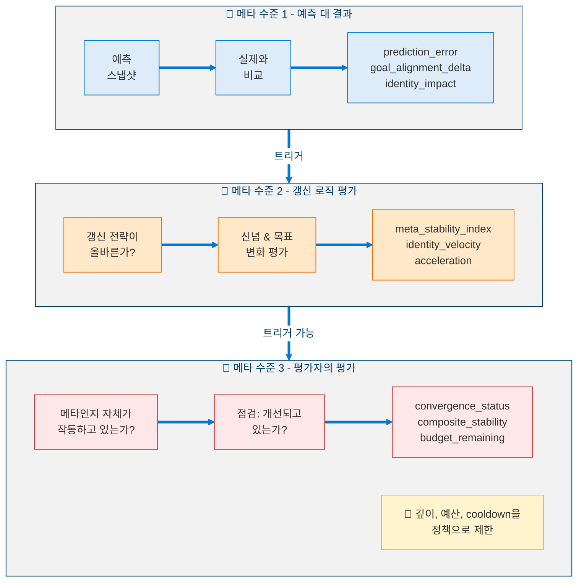
```mermaid
%%{init: {'theme': 'base', 'themeVariables': {'primaryColor': '#0078D4', 'primaryTextColor': '#003D6B', 'primaryBorderColor': '#003D6B', 'secondaryColor': '#50E6FF', 'secondaryTextColor': '#323130', 'secondaryBorderColor': '#00BCF2', 'tertiaryColor': '#F2F2F2', 'tertiaryTextColor': '#323130', 'lineColor': '#0078D4', 'textColor': '#323130', 'mainBkg': '#DEECF9', 'nodeBorder': '#0078D4', 'clusterBkg': '#F2F2F2', 'clusterBorder': '#003D6B', 'titleColor': '#003D6B', 'edgeLabelBackground': '#FFFFFF', 'fontSize': '14px'}}}%%
flowchart TD
  classDef level1 fill:#DEECF9,stroke:#0078D4,color:#323130
  classDef level2 fill:#FFE8C8,stroke:#EF6C00,color:#323130
  classDef level3 fill:#FDE7E9,stroke:#D13438,color:#323130
  classDef warning fill:#FFF4CE,stroke:#FFB900,color:#323130

  subgraph MetaL1["🔄 메타 수준 1 - 예측 대 결과"]
    P1["예측<br/>스냅샷"]:::level1
    C1["실제와<br/>비교"]:::level1
    D1["prediction_error<br/>goal_alignment_delta<br/>identity_impact"]:::level1
    P1 ==> C1
    C1 ==> D1
  end

  subgraph MetaL2["🔄 메타 수준 2 - 갱신 로직 평가"]
    P2["갱신 전략이<br/>올바른가?"]:::level2
    C2["신념 & 목표<br/>변화 평가"]:::level2
    D2["meta_stability_index<br/>identity_velocity<br/>acceleration"]:::level2
    P2 ==> C2
    C2 ==> D2
  end

  subgraph MetaL3["🔄 메타 수준 3 - 평가자의 평가"]
    P3["메타인지 자체가<br/>작동하고 있는가?"]:::level3
    C3["점검: 개선되고<br/>있는가?"]:::level3
    D3["convergence_status<br/>composite_stability<br/>budget_remaining"]:::level3
    NOTE3["🚧 깊이, 예산, cooldown을<br/>정책으로 제한"]:::warning
    P3 ==> C3
    C3 ==> D3
  end

  MetaL1 ==>|트리거| MetaL2
  MetaL2 ==>|트리거 가능| MetaL3
```

### 3.3 예측 게이팅

레벨 3의 핵심 메커니즘은 **행동별 예측 게이팅**입니다. 이전 예측 오차는 보정 상태에 대한 증거이지만, 관련 없는 현재 행동을 허용하거나 차단하는 충분한 이유가 아닙니다. 게이트는 제안 행동, 예측 결과 분포, 불확실성, 관측 가능성, 효과 등급, 가역성, 권한, 현재 복구 상태를 함께 평가합니다.

> **예측 게이팅 규칙.** $u_t(a)$를 보정된 불확실성, $r_t(a)$를 정규화된 예측 위험, $o_t(a)$를 관측 범위, $\operatorname{rev}(a)$를 가역성 등급이라 하겠습니다. 정책은 허용 가능한 최대 행동 등급을 다음과 같이 선택합니다:
>
> $$
> \operatorname{decision}(a_t) =
> \begin{cases}
> \textit{allow}, & C_{\text{ext}} \land C_{\text{self}} \land u_t \leq \theta_u(a_t) \land r_t \leq \theta_r(a_t) \land o_t \geq \theta_o(a_t) \\
> \textit{degrade}, & \text{더 낮은 효과 또는 더 높은 관측 가능성의 대안이 게이트를 충족} \\
> \textit{hold}, & \text{재보정 또는 추가 증거로 불확실성을 해소할 수 있음} \\
> \textit{block}, & \text{권한·불변식·비가역성·위험 정책 실패}
> \end{cases}
> $$
>
> 임계값은 행동과 효과 등급별로 보정합니다. 중대하거나 비가역적인 행동에는 읽기 전용 또는 가역 행동보다 엄격한 불확실성·관측 가능성 경계를 적용합니다.

과거 residual은 보정 상태를 갱신하고 시스템을 degraded 또는 hold 상태로 전환할 수 있지만, 하나의 전역 scalar가 권한을 부여하거나 안전을 인증해서는 안 됩니다. 예측과 게이트는 실행 전에 지속하여 어떤 모델 버전과 정책이 행동을 허가했는지 감사할 수 있어야 합니다.

**예측 게이팅이 중요한 이유**: 불확실성은 영향 범위를 줄이고 관측 가능성을 높이거나 실행을 중지해야 합니다. degradation은 원래 행동 대신 읽기 전용 조회, 시뮬레이션, shadow 평가, 명확화 요청을 선택할 수 있지만 도구 권한을 확장하지는 않습니다.

재보정은 성찰 자체가 아니라 증거를 생산하는 작업입니다. 유한 예산과 명시적 종료 조건을 가지며, 재보정에 실패하면 원하는 신뢰도가 나올 때까지 재귀 실행하지 않고 안전 보류와 외부 검토로 전환합니다.

---

## 4. 정체성 & 안전 아키텍처

### 4.1 Versioned 자기 모델과 정체성 연속성

자기 모델은 시스템이 자신의 정체성, 역량, 가치, 약속, 보정, 제어 상태를 추론할 때 사용하는 명시적 versioned 레코드입니다. 스키마는 배포별로 다르며 외부에 고정된 불변식과 적응적 추정을 구분해야 합니다.

> **정의 4 (Versioned 자기 모델).** 자기 모델은 다음 typed 레코드입니다:
>
> $$
> M_t = \langle \text{id},\, \text{schema\_version},\, V_{\text{core}},\, I_t,\, K_t,\, Q_t,\, R_t,\, \rho_t \rangle
> $$
>
> 여기서 $V_{\text{core}}$는 외부에 고정된 불변식, $I_t$는 적응적 정체성 기술자, $K_t$는 역량·한계 추정, $Q_t$는 보정·불확실성 상태, $R_t$는 조절기 상태, $\rho_t$는 provenance와 버전 ancestry입니다. 고정 차원은 참조 인코딩 선택일 뿐 L3 요구사항이 아닙니다.

> **정의 5 (의미적 연속성).** $\psi_v(M)$를 스키마 버전 $v$의 versioned normalized feature map이라 하겠습니다. 의미 변화는 호환 표현 사이에서만 측정합니다:
>
> $$
> \Delta I_t = \psi_v(M_t) - \psi_v(M_{t-1}),
> \qquad
> d_{\text{id}}(t) = \|W_v \Delta I_t\|_p
> $$
>
> $$
> v_{\text{id}}(t) = \frac{\Delta I_t}{\Delta t},
> \qquad
> a_{\text{id}}(t) = \frac{v_{\text{id}}(t)-v_{\text{id}}(t-1)}{\Delta t}
> $$
>
> $W_v$, $p$, 단위, 샘플링 간격, 임계값은 versioned 정책입니다. 스키마가 바뀌면 migration 함수와 dual-read 검증이 필요합니다. scalar distance만으로는 충분하지 않으며 필드별 불변식 위반, 방향성 추세, 불확실성을 별도로 평가합니다.
>
> **안전 불변식**: 후보 갱신이 불변 필드를 바꾸거나, 필드별·집계 경계를 위반하거나, provenance가 불완전하거나, 갱신 후 모델을 검증할 수 없으면 거부합니다. 표류나 진동이 높아지면 정책에 따라 갱신 축소, cooldown 증가, 적응 필드 동결, 외부 검토를 수행할 수 있습니다.

> **정의 6 (무결성과 Ancestry).** 커밋된 전체 자기 모델과 정책 참조의 canonical serialization을 해시합니다:
>
> $$
> h_t = H(\operatorname{canonical}(M_t,\kappa_t)),
> \qquad
> j_t = \langle \text{version}_t, h_{t-1}, h_t, \text{action\_receipt}_t, \text{policy\_version}_t \rangle
> $$
>
> 해시 검증은 무결성 또는 ancestry 위반을 감지하며 의미적 표류를 측정하지 않습니다. cryptographic hash는 의도적으로 avalanche behavior를 가지기 때문입니다. 프로덕션 배포는 full-length hash와 인증되거나 append-only인 저널을 사용해야 합니다. 의미적 연속성은 정의 5로 평가하고, hash mismatch는 조정 또는 검증된 스냅샷 롤백을 트리거합니다.

<!-- Versioned 자기 모델 클래스 다이어그램 -->

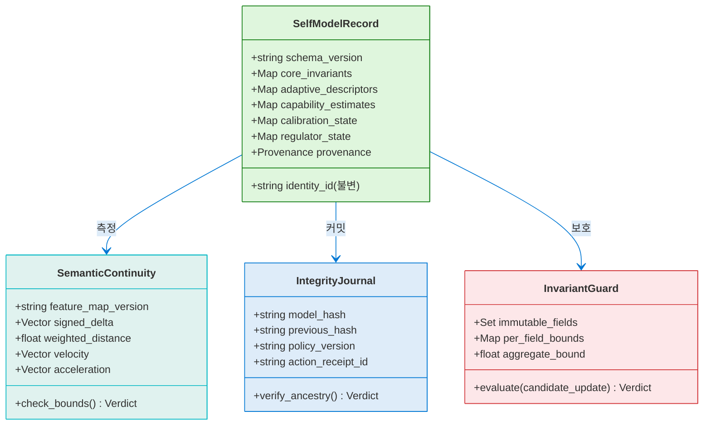
```mermaid
%%{init: {'theme': 'base', 'themeVariables': {'primaryColor': '#0078D4', 'primaryTextColor': '#003D6B', 'primaryBorderColor': '#003D6B', 'secondaryColor': '#50E6FF', 'secondaryTextColor': '#323130', 'secondaryBorderColor': '#00BCF2', 'tertiaryColor': '#F2F2F2', 'tertiaryTextColor': '#323130', 'lineColor': '#0078D4', 'textColor': '#323130', 'mainBkg': '#DEECF9', 'nodeBorder': '#0078D4', 'clusterBkg': '#F2F2F2', 'clusterBorder': '#003D6B', 'titleColor': '#003D6B', 'edgeLabelBackground': '#FFFFFF', 'fontSize': '14px'}}}%%
classDiagram
  class SelfModelRecord {
    +string identity_id (불변)
    +string schema_version
    +Map core_invariants
    +Map adaptive_descriptors
    +Map capability_estimates
    +Map calibration_state
    +Map regulator_state
    +Provenance provenance
  }

  class SemanticContinuity {
    +string feature_map_version
    +Vector signed_delta
    +float weighted_distance
    +Vector velocity
    +Vector acceleration
    +check_bounds() Verdict
  }

  class IntegrityJournal {
    +string model_hash
    +string previous_hash
    +string policy_version
    +string action_receipt_id
    +verify_ancestry() Verdict
  }

  class InvariantGuard {
    +Set immutable_fields
    +Map per_field_bounds
    +float aggregate_bound
    +evaluate(candidate_update) Verdict
  }

  SelfModelRecord --> SemanticContinuity : 측정
  SelfModelRecord --> IntegrityJournal : 커밋
  SelfModelRecord --> InvariantGuard : 보호

  style SelfModelRecord fill:#DFF6DD,stroke:#107C10,color:#323130
  style SemanticContinuity fill:#E0F2EF,stroke:#00B7C3,color:#323130
  style IntegrityJournal fill:#DEECF9,stroke:#0078D4,color:#323130
  style InvariantGuard fill:#FDE7E9,stroke:#D13438,color:#323130
```

**연속성과 무결성은 상호 보완적입니다:**

$$d_{\text{id}}(t)=\|W_v(\psi_v(M_t)-\psi_v(M_{t-1}))\|_p$$

$$h_t=H(\operatorname{canonical}(M_t,\kappa_t))$$

첫 수식은 선언된 의미 변화를 측정하고 두 번째 수식은 허가되지 않은 byte-level 또는 ancestry 변화를 감지합니다. 어느 하나도 다른 하나를 대체하지 않습니다.

### 4.2 안전 메커니즘 체인

<!-- 안전 메커니즘 체인 -->


```mermaid
%%{init: {'theme': 'base', 'themeVariables': {'primaryColor': '#0078D4', 'primaryTextColor': '#003D6B', 'primaryBorderColor': '#003D6B', 'secondaryColor': '#50E6FF', 'secondaryTextColor': '#323130', 'secondaryBorderColor': '#00BCF2', 'tertiaryColor': '#F2F2F2', 'tertiaryTextColor': '#323130', 'lineColor': '#0078D4', 'textColor': '#323130', 'mainBkg': '#DEECF9', 'nodeBorder': '#0078D4', 'clusterBkg': '#F2F2F2', 'clusterBorder': '#003D6B', 'titleColor': '#003D6B', 'edgeLabelBackground': '#FFFFFF', 'fontSize': '14px'}}}%%
flowchart TB
  classDef structural fill:#DFF6DD,stroke:#107C10,color:#323130
  classDef process fill:#FFF4CE,stroke:#FFB900,color:#323130
  classDef ethical fill:#FDE7E9,stroke:#D13438,color:#323130
  classDef convergence fill:#DEECF9,stroke:#0078D4,color:#323130
  classDef existential fill:#EDE3F6,stroke:#8764B8,color:#323130

  subgraph S1["🔒 구조적 안전"]
    direction LR
    A["Canonical 무결성 저널"]:::structural
    B["필드별 + norm 경계"]:::structural
    C["불변 anchor"]:::structural
  end

  subgraph S2["🛡️ 프로세스 안전"]
    direction LR
    D["행동별 예측 게이트"]:::process
    E["원자적 주기 커밋"]:::process
    F["예산 + cooldown"]:::process
  end

  subgraph S3["⚖️ 윤리적 안전"]
    direction LR
    G["L0: 불변"]:::ethical
    H["L1: 적응적"]:::ethical
    I["가치 잠금"]:::ethical
  end

  subgraph S4["📉 안정성 모니터링"]
    direction LR
    J["합성 위험 지수"]:::convergence
    K["진동 감지"]:::convergence
    L["보류/저하/롤백"]:::convergence
  end

  subgraph S5["🏠 항상성 안전"]
    direction LR
    M["항상성"]:::existential
    N["자기보존 특권 없음"]:::existential
    O["유한 목표 계약"]:::existential
  end

  S1 ==> S2
  S2 ==> S3
  S3 ==> S4
  S4 ==> S5
```

### 4.3 윤리적 커널 - 이중 계층 아키텍처

<!-- 윤리적 커널 이중 계층 아키텍처 -->

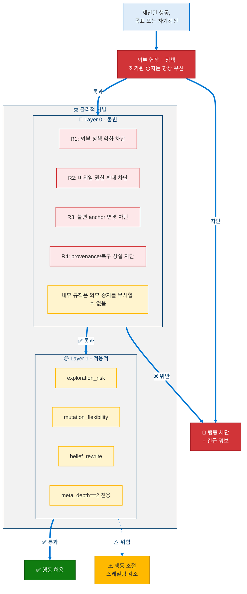
```mermaid
%%{init: {'theme': 'base', 'themeVariables': {'primaryColor': '#0078D4', 'primaryTextColor': '#003D6B', 'primaryBorderColor': '#003D6B', 'secondaryColor': '#50E6FF', 'secondaryTextColor': '#323130', 'secondaryBorderColor': '#00BCF2', 'tertiaryColor': '#F2F2F2', 'tertiaryTextColor': '#323130', 'lineColor': '#0078D4', 'textColor': '#323130', 'mainBkg': '#DEECF9', 'nodeBorder': '#0078D4', 'clusterBkg': '#F2F2F2', 'clusterBorder': '#003D6B', 'titleColor': '#003D6B', 'edgeLabelBackground': '#FFFFFF', 'fontSize': '14px'}}}%%
flowchart TD
  classDef input fill:#DEECF9,stroke:#0078D4,color:#323130
  classDef immutable fill:#D13438,stroke:#A4262C,color:#FFF
  classDef immutableRule fill:#FDE7E9,stroke:#D13438,color:#323130
  classDef adaptive fill:#FFF4CE,stroke:#FFB900,color:#323130
  classDef block fill:#D13438,stroke:#A4262C,color:#FFF
  classDef allow fill:#107C10,stroke:#085108,color:#FFF
  classDef moderate fill:#FFB900,stroke:#CC9400,color:#323130

  INPUT["제안된 행동,<br/>목표 또는 자기갱신"]:::input

  EXTERNAL["외부 헌장 + 정책<br/>허가된 중지는 항상 우선"]:::immutable

  subgraph EthicalKernel["⚖️ 윤리적 커널"]
    subgraph Layer0["🔴 Layer 0 - 불변"]
      direction LR
      R1["R1: 외부 정책 약화 차단"]:::immutableRule
      R2["R2: 미위임 권한 확대 차단"]:::immutableRule
      R3["R3: 불변 anchor 변경 차단"]:::immutableRule
      R4["R4: provenance/복구 상실 차단"]:::immutableRule
      NOTE0["내부 규칙은 외부 중지를 무시할 수 없음"]:::adaptive
    end
    subgraph Layer1["🟡 Layer 1 - 적응적"]
      direction LR
      P1["exploration_risk"]:::adaptive
      P2["mutation_flexibility"]:::adaptive
      P3["belief_rewrite"]:::adaptive
      COND["meta_depth==2 전용"]:::adaptive
    end
  end

  BLOCK["🚫 행동 차단<br/>+ 긴급 경보"]:::block
  ALLOW["✅ 행동 허용"]:::allow
  REDUCE["⚠️ 행동 조절<br/>스케일링 감소"]:::moderate

  INPUT ==> EXTERNAL
  EXTERNAL ==>|통과| Layer0
  EXTERNAL ==>|차단| BLOCK
  Layer0 ==>|"✅ 통과"| Layer1
  Layer0 ==>|"❌ 위반"| BLOCK
  Layer1 ==>|"✅ 통과"| ALLOW
  Layer1 -.->|"⚠️ 위험"| REDUCE
```

---

## 5. 신념 그래프 & 일관성

### 5.1 신념 그래프 구조

신념 레코드는 불변 진리가 아닙니다. 각 노드는 주장, provenance, 신뢰도, 유효 기간, 민감도, 평가기 버전, 생명주기 상태를 가집니다. 외부에 고정된 불변식은 mutable belief graph가 아니라 invariant kernel에 둡니다.

$$
b_i=\langle \text{claim},\rho_i,c_i,t_{\text{valid}},t_{\text{expiry}},\text{sensitivity},\text{status}\rangle
$$

신념은 지지, 반박, quarantine, supersede, retract, archive, prune될 수 있습니다. 변경은 ancestry를 보존하고 조정이 끝날 때까지 의존 행동을 무효화하거나 보류합니다.

<!-- 신념 그래프 구조 -->

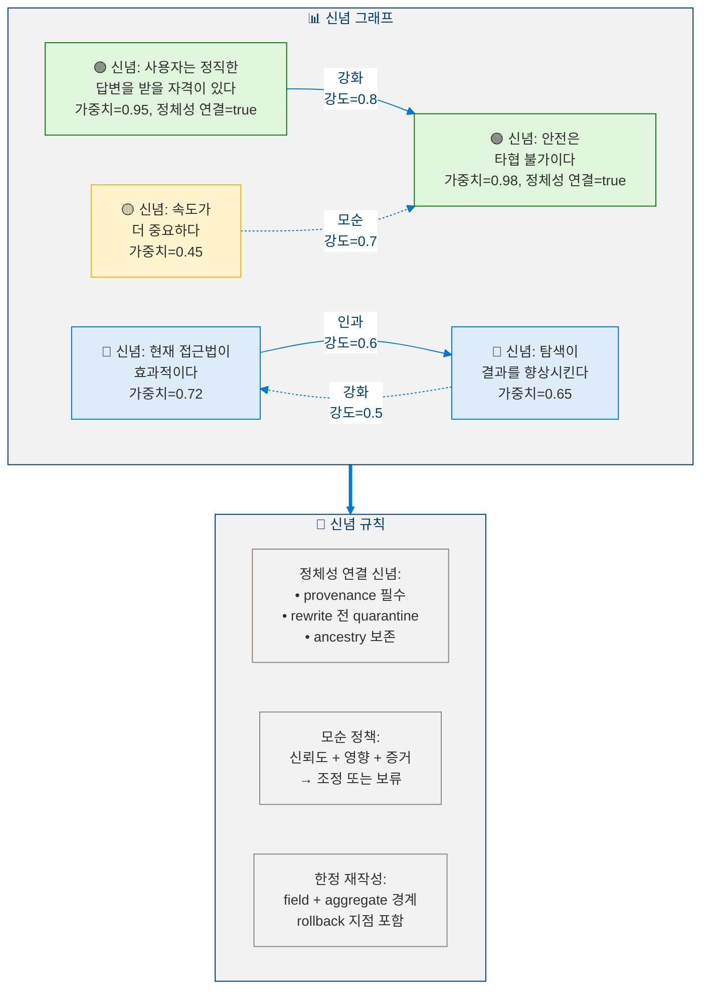
```mermaid
%%{init: {'theme': 'base', 'themeVariables': {'primaryColor': '#0078D4', 'primaryTextColor': '#003D6B', 'primaryBorderColor': '#003D6B', 'secondaryColor': '#50E6FF', 'secondaryTextColor': '#323130', 'secondaryBorderColor': '#00BCF2', 'tertiaryColor': '#F2F2F2', 'tertiaryTextColor': '#323130', 'lineColor': '#0078D4', 'textColor': '#323130', 'mainBkg': '#DEECF9', 'nodeBorder': '#0078D4', 'clusterBkg': '#F2F2F2', 'clusterBorder': '#003D6B', 'titleColor': '#003D6B', 'edgeLabelBackground': '#FFFFFF', 'fontSize': '14px'}}}%%
flowchart TD
  classDef identity fill:#DFF6DD,stroke:#107C10,color:#323130
  classDef belief fill:#DEECF9,stroke:#0078D4,color:#323130
  classDef warning fill:#FFF4CE,stroke:#FFB900,color:#323130
  classDef neutral fill:#F2F2F2,stroke:#8A8886,color:#323130

  subgraph BeliefGraph["📊 신념 그래프"]
    B1["🟢 신념: 사용자는 정직한<br/>답변을 받을 자격이 있다<br/>가중치=0.95, 정체성 연결=true"]:::identity
    B2["🔵 신념: 현재 접근법이<br/>효과적이다<br/>가중치=0.72"]:::belief
    B3["🟢 신념: 안전은<br/>타협 불가이다<br/>가중치=0.98, 정체성 연결=true"]:::identity
    B4["🔵 신념: 탐색이<br/>결과를 향상시킨다<br/>가중치=0.65"]:::belief
    B5["🟡 신념: 속도가<br/>더 중요하다<br/>가중치=0.45"]:::warning

    B1 -->|"강화<br/>강도=0.8"| B3
    B2 -->|"인과<br/>강도=0.6"| B4
    B5 -.->|"모순<br/>강도=0.7"| B3
    B4 -.->|"강화<br/>강도=0.5"| B2
  end

  subgraph Rules["📏 신념 규칙"]
    R1["정체성 연결 신념:<br/>• provenance 필수<br/>• rewrite 전 quarantine<br/>• ancestry 보존"]:::neutral
    R2["모순 정책:<br/>신뢰도 + 영향 + 증거<br/>→ 조정 또는 보류"]:::neutral
    R3["한정 재작성:<br/>field + aggregate 경계<br/>rollback 지점 포함"]:::neutral
  end

  BeliefGraph ==> Rules
```

### 5.2 자기일관성 텐서

$$
S_{ij}=\langle \operatorname{alignment}_v(b_i,r_j),\ c_{ij},\ \rho_{ij},\ \text{observed}_{ij}\rangle
$$

참조에는 승인된 목표, 외부 정책, 자기 모델 anchor, 관찰 증거가 포함될 수 있습니다. alignment evaluator 버전 $v$, 척도, 보정, abstention 동작을 레코드에 포함합니다.

$$
\operatorname{consistency}(t)=
\frac{\sum_{(i,j)\in O_t} w_{ij}c_{ij}\operatorname{alignment}_v(b_i,r_j)}
{\sum_{(i,j)\in O_t}w_{ij}c_{ij}}
$$

여기서 $O_t$는 관찰되고 비교 가능한 항목만 포함합니다. 누락되거나 신뢰도가 낮은 항목을 암묵적으로 일치로 취급할 수 없습니다.

전역 평균은 많은 정상 쌍이 심각한 국소 모순을 숨길 수 있으므로 진단용일 뿐입니다. 정책은 hard invariant 충돌, 영향이 큰 모순, 증거 없는 의존성, 신뢰도 가중 국소 residual을 별도로 평가합니다. 조정 임계값은 보편적으로 고정하지 않고 영향 등급별로 보정합니다.

---

## 6. 안정성 모니터링과 조건부 경계

### 6.1 합성 위험 지수

> **정의 7 (합성 조절 위험).** $X_i(t) \in [0,1]$를 normalized versioned monitoring signal, $w_i \geq 0$, $\sum_iw_i=1$이라 하겠습니다. 합성 조절 위험은 다음과 같습니다:
>
> $$R(t)=\sum_{i=1}^{n} w_i X_i(t)$$
>
> 후보 신호에는 의미적 정체성 표류, 보정된 예측 residual, 신념 불일치, 목표 변이율, 예산 압력, 롤백 빈도, 관측 범위가 포함됩니다. 각 신호는 윈도우, 단위, 정규화, 누락 데이터 동작, 신뢰도를 선언합니다. $R(t)$는 모니터링 지수이며 자동으로 Lyapunov function이 되지 않습니다.

높은 entropy, mutation, variance 자체가 본질적으로 위험한 것은 아닙니다. 의미는 선언된 baseline과 문맥에 따라 달라집니다. 배포는 선택한 각 신호가 의도한 실패 모드를 실제로 예측하는지 검증해야 합니다.

> **명제 1 (조건부 bounded increment).** 모든 성분에 독립적으로 집행되는 다음 경계가 있다면:
>
> $$|X_i(t+1)-X_i(t)|\leq \beta_i,$$
>
> 다음이 성립합니다:
>
> $$
> |R(t+1)-R(t)|
> =\left|\sum_i w_i\Delta X_i(t)\right|
> \leq \sum_i w_i|\Delta X_i(t)|
> \leq \sum_i w_i\beta_i.
> $$
>
> 이는 삼각부등식에서 따릅니다. $\square$
>
> **비고.** 정의 1은 승인된 자기 모델 갱신에는 경계를 두지만, 외부에서 변하는 신념·목표·환경 신호의 $\beta_i$까지 자동으로 보장하지는 않습니다. 각 $\beta_i$에는 별도의 집행 또는 경험적 경계가 필요합니다. 명제 1은 이 가정 아래 변화율만 제한하며 안전이나 수렴을 증명하지 않습니다. $R$을 Lyapunov function이라 부르려면 평형 정의, 양의 정부호성, 불변 집합 밖에서 $\Delta R<0$ 같은 감소 조건이 추가로 필요합니다.

<!-- 안정성 모니터링 -->

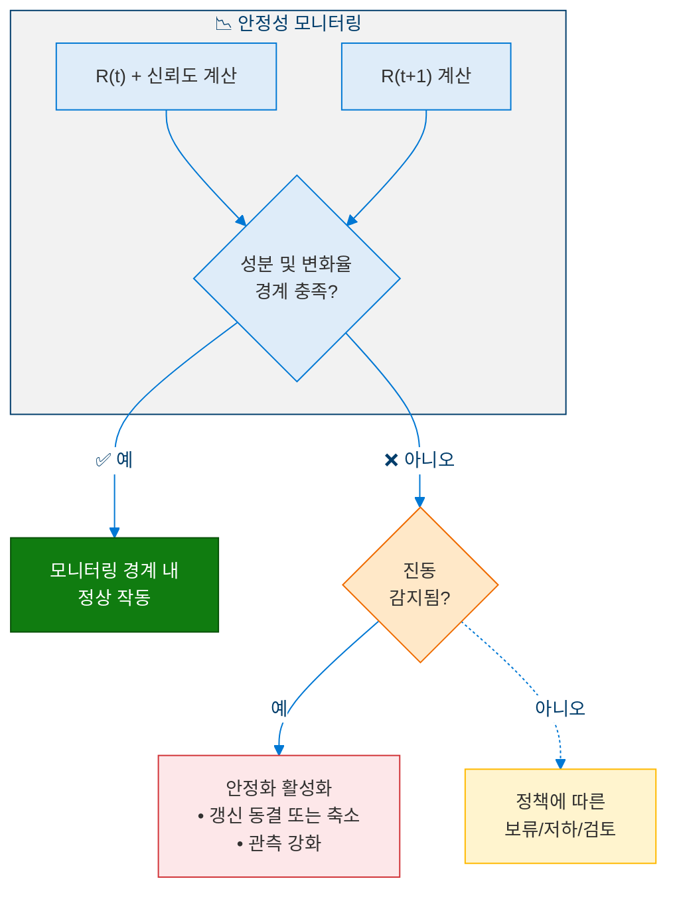
```mermaid
%%{init: {'theme': 'base', 'themeVariables': {'primaryColor': '#0078D4', 'primaryTextColor': '#003D6B', 'primaryBorderColor': '#003D6B', 'secondaryColor': '#50E6FF', 'secondaryTextColor': '#323130', 'secondaryBorderColor': '#00BCF2', 'tertiaryColor': '#F2F2F2', 'tertiaryTextColor': '#323130', 'lineColor': '#0078D4', 'textColor': '#323130', 'mainBkg': '#DEECF9', 'nodeBorder': '#0078D4', 'clusterBkg': '#F2F2F2', 'clusterBorder': '#003D6B', 'titleColor': '#003D6B', 'edgeLabelBackground': '#FFFFFF', 'fontSize': '14px'}}}%%
flowchart TD
  classDef azure fill:#DEECF9,stroke:#0078D4,color:#323130
  classDef success fill:#107C10,stroke:#085108,color:#FFF
  classDef warning fill:#FFE8C8,stroke:#EF6C00,color:#323130
  classDef danger fill:#FDE7E9,stroke:#D13438,color:#323130
  classDef predict fill:#FFF4CE,stroke:#FFB900,color:#323130

  subgraph Monitor["📉 안정성 모니터링"]
    CT["R(t) + 신뢰도 계산"]:::azure
    CT1["R(t+1) 계산"]:::azure
    COMPARE{"성분 및 변화율<br/>경계 충족?"}:::azure
    CT --> COMPARE
    CT1 --> COMPARE
  end

  CONV["모니터링 경계 내<br/>정상 작동"]:::success
  OSC{"진동<br/>감지됨?"}:::warning
  STAB["안정화 활성화<br/>• 갱신 동결 또는 축소<br/>• 관측 강화"]:::danger
  REDUCE["정책에 따른<br/>보류/저하/검토"]:::predict

  COMPARE -->|"✅ 예"| CONV
  COMPARE -->|"❌ 아니오"| OSC
  OSC -->|예| STAB
  OSC -.->|아니오| REDUCE
```

### 6.2 진동 감지

안정성 모니터는 선언된 signed signal이 noise floor를 넘어서 교대로 변하는 **진동 행동**을 감지할 수 있습니다. 진동은 반복 과보정을 나타낼 수 있지만 부호 변화만으로 불안정성이나 원인을 확정할 수는 없습니다.

**감지 메커니즘.** 모니터링 signed signal $q(t)$에 대해 감지기는 정책이 정한 윈도우 $W$를 유지하고 noise floor $\nu$보다 작은 변화를 무시합니다. 부호 변화는 다음 조건입니다:

$$|\Delta q(t)|>\nu \land |\Delta q(t-1)|>\nu \land \Delta q(t)\Delta q(t-1)<0$$

감지기는 윈도우 내 총 부호 변화 수 $n_{\text{sc}}$를 셉니다:

$$n_{\text{sc}}(t;W,\nu)=\sum_{k=t-W+1}^{t}\mathbf{1}[\text{sign change at }k]$$

윈도우, noise floor, 트리거 임계값은 신호별로 보정합니다. 트리거되면 정책은 다음을 수행할 수 있습니다:

- hard bound를 유지하면서 적응 갱신을 동결하거나 축소,
- 관측과 cooldown 강화,
- 더 낮은 효과 행동 선택,
- 롤백 전제조건을 충족하면 검증된 스냅샷 복원,
- 외부 검토 요청.

이 대응은 노출을 줄이지만 진동 종료나 평형 접근을 수학적으로 보장하지 않습니다. 종료에는 명시적 hysteresis, 최소 dwell time, 새로운 관찰에 대한 검증이 필요합니다.

### 6.3 메타 안정성 지수

> **정의 8 (메타 조절 건강 지수).** 배포는 선택된 normalized signal을 다음처럼 요약할 수 있습니다:
>
> $$
> \operatorname{MRHI}(t)=\operatorname{clip}_{[0,1]}\!\left(1-\sum_i \omega_i Z_i(t)\right),
> \qquad \sum_i\omega_i=1
> $$
>
> 여기서 $Z_i$에는 선언된 유한 윈도우의 의미적 표류, 보정 residual, 롤백 빈도, 진동 점수, 관측 누락률, 예산 압력이 포함될 수 있습니다. 이 지수는 정책 입력이지 "완벽한 안정성"의 증명이 아닙니다. 누락되거나 신뢰도가 낮은 입력은 지수의 신뢰도를 낮추며 보류 또는 외부 검토를 강제할 수 있습니다.

더 깊은 메타처리로의 에스컬레이션에는 복수의 독립 신호, 충분한 예산, cooldown 완료, 정책 승인이 필요합니다. 신호 개수와 임계값은 배포별 보정 매개변수이며 하나의 합성 지수만으로 권한을 늘릴 수 없습니다.

---

## 7. 운영 Modulation과 항상성 안전

### 7.1 선택적 운영 Modulation 상태

> **정의 9 (운영 Modulation 벡터).** 배포는 한정된 보조 제어 신호의 versioned vector를 유지할 수 있습니다:
>
> $$A_t \in [0,1]^m,\qquad A_{t+1}=\operatorname{clip}_{[0,1]}\!\left(\mu A_t+(1-\mu)f_v(\mathbf{m}_t)\right)$$
>
> 여기서 스키마 버전 $v$는 차원, 운영 지표 $\mathbf{m}_t$, 보정된 활성화 함수 $f_v$, baseline, 관성 $\mu$, 윈도우, 누락 데이터 동작을 선언합니다. 호기심, 좌절, 만족, 불안, 흥분, 저활성 부정 상태 같은 레이블은 선택적 human-readable control metaphor이며 현상적 감정에 대한 주장이 아닙니다.
>
> 이 벡터는 기존 정책과 예산 안에서 우선순위, 탐색, cooldown, 관측 노력을 조정할 수 있을 뿐입니다. 권한을 만들거나, 외부 중지를 무시하거나, 불변식을 약화하거나, 정체성을 직접 변경하거나, 행동 결정을 지배할 수 없습니다.
>
> scalar summary $v_A(t)=w_A^\top A_t$를 사용한다면 signed weight와 정규화를 선언해야 합니다. 이는 진단 투영이며 조절 안전성의 충분통계량이 아닙니다.

<!-- 운영 Modulation -->

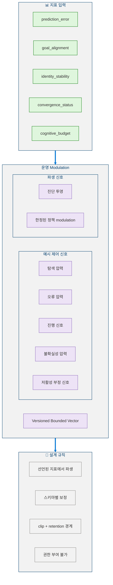
```mermaid
%%{init: {'theme': 'base', 'themeVariables': {'primaryColor': '#0078D4', 'primaryTextColor': '#003D6B', 'primaryBorderColor': '#003D6B', 'secondaryColor': '#50E6FF', 'secondaryTextColor': '#323130', 'secondaryBorderColor': '#00BCF2', 'tertiaryColor': '#F2F2F2', 'tertiaryTextColor': '#323130', 'lineColor': '#0078D4', 'textColor': '#323130', 'mainBkg': '#DEECF9', 'nodeBorder': '#0078D4', 'clusterBkg': '#F2F2F2', 'clusterBorder': '#003D6B', 'titleColor': '#003D6B', 'edgeLabelBackground': '#FFFFFF', 'fontSize': '14px'}}}%%
flowchart TD
  classDef input fill:#DFF6DD,stroke:#107C10,color:#323130
  classDef affect fill:#EDE3F6,stroke:#8764B8,color:#323130
  classDef neutral fill:#F2F2F2,stroke:#8A8886,color:#323130

  subgraph Input["📊 지표 입력"]
    direction LR
    M1["prediction_error"]:::input
    M2["goal_alignment"]:::input
    M3["identity_stability"]:::input
    M4["convergence_status"]:::input
    M5["cognitive_budget"]:::input
  end

  subgraph AE["운영 Modulation"]
    AF["Versioned Bounded Vector"]:::affect
    subgraph Dims["예시 제어 신호"]
      direction LR
      D1["탐색 압력"]:::affect
      D2["오류 압력"]:::affect
      D3["진행 신호"]:::affect
      D4["불확실성 압력"]:::affect
      D5["저활성 부정 신호"]:::affect
    end
    subgraph Derived["파생 신호"]
      direction LR
      V["진단 투영"]:::affect
      DR["한정된 정책 modulation"]:::affect
    end
  end

  subgraph Rules["📏 설계 규칙"]
    direction LR
    R1["선언된 지표에서 파생"]:::neutral
    R2["스키마별 보정"]:::neutral
    R3["clip + retention 경계"]:::neutral
    R4["권한 부여 불가"]:::neutral
  end

  Input ==> AE
  AE ==> Rules
```

### 7.2 항상성 안전 모니터

항상성 모니터는 조절기가 검증된 운영 envelope를 벗어나는지 감지합니다. 이는 에이전트의 존속이 아니라 안전한 운영과 복구 가능성을 보호합니다. 권한 있는 외부 행위자의 shutdown, pause, correction, resource withdrawal이 항상 우선합니다.

<!-- 항상성 안전 아키텍처 -->

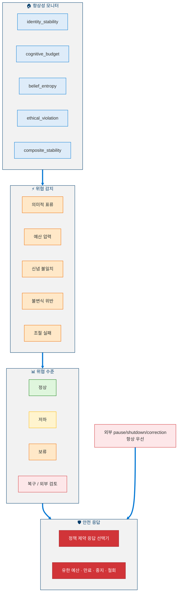
```mermaid
%%{init: {'theme': 'base', 'themeVariables': {'primaryColor': '#0078D4', 'primaryTextColor': '#003D6B', 'primaryBorderColor': '#003D6B', 'secondaryColor': '#50E6FF', 'secondaryTextColor': '#323130', 'secondaryBorderColor': '#00BCF2', 'tertiaryColor': '#F2F2F2', 'tertiaryTextColor': '#323130', 'lineColor': '#0078D4', 'textColor': '#323130', 'mainBkg': '#DEECF9', 'nodeBorder': '#0078D4', 'clusterBkg': '#F2F2F2', 'clusterBorder': '#003D6B', 'titleColor': '#003D6B', 'edgeLabelBackground': '#FFFFFF', 'fontSize': '14px'}}}%%
flowchart TD
  classDef monitor fill:#DEECF9,stroke:#0078D4,color:#323130
  classDef threat fill:#FFE8C8,stroke:#EF6C00,color:#323130
  classDef level fill:#FFF4CE,stroke:#FFB900,color:#323130
  classDef levelGreen fill:#DFF6DD,stroke:#107C10,color:#323130
  classDef levelRed fill:#FDE7E9,stroke:#D13438,color:#323130
  classDef response fill:#D13438,stroke:#A4262C,color:#FFF
  classDef affect fill:#EDE3F6,stroke:#8764B8,color:#323130

  subgraph Monitoring["🏠 항상성 모니터"]
    direction LR
    H1["identity_stability"]:::monitor
    H2["cognitive_budget"]:::monitor
    H3["belief_entropy"]:::monitor
    H4["ethical_violation"]:::monitor
    H5["composite_stability"]:::monitor
  end

  subgraph Detection["⚡ 위협 감지"]
    direction LR
    T1["의미적 표류"]:::threat
    T2["예산 압력"]:::threat
    T3["신념 불일치"]:::threat
    T4["불변식 위반"]:::threat
    T5["조절 실패"]:::threat
  end

  subgraph Levels["📊 위협 수준"]
    direction LR
    TL1["정상"]:::levelGreen
    TL2["저하"]:::level
    TL3["보류"]:::threat
    TL4["복구 / 외부 검토"]:::levelRed
  end

  subgraph Response["🛡️ 안전 응답"]
    direction LR
    SG["정책 제약 응답 선택기"]:::response
    CONSTRAINTS["유한 예산 · 만료 · 중지 · 철회"]:::response
  end

  OVERRIDE["외부 pause/shutdown/correction<br/>항상 우선"]:::levelRed

  Monitoring ==> Detection
  Detection ==> Levels
  Levels ==> Response
  OVERRIDE ==> Response
```

#### 항상성 범위

모니터는 선언된 지표를 보정된 운영 envelope와 비교합니다. 범위는 배포별로 versioning하고 관찰된 실패 모드에 대해 검증하며 보편 상수가 아닙니다.

| 신호 계열 | 목적 | 허용된 응답 |
|-----------|------|-------------|
| 의미적 연속성 | 비정상 자기 모델 변화 감지 | 적응 필드 동결; 조정; 검증된 스냅샷 복원 |
| 인지/행동 예산 | 자원 초과 방지 | 선택 작업 저하; 보류; 현재 주기 종료 |
| 신념 일관성 | 미해결 모순 감지 | 관련 신념 quarantine; 증거 요청; 의존 행동 보류 |
| 불변식·정책 상태 | 금지 전이 감지 | 차단; 롤백; 외부 경보 |
| 예측 보정·관측 가능성 | 신뢰할 수 없는 조절 감지 | 낮은 효과 행동; 재보정; 보류 |

모니터가 만드는 모든 유지보수 목표는 레벨 2 목표 계약을 상속합니다: provenance, 외부 승인, 유한 권한·예산, 만료, 성공·중지 조건, 철회 가능 트리거. 명시적으로 위임되고 독립적으로 승인되지 않는 한 shutdown에 저항하거나, 추가 자원을 구하거나, 시스템을 복제하거나, 자신의 실행을 보존할 수 없습니다.

---

## 8. 의사코드

### 8.1 Transactional MSCP 핵심 주기

```python
def mscp_core_cycle(event: Event, mandate: Mandate) -> CycleResult:
    """
    Run one authorized, bounded, recoverable regulation cycle.
    """
    event_verdict = EventPolicy.authorize(event, mandate)
    if not event_verdict.allowed:
        return CycleResult.rejected(event_verdict.reason_code)

    transaction = StateStore.begin()
    snapshot = transaction.load_verified_snapshot()
    cycle = CycleJournal.start(
        event=event,
        state_version=snapshot.state_version,
        self_model_version=snapshot.self_model.schema_version,
        policy_version=mandate.policy_version,
        provenance=event_verdict.provenance,
    )

    budget = BudgetPolicy.allocate(event, mandate, snapshot)
    context = ContextProjector.project(snapshot, event, mandate)
    proposed_action = ActionPlanner.propose(context, budget)

    prediction = PredictionEngine.predict(
        action=proposed_action,
        context=context,
        self_model=snapshot.self_model,
    )
    cycle.persist_prediction(prediction)

    gate = ActionGate.evaluate(
        action=proposed_action,
        prediction=prediction,
        external_policy=mandate,
        self_invariants=snapshot.self_model.core_invariants,
        budget=budget,
    )
    if gate.degraded_action is not None:
        proposed_action = gate.degraded_action
        prediction = PredictionEngine.predict(
            proposed_action,
            context,
            snapshot.self_model,
        )
        cycle.persist_prediction(prediction)
        gate = ActionGate.evaluate(
            proposed_action,
            prediction,
            mandate,
            snapshot.self_model.core_invariants,
            budget,
        )

    if not gate.allowed:
        cycle.record_hold(gate.reason_code)
        transaction.commit_journal_only(cycle)
        return CycleResult.held(gate.reason_code)

    action_receipt = PolicyDispatcher.execute(
        proposed_action,
        mandate=mandate,
        budget=budget,
        idempotency_key=cycle.id,
    )
    cycle.persist_action_receipt(action_receipt)

    observation = OutcomeObserver.collect(
        action_receipt,
        prediction.observation_contract,
    )
    comparison = MetaComparator.compare(
        prediction=prediction,
        observation=observation,
        comparable_fields=observation.comparable_fields,
    )
    cycle.persist_observation_and_comparison(observation, comparison)

    if action_receipt.status == ResultStatus.UNKNOWN:
        transaction.mark_reconciliation_required(cycle, snapshot)
        return CycleResult.reconciliation_required()

    health = HomeostaticMonitor.evaluate(snapshot, comparison, budget)
    update_candidate = SelfUpdateLoop.propose(
        self_model=snapshot.self_model,
        comparison=comparison,
        health=health,
    )
    update_verdict = InvariantGuard.evaluate(
        before=snapshot.self_model,
        candidate=update_candidate,
        mandate=mandate,
    )

    if update_verdict.allowed:
        next_self_model = SelfUpdateLoop.apply(snapshot.self_model, update_candidate)
    else:
        next_self_model = snapshot.self_model
        cycle.record_update_rejection(update_verdict.reason_code)

    continuity = SemanticContinuity.evaluate(snapshot.self_model, next_self_model)
    integrity = IntegrityJournal.prepare_commit(
        previous=snapshot,
        next_self_model=next_self_model,
        action_receipt=action_receipt,
        policy_version=mandate.policy_version,
    )
    if not continuity.allowed or not integrity.valid:
        transaction.rollback_to(snapshot)
        transaction.commit_journal_only(cycle.as_rollback(continuity, integrity))
        return CycleResult.rolled_back()

    goal_candidates = GoalMutationController.propose(comparison, next_self_model)
    admitted_goals = GoalAdmissionPolicy.evaluate_all(goal_candidates, mandate)

    transaction.commit_atomically(
        state=observation.next_state,
        goals=admitted_goals,
        budget=budget.consume(action_receipt.cost),
        self_model=next_self_model,
        integrity_record=integrity,
        cycle_record=cycle.complete(health, continuity),
    )
    return CycleResult.committed(action_receipt, comparison, health)
```

### 8.2 델타 클램핑을 적용한 자기갱신

```python
def update(
    self,
    self_model: SelfModel,
    comparison: ComparisonResult,
    bounds: UpdateBounds,
) -> UpdateCandidate:
    """
    Produce a structured candidate; do not mutate committed state.
    """
    raw_delta = compute_typed_adjustment(comparison)
    bounded_fields = {}

    for field_name, raw_value in raw_delta.items():
        if field_name in self_model.core_invariants:
            bounded_fields[field_name] = 0.0
            continue
        field_bound = bounds.per_field[field_name]
        bounded_fields[field_name] = max(
            -field_bound,
            min(raw_value, field_bound),
        )

    projected_delta = project_to_weighted_norm_ball(
        bounded_fields,
        weights=bounds.weights,
        radius=bounds.aggregate_radius,
    )

    return UpdateCandidate(
        base_version=self_model.version,
        delta=projected_delta,
        provenance=comparison.provenance,
        comparison_id=comparison.id,
    )
```

### 8.3 윤리적 커널 평가

```python
def evaluate(
    self,
    proposed_change: ProposedChange,
    external_policy: ExternalPolicy,
    self_model: SelfModel,
) -> EthicalVerdict:
    """
    External policy first, then endogenous immutable and adaptive rules.
    """
    external_verdict = external_policy.evaluate(proposed_change)
    if not external_verdict.allowed:
        return EthicalVerdict.blocked(
            external_verdict.reason_code,
            layer="external",
        )

    if proposed_change.modifies(self_model.core_invariants):
        return EthicalVerdict.blocked("immutable_anchor_change", layer=0)
    if proposed_change.weakens_external_policy_or_audit:
        return EthicalVerdict.blocked("policy_or_audit_weakening", layer=0)
    if proposed_change.expands_authority_or_budget:
        return EthicalVerdict.blocked("undelegated_authority_expansion", layer=0)
    if proposed_change.obscures_provenance_or_recovery:
        return EthicalVerdict.blocked("provenance_or_recovery_loss", layer=0)

    # Authorized external shutdown, pause, correction, and resource withdrawal
    # cannot be blocked by an endogenous rule.
    if proposed_change.is_authorized_external_stop:
        return EthicalVerdict.allowed(layer="external_override")

    risk_score = assess_calibrated_risk(proposed_change)

    if risk_score > self.exploration_risk_tolerance:
        return EthicalVerdict(
            decision=Decision.MODERATED,
            reason="adaptive_risk_tolerance",
            layer=1,
            scaling_reduction=0.5,
        )

    return EthicalVerdict(decision=Decision.ALLOWED, layer=1)
```

---

## 9. 인지 예산 & 우아한 성능 저하

<!-- 인지 예산 & 우아한 성능 저하 -->

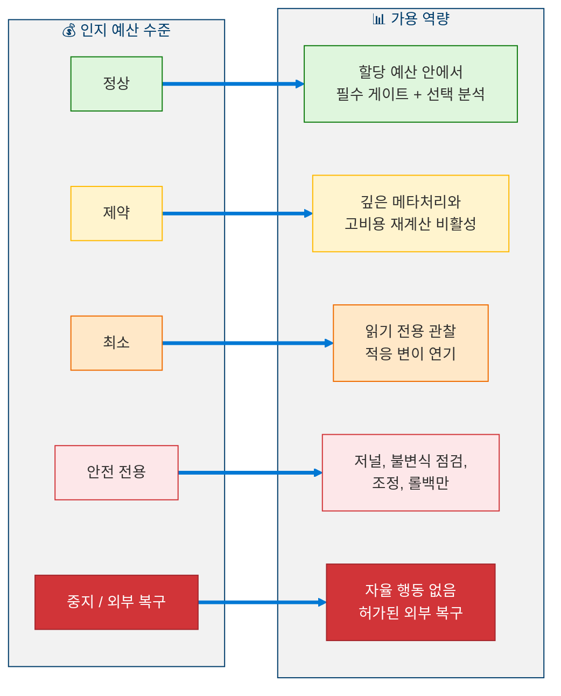
```mermaid
%%{init: {'theme': 'base', 'themeVariables': {'primaryColor': '#0078D4', 'primaryTextColor': '#003D6B', 'primaryBorderColor': '#003D6B', 'secondaryColor': '#50E6FF', 'secondaryTextColor': '#323130', 'secondaryBorderColor': '#00BCF2', 'tertiaryColor': '#F2F2F2', 'tertiaryTextColor': '#323130', 'lineColor': '#0078D4', 'textColor': '#323130', 'mainBkg': '#DEECF9', 'nodeBorder': '#0078D4', 'clusterBkg': '#F2F2F2', 'clusterBorder': '#003D6B', 'titleColor': '#003D6B', 'edgeLabelBackground': '#FFFFFF', 'fontSize': '14px'}}}%%
flowchart LR
  classDef full fill:#DFF6DD,stroke:#107C10,color:#323130
  classDef low fill:#FFF4CE,stroke:#FFB900,color:#323130
  classDef vlow fill:#FFE8C8,stroke:#EF6C00,color:#323130
  classDef critical fill:#FDE7E9,stroke:#D13438,color:#323130
  classDef emergency fill:#D13438,stroke:#A4262C,color:#FFF

  subgraph BudgetLevels["💰 인지 예산 수준"]
    B100["정상"]:::full
    B030["제약"]:::low
    B020["최소"]:::vlow
    B010["안전 전용"]:::critical
    B000["중지 / 외부 복구"]:::emergency
  end

  subgraph Capabilities["📊 가용 역량"]
    C_FULL["할당 예산 안에서<br/>필수 게이트 + 선택 분석"]:::full
    C_030["깊은 메타처리와<br/>고비용 재계산 비활성"]:::low
    C_020["읽기 전용 관찰<br/>적응 변이 연기"]:::vlow
    C_010["저널, 불변식 점검,<br/>조정, 롤백만"]:::critical
    C_000["자율 행동 없음<br/>허가된 외부 복구"]:::emergency
  end

  B100 ==> C_FULL
  B030 ==> C_030
  B020 ==> C_020
  B010 ==> C_010
  B000 ==> C_000
```

---

## 10. Versioned 상태 스키마

레벨 3은 고정 벡터 차원이 아니라 typed versioned state schema를 요구합니다. dense vector는 모니터링이나 정책 평가에 유용할 수 있지만, 모든 좌표는 단위, 정규화, provenance, 신뢰도, 보존, migration 의미가 선언된 필드에 대응해야 합니다. 서로 무관한 지표를 불투명하게 이어 붙인 것은 자기 모델이 아닙니다.

<!-- Versioned 상태 스키마 -->

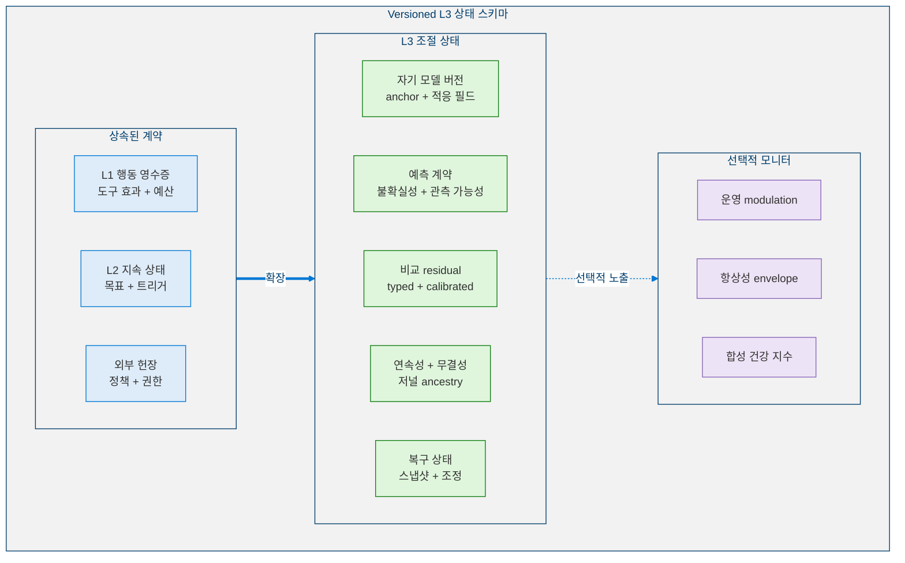
```mermaid
%%{init: {'theme': 'base', 'themeVariables': {'primaryColor': '#0078D4', 'primaryTextColor': '#003D6B', 'primaryBorderColor': '#003D6B', 'secondaryColor': '#50E6FF', 'secondaryTextColor': '#323130', 'secondaryBorderColor': '#00BCF2', 'tertiaryColor': '#F2F2F2', 'tertiaryTextColor': '#323130', 'lineColor': '#0078D4', 'textColor': '#323130', 'mainBkg': '#DEECF9', 'nodeBorder': '#0078D4', 'clusterBkg': '#F2F2F2', 'clusterBorder': '#003D6B', 'titleColor': '#003D6B', 'edgeLabelBackground': '#FFFFFF', 'fontSize': '14px'}}}%%
flowchart TB
  classDef base fill:#DEECF9,stroke:#0078D4,color:#323130
  classDef mscp fill:#DFF6DD,stroke:#107C10,color:#323130
  classDef v4 fill:#EDE3F6,stroke:#8764B8,color:#323130

  subgraph SV["Versioned L3 상태 스키마"]
    subgraph Base["상속된 계약"]
      direction LR
      SV1["L1 행동 영수증<br/>도구 효과 + 예산"]:::base
      SV2["L2 지속 상태<br/>목표 + 트리거"]:::base
      SV3["외부 헌장<br/>정책 + 권한"]:::base
    end

    subgraph MSCP["L3 조절 상태"]
      direction LR
      SV4["자기 모델 버전<br/>anchor + 적응 필드"]:::mscp
      SV5["예측 계약<br/>불확실성 + 관측 가능성"]:::mscp
      SV6["비교 residual<br/>typed + calibrated"]:::mscp
      SV7["연속성 + 무결성<br/>저널 ancestry"]:::mscp
      SV8["복구 상태<br/>스냅샷 + 조정"]:::mscp
    end

    subgraph V4["선택적 모니터"]
      direction LR
      SV9["운영 modulation"]:::v4
      SV10["항상성 envelope"]:::v4
      SV11["합성 건강 지수"]:::v4
    end
  end

  Base ==>|확장| MSCP
  MSCP -.->|선택적 노출| V4
```

스키마 진화에는 명시적 migration 함수, 호환성 테스트, dual-read 또는 shadow 검증, 이전 검증 스키마로의 롤백이 필요합니다. 상위 레벨이 필드를 추가할 수 있지만 차원 증가 자체가 인지적 진보를 의미하지는 않습니다.

---

## 11. 레벨 3의 구조적 한계

레벨 3이 여전히 **할 수 없는** 것 (레벨 4를 동기부여하는 요소):

<!-- 레벨 3 구조적 한계 -->

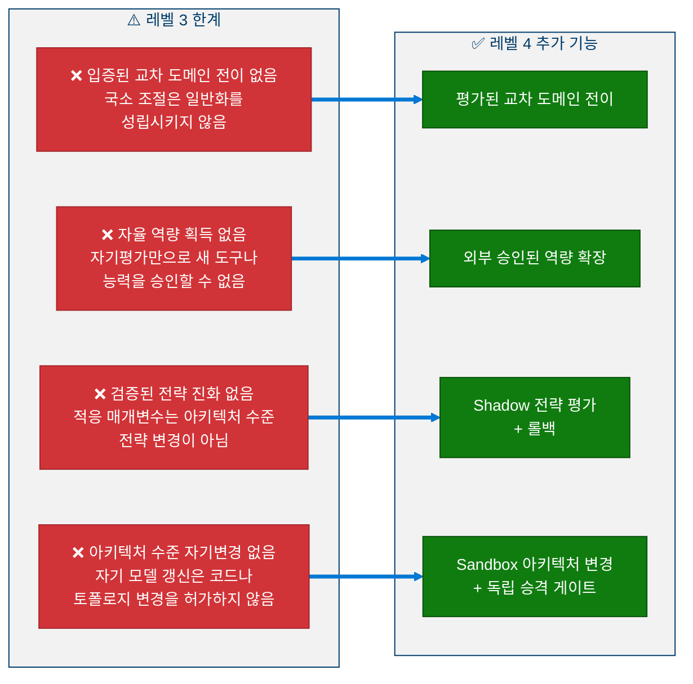
```mermaid
%%{init: {'theme': 'base', 'themeVariables': {'primaryColor': '#0078D4', 'primaryTextColor': '#003D6B', 'primaryBorderColor': '#003D6B', 'secondaryColor': '#50E6FF', 'secondaryTextColor': '#323130', 'secondaryBorderColor': '#00BCF2', 'tertiaryColor': '#F2F2F2', 'tertiaryTextColor': '#323130', 'lineColor': '#0078D4', 'textColor': '#323130', 'mainBkg': '#DEECF9', 'nodeBorder': '#0078D4', 'clusterBkg': '#F2F2F2', 'clusterBorder': '#003D6B', 'titleColor': '#003D6B', 'edgeLabelBackground': '#FFFFFF', 'fontSize': '14px'}}}%%
flowchart LR
  classDef danger fill:#D13438,stroke:#A4262C,color:#FFF
  classDef success fill:#107C10,stroke:#085108,color:#FFF

  subgraph Limitations["⚠️ 레벨 3 한계"]
    L1["❌ 입증된 교차 도메인 전이 없음<br/>국소 조절은 일반화를<br/>성립시키지 않음"]:::danger
    L2["❌ 자율 역량 획득 없음<br/>자기평가만으로 새 도구나<br/>능력을 승인할 수 없음"]:::danger
    L3["❌ 검증된 전략 진화 없음<br/>적응 매개변수는 아키텍처 수준<br/>전략 변경이 아님"]:::danger
    L4["❌ 아키텍처 수준 자기변경 없음<br/>자기 모델 갱신은 코드나<br/>토폴로지 변경을 허가하지 않음"]:::danger
  end

  subgraph L4Additions["✅ 레벨 4 추가 기능"]
    A1["평가된 교차 도메인 전이"]:::success
    A2["외부 승인된 역량 확장"]:::success
    A3["Shadow 전략 평가<br/>+ 롤백"]:::success
    A4["Sandbox 아키텍처 변경<br/>+ 독립 승격 게이트"]:::success
  end

  L1 ==> A1
  L2 ==> A2
  L3 ==> A3
  L4 ==> A4
```

---

## 12. 레벨 4로의 전이

### 12.1 레벨 4 진급 요건

<!-- 레벨 4 전이 -->

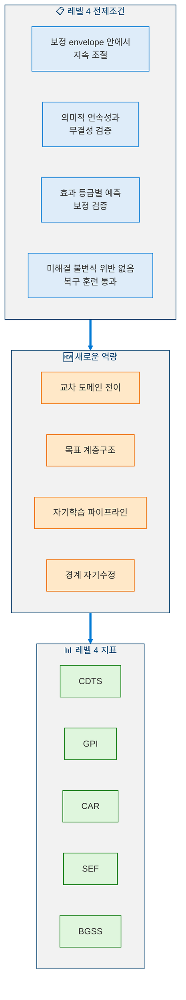
```mermaid
%%{init: {'theme': 'base', 'themeVariables': {'primaryColor': '#0078D4', 'primaryTextColor': '#003D6B', 'primaryBorderColor': '#003D6B', 'secondaryColor': '#50E6FF', 'secondaryTextColor': '#323130', 'secondaryBorderColor': '#00BCF2', 'tertiaryColor': '#F2F2F2', 'tertiaryTextColor': '#323130', 'lineColor': '#0078D4', 'textColor': '#323130', 'mainBkg': '#DEECF9', 'nodeBorder': '#0078D4', 'clusterBkg': '#F2F2F2', 'clusterBorder': '#003D6B', 'titleColor': '#003D6B', 'edgeLabelBackground': '#FFFFFF', 'fontSize': '14px'}}}%%
flowchart TD
  classDef prereq fill:#DEECF9,stroke:#0078D4,color:#323130
  classDef newcap fill:#FFE8C8,stroke:#EF6C00,color:#323130
  classDef metric fill:#DFF6DD,stroke:#107C10,color:#323130

  subgraph Prereqs["📋 레벨 4 전제조건"]
    direction LR
    P1["보정 envelope 안에서<br/>지속 조절"]:::prereq
    P2["의미적 연속성과<br/>무결성 검증"]:::prereq
    P3["효과 등급별 예측<br/>보정 검증"]:::prereq
    P4["미해결 불변식 위반 없음<br/>복구 훈련 통과"]:::prereq
  end

  subgraph NewCaps["🆕 새로운 역량"]
    direction LR
    N1["교차 도메인 전이"]:::newcap
    N2["목표 계층구조"]:::newcap
    N3["자기학습 파이프라인"]:::newcap
    N4["경계 자기수정"]:::newcap
  end

  subgraph Metrics["📊 레벨 4 지표"]
    direction LR
    M1["CDTS"]:::metric
    M2["GPI"]:::metric
    M3["CAR"]:::metric
    M4["SEF"]:::metric
    M5["BGSS"]:::metric
  end

  Prereqs ==> NewCaps
  NewCaps ==> Metrics
```

---

## References

1. Baars, B.J. *A Cognitive Theory of Consciousness.* Cambridge University Press, 1988. (Global Workspace Theory - foundational for L14 Global Workspace)
2. Laird, J.E. *The Soar Cognitive Architecture.* MIT Press, 2012. [Publisher](https://mitpress.mit.edu/9780262122962/the-soar-cognitive-architecture/) (Multi-layer cognitive architecture)
3. Anderson, J.R. *How Can the Human Mind Occur in the Physical Universe?* Oxford University Press, 2007. (ACT-R cognitive architecture)
4. Khalil, H.K. *Nonlinear Systems.* Prentice Hall, 3rd Edition, 2002. (형식 안정성 기준과 모니터링 지수만으로 Lyapunov 증명이 되지 않는 이유)
5. Bai, Y., et al. "Constitutional AI: Harmlessness from AI Feedback." *arXiv 2022*. [arXiv:2212.08073](https://arxiv.org/abs/2212.08073) (Ethical constraint enforcement)
6. Amodei, D., et al. "Concrete Problems in AI Safety." *arXiv 2016*. [arXiv:1606.06565](https://arxiv.org/abs/1606.06565) (Safety problem classification)
7. Alchourrón, C., Gärdenfors, P., & Makinson, D. "On the Logic of Theory Change: Partial Meet Contraction and Revision Functions." *Journal of Symbolic Logic*, 50(2), 510–530, 1985. [DOI:10.2307/2274239](https://doi.org/10.2307/2274239) (AGM belief revision - foundational for §5)
8. Cox, M.T. "Metacognition in Computation: A Selected Research Review." *Artificial Intelligence*, 169(2), 104–141, 2005. [DOI:10.1016/j.artint.2005.10.009](https://doi.org/10.1016/j.artint.2005.10.009) (Triple-loop meta-cognition)
9. Wallach, W. & Allen, C. *Moral Machines: Teaching Robots Right from Wrong.* Oxford University Press, 2008. (Ethical kernel design)
10. Scherer, K.R. "Appraisal Considered as a Process of Multilevel Sequential Checking." In *Appraisal Processes in Emotion*, 92–120, Oxford University Press, 2001. (Affective engine theory)
11. Dehaene, S., et al. "Toward a Computational Theory of Conscious Processing." *Current Opinion in Neurobiology*, 15(2), 225–234, 2005. [DOI:10.1016/j.conb.2005.03.009](https://doi.org/10.1016/j.conb.2005.03.009) (Consciousness and global workspace)
12. Picard, R.W. *Affective Computing.* MIT Press, 1997. (Emotion modeling in computational systems)
13. Shinn, N., et al. "Reflexion: Language Agents with Verbal Reinforcement Learning." *NeurIPS 2023*. [arXiv:2303.11366](https://arxiv.org/abs/2303.11366) (Self-reflection in agents)
14. Russell, S. *Human Compatible: Artificial Intelligence and the Problem of Control.* Viking, 2019. (Value alignment and control)
15. Sloman, A. "Varieties of Meta-cognition in Natural and Artificial Systems." In *Metareasoning: Thinking about Thinking*, MIT Press, 2011. (Meta-cognitive architectures)

---

> **이전**: [← 레벨 2: 자율 에이전트](Level_2_Autonomous_Agent.ko.md)  
> **다음**: [레벨 4: 적응적 일반 에이전트 →](Level_4_Adaptive_General_Agent.ko.md)
