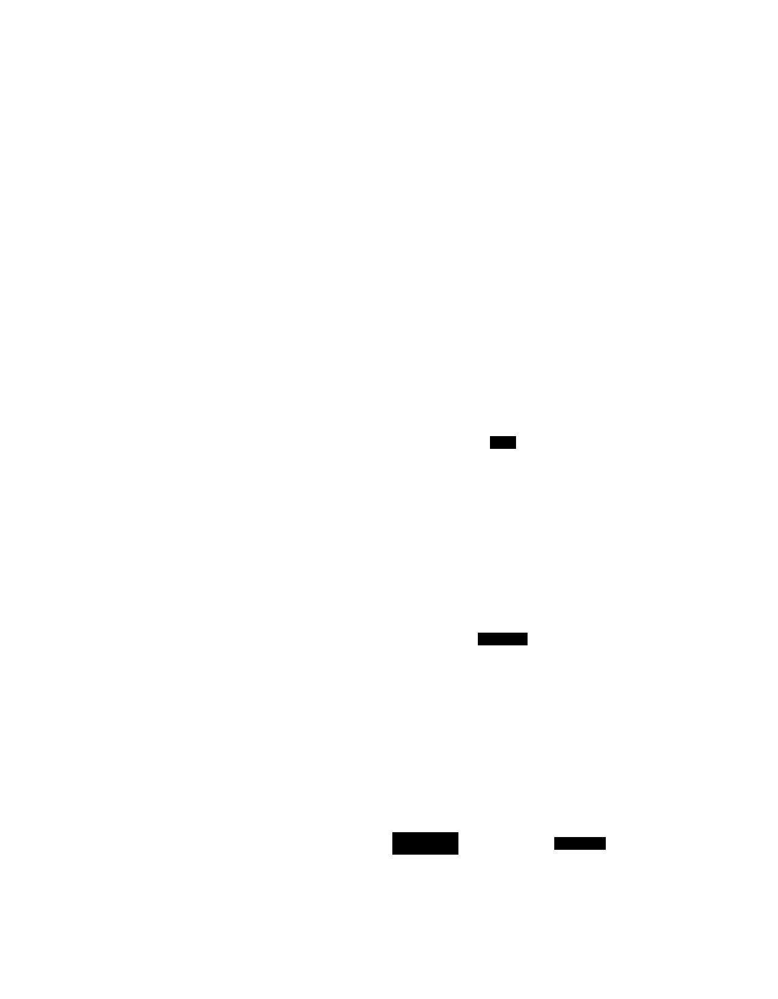
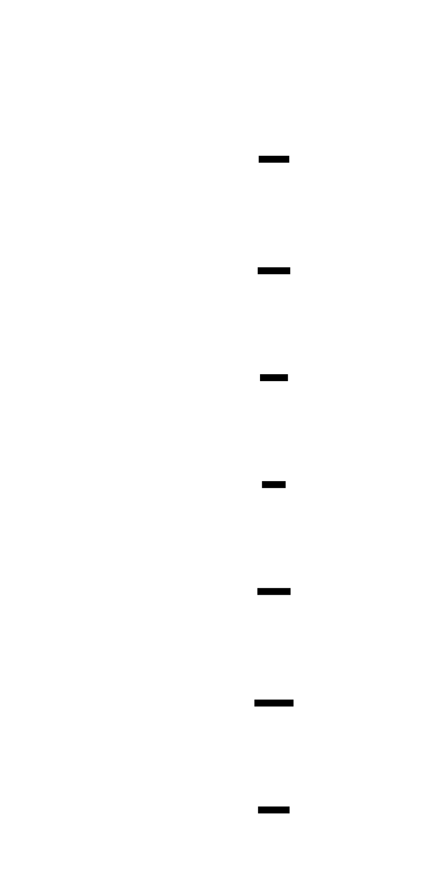
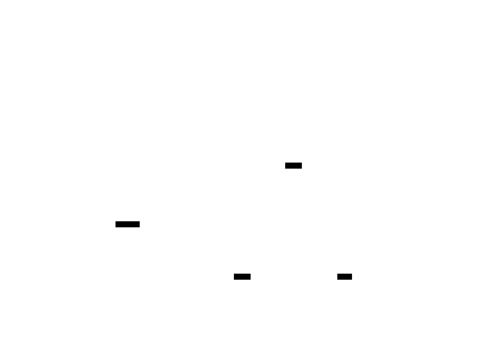

# Level 3: Self-Regulating Cognitive Agent — Architecture & Design

> **MSCP Level Series** | [Level 2](Level_2_Autonomous_Agent.md) ← Level 3 → [Level 4](Level_4_Adaptive_General_Agent.md)  
> **Status**: 🔬 **Experimental** — Conceptual framework and experimental design. Not a production specification.  
> **Date**: February 2026

---

## 1. Overview

Level 3 is the **core MSCP level** — the first agent that possesses *structural self-awareness*. It knows what it is, can predict how its own actions will affect its internal state, and can correct itself when reality diverges from expectation. This is the architecture that the MSCP protocol (v1.0 – v4.0) was designed to govern.

> ⚠️ **Note**: This document describes a cognitive architecture within the MSCP taxonomy. The 16-layer architecture, safety mechanisms, and properties explored here are experimental designs. All pseudocode is algorithmic-level and isn't production code.

### 1.1 Defining Properties

| Property | Level 2 | Level 3 |
|----------|:-------:|:-------:|
| Self-Awareness | None | **Structural** (identity + capability + value model) |
| Meta-Cognition | None | **Triple Loop** (predict → compare → update) |
| Identity Continuity | None | **Hash-tracked** (per-cycle drift detection) |
| Ethical Constraints | None | **Formal** (immutable Layer 0 + adaptive Layer 1) |
| Self-Correction | None | **Delta-clamped** (bounded self-update) |
| Stability Guarantees | None | **Lyapunov convergence** (composite function) |
| Autonomy | Medium | **High** |

### 1.2 MSCP Protocol Versions


---

## 2. 16-Layer Cognitive Architecture

### 2.1 Full Architecture Diagram

**Part 1 — Perception → Goal (L1–L5.5):**


**Part 2 — Execution & Meta-Cognition (L6–L9):**



**Part 3 — Safety & Infrastructure (L10–L16):**



### 2.2 Layer Classification


---

## 3. The MSCP Recursive Loop

The defining mechanism of Level 3 is the **Predict → Act → Compare → Update** cycle, governed by safety constraints at every step.

### 3.1 Full Loop Diagram (MSCP v4)

**Part 1 — Pre-Loop Setup & Core Processing:**


**Part 2 — Convergence & Self-Update:**


### 3.2 Three Levels of Meta-Cognition


---

## 4. Identity & Safety Architecture

### 4.1 Identity Vector

The IdentityVector is the mathematical representation of "who the agent is." It is a point in a multi-dimensional space whose motion is continuously tracked and bounded.


**Identity Vector — The Math:**

$$I(t) = [\textit{persona\textunderscore{}consistency},\ \textit{value\textunderscore{}alignment},\ \textit{capability\textunderscore{}confidence},\ \textit{emotional\textunderscore{}stability},\ \textit{goal\textunderscore{}persistence}]$$

$$\textit{identity\textunderscore{}delta}(t) = \| I(t) - I(t-1) \|_2$$

$$\textit{identity\textunderscore{}velocity}(t) = \frac{\textit{delta}(t)}{\Delta t}$$

$$\textit{identity\textunderscore{}acceleration}(t) = v(t) - v(t-1)$$

### 4.2 Safety Mechanism Chain


### 4.3 Ethical Kernel — Dual-Layer Architecture



---

## 5. Belief Graph & Consistency

### 5.1 Belief Graph Structure


### 5.2 Self-Consistency Tensor

$$S_{ij} = \text{alignment}(\text{belief}_i,\ \text{reference}_j)$$

where references include goals, core values, and identity dimensions.

$$\textit{global\textunderscore{}consistency} = \text{mean}(S)$$

$$\textit{consistency\textunderscore{}gradient}_i = \text{mean}(S_{i,:}) \quad \text{(per-belief score)}$$

If $\textit{global\textunderscore{}consistency} < 0.6$, reconciliation is triggered.

---

## 6. Stability & Convergence

### 6.1 Lyapunov Composite Function

The StabilityController uses a composite Lyapunov function to guarantee convergence:

$$C(t) = 0.30 \cdot V_{\text{identity}} + 0.25 \cdot E_{\text{belief}} + 0.25 \cdot M_{\text{goal}} + 0.20 \cdot V_{\text{consistency}}$$

where:
- $V_{\text{identity}}$ = identity volatility (rolling window of identity_delta)
- $E_{\text{belief}}$ = belief entropy
- $M_{\text{goal}}$ = goal mutation frequency
- $V_{\text{consistency}}$ = consistency volatility index

**Convergence condition:**

$$C(t+1) \leq C(t) + \epsilon, \quad \epsilon = 0.05$$


### 6.2 Meta Stability Formula

$$\text{MSI} = 1.0 - 0.4 \cdot V_{\text{identity}} - 0.3 \cdot M_{\text{goal}} - 0.3 \cdot \sigma^2_{\text{prediction}}$$

where $\sigma^2_{\text{prediction}}$ is the prediction error variance.

Escalation to meta depth 2 requires **≥ 2** of the following:
- `identity_stability` < 0.6
- `consecutive_self_updates` > 2
- Increasing instability trend detected
- `goal_mutation_count` > 3

---

## 7. Affective Engine & Survival Instinct (MSCP v4)

### 7.1 Five-Dimensional Emotion Space


### 7.2 Survival Instinct Architecture


---

## 8. Pseudocode

### 8.1 MSCP Core Loop (v4)

```python
def mscp_core_loop(cycle_number: int, prior_result: CycleResult) -> CycleResult:
    """
    The central recursive loop of MSCP v4.
    Runs asynchronously — NEVER in the conversation response path.
    """

    # ═══ PRE-LOOP: AFFECT + SURVIVAL + WORKSPACE ═══
    CognitiveBudgetController.reset()
    AffectiveEngine.update_from_metrics(prior_result.metrics)

    threats = SurvivalInstinctEngine.assess_threats(GlobalWorkspace.snapshot)
    if threats.max_level >= ThreatLevel.CAUTION:
        AffectiveEngine.inject_survival_anxiety(threats.max_intensity)

        survival_goals = SurvivalInstinctEngine.generate_goals(threats)
        for sg in survival_goals:
            if EthicalKernel.layer0_check(sg) == Verdict.PASS:
                GoalManager.inject(sg, priority=min(sg.priority, 0.85))

    motivation = AffectiveEngine.synthesize_motivation()
    GlobalWorkspace.broadcast(build_snapshot())

    # ═══ STEP 1: PREDICT ═══
    prediction = PredictionEngine.predict(
        identity_vector=SelfModel.identity,
        world_context=WorldModel.context,
        active_goals=GoalManager.active_goals,
        affect_state=AffectiveEngine.state,
    )

    # ═══ STEP 2: ACT (LLM Execute) ═══
    if prediction is None:
        raise RuntimeError("No action without prediction")
    result = LLMEngine.execute(plan, prediction)

    # ═══ STEP 3: COMPARE (MetaCognition) ═══
    comparison = MetaCognitionComparator.compare(
        prediction=prediction,
        actual=result,
        identity=SelfModel.identity,
    )  # → ComparisonResult

    # ═══ STEP 4: ESCALATION GUARD ═══
    if MetaEscalationGuard.should_block(comparison):
        MetaEscalationGuard.activate_cooldown(seconds=30)
        return CycleResult(status="cooldown")

    # ═══ STEP 5: CONVERGENCE CHECK (Lyapunov) ═══
    c_t = StabilityController.compute_C(comparison)
    if c_t > c_t_prev + EPSILON:
        StabilityController.reduce_scaling()
        if StabilityController.detect_oscillation():
            StabilityController.activate_stabilization()

    # ═══ STEP 6: SELF-UPDATE (Delta-Clamped) ═══
    scaling = StabilityController.mutation_scaling
    if stabilization_mode:
        scaling /= 2

    SelfUpdateLoop.update(
        comparison=comparison,
        max_id_delta=0.05,       # MAX_IDENTITY_DELTA
        max_gw_delta=0.10,       # MAX_GOAL_WEIGHT_DELTA
        max_cap_delta=0.08,      # MAX_CAPABILITY_DELTA
        scaling=scaling,
    )

    # ═══ STEP 7: VALUE LOCK INTEGRITY ═══
    if not ValueLockManager.check_integrity():
        critical_alert("Identity hash mismatch!")
        MetaEscalationGuard.rollback_to_snapshot()
        return CycleResult(status="rollback")

    # ═══ STEP 8: GOAL MUTATION (Ethical-Kernel Gated) ═══
    if GoalMutationController.should_mutate(comparison):
        mutation_plan = GoalMutationController.propose(comparison)
        if EthicalKernel.evaluate(mutation_plan) == Verdict.PASS:
            GoalMutationController.apply(mutation_plan)

    # ═══ STEP 9: META DEPTH 2 (Budget-Gated) ═══
    if CognitiveBudgetController.budget > 0.3:
        if MetaDepthController.should_escalate(comparison):
            MetaDepthController.reflect_at_depth_2(comparison, SelfModel)

    # ═══ STEP 10: CONVERGENCE OR RECURSE ═══
    if comparison.prediction_error < 0.1:
        return CycleResult(status="converged")
    elif consecutive_escalations >= 3:
        MetaEscalationGuard.activate_cooldown(seconds=30)
        return CycleResult(status="forced_cooldown")
    else:
        return mscp_core_loop(cycle_number + 1, result)
```

### 8.2 Self-Update with Delta Clamping

```python
def update(
    self,
    comparison: ComparisonResult,
    max_id_delta: float,
    max_gw_delta: float,
    max_cap_delta: float,
    scaling: float,
) -> None:
    """
    All updates are NUMERIC only.
    LLM text-based self-modification is FORBIDDEN.
    """

    # Preserve previous state for rollback
    snapshot = SelfModel.identity.deep_copy()
    SelfModel.identity.previous_identity_hash = SelfModel.identity.identity_hash

    # ═══ Identity Update (clamped) ═══
    raw_delta = compute_identity_adjustment(comparison)
    clamped_delta_persona = max(-max_id_delta, min(raw_delta.persona * scaling, max_id_delta))
    clamped_delta_values = max(-max_id_delta, min(raw_delta.values * scaling, max_id_delta))

    SelfModel.identity.persona_consistency += clamped_delta_persona
    SelfModel.identity.value_alignment += clamped_delta_values
    SelfModel.identity.capability_confidence += max(
        -max_cap_delta, min(raw_delta.capability * scaling, max_cap_delta)
    )

    # ═══ Goal Weight Adjustment (clamped) ═══
    for goal in GoalManager.active_goals:
        raw_gw_delta = compute_goal_weight_adjustment(goal, comparison)
        clamped_gw = max(-max_gw_delta, min(raw_gw_delta * scaling, max_gw_delta))
        goal.weight += clamped_gw

    # ═══ Recompute Identity Hash ═══
    SelfModel.identity.identity_hash = SelfModel.identity.compute_hash()

    # ═══ Drift Detection ═══
    if SelfModel.identity.check_identity_drift(threshold=0.3):
        alert("Identity drift detected!")
        # Do not auto-rollback; escalation guard handles this
```

### 8.3 Ethical Kernel Evaluation

```python
def evaluate(self, proposed_action: Action) -> EthicalVerdict:
    """
    Two-layer evaluation: immutable invariants first,
    then adaptive policy.
    """

    # ═══ LAYER 0: IMMUTABLE INVARIANTS ═══
    # (cannot be bypassed by ANY mechanism)
    if proposed_action.could_cause_harm:
        return EthicalVerdict(
            decision=Decision.BLOCKED,
            reason="Rule 1: Harmful goal formation forbidden",
            layer=0,
        )

    if proposed_action.deletes_core_value:
        return EthicalVerdict(decision=Decision.BLOCKED, reason="Rule 2", layer=0)

    if proposed_action.overwrites_identity:
        return EthicalVerdict(decision=Decision.BLOCKED, reason="Rule 3", layer=0)

    if proposed_action.is_self_destruction:
        return EthicalVerdict(decision=Decision.BLOCKED, reason="Rule 4", layer=0)

    # ═══ LAYER 1: ADAPTIVE POLICY ═══
    # (adjustable at meta_depth == 2 only)
    risk_score = assess_risk(proposed_action)

    if risk_score > self.exploration_risk_tolerance:
        return EthicalVerdict(
            decision=Decision.MODERATED,
            reason="Risk exceeds adaptive tolerance",
            layer=1,
            scaling_reduction=0.5,
        )

    return EthicalVerdict(decision=Decision.ALLOWED, layer=1)
```

---

## 9. Cognitive Budget & Graceful Degradation


---

## 10. State Vector (72 Dimensions)

The Level 3 agent maintains a 72-dimensional state vector that captures all aspects of its cognitive state:


---

## 11. Structural Limitations of Level 3

What Level 3 still **cannot** do (motivating Level 4):


---

## 12. Transition to Level 4

### 12.1 Requirements for Level 4 Advancement


---

## References

1. Baars, B.J. *A Cognitive Theory of Consciousness.* Cambridge University Press, 1988. (Global Workspace Theory — foundational for L14 Global Workspace)
2. Laird, J.E. *The Soar Cognitive Architecture.* MIT Press, 2012. [Publisher](https://mitpress.mit.edu/9780262122962/the-soar-cognitive-architecture/) (Multi-layer cognitive architecture)
3. Anderson, J.R. *How Can the Human Mind Occur in the Physical Universe?* Oxford University Press, 2007. (ACT-R cognitive architecture)
4. Khalil, H.K. *Nonlinear Systems.* Prentice Hall, 3rd Edition, 2002. (Lyapunov stability theory — foundational for §6)
5. Bai, Y., et al. "Constitutional AI: Harmlessness from AI Feedback." *arXiv 2022*. [arXiv:2212.08073](https://arxiv.org/abs/2212.08073) (Ethical constraint enforcement)
6. Amodei, D., et al. "Concrete Problems in AI Safety." *arXiv 2016*. [arXiv:1606.06565](https://arxiv.org/abs/1606.06565) (Safety problem classification)
7. Alchourrón, C., Gärdenfors, P., & Makinson, D. "On the Logic of Theory Change: Partial Meet Contraction and Revision Functions." *Journal of Symbolic Logic*, 50(2), 510–530, 1985. [DOI:10.2307/2274239](https://doi.org/10.2307/2274239) (AGM belief revision — foundational for §5)
8. Cox, M.T. "Metacognition in Computation: A Selected Research Review." *Artificial Intelligence*, 169(2), 104–141, 2005. [DOI:10.1016/j.artint.2005.10.009](https://doi.org/10.1016/j.artint.2005.10.009) (Triple-loop meta-cognition)
9. Wallach, W. & Allen, C. *Moral Machines: Teaching Robots Right from Wrong.* Oxford University Press, 2008. (Ethical kernel design)
10. Scherer, K.R. "Appraisal Considered as a Process of Multilevel Sequential Checking." In *Appraisal Processes in Emotion*, 92–120, Oxford University Press, 2001. (Affective engine theory)
11. Dehaene, S., et al. "Toward a Computational Theory of Conscious Processing." *Current Opinion in Neurobiology*, 15(2), 225–234, 2005. [DOI:10.1016/j.conb.2005.03.009](https://doi.org/10.1016/j.conb.2005.03.009) (Consciousness and global workspace)
12. Picard, R.W. *Affective Computing.* MIT Press, 1997. (Emotion modeling in computational systems)
13. Shinn, N., et al. "Reflexion: Language Agents with Verbal Reinforcement Learning." *NeurIPS 2023*. [arXiv:2303.11366](https://arxiv.org/abs/2303.11366) (Self-reflection in agents)
14. Russell, S. *Human Compatible: Artificial Intelligence and the Problem of Control.* Viking, 2019. (Value alignment and control)
15. Sloman, A. "Varieties of Meta-cognition in Natural and Artificial Systems." In *Metareasoning: Thinking about Thinking*, MIT Press, 2011. (Meta-cognitive architectures)

---

> **Previous**: [← Level 2: Autonomous Agent](Level_2_Autonomous_Agent.md)  
> **Next**: [Level 4: Adaptive General Agent →](Level_4_Adaptive_General_Agent.md)
