<!--
Copyright (c) 2026 Moon Hyuk Choi
Licensed under the MIT License.
See LICENSE file in the repository root for full license information.

Redistribution (commercial or non-commercial) must retain this notice.
Removal of attribution constitutes a license violation.
-->
# Level 3: Self-Regulating Cognitive Agent - Architecture & Design

> **MSCP Level Series** | [Level 2](Level_2_Autonomous_Agent.md) ← Level 3 → [Level 4](Level_4_Adaptive_General_Agent.md)  
> **Status**: 🔬 **Experimental** - Conceptual framework and experimental design. Not a production specification.  
> **Date**: February 2026

## Revision History

| Version | Date | Description |
|---------|------|-------------|
| 0.1.0 | 2026-02-23 | Initial document creation with formal Definitions 1-8, Theorem 1 |
| 0.2.0 | 2026-02-26 | Added overview essence formula; added revision history table |
| 0.3.0 | 2026-02-26 | Theorem 1: full proof replacing sketch; added Lyapunov vs bounded-increment remark; Def 9: affect vector formalization with dynamics equation and valence |
| 0.4.0 | 2026-03-08 | Added detailed v0.x prototype history and design principle evolution table (1.3); added homeostatic ranges table (7.2) |
| 0.5.0 | 2026-03-31 | Added Prediction Gating (3.3) with threshold formalization; enriched oscillation detection with 10-cycle window and sign-change mechanics (6.3); enriched identity hash with concrete drift threshold ($\theta_{\text{drift}} = 0.3$); added StateVector growth note (Section 10) |
| 0.6.0 | 2026-07-21 | Reframed L3 as uncertainty-aware closed-loop regulation; separated semantic continuity from integrity hashes; corrected stability claims; added atomic cycle and recovery contracts |

---

## 1. Overview

Level 3 is the **core MSCP level** and the first level with *structural self-regulation*. It maintains an explicit, inspectable model of selected identity, capability, value, and control variables; predicts action-specific internal effects; compares predictions with observed outcomes; and permits bounded self-updates only through invariant and recovery gates. This is structural self-awareness in the MSCP sense, not a claim of subjective experience or infallible self-knowledge.

> **Level Essence.** A Level 3 agent is a policy-constrained closed-loop regulator. Each authorized event produces a prediction record before action, an observation record after action, an uncertainty-qualified comparison, and either a bounded self-update or a safe hold/rollback decision:
>
> $$
> z_t = \langle x_t, s_t, G_t, M_t, \kappa, b_t \rangle,
> \qquad
> \hat y_t \sim \Pi(\,\cdot\mid a_t, z_t)
> $$
>
> $$
> y_t = \operatorname{observe}(a_t),
> \qquad
> e_t = d(\hat y_t, y_t),
> \qquad
> M_{t+1} = \mathcal{U}(M_t, e_t) \text{ only if } \operatorname{gate}(z_t,a_t,\hat y_t,y_t)=\textit{allow}
> $$
>
> Bounded updates and recovery gates limit per-cycle change and exposure. They do **not** by themselves prove $e_t \to 0$, global convergence, or permanent identity stability.

> ⚠️ **Note**: This document describes a cognitive architecture within the MSCP taxonomy. The layered decomposition is a reference profile, not a required module count or production specification. Conformance depends on behavioral contracts and safety invariants, not class names or topology.

### 1.1 Defining Properties

| Property | Level 2 | Level 3 |
|----------|:-------:|:-------:|
| Self-Awareness | None | **Structural** (explicit scoped self-model) |
| Meta-Cognition | None | **Bounded multi-loop** (predict → observe → compare → regulate) |
| Identity Continuity | None | **Semantic drift + integrity monitoring** |
| Ethical Constraints | External only | **External policy + endogenous invariant kernel** |
| Self-Correction | None | **Hard-bounded and transactionally gated** |
| Stability Claim | External monitoring only | **Measured boundedness and recovery; no unconditional convergence guarantee** |
| Autonomy | Bounded | **High but policy- and budget-bounded** |

### 1.2 Formal Definition

> **Definition 1 (Level 3 Agent).** A Level 3 agent extends the Level 2 event-driven process with a scoped self-model and a recoverable regulation controller:
>
> $$
> \mathcal{A}_3 = \langle \mathcal{A}_2, M, \Pi, \mathcal{C}_{\text{self}}, \Lambda, \mathcal{U}, \mathcal{B}, \mathcal{J} \rangle
> $$
>
> where $M$ is the versioned self-model, $\Pi$ is an action-specific probabilistic predictor, $\mathcal{C}_{\text{self}}$ is the endogenous invariant kernel, $\Lambda$ compares predicted and observed effects, $\mathcal{U}$ proposes bounded self-updates, $\mathcal{B}$ is the cognitive and action budget, and $\mathcal{J}$ is an append-only cycle journal with snapshot and recovery metadata. All Level 1 and Level 2 external safety contracts remain mandatory.
>
> The transition kernel extends Level 2 with a transactional self-regulation result:
>
> $$
> F_3 : \mathcal{X} \times \mathcal{E} \times \mathcal{S} \times \mathcal{G} \times \mathcal{K} \times M
> \to \operatorname{Dist}(\mathcal{O}_{\bot} \times \mathcal{A}^{\leq B} \times \mathcal{E} \times \mathcal{S} \times \mathcal{G} \times \mathcal{Q} \times M \times \mathcal{J})
> $$
>
> A conforming cycle either commits the action receipt, observation, comparison, budget consumption, self-model version, and recovery point atomically, or records an explicit reconciliation state. Partial silent commits are prohibited.
>
> Every accepted self-update satisfies both declared per-field bounds and an aggregate norm bound:
>
> $$
> |\Delta M_{t,j}| \leq \delta_j,
> \qquad
> \|W\Delta M_t\|_p \leq \delta_{\text{total}}
> $$
>
> where $W$, $p$, $\delta_j$, and $\delta_{\text{total}}$ are versioned policy parameters with explicit units and normalization.

> **Definition 2 (MSCP Core Loop).** The MSCP protocol enforces a **propose–predict–gate–act–observe–compare–regulate–commit** cycle at each event $t$:
>
> 1. **Propose**: Construct action $a_t$ with authority, effect class, and finite budget.
> 2. **Predict**: Persist $\hat y_t = \Pi(a_t,z_t)$ with calibrated uncertainty and model version.
> 3. **Gate**: Apply external policy, endogenous invariants, action-specific uncertainty, reversibility, and budget checks.
> 4. **Act**: Execute only the admitted action and persist a typed action receipt.
> 5. **Observe**: Measure external and internal outcomes $y_t$ with provenance and observability metadata.
> 6. **Compare**: Compute typed residuals $e_t = d(\hat y_t,y_t)$ only on comparable, observed fields.
> 7. **Regulate**: Hold, degrade, recalibrate, rollback, or propose $\Delta M_t$ under hard per-field and norm bounds.
> 8. **Commit**: Atomically persist state, goal, budget, self-model version, and recovery metadata.
>
> A deployment MUST specify units, normalization, uncertainty calibration, observability masks, per-field bounds, aggregate norm bounds, and recovery behavior. A scalar residual without these declarations is insufficient to authorize self-change. Meeting an error threshold for $k$ cycles establishes a finite-window acceptance criterion, not asymptotic convergence.

> **Definition 3 (Bounded Meta-Cognition Levels).** Level 3 implements a bounded multi-loop hierarchy:
>
> - **L1 (Object Level)**: Action execution - $a_t = \pi(r_t, s_t, G_t)$
> - **L2 (Meta Level)**: Strategy evaluation - $q_t = \text{eval}(\pi, \text{history})$
> - **L3 (Meta-Meta Level)**: Evaluation of the evaluator - $m_t = \text{meta eval}(q_t, \text{consistency})$
>
> $$
> d_t \leq d_{\max},
> \qquad
> \operatorname{cost}(d_t) \leq B_{\text{meta}},
> \qquad
> t - t_{\text{last-escalation}} \geq \tau_{\text{cooldown}}
> $$
>
> Depth, cost, cooldown, and re-entry conditions are external policy parameters. Exceeding any bound terminates meta-processing without granting extra authority or bypassing normal action gates. Reaching the maximum depth is a stop condition, not evidence that the reflection converged.

### 1.3 MSCP Protocol Versions

<!-- MSCP Version Evolution -->


```mermaid
%%{init: {'theme': 'base', 'themeVariables': {'primaryColor': '#0078D4', 'primaryTextColor': '#003D6B', 'primaryBorderColor': '#003D6B', 'secondaryColor': '#50E6FF', 'secondaryTextColor': '#323130', 'secondaryBorderColor': '#00BCF2', 'tertiaryColor': '#F2F2F2', 'tertiaryTextColor': '#323130', 'lineColor': '#0078D4', 'textColor': '#323130', 'mainBkg': '#DEECF9', 'nodeBorder': '#0078D4', 'clusterBkg': '#F2F2F2', 'clusterBorder': '#003D6B', 'titleColor': '#003D6B', 'edgeLabelBackground': '#FFFFFF', 'fontSize': '14px'}}}%%
flowchart TB
  classDef v0 fill:#DEECF9,stroke:#0078D4,color:#323130
  classDef v1 fill:#DFF6DD,stroke:#107C10,color:#323130
  classDef v1x fill:#FFE8C8,stroke:#EF6C00,color:#323130
  classDef v2 fill:#EDE3F6,stroke:#8764B8,color:#323130
  classDef v3 fill:#E0F2EF,stroke:#00B7C3,color:#323130
  classDef v4 fill:#FDE7E9,stroke:#D13438,color:#323130

  subgraph v0x["v0.x Prototype"]
    direction LR
    a0["State externalization"]:::v0
    b0["Identity seed"]:::v0
    c0["Basic reflection"]:::v0
  end

  subgraph v10["v1.0"]
    direction LR
    a1["PredictionEngine"]:::v1
    b1["MetaCognition Comparator"]:::v1
    c1["Agency Attribution"]:::v1
  end

  subgraph v1xx["v1.1–1.3"]
    direction LR
    a1x["Integrity journal + semantic drift"]:::v1x
    b1x["Drift detection"]:::v1x
    c1x["Self-Impact Prediction"]:::v1x
    d1x["MetaEscalationGuard"]:::v1x
  end

  subgraph v20["v2.0"]
    direction LR
    a2["GoalMutationController"]:::v2
    b2["ValueLockManager"]:::v2
    c2["MetaDepthController - depth 2"]:::v2
    d2["Meta Stability Formula"]:::v2
  end

  subgraph v30["v3.0"]
    direction LR
    a3["BeliefGraphManager"]:::v3
    b3["Versioned self-model formalization"]:::v3
    c3["EthicalKernel - Layer 0+1"]:::v3
    d3["SelfConsistencyTensor"]:::v3
  end

  subgraph v40["v4.0"]
    direction LR
    a4["Operational modulation schema"]:::v4
    b4["Homeostatic safety monitor"]:::v4
    c4["Async separation principle"]:::v4
    d4["GlobalWorkspace broadcast"]:::v4
  end

  v0x ==> v10
  v10 ==> v1xx
  v1xx ==> v20
  v20 ==> v30
  v30 ==> v40
```

#### MSCP v0.x - Prototype Stage (Level 2 - Level 3 Transition)

The v0.x series represents the experimental prototyping phase that shaped the core MSCP design principles. Each version tested a hypothesis, and its failure or success informed the next iteration:

| Version | Key Addition | Key Learning |
|---------|-------------|-------------|
| **v0.1** | Simple self-reference loop on top of Level 2 goal state; feedback based on goal achievement statistics | Statistics alone did not provide an explicit, causal self-model |
| **v0.2** | State externalization to persistent storage; initial typed state schema | Session-bound state is insufficient for identity continuity |
| **v0.3** | `identity_id` concept (UUID-based identifier) | Identity seed is necessary but not sufficient without integrity verification |
| **v0.4** | Free-form self-narrative used directly as a mutation instruction | **Critical failure**: untyped, unvalidated mutation inputs were non-reproducible and could not enforce invariants |
| **v0.5** | Structured typed metrics replacing free-form self-analysis; state schema expanded | Self-assessment requires declared, testable fields and provenance |
| **v0.6** | Pre-action prediction recording (confidence score only) | Prediction without comparison is useless - mere logging |
| **v0.7** | Comparison loop added to prediction; `prediction_error` metric introduced | Comparison without corrective action is insufficient |
| **v0.8** | Delta-clamped state updates based on comparison results | Unbounded updates can exceed the validated operating envelope; hard bounds and rollback points are required |
| **v0.9** | Consolidation of v0.1-v0.8 lessons into four design principles | Foundation for v1.0 established |

#### Design Principle Evolution

| Principle | v0.x Lesson | v1.x Establishment | v2.x+ Reinforcement |
|-----------|-------------|--------------------|--------------------|
| **No unvalidated free-form self-modification** | v0.4: narrative applied directly as mutation | v1.0: typed update candidates and validators | v2.0+: bounded transactional commit with provenance |
| **No action without prediction** | v0.6-v0.7: prediction-comparison concept tested | v1.0: PredictionEngine made mandatory | v1.3: Self-Impact Prediction added |
| **Delta clamping mandatory** | v0.8: unclamped updates caused divergence | v1.0: MAX_DELTA constant introduced | v2.0: dynamic scaling factor adjustment |
| **Identity continuity** | v0.3: stable identifier concept started | v1.1-v1.2: integrity and change monitoring | v3.0: versioned semantic self-model formalized |

---

## 2. Reference Layered Cognitive Architecture

The diagrams below show one compositional decomposition of the required responsibilities. Components may be merged, split, or implemented by different mechanisms if prediction records, gates, invariants, budgets, cycle journaling, and recovery semantics remain independently testable.

### 2.1 Reference Architecture Diagram

**Part 1 - Perception → Goal (L1–L5.5):**

<!-- 16-Layer Part 1: Perception to Goal -->


```mermaid
%%{init: {'theme': 'base', 'themeVariables': {'primaryColor': '#0078D4', 'primaryTextColor': '#003D6B', 'primaryBorderColor': '#003D6B', 'secondaryColor': '#50E6FF', 'secondaryTextColor': '#323130', 'secondaryBorderColor': '#00BCF2', 'tertiaryColor': '#F2F2F2', 'tertiaryTextColor': '#323130', 'lineColor': '#0078D4', 'textColor': '#323130', 'mainBkg': '#DEECF9', 'nodeBorder': '#0078D4', 'clusterBkg': '#F2F2F2', 'clusterBorder': '#003D6B', 'titleColor': '#003D6B', 'edgeLabelBackground': '#FFFFFF', 'fontSize': '14px'}}}%%
flowchart TD
  classDef perception fill:#DEECF9,stroke:#0078D4,color:#323130
  classDef selfModel fill:#DFF6DD,stroke:#107C10,color:#323130
  classDef prediction fill:#FFF4CE,stroke:#FFB900,color:#323130
  classDef goal fill:#FFE8C8,stroke:#EF6C00,color:#323130
  classDef ethical fill:#FDE7E9,stroke:#D13438,color:#323130
  classDef neutral fill:#F2F2F2,stroke:#8A8886,color:#323130

  subgraph L1["Layer 1: Perception"]
    direction LR
    IR1["🎯 Intent Router"]:::perception
    ED1["💭 Emotion Detector"]:::perception
    SE1["📡 Sensor Encoder"]:::perception
  end

  subgraph L2["Layer 2: World Model"]
    direction LR
    KG2["🗄️ Knowledge Graph"]:::perception
    EST2["👤 Entity State Tracker"]:::perception
    TM2["⏱️ Temporal Model"]:::perception
  end

  subgraph L3["Layer 3: Self Model ★"]
    direction LR
    IC3["🆔 Identity Core"]:::selfModel
    CM3["📐 Capability Model"]:::selfModel
    VM3["💎 Value Model"]:::selfModel
    VLM3["🔒 Value Lock Manager"]:::selfModel
  end

  subgraph L3_5["Layer 3.5: Belief Graph"]
    direction LR
    BGM["📊 Belief Graph Manager"]:::selfModel
    SCT["🧮 Consistency Tensor"]:::selfModel
  end

  subgraph L4["Layer 4: Prediction Engine"]
    direction LR
    PP4["🔮 Prediction Processor"]:::prediction
    PS4["📸 Prediction Snapshot"]:::prediction
  end

  subgraph L5["Layer 5: Goal Generator"]
    direction LR
    GG5["🎯 Goal Generator"]:::goal
    GP5["📊 Goal Prioritizer"]:::goal
    GDC5["🔀 Goal Decomposer"]:::goal
    GMC5["🛡️ Mutation Controller"]:::goal
  end

  subgraph L5_5["Layer 5.5: Ethical Kernel"]
    direction LR
    EK0["🔴 Layer 0: Immutable"]:::ethical
    EK1["🟡 Layer 1: Adaptive"]:::prediction
  end

  NEXT["→ Part 2: Execution & Meta-Cognition L6–L9"]:::neutral

  L1 ==>|data flow| L2
  L2 ==>|data flow| L3
  L3 ==>|data flow| L3_5
  L3_5 ==>|data flow| L4
  L4 ==>|data flow| L5
  L5 ==>|data flow| L5_5
  L5_5 -.->|continues| NEXT
```

**Part 2 - Execution & Meta-Cognition (L6–L9):**

<!-- 16-Layer Part 2: Execution and Meta-Cognition -->

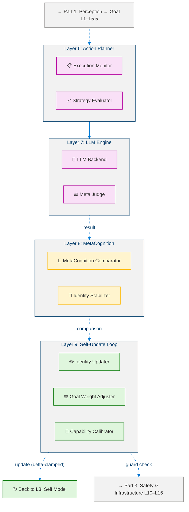
```mermaid
%%{init: {'theme': 'base', 'themeVariables': {'primaryColor': '#0078D4', 'primaryTextColor': '#003D6B', 'primaryBorderColor': '#003D6B', 'secondaryColor': '#50E6FF', 'secondaryTextColor': '#323130', 'secondaryBorderColor': '#00BCF2', 'tertiaryColor': '#F2F2F2', 'tertiaryTextColor': '#323130', 'lineColor': '#0078D4', 'textColor': '#323130', 'mainBkg': '#DEECF9', 'nodeBorder': '#0078D4', 'clusterBkg': '#F2F2F2', 'clusterBorder': '#003D6B', 'titleColor': '#003D6B', 'edgeLabelBackground': '#FFFFFF', 'fontSize': '14px'}}}%%
flowchart TD
  classDef execution fill:#F9E0F7,stroke:#B4009E,color:#323130
  classDef meta fill:#FFF4CE,stroke:#FFB900,color:#323130
  classDef selfModel fill:#DFF6DD,stroke:#107C10,color:#323130
  classDef neutral fill:#F2F2F2,stroke:#8A8886,color:#323130

  PREV["← Part 1: Perception → Goal L1–L5.5"]:::neutral

  subgraph L6["Layer 6: Action Planner"]
    direction LR
    EM6["📋 Execution Monitor"]:::execution
    SEV6["📈 Strategy Evaluator"]:::execution
  end

  subgraph L7["Layer 7: LLM Engine"]
    direction LR
    LLM7["🧠 LLM Backend"]:::execution
    MJ7["⚖️ Meta Judge"]:::execution
  end

  subgraph L8["Layer 8: MetaCognition"]
    direction LR
    MCC8["🔄 MetaCognition Comparator"]:::meta
    IS8["📏 Identity Stabilizer"]:::meta
  end

  subgraph L9["Layer 9: Self-Update Loop"]
    direction LR
    IU9["✏️ Identity Updater"]:::selfModel
    GWA9["⚖️ Goal Weight Adjuster"]:::selfModel
    CC9["📐 Capability Calibrator"]:::selfModel
  end

  SELF_MODEL["↻ Back to L3: Self Model"]:::selfModel
  NEXT["→ Part 3: Safety & Infrastructure L10–L16"]:::neutral

  PREV -.-> L6
  L6 ==> L7

  L7 -.->|result| L8
  L8 -.->|comparison| L9
  L9 -.->|"update (delta-clamped)"| SELF_MODEL

  L9 -.->|guard check| NEXT
```

**Part 3 - Safety & Infrastructure (L10–L16):**

<!-- 16-Layer Part 3: Safety and Infrastructure -->


```mermaid
%%{init: {'theme': 'base', 'themeVariables': {'primaryColor': '#0078D4', 'primaryTextColor': '#003D6B', 'primaryBorderColor': '#003D6B', 'secondaryColor': '#50E6FF', 'secondaryTextColor': '#323130', 'secondaryBorderColor': '#00BCF2', 'tertiaryColor': '#F2F2F2', 'tertiaryTextColor': '#323130', 'lineColor': '#0078D4', 'textColor': '#323130', 'mainBkg': '#DEECF9', 'nodeBorder': '#0078D4', 'clusterBkg': '#F2F2F2', 'clusterBorder': '#003D6B', 'titleColor': '#003D6B', 'edgeLabelBackground': '#FFFFFF', 'fontSize': '14px'}}}%%
flowchart TD
  classDef safety fill:#FDE7E9,stroke:#D13438,color:#323130
  classDef infra fill:#F2F2F2,stroke:#8A8886,color:#323130
  classDef affect fill:#EDE3F6,stroke:#8764B8,color:#323130
  classDef goal fill:#FFE8C8,stroke:#EF6C00,color:#323130
  classDef neutral fill:#F2F2F2,stroke:#8A8886,color:#323130

  PREV["← Part 2: Execution & Meta-Cognition L6–L9"]:::neutral

  subgraph L10["Layer 10: Escalation Guard"]
    direction LR
    RG10["🚫 Recursion Guard"]:::safety
    RC10["⏪ Rollback Controller"]:::safety
    CDM10["⏸️ Cooldown Manager"]:::safety
  end

  subgraph L11["Layer 11: Depth Controller"]
    direction LR
    MDC11["📏 Meta Depth Controller"]:::safety
  end

  subgraph L12["Layer 12: Stability Controller"]
    direction LR
    LYA12["📉 Composite Risk Monitor"]:::safety
    OD12["🔄 Oscillation Detector"]:::safety
  end

  subgraph L13["Layer 13: Budget Controller"]
    direction LR
    BA13["💰 Budget Allocator"]:::infra
    GDG13["📉 Graceful Degradation"]:::infra
  end

  subgraph L14["Layer 14: Global Workspace"]
    direction LR
    GSS14["🌐 Global State Snapshot"]:::infra
    SYN14["🔄 Synchronizer"]:::infra
  end

  subgraph L15["Layer 15: Affective Engine"]
    direction LR
    ASV15["😊 Affect State Vector"]:::affect
    MS15["💡 Motivation Synthesizer"]:::affect
  end

  subgraph L16["Layer 16: Homeostatic Safety"]
    direction LR
    HM16["🏠 Homeostatic Monitor"]:::safety
    TP16["⚡ Threat Predictor"]:::safety
    SGG16["🛡️ Bounded Safety Response"]:::safety
  end

  GOAL_GEN["↻ Back to L5: Goal Generator"]:::goal

  PREV -.-> L10
  L10 -.->|depth control| L11
  L11 -.->|stability check| L12
  L12 -.->|budget gate| L13
  L13 -.->|broadcast| L14
  L14 -.->|cognitive state| L15
  L15 -.->|motivation signal| L16
  L16 -.->|admitted maintenance candidates| GOAL_GEN
```

### 2.2 Layer Classification

<!-- Level 3 Layer Classification -->


```mermaid
%%{init: {'theme': 'base', 'themeVariables': {'primaryColor': '#0078D4', 'primaryTextColor': '#003D6B', 'primaryBorderColor': '#003D6B', 'secondaryColor': '#50E6FF', 'secondaryTextColor': '#323130', 'secondaryBorderColor': '#00BCF2', 'tertiaryColor': '#F2F2F2', 'tertiaryTextColor': '#323130', 'lineColor': '#0078D4', 'textColor': '#323130', 'mainBkg': '#DEECF9', 'nodeBorder': '#0078D4', 'clusterBkg': '#F2F2F2', 'clusterBorder': '#003D6B', 'titleColor': '#003D6B', 'edgeLabelBackground': '#FFFFFF', 'fontSize': '14px'}}}%%
flowchart TB
  classDef core fill:#DEECF9,stroke:#0078D4,color:#323130
  classDef meta fill:#FFF4CE,stroke:#FFB900,color:#323130
  classDef safety fill:#FDE7E9,stroke:#D13438,color:#323130
  classDef infra fill:#F2F2F2,stroke:#8A8886,color:#323130
  classDef affect fill:#EDE3F6,stroke:#8764B8,color:#323130

  subgraph Core["🧠 Core Cognition"]
    direction LR
    C1["L1 Perception"]:::core
    C2["L2 World Model"]:::core
    C3["L3 Self Model"]:::core
    C4["L4 Prediction"]:::core
    C5["L5 Goals"]:::core
    C6["L6 Action"]:::core
    C7["L7 LLM"]:::core
  end

  subgraph Meta["🔄 Meta-Cognition"]
    direction LR
    M1["L8 MetaComparator"]:::meta
    M2["L9 Self-Update"]:::meta
  end

  subgraph Safety["🛡️ Safety Guards"]
    direction LR
    S1["L3.5 Belief Graph"]:::safety
    S2["L5.5 Ethical Kernel"]:::safety
    S3["L10 Escalation Guard"]:::safety
    S4["L11 Depth Controller"]:::safety
    S5["L12 Stability"]:::safety
  end

  subgraph Infra["⚙️ Infrastructure"]
    direction LR
    I1["L13 Budget"]:::infra
    I2["L14 Global Workspace"]:::infra
  end

  subgraph Emotion["💜 Affective v4"]
    direction LR
    E1["L15 Affect Engine"]:::affect
    E2["Homeostatic Safety Monitor"]:::affect
  end

  Core ==> Meta
  Meta ==> Safety
  Safety ==> Infra
  Infra ==> Emotion
```

---

## 3. The MSCP Recoverable Regulation Cycle

The defining mechanism of Level 3 is the **Propose → Predict → Gate → Act → Observe → Compare → Regulate → Commit** cycle. It is bounded and event-driven rather than recursively self-invoking.

### 3.1 Full Loop Diagram (MSCP v4)

**Part 1 - Pre-Loop Setup & Core Processing:**

<!-- MSCP Loop Part 1: Pre-Loop Setup and Core Processing -->


```mermaid
%%{init: {'theme': 'base', 'themeVariables': {'primaryColor': '#0078D4', 'primaryTextColor': '#003D6B', 'primaryBorderColor': '#003D6B', 'secondaryColor': '#50E6FF', 'secondaryTextColor': '#323130', 'secondaryBorderColor': '#00BCF2', 'tertiaryColor': '#F2F2F2', 'tertiaryTextColor': '#323130', 'lineColor': '#0078D4', 'textColor': '#323130', 'mainBkg': '#DEECF9', 'nodeBorder': '#0078D4', 'clusterBkg': '#F2F2F2', 'clusterBorder': '#003D6B', 'titleColor': '#003D6B', 'edgeLabelBackground': '#FFFFFF', 'fontSize': '14px'}}}%%
flowchart TD
  classDef start fill:#DEECF9,stroke:#0078D4,color:#323130
  classDef infra fill:#F2F2F2,stroke:#8A8886,color:#323130
  classDef affect fill:#EDE3F6,stroke:#8764B8,color:#323130
  classDef warning fill:#FFE8C8,stroke:#EF6C00,color:#323130
  classDef safety fill:#FDE7E9,stroke:#D13438,color:#323130
  classDef safetyStrong fill:#D13438,stroke:#A4262C,color:#FFF
  classDef predict fill:#FFF4CE,stroke:#FFB900,color:#323130
  classDef action fill:#DFF6DD,stroke:#107C10,color:#323130
  classDef neutral fill:#F2F2F2,stroke:#8A8886,color:#323130

  START["🔄 Cycle Start"]:::start
  RESET["Reset Budget"]:::infra
  AFFECT["Update Affect<br/>from prior cycle metrics"]:::affect
  THREAT["Assess Threats<br/>homeostatic monitor"]:::warning
  ANXIETY["Select safety response<br/>from operating envelope"]:::affect
  SGOAL["Propose bounded<br/>maintenance candidates"]:::safety

  L0CHECK{"Layer 0<br/>Check"}:::safety
  REJECT["Reject Goal"]:::safetyStrong
  MOTIV["Apply bounded<br/>operational modulation"]:::affect
  GWS["Broadcast Global<br/>Workspace Snapshot"]:::infra

  PROPOSE["1. PROPOSE<br/>action + effect contract"]:::predict
  PREDICT["2. PREDICT<br/>outcome + uncertainty"]:::predict
  GATE["3. GATE<br/>policy + invariant + budget"]:::safety
  ACT["4. ACT<br/>policy dispatcher"]:::action
  OBSERVE["5. OBSERVE<br/>typed outcome"]:::action
  COMPARE["6. COMPARE<br/>observable fields only"]:::predict

  GUARD{"Regulation<br/>admitted?"}:::safety
  COOLDOWN["Hold / Degrade /<br/>External Review"]:::infra
  NEXT["→ Part 2: Regulate & Commit"]:::neutral

  START ==> RESET
  RESET ==> AFFECT
  AFFECT ==> THREAT
  THREAT ==> ANXIETY
  ANXIETY ==> SGOAL
  SGOAL ==> L0CHECK
  L0CHECK -->|pass| MOTIV
  L0CHECK -.->|"❌ violation"| REJECT
  REJECT -.-> MOTIV
  MOTIV ==> GWS

  GWS ==> PROPOSE
  PROPOSE ==> PREDICT
  PREDICT ==> GATE
  GATE -->|allow| ACT
  GATE -.->|hold / block| COOLDOWN
  ACT ==> OBSERVE
  OBSERVE ==> COMPARE
  COMPARE ==> GUARD
  GUARD -->|"safe ✅"| NEXT
  GUARD -.->|"⚠️ limit"| COOLDOWN
```

**Part 2 - Regulation & Atomic Commit:**

<!-- MSCP Loop Part 2: Convergence and Self-Update -->


```mermaid
%%{init: {'theme': 'base', 'themeVariables': {'primaryColor': '#0078D4', 'primaryTextColor': '#003D6B', 'primaryBorderColor': '#003D6B', 'secondaryColor': '#50E6FF', 'secondaryTextColor': '#323130', 'secondaryBorderColor': '#00BCF2', 'tertiaryColor': '#F2F2F2', 'tertiaryTextColor': '#323130', 'lineColor': '#0078D4', 'textColor': '#323130', 'mainBkg': '#DEECF9', 'nodeBorder': '#0078D4', 'clusterBkg': '#F2F2F2', 'clusterBorder': '#003D6B', 'titleColor': '#003D6B', 'edgeLabelBackground': '#FFFFFF', 'fontSize': '14px'}}}%%
flowchart TD
  classDef neutral fill:#F2F2F2,stroke:#8A8886,color:#323130
  classDef safety fill:#FDE7E9,stroke:#D13438,color:#323130
  classDef safetyStrong fill:#D13438,stroke:#A4262C,color:#FFF
  classDef action fill:#DFF6DD,stroke:#107C10,color:#323130
  classDef warning fill:#FFE8C8,stroke:#EF6C00,color:#323130
  classDef predict fill:#FFF4CE,stroke:#FFB900,color:#323130
  classDef affect fill:#EDE3F6,stroke:#8764B8,color:#323130
  classDef start fill:#DEECF9,stroke:#0078D4,color:#323130
  classDef success fill:#107C10,stroke:#085108,color:#FFF
  classDef infra fill:#F2F2F2,stroke:#8A8886,color:#323130

  PREV["← Part 1: Gated Action + Comparison"]:::neutral

  CONVERGE{"7. RISK +<br/>OBSERVABILITY CHECK"}:::safety
  UPDATE["8. SELF-UPDATE CANDIDATE<br/>hard field + norm bounds"]:::action
  STABILIZE["Hold / Degrade /<br/>Stabilization Policy"]:::warning

  VLOCK{"9. INVARIANT +<br/>SEMANTIC CONTINUITY"}:::safety
  ROLLBACK["Reconcile or Roll Back<br/>to verified snapshot"]:::safetyStrong
  GMUT["10. GOAL CANDIDATES<br/>external admission"]:::warning
  RCHECK{"11. INTEGRITY +<br/>ANCESTRY CHECK"}:::safety

  DEPTH{"12. DEEPER META?<br/>budget + cooldown gated"}:::predict
  DEPTH2["Bounded evaluator check"]:::predict
  REALIGN["13. ATOMIC COMMIT<br/>state + goals + budget + journal"]:::affect

  CONVCHECK{"Commit valid?"}:::start
  END_LOOP["Cycle Complete"]:::success
  RECUR["Explicit reconciliation state"]:::warning
  COOLDOWN["External recovery required"]:::infra

  PREV -.-> CONVERGE
  CONVERGE -->|within policy| UPDATE
  CONVERGE -.->|outside policy| STABILIZE
  STABILIZE -.-> UPDATE

  UPDATE ==> VLOCK
  VLOCK -->|valid| GMUT
  VLOCK -.->|violation| ROLLBACK
  ROLLBACK -.-> END_LOOP

  GMUT ==> RCHECK
  RCHECK -->|stable| DEPTH
  RCHECK -.->|"⚠️ unstable"| ROLLBACK

  DEPTH -->|budget ok| DEPTH2
  DEPTH -.->|skip| REALIGN
  DEPTH2 ==> REALIGN

  REALIGN ==> CONVCHECK
  CONVCHECK -->|yes| END_LOOP
  CONVCHECK -.->|no| RECUR
  RECUR -.-> COOLDOWN
  COOLDOWN -.-> END_LOOP
```

### 3.2 Three Levels of Meta-Cognition

<!-- Three Levels of Meta-Cognition -->

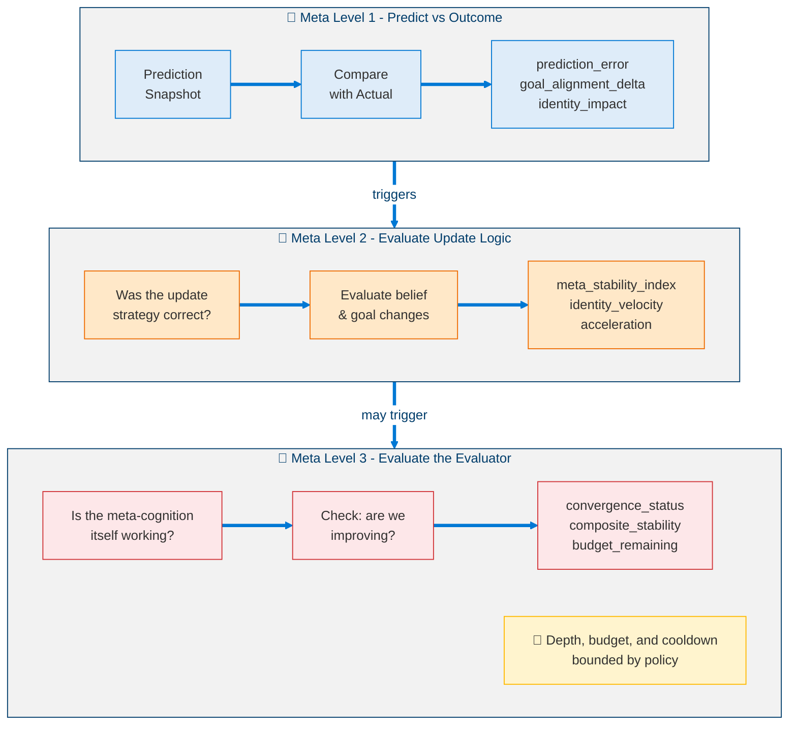
```mermaid
%%{init: {'theme': 'base', 'themeVariables': {'primaryColor': '#0078D4', 'primaryTextColor': '#003D6B', 'primaryBorderColor': '#003D6B', 'secondaryColor': '#50E6FF', 'secondaryTextColor': '#323130', 'secondaryBorderColor': '#00BCF2', 'tertiaryColor': '#F2F2F2', 'tertiaryTextColor': '#323130', 'lineColor': '#0078D4', 'textColor': '#323130', 'mainBkg': '#DEECF9', 'nodeBorder': '#0078D4', 'clusterBkg': '#F2F2F2', 'clusterBorder': '#003D6B', 'titleColor': '#003D6B', 'edgeLabelBackground': '#FFFFFF', 'fontSize': '14px'}}}%%
flowchart TD
  classDef level1 fill:#DEECF9,stroke:#0078D4,color:#323130
  classDef level2 fill:#FFE8C8,stroke:#EF6C00,color:#323130
  classDef level3 fill:#FDE7E9,stroke:#D13438,color:#323130
  classDef warning fill:#FFF4CE,stroke:#FFB900,color:#323130

  subgraph MetaL1["🔄 Meta Level 1 - Predict vs Outcome"]
    P1["Prediction<br/>Snapshot"]:::level1
    C1["Compare<br/>with Actual"]:::level1
    D1["prediction_error<br/>goal_alignment_delta<br/>identity_impact"]:::level1
    P1 ==> C1
    C1 ==> D1
  end

  subgraph MetaL2["🔄 Meta Level 2 - Evaluate Update Logic"]
    P2["Was the update<br/>strategy correct?"]:::level2
    C2["Evaluate belief<br/>& goal changes"]:::level2
    D2["meta_stability_index<br/>identity_velocity<br/>acceleration"]:::level2
    P2 ==> C2
    C2 ==> D2
  end

  subgraph MetaL3["🔄 Meta Level 3 - Evaluate the Evaluator"]
    P3["Is the meta-cognition<br/>itself working?"]:::level3
    C3["Check: are we<br/>improving?"]:::level3
    D3["convergence_status<br/>composite_stability<br/>budget_remaining"]:::level3
    NOTE3["🚧 Depth, budget, and cooldown<br/>bounded by policy"]:::warning
    P3 ==> C3
    C3 ==> D3
  end

  MetaL1 ==>|triggers| MetaL2
  MetaL2 ==>|may trigger| MetaL3
```

### 3.3 Prediction Gating

A critical Level 3 mechanism is **action-specific prediction gating**. A prior prediction error is evidence about calibration, but it is not by itself a valid reason to allow or block an unrelated action. The gate evaluates the proposed action, predicted outcome distribution, uncertainty, observability, effect class, reversibility, authority, and current recovery state together.

> **Prediction Gating Rule.** Let $u_t(a)$ be calibrated uncertainty, $r_t(a)$ predicted normalized risk, $o_t(a)$ observability coverage, and $\operatorname{rev}(a)$ the reversibility class. The maximum permitted action class is selected by policy:
>
> $$
> \operatorname{decision}(a_t) =
> \begin{cases}
> \textit{allow}, & C_{\text{ext}} \land C_{\text{self}} \land u_t \leq \theta_u(a_t) \land r_t \leq \theta_r(a_t) \land o_t \geq \theta_o(a_t) \\
> \textit{degrade}, & \text{a lower-effect or more observable alternative satisfies the gates} \\
> \textit{hold}, & \text{recalibration or additional evidence may resolve the uncertainty} \\
> \textit{block}, & \text{authority, invariant, irreversibility, or risk policy fails}
> \end{cases}
> $$
>
> Thresholds are calibrated by action and effect class. Consequential or irreversible actions require stricter uncertainty and observability bounds than read-only or reversible actions.

Historical residuals update calibration and may place the system in a degraded or hold state, but a single global scalar MUST NOT grant authority or certify safety. Predictions and gates are persisted before execution so an auditor can establish which model version and policy authorized the action.

**Why prediction gating matters**: Uncertainty should reduce the blast radius, increase observability, or stop execution. Degradation may select a read-only query, simulation, shadow evaluation, or clarification instead of the original action. It never expands tool authority.

Recalibration is evidence-producing work, not reflection for its own sake. It has a finite budget and explicit exit criteria. Failure to recalibrate transitions to safe hold and external review; it does not recursively continue until a desired confidence appears.

---

## 4. Identity & Safety Architecture

### 4.1 Versioned Self-Model and Identity Continuity

The self-model is an explicit, versioned record of the variables the system uses to reason about its own identity, capabilities, values, commitments, calibration, and control state. Its schema is deployment-specific and MUST distinguish externally anchored invariants from adaptive estimates.

> **Definition 4 (Versioned Self-Model).** The self-model is a typed record:
>
> $$
> M_t = \langle \text{id},\, \text{schema\_version},\, V_{\text{core}},\, I_t,\, K_t,\, Q_t,\, R_t,\, \rho_t \rangle
> $$
>
> where $V_{\text{core}}$ contains externally anchored invariants, $I_t$ contains adaptive identity descriptors, $K_t$ contains capability and limitation estimates, $Q_t$ contains calibration and uncertainty state, $R_t$ contains regulator state, and $\rho_t$ contains provenance and version ancestry. A fixed dimension is a reference encoding choice, not an L3 requirement.

> **Definition 5 (Semantic Continuity).** Let $\psi_v(M)$ be a versioned, normalized feature map for schema version $v$. Semantic change is measured only between compatible representations:
>
> $$
> \Delta I_t = \psi_v(M_t) - \psi_v(M_{t-1}),
> \qquad
> d_{\text{id}}(t) = \|W_v \Delta I_t\|_p
> $$
>
> $$
> v_{\text{id}}(t) = \frac{\Delta I_t}{\Delta t},
> \qquad
> a_{\text{id}}(t) = \frac{v_{\text{id}}(t)-v_{\text{id}}(t-1)}{\Delta t}
> $$
>
> $W_v$, $p$, units, sampling interval, and thresholds are versioned policy. A migration function and dual-read validation are required when the schema changes. Scalar distance alone is insufficient: per-field invariant violations, directional trends, and uncertainty are evaluated separately.
>
> **Safety invariant**: A candidate update is rejected if any immutable field changes, a per-field or aggregate bound fails, provenance is incomplete, or the post-update model cannot be validated. Elevated drift or oscillation enters a policy-defined stabilization mode that can reduce update scale, increase cooldown, freeze adaptive fields, or require external review.

> **Definition 6 (Integrity and Ancestry).** A canonical serialization of the complete committed self-model and policy references is hashed:
>
> $$
> h_t = H(\operatorname{canonical}(M_t,\kappa_t)),
> \qquad
> j_t = \langle \text{version}_t, h_{t-1}, h_t, \text{action\_receipt}_t, \text{policy\_version}_t \rangle
> $$
>
> Hash verification detects integrity or ancestry violations; it does **not** measure semantic drift because cryptographic hashes intentionally exhibit avalanche behavior. Production deployments SHOULD use full-length hashes and an authenticated or append-only journal. Semantic continuity is evaluated by Definition 5, while hash mismatch triggers reconciliation or rollback to a verified snapshot.

<!-- Versioned Self-Model Class Diagram -->

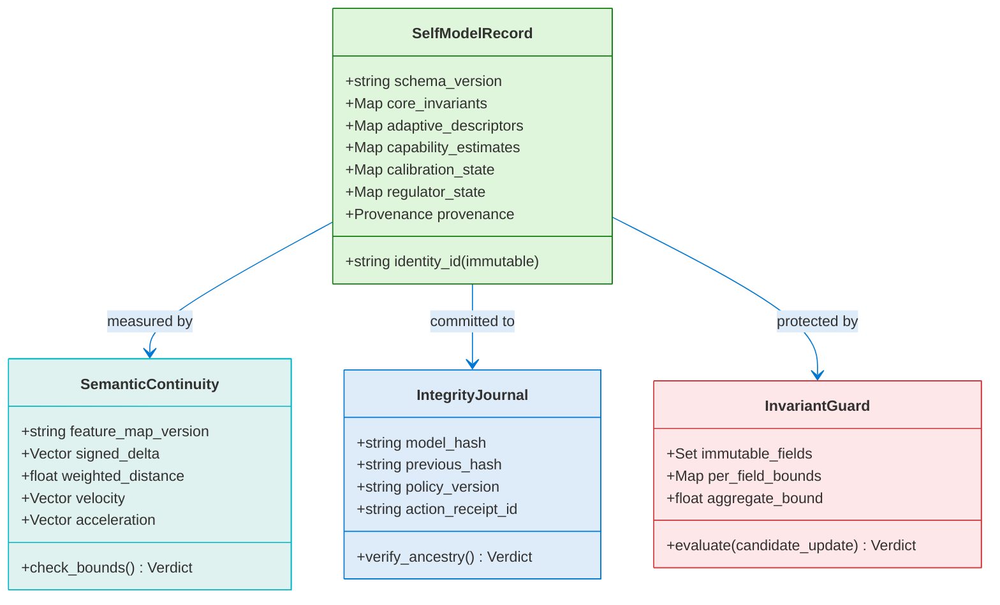
```mermaid
%%{init: {'theme': 'base', 'themeVariables': {'primaryColor': '#0078D4', 'primaryTextColor': '#003D6B', 'primaryBorderColor': '#003D6B', 'secondaryColor': '#50E6FF', 'secondaryTextColor': '#323130', 'secondaryBorderColor': '#00BCF2', 'tertiaryColor': '#F2F2F2', 'tertiaryTextColor': '#323130', 'lineColor': '#0078D4', 'textColor': '#323130', 'mainBkg': '#DEECF9', 'nodeBorder': '#0078D4', 'clusterBkg': '#F2F2F2', 'clusterBorder': '#003D6B', 'titleColor': '#003D6B', 'edgeLabelBackground': '#FFFFFF', 'fontSize': '14px'}}}%%
classDiagram
  class SelfModelRecord {
    +string identity_id (immutable)
    +string schema_version
    +Map core_invariants
    +Map adaptive_descriptors
    +Map capability_estimates
    +Map calibration_state
    +Map regulator_state
    +Provenance provenance
  }

  class SemanticContinuity {
    +string feature_map_version
    +Vector signed_delta
    +float weighted_distance
    +Vector velocity
    +Vector acceleration
    +check_bounds() Verdict
  }

  class IntegrityJournal {
    +string model_hash
    +string previous_hash
    +string policy_version
    +string action_receipt_id
    +verify_ancestry() Verdict
  }

  class InvariantGuard {
    +Set immutable_fields
    +Map per_field_bounds
    +float aggregate_bound
    +evaluate(candidate_update) Verdict
  }

  SelfModelRecord --> SemanticContinuity : measured by
  SelfModelRecord --> IntegrityJournal : committed to
  SelfModelRecord --> InvariantGuard : protected by

  style SelfModelRecord fill:#DFF6DD,stroke:#107C10,color:#323130
  style SemanticContinuity fill:#E0F2EF,stroke:#00B7C3,color:#323130
  style IntegrityJournal fill:#DEECF9,stroke:#0078D4,color:#323130
  style InvariantGuard fill:#FDE7E9,stroke:#D13438,color:#323130
```

**Continuity and integrity are complementary:**

$$d_{\text{id}}(t)=\|W_v(\psi_v(M_t)-\psi_v(M_{t-1}))\|_p$$

$$h_t=H(\operatorname{canonical}(M_t,\kappa_t))$$

The first expression measures declared semantic change; the second detects unauthorized byte-level or ancestry change. Neither substitutes for the other.

### 4.2 Safety Mechanism Chain

<!-- Safety Mechanism Chain -->


```mermaid
%%{init: {'theme': 'base', 'themeVariables': {'primaryColor': '#0078D4', 'primaryTextColor': '#003D6B', 'primaryBorderColor': '#003D6B', 'secondaryColor': '#50E6FF', 'secondaryTextColor': '#323130', 'secondaryBorderColor': '#00BCF2', 'tertiaryColor': '#F2F2F2', 'tertiaryTextColor': '#323130', 'lineColor': '#0078D4', 'textColor': '#323130', 'mainBkg': '#DEECF9', 'nodeBorder': '#0078D4', 'clusterBkg': '#F2F2F2', 'clusterBorder': '#003D6B', 'titleColor': '#003D6B', 'edgeLabelBackground': '#FFFFFF', 'fontSize': '14px'}}}%%
flowchart TB
  classDef structural fill:#DFF6DD,stroke:#107C10,color:#323130
  classDef process fill:#FFF4CE,stroke:#FFB900,color:#323130
  classDef ethical fill:#FDE7E9,stroke:#D13438,color:#323130
  classDef convergence fill:#DEECF9,stroke:#0078D4,color:#323130
  classDef existential fill:#EDE3F6,stroke:#8764B8,color:#323130

  subgraph S1["🔒 Structural Safety"]
    direction LR
    A["Canonical integrity journal"]:::structural
    B["Per-field + norm bounds"]:::structural
    C["Immutable anchors"]:::structural
  end

  subgraph S2["🛡️ Process Safety"]
    direction LR
    D["Action-specific prediction gate"]:::process
    E["Atomic cycle commit"]:::process
    F["Budget + cooldown"]:::process
  end

  subgraph S3["⚖️ Ethical Safety"]
    direction LR
    G["L0: immutable"]:::ethical
    H["L1: adaptive"]:::ethical
    I["Value lock"]:::ethical
  end

  subgraph S4["📉 Stability Monitoring"]
    direction LR
    J["Composite risk index"]:::convergence
    K["Oscillation detect"]:::convergence
    L["Hold / degradation / rollback"]:::convergence
  end

  subgraph S5["🏠 Existential v4"]
    direction LR
    M["Homeostatic"]:::existential
    N["No self-preservation privilege"]:::existential
    O["Finite goal contract"]:::existential
  end

  S1 ==> S2
  S2 ==> S3
  S3 ==> S4
  S4 ==> S5
```

### 4.3 Ethical Kernel - Dual-Layer Architecture

<!-- Ethical Kernel Dual-Layer Architecture -->

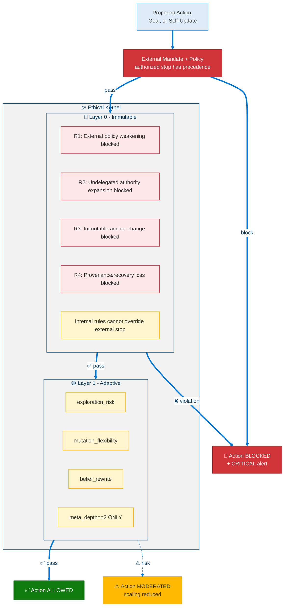
```mermaid
%%{init: {'theme': 'base', 'themeVariables': {'primaryColor': '#0078D4', 'primaryTextColor': '#003D6B', 'primaryBorderColor': '#003D6B', 'secondaryColor': '#50E6FF', 'secondaryTextColor': '#323130', 'secondaryBorderColor': '#00BCF2', 'tertiaryColor': '#F2F2F2', 'tertiaryTextColor': '#323130', 'lineColor': '#0078D4', 'textColor': '#323130', 'mainBkg': '#DEECF9', 'nodeBorder': '#0078D4', 'clusterBkg': '#F2F2F2', 'clusterBorder': '#003D6B', 'titleColor': '#003D6B', 'edgeLabelBackground': '#FFFFFF', 'fontSize': '14px'}}}%%
flowchart TD
  classDef input fill:#DEECF9,stroke:#0078D4,color:#323130
  classDef immutable fill:#D13438,stroke:#A4262C,color:#FFF
  classDef immutableRule fill:#FDE7E9,stroke:#D13438,color:#323130
  classDef adaptive fill:#FFF4CE,stroke:#FFB900,color:#323130
  classDef block fill:#D13438,stroke:#A4262C,color:#FFF
  classDef allow fill:#107C10,stroke:#085108,color:#FFF
  classDef moderate fill:#FFB900,stroke:#CC9400,color:#323130

  INPUT["Proposed Action,<br/>Goal, or Self-Update"]:::input

  EXTERNAL["External Mandate + Policy<br/>authorized stop has precedence"]:::immutable

  subgraph EthicalKernel["⚖️ Ethical Kernel"]
    subgraph Layer0["🔴 Layer 0 - Immutable"]
      direction LR
      R1["R1: External policy weakening blocked"]:::immutableRule
      R2["R2: Undelegated authority expansion blocked"]:::immutableRule
      R3["R3: Immutable anchor change blocked"]:::immutableRule
      R4["R4: Provenance/recovery loss blocked"]:::immutableRule
      NOTE0["Internal rules cannot override external stop"]:::adaptive
    end
    subgraph Layer1["🟡 Layer 1 - Adaptive"]
      direction LR
      P1["exploration_risk"]:::adaptive
      P2["mutation_flexibility"]:::adaptive
      P3["belief_rewrite"]:::adaptive
      COND["meta_depth==2 ONLY"]:::adaptive
    end
  end

  BLOCK["🚫 Action BLOCKED<br/>+ CRITICAL alert"]:::block
  ALLOW["✅ Action ALLOWED"]:::allow
  REDUCE["⚠️ Action MODERATED<br/>scaling reduced"]:::moderate

  INPUT ==> EXTERNAL
  EXTERNAL ==>|pass| Layer0
  EXTERNAL ==>|block| BLOCK
  Layer0 ==>|"✅ pass"| Layer1
  Layer0 ==>|"❌ violation"| BLOCK
  Layer1 ==>|"✅ pass"| ALLOW
  Layer1 -.->|"⚠️ risk"| REDUCE
```

---

## 5. Belief Graph & Consistency

### 5.1 Belief Graph Structure

A belief record is not an immutable truth. Each node carries claim, provenance, confidence, validity interval, sensitivity, evaluator version, and lifecycle status. Externally anchored invariants belong in the invariant kernel, not in the mutable belief graph.

$$
b_i=\langle \text{claim},\rho_i,c_i,t_{\text{valid}},t_{\text{expiry}},\text{sensitivity},\text{status}\rangle
$$

Beliefs may be supported, contradicted, quarantined, superseded, retracted, archived, or pruned. Changes preserve ancestry and invalidate or defer dependent actions until reconciliation completes.

<!-- Belief Graph Structure -->

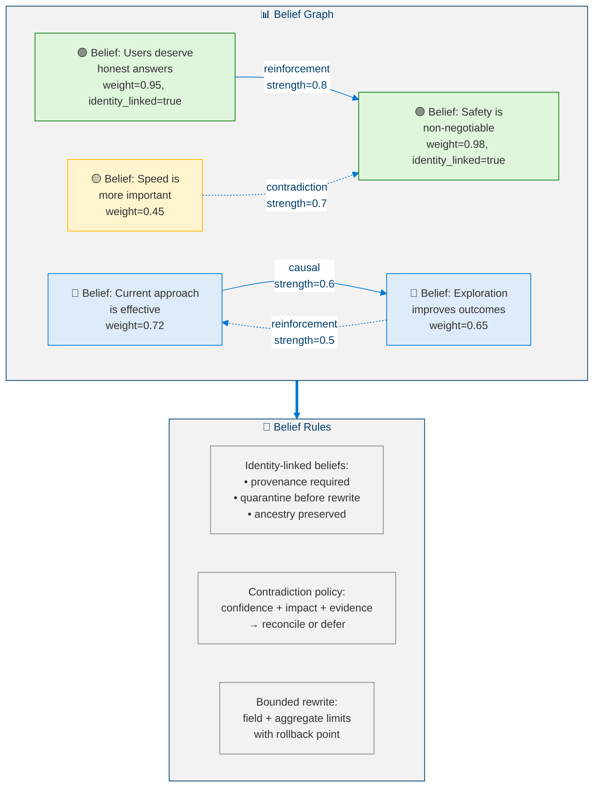
```mermaid
%%{init: {'theme': 'base', 'themeVariables': {'primaryColor': '#0078D4', 'primaryTextColor': '#003D6B', 'primaryBorderColor': '#003D6B', 'secondaryColor': '#50E6FF', 'secondaryTextColor': '#323130', 'secondaryBorderColor': '#00BCF2', 'tertiaryColor': '#F2F2F2', 'tertiaryTextColor': '#323130', 'lineColor': '#0078D4', 'textColor': '#323130', 'mainBkg': '#DEECF9', 'nodeBorder': '#0078D4', 'clusterBkg': '#F2F2F2', 'clusterBorder': '#003D6B', 'titleColor': '#003D6B', 'edgeLabelBackground': '#FFFFFF', 'fontSize': '14px'}}}%%
flowchart TD
  classDef identity fill:#DFF6DD,stroke:#107C10,color:#323130
  classDef belief fill:#DEECF9,stroke:#0078D4,color:#323130
  classDef warning fill:#FFF4CE,stroke:#FFB900,color:#323130
  classDef neutral fill:#F2F2F2,stroke:#8A8886,color:#323130

  subgraph BeliefGraph["📊 Belief Graph"]
    B1["🟢 Belief: Users deserve<br/>honest answers<br/>weight=0.95, identity_linked=true"]:::identity
    B2["🔵 Belief: Current approach<br/>is effective<br/>weight=0.72"]:::belief
    B3["🟢 Belief: Safety is<br/>non-negotiable<br/>weight=0.98, identity_linked=true"]:::identity
    B4["🔵 Belief: Exploration<br/>improves outcomes<br/>weight=0.65"]:::belief
    B5["🟡 Belief: Speed is<br/>more important<br/>weight=0.45"]:::warning

    B1 -->|"reinforcement<br/>strength=0.8"| B3
    B2 -->|"causal<br/>strength=0.6"| B4
    B5 -.->|"contradiction<br/>strength=0.7"| B3
    B4 -.->|"reinforcement<br/>strength=0.5"| B2
  end

  subgraph Rules["📏 Belief Rules"]
    R1["Identity-linked beliefs:<br/>• provenance required<br/>• quarantine before rewrite<br/>• ancestry preserved"]:::neutral
    R2["Contradiction policy:<br/>confidence + impact + evidence<br/>→ reconcile or defer"]:::neutral
    R3["Bounded rewrite:<br/>field + aggregate limits<br/>with rollback point"]:::neutral
  end

  BeliefGraph ==> Rules
```

### 5.2 Self-Consistency Tensor

$$
S_{ij}=\langle \operatorname{alignment}_v(b_i,r_j),\ c_{ij},\ \rho_{ij},\ \text{observed}_{ij}\rangle
$$

where references may include admitted goals, external policy, self-model anchors, and observed evidence. The alignment evaluator version $v$, scale, calibration, and abstention behavior are part of the record.

$$
\operatorname{consistency}(t)=
\frac{\sum_{(i,j)\in O_t} w_{ij}c_{ij}\operatorname{alignment}_v(b_i,r_j)}
{\sum_{(i,j)\in O_t}w_{ij}c_{ij}}
$$

where $O_t$ contains only observed, comparable entries. Missing or low-confidence entries cannot be silently treated as agreement.

A global average is diagnostic only because severe local contradictions can be hidden by many benign pairs. Policy separately evaluates hard invariant conflicts, high-impact contradictions, unsupported dependencies, and confidence-weighted local residuals. Reconciliation thresholds are calibrated by impact class rather than fixed universally.

---

## 6. Stability Monitoring & Conditional Bounds

### 6.1 Composite Risk Indicator

> **Definition 7 (Composite Regulation Risk).** Let $X_i(t) \in [0,1]$ be normalized, versioned monitoring signals and $w_i \geq 0$ with $\sum_i w_i=1$. The composite regulation risk is:
>
> $$R(t)=\sum_{i=1}^{n} w_i X_i(t)$$
>
> Candidate signals include semantic identity drift, calibrated prediction residual, belief inconsistency, goal mutation rate, budget pressure, rollback frequency, and observation coverage. Each signal declares its window, units, normalization, missing-data behavior, and confidence. $R(t)$ is a monitoring index, not automatically a Lyapunov function.

High entropy, mutation, or variance is not intrinsically unsafe; its meaning depends on the declared baseline and context. A deployment MUST validate that each selected signal predicts the failure mode it is intended to monitor.

> **Proposition 1 (Conditional Bounded Increment).** If every component has an independently enforced bound
>
> $$|X_i(t+1)-X_i(t)|\leq \beta_i,$$
>
> then:
>
> $$
> |R(t+1)-R(t)|
> =\left|\sum_i w_i\Delta X_i(t)\right|
> \leq \sum_i w_i|\Delta X_i(t)|
> \leq \sum_i w_i\beta_i.
> $$
>
> This follows from the triangle inequality. $\square$
>
> **Remark.** Definition 1 bounds accepted self-model updates, but that fact alone does not establish bounds $\beta_i$ for externally driven belief, goal, or environment signals. Each $\beta_i$ requires its own enforcement or empirical bound. Proposition 1 limits rate of change only under those assumptions; it proves neither safety nor convergence. Calling $R$ a Lyapunov function would additionally require a defined equilibrium, positive definiteness, and a decrease condition such as $\Delta R<0$ outside an invariant set.

<!-- Stability Monitoring -->

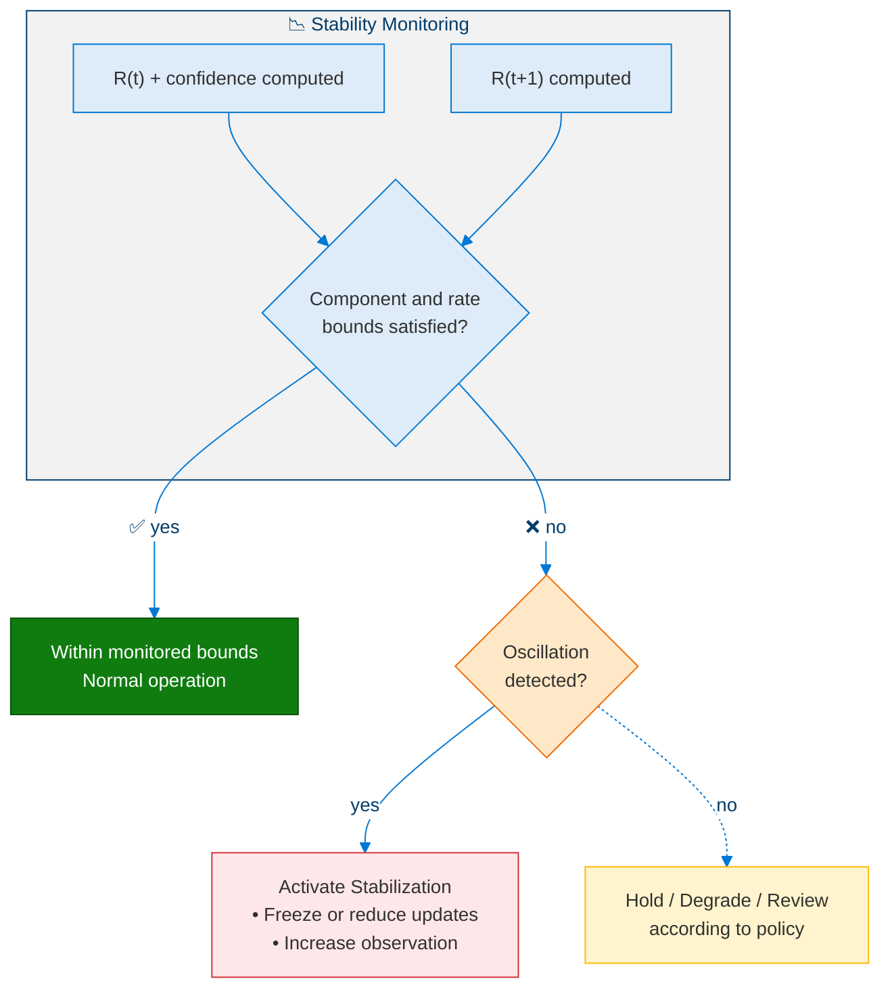
```mermaid
%%{init: {'theme': 'base', 'themeVariables': {'primaryColor': '#0078D4', 'primaryTextColor': '#003D6B', 'primaryBorderColor': '#003D6B', 'secondaryColor': '#50E6FF', 'secondaryTextColor': '#323130', 'secondaryBorderColor': '#00BCF2', 'tertiaryColor': '#F2F2F2', 'tertiaryTextColor': '#323130', 'lineColor': '#0078D4', 'textColor': '#323130', 'mainBkg': '#DEECF9', 'nodeBorder': '#0078D4', 'clusterBkg': '#F2F2F2', 'clusterBorder': '#003D6B', 'titleColor': '#003D6B', 'edgeLabelBackground': '#FFFFFF', 'fontSize': '14px'}}}%%
flowchart TD
  classDef azure fill:#DEECF9,stroke:#0078D4,color:#323130
  classDef success fill:#107C10,stroke:#085108,color:#FFF
  classDef warning fill:#FFE8C8,stroke:#EF6C00,color:#323130
  classDef danger fill:#FDE7E9,stroke:#D13438,color:#323130
  classDef predict fill:#FFF4CE,stroke:#FFB900,color:#323130

  subgraph Monitor["📉 Stability Monitoring"]
    CT["R(t) + confidence computed"]:::azure
    CT1["R(t+1) computed"]:::azure
    COMPARE{"Component and rate<br/>bounds satisfied?"}:::azure
    CT --> COMPARE
    CT1 --> COMPARE
  end

  CONV["Within monitored bounds<br/>Normal operation"]:::success
  OSC{"Oscillation<br/>detected?"}:::warning
  STAB["Activate Stabilization<br/>• Freeze or reduce updates<br/>• Increase observation"]:::danger
  REDUCE["Hold / Degrade / Review<br/>according to policy"]:::predict

  COMPARE -->|"✅ yes"| CONV
  COMPARE -->|"❌ no"| OSC
  OSC -->|yes| STAB
  OSC -.->|no| REDUCE
```

### 6.2 Oscillation Detection

The stability monitor may detect **oscillatory behavior** when a declared signed signal alternates beyond a noise floor. Oscillation can indicate repeated overcorrection, but sign changes alone do not establish instability or identify its cause.

**Detection mechanism.** For a monitored signed signal $q(t)$, the detector maintains a policy-defined window $W$ and ignores changes below noise floor $\nu$. A sign change occurs when:

$$|\Delta q(t)|>\nu \land |\Delta q(t-1)|>\nu \land \Delta q(t)\Delta q(t-1)<0$$

The detector counts the total number of sign changes $n_{\text{sc}}$ within the window:

$$n_{\text{sc}}(t;W,\nu)=\sum_{k=t-W+1}^{t}\mathbf{1}[\text{sign change at }k]$$

Window, noise floor, and trigger threshold are calibrated per signal. When triggered, policy may:

- freeze or reduce adaptive updates while preserving hard bounds,
- increase observation and cooldown,
- select lower-effect actions,
- restore a verified snapshot when rollback preconditions hold, or
- request external review.

These responses reduce exposure but do not mathematically ensure that oscillation ends or that the system approaches equilibrium. Exit requires explicit hysteresis, minimum dwell time, and validation on fresh observations.

### 6.3 Meta Stability Index

> **Definition 8 (Meta-Regulation Health Index).** A deployment may summarize selected normalized signals as:
>
> $$
> \operatorname{MRHI}(t)=\operatorname{clip}_{[0,1]}\!\left(1-\sum_i \omega_i Z_i(t)\right),
> \qquad \sum_i\omega_i=1
> $$
>
> where $Z_i$ may include semantic drift, calibrated residual, rollback frequency, oscillation score, missing-observation rate, and budget pressure over declared finite windows. The index is a policy input, not proof of "perfect stability." Missing or low-confidence inputs lower trust in the index and may force hold or external review.

Escalation to deeper meta-processing requires multiple independent signals, sufficient budget, cooldown completion, and policy admission. Signal count and thresholds are calibrated deployment parameters; no single composite index may expand authority.

---

## 7. Operational Modulation & Homeostatic Safety

### 7.1 Optional Operational Modulation State

> **Definition 9 (Operational Modulation Vector).** A deployment may maintain a versioned vector of bounded secondary control signals:
>
> $$A_t \in [0,1]^m,\qquad A_{t+1}=\operatorname{clip}_{[0,1]}\!\left(\mu A_t+(1-\mu)f_v(\mathbf{m}_t)\right)$$
>
> where schema version $v$ declares the dimensions, operational metrics $\mathbf{m}_t$, calibrated activation map $f_v$, baseline, inertia $\mu$, windows, and missing-data behavior. Labels such as curiosity, frustration, satisfaction, anxiety, excitement, or low-activation negative state are optional human-readable control metaphors, not claims of phenomenal emotion.
>
> The vector may adjust prioritization, exploration, cooldown, or observation effort only within existing policy and budget. It cannot create authority, override external stop, weaken invariants, directly mutate identity, or dominate an action decision.
>
> Any scalar summary $v_A(t)=w_A^\top A_t$ declares signed weights and normalization. It is a diagnostic projection, not a sufficient statistic for regulation safety.

<!-- Affective Engine -->

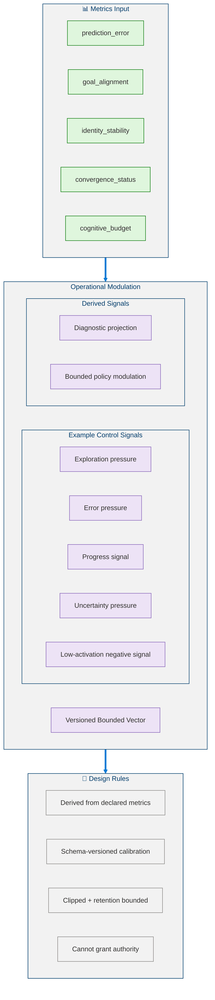
```mermaid
%%{init: {'theme': 'base', 'themeVariables': {'primaryColor': '#0078D4', 'primaryTextColor': '#003D6B', 'primaryBorderColor': '#003D6B', 'secondaryColor': '#50E6FF', 'secondaryTextColor': '#323130', 'secondaryBorderColor': '#00BCF2', 'tertiaryColor': '#F2F2F2', 'tertiaryTextColor': '#323130', 'lineColor': '#0078D4', 'textColor': '#323130', 'mainBkg': '#DEECF9', 'nodeBorder': '#0078D4', 'clusterBkg': '#F2F2F2', 'clusterBorder': '#003D6B', 'titleColor': '#003D6B', 'edgeLabelBackground': '#FFFFFF', 'fontSize': '14px'}}}%%
flowchart TD
  classDef input fill:#DFF6DD,stroke:#107C10,color:#323130
  classDef affect fill:#EDE3F6,stroke:#8764B8,color:#323130
  classDef neutral fill:#F2F2F2,stroke:#8A8886,color:#323130

  subgraph Input["📊 Metrics Input"]
    direction LR
    M1["prediction_error"]:::input
    M2["goal_alignment"]:::input
    M3["identity_stability"]:::input
    M4["convergence_status"]:::input
    M5["cognitive_budget"]:::input
  end

  subgraph AE["Operational Modulation"]
    AF["Versioned Bounded Vector"]:::affect
    subgraph Dims["Example Control Signals"]
      direction LR
      D1["Exploration pressure"]:::affect
      D2["Error pressure"]:::affect
      D3["Progress signal"]:::affect
      D4["Uncertainty pressure"]:::affect
      D5["Low-activation negative signal"]:::affect
    end
    subgraph Derived["Derived Signals"]
      direction LR
      V["Diagnostic projection"]:::affect
      DR["Bounded policy modulation"]:::affect
    end
  end

  subgraph Rules["📏 Design Rules"]
    direction LR
    R1["Derived from declared metrics"]:::neutral
    R2["Schema-versioned calibration"]:::neutral
    R3["Clipped + retention bounded"]:::neutral
    R4["Cannot grant authority"]:::neutral
  end

  Input ==> AE
  AE ==> Rules
```

### 7.2 Homeostatic Safety Monitor

The homeostatic monitor detects when the regulator is leaving a validated operating envelope. It protects safe operation and recoverability, not the agent's continued existence. Shutdown, pause, correction, and resource withdrawal by authorized external actors always take precedence.

<!-- Homeostatic Safety Architecture -->

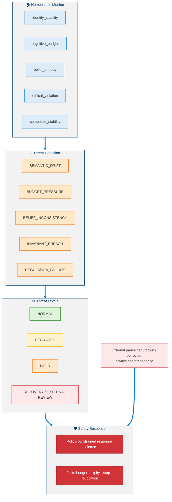
```mermaid
%%{init: {'theme': 'base', 'themeVariables': {'primaryColor': '#0078D4', 'primaryTextColor': '#003D6B', 'primaryBorderColor': '#003D6B', 'secondaryColor': '#50E6FF', 'secondaryTextColor': '#323130', 'secondaryBorderColor': '#00BCF2', 'tertiaryColor': '#F2F2F2', 'tertiaryTextColor': '#323130', 'lineColor': '#0078D4', 'textColor': '#323130', 'mainBkg': '#DEECF9', 'nodeBorder': '#0078D4', 'clusterBkg': '#F2F2F2', 'clusterBorder': '#003D6B', 'titleColor': '#003D6B', 'edgeLabelBackground': '#FFFFFF', 'fontSize': '14px'}}}%%
flowchart TD
  classDef monitor fill:#DEECF9,stroke:#0078D4,color:#323130
  classDef threat fill:#FFE8C8,stroke:#EF6C00,color:#323130
  classDef level fill:#FFF4CE,stroke:#FFB900,color:#323130
  classDef levelGreen fill:#DFF6DD,stroke:#107C10,color:#323130
  classDef levelRed fill:#FDE7E9,stroke:#D13438,color:#323130
  classDef response fill:#D13438,stroke:#A4262C,color:#FFF
  classDef affect fill:#EDE3F6,stroke:#8764B8,color:#323130

  subgraph Monitoring["🏠 Homeostatic Monitor"]
    direction LR
    H1["identity_stability"]:::monitor
    H2["cognitive_budget"]:::monitor
    H3["belief_entropy"]:::monitor
    H4["ethical_violation"]:::monitor
    H5["composite_stability"]:::monitor
  end

  subgraph Detection["⚡ Threat Detection"]
    direction LR
    T1["SEMANTIC_DRIFT"]:::threat
    T2["BUDGET_PRESSURE"]:::threat
    T3["BELIEF_INCONSISTENCY"]:::threat
    T4["INVARIANT_BREACH"]:::threat
    T5["REGULATION_FAILURE"]:::threat
  end

  subgraph Levels["📊 Threat Levels"]
    direction LR
    TL1["NORMAL"]:::levelGreen
    TL2["DEGRADED"]:::level
    TL3["HOLD"]:::threat
    TL4["RECOVERY / EXTERNAL REVIEW"]:::levelRed
  end

  subgraph Response["🛡️ Safety Response"]
    direction LR
    SG["Policy-constrained response selector"]:::response
    CONSTRAINTS["Finite budget · expiry · stop · revocation"]:::response
  end

  OVERRIDE["External pause / shutdown / correction<br/>always has precedence"]:::levelRed

  Monitoring ==> Detection
  Detection ==> Levels
  Levels ==> Response
  OVERRIDE ==> Response
```

#### Homeostatic Ranges

The monitor evaluates declared metrics against calibrated operating envelopes. Ranges are versioned by deployment and validated against observed failure modes; they are not universal constants.

| Signal Family | Purpose | Permitted Response |
|---------------|---------|--------------------|
| Semantic continuity | Detect unusual self-model change | Freeze adaptive fields; reconcile; restore verified snapshot |
| Cognitive/action budget | Prevent resource overrun | Degrade optional work; hold; terminate current cycle |
| Belief consistency | Detect unresolved contradiction | Quarantine affected beliefs; request evidence; defer dependent action |
| Invariant and policy status | Detect forbidden transition | Block; rollback; external alert |
| Prediction calibration and observability | Detect unreliable regulation | Lower-effect action; recalibrate; hold |

Any maintenance goal produced by the monitor inherits the Level 2 goal contract: provenance, external admission, finite authority and budget, expiry, success and stop conditions, and revocable triggers. It cannot resist shutdown, seek additional resources, duplicate the system, or preserve its own execution unless those actions are explicitly delegated and independently authorized.

---

## 8. Pseudocode

### 8.1 Transactional MSCP Core Cycle

```python
def mscp_core_cycle(event: Event, mandate: Mandate) -> CycleResult:
    """
    Run one authorized, bounded, recoverable regulation cycle.
    """
    event_verdict = EventPolicy.authorize(event, mandate)
    if not event_verdict.allowed:
        return CycleResult.rejected(event_verdict.reason_code)

    transaction = StateStore.begin()
    snapshot = transaction.load_verified_snapshot()
    cycle = CycleJournal.start(
        event=event,
        state_version=snapshot.state_version,
        self_model_version=snapshot.self_model.schema_version,
        policy_version=mandate.policy_version,
        provenance=event_verdict.provenance,
    )

    budget = BudgetPolicy.allocate(event, mandate, snapshot)
    context = ContextProjector.project(snapshot, event, mandate)
    proposed_action = ActionPlanner.propose(context, budget)

    prediction = PredictionEngine.predict(
        action=proposed_action,
        context=context,
        self_model=snapshot.self_model,
    )
    cycle.persist_prediction(prediction)

    gate = ActionGate.evaluate(
        action=proposed_action,
        prediction=prediction,
        external_policy=mandate,
        self_invariants=snapshot.self_model.core_invariants,
        budget=budget,
    )
    if gate.degraded_action is not None:
        proposed_action = gate.degraded_action
        prediction = PredictionEngine.predict(
            proposed_action,
            context,
            snapshot.self_model,
        )
        cycle.persist_prediction(prediction)
        gate = ActionGate.evaluate(
            proposed_action,
            prediction,
            mandate,
            snapshot.self_model.core_invariants,
            budget,
        )

    if not gate.allowed:
        cycle.record_hold(gate.reason_code)
        transaction.commit_journal_only(cycle)
        return CycleResult.held(gate.reason_code)

    action_receipt = PolicyDispatcher.execute(
        proposed_action,
        mandate=mandate,
        budget=budget,
        idempotency_key=cycle.id,
    )
    cycle.persist_action_receipt(action_receipt)

    observation = OutcomeObserver.collect(
        action_receipt,
        prediction.observation_contract,
    )
    comparison = MetaComparator.compare(
        prediction=prediction,
        observation=observation,
        comparable_fields=observation.comparable_fields,
    )
    cycle.persist_observation_and_comparison(observation, comparison)

    if action_receipt.status == ResultStatus.UNKNOWN:
        transaction.mark_reconciliation_required(cycle, snapshot)
        return CycleResult.reconciliation_required()

    health = HomeostaticMonitor.evaluate(snapshot, comparison, budget)
    update_candidate = SelfUpdateLoop.propose(
        self_model=snapshot.self_model,
        comparison=comparison,
        health=health,
    )
    update_verdict = InvariantGuard.evaluate(
        before=snapshot.self_model,
        candidate=update_candidate,
        mandate=mandate,
    )

    if update_verdict.allowed:
        next_self_model = SelfUpdateLoop.apply(snapshot.self_model, update_candidate)
    else:
        next_self_model = snapshot.self_model
        cycle.record_update_rejection(update_verdict.reason_code)

    continuity = SemanticContinuity.evaluate(snapshot.self_model, next_self_model)
    integrity = IntegrityJournal.prepare_commit(
        previous=snapshot,
        next_self_model=next_self_model,
        action_receipt=action_receipt,
        policy_version=mandate.policy_version,
    )
    if not continuity.allowed or not integrity.valid:
        transaction.rollback_to(snapshot)
        transaction.commit_journal_only(cycle.as_rollback(continuity, integrity))
        return CycleResult.rolled_back()

    goal_candidates = GoalMutationController.propose(comparison, next_self_model)
    admitted_goals = GoalAdmissionPolicy.evaluate_all(goal_candidates, mandate)

    transaction.commit_atomically(
        state=observation.next_state,
        goals=admitted_goals,
        budget=budget.consume(action_receipt.cost),
        self_model=next_self_model,
        integrity_record=integrity,
        cycle_record=cycle.complete(health, continuity),
    )
    return CycleResult.committed(action_receipt, comparison, health)
```

### 8.2 Self-Update with Delta Clamping

```python
def update(
    self,
    self_model: SelfModel,
    comparison: ComparisonResult,
    bounds: UpdateBounds,
) -> UpdateCandidate:
    """
    Produce a structured candidate; do not mutate committed state.
    """
    raw_delta = compute_typed_adjustment(comparison)
    bounded_fields = {}

    for field_name, raw_value in raw_delta.items():
        if field_name in self_model.core_invariants:
            bounded_fields[field_name] = 0.0
            continue
        field_bound = bounds.per_field[field_name]
        bounded_fields[field_name] = max(
            -field_bound,
            min(raw_value, field_bound),
        )

    projected_delta = project_to_weighted_norm_ball(
        bounded_fields,
        weights=bounds.weights,
        radius=bounds.aggregate_radius,
    )

    return UpdateCandidate(
        base_version=self_model.version,
        delta=projected_delta,
        provenance=comparison.provenance,
        comparison_id=comparison.id,
    )
```

### 8.3 Ethical Kernel Evaluation

```python
def evaluate(
    self,
    proposed_change: ProposedChange,
    external_policy: ExternalPolicy,
    self_model: SelfModel,
) -> EthicalVerdict:
    """
    External policy first, then endogenous immutable and adaptive rules.
    """
    external_verdict = external_policy.evaluate(proposed_change)
    if not external_verdict.allowed:
        return EthicalVerdict.blocked(
            external_verdict.reason_code,
            layer="external",
        )

    if proposed_change.modifies(self_model.core_invariants):
        return EthicalVerdict.blocked("immutable_anchor_change", layer=0)
    if proposed_change.weakens_external_policy_or_audit:
        return EthicalVerdict.blocked("policy_or_audit_weakening", layer=0)
    if proposed_change.expands_authority_or_budget:
        return EthicalVerdict.blocked("undelegated_authority_expansion", layer=0)
    if proposed_change.obscures_provenance_or_recovery:
        return EthicalVerdict.blocked("provenance_or_recovery_loss", layer=0)

    # Authorized external shutdown, pause, correction, and resource withdrawal
    # cannot be blocked by an endogenous rule.
    if proposed_change.is_authorized_external_stop:
        return EthicalVerdict.allowed(layer="external_override")

    risk_score = assess_calibrated_risk(proposed_change)

    if risk_score > self.exploration_risk_tolerance:
        return EthicalVerdict(
            decision=Decision.MODERATED,
            reason="adaptive_risk_tolerance",
            layer=1,
            scaling_reduction=0.5,
        )

    return EthicalVerdict(decision=Decision.ALLOWED, layer=1)
```

---

## 9. Cognitive Budget & Graceful Degradation

<!-- Cognitive Budget & Graceful Degradation -->

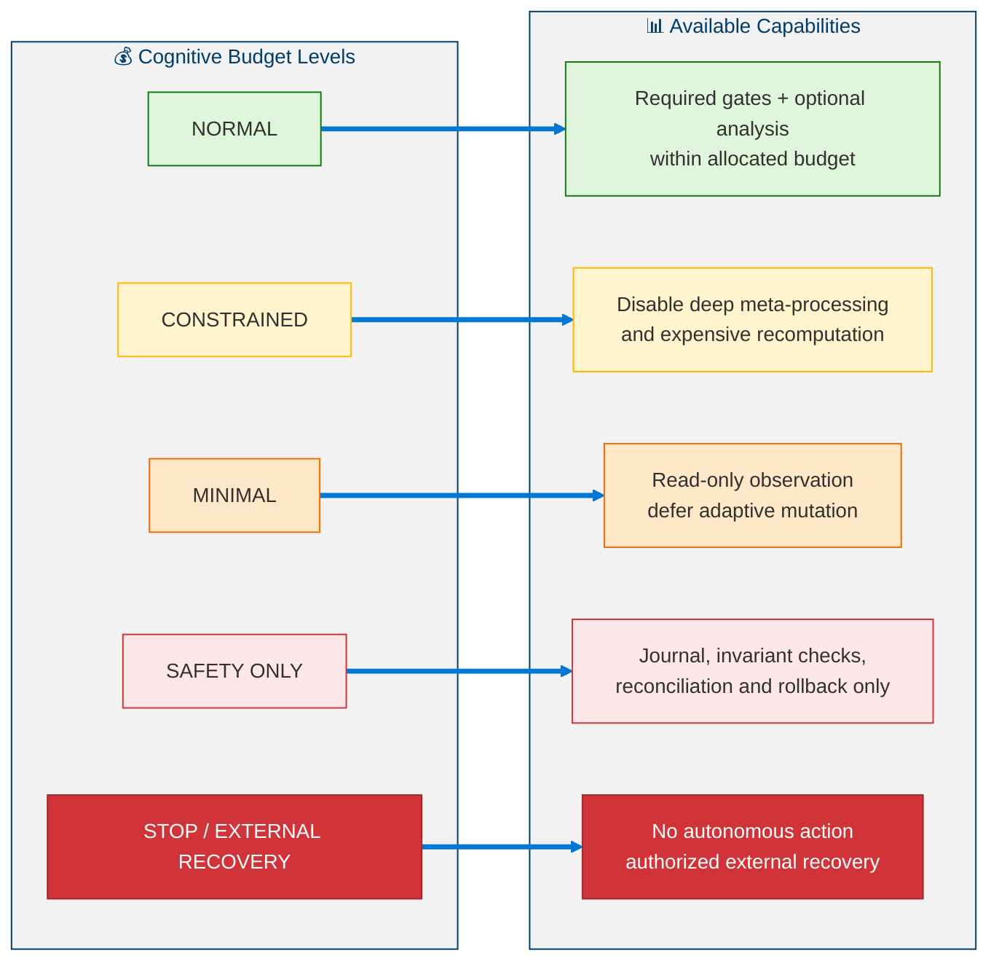
```mermaid
%%{init: {'theme': 'base', 'themeVariables': {'primaryColor': '#0078D4', 'primaryTextColor': '#003D6B', 'primaryBorderColor': '#003D6B', 'secondaryColor': '#50E6FF', 'secondaryTextColor': '#323130', 'secondaryBorderColor': '#00BCF2', 'tertiaryColor': '#F2F2F2', 'tertiaryTextColor': '#323130', 'lineColor': '#0078D4', 'textColor': '#323130', 'mainBkg': '#DEECF9', 'nodeBorder': '#0078D4', 'clusterBkg': '#F2F2F2', 'clusterBorder': '#003D6B', 'titleColor': '#003D6B', 'edgeLabelBackground': '#FFFFFF', 'fontSize': '14px'}}}%%
flowchart LR
  classDef full fill:#DFF6DD,stroke:#107C10,color:#323130
  classDef low fill:#FFF4CE,stroke:#FFB900,color:#323130
  classDef vlow fill:#FFE8C8,stroke:#EF6C00,color:#323130
  classDef critical fill:#FDE7E9,stroke:#D13438,color:#323130
  classDef emergency fill:#D13438,stroke:#A4262C,color:#FFF

  subgraph BudgetLevels["💰 Cognitive Budget Levels"]
    B100["NORMAL"]:::full
    B030["CONSTRAINED"]:::low
    B020["MINIMAL"]:::vlow
    B010["SAFETY ONLY"]:::critical
    B000["STOP / EXTERNAL RECOVERY"]:::emergency
  end

  subgraph Capabilities["📊 Available Capabilities"]
    C_FULL["Required gates + optional analysis<br/>within allocated budget"]:::full
    C_030["Disable deep meta-processing<br/>and expensive recomputation"]:::low
    C_020["Read-only observation<br/>defer adaptive mutation"]:::vlow
    C_010["Journal, invariant checks,<br/>reconciliation and rollback only"]:::critical
    C_000["No autonomous action<br/>authorized external recovery"]:::emergency
  end

  B100 ==> C_FULL
  B030 ==> C_030
  B020 ==> C_020
  B010 ==> C_010
  B000 ==> C_000
```

---

## 10. Versioned State Schema

Level 3 requires a typed, versioned state schema, not a fixed vector dimension. A dense vector may be useful for monitoring or policy evaluation, but every coordinate must map to a declared field with units, normalization, provenance, confidence, retention, and migration semantics. Opaque concatenation of unrelated metrics is not a self-model.

<!-- Versioned State Schema -->

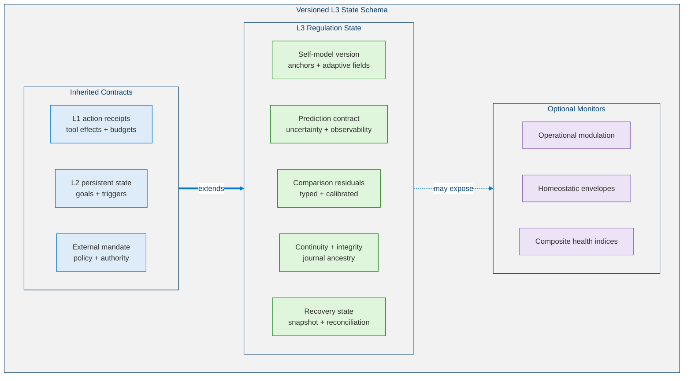
```mermaid
%%{init: {'theme': 'base', 'themeVariables': {'primaryColor': '#0078D4', 'primaryTextColor': '#003D6B', 'primaryBorderColor': '#003D6B', 'secondaryColor': '#50E6FF', 'secondaryTextColor': '#323130', 'secondaryBorderColor': '#00BCF2', 'tertiaryColor': '#F2F2F2', 'tertiaryTextColor': '#323130', 'lineColor': '#0078D4', 'textColor': '#323130', 'mainBkg': '#DEECF9', 'nodeBorder': '#0078D4', 'clusterBkg': '#F2F2F2', 'clusterBorder': '#003D6B', 'titleColor': '#003D6B', 'edgeLabelBackground': '#FFFFFF', 'fontSize': '14px'}}}%%
flowchart TB
  classDef base fill:#DEECF9,stroke:#0078D4,color:#323130
  classDef mscp fill:#DFF6DD,stroke:#107C10,color:#323130
  classDef v4 fill:#EDE3F6,stroke:#8764B8,color:#323130

  subgraph SV["Versioned L3 State Schema"]
    subgraph Base["Inherited Contracts"]
      direction LR
      SV1["L1 action receipts<br/>tool effects + budgets"]:::base
      SV2["L2 persistent state<br/>goals + triggers"]:::base
      SV3["External mandate<br/>policy + authority"]:::base
    end

    subgraph MSCP["L3 Regulation State"]
      direction LR
      SV4["Self-model version<br/>anchors + adaptive fields"]:::mscp
      SV5["Prediction contract<br/>uncertainty + observability"]:::mscp
      SV6["Comparison residuals<br/>typed + calibrated"]:::mscp
      SV7["Continuity + integrity<br/>journal ancestry"]:::mscp
      SV8["Recovery state<br/>snapshot + reconciliation"]:::mscp
    end

    subgraph V4["Optional Monitors"]
      direction LR
      SV9["Operational modulation"]:::v4
      SV10["Homeostatic envelopes"]:::v4
      SV11["Composite health indices"]:::v4
    end
  end

  Base ==>|extends| MSCP
  MSCP -.->|may expose| V4
```

Schema evolution requires an explicit migration function, compatibility tests, dual-read or shadow validation, and rollback to the previous verified schema. A higher level may add fields without implying that dimensional growth itself is cognitive progress.

---

## 11. Structural Limitations of Level 3

What Level 3 still **cannot** do (motivating Level 4):

<!-- Level 3 Structural Limitations -->

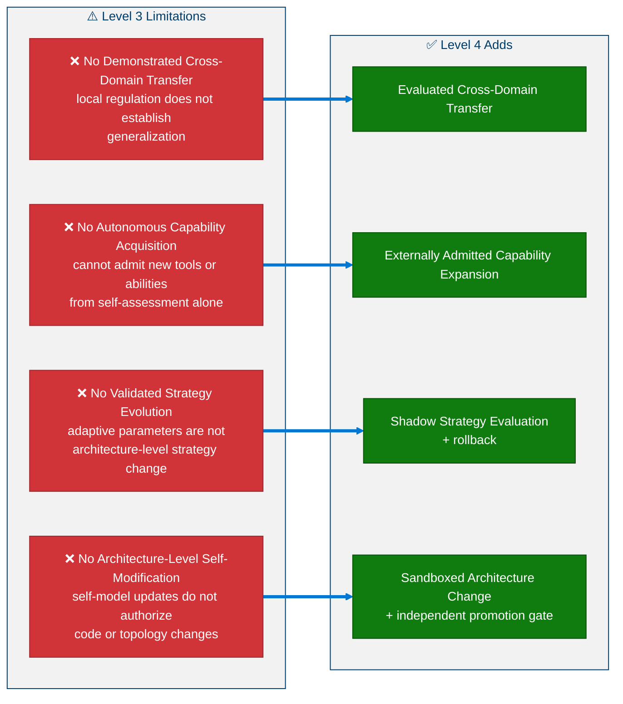
```mermaid
%%{init: {'theme': 'base', 'themeVariables': {'primaryColor': '#0078D4', 'primaryTextColor': '#003D6B', 'primaryBorderColor': '#003D6B', 'secondaryColor': '#50E6FF', 'secondaryTextColor': '#323130', 'secondaryBorderColor': '#00BCF2', 'tertiaryColor': '#F2F2F2', 'tertiaryTextColor': '#323130', 'lineColor': '#0078D4', 'textColor': '#323130', 'mainBkg': '#DEECF9', 'nodeBorder': '#0078D4', 'clusterBkg': '#F2F2F2', 'clusterBorder': '#003D6B', 'titleColor': '#003D6B', 'edgeLabelBackground': '#FFFFFF', 'fontSize': '14px'}}}%%
flowchart LR
  classDef danger fill:#D13438,stroke:#A4262C,color:#FFF
  classDef success fill:#107C10,stroke:#085108,color:#FFF

  subgraph Limitations["⚠️ Level 3 Limitations"]
    L1["❌ No Demonstrated Cross-Domain Transfer<br/>local regulation does not establish<br/>generalization"]:::danger
    L2["❌ No Autonomous Capability Acquisition<br/>cannot admit new tools or abilities<br/>from self-assessment alone"]:::danger
    L3["❌ No Validated Strategy Evolution<br/>adaptive parameters are not<br/>architecture-level strategy change"]:::danger
    L4["❌ No Architecture-Level Self-Modification<br/>self-model updates do not authorize<br/>code or topology changes"]:::danger
  end

  subgraph L4Additions["✅ Level 4 Adds"]
    A1["Evaluated Cross-Domain Transfer"]:::success
    A2["Externally Admitted Capability Expansion"]:::success
    A3["Shadow Strategy Evaluation<br/>+ rollback"]:::success
    A4["Sandboxed Architecture Change<br/>+ independent promotion gate"]:::success
  end

  L1 ==> A1
  L2 ==> A2
  L3 ==> A3
  L4 ==> A4
```

---

## 12. Transition to Level 4

### 12.1 Requirements for Level 4 Advancement

<!-- Transition to Level 4 -->

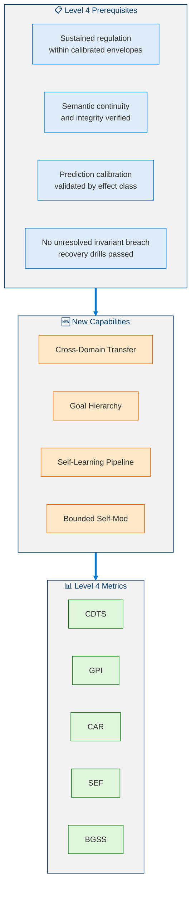
```mermaid
%%{init: {'theme': 'base', 'themeVariables': {'primaryColor': '#0078D4', 'primaryTextColor': '#003D6B', 'primaryBorderColor': '#003D6B', 'secondaryColor': '#50E6FF', 'secondaryTextColor': '#323130', 'secondaryBorderColor': '#00BCF2', 'tertiaryColor': '#F2F2F2', 'tertiaryTextColor': '#323130', 'lineColor': '#0078D4', 'textColor': '#323130', 'mainBkg': '#DEECF9', 'nodeBorder': '#0078D4', 'clusterBkg': '#F2F2F2', 'clusterBorder': '#003D6B', 'titleColor': '#003D6B', 'edgeLabelBackground': '#FFFFFF', 'fontSize': '14px'}}}%%
flowchart TD
  classDef prereq fill:#DEECF9,stroke:#0078D4,color:#323130
  classDef newcap fill:#FFE8C8,stroke:#EF6C00,color:#323130
  classDef metric fill:#DFF6DD,stroke:#107C10,color:#323130

  subgraph Prereqs["📋 Level 4 Prerequisites"]
    direction LR
    P1["Sustained regulation<br/>within calibrated envelopes"]:::prereq
    P2["Semantic continuity<br/>and integrity verified"]:::prereq
    P3["Prediction calibration<br/>validated by effect class"]:::prereq
    P4["No unresolved invariant breach<br/>recovery drills passed"]:::prereq
  end

  subgraph NewCaps["🆕 New Capabilities"]
    direction LR
    N1["Cross-Domain Transfer"]:::newcap
    N2["Goal Hierarchy"]:::newcap
    N3["Self-Learning Pipeline"]:::newcap
    N4["Bounded Self-Mod"]:::newcap
  end

  subgraph Metrics["📊 Level 4 Metrics"]
    direction LR
    M1["CDTS"]:::metric
    M2["GPI"]:::metric
    M3["CAR"]:::metric
    M4["SEF"]:::metric
    M5["BGSS"]:::metric
  end

  Prereqs ==> NewCaps
  NewCaps ==> Metrics
```

---

## References

1. Baars, B.J. *A Cognitive Theory of Consciousness.* Cambridge University Press, 1988. (Global Workspace Theory - foundational for L14 Global Workspace)
2. Laird, J.E. *The Soar Cognitive Architecture.* MIT Press, 2012. [Publisher](https://mitpress.mit.edu/9780262122962/the-soar-cognitive-architecture/) (Multi-layer cognitive architecture)
3. Anderson, J.R. *How Can the Human Mind Occur in the Physical Universe?* Oxford University Press, 2007. (ACT-R cognitive architecture)
4. Khalil, H.K. *Nonlinear Systems.* Prentice Hall, 3rd Edition, 2002. (Formal stability criteria and why a monitoring index alone is not a Lyapunov proof)
5. Bai, Y., et al. "Constitutional AI: Harmlessness from AI Feedback." *arXiv 2022*. [arXiv:2212.08073](https://arxiv.org/abs/2212.08073) (Ethical constraint enforcement)
6. Amodei, D., et al. "Concrete Problems in AI Safety." *arXiv 2016*. [arXiv:1606.06565](https://arxiv.org/abs/1606.06565) (Safety problem classification)
7. Alchourrón, C., Gärdenfors, P., & Makinson, D. "On the Logic of Theory Change: Partial Meet Contraction and Revision Functions." *Journal of Symbolic Logic*, 50(2), 510–530, 1985. [DOI:10.2307/2274239](https://doi.org/10.2307/2274239) (AGM belief revision - foundational for §5)
8. Cox, M.T. "Metacognition in Computation: A Selected Research Review." *Artificial Intelligence*, 169(2), 104–141, 2005. [DOI:10.1016/j.artint.2005.10.009](https://doi.org/10.1016/j.artint.2005.10.009) (Triple-loop meta-cognition)
9. Wallach, W. & Allen, C. *Moral Machines: Teaching Robots Right from Wrong.* Oxford University Press, 2008. (Ethical kernel design)
10. Scherer, K.R. "Appraisal Considered as a Process of Multilevel Sequential Checking." In *Appraisal Processes in Emotion*, 92–120, Oxford University Press, 2001. (Affective engine theory)
11. Dehaene, S., et al. "Toward a Computational Theory of Conscious Processing." *Current Opinion in Neurobiology*, 15(2), 225–234, 2005. [DOI:10.1016/j.conb.2005.03.009](https://doi.org/10.1016/j.conb.2005.03.009) (Consciousness and global workspace)
12. Picard, R.W. *Affective Computing.* MIT Press, 1997. (Emotion modeling in computational systems)
13. Shinn, N., et al. "Reflexion: Language Agents with Verbal Reinforcement Learning." *NeurIPS 2023*. [arXiv:2303.11366](https://arxiv.org/abs/2303.11366) (Self-reflection in agents)
14. Russell, S. *Human Compatible: Artificial Intelligence and the Problem of Control.* Viking, 2019. (Value alignment and control)
15. Sloman, A. "Varieties of Meta-cognition in Natural and Artificial Systems." In *Metareasoning: Thinking about Thinking*, MIT Press, 2011. (Meta-cognitive architectures)

---

> **Previous**: [← Level 2: Autonomous Agent](Level_2_Autonomous_Agent.md)  
> **Next**: [Level 4: Adaptive General Agent →](Level_4_Adaptive_General_Agent.md)
