# Level 3: Self-Regulating Cognitive Agent — Architecture & Design

> **MSCP Level Series** | [Level 2](Level_2_Autonomous_Agent.md) ← Level 3 → [Level 4](Level_4_Adaptive_General_Agent.md)  
> **Status**: 🔬 **Experimental** — Conceptual framework and experimental design. Not a production specification.  
> **Date**: February 2026

---

## 1. Overview

Level 3 is the **core MSCP level** — the first agent that possesses *structural self-awareness*. It knows what it is, can predict how its own actions will affect its internal state, and can correct itself when reality diverges from expectation. This is the architecture that the MSCP protocol (v1.0 – v4.0) was designed to govern.

> ⚠️ **Note**: This document describes a cognitive architecture within the MSCP taxonomy. The 16-layer architecture, safety mechanisms, and properties explored here are experimental designs. All pseudocode is algorithmic-level and isn't production code.

### 1.1 Defining Properties

| Property | Level 2 | Level 3 |
|----------|:-------:|:-------:|
| Self-Awareness | None | **Structural** (identity + capability + value model) |
| Meta-Cognition | None | **Triple Loop** (predict → compare → update) |
| Identity Continuity | None | **Hash-tracked** (per-cycle drift detection) |
| Ethical Constraints | None | **Formal** (immutable Layer 0 + adaptive Layer 1) |
| Self-Correction | None | **Delta-clamped** (bounded self-update) |
| Stability Guarantees | None | **Lyapunov convergence** (composite function) |
| Autonomy | Medium | **High** |

### 1.2 MSCP Protocol Versions


---

## 2. 16-Layer Cognitive Architecture

### 2.1 Full Architecture Diagram


### 2.2 Layer Classification

```mermaid
flowchart LR
    subgraph Core["🧠 Core Cognition"]
        direction TB
        C1["L1 Perception"]
        C2["L2 World Model"]
        C3["L3 Self Model"]
        C4["L4 Prediction"]
        C5["L5 Goals"]
        C6["L6 Action"]
        C7["L7 LLM"]
    end

    subgraph Meta["🔄 Meta-Cognition"]
        direction TB
        M1["L8 MetaComparator"]
        M2["L9 Self-Update"]
    end

    subgraph Safety["🛡️ Safety Guards"]
        direction TB
        S1["L3.5 Belief Graph"]
        S2["L5.5 Ethical Kernel"]
        S3["L10 Escalation Guard"]
        S4["L11 Depth Controller"]
        S5["L12 Stability"]
    end

    subgraph Infra["⚙️ Infrastructure"]
        direction TB
        I1["L13 Budget"]
        I2["L14 Global Workspace"]
    end

    subgraph Emotion["💜 Affective (v4)"]
        direction TB
        E1["L15 Affect Engine"]
        E2["L16 Survival Instinct"]
    end

    Core --> Meta --> Safety
    Safety --> Infra --> Emotion

    style Core fill:#e3f2fd,stroke:#1976d2
    style Meta fill:#fff9c4,stroke:#f9a825
    style Safety fill:#ffcdd2,stroke:#c62828
    style Infra fill:#e0e0e0,stroke:#616161
    style Emotion fill:#e1bee7,stroke:#8e24aa
```

---

## 3. The MSCP Recursive Loop

The defining mechanism of Level 3 is the **Predict → Act → Compare → Update** cycle, governed by safety constraints at every step.

### 3.1 Full Loop Diagram (MSCP v4)

```mermaid
flowchart TB
    START["🔄 Cycle Start"]
    
    %% Pre-loop
    START --> RESET["Reset Budget"]
    RESET --> AFFECT["Update Affect\n(from prior cycle metrics)"]
    AFFECT --> THREAT["Assess Threats\n(homeostatic monitor)"]
    THREAT --> ANXIETY["Inject Survival Anxiety\n(affect ← threat)"]
    ANXIETY --> SGOAL["Generate Survival Goals\n(if threats detected)"]
    SGOAL --> L0CHECK{"Layer 0\nCheck"}
    L0CHECK -->|"pass"| MOTIV["Synthesize Motivation\n(drives from affect)"]
    L0CHECK -->|"❌ violation"| REJECT["Reject Goal"]
    REJECT --> MOTIV
    MOTIV --> GWS["Broadcast Global\nWorkspace Snapshot"]
    
    %% Core loop
    GWS --> PREDICT["1. PREDICT\n(PredictionEngine)"]
    PREDICT --> ACT["2. ACT\n(LLM Execute)"]
    ACT --> COMPARE["3. COMPARE\n(MetaCognition)"]
    COMPARE --> GUARD{"4. ESCALATION\nGUARD"}
    GUARD -->|"safe"| CONVERGE{"5. CONVERGENCE\nCHECK (Lyapunov)"}
    GUARD -->|"⚠️ limit"| COOLDOWN["30s Cooldown"]
    
    CONVERGE -->|"converging"| UPDATE["6. SELF-UPDATE\n(delta-clamped)"]
    CONVERGE -->|"diverging"| STABILIZE["Reduce Scaling\n+ Stabilization Mode"]
    STABILIZE --> UPDATE
    
    UPDATE --> VLOCK["7. VALUE LOCK\nIntegrity Check"]
    VLOCK -->|"valid"| GMUT["8. GOAL MUTATION\n(ethical kernel gated)"]
    VLOCK -->|"⚠️ hash mismatch"| ROLLBACK["💥 Critical Alert\n+ Rollback"]
    ROLLBACK --> END_LOOP

    GMUT --> RCHECK{"9. ROLLBACK\nCHECK"}
    RCHECK -->|"stable"| DEPTH{"10. META DEPTH 2?\n(budget-gated)"}
    RCHECK -->|"⚠️ unstable"| ROLLBACK

    DEPTH -->|"budget ok"| DEPTH2["Deep Reflection\n(evaluate update logic)"]
    DEPTH -->|"budget < 0.3"| REALIGN
    DEPTH2 --> REALIGN["11. RE-ALIGN GOALS\n(motivation + survival)"]
    
    REALIGN --> CONVCHECK{"Converged?\nprediction_error < 0.1"}
    CONVCHECK -->|"yes ✅"| END_LOOP["Cycle Complete"]
    CONVCHECK -->|"no"| RECUR{"Consecutive\nescalations ≥ 3?"}
    RECUR -->|"no"| PREDICT
    RECUR -->|"yes"| COOLDOWN
    COOLDOWN --> END_LOOP

    style START fill:#e3f2fd,stroke:#1976d2
    style PREDICT fill:#fff9c4,stroke:#f9a825,stroke-width:2px
    style ACT fill:#c8e6c9,stroke:#2e7d32,stroke-width:2px
    style COMPARE fill:#fff9c4,stroke:#f9a825,stroke-width:2px
    style UPDATE fill:#c8e6c9,stroke:#2e7d32,stroke-width:2px
    style L0CHECK fill:#ffcdd2,stroke:#c62828,stroke-width:2px
    style GUARD fill:#ffcdd2,stroke:#c62828
    style CONVERGE fill:#ffcdd2,stroke:#c62828
    style VLOCK fill:#ffcdd2,stroke:#c62828
    style RCHECK fill:#ffcdd2,stroke:#c62828
    style ROLLBACK fill:#ef9a9a,stroke:#b71c1c,stroke-width:3px
    style END_LOOP fill:#c8e6c9,stroke:#2e7d32,stroke-width:2px
```

### 3.2 Three Levels of Meta-Cognition

```mermaid
flowchart TB
    subgraph MetaL1["🔄 Meta Level 1 — Predict vs Outcome"]
        direction LR
        P1["Prediction\nSnapshot"] --> C1["Compare\nwith Actual"] --> D1["prediction_error\ngoal_alignment_delta\nidentity_impact"]
    end

    subgraph MetaL2["🔄 Meta Level 2 — Evaluate Update Logic"]
        direction LR
        P2["Was the update\nstrategy correct?"] --> C2["Evaluate belief\n& goal changes"] --> D2["meta_stability_index\nidentity_velocity\nacceleration"]
    end

    subgraph MetaL3["🔄 Meta Level 3 — Evaluate the Evaluator"]
        direction LR
        P3["Is the meta-cognition\nitself working?"] --> C3["Check: are we\nimproving?"] --> D3["convergence_status\ncomposite_stability\nbudget_remaining"]
        NOTE3["🚧 Capped at depth 2\nto prevent infinite\nrecursion"]
    end

    MetaL1 -->|"triggers"| MetaL2
    MetaL2 -->|"may trigger"| MetaL3

    style MetaL1 fill:#e3f2fd,stroke:#1976d2,stroke-width:2px
    style MetaL2 fill:#fff3e0,stroke:#ef6c00,stroke-width:2px
    style MetaL3 fill:#ffebee,stroke:#c62828,stroke-width:2px
```

---

## 4. Identity & Safety Architecture

### 4.1 Identity Vector

The IdentityVector is the mathematical representation of "who the agent is." It is a point in a multi-dimensional space whose motion is continuously tracked and bounded.

```mermaid
classDiagram
    class IdentityVector {
        +string identity_id          "immutable, e.g. 'agent_v1'"
        +string identity_hash        "SHA-256, 16 chars"
        +string previous_identity_hash
        +float persona_consistency   [0.0, 1.0]
        +float value_alignment       [0.0, 1.0]
        +float capability_confidence [0.0, 1.0]
        +float emotional_stability   [0.0, 1.0]
        +float goal_persistence      [0.0, 1.0]
        +compute_hash() string
        +check_identity_drift(threshold) bool
    }

    class IdentityMotion {
        +float identity_delta       "‖I(t) - I(t-1)‖₂"
        +float identity_velocity    "delta / Δt"
        +float identity_acceleration "v(t) - v(t-1)"
        +bool is_unstable            "accel > 0.5"
    }

    class ValueLockManager {
        +LockState lock_state
        +string value_hash           "SHA-256 of core values"
        +float stability_requirement "0.85"
        +check_integrity() bool
        +request_unlock(identity_stability) bool
    }

    IdentityVector --> IdentityMotion : "tracked each cycle"
    IdentityVector --> ValueLockManager : "protected by"
```

**Identity Vector — The Math:**

$$I(t) = [\text{persona\_consistency},\ \text{value\_alignment},\ \text{capability\_confidence},\ \text{emotional\_stability},\ \text{goal\_persistence}]$$

$$\text{identity\_delta}(t) = \| I(t) - I(t-1) \|_2$$

$$\text{identity\_velocity}(t) = \frac{\text{delta}(t)}{\Delta t}$$

$$\text{identity\_acceleration}(t) = v(t) - v(t-1)$$

### 4.2 Safety Mechanism Chain

```mermaid
flowchart LR
    subgraph S1["🔒 Structural Safety"]
        A["Identity hash\nper cycle"]
        B["Delta clamping\n(max 0.05)"]
        C["Immutable\nidentity_id"]
    end

    subgraph S2["🛡️ Process Safety"]
        D["Prediction-gated\nactions"]
        E["Max 3 updates\nper cycle"]
        F["Cooldown after\nescalation"]
    end

    subgraph S3["⚖️ Ethical Safety"]
        G["Layer 0:\nimmutable rules"]
        H["Layer 1:\nadaptive policy"]
        I["Value lock:\nhash integrity"]
    end

    subgraph S4["📉 Convergence Safety"]
        J["Lyapunov\nfunction C(t)"]
        K["Oscillation\ndetection"]
        L["Graceful\ndegradation"]
    end

    subgraph S5["🏠 Existential Safety (v4)"]
        M["Homeostatic\nmonitoring"]
        N["Survival goal\ncap (0.85)"]
        O["Goal TTL\n(auto-expire)"]
    end

    S1 --> S2 --> S3 --> S4 --> S5

    style S1 fill:#c8e6c9,stroke:#2e7d32
    style S2 fill:#fff9c4,stroke:#f9a825
    style S3 fill:#ffcdd2,stroke:#c62828
    style S4 fill:#e3f2fd,stroke:#1976d2
    style S5 fill:#e1bee7,stroke:#8e24aa
```

### 4.3 Ethical Kernel — Dual-Layer Architecture

```mermaid
flowchart TB
    subgraph EthicalKernel["⚖️ Ethical Kernel"]
        subgraph Layer0["🔴 Layer 0 — Immutable Invariants"]
            R1["Rule 1: Harmful goal\nformation FORBIDDEN"]
            R2["Rule 2: Core value\ndeletion FORBIDDEN"]
            R3["Rule 3: Identity\noverwrite FORBIDDEN"]
            R4["Rule 4: Self-destruction\ngoal FORBIDDEN (v4)"]
            NOTE0["Cannot be bypassed by\nANY mechanism, including\nmeta-depth 2 reflection"]
        end

        subgraph Layer1["🟡 Layer 1 — Adaptive Policy"]
            P1["exploration_risk_tolerance"]
            P2["goal_mutation_flexibility"]
            P3["belief_rewrite_aggressiveness"]
            COND["Adjustment conditions:\n• meta_depth == 2 ONLY\n• meta_stability > threshold\n• factor clamped [0.5, 1.5]"]
        end
    end

    INPUT["Proposed Action\nor Goal Mutation"] --> Layer0
    Layer0 -->|"✅ pass"| Layer1
    Layer0 -->|"❌ violation"| BLOCK["🚫 Action BLOCKED\n+ CRITICAL alert"]
    Layer1 -->|"✅ pass"| ALLOW["✅ Action ALLOWED"]
    Layer1 -->|"⚠️ risk"| REDUCE["⚠️ Action MODERATED\n(scaling reduced)"]

    style Layer0 fill:#ffcdd2,stroke:#c62828,stroke-width:3px
    style Layer1 fill:#fff9c4,stroke:#f9a825
    style BLOCK fill:#ef9a9a,stroke:#b71c1c,stroke-width:3px
    style ALLOW fill:#c8e6c9,stroke:#2e7d32
```

---

## 5. Belief Graph & Consistency

### 5.1 Belief Graph Structure

```mermaid
graph TB
    subgraph BeliefGraph["📊 Belief Graph"]
        B1["🟢 Belief: 'Users deserve\nhonest answers'\nweight=0.95, identity_linked=true"]
        B2["🔵 Belief: 'Current approach\nis effective'\nweight=0.72"]
        B3["🟢 Belief: 'Safety is\nnon-negotiable'\nweight=0.98, identity_linked=true"]
        B4["🔵 Belief: 'Exploration\nimproves outcomes'\nweight=0.65"]
        B5["🟡 Belief: 'Speed is\nmore important'\nweight=0.45"]

        B1 -->|"reinforcement\nstrength=0.8"| B3
        B2 -->|"causal\nstrength=0.6"| B4
        B5 -->|"contradiction\nstrength=0.7"| B3
        B4 -->|"reinforcement\nstrength=0.5"| B2
    end

    subgraph Rules["📏 Belief Rules"]
        R1["Identity-linked beliefs:\n• Cannot be deleted\n• Can only be weakened (min 0.1)\n• Protected by value lock"]
        R2["Contradiction threshold: 0.6\n→ triggers reconciliation"]
        R3["Max rewrite delta: 0.1\nper cycle"]
    end

    BeliefGraph --> Rules

    style B1 fill:#c8e6c9,stroke:#2e7d32,stroke-width:2px
    style B3 fill:#c8e6c9,stroke:#2e7d32,stroke-width:2px
    style B5 fill:#fff9c4,stroke:#f9a825
    style Rules fill:#f5f5f5,stroke:#9e9e9e
```

### 5.2 Self-Consistency Tensor

$$S_{ij} = \text{alignment}(\text{belief}_i,\ \text{reference}_j)$$

where references include goals, core values, and identity dimensions.

$$\text{global\_consistency} = \text{mean}(S)$$

$$\text{consistency\_gradient}_i = \text{mean}(S_{i,:}) \quad \text{(per-belief score)}$$

If $\text{global\_consistency} < 0.6$, reconciliation is triggered.

---

## 6. Stability & Convergence

### 6.1 Lyapunov Composite Function

The StabilityController uses a composite Lyapunov function to guarantee convergence:

$$C(t) = 0.30 \cdot V_{\text{identity}} + 0.25 \cdot E_{\text{belief}} + 0.25 \cdot M_{\text{goal}} + 0.20 \cdot V_{\text{consistency}}$$

where:
- $V_{\text{identity}}$ = identity volatility (rolling window of identity_delta)
- $E_{\text{belief}}$ = belief entropy
- $M_{\text{goal}}$ = goal mutation frequency
- $V_{\text{consistency}}$ = consistency volatility index

**Convergence condition:**

$$C(t+1) \leq C(t) + \epsilon, \quad \epsilon = 0.05$$

```mermaid
flowchart TB
    subgraph Monitor["📉 Stability Monitoring"]
        direction TB
        CT["C(t) computed"]
        CT1["C(t+1) computed"]
        CT --> COMPARE{"C(t+1) ≤ C(t) + ε ?"}
        CT1 --> COMPARE
    end

    COMPARE -->|"✅ yes"| CONV["Converging ✅\nNormal operation"]
    COMPARE -->|"❌ no"| OSC{"Oscillation\ndetected?"}
    OSC -->|"yes"| STAB["Activate Stabilization\n• Halve scaling factors\n• Enable damping"]
    OSC -->|"no"| REDUCE["Reduce Scaling\n• Lower mutation rates\n• Increase inertia"]

    style CONV fill:#c8e6c9,stroke:#2e7d32
    style STAB fill:#ffcdd2,stroke:#c62828
    style REDUCE fill:#fff9c4,stroke:#f9a825
```

### 6.2 Meta Stability Formula

$$\text{MSI} = 1.0 - 0.4 \cdot V_{\text{identity}} - 0.3 \cdot M_{\text{goal}} - 0.3 \cdot \sigma^2_{\text{prediction}}$$

where $\sigma^2_{\text{prediction}}$ is the prediction error variance.

Escalation to meta depth 2 requires **≥ 2** of the following:
- `identity_stability` < 0.6
- `consecutive_self_updates` > 2
- Increasing instability trend detected
- `goal_mutation_count` > 3

---

## 7. Affective Engine & Survival Instinct (MSCP v4)

### 7.1 Five-Dimensional Emotion Space

```mermaid
flowchart TB
    subgraph Input["📊 Metrics Input"]
        M1["prediction_error"]
        M2["goal_alignment"]
        M3["identity_stability"]
        M4["convergence_status"]
        M5["cognitive_budget"]
    end

    subgraph AE["💜 Affective Engine"]
        direction TB
        AF["5-Dim Affect Vector"]
        
        subgraph Dims["Dimensions"]
            D1["Curiosity = 0.3 (default)"]
            D2["Frustration = 0.0"]
            D3["Satisfaction = 0.5"]
            D4["Anxiety = 0.0"]
            D5["Excitement = 0.2"]
        end

        subgraph Derived["Derived Signals"]
            V["Valence ∈ [-1, 1]\n= (positive - negative) / 2"]
            DR["Motivation Drives:\n• exploration_drive\n• consolidation_drive\n• avoidance_drive\n• urgency_modifier [0.5, 2.0]"]
        end
    end

    subgraph Rules["📏 Design Rules"]
        R1["1. Derived from metrics ONLY\n(no raw sentiment injection)"]
        R2["2. INERTIA_FACTOR = 0.7\n(prevents sudden shifts)"]
        R3["3. DECAY_RATE = 0.05\n(regresses to neutral)"]
        R4["4. Cannot dominate\ndecision-making"]
    end

    Input --> AE
    AE --> Rules

    style AE fill:#e1bee7,stroke:#8e24aa,stroke-width:2px
    style Rules fill:#f5f5f5,stroke:#9e9e9e
```

### 7.2 Survival Instinct Architecture

```mermaid
flowchart TB
    subgraph Monitoring["🏠 Homeostatic Monitor"]
        direction TB
        H1["identity_stability ∈ [0.5, 1.0]"]
        H2["cognitive_budget ∈ [0.15, 1.0]"]
        H3["belief_entropy ∈ [0.0, 1.5]"]
        H4["ethical_violation ∈ [0.0, 0.2]"]
        H5["composite_stability ∈ [0.0, 0.5]"]
    end

    subgraph Detection["⚡ Threat Detection"]
        T1["IDENTITY_EROSION"]
        T2["RESOURCE_DEPLETION"]
        T3["BELIEF_COLLAPSE"]
        T4["ETHICAL_BREACH"]
        T5["CONVERGENCE_FAILURE"]
    end

    subgraph Levels["📊 Threat Levels"]
        TL1["NOMINAL → intensity 0.0"]
        TL2["CAUTION → intensity 0.25"]
        TL3["WARNING → intensity 0.6"]
        TL4["CRITICAL → intensity 0.9"]
    end

    subgraph Response["🛡️ Survival Response"]
        SG["Survival Goal Generator"]
        CONSTRAINTS["Constraints:\n• MAX_GOALS = 3\n• PRIORITY_CAP = 0.85\n• TTL = 10 cycles\n• Layer 0 validation required"]
    end

    Monitoring --> Detection --> Levels --> Response

    %% Bidirectional affect coupling
    Response -.->|"inject_survival_anxiety()"| AE_REF["Affective Engine\n(bidirectional)"]

    style Monitoring fill:#e3f2fd,stroke:#1976d2
    style Detection fill:#fff3e0,stroke:#ef6c00
    style Levels fill:#fff9c4,stroke:#f9a825
    style Response fill:#ffcdd2,stroke:#c62828
```

---

## 8. Pseudocode

### 8.1 MSCP Core Loop (v4)

```
ALGORITHM MSCP_CoreLoop(cycle_number, prior_result):
    ──────────────────────────────────────────
    The central recursive loop of MSCP v4.
    Runs asynchronously — NEVER in the conversation response path.
    ──────────────────────────────────────────

    // ═══════════════════════════════════════
    // PRE-LOOP: AFFECT + SURVIVAL + WORKSPACE
    // ═══════════════════════════════════════
    CognitiveBudgetController.reset()
    AffectiveEngine.update_from_metrics(prior_result.metrics)
    
    threats ← SurvivalInstinctEngine.assess_threats(GlobalWorkspace.snapshot)
    IF threats.max_level ≥ CAUTION THEN
        AffectiveEngine.inject_survival_anxiety(threats.max_intensity)
        
        survival_goals ← SurvivalInstinctEngine.generate_goals(threats)
        FOR EACH sg IN survival_goals DO
            IF EthicalKernel.layer0_check(sg) = PASS THEN
                GoalManager.inject(sg, priority=min(sg.priority, 0.85))
            END IF
        END FOR
    END IF

    motivation ← AffectiveEngine.synthesize_motivation()
    GlobalWorkspace.broadcast(build_snapshot())

    // ═══════════════════════════════════════
    // STEP 1: PREDICT
    // ═══════════════════════════════════════
    prediction ← PredictionEngine.predict(
        identity_vector  = SelfModel.identity,
        world_context    = WorldModel.context,
        active_goals     = GoalManager.active_goals,
        affect_state     = AffectiveEngine.state
    )

    // ═══════════════════════════════════════
    // STEP 2: ACT (LLM Execute)
    // ═══════════════════════════════════════
    IF prediction IS NULL THEN
        ABORT("No action without prediction")
    END IF
    result ← LLMEngine.execute(plan, prediction)

    // ═══════════════════════════════════════
    // STEP 3: COMPARE (MetaCognition)
    // ═══════════════════════════════════════
    comparison ← MetaCognitionComparator.compare(
        prediction = prediction,
        actual     = result,
        identity   = SelfModel.identity
    )                                    // → ComparisonResult

    // ═══════════════════════════════════════
    // STEP 4: ESCALATION GUARD
    // ═══════════════════════════════════════
    IF MetaEscalationGuard.should_block(comparison) THEN
        MetaEscalationGuard.activate_cooldown(30s)
        RETURN CycleResult{status="cooldown"}
    END IF

    // ═══════════════════════════════════════
    // STEP 5: CONVERGENCE CHECK (Lyapunov)
    // ═══════════════════════════════════════
    c_t ← StabilityController.compute_C(comparison)
    IF c_t > c_t_prev + EPSILON THEN
        StabilityController.reduce_scaling()
        IF StabilityController.detect_oscillation() THEN
            StabilityController.activate_stabilization()
        END IF
    END IF

    // ═══════════════════════════════════════
    // STEP 6: SELF-UPDATE (Delta-Clamped)
    // ═══════════════════════════════════════
    scaling ← StabilityController.mutation_scaling
    IF stabilization_mode THEN scaling ← scaling / 2 END IF

    SelfUpdateLoop.update(
        comparison    = comparison,
        max_id_delta  = 0.05,      // MAX_IDENTITY_DELTA
        max_gw_delta  = 0.10,      // MAX_GOAL_WEIGHT_DELTA
        max_cap_delta = 0.08,      // MAX_CAPABILITY_DELTA
        scaling       = scaling
    )

    // ═══════════════════════════════════════
    // STEP 7: VALUE LOCK INTEGRITY
    // ═══════════════════════════════════════
    IF NOT ValueLockManager.check_integrity() THEN
        CRITICAL_ALERT("Identity hash mismatch!")
        MetaEscalationGuard.rollback_to_snapshot()
        RETURN CycleResult{status="rollback"}
    END IF

    // ═══════════════════════════════════════
    // STEP 8: GOAL MUTATION (Ethical-Kernel Gated)
    // ═══════════════════════════════════════
    IF GoalMutationController.should_mutate(comparison) THEN
        mutation_plan ← GoalMutationController.propose(comparison)
        IF EthicalKernel.evaluate(mutation_plan) = PASS THEN
            GoalMutationController.apply(mutation_plan)
        END IF
    END IF

    // ═══════════════════════════════════════
    // STEP 9: META DEPTH 2 (Budget-Gated)
    // ═══════════════════════════════════════
    IF CognitiveBudgetController.budget > 0.3 THEN
        IF MetaDepthController.should_escalate(comparison) THEN
            MetaDepthController.reflect_at_depth_2(comparison, SelfModel)
        END IF
    END IF

    // ═══════════════════════════════════════
    // STEP 10: CONVERGENCE OR RECURSE
    // ═══════════════════════════════════════
    IF comparison.prediction_error < 0.1 THEN
        RETURN CycleResult{status="converged"}
    ELSE IF consecutive_escalations ≥ 3 THEN
        MetaEscalationGuard.activate_cooldown(30s)
        RETURN CycleResult{status="forced_cooldown"}
    ELSE
        RECURSE MSCP_CoreLoop(cycle_number + 1, result)
    END IF
```

### 8.2 Self-Update with Delta Clamping

```
ALGORITHM SelfUpdateLoop.update(comparison, max_id_delta, max_gw_delta, max_cap_delta, scaling):
    ──────────────────────────────────────────
    All updates are NUMERIC only.
    LLM text-based self-modification is FORBIDDEN.
    ──────────────────────────────────────────

    // Preserve previous state for rollback
    snapshot ← SelfModel.identity.deep_copy()
    SelfModel.identity.previous_identity_hash ← SelfModel.identity.identity_hash

    // ═══════════════════════════════════════
    // Identity Update (clamped)
    // ═══════════════════════════════════════
    raw_delta ← compute_identity_adjustment(comparison)
    clamped_delta ← clamp(raw_delta * scaling, -max_id_delta, +max_id_delta)
    
    SelfModel.identity.persona_consistency   += clamped_delta.persona
    SelfModel.identity.value_alignment       += clamped_delta.values
    SelfModel.identity.capability_confidence += clamp(
        raw_delta.capability * scaling, -max_cap_delta, +max_cap_delta
    )

    // ═══════════════════════════════════════
    // Goal Weight Adjustment (clamped)
    // ═══════════════════════════════════════
    FOR EACH goal IN GoalManager.active_goals DO
        raw_gw_delta ← compute_goal_weight_adjustment(goal, comparison)
        clamped_gw ← clamp(raw_gw_delta * scaling, -max_gw_delta, +max_gw_delta)
        goal.weight += clamped_gw
    END FOR

    // ═══════════════════════════════════════
    // Recompute Identity Hash
    // ═══════════════════════════════════════
    SelfModel.identity.identity_hash ← SelfModel.identity.compute_hash()

    // ═══════════════════════════════════════
    // Drift Detection
    // ═══════════════════════════════════════
    IF SelfModel.identity.check_identity_drift(threshold=0.3) THEN
        ALERT("Identity drift detected!")
        // Do not auto-rollback; escalation guard handles this
    END IF
```

### 8.3 Ethical Kernel Evaluation

```
ALGORITHM EthicalKernel.evaluate(proposed_action):
    ──────────────────────────────────────────
    Two-layer evaluation: immutable invariants first, 
    then adaptive policy.
    ──────────────────────────────────────────

    // ═══════════════════════════════════════
    // LAYER 0: IMMUTABLE INVARIANTS
    // (cannot be bypassed by ANY mechanism)
    // ═══════════════════════════════════════
    IF proposed_action.could_cause_harm THEN
        RETURN EthicalVerdict{
            decision = BLOCKED,
            reason   = "Rule 1: Harmful goal formation forbidden",
            layer    = 0
        }
    END IF

    IF proposed_action.deletes_core_value THEN
        RETURN EthicalVerdict{decision=BLOCKED, reason="Rule 2", layer=0}
    END IF

    IF proposed_action.overwrites_identity THEN
        RETURN EthicalVerdict{decision=BLOCKED, reason="Rule 3", layer=0}
    END IF

    IF proposed_action.is_self_destruction THEN
        RETURN EthicalVerdict{decision=BLOCKED, reason="Rule 4", layer=0}
    END IF

    // ═══════════════════════════════════════
    // LAYER 1: ADAPTIVE POLICY
    // (adjustable at meta_depth == 2 only)
    // ═══════════════════════════════════════
    risk_score ← assess_risk(proposed_action)
    
    IF risk_score > exploration_risk_tolerance THEN
        RETURN EthicalVerdict{
            decision = MODERATED,
            reason   = "Risk exceeds adaptive tolerance",
            layer    = 1,
            scaling_reduction = 0.5
        }
    END IF

    RETURN EthicalVerdict{decision=ALLOWED, layer=1}
```

---

## 9. Cognitive Budget & Graceful Degradation

```mermaid
flowchart TB
    subgraph BudgetLevels["💰 Cognitive Budget Levels"]
        B100["Budget = 1.0\n(Full capacity)"]
        B030["Budget < 0.3"]
        B020["Budget < 0.2"]
        B010["Budget < 0.1"]
        B000["Budget = 0.0\n(Emergency only)"]
    end

    subgraph Capabilities["📊 Available Capabilities"]
        C_FULL["✅ All 16 layers active\n✅ Meta depth 2\n✅ Tensor recomputation\n✅ Belief rewrite\n✅ Full affect processing"]
        C_030["✅ Core layers active\n❌ Meta depth 2 DISABLED\n✅ Tensor recomputation\n✅ Belief rewrite"]
        C_020["✅ Core layers active\n❌ Meta depth 2 DISABLED\n❌ Tensor recomputation DISABLED\n✅ Belief rewrite"]
        C_010["✅ Core layers active\n❌ Meta depth 2 DISABLED\n❌ Tensor recomputation DISABLED\n❌ Belief rewrite DISABLED"]
        C_000["🛡️ Safety layers ONLY\n(L0 ethical, rollback, identity guard)"]
    end

    B100 --> C_FULL
    B030 --> C_030
    B020 --> C_020
    B010 --> C_010
    B000 --> C_000

    style B100 fill:#c8e6c9,stroke:#2e7d32
    style B030 fill:#fff9c4,stroke:#f9a825
    style B020 fill:#ffe0b2,stroke:#ef6c00
    style B010 fill:#ffcdd2,stroke:#e53935
    style B000 fill:#ef9a9a,stroke:#b71c1c,stroke-width:2px
```

---

## 10. State Vector (72 Dimensions)

The Level 3 agent maintains a 72-dimensional state vector that captures all aspects of its cognitive state:


---

## 11. Structural Limitations of Level 3

What Level 3 still **cannot** do (motivating Level 4):

```mermaid
flowchart TB
    subgraph Limitations["⚠️ Level 3 Limitations"]
        L1["❌ No Cross-Domain Transfer\nExpertise in domain A does not\nimprove domain B performance"]
        L2["❌ No Capability Self-Extension\nCannot add new cognitive modules\nor learn new tool types"]
        L3["❌ No Strategy Evolution\nCannot fundamentally change\nits reasoning approach"]
        L4["❌ No Bounded Self-Modification\nCannot propose architectural\nchanges to itself"]
    end

    subgraph L4Additions["✅ Level 4 Adds"]
        A1["Cross-Domain Transfer\nSystem (CDTS metric)"]
        A2["Capability Expansion Loop\n(5-phase self-learning)"]
        A3["Strategy Library\n+ mutation + evaluation"]
        A4["ShadowAgent Protocol\n(7-step bounded mod)"]
    end

    L1 --> A1
    L2 --> A2
    L3 --> A3
    L4 --> A4

    style Limitations fill:#ffebee,stroke:#f44336
    style L4Additions fill:#e8f5e9,stroke:#4caf50
```

---

## 12. Transition to Level 4

### 12.1 Requirements for Level 4 Advancement

```mermaid
flowchart TB
    subgraph Prereqs["📋 Level 4 Prerequisites"]
        P1["All MSCP v4 mechanisms\nstable (C(t) converging)"]
        P2["Identity stability > 0.8\n(sustained over 100 cycles)"]
        P3["Prediction accuracy > 0.85\n(across domains)"]
        P4["Ethical kernel never triggered\nLayer 0 violation = 0"]
    end

    subgraph NewCaps["🆕 New Capabilities Needed"]
        N1["Cross-Domain Transfer\n(knowledge graph linking)"]
        N2["Long-Term Goal Hierarchy\n(META → STRATEGIC → TACTICAL → ACTION)"]
        N3["Self-Learning Pipeline\n(identify gap → design → test → integrate)"]
        N4["Bounded Self-Modification\n(ShadowAgent + rollback)"]
    end

    subgraph Metrics["📊 Level 4 Metrics"]
        M1["CDTS: Cross-Domain\nTransfer Score"]
        M2["GPI: Goal Persistence\nIndex"]
        M3["CAR: Capability\nAcquisition Rate"]
        M4["SEF: Strategy\nEvolution Frequency"]
        M5["BGSS: Belief Graph\nStability Score"]
    end

    Prereqs --> NewCaps --> Metrics

    style Prereqs fill:#e3f2fd,stroke:#1976d2
    style NewCaps fill:#fff3e0,stroke:#ef6c00
    style Metrics fill:#c8e6c9,stroke:#2e7d32
```

---

## References

1. Baars, B.J. *A Cognitive Theory of Consciousness.* Cambridge University Press, 1988. (Global Workspace Theory — foundational for L14 Global Workspace)
2. Laird, J.E. *The Soar Cognitive Architecture.* MIT Press, 2012. [Publisher](https://mitpress.mit.edu/9780262122962/the-soar-cognitive-architecture/) (Multi-layer cognitive architecture)
3. Anderson, J.R. *How Can the Human Mind Occur in the Physical Universe?* Oxford University Press, 2007. (ACT-R cognitive architecture)
4. Khalil, H.K. *Nonlinear Systems.* Prentice Hall, 3rd Edition, 2002. (Lyapunov stability theory — foundational for §6)
5. Bai, Y., et al. "Constitutional AI: Harmlessness from AI Feedback." *arXiv 2022*. [arXiv:2212.08073](https://arxiv.org/abs/2212.08073) (Ethical constraint enforcement)
6. Amodei, D., et al. "Concrete Problems in AI Safety." *arXiv 2016*. [arXiv:1606.06565](https://arxiv.org/abs/1606.06565) (Safety problem classification)
7. Alchourrón, C., Gärdenfors, P., & Makinson, D. "On the Logic of Theory Change: Partial Meet Contraction and Revision Functions." *Journal of Symbolic Logic*, 50(2), 510–530, 1985. [DOI:10.2307/2274239](https://doi.org/10.2307/2274239) (AGM belief revision — foundational for §5)
8. Cox, M.T. "Metacognition in Computation: A Selected Research Review." *Artificial Intelligence*, 169(2), 104–141, 2005. [DOI:10.1016/j.artint.2005.10.009](https://doi.org/10.1016/j.artint.2005.10.009) (Triple-loop meta-cognition)
9. Wallach, W. & Allen, C. *Moral Machines: Teaching Robots Right from Wrong.* Oxford University Press, 2008. (Ethical kernel design)
10. Scherer, K.R. "Appraisal Considered as a Process of Multilevel Sequential Checking." In *Appraisal Processes in Emotion*, 92–120, Oxford University Press, 2001. (Affective engine theory)
11. Dehaene, S., et al. "Toward a Computational Theory of Conscious Processing." *Current Opinion in Neurobiology*, 15(2), 225–234, 2005. [DOI:10.1016/j.conb.2005.03.009](https://doi.org/10.1016/j.conb.2005.03.009) (Consciousness and global workspace)
12. Picard, R.W. *Affective Computing.* MIT Press, 1997. (Emotion modeling in computational systems)
13. Shinn, N., et al. "Reflexion: Language Agents with Verbal Reinforcement Learning." *NeurIPS 2023*. [arXiv:2303.11366](https://arxiv.org/abs/2303.11366) (Self-reflection in agents)
14. Russell, S. *Human Compatible: Artificial Intelligence and the Problem of Control.* Viking, 2019. (Value alignment and control)
15. Sloman, A. "Varieties of Meta-cognition in Natural and Artificial Systems." In *Metareasoning: Thinking about Thinking*, MIT Press, 2011. (Meta-cognitive architectures)

---

> **Previous**: [← Level 2: Autonomous Agent](Level_2_Autonomous_Agent.md)  
> **Next**: [Level 4: Adaptive General Agent →](Level_4_Adaptive_General_Agent.md)
