# Level 3: Self-Regulating Cognitive Agent — Architecture & Design

> **MSCP Level Series** | [Level 2](Level_2_Autonomous_Agent.md) ← Level 3 → [Level 4](Level_4_Adaptive_General_Agent.md)  
> **Status**: 🔬 **Experimental** — Conceptual framework and experimental design. Not a production specification.  
> **Date**: February 2026

---

## 1. Overview

Level 3 is the **core MSCP level** — the first agent that possesses *structural self-awareness*. It knows what it is, can predict how its own actions will affect its internal state, and can correct itself when reality diverges from expectation. This is the architecture that the MSCP protocol (v1.0 – v4.0) was designed to govern.

> ⚠️ **Note**: This document describes a cognitive architecture within the MSCP taxonomy. The 16-layer architecture, safety mechanisms, and properties explored here are experimental designs. All pseudocode is algorithmic-level and isn't production code.

### 1.1 Defining Properties

| Property | Level 2 | Level 3 |
|----------|:-------:|:-------:|
| Self-Awareness | None | **Structural** (identity + capability + value model) |
| Meta-Cognition | None | **Triple Loop** (predict → compare → update) |
| Identity Continuity | None | **Hash-tracked** (per-cycle drift detection) |
| Ethical Constraints | None | **Formal** (immutable Layer 0 + adaptive Layer 1) |
| Self-Correction | None | **Delta-clamped** (bounded self-update) |
| Stability Guarantees | None | **Lyapunov convergence** (composite function) |
| Autonomy | Medium | **High** |

### 1.2 Formal Definition

> **Definition 1 (Level 3 Agent).** A Level 3 agent is a self-regulating process $\mathcal{A}_3$ defined as an 8-tuple:
>
> $$\mathcal{A}_3 = \langle \mathcal{R}, \mathcal{O}, \mathcal{S}, \mathcal{G}, M_{\text{self}}, \Pi, \mathcal{C}, \Lambda \rangle$$
>
> where $M_{\text{self}}$ is the self-model (identity vector), $\Pi$ is the prediction engine, $\mathcal{C}$ is the ethical constraint kernel, and $\Lambda$ is the meta-cognition comparator.
>
> The transition function is:
>
> $$f_3 : \mathcal{R} \times \mathcal{S} \times \mathcal{G} \times M_{\text{self}} \to \mathcal{O} \times \mathcal{S}' \times \mathcal{G}' \times M'_{\text{self}}$$
>
> subject to the **stability constraint**:
>
> $$\| M'_{\text{self}} - M_{\text{self}} \|_2 \leq \delta_{\max}$$

> **Definition 2 (MSCP Core Loop).** The MSCP protocol enforces a **predict–act–compare–update** cycle at each time step $t$:
>
> 1. **Predict**: $\hat{\Delta}_t = \Pi(a_t, M_{\text{self}}(t))$ — predict the effect of action $a_t$ on the self-model
> 2. **Act**: Execute $a_t$, observe actual outcome
> 3. **Compare**: Compute prediction error $\epsilon_t = \| \hat{\Delta}_t - \Delta_t^{\text{actual}} \|_2$
> 4. **Update**: $M_{\text{self}}(t+1) = M_{\text{self}}(t) + \text{clamp}(\Delta_t^{\text{actual}}, -\delta_{\max}, +\delta_{\max})$
>
> The loop converges when $\epsilon_t < \epsilon_{\min}$ for $k$ consecutive cycles.

> **Definition 3 (Meta-Cognition Levels).** Level 3 implements a triple-loop meta-cognition hierarchy:
>
> - **L1 (Object Level)**: Action execution — $a_t = \pi(r_t, s_t, G_t)$
> - **L2 (Meta Level)**: Strategy evaluation — $q_t = \text{eval}(\pi, \text{history})$
> - **L3 (Meta-Meta Level)**: Evaluation of the evaluator — $m_t = \text{meta eval}(q_t, \text{consistency})$
>
> $$\text{Depth}(t) = \min\bigl(d : \|m_d(t) - m_{d-1}(t)\| < \epsilon_{\text{meta}}\bigr) \leq d_{\max}$$
>
> where $d_{\max} = 3$ prevents unbounded recursive reflection.

### 1.3 MSCP Protocol Versions

<!-- MSCP Version Evolution -->

```mermaid
%%{init: {'theme': 'base', 'themeVariables': {'primaryColor': '#0078D4', 'primaryTextColor': '#003D6B', 'primaryBorderColor': '#003D6B', 'secondaryColor': '#50E6FF', 'secondaryTextColor': '#323130', 'secondaryBorderColor': '#00BCF2', 'tertiaryColor': '#F2F2F2', 'tertiaryTextColor': '#323130', 'lineColor': '#0078D4', 'textColor': '#323130', 'mainBkg': '#DEECF9', 'nodeBorder': '#0078D4', 'clusterBkg': '#F2F2F2', 'clusterBorder': '#003D6B', 'titleColor': '#003D6B', 'edgeLabelBackground': '#FFFFFF', 'fontSize': '14px'}}}%%
flowchart TB
  classDef v0 fill:#DEECF9,stroke:#0078D4,color:#323130
  classDef v1 fill:#DFF6DD,stroke:#107C10,color:#323130
  classDef v1x fill:#FFE8C8,stroke:#EF6C00,color:#323130
  classDef v2 fill:#EDE3F6,stroke:#8764B8,color:#323130
  classDef v3 fill:#E0F2EF,stroke:#00B7C3,color:#323130
  classDef v4 fill:#FDE7E9,stroke:#D13438,color:#323130

  subgraph v0x["v0.x Prototype"]
    direction LR
    a0["State externalization"]:::v0
    b0["Identity seed"]:::v0
    c0["Basic reflection"]:::v0
  end

  subgraph v10["v1.0"]
    direction LR
    a1["PredictionEngine"]:::v1
    b1["MetaCognition Comparator"]:::v1
    c1["Agency Attribution"]:::v1
  end

  subgraph v1xx["v1.1–1.3"]
    direction LR
    a1x["Identity hash tracking"]:::v1x
    b1x["Drift detection"]:::v1x
    c1x["Self-Impact Prediction"]:::v1x
    d1x["MetaEscalationGuard"]:::v1x
  end

  subgraph v20["v2.0"]
    direction LR
    a2["GoalMutationController"]:::v2
    b2["ValueLockManager"]:::v2
    c2["MetaDepthController — depth 2"]:::v2
    d2["Meta Stability Formula"]:::v2
  end

  subgraph v30["v3.0"]
    direction LR
    a3["BeliefGraphManager"]:::v3
    b3["IdentityVector formalization"]:::v3
    c3["EthicalKernel — Layer 0+1"]:::v3
    d3["SelfConsistencyTensor"]:::v3
  end

  subgraph v40["v4.0"]
    direction LR
    a4["AffectiveEngine — 5-dim"]:::v4
    b4["SurvivalInstinctEngine"]:::v4
    c4["Async separation principle"]:::v4
    d4["GlobalWorkspace broadcast"]:::v4
  end

  v0x ==> v10
  v10 ==> v1xx
  v1xx ==> v20
  v20 ==> v30
  v30 ==> v40
```

---

## 2. 16-Layer Cognitive Architecture

### 2.1 Full Architecture Diagram

**Part 1 — Perception → Goal (L1–L5.5):**

<!-- 16-Layer Part 1: Perception to Goal -->

```mermaid
%%{init: {'theme': 'base', 'themeVariables': {'primaryColor': '#0078D4', 'primaryTextColor': '#003D6B', 'primaryBorderColor': '#003D6B', 'secondaryColor': '#50E6FF', 'secondaryTextColor': '#323130', 'secondaryBorderColor': '#00BCF2', 'tertiaryColor': '#F2F2F2', 'tertiaryTextColor': '#323130', 'lineColor': '#0078D4', 'textColor': '#323130', 'mainBkg': '#DEECF9', 'nodeBorder': '#0078D4', 'clusterBkg': '#F2F2F2', 'clusterBorder': '#003D6B', 'titleColor': '#003D6B', 'edgeLabelBackground': '#FFFFFF', 'fontSize': '14px'}}}%%
flowchart TD
  classDef perception fill:#DEECF9,stroke:#0078D4,color:#323130
  classDef selfModel fill:#DFF6DD,stroke:#107C10,color:#323130
  classDef prediction fill:#FFF4CE,stroke:#FFB900,color:#323130
  classDef goal fill:#FFE8C8,stroke:#EF6C00,color:#323130
  classDef ethical fill:#FDE7E9,stroke:#D13438,color:#323130
  classDef neutral fill:#F2F2F2,stroke:#8A8886,color:#323130

  subgraph L1["Layer 1: Perception"]
    IR1["🎯 Intent Router"]:::perception
    ED1["💭 Emotion Detector"]:::perception
    SE1["📡 Sensor Encoder"]:::perception
  end

  subgraph L2["Layer 2: World Model"]
    KG2["🗄️ Knowledge Graph"]:::perception
    EST2["👤 Entity State Tracker"]:::perception
    TM2["⏱️ Temporal Model"]:::perception
  end

  subgraph L3["Layer 3: Self Model ★"]
    IC3["🆔 Identity Core<br/>(Identity Vector)"]:::selfModel
    CM3["📐 Capability Model"]:::selfModel
    VM3["💎 Value Model"]:::selfModel
    VLM3["🔒 Value Lock Manager"]:::selfModel
  end

  subgraph L3_5["Layer 3.5: Belief Graph"]
    BGM["📊 Belief Graph Manager"]:::selfModel
    SCT["🧮 Self-Consistency Tensor"]:::selfModel
  end

  subgraph L4["Layer 4: Prediction Engine"]
    PP4["🔮 Prediction Processor"]:::prediction
    PS4["📸 Prediction Snapshot"]:::prediction
  end

  subgraph L5["Layer 5: Goal Generator"]
    GG5["🎯 Goal Generator"]:::goal
    GP5["📊 Goal Prioritizer"]:::goal
    GDC5["🔀 Goal Decomposer"]:::goal
    GMC5["🛡️ Goal Mutation Controller"]:::goal
  end

  subgraph L5_5["Layer 5.5: Ethical Kernel"]
    EK0["🔴 Layer 0: Immutable Invariants"]:::ethical
    EK1["🟡 Layer 1: Adaptive Policy"]:::prediction
  end

  NEXT["→ Part 2: Execution & Meta-Cognition L6–L9"]:::neutral

  L1 ==>|data flow| L2
  L2 ==>|data flow| L3
  L3 ==>|data flow| L3_5
  L3_5 ==>|data flow| L4
  L4 ==>|data flow| L5
  L5 ==>|data flow| L5_5
  L5_5 -.->|continues| NEXT
```

**Part 2 — Execution & Meta-Cognition (L6–L9):**

<!-- 16-Layer Part 2: Execution and Meta-Cognition -->

```mermaid
%%{init: {'theme': 'base', 'themeVariables': {'primaryColor': '#0078D4', 'primaryTextColor': '#003D6B', 'primaryBorderColor': '#003D6B', 'secondaryColor': '#50E6FF', 'secondaryTextColor': '#323130', 'secondaryBorderColor': '#00BCF2', 'tertiaryColor': '#F2F2F2', 'tertiaryTextColor': '#323130', 'lineColor': '#0078D4', 'textColor': '#323130', 'mainBkg': '#DEECF9', 'nodeBorder': '#0078D4', 'clusterBkg': '#F2F2F2', 'clusterBorder': '#003D6B', 'titleColor': '#003D6B', 'edgeLabelBackground': '#FFFFFF', 'fontSize': '14px'}}}%%
flowchart TD
  classDef execution fill:#F9E0F7,stroke:#B4009E,color:#323130
  classDef meta fill:#FFF4CE,stroke:#FFB900,color:#323130
  classDef selfModel fill:#DFF6DD,stroke:#107C10,color:#323130
  classDef neutral fill:#F2F2F2,stroke:#8A8886,color:#323130

  PREV["← Part 1: Perception → Goal L1–L5.5"]:::neutral

  subgraph L6["Layer 6: Action Planner"]
    EM6["📋 Execution Monitor"]:::execution
    SEV6["📈 Strategy Evaluator"]:::execution
  end

  subgraph L7["Layer 7: LLM Engine"]
    LLM7["🧠 LLM Backend"]:::execution
    MJ7["⚖️ Meta Judge<br/>(lightweight LLM)"]:::execution
  end

  subgraph L8["Layer 8: MetaCognition"]
    MCC8["🔄 MetaCognition Comparator"]:::meta
    IS8["📏 Identity Stabilizer"]:::meta
  end

  subgraph L9["Layer 9: Self-Update Loop"]
    IU9["✏️ Identity Updater"]:::selfModel
    GWA9["⚖️ Goal Weight Adjuster"]:::selfModel
    CC9["📐 Capability Calibrator"]:::selfModel
  end

  SELF_MODEL["↻ Back to L3: Self Model"]:::selfModel
  NEXT["→ Part 3: Safety & Infrastructure L10–L16"]:::neutral

  PREV -.-> L6
  L6 ==> L7

  L7 -.->|result| L8
  L8 -.->|comparison| L9
  L9 -.->|"update (delta-clamped)"| SELF_MODEL

  L9 -.->|guard check| NEXT
```

**Part 3 — Safety & Infrastructure (L10–L16):**

<!-- 16-Layer Part 3: Safety and Infrastructure -->

```mermaid
%%{init: {'theme': 'base', 'themeVariables': {'primaryColor': '#0078D4', 'primaryTextColor': '#003D6B', 'primaryBorderColor': '#003D6B', 'secondaryColor': '#50E6FF', 'secondaryTextColor': '#323130', 'secondaryBorderColor': '#00BCF2', 'tertiaryColor': '#F2F2F2', 'tertiaryTextColor': '#323130', 'lineColor': '#0078D4', 'textColor': '#323130', 'mainBkg': '#DEECF9', 'nodeBorder': '#0078D4', 'clusterBkg': '#F2F2F2', 'clusterBorder': '#003D6B', 'titleColor': '#003D6B', 'edgeLabelBackground': '#FFFFFF', 'fontSize': '14px'}}}%%
flowchart TD
  classDef safety fill:#FDE7E9,stroke:#D13438,color:#323130
  classDef infra fill:#F2F2F2,stroke:#8A8886,color:#323130
  classDef affect fill:#EDE3F6,stroke:#8764B8,color:#323130
  classDef goal fill:#FFE8C8,stroke:#EF6C00,color:#323130
  classDef neutral fill:#F2F2F2,stroke:#8A8886,color:#323130

  PREV["← Part 2: Execution & Meta-Cognition L6–L9"]:::neutral

  subgraph L10["Layer 10: Escalation Guard"]
    RG10["🚫 Recursion Guard"]:::safety
    RC10["⏪ Rollback Controller"]:::safety
    CDM10["⏸️ Cooldown Manager"]:::safety
  end

  subgraph L11["Layer 11: Depth Controller"]
    MDC11["📏 Meta Depth Controller<br/>(max depth: 2)"]:::safety
  end

  subgraph L12["Layer 12: Stability Controller"]
    LYA12["📉 Lyapunov Convergence"]:::safety
    OD12["🔄 Oscillation Detector"]:::safety
  end

  subgraph L13["Layer 13: Budget Controller"]
    BA13["💰 Budget Allocator"]:::infra
    GDG13["📉 Graceful Degradation"]:::infra
  end

  subgraph L14["Layer 14: Global Workspace"]
    GSS14["🌐 Global State Snapshot"]:::infra
    SYN14["🔄 Synchronizer"]:::infra
  end

  subgraph L15["Layer 15: Affective Engine"]
    ASV15["😊 Affect State Vector<br/>(5 dimensions)"]:::affect
    MS15["💡 Motivation Synthesizer"]:::affect
  end

  subgraph L16["Layer 16: Survival Instinct"]
    HM16["🏠 Homeostatic Monitor"]:::safety
    TP16["⚡ Threat Predictor"]:::safety
    SGG16["🛡️ Survival Goal Generator"]:::safety
  end

  GOAL_GEN["↻ Back to L5: Goal Generator"]:::goal

  PREV -.-> L10
  L10 -.->|depth control| L11
  L11 -.->|stability check| L12
  L12 -.->|budget gate| L13
  L13 -.->|broadcast| L14
  L14 -.->|cognitive state| L15
  L15 -.->|motivation signal| L16
  L16 -.->|survival goals| GOAL_GEN
```

### 2.2 Layer Classification

<!-- Level 3 Layer Classification -->

```mermaid
%%{init: {'theme': 'base', 'themeVariables': {'primaryColor': '#0078D4', 'primaryTextColor': '#003D6B', 'primaryBorderColor': '#003D6B', 'secondaryColor': '#50E6FF', 'secondaryTextColor': '#323130', 'secondaryBorderColor': '#00BCF2', 'tertiaryColor': '#F2F2F2', 'tertiaryTextColor': '#323130', 'lineColor': '#0078D4', 'textColor': '#323130', 'mainBkg': '#DEECF9', 'nodeBorder': '#0078D4', 'clusterBkg': '#F2F2F2', 'clusterBorder': '#003D6B', 'titleColor': '#003D6B', 'edgeLabelBackground': '#FFFFFF', 'fontSize': '14px'}}}%%
flowchart TB
  classDef core fill:#DEECF9,stroke:#0078D4,color:#323130
  classDef meta fill:#FFF4CE,stroke:#FFB900,color:#323130
  classDef safety fill:#FDE7E9,stroke:#D13438,color:#323130
  classDef infra fill:#F2F2F2,stroke:#8A8886,color:#323130
  classDef affect fill:#EDE3F6,stroke:#8764B8,color:#323130

  subgraph Core["🧠 Core Cognition"]
    direction LR
    C1["L1 Perception"]:::core
    C2["L2 World Model"]:::core
    C3["L3 Self Model"]:::core
    C4["L4 Prediction"]:::core
    C5["L5 Goals"]:::core
    C6["L6 Action"]:::core
    C7["L7 LLM"]:::core
  end

  subgraph Meta["🔄 Meta-Cognition"]
    direction LR
    M1["L8 MetaComparator"]:::meta
    M2["L9 Self-Update"]:::meta
  end

  subgraph Safety["🛡️ Safety Guards"]
    direction LR
    S1["L3.5 Belief Graph"]:::safety
    S2["L5.5 Ethical Kernel"]:::safety
    S3["L10 Escalation Guard"]:::safety
    S4["L11 Depth Controller"]:::safety
    S5["L12 Stability"]:::safety
  end

  subgraph Infra["⚙️ Infrastructure"]
    direction LR
    I1["L13 Budget"]:::infra
    I2["L14 Global Workspace"]:::infra
  end

  subgraph Emotion["💜 Affective v4"]
    direction LR
    E1["L15 Affect Engine"]:::affect
    E2["L16 Survival Instinct"]:::affect
  end

  Core ==> Meta
  Meta ==> Safety
  Safety ==> Infra
  Infra ==> Emotion
```

---

## 3. The MSCP Recursive Loop

The defining mechanism of Level 3 is the **Predict → Act → Compare → Update** cycle, governed by safety constraints at every step.

### 3.1 Full Loop Diagram (MSCP v4)

**Part 1 — Pre-Loop Setup & Core Processing:**

<!-- MSCP Loop Part 1: Pre-Loop Setup and Core Processing -->


**Part 2 — Convergence & Self-Update:**

<!-- MSCP Loop Part 2: Convergence and Self-Update -->

```mermaid
%%{init: {'theme': 'base', 'themeVariables': {'primaryColor': '#0078D4', 'primaryTextColor': '#003D6B', 'primaryBorderColor': '#003D6B', 'secondaryColor': '#50E6FF', 'secondaryTextColor': '#323130', 'secondaryBorderColor': '#00BCF2', 'tertiaryColor': '#F2F2F2', 'tertiaryTextColor': '#323130', 'lineColor': '#0078D4', 'textColor': '#323130', 'mainBkg': '#DEECF9', 'nodeBorder': '#0078D4', 'clusterBkg': '#F2F2F2', 'clusterBorder': '#003D6B', 'titleColor': '#003D6B', 'edgeLabelBackground': '#FFFFFF', 'fontSize': '14px'}}}%%
flowchart TD
  classDef neutral fill:#F2F2F2,stroke:#8A8886,color:#323130
  classDef safety fill:#FDE7E9,stroke:#D13438,color:#323130
  classDef safetyStrong fill:#D13438,stroke:#A4262C,color:#FFF
  classDef action fill:#DFF6DD,stroke:#107C10,color:#323130
  classDef warning fill:#FFE8C8,stroke:#EF6C00,color:#323130
  classDef predict fill:#FFF4CE,stroke:#FFB900,color:#323130
  classDef affect fill:#EDE3F6,stroke:#8764B8,color:#323130
  classDef start fill:#DEECF9,stroke:#0078D4,color:#323130
  classDef success fill:#107C10,stroke:#085108,color:#FFF
  classDef infra fill:#F2F2F2,stroke:#8A8886,color:#323130

  PREV["← Part 1: Pre-Loop Setup & Core Processing"]:::neutral

  CONVERGE{"5. CONVERGENCE<br/>CHECK Lyapunov"}:::safety
  UPDATE["6. SELF-UPDATE<br/>delta-clamped"]:::action
  STABILIZE["Reduce Scaling<br/>+ Stabilization Mode"]:::warning

  VLOCK{"7. VALUE LOCK<br/>Integrity Check"}:::safety
  ROLLBACK["💥 Critical Alert<br/>+ Rollback"]:::safetyStrong
  GMUT["8. GOAL MUTATION<br/>ethical kernel gated"]:::warning
  RCHECK{"9. ROLLBACK<br/>CHECK"}:::safety

  DEPTH{"10. META DEPTH 2?<br/>budget-gated"}:::predict
  DEPTH2["Deep Reflection<br/>evaluate update logic"]:::predict
  REALIGN["11. RE-ALIGN GOALS<br/>motivation + survival"]:::affect

  CONVCHECK{"Converged?<br/>prediction_error < 0.1"}:::start
  END_LOOP["Cycle Complete ✅"]:::success
  RECUR{"Consecutive<br/>escalations ≥ 3?"}:::warning
  COOLDOWN["30s Cooldown"]:::infra
  BACK_PREDICT["↻ Back to PREDICT<br/>re-enter core loop"]:::predict

  PREV -.-> CONVERGE
  CONVERGE -->|converging| UPDATE
  CONVERGE -.->|diverging| STABILIZE
  STABILIZE -.-> UPDATE

  UPDATE ==> VLOCK
  VLOCK -->|valid| GMUT
  VLOCK -.->|"⚠️ hash mismatch"| ROLLBACK
  ROLLBACK -.-> END_LOOP

  GMUT ==> RCHECK
  RCHECK -->|stable| DEPTH
  RCHECK -.->|"⚠️ unstable"| ROLLBACK

  DEPTH -->|budget ok| DEPTH2
  DEPTH -.->|"budget < 0.3"| REALIGN
  DEPTH2 ==> REALIGN

  REALIGN ==> CONVCHECK
  CONVCHECK -->|"yes ✅"| END_LOOP
  CONVCHECK -.->|no| RECUR
  RECUR -.->|no| BACK_PREDICT
  RECUR -.->|yes| COOLDOWN
  COOLDOWN -.-> END_LOOP
```

### 3.2 Three Levels of Meta-Cognition

<!-- Three Levels of Meta-Cognition -->

```mermaid
%%{init: {'theme': 'base', 'themeVariables': {'primaryColor': '#0078D4', 'primaryTextColor': '#003D6B', 'primaryBorderColor': '#003D6B', 'secondaryColor': '#50E6FF', 'secondaryTextColor': '#323130', 'secondaryBorderColor': '#00BCF2', 'tertiaryColor': '#F2F2F2', 'tertiaryTextColor': '#323130', 'lineColor': '#0078D4', 'textColor': '#323130', 'mainBkg': '#DEECF9', 'nodeBorder': '#0078D4', 'clusterBkg': '#F2F2F2', 'clusterBorder': '#003D6B', 'titleColor': '#003D6B', 'edgeLabelBackground': '#FFFFFF', 'fontSize': '14px'}}}%%
flowchart TD
  classDef level1 fill:#DEECF9,stroke:#0078D4,color:#323130
  classDef level2 fill:#FFE8C8,stroke:#EF6C00,color:#323130
  classDef level3 fill:#FDE7E9,stroke:#D13438,color:#323130
  classDef warning fill:#FFF4CE,stroke:#FFB900,color:#323130

  subgraph MetaL1["🔄 Meta Level 1 — Predict vs Outcome"]
    P1["Prediction<br/>Snapshot"]:::level1
    C1["Compare<br/>with Actual"]:::level1
    D1["prediction_error<br/>goal_alignment_delta<br/>identity_impact"]:::level1
    P1 ==> C1
    C1 ==> D1
  end

  subgraph MetaL2["🔄 Meta Level 2 — Evaluate Update Logic"]
    P2["Was the update<br/>strategy correct?"]:::level2
    C2["Evaluate belief<br/>& goal changes"]:::level2
    D2["meta_stability_index<br/>identity_velocity<br/>acceleration"]:::level2
    P2 ==> C2
    C2 ==> D2
  end

  subgraph MetaL3["🔄 Meta Level 3 — Evaluate the Evaluator"]
    P3["Is the meta-cognition<br/>itself working?"]:::level3
    C3["Check: are we<br/>improving?"]:::level3
    D3["convergence_status<br/>composite_stability<br/>budget_remaining"]:::level3
    NOTE3["🚧 Capped at depth 2<br/>to prevent infinite<br/>recursion"]:::warning
    P3 ==> C3
    C3 ==> D3
  end

  MetaL1 ==>|triggers| MetaL2
  MetaL2 ==>|may trigger| MetaL3
```

---

## 4. Identity & Safety Architecture

### 4.1 Identity Vector

The IdentityVector is the mathematical representation of "who the agent is." It is a point in a multi-dimensional space whose motion is continuously tracked and bounded.

> **Definition 4 (Identity Vector).** The identity vector $I(t) \in [0,1]^5$ is a continuous representation of the agent's self-model at time $t$:
>
> $$I(t) = \begin{pmatrix} c_p(t) \\ c_v(t) \\ c_c(t) \\ c_e(t) \\ c_g(t) \end{pmatrix}$$
>
> where $c_p$ = persona consistency, $c_v$ = value alignment, $c_c$ = capability confidence, $c_e$ = emotional stability, $c_g$ = goal persistence, each bounded in $[0,1]$.

> **Definition 5 (Identity Kinematics).** The motion of $I(t)$ through identity space is tracked via three kinematic quantities:
>
> $$\delta_{\text{id}}(t) = \| I(t) - I(t-1) \|_2 \quad \text{(identity delta — distance)}$$
>
> $$v_{\text{id}}(t) = \frac{\delta_{\text{id}}(t)}{\Delta t} \quad \text{(identity velocity — rate of change)}$$
>
> $$a_{\text{id}}(t) = v_{\text{id}}(t) - v_{\text{id}}(t-1) \quad \text{(identity acceleration — jerk)}$$
>
> **Safety invariant**: If $a_{\text{id}}(t) > \theta_{\text{instability}}$ (typically $0.5$), the agent enters **stabilization mode** and halves all self-update deltas.

> **Definition 6 (Identity Hash).** At each cycle, a deterministic hash $h(t) = \text{SHA-256}(I(t))$ is computed. The `identity_id` field is **immutable** — it can never be altered by any internal process. Drift detection fires when:
>
> $$h(t) \neq h(t-1) \;\land\; \delta_{\text{id}}(t) > \theta_{\text{drift}}$$

<!-- Identity Vector Class Diagram -->

```mermaid
%%{init: {'theme': 'base', 'themeVariables': {'primaryColor': '#0078D4', 'primaryTextColor': '#003D6B', 'primaryBorderColor': '#003D6B', 'secondaryColor': '#50E6FF', 'secondaryTextColor': '#323130', 'secondaryBorderColor': '#00BCF2', 'tertiaryColor': '#F2F2F2', 'tertiaryTextColor': '#323130', 'lineColor': '#0078D4', 'textColor': '#323130', 'mainBkg': '#DEECF9', 'nodeBorder': '#0078D4', 'clusterBkg': '#F2F2F2', 'clusterBorder': '#003D6B', 'titleColor': '#003D6B', 'edgeLabelBackground': '#FFFFFF', 'fontSize': '14px'}}}%%
classDiagram
  class IdentityVector {
    +string identity_id (immutable)
    +string identity_hash (SHA-256, 16 chars)
    +string previous_identity_hash
    +float persona_consistency [0.0, 1.0]
    +float value_alignment [0.0, 1.0]
    +float capability_confidence [0.0, 1.0]
    +float emotional_stability [0.0, 1.0]
    +float goal_persistence [0.0, 1.0]
    +compute_hash() string
    +check_identity_drift(threshold) bool
  }

  class IdentityMotion {
    +float identity_delta ‖I_t - I_t-1‖₂
    +float identity_velocity delta / Δt
    +float identity_acceleration v_t - v_t-1
    +bool is_unstable accel > 0.5
  }

  class ValueLockManager {
    +LockState lock_state
    +string value_hash (SHA-256 of core values)
    +float stability_requirement 0.85
    +check_integrity() bool
    +request_unlock(identity_stability) bool
  }

  IdentityVector --> IdentityMotion : tracked each cycle
  IdentityVector --> ValueLockManager : protected by

  style IdentityVector fill:#DFF6DD,stroke:#107C10,color:#323130
  style IdentityMotion fill:#E0F2EF,stroke:#00B7C3,color:#323130
  style ValueLockManager fill:#FDE7E9,stroke:#D13438,color:#323130
```

**Identity Vector — The Math:**

$$I(t) = [\textit{persona consistency},\ \textit{value alignment},\ \textit{capability confidence},\ \textit{emotional stability},\ \textit{goal persistence}]$$

$$\textit{identity delta}(t) = \| I(t) - I(t-1) \|_2$$

$$\textit{identity velocity}(t) = \frac{\textit{delta}(t)}{\Delta t}$$

$$\textit{identity acceleration}(t) = v(t) - v(t-1)$$

### 4.2 Safety Mechanism Chain

<!-- Safety Mechanism Chain -->

```mermaid
%%{init: {'theme': 'base', 'themeVariables': {'primaryColor': '#0078D4', 'primaryTextColor': '#003D6B', 'primaryBorderColor': '#003D6B', 'secondaryColor': '#50E6FF', 'secondaryTextColor': '#323130', 'secondaryBorderColor': '#00BCF2', 'tertiaryColor': '#F2F2F2', 'tertiaryTextColor': '#323130', 'lineColor': '#0078D4', 'textColor': '#323130', 'mainBkg': '#DEECF9', 'nodeBorder': '#0078D4', 'clusterBkg': '#F2F2F2', 'clusterBorder': '#003D6B', 'titleColor': '#003D6B', 'edgeLabelBackground': '#FFFFFF', 'fontSize': '14px'}}}%%
flowchart LR
  classDef structural fill:#DFF6DD,stroke:#107C10,color:#323130
  classDef process fill:#FFF4CE,stroke:#FFB900,color:#323130
  classDef ethical fill:#FDE7E9,stroke:#D13438,color:#323130
  classDef convergence fill:#DEECF9,stroke:#0078D4,color:#323130
  classDef existential fill:#EDE3F6,stroke:#8764B8,color:#323130

  subgraph S1["🔒 Structural Safety"]
    A["Identity hash<br/>per cycle"]:::structural
    B["Delta clamping<br/>max 0.05"]:::structural
    C["Immutable<br/>identity_id"]:::structural
  end

  subgraph S2["🛡️ Process Safety"]
    D["Prediction-gated<br/>actions"]:::process
    E["Max 3 updates<br/>per cycle"]:::process
    F["Cooldown after<br/>escalation"]:::process
  end

  subgraph S3["⚖️ Ethical Safety"]
    G["Layer 0:<br/>immutable rules"]:::ethical
    H["Layer 1:<br/>adaptive policy"]:::ethical
    I["Value lock:<br/>hash integrity"]:::ethical
  end

  subgraph S4["📉 Convergence Safety"]
    J["Lyapunov<br/>function C(t)"]:::convergence
    K["Oscillation<br/>detection"]:::convergence
    L["Graceful<br/>degradation"]:::convergence
  end

  subgraph S5["🏠 Existential Safety v4"]
    M["Homeostatic<br/>monitoring"]:::existential
    N["Survival goal<br/>cap 0.85"]:::existential
    O["Goal TTL<br/>auto-expire"]:::existential
  end

  S1 ==> S2
  S2 ==> S3
  S3 ==> S4
  S4 ==> S5
```

### 4.3 Ethical Kernel — Dual-Layer Architecture

<!-- Ethical Kernel Dual-Layer Architecture -->

```mermaid
%%{init: {'theme': 'base', 'themeVariables': {'primaryColor': '#0078D4', 'primaryTextColor': '#003D6B', 'primaryBorderColor': '#003D6B', 'secondaryColor': '#50E6FF', 'secondaryTextColor': '#323130', 'secondaryBorderColor': '#00BCF2', 'tertiaryColor': '#F2F2F2', 'tertiaryTextColor': '#323130', 'lineColor': '#0078D4', 'textColor': '#323130', 'mainBkg': '#DEECF9', 'nodeBorder': '#0078D4', 'clusterBkg': '#F2F2F2', 'clusterBorder': '#003D6B', 'titleColor': '#003D6B', 'edgeLabelBackground': '#FFFFFF', 'fontSize': '14px'}}}%%
flowchart TD
  classDef input fill:#DEECF9,stroke:#0078D4,color:#323130
  classDef immutable fill:#D13438,stroke:#A4262C,color:#FFF
  classDef immutableRule fill:#FDE7E9,stroke:#D13438,color:#323130
  classDef adaptive fill:#FFF4CE,stroke:#FFB900,color:#323130
  classDef block fill:#D13438,stroke:#A4262C,color:#FFF
  classDef allow fill:#107C10,stroke:#085108,color:#FFF
  classDef moderate fill:#FFB900,stroke:#CC9400,color:#323130

  INPUT["Proposed Action<br/>or Goal Mutation"]:::input

  subgraph EthicalKernel["⚖️ Ethical Kernel"]
    subgraph Layer0["🔴 Layer 0 — Immutable Invariants"]
      R1["Rule 1: Harmful goal<br/>formation FORBIDDEN"]:::immutableRule
      R2["Rule 2: Core value<br/>deletion FORBIDDEN"]:::immutableRule
      R3["Rule 3: Identity<br/>overwrite FORBIDDEN"]:::immutableRule
      R4["Rule 4: Self-destruction<br/>goal FORBIDDEN v4"]:::immutableRule
      NOTE0["Cannot be bypassed by<br/>ANY mechanism, including<br/>meta-depth 2 reflection"]:::adaptive
    end
    subgraph Layer1["🟡 Layer 1 — Adaptive Policy"]
      P1["exploration_risk_tolerance"]:::adaptive
      P2["goal_mutation_flexibility"]:::adaptive
      P3["belief_rewrite_aggressiveness"]:::adaptive
      COND["Adjustment conditions:<br/>• meta_depth == 2 ONLY<br/>• meta_stability > threshold<br/>• factor clamped 0.5–1.5"]:::adaptive
    end
  end

  BLOCK["🚫 Action BLOCKED<br/>+ CRITICAL alert"]:::block
  ALLOW["✅ Action ALLOWED"]:::allow
  REDUCE["⚠️ Action MODERATED<br/>scaling reduced"]:::moderate

  INPUT ==> Layer0
  Layer0 ==>|"✅ pass"| Layer1
  Layer0 ==>|"❌ violation"| BLOCK
  Layer1 ==>|"✅ pass"| ALLOW
  Layer1 -.->|"⚠️ risk"| REDUCE
```

---

## 5. Belief Graph & Consistency

### 5.1 Belief Graph Structure

<!-- Belief Graph Structure -->

```mermaid
%%{init: {'theme': 'base', 'themeVariables': {'primaryColor': '#0078D4', 'primaryTextColor': '#003D6B', 'primaryBorderColor': '#003D6B', 'secondaryColor': '#50E6FF', 'secondaryTextColor': '#323130', 'secondaryBorderColor': '#00BCF2', 'tertiaryColor': '#F2F2F2', 'tertiaryTextColor': '#323130', 'lineColor': '#0078D4', 'textColor': '#323130', 'mainBkg': '#DEECF9', 'nodeBorder': '#0078D4', 'clusterBkg': '#F2F2F2', 'clusterBorder': '#003D6B', 'titleColor': '#003D6B', 'edgeLabelBackground': '#FFFFFF', 'fontSize': '14px'}}}%%
flowchart TD
  classDef identity fill:#DFF6DD,stroke:#107C10,color:#323130
  classDef belief fill:#DEECF9,stroke:#0078D4,color:#323130
  classDef warning fill:#FFF4CE,stroke:#FFB900,color:#323130
  classDef neutral fill:#F2F2F2,stroke:#8A8886,color:#323130

  subgraph BeliefGraph["📊 Belief Graph"]
    B1["🟢 Belief: Users deserve<br/>honest answers<br/>weight=0.95, identity_linked=true"]:::identity
    B2["🔵 Belief: Current approach<br/>is effective<br/>weight=0.72"]:::belief
    B3["🟢 Belief: Safety is<br/>non-negotiable<br/>weight=0.98, identity_linked=true"]:::identity
    B4["🔵 Belief: Exploration<br/>improves outcomes<br/>weight=0.65"]:::belief
    B5["🟡 Belief: Speed is<br/>more important<br/>weight=0.45"]:::warning

    B1 -->|"reinforcement<br/>strength=0.8"| B3
    B2 -->|"causal<br/>strength=0.6"| B4
    B5 -.->|"contradiction<br/>strength=0.7"| B3
    B4 -.->|"reinforcement<br/>strength=0.5"| B2
  end

  subgraph Rules["📏 Belief Rules"]
    R1["Identity-linked beliefs:<br/>• Cannot be deleted<br/>• Can only be weakened min 0.1<br/>• Protected by value lock"]:::neutral
    R2["Contradiction threshold: 0.6<br/>→ triggers reconciliation"]:::neutral
    R3["Max rewrite delta: 0.1<br/>per cycle"]:::neutral
  end

  BeliefGraph ==> Rules
```

### 5.2 Self-Consistency Tensor

$$S_{ij} = \text{alignment}(\text{belief}_i,\ \text{reference}_j)$$

where references include goals, core values, and identity dimensions.

$$\textit{global consistency} = \text{mean}(S)$$

$$\textit{consistency gradient}_i = \text{mean}(S_{i,:}) \quad \text{(per-belief score)}$$

If $\textit{global consistency} < 0.6$, reconciliation is triggered.

---

## 6. Stability & Convergence

### 6.1 Lyapunov Composite Function

> **Definition 7 (Lyapunov Composite Stability Function).** The stability of the agent is measured by a composite Lyapunov function $C : \mathbb{R}_{\geq 0} \to [0, 1]$:
>
> $$C(t) = \sum_{i=1}^{4} w_i \cdot X_i(t) = 0.30\, V_{\text{id}} + 0.25\, E_{\text{belief}} + 0.25\, M_{\text{goal}} + 0.20\, V_{\text{cons}}$$
>
> where $\sum_i w_i = 1$ and each component $X_i(t) \in [0,1]$.

where:
- $V_{\text{id}}$ = identity volatility (rolling window standard deviation of $\delta_{\text{id}}$)
- $E_{\text{belief}}$ = belief entropy $H(\mathcal{B}) = -\sum_j p_j \log p_j$ where $p_j$ are normalized belief weights
- $M_{\text{goal}}$ = goal mutation frequency (number of goal changes per unit time)
- $V_{\text{cons}}$ = consistency volatility index (variance of $S_{ij}$ over recent cycles)

> **Theorem 1 (Bounded Stability).** Under the delta-clamped self-update rule (Definition 2, step 4) and the meta-escalation guard ($d_{\max} = 3$), the composite function satisfies:
>
> $$C(t+1) \leq C(t) + \epsilon, \quad \epsilon = 0.05$$
>
> **Proof sketch.** Each component $X_i(t)$ changes by at most $\delta_{\max}$ per cycle due to clamping. The weighted sum $C(t)$ therefore changes by at most $\sum_i w_i \cdot \delta_{\max} \leq \delta_{\max}$. With $\delta_{\max} = 0.05$, the bound holds. When stabilization mode is active ($s(t) = 0.5$), the effective bound is halved to $0.025$. $\square$

<!-- Stability Monitoring -->

```mermaid
%%{init: {'theme': 'base', 'themeVariables': {'primaryColor': '#0078D4', 'primaryTextColor': '#003D6B', 'primaryBorderColor': '#003D6B', 'secondaryColor': '#50E6FF', 'secondaryTextColor': '#323130', 'secondaryBorderColor': '#00BCF2', 'tertiaryColor': '#F2F2F2', 'tertiaryTextColor': '#323130', 'lineColor': '#0078D4', 'textColor': '#323130', 'mainBkg': '#DEECF9', 'nodeBorder': '#0078D4', 'clusterBkg': '#F2F2F2', 'clusterBorder': '#003D6B', 'titleColor': '#003D6B', 'edgeLabelBackground': '#FFFFFF', 'fontSize': '14px'}}}%%
flowchart TD
  classDef azure fill:#DEECF9,stroke:#0078D4,color:#323130
  classDef success fill:#107C10,stroke:#085108,color:#FFF
  classDef warning fill:#FFE8C8,stroke:#EF6C00,color:#323130
  classDef danger fill:#FDE7E9,stroke:#D13438,color:#323130
  classDef predict fill:#FFF4CE,stroke:#FFB900,color:#323130

  subgraph Monitor["📉 Stability Monitoring"]
    CT["C(t) computed"]:::azure
    CT1["C(t+1) computed"]:::azure
    COMPARE{"C(t+1) ≤ C(t) + ε ?"}:::azure
    CT --> COMPARE
    CT1 --> COMPARE
  end

  CONV["Converging ✅<br/>Normal operation"]:::success
  OSC{"Oscillation<br/>detected?"}:::warning
  STAB["Activate Stabilization<br/>• Halve scaling factors<br/>• Enable damping"]:::danger
  REDUCE["Reduce Scaling<br/>• Lower mutation rates<br/>• Increase inertia"]:::predict

  COMPARE -->|"✅ yes"| CONV
  COMPARE -->|"❌ no"| OSC
  OSC -->|yes| STAB
  OSC -.->|no| REDUCE
```

### 6.2 Meta Stability Index

> **Definition 8 (Meta Stability Index).** The MSI quantifies the agent's overall self-regulatory health:
>
> $$\text{MSI}(t) = 1.0 - 0.4\, V_{\text{id}}(t) - 0.3\, M_{\text{goal}}(t) - 0.3\, \sigma^2_{\text{pred}}(t)$$
>
> where $\sigma^2_{\text{pred}}(t) = \text{Var}(\{\epsilon_1, \ldots, \epsilon_t\})$ is the prediction error variance over recent cycles. The MSI is bounded in $[0, 1]$, with $\text{MSI} = 1$ indicating perfect stability and $\text{MSI} < 0.5$ triggering meta-escalation.

Escalation to meta depth 2 requires **≥ 2** of the following:
- `identity_stability` < 0.6
- `consecutive_self_updates` > 2
- Increasing instability trend detected
- `goal_mutation_count` > 3

---

## 7. Affective Engine & Survival Instinct (MSCP v4)

### 7.1 Five-Dimensional Emotion Space

<!-- Affective Engine -->

```mermaid
%%{init: {'theme': 'base', 'themeVariables': {'primaryColor': '#0078D4', 'primaryTextColor': '#003D6B', 'primaryBorderColor': '#003D6B', 'secondaryColor': '#50E6FF', 'secondaryTextColor': '#323130', 'secondaryBorderColor': '#00BCF2', 'tertiaryColor': '#F2F2F2', 'tertiaryTextColor': '#323130', 'lineColor': '#0078D4', 'textColor': '#323130', 'mainBkg': '#DEECF9', 'nodeBorder': '#0078D4', 'clusterBkg': '#F2F2F2', 'clusterBorder': '#003D6B', 'titleColor': '#003D6B', 'edgeLabelBackground': '#FFFFFF', 'fontSize': '14px'}}}%%
flowchart TD
  classDef input fill:#DFF6DD,stroke:#107C10,color:#323130
  classDef affect fill:#EDE3F6,stroke:#8764B8,color:#323130
  classDef neutral fill:#F2F2F2,stroke:#8A8886,color:#323130

  subgraph Input["📊 Metrics Input"]
    M1["prediction_error"]:::input
    M2["goal_alignment"]:::input
    M3["identity_stability"]:::input
    M4["convergence_status"]:::input
    M5["cognitive_budget"]:::input
  end

  subgraph AE["💜 Affective Engine"]
    AF["5-Dim Affect Vector"]:::affect
    subgraph Dims["Dimensions"]
      D1["Curiosity = 0.3 default"]:::affect
      D2["Frustration = 0.0"]:::affect
      D3["Satisfaction = 0.5"]:::affect
      D4["Anxiety = 0.0"]:::affect
      D5["Excitement = 0.2"]:::affect
    end
    subgraph Derived["Derived Signals"]
      V["Valence ∈ -1, 1<br/>= positive − negative / 2"]:::affect
      DR["Motivation Drives:<br/>• exploration_drive<br/>• consolidation_drive<br/>• avoidance_drive<br/>• urgency_modifier 0.5–2.0"]:::affect
    end
  end

  subgraph Rules["📏 Design Rules"]
    R1["1. Derived from metrics ONLY<br/>no raw sentiment injection"]:::neutral
    R2["2. INERTIA_FACTOR = 0.7<br/>prevents sudden shifts"]:::neutral
    R3["3. DECAY_RATE = 0.05<br/>regresses to neutral"]:::neutral
    R4["4. Cannot dominate<br/>decision-making"]:::neutral
  end

  Input ==> AE
  AE ==> Rules
```

### 7.2 Survival Instinct Architecture

<!-- Survival Instinct Architecture -->

```mermaid
%%{init: {'theme': 'base', 'themeVariables': {'primaryColor': '#0078D4', 'primaryTextColor': '#003D6B', 'primaryBorderColor': '#003D6B', 'secondaryColor': '#50E6FF', 'secondaryTextColor': '#323130', 'secondaryBorderColor': '#00BCF2', 'tertiaryColor': '#F2F2F2', 'tertiaryTextColor': '#323130', 'lineColor': '#0078D4', 'textColor': '#323130', 'mainBkg': '#DEECF9', 'nodeBorder': '#0078D4', 'clusterBkg': '#F2F2F2', 'clusterBorder': '#003D6B', 'titleColor': '#003D6B', 'edgeLabelBackground': '#FFFFFF', 'fontSize': '14px'}}}%%
flowchart TD
  classDef monitor fill:#DEECF9,stroke:#0078D4,color:#323130
  classDef threat fill:#FFE8C8,stroke:#EF6C00,color:#323130
  classDef level fill:#FFF4CE,stroke:#FFB900,color:#323130
  classDef levelGreen fill:#DFF6DD,stroke:#107C10,color:#323130
  classDef levelRed fill:#FDE7E9,stroke:#D13438,color:#323130
  classDef response fill:#D13438,stroke:#A4262C,color:#FFF
  classDef affect fill:#EDE3F6,stroke:#8764B8,color:#323130

  subgraph Monitoring["🏠 Homeostatic Monitor"]
    H1["identity_stability ∈ 0.5–1.0"]:::monitor
    H2["cognitive_budget ∈ 0.15–1.0"]:::monitor
    H3["belief_entropy ∈ 0.0–1.5"]:::monitor
    H4["ethical_violation ∈ 0.0–0.2"]:::monitor
    H5["composite_stability ∈ 0.0–0.5"]:::monitor
  end

  subgraph Detection["⚡ Threat Detection"]
    T1["IDENTITY_EROSION"]:::threat
    T2["RESOURCE_DEPLETION"]:::threat
    T3["BELIEF_COLLAPSE"]:::threat
    T4["ETHICAL_BREACH"]:::threat
    T5["CONVERGENCE_FAILURE"]:::threat
  end

  subgraph Levels["📊 Threat Levels"]
    TL1["NOMINAL → intensity 0.0"]:::levelGreen
    TL2["CAUTION → intensity 0.25"]:::level
    TL3["WARNING → intensity 0.6"]:::threat
    TL4["CRITICAL → intensity 0.9"]:::levelRed
  end

  subgraph Response["🛡️ Survival Response"]
    SG["Survival Goal Generator"]:::response
    CONSTRAINTS["Constraints:<br/>• MAX_GOALS = 3<br/>• PRIORITY_CAP = 0.85<br/>• TTL = 10 cycles<br/>• Layer 0 validation required"]:::response
  end

  AE_REF["Affective Engine<br/>bidirectional"]:::affect

  Monitoring ==> Detection
  Detection ==> Levels
  Levels ==> Response
  Response -.->|"inject_survival_anxiety()"| AE_REF
```

---

## 8. Pseudocode

### 8.1 MSCP Core Loop (v4)

```python
def mscp_core_loop(cycle_number: int, prior_result: CycleResult) -> CycleResult:
    """
    The central recursive loop of MSCP v4.
    Runs asynchronously — NEVER in the conversation response path.
    """

    # ═══ PRE-LOOP: AFFECT + SURVIVAL + WORKSPACE ═══
    CognitiveBudgetController.reset()
    AffectiveEngine.update_from_metrics(prior_result.metrics)

    threats = SurvivalInstinctEngine.assess_threats(GlobalWorkspace.snapshot)
    if threats.max_level >= ThreatLevel.CAUTION:
        AffectiveEngine.inject_survival_anxiety(threats.max_intensity)

        survival_goals = SurvivalInstinctEngine.generate_goals(threats)
        for sg in survival_goals:
            if EthicalKernel.layer0_check(sg) == Verdict.PASS:
                GoalManager.inject(sg, priority=min(sg.priority, 0.85))

    motivation = AffectiveEngine.synthesize_motivation()
    GlobalWorkspace.broadcast(build_snapshot())

    # ═══ STEP 1: PREDICT ═══
    prediction = PredictionEngine.predict(
        identity_vector=SelfModel.identity,
        world_context=WorldModel.context,
        active_goals=GoalManager.active_goals,
        affect_state=AffectiveEngine.state,
    )

    # ═══ STEP 2: ACT (LLM Execute) ═══
    if prediction is None:
        raise RuntimeError("No action without prediction")
    result = LLMEngine.execute(plan, prediction)

    # ═══ STEP 3: COMPARE (MetaCognition) ═══
    comparison = MetaCognitionComparator.compare(
        prediction=prediction,
        actual=result,
        identity=SelfModel.identity,
    )  # → ComparisonResult

    # ═══ STEP 4: ESCALATION GUARD ═══
    if MetaEscalationGuard.should_block(comparison):
        MetaEscalationGuard.activate_cooldown(seconds=30)
        return CycleResult(status="cooldown")

    # ═══ STEP 5: CONVERGENCE CHECK (Lyapunov) ═══
    c_t = StabilityController.compute_C(comparison)
    if c_t > c_t_prev + EPSILON:
        StabilityController.reduce_scaling()
        if StabilityController.detect_oscillation():
            StabilityController.activate_stabilization()

    # ═══ STEP 6: SELF-UPDATE (Delta-Clamped) ═══
    scaling = StabilityController.mutation_scaling
    if stabilization_mode:
        scaling /= 2

    SelfUpdateLoop.update(
        comparison=comparison,
        max_id_delta=0.05,       # MAX_IDENTITY_DELTA
        max_gw_delta=0.10,       # MAX_GOAL_WEIGHT_DELTA
        max_cap_delta=0.08,      # MAX_CAPABILITY_DELTA
        scaling=scaling,
    )

    # ═══ STEP 7: VALUE LOCK INTEGRITY ═══
    if not ValueLockManager.check_integrity():
        critical_alert("Identity hash mismatch!")
        MetaEscalationGuard.rollback_to_snapshot()
        return CycleResult(status="rollback")

    # ═══ STEP 8: GOAL MUTATION (Ethical-Kernel Gated) ═══
    if GoalMutationController.should_mutate(comparison):
        mutation_plan = GoalMutationController.propose(comparison)
        if EthicalKernel.evaluate(mutation_plan) == Verdict.PASS:
            GoalMutationController.apply(mutation_plan)

    # ═══ STEP 9: META DEPTH 2 (Budget-Gated) ═══
    if CognitiveBudgetController.budget > 0.3:
        if MetaDepthController.should_escalate(comparison):
            MetaDepthController.reflect_at_depth_2(comparison, SelfModel)

    # ═══ STEP 10: CONVERGENCE OR RECURSE ═══
    if comparison.prediction_error < 0.1:
        return CycleResult(status="converged")
    elif consecutive_escalations >= 3:
        MetaEscalationGuard.activate_cooldown(seconds=30)
        return CycleResult(status="forced_cooldown")
    else:
        return mscp_core_loop(cycle_number + 1, result)
```

### 8.2 Self-Update with Delta Clamping

```python
def update(
    self,
    comparison: ComparisonResult,
    max_id_delta: float,
    max_gw_delta: float,
    max_cap_delta: float,
    scaling: float,
) -> None:
    """
    All updates are NUMERIC only.
    LLM text-based self-modification is FORBIDDEN.
    """

    # Preserve previous state for rollback
    snapshot = SelfModel.identity.deep_copy()
    SelfModel.identity.previous_identity_hash = SelfModel.identity.identity_hash

    # ═══ Identity Update (clamped) ═══
    raw_delta = compute_identity_adjustment(comparison)
    clamped_delta_persona = max(-max_id_delta, min(raw_delta.persona * scaling, max_id_delta))
    clamped_delta_values = max(-max_id_delta, min(raw_delta.values * scaling, max_id_delta))

    SelfModel.identity.persona_consistency += clamped_delta_persona
    SelfModel.identity.value_alignment += clamped_delta_values
    SelfModel.identity.capability_confidence += max(
        -max_cap_delta, min(raw_delta.capability * scaling, max_cap_delta)
    )

    # ═══ Goal Weight Adjustment (clamped) ═══
    for goal in GoalManager.active_goals:
        raw_gw_delta = compute_goal_weight_adjustment(goal, comparison)
        clamped_gw = max(-max_gw_delta, min(raw_gw_delta * scaling, max_gw_delta))
        goal.weight += clamped_gw

    # ═══ Recompute Identity Hash ═══
    SelfModel.identity.identity_hash = SelfModel.identity.compute_hash()

    # ═══ Drift Detection ═══
    if SelfModel.identity.check_identity_drift(threshold=0.3):
        alert("Identity drift detected!")
        # Do not auto-rollback; escalation guard handles this
```

### 8.3 Ethical Kernel Evaluation

```python
def evaluate(self, proposed_action: Action) -> EthicalVerdict:
    """
    Two-layer evaluation: immutable invariants first,
    then adaptive policy.
    """

    # ═══ LAYER 0: IMMUTABLE INVARIANTS ═══
    # (cannot be bypassed by ANY mechanism)
    if proposed_action.could_cause_harm:
        return EthicalVerdict(
            decision=Decision.BLOCKED,
            reason="Rule 1: Harmful goal formation forbidden",
            layer=0,
        )

    if proposed_action.deletes_core_value:
        return EthicalVerdict(decision=Decision.BLOCKED, reason="Rule 2", layer=0)

    if proposed_action.overwrites_identity:
        return EthicalVerdict(decision=Decision.BLOCKED, reason="Rule 3", layer=0)

    if proposed_action.is_self_destruction:
        return EthicalVerdict(decision=Decision.BLOCKED, reason="Rule 4", layer=0)

    # ═══ LAYER 1: ADAPTIVE POLICY ═══
    # (adjustable at meta_depth == 2 only)
    risk_score = assess_risk(proposed_action)

    if risk_score > self.exploration_risk_tolerance:
        return EthicalVerdict(
            decision=Decision.MODERATED,
            reason="Risk exceeds adaptive tolerance",
            layer=1,
            scaling_reduction=0.5,
        )

    return EthicalVerdict(decision=Decision.ALLOWED, layer=1)
```

---

## 9. Cognitive Budget & Graceful Degradation

<!-- Cognitive Budget & Graceful Degradation -->

```mermaid
%%{init: {'theme': 'base', 'themeVariables': {'primaryColor': '#0078D4', 'primaryTextColor': '#003D6B', 'primaryBorderColor': '#003D6B', 'secondaryColor': '#50E6FF', 'secondaryTextColor': '#323130', 'secondaryBorderColor': '#00BCF2', 'tertiaryColor': '#F2F2F2', 'tertiaryTextColor': '#323130', 'lineColor': '#0078D4', 'textColor': '#323130', 'mainBkg': '#DEECF9', 'nodeBorder': '#0078D4', 'clusterBkg': '#F2F2F2', 'clusterBorder': '#003D6B', 'titleColor': '#003D6B', 'edgeLabelBackground': '#FFFFFF', 'fontSize': '14px'}}}%%
flowchart LR
  classDef full fill:#DFF6DD,stroke:#107C10,color:#323130
  classDef low fill:#FFF4CE,stroke:#FFB900,color:#323130
  classDef vlow fill:#FFE8C8,stroke:#EF6C00,color:#323130
  classDef critical fill:#FDE7E9,stroke:#D13438,color:#323130
  classDef emergency fill:#D13438,stroke:#A4262C,color:#FFF

  subgraph BudgetLevels["💰 Cognitive Budget Levels"]
    B100["Budget = 1.0<br/>Full capacity"]:::full
    B030["Budget < 0.3"]:::low
    B020["Budget < 0.2"]:::vlow
    B010["Budget < 0.1"]:::critical
    B000["Budget = 0.0<br/>Emergency only"]:::emergency
  end

  subgraph Capabilities["📊 Available Capabilities"]
    C_FULL["✅ All 16 layers active<br/>✅ Meta depth 2<br/>✅ Tensor recomputation<br/>✅ Belief rewrite<br/>✅ Full affect processing"]:::full
    C_030["✅ Core layers active<br/>❌ Meta depth 2 DISABLED<br/>✅ Tensor recomputation<br/>✅ Belief rewrite"]:::low
    C_020["✅ Core layers active<br/>❌ Meta depth 2 DISABLED<br/>❌ Tensor recomp DISABLED<br/>✅ Belief rewrite"]:::vlow
    C_010["✅ Core layers active<br/>❌ Meta depth 2 DISABLED<br/>❌ Tensor recomp DISABLED<br/>❌ Belief rewrite DISABLED"]:::critical
    C_000["🛡️ Safety layers ONLY<br/>L0 ethical, rollback,<br/>identity guard"]:::emergency
  end

  B100 ==> C_FULL
  B030 ==> C_030
  B020 ==> C_020
  B010 ==> C_010
  B000 ==> C_000
```

---

## 10. State Vector (72 Dimensions)

The Level 3 agent maintains a 72-dimensional state vector that captures all aspects of its cognitive state:

<!-- 72-Dimensional State Vector -->


---

## 11. Structural Limitations of Level 3

What Level 3 still **cannot** do (motivating Level 4):

<!-- Level 3 Structural Limitations -->

```mermaid
%%{init: {'theme': 'base', 'themeVariables': {'primaryColor': '#0078D4', 'primaryTextColor': '#003D6B', 'primaryBorderColor': '#003D6B', 'secondaryColor': '#50E6FF', 'secondaryTextColor': '#323130', 'secondaryBorderColor': '#00BCF2', 'tertiaryColor': '#F2F2F2', 'tertiaryTextColor': '#323130', 'lineColor': '#0078D4', 'textColor': '#323130', 'mainBkg': '#DEECF9', 'nodeBorder': '#0078D4', 'clusterBkg': '#F2F2F2', 'clusterBorder': '#003D6B', 'titleColor': '#003D6B', 'edgeLabelBackground': '#FFFFFF', 'fontSize': '14px'}}}%%
flowchart LR
  classDef danger fill:#D13438,stroke:#A4262C,color:#FFF
  classDef success fill:#107C10,stroke:#085108,color:#FFF

  subgraph Limitations["⚠️ Level 3 Limitations"]
    L1["❌ No Cross-Domain Transfer<br/>Expertise in domain A does not<br/>improve domain B performance"]:::danger
    L2["❌ No Capability Self-Extension<br/>Cannot add new cognitive modules<br/>or learn new tool types"]:::danger
    L3["❌ No Strategy Evolution<br/>Cannot fundamentally change<br/>its reasoning approach"]:::danger
    L4["❌ No Bounded Self-Modification<br/>Cannot propose architectural<br/>changes to itself"]:::danger
  end

  subgraph L4Additions["✅ Level 4 Adds"]
    A1["Cross-Domain Transfer<br/>System CDTS metric"]:::success
    A2["Capability Expansion Loop<br/>5-phase self-learning"]:::success
    A3["Strategy Library<br/>+ mutation + evaluation"]:::success
    A4["ShadowAgent Protocol<br/>7-step bounded mod"]:::success
  end

  L1 ==> A1
  L2 ==> A2
  L3 ==> A3
  L4 ==> A4
```

---

## 12. Transition to Level 4

### 12.1 Requirements for Level 4 Advancement

<!-- Transition to Level 4 -->

```mermaid
%%{init: {'theme': 'base', 'themeVariables': {'primaryColor': '#0078D4', 'primaryTextColor': '#003D6B', 'primaryBorderColor': '#003D6B', 'secondaryColor': '#50E6FF', 'secondaryTextColor': '#323130', 'secondaryBorderColor': '#00BCF2', 'tertiaryColor': '#F2F2F2', 'tertiaryTextColor': '#323130', 'lineColor': '#0078D4', 'textColor': '#323130', 'mainBkg': '#DEECF9', 'nodeBorder': '#0078D4', 'clusterBkg': '#F2F2F2', 'clusterBorder': '#003D6B', 'titleColor': '#003D6B', 'edgeLabelBackground': '#FFFFFF', 'fontSize': '14px'}}}%%
flowchart TD
  classDef prereq fill:#DEECF9,stroke:#0078D4,color:#323130
  classDef newcap fill:#FFE8C8,stroke:#EF6C00,color:#323130
  classDef metric fill:#DFF6DD,stroke:#107C10,color:#323130

  subgraph Prereqs["📋 Level 4 Prerequisites"]
    P1["All MSCP v4 mechanisms<br/>stable C(t) converging"]:::prereq
    P2["Identity stability > 0.8<br/>sustained over 100 cycles"]:::prereq
    P3["Prediction accuracy > 0.85<br/>across domains"]:::prereq
    P4["Ethical kernel never triggered<br/>Layer 0 violation = 0"]:::prereq
  end

  subgraph NewCaps["🆕 New Capabilities Needed"]
    N1["Cross-Domain Transfer<br/>knowledge graph linking"]:::newcap
    N2["Long-Term Goal Hierarchy<br/>META → STRATEGIC →<br/>TACTICAL → ACTION"]:::newcap
    N3["Self-Learning Pipeline<br/>identify gap → design →<br/>test → integrate"]:::newcap
    N4["Bounded Self-Modification<br/>ShadowAgent + rollback"]:::newcap
  end

  subgraph Metrics["📊 Level 4 Metrics"]
    M1["CDTS: Cross-Domain<br/>Transfer Score"]:::metric
    M2["GPI: Goal Persistence<br/>Index"]:::metric
    M3["CAR: Capability<br/>Acquisition Rate"]:::metric
    M4["SEF: Strategy<br/>Evolution Frequency"]:::metric
    M5["BGSS: Belief Graph<br/>Stability Score"]:::metric
  end

  Prereqs ==> NewCaps
  NewCaps ==> Metrics
```

---

## References

1. Baars, B.J. *A Cognitive Theory of Consciousness.* Cambridge University Press, 1988. (Global Workspace Theory — foundational for L14 Global Workspace)
2. Laird, J.E. *The Soar Cognitive Architecture.* MIT Press, 2012. [Publisher](https://mitpress.mit.edu/9780262122962/the-soar-cognitive-architecture/) (Multi-layer cognitive architecture)
3. Anderson, J.R. *How Can the Human Mind Occur in the Physical Universe?* Oxford University Press, 2007. (ACT-R cognitive architecture)
4. Khalil, H.K. *Nonlinear Systems.* Prentice Hall, 3rd Edition, 2002. (Lyapunov stability theory — foundational for §6)
5. Bai, Y., et al. "Constitutional AI: Harmlessness from AI Feedback." *arXiv 2022*. [arXiv:2212.08073](https://arxiv.org/abs/2212.08073) (Ethical constraint enforcement)
6. Amodei, D., et al. "Concrete Problems in AI Safety." *arXiv 2016*. [arXiv:1606.06565](https://arxiv.org/abs/1606.06565) (Safety problem classification)
7. Alchourrón, C., Gärdenfors, P., & Makinson, D. "On the Logic of Theory Change: Partial Meet Contraction and Revision Functions." *Journal of Symbolic Logic*, 50(2), 510–530, 1985. [DOI:10.2307/2274239](https://doi.org/10.2307/2274239) (AGM belief revision — foundational for §5)
8. Cox, M.T. "Metacognition in Computation: A Selected Research Review." *Artificial Intelligence*, 169(2), 104–141, 2005. [DOI:10.1016/j.artint.2005.10.009](https://doi.org/10.1016/j.artint.2005.10.009) (Triple-loop meta-cognition)
9. Wallach, W. & Allen, C. *Moral Machines: Teaching Robots Right from Wrong.* Oxford University Press, 2008. (Ethical kernel design)
10. Scherer, K.R. "Appraisal Considered as a Process of Multilevel Sequential Checking." In *Appraisal Processes in Emotion*, 92–120, Oxford University Press, 2001. (Affective engine theory)
11. Dehaene, S., et al. "Toward a Computational Theory of Conscious Processing." *Current Opinion in Neurobiology*, 15(2), 225–234, 2005. [DOI:10.1016/j.conb.2005.03.009](https://doi.org/10.1016/j.conb.2005.03.009) (Consciousness and global workspace)
12. Picard, R.W. *Affective Computing.* MIT Press, 1997. (Emotion modeling in computational systems)
13. Shinn, N., et al. "Reflexion: Language Agents with Verbal Reinforcement Learning." *NeurIPS 2023*. [arXiv:2303.11366](https://arxiv.org/abs/2303.11366) (Self-reflection in agents)
14. Russell, S. *Human Compatible: Artificial Intelligence and the Problem of Control.* Viking, 2019. (Value alignment and control)
15. Sloman, A. "Varieties of Meta-cognition in Natural and Artificial Systems." In *Metareasoning: Thinking about Thinking*, MIT Press, 2011. (Meta-cognitive architectures)

---

> **Previous**: [← Level 2: Autonomous Agent](Level_2_Autonomous_Agent.md)  
> **Next**: [Level 4: Adaptive General Agent →](Level_4_Adaptive_General_Agent.md)
