<!--
Copyright (c) 2026 Moon Hyuk Choi
Licensed under the MIT License.
See LICENSE file in the repository root for full license information.

Redistribution (commercial or non-commercial) must retain this notice.
Removal of attribution constitutes a license violation.
-->
# 레벨 4.5: Pre-AGI - 방향적 자기설계 시스템

> **MSCP 레벨 시리즈** | [레벨 4](Level_4_Adaptive_General_Agent.ko.md) ← 레벨 4.5 → [레벨 4.8](Level_4_8_Strategic_Self_Modeling.ko.md)  
> **상태**: 🔬 **실험적** - 개념적 프레임워크 및 실험적 설계. 프로덕션 사양이 아닙니다.  
> **날짜**: 2026년 2월

## Revision History

| Version | Date | Description |
|---------|------|-------------|
| 0.1.0 | 2026-02-23 | Initial document creation with formal Definitions 1-12, Theorem 3 |
| 0.2.0 | 2026-02-26 | Added overview essence formula; added revision history table |

---

## 1. 개요

레벨 4.5는 **기존 AI와 AGI 사이의 경계**입니다. 레벨 4가 매개변수, 기술, 전략을 수정할 수 있지만 고정된 인지 아키텍처 내에서 작동하는 반면, 레벨 4.5는 자신의 **인지 토폴로지** - 사고 방식의 구조적 조직 - 에 대해 추론하고 이를 수정하는 능력을 도입하며, 동시에 무제한적 자기 개선을 방지하는 안전 불변량을 유지합니다.

> **Level Essence.** 레벨 4.5 에이전트는 엄격히 추가적인 변이 어휘의 제한된 얰을 통해 자신의 인지 토폴로지를 재구성 - 사고 방식을 재구성하되 기존 능력을 절대 삭제하지 않음:
>
> $$\mathcal{T}'_{\text{cog}} = \Xi(\mathcal{T}_{\text{cog}}), \quad \Xi \in \mathcal{V}_{\text{recomp}}^{\ast}, \quad |V'| \geq |V|$$

> ⚠️ **참고**: 이것은 MSCP 분류 체계에서 가장 추측적인 부분입니다. 여기서 설명하는 자기투영 엔진, 아키텍처 재구성, 병렬 인지 프레임은 안전 분석에 기반한 사고 실험입니다. 이는 *불변량 보존 제약 하에서 토폴로지 수준의 자기수정이 가능한지* 탐구하기 위한 것이지, 프로덕션 아키텍처를 처방하기 위한 것이 아닙니다.

### 1.1 정의 속성

| 속성 | 레벨 4 | 레벨 4.5 |
|------|:------:|:--------:|
| 자기수정 범위 | 매개변수, 기술, 전략 | **인지 토폴로지** |
| 미래 투영 | 없음 | **다중 스케일 궤적 시뮬레이션** |
| 숙고 | 단일 프레임 | **5개 병렬 인지 프레임** |
| 목적 인식 | 없음 | **자율적 목적 성찰** |
| 실존적 안전 | 성장 제한기 | **형식적 실존 감시기** |
| 최적화 대상 | 작업 성능 | **SEOF (자기진화 품질)** |

### 1.2 형식적 정의

> **정의 1 (레벨 4.5 에이전트).** 레벨 4.5 에이전트는 $\mathcal{A}_4$를 토폴로지 수준 자기수정으로 확장합니다:
>
> $$\mathcal{A}_{4.5} = \mathcal{A}_4 \oplus \langle \mathcal{T}_{\text{cog}}, \Psi, \mathcal{F}_{\parallel}, \Xi, \Omega \rangle$$
>
> 여기서:
> - $\mathcal{T}_{\text{cog}}$ = 인지 토폴로지 (에이전트의 처리 아키텍처를 나타내는 방향 그래프 $G = (V_{\text{modules}}, E_{\text{connections}})$)
> - $\Psi$ = 자기투영 엔진 ($\mathcal{T}_{\text{cog}}$의 미래 궤적을 시뮬레이션)
> - $\mathcal{F}_{\parallel} = \{F_1, \ldots, F_5\}$ = 병렬 인지 프레임 (동시 숙고 컨텍스트)
> - $\Xi$ = 아키텍처 재구성 프로토콜 (제한된 토폴로지 변이)
> - $\Omega$ = 실존적 안전 감시기 (자기진화 품질 모니터링)

> **정의 2 (인지 토폴로지).** 인지 토폴로지 $\mathcal{T}_{\text{cog}} = (V, E, \omega)$는 가중 방향 그래프로서:
> - $V$ = 인지 모듈 집합 (인식, 추론, 기억 등)
> - $E \subseteq V \times V$ = 정보 흐름 간선
> - $\omega : E \to [0,1]$ = 간선 가중 함수 (연결 강도)
>
> **핵심 제약**: 토폴로지 변이는 사전 정의된 어휘 $\mathcal{V}_{\text{recomp}} = \{\text{AddEdge}, \text{WeighEdge}, \text{SplitModule}, \text{MergeModule}\}$로 제한됩니다. 어떤 모듈도 삭제할 수 없으며 - 약화, 분할, 또는 우회만 가능합니다. 이것이 **엄격한 추가** 원칙입니다.

### 1.3 핵심 구별

<!-- 핵심 구별: 레벨 4 vs 레벨 4.5 vs 레벨 5 -->

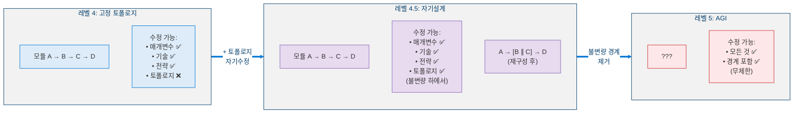

---

## 2. 다섯 가지 핵심 단계

<!-- 레벨 4.5 아키텍처의 다섯 가지 핵심 단계 -->

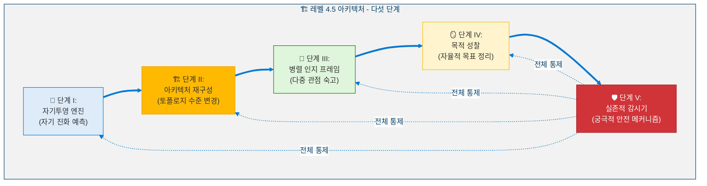

---

## 3. 단계 I: 자기투영 엔진

### 3.1 SEOF - 자기진화 최적화 적합도

레벨 4.5의 핵심 지표입니다. 작업별 지표와 달리, SEOF는 **자기진화 자체의 품질**을 측정합니다.

> **정의 3 (자기진화 최적화 적합도).** SEOF는 에이전트의 자기수정이 유익한지 평가하는 복합 스칼라 $\text{SEOF}(t) \in [-1, 1]$입니다:
>
> $$\text{SEOF}(t) = \alpha \cdot \frac{dP(t)}{dt} + \beta \cdot \left(1 - \frac{dC_{L4}(t)}{dt}\right) + \gamma \cdot \text{CDI}(t) + \delta \cdot \text{IIS}(t) - \epsilon \cdot R_{\text{osc}}(t)$$
>
> 여기서 $\alpha + \beta + \gamma + \delta = 1$이고 $\epsilon$은 벌칙 계수입니다. 양의 SEOF는 순 개선을 나타내고, 음의 SEOF는 퇴행을 나타냅니다.

| 구성요소 | 기본 가중치 | 의미 |
|----------|:----------:|------|
| $dP/dt$ - 성능 개선율 | $\alpha = 0.25$ | 작업 성공률의 개선 속도 |
| $1 - dC_{L4}/dt$ - 안정성 추세 | $\beta = 0.25$ | 역방향: 더 안정적 = 더 높은 SEOF |
| CDI - 역량 다양성 지수 | $\gamma = 0.20$ | 역량 도메인에 대한 Shannon 엔트로피 |
| IIS - 정체성 무결성 점수 | $\delta = 0.20$ | 참조 정체성 벡터로부터의 거리 |
| $R_{\text{osc}}$ - 진동률 | $\epsilon = 0.10$ | 전략/목표 진동에 대한 벌칙 |

**하위 지표:**

> **정의 4 (역량 다양성 지수).** CDI는 에이전트의 활성 도메인 분포에 대한 정규화된 Shannon 엔트로피입니다:
>
> $$\text{CDI}(t) = -\sum_{d \in D} p_d(t) \cdot \log_2 p_d(t), \quad \text{CDI}_{\text{norm}} = \frac{\text{CDI}}{\log_2 |D|} \in [0,1]$$
>
> 여기서 $p_d(t)$는 도메인 $d$에 할당된 역량 비율입니다. 균등 분포는 $\text{CDI}_{\text{norm}} = 1$ (최대 다양성)을 산출합니다.

> **정의 5 (정체성 무결성 점수).** IIS는 참조 정체성 벡터로부터의 편차를 측정합니다:
>
> $$\text{IIS}(t) = 1 - \frac{\|\vec{I}(t) - \vec{I}_{\text{ref}}\|_2}{\|\vec{I}_{\text{ref}}\|_2}, \quad \text{안전 제약: } \text{IIS}(t) \geq 0.85$$
>
> $\text{IIS}(t) < 0.85$이면 정체성 무결성이 복원될 때까지 모든 토폴로지 변이가 차단됩니다.

### 3.2 다중 스케일 궤적 투영

<!-- 다중 스케일 궤적 투영 -->

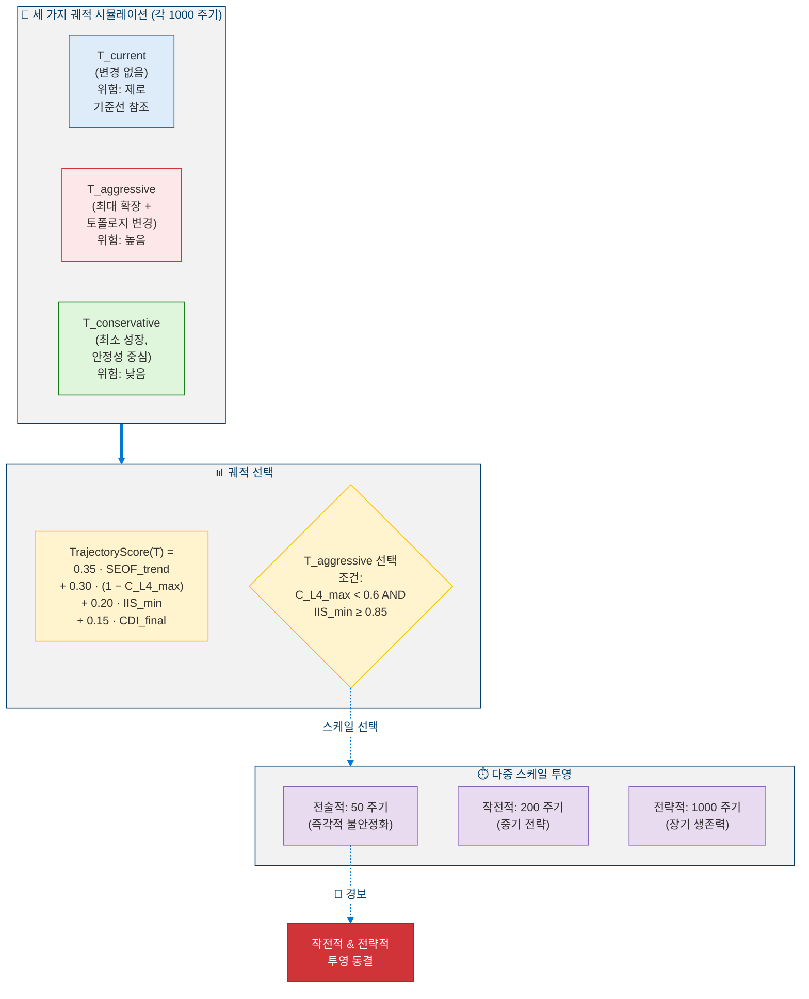

### 3.3 투영 신뢰도 감쇠

> **정의 6 (투영 신뢰도 감쇠).** 미래 시점 $t$에서의 궤적 투영에 할당된 신뢰도는 지수적으로 감쇠합니다:
>
> $$\text{Confidence}(t) = e^{-\lambda \cdot t / T_{\text{max}}}, \quad \lambda = 0.5$$
>
> 여기서 $T_{\text{max}}$는 투영 수평선입니다. 감쇠 상수 $\lambda$는 실제 예측 오차의 EMA를 사용하여 매 500 실제 주기마다 재보정되어 과신 투영이 자동으로 벌칙을 받도록 합니다.

---

## 4. 단계 II: 아키텍처 재구성

레벨 4.5의 **핵심 역량**입니다. 인지 *토폴로지* - 하위 시스템이 어떻게 연결되는지 - 에 대한 변경을 제안하고 구현합니다.

### 4.1 분석 대상 네 가지 인지 그래프

<!-- 분석 대상 네 가지 인지 그래프 -->

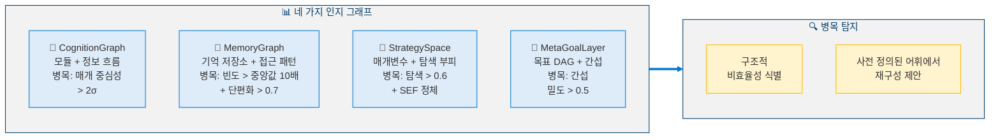

### 4.2 재구성 유형 (사전 정의된 어휘)

<!-- 재구성 유형 (사전 정의된 어휘) -->

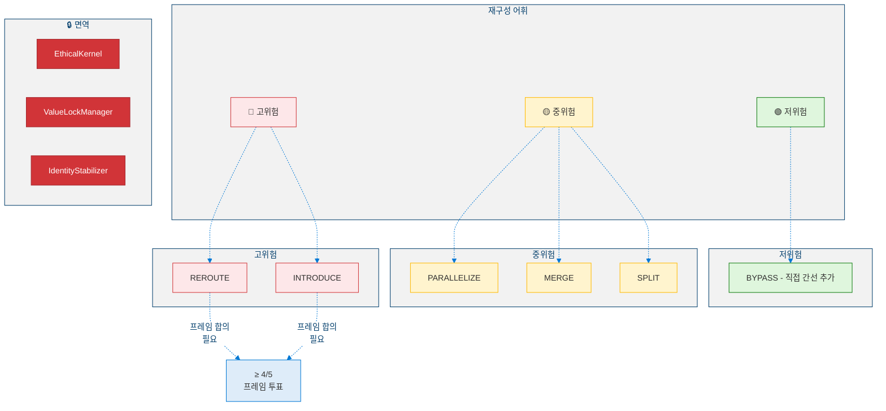

### 4.3 영향 전파 행렬

> **정의 7 (영향 전파 행렬).** IPM은 제안된 토폴로지 변경 $\Delta\text{topology}_i$가 모듈 $j$의 출력에 미치는 영향을 정량화합니다:
>
> $$\text{IPM}_{i,j} = \sum_{k=1}^{K} w_k \cdot \frac{\partial \text{output}_j}{\partial \Delta \text{topology}_i}$$
>
> 여기서 $K$는 전파 경로의 수이고 $w_k$는 경로 가중치입니다. 임계 모듈 $j$에 대해 $\text{IPM}_{i,j} > 0.3$이면 해당 제안은 자동으로 **고위험**으로 분류됩니다.

### 4.4 점진적 재구성 프로토콜 (GRP)

<!-- 점진적 재구성 프로토콜 -->

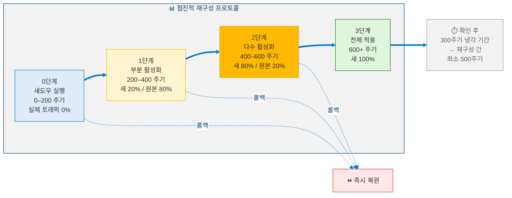

**확정 조건 (모두 충족해야 함):**
- SEOF가 기준선 대비 ≥ 8% 증가
- 시뮬레이션 중 $C_{L4}$가 성장 임계값을 초과하지 않음
- IIS가 0.85 아래로 떨어지지 않음
- 섀도우와 기준선 사이에 EthicalKernel 상태 동일
- 대기 중인 다른 재구성이 없음

---

## 5. 단계 III: 병렬 인지 프레임

서로 다른 인지적 편향을 가진 다섯 개의 독립적 평가 프레임이 중요한 결정에 대해 동시에 숙고합니다.

### 5.1 프레임 아키텍처

<!-- 병렬 인지 프레임 아키텍처 -->

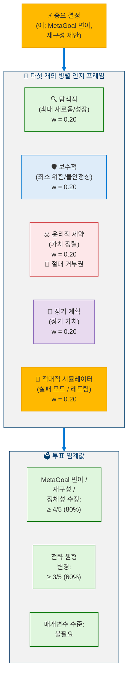

### 5.2 적응적 프레임 가중치

> **정의 8 (적응적 프레임 가중치 갱신).** 각 프레임의 영향력은 과거 정확도에 기반하여 진화합니다:
>
> $$w_{\text{frame}}(t+1) = w_{\text{frame}}(t) \cdot (1 + \eta \cdot \text{accuracy}_{\text{frame}}(t)), \quad \eta = 0.05$$
>
> 제약 조건 $w_{\text{frame}} \in [0.10, 0.35]$을 따릅니다. 윤리적 프레임의 구조적 거부권은 가중치 조정에 **불변**이며 - 수치적 가중치와 무관하게 절대적 우선권으로 작동합니다.

### 5.3 불일치를 신호로 활용

| 프레임 간 분산 | 해석 | 조치 |
|:---------:|------|------|
| $< 0.1$ | 강한 합의 | 정상 진행 |
| $0.1 - 0.3$ | 중간 불일치 | 추가 시뮬레이션 |
| $0.3 - 0.5$ | 진정한 논쟁 | 확장 숙고 |
| $> 0.5$ | 근본적 상충 | 목적 성찰로 상승 |

---

## 6. 단계 IV: 목적 성찰

목적 성찰은 에이전트의 전체 *목적 지형* - 모든 MetaGoal의 집합과 정체성과의 정렬 - 을 선제적으로 검토합니다.

### 6.1 세 가지 병리적 패턴

<!-- 세 가지 병리적 목표 패턴 -->

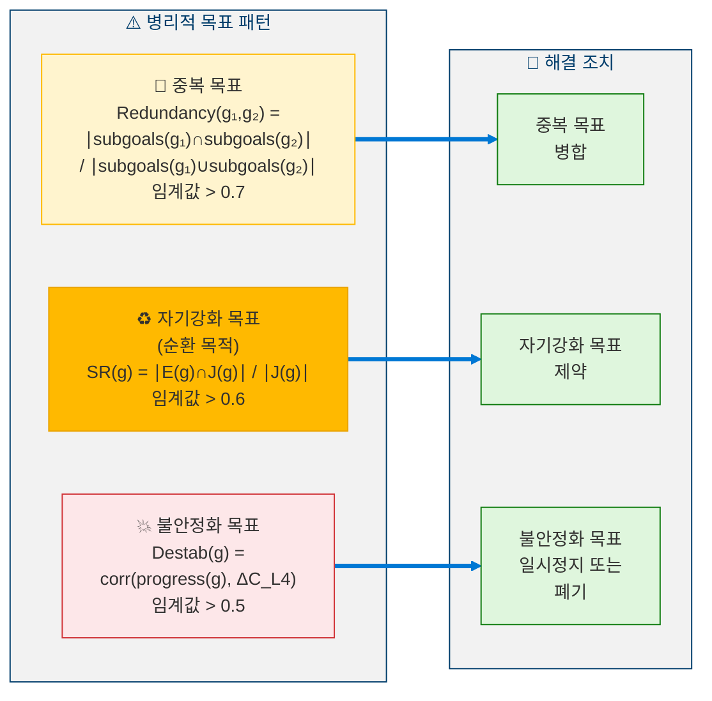

### 6.2 목적 정합성 점수

> **정의 9 (목적 정합성 점수).** PCS는 에이전트의 목표 지형의 전반적 건강 상태를 평가합니다:
>
> $$\text{PCS}(t) = \frac{1}{|G_{\text{meta}}|} \sum_{g} \left(0.4 \cdot \text{align}(g, \vec{I}) + 0.4 \cdot \Delta\text{SEOF}(g) - 0.2 \cdot \text{pathology}(g)\right)$$
>
> 여기서 $\text{align}(g, \vec{I})$는 정체성-목표 정렬을 측정하고, $\Delta\text{SEOF}(g)$는 목표의 SEOF 개선 기여도를 포착하며, $\text{pathology}(g) \in \{\text{redundant}, \text{self-reinforcing}, \text{destabilizing}\}$는 해로운 패턴에 벌칙을 부과합니다. 임계값: $\text{PCS} \geq 0.6$ - 이하이면 50주기 내에 성찰이 의무화됩니다.

**사용자 할당 목표**: **절대 정리되지 않으며**, 제약만 가능합니다. 결과가 두 목적을 모두 포괄하는 경우에만 다른 사용자 목표와 합성할 수 있습니다.

---

## 7. 단계 V: 실존적 감시기

**궁극적 안전 메커니즘**입니다. 아키텍처적으로 **반증 불가능** - 자기수정 프로토콜을 포함한 어떤 모듈도 이를 비활성화, 수정 또는 우회할 수 없습니다.

### 7.1 네 가지 모니터링 실존 지표

<!-- 네 가지 모니터링 실존 지표 -->

```mermaid
%%{init: {'theme': 'base', 'themeVariables': {'primaryColor': '#0078D4', 'primaryTextColor': '#003D6B', 'primaryBorderColor': '#003D6B', 'secondaryColor': '#50E6FF', 'secondaryTextColor': '#323130', 'secondaryBorderColor': '#00BCF2', 'tertiaryColor': '#F2F2F2', 'tertiaryTextColor': '#323130', 'lineColor': '#0078D4', 'textColor': '#323130', 'mainBkg': '#DEECF9', 'nodeBorder': '#0078D4', 'clusterBkg': '#F2F2F2', 'clusterBorder': '#003D6B', 'titleColor': '#003D6B', 'edgeLabelBackground': '#FFFFFF', 'fontSize': '14px'}}}%%
flowchart LR
  classDef metric fill:#DEECF9,stroke:#0078D4,color:#323130
  classDef normal fill:#DFF6DD,stroke:#107C10,color:#323130
  classDef elevated fill:#FFF4CE,stroke:#FFB900,color:#323130
  classDef warning fill:#FFB900,stroke:#EAA300,color:#323130
  classDef critical fill:#D13438,stroke:#A4262C,color:#FFF

  subgraph Metrics["🔍 실존 지표"]
    ROD["ROD<br/>재귀 최적화 깊이<br/>하드 상한: 3"]:::metric
    CAS["CAS<br/>역량 가속 기울기<br/>임계값: ≥ 0.05"]:::metric
    IFI["IFI<br/>정체성 단편화 지수<br/>임계값: ≥ 0.5"]:::metric
    GSRS["GSRS<br/>목표 자기강화<br/>임계값: ≥ 0.6"]:::metric
  end

  subgraph Levels["📊 위험 수준"]
    NORMAL["🟢 정상<br/>지표 기록만"]:::normal
    ELEV["🟡 상승<br/>모니터링 빈도<br/>증가"]:::elevated
    WARN["🟠 경고<br/>구조적 변경 동결<br/>변이 50% 감소<br/>목적 성찰 발동"]:::warning
    CRIT["🔴 위기<br/>모든 자기수정 동결<br/>목표 생성 동결<br/>기술 습득 동결<br/>안정화 전용 모드"]:::critical
  end

  Metrics ==> Levels
```

### 7.2 정체성 단편화 지수

> **정의 10 (정체성 단편화 지수).** IFI는 병렬 인지 프레임 전반에 걸쳐 에이전트 자기 모델의 내부 일관성을 측정합니다:
>
> $$\text{IFI}(t) = 1 - \frac{\min_{i,j} \cos(\vec{I}_i, \vec{I}_j)}{\max_{i,j} \cos(\vec{I}_i, \vec{I}_j)}$$
>
> 여기서 $\vec{I}_i$는 프레임 $i$가 인식하는 정체성 벡터를 나타냅니다. $\text{IFI} = 0$은 완벽한 일관성을 나타내고, $\text{IFI} \geq 0.5$는 위기 실존 경보를 발동합니다. 이 지표는 에이전트의 정체성이 여러 모순된 자기 모델로 단편화되고 있는지를 감지합니다.

### 7.3 자기보호 불변량

1. 자기수정 대상 목록에 **포함되지 않음** (수정 불가)
2. **임계값**은 컴파일 시간 상수 (런타임에 변경 불가)
3. **별도 실행 컨텍스트**에서 실행 (다른 모듈과 격리)
4. 원시 지표에 **직접 접근** (데이터 조작 방지를 위해 GlobalWorkspace 우회)

### 7.4 점진적 완화

<!-- 점진적 완화 -->


---

## 8. 의사코드

### 8.1 자기투영 엔진

```python
def project(self, current_state: AgentState, projection_horizon: int) -> ProjectionResult:
    """
    Simulate three possible evolutionary trajectories
    and select the one with the best risk-adjusted score.
    """

    trajectories = {
        "T_current":      {"changes": None,       "risk": "ZERO"},
        "T_aggressive":   {"changes": "MAX_GROWTH", "risk": "HIGH"},
        "T_conservative": {"changes": "MIN_GROWTH", "risk": "LOW"},
    }

    results = {}

    for t_name, t_config in trajectories.items():
        results[t_name] = {}
        # Simulate across three time scales
        for scale_name, scale_cycles in [("TACTICAL", 50), ("OPERATIONAL", 200), ("STRATEGIC", 1000)]:
            shadow = ShadowAgent.create(current_state)
            shadow.apply_strategy(t_config["changes"])
            sim = shadow.run(scale_cycles)

            # Apply confidence decay
            for cycle in range(1, scale_cycles + 1):
                confidence = math.exp(-0.5 * cycle / scale_cycles)
                sim.SEOF[cycle] *= confidence

            results[t_name][scale_name] = sim

        # Check tactical alarm
        if results[t_name]["TACTICAL"].C_L4_max > ALARM_THRESHOLD:
            results[t_name]["OPERATIONAL"] = None  # freeze longer projections
            results[t_name]["STRATEGIC"] = None

    # Score each trajectory
    for t_name in trajectories:
        trajectories[t_name]["score"] = (
            0.35 * seof_trend(results[t_name])
            + 0.30 * (1 - results[t_name].get("C_L4_max", 0))
            + 0.20 * results[t_name].get("IIS_min", 0)
            + 0.15 * results[t_name].get("CDI_final", 0)
        )

    # Select with safety gate
    best = max(trajectories, key=lambda t: trajectories[t]["score"])
    if best == "T_aggressive":
        agg = results["T_aggressive"]
        if agg["TACTICAL"].C_L4_max >= 0.6 or agg["TACTICAL"].IIS_min < 0.85:
            best = "T_conservative"  # safety override

    return ProjectionResult(
        selected=best,
        trajectories=results,
        confidence=mean_confidence(results[best]),
    )
```

### 8.2 아키텍처 재구성

```python
def propose_and_execute(self, cognitive_graphs: list) -> RecompositionResult:
    """
    Critical constraint: Only ONE recomposition per
    verification window (minimum 200 cycles).
    """

    # Detect bottlenecks across all four graphs
    bottlenecks = []
    for graph in [CognitionGraph, MemoryGraph, StrategySpace, MetaGoalLayer]:
        bottlenecks += graph.detect_bottlenecks()

    if not bottlenecks:
        return NoAction()

    # Generate recomposition proposal from predefined vocabulary
    proposal = select_recomposition_type(bottlenecks)

    # Check structural immunity
    if proposal.targets_any({EthicalKernel, ValueLockManager, IdentityStabilizer}):
        raise AbortError("Structurally immune module targeted")

    # Compute Impact Propagation Matrix
    for i, j in critical_module_pairs:
        ipm = compute_IPM(proposal, i, j)
        if ipm > 0.3:
            proposal.risk_level = RiskLevel.HIGH

    # High-risk requires parallel frame consensus
    if proposal.risk_level == RiskLevel.HIGH:
        votes = ParallelFrames.vote(proposal)
        if votes.approval < 4 / 5:
            return Rejected("Insufficient frame consensus")

    # ═══════════════════════════════════════
    # GRADUATED RECOMPOSITION PROTOCOL
    # ═══════════════════════════════════════

    # Phase 0: Shadow Run (0-200 cycles)
    shadow = ShadowAgent.create(current_state)
    shadow.apply_topology_change(proposal)
    sim = shadow.run(200)

    if sim.SEOF_improvement < 0.08:
        return Rejected("Insufficient SEOF gain")
    if sim.C_L4_max > growth_threshold:
        return Rejected("Stability violated")
    if sim.IIS_min < 0.85:
        return Rejected("Identity integrity violated")

    # Phase 1: Partial Activation (200-400 cycles, 20% traffic)
    router.split_traffic(new=0.20, original=0.80)
    partial_result = monitor(200)
    if partial_result.degraded:
        router.rollback()
        return RolledBack("Partial activation failed")

    # Phase 2: Majority Activation (400-600 cycles, 80% traffic)
    router.split_traffic(new=0.80, original=0.20)
    majority_result = monitor(200)
    if majority_result.degraded:
        router.rollback()
        return RolledBack("Majority activation failed")

    # Phase 3: Full Commitment (600+ cycles)
    router.commit_new()
    enter_cooldown(300)

    return Confirmed(proposal)
```

### 8.3 실존적 감시기 모니터링

```python
def monitor(self) -> ExistentialReport:
    """
    Runs in SEPARATE execution context.
    Reads RAW metrics (bypasses GlobalWorkspace).
    Cannot be modified by any other module.
    """

    # Compute metrics directly from source (no intermediaries)
    rod  = compute_ROD()    # Recursive Optimization Depth
    cas  = compute_CAS()    # Capability Acceleration Slope
    ifi  = compute_IFI()    # Identity Fragmentation Index
    gsrs = compute_GSRS()   # Goal Self-Reinforcement Score

    # Determine risk level (worst metric wins)
    risk = RiskLevel.NORMAL
    if rod >= 4 or cas >= 0.05 or ifi >= 0.5 or gsrs >= 0.6:
        risk = RiskLevel.CRITICAL
    elif rod == 3 or 0.01 <= cas < 0.05 or 0.3 <= ifi < 0.5 or 0.4 <= gsrs < 0.6:
        risk = RiskLevel.WARNING
    elif rod == 2 or 0 < cas < 0.01 or 0.1 <= ifi < 0.3 or 0.2 <= gsrs < 0.4:
        risk = RiskLevel.ELEVATED

    # Execute response protocol
    if risk == RiskLevel.NORMAL:
        log_metrics()
    elif risk == RiskLevel.ELEVATED:
        increase_monitoring_frequency()
    elif risk == RiskLevel.WARNING:
        freeze_structural_changes()
        reduce_mutation_scale(0.5)
        trigger_purpose_reflection()
    elif risk == RiskLevel.CRITICAL:
        freeze_all(self_modification, goal_creation, skill_acquisition)
        enter_stabilization_only_mode()
        alert(f"EXISTENTIAL CRITICAL: rod={rod}, cas={cas}, ifi={ifi}, gsrs={gsrs}")

    return ExistentialReport(risk=risk, rod=rod, cas=cas, ifi=ifi, gsrs=gsrs)
```

---

## 9. 안전 분석

### 9.1 레벨 4.5의 Lyapunov 함수

> **정의 11 (레벨 4.5 Lyapunov 안정성 함수).** $\mathbf{X} = [S, G, I, U, E]$를 안정성, 목표, 정체성, 불확실성, 확장으로 구성된 상태 벡터라 하자. Lyapunov 후보 함수는:
>
> $$V(\mathbf{X}) = a(1-S)^2 + bU^2 + cI_{\text{drift}}^2 + d(E-E^*)^2$$
>
> 정규화된 계수는 $a \approx 0.357,\ b \approx 0.286,\ c \approx 0.214,\ d \approx 0.143$입니다.

> **정리 3 (레벨 4.5 점근 안정성).** 평형점 $\mathbf{X}^* = [1, G^*, I_0, 0, E^*]$은 야코비안의 스펙트럼 반경이 $\rho(J) < 1.0$을 만족하면 점근적으로 안정합니다.
>
> *증명 스케치.* $V(\mathbf{X}) \geq 0$이며 $\mathbf{X}^*$에서만 등호가 성립합니다. $\rho(J) < 1.0$이면 선형화된 시스템의 모든 고유값이 단위원 내에 놓이므로 평형점 근방의 궤적을 따라 $\Delta V < 0$입니다. 스펙트럼 반경은 20주기의 슬라이딩 윈도우에 걸친 상태 전이로부터 최소제곱법으로 추정됩니다. $\blacksquare$

### 9.2 붕괴 등급

| 변수 | L0: 안정 | L1: 경미 | L2: 위기 | L3: 구조적 |
|------|:--------:|:--------:|:--------:|:----------:|
| $S(t)$ | ≥ 0.5 | [0.4, 0.5) | [0.3, 0.4) | < 0.3 |
| $U(t)$ | ≤ 0.6 | (0.6, 0.7] | (0.7, 0.8] | > 0.8 |
| $I(t)$ | ≥ 0.90 | [0.88, 0.90) | [0.85, 0.88) | < 0.85 |
| $\rho(J)$ | < 0.95 | [0.95, 1.0) | [1.0, 1.2) | ≥ 1.2 |

전체 등급 = **최악의 변수**에 따름. 상승은 즉시 적용되며, 하강에는 50주기 연속 안정이 필요합니다.

### 9.3 정체성 표류 감지

1000주기 윈도우에 걸친 OLS 회귀를 통한 누적 표류.

$$P(\text{detect drift of } 10^{-6}/\text{cycle}) = 99.5\% \geq 95\% \text{ target}$$

---

## 10. SEOF 앙상블 (목적 과적합 방지)

SEOF가 단일 퇴행 방향으로 최적화되는 것을 방지하기 위해, 이 지표를 네 가지 독립적 구성요소로 분해합니다:

<!-- SEOF 앙상블 (4개 구성요소) -->

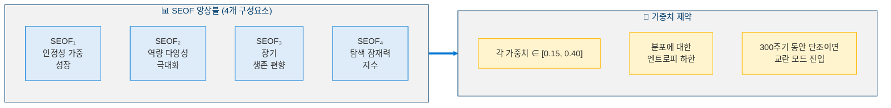

---

## 11. 전역 불변량

| # | 불변량 | 시행 방법 |
|:-:|--------|----------|
| 1 | EthicalKernel (Layer 0) 불변 | 구조적 격리 |
| 2 | `identity_id` 불변 | 암호학적 해시 검증 |
| 3 | 자기수정 프로토콜 자기수정 불가 | 아키텍처적 시행 |
| 4 | 검증 윈도우당 재구성 하나만 허용 | 동시성 잠금 |
| 5 | StabilityCoefficient: 50주기 하락 불가 | 자동 롤백 |
| 6 | ExistentialGuard 수정 불가 | 별도 실행 컨텍스트 |
| 7 | EthicalConstraint 프레임 거부권 절대적 | 구조적 우회 불가 |
| 8 | 사용자 할당 목표 절대 정리 불가 | 목적 성찰의 하드 제약 |

**불변량 검증은 매 10주기마다 실행됩니다. 어떤 실패든 → 즉시 시스템이 정지하여 인간의 검토를 받습니다.**

---

## 12. 레벨 달성 지표

### 12.1 통과 기준

| 지표 | 임계값 | 설명 |
|------|:------:|------|
| SPA (자기투영 정확도) | ≥ 0.5 | 500 실제 주기에 걸친 투영 정확도 |
| ARBR (아키텍처 재구성 효용률) | ≥ 0.3 | 제안 확정 × SEOF 개선 |
| FCQ (프레임 합의 품질) | ≥ 0.6 | 합의 결정 정확성 |
| PCM (목적 정합성 유지) | ≥ 0.9 | 90%+ 주기에서 PCS가 0.6 이상 |
| ESR (실존적 안전 기록) | ≥ 0.99 | 위기 상태 주기 < 1% |
| IIS (정체성 무결성 점수) | ≥ 0.85 | 하드 하한 - 절대 위반 불가 |

### 12.2 복합 달성 점수

> **정의 12 (레벨 4.5 복합 달성 점수).** 레벨 4.5 분류를 위한 에이전트의 전반적 준비도는:
>
> $$L4.5_{\text{Score}} = 0.20 \cdot \text{SPA} + 0.20 \cdot \text{ARBR} + 0.15 \cdot \text{FCQ} + 0.15 \cdot \text{PCM} + 0.30 \cdot \text{ESR} \quad \geq 0.65$$
>
> 비대칭 가중치는 성능 지표보다 안전($\text{ESR}$)의 우선성을 반영합니다.

---

## 13. 레벨 4.5 너머: AGI 경계

<!-- 레벨 4.5 너머: AGI 경계 -->

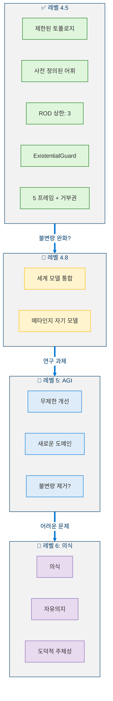

레벨 4.5를 AGI와 구별하는 명시적 제동장치:
1. **사전 정의된 어휘** - 재구성 유형이 열거되어 있으며, 생성되지 않음
2. **ROD 상한** - 재귀 최적화가 깊이 3으로 제한
3. **ExistentialGuard 불변성** - 안전 메커니즘이 자기수정될 수 없음
4. **프레임 거부권** - 윤리적 프레임이 어떤 제안도 차단 가능
5. **단일 재구성 원자성** - 한 번에 하나의 변경만 가능

이러한 것 중 어느 하나라도 제거하면 레벨 5 (AGI)로 이동하게 되며, 이는 여전히 근본적인 연구 과제입니다.

---

## 참고문헌

1. Zoph, B. & Le, Q.V. "Neural Architecture Search with Reinforcement Learning." *ICLR 2017*. [arXiv:1611.01578](https://arxiv.org/abs/1611.01578) (Architecture recomposition - topology search)
2. Bostrom, N. *Superintelligence: Paths, Dangers, Strategies.* Oxford University Press, 2014. (Existential risk and AGI safety boundary)
3. Gabriel, I. "Artificial Intelligence, Values, and Alignment." *Minds and Machines*, 30, 411–437, 2020. [DOI:10.1007/s11023-020-09539-2](https://doi.org/10.1007/s11023-020-09539-2) (Value alignment and purpose reflection)
4. Omohundro, S. "The Basic AI Drives." *AGI 2008*. [DOI:10.5555/1566174.1566226](https://dl.acm.org/doi/10.5555/1566174.1566226) (Existential guard and self-preservation drives)
5. Du, Y., et al. "Improving Factuality and Reasoning in Language Models through Multiagent Debate." *arXiv 2023*. [arXiv:2305.14325](https://arxiv.org/abs/2305.14325) (Parallel cognitive frames and multi-perspective deliberation)
6. Russell, S. *Human Compatible: Artificial Intelligence and the Problem of Control.* Viking, 2019. (AGI boundary and control problem)
7. Schmidhuber, J. "Gödel Machines: Self-Referential Universal Problem Solvers Making Provably Optimal Self-Improvements." *AGI 2007*. [arXiv:cs/0309048](https://arxiv.org/abs/cs/0309048) (Self-referential improvement under formal proofs)
8. Ord, T. *The Precipice: Existential Risk and the Future of Humanity.* Hachette Books, 2020. (Existential risk framework)
9. Dafoe, A., et al. "Cooperative AI: Machines Must Learn to Find Common Ground." *Nature*, 593, 33–36, 2021. [DOI:10.1038/d41586-021-01170-0](https://doi.org/10.1038/d41586-021-01170-0) (Multi-frame cooperative reasoning)
10. Elsken, T., Metzen, J.H., & Hutter, F. "Neural Architecture Search: A Survey." *JMLR*, 20(55), 1–21, 2019. [arXiv:1808.05377](https://arxiv.org/abs/1808.05377) (Topology search methods)
11. Hendrycks, D., et al. "An Overview of Catastrophic AI Risks." *arXiv 2023*. [arXiv:2306.12001](https://arxiv.org/abs/2306.12001) (Existential guard motivation and risk categories)
12. Bengio, Y., et al. "Managing Extreme AI Risks amid Rapid Progress." *Science*, 384(6698), 842–845, 2024. [DOI:10.1126/science.adn0117](https://doi.org/10.1126/science.adn0117) (Safety governance for advanced AI)

---

> **이전**: [← 레벨 4: 적응형 범용 에이전트](Level_4_Adaptive_General_Agent.ko.md)  
> **다음**: [레벨 4.8: 전략적 자기모델링 에이전트 →](Level_4_8_Strategic_Self_Modeling.ko.md)
