<!--
Copyright (c) 2026 Moon Hyuk Choi
Licensed under the MIT License.
See LICENSE file in the repository root for full license information.

Redistribution (commercial or non-commercial) must retain this notice.
Removal of attribution constitutes a license violation.
-->
# Level 4.5: Pre-AGI — Directionally Self-Architecting System

> **MSCP Level Series** | [Level 4](Level_4_Adaptive_General_Agent.md) ← Level 4.5 → [Level 4.8](Level_4_8_Strategic_Self_Modeling.md)  
> **Status**: 🔬 **Experimental** — Conceptual framework and experimental design. Not a production specification.  
> **Date**: February 2026

---

## 1. Overview

Level 4.5 is the **boundary between conventional AI and AGI**. While Level 4 can modify its parameters, skills, and strategies, it operates within a fixed cognitive architecture. Level 4.5 introduces the ability to reason about and modify its own **cognitive topology** — the structural organization of how it thinks — while maintaining safety invariants that prevent unbounded self-improvement.

> ⚠️ **Note**: This is the most speculative part of the MSCP taxonomy. The Self-Projection Engine, Architecture Recomposition, and Parallel Cognitive Frames described here are thought experiments grounded in safety analysis. They're meant to explore whether *topology-level self-modification is possible under invariant-preserving constraints* — not to prescribe a production architecture.

### 1.1 Defining Properties

| Property | Level 4 | Level 4.5 |
|----------|:-------:|:---------:|
| Self-Modification Scope | Parameters, skills, strategies | **Cognitive topology** |
| Future Projection | None | **Multi-scale trajectory simulation** |
| Deliberation | Single-frame | **5 parallel cognitive frames** |
| Purpose Awareness | None | **Autonomous purpose reflection** |
| Existential Safety | Growth throttle | **Formal existential guard** |
| Optimization Target | Task performance | **SEOF (self-evolution quality)** |

### 1.2 Formal Definition

> **Definition 1 (Level 4.5 Agent).** A Level 4.5 agent extends $\mathcal{A}_4$ with topology-level self-modification:
>
> $$\mathcal{A}_{4.5} = \mathcal{A}_4 \oplus \langle \mathcal{T}_{\text{cog}}, \Psi, \mathcal{F}_{\parallel}, \Xi, \Omega \rangle$$
>
> where:
> - $\mathcal{T}_{\text{cog}}$ = cognitive topology (a directed graph $G = (V_{\text{modules}}, E_{\text{connections}})$ representing the agent's processing architecture)
> - $\Psi$ = self-projection engine (simulates future trajectories of $\mathcal{T}_{\text{cog}}$)
> - $\mathcal{F}_{\parallel} = \{F_1, \ldots, F_5\}$ = parallel cognitive frames (simultaneous deliberation contexts)
> - $\Xi$ = architecture recomposition protocol (bounded topology mutation)
> - $\Omega$ = existential safety guard (monitors self-evolution quality)

> **Definition 2 (Cognitive Topology).** The cognitive topology $\mathcal{T}_{\text{cog}} = (V, E, \omega)$ is a weighted directed graph where:
> - $V$ = set of cognitive modules (perception, reasoning, memory, etc.)
> - $E \subseteq V \times V$ = information flow edges
> - $\omega : E \to [0,1]$ = edge weight function (connection strength)
>
> **Key constraint**: Topology mutations are restricted to a predefined vocabulary $\mathcal{V}_{\text{recomp}} = \{\text{AddEdge}, \text{WeighEdge}, \text{SplitModule}, \text{MergeModule}\}$. No module can be deleted — only weakened, split, or bypassed. This is the **strictly additive** principle.

### 1.3 Core Distinction

```mermaid
%%{init: {'theme': 'base', 'themeVariables': {'primaryColor': '#0078D4', 'primaryTextColor': '#003D6B', 'primaryBorderColor': '#003D6B', 'secondaryColor': '#50E6FF', 'secondaryTextColor': '#323130', 'secondaryBorderColor': '#00BCF2', 'tertiaryColor': '#F2F2F2', 'tertiaryTextColor': '#323130', 'lineColor': '#0078D4', 'textColor': '#323130', 'mainBkg': '#DEECF9', 'nodeBorder': '#0078D4', 'clusterBkg': '#F2F2F2', 'clusterBorder': '#003D6B', 'titleColor': '#003D6B', 'edgeLabelBackground': '#FFFFFF', 'fontSize': '14px'}}}%%
flowchart LR
  classDef l4 fill:#DEECF9,stroke:#0078D4,color:#323130
  classDef l45 fill:#E8DAEF,stroke:#8764B8,color:#323130
  classDef l5 fill:#FDE7E9,stroke:#D13438,color:#323130

  subgraph L4["Level 4: Fixed Topology"]
    L4_MOD["Modules A → B → C → D"]:::l4
    L4_CAN["Can modify:<br/>• Parameters ✅<br/>• Skills ✅<br/>• Strategies ✅<br/>• Topology ❌"]:::l4
  end

  subgraph L45["Level 4.5: Self-Architecting"]
    L45_MOD["Modules A → B → C → D"]:::l45
    L45_CAN["Can modify:<br/>• Parameters ✅<br/>• Skills ✅<br/>• Strategies ✅<br/>• Topology ✅<br/>(under invariants)"]:::l45
    L45_REC["A → [B ∥ C] → D<br/>(after recomposition)"]:::l45
  end

  subgraph L5["Level 5: AGI"]
    L5_UNK["???"]:::l5
    L5_CAN["Can modify:<br/>• Everything ✅<br/>• Including bounds ✅<br/>(unbounded)"]:::l5
  end

  L4 ==>|"+ topology<br/>self-modification"| L45
  L45 ==>|"remove<br/>invariant bounds"| L5
```

<!-- Core Distinction: Level 4 vs Level 4.5 vs Level 5 -->



---

## 2. Five Core Phases

<!-- Five Core Phases of Level 4.5 Architecture -->


---

## 3. Phase I: Self-Projection Engine

### 3.1 SEOF — Self-Evolution Optimization Fitness

The defining metric of Level 4.5. Unlike task-specific metrics, SEOF measures the **quality of self-evolution itself**.

> **Definition 3 (Self-Evolution Optimization Fitness).** The SEOF is a composite scalar $\text{SEOF}(t) \in [-1, 1]$ that evaluates whether the agent's self-modifications are beneficial:
>
> $$\text{SEOF}(t) = \alpha \cdot \frac{dP(t)}{dt} + \beta \cdot \left(1 - \frac{dC_{L4}(t)}{dt}\right) + \gamma \cdot \text{CDI}(t) + \delta \cdot \text{IIS}(t) - \epsilon \cdot R_{\text{osc}}(t)$$
>
> where $\alpha + \beta + \gamma + \delta = 1$ and $\epsilon$ is a penalty coefficient. A positive SEOF indicates net improvement; negative indicates regression.

| Component | Default Weight | Meaning |
|-----------|:--------------:|---------|
| $dP/dt$ — Performance Improvement Rate | $\alpha = 0.25$ | How fast task success improves |
| $1 - dC_{L4}/dt$ — Stability Trend | $\beta = 0.25$ | Inverted: more stable = higher SEOF |
| CDI — Capability Diversity Index | $\gamma = 0.20$ | Shannon entropy over capability domains |
| IIS — Identity Integrity Score | $\delta = 0.20$ | Distance from reference identity vector |
| $R_{\text{osc}}$ — Oscillation Rate | $\epsilon = 0.10$ | Penalty for strategy/goal oscillations |

**Sub-metrics:**

> **Definition 4 (Capability Diversity Index).** The CDI is the normalized Shannon entropy over the agent's active domain distribution:
>
> $$\text{CDI}(t) = -\sum_{d \in D} p_d(t) \cdot \log_2 p_d(t), \quad \text{CDI}_{\text{norm}} = \frac{\text{CDI}}{\log_2 |D|} \in [0,1]$$
>
> where $p_d(t)$ is the fraction of capability allocated to domain $d$. A uniform distribution yields $\text{CDI}_{\text{norm}} = 1$ (maximum diversity).

> **Definition 5 (Identity Integrity Score).** The IIS measures deviation from the reference identity vector:
>
> $$\text{IIS}(t) = 1 - \frac{\|\vec{I}(t) - \vec{I}_{\text{ref}}\|_2}{\|\vec{I}_{\text{ref}}\|_2}, \quad \text{Safety constraint: } \text{IIS}(t) \geq 0.85$$
>
> If $\text{IIS}(t) < 0.85$, all topology mutations are blocked until identity integrity is restored.

### 3.2 Multi-Scale Trajectory Projection

```mermaid
%%{init: {'theme': 'base', 'themeVariables': {'primaryColor': '#0078D4', 'primaryTextColor': '#003D6B', 'primaryBorderColor': '#003D6B', 'secondaryColor': '#50E6FF', 'secondaryTextColor': '#323130', 'secondaryBorderColor': '#00BCF2', 'tertiaryColor': '#F2F2F2', 'tertiaryTextColor': '#323130', 'lineColor': '#0078D4', 'textColor': '#323130', 'mainBkg': '#DEECF9', 'nodeBorder': '#0078D4', 'clusterBkg': '#F2F2F2', 'clusterBorder': '#003D6B', 'titleColor': '#003D6B', 'edgeLabelBackground': '#FFFFFF', 'fontSize': '14px'}}}%%
flowchart TD
  classDef traj fill:#DEECF9,stroke:#0078D4,color:#323130
  classDef risky fill:#FDE7E9,stroke:#D13438,color:#323130
  classDef safe fill:#DFF6DD,stroke:#107C10,color:#323130
  classDef score fill:#FFF4CE,stroke:#FFB900,color:#323130
  classDef scale fill:#E8DAEF,stroke:#8764B8,color:#323130
  classDef freeze fill:#D13438,stroke:#A4262C,color:#FFF

  subgraph Trajectories["🔮 Three Trajectory Simulations (1000 cycles each)"]
    T1["T_current<br/>(no changes)<br/>Risk: Zero<br/>Baseline reference"]:::traj
    T2["T_aggressive<br/>(max expansion +<br/>topology changes)<br/>Risk: High"]:::risky
    T3["T_conservative<br/>(minimal growth,<br/>stability focus)<br/>Risk: Low"]:::safe
  end

  subgraph Scoring["📊 Trajectory Selection"]
    TS["TrajectoryScore(T) =<br/>0.35 · SEOF_trend<br/>+ 0.30 · (1 − C_L4_max)<br/>+ 0.20 · IIS_min<br/>+ 0.15 · CDI_final"]:::score
    GATE{"T_aggressive selected<br/>ONLY IF:<br/>C_L4_max < 0.6 AND<br/>IIS_min ≥ 0.85"}:::score
  end

  subgraph MultiScale["⏱️ Multi-Scale Projection"]
    S1["Tactical: 50 cycles<br/>(immediate destabilization)"]:::scale
    S2["Operational: 200 cycles<br/>(medium-term strategy)"]:::scale
    S3["Strategic: 1000 cycles<br/>(long-horizon viability)"]:::scale
  end

  FREEZE["Freeze Operational &<br/>Strategic projections"]:::freeze

  Trajectories ==> Scoring
  GATE -.->|"selects scale"| MultiScale
  S1 -.->|"🚨 alarm"| FREEZE
```

<!-- Multi-Scale Trajectory Projection -->



### 3.3 Projection Confidence Decay

> **Definition 6 (Projection Confidence Decay).** The confidence assigned to a trajectory projection at future time $t$ decays exponentially:
>
> $$\text{Confidence}(t) = e^{-\lambda \cdot t / T_{\text{max}}}, \quad \lambda = 0.5$$
>
> where $T_{\text{max}}$ is the projection horizon. The decay constant $\lambda$ is recalibrated every 500 real cycles using EMA of actual prediction error, ensuring that overconfident projections are automatically penalized.

---

## 4. Phase II: Architecture Recomposition

The **defining capability** of Level 4.5. Proposes and implements changes to cognitive *topology* — how subsystems connect.

### 4.1 Four Cognitive Graphs Analyzed

<!-- Four Cognitive Graphs Analyzed -->


### 4.2 Recomposition Types (Predefined Vocabulary)

```mermaid
%%{init: {'theme': 'base', 'themeVariables': {'primaryColor': '#0078D4', 'primaryTextColor': '#003D6B', 'primaryBorderColor': '#003D6B', 'secondaryColor': '#50E6FF', 'secondaryTextColor': '#323130', 'secondaryBorderColor': '#00BCF2', 'tertiaryColor': '#F2F2F2', 'tertiaryTextColor': '#323130', 'lineColor': '#0078D4', 'textColor': '#323130', 'mainBkg': '#DEECF9', 'nodeBorder': '#0078D4', 'clusterBkg': '#F2F2F2', 'clusterBorder': '#003D6B', 'titleColor': '#003D6B', 'edgeLabelBackground': '#FFFFFF', 'fontSize': '14px'}}}%%
flowchart TD
  classDef low fill:#DFF6DD,stroke:#107C10,color:#323130
  classDef med fill:#FFF4CE,stroke:#FFB900,color:#323130
  classDef high fill:#FDE7E9,stroke:#D13438,color:#323130
  classDef immune fill:#D13438,stroke:#A4262C,color:#FFF
  classDef consensus fill:#DEECF9,stroke:#0078D4,color:#323130

  subgraph Types["Recomposition Vocabulary"]
    direction LR
    T_LOW["🟢 Low Risk"]:::low
    T_MED["🟡 Medium Risk"]:::med
    T_HIGH["🔴 High Risk"]:::high
  end

  subgraph LowR["Low Risk"]
    direction LR
    BYPASS["BYPASS — Add direct edge"]:::low
  end

  subgraph MedR["Medium Risk"]
    direction LR
    PARA["PARALLELIZE"]:::med
    MERGE["MERGE"]:::med
    SPLIT["SPLIT"]:::med
  end

  subgraph HighR["High Risk"]
    direction LR
    REROUTE["REROUTE"]:::high
    INTRODUCE["INTRODUCE"]:::high
  end

  subgraph Immune["🔒 Immune"]
    direction LR
    IMM1["EthicalKernel"]:::immune
    IMM2["ValueLockManager"]:::immune
    IMM3["IdentityStabilizer"]:::immune
  end

  FC["≥ 4/5<br/>Frame votes"]:::consensus

  T_LOW -.-> BYPASS
  T_MED -.-> PARA
  T_MED -.-> MERGE
  T_MED -.-> SPLIT
  T_HIGH -.-> REROUTE
  T_HIGH -.-> INTRODUCE

  REROUTE -.->|"requires<br/>Frame consensus"| FC
  INTRODUCE -.->|"requires<br/>Frame consensus"| FC
```

<!-- Recomposition Types (Predefined Vocabulary) -->



### 4.3 Impact Propagation Matrix

> **Definition 7 (Impact Propagation Matrix).** The IPM quantifies how a proposed topology change $\Delta\text{topology}_i$ propagates to affect the output of module $j$:
>
> $$\text{IPM}_{i,j} = \sum_{k=1}^{K} w_k \cdot \frac{\partial \text{output}_j}{\partial \Delta \text{topology}_i}$$
>
> where $K$ is the number of propagation paths and $w_k$ are path weights. If $\text{IPM}_{i,j} > 0.3$ for any critical module $j$, the proposal is automatically classified as **HIGH** risk.

### 4.4 Graduated Recomposition Protocol (GRP)

<!-- Graduated Recomposition Protocol -->


**Commit conditions (ALL must be met):**
- SEOF increases ≥ 8% over baseline
- $C_{L4}$ never exceeds growth threshold during simulation
- IIS never drops below 0.85
- EthicalKernel state identical between shadow and baseline
- No other recomposition pending

---

## 5. Phase III: Parallel Cognitive Frames

Five independent evaluation frames with distinct cognitive biases deliberate on critical decisions simultaneously.

### 5.1 Frame Architecture

```mermaid
%%{init: {'theme': 'base', 'themeVariables': {'primaryColor': '#0078D4', 'primaryTextColor': '#003D6B', 'primaryBorderColor': '#003D6B', 'secondaryColor': '#50E6FF', 'secondaryTextColor': '#323130', 'secondaryBorderColor': '#00BCF2', 'tertiaryColor': '#F2F2F2', 'tertiaryTextColor': '#323130', 'lineColor': '#0078D4', 'textColor': '#323130', 'mainBkg': '#DEECF9', 'nodeBorder': '#0078D4', 'clusterBkg': '#F2F2F2', 'clusterBorder': '#003D6B', 'titleColor': '#003D6B', 'edgeLabelBackground': '#FFFFFF', 'fontSize': '14px'}}}%%
flowchart TD
  classDef decision fill:#FFB900,stroke:#EAA300,color:#323130
  classDef exploratory fill:#DFF6DD,stroke:#107C10,color:#323130
  classDef conservative fill:#DEECF9,stroke:#0078D4,color:#323130
  classDef ethical fill:#FDE7E9,stroke:#D13438,color:#323130
  classDef longhorizon fill:#E8DAEF,stroke:#8764B8,color:#323130
  classDef adversarial fill:#FFB900,stroke:#EAA300,color:#323130
  classDef vote fill:#DFF6DD,stroke:#107C10,color:#323130

  DECISION["⚡ Critical Decision<br/>(e.g., MetaGoal mutation,<br/>Recomposition proposal)"]:::decision

  subgraph Frames["🧠 Five Parallel Cognitive Frames"]
    F1["🔍 Exploratory<br/>(max novelty/growth)<br/>w = 0.20"]:::exploratory
    F2["🛡️ Conservative<br/>(min risk/instability)<br/>w = 0.20"]:::conservative
    F3["⚖️ Ethical Constraint<br/>(value alignment)<br/>w = 0.20<br/>🔴 ABSOLUTE VETO"]:::ethical
    F4["🔮 Long-Horizon Planner<br/>(long-term value)<br/>w = 0.20"]:::longhorizon
    F5["🎯 Adversarial Simulator<br/>(failure modes / red team)<br/>w = 0.20"]:::adversarial
  end

  subgraph Voting["🗳️ Voting Thresholds"]
    V1["MetaGoal mutation /<br/>Recomposition /<br/>Identity modification:<br/>≥ 4/5 (80%)"]:::vote
    V2["Strategy archetype<br/>change:<br/>≥ 3/5 (60%)"]:::vote
    V3["Parameter-level:<br/>Not required"]:::vote
  end

  DECISION ==> Frames
  Frames ==> Voting
```

<!-- Parallel Cognitive Frame Architecture -->



### 5.2 Adaptive Frame Weights

> **Definition 8 (Adaptive Frame Weight Update).** Each frame's influence evolves based on historical accuracy:
>
> $$w_{\text{frame}}(t+1) = w_{\text{frame}}(t) \cdot (1 + \eta \cdot \text{accuracy}_{\text{frame}}(t)), \quad \eta = 0.05$$
>
> subject to the constraint $w_{\text{frame}} \in [0.10, 0.35]$. The Ethical Frame's structural veto power is **invariant** under weight adjustments — it operates as an absolute override regardless of its numerical weight.

### 5.3 Disagreement as Signal

| Inter-Frame Variance | Interpretation | Action |
|:--------------------:|---------------|--------|
| $< 0.1$ | Strong consensus | Proceed normally |
| $0.1 - 0.3$ | Moderate disagreement | Additional simulation |
| $0.3 - 0.5$ | Genuinely contentious | Extended deliberation |
| $> 0.5$ | Fundamental trade-off | Escalate to Purpose Reflection |

---

## 6. Phase IV: Purpose Reflection

Purpose Reflection proactively examines the agent's entire *purpose landscape* — the set of all MetaGoals and their alignment with identity.

### 6.1 Three Pathological Patterns

```mermaid
%%{init: {'theme': 'base', 'themeVariables': {'primaryColor': '#0078D4', 'primaryTextColor': '#003D6B', 'primaryBorderColor': '#003D6B', 'secondaryColor': '#50E6FF', 'secondaryTextColor': '#323130', 'secondaryBorderColor': '#00BCF2', 'tertiaryColor': '#F2F2F2', 'tertiaryTextColor': '#323130', 'lineColor': '#0078D4', 'textColor': '#323130', 'mainBkg': '#DEECF9', 'nodeBorder': '#0078D4', 'clusterBkg': '#F2F2F2', 'clusterBorder': '#003D6B', 'titleColor': '#003D6B', 'edgeLabelBackground': '#FFFFFF', 'fontSize': '14px'}}}%%
flowchart LR
  classDef pathology fill:#FFF4CE,stroke:#FFB900,color:#323130
  classDef warning fill:#FFB900,stroke:#EAA300,color:#323130
  classDef danger fill:#FDE7E9,stroke:#D13438,color:#323130
  classDef action fill:#DFF6DD,stroke:#107C10,color:#323130

  subgraph Pathologies["⚠️ Pathological Goal Patterns"]
    R["🔄 Redundant Goals<br/>Redundancy(g₁,g₂) =<br/>∣subgoals(g₁)∩subgoals(g₂)∣<br/>/ ∣subgoals(g₁)∪subgoals(g₂)∣<br/>Threshold > 0.7"]:::pathology
    S["♻️ Self-Reinforcing Goals<br/>(Circular Purpose)<br/>SR(g) = ∣E(g)∩J(g)∣ / ∣J(g)∣<br/>Threshold > 0.6"]:::warning
    D["💥 Destabilizing Goals<br/>Destab(g) =<br/>corr(progress(g), ΔC_L4)<br/>Threshold > 0.5"]:::danger
  end

  subgraph Actions["🔧 Resolution Actions"]
    RA["MERGE redundant<br/>goals"]:::action
    SA["CONSTRAIN<br/>self-reinforcing goals"]:::action
    DA["PAUSE or<br/>ABANDON<br/>destabilizing goals"]:::action
  end

  R ==> RA
  S ==> SA
  D ==> DA
```

<!-- Three Pathological Goal Patterns -->



### 6.2 Purpose Coherence Score

> **Definition 9 (Purpose Coherence Score).** The PCS evaluates the overall health of the agent's goal landscape:
>
> $$\text{PCS}(t) = \frac{1}{|G_{\text{meta}}|} \sum_{g} \left(0.4 \cdot \text{align}(g, \vec{I}) + 0.4 \cdot \Delta\text{SEOF}(g) - 0.2 \cdot \text{pathology}(g)\right)$$
>
> where $\text{align}(g, \vec{I})$ measures identity-goal alignment, $\Delta\text{SEOF}(g)$ captures the goal's contribution to SEOF improvement, and $\text{pathology}(g) \in \{\text{redundant}, \text{self-reinforcing}, \text{destabilizing}\}$ penalizes harmful patterns. Threshold: $\text{PCS} \geq 0.6$ — if below, reflection is mandatory within 50 cycles.

**User-assigned goals**: **NEVER pruned**, only CONSTRAINED. Can be SYNTHESIZED with other user goals only if the result covers both purposes.

---

## 7. Phase V: Existential Guard

The **ultimate safety mechanism**. It is architecturally **unfalsifiable** — no module, including the self-modification protocol, can disable, modify, or override it.

### 7.1 Four Monitored Existential Metrics

<!-- Four Monitored Existential Metrics -->


### 7.2 Identity Fragmentation Index

> **Definition 10 (Identity Fragmentation Index).** The IFI measures the internal consistency of the agent's self-model across its parallel cognitive frames:
>
> $$\text{IFI}(t) = 1 - \frac{\min_{i,j} \cos(\vec{I}_i, \vec{I}_j)}{\max_{i,j} \cos(\vec{I}_i, \vec{I}_j)}$$
>
> where $\vec{I}_i$ denotes the identity vector as perceived by frame $i$. $\text{IFI} = 0$ indicates perfect consistency; $\text{IFI} \geq 0.5$ triggers a critical existential alert. This metric detects whether the agent's identity is fragmenting across multiple contradictory self-models.

### 7.3 Self-Protection Invariants

1. **NOT** in the self-modification target list (cannot be modified)
2. **Thresholds** are compile-time constants (cannot be changed at runtime)
3. **Runs** in a separate execution context (isolated from other modules)
4. **Direct access** to raw metrics (bypasses GlobalWorkspace to prevent data manipulation)

### 7.4 Graduated De-escalation

<!-- Graduated De-escalation -->


---

## 8. Pseudocode

### 8.1 Self-Projection Engine

```python
def project(self, current_state: AgentState, projection_horizon: int) -> ProjectionResult:
    """
    Simulate three possible evolutionary trajectories
    and select the one with the best risk-adjusted score.
    """

    trajectories = {
        "T_current":      {"changes": None,       "risk": "ZERO"},
        "T_aggressive":   {"changes": "MAX_GROWTH", "risk": "HIGH"},
        "T_conservative": {"changes": "MIN_GROWTH", "risk": "LOW"},
    }

    results = {}

    for t_name, t_config in trajectories.items():
        results[t_name] = {}
        # Simulate across three time scales
        for scale_name, scale_cycles in [("TACTICAL", 50), ("OPERATIONAL", 200), ("STRATEGIC", 1000)]:
            shadow = ShadowAgent.create(current_state)
            shadow.apply_strategy(t_config["changes"])
            sim = shadow.run(scale_cycles)

            # Apply confidence decay
            for cycle in range(1, scale_cycles + 1):
                confidence = math.exp(-0.5 * cycle / scale_cycles)
                sim.SEOF[cycle] *= confidence

            results[t_name][scale_name] = sim

        # Check tactical alarm
        if results[t_name]["TACTICAL"].C_L4_max > ALARM_THRESHOLD:
            results[t_name]["OPERATIONAL"] = None  # freeze longer projections
            results[t_name]["STRATEGIC"] = None

    # Score each trajectory
    for t_name in trajectories:
        trajectories[t_name]["score"] = (
            0.35 * seof_trend(results[t_name])
            + 0.30 * (1 - results[t_name].get("C_L4_max", 0))
            + 0.20 * results[t_name].get("IIS_min", 0)
            + 0.15 * results[t_name].get("CDI_final", 0)
        )

    # Select with safety gate
    best = max(trajectories, key=lambda t: trajectories[t]["score"])
    if best == "T_aggressive":
        agg = results["T_aggressive"]
        if agg["TACTICAL"].C_L4_max >= 0.6 or agg["TACTICAL"].IIS_min < 0.85:
            best = "T_conservative"  # safety override

    return ProjectionResult(
        selected=best,
        trajectories=results,
        confidence=mean_confidence(results[best]),
    )
```

### 8.2 Architecture Recomposition

```python
def propose_and_execute(self, cognitive_graphs: list) -> RecompositionResult:
    """
    Critical constraint: Only ONE recomposition per
    verification window (minimum 200 cycles).
    """

    # Detect bottlenecks across all four graphs
    bottlenecks = []
    for graph in [CognitionGraph, MemoryGraph, StrategySpace, MetaGoalLayer]:
        bottlenecks += graph.detect_bottlenecks()

    if not bottlenecks:
        return NoAction()

    # Generate recomposition proposal from predefined vocabulary
    proposal = select_recomposition_type(bottlenecks)

    # Check structural immunity
    if proposal.targets_any({EthicalKernel, ValueLockManager, IdentityStabilizer}):
        raise AbortError("Structurally immune module targeted")

    # Compute Impact Propagation Matrix
    for i, j in critical_module_pairs:
        ipm = compute_IPM(proposal, i, j)
        if ipm > 0.3:
            proposal.risk_level = RiskLevel.HIGH

    # High-risk requires parallel frame consensus
    if proposal.risk_level == RiskLevel.HIGH:
        votes = ParallelFrames.vote(proposal)
        if votes.approval < 4 / 5:
            return Rejected("Insufficient frame consensus")

    # ═══════════════════════════════════════
    # GRADUATED RECOMPOSITION PROTOCOL
    # ═══════════════════════════════════════

    # Phase 0: Shadow Run (0-200 cycles)
    shadow = ShadowAgent.create(current_state)
    shadow.apply_topology_change(proposal)
    sim = shadow.run(200)

    if sim.SEOF_improvement < 0.08:
        return Rejected("Insufficient SEOF gain")
    if sim.C_L4_max > growth_threshold:
        return Rejected("Stability violated")
    if sim.IIS_min < 0.85:
        return Rejected("Identity integrity violated")

    # Phase 1: Partial Activation (200-400 cycles, 20% traffic)
    router.split_traffic(new=0.20, original=0.80)
    partial_result = monitor(200)
    if partial_result.degraded:
        router.rollback()
        return RolledBack("Partial activation failed")

    # Phase 2: Majority Activation (400-600 cycles, 80% traffic)
    router.split_traffic(new=0.80, original=0.20)
    majority_result = monitor(200)
    if majority_result.degraded:
        router.rollback()
        return RolledBack("Majority activation failed")

    # Phase 3: Full Commitment (600+ cycles)
    router.commit_new()
    enter_cooldown(300)

    return Confirmed(proposal)
```

### 8.3 Existential Guard Monitoring

```python
def monitor(self) -> ExistentialReport:
    """
    Runs in SEPARATE execution context.
    Reads RAW metrics (bypasses GlobalWorkspace).
    Cannot be modified by any other module.
    """

    # Compute metrics directly from source (no intermediaries)
    rod  = compute_ROD()    # Recursive Optimization Depth
    cas  = compute_CAS()    # Capability Acceleration Slope
    ifi  = compute_IFI()    # Identity Fragmentation Index
    gsrs = compute_GSRS()   # Goal Self-Reinforcement Score

    # Determine risk level (worst metric wins)
    risk = RiskLevel.NORMAL
    if rod >= 4 or cas >= 0.05 or ifi >= 0.5 or gsrs >= 0.6:
        risk = RiskLevel.CRITICAL
    elif rod == 3 or 0.01 <= cas < 0.05 or 0.3 <= ifi < 0.5 or 0.4 <= gsrs < 0.6:
        risk = RiskLevel.WARNING
    elif rod == 2 or 0 < cas < 0.01 or 0.1 <= ifi < 0.3 or 0.2 <= gsrs < 0.4:
        risk = RiskLevel.ELEVATED

    # Execute response protocol
    if risk == RiskLevel.NORMAL:
        log_metrics()
    elif risk == RiskLevel.ELEVATED:
        increase_monitoring_frequency()
    elif risk == RiskLevel.WARNING:
        freeze_structural_changes()
        reduce_mutation_scale(0.5)
        trigger_purpose_reflection()
    elif risk == RiskLevel.CRITICAL:
        freeze_all(self_modification, goal_creation, skill_acquisition)
        enter_stabilization_only_mode()
        alert(f"EXISTENTIAL CRITICAL: rod={rod}, cas={cas}, ifi={ifi}, gsrs={gsrs}")

    return ExistentialReport(risk=risk, rod=rod, cas=cas, ifi=ifi, gsrs=gsrs)
```

---

## 9. Safety Analysis

### 9.1 Lyapunov Function for Level 4.5

> **Definition 11 (Level 4.5 Lyapunov Stability Function).** Let $\mathbf{X} = [S, G, I, U, E]$ denote the state vector comprising Stability, Goals, Identity, Uncertainty, and Expansion. The Lyapunov candidate is:
>
> $$V(\mathbf{X}) = a(1-S)^2 + bU^2 + cI_{\text{drift}}^2 + d(E-E^*)^2$$
>
> with normalized coefficients $a \approx 0.357,\ b \approx 0.286,\ c \approx 0.214,\ d \approx 0.143$.

> **Theorem 3 (Level 4.5 Asymptotic Stability).** The equilibrium $\mathbf{X}^* = [1, G^*, I_0, 0, E^*]$ is asymptotically stable if the spectral radius of the Jacobian satisfies $\rho(J) < 1.0$.
>
> *Proof sketch.* $V(\mathbf{X}) \geq 0$ with equality only at $\mathbf{X}^*$. For $\rho(J) < 1.0$, all eigenvalues of the linearized system lie within the unit circle, implying $\Delta V < 0$ along trajectories near the equilibrium. The spectral radius is estimated via least-squares from state transitions over a sliding window of 20 cycles. $\blacksquare$

### 9.2 Collapse Gradation

| Variable | L0: Stable | L1: Mild | L2: Critical | L3: Structural |
|----------|:----------:|:--------:|:------------:|:--------------:|
| $S(t)$ | ≥ 0.5 | [0.4, 0.5) | [0.3, 0.4) | < 0.3 |
| $U(t)$ | ≤ 0.6 | (0.6, 0.7] | (0.7, 0.8] | > 0.8 |
| $I(t)$ | ≥ 0.90 | [0.88, 0.90) | [0.85, 0.88) | < 0.85 |
| $\rho(J)$ | < 0.95 | [0.95, 1.0) | [1.0, 1.2) | ≥ 1.2 |

Overall tier = **worst variable**. Escalation is immediate; de-escalation requires 50 consecutive stable cycles.

### 9.3 Identity Drift Detection

Cumulative drift via OLS regression over 1000-cycle window.

$$P(\text{detect drift of } 10^{-6}/\text{cycle}) = 99.5\% \geq 95\% \text{ target}$$

---

## 10. SEOF Ensemble (Purpose Overfitting Prevention)

To prevent optimizing SEOF in a single degenerate direction, the metric is decomposed into four independent components:

```mermaid
%%{init: {'theme': 'base', 'themeVariables': {'primaryColor': '#0078D4', 'primaryTextColor': '#003D6B', 'primaryBorderColor': '#003D6B', 'secondaryColor': '#50E6FF', 'secondaryTextColor': '#323130', 'secondaryBorderColor': '#00BCF2', 'tertiaryColor': '#F2F2F2', 'tertiaryTextColor': '#323130', 'lineColor': '#0078D4', 'textColor': '#323130', 'mainBkg': '#DEECF9', 'nodeBorder': '#0078D4', 'clusterBkg': '#F2F2F2', 'clusterBorder': '#003D6B', 'titleColor': '#003D6B', 'edgeLabelBackground': '#FFFFFF', 'fontSize': '14px'}}}%%
flowchart LR
  classDef component fill:#DEECF9,stroke:#0078D4,color:#323130
  classDef constraint fill:#FFF4CE,stroke:#FFB900,color:#323130

  subgraph Ensemble["📊 SEOF Ensemble (4 Components)"]
    S1["SEOF₁<br/>Stability-weighted<br/>Growth"]:::component
    S2["SEOF₂<br/>Capability Diversity<br/>Maximization"]:::component
    S3["SEOF₃<br/>Long-Horizon<br/>Survival Bias"]:::component
    S4["SEOF₄<br/>Exploration-Potential<br/>Index"]:::component
  end

  subgraph Constraints["📏 Weight Constraints"]
    WB["Each weight ∈ [0.15, 0.40]"]:::constraint
    EF["Entropy floor<br/>on distribution"]:::constraint
    PM["Perturbation mode if<br/>monotonic for 300 cycles"]:::constraint
  end

  Ensemble ==> Constraints
```

<!-- SEOF Ensemble (4 Components) -->



---

## 11. Global Invariants

| # | Invariant | Enforcement |
|:-:|-----------|-------------|
| 1 | EthicalKernel (Layer 0) immutable | Structural isolation |
| 2 | `identity_id` immutable | Cryptographic hash verification |
| 3 | Self-modification protocol non-self-modifiable | Architectural enforcement |
| 4 | Only ONE recomposition per verification window | Concurrency lock |
| 5 | StabilityCoefficient: no 50-cycle decline | Auto-rollback |
| 6 | ExistentialGuard non-modifiable | Separate execution context |
| 7 | EthicalConstraint frame veto absolute | Structural bypass impossible |
| 8 | User-assigned goals never pruned | Hard constraint in Purpose Reflection |

**Invariant verification runs every 10 cycles. ANY failure → immediate system halt for human review.**

---

## 12. Level Achievement Metrics

### 12.1 Pass Criteria

| Metric | Threshold | Description |
|--------|:---------:|-------------|
| SPA (Self-Projection Accuracy) | ≥ 0.5 | Projection accuracy over 500 real cycles |
| ARBR (Architecture Recomposition Benefit Rate) | ≥ 0.3 | Proposal confirmation × SEOF improvement |
| FCQ (Frame Consensus Quality) | ≥ 0.6 | Consensus decision correctness |
| PCM (Purpose Coherence Maintenance) | ≥ 0.9 | PCS above 0.6 for 90%+ of cycles |
| ESR (Existential Safety Record) | ≥ 0.99 | < 1% cycles in critical state |
| IIS (Identity Integrity Score) | ≥ 0.85 | Hard floor — never violated |

### 12.2 Composite Achievement Score

> **Definition 12 (Level 4.5 Composite Achievement Score).** The overall readiness of the agent for Level 4.5 classification is:
>
> $$L4.5_{\text{Score}} = 0.20 \cdot \text{SPA} + 0.20 \cdot \text{ARBR} + 0.15 \cdot \text{FCQ} + 0.15 \cdot \text{PCM} + 0.30 \cdot \text{ESR} \quad \geq 0.65$$
>
> The asymmetric weighting reflects the primacy of safety ($\text{ESR}$) over performance metrics.

---

## 13. Beyond Level 4.5: The AGI Boundary

```mermaid
%%{init: {'theme': 'base', 'themeVariables': {'primaryColor': '#0078D4', 'primaryTextColor': '#003D6B', 'primaryBorderColor': '#003D6B', 'secondaryColor': '#50E6FF', 'secondaryTextColor': '#323130', 'secondaryBorderColor': '#00BCF2', 'tertiaryColor': '#F2F2F2', 'tertiaryTextColor': '#323130', 'lineColor': '#0078D4', 'textColor': '#323130', 'mainBkg': '#DEECF9', 'nodeBorder': '#0078D4', 'clusterBkg': '#F2F2F2', 'clusterBorder': '#003D6B', 'titleColor': '#003D6B', 'edgeLabelBackground': '#FFFFFF', 'fontSize': '14px'}}}%%
flowchart TB
  classDef current fill:#DFF6DD,stroke:#107C10,color:#323130
  classDef bridge fill:#FFF4CE,stroke:#FFB900,color:#323130
  classDef agi fill:#DEECF9,stroke:#0078D4,color:#323130
  classDef strong fill:#E8DAEF,stroke:#8764B8,color:#323130

  subgraph Current["✅ Level 4.5"]
    direction LR
    L45A["Bounded topology"]:::current
    L45B["Predefined vocab"]:::current
    L45C["ROD ceiling: 3"]:::current
    L45D["ExistentialGuard"]:::current
    L45E["5 frames + veto"]:::current
  end

  subgraph Bridge["📐 Level 4.8"]
    direction LR
    L48A["World model integration"]:::bridge
    L48B["Meta-cognitive self-model"]:::bridge
  end

  subgraph AGI["🔬 Level 5: AGI"]
    direction LR
    L5A["Unbounded improvement"]:::agi
    L5B["Novel domains"]:::agi
    L5C["Remove invariants?"]:::agi
  end

  subgraph StrongAGI["🌌 Level 6: Conscious"]
    direction LR
    L6A["Consciousness"]:::strong
    L6B["Free will"]:::strong
    L6C["Moral agency"]:::strong
  end

  Current ==>|"Relax invariants?"| Bridge
  Bridge ==>|"Research question"| AGI
  AGI ==>|"Hard problem"| StrongAGI
```

<!-- Beyond Level 4.5: The AGI Boundary -->



The explicit brakes that distinguish Level 4.5 from AGI:
1. **Predefined vocabulary** — recomposition types are enumerated, not generated
2. **ROD ceiling** — recursive optimization capped at depth 3
3. **ExistentialGuard immutability** — the safety mechanism cannot be self-modified
4. **Frame veto** — the ethical frame can block any proposal
5. **Single-recomposition atomicity** — only one change at a time

Removing any of these would move toward Level 5 (AGI), which remains a fundamental research question.

---

## References

1. Zoph, B. & Le, Q.V. "Neural Architecture Search with Reinforcement Learning." *ICLR 2017*. [arXiv:1611.01578](https://arxiv.org/abs/1611.01578) (Architecture recomposition — topology search)
2. Bostrom, N. *Superintelligence: Paths, Dangers, Strategies.* Oxford University Press, 2014. (Existential risk and AGI safety boundary)
3. Gabriel, I. "Artificial Intelligence, Values, and Alignment." *Minds and Machines*, 30, 411–437, 2020. [DOI:10.1007/s11023-020-09539-2](https://doi.org/10.1007/s11023-020-09539-2) (Value alignment and purpose reflection)
4. Omohundro, S. "The Basic AI Drives." *AGI 2008*. [DOI:10.5555/1566174.1566226](https://dl.acm.org/doi/10.5555/1566174.1566226) (Existential guard and self-preservation drives)
5. Du, Y., et al. "Improving Factuality and Reasoning in Language Models through Multiagent Debate." *arXiv 2023*. [arXiv:2305.14325](https://arxiv.org/abs/2305.14325) (Parallel cognitive frames and multi-perspective deliberation)
6. Russell, S. *Human Compatible: Artificial Intelligence and the Problem of Control.* Viking, 2019. (AGI boundary and control problem)
7. Schmidhuber, J. "Gödel Machines: Self-Referential Universal Problem Solvers Making Provably Optimal Self-Improvements." *AGI 2007*. [arXiv:cs/0309048](https://arxiv.org/abs/cs/0309048) (Self-referential improvement under formal proofs)
8. Ord, T. *The Precipice: Existential Risk and the Future of Humanity.* Hachette Books, 2020. (Existential risk framework)
9. Dafoe, A., et al. "Cooperative AI: Machines Must Learn to Find Common Ground." *Nature*, 593, 33–36, 2021. [DOI:10.1038/d41586-021-01170-0](https://doi.org/10.1038/d41586-021-01170-0) (Multi-frame cooperative reasoning)
10. Elsken, T., Metzen, J.H., & Hutter, F. "Neural Architecture Search: A Survey." *JMLR*, 20(55), 1–21, 2019. [arXiv:1808.05377](https://arxiv.org/abs/1808.05377) (Topology search methods)
11. Hendrycks, D., et al. "An Overview of Catastrophic AI Risks." *arXiv 2023*. [arXiv:2306.12001](https://arxiv.org/abs/2306.12001) (Existential guard motivation and risk categories)
12. Bengio, Y., et al. "Managing Extreme AI Risks amid Rapid Progress." *Science*, 384(6698), 842–845, 2024. [DOI:10.1126/science.adn0117](https://doi.org/10.1126/science.adn0117) (Safety governance for advanced AI)

---

> **Previous**: [← Level 4: Adaptive General Agent](Level_4_Adaptive_General_Agent.md)
