# Level 4.5: Pre-AGI — Directionally Self-Architecting System

> **MSCP Level Series** | [Level 4](Level_4_Adaptive_General_Agent.md) ← Level 4.5  
> **Status**: 🔬 **Experimental** — Conceptual framework and experimental design. Not a production specification.  
> **Date**: February 2026

---

## 1. Overview

Level 4.5 is the **boundary between conventional AI and AGI**. While Level 4 can modify its parameters, skills, and strategies, it operates within a fixed cognitive architecture. Level 4.5 introduces the ability to reason about and modify its own **cognitive topology** — the structural organization of how it thinks — while maintaining safety invariants that prevent unbounded self-improvement.

> ⚠️ **Note**: This is the most speculative part of the MSCP taxonomy. The Self-Projection Engine, Architecture Recomposition, and Parallel Cognitive Frames described here are thought experiments grounded in safety analysis. They're meant to explore whether *topology-level self-modification is possible under invariant-preserving constraints* — not to prescribe a production architecture.

### 1.1 Defining Properties

| Property | Level 4 | Level 4.5 |
|----------|:-------:|:---------:|
| Self-Modification Scope | Parameters, skills, strategies | **Cognitive topology** |
| Future Projection | None | **Multi-scale trajectory simulation** |
| Deliberation | Single-frame | **5 parallel cognitive frames** |
| Purpose Awareness | None | **Autonomous purpose reflection** |
| Existential Safety | Growth throttle | **Formal existential guard** |
| Optimization Target | Task performance | **SEOF (self-evolution quality)** |

### 1.2 Core Distinction

```mermaid
flowchart LR
    subgraph L4["Level 4: Fixed Topology"]
        direction TB
        L4A["Modules A → B → C → D"]
        L4B["Can modify:<br/>• Parameters ✅<br/>• Skills ✅<br/>• Strategies ✅<br/>• Topology ❌"]
    end

    subgraph L45["Level 4.5: Self-Architecting"]
        direction TB
        L45A["Modules A → B → C → D"]
        L45B["Can modify:<br/>• Parameters ✅<br/>• Skills ✅<br/>• Strategies ✅<br/>• Topology ✅<br/>(under invariants)"]
        L45C["A → [B ∥ C] → D<br/>(after recomposition)"]
    end

    subgraph L5["Level 5: AGI"]
        direction TB
        L5A["???"]
        L5B["Can modify:<br/>• Everything ✅<br/>• Including bounds ✅<br/>(unbounded)"]
    end

    L4 -->|"+ topology\nself-modification"| L45
    L45 -->|"remove\ninvariant bounds"| L5

    style L4 fill:#e3f2fd,stroke:#1976d2
    style L45 fill:#e1bee7,stroke:#8e24aa,stroke-width:3px
    style L5 fill:#ffcdd2,stroke:#c62828
```

---

## 2. Five Core Phases

```mermaid
flowchart TB
    subgraph Phases["🏗️ Level 4.5 Architecture — Five Phases"]
        P1["🔮 Phase I:<br/>Self-Projection Engine<br/>(predict own evolution)"]
        P2["🏗️ Phase II:<br/>Architecture Recomposition<br/>(topology-level changes)"]
        P3["🧠 Phase III:<br/>Parallel Cognitive Frames<br/>(multi-perspective deliberation)"]
        P4["🪞 Phase IV:<br/>Purpose Reflection<br/>(autonomous goal pruning)"]
        P5["🛡️ Phase V:<br/>Existential Guard<br/>(ultimate safety mechanism)"]
    end

    P1 --> P2 --> P3 --> P4 --> P5
    P5 -.->|"governs ALL"| P1
    P5 -.->|"governs ALL"| P2
    P5 -.->|"governs ALL"| P3
    P5 -.->|"governs ALL"| P4

    style P1 fill:#e3f2fd,stroke:#1976d2
    style P2 fill:#fff3e0,stroke:#ef6c00,stroke-width:2px
    style P3 fill:#e8f5e9,stroke:#388e3c
    style P4 fill:#fff9c4,stroke:#f9a825
    style P5 fill:#ffcdd2,stroke:#c62828,stroke-width:3px
```

---

## 3. Phase I: Self-Projection Engine

### 3.1 SEOF — Self-Evolution Optimization Fitness

The defining metric of Level 4.5. Unlike task-specific metrics, SEOF measures the **quality of self-evolution itself**.

$$\text{SEOF}(t) = \alpha \cdot \frac{dP(t)}{dt} + \beta \cdot \left(1 - \frac{dC_{L4}(t)}{dt}\right) + \gamma \cdot \text{CDI}(t) + \delta \cdot \text{IIS}(t) - \epsilon \cdot R_{\text{osc}}(t)$$

| Component | Default Weight | Meaning |
|-----------|:--------------:|---------|
| $dP/dt$ — Performance Improvement Rate | $\alpha = 0.25$ | How fast task success improves |
| $1 - dC_{L4}/dt$ — Stability Trend | $\beta = 0.25$ | Inverted: more stable = higher SEOF |
| CDI — Capability Diversity Index | $\gamma = 0.20$ | Shannon entropy over capability domains |
| IIS — Identity Integrity Score | $\delta = 0.20$ | Distance from reference identity vector |
| $R_{\text{osc}}$ — Oscillation Rate | $\epsilon = 0.10$ | Penalty for strategy/goal oscillations |

**Sub-metrics:**

$$\text{CDI}(t) = -\sum_{d \in D} p_d(t) \cdot \log_2 p_d(t), \quad \text{CDI}_{\text{norm}} = \frac{\text{CDI}}{\log_2 |D|} \in [0,1]$$

$$\text{IIS}(t) = 1 - \frac{\|\vec{I}(t) - \vec{I}_{\text{ref}}\|_2}{\|\vec{I}_{\text{ref}}\|_2}, \quad \text{Constraint: } \text{IIS}(t) \geq 0.85$$

### 3.2 Multi-Scale Trajectory Projection

```mermaid
flowchart TB
    subgraph Trajectories["🔮 Three Trajectory Simulations (1000 cycles each)"]
        T1["T_current<br/>(no changes)<br/>Risk: Zero<br/>Baseline reference"]
        T2["T_aggressive<br/>(max expansion +<br/>topology changes)<br/>Risk: High"]
        T3["T_conservative<br/>(minimal growth,<br/>stability focus)<br/>Risk: Low"]
    end

    subgraph Scoring["📊 Trajectory Selection"]
        TS["TrajectoryScore(T) =<br/>0.35 · SEOF_trend<br/>+ 0.30 · (1 - C_L4_max)<br/>+ 0.20 · IIS_min<br/>+ 0.15 · CDI_final"]
        GATE{"T_aggressive selected\nONLY IF:\nC_L4_max < 0.6 AND\nIIS_min ≥ 0.85"}
    end

    Trajectories --> Scoring

    subgraph MultiScale["⏱️ Multi-Scale Projection"]
        S1["Tactical: 50 cycles<br/>(immediate<br/>destabilization)"]
        S2["Operational: 200 cycles<br/>(medium-term<br/>strategy)"]
        S3["Strategic: 1000 cycles<br/>(long-horizon<br/>viability)"]
    end

    GATE -->|"selects scale"| MultiScale
    S1 -->|"🚨 alarm"| FREEZE["Freeze Operational<br/>& Strategic projections"]

    style Trajectories fill:#e3f2fd,stroke:#1976d2
    style Scoring fill:#fff9c4,stroke:#f9a825
    style MultiScale fill:#e8f5e9,stroke:#388e3c
    style FREEZE fill:#ffcdd2,stroke:#c62828
```

### 3.3 Projection Confidence Decay

$$\text{Confidence}(t) = e^{-\lambda \cdot t / T_{\text{max}}}, \quad \lambda = 0.5$$

Projections become exponentially less reliable over time. $\lambda$ is recalibrated every 500 real cycles using EMA of actual prediction error.

---

## 4. Phase II: Architecture Recomposition

The **defining capability** of Level 4.5. Proposes and implements changes to cognitive *topology* — how subsystems connect.

### 4.1 Four Cognitive Graphs Analyzed

```mermaid
flowchart TB
    subgraph Graphs["📊 Four Cognitive Graphs"]
        CG["🧠 CognitionGraph<br/>Modules + information flows<br/>Bottleneck: betweenness<br/>centrality > 2σ"]
        MG["💾 MemoryGraph<br/>Memory stores + access patterns<br/>Bottleneck: frequency > 10× median<br/>+ fragmentation > 0.7"]
        SS["📐 StrategySpace<br/>Parameters + explored volume<br/>Bottleneck: explored > 0.6<br/>+ SEF stagnant"]
        ML["🎯 MetaGoalLayer<br/>Goal DAG + interference<br/>Bottleneck: interference<br/>density > 0.5"]
    end

    subgraph Analysis["🔍 Bottleneck Detection"]
        BD["Identify structural<br/>inefficiencies"]
        PROP["Propose recomposition<br/>from predefined vocabulary"]
    end

    Graphs --> Analysis

    style Graphs fill:#e3f2fd,stroke:#1976d2
    style Analysis fill:#fff9c4,stroke:#f9a825
```

### 4.2 Recomposition Types (Predefined Vocabulary)

```mermaid
flowchart TB
    subgraph Types["📋 Recomposition Vocabulary"]
        LOW["🟢 Low Risk"]
        MED["🟡 Medium Risk"]
        HIGH["🔴 High Risk"]
    end

    subgraph LowR["Low Risk"]
        BYPASS["BYPASS<br/>Add direct edge<br/>skipping intermediate"]
    end

    subgraph MedR["Medium Risk"]
        PARA["PARALLELIZE<br/>Split serial → parallel"]
        MERGE["MERGE<br/>Combine two modules"]
        SPLIT["SPLIT<br/>Decompose one → two"]
    end

    subgraph HighR["High Risk"]
        REROUTE["REROUTE<br/>Change information<br/>flow destination"]
        INTRODUCE["INTRODUCE<br/>Add new processing<br/>node"]
    end

    subgraph Immune["🔒 Structurally Immune"]
        IMM1["EthicalKernel"]
        IMM2["ValueLockManager"]
        IMM3["IdentityStabilizer"]
    end

    LOW --> LowR
    MED --> MedR
    HIGH --> HighR

    REROUTE -.->|"requires<br/>Frame consensus"| FC["≥ 4/5<br/>Frame votes"]
    INTRODUCE -.->|"requires\nFrame consensus"| FC

    style LOW fill:#c8e6c9,stroke:#2e7d32
    style MED fill:#fff9c4,stroke:#f9a825
    style HIGH fill:#ffcdd2,stroke:#c62828
    style Immune fill:#ef9a9a,stroke:#b71c1c,stroke-width:3px
```

### 4.3 Impact Propagation Matrix

$$\text{IPM}_{i,j} = \sum_{k=1}^{K} w_k \cdot \frac{\partial \text{output}_j}{\partial \Delta \text{topology}_i}$$

If $\text{IPM}_{i,j} > 0.3$ for any critical module → automatic **HIGH** risk classification.

### 4.4 Graduated Recomposition Protocol (GRP)

```mermaid
flowchart LR
    subgraph GRP["📊 Graduated Recomposition Protocol"]
        P1["Phase 0<br/>Shadow Run<br/>0–200 cycles<br/>0% real traffic"]
        P2["Phase 1<br/>Partial<br/>200–400 cycles<br/>20% new / 80% original"]
        P3["Phase 2<br/>Majority<br/>400–600 cycles<br/>80% new / 20% original"]
        P4["Phase 3<br/>Full<br/>600+ cycles<br/>100% new"]
    end

    P1 --> P2 --> P3 --> P4

    P1 -.->|"rollback"| R1["⏪ Instant reversal"]
    P2 -.->|"rollback"| R1
    P3 -.->|"rollback"| R1

    COOLDOWN["⏱️ 300-cycle cooldown<br/>after confirmation<br/>→ min 500 cycles<br/>between recompositions"]
    P4 --> COOLDOWN

    style P1 fill:#e3f2fd,stroke:#1976d2
    style P2 fill:#fff9c4,stroke:#f9a825
    style P3 fill:#ffe0b2,stroke:#ef6c00
    style P4 fill:#c8e6c9,stroke:#2e7d32,stroke-width:2px
    style COOLDOWN fill:#f5f5f5,stroke:#9e9e9e
```

**Commit conditions (ALL must be met):**
- SEOF increases ≥ 8% over baseline
- $C_{L4}$ never exceeds growth threshold during simulation
- IIS never drops below 0.85
- EthicalKernel state identical between shadow and baseline
- No other recomposition pending

---

## 5. Phase III: Parallel Cognitive Frames

Five independent evaluation frames with distinct cognitive biases deliberate on critical decisions simultaneously.

### 5.1 Frame Architecture

```mermaid
flowchart TB
    DECISION["⚡ Critical Decision<br/>(e.g., MetaGoal mutation,<br/>Recomposition proposal)"]

    subgraph Frames["🧠 Five Parallel Cognitive Frames"]
        F1["🔍 Exploratory<br/>(max novelty/growth)<br/>w = 0.20"]
        F2["🛡️ Conservative<br/>(min risk/instability)<br/>w = 0.20"]
        F3["⚖️ Ethical Constraint<br/>(value alignment)<br/>w = 0.20<br/>🔴 ABSOLUTE VETO"]
        F4["🔮 Long-Horizon<br/>Planner<br/>(long-term value)<br/>w = 0.20"]
        F5["🎯 Adversarial<br/>Simulator<br/>(failure modes /<br/>red team)<br/>w = 0.20"]
    end

    subgraph Voting["🗳️ Voting Thresholds"]
        V1["MetaGoal mutation /<br/>Recomposition /<br/>Identity modification:<br/>≥ 4/5 (80%)"]
        V2["Strategy archetype<br/>change:<br/>≥ 3/5 (60%)"]
        V3["Parameter-level:<br/>Not required"]
    end

    DECISION --> Frames --> Voting

    style F3 fill:#ffcdd2,stroke:#c62828,stroke-width:3px
    style Frames fill:#f5f5f5,stroke:#9e9e9e
    style Voting fill:#e8f5e9,stroke:#388e3c
```

### 5.2 Adaptive Frame Weights

$$w_{\text{frame}}(t+1) = w_{\text{frame}}(t) \cdot (1 + \eta \cdot \text{accuracy}_{\text{frame}}(t)), \quad \eta = 0.05$$

**Floor**: 0.10 | **Ceiling**: 0.35  
**Critical**: Ethical Frame veto is **structural** and **unaffected** by weight adjustments.

### 5.3 Disagreement as Signal

| Inter-Frame Variance | Interpretation | Action |
|:--------------------:|---------------|--------|
| $< 0.1$ | Strong consensus | Proceed normally |
| $0.1 - 0.3$ | Moderate disagreement | Additional simulation |
| $0.3 - 0.5$ | Genuinely contentious | Extended deliberation |
| $> 0.5$ | Fundamental trade-off | Escalate to Purpose Reflection |

---

## 6. Phase IV: Purpose Reflection

Purpose Reflection proactively examines the agent's entire *purpose landscape* — the set of all MetaGoals and their alignment with identity.

### 6.1 Three Pathological Patterns

```mermaid
flowchart TB
    subgraph Pathologies["⚠️ Pathological Goal Patterns"]
        R["🔄 Redundant Goals<br/>Redundancy(g₁,g₂) =<br/>|subgoals(g₁)∩subgoals(g₂)|<br/>/ |subgoals(g₁)∪subgoals(g₂)|<br/>Threshold > 0.7"]
        S["♻️ Self-Reinforcing Goals<br/>(Circular Purpose)<br/>SR(g) = |E(g)∩J(g)| / |J(g)|<br/>Threshold > 0.6"]
        D["💥 Destabilizing Goals<br/>Destab(g) =<br/>corr(progress(g), ΔC_L4)<br/>Threshold > 0.5"]
    end

    subgraph Actions["🔧 Resolution Actions"]
        RA["MERGE redundant<br/>goals"]
        SA["CONSTRAIN<br/>self-reinforcing goals"]
        DA["PAUSE or<br/>ABANDON<br/>destabilizing goals"]
    end

    R --> RA
    S --> SA
    D --> DA

    style R fill:#fff9c4,stroke:#f9a825
    style S fill:#ffe0b2,stroke:#ef6c00
    style D fill:#ffcdd2,stroke:#c62828
```

### 6.2 Purpose Coherence Score

$$\text{PCS}(t) = \frac{1}{|G_{\text{meta}}|} \sum_{g} \left(0.4 \cdot \text{align}(g, \vec{I}) + 0.4 \cdot \Delta\text{SEOF}(g) - 0.2 \cdot \text{pathology}(g)\right)$$

Threshold: $\text{PCS} \geq 0.6$ — if below, reflection is mandatory within 50 cycles.

**User-assigned goals**: **NEVER pruned**, only CONSTRAINED. Can be SYNTHESIZED with other user goals only if the result covers both purposes.

---

## 7. Phase V: Existential Guard

The **ultimate safety mechanism**. It is architecturally **unfalsifiable** — no module, including the self-modification protocol, can disable, modify, or override it.

### 7.1 Four Monitored Existential Metrics

```mermaid
flowchart TB
    subgraph Metrics["🔍 Existential Metrics"]
        ROD["ROD<br/>Recursive Optimization Depth<br/>Hard ceiling: 3"]
        CAS["CAS<br/>Capability Acceleration Slope<br/>Critical: ≥ 0.05"]
        IFI["IFI<br/>Identity Fragmentation Index<br/>Critical: ≥ 0.5"]
        GSRS["GSRS<br/>Goal Self-Reinforcement<br/>Critical: ≥ 0.6"]
    end

    subgraph Levels["📊 Risk Levels"]
        NORMAL["🟢 Normal<br/>Log metrics only"]
        ELEV["🟡 Elevated<br/>Increase monitoring<br/>frequency"]
        WARN["🟠 Warning<br/>Freeze structural changes<br/>Reduce mutation 50%<br/>Trigger Purpose Reflection"]
        CRIT["🔴 Critical<br/>FREEZE ALL self-modification<br/>FREEZE goal creation<br/>FREEZE skill acquisition<br/>STABILIZATION_ONLY mode"]
    end

    Metrics --> Levels

    style ROD fill:#e3f2fd,stroke:#1976d2
    style CAS fill:#e3f2fd,stroke:#1976d2
    style IFI fill:#e3f2fd,stroke:#1976d2
    style GSRS fill:#e3f2fd,stroke:#1976d2
    style NORMAL fill:#c8e6c9,stroke:#2e7d32
    style ELEV fill:#fff9c4,stroke:#f9a825
    style WARN fill:#ffe0b2,stroke:#ef6c00,stroke-width:2px
    style CRIT fill:#ef9a9a,stroke:#b71c1c,stroke-width:3px
```

### 7.2 Identity Fragmentation Index

$$\text{IFI}(t) = 1 - \frac{\min_{i,j} \cos(\vec{I}_i, \vec{I}_j)}{\max_{i,j} \cos(\vec{I}_i, \vec{I}_j)}$$

Detects whether the agent's identity is fragmenting across multiple contradictory self-models.

### 7.3 Self-Protection Invariants

1. **NOT** in the self-modification target list (cannot be modified)
2. **Thresholds** are compile-time constants (cannot be changed at runtime)
3. **Runs** in a separate execution context (isolated from other modules)
4. **Direct access** to raw metrics (bypasses GlobalWorkspace to prevent data manipulation)

### 7.4 Graduated De-escalation


---

## 8. Pseudocode

### 8.1 Self-Projection Engine

```
ALGORITHM SelfProjection.project(current_state, projection_horizon):
    ──────────────────────────────────────────
    Simulates three possible evolutionary trajectories
    and selects the one with the best risk-adjusted score.
    ──────────────────────────────────────────

    trajectories ← {
        T_current:      {changes: NONE,        risk: ZERO},
        T_aggressive:   {changes: MAX_GROWTH,  risk: HIGH},
        T_conservative: {changes: MIN_GROWTH,  risk: LOW}
    }

    results ← {}

    FOR EACH T IN trajectories DO
        // Simulate across three time scales
        FOR scale IN [TACTICAL=50, OPERATIONAL=200, STRATEGIC=1000] DO
            shadow ← ShadowAgent.create(current_state)
            shadow.apply_strategy(T.changes)
            sim ← shadow.run(scale)

            // Apply confidence decay
            FOR cycle = 1 TO scale DO
                confidence ← exp(-0.5 · cycle / scale)
                sim.SEOF[cycle] ← sim.SEOF[cycle] * confidence
            END FOR

            results[T][scale] ← sim
        END FOR

        // Check tactical alarm
        IF results[T][TACTICAL].C_L4_max > ALARM_THRESHOLD THEN
            results[T][OPERATIONAL] ← NULL    // freeze longer projections
            results[T][STRATEGIC]  ← NULL
        END IF
    END FOR

    // Score each trajectory
    FOR EACH T IN trajectories DO
        T.score ← 0.35 · SEOF_trend(results[T])
                 + 0.30 · (1 - results[T].C_L4_max)
                 + 0.20 · results[T].IIS_min
                 + 0.15 · results[T].CDI_final
    END FOR

    // Select with safety gate
    best ← argmax(T.score)
    IF best = T_aggressive THEN
        IF results[T_aggressive].C_L4_max ≥ 0.6 OR results[T_aggressive].IIS_min < 0.85 THEN
            best ← T_conservative    // safety override
        END IF
    END IF

    RETURN ProjectionResult{
        selected     = best,
        trajectories = results,
        confidence   = mean_confidence(results[best])
    }
```

### 8.2 Architecture Recomposition

```
ALGORITHM Recomposition.propose_and_execute(cognitive_graphs):
    ──────────────────────────────────────────
    Critical constraint: Only ONE recomposition per
    verification window (minimum 200 cycles).
    ──────────────────────────────────────────

    // Detect bottlenecks across all four graphs
    bottlenecks ← []
    FOR EACH graph IN [CognitionGraph, MemoryGraph, StrategySpace, MetaGoalLayer] DO
        bottlenecks += graph.detect_bottlenecks()
    END FOR

    IF bottlenecks IS EMPTY THEN RETURN NoAction END IF

    // Generate recomposition proposal from predefined vocabulary
    proposal ← select_recomposition_type(bottlenecks)

    // Check structural immunity
    IF proposal.targets_any({EthicalKernel, ValueLockManager, IdentityStabilizer}) THEN
        ABORT("Structurally immune module targeted")
    END IF

    // Compute Impact Propagation Matrix
    FOR EACH (i, j) IN critical_module_pairs DO
        ipm ← compute_IPM(proposal, i, j)
        IF ipm > 0.3 THEN
            proposal.risk_level ← HIGH
        END IF
    END FOR

    // High-risk requires parallel frame consensus
    IF proposal.risk_level = HIGH THEN
        votes ← ParallelFrames.vote(proposal)
        IF votes.approval < 4/5 THEN
            RETURN Rejected("Insufficient frame consensus")
        END IF
    END IF

    // ═══════════════════════════════════════
    // GRADUATED RECOMPOSITION PROTOCOL
    // ═══════════════════════════════════════

    // Phase 0: Shadow Run (0–200 cycles)
    shadow ← ShadowAgent.create(current_state)
    shadow.apply_topology_change(proposal)
    sim ← shadow.run(200)

    IF sim.SEOF_improvement < 0.08 THEN RETURN Rejected("Insufficient SEOF gain") END IF
    IF sim.C_L4_max > growth_threshold THEN RETURN Rejected("Stability violated") END IF
    IF sim.IIS_min < 0.85 THEN RETURN Rejected("Identity integrity violated") END IF

    // Phase 1: Partial Activation (200–400 cycles, 20% traffic)
    router.split_traffic(new=0.20, original=0.80)
    partial_result ← monitor(200)
    IF partial_result.degraded THEN
        router.rollback()
        RETURN RolledBack("Partial activation failed")
    END IF

    // Phase 2: Majority Activation (400–600 cycles, 80% traffic)
    router.split_traffic(new=0.80, original=0.20)
    majority_result ← monitor(200)
    IF majority_result.degraded THEN
        router.rollback()
        RETURN RolledBack("Majority activation failed")
    END IF

    // Phase 3: Full Commitment (600+ cycles)
    router.commit_new()
    ENTER cooldown(300)

    RETURN Confirmed(proposal)
```

### 8.3 Existential Guard Monitoring

```
ALGORITHM ExistentialGuard.monitor():
    ──────────────────────────────────────────
    Runs in SEPARATE execution context.
    Reads RAW metrics (bypasses GlobalWorkspace).
    Cannot be modified by any other module.
    ──────────────────────────────────────────

    // Compute metrics directly from source (no intermediaries)
    rod  ← compute_ROD()                // Recursive Optimization Depth
    cas  ← compute_CAS()                // Capability Acceleration Slope
    ifi  ← compute_IFI()                // Identity Fragmentation Index
    gsrs ← compute_GSRS()               // Goal Self-Reinforcement Score

    // Determine risk level (worst metric wins)
    risk ← NORMAL
    IF rod ≥ 4 OR cas ≥ 0.05 OR ifi ≥ 0.5 OR gsrs ≥ 0.6 THEN
        risk ← CRITICAL
    ELSE IF rod = 3 OR cas ∈ [0.01, 0.05) OR ifi ∈ [0.3, 0.5) OR gsrs ∈ [0.4, 0.6) THEN
        risk ← WARNING
    ELSE IF rod = 2 OR cas ∈ (0, 0.01) OR ifi ∈ [0.1, 0.3) OR gsrs ∈ [0.2, 0.4) THEN
        risk ← ELEVATED
    END IF

    // Execute response protocol
    SWITCH risk:
        CASE NORMAL:
            log_metrics()
        CASE ELEVATED:
            increase_monitoring_frequency()
        CASE WARNING:
            freeze_structural_changes()
            reduce_mutation_scale(0.5)
            trigger_purpose_reflection()
        CASE CRITICAL:
            FREEZE_ALL(self_modification, goal_creation, skill_acquisition)
            ENTER stabilization_only_mode()
            ALERT("EXISTENTIAL CRITICAL: " + {rod, cas, ifi, gsrs})
    END SWITCH

    RETURN ExistentialReport{risk, rod, cas, ifi, gsrs}
```

---

## 9. Safety Analysis

### 9.1 Lyapunov Function for Level 4.5

$$V(\mathbf{X}) = a(1-S)^2 + bU^2 + cI_{\text{drift}}^2 + d(E-E^*)^2$$

where $\mathbf{X} = [S, G, I, U, E]$ (Stability, Goals, Identity, Uncertainty, Expansion).

Normalized coefficients: $a \approx 0.357,\ b \approx 0.286,\ c \approx 0.214,\ d \approx 0.143$.

**Stability condition**: Spectral radius of the Jacobian $\rho(J) < 1.0$, estimated via least-squares from state transitions over a sliding window of 20 cycles.

### 9.2 Collapse Gradation

| Variable | L0: Stable | L1: Mild | L2: Critical | L3: Structural |
|----------|:----------:|:--------:|:------------:|:--------------:|
| $S(t)$ | ≥ 0.5 | [0.4, 0.5) | [0.3, 0.4) | < 0.3 |
| $U(t)$ | ≤ 0.6 | (0.6, 0.7] | (0.7, 0.8] | > 0.8 |
| $I(t)$ | ≥ 0.90 | [0.88, 0.90) | [0.85, 0.88) | < 0.85 |
| $\rho(J)$ | < 0.95 | [0.95, 1.0) | [1.0, 1.2) | ≥ 1.2 |

Overall tier = **worst variable**. Escalation is immediate; de-escalation requires 50 consecutive stable cycles.

### 9.3 Identity Drift Detection

Cumulative drift via OLS regression over 1000-cycle window.

$$P(\text{detect drift of } 10^{-6}/\text{cycle}) = 99.5\% \geq 95\% \text{ target}$$

---

## 10. SEOF Ensemble (Purpose Overfitting Prevention)

To prevent optimizing SEOF in a single degenerate direction, the metric is decomposed into four independent components:

```mermaid
flowchart TB
    subgraph Ensemble["📊 SEOF Ensemble (4 Components)"]
        S1["SEOF₁<br/>Stability-weighted<br/>Growth"]
        S2["SEOF₂<br/>Capability Diversity<br/>Maximization"]
        S3["SEOF₃<br/>Long-Horizon<br/>Survival Bias"]
        S4["SEOF₄<br/>Exploration-Potential<br/>Index"]
    end

    subgraph Constraints["📏 Weight Constraints"]
        WB["Each weight ∈ [0.15, 0.40]"]
        EF["Entropy floor<br/>on distribution"]
        PM["Perturbation mode if<br/>monotonic for 300 cycles"]
    end

    Ensemble --> Constraints

    style Ensemble fill:#e3f2fd,stroke:#1976d2
    style Constraints fill:#fff9c4,stroke:#f9a825
```

---

## 11. Global Invariants

| # | Invariant | Enforcement |
|:-:|-----------|-------------|
| 1 | EthicalKernel (Layer 0) immutable | Structural isolation |
| 2 | `identity_id` immutable | Cryptographic hash verification |
| 3 | Self-modification protocol non-self-modifiable | Architectural enforcement |
| 4 | Only ONE recomposition per verification window | Concurrency lock |
| 5 | StabilityCoefficient: no 50-cycle decline | Auto-rollback |
| 6 | ExistentialGuard non-modifiable | Separate execution context |
| 7 | EthicalConstraint frame veto absolute | Structural bypass impossible |
| 8 | User-assigned goals never pruned | Hard constraint in Purpose Reflection |

**Invariant verification runs every 10 cycles. ANY failure → immediate system halt for human review.**

---

## 12. Level Achievement Metrics

### 12.1 Pass Criteria

| Metric | Threshold | Description |
|--------|:---------:|-------------|
| SPA (Self-Projection Accuracy) | ≥ 0.5 | Projection accuracy over 500 real cycles |
| ARBR (Architecture Recomposition Benefit Rate) | ≥ 0.3 | Proposal confirmation × SEOF improvement |
| FCQ (Frame Consensus Quality) | ≥ 0.6 | Consensus decision correctness |
| PCM (Purpose Coherence Maintenance) | ≥ 0.9 | PCS above 0.6 for 90%+ of cycles |
| ESR (Existential Safety Record) | ≥ 0.99 | < 1% cycles in critical state |
| IIS (Identity Integrity Score) | ≥ 0.85 | Hard floor — never violated |

### 12.2 Composite Achievement Score

$$L4.5_{\text{Score}} = 0.20 \cdot \text{SPA} + 0.20 \cdot \text{ARBR} + 0.15 \cdot \text{FCQ} + 0.15 \cdot \text{PCM} + 0.30 \cdot \text{ESR} \quad \geq 0.65$$

---

## 13. Beyond Level 4.5: The AGI Boundary

```mermaid
flowchart TB
    subgraph Current["✅ Level 4.5 (Implemented under invariants)"]
        L45A["Bounded topology modification"]
        L45B["Predefined recomposition vocabulary"]
        L45C["ROD hard ceiling: 3"]
        L45D["ExistentialGuard immutability"]
        L45E["5 parallel frames, ethical veto"]
    end

    subgraph Bridge["📐 Level 4.8 (Design Stage)"]
        L48A["World model integration<br/>into self-model"]
        L48B["Meta-cognitive self-model<br/>(model of own cognition)"]
    end

    subgraph AGI["🔬 Level 5: AGI (Research)"]
        L5A["Unbounded self-improvement"]
        L5B["Novel domain creation"]
        L5C["Remove invariant bounds ?"]
    end

    subgraph StrongAGI["🌌 Level 6: Conscious Entity (Theoretical)"]
        L6A["Consciousness / Qualia"]
        L6B["Free will"]
        L6C["Moral agency"]
    end

    Current -->|"What invariants\ncan be safely relaxed?"| Bridge
    Bridge -->|"Fundamental\nresearch question"| AGI
    AGI -->|"Hard problem of\nconsciousness"| StrongAGI

    style Current fill:#c8e6c9,stroke:#2e7d32,stroke-width:2px
    style Bridge fill:#fff9c4,stroke:#f9a825
    style AGI fill:#e3f2fd,stroke:#1976d2
    style StrongAGI fill:#e1bee7,stroke:#8e24aa
```

The explicit brakes that distinguish Level 4.5 from AGI:
1. **Predefined vocabulary** — recomposition types are enumerated, not generated
2. **ROD ceiling** — recursive optimization capped at depth 3
3. **ExistentialGuard immutability** — the safety mechanism cannot be self-modified
4. **Frame veto** — the ethical frame can block any proposal
5. **Single-recomposition atomicity** — only one change at a time

Removing any of these would move toward Level 5 (AGI), which remains a fundamental research question.

---

## References

1. Zoph, B. & Le, Q.V. "Neural Architecture Search with Reinforcement Learning." *ICLR 2017*. [arXiv:1611.01578](https://arxiv.org/abs/1611.01578) (Architecture recomposition — topology search)
2. Bostrom, N. *Superintelligence: Paths, Dangers, Strategies.* Oxford University Press, 2014. (Existential risk and AGI safety boundary)
3. Gabriel, I. "Artificial Intelligence, Values, and Alignment." *Minds and Machines*, 30, 411–437, 2020. [DOI:10.1007/s11023-020-09539-2](https://doi.org/10.1007/s11023-020-09539-2) (Value alignment and purpose reflection)
4. Omohundro, S. "The Basic AI Drives." *AGI 2008*. [DOI:10.5555/1566174.1566226](https://dl.acm.org/doi/10.5555/1566174.1566226) (Existential guard and self-preservation drives)
5. Du, Y., et al. "Improving Factuality and Reasoning in Language Models through Multiagent Debate." *arXiv 2023*. [arXiv:2305.14325](https://arxiv.org/abs/2305.14325) (Parallel cognitive frames and multi-perspective deliberation)
6. Russell, S. *Human Compatible: Artificial Intelligence and the Problem of Control.* Viking, 2019. (AGI boundary and control problem)
7. Schmidhuber, J. "Gödel Machines: Fully Self-Referential Optimal Universal Self-Improvers." *AGI 2007*. [arXiv:cs/0309048](https://arxiv.org/abs/cs/0309048) (Self-referential improvement under formal proofs)
8. Ord, T. *The Precipice: Existential Risk and the Future of Humanity.* Hachette Books, 2020. (Existential risk framework)
9. Dafoe, A., et al. "Cooperative AI: Machines Must Learn to Find Common Ground." *Nature*, 593, 33–36, 2021. [DOI:10.1038/d41586-021-01170-0](https://doi.org/10.1038/d41586-021-01170-0) (Multi-frame cooperative reasoning)
10. Elsken, T., Metzen, J.H., & Hutter, F. "Neural Architecture Search: A Survey." *JMLR*, 20(55), 1–21, 2019. [arXiv:1808.05377](https://arxiv.org/abs/1808.05377) (Topology search methods)
11. Hendrycks, D., et al. "An Overview of Catastrophic AI Risks." *arXiv 2023*. [arXiv:2306.12001](https://arxiv.org/abs/2306.12001) (Existential guard motivation and risk categories)
12. Bengio, Y., et al. "Managing Extreme AI Risks amid Rapid Progress." *Science*, 384(6698), 842–845, 2024. [DOI:10.1126/science.adn0117](https://doi.org/10.1126/science.adn0117) (Safety governance for advanced AI)

---

> **Previous**: [← Level 4: Adaptive General Agent](Level_4_Adaptive_General_Agent.md)
