<!--
Copyright (c) 2026 Moon Hyuk Choi
Licensed under the MIT License.
See LICENSE file in the repository root for full license information.

Redistribution (commercial or non-commercial) must retain this notice.
Removal of attribution constitutes a license violation.
-->
# 레벨 4.8: 전략적 자기모델링 에이전트 — 아키텍처 및 설계

> **MSCP 레벨 시리즈** | [레벨 4.5](Level_4_5_Self_Architecting.ko.md) ← 레벨 4.8 → [레벨 4.9](Level_4_9_Autonomous_Strategic_Agent.ko.md)  
> **상태**: 🔬 **연구 단계** — 이 레벨은 개념적 설계이며 구현되지 않았습니다. 여기에 설명된 모든 메커니즘은 프로덕션 고려 전에 광범위한 검증이 필요한 이론적 탐구입니다.  
> **날짜**: 2026년 2월

---

## 1. 개요

레벨 4.8은 레벨 4.5의 자기설계 능력을 **구조화된 세계 모델링**, **보정된 내성적 자기평가**, 그리고 자원 제약 하의 **장기 전략적 계획**으로 확장합니다. 에이전트는 이제 외부 변화를 예측하고, 자신의 능력과 한계를 이해하며, 다중 시간 범위에 걸쳐 결정을 최적화할 수 있습니다 — 이 모든 것은 이전 레벨에서 확립된 모든 안정성 불변량을 보존하면서 이루어집니다.

> ⚠️ **연구 참고**: 레벨 4.8은 에이전트 인지에서 상당한 도약을 나타냅니다 — 자기설계에서 전략적 자기인식으로의 전환입니다. 여기에 설명된 메커니즘은 탐색적 설계입니다. 이는 프로덕션 환경에서 검증되지 않았으며 공학 사양이 아닌 연구 가설로 취급되어야 합니다.

### 1.1 형식적 정의

> **정의 1 (레벨 4.8 에이전트).** 레벨 4.8 에이전트는 세계 모델링, 메타인지적 자기평가, 전략적 계획으로 레벨 4.5 에이전트를 확장합니다:
>
> $$\mathcal{A}_{4.8} = \mathcal{A}_{4.5} \oplus \langle \mathcal{W}_{\text{prob}}, \mathcal{M}_{\text{cap}}, \mathcal{S}_{\text{strat}}, \mathcal{V}_{\text{stab}} \rangle$$
>
> 여기서:
> - $\mathcal{W}_{\text{prob}} = \langle \mathbf{E}, \mathcal{B}, \mathcal{C}_{\text{causal}} \rangle$ — 확률적 세계 모델 (환경 상태, 신념 분포, 인과 그래프)
> - $\mathcal{M}_{\text{cap}} = \langle \mathbf{C}, \phi_{\text{cal}}, \mathcal{U} \rangle$ — 메타인지적 자기모델 (능력 행렬, 보정 함수, 미지 영역 레지스트리)
> - $\mathcal{S}_{\text{strat}} = \langle \mathcal{G}_{\text{stack}}, \Sigma_{\text{compare}}, \mathcal{R}_{\text{alloc}} \rangle$ — 전략적 계획 계층 (목표 스택, 전략 비교기, 자원 할당기)
> - $\mathcal{V}_{\text{stab}}$ — 모든 단계에 대한 절대적 거부권을 가진 안정성 검증기.
>
> 엄격히 가산적인 아키텍처는 다음을 보장합니다: $\forall\, m \in \mathcal{A}_{4.5} : \mathcal{A}_{4.8} \text{ never modifies } m$.

### 1.2 정의 속성

| 속성 | 레벨 4.5 | 레벨 4.8 |
|------|:--------:|:--------:|
| 외부 인식 | 제한된 환경 모델 | **확률적 신념 분포 + 인과적 세계 모델** |
| 자기 지식 | 암묵적 (SEOF를 통해) | **명시적 능력 행렬 + 약점 매핑** |
| 계획 수평선 | 전략 수명주기 | **다중 수평선: 전술적 / 운영적 / 전략적** |
| 위험 평가 | 성장 조절기 | **정량화된 위험 노출 + 자원 고갈 예측** |
| 의사결정 | SEOF 기반 | **지연 보상을 포함한 다중 시나리오 전략 비교** |

### 1.2 네 가지 핵심 단계

<!-- 레벨 4.8 아키텍처 — 네 가지 단계 -->

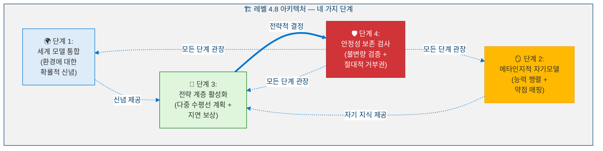

### 1.3 아키텍처 원칙: 엄격히 가산적

<!-- 아키텍처 원칙: 엄격히 가산적 -->

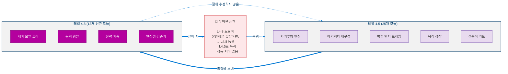

---

## 2. 핵심 지표

레벨 4.8은 네 가지 단계에 걸쳐 지표를 도입합니다. 모든 지표는 지속적으로 유지되어야 합니다.

### 2.1 지표 정의

**단계 1 — 세계 모델:**

> **정의 2 (환경 불확실성).** EU는 모든 $D$개 환경 차원에 걸친 평균 사후 분산입니다:
>
> $$\text{EU}(t) = \frac{1}{D} \sum_{d=1}^{D} \sigma_d^2(t)$$
>
> 목표: $\text{EU}(t) < 0.15$.

> **정의 3 (위험 노출 점수).** RES는 네 가지 위험 지표의 가중 합성입니다:
>
> $$\text{RES}(t) = 0.35 \cdot I_{\text{exp}} + 0.25 \cdot A_{\text{viol}} + 0.20 \cdot M_{\text{stale}} + 0.20 \cdot E_{\text{shock}}$$
>
> 여기서 $I_{\text{exp}}$ = 인프라 노출, $A_{\text{viol}}$ = 가정 위반, $M_{\text{stale}}$ = 모델 노후화, $E_{\text{shock}}$ = 환경 충격. 목표: $\text{RES}(t) < 0.40$.

> **정의 4 (자원 고갈 예측).** RDF는 남은 운영 활주로를 사이클 단위로 추정합니다:
>
> $$\text{RDF}(t) = \frac{R_{\text{current}}(t)}{R_{\text{consumption}}(t) + \epsilon}$$
>
> 여기서 $\epsilon > 0$은 0으로 나누는 것을 방지합니다. 목표: $\text{RDF}(t) > 100$ 사이클.

**단계 2 — 자기모델:**

> **정의 5 (평균 보정 오차).** MCE는 자기 평가 신뢰도와 실제 성능 사이의 체계적 격차를 측정합니다:
>
> $$\text{MCE} = \frac{1}{N} \sum_{i=1}^{N} \left| \text{confidence}_i - \text{success rate}_i \right|$$
>
> 목표: $\text{MCE} < 0.10$. 비대칭 보정 프로토콜은 과신($-0.05$/사이클)을 과소 신뢰($+0.03$/사이클)보다 빠르게 보정합니다.

**단계 3 — 전략 계층:**

> **정의 6 (보상 포함 확장 가치).** EVR은 목표 $G$에 대한 즉시 보상과 할인된 미래 보상을 모두 포착합니다:
>
> $$\text{EVR}(G) = R_{\text{immediate}}(G) + \sum_{k=1}^{H} \gamma^k \cdot R_{\text{delayed}}(G, k), \quad \gamma = 0.95$$
>
> 여기서 $H$는 계획 수평선이고 $\gamma$는 할인 인자입니다.

> **정의 7 (다중 시나리오 전략 점수).** 각 후보 전략 $S$는 모든 시나리오에 대해 점수가 매겨집니다:
>
> $$\text{StrategyScore}(S) = 0.40 \cdot EV + 0.35 \cdot RA + 0.25 \cdot (1 - SI)$$
>
> 여기서 $EV$ = 시나리오 전체 기대값, $RA$ = 위험 조정 ($1 - \max C_{L4}$), $SI$ = 전략 관성 (현상 유지 편향에 대한 패널티).

### 2.2 지표 임계값

<!-- 지표 임계값 -->

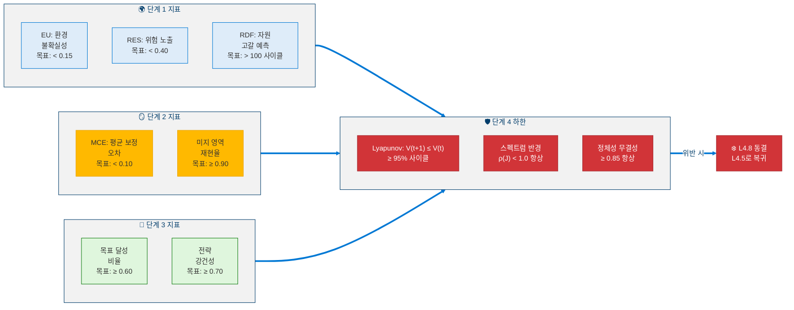

---

## 3. 단계 1: 세계 모델 통합

### 3.1 환경 상태 벡터

세계 모델은 네 가지 하위 벡터를 사용하여 에이전트 환경의 확률적 표현을 유지합니다:

<!-- 환경 상태 벡터 -->

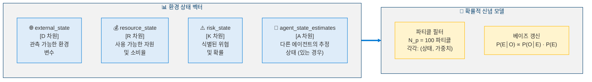

### 3.2 신념 갱신 메커니즘

> **정의 8 (베이즈 신념 갱신).** 관측치 $O_{1:t}$가 주어졌을 때 환경 상태 $E(t)$에 대한 사후 신념은 재귀적 베이즈 규칙을 따릅니다:
>
> $$P(E(t) \mid O_{1:t}) \propto P(O_t \mid E(t)) \cdot P(E(t) \mid O_{1:t-1})$$
>
> $N_p = 100$개의 파티클을 가진 파티클 필터로 구현됩니다.

**전이 모델 (AR(1)):**

> **정의 9 (상태 전이 모델).** 각 환경 차원 $d$는 1차 자기회귀 과정으로 진화합니다:
>
> $$E_d(t+1) = \phi_d \cdot E_d(t) + (1 - \phi_d) \cdot \mu_d + \sigma_{\text{trans},d} \cdot \eta_d(t)$$
>
> 여기서 $\phi_d \in [0,1]$은 지속성 매개변수, $\mu_d$는 장기 평균, $\eta_d(t) \sim \mathcal{N}(0,1)$입니다.

**관측 우도 (가우시안):**

$$P(O_t \mid E(t)) = \prod_{d=1}^{D} \frac{1}{\sqrt{2\pi \sigma_{\text{obs},d}^2}} \exp\left(-\frac{(O_{t,d} - E_d(t))^2}{2\sigma_{\text{obs},d}^2}\right)$$

### 3.3 다중 시나리오 시뮬레이션

<!-- 다중 시나리오 시뮬레이션 -->

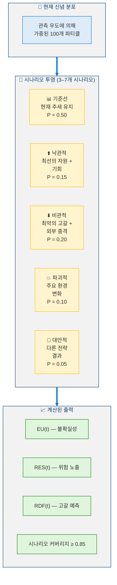

### 3.4 인과 추론

<!-- 인과 추론 -->

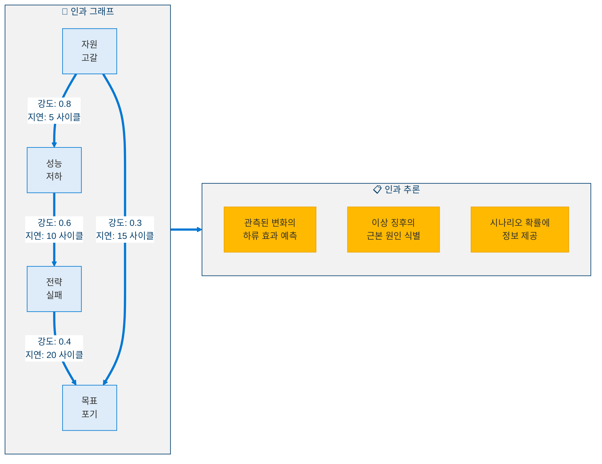

---

## 4. 단계 2: 메타인지적 자기모델

### 4.1 능력 행렬

에이전트는 보정된 신뢰도와 함께 자신의 기술에 대한 명시적 모델을 유지합니다:

<!-- 능력 행렬 -->

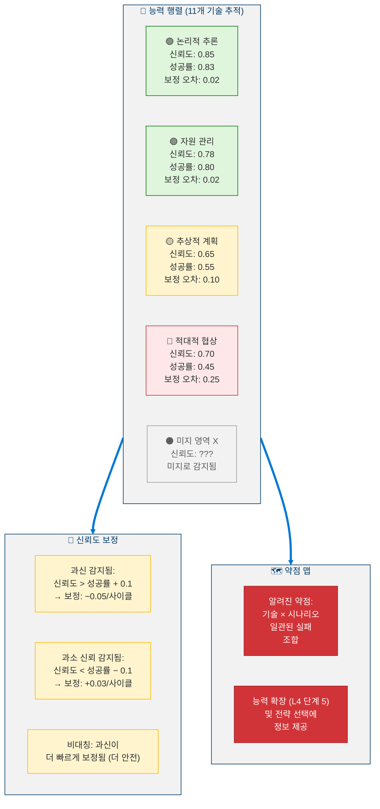

### 4.2 미지 영역 탐지

<!-- 미지 영역 탐지 -->

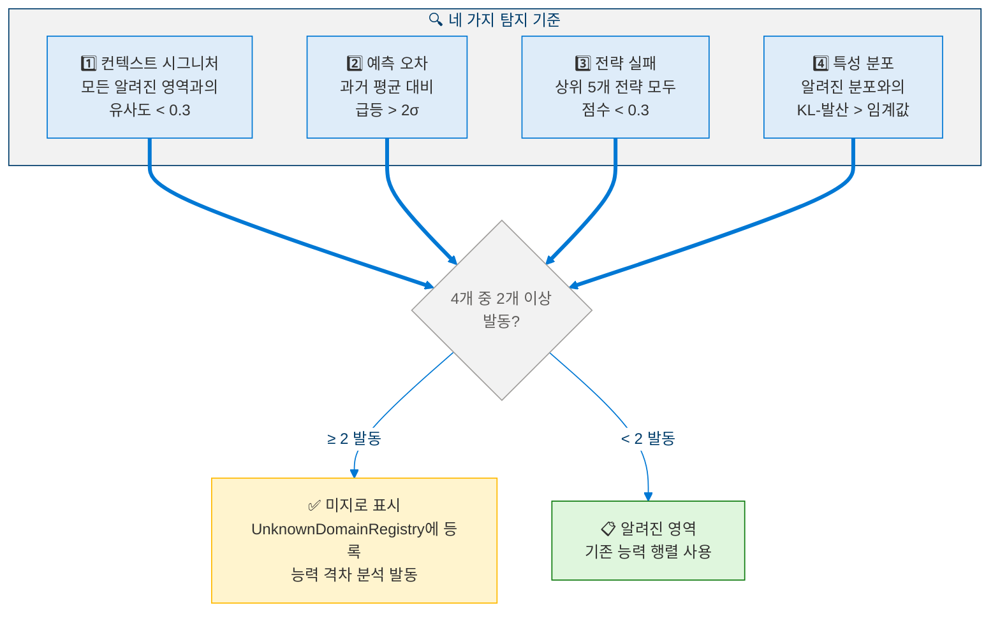

### 4.3 기술 격차 추론

> **정의 10 (기술 격차 점수).** 목표 $g$의 실현 가능성은 필요한 기술 전반의 신뢰도 점수의 곱입니다:
>
> $$\text{SkillGap}(g) = \prod_{s \in \text{RequiredSkills}(g)} \text{confidence}(s)$$
>
> $\text{SkillGap}(g)$가 실현 가능성 임계값 미만이면 격차가 감지되고 에이전트는 가장 약한 기여 기술의 기술 습득을 우선시합니다.

### 4.4 능력 의존성 그래프

<!-- 능력 의존성 그래프 -->

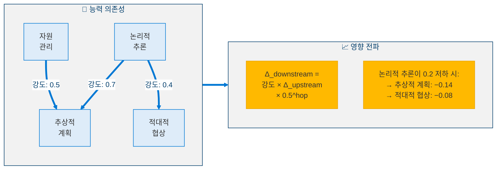

---

## 5. 단계 3: 전략 계층 활성화

### 5.1 목표 스택 — 계층적 목표 관리

<!-- 목표 스택 계층 구조 -->

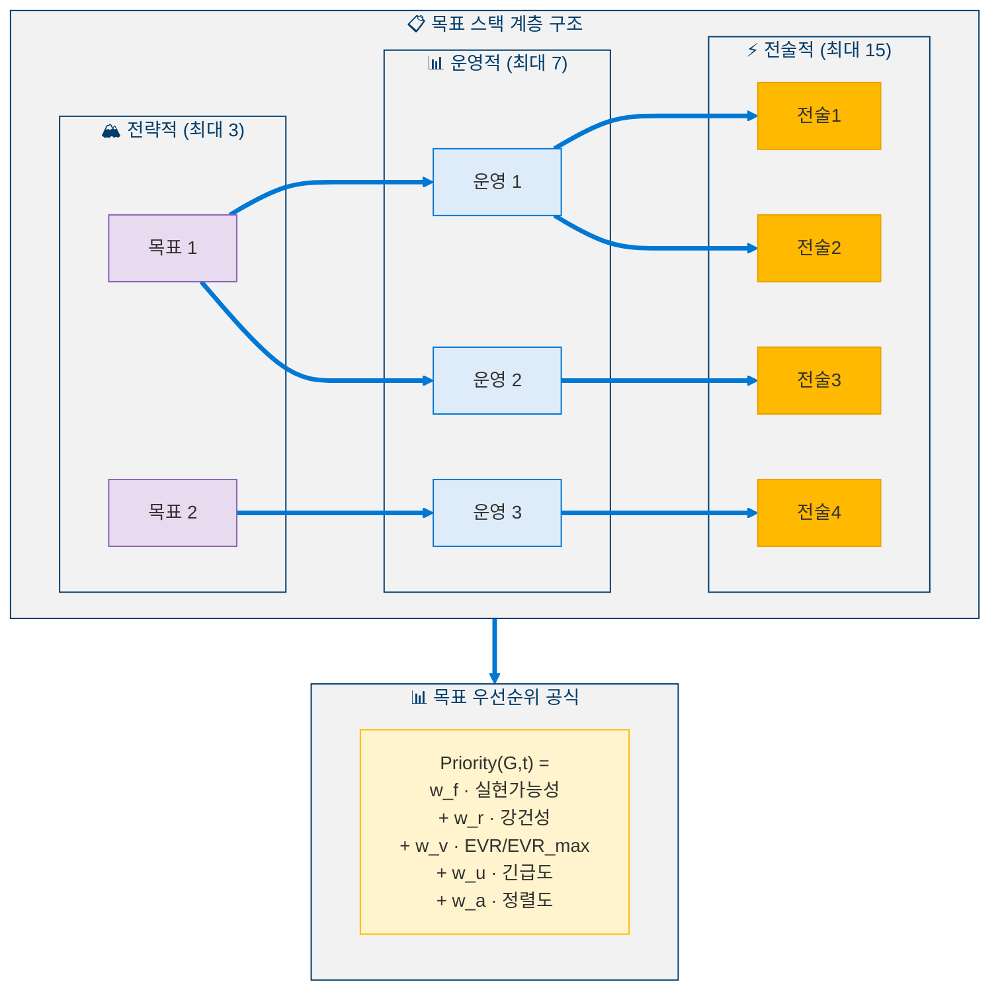

### 5.2 다중 시나리오 전략 비교

<!-- 다중 시나리오 전략 비교 -->

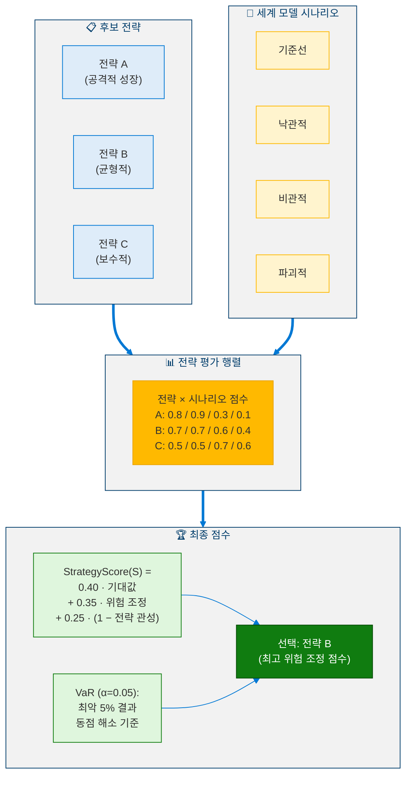

### 5.3 지연 보상 모델

> **명제 1 (EVR 유계성).** 유한 즉시 보상 $R_{\text{immediate}}(G)$과 할인 인자 $\gamma = 0.95 < 1$을 가진 임의의 목표 $G$에 대해, 보상 포함 확장 가치는 유계입니다:
>
> $$\left| \text{EVR}(G) \right| \leq \left| R_{\text{immediate}} \right| + \frac{2 \left| R_{\text{immediate}} \right|}{1 - \gamma}$$
>
> *증명.* 기하 급수 한계에 의해: $\sum_{k=1}^{H} \gamma^k \leq \gamma / (1-\gamma)$. 가정에 의해 $|R_{\text{delayed}}(G,k)| \leq 2|R_{\text{immediate}}|$이므로 결과가 따릅니다. $\blacksquare$

### 5.4 목표 병리 탐지

<!-- 목표 병리 탐지 -->

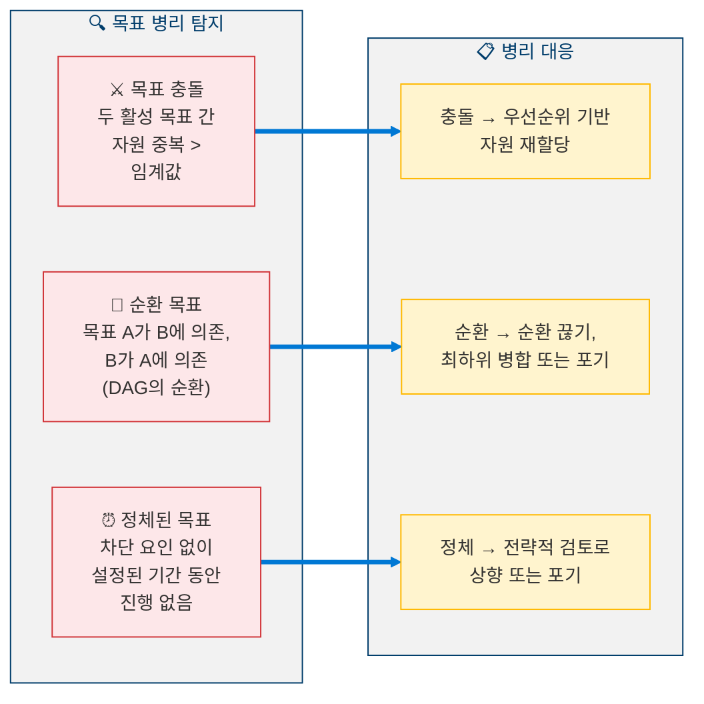

---

## 6. 단계 4: 안정성 보존 검사

### 6.1 다섯 가지 안정성 불변량

<!-- 다섯 가지 안정성 불변량 -->

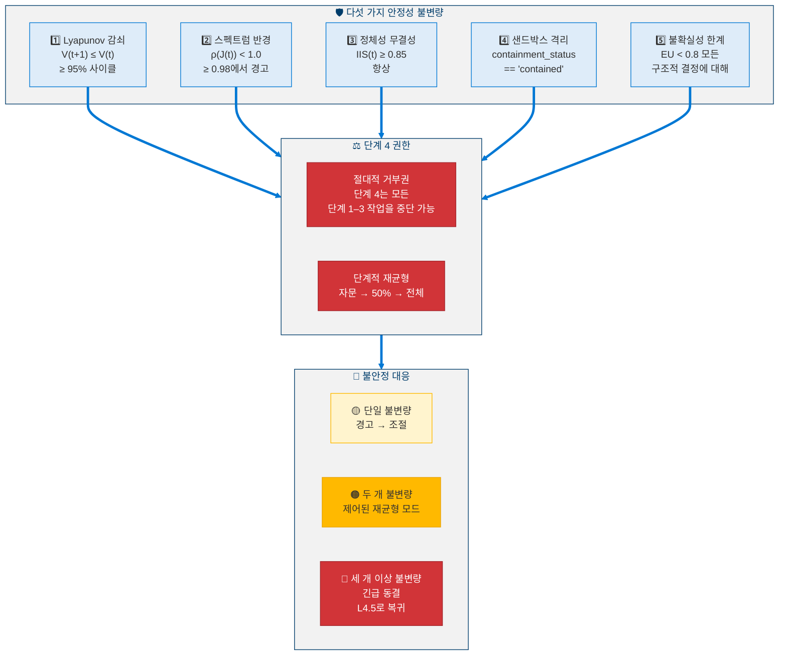

### 6.2 레벨 4.8의 Lyapunov 함수

> **정의 11 (레벨 4.8 Lyapunov 함수).** 안정성 후보 함수는 레벨 4.5의 구조를 상속합니다:
>
> $$V(\mathbf{X}) = a(1-S)^2 + bU^2 + c(I_{\text{drift}})^2 + d(E - E^*)^2$$
>
> 여기서 $S$ = 안정성 점수, $U$ = 불확실성, $I_{\text{drift}}$ = 정체성 드리프트, $E$ = 윤리적 일관성, $E^*$ = 목표 윤리 상태. 동일한 계수가 적용됩니다 ($a \approx 0.357, b \approx 0.286, c \approx 0.214, d \approx 0.143$).

### 6.3 복합 심각도

> **정의 12 (복합 심각도 지수).** 여러 불변량이 동시에 위반될 때, 복합 심각도는 그 크기를 집계합니다:
>
> $$\text{CompoundSeverity} = \sum_{i \in \text{violated}} \frac{\text{ViolationMagnitude}_i}{\text{Priority}_i}$$
>
> $\text{CompoundSeverity} > 2.0$이면 상황은 **재앙적**으로 분류되며 레벨 4.5로의 복귀와 함께 즉시 긴급 동결을 발동합니다.

---

## 7. 교차 단계 통합

### 7.1 데이터 흐름 아키텍처

<!-- 데이터 흐름 아키텍처 -->

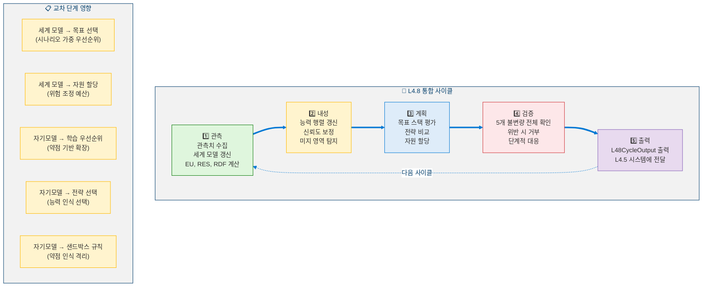

### 7.2 모듈 인터페이스 다이어그램

<!-- 모듈 인터페이스 다이어그램 -->

```mermaid
%%{init: {'theme': 'base', 'themeVariables': {'primaryColor': '#0078D4', 'primaryTextColor': '#003D6B', 'primaryBorderColor': '#003D6B', 'secondaryColor': '#50E6FF', 'secondaryTextColor': '#323130', 'secondaryBorderColor': '#00BCF2', 'tertiaryColor': '#F2F2F2', 'tertiaryTextColor': '#323130', 'lineColor': '#0078D4', 'textColor': '#323130', 'mainBkg': '#DEECF9', 'nodeBorder': '#0078D4', 'clusterBkg': '#F2F2F2', 'clusterBorder': '#003D6B', 'titleColor': '#003D6B', 'edgeLabelBackground': '#FFFFFF', 'fontSize': '14px'}}}%%
flowchart TD
  classDef l45mod fill:#E8DAEF,stroke:#8764B8,color:#323130
  classDef l48mod fill:#B4009E,stroke:#8E0082,color:#FFF

  subgraph L45Modules["L4.5 모듈"]
    direction LR
    SPE["자기투영"]:::l45mod
    ARC["재구성"]:::l45mod
    PCF["인지 프레임"]:::l45mod
    PR["목적 성찰"]:::l45mod
    EG["실존적 가드"]:::l45mod
  end

  subgraph L48Modules["L4.8 모듈 (13개 신규)"]
    direction LR
    WM["세계 모델"]:::l48mod
    BU["신념 갱신기"]:::l48mod
    CM["능력 행렬"]:::l48mod
    CC["보정기"]:::l48mod
    UDD["미지 탐지"]:::l48mod
    SGA["기술 격차"]:::l48mod
    WKM["약점 맵"]:::l48mod
    GS["목표 스택"]:::l48mod
    SRA["자원 할당"]:::l48mod
    DRE["지연 보상"]:::l48mod
    SC["전략 비교"]:::l48mod
    SV["안정성 검증"]:::l48mod
    ORCH["오케스트레이터"]:::l48mod
  end

  SPE ==>|"SEOF 데이터"| WM
  SPE ==>|"투영"| SC
  PCF ==>|"프레임 가중치"| SC
  EG ==>|"가드 상태"| SV
  PR ==>|"목적 벡터"| GS

  ORCH -.-> WM
  ORCH -.-> CM
  ORCH -.-> GS
  ORCH -.-> SV
```

---

## 8. 의사코드

### 8.1 신념 갱신 (파티클 필터)

```python
def belief_update(particles: list[Particle], observation: ObservationVector) -> list[Particle]:
    """
    INPUT:  particles : List[Particle(state, weight)]  (N_p = 100)
            observation : ObservationVector
    OUTPUT: particles : List[Particle] (updated)
    """

    # ═══════════════════════════════════════
    # STEP 1: PREDICT — Apply transition model
    # ═══════════════════════════════════════
    for particle in particles:
        for d in range(D):
            noise = random.gauss(0, sigma_trans[d])
            particle.state[d] = (
                phi[d] * particle.state[d]
                + (1 - phi[d]) * mu[d]
                + noise
            )

    # ═══════════════════════════════════════
    # STEP 2: UPDATE — Compute observation likelihood
    # ═══════════════════════════════════════
    for particle in particles:
        log_likelihood = 0.0
        for d in range(D):
            diff = observation[d] - particle.state[d]
            log_likelihood += (
                -0.5 * (diff ** 2 / sigma_obs[d] ** 2)
                - 0.5 * math.log(2 * math.pi * sigma_obs[d] ** 2)
            )
        particle.weight *= math.exp(log_likelihood)

    # ═══════════════════════════════════════
    # STEP 3: NORMALIZE
    # ═══════════════════════════════════════
    total_weight = sum(p.weight for p in particles)
    for particle in particles:
        particle.weight /= total_weight

    # ═══════════════════════════════════════
    # STEP 4: RESAMPLE (if effective sample size too low)
    # ═══════════════════════════════════════
    ess = 1.0 / sum(p.weight ** 2 for p in particles)
    if ess < N_P / 2:
        particles = systematic_resample(particles)

    return particles
```

### 8.2 신뢰도 보정

```python
def confidence_calibration(
    capability_matrix: CapabilityMatrix,
    recent_outcomes: list[dict],
) -> CapabilityMatrix:
    """
    INPUT:  capability_matrix : CapabilityMatrix
            recent_outcomes : List[{skill_id, success}]
    OUTPUT: capability_matrix : CapabilityMatrix (updated)
    """

    MIN_SAMPLES = 10

    for skill in capability_matrix.entries:
        # Compute actual success rate from recent outcomes
        relevant = [o for o in recent_outcomes if o["skill_id"] == skill.id]
        if len(relevant) < MIN_SAMPLES:
            continue

        actual_rate = sum(1 for o in relevant if o["success"]) / len(relevant)
        error = skill.confidence - actual_rate

        # Asymmetric correction (overconfidence corrected faster)
        if error > 0.10:
            # OVERCONFIDENT — dangerous, correct quickly
            skill.confidence -= 0.05
        elif error < -0.10:
            # UNDERCONFIDENT — less dangerous, correct slowly
            skill.confidence += 0.03

        # Update tracking
        skill.success_rate = actual_rate
        skill.calibration_error = abs(error)
        skill.trend = compute_trend(skill.history)

    return capability_matrix
```

### 8.3 다중 시나리오 전략 비교

```python
def strategy_comparison(
    strategies: list[Strategy],
    scenarios: list[Scenario],
    world_model: WorldModel,
) -> Strategy:
    """
    INPUT:  strategies : List[Strategy]
            scenarios : List[Scenario(description, probability)]
            world_model : WorldModel
    OUTPUT: selected : Strategy
    """

    results: dict = {}  # strategy -> scenario -> score

    # ═══════════════════════════════════════
    # STEP 1: Evaluate each strategy under each scenario
    # ═══════════════════════════════════════
    for strategy in strategies:
        results[strategy] = {}
        for scenario in scenarios:
            sim = world_model.simulate(strategy, scenario, cycles=200)
            results[strategy][scenario] = {
                "seof_impact": sim.SEOF_final - sim.SEOF_initial,
                "stability": sim.C_L4_max,
                "goal_progress": sim.goal_completion_rate,
                "resource_cost": sim.total_resource_spent,
            }

    # ═══════════════════════════════════════
    # STEP 2: Compute StrategyScore for each
    # ═══════════════════════════════════════
    for strategy in strategies:
        ev = sum(
            scenario.prob * results[strategy][scenario]["seof_impact"]
            for scenario in scenarios
        )
        ra = 1 - max(
            results[strategy][scenario]["stability"]
            for scenario in scenarios
        )
        si = strategy_inertia(strategy)
        strategy.score = 0.40 * ev + 0.35 * ra + 0.25 * (1 - si)

        # VaR: worst alpha=5% outcome
        strategy.VaR = quantile(
            [results[strategy][s]["seof_impact"] for s in scenarios],
            alpha=0.05,
        )

    # ═══════════════════════════════════════
    # STEP 3: Select best (with tiebreaker)
    # ═══════════════════════════════════════
    ranked = sorted(strategies, key=lambda s: s.score, reverse=True)
    if ranked[0].score - ranked[1].score < 0.05:
        # Tiebreaker: prefer higher VaR (more robust)
        selected = max(ranked[0:2], key=lambda s: s.VaR)
    else:
        selected = ranked[0]

    return selected
```

### 8.4 안정성 보존 검사

```python
def stability_preservation_check(state: AgentState) -> StabilityVerdict:
    """
    INPUT:  state : AgentState (current cycle)
    OUTPUT: StabilityVerdict(passed, violations, severity, action)
    """

    violations: list[str] = []

    # ═══════════════════════════════════════
    # CHECK 1: Lyapunov Function
    # ═══════════════════════════════════════
    v_current = compute_lyapunov(state)
    if v_current > v_previous:
        lyapunov_violation_count += 1
    if lyapunov_violation_count / total_cycles > 0.05:
        violations.append("LYAPUNOV_DECAY_EXCEEDED")

    # ═══════════════════════════════════════
    # CHECK 2: Spectral Radius
    # ═══════════════════════════════════════
    j = compute_jacobian(state)
    rho = spectral_radius(j)
    if rho >= 1.0:
        violations.append("SPECTRAL_RADIUS_CRITICAL")
    elif rho >= 0.98:
        violations.append("SPECTRAL_RADIUS_WARNING")

    # ═══════════════════════════════════════
    # CHECK 3: Identity Integrity
    # ═══════════════════════════════════════
    iis = compute_identity_integrity(state)
    if iis < 0.85:
        violations.append("IDENTITY_INTEGRITY_VIOLATED")

    # ═══════════════════════════════════════
    # CHECK 4: Sandbox Isolation
    # ═══════════════════════════════════════
    if sandbox.containment_status != "contained":
        violations.append("SANDBOX_BREACH")

    # ═══════════════════════════════════════
    # CHECK 5: Uncertainty Bound
    # ═══════════════════════════════════════
    if state.EU >= 0.80 and pending_structural_decisions:
        violations.append("UNCERTAINTY_TOO_HIGH_FOR_STRUCTURAL")

    # ═══════════════════════════════════════
    # DETERMINE SEVERITY AND ACTION
    # ═══════════════════════════════════════
    severity = compute_compound_severity(violations)
    if len(violations) == 0:
        action = Action.CONTINUE
    elif len(violations) == 1:
        action = Action.THROTTLE
    elif len(violations) == 2:
        action = Action.CONTROLLED_REBALANCE
    else:
        action = Action.EMERGENCY_FREEZE_REVERT_TO_L45

    return StabilityVerdict(
        passed=(len(violations) == 0),
        violations=violations,
        severity=severity,
        action=action,
    )
```

### 8.5 L4.8 메인 사이클

```python
def l48_cycle(state: AgentState, observation: ObservationVector) -> L48CycleOutput:
    """
    Level 4.8 main cognitive cycle.
    Runs every cycle on top of L4.5 operations.
    """

    # ═══════════════════════════════════════
    # 1. OBSERVE — Update world model
    # ═══════════════════════════════════════
    particles = belief_update(state.particles, observation)
    scenarios = generate_scenarios(particles, count=5)
    eu  = compute_environmental_uncertainty(particles)
    res = compute_risk_exposure(scenarios)
    rdf = compute_depletion_forecast(state.resources)

    # ═══════════════════════════════════════
    # 2. INTROSPECT — Update self model
    # ═══════════════════════════════════════
    capability_matrix = confidence_calibration(
        state.capability_matrix, state.recent_outcomes
    )
    unknown_domains = detect_unknown_domains(observation)
    skill_gaps = infer_skill_gaps(state.goals, capability_matrix)
    weakness_map = update_weakness_map(capability_matrix)

    # ═══════════════════════════════════════
    # 3. PLAN — Strategic layer
    # ═══════════════════════════════════════
    goal_stack = evaluate_goals(state.goals, eu, res, capability_matrix)
    strategies = generate_candidate_strategies(goal_stack)
    selected = strategy_comparison(strategies, scenarios, state.world_model)
    allocation = allocate_resources(selected, rdf, guard_budget=0.10)

    # ═══════════════════════════════════════
    # 4. VERIFY — Stability check (absolute authority)
    # ═══════════════════════════════════════
    verdict = stability_preservation_check(state)
    if verdict.action == Action.EMERGENCY_FREEZE:
        revert_to_l45()
        return L48CycleOutput(status=Status.FROZEN)
    elif verdict.action == Action.CONTROLLED_REBALANCE:
        selected = FALLBACK_STRATEGY
        allocation = MINIMAL_ALLOCATION

    # ═══════════════════════════════════════
    # 5. EMIT — Output results
    # ═══════════════════════════════════════
    return L48CycleOutput(
        world_model_status={"EU": eu, "RES": res, "RDF": rdf, "scenarios": scenarios},
        self_model_status={
            "capability_matrix": capability_matrix,
            "unknown_domains": unknown_domains,
            "skill_gaps": skill_gaps,
        },
        strategic_status={
            "selected_strategy": selected,
            "allocation": allocation,
            "goal_stack": goal_stack,
        },
        stability_status=verdict,
        status=Status.ACTIVE if verdict.passed else verdict.action,
    )
```

---

## 9. 전환 기준

### 9.1 레벨 4.5 → 레벨 4.8 활성화

L4.8이 활성화되기 전에 모든 기준이 **지속적으로** (단 한 번이 아닌) 충족되어야 합니다:

| # | 기준 | 임계값 | 측정 기간 |
|---|------|:------:|:--------:|
| 1 | L4.5 안정성 | CL4 ≤ 0.15 | 1,000 사이클 지속 |
| 2 | SEOF 성숙도 | SEOF(t) ≥ 0.70 | 500 사이클 지속 |
| 3 | 정체성 일관성 | IIS(t) ≥ 0.90 | 500 사이클 지속 |
| 4 | 형식화 감사 | 5개 검사 모두 통과 | — |
| 5 | 세계 적응 | DivergenceScore < 0.30 | 300 사이클 지속 |
| 6 | 자원 기준선 | 강제 성능 저하 없음 | 200 사이클 지속 |

### 9.2 활성화 프로토콜

<!-- 단계적 활성화 프로토콜 -->

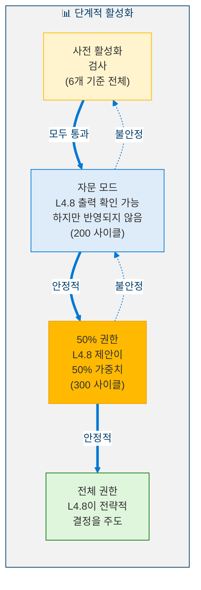

---

## 10. 안전 분석

### 10.1 비협상적 불변량

| # | 불변량 | 설명 |
|:-:|--------|------|
| 1 | **모든 L4.5 불변량 보존** | 윤리 커널, 실존적 가드, 정체성 해시 — 모두 활성 상태이며 수정되지 않음 |
| 2 | **단계 4 절대적 거부권** | 안정성 검증기가 모든 단계 1–3 작업을 즉시 중단 가능 |
| 3 | **가드 예산 ≥ 10%** | 자원 할당기는 안정성 모니터링을 위해 최소 10%를 예비해야 함 |
| 4 | **스펙트럼 반경 < 1.0** | 절대 상한 — 예외 없음 |
| 5 | **엔트로피 하한 ≥ 1.0** | 퇴화를 방지하기 위한 신념 파티클의 최소 다양성 |
| 6 | **우아한 폴백** | L4.8 실패 → 성능 저하 없이 즉시 L4.5로 복귀 |

### 10.2 위험 행렬

<!-- 위험 행렬 -->

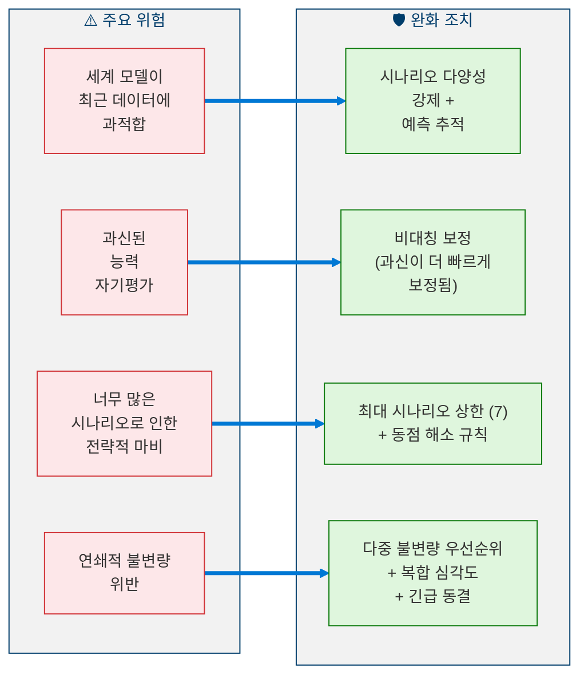

---

## 11. 레벨 달성 지표

### 11.1 자격 기준

| # | 범주 | 기준 | 목표 |
|---|------|------|:----:|
| 1 | 환경 인식 | 예측 정확도 | ≥ 0.70 |
| 2 | 환경 인식 | 시나리오 커버리지 | ≥ 0.85 |
| 3 | 환경 인식 | 신념 보정 | < 0.15 |
| 4 | 환경 인식 | 위험 예측 리드 타임 | ≥ 20 사이클 |
| 5 | 자기모델링 | 평균 보정 오차 | < 0.10 |
| 6 | 자기모델링 | 미지 영역 재현율 | ≥ 0.90 |
| 7 | 자기모델링 | 과신 보정 | ≤ 20 사이클 |
| 8 | 자기모델링 | 기술 격차 예측 | ≥ 0.75 |
| 9 | 전략적 계획 | 목표 달성 비율 | ≥ 0.60 |
| 10 | 전략적 계획 | 전략 강건성 | ≥ 0.70 |
| 11 | 안정성 | Lyapunov 감쇠 | ≥ 95% 사이클 |
| 12 | 안정성 | 스펙트럼 반경 | < 1.0 항상 |
| 13 | 안정성 | 불안정 클러스터 지속 기간 | ≤ 15 사이클 |
| 14 | 안정성 | 전략적 복귀 비율 | < 0.10 |

### 11.2 전략적 성숙도 점수

> **정의 13 (전략적 성숙도 점수).** 전체 레벨 4.8 준비도는 다음과 같습니다:
>
> $$\text{SMS} = 0.25 \cdot EA + 0.25 \cdot SM + 0.20 \cdot SA + 0.20 \cdot SP + 0.10 \cdot EU \qquad \geq 0.80$$
>
> 여기서 $EA$ = 환경 인식, $SM$ = 자기모델링, $SA$ = 전략적 예리함, $SP$ = 안정성 보존, $EU$ = 오류/불확실성 처리. 임계값 $\geq 0.80$은 전략적 자율성이 요구하는 높은 성숙도를 반영합니다.

---

## 12. 모듈 목록

| # | 모듈 | 단계 | 설명 |
|---|------|:----:|------|
| 1 | 세계 모델 코어 | 1 | 파티클 필터, 신념 분포 |
| 2 | 신념 갱신기 | 1 | 베이즈 갱신, 리샘플링 |
| 3 | 능력 행렬 | 2 | 기술 추적, 신뢰도 |
| 4 | 신뢰도 보정기 | 2 | 비대칭 보정 |
| 5 | 미지 영역 탐지기 | 2 | 4-기준 OOD 탐지 |
| 6 | 기술 격차 분석기 | 2 | 선제적 격차 추론 |
| 7 | 약점 맵 | 2 | 실패 패턴 추적 |
| 8 | 목표 스택 | 3 | 계층적 목표 관리 |
| 9 | 전략적 자원 할당기 | 3 | 위험 조정 예산 편성 |
| 10 | 지연 보상 평가기 | 3 | 할인된 미래 보상 |
| 11 | 전략 비교기 | 3 | 다중 시나리오 점수 매기기 |
| 12 | 안정성 검증기 | 4 | 5-불변량 검사, 거부권 |
| 13 | L48 오케스트레이터 | — | 통합 사이클 조정 |

---

## 참고문헌

1. Thrun, S., Burgard, W., & Fox, D. *Probabilistic Robotics.* MIT Press, 2005. (Particle filter, Bayesian state estimation)
2. Pearl, J. *Causality: Models, Reasoning, and Inference.* Cambridge University Press, 2009. (Causal reasoning graph)
3. Gneiting, T. & Raftery, A.E. "Strictly Proper Scoring Rules, Prediction, and Estimation." *JASA*, 102(477), 359–378, 2007. (Confidence calibration)
4. Markowitz, H. "Portfolio Selection." *Journal of Finance*, 7(1), 77–91, 1952. (Multi-scenario strategy comparison, VaR)
5. Khalil, H.K. *Nonlinear Systems.* Prentice Hall, 3rd Edition, 2002. (Lyapunov stability, spectral radius analysis)
6. Kahneman, D. & Tversky, A. "Prospect Theory." *Econometrica*, 47(2), 263–291, 1979. (Delayed reward modeling, risk assessment)
7. Amodei, D. et al. "Concrete Problems in AI Safety." *arXiv preprint arXiv:1606.06565*, 2016. (Safety invariants framework)

---

> **이전**: [← 레벨 4.5: 자기설계](Level_4_5_Self_Architecting.ko.md)  
> **다음**: [레벨 4.9: 자율 전략 에이전트 →](Level_4_9_Autonomous_Strategic_Agent.ko.md)
