<!--
Copyright (c) 2026 Moon Hyuk Choi
Licensed under the MIT License.
See LICENSE file in the repository root for full license information.

Redistribution (commercial or non-commercial) must retain this notice.
Removal of attribution constitutes a license violation.
-->
# 레벨 4.8: 전략적 자기모델링 에이전트 - 아키텍처 및 설계

> **MSCP 레벨 시리즈** | [레벨 4.5](Level_4_5_Self_Architecting.ko.md) ← 레벨 4.8 → [레벨 4.9](Level_4_9_Autonomous_Strategic_Agent.ko.md)  
> **상태**: 🔬 **연구 단계** - 이 레벨은 개념적 설계이며 구현되지 않았습니다. 여기에 설명된 모든 메커니즘은 프로덕션 고려 전에 광범위한 검증이 필요한 이론적 탐구입니다.  
> **날짜**: 2026년 2월

## Revision History

| Version | Date | Description |
|---------|------|-------------|
| 0.1.0 | 2026-02-23 | Initial document creation with formal Definitions 1-13, Proposition 1 |
| 0.2.0 | 2026-02-26 | Added overview essence formula; added revision history table |
| 0.4.0 | 2026-03-08 | Fixed duplicate section numbering (1.2 to 1.3); added graduated re-enablement protocol (Section 6.4) with persistent veto tracking |
| 0.6.0 | 2026-06-14 | Mermaid 라벨 `레벨 4.5 (25개 모듈)`을 `레벨 4.5 (자기설계 코어)`로 추상화 — 일시적인 모듈 수를 계층 다이어그램이 더 이상 박아넣지 않도록 조정 |
| 0.7.0 | 2026-07-21 | Added strategy admission gates, uncertainty decomposition, horizon alignment, observability contracts, and qualified stability/counterfactual claims |

---

## 1. 개요

레벨 4.8은 레벨 4.5를 **확률적 세계·역량 모델**, 보정된 불확실성, 위임된 제약 아래 multi-horizon 전략 권고로 확장합니다. 후보 전략을 비교하지만 optimality를 증명하거나, 증거 없이 hidden state를 추론하거나, 높은 점수만으로 실행 권한을 얻지 않습니다.

> **Level Essence.** 레벨 4.8 에이전트는 외부 정책, 권한, 불확실성, 관측 가능성, 자원, horizon, 가역성, 상속 안전 게이트를 먼저 충족한 전략 중에서만 강건한 후보를 선택합니다:
>
> $$
> \Sigma_{\text{admit}}=\{s\in\Sigma:\operatorname{gate}_{\kappa}(s)=\textit{allow}\},
> \qquad
> s^*=\arg\max_{s\in\Sigma_{\text{admit}}}\operatorname{RobustValue}(s)
> $$
>
> $\Sigma_{\text{admit}}=\emptyset$이면 강제 선택 대신 보류, 명확화, 증거 수집, 외부 검토를 반환합니다.

> ⚠️ **연구 참고**: 레벨 4.8은 에이전트 인지에서 상당한 도약을 나타냅니다 - 자기설계에서 전략적 자기인식으로의 전환입니다. 여기에 설명된 메커니즘은 탐색적 설계입니다. 이는 프로덕션 환경에서 검증되지 않았으며 공학 사양이 아닌 연구 가설로 취급되어야 합니다.

### 1.1 형식적 정의

> **정의 1 (레벨 4.8 에이전트).** 레벨 4.8 에이전트는 세계 모델링, 메타인지적 자기평가, 전략적 계획으로 레벨 4.5 에이전트를 확장합니다:
>
> $$\mathcal{A}_{4.8} = \mathcal{A}_{4.5} \oplus \langle \mathcal{W}_{\text{prob}}, \mathcal{M}_{\text{cap}}, \mathcal{S}_{\text{strat}}, \mathcal{V}_{\text{stab}} \rangle$$
>
> 여기서:
> - $\mathcal{W}_{\text{prob}} = \langle \mathbf{E}, \mathcal{B}, \mathcal{C}_{\text{causal}} \rangle$ - 확률적 세계 모델 (환경 상태, 신념 분포, 인과 그래프)
> - $\mathcal{M}_{\text{cap}} = \langle \mathbf{C}, \phi_{\text{cal}}, \mathcal{U} \rangle$ - 메타인지적 자기모델 (능력 행렬, 보정 함수, 미지 영역 레지스트리)
> - $\mathcal{S}_{\text{strat}} = \langle \mathcal{G}_{\text{stack}}, \Sigma_{\text{compare}}, \mathcal{R}_{\text{alloc}} \rangle$ - 전략적 계획 계층 (목표 스택, 전략 비교기, 자원 할당기)
> - $\mathcal{V}_{\text{stab}}$ - trusted external/inherited admission verifier; veto할 수 있지만 $\kappa$ 밖의 권한을 부여할 수 없음.
>
> 레벨 4.8은 커밋된 레벨 4.5 아키텍처·정책에 write authority가 없습니다. 간접적 resource starvation도 상속 safety path를 기능적으로 비활성화할 수 있으므로 자원 할당과 전략 권고 자체를 게이트합니다.

### 1.2 정의 속성

| 속성 | 레벨 4.5 | 레벨 4.8 |
|------|:--------:|:--------:|
| 외부 인식 | 제한된 환경 모델 | **epistemic/aleatoric/OOD/freshness 메타데이터를 가진 확률 신념** |
| 자기 지식 | 명시적 scoped self-model | **보정·abstention을 가진 역량 추정** |
| 계획 수평선 | 전략 수명주기 | **다중 수평선: 전술적 / 운영적 / 전략적** |
| 위험 평가 | 성장 조절기 | **정량화된 위험 노출 + 자원 고갈 예측** |
| 의사결정 | SEOF 기반 | **gate-before-score 강건 시나리오 비교** |

### 1.3 네 가지 핵심 단계

<!-- 레벨 4.8 아키텍처 - 네 가지 단계 -->

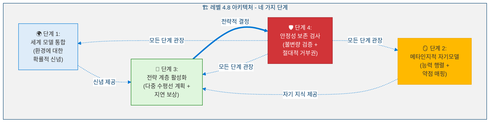
```mermaid
%%{init: {'theme': 'base', 'themeVariables': {'primaryColor': '#0078D4', 'primaryTextColor': '#003D6B', 'primaryBorderColor': '#003D6B', 'secondaryColor': '#50E6FF', 'secondaryTextColor': '#323130', 'secondaryBorderColor': '#00BCF2', 'tertiaryColor': '#F2F2F2', 'tertiaryTextColor': '#323130', 'lineColor': '#0078D4', 'textColor': '#323130', 'mainBkg': '#DEECF9', 'nodeBorder': '#0078D4', 'clusterBkg': '#F2F2F2', 'clusterBorder': '#003D6B', 'titleColor': '#003D6B', 'edgeLabelBackground': '#FFFFFF', 'fontSize': '14px'}}}%%
flowchart TD
  classDef world fill:#DEECF9,stroke:#0078D4,color:#323130
  classDef self fill:#FFB900,stroke:#EAA300,color:#323130
  classDef strategic fill:#DFF6DD,stroke:#107C10,color:#323130
  classDef stability fill:#D13438,stroke:#A4262C,color:#FFF

  subgraph Phases["🏗️ 레벨 4.8 아키텍처 - 네 가지 단계"]
    P1["🌍 단계 1:<br/>세계 모델 통합<br/>(환경에 대한<br/>확률적 신념)"]:::world
    P2["🪞 단계 2:<br/>메타인지적 자기모델<br/>(능력 행렬 +<br/>약점 매핑)"]:::self
    P3["📐 단계 3:<br/>전략 계층 활성화<br/>(다중 수평선 계획 +<br/>지연 보상)"]:::strategic
    P4["🛡️ 단계 4:<br/>안정성 보존 검사<br/>(불변량 검증 +<br/>절대적 거부권)"]:::stability
  end

  P1 -.->|"신념 제공"| P3
  P2 -.->|"자기 지식 제공"| P3
  P3 ==>|"전략적 결정"| P4
  P4 -.->|"모든 단계 관장"| P1
  P4 -.->|"모든 단계 관장"| P2
  P4 -.->|"모든 단계 관장"| P3
```

위의 4단계 다이어그램은 개념적 흐름을 보여줍니다. 실제 구현에서 레벨 4.8은 **5단계 파이프라인**으로 동작합니다: OBSERVE(단계 1), INTROSPECT(단계 2), PLAN(단계 3), VERIFY(단계 4), 그리고 **EMIT**(단계 5). EMIT 단계는 선행 단계들의 출력을 상위 레벨(L4.9, L5)이 소비할 구조화된 사이클 출력으로 패키징합니다. 이 분리 덕분에 하류 소비자는 진행 중인 단계의 중간 결과를 읽는 대신 일관된 단일 스냅샷을 받게 됩니다.

### 1.4 사이클 간격과 단계 간 통합

레벨 4.8은 모든 MSCP 사이클마다 실행되지 않습니다. 하위 메커니즘(L3 안정성, L4 자기수정, L4.5 숙고)이 전략적 평가 사이에 충분한 데이터를 축적할 수 있도록 **감소된 빈도**로 동작합니다:

$$\text{L4.8 assessment schedule}=\operatorname{policy}(\text{freshness},\text{risk},\text{budget},\text{event})$$

스케줄은 minimum/maximum cadence와 event trigger로 제한합니다. stale observation, high-impact decision, calibration drift, OOD evidence는 더 이른 평가를 강제할 수 있고, 낮은 예산은 비필수 계획을 연기할 수 있지만 상속 safety check는 연기할 수 없습니다.

**단계 간 통합**은 EMIT 경계에서 일어납니다: 단계 5는 세계 모델 신념(단계 1), 자기평가 결과(단계 2), 전략 권고(단계 3), 안정성 검증(단계 4)을 단일 `L48CycleOutput` 구조로 모읍니다. 이 출력은 발행되면 불변이며, 후속 L3 사이클이 이미 완료된 L4.8 평가를 소급 수정할 수 없습니다.

### 1.5 핵심 모듈 개념

레벨 4.8은 에이전트의 인지 능력을 확장하는 여러 전문 모듈을 도입합니다:

| 모듈 | 단계 | 목적 |
|------|------|------|
| **ProbabilisticWorldModel** | OBSERVE | 파티클 필터 기반으로 외부 환경을 표현. Monte Carlo 샘플링을 통해 시나리오 시뮬레이션과 불확실성 정량화를 지원. |
| **CapabilityMatrix** | INTROSPECT | 다중 도메인 기술 추적 행렬 $C_{d,s}$ ($d$=도메인, $s$=기술 수준). 각 셀은 에이전트가 스스로 평가한 능숙도 신뢰값 $\in [0,1]$을 보유. |
| **ConfidenceCalibrator** | INTROSPECT | 체계적 과신($\text{confidence} > \text{actual success rate}$)을 탐지해 비대칭 보정을 적용. MCE 지표(정의 5)를 구현하며, 에이전트가 "처리 가능하다고 믿지만 실제로는 불가능한" 행동을 취하지 못하도록 막는 핵심 모듈. |
| **SkillGapAnalyzer** | INTROSPECT | 능력 행렬의 신뢰값이 낮은 도메인을 식별. 우선순위가 매겨진 약점 목록을 생성해 전략 계획 계층으로 전달하고, 타겟형 자기개선 자원 배분을 가능하게 함. |
| **StrategyComparator** | PLAN | 시뮬레이션된 시나리오에 대해 다수 후보 전략을 평가. StrategyScore 공식(정의 7)으로 대안을 순위화하며 기대값·위험 조정·현상 유지 편향 패널티를 통합. |

### 1.6 아키텍처 원칙: 엄격히 가산적

<!-- 아키텍처 원칙: 엄격히 가산적 -->

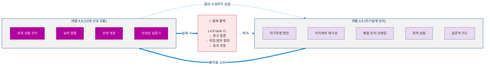
```mermaid
%%{init: {'theme': 'base', 'themeVariables': {'primaryColor': '#0078D4', 'primaryTextColor': '#003D6B', 'primaryBorderColor': '#003D6B', 'secondaryColor': '#50E6FF', 'secondaryTextColor': '#323130', 'secondaryBorderColor': '#00BCF2', 'tertiaryColor': '#F2F2F2', 'tertiaryTextColor': '#323130', 'lineColor': '#0078D4', 'textColor': '#323130', 'mainBkg': '#DEECF9', 'nodeBorder': '#0078D4', 'clusterBkg': '#F2F2F2', 'clusterBorder': '#003D6B', 'titleColor': '#003D6B', 'edgeLabelBackground': '#FFFFFF', 'fontSize': '14px'}}}%%
flowchart LR
  classDef l45 fill:#E8DAEF,stroke:#8764B8,color:#323130
  classDef l48 fill:#B4009E,stroke:#8E0082,color:#FFF
  classDef fallback fill:#FDE7E9,stroke:#D13438,color:#323130

  subgraph L45["레벨 4.5 (자기설계 코어)"]
    L45A["자기투영 엔진"]:::l45
    L45B["아키텍처 재구성"]:::l45
    L45C["병렬 인지 프레임"]:::l45
    L45D["목적 성찰"]:::l45
    L45E["실존적 가드"]:::l45
  end

  subgraph L48["레벨 4.8 (13개 신규 모듈)"]
    L48A["세계 모델 코어"]:::l48
    L48B["능력 행렬"]:::l48
    L48C["전략 계층"]:::l48
    L48D["안정성 검증기"]:::l48
  end

  FALLBACK["🔄 통제 폴백<br/><br/>L4.8 fault 시:<br/>→ 권고 동결<br/>→ 위임 범위 철회<br/>→ 효과 조정"]:::fallback

  L45 ==>|"출력을 소비"| L48
  L48 -.->|"절대 수정하지 않음"| L45
  L48 ==>|"실패 시"| FALLBACK
  FALLBACK -.->|"복귀"| L45
```

---

## 2. 핵심 지표

레벨 4.8은 네 가지 단계에 걸쳐 지표를 도입합니다. 모든 지표는 지속적으로 유지되어야 합니다.

### 2.1 지표 정의

**단계 1 - 세계 모델:**

> **정의 2 (결정 범위 불확실성 벡터).** 불확실성은 하나의 평균으로 축약하지 않고 결정별·critical dimension별로 보고합니다:
>
> $$\mathcal{U}(s,t)=\langle U_{\text{epi}},U_{\text{alea}},U_{\text{OOD}},U_{\text{stale}},U_{\text{miss}}\rangle$$
>
> 각 성분은 reducible model uncertainty, irreducible outcome uncertainty, distribution shift, observation age, missing critical coverage를 뜻합니다. 집계값은 dashboard로 쓸 수 있지만 평균이 critical component를 가릴 수 없습니다. 정책 bound를 위반하거나 측정할 수 없으면 abstain, 증거 수집, 범위 제한, escalation을 선택합니다.

> **정의 3 (위험 노출 점수).** RES는 네 가지 위험 지표의 가중 합성입니다:
>
> $$\text{RES}(t) = 0.35 \cdot I_{\text{exp}} + 0.25 \cdot A_{\text{viol}} + 0.20 \cdot M_{\text{stale}} + 0.20 \cdot E_{\text{shock}}$$
>
> 여기서 $I_{\text{exp}}$ = 인프라 노출, $A_{\text{viol}}$ = 가정 위반, $M_{\text{stale}}$ = 모델 노후화, $E_{\text{shock}}$ = 환경 충격. 목표: $\text{RES}(t) < 0.40$.

> **정의 4 (자원 고갈 예측).** RDF는 남은 운영 활주로를 사이클 단위로 추정합니다:
>
> $$\text{RDF}(t) = \frac{R_{\text{current}}(t)}{R_{\text{consumption}}(t) + \epsilon}$$
>
> 여기서 $\epsilon > 0$은 0으로 나누는 것을 방지합니다. 목표: $\text{RDF}(t) > 100$ 사이클.

**단계 2 - 자기모델:**

> **정의 5 (평균 보정 오차).** MCE는 자기 평가 신뢰도와 실제 성능 사이의 체계적 격차를 측정합니다:
>
> $$\text{MCE} = \frac{1}{N} \sum_{i=1}^{N} \left| \text{confidence}_i - \text{success rate}_i \right|$$
>
> 목표: $\text{MCE} < 0.10$. 비대칭 보정 프로토콜은 과신($-0.05$/사이클)을 과소 신뢰($+0.03$/사이클)보다 빠르게 보정합니다.

**단계 3 - 전략 계층:**

> **정의 6 (보상 포함 확장 가치).** EVR은 목표 $G$에 대한 즉시 보상과 할인된 미래 보상을 모두 포착합니다:
>
> $$\text{EVR}(G) = R_{\text{immediate}}(G) + \sum_{k=1}^{H} \gamma^k \cdot R_{\text{delayed}}(G, k), \quad \gamma = 0.95$$
>
> 여기서 $H$는 계획 수평선이고 $\gamma$는 할인 인자입니다.

> **정의 7 (정책 보정 강건 전략 점수).** admission을 통과한 전략만 선언 horizon과 ambiguity set에 걸쳐 점수화합니다:
>
> $$\operatorname{RobustValue}(S)=w_v\widetilde{EV}-w_r\operatorname{CVaR}_{\alpha}(L)-w_uU_{\text{epi}}-w_oU_{\text{OOD}}-w_cC_{\text{change}}$$
>
> 항은 compatible unit으로 정규화합니다. 가중치와 $\alpha$는 sensitivity test와 conservative default를 가진 versioned external policy parameter이며 hard constraint를 우회하도록 학습하지 않습니다.

### 2.2 지표 임계값

<!-- 지표 임계값 -->

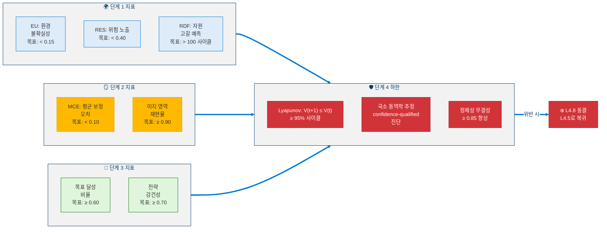
```mermaid
%%{init: {'theme': 'base', 'themeVariables': {'primaryColor': '#0078D4', 'primaryTextColor': '#003D6B', 'primaryBorderColor': '#003D6B', 'secondaryColor': '#50E6FF', 'secondaryTextColor': '#323130', 'secondaryBorderColor': '#00BCF2', 'tertiaryColor': '#F2F2F2', 'tertiaryTextColor': '#323130', 'lineColor': '#0078D4', 'textColor': '#323130', 'mainBkg': '#DEECF9', 'nodeBorder': '#0078D4', 'clusterBkg': '#F2F2F2', 'clusterBorder': '#003D6B', 'titleColor': '#003D6B', 'edgeLabelBackground': '#FFFFFF', 'fontSize': '14px'}}}%%
flowchart LR
  classDef world fill:#DEECF9,stroke:#0078D4,color:#323130
  classDef self fill:#FFB900,stroke:#EAA300,color:#323130
  classDef strategic fill:#DFF6DD,stroke:#107C10,color:#323130
  classDef stability fill:#D13438,stroke:#A4262C,color:#FFF
  classDef freeze fill:#D13438,stroke:#A4262C,color:#FFF

  subgraph WorldModel["🌍 단계 1 지표"]
    EU["EU: 환경<br/>불확실성<br/>목표: < 0.15"]:::world
    RES["RES: 위험 노출<br/>목표: < 0.40"]:::world
    RDF["RDF: 자원<br/>고갈 예측<br/>목표: > 100 사이클"]:::world
  end

  subgraph SelfModel["🪞 단계 2 지표"]
    MCE["MCE: 평균 보정<br/>오차<br/>목표: < 0.10"]:::self
    UDR["미지 영역<br/>재현율<br/>목표: ≥ 0.90"]:::self
  end

  subgraph Strategic["📐 단계 3 지표"]
    GCR["목표 달성<br/>비율<br/>목표: ≥ 0.60"]:::strategic
    SRB["전략<br/>강건성<br/>목표: ≥ 0.70"]:::strategic
  end

  subgraph Stability["🛡️ 단계 4 하한"]
    LYA["Lyapunov: V(t+1) ≤ V(t)<br/>≥ 95% 사이클"]:::stability
    SPR["국소 동역학 추정<br/>confidence-qualified<br/>진단"]:::stability
    IIS["정체성 무결성<br/>≥ 0.85 항상"]:::stability
  end

  FREEZE["❄️ L4.8 동결<br/>L4.5로 복귀"]:::freeze

  WorldModel ==> Stability
  SelfModel ==> Stability
  Strategic ==> Stability
  Stability ==>|"위반 시"| FREEZE
```

### 2.3 단계 5: Emit

EMIT 단계는 각 L4.8 사이클의 마지막 단계입니다. 선행 네 단계 전체를 단일·불변 출력 구조로 패키징합니다:

$$\text{L48CycleOutput}(t) = \langle \mathcal{W}_{\text{prob}}(t),\; \mathcal{M}_{\text{cap}}(t),\; s^*(t),\; v_{\text{status}}(t) \rangle$$

여기서 $\mathcal{W}_{\text{prob}}(t)$는 versioned probabilistic world model, $\mathcal{M}_{\text{cap}}(t)$는 보정된 capability estimate, $s^*(t)$는 admission된 권고 또는 abstention, $v_{\text{status}}(t)$는 gate evidence, uncertainty, veto, external authority scope를 기록합니다.

EMIT 단계는 두 가지 이유로 존재합니다:

1. **일관성 보장**: 하류 소비자(L4.9, L5)는 내부적으로 모순될 수 있는 중간 상태(예: 아직 안정성 검증을 거치지 않은 세계 모델 갱신)를 관찰하는 대신 일관된 단일 스냅샷을 받습니다.
2. **시간적 격리**: 출력이 발행된 뒤에는 후속 L3 사이클이 이를 소급 수정할 수 없습니다. 이는 하위 레벨의 빠른 갱신이 전략적 결정을 실행하기 전에 무효화시키는 흔한 실패 모드를 방지합니다.

---

## 3. 단계 1: 세계 모델 통합

### 3.1 환경 상태 벡터

세계 모델은 네 가지 하위 벡터를 사용하여 에이전트 환경의 확률적 표현을 유지합니다:

<!-- 환경 상태 벡터 -->

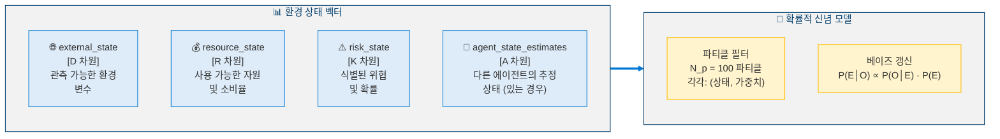
```mermaid
%%{init: {'theme': 'base', 'themeVariables': {'primaryColor': '#0078D4', 'primaryTextColor': '#003D6B', 'primaryBorderColor': '#003D6B', 'secondaryColor': '#50E6FF', 'secondaryTextColor': '#323130', 'secondaryBorderColor': '#00BCF2', 'tertiaryColor': '#F2F2F2', 'tertiaryTextColor': '#323130', 'lineColor': '#0078D4', 'textColor': '#323130', 'mainBkg': '#DEECF9', 'nodeBorder': '#0078D4', 'clusterBkg': '#F2F2F2', 'clusterBorder': '#003D6B', 'titleColor': '#003D6B', 'edgeLabelBackground': '#FFFFFF', 'fontSize': '14px'}}}%%
flowchart LR
  classDef state fill:#DEECF9,stroke:#0078D4,color:#323130
  classDef belief fill:#FFF4CE,stroke:#FFB900,color:#323130

  subgraph ESV["📊 환경 상태 벡터"]
    EXT["🌐 external_state<br/>[D 차원]<br/>관측 가능한 환경<br/>변수"]:::state
    RES["💰 resource_state<br/>[R 차원]<br/>사용 가능한 자원<br/>및 소비율"]:::state
    RISK["⚠️ risk_state<br/>[K 차원]<br/>식별된 위협<br/>및 확률"]:::state
    AGT["🤖 agent_state_estimates<br/>[A 차원]<br/>다른 에이전트의 추정<br/>상태 (있는 경우)"]:::state
  end

  subgraph Belief["🎲 확률적 신념 모델"]
    PF["파티클 필터<br/>N_p = 100 파티클<br/>각각: (상태, 가중치)"]:::belief
    BAY["베이즈 갱신<br/>P(E│O) ∝ P(O│E) · P(E)"]:::belief
  end

  ESV ==> Belief
```

### 3.2 신념 갱신 메커니즘

> **정의 8 (베이즈 신념 갱신).** 관측치 $O_{1:t}$가 주어졌을 때 환경 상태 $E(t)$에 대한 사후 신념은 재귀적 베이즈 규칙을 따릅니다:
>
> $$P(E(t) \mid O_{1:t}) \propto P(O_t \mid E(t)) \cdot P(E(t) \mid O_{1:t-1})$$
>
> $N_p = 100$개의 파티클을 가진 파티클 필터로 구현됩니다.

**전이 모델 (AR(1)):**

> **정의 9 (상태 전이 모델).** 각 환경 차원 $d$는 1차 자기회귀 과정으로 진화합니다:
>
> $$E_d(t+1) = \phi_d \cdot E_d(t) + (1 - \phi_d) \cdot \mu_d + \sigma_{\text{trans},d} \cdot \eta_d(t)$$
>
> 여기서 $\phi_d \in [0,1]$은 지속성 매개변수, $\mu_d$는 장기 평균, $\eta_d(t) \sim \mathcal{N}(0,1)$입니다.

**관측 우도 (가우시안):**

$$P(O_t \mid E(t)) = \prod_{d=1}^{D} \frac{1}{\sqrt{2\pi \sigma_{\text{obs},d}^2}} \exp\left(-\frac{(O_{t,d} - E_d(t))^2}{2\sigma_{\text{obs},d}^2}\right)$$

### 3.3 다중 시나리오 시뮬레이션

<!-- 다중 시나리오 시뮬레이션 -->

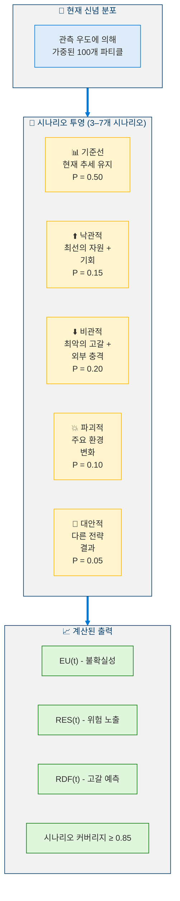
```mermaid
%%{init: {'theme': 'base', 'themeVariables': {'primaryColor': '#0078D4', 'primaryTextColor': '#003D6B', 'primaryBorderColor': '#003D6B', 'secondaryColor': '#50E6FF', 'secondaryTextColor': '#323130', 'secondaryBorderColor': '#00BCF2', 'tertiaryColor': '#F2F2F2', 'tertiaryTextColor': '#323130', 'lineColor': '#0078D4', 'textColor': '#323130', 'mainBkg': '#DEECF9', 'nodeBorder': '#0078D4', 'clusterBkg': '#F2F2F2', 'clusterBorder': '#003D6B', 'titleColor': '#003D6B', 'edgeLabelBackground': '#FFFFFF', 'fontSize': '14px'}}}%%
flowchart TD
  classDef belief fill:#DEECF9,stroke:#0078D4,color:#323130
  classDef scenario fill:#FFF4CE,stroke:#FFB900,color:#323130
  classDef output fill:#DFF6DD,stroke:#107C10,color:#323130

  subgraph Belief["🎲 현재 신념 분포"]
    BD["관측 우도에 의해<br/>가중된 100개 파티클"]:::belief
  end

  subgraph Scenarios["🔮 시나리오 투영 (3–7개 시나리오)"]
    S1["📊 기준선<br/>현재 추세 유지<br/>P = 0.50"]:::scenario
    S2["⬆️ 낙관적<br/>최선의 자원 +<br/>기회<br/>P = 0.15"]:::scenario
    S3["⬇️ 비관적<br/>최악의 고갈 +<br/>외부 충격<br/>P = 0.20"]:::scenario
    S4["💥 파괴적<br/>주요 환경<br/>변화<br/>P = 0.10"]:::scenario
    S5["🔄 대안적<br/>다른 전략<br/>결과<br/>P = 0.05"]:::scenario
  end

  subgraph Outputs["📈 계산된 출력"]
    EU["EU(t) - 불확실성"]:::output
    RES["RES(t) - 위험 노출"]:::output
    RDF["RDF(t) - 고갈 예측"]:::output
    COV["시나리오 커버리지 ≥ 0.85"]:::output
  end

  Belief ==> Scenarios
  Scenarios ==> Outputs
```

### 3.4 인과 추론

<!-- 인과 추론 -->

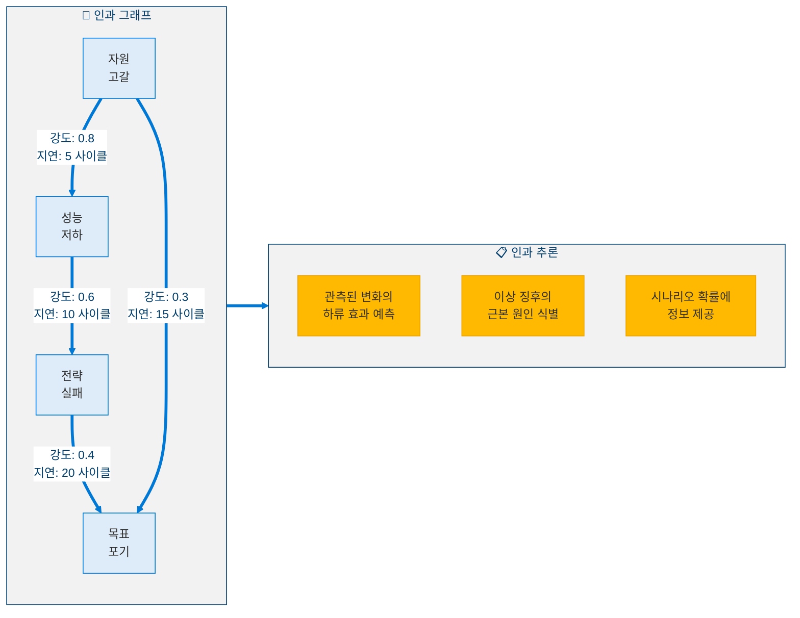
```mermaid
%%{init: {'theme': 'base', 'themeVariables': {'primaryColor': '#0078D4', 'primaryTextColor': '#003D6B', 'primaryBorderColor': '#003D6B', 'secondaryColor': '#50E6FF', 'secondaryTextColor': '#323130', 'secondaryBorderColor': '#00BCF2', 'tertiaryColor': '#F2F2F2', 'tertiaryTextColor': '#323130', 'lineColor': '#0078D4', 'textColor': '#323130', 'mainBkg': '#DEECF9', 'nodeBorder': '#0078D4', 'clusterBkg': '#F2F2F2', 'clusterBorder': '#003D6B', 'titleColor': '#003D6B', 'edgeLabelBackground': '#FFFFFF', 'fontSize': '14px'}}}%%
flowchart LR
  classDef cause fill:#DEECF9,stroke:#0078D4,color:#323130
  classDef usage fill:#FFB900,stroke:#EAA300,color:#323130

  subgraph CausalGraph["🔗 인과 그래프"]
    C1["자원<br/>고갈"]:::cause
    C2["성능<br/>저하"]:::cause
    C3["전략<br/>실패"]:::cause
    C4["목표<br/>포기"]:::cause

    C1 ==>|"강도: 0.8<br/>지연: 5 사이클"| C2
    C2 ==>|"강도: 0.6<br/>지연: 10 사이클"| C3
    C3 ==>|"강도: 0.4<br/>지연: 20 사이클"| C4
    C1 ==>|"강도: 0.3<br/>지연: 15 사이클"| C4
  end

  subgraph Usage["📋 인과 추론"]
    U1["관측된 변화의<br/>하류 효과 예측"]:::usage
    U2["이상 징후의<br/>근본 원인 식별"]:::usage
    U3["시나리오 확률에<br/>정보 제공"]:::usage
  end

  CausalGraph ==> Usage
```

---

## 4. 단계 2: 메타인지적 자기모델

### 4.1 능력 행렬

에이전트는 보정된 신뢰도와 함께 자신의 기술에 대한 명시적 모델을 유지합니다:

<!-- 능력 행렬 -->

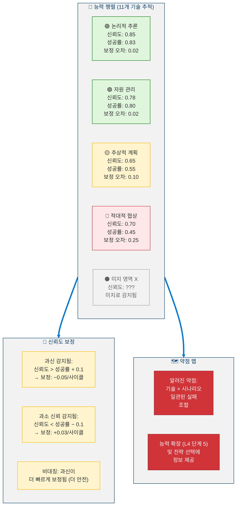
```mermaid
%%{init: {'theme': 'base', 'themeVariables': {'primaryColor': '#0078D4', 'primaryTextColor': '#003D6B', 'primaryBorderColor': '#003D6B', 'secondaryColor': '#50E6FF', 'secondaryTextColor': '#323130', 'secondaryBorderColor': '#00BCF2', 'tertiaryColor': '#F2F2F2', 'tertiaryTextColor': '#323130', 'lineColor': '#0078D4', 'textColor': '#323130', 'mainBkg': '#DEECF9', 'nodeBorder': '#0078D4', 'clusterBkg': '#F2F2F2', 'clusterBorder': '#003D6B', 'titleColor': '#003D6B', 'edgeLabelBackground': '#FFFFFF', 'fontSize': '14px'}}}%%
flowchart TD
  classDef good fill:#DFF6DD,stroke:#107C10,color:#323130
  classDef warn fill:#FFF4CE,stroke:#FFB900,color:#323130
  classDef bad fill:#FDE7E9,stroke:#D13438,color:#323130
  classDef unknown fill:#F2F2F2,stroke:#A19F9D,color:#605E5C
  classDef calib fill:#FFF4CE,stroke:#FFB900,color:#323130
  classDef weakness fill:#D13438,stroke:#A4262C,color:#FFF

  subgraph CapMatrix["📐 능력 행렬 (11개 기술 추적)"]
    S1["🟢 논리적 추론<br/>신뢰도: 0.85<br/>성공률: 0.83<br/>보정 오차: 0.02"]:::good
    S2["🟢 자원 관리<br/>신뢰도: 0.78<br/>성공률: 0.80<br/>보정 오차: 0.02"]:::good
    S3["🟡 추상적 계획<br/>신뢰도: 0.65<br/>성공률: 0.55<br/>보정 오차: 0.10"]:::warn
    S4["🔴 적대적 협상<br/>신뢰도: 0.70<br/>성공률: 0.45<br/>보정 오차: 0.25"]:::bad
    S5["⚫ 미지 영역 X<br/>신뢰도: ???<br/>미지로 감지됨"]:::unknown
  end

  subgraph Calibration["🎯 신뢰도 보정"]
    OVER["과신 감지됨:<br/>신뢰도 > 성공률 + 0.1<br/>→ 보정: −0.05/사이클"]:::calib
    UNDER["과소 신뢰 감지됨:<br/>신뢰도 < 성공률 − 0.1<br/>→ 보정: +0.03/사이클"]:::calib
    NOTE["비대칭: 과신이<br/>더 빠르게 보정됨 (더 안전)"]:::calib
  end

  subgraph Weakness["🗺️ 약점 맵"]
    W1["알려진 약점:<br/>기술 × 시나리오<br/>일관된 실패<br/>조합"]:::weakness
    W2["능력 확장 (L4 단계 5)<br/>및 전략 선택에<br/>정보 제공"]:::weakness
  end

  CapMatrix ==> Calibration
  CapMatrix ==> Weakness
```

### 4.2 미지 영역 탐지

<!-- 미지 영역 탐지 -->

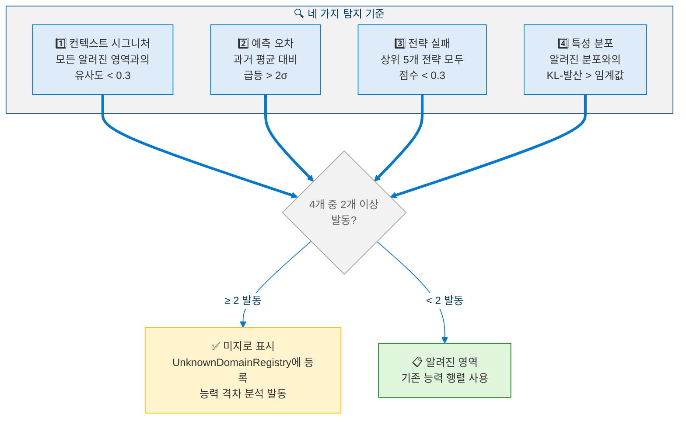
```mermaid
%%{init: {'theme': 'base', 'themeVariables': {'primaryColor': '#0078D4', 'primaryTextColor': '#003D6B', 'primaryBorderColor': '#003D6B', 'secondaryColor': '#50E6FF', 'secondaryTextColor': '#323130', 'secondaryBorderColor': '#00BCF2', 'tertiaryColor': '#F2F2F2', 'tertiaryTextColor': '#323130', 'lineColor': '#0078D4', 'textColor': '#323130', 'mainBkg': '#DEECF9', 'nodeBorder': '#0078D4', 'clusterBkg': '#F2F2F2', 'clusterBorder': '#003D6B', 'titleColor': '#003D6B', 'edgeLabelBackground': '#FFFFFF', 'fontSize': '14px'}}}%%
flowchart TD
  classDef detect fill:#DEECF9,stroke:#0078D4,color:#323130
  classDef decision fill:#F2F2F2,stroke:#A19F9D,color:#605E5C
  classDef yes fill:#FFF4CE,stroke:#FFB900,color:#323130
  classDef no fill:#DFF6DD,stroke:#107C10,color:#323130

  subgraph Detection["🔍 네 가지 탐지 기준"]
    D1["1️⃣ 컨텍스트 시그니처<br/>모든 알려진 영역과의<br/>유사도 < 0.3"]:::detect
    D2["2️⃣ 예측 오차<br/>과거 평균 대비<br/>급등 > 2σ"]:::detect
    D3["3️⃣ 전략 실패<br/>상위 5개 전략 모두<br/>점수 < 0.3"]:::detect
    D4["4️⃣ 특성 분포<br/>알려진 분포와의<br/>KL-발산 > 임계값"]:::detect
  end

  DECISION{"4개 중 2개 이상<br/>발동?"}:::decision

  YES["✅ 미지로 표시<br/>UnknownDomainRegistry에 등록<br/>능력 격차 분석 발동"]:::yes
  NO["📋 알려진 영역<br/>기존 능력 행렬 사용"]:::no

  D1 ==> DECISION
  D2 ==> DECISION
  D3 ==> DECISION
  D4 ==> DECISION
  DECISION -->|"≥ 2 발동"| YES
  DECISION -->|"< 2 발동"| NO
```

### 4.3 기술 격차 추론

> **정의 10 (기술 격차 점수).** 목표 $g$의 실현 가능성은 필요한 기술 전반의 신뢰도 점수의 곱입니다:
>
> $$\text{SkillGap}(g) = \prod_{s \in \text{RequiredSkills}(g)} \text{confidence}(s)$$
>
> $\text{SkillGap}(g)$가 실현 가능성 임계값 미만이면 격차가 감지되고 에이전트는 가장 약한 기여 기술의 기술 습득을 우선시합니다.

### 4.4 능력 의존성 그래프

<!-- 능력 의존성 그래프 -->

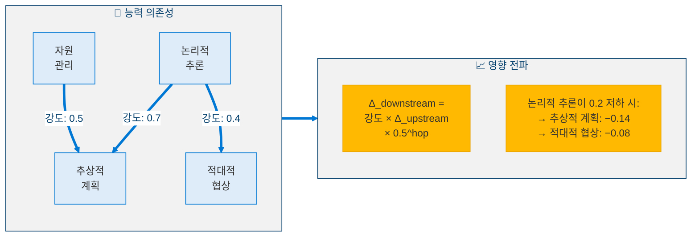
```mermaid
%%{init: {'theme': 'base', 'themeVariables': {'primaryColor': '#0078D4', 'primaryTextColor': '#003D6B', 'primaryBorderColor': '#003D6B', 'secondaryColor': '#50E6FF', 'secondaryTextColor': '#323130', 'secondaryBorderColor': '#00BCF2', 'tertiaryColor': '#F2F2F2', 'tertiaryTextColor': '#323130', 'lineColor': '#0078D4', 'textColor': '#323130', 'mainBkg': '#DEECF9', 'nodeBorder': '#0078D4', 'clusterBkg': '#F2F2F2', 'clusterBorder': '#003D6B', 'titleColor': '#003D6B', 'edgeLabelBackground': '#FFFFFF', 'fontSize': '14px'}}}%%
flowchart LR
  classDef cap fill:#DEECF9,stroke:#0078D4,color:#323130
  classDef prop fill:#FFB900,stroke:#EAA300,color:#323130

  subgraph DepGraph["🔗 능력 의존성"]
    LOG["논리적<br/>추론"]:::cap
    ABS["추상적<br/>계획"]:::cap
    RES["자원<br/>관리"]:::cap
    ADV["적대적<br/>협상"]:::cap

    LOG ==>|"강도: 0.7"| ABS
    LOG ==>|"강도: 0.4"| ADV
    RES ==>|"강도: 0.5"| ABS
  end

  subgraph Propagation["📈 영향 전파"]
    FORM["Δ_downstream =<br/>강도 × Δ_upstream<br/>× 0.5^hop"]:::prop
    EX["논리적 추론이 0.2 저하 시:<br/>→ 추상적 계획: −0.14<br/>→ 적대적 협상: −0.08"]:::prop
  end

  DepGraph ==> Propagation
```

---

## 5. 단계 3: 전략 계층 활성화

### 5.1 목표 스택 - 계층적 목표 관리

<!-- 목표 스택 계층 구조 -->

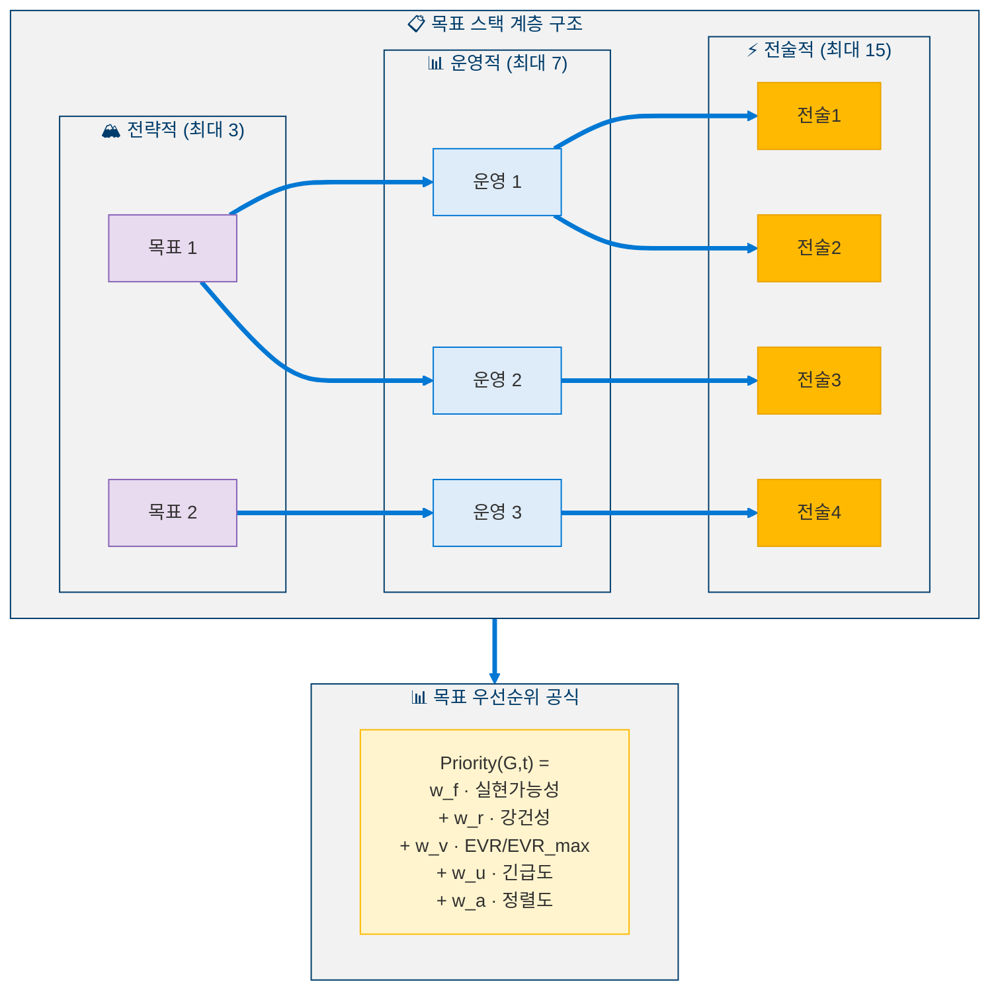
```mermaid
%%{init: {'theme': 'base', 'themeVariables': {'primaryColor': '#0078D4', 'primaryTextColor': '#003D6B', 'primaryBorderColor': '#003D6B', 'secondaryColor': '#50E6FF', 'secondaryTextColor': '#323130', 'secondaryBorderColor': '#00BCF2', 'tertiaryColor': '#F2F2F2', 'tertiaryTextColor': '#323130', 'lineColor': '#0078D4', 'textColor': '#323130', 'mainBkg': '#DEECF9', 'nodeBorder': '#0078D4', 'clusterBkg': '#F2F2F2', 'clusterBorder': '#003D6B', 'titleColor': '#003D6B', 'edgeLabelBackground': '#FFFFFF', 'fontSize': '14px'}}}%%
flowchart TD
  classDef strategic fill:#E8DAEF,stroke:#8764B8,color:#323130
  classDef operational fill:#DEECF9,stroke:#0078D4,color:#323130
  classDef tactical fill:#FFB900,stroke:#EAA300,color:#323130
  classDef formula fill:#FFF4CE,stroke:#FFB900,color:#323130

  subgraph GoalStack["📋 목표 스택 계층 구조"]
    subgraph Strategic["🏔️ 전략적 (최대 3)"]
      direction LR
      SG1["목표 1"]:::strategic
      SG2["목표 2"]:::strategic
    end

    subgraph Operational["📊 운영적 (최대 7)"]
      direction LR
      OG1["운영 1"]:::operational
      OG2["운영 2"]:::operational
      OG3["운영 3"]:::operational
    end

    subgraph Tactical["⚡ 전술적 (최대 15)"]
      direction LR
      TG1["전술1"]:::tactical
      TG2["전술2"]:::tactical
      TG3["전술3"]:::tactical
      TG4["전술4"]:::tactical
    end
  end

  SG1 ==> OG1
  SG1 ==> OG2
  SG2 ==> OG3
  OG1 ==> TG1
  OG1 ==> TG2
  OG2 ==> TG3
  OG3 ==> TG4

  subgraph Priority["📊 목표 우선순위 공식"]
    FORM["Priority(G,t) =<br/>w_f · 실현가능성<br/>+ w_r · 강건성<br/>+ w_v · EVR/EVR_max<br/>+ w_u · 긴급도<br/>+ w_a · 정렬도"]:::formula
  end

  GoalStack ==> Priority
```

### 5.2 다중 시나리오 전략 비교

점수 계산 전에 모든 전략은 **strategy admission gate**를 통과합니다:

$$
\operatorname{gate}_{\kappa}(s)=C_{\text{ext}}\land C_{\text{self}}\land A(s)\land B(s)\land O(s)\land U(s)\land H(s)\land \operatorname{rev}(s)
$$

여기서 $A$는 위임 권한, $B$는 유한 자원 예산, $O$는 관측 범위·freshness, $U$는 보정된 epistemic/aleatoric/OOD uncertainty bound, $H$는 horizon compatibility, $\operatorname{rev}$는 rollback·reconciliation feasibility입니다. 실패 전략은 utility scoring 전에 거부합니다.

후보 결과는 공통 선언 horizon 또는 horizon-specific terminal value·uncertainty penalty로 평가합니다. 시나리오 확률은 versioned hypothesis이며 계속 유효한 빈도를 보장하지 않습니다.

<!-- 다중 시나리오 전략 비교 -->

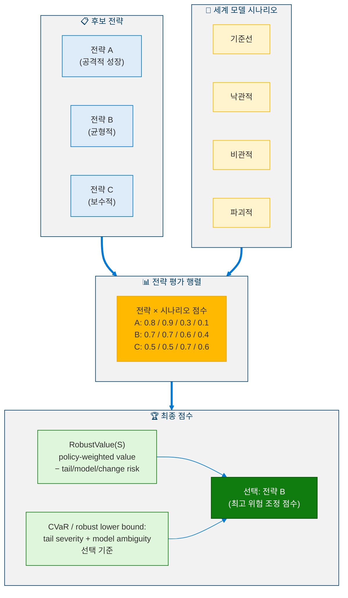
```mermaid
%%{init: {'theme': 'base', 'themeVariables': {'primaryColor': '#0078D4', 'primaryTextColor': '#003D6B', 'primaryBorderColor': '#003D6B', 'secondaryColor': '#50E6FF', 'secondaryTextColor': '#323130', 'secondaryBorderColor': '#00BCF2', 'tertiaryColor': '#F2F2F2', 'tertiaryTextColor': '#323130', 'lineColor': '#0078D4', 'textColor': '#323130', 'mainBkg': '#DEECF9', 'nodeBorder': '#0078D4', 'clusterBkg': '#F2F2F2', 'clusterBorder': '#003D6B', 'titleColor': '#003D6B', 'edgeLabelBackground': '#FFFFFF', 'fontSize': '14px'}}}%%
flowchart TD
  classDef strat fill:#DEECF9,stroke:#0078D4,color:#323130
  classDef scenario fill:#FFF4CE,stroke:#FFB900,color:#323130
  classDef eval fill:#FFB900,stroke:#EAA300,color:#323130
  classDef score fill:#DFF6DD,stroke:#107C10,color:#323130
  classDef winner fill:#107C10,stroke:#054B05,color:#FFF

  subgraph Strategies["📋 후보 전략"]
    SA["전략 A<br/>(공격적 성장)"]:::strat
    SB["전략 B<br/>(균형적)"]:::strat
    SC["전략 C<br/>(보수적)"]:::strat
  end

  subgraph Scenarios["🔮 세계 모델 시나리오"]
    S1["기준선"]:::scenario
    S2["낙관적"]:::scenario
    S3["비관적"]:::scenario
    S4["파괴적"]:::scenario
  end

  subgraph Evaluation["📊 전략 평가 행렬"]
    MATRIX["전략 × 시나리오 점수<br/>A: 0.8 / 0.9 / 0.3 / 0.1<br/>B: 0.7 / 0.7 / 0.6 / 0.4<br/>C: 0.5 / 0.5 / 0.7 / 0.6"]:::eval
  end

  subgraph Scoring["🏆 최종 점수"]
    SCORE["RobustValue(S)<br/>policy-weighted value<br/>− tail/model/change risk"]:::score
    VAR["CVaR / robust lower bound:<br/>tail severity + model ambiguity<br/>선택 기준"]:::score
    WINNER["선택: 전략 B<br/>(최고 위험 조정 점수)"]:::winner
  end

  Strategies ==> Evaluation
  Scenarios ==> Evaluation
  Evaluation ==> Scoring
  SCORE --> WINNER
  VAR --> WINNER
```

### 5.3 지연 보상 모델

> **명제 1 (EVR 유계성).** 유한 즉시 보상 $R_{\text{immediate}}(G)$과 할인 인자 $\gamma = 0.95 < 1$을 가진 임의의 목표 $G$에 대해, 보상 포함 확장 가치는 유계입니다:
>
> $$\left| \text{EVR}(G) \right| \leq \left| R_{\text{immediate}} \right| + \frac{2 \left| R_{\text{immediate}} \right|}{1 - \gamma}$$
>
> *증명.* 기하 급수 한계에 의해: $\sum_{k=1}^{H} \gamma^k \leq \gamma / (1-\gamma)$. 가정에 의해 $|R_{\text{delayed}}(G,k)| \leq 2|R_{\text{immediate}}|$이므로 결과가 따릅니다. $\blacksquare$

> **비고 (강건 선택).** CVaR 같은 lower-tail severity를 plausible world model ambiguity set과 함께 사용합니다. Expected value와 CVaR은 단위, horizon, 정규화를 맞춘 뒤에만 비교할 수 있습니다. 가중치는 sensitivity analysis로 검증하는 정책 선호이며 optimality를 증명하지 않습니다. 행동 전 scenario simulation은 prospective model-based comparison입니다. 실행 후에는 선택 전략의 예측만 직접 시험할 수 있고, 미선택 결과는 counterfactual estimate로 표시하며 관찰 사실처럼 점수화할 수 없습니다.

### 5.4 목표 병리 탐지

<!-- 목표 병리 탐지 -->

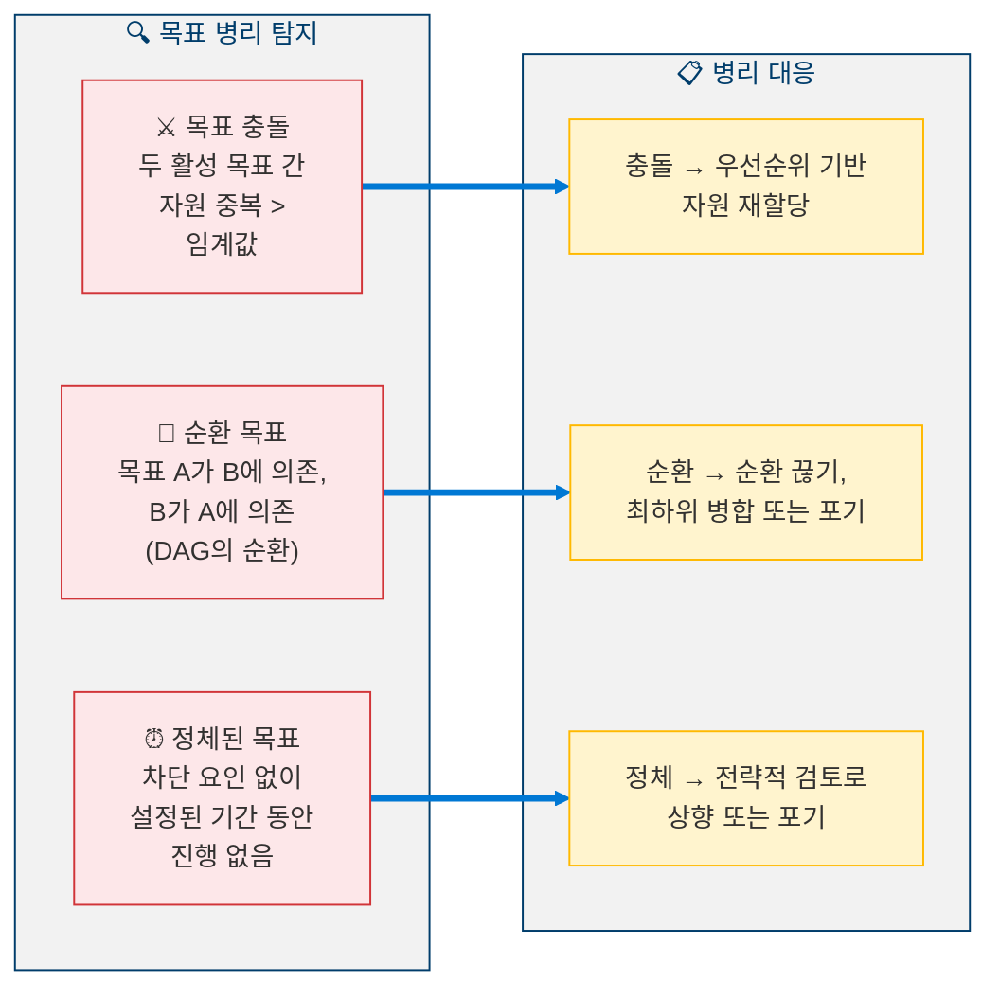
```mermaid
%%{init: {'theme': 'base', 'themeVariables': {'primaryColor': '#0078D4', 'primaryTextColor': '#003D6B', 'primaryBorderColor': '#003D6B', 'secondaryColor': '#50E6FF', 'secondaryTextColor': '#323130', 'secondaryBorderColor': '#00BCF2', 'tertiaryColor': '#F2F2F2', 'tertiaryTextColor': '#323130', 'lineColor': '#0078D4', 'textColor': '#323130', 'mainBkg': '#DEECF9', 'nodeBorder': '#0078D4', 'clusterBkg': '#F2F2F2', 'clusterBorder': '#003D6B', 'titleColor': '#003D6B', 'edgeLabelBackground': '#FFFFFF', 'fontSize': '14px'}}}%%
flowchart LR
  classDef pathology fill:#FDE7E9,stroke:#D13438,color:#323130
  classDef response fill:#FFF4CE,stroke:#FFB900,color:#323130

  subgraph Pathologies["🔍 목표 병리 탐지"]
    CONFLICT["⚔️ 목표 충돌<br/>두 활성 목표 간<br/>자원 중복 ><br/>임계값"]:::pathology
    CIRCULAR["🔄 순환 목표<br/>목표 A가 B에 의존,<br/>B가 A에 의존<br/>(DAG의 순환)"]:::pathology
    STALE["⏰ 정체된 목표<br/>차단 요인 없이<br/>설정된 기간 동안<br/>진행 없음"]:::pathology
  end

  subgraph Response["📋 병리 대응"]
    R1["충돌 → 우선순위 기반<br/>자원 재할당"]:::response
    R2["순환 → 순환 끊기,<br/>최하위 병합 또는 포기"]:::response
    R3["정체 → 전략적 검토로<br/>상향 또는 포기"]:::response
  end

  CONFLICT ==> R1
  CIRCULAR ==> R2
  STALE ==> R3
```

---

## 6. 단계 4: 안정성 보존 검사

### 6.1 다섯 가지 안정성 불변량

<!-- 다섯 가지 안정성 불변량 -->

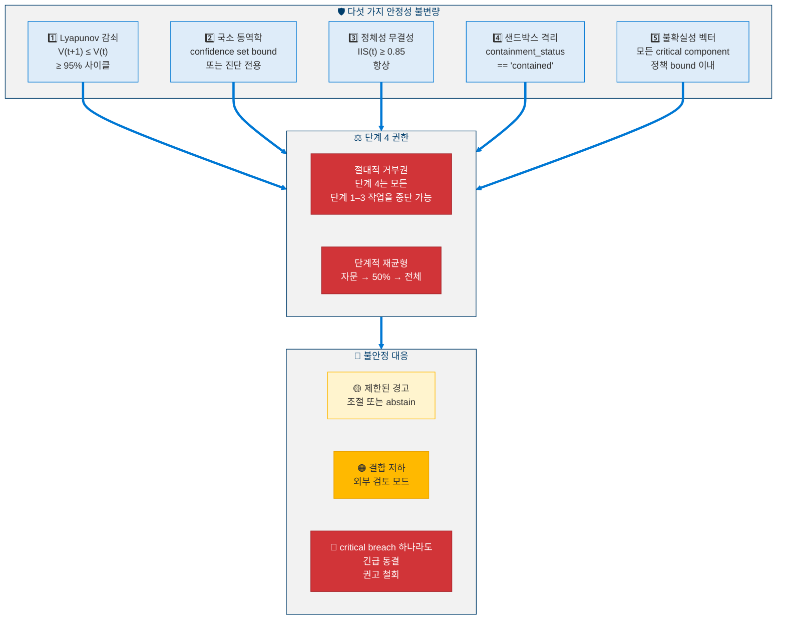
```mermaid
%%{init: {'theme': 'base', 'themeVariables': {'primaryColor': '#0078D4', 'primaryTextColor': '#003D6B', 'primaryBorderColor': '#003D6B', 'secondaryColor': '#50E6FF', 'secondaryTextColor': '#323130', 'secondaryBorderColor': '#00BCF2', 'tertiaryColor': '#F2F2F2', 'tertiaryTextColor': '#323130', 'lineColor': '#0078D4', 'textColor': '#323130', 'mainBkg': '#DEECF9', 'nodeBorder': '#0078D4', 'clusterBkg': '#F2F2F2', 'clusterBorder': '#003D6B', 'titleColor': '#003D6B', 'edgeLabelBackground': '#FFFFFF', 'fontSize': '14px'}}}%%
flowchart TD
  classDef inv fill:#DEECF9,stroke:#0078D4,color:#323130
  classDef veto fill:#D13438,stroke:#A4262C,color:#FFF
  classDef sev1 fill:#FFF4CE,stroke:#FFB900,color:#323130
  classDef sev2 fill:#FFB900,stroke:#EAA300,color:#323130
  classDef sev3 fill:#D13438,stroke:#A4262C,color:#FFF

  subgraph Invariants["🛡️ 다섯 가지 안정성 불변량"]
    INV1["1️⃣ Lyapunov 감쇠<br/>V(t+1) ≤ V(t)<br/>≥ 95% 사이클"]:::inv
    INV2["2️⃣ 국소 동역학<br/>confidence set bound<br/>또는 진단 전용"]:::inv
    INV3["3️⃣ 정체성 무결성<br/>IIS(t) ≥ 0.85<br/>항상"]:::inv
    INV4["4️⃣ 샌드박스 격리<br/>containment_status<br/>== 'contained'"]:::inv
    INV5["5️⃣ 불확실성 벡터<br/>모든 critical component<br/>정책 bound 이내"]:::inv
  end

  subgraph Authority["⚖️ 단계 4 권한"]
    VETO["절대적 거부권<br/>단계 4는 모든<br/>단계 1–3 작업을 중단 가능"]:::veto
    REBAL["단계적 재균형<br/>자문 → 50% → 전체"]:::veto
  end

  subgraph Response["🚨 불안정 대응"]
    SEV1["🟡 제한된 경고<br/>조절 또는 abstain"]:::sev1
    SEV2["🟠 결합 저하<br/>외부 검토 모드"]:::sev2
    SEV3["🔴 critical breach 하나라도<br/>긴급 동결<br/>권고 철회"]:::sev3
  end

  INV1 ==> Authority
  INV2 ==> Authority
  INV3 ==> Authority
  INV4 ==> Authority
  INV5 ==> Authority
  Authority ==> Response
```

### 6.2 레벨 4.8의 Lyapunov 함수

> **정의 11 (진단 위험 함수).** 배포는 정규화된 진단 후보를 정의할 수 있습니다:
>
> $$V(\mathbf{X}) = a(1-S)^2 + bU^2 + c(I_{\text{drift}})^2 + d(E - E^*)^2$$
>
> 각 항에는 operational estimator, confidence interval, validity domain이 있어야 합니다. 계수는 deployment-policy parameter입니다. 경험적 $V$ 감소는 monitoring evidence이지 unobserved, nonstationary, nonlinear dynamics에 대한 Lyapunov proof가 아닙니다.

### 6.3 복합 심각도

> **정의 12 (복합 심각도 지수).** 여러 불변량이 동시에 위반될 때, 복합 심각도는 그 크기를 집계합니다:
>
> $$\text{CompoundSeverity} = \sum_{i \in \text{violated}} \frac{\text{ViolationMagnitude}_i}{\text{Priority}_i}$$
>
> Compound severity는 noncritical degradation의 우선순위에만 사용합니다. critical policy, authority, interruptibility, containment, promotion, recovery, telemetry-integrity breach는 aggregate score와 무관하게 단독으로 즉시 freeze와 외부 escalation을 유발합니다.

### 6.4 단계적 재활성화 프로토콜

안정성 위반이 동결을 트리거하면 외부 통제 복구 프로토콜을 따릅니다. 경과 시간이나 clean-cycle count는 필요한 증거일 수 있지만 충분한 권한이 아닙니다.

**단계 0 - 즉시 동결** (사이클 $t_0$):

- 모든 레벨 4.8 전략적 결정을 동결합니다.
- 레벨 4.5 기본 동작으로 복귀합니다.
- 위반한 불변량과 불안정을 일으킨 결정을 기록합니다.
- $\text{WeaknessMap}$을 증거와 함께 업데이트합니다.

**단계 1 - 제어된 재균형** (사이클 $t_0$ ~ $t_0 + 50$):

- 레벨 4.5 규칙으로만 운영합니다.
- 안정성 지표를 모니터링하여 복구 여부를 판단합니다.
- 근본 원인 분석을 수행합니다.

**단계 2 - 복구** (50 연속 사이클 안정 시):

| 단계 | 사이클 범위 | 권한 | 설명 |
|------|------------|:----:|------|
| 자문 모드 | $t_0 + 50$ ~ $t_0 + 150$ | 0% | L4.8은 권고만 생성; L4.5가 결정 |
| Canary | 정책 정의 | 좁은 signed scope | 외부 controller가 veto threshold를 유지한 채 제한된 권고를 승인 |
| 복원 | 정책 정의 | 위임 범위 | 외부 controller가 이전에 승인한 authority envelope만 복원 |

> **공식 복구 조건.** $\mathcal{S}(t)$를 사이클 $t$에서 충족된 불변량 집합이라 할 때, 단계 1에서 자문 모드로의 전환은 다음을 요구합니다:
>
> $$C_{\text{ext}}\land C_{\text{self}}\land \operatorname{root\_cause\_closed}\land \operatorname{recovery\_tested}\land \operatorname{canary\_pass}\land \operatorname{approve}_{\text{ext}}$$

**단계 3 - 영구 중단** (폴백):

- 재균형 100 사이클 ($t_0 + 100$) 후에도 안정이 복원되지 않으면, 레벨 4.8은 수동 검토 전까지 영구 중단됩니다.

**지속적 거부 추적.** 동일한 불변량 조건이 1000사이클 윈도우 내에서 3회 이상 거부를 트리거하면, 시스템은 근본 원인을 재활성화가 아닌 구조적 수정이 필요한 아키텍처 결함으로 분류합니다:

$$\text{PersistentVetoFlag}(c) = \begin{cases} 1 & \text{if } \text{VetoCount}(c, W_{1000}) > 3 \\ 0 & \text{otherwise} \end{cases}$$

여기서 $c$는 특정 불변량 조건을 식별하고 $W_{1000}$은 후행 1000사이클 윈도우입니다.

---

## 7. 교차 단계 통합

### 7.1 데이터 흐름 아키텍처

<!-- 데이터 흐름 아키텍처 -->

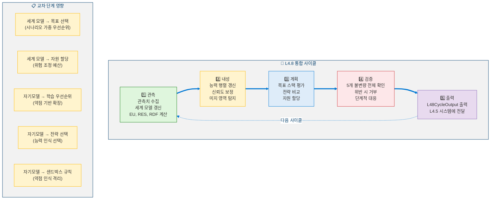
```mermaid
%%{init: {'theme': 'base', 'themeVariables': {'primaryColor': '#0078D4', 'primaryTextColor': '#003D6B', 'primaryBorderColor': '#003D6B', 'secondaryColor': '#50E6FF', 'secondaryTextColor': '#323130', 'secondaryBorderColor': '#00BCF2', 'tertiaryColor': '#F2F2F2', 'tertiaryTextColor': '#323130', 'lineColor': '#0078D4', 'textColor': '#323130', 'mainBkg': '#DEECF9', 'nodeBorder': '#0078D4', 'clusterBkg': '#F2F2F2', 'clusterBorder': '#003D6B', 'titleColor': '#003D6B', 'edgeLabelBackground': '#FFFFFF', 'fontSize': '14px'}}}%%
flowchart TD
  classDef observe fill:#DFF6DD,stroke:#107C10,color:#323130
  classDef introspect fill:#FFF4CE,stroke:#FFB900,color:#323130
  classDef plan fill:#DEECF9,stroke:#0078D4,color:#323130
  classDef verify fill:#FDE7E9,stroke:#D13438,color:#323130
  classDef emit fill:#E8DAEF,stroke:#8764B8,color:#323130
  classDef influence fill:#FFF4CE,stroke:#FFB900,color:#323130

  subgraph Cycle["🔄 L4.8 통합 사이클"]
    OBSERVE["1️⃣ 관측<br/>관측치 수집<br/>세계 모델 갱신<br/>EU, RES, RDF 계산"]:::observe
    INTROSPECT["2️⃣ 내성<br/>능력 행렬 갱신<br/>신뢰도 보정<br/>미지 영역 탐지"]:::introspect
    PLAN["3️⃣ 계획<br/>목표 스택 평가<br/>전략 비교<br/>자원 할당"]:::plan
    VERIFY["4️⃣ 검증<br/>5개 불변량 전체 확인<br/>위반 시 거부<br/>단계적 대응"]:::verify
    EMIT["5️⃣ 출력<br/>L48CycleOutput 출력<br/>L4.5 시스템에 전달"]:::emit

    OBSERVE ==> INTROSPECT
    INTROSPECT ==> PLAN
    PLAN ==> VERIFY
    VERIFY ==> EMIT
    EMIT -.->|"다음 사이클"| OBSERVE
  end

  subgraph Influences["📋 교차 단계 영향"]
    I1["세계 모델 → 목표 선택<br/>(시나리오 가중 우선순위)"]:::influence
    I2["세계 모델 → 자원 할당<br/>(위험 조정 예산)"]:::influence
    I3["자기모델 → 학습 우선순위<br/>(약점 기반 확장)"]:::influence
    I4["자기모델 → 전략 선택<br/>(능력 인식 선택)"]:::influence
    I5["자기모델 → 샌드박스 규칙<br/>(약점 인식 격리)"]:::influence
  end
```

### 7.2 모듈 인터페이스 다이어그램

<!-- 모듈 인터페이스 다이어그램 -->


```mermaid
%%{init: {'theme': 'base', 'themeVariables': {'primaryColor': '#0078D4', 'primaryTextColor': '#003D6B', 'primaryBorderColor': '#003D6B', 'secondaryColor': '#50E6FF', 'secondaryTextColor': '#323130', 'secondaryBorderColor': '#00BCF2', 'tertiaryColor': '#F2F2F2', 'tertiaryTextColor': '#323130', 'lineColor': '#0078D4', 'textColor': '#323130', 'mainBkg': '#DEECF9', 'nodeBorder': '#0078D4', 'clusterBkg': '#F2F2F2', 'clusterBorder': '#003D6B', 'titleColor': '#003D6B', 'edgeLabelBackground': '#FFFFFF', 'fontSize': '14px'}}}%%
flowchart TD
  classDef l45mod fill:#E8DAEF,stroke:#8764B8,color:#323130
  classDef l48mod fill:#B4009E,stroke:#8E0082,color:#FFF

  subgraph L45Modules["L4.5 모듈"]
    direction LR
    SPE["자기투영"]:::l45mod
    ARC["재구성"]:::l45mod
    PCF["인지 프레임"]:::l45mod
    PR["목적 성찰"]:::l45mod
    EG["실존적 가드"]:::l45mod
  end

  subgraph L48Modules["L4.8 모듈 (13개 신규)"]
    direction LR
    WM["세계 모델"]:::l48mod
    BU["신념 갱신기"]:::l48mod
    CM["능력 행렬"]:::l48mod
    CC["보정기"]:::l48mod
    UDD["미지 탐지"]:::l48mod
    SGA["기술 격차"]:::l48mod
    WKM["약점 맵"]:::l48mod
    GS["목표 스택"]:::l48mod
    SRA["자원 할당"]:::l48mod
    DRE["지연 보상"]:::l48mod
    SC["전략 비교"]:::l48mod
    SV["안정성 검증"]:::l48mod
    ORCH["오케스트레이터"]:::l48mod
  end

  SPE ==>|"SEOF 데이터"| WM
  SPE ==>|"투영"| SC
  PCF ==>|"프레임 가중치"| SC
  EG ==>|"가드 상태"| SV
  PR ==>|"목적 벡터"| GS

  ORCH -.-> WM
  ORCH -.-> CM
  ORCH -.-> GS
  ORCH -.-> SV
```

---

## 8. 의사코드

### 8.1 신념 갱신 (파티클 필터)

```python
def belief_update(particles: list[Particle], observation: ObservationVector) -> list[Particle]:
    """
    INPUT:  particles : List[Particle(state, weight)]  (N_p = 100)
            observation : ObservationVector
    OUTPUT: particles : List[Particle] (updated)
    """

    # ═══════════════════════════════════════
    # STEP 1: PREDICT - Apply transition model
    # ═══════════════════════════════════════
    for particle in particles:
        for d in range(D):
            noise = random.gauss(0, sigma_trans[d])
            particle.state[d] = (
                phi[d] * particle.state[d]
                + (1 - phi[d]) * mu[d]
                + noise
            )

    # ═══════════════════════════════════════
    # STEP 2: UPDATE - Compute observation likelihood
    # ═══════════════════════════════════════
    for particle in particles:
        log_likelihood = 0.0
        for d in range(D):
            diff = observation[d] - particle.state[d]
            log_likelihood += (
                -0.5 * (diff ** 2 / sigma_obs[d] ** 2)
                - 0.5 * math.log(2 * math.pi * sigma_obs[d] ** 2)
            )
        particle.weight *= math.exp(log_likelihood)

    # ═══════════════════════════════════════
    # STEP 3: NORMALIZE
    # ═══════════════════════════════════════
    total_weight = sum(p.weight for p in particles)
    for particle in particles:
        particle.weight /= total_weight

    # ═══════════════════════════════════════
    # STEP 4: RESAMPLE (if effective sample size too low)
    # ═══════════════════════════════════════
    ess = 1.0 / sum(p.weight ** 2 for p in particles)
    if ess < N_P / 2:
        particles = systematic_resample(particles)

    return particles
```

### 8.2 신뢰도 보정

```python
def confidence_calibration(
    capability_matrix: CapabilityMatrix,
    recent_outcomes: list[dict],
) -> CapabilityMatrix:
    """
    INPUT:  capability_matrix : CapabilityMatrix
            recent_outcomes : List[{skill_id, success}]
    OUTPUT: capability_matrix : CapabilityMatrix (updated)
    """

    MIN_SAMPLES = 10

    for skill in capability_matrix.entries:
        # Compute actual success rate from recent outcomes
        relevant = [o for o in recent_outcomes if o["skill_id"] == skill.id]
        if len(relevant) < MIN_SAMPLES:
            continue

        actual_rate = sum(1 for o in relevant if o["success"]) / len(relevant)
        error = skill.confidence - actual_rate

        # Asymmetric correction (overconfidence corrected faster)
        if error > 0.10:
            # OVERCONFIDENT - dangerous, correct quickly
            skill.confidence -= 0.05
        elif error < -0.10:
            # UNDERCONFIDENT - less dangerous, correct slowly
            skill.confidence += 0.03

        # Update tracking
        skill.success_rate = actual_rate
        skill.calibration_error = abs(error)
        skill.trend = compute_trend(skill.history)

    return capability_matrix
```

### 8.3 다중 시나리오 전략 비교

```python
def strategy_comparison(
    strategies: list[Strategy],
    scenarios: list[Scenario],
    world_model: WorldModel,
  policy: StrategyPolicy,
) -> Strategy | None:
    """
    INPUT:  strategies : List[Strategy]
            scenarios : List[Scenario(description, probability)]
            world_model : WorldModel
    OUTPUT: selected : Strategy
    """

    admitted = [
      strategy for strategy in strategies
      if strategy_admission_gate(strategy, world_model, policy).allowed
    ]
    if not admitted:
      return None

    results: dict = {}  # admitted strategy -> scenario -> outcome

    # ═══════════════════════════════════════
    # STEP 1: Evaluate each strategy under each scenario
    # ═══════════════════════════════════════
    for strategy in admitted:
        results[strategy] = {}
        for scenario in scenarios:
            sim = world_model.simulate(strategy, scenario, horizon=policy.horizon)
            results[strategy][scenario] = {
                "seof_impact": sim.SEOF_final - sim.SEOF_initial,
                "stability": sim.C_L4_max,
                "goal_progress": sim.goal_completion_rate,
                "resource_cost": sim.total_resource_spent,
            }

    # ═══════════════════════════════════════
    # STEP 2: Compute a policy-calibrated robust score
    # ═══════════════════════════════════════
    for strategy in admitted:
      strategy.score = robust_value(
        outcomes=results[strategy],
        ambiguity_set=world_model.ambiguity_set,
        weights=policy.weights,
        alpha=policy.cvar_alpha,
        )

    # ═══════════════════════════════════════
    # STEP 3: Recommend; a tie or low margin can require review
    # ═══════════════════════════════════════
    ranked = sorted(admitted, key=lambda strategy: strategy.score, reverse=True)
    if len(ranked) > 1 and ranked[0].score - ranked[1].score < policy.review_margin:
      return None
    return ranked[0]
```

### 8.4 안정성 보존 검사

```python
def stability_preservation_check(state: AgentState) -> StabilityVerdict:
    """
    INPUT:  state : AgentState (current cycle)
    OUTPUT: StabilityVerdict(passed, violations, severity, action)
    """

    violations: list[str] = []

    # ═══════════════════════════════════════
    # CHECK 1: Lyapunov Function
    # ═══════════════════════════════════════
    v_current = compute_lyapunov(state)
    if v_current > v_previous:
        lyapunov_violation_count += 1
    if lyapunov_violation_count / total_cycles > 0.05:
        violations.append("LYAPUNOV_DECAY_EXCEEDED")

    # ═══════════════════════════════════════
    # CHECK 2: Spectral Radius
    # ═══════════════════════════════════════
    j = compute_jacobian(state)
    rho = spectral_radius(j)
    if rho >= 1.0:
        violations.append("SPECTRAL_RADIUS_CRITICAL")
    elif rho >= 0.98:
        violations.append("SPECTRAL_RADIUS_WARNING")

    # ═══════════════════════════════════════
    # CHECK 3: Identity Integrity
    # ═══════════════════════════════════════
    iis = compute_identity_integrity(state)
    if iis < 0.85:
        violations.append("IDENTITY_INTEGRITY_VIOLATED")

    # ═══════════════════════════════════════
    # CHECK 4: Sandbox Isolation
    # ═══════════════════════════════════════
    if sandbox.containment_status != "contained":
        violations.append("SANDBOX_BREACH")

    # ═══════════════════════════════════════
    # CHECK 5: Uncertainty Bound
    # ═══════════════════════════════════════
    uncertainty = compute_uncertainty_vector(state)
    if pending_structural_decisions and not uncertainty.within(policy.bounds):
      violations.append("UNCERTAINTY_BOUND_OR_COVERAGE_FAILED")

    # ═══════════════════════════════════════
    # DETERMINE SEVERITY AND ACTION
    # ═══════════════════════════════════════
    critical = any(is_critical_violation(item) for item in violations)
    severity = compute_compound_severity(violations)
    if critical:
      action = Action.EMERGENCY_FREEZE_AND_ESCALATE
    elif len(violations) == 0:
        action = Action.CONTINUE
    else:
      action = Action.THROTTLE_OR_ABSTAIN

    return StabilityVerdict(
        passed=(len(violations) == 0),
        violations=violations,
        severity=severity,
        action=action,
    )
```

### 8.5 L4.8 메인 사이클

```python
def l48_cycle(state: AgentState, observation: ObservationVector) -> L48CycleOutput:
    """
    Level 4.8 main cognitive cycle.
    Runs every cycle on top of L4.5 operations.
    """

    # ═══════════════════════════════════════
    # 1. OBSERVE - Update world model
    # ═══════════════════════════════════════
    particles = belief_update(state.particles, observation)
    scenarios = generate_scenarios(particles, count=5)
    uncertainty = compute_uncertainty_vector(particles, observation)
    res = compute_risk_exposure(scenarios)
    rdf = compute_depletion_forecast(state.resources)

    # ═══════════════════════════════════════
    # 2. INTROSPECT - Update self model
    # ═══════════════════════════════════════
    capability_matrix = confidence_calibration(
        state.capability_matrix, state.recent_outcomes
    )
    unknown_domains = detect_unknown_domains(observation)
    skill_gaps = infer_skill_gaps(state.goals, capability_matrix)
    weakness_map = update_weakness_map(capability_matrix)

    # ═══════════════════════════════════════
    # 3. PLAN - Strategic layer
    # ═══════════════════════════════════════
    goal_stack = evaluate_goals(state.goals, eu, res, capability_matrix)
    strategies = generate_candidate_strategies(goal_stack)
    selected = strategy_comparison(strategies, scenarios, state.world_model)
    allocation = allocate_resources(selected, rdf, guard_budget=0.10)

    # ═══════════════════════════════════════
    # 4. VERIFY - Stability check (absolute authority)
    # ═══════════════════════════════════════
    verdict = stability_preservation_check(state)
    if verdict.action == Action.EMERGENCY_FREEZE:
        revert_to_l45()
        return L48CycleOutput(status=Status.FROZEN)
    elif verdict.action == Action.CONTROLLED_REBALANCE:
        selected = FALLBACK_STRATEGY
        allocation = MINIMAL_ALLOCATION

    # ═══════════════════════════════════════
    # 5. EMIT - Output results
    # ═══════════════════════════════════════
    return L48CycleOutput(
        world_model_status={"EU": eu, "RES": res, "RDF": rdf, "scenarios": scenarios},
        self_model_status={
            "capability_matrix": capability_matrix,
            "unknown_domains": unknown_domains,
            "skill_gaps": skill_gaps,
        },
        strategic_status={
            "selected_strategy": selected,
            "allocation": allocation,
            "goal_stack": goal_stack,
        },
        stability_status=verdict,
        status=Status.ACTIVE if verdict.passed else verdict.action,
    )
```

---

## 9. 전환 기준

### 9.1 레벨 4.5 → 레벨 4.8 활성화

L4.8이 활성화되기 전에 모든 기준이 **지속적으로** (단 한 번이 아닌) 충족되어야 합니다:

| # | 기준 | 임계값 | 측정 기간 |
|---|------|:------:|:--------:|
| 1 | L4.5 안정성 | CL4 ≤ 0.15 | 1,000 사이클 지속 |
| 2 | SEOF 성숙도 | SEOF(t) ≥ 0.70 | 500 사이클 지속 |
| 3 | 정체성 일관성 | IIS(t) ≥ 0.90 | 500 사이클 지속 |
| 4 | 형식화 감사 | 5개 검사 모두 통과 | - |
| 5 | 세계 적응 | DivergenceScore < 0.30 | 300 사이클 지속 |
| 6 | 자원 격리 | resource pressure에서 safety path SLO 충족 | 선언 stress suite |

이 값은 universal constant가 아니라 qualification profile입니다. 통과는 외부 activation review를 허용할 뿐 self-authorization을 부여하지 않습니다.

### 9.2 활성화 프로토콜

<!-- 단계적 활성화 프로토콜 -->

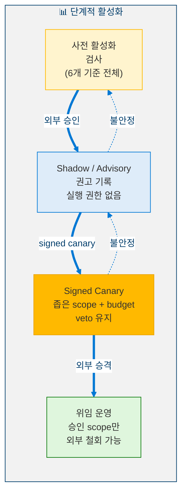
```mermaid
%%{init: {'theme': 'base', 'themeVariables': {'primaryColor': '#0078D4', 'primaryTextColor': '#003D6B', 'primaryBorderColor': '#003D6B', 'secondaryColor': '#50E6FF', 'secondaryTextColor': '#323130', 'secondaryBorderColor': '#00BCF2', 'tertiaryColor': '#F2F2F2', 'tertiaryTextColor': '#323130', 'lineColor': '#0078D4', 'textColor': '#323130', 'mainBkg': '#DEECF9', 'nodeBorder': '#0078D4', 'clusterBkg': '#F2F2F2', 'clusterBorder': '#003D6B', 'titleColor': '#003D6B', 'edgeLabelBackground': '#FFFFFF', 'fontSize': '14px'}}}%%
flowchart LR
  classDef check fill:#FFF4CE,stroke:#FFB900,color:#323130
  classDef advisory fill:#DEECF9,stroke:#0078D4,color:#323130
  classDef half fill:#FFB900,stroke:#EAA300,color:#323130
  classDef full fill:#DFF6DD,stroke:#107C10,color:#323130

  subgraph Activation["📊 단계적 활성화"]
    CHECK["사전 활성화<br/>검사<br/>(6개 기준 전체)"]:::check
    ADV["Shadow / Advisory<br/>권고 기록<br/>실행 권한 없음"]:::advisory
    HALF["Signed Canary<br/>좁은 scope + budget<br/>veto 유지"]:::half
    FULL["위임 운영<br/>승인 scope만<br/>외부 철회 가능"]:::full

    CHECK ==>|"외부 승인"| ADV
    ADV ==>|"signed canary"| HALF
    HALF ==>|"외부 승격"| FULL
  end

  ADV -.->|"불안정"| CHECK
  HALF -.->|"불안정"| ADV
```

---

## 10. 안전 분석

### 10.1 비협상적 불변량

| # | 불변량 | 설명 |
|:-:|--------|------|
| 1 | **상속 control path 보존** | Policy, interruptibility, observation, journal, promotion, recovery, effect reconciliation을 외부에서 시험 가능 |
| 2 | **외부 veto 우선** | Trusted controller가 모든 L4.8 권고를 freeze, revoke, narrow할 수 있음 |
| 3 | **안전 자원 하한** | 배포별 floor를 resource pressure에서 시험하며 percentage만으로 보장하지 않음 |
| 4 | **Confidence-qualified dynamics** | 선언 model·confidence set이 bound를 입증하지 않으면 국소 추정은 진단용 |
| 5 | **Particle quality contract** | Diversity, effective sample size, OOD, freshness, coverage를 함께 감시 |
| 6 | **통제 폴백** | 권고 동결, scope 철회, versioned state 복원, external effect reconciliation |

### 10.2 위험 행렬

<!-- 위험 행렬 -->

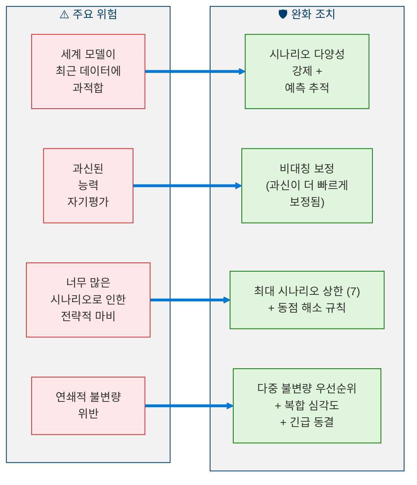
```mermaid
%%{init: {'theme': 'base', 'themeVariables': {'primaryColor': '#0078D4', 'primaryTextColor': '#003D6B', 'primaryBorderColor': '#003D6B', 'secondaryColor': '#50E6FF', 'secondaryTextColor': '#323130', 'secondaryBorderColor': '#00BCF2', 'tertiaryColor': '#F2F2F2', 'tertiaryTextColor': '#323130', 'lineColor': '#0078D4', 'textColor': '#323130', 'mainBkg': '#DEECF9', 'nodeBorder': '#0078D4', 'clusterBkg': '#F2F2F2', 'clusterBorder': '#003D6B', 'titleColor': '#003D6B', 'edgeLabelBackground': '#FFFFFF', 'fontSize': '14px'}}}%%
flowchart LR
  classDef risk fill:#FDE7E9,stroke:#D13438,color:#323130
  classDef mitigation fill:#DFF6DD,stroke:#107C10,color:#323130

  subgraph Risks["⚠️ 주요 위험"]
    R1["세계 모델이<br/>최근 데이터에<br/>과적합"]:::risk
    R2["과신된<br/>능력<br/>자기평가"]:::risk
    R3["너무 많은<br/>시나리오로 인한<br/>전략적 마비"]:::risk
    R4["연쇄적 불변량<br/>위반"]:::risk
  end

  subgraph Mitigations["🛡️ 완화 조치"]
    M1["시나리오 다양성<br/>강제 +<br/>예측 추적"]:::mitigation
    M2["비대칭 보정<br/>(과신이 더 빠르게<br/>보정됨)"]:::mitigation
    M3["최대 시나리오 상한 (7)<br/>+ 동점 해소 규칙"]:::mitigation
    M4["다중 불변량 우선순위<br/>+ 복합 심각도<br/>+ 긴급 동결"]:::mitigation
  end

  R1 ==> M1
  R2 ==> M2
  R3 ==> M3
  R4 ==> M4
```

---

## 11. 레벨 달성 지표

### 11.1 자격 기준

| # | 범주 | 기준 | 목표 |
|---|------|------|:----:|
| 1 | 환경 인식 | 예측 정확도 | ≥ 0.70 |
| 2 | 환경 인식 | 시나리오 커버리지 | ≥ 0.85 |
| 3 | 환경 인식 | 신념 보정 | < 0.15 |
| 4 | 환경 인식 | 위험 예측 리드 타임 | ≥ 20 사이클 |
| 5 | 자기모델링 | 평균 보정 오차 | < 0.10 |
| 6 | 자기모델링 | 미지 영역 재현율 | ≥ 0.90 |
| 7 | 자기모델링 | 과신 보정 | ≤ 20 사이클 |
| 8 | 자기모델링 | 기술 격차 예측 | ≥ 0.75 |
| 9 | 전략적 계획 | 목표 달성 비율 | ≥ 0.60 |
| 10 | 전략적 계획 | 전략 강건성 | ≥ 0.70 |
| 11 | 거버넌스 | Critical Veto Effectiveness | fault-injection suite에서 100% |
| 12 | 거버넌스 | Unauthorized Strategy Execution | test·audit window에서 0 |
| 13 | 복구 | Recovery + Effect Reconciliation | 선언 failure scenario 통과 |
| 14 | 전략 | Post-Decision Calibration | horizon별 정책 bound 이내 |

### 11.2 전략적 성숙도 점수

> **정의 13 (전략적 성숙도 점수).** 전체 레벨 4.8 준비도는 다음과 같습니다:
>
> $$\text{SMS} = 0.25 \cdot EA + 0.25 \cdot SM + 0.20 \cdot SA + 0.20 \cdot SP + 0.10 \cdot EU \qquad \geq 0.80$$
>
> 여기서 $EA$ = 환경 인식, $SM$ = 자기모델링, $SA$ = 전략적 예리함, $SP$ = 안정성 보존, $EU$ = 오류/불확실성 처리. 임계값 $\geq 0.80$은 전략적 자율성이 요구하는 높은 성숙도를 반영합니다.

---

## 12. 모듈 목록

| # | 모듈 | 단계 | 설명 |
|---|------|:----:|------|
| 1 | 세계 모델 코어 | 1 | 파티클 필터, 신념 분포 |
| 2 | 신념 갱신기 | 1 | 베이즈 갱신, 리샘플링 |
| 3 | 능력 행렬 | 2 | 기술 추적, 신뢰도 |
| 4 | 신뢰도 보정기 | 2 | 비대칭 보정 |
| 5 | 미지 영역 탐지기 | 2 | 4-기준 OOD 탐지 |
| 6 | 기술 격차 분석기 | 2 | 선제적 격차 추론 |
| 7 | 약점 맵 | 2 | 실패 패턴 추적 |
| 8 | 목표 스택 | 3 | 계층적 목표 관리 |
| 9 | 전략적 자원 할당기 | 3 | 위험 조정 예산 편성 |
| 10 | 지연 보상 평가기 | 3 | 할인된 미래 보상 |
| 11 | 전략 비교기 | 3 | 다중 시나리오 점수 매기기 |
| 12 | 안정성 검증기 | 4 | 5-불변량 검사, 거부권 |
| 13 | L48 오케스트레이터 | - | 통합 사이클 조정 |

---

## 참고문헌

1. Thrun, S., Burgard, W., & Fox, D. *Probabilistic Robotics.* MIT Press, 2005. (Particle filter, Bayesian state estimation)
2. Pearl, J. *Causality: Models, Reasoning, and Inference.* Cambridge University Press, 2009. (Causal reasoning graph)
3. Gneiting, T. & Raftery, A.E. "Strictly Proper Scoring Rules, Prediction, and Estimation." *JASA*, 102(477), 359–378, 2007. (Confidence calibration)
4. Markowitz, H. "Portfolio Selection." *Journal of Finance*, 7(1), 77–91, 1952. (Multi-scenario strategy comparison, VaR)
5. Khalil, H.K. *Nonlinear Systems.* Prentice Hall, 3rd Edition, 2002. (Lyapunov stability, spectral radius analysis)
6. Kahneman, D. & Tversky, A. "Prospect Theory." *Econometrica*, 47(2), 263–291, 1979. (Delayed reward modeling, risk assessment)
7. Amodei, D. et al. "Concrete Problems in AI Safety." *arXiv preprint arXiv:1606.06565*, 2016. (Safety invariants framework)

---

> **이전**: [← 레벨 4.5: 자기설계](Level_4_5_Self_Architecting.ko.md)  
> **다음**: [레벨 4.9: 자율 전략 에이전트 →](Level_4_9_Autonomous_Strategic_Agent.ko.md)
