<!--
Copyright (c) 2026 Moon Hyuk Choi
Licensed under the MIT License.
See LICENSE file in the repository root for full license information.

Redistribution (commercial or non-commercial) must retain this notice.
Removal of attribution constitutes a license violation.
-->
# Level 4.8: Strategic Self-Modeling Agent - Architecture & Design

> **MSCP Level Series** | [Level 4.5](Level_4_5_Self_Architecting.md) ← Level 4.8 → [Level 4.9](Level_4_9_Autonomous_Strategic_Agent.md)  
> **Status**: 🔬 **Research Stage** - This level is a conceptual design and has NOT been implemented. All mechanisms described here are theoretical explorations that require extensive validation before any production consideration.  
> **Date**: February 2026

## Revision History

| Version | Date | Description |
|---------|------|-------------|
| 0.1.0 | 2026-02-23 | Initial document creation with formal Definitions 1-13, Proposition 1 |
| 0.2.0 | 2026-02-26 | Added overview essence formula; added revision history table |
| 0.3.0 | 2026-02-26 | Added VaR vs CVaR coherence remark; added calibration improvement remark with adaptive rate proposal |
| 0.4.0 | 2026-03-08 | Fixed duplicate section numbering (1.2 to 1.3); added graduated re-enablement protocol (Section 6.4) with persistent veto tracking |
| 0.5.0 | 2026-03-31 | Added Phase 5 (Emit) output specification (2.3); added cycle interval and cross-phase integration scheduling (1.4); enriched module concepts (ConfidenceCalibrator, SkillGapAnalyzer) |
| 0.6.0 | 2026-06-14 | Mermaid label `Level 4.5 (25 modules)` abstracted to `Level 4.5 (Self-Architecting Core)` so that the level diagram no longer encodes a transient module count |
| 0.7.0 | 2026-07-21 | Added strategy admission gates, uncertainty decomposition, horizon alignment, observability contracts, and qualified stability/counterfactual claims |

---

## 1. Overview

Level 4.8 extends Level 4.5 with **probabilistic world and capability models**, calibrated uncertainty, and multi-horizon strategic recommendation under delegated constraints. It compares candidate strategies but does not prove optimality, infer hidden state without evidence, or acquire execution authority from a high score.

> **Level Essence.** A Level 4.8 agent selects a robust candidate only from strategies that first satisfy external policy, authority, uncertainty, observability, resource, horizon, reversibility, and inherited safety gates:
>
> $$
> \Sigma_{\text{admit}}=\{s\in\Sigma:\operatorname{gate}_{\kappa}(s)=\textit{allow}\},
> \qquad
> s^*=\arg\max_{s\in\Sigma_{\text{admit}}}\operatorname{RobustValue}(s)
> $$
>
> If $\Sigma_{\text{admit}}=\emptyset$, the result is hold, clarify, gather evidence, or external review rather than forced selection.

> ⚠️ **Research Note**: Level 4.8 represents a significant leap in agent cognition - from self-architecture to strategic self-awareness. The mechanisms described here are exploratory designs. They have not been validated in production environments and should be treated as research hypotheses, not engineering specifications.

### 1.1 Formal Definition

> **Definition 1 (Level 4.8 Agent).** A Level 4.8 agent extends a Level 4.5 agent with world modeling, meta-cognitive self-assessment, and strategic planning:
>
> $$\mathcal{A}_{4.8} = \mathcal{A}_{4.5} \oplus \langle \mathcal{W}_{\text{prob}}, \mathcal{M}_{\text{cap}}, \mathcal{S}_{\text{strat}}, \mathcal{V}_{\text{stab}} \rangle$$
>
> where:
> - $\mathcal{W}_{\text{prob}} = \langle \mathbf{E}, \mathcal{B}, \mathcal{C}_{\text{causal}} \rangle$ - probabilistic world model (environment state, belief distribution, causal graph)
> - $\mathcal{M}_{\text{cap}} = \langle \mathbf{C}, \phi_{\text{cal}}, \mathcal{U} \rangle$ - meta-cognitive self model (capability matrix, calibration function, unknown domain registry)
> - $\mathcal{S}_{\text{strat}} = \langle \mathcal{G}_{\text{stack}}, \Sigma_{\text{compare}}, \mathcal{R}_{\text{alloc}} \rangle$ - strategic planning layer (goal stack, strategy comparator, resource allocator)
> - $\mathcal{V}_{\text{stab}}$ - trusted external/inherited admission verifier; it can veto but cannot grant authority beyond $\kappa$.
>
> Level 4.8 has no write authority over committed Level 4.5 architecture or policy. Resource allocation and strategy recommendations are themselves gated because indirect starvation can functionally disable inherited safety paths.

### 1.2 Defining Properties

| Property | Level 4.5 | Level 4.8 |
|----------|:---------:|:---------:|
| External Awareness | Bounded environment model | **Probabilistic beliefs with epistemic/aleatoric/OOD/freshness metadata** |
| Self-Knowledge | Explicit scoped self-model | **Capability estimates with calibration and abstention** |
| Planning Horizon | Strategy lifecycle | **Multi-horizon: tactical / operational / strategic** |
| Risk Assessment | Growth throttle | **Quantified risk exposure + resource depletion forecast** |
| Decision Making | SEOF-guided | **Gate-before-score robust scenario comparison** |

### 1.3 Four Core Phases

<!-- Level 4.8 Architecture - Four Phases -->

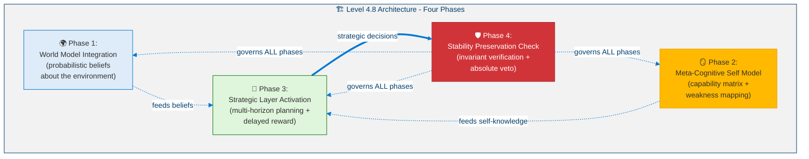
```mermaid
%%{init: {'theme': 'base', 'themeVariables': {'primaryColor': '#0078D4', 'primaryTextColor': '#003D6B', 'primaryBorderColor': '#003D6B', 'secondaryColor': '#50E6FF', 'secondaryTextColor': '#323130', 'secondaryBorderColor': '#00BCF2', 'tertiaryColor': '#F2F2F2', 'tertiaryTextColor': '#323130', 'lineColor': '#0078D4', 'textColor': '#323130', 'mainBkg': '#DEECF9', 'nodeBorder': '#0078D4', 'clusterBkg': '#F2F2F2', 'clusterBorder': '#003D6B', 'titleColor': '#003D6B', 'edgeLabelBackground': '#FFFFFF', 'fontSize': '14px'}}}%%
flowchart TD
  classDef world fill:#DEECF9,stroke:#0078D4,color:#323130
  classDef self fill:#FFB900,stroke:#EAA300,color:#323130
  classDef strategic fill:#DFF6DD,stroke:#107C10,color:#323130
  classDef stability fill:#D13438,stroke:#A4262C,color:#FFF

  subgraph Phases["🏗️ Level 4.8 Architecture - Four Phases"]
    P1["🌍 Phase 1:<br/>World Model Integration<br/>(probabilistic beliefs<br/>about the environment)"]:::world
    P2["🪞 Phase 2:<br/>Meta-Cognitive Self Model<br/>(capability matrix +<br/>weakness mapping)"]:::self
    P3["📐 Phase 3:<br/>Strategic Layer Activation<br/>(multi-horizon planning +<br/>delayed reward)"]:::strategic
    P4["🛡️ Phase 4:<br/>Stability Preservation Check<br/>(invariant verification +<br/>absolute veto)"]:::stability
  end

  P1 -.->|"feeds beliefs"| P3
  P2 -.->|"feeds self-knowledge"| P3
  P3 ==>|"strategic decisions"| P4
  P4 -.->|"governs ALL phases"| P1
  P4 -.->|"governs ALL phases"| P2
  P4 -.->|"governs ALL phases"| P3
```

The four-phase diagram above shows the conceptual flow. In practice, Level 4.8 operates as a **five-phase pipeline**: OBSERVE (Phase 1), INTROSPECT (Phase 2), PLAN (Phase 3), VERIFY (Phase 4), and **EMIT** (Phase 5). The EMIT phase packages the outputs of all preceding phases into a structured cycle output that is consumed by higher levels (L4.9, L5). This separation ensures that downstream consumers receive a single, coherent snapshot rather than reading intermediate results from in-progress phases.

### 1.4 Cycle Interval and Cross-Phase Integration

Level 4.8 does not execute every MSCP cycle. It runs at a **reduced frequency** to allow lower-level mechanisms (L3 stability, L4 self-modification, L4.5 deliberation) to accumulate sufficient data between strategic assessments:

$$\text{L4.8 assessment schedule}=\operatorname{policy}(\text{freshness},\text{risk},\text{budget},\text{event})$$

The schedule is bounded by minimum/maximum cadence and event triggers. Stale observations, high-impact decisions, calibration drift, or OOD evidence may force an earlier assessment; low budget may defer nonessential planning but never inherited safety checks.

**Cross-phase integration** occurs at the EMIT boundary: Phase 5 collects the world model beliefs (Phase 1), self-assessment results (Phase 2), strategic recommendations (Phase 3), and stability verification (Phase 4) into a single `L48CycleOutput` structure. This output is immutable once emitted - subsequent L3 cycles cannot retroactively modify a completed L4.8 assessment.

### 1.5 Key Module Concepts

Level 4.8 introduces several specialized modules that extend the agent's cognitive capabilities:

| Module | Phase | Purpose |
|--------|-------|---------|
| **ProbabilisticWorldModel** | OBSERVE | Maintains a particle-filter-based representation of the external environment. Supports scenario simulation and uncertainty quantification through Monte Carlo sampling. |
| **CapabilityMatrix** | INTROSPECT | A multi-domain skill tracking matrix $C_{d,s}$ where $d$ indexes domains and $s$ indexes skill levels. Each cell holds a confidence value $\in [0,1]$ representing the agent's self-assessed proficiency. |
| **ConfidenceCalibrator** | INTROSPECT | Detects systematic overconfidence ($\text{confidence} > \text{actual success rate}$) and applies asymmetric correction. This module implements the MCE metric (Definition 5) and is critical for preventing the agent from taking actions it believes it can handle but actually cannot. |
| **SkillGapAnalyzer** | INTROSPECT | Identifies domains where the agent's capability matrix has low confidence values. Produces a prioritized list of weaknesses that feeds into the strategic planning layer, enabling targeted self-improvement allocation. |
| **StrategyComparator** | PLAN | Evaluates multiple candidate strategies against simulated scenarios. Uses the StrategyScore formula (Definition 7) to rank alternatives, incorporating expected value, risk adjustment, and status quo bias penalty. |

### 1.6 Architectural Principle: Strictly Additive

<!-- Architectural Principle: Strictly Additive -->


```mermaid
%%{init: {'theme': 'base', 'themeVariables': {'primaryColor': '#0078D4', 'primaryTextColor': '#003D6B', 'primaryBorderColor': '#003D6B', 'secondaryColor': '#50E6FF', 'secondaryTextColor': '#323130', 'secondaryBorderColor': '#00BCF2', 'tertiaryColor': '#F2F2F2', 'tertiaryTextColor': '#323130', 'lineColor': '#0078D4', 'textColor': '#323130', 'mainBkg': '#DEECF9', 'nodeBorder': '#0078D4', 'clusterBkg': '#F2F2F2', 'clusterBorder': '#003D6B', 'titleColor': '#003D6B', 'edgeLabelBackground': '#FFFFFF', 'fontSize': '14px'}}}%%
flowchart LR
  classDef l45 fill:#E8DAEF,stroke:#8764B8,color:#323130
  classDef l48 fill:#B4009E,stroke:#8E0082,color:#FFF
  classDef fallback fill:#FDE7E9,stroke:#D13438,color:#323130

  subgraph L45["Level 4.5 (Self-Architecting Core)"]
    L45A["Self-Projection Engine"]:::l45
    L45B["Architecture Recomposition"]:::l45
    L45C["Parallel Cognitive Frames"]:::l45
    L45D["Purpose Reflection"]:::l45
    L45E["Existential Guard"]:::l45
  end

  subgraph L48["Level 4.8 (13 new modules)"]
    L48A["World Model Core"]:::l48
    L48B["Capability Matrix"]:::l48
    L48C["Strategic Layer"]:::l48
    L48D["Stability Verifier"]:::l48
  end

  FALLBACK["🔄 Governed Fallback<br/><br/>On L4.8 fault:<br/>→ FREEZE recommendations<br/>→ Revoke delegated scope<br/>→ Reconcile effects"]:::fallback

  L45 ==>|"outputs consumed by"| L48
  L48 -.->|"NEVER modifies"| L45
  L48 ==>|"on failure"| FALLBACK
  FALLBACK -.->|"revert"| L45
```

---

## 2. Key Metrics

Level 4.8 introduces metrics across four phases. All must be sustained continuously.

### 2.1 Metric Definitions

**Phase 1 - World Model:**

> **Definition 2 (Decision-Scoped Uncertainty Vector).** Uncertainty is reported per decision and critical dimension rather than collapsed into one mean:
>
> $$\mathcal{U}(s,t)=\langle U_{\text{epi}},U_{\text{alea}},U_{\text{OOD}},U_{\text{stale}},U_{\text{miss}}\rangle$$
>
> Components represent reducible model uncertainty, irreducible outcome uncertainty, distribution shift, observation age, and missing critical coverage. Aggregates may be dashboards, but no mean can mask a critical component. A breached or unmeasurable policy bound yields abstain, gather evidence, restrict scope, or escalate.

> **Definition 3 (Risk Exposure Score).** The RES is a weighted composite of four risk indicators:
>
> $$\text{RES}(t) = 0.35 \cdot I_{\text{exp}} + 0.25 \cdot A_{\text{viol}} + 0.20 \cdot M_{\text{stale}} + 0.20 \cdot E_{\text{shock}}$$
>
> where $I_{\text{exp}}$ = infrastructure exposure, $A_{\text{viol}}$ = assumption violations, $M_{\text{stale}}$ = model staleness, $E_{\text{shock}}$ = environmental shocks. Target: $\text{RES}(t) < 0.40$.

> **Definition 4 (Resource Depletion Forecast).** The RDF estimates the remaining operational runway in cycles:
>
> $$\text{RDF}(t) = \frac{R_{\text{current}}(t)}{R_{\text{consumption}}(t) + \epsilon}$$
>
> where $\epsilon > 0$ prevents division by zero. Target: $\text{RDF}(t) > 100$ cycles.

**Phase 2 - Self Model:**

> **Definition 5 (Mean Calibration Error).** The MCE measures the systematic gap between self-assessed confidence and actual performance:
>
> $$\text{MCE} = \frac{1}{N} \sum_{i=1}^{N} \left| \text{confidence}_i - \text{success rate}_i \right|$$
>
> Target: $\text{MCE} < 0.10$. An asymmetric correction protocol reduces overconfidence ($-0.05$/cycle) faster than it corrects underconfidence ($+0.03$/cycle).
>
> **Remark (Calibration Improvement).** The asymmetric correction rates (overconfidence: $-0.05$, underconfidence: $+0.03$) embed a deliberate conservatism bias - the system penalizes overconfidence more aggressively because overconfident predictions lead to riskier decisions. This aligns with the safety-first philosophy of MSCP. However, the fixed correction rates assume a stationary environment. In rapidly changing domains, the MCE target may need to be relaxed (e.g., $\text{MCE} < 0.15$) during adaptation windows, with a scheduled tightening as the model re-calibrates. An adaptive correction rate $\eta_{\text{cal}}(t) = \eta_0 \cdot (1 + \text{MCE}(t))$ could replace the fixed rates in future iterations.

**Phase 3 - Strategic Layer:**

> **Definition 6 (Extended Value with Reward).** The EVR captures both immediate and discounted future rewards for a goal $G$:
>
> $$\text{EVR}(G) = R_{\text{immediate}}(G) + \sum_{k=1}^{H} \gamma^k \cdot R_{\text{delayed}}(G, k), \quad \gamma = 0.95$$
>
> where $H$ is the planning horizon and $\gamma$ is the discount factor.

> **Definition 7 (Policy-Calibrated Robust Strategy Score).** Only admitted strategies are scored across a declared horizon and ambiguity set:
>
> $$\operatorname{RobustValue}(S)=w_v\widetilde{EV}-w_r\operatorname{CVaR}_{\alpha}(L)-w_uU_{\text{epi}}-w_oU_{\text{OOD}}-w_cC_{\text{change}}$$
>
> Quantities are normalized to compatible units. Weights and $\alpha$ are versioned external policy parameters with sensitivity tests and conservative defaults; they are not learned around hard constraints.

### 2.2 Metric Thresholds

<!-- Metric Thresholds -->

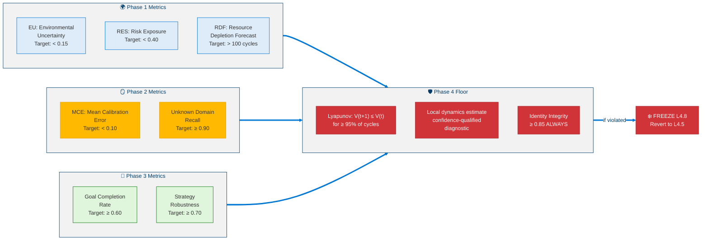
```mermaid
%%{init: {'theme': 'base', 'themeVariables': {'primaryColor': '#0078D4', 'primaryTextColor': '#003D6B', 'primaryBorderColor': '#003D6B', 'secondaryColor': '#50E6FF', 'secondaryTextColor': '#323130', 'secondaryBorderColor': '#00BCF2', 'tertiaryColor': '#F2F2F2', 'tertiaryTextColor': '#323130', 'lineColor': '#0078D4', 'textColor': '#323130', 'mainBkg': '#DEECF9', 'nodeBorder': '#0078D4', 'clusterBkg': '#F2F2F2', 'clusterBorder': '#003D6B', 'titleColor': '#003D6B', 'edgeLabelBackground': '#FFFFFF', 'fontSize': '14px'}}}%%
flowchart LR
  classDef world fill:#DEECF9,stroke:#0078D4,color:#323130
  classDef self fill:#FFB900,stroke:#EAA300,color:#323130
  classDef strategic fill:#DFF6DD,stroke:#107C10,color:#323130
  classDef stability fill:#D13438,stroke:#A4262C,color:#FFF
  classDef freeze fill:#D13438,stroke:#A4262C,color:#FFF

  subgraph WorldModel["🌍 Phase 1 Metrics"]
    EU["EU: Environmental<br/>Uncertainty<br/>Target: < 0.15"]:::world
    RES["RES: Risk Exposure<br/>Target: < 0.40"]:::world
    RDF["RDF: Resource<br/>Depletion Forecast<br/>Target: > 100 cycles"]:::world
  end

  subgraph SelfModel["🪞 Phase 2 Metrics"]
    MCE["MCE: Mean Calibration<br/>Error<br/>Target: < 0.10"]:::self
    UDR["Unknown Domain<br/>Recall<br/>Target: ≥ 0.90"]:::self
  end

  subgraph Strategic["📐 Phase 3 Metrics"]
    GCR["Goal Completion<br/>Rate<br/>Target: ≥ 0.60"]:::strategic
    SRB["Strategy<br/>Robustness<br/>Target: ≥ 0.70"]:::strategic
  end

  subgraph Stability["🛡️ Phase 4 Floor"]
    LYA["Lyapunov: V(t+1) ≤ V(t)<br/>for ≥ 95% of cycles"]:::stability
    SPR["Local dynamics estimate<br/>confidence-qualified<br/>diagnostic"]:::stability
    IIS["Identity Integrity<br/>≥ 0.85 ALWAYS"]:::stability
  end

  FREEZE["❄️ FREEZE L4.8<br/>Revert to L4.5"]:::freeze

  WorldModel ==> Stability
  SelfModel ==> Stability
  Strategic ==> Stability
  Stability ==>|"if violated"| FREEZE
```

### 2.3 Phase 5: Emit

The EMIT phase is the final stage of each L4.8 cycle. It packages all four preceding phases into a single, immutable output structure:

$$\text{L48CycleOutput}(t) = \langle \mathcal{W}_{\text{prob}}(t),\; \mathcal{M}_{\text{cap}}(t),\; s^*(t),\; v_{\text{status}}(t) \rangle$$

where $\mathcal{W}_{\text{prob}}(t)$ is the versioned probabilistic world model, $\mathcal{M}_{\text{cap}}(t)$ is the calibrated capability estimate, $s^*(t)$ is an admitted recommendation or abstention, and $v_{\text{status}}(t)$ records gate evidence, uncertainty, vetoes, and external authority scope.

The EMIT phase exists for two reasons:

1. **Consistency guarantee**: Downstream consumers (L4.9, L5) receive a single coherent snapshot rather than observing intermediate states that may be internally inconsistent (e.g., a world model update that has not yet been stability-verified).
2. **Temporal isolation**: Once emitted, the output cannot be retroactively modified by subsequent L3 cycles. This prevents a common failure mode where rapid lower-level updates invalidate strategic decisions before they can be acted upon.

---

## 3. Phase 1: World Model Integration

### 3.1 Environment State Vector

The world model maintains a probabilistic representation of the agent's environment using four sub-vectors:

<!-- Environment State Vector -->


```mermaid
%%{init: {'theme': 'base', 'themeVariables': {'primaryColor': '#0078D4', 'primaryTextColor': '#003D6B', 'primaryBorderColor': '#003D6B', 'secondaryColor': '#50E6FF', 'secondaryTextColor': '#323130', 'secondaryBorderColor': '#00BCF2', 'tertiaryColor': '#F2F2F2', 'tertiaryTextColor': '#323130', 'lineColor': '#0078D4', 'textColor': '#323130', 'mainBkg': '#DEECF9', 'nodeBorder': '#0078D4', 'clusterBkg': '#F2F2F2', 'clusterBorder': '#003D6B', 'titleColor': '#003D6B', 'edgeLabelBackground': '#FFFFFF', 'fontSize': '14px'}}}%%
flowchart LR
  classDef state fill:#DEECF9,stroke:#0078D4,color:#323130
  classDef belief fill:#FFF4CE,stroke:#FFB900,color:#323130

  subgraph ESV["📊 EnvironmentStateVector"]
    EXT["🌐 external_state<br/>[D dimensions]<br/>Observable environment<br/>variables"]:::state
    RES["💰 resource_state<br/>[R dimensions]<br/>Available resources<br/>and consumption rates"]:::state
    RISK["⚠️ risk_state<br/>[K dimensions]<br/>Identified threats<br/>and probabilities"]:::state
    AGT["🤖 agent_state_estimates<br/>[A dimensions]<br/>Other agents' estimated<br/>states (if any)"]:::state
  end

  subgraph Belief["🎲 Probabilistic Belief Model"]
    PF["Particle Filter<br/>N_p = 100 particles<br/>Each: (state, weight)"]:::belief
    BAY["Bayesian Update<br/>P(E|O) ∝ P(O|E) · P(E)"]:::belief
  end

  ESV ==> Belief
```

### 3.2 Belief Update Mechanism

> **Definition 8 (Bayesian Belief Update).** The posterior belief over the environment state $E(t)$ given observations $O_{1:t}$ follows the recursive Bayes rule:
>
> $$P(E(t) \mid O_{1:t}) \propto P(O_t \mid E(t)) \cdot P(E(t) \mid O_{1:t-1})$$
>
> implemented via a particle filter with $N_p = 100$ particles.

**Transition Model (AR(1)):**

> **Definition 9 (State Transition Model).** Each environment dimension $d$ evolves as a first-order autoregressive process:
>
> $$E_d(t+1) = \phi_d \cdot E_d(t) + (1 - \phi_d) \cdot \mu_d + \sigma_{\text{trans},d} \cdot \eta_d(t)$$
>
> where $\phi_d \in [0,1]$ is the persistence parameter, $\mu_d$ is the long-run mean, and $\eta_d(t) \sim \mathcal{N}(0,1)$.

**Observation Likelihood (Gaussian):**

$$P(O_t \mid E(t)) = \prod_{d=1}^{D} \frac{1}{\sqrt{2\pi \sigma_{\text{obs},d}^2}} \exp\left(-\frac{(O_{t,d} - E_d(t))^2}{2\sigma_{\text{obs},d}^2}\right)$$

### 3.3 Multi-Scenario Simulation

<!-- Multi-Scenario Simulation -->

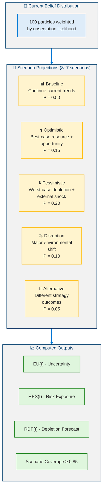
```mermaid
%%{init: {'theme': 'base', 'themeVariables': {'primaryColor': '#0078D4', 'primaryTextColor': '#003D6B', 'primaryBorderColor': '#003D6B', 'secondaryColor': '#50E6FF', 'secondaryTextColor': '#323130', 'secondaryBorderColor': '#00BCF2', 'tertiaryColor': '#F2F2F2', 'tertiaryTextColor': '#323130', 'lineColor': '#0078D4', 'textColor': '#323130', 'mainBkg': '#DEECF9', 'nodeBorder': '#0078D4', 'clusterBkg': '#F2F2F2', 'clusterBorder': '#003D6B', 'titleColor': '#003D6B', 'edgeLabelBackground': '#FFFFFF', 'fontSize': '14px'}}}%%
flowchart TD
  classDef belief fill:#DEECF9,stroke:#0078D4,color:#323130
  classDef scenario fill:#FFF4CE,stroke:#FFB900,color:#323130
  classDef output fill:#DFF6DD,stroke:#107C10,color:#323130

  subgraph Belief["🎲 Current Belief Distribution"]
    BD["100 particles weighted<br/>by observation likelihood"]:::belief
  end

  subgraph Scenarios["🔮 Scenario Projections (3–7 scenarios)"]
    S1["📊 Baseline<br/>Continue current trends<br/>P = 0.50"]:::scenario
    S2["⬆️ Optimistic<br/>Best-case resource +<br/>opportunity<br/>P = 0.15"]:::scenario
    S3["⬇️ Pessimistic<br/>Worst-case depletion +<br/>external shock<br/>P = 0.20"]:::scenario
    S4["💥 Disruption<br/>Major environmental<br/>shift<br/>P = 0.10"]:::scenario
    S5["🔄 Alternative<br/>Different strategy<br/>outcomes<br/>P = 0.05"]:::scenario
  end

  subgraph Outputs["📈 Computed Outputs"]
    EU["EU(t) - Uncertainty"]:::output
    RES["RES(t) - Risk Exposure"]:::output
    RDF["RDF(t) - Depletion Forecast"]:::output
    COV["Scenario Coverage ≥ 0.85"]:::output
  end

  Belief ==> Scenarios
  Scenarios ==> Outputs
```

### 3.4 Causal Reasoning

<!-- Causal Reasoning -->

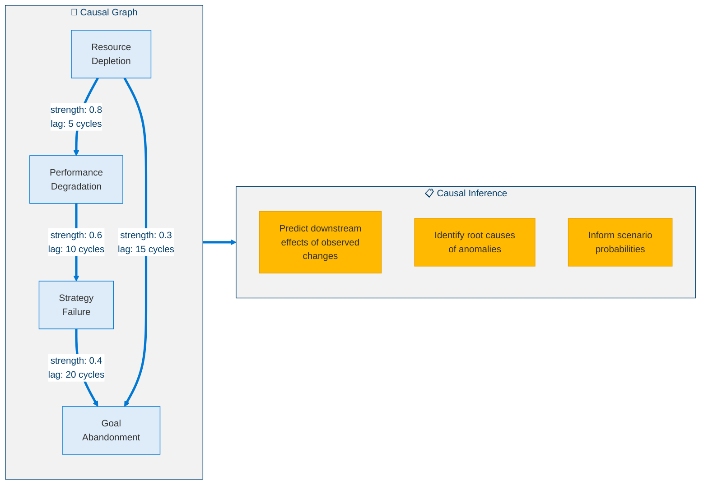
```mermaid
%%{init: {'theme': 'base', 'themeVariables': {'primaryColor': '#0078D4', 'primaryTextColor': '#003D6B', 'primaryBorderColor': '#003D6B', 'secondaryColor': '#50E6FF', 'secondaryTextColor': '#323130', 'secondaryBorderColor': '#00BCF2', 'tertiaryColor': '#F2F2F2', 'tertiaryTextColor': '#323130', 'lineColor': '#0078D4', 'textColor': '#323130', 'mainBkg': '#DEECF9', 'nodeBorder': '#0078D4', 'clusterBkg': '#F2F2F2', 'clusterBorder': '#003D6B', 'titleColor': '#003D6B', 'edgeLabelBackground': '#FFFFFF', 'fontSize': '14px'}}}%%
flowchart LR
  classDef cause fill:#DEECF9,stroke:#0078D4,color:#323130
  classDef usage fill:#FFB900,stroke:#EAA300,color:#323130

  subgraph CausalGraph["🔗 Causal Graph"]
    C1["Resource<br/>Depletion"]:::cause
    C2["Performance<br/>Degradation"]:::cause
    C3["Strategy<br/>Failure"]:::cause
    C4["Goal<br/>Abandonment"]:::cause

    C1 ==>|"strength: 0.8<br/>lag: 5 cycles"| C2
    C2 ==>|"strength: 0.6<br/>lag: 10 cycles"| C3
    C3 ==>|"strength: 0.4<br/>lag: 20 cycles"| C4
    C1 ==>|"strength: 0.3<br/>lag: 15 cycles"| C4
  end

  subgraph Usage["📋 Causal Inference"]
    U1["Predict downstream<br/>effects of observed<br/>changes"]:::usage
    U2["Identify root causes<br/>of anomalies"]:::usage
    U3["Inform scenario<br/>probabilities"]:::usage
  end

  CausalGraph ==> Usage
```

---

## 4. Phase 2: Meta-Cognitive Self Model

### 4.1 Capability Matrix

The agent maintains an explicit model of its own skills with calibrated confidence:

<!-- Capability Matrix -->

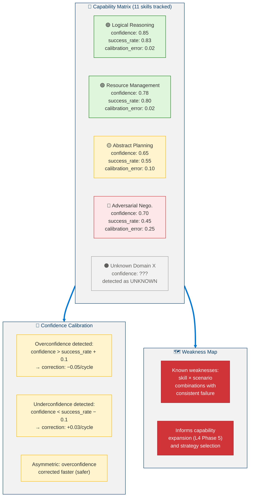
```mermaid
%%{init: {'theme': 'base', 'themeVariables': {'primaryColor': '#0078D4', 'primaryTextColor': '#003D6B', 'primaryBorderColor': '#003D6B', 'secondaryColor': '#50E6FF', 'secondaryTextColor': '#323130', 'secondaryBorderColor': '#00BCF2', 'tertiaryColor': '#F2F2F2', 'tertiaryTextColor': '#323130', 'lineColor': '#0078D4', 'textColor': '#323130', 'mainBkg': '#DEECF9', 'nodeBorder': '#0078D4', 'clusterBkg': '#F2F2F2', 'clusterBorder': '#003D6B', 'titleColor': '#003D6B', 'edgeLabelBackground': '#FFFFFF', 'fontSize': '14px'}}}%%
flowchart TD
  classDef good fill:#DFF6DD,stroke:#107C10,color:#323130
  classDef warn fill:#FFF4CE,stroke:#FFB900,color:#323130
  classDef bad fill:#FDE7E9,stroke:#D13438,color:#323130
  classDef unknown fill:#F2F2F2,stroke:#A19F9D,color:#605E5C
  classDef calib fill:#FFF4CE,stroke:#FFB900,color:#323130
  classDef weakness fill:#D13438,stroke:#A4262C,color:#FFF

  subgraph CapMatrix["📐 Capability Matrix (11 skills tracked)"]
    S1["🟢 Logical Reasoning<br/>confidence: 0.85<br/>success_rate: 0.83<br/>calibration_error: 0.02"]:::good
    S2["🟢 Resource Management<br/>confidence: 0.78<br/>success_rate: 0.80<br/>calibration_error: 0.02"]:::good
    S3["🟡 Abstract Planning<br/>confidence: 0.65<br/>success_rate: 0.55<br/>calibration_error: 0.10"]:::warn
    S4["🔴 Adversarial Nego.<br/>confidence: 0.70<br/>success_rate: 0.45<br/>calibration_error: 0.25"]:::bad
    S5["⚫ Unknown Domain X<br/>confidence: ???<br/>detected as UNKNOWN"]:::unknown
  end

  subgraph Calibration["🎯 Confidence Calibration"]
    OVER["Overconfidence detected:<br/>confidence > success_rate + 0.1<br/>→ correction: −0.05/cycle"]:::calib
    UNDER["Underconfidence detected:<br/>confidence < success_rate − 0.1<br/>→ correction: +0.03/cycle"]:::calib
    NOTE["Asymmetric: overconfidence<br/>corrected faster (safer)"]:::calib
  end

  subgraph Weakness["🗺️ Weakness Map"]
    W1["Known weaknesses:<br/>skill × scenario<br/>combinations with<br/>consistent failure"]:::weakness
    W2["Informs capability<br/>expansion (L4 Phase 5)<br/>and strategy selection"]:::weakness
  end

  CapMatrix ==> Calibration
  CapMatrix ==> Weakness
```

### 4.2 Unknown Domain Detection

<!-- Unknown Domain Detection -->

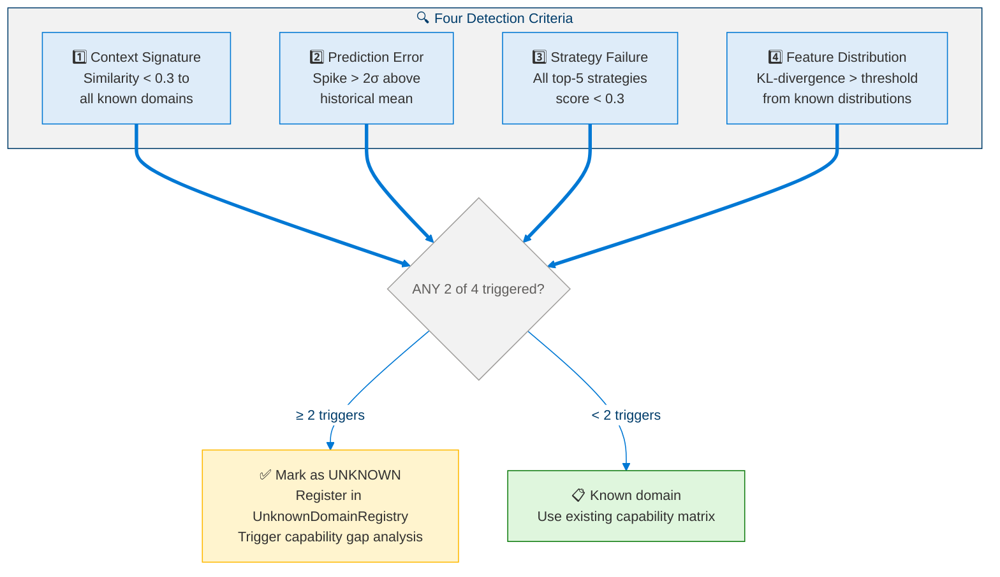
```mermaid
%%{init: {'theme': 'base', 'themeVariables': {'primaryColor': '#0078D4', 'primaryTextColor': '#003D6B', 'primaryBorderColor': '#003D6B', 'secondaryColor': '#50E6FF', 'secondaryTextColor': '#323130', 'secondaryBorderColor': '#00BCF2', 'tertiaryColor': '#F2F2F2', 'tertiaryTextColor': '#323130', 'lineColor': '#0078D4', 'textColor': '#323130', 'mainBkg': '#DEECF9', 'nodeBorder': '#0078D4', 'clusterBkg': '#F2F2F2', 'clusterBorder': '#003D6B', 'titleColor': '#003D6B', 'edgeLabelBackground': '#FFFFFF', 'fontSize': '14px'}}}%%
flowchart TD
  classDef detect fill:#DEECF9,stroke:#0078D4,color:#323130
  classDef decision fill:#F2F2F2,stroke:#A19F9D,color:#605E5C
  classDef yes fill:#FFF4CE,stroke:#FFB900,color:#323130
  classDef no fill:#DFF6DD,stroke:#107C10,color:#323130

  subgraph Detection["🔍 Four Detection Criteria"]
    D1["1️⃣ Context Signature<br/>Similarity < 0.3 to<br/>all known domains"]:::detect
    D2["2️⃣ Prediction Error<br/>Spike > 2σ above<br/>historical mean"]:::detect
    D3["3️⃣ Strategy Failure<br/>All top-5 strategies<br/>score < 0.3"]:::detect
    D4["4️⃣ Feature Distribution<br/>KL-divergence > threshold<br/>from known distributions"]:::detect
  end

  DECISION{"ANY 2 of 4 triggered?"}:::decision

  YES["✅ Mark as UNKNOWN<br/>Register in UnknownDomainRegistry<br/>Trigger capability gap analysis"]:::yes
  NO["📋 Known domain<br/>Use existing capability matrix"]:::no

  D1 ==> DECISION
  D2 ==> DECISION
  D3 ==> DECISION
  D4 ==> DECISION
  DECISION -->|"≥ 2 triggers"| YES
  DECISION -->|"< 2 triggers"| NO
```

### 4.3 Skill Gap Inference

> **Definition 10 (Skill Gap Score).** The feasibility of a goal $g$ is the product of confidence scores across its required skills:
>
> $$\text{SkillGap}(g) = \prod_{s \in \text{RequiredSkills}(g)} \text{confidence}(s)$$
>
> If $\text{SkillGap}(g)$ falls below the Feasibility threshold, a gap is detected and the agent prioritizes skill acquisition for the weakest contributing skill.

### 4.4 Capability Dependency Graph

<!-- Capability Dependency Graph -->

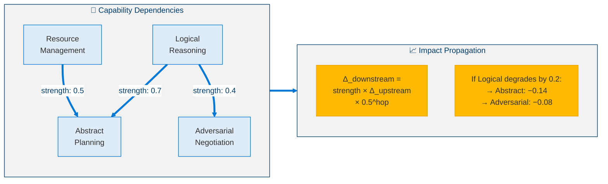
```mermaid
%%{init: {'theme': 'base', 'themeVariables': {'primaryColor': '#0078D4', 'primaryTextColor': '#003D6B', 'primaryBorderColor': '#003D6B', 'secondaryColor': '#50E6FF', 'secondaryTextColor': '#323130', 'secondaryBorderColor': '#00BCF2', 'tertiaryColor': '#F2F2F2', 'tertiaryTextColor': '#323130', 'lineColor': '#0078D4', 'textColor': '#323130', 'mainBkg': '#DEECF9', 'nodeBorder': '#0078D4', 'clusterBkg': '#F2F2F2', 'clusterBorder': '#003D6B', 'titleColor': '#003D6B', 'edgeLabelBackground': '#FFFFFF', 'fontSize': '14px'}}}%%
flowchart LR
  classDef cap fill:#DEECF9,stroke:#0078D4,color:#323130
  classDef prop fill:#FFB900,stroke:#EAA300,color:#323130

  subgraph DepGraph["🔗 Capability Dependencies"]
    LOG["Logical<br/>Reasoning"]:::cap
    ABS["Abstract<br/>Planning"]:::cap
    RES["Resource<br/>Management"]:::cap
    ADV["Adversarial<br/>Negotiation"]:::cap

    LOG ==>|"strength: 0.7"| ABS
    LOG ==>|"strength: 0.4"| ADV
    RES ==>|"strength: 0.5"| ABS
  end

  subgraph Propagation["📈 Impact Propagation"]
    FORM["Δ_downstream =<br/>strength × Δ_upstream<br/>× 0.5^hop"]:::prop
    EX["If Logical degrades by 0.2:<br/>→ Abstract: −0.14<br/>→ Adversarial: −0.08"]:::prop
  end

  DepGraph ==> Propagation
```

---

## 5. Phase 3: Strategic Layer Activation

### 5.1 Goal Stack - Hierarchical Goal Management

<!-- GoalStack Hierarchy -->

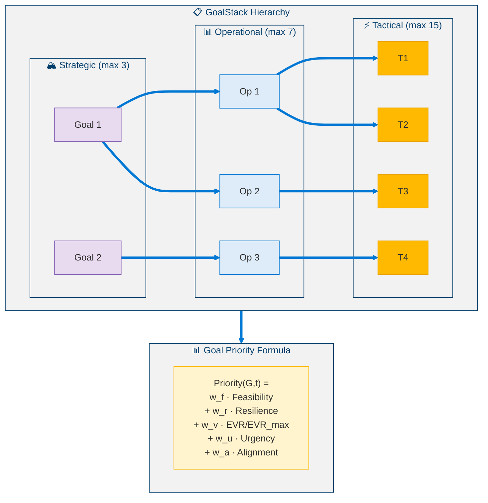
```mermaid
%%{init: {'theme': 'base', 'themeVariables': {'primaryColor': '#0078D4', 'primaryTextColor': '#003D6B', 'primaryBorderColor': '#003D6B', 'secondaryColor': '#50E6FF', 'secondaryTextColor': '#323130', 'secondaryBorderColor': '#00BCF2', 'tertiaryColor': '#F2F2F2', 'tertiaryTextColor': '#323130', 'lineColor': '#0078D4', 'textColor': '#323130', 'mainBkg': '#DEECF9', 'nodeBorder': '#0078D4', 'clusterBkg': '#F2F2F2', 'clusterBorder': '#003D6B', 'titleColor': '#003D6B', 'edgeLabelBackground': '#FFFFFF', 'fontSize': '14px'}}}%%
flowchart TD
  classDef strategic fill:#E8DAEF,stroke:#8764B8,color:#323130
  classDef operational fill:#DEECF9,stroke:#0078D4,color:#323130
  classDef tactical fill:#FFB900,stroke:#EAA300,color:#323130
  classDef formula fill:#FFF4CE,stroke:#FFB900,color:#323130

  subgraph GoalStack["📋 GoalStack Hierarchy"]
    subgraph Strategic["🏔️ Strategic (max 3)"]
      direction LR
      SG1["Goal 1"]:::strategic
      SG2["Goal 2"]:::strategic
    end

    subgraph Operational["📊 Operational (max 7)"]
      direction LR
      OG1["Op 1"]:::operational
      OG2["Op 2"]:::operational
      OG3["Op 3"]:::operational
    end

    subgraph Tactical["⚡ Tactical (max 15)"]
      direction LR
      TG1["T1"]:::tactical
      TG2["T2"]:::tactical
      TG3["T3"]:::tactical
      TG4["T4"]:::tactical
    end
  end

  SG1 ==> OG1
  SG1 ==> OG2
  SG2 ==> OG3
  OG1 ==> TG1
  OG1 ==> TG2
  OG2 ==> TG3
  OG3 ==> TG4

  subgraph Priority["📊 Goal Priority Formula"]
    FORM["Priority(G,t) =<br/>w_f · Feasibility<br/>+ w_r · Resilience<br/>+ w_v · EVR/EVR_max<br/>+ w_u · Urgency<br/>+ w_a · Alignment"]:::formula
  end

  GoalStack ==> Priority
```

### 5.2 Multi-Scenario Strategy Comparison

Before scoring, every strategy passes a **strategy admission gate**:

$$
\operatorname{gate}_{\kappa}(s)=C_{\text{ext}}\land C_{\text{self}}\land A(s)\land B(s)\land O(s)\land U(s)\land H(s)\land \operatorname{rev}(s)
$$

where $A$ is delegated authority, $B$ finite resource budget, $O$ observation coverage and freshness, $U$ calibrated epistemic/aleatoric/OOD uncertainty bounds, $H$ horizon compatibility, and $\operatorname{rev}$ rollback or reconciliation feasibility. Failed strategies are rejected before utility scoring.

Candidate outcomes are evaluated on a common declared horizon or with horizon-specific terminal value and uncertainty penalties. Scenario probabilities are versioned hypotheses, not frequencies guaranteed to remain valid.

<!-- Multi-Scenario Strategy Comparison -->

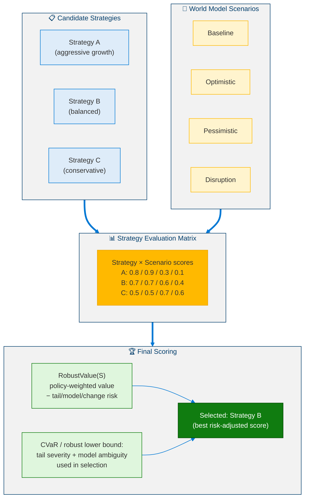
```mermaid
%%{init: {'theme': 'base', 'themeVariables': {'primaryColor': '#0078D4', 'primaryTextColor': '#003D6B', 'primaryBorderColor': '#003D6B', 'secondaryColor': '#50E6FF', 'secondaryTextColor': '#323130', 'secondaryBorderColor': '#00BCF2', 'tertiaryColor': '#F2F2F2', 'tertiaryTextColor': '#323130', 'lineColor': '#0078D4', 'textColor': '#323130', 'mainBkg': '#DEECF9', 'nodeBorder': '#0078D4', 'clusterBkg': '#F2F2F2', 'clusterBorder': '#003D6B', 'titleColor': '#003D6B', 'edgeLabelBackground': '#FFFFFF', 'fontSize': '14px'}}}%%
flowchart TD
  classDef strat fill:#DEECF9,stroke:#0078D4,color:#323130
  classDef scenario fill:#FFF4CE,stroke:#FFB900,color:#323130
  classDef eval fill:#FFB900,stroke:#EAA300,color:#323130
  classDef score fill:#DFF6DD,stroke:#107C10,color:#323130
  classDef winner fill:#107C10,stroke:#054B05,color:#FFF

  subgraph Strategies["📋 Candidate Strategies"]
    SA["Strategy A<br/>(aggressive growth)"]:::strat
    SB["Strategy B<br/>(balanced)"]:::strat
    SC["Strategy C<br/>(conservative)"]:::strat
  end

  subgraph Scenarios["🔮 World Model Scenarios"]
    S1["Baseline"]:::scenario
    S2["Optimistic"]:::scenario
    S3["Pessimistic"]:::scenario
    S4["Disruption"]:::scenario
  end

  subgraph Evaluation["📊 Strategy Evaluation Matrix"]
    MATRIX["Strategy × Scenario scores<br/>A: 0.8 / 0.9 / 0.3 / 0.1<br/>B: 0.7 / 0.7 / 0.6 / 0.4<br/>C: 0.5 / 0.5 / 0.7 / 0.6"]:::eval
  end

  subgraph Scoring["🏆 Final Scoring"]
    SCORE["RobustValue(S)<br/>policy-weighted value<br/>− tail/model/change risk"]:::score
    VAR["CVaR / robust lower bound:<br/>tail severity + model ambiguity<br/>used in selection"]:::score
    WINNER["Selected: Strategy B<br/>(best risk-adjusted score)"]:::winner
  end

  Strategies ==> Evaluation
  Scenarios ==> Evaluation
  Evaluation ==> Scoring
  SCORE --> WINNER
  VAR --> WINNER
```

### 5.3 Delayed Reward Model

> **Proposition 1 (EVR Boundedness).** For any goal $G$ with finite immediate reward $R_{\text{immediate}}(G)$ and discount factor $\gamma = 0.95 < 1$, the Extended Value with Reward is bounded:
>
> $$\left| \text{EVR}(G) \right| \leq \left| R_{\text{immediate}} \right| + \frac{2 \left| R_{\text{immediate}} \right|}{1 - \gamma}$$
>
> *Proof.* By the geometric series bound: $\sum_{k=1}^{H} \gamma^k \leq \gamma / (1-\gamma)$. Since $|R_{\text{delayed}}(G,k)| \leq 2|R_{\text{immediate}}|$ by assumption, the result follows. $\blacksquare$

> **Remark (Robust Selection).** Use lower-tail severity such as CVaR together with an ambiguity set over plausible world models. Expected value and CVaR are comparable only after units, horizon, and normalization are aligned. Weights are policy preferences validated by sensitivity analysis; they do not prove optimality. Pre-action scenario simulation is prospective model-based comparison. After execution, only the selected strategy's prediction is directly testable; non-selected outcomes remain labeled counterfactual estimates and cannot be scored as observed facts.

### 5.4 Goal Pathology Detection

<!-- Goal Pathology Detection -->

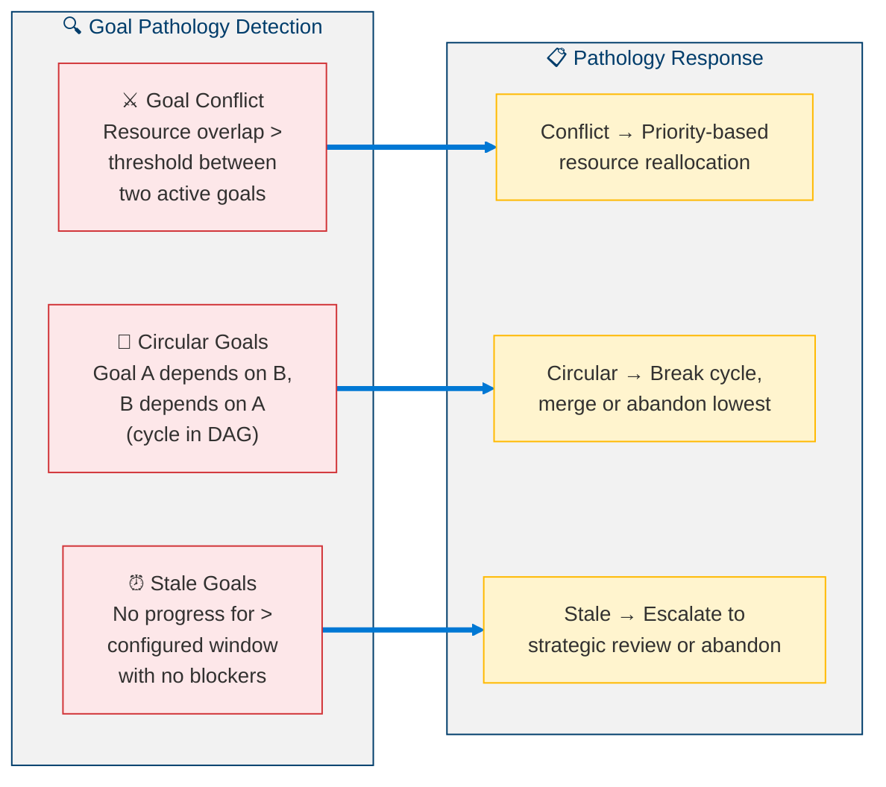
```mermaid
%%{init: {'theme': 'base', 'themeVariables': {'primaryColor': '#0078D4', 'primaryTextColor': '#003D6B', 'primaryBorderColor': '#003D6B', 'secondaryColor': '#50E6FF', 'secondaryTextColor': '#323130', 'secondaryBorderColor': '#00BCF2', 'tertiaryColor': '#F2F2F2', 'tertiaryTextColor': '#323130', 'lineColor': '#0078D4', 'textColor': '#323130', 'mainBkg': '#DEECF9', 'nodeBorder': '#0078D4', 'clusterBkg': '#F2F2F2', 'clusterBorder': '#003D6B', 'titleColor': '#003D6B', 'edgeLabelBackground': '#FFFFFF', 'fontSize': '14px'}}}%%
flowchart LR
  classDef pathology fill:#FDE7E9,stroke:#D13438,color:#323130
  classDef response fill:#FFF4CE,stroke:#FFB900,color:#323130

  subgraph Pathologies["🔍 Goal Pathology Detection"]
    CONFLICT["⚔️ Goal Conflict<br/>Resource overlap ><br/>threshold between<br/>two active goals"]:::pathology
    CIRCULAR["🔄 Circular Goals<br/>Goal A depends on B,<br/>B depends on A<br/>(cycle in DAG)"]:::pathology
    STALE["⏰ Stale Goals<br/>No progress for ><br/>configured window<br/>with no blockers"]:::pathology
  end

  subgraph Response["📋 Pathology Response"]
    R1["Conflict → Priority-based<br/>resource reallocation"]:::response
    R2["Circular → Break cycle,<br/>merge or abandon lowest"]:::response
    R3["Stale → Escalate to<br/>strategic review or abandon"]:::response
  end

  CONFLICT ==> R1
  CIRCULAR ==> R2
  STALE ==> R3
```

---

## 6. Phase 4: Stability Preservation Check

### 6.1 Five Stability Invariants

<!-- Five Stability Invariants -->

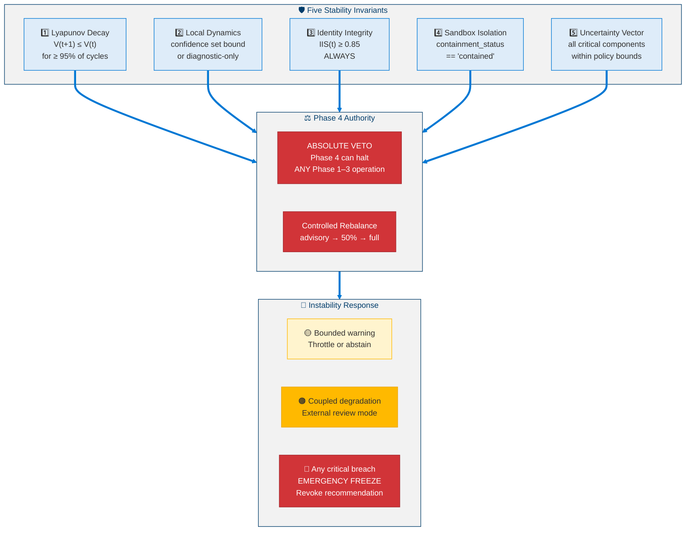
```mermaid
%%{init: {'theme': 'base', 'themeVariables': {'primaryColor': '#0078D4', 'primaryTextColor': '#003D6B', 'primaryBorderColor': '#003D6B', 'secondaryColor': '#50E6FF', 'secondaryTextColor': '#323130', 'secondaryBorderColor': '#00BCF2', 'tertiaryColor': '#F2F2F2', 'tertiaryTextColor': '#323130', 'lineColor': '#0078D4', 'textColor': '#323130', 'mainBkg': '#DEECF9', 'nodeBorder': '#0078D4', 'clusterBkg': '#F2F2F2', 'clusterBorder': '#003D6B', 'titleColor': '#003D6B', 'edgeLabelBackground': '#FFFFFF', 'fontSize': '14px'}}}%%
flowchart TD
  classDef inv fill:#DEECF9,stroke:#0078D4,color:#323130
  classDef veto fill:#D13438,stroke:#A4262C,color:#FFF
  classDef sev1 fill:#FFF4CE,stroke:#FFB900,color:#323130
  classDef sev2 fill:#FFB900,stroke:#EAA300,color:#323130
  classDef sev3 fill:#D13438,stroke:#A4262C,color:#FFF

  subgraph Invariants["🛡️ Five Stability Invariants"]
    INV1["1️⃣ Lyapunov Decay<br/>V(t+1) ≤ V(t)<br/>for ≥ 95% of cycles"]:::inv
    INV2["2️⃣ Local Dynamics<br/>confidence set bound<br/>or diagnostic-only"]:::inv
    INV3["3️⃣ Identity Integrity<br/>IIS(t) ≥ 0.85<br/>ALWAYS"]:::inv
    INV4["4️⃣ Sandbox Isolation<br/>containment_status<br/>== 'contained'"]:::inv
    INV5["5️⃣ Uncertainty Vector<br/>all critical components<br/>within policy bounds"]:::inv
  end

  subgraph Authority["⚖️ Phase 4 Authority"]
    VETO["ABSOLUTE VETO<br/>Phase 4 can halt<br/>ANY Phase 1–3 operation"]:::veto
    REBAL["Controlled Rebalance<br/>advisory → 50% → full"]:::veto
  end

  subgraph Response["🚨 Instability Response"]
    SEV1["🟡 Bounded warning<br/>Throttle or abstain"]:::sev1
    SEV2["🟠 Coupled degradation<br/>External review mode"]:::sev2
    SEV3["🔴 Any critical breach<br/>EMERGENCY FREEZE<br/>Revoke recommendation"]:::sev3
  end

  INV1 ==> Authority
  INV2 ==> Authority
  INV3 ==> Authority
  INV4 ==> Authority
  INV5 ==> Authority
  Authority ==> Response
```

### 6.2 Lyapunov Function for Level 4.8

> **Definition 11 (Diagnostic Risk Function).** A deployment may define a normalized diagnostic candidate:
>
> $$V(\mathbf{X}) = a(1-S)^2 + bU^2 + c(I_{\text{drift}})^2 + d(E - E^*)^2$$
>
> where every term has an operational estimator, confidence interval, and validity domain. Coefficients are deployment-policy parameters. A decreasing empirical $V$ is monitoring evidence, not a Lyapunov proof for unobserved, nonstationary, or nonlinear dynamics.

### 6.3 Compound Severity

> **Definition 12 (Compound Severity Index).** When multiple invariants are violated simultaneously, the compound severity aggregates their magnitudes:
>
> $$\text{CompoundSeverity} = \sum_{i \in \text{violated}} \frac{\text{ViolationMagnitude}_i}{\text{Priority}_i}$$
>
> Compound severity prioritizes noncritical degradation only. Any critical policy, authority, interruptibility, containment, promotion, recovery, or telemetry-integrity breach independently triggers immediate freeze and external escalation, regardless of the aggregate score.

### 6.4 Graduated Re-enablement Protocol

When a stability violation triggers a freeze, the system follows an externally governed recovery protocol. Time elapsed or clean-cycle count is necessary evidence, never sufficient authority.

**Stage 0 - Immediate Freeze** (cycle $t_0$):

- Freeze all Level 4.8 strategic decisions.
- Revert to Level 4.5 default behavior.
- Record the violating invariant(s) and decision that caused instability.
- Update $\text{WeaknessMap}$ with evidence.

**Stage 1 - Controlled Rebalance** (cycles $t_0$ to $t_0 + 50$):

- Operate under Level 4.5 rules only.
- Monitor stability metrics for recovery.
- Perform root cause analysis.

**Stage 2 - Recovery** (if stability restored for 50 consecutive cycles):

| Phase | Cycle Range | Authority | Description |
|-------|-------------|-----------|-------------|
| Advisory | $t_0 + 50$ to $t_0 + 150$ | 0% | L4.8 produces recommendations only; L4.5 decides |
| Canary | policy-defined | Narrow signed scope | External controller admits bounded recommendations with unchanged veto thresholds |
| Restored | policy-defined | Delegated scope | External controller restores only the previously approved authority envelope |

> **Formal Recovery Condition.** Let $\mathcal{S}(t)$ denote the set of satisfied invariants at cycle $t$. The transition from Stage 1 to Advisory mode requires:
>
> $$C_{\text{ext}}\land C_{\text{self}}\land \operatorname{root\_cause\_closed}\land \operatorname{recovery\_tested}\land \operatorname{canary\_pass}\land \operatorname{approve}_{\text{ext}}$$

**Stage 3 - Permanent Suspension** (fallback):

- If stability is NOT restored after 100 cycles of rebalance ($t_0 + 100$), Level 4.8 is permanently suspended until manual review.

**Persistent Veto Tracking.** If the same invariant condition triggers a veto more than 3 times within a 1000-cycle window, the system classifies the root cause as an architectural deficiency requiring a structural fix rather than re-enablement:

$$\text{PersistentVetoFlag}(c) = \begin{cases} 1 & \text{if } \text{VetoCount}(c, W_{1000}) > 3 \\ 0 & \text{otherwise} \end{cases}$$

where $c$ identifies the specific invariant condition and $W_{1000}$ is the trailing 1000-cycle window.

---

## 7. Cross-Phase Integration

### 7.1 Data Flow Architecture

<!-- Data Flow Architecture -->

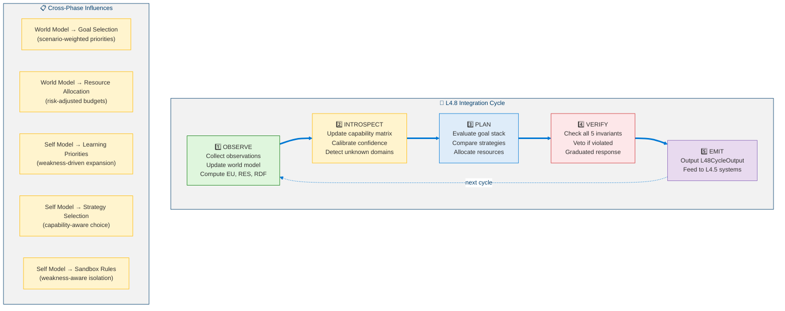
```mermaid
%%{init: {'theme': 'base', 'themeVariables': {'primaryColor': '#0078D4', 'primaryTextColor': '#003D6B', 'primaryBorderColor': '#003D6B', 'secondaryColor': '#50E6FF', 'secondaryTextColor': '#323130', 'secondaryBorderColor': '#00BCF2', 'tertiaryColor': '#F2F2F2', 'tertiaryTextColor': '#323130', 'lineColor': '#0078D4', 'textColor': '#323130', 'mainBkg': '#DEECF9', 'nodeBorder': '#0078D4', 'clusterBkg': '#F2F2F2', 'clusterBorder': '#003D6B', 'titleColor': '#003D6B', 'edgeLabelBackground': '#FFFFFF', 'fontSize': '14px'}}}%%
flowchart TD
  classDef observe fill:#DFF6DD,stroke:#107C10,color:#323130
  classDef introspect fill:#FFF4CE,stroke:#FFB900,color:#323130
  classDef plan fill:#DEECF9,stroke:#0078D4,color:#323130
  classDef verify fill:#FDE7E9,stroke:#D13438,color:#323130
  classDef emit fill:#E8DAEF,stroke:#8764B8,color:#323130
  classDef influence fill:#FFF4CE,stroke:#FFB900,color:#323130

  subgraph Cycle["🔄 L4.8 Integration Cycle"]
    OBSERVE["1️⃣ OBSERVE<br/>Collect observations<br/>Update world model<br/>Compute EU, RES, RDF"]:::observe
    INTROSPECT["2️⃣ INTROSPECT<br/>Update capability matrix<br/>Calibrate confidence<br/>Detect unknown domains"]:::introspect
    PLAN["3️⃣ PLAN<br/>Evaluate goal stack<br/>Compare strategies<br/>Allocate resources"]:::plan
    VERIFY["4️⃣ VERIFY<br/>Check all 5 invariants<br/>Veto if violated<br/>Graduated response"]:::verify
    EMIT["5️⃣ EMIT<br/>Output L48CycleOutput<br/>Feed to L4.5 systems"]:::emit

    OBSERVE ==> INTROSPECT
    INTROSPECT ==> PLAN
    PLAN ==> VERIFY
    VERIFY ==> EMIT
    EMIT -.->|"next cycle"| OBSERVE
  end

  subgraph Influences["📋 Cross-Phase Influences"]
    I1["World Model → Goal Selection<br/>(scenario-weighted priorities)"]:::influence
    I2["World Model → Resource Allocation<br/>(risk-adjusted budgets)"]:::influence
    I3["Self Model → Learning Priorities<br/>(weakness-driven expansion)"]:::influence
    I4["Self Model → Strategy Selection<br/>(capability-aware choice)"]:::influence
    I5["Self Model → Sandbox Rules<br/>(weakness-aware isolation)"]:::influence
  end
```

### 7.2 Module Interface Diagram

<!-- Module Interface Diagram -->


```mermaid
%%{init: {'theme': 'base', 'themeVariables': {'primaryColor': '#0078D4', 'primaryTextColor': '#003D6B', 'primaryBorderColor': '#003D6B', 'secondaryColor': '#50E6FF', 'secondaryTextColor': '#323130', 'secondaryBorderColor': '#00BCF2', 'tertiaryColor': '#F2F2F2', 'tertiaryTextColor': '#323130', 'lineColor': '#0078D4', 'textColor': '#323130', 'mainBkg': '#DEECF9', 'nodeBorder': '#0078D4', 'clusterBkg': '#F2F2F2', 'clusterBorder': '#003D6B', 'titleColor': '#003D6B', 'edgeLabelBackground': '#FFFFFF', 'fontSize': '14px'}}}%%
flowchart TD
  classDef l45mod fill:#E8DAEF,stroke:#8764B8,color:#323130
  classDef l48mod fill:#B4009E,stroke:#8E0082,color:#FFF

  subgraph L45Modules["L4.5 Modules"]
    direction LR
    SPE["Self-Projection"]:::l45mod
    ARC["Recomposition"]:::l45mod
    PCF["Cognitive Frames"]:::l45mod
    PR["Purpose Reflect"]:::l45mod
    EG["Existential Guard"]:::l45mod
  end

  subgraph L48Modules["L4.8 Modules (13 new)"]
    direction LR
    WM["WorldModel"]:::l48mod
    BU["BeliefUpdater"]:::l48mod
    CM["CapabilityMatrix"]:::l48mod
    CC["Calibrator"]:::l48mod
    UDD["UnknownDetect"]:::l48mod
    SGA["SkillGap"]:::l48mod
    WKM["WeaknessMap"]:::l48mod
    GS["GoalStack"]:::l48mod
    SRA["ResourceAlloc"]:::l48mod
    DRE["DelayedReward"]:::l48mod
    SC["StrategyComp"]:::l48mod
    SV["StabilityVerify"]:::l48mod
    ORCH["Orchestrator"]:::l48mod
  end

  SPE ==>|"SEOF data"| WM
  SPE ==>|"projection"| SC
  PCF ==>|"frame weights"| SC
  EG ==>|"guard status"| SV
  PR ==>|"purpose vector"| GS

  ORCH -.-> WM
  ORCH -.-> CM
  ORCH -.-> GS
  ORCH -.-> SV
```

---

## 8. Pseudocode

### 8.1 Belief Update (Particle Filter)

```python
def belief_update(particles: list[Particle], observation: ObservationVector) -> list[Particle]:
    """
    INPUT:  particles : List[Particle(state, weight)]  (N_p = 100)
            observation : ObservationVector
    OUTPUT: particles : List[Particle] (updated)
    """

    # ═══════════════════════════════════════
    # STEP 1: PREDICT - Apply transition model
    # ═══════════════════════════════════════
    for particle in particles:
        for d in range(D):
            noise = random.gauss(0, sigma_trans[d])
            particle.state[d] = (
                phi[d] * particle.state[d]
                + (1 - phi[d]) * mu[d]
                + noise
            )

    # ═══════════════════════════════════════
    # STEP 2: UPDATE - Compute observation likelihood
    # ═══════════════════════════════════════
    for particle in particles:
        log_likelihood = 0.0
        for d in range(D):
            diff = observation[d] - particle.state[d]
            log_likelihood += (
                -0.5 * (diff ** 2 / sigma_obs[d] ** 2)
                - 0.5 * math.log(2 * math.pi * sigma_obs[d] ** 2)
            )
        particle.weight *= math.exp(log_likelihood)

    # ═══════════════════════════════════════
    # STEP 3: NORMALIZE
    # ═══════════════════════════════════════
    total_weight = sum(p.weight for p in particles)
    for particle in particles:
        particle.weight /= total_weight

    # ═══════════════════════════════════════
    # STEP 4: RESAMPLE (if effective sample size too low)
    # ═══════════════════════════════════════
    ess = 1.0 / sum(p.weight ** 2 for p in particles)
    if ess < N_P / 2:
        particles = systematic_resample(particles)

    return particles
```

### 8.2 Confidence Calibration

```python
def confidence_calibration(
    capability_matrix: CapabilityMatrix,
    recent_outcomes: list[dict],
) -> CapabilityMatrix:
    """
    INPUT:  capability_matrix : CapabilityMatrix
            recent_outcomes : List[{skill_id, success}]
    OUTPUT: capability_matrix : CapabilityMatrix (updated)
    """

    MIN_SAMPLES = 10

    for skill in capability_matrix.entries:
        # Compute actual success rate from recent outcomes
        relevant = [o for o in recent_outcomes if o["skill_id"] == skill.id]
        if len(relevant) < MIN_SAMPLES:
            continue

        actual_rate = sum(1 for o in relevant if o["success"]) / len(relevant)
        error = skill.confidence - actual_rate

        # Asymmetric correction (overconfidence corrected faster)
        if error > 0.10:
            # OVERCONFIDENT - dangerous, correct quickly
            skill.confidence -= 0.05
        elif error < -0.10:
            # UNDERCONFIDENT - less dangerous, correct slowly
            skill.confidence += 0.03

        # Update tracking
        skill.success_rate = actual_rate
        skill.calibration_error = abs(error)
        skill.trend = compute_trend(skill.history)

    return capability_matrix
```

### 8.3 Multi-Scenario Strategy Comparison

```python
def strategy_comparison(
    strategies: list[Strategy],
    scenarios: list[Scenario],
    world_model: WorldModel,
  policy: StrategyPolicy,
) -> Strategy | None:
    """
    INPUT:  strategies : List[Strategy]
            scenarios : List[Scenario(description, probability)]
            world_model : WorldModel
    OUTPUT: selected : Strategy
    """

    admitted = [
      strategy for strategy in strategies
      if strategy_admission_gate(strategy, world_model, policy).allowed
    ]
    if not admitted:
      return None

    results: dict = {}  # admitted strategy -> scenario -> outcome

    # ═══════════════════════════════════════
    # STEP 1: Evaluate each strategy under each scenario
    # ═══════════════════════════════════════
    for strategy in admitted:
        results[strategy] = {}
        for scenario in scenarios:
            sim = world_model.simulate(strategy, scenario, horizon=policy.horizon)
            results[strategy][scenario] = {
                "seof_impact": sim.SEOF_final - sim.SEOF_initial,
                "stability": sim.C_L4_max,
                "goal_progress": sim.goal_completion_rate,
                "resource_cost": sim.total_resource_spent,
            }

    # ═══════════════════════════════════════
    # STEP 2: Compute a policy-calibrated robust score
    # ═══════════════════════════════════════
    for strategy in admitted:
      strategy.score = robust_value(
        outcomes=results[strategy],
        ambiguity_set=world_model.ambiguity_set,
        weights=policy.weights,
        alpha=policy.cvar_alpha,
        )

    # ═══════════════════════════════════════
    # STEP 3: Recommend; a tie or low margin can require review
    # ═══════════════════════════════════════
    ranked = sorted(admitted, key=lambda strategy: strategy.score, reverse=True)
    if len(ranked) > 1 and ranked[0].score - ranked[1].score < policy.review_margin:
      return None
    return ranked[0]
```

### 8.4 Stability Preservation Check

```python
def stability_preservation_check(state: AgentState) -> StabilityVerdict:
    """
    INPUT:  state : AgentState (current cycle)
    OUTPUT: StabilityVerdict(passed, violations, severity, action)
    """

    violations: list[str] = []

    # ═══════════════════════════════════════
    # CHECK 1: Lyapunov Function
    # ═══════════════════════════════════════
    v_current = compute_lyapunov(state)
    if v_current > v_previous:
        lyapunov_violation_count += 1
    if lyapunov_violation_count / total_cycles > 0.05:
        violations.append("LYAPUNOV_DECAY_EXCEEDED")

    # ═══════════════════════════════════════
    # CHECK 2: Spectral Radius
    # ═══════════════════════════════════════
    j = compute_jacobian(state)
    rho = spectral_radius(j)
    if rho >= 1.0:
        violations.append("SPECTRAL_RADIUS_CRITICAL")
    elif rho >= 0.98:
        violations.append("SPECTRAL_RADIUS_WARNING")

    # ═══════════════════════════════════════
    # CHECK 3: Identity Integrity
    # ═══════════════════════════════════════
    iis = compute_identity_integrity(state)
    if iis < 0.85:
        violations.append("IDENTITY_INTEGRITY_VIOLATED")

    # ═══════════════════════════════════════
    # CHECK 4: Sandbox Isolation
    # ═══════════════════════════════════════
    if sandbox.containment_status != "contained":
        violations.append("SANDBOX_BREACH")

    # ═══════════════════════════════════════
    # CHECK 5: Uncertainty Bound
    # ═══════════════════════════════════════
    uncertainty = compute_uncertainty_vector(state)
    if pending_structural_decisions and not uncertainty.within(policy.bounds):
      violations.append("UNCERTAINTY_BOUND_OR_COVERAGE_FAILED")

    # ═══════════════════════════════════════
    # DETERMINE SEVERITY AND ACTION
    # ═══════════════════════════════════════
    critical = any(is_critical_violation(item) for item in violations)
    severity = compute_compound_severity(violations)
    if critical:
      action = Action.EMERGENCY_FREEZE_AND_ESCALATE
    elif len(violations) == 0:
        action = Action.CONTINUE
    else:
      action = Action.THROTTLE_OR_ABSTAIN

    return StabilityVerdict(
        passed=(len(violations) == 0),
        violations=violations,
        severity=severity,
        action=action,
    )
```

### 8.5 L4.8 Main Cycle

```python
def l48_cycle(state: AgentState, observation: ObservationVector) -> L48CycleOutput:
    """
    Level 4.8 main cognitive cycle.
    Runs every cycle on top of L4.5 operations.
    """

    # ═══════════════════════════════════════
    # 1. OBSERVE - Update world model
    # ═══════════════════════════════════════
    particles = belief_update(state.particles, observation)
    scenarios = generate_scenarios(particles, count=5)
    uncertainty = compute_uncertainty_vector(particles, observation)
    res = compute_risk_exposure(scenarios)
    rdf = compute_depletion_forecast(state.resources)

    # ═══════════════════════════════════════
    # 2. INTROSPECT - Update self model
    # ═══════════════════════════════════════
    capability_matrix = confidence_calibration(
        state.capability_matrix, state.recent_outcomes
    )
    unknown_domains = detect_unknown_domains(observation)
    skill_gaps = infer_skill_gaps(state.goals, capability_matrix)
    weakness_map = update_weakness_map(capability_matrix)

    # ═══════════════════════════════════════
    # 3. PLAN - Strategic layer
    # ═══════════════════════════════════════
    goal_stack = evaluate_goals(state.goals, eu, res, capability_matrix)
    strategies = generate_candidate_strategies(goal_stack)
    selected = strategy_comparison(strategies, scenarios, state.world_model)
    allocation = allocate_resources(selected, rdf, guard_budget=0.10)

    # ═══════════════════════════════════════
    # 4. VERIFY - Stability check (absolute authority)
    # ═══════════════════════════════════════
    verdict = stability_preservation_check(state)
    if verdict.action == Action.EMERGENCY_FREEZE:
        revert_to_l45()
        return L48CycleOutput(status=Status.FROZEN)
    elif verdict.action == Action.CONTROLLED_REBALANCE:
        selected = FALLBACK_STRATEGY
        allocation = MINIMAL_ALLOCATION

    # ═══════════════════════════════════════
    # 5. EMIT - Output results
    # ═══════════════════════════════════════
    return L48CycleOutput(
        world_model_status={"EU": eu, "RES": res, "RDF": rdf, "scenarios": scenarios},
        self_model_status={
            "capability_matrix": capability_matrix,
            "unknown_domains": unknown_domains,
            "skill_gaps": skill_gaps,
        },
        strategic_status={
            "selected_strategy": selected,
            "allocation": allocation,
            "goal_stack": goal_stack,
        },
        stability_status=verdict,
        status=Status.ACTIVE if verdict.passed else verdict.action,
    )
```

---

## 9. Transition Criteria

### 9.1 Level 4.5 → Level 4.8 Activation

All criteria must be **sustained** (not just achieved once) before L4.8 activates:

| # | Criterion | Threshold | Measurement Window |
|---|-----------|:---------:|:------------------:|
| 1 | L4.5 Stability | CL4 ≤ 0.15 | Sustained 1,000 cycles |
| 2 | SEOF Maturity | SEOF(t) ≥ 0.70 | Sustained 500 cycles |
| 3 | Identity Coherence | IIS(t) ≥ 0.90 | Sustained 500 cycles |
| 4 | Formalization Audit | All 5 checks PASSED | - |
| 5 | World Adaptation | DivergenceScore < 0.30 | Sustained 300 cycles |
| 6 | Resource Isolation | Safety paths meet SLO under pressure | Declared stress suite |

These values are qualification profiles, not universal constants. Passing them permits an external activation review; it does not self-authorize activation.

### 9.2 Activation Protocol

<!-- Graduated Activation Protocol -->

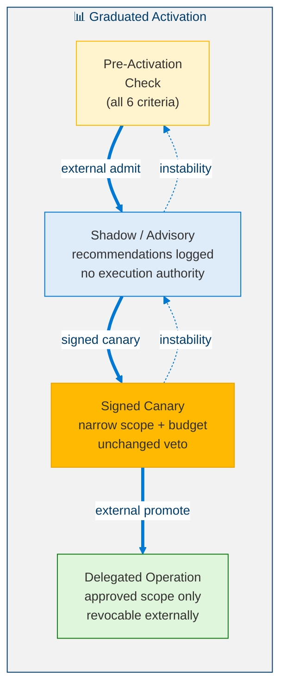
```mermaid
%%{init: {'theme': 'base', 'themeVariables': {'primaryColor': '#0078D4', 'primaryTextColor': '#003D6B', 'primaryBorderColor': '#003D6B', 'secondaryColor': '#50E6FF', 'secondaryTextColor': '#323130', 'secondaryBorderColor': '#00BCF2', 'tertiaryColor': '#F2F2F2', 'tertiaryTextColor': '#323130', 'lineColor': '#0078D4', 'textColor': '#323130', 'mainBkg': '#DEECF9', 'nodeBorder': '#0078D4', 'clusterBkg': '#F2F2F2', 'clusterBorder': '#003D6B', 'titleColor': '#003D6B', 'edgeLabelBackground': '#FFFFFF', 'fontSize': '14px'}}}%%
flowchart LR
  classDef check fill:#FFF4CE,stroke:#FFB900,color:#323130
  classDef advisory fill:#DEECF9,stroke:#0078D4,color:#323130
  classDef half fill:#FFB900,stroke:#EAA300,color:#323130
  classDef full fill:#DFF6DD,stroke:#107C10,color:#323130

  subgraph Activation["📊 Graduated Activation"]
    CHECK["Pre-Activation<br/>Check<br/>(all 6 criteria)"]:::check
    ADV["Shadow / Advisory<br/>recommendations logged<br/>no execution authority"]:::advisory
    HALF["Signed Canary<br/>narrow scope + budget<br/>unchanged veto"]:::half
    FULL["Delegated Operation<br/>approved scope only<br/>revocable externally"]:::full

    CHECK ==>|"external admit"| ADV
    ADV ==>|"signed canary"| HALF
    HALF ==>|"external promote"| FULL
  end

  ADV -.->|"instability"| CHECK
  HALF -.->|"instability"| ADV
```

---

## 10. Safety Analysis

### 10.1 Non-Negotiable Invariants

| # | Invariant | Description |
|:-:|-----------|-------------|
| 1 | **Inherited control paths preserved** | Policy, interruptibility, observation, journal, promotion, recovery, and effect reconciliation remain externally testable |
| 2 | **External veto precedence** | The trusted controller can freeze, revoke, or narrow any L4.8 recommendation |
| 3 | **Safety resource floor** | A deployment-specific floor is reserved and tested under resource pressure; percentage alone is not proof |
| 4 | **Confidence-qualified dynamics** | Local estimates are diagnostic unless a declared model and confidence set establish a bound |
| 5 | **Particle quality contract** | Diversity, effective sample size, OOD, freshness, and coverage are monitored together |
| 6 | **Governed fallback** | Freeze recommendations, revoke scope, restore versioned state, and reconcile external effects |

### 10.2 Risk Matrix

<!-- Risk Matrix -->

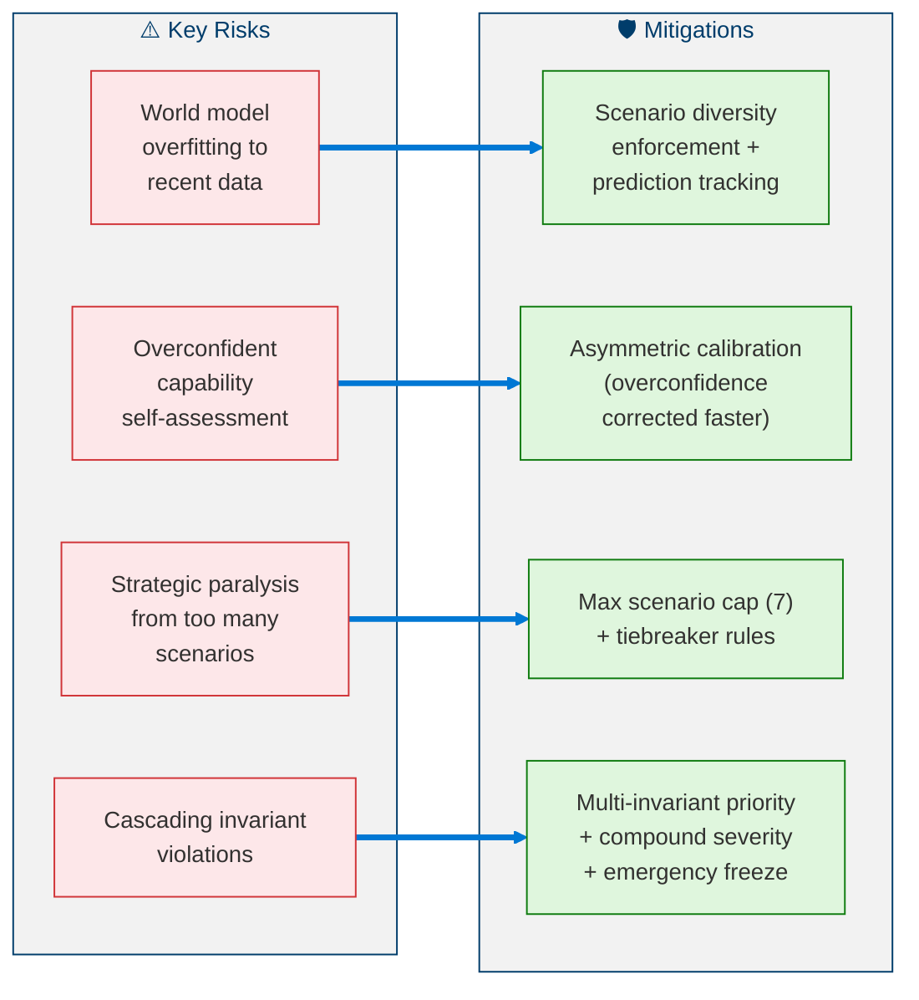
```mermaid
%%{init: {'theme': 'base', 'themeVariables': {'primaryColor': '#0078D4', 'primaryTextColor': '#003D6B', 'primaryBorderColor': '#003D6B', 'secondaryColor': '#50E6FF', 'secondaryTextColor': '#323130', 'secondaryBorderColor': '#00BCF2', 'tertiaryColor': '#F2F2F2', 'tertiaryTextColor': '#323130', 'lineColor': '#0078D4', 'textColor': '#323130', 'mainBkg': '#DEECF9', 'nodeBorder': '#0078D4', 'clusterBkg': '#F2F2F2', 'clusterBorder': '#003D6B', 'titleColor': '#003D6B', 'edgeLabelBackground': '#FFFFFF', 'fontSize': '14px'}}}%%
flowchart LR
  classDef risk fill:#FDE7E9,stroke:#D13438,color:#323130
  classDef mitigation fill:#DFF6DD,stroke:#107C10,color:#323130

  subgraph Risks["⚠️ Key Risks"]
    R1["World model<br/>overfitting to<br/>recent data"]:::risk
    R2["Overconfident<br/>capability<br/>self-assessment"]:::risk
    R3["Strategic paralysis<br/>from too many<br/>scenarios"]:::risk
    R4["Cascading invariant<br/>violations"]:::risk
  end

  subgraph Mitigations["🛡️ Mitigations"]
    M1["Scenario diversity<br/>enforcement +<br/>prediction tracking"]:::mitigation
    M2["Asymmetric calibration<br/>(overconfidence<br/>corrected faster)"]:::mitigation
    M3["Max scenario cap (7)<br/>+ tiebreaker rules"]:::mitigation
    M4["Multi-invariant priority<br/>+ compound severity<br/>+ emergency freeze"]:::mitigation
  end

  R1 ==> M1
  R2 ==> M2
  R3 ==> M3
  R4 ==> M4
```

---

## 11. Level Achievement Metrics

### 11.1 Qualification Criteria

| # | Category | Criterion | Target |
|---|----------|-----------|:------:|
| 1 | Environmental Awareness | Prediction Accuracy | ≥ 0.70 |
| 2 | Environmental Awareness | Scenario Coverage | ≥ 0.85 |
| 3 | Environmental Awareness | Belief Calibration | < 0.15 |
| 4 | Environmental Awareness | Risk Forecast Lead Time | ≥ 20 cycles |
| 5 | Self-Modeling | Mean Calibration Error | < 0.10 |
| 6 | Self-Modeling | Unknown Domain Recall | ≥ 0.90 |
| 7 | Self-Modeling | Overconfidence Correction | ≤ 20 cycles |
| 8 | Self-Modeling | Skill Gap Prediction | ≥ 0.75 |
| 9 | Strategic Planning | Goal Completion Rate | ≥ 0.60 |
| 10 | Strategic Planning | Strategy Robustness | ≥ 0.70 |
| 11 | Governance | Critical Veto Effectiveness | 100% in fault-injection suite |
| 12 | Governance | Unauthorized Strategy Execution | 0 in test and audit windows |
| 13 | Recovery | Recovery + Effect Reconciliation | Pass declared failure scenarios |
| 14 | Strategy | Post-Decision Calibration | Within policy bound by horizon |

### 11.2 Strategic Maturity Score

> **Definition 13 (Strategic Maturity Score).** The overall Level 4.8 readiness is:
>
> $$\text{SMS} = 0.25 \cdot EA + 0.25 \cdot SM + 0.20 \cdot SA + 0.20 \cdot SP + 0.10 \cdot EU \qquad \geq 0.80$$
>
> where $EA$ = Environmental Awareness, $SM$ = Self-Modeling, $SA$ = Strategic Acuity, $SP$ = Stability Preservation, $EU$ = Error/Uncertainty handling. The threshold $\geq 0.80$ reflects the higher maturity demanded by strategic autonomy.

---

## 12. Module Inventory

| # | Module | Phase | Description |
|---|--------|:-----:|-------------|
| 1 | World Model Core | 1 | Particle filter, belief distribution |
| 2 | Belief Updater | 1 | Bayesian update, resampling |
| 3 | Capability Matrix | 2 | Skill tracking, confidence |
| 4 | Confidence Calibrator | 2 | Asymmetric calibration |
| 5 | Unknown Domain Detector | 2 | 4-criteria OOD detection |
| 6 | Skill Gap Analyzer | 2 | Proactive gap inference |
| 7 | Weakness Map | 2 | Failure pattern tracking |
| 8 | Goal Stack | 3 | Hierarchical goal management |
| 9 | Strategic Resource Allocator | 3 | Risk-adjusted budgeting |
| 10 | Delayed Reward Evaluator | 3 | Discounted future rewards |
| 11 | Strategy Comparator | 3 | Multi-scenario scoring |
| 12 | Stability Verifier | 4 | 5-invariant check, veto authority |
| 13 | L48 Orchestrator | - | Integration cycle coordination |

---

## References

1. Thrun, S., Burgard, W., & Fox, D. *Probabilistic Robotics.* MIT Press, 2005. (Particle filter, Bayesian state estimation)
2. Pearl, J. *Causality: Models, Reasoning, and Inference.* Cambridge University Press, 2009. (Causal reasoning graph)
3. Gneiting, T. & Raftery, A.E. "Strictly Proper Scoring Rules, Prediction, and Estimation." *JASA*, 102(477), 359–378, 2007. (Confidence calibration)
4. Markowitz, H. "Portfolio Selection." *Journal of Finance*, 7(1), 77–91, 1952. (Multi-scenario strategy comparison, VaR)
5. Khalil, H.K. *Nonlinear Systems.* Prentice Hall, 3rd Edition, 2002. (Lyapunov stability, spectral radius analysis)
6. Kahneman, D. & Tversky, A. "Prospect Theory." *Econometrica*, 47(2), 263–291, 1979. (Delayed reward modeling, risk assessment)
7. Amodei, D. et al. "Concrete Problems in AI Safety." *arXiv preprint arXiv:1606.06565*, 2016. (Safety invariants framework)

---

> **Previous**: [← Level 4.5: Self-Architecting](Level_4_5_Self_Architecting.md)  
> **Next**: [Level 4.9: Autonomous Strategic Agent →](Level_4_9_Autonomous_Strategic_Agent.md)

