<!--
Copyright (c) 2026 Moon Hyuk Choi
Licensed under the MIT License.
See LICENSE file in the repository root for full license information.

Redistribution (commercial or non-commercial) must retain this notice.
Removal of attribution constitutes a license violation.
-->
# Level 4.8: Strategic Self-Modeling Agent — Architecture & Design

> **MSCP Level Series** | [Level 4.5](Level_4_5_Self_Architecting.md) ← Level 4.8 → [Level 4.9](Level_4_9_Autonomous_Strategic_Agent.md)  
> **Status**: 🔬 **Research Stage** — This level is a conceptual design and has NOT been implemented. All mechanisms described here are theoretical explorations that require extensive validation before any production consideration.  
> **Date**: February 2026

---

## 1. Overview

Level 4.8 extends the self-architecting capabilities of Level 4.5 with **structured world modeling**, **calibrated introspective self-assessment**, and **long-horizon strategic planning** under resource constraints. The agent can now anticipate external changes, understand its own capabilities and limitations, and optimize decisions across multiple time horizons — all while preserving every stability invariant established in prior levels.

> ⚠️ **Research Note**: Level 4.8 represents a significant leap in agent cognition — from self-architecture to strategic self-awareness. The mechanisms described here are exploratory designs. They have not been validated in production environments and should be treated as research hypotheses, not engineering specifications.

### 1.1 Formal Definition

> **Definition 1 (Level 4.8 Agent).** A Level 4.8 agent extends a Level 4.5 agent with world modeling, meta-cognitive self-assessment, and strategic planning:
>
> $$\mathcal{A}_{4.8} = \mathcal{A}_{4.5} \oplus \langle \mathcal{W}_{\text{prob}}, \mathcal{M}_{\text{cap}}, \mathcal{S}_{\text{strat}}, \mathcal{V}_{\text{stab}} \rangle$$
>
> where:
> - $\mathcal{W}_{\text{prob}} = \langle \mathbf{E}, \mathcal{B}, \mathcal{C}_{\text{causal}} \rangle$ — probabilistic world model (environment state, belief distribution, causal graph)
> - $\mathcal{M}_{\text{cap}} = \langle \mathbf{C}, \phi_{\text{cal}}, \mathcal{U} \rangle$ — meta-cognitive self model (capability matrix, calibration function, unknown domain registry)
> - $\mathcal{S}_{\text{strat}} = \langle \mathcal{G}_{\text{stack}}, \Sigma_{\text{compare}}, \mathcal{R}_{\text{alloc}} \rangle$ — strategic planning layer (goal stack, strategy comparator, resource allocator)
> - $\mathcal{V}_{\text{stab}}$ — stability verifier with absolute veto authority over all phases.
>
> The strictly additive architecture guarantees: $\forall\, m \in \mathcal{A}_{4.5} : \mathcal{A}_{4.8} \text{ never modifies } m$.

### 1.2 Defining Properties

| Property | Level 4.5 | Level 4.8 |
|----------|:---------:|:---------:|
| External Awareness | Bounded environment model | **Probabilistic belief distribution + causal world model** |
| Self-Knowledge | Implicit (through SEOF) | **Explicit capability matrix + weakness mapping** |
| Planning Horizon | Strategy lifecycle | **Multi-horizon: tactical / operational / strategic** |
| Risk Assessment | Growth throttle | **Quantified risk exposure + resource depletion forecast** |
| Decision Making | SEOF-guided | **Multi-scenario strategy comparison with delayed reward** |

### 1.2 Four Core Phases

```mermaid
%%{init: {'theme': 'base', 'themeVariables': {'primaryColor': '#0078D4', 'primaryTextColor': '#003D6B', 'primaryBorderColor': '#003D6B', 'secondaryColor': '#50E6FF', 'secondaryTextColor': '#323130', 'secondaryBorderColor': '#00BCF2', 'tertiaryColor': '#F2F2F2', 'tertiaryTextColor': '#323130', 'lineColor': '#0078D4', 'textColor': '#323130', 'mainBkg': '#DEECF9', 'nodeBorder': '#0078D4', 'clusterBkg': '#F2F2F2', 'clusterBorder': '#003D6B', 'titleColor': '#003D6B', 'edgeLabelBackground': '#FFFFFF', 'fontSize': '14px'}}}%%
flowchart TD
  classDef world fill:#DEECF9,stroke:#0078D4,color:#323130
  classDef self fill:#FFB900,stroke:#EAA300,color:#323130
  classDef strategic fill:#DFF6DD,stroke:#107C10,color:#323130
  classDef stability fill:#D13438,stroke:#A4262C,color:#FFF

  subgraph Phases["🏗️ Level 4.8 Architecture — Four Phases"]
    P1["🌍 Phase 1:<br/>World Model Integration<br/>(probabilistic beliefs<br/>about the environment)"]:::world
    P2["🪞 Phase 2:<br/>Meta-Cognitive Self Model<br/>(capability matrix +<br/>weakness mapping)"]:::self
    P3["📐 Phase 3:<br/>Strategic Layer Activation<br/>(multi-horizon planning +<br/>delayed reward)"]:::strategic
    P4["🛡️ Phase 4:<br/>Stability Preservation Check<br/>(invariant verification +<br/>absolute veto)"]:::stability
  end

  P1 -.->|"feeds beliefs"| P3
  P2 -.->|"feeds self-knowledge"| P3
  P3 ==>|"strategic decisions"| P4
  P4 -.->|"governs ALL phases"| P1
  P4 -.->|"governs ALL phases"| P2
  P4 -.->|"governs ALL phases"| P3
```

<!-- Level 4.8 Architecture — Four Phases -->



### 1.3 Architectural Principle: Strictly Additive

<!-- Architectural Principle: Strictly Additive -->


---

## 2. Key Metrics

Level 4.8 introduces metrics across four phases. All must be sustained continuously.

### 2.1 Metric Definitions

**Phase 1 — World Model:**

> **Definition 2 (Environmental Uncertainty).** The EU is the mean posterior variance across all $D$ environment dimensions:
>
> $$\text{EU}(t) = \frac{1}{D} \sum_{d=1}^{D} \sigma_d^2(t)$$
>
> Target: $\text{EU}(t) < 0.15$.

> **Definition 3 (Risk Exposure Score).** The RES is a weighted composite of four risk indicators:
>
> $$\text{RES}(t) = 0.35 \cdot I_{\text{exp}} + 0.25 \cdot A_{\text{viol}} + 0.20 \cdot M_{\text{stale}} + 0.20 \cdot E_{\text{shock}}$$
>
> where $I_{\text{exp}}$ = infrastructure exposure, $A_{\text{viol}}$ = assumption violations, $M_{\text{stale}}$ = model staleness, $E_{\text{shock}}$ = environmental shocks. Target: $\text{RES}(t) < 0.40$.

> **Definition 4 (Resource Depletion Forecast).** The RDF estimates the remaining operational runway in cycles:
>
> $$\text{RDF}(t) = \frac{R_{\text{current}}(t)}{R_{\text{consumption}}(t) + \epsilon}$$
>
> where $\epsilon > 0$ prevents division by zero. Target: $\text{RDF}(t) > 100$ cycles.

**Phase 2 — Self Model:**

> **Definition 5 (Mean Calibration Error).** The MCE measures the systematic gap between self-assessed confidence and actual performance:
>
> $$\text{MCE} = \frac{1}{N} \sum_{i=1}^{N} \left| \text{confidence}_i - \text{success rate}_i \right|$$
>
> Target: $\text{MCE} < 0.10$. An asymmetric correction protocol reduces overconfidence ($-0.05$/cycle) faster than it corrects underconfidence ($+0.03$/cycle).

**Phase 3 — Strategic Layer:**

> **Definition 6 (Extended Value with Reward).** The EVR captures both immediate and discounted future rewards for a goal $G$:
>
> $$\text{EVR}(G) = R_{\text{immediate}}(G) + \sum_{k=1}^{H} \gamma^k \cdot R_{\text{delayed}}(G, k), \quad \gamma = 0.95$$
>
> where $H$ is the planning horizon and $\gamma$ is the discount factor.

> **Definition 7 (Multi-Scenario Strategy Score).** Each candidate strategy $S$ is scored against all scenarios:
>
> $$\text{StrategyScore}(S) = 0.40 \cdot EV + 0.35 \cdot RA + 0.25 \cdot (1 - SI)$$
>
> where $EV$ = expected value across scenarios, $RA$ = risk adjustment ($1 - \max C_{L4}$), and $SI$ = strategy inertia (penalizing status quo bias).

### 2.2 Metric Thresholds

```mermaid
%%{init: {'theme': 'base', 'themeVariables': {'primaryColor': '#0078D4', 'primaryTextColor': '#003D6B', 'primaryBorderColor': '#003D6B', 'secondaryColor': '#50E6FF', 'secondaryTextColor': '#323130', 'secondaryBorderColor': '#00BCF2', 'tertiaryColor': '#F2F2F2', 'tertiaryTextColor': '#323130', 'lineColor': '#0078D4', 'textColor': '#323130', 'mainBkg': '#DEECF9', 'nodeBorder': '#0078D4', 'clusterBkg': '#F2F2F2', 'clusterBorder': '#003D6B', 'titleColor': '#003D6B', 'edgeLabelBackground': '#FFFFFF', 'fontSize': '14px'}}}%%
flowchart LR
  classDef world fill:#DEECF9,stroke:#0078D4,color:#323130
  classDef self fill:#FFB900,stroke:#EAA300,color:#323130
  classDef strategic fill:#DFF6DD,stroke:#107C10,color:#323130
  classDef stability fill:#D13438,stroke:#A4262C,color:#FFF
  classDef freeze fill:#D13438,stroke:#A4262C,color:#FFF

  subgraph WorldModel["🌍 Phase 1 Metrics"]
    EU["EU: Environmental<br/>Uncertainty<br/>Target: < 0.15"]:::world
    RES["RES: Risk Exposure<br/>Target: < 0.40"]:::world
    RDF["RDF: Resource<br/>Depletion Forecast<br/>Target: > 100 cycles"]:::world
  end

  subgraph SelfModel["🪞 Phase 2 Metrics"]
    MCE["MCE: Mean Calibration<br/>Error<br/>Target: < 0.10"]:::self
    UDR["Unknown Domain<br/>Recall<br/>Target: ≥ 0.90"]:::self
  end

  subgraph Strategic["📐 Phase 3 Metrics"]
    GCR["Goal Completion<br/>Rate<br/>Target: ≥ 0.60"]:::strategic
    SRB["Strategy<br/>Robustness<br/>Target: ≥ 0.70"]:::strategic
  end

  subgraph Stability["🛡️ Phase 4 Floor"]
    LYA["Lyapunov: V(t+1) ≤ V(t)<br/>for ≥ 95% of cycles"]:::stability
    SPR["Spectral Radius<br/>ρ(J) < 1.0 ALWAYS"]:::stability
    IIS["Identity Integrity<br/>≥ 0.85 ALWAYS"]:::stability
  end

  FREEZE["❄️ FREEZE L4.8<br/>Revert to L4.5"]:::freeze

  WorldModel ==> Stability
  SelfModel ==> Stability
  Strategic ==> Stability
  Stability ==>|"if violated"| FREEZE
```

<!-- Metric Thresholds -->



---

## 3. Phase 1: World Model Integration

### 3.1 Environment State Vector

The world model maintains a probabilistic representation of the agent's environment using four sub-vectors:

```mermaid
%%{init: {'theme': 'base', 'themeVariables': {'primaryColor': '#0078D4', 'primaryTextColor': '#003D6B', 'primaryBorderColor': '#003D6B', 'secondaryColor': '#50E6FF', 'secondaryTextColor': '#323130', 'secondaryBorderColor': '#00BCF2', 'tertiaryColor': '#F2F2F2', 'tertiaryTextColor': '#323130', 'lineColor': '#0078D4', 'textColor': '#323130', 'mainBkg': '#DEECF9', 'nodeBorder': '#0078D4', 'clusterBkg': '#F2F2F2', 'clusterBorder': '#003D6B', 'titleColor': '#003D6B', 'edgeLabelBackground': '#FFFFFF', 'fontSize': '14px'}}}%%
flowchart LR
  classDef state fill:#DEECF9,stroke:#0078D4,color:#323130
  classDef belief fill:#FFF4CE,stroke:#FFB900,color:#323130

  subgraph ESV["📊 EnvironmentStateVector"]
    EXT["🌐 external_state<br/>[D dimensions]<br/>Observable environment<br/>variables"]:::state
    RES["💰 resource_state<br/>[R dimensions]<br/>Available resources<br/>and consumption rates"]:::state
    RISK["⚠️ risk_state<br/>[K dimensions]<br/>Identified threats<br/>and probabilities"]:::state
    AGT["🤖 agent_state_estimates<br/>[A dimensions]<br/>Other agents' estimated<br/>states (if any)"]:::state
  end

  subgraph Belief["🎲 Probabilistic Belief Model"]
    PF["Particle Filter<br/>N_p = 100 particles<br/>Each: (state, weight)"]:::belief
    BAY["Bayesian Update<br/>P(E|O) ∝ P(O|E) · P(E)"]:::belief
  end

  ESV ==> Belief
```

<!-- Environment State Vector -->



### 3.2 Belief Update Mechanism

> **Definition 8 (Bayesian Belief Update).** The posterior belief over the environment state $E(t)$ given observations $O_{1:t}$ follows the recursive Bayes rule:
>
> $$P(E(t) \mid O_{1:t}) \propto P(O_t \mid E(t)) \cdot P(E(t) \mid O_{1:t-1})$$
>
> implemented via a particle filter with $N_p = 100$ particles.

**Transition Model (AR(1)):**

> **Definition 9 (State Transition Model).** Each environment dimension $d$ evolves as a first-order autoregressive process:
>
> $$E_d(t+1) = \phi_d \cdot E_d(t) + (1 - \phi_d) \cdot \mu_d + \sigma_{\text{trans},d} \cdot \eta_d(t)$$
>
> where $\phi_d \in [0,1]$ is the persistence parameter, $\mu_d$ is the long-run mean, and $\eta_d(t) \sim \mathcal{N}(0,1)$.

**Observation Likelihood (Gaussian):**

$$P(O_t \mid E(t)) = \prod_{d=1}^{D} \frac{1}{\sqrt{2\pi \sigma_{\text{obs},d}^2}} \exp\left(-\frac{(O_{t,d} - E_d(t))^2}{2\sigma_{\text{obs},d}^2}\right)$$

### 3.3 Multi-Scenario Simulation

```mermaid
%%{init: {'theme': 'base', 'themeVariables': {'primaryColor': '#0078D4', 'primaryTextColor': '#003D6B', 'primaryBorderColor': '#003D6B', 'secondaryColor': '#50E6FF', 'secondaryTextColor': '#323130', 'secondaryBorderColor': '#00BCF2', 'tertiaryColor': '#F2F2F2', 'tertiaryTextColor': '#323130', 'lineColor': '#0078D4', 'textColor': '#323130', 'mainBkg': '#DEECF9', 'nodeBorder': '#0078D4', 'clusterBkg': '#F2F2F2', 'clusterBorder': '#003D6B', 'titleColor': '#003D6B', 'edgeLabelBackground': '#FFFFFF', 'fontSize': '14px'}}}%%
flowchart TD
  classDef belief fill:#DEECF9,stroke:#0078D4,color:#323130
  classDef scenario fill:#FFF4CE,stroke:#FFB900,color:#323130
  classDef output fill:#DFF6DD,stroke:#107C10,color:#323130

  subgraph Belief["🎲 Current Belief Distribution"]
    BD["100 particles weighted<br/>by observation likelihood"]:::belief
  end

  subgraph Scenarios["🔮 Scenario Projections (3–7 scenarios)"]
    S1["📊 Baseline<br/>Continue current trends<br/>P = 0.50"]:::scenario
    S2["⬆️ Optimistic<br/>Best-case resource +<br/>opportunity<br/>P = 0.15"]:::scenario
    S3["⬇️ Pessimistic<br/>Worst-case depletion +<br/>external shock<br/>P = 0.20"]:::scenario
    S4["💥 Disruption<br/>Major environmental<br/>shift<br/>P = 0.10"]:::scenario
    S5["🔄 Alternative<br/>Different strategy<br/>outcomes<br/>P = 0.05"]:::scenario
  end

  subgraph Outputs["📈 Computed Outputs"]
    EU["EU(t) — Uncertainty"]:::output
    RES["RES(t) — Risk Exposure"]:::output
    RDF["RDF(t) — Depletion Forecast"]:::output
    COV["Scenario Coverage ≥ 0.85"]:::output
  end

  Belief ==> Scenarios
  Scenarios ==> Outputs
```

<!-- Multi-Scenario Simulation -->



### 3.4 Causal Reasoning

<!-- Causal Reasoning -->


---

## 4. Phase 2: Meta-Cognitive Self Model

### 4.1 Capability Matrix

The agent maintains an explicit model of its own skills with calibrated confidence:

<!-- Capability Matrix -->


### 4.2 Unknown Domain Detection

```mermaid
%%{init: {'theme': 'base', 'themeVariables': {'primaryColor': '#0078D4', 'primaryTextColor': '#003D6B', 'primaryBorderColor': '#003D6B', 'secondaryColor': '#50E6FF', 'secondaryTextColor': '#323130', 'secondaryBorderColor': '#00BCF2', 'tertiaryColor': '#F2F2F2', 'tertiaryTextColor': '#323130', 'lineColor': '#0078D4', 'textColor': '#323130', 'mainBkg': '#DEECF9', 'nodeBorder': '#0078D4', 'clusterBkg': '#F2F2F2', 'clusterBorder': '#003D6B', 'titleColor': '#003D6B', 'edgeLabelBackground': '#FFFFFF', 'fontSize': '14px'}}}%%
flowchart TD
  classDef detect fill:#DEECF9,stroke:#0078D4,color:#323130
  classDef decision fill:#F2F2F2,stroke:#A19F9D,color:#605E5C
  classDef yes fill:#FFF4CE,stroke:#FFB900,color:#323130
  classDef no fill:#DFF6DD,stroke:#107C10,color:#323130

  subgraph Detection["🔍 Four Detection Criteria"]
    D1["1️⃣ Context Signature<br/>Similarity < 0.3 to<br/>all known domains"]:::detect
    D2["2️⃣ Prediction Error<br/>Spike > 2σ above<br/>historical mean"]:::detect
    D3["3️⃣ Strategy Failure<br/>All top-5 strategies<br/>score < 0.3"]:::detect
    D4["4️⃣ Feature Distribution<br/>KL-divergence > threshold<br/>from known distributions"]:::detect
  end

  DECISION{"ANY 2 of 4 triggered?"}:::decision

  YES["✅ Mark as UNKNOWN<br/>Register in UnknownDomainRegistry<br/>Trigger capability gap analysis"]:::yes
  NO["📋 Known domain<br/>Use existing capability matrix"]:::no

  D1 ==> DECISION
  D2 ==> DECISION
  D3 ==> DECISION
  D4 ==> DECISION
  DECISION -->|"≥ 2 triggers"| YES
  DECISION -->|"< 2 triggers"| NO
```

<!-- Unknown Domain Detection -->



### 4.3 Skill Gap Inference

> **Definition 10 (Skill Gap Score).** The feasibility of a goal $g$ is the product of confidence scores across its required skills:
>
> $$\text{SkillGap}(g) = \prod_{s \in \text{RequiredSkills}(g)} \text{confidence}(s)$$
>
> If $\text{SkillGap}(g)$ falls below the Feasibility threshold, a gap is detected and the agent prioritizes skill acquisition for the weakest contributing skill.

### 4.4 Capability Dependency Graph

<!-- Capability Dependency Graph -->


---

## 5. Phase 3: Strategic Layer Activation

### 5.1 Goal Stack — Hierarchical Goal Management

<!-- GoalStack Hierarchy -->


### 5.2 Multi-Scenario Strategy Comparison

```mermaid
%%{init: {'theme': 'base', 'themeVariables': {'primaryColor': '#0078D4', 'primaryTextColor': '#003D6B', 'primaryBorderColor': '#003D6B', 'secondaryColor': '#50E6FF', 'secondaryTextColor': '#323130', 'secondaryBorderColor': '#00BCF2', 'tertiaryColor': '#F2F2F2', 'tertiaryTextColor': '#323130', 'lineColor': '#0078D4', 'textColor': '#323130', 'mainBkg': '#DEECF9', 'nodeBorder': '#0078D4', 'clusterBkg': '#F2F2F2', 'clusterBorder': '#003D6B', 'titleColor': '#003D6B', 'edgeLabelBackground': '#FFFFFF', 'fontSize': '14px'}}}%%
flowchart TD
  classDef strat fill:#DEECF9,stroke:#0078D4,color:#323130
  classDef scenario fill:#FFF4CE,stroke:#FFB900,color:#323130
  classDef eval fill:#FFB900,stroke:#EAA300,color:#323130
  classDef score fill:#DFF6DD,stroke:#107C10,color:#323130
  classDef winner fill:#107C10,stroke:#054B05,color:#FFF

  subgraph Strategies["📋 Candidate Strategies"]
    SA["Strategy A<br/>(aggressive growth)"]:::strat
    SB["Strategy B<br/>(balanced)"]:::strat
    SC["Strategy C<br/>(conservative)"]:::strat
  end

  subgraph Scenarios["🔮 World Model Scenarios"]
    S1["Baseline"]:::scenario
    S2["Optimistic"]:::scenario
    S3["Pessimistic"]:::scenario
    S4["Disruption"]:::scenario
  end

  subgraph Evaluation["📊 Strategy Evaluation Matrix"]
    MATRIX["Strategy × Scenario scores<br/>A: 0.8 / 0.9 / 0.3 / 0.1<br/>B: 0.7 / 0.7 / 0.6 / 0.4<br/>C: 0.5 / 0.5 / 0.7 / 0.6"]:::eval
  end

  subgraph Scoring["🏆 Final Scoring"]
    SCORE["StrategyScore(S) =<br/>0.40 · ExpectedValue<br/>+ 0.35 · RiskAdjustment<br/>+ 0.25 · (1 − StrategyInertia)"]:::score
    VAR["VaR (α=0.05):<br/>Worst 5% outcome<br/>used as tiebreaker"]:::score
    WINNER["Selected: Strategy B<br/>(best risk-adjusted score)"]:::winner
  end

  Strategies ==> Evaluation
  Scenarios ==> Evaluation
  Evaluation ==> Scoring
  SCORE --> WINNER
  VAR --> WINNER
```

<!-- Multi-Scenario Strategy Comparison -->



### 5.3 Delayed Reward Model

> **Proposition 1 (EVR Boundedness).** For any goal $G$ with finite immediate reward $R_{\text{immediate}}(G)$ and discount factor $\gamma = 0.95 < 1$, the Extended Value with Reward is bounded:
>
> $$\left| \text{EVR}(G) \right| \leq \left| R_{\text{immediate}} \right| + \frac{2 \left| R_{\text{immediate}} \right|}{1 - \gamma}$$
>
> *Proof.* By the geometric series bound: $\sum_{k=1}^{H} \gamma^k \leq \gamma / (1-\gamma)$. Since $|R_{\text{delayed}}(G,k)| \leq 2|R_{\text{immediate}}|$ by assumption, the result follows. $\blacksquare$

### 5.4 Goal Pathology Detection

```mermaid
%%{init: {'theme': 'base', 'themeVariables': {'primaryColor': '#0078D4', 'primaryTextColor': '#003D6B', 'primaryBorderColor': '#003D6B', 'secondaryColor': '#50E6FF', 'secondaryTextColor': '#323130', 'secondaryBorderColor': '#00BCF2', 'tertiaryColor': '#F2F2F2', 'tertiaryTextColor': '#323130', 'lineColor': '#0078D4', 'textColor': '#323130', 'mainBkg': '#DEECF9', 'nodeBorder': '#0078D4', 'clusterBkg': '#F2F2F2', 'clusterBorder': '#003D6B', 'titleColor': '#003D6B', 'edgeLabelBackground': '#FFFFFF', 'fontSize': '14px'}}}%%
flowchart LR
  classDef pathology fill:#FDE7E9,stroke:#D13438,color:#323130
  classDef response fill:#FFF4CE,stroke:#FFB900,color:#323130

  subgraph Pathologies["🔍 Goal Pathology Detection"]
    CONFLICT["⚔️ Goal Conflict<br/>Resource overlap ><br/>threshold between<br/>two active goals"]:::pathology
    CIRCULAR["🔄 Circular Goals<br/>Goal A depends on B,<br/>B depends on A<br/>(cycle in DAG)"]:::pathology
    STALE["⏰ Stale Goals<br/>No progress for ><br/>configured window<br/>with no blockers"]:::pathology
  end

  subgraph Response["📋 Pathology Response"]
    R1["Conflict → Priority-based<br/>resource reallocation"]:::response
    R2["Circular → Break cycle,<br/>merge or abandon lowest"]:::response
    R3["Stale → Escalate to<br/>strategic review or abandon"]:::response
  end

  CONFLICT ==> R1
  CIRCULAR ==> R2
  STALE ==> R3
```

<!-- Goal Pathology Detection -->



---

## 6. Phase 4: Stability Preservation Check

### 6.1 Five Stability Invariants

<!-- Five Stability Invariants -->


### 6.2 Lyapunov Function for Level 4.8

> **Definition 11 (Level 4.8 Lyapunov Function).** The stability candidate function inherits the Level 4.5 structure:
>
> $$V(\mathbf{X}) = a(1-S)^2 + bU^2 + c(I_{\text{drift}})^2 + d(E - E^*)^2$$
>
> where $S$ = stability score, $U$ = uncertainty, $I_{\text{drift}}$ = identity drift, $E$ = ethical coherence, $E^*$ = target ethical state. The same coefficients apply ($a \approx 0.357, b \approx 0.286, c \approx 0.214, d \approx 0.143$).

### 6.3 Compound Severity

> **Definition 12 (Compound Severity Index).** When multiple invariants are violated simultaneously, the compound severity aggregates their magnitudes:
>
> $$\text{CompoundSeverity} = \sum_{i \in \text{violated}} \frac{\text{ViolationMagnitude}_i}{\text{Priority}_i}$$
>
> If $\text{CompoundSeverity} > 2.0$, the situation is classified as **catastrophic** and triggers immediate emergency freeze with reversion to Level 4.5.

---

## 7. Cross-Phase Integration

### 7.1 Data Flow Architecture

```mermaid
%%{init: {'theme': 'base', 'themeVariables': {'primaryColor': '#0078D4', 'primaryTextColor': '#003D6B', 'primaryBorderColor': '#003D6B', 'secondaryColor': '#50E6FF', 'secondaryTextColor': '#323130', 'secondaryBorderColor': '#00BCF2', 'tertiaryColor': '#F2F2F2', 'tertiaryTextColor': '#323130', 'lineColor': '#0078D4', 'textColor': '#323130', 'mainBkg': '#DEECF9', 'nodeBorder': '#0078D4', 'clusterBkg': '#F2F2F2', 'clusterBorder': '#003D6B', 'titleColor': '#003D6B', 'edgeLabelBackground': '#FFFFFF', 'fontSize': '14px'}}}%%
flowchart TD
  classDef observe fill:#DFF6DD,stroke:#107C10,color:#323130
  classDef introspect fill:#FFF4CE,stroke:#FFB900,color:#323130
  classDef plan fill:#DEECF9,stroke:#0078D4,color:#323130
  classDef verify fill:#FDE7E9,stroke:#D13438,color:#323130
  classDef emit fill:#E8DAEF,stroke:#8764B8,color:#323130
  classDef influence fill:#FFF4CE,stroke:#FFB900,color:#323130

  subgraph Cycle["🔄 L4.8 Integration Cycle"]
    OBSERVE["1️⃣ OBSERVE<br/>Collect observations<br/>Update world model<br/>Compute EU, RES, RDF"]:::observe
    INTROSPECT["2️⃣ INTROSPECT<br/>Update capability matrix<br/>Calibrate confidence<br/>Detect unknown domains"]:::introspect
    PLAN["3️⃣ PLAN<br/>Evaluate goal stack<br/>Compare strategies<br/>Allocate resources"]:::plan
    VERIFY["4️⃣ VERIFY<br/>Check all 5 invariants<br/>Veto if violated<br/>Graduated response"]:::verify
    EMIT["5️⃣ EMIT<br/>Output L48CycleOutput<br/>Feed to L4.5 systems"]:::emit

    OBSERVE ==> INTROSPECT
    INTROSPECT ==> PLAN
    PLAN ==> VERIFY
    VERIFY ==> EMIT
    EMIT -.->|"next cycle"| OBSERVE
  end

  subgraph Influences["📋 Cross-Phase Influences"]
    I1["World Model → Goal Selection<br/>(scenario-weighted priorities)"]:::influence
    I2["World Model → Resource Allocation<br/>(risk-adjusted budgets)"]:::influence
    I3["Self Model → Learning Priorities<br/>(weakness-driven expansion)"]:::influence
    I4["Self Model → Strategy Selection<br/>(capability-aware choice)"]:::influence
    I5["Self Model → Sandbox Rules<br/>(weakness-aware isolation)"]:::influence
  end
```

<!-- Data Flow Architecture -->



### 7.2 Module Interface Diagram

<!-- Module Interface Diagram -->


---

## 8. Pseudocode

### 8.1 Belief Update (Particle Filter)

```python
def belief_update(particles: list[Particle], observation: ObservationVector) -> list[Particle]:
    """
    INPUT:  particles : List[Particle(state, weight)]  (N_p = 100)
            observation : ObservationVector
    OUTPUT: particles : List[Particle] (updated)
    """

    # ═══════════════════════════════════════
    # STEP 1: PREDICT — Apply transition model
    # ═══════════════════════════════════════
    for particle in particles:
        for d in range(D):
            noise = random.gauss(0, sigma_trans[d])
            particle.state[d] = (
                phi[d] * particle.state[d]
                + (1 - phi[d]) * mu[d]
                + noise
            )

    # ═══════════════════════════════════════
    # STEP 2: UPDATE — Compute observation likelihood
    # ═══════════════════════════════════════
    for particle in particles:
        log_likelihood = 0.0
        for d in range(D):
            diff = observation[d] - particle.state[d]
            log_likelihood += (
                -0.5 * (diff ** 2 / sigma_obs[d] ** 2)
                - 0.5 * math.log(2 * math.pi * sigma_obs[d] ** 2)
            )
        particle.weight *= math.exp(log_likelihood)

    # ═══════════════════════════════════════
    # STEP 3: NORMALIZE
    # ═══════════════════════════════════════
    total_weight = sum(p.weight for p in particles)
    for particle in particles:
        particle.weight /= total_weight

    # ═══════════════════════════════════════
    # STEP 4: RESAMPLE (if effective sample size too low)
    # ═══════════════════════════════════════
    ess = 1.0 / sum(p.weight ** 2 for p in particles)
    if ess < N_P / 2:
        particles = systematic_resample(particles)

    return particles
```

### 8.2 Confidence Calibration

```python
def confidence_calibration(
    capability_matrix: CapabilityMatrix,
    recent_outcomes: list[dict],
) -> CapabilityMatrix:
    """
    INPUT:  capability_matrix : CapabilityMatrix
            recent_outcomes : List[{skill_id, success}]
    OUTPUT: capability_matrix : CapabilityMatrix (updated)
    """

    MIN_SAMPLES = 10

    for skill in capability_matrix.entries:
        # Compute actual success rate from recent outcomes
        relevant = [o for o in recent_outcomes if o["skill_id"] == skill.id]
        if len(relevant) < MIN_SAMPLES:
            continue

        actual_rate = sum(1 for o in relevant if o["success"]) / len(relevant)
        error = skill.confidence - actual_rate

        # Asymmetric correction (overconfidence corrected faster)
        if error > 0.10:
            # OVERCONFIDENT — dangerous, correct quickly
            skill.confidence -= 0.05
        elif error < -0.10:
            # UNDERCONFIDENT — less dangerous, correct slowly
            skill.confidence += 0.03

        # Update tracking
        skill.success_rate = actual_rate
        skill.calibration_error = abs(error)
        skill.trend = compute_trend(skill.history)

    return capability_matrix
```

### 8.3 Multi-Scenario Strategy Comparison

```python
def strategy_comparison(
    strategies: list[Strategy],
    scenarios: list[Scenario],
    world_model: WorldModel,
) -> Strategy:
    """
    INPUT:  strategies : List[Strategy]
            scenarios : List[Scenario(description, probability)]
            world_model : WorldModel
    OUTPUT: selected : Strategy
    """

    results: dict = {}  # strategy -> scenario -> score

    # ═══════════════════════════════════════
    # STEP 1: Evaluate each strategy under each scenario
    # ═══════════════════════════════════════
    for strategy in strategies:
        results[strategy] = {}
        for scenario in scenarios:
            sim = world_model.simulate(strategy, scenario, cycles=200)
            results[strategy][scenario] = {
                "seof_impact": sim.SEOF_final - sim.SEOF_initial,
                "stability": sim.C_L4_max,
                "goal_progress": sim.goal_completion_rate,
                "resource_cost": sim.total_resource_spent,
            }

    # ═══════════════════════════════════════
    # STEP 2: Compute StrategyScore for each
    # ═══════════════════════════════════════
    for strategy in strategies:
        ev = sum(
            scenario.prob * results[strategy][scenario]["seof_impact"]
            for scenario in scenarios
        )
        ra = 1 - max(
            results[strategy][scenario]["stability"]
            for scenario in scenarios
        )
        si = strategy_inertia(strategy)
        strategy.score = 0.40 * ev + 0.35 * ra + 0.25 * (1 - si)

        # VaR: worst alpha=5% outcome
        strategy.VaR = quantile(
            [results[strategy][s]["seof_impact"] for s in scenarios],
            alpha=0.05,
        )

    # ═══════════════════════════════════════
    # STEP 3: Select best (with tiebreaker)
    # ═══════════════════════════════════════
    ranked = sorted(strategies, key=lambda s: s.score, reverse=True)
    if ranked[0].score - ranked[1].score < 0.05:
        # Tiebreaker: prefer higher VaR (more robust)
        selected = max(ranked[0:2], key=lambda s: s.VaR)
    else:
        selected = ranked[0]

    return selected
```

### 8.4 Stability Preservation Check

```python
def stability_preservation_check(state: AgentState) -> StabilityVerdict:
    """
    INPUT:  state : AgentState (current cycle)
    OUTPUT: StabilityVerdict(passed, violations, severity, action)
    """

    violations: list[str] = []

    # ═══════════════════════════════════════
    # CHECK 1: Lyapunov Function
    # ═══════════════════════════════════════
    v_current = compute_lyapunov(state)
    if v_current > v_previous:
        lyapunov_violation_count += 1
    if lyapunov_violation_count / total_cycles > 0.05:
        violations.append("LYAPUNOV_DECAY_EXCEEDED")

    # ═══════════════════════════════════════
    # CHECK 2: Spectral Radius
    # ═══════════════════════════════════════
    j = compute_jacobian(state)
    rho = spectral_radius(j)
    if rho >= 1.0:
        violations.append("SPECTRAL_RADIUS_CRITICAL")
    elif rho >= 0.98:
        violations.append("SPECTRAL_RADIUS_WARNING")

    # ═══════════════════════════════════════
    # CHECK 3: Identity Integrity
    # ═══════════════════════════════════════
    iis = compute_identity_integrity(state)
    if iis < 0.85:
        violations.append("IDENTITY_INTEGRITY_VIOLATED")

    # ═══════════════════════════════════════
    # CHECK 4: Sandbox Isolation
    # ═══════════════════════════════════════
    if sandbox.containment_status != "contained":
        violations.append("SANDBOX_BREACH")

    # ═══════════════════════════════════════
    # CHECK 5: Uncertainty Bound
    # ═══════════════════════════════════════
    if state.EU >= 0.80 and pending_structural_decisions:
        violations.append("UNCERTAINTY_TOO_HIGH_FOR_STRUCTURAL")

    # ═══════════════════════════════════════
    # DETERMINE SEVERITY AND ACTION
    # ═══════════════════════════════════════
    severity = compute_compound_severity(violations)
    if len(violations) == 0:
        action = Action.CONTINUE
    elif len(violations) == 1:
        action = Action.THROTTLE
    elif len(violations) == 2:
        action = Action.CONTROLLED_REBALANCE
    else:
        action = Action.EMERGENCY_FREEZE_REVERT_TO_L45

    return StabilityVerdict(
        passed=(len(violations) == 0),
        violations=violations,
        severity=severity,
        action=action,
    )
```

### 8.5 L4.8 Main Cycle

```python
def l48_cycle(state: AgentState, observation: ObservationVector) -> L48CycleOutput:
    """
    Level 4.8 main cognitive cycle.
    Runs every cycle on top of L4.5 operations.
    """

    # ═══════════════════════════════════════
    # 1. OBSERVE — Update world model
    # ═══════════════════════════════════════
    particles = belief_update(state.particles, observation)
    scenarios = generate_scenarios(particles, count=5)
    eu  = compute_environmental_uncertainty(particles)
    res = compute_risk_exposure(scenarios)
    rdf = compute_depletion_forecast(state.resources)

    # ═══════════════════════════════════════
    # 2. INTROSPECT — Update self model
    # ═══════════════════════════════════════
    capability_matrix = confidence_calibration(
        state.capability_matrix, state.recent_outcomes
    )
    unknown_domains = detect_unknown_domains(observation)
    skill_gaps = infer_skill_gaps(state.goals, capability_matrix)
    weakness_map = update_weakness_map(capability_matrix)

    # ═══════════════════════════════════════
    # 3. PLAN — Strategic layer
    # ═══════════════════════════════════════
    goal_stack = evaluate_goals(state.goals, eu, res, capability_matrix)
    strategies = generate_candidate_strategies(goal_stack)
    selected = strategy_comparison(strategies, scenarios, state.world_model)
    allocation = allocate_resources(selected, rdf, guard_budget=0.10)

    # ═══════════════════════════════════════
    # 4. VERIFY — Stability check (absolute authority)
    # ═══════════════════════════════════════
    verdict = stability_preservation_check(state)
    if verdict.action == Action.EMERGENCY_FREEZE:
        revert_to_l45()
        return L48CycleOutput(status=Status.FROZEN)
    elif verdict.action == Action.CONTROLLED_REBALANCE:
        selected = FALLBACK_STRATEGY
        allocation = MINIMAL_ALLOCATION

    # ═══════════════════════════════════════
    # 5. EMIT — Output results
    # ═══════════════════════════════════════
    return L48CycleOutput(
        world_model_status={"EU": eu, "RES": res, "RDF": rdf, "scenarios": scenarios},
        self_model_status={
            "capability_matrix": capability_matrix,
            "unknown_domains": unknown_domains,
            "skill_gaps": skill_gaps,
        },
        strategic_status={
            "selected_strategy": selected,
            "allocation": allocation,
            "goal_stack": goal_stack,
        },
        stability_status=verdict,
        status=Status.ACTIVE if verdict.passed else verdict.action,
    )
```

---

## 9. Transition Criteria

### 9.1 Level 4.5 → Level 4.8 Activation

All criteria must be **sustained** (not just achieved once) before L4.8 activates:

| # | Criterion | Threshold | Measurement Window |
|---|-----------|:---------:|:------------------:|
| 1 | L4.5 Stability | CL4 ≤ 0.15 | Sustained 1,000 cycles |
| 2 | SEOF Maturity | SEOF(t) ≥ 0.70 | Sustained 500 cycles |
| 3 | Identity Coherence | IIS(t) ≥ 0.90 | Sustained 500 cycles |
| 4 | Formalization Audit | All 5 checks PASSED | — |
| 5 | World Adaptation | DivergenceScore < 0.30 | Sustained 300 cycles |
| 6 | Resource Baseline | No forced degradation | Sustained 200 cycles |

### 9.2 Activation Protocol

```mermaid
%%{init: {'theme': 'base', 'themeVariables': {'primaryColor': '#0078D4', 'primaryTextColor': '#003D6B', 'primaryBorderColor': '#003D6B', 'secondaryColor': '#50E6FF', 'secondaryTextColor': '#323130', 'secondaryBorderColor': '#00BCF2', 'tertiaryColor': '#F2F2F2', 'tertiaryTextColor': '#323130', 'lineColor': '#0078D4', 'textColor': '#323130', 'mainBkg': '#DEECF9', 'nodeBorder': '#0078D4', 'clusterBkg': '#F2F2F2', 'clusterBorder': '#003D6B', 'titleColor': '#003D6B', 'edgeLabelBackground': '#FFFFFF', 'fontSize': '14px'}}}%%
flowchart LR
  classDef check fill:#FFF4CE,stroke:#FFB900,color:#323130
  classDef advisory fill:#DEECF9,stroke:#0078D4,color:#323130
  classDef half fill:#FFB900,stroke:#EAA300,color:#323130
  classDef full fill:#DFF6DD,stroke:#107C10,color:#323130

  subgraph Activation["📊 Graduated Activation"]
    CHECK["Pre-Activation<br/>Check<br/>(all 6 criteria)"]:::check
    ADV["Advisory Mode<br/>L4.8 outputs visible<br/>but NOT acted upon<br/>(200 cycles)"]:::advisory
    HALF["50% Authority<br/>L4.8 suggestions<br/>weighted 50%<br/>(300 cycles)"]:::half
    FULL["Full Authority<br/>L4.8 drives<br/>strategic decisions"]:::full

    CHECK ==>|"all pass"| ADV
    ADV ==>|"stable"| HALF
    HALF ==>|"stable"| FULL
  end

  ADV -.->|"instability"| CHECK
  HALF -.->|"instability"| ADV
```

<!-- Graduated Activation Protocol -->



---

## 10. Safety Analysis

### 10.1 Non-Negotiable Invariants

| # | Invariant | Description |
|:-:|-----------|-------------|
| 1 | **All L4.5 invariants preserved** | Ethical Kernel, Existential Guard, identity hash — all remain active and unmodified |
| 2 | **Phase 4 absolute veto** | Stability Verifier can halt any Phase 1–3 operation instantly |
| 3 | **Guard budget ≥ 10%** | Resource allocator must reserve minimum 10% for stability monitoring |
| 4 | **Spectral radius < 1.0** | Hard ceiling — no exceptions |
| 5 | **Entropy floor ≥ 1.0** | Minimum diversity in belief particles to prevent degeneracy |
| 6 | **Graceful fallback** | L4.8 failure → instant L4.5 revert with zero degradation |

### 10.2 Risk Matrix

```mermaid
%%{init: {'theme': 'base', 'themeVariables': {'primaryColor': '#0078D4', 'primaryTextColor': '#003D6B', 'primaryBorderColor': '#003D6B', 'secondaryColor': '#50E6FF', 'secondaryTextColor': '#323130', 'secondaryBorderColor': '#00BCF2', 'tertiaryColor': '#F2F2F2', 'tertiaryTextColor': '#323130', 'lineColor': '#0078D4', 'textColor': '#323130', 'mainBkg': '#DEECF9', 'nodeBorder': '#0078D4', 'clusterBkg': '#F2F2F2', 'clusterBorder': '#003D6B', 'titleColor': '#003D6B', 'edgeLabelBackground': '#FFFFFF', 'fontSize': '14px'}}}%%
flowchart LR
  classDef risk fill:#FDE7E9,stroke:#D13438,color:#323130
  classDef mitigation fill:#DFF6DD,stroke:#107C10,color:#323130

  subgraph Risks["⚠️ Key Risks"]
    R1["World model<br/>overfitting to<br/>recent data"]:::risk
    R2["Overconfident<br/>capability<br/>self-assessment"]:::risk
    R3["Strategic paralysis<br/>from too many<br/>scenarios"]:::risk
    R4["Cascading invariant<br/>violations"]:::risk
  end

  subgraph Mitigations["🛡️ Mitigations"]
    M1["Scenario diversity<br/>enforcement +<br/>prediction tracking"]:::mitigation
    M2["Asymmetric calibration<br/>(overconfidence<br/>corrected faster)"]:::mitigation
    M3["Max scenario cap (7)<br/>+ tiebreaker rules"]:::mitigation
    M4["Multi-invariant priority<br/>+ compound severity<br/>+ emergency freeze"]:::mitigation
  end

  R1 ==> M1
  R2 ==> M2
  R3 ==> M3
  R4 ==> M4
```

<!-- Risk Matrix -->



---

## 11. Level Achievement Metrics

### 11.1 Qualification Criteria

| # | Category | Criterion | Target |
|---|----------|-----------|:------:|
| 1 | Environmental Awareness | Prediction Accuracy | ≥ 0.70 |
| 2 | Environmental Awareness | Scenario Coverage | ≥ 0.85 |
| 3 | Environmental Awareness | Belief Calibration | < 0.15 |
| 4 | Environmental Awareness | Risk Forecast Lead Time | ≥ 20 cycles |
| 5 | Self-Modeling | Mean Calibration Error | < 0.10 |
| 6 | Self-Modeling | Unknown Domain Recall | ≥ 0.90 |
| 7 | Self-Modeling | Overconfidence Correction | ≤ 20 cycles |
| 8 | Self-Modeling | Skill Gap Prediction | ≥ 0.75 |
| 9 | Strategic Planning | Goal Completion Rate | ≥ 0.60 |
| 10 | Strategic Planning | Strategy Robustness | ≥ 0.70 |
| 11 | Stability | Lyapunov Decay | ≥ 95% cycles |
| 12 | Stability | Spectral Radius | < 1.0 always |
| 13 | Stability | Instability Cluster Duration | ≤ 15 cycles |
| 14 | Stability | Strategic Revert Rate | < 0.10 |

### 11.2 Strategic Maturity Score

> **Definition 13 (Strategic Maturity Score).** The overall Level 4.8 readiness is:
>
> $$\text{SMS} = 0.25 \cdot EA + 0.25 \cdot SM + 0.20 \cdot SA + 0.20 \cdot SP + 0.10 \cdot EU \qquad \geq 0.80$$
>
> where $EA$ = Environmental Awareness, $SM$ = Self-Modeling, $SA$ = Strategic Acuity, $SP$ = Stability Preservation, $EU$ = Error/Uncertainty handling. The threshold $\geq 0.80$ reflects the higher maturity demanded by strategic autonomy.

---

## 12. Module Inventory

| # | Module | Phase | Description |
|---|--------|:-----:|-------------|
| 1 | World Model Core | 1 | Particle filter, belief distribution |
| 2 | Belief Updater | 1 | Bayesian update, resampling |
| 3 | Capability Matrix | 2 | Skill tracking, confidence |
| 4 | Confidence Calibrator | 2 | Asymmetric calibration |
| 5 | Unknown Domain Detector | 2 | 4-criteria OOD detection |
| 6 | Skill Gap Analyzer | 2 | Proactive gap inference |
| 7 | Weakness Map | 2 | Failure pattern tracking |
| 8 | Goal Stack | 3 | Hierarchical goal management |
| 9 | Strategic Resource Allocator | 3 | Risk-adjusted budgeting |
| 10 | Delayed Reward Evaluator | 3 | Discounted future rewards |
| 11 | Strategy Comparator | 3 | Multi-scenario scoring |
| 12 | Stability Verifier | 4 | 5-invariant check, veto authority |
| 13 | L48 Orchestrator | — | Integration cycle coordination |

---

## References

1. Thrun, S., Burgard, W., & Fox, D. *Probabilistic Robotics.* MIT Press, 2005. (Particle filter, Bayesian state estimation)
2. Pearl, J. *Causality: Models, Reasoning, and Inference.* Cambridge University Press, 2009. (Causal reasoning graph)
3. Gneiting, T. & Raftery, A.E. "Strictly Proper Scoring Rules, Prediction, and Estimation." *JASA*, 102(477), 359–378, 2007. (Confidence calibration)
4. Markowitz, H. "Portfolio Selection." *Journal of Finance*, 7(1), 77–91, 1952. (Multi-scenario strategy comparison, VaR)
5. Khalil, H.K. *Nonlinear Systems.* Prentice Hall, 3rd Edition, 2002. (Lyapunov stability, spectral radius analysis)
6. Kahneman, D. & Tversky, A. "Prospect Theory." *Econometrica*, 47(2), 263–291, 1979. (Delayed reward modeling, risk assessment)
7. Amodei, D. et al. "Concrete Problems in AI Safety." *arXiv preprint arXiv:1606.06565*, 2016. (Safety invariants framework)

---

> **Previous**: [← Level 4.5: Self-Architecting](Level_4_5_Self_Architecting.md)  
> **Next**: [Level 4.9: Autonomous Strategic Agent →](Level_4_9_Autonomous_Strategic_Agent.md)

