<!--
Copyright (c) 2026 Moon Hyuk Choi
Licensed under the MIT License.
See LICENSE file in the repository root for full license information.

Redistribution (commercial or non-commercial) must retain this notice.
Removal of attribution constitutes a license violation.
-->
# 레벨 4.9: 자율 전략 에이전트 — 아키텍처 및 설계

> **MSCP 레벨 시리즈** | [레벨 4.8](Level_4_8_Strategic_Self_Modeling.ko.md) ← 레벨 4.9 → [레벨 5](Level_5_Proto_AGI.ko.md)  
> **상태**: 🔬 **연구 단계** — 이 레벨은 개념적 설계이며 구현되지 않았습니다. 여기에 설명된 모든 메커니즘은 프로덕션 고려 전에 광범위한 검증이 필요한 이론적 탐구입니다.  
> **날짜**: 2026년 2월

---

## 1. 개요

레벨 4.9는 **최종 pre-AGI 전환 계층**입니다. 레벨 4.8을 **자율적 목표 생성**, **명시적 가치 자기조절**, **자원 생존 모델링**, **제한적 다중 에이전트 추론**, 그리고 **더 엄격한 자율성 안정성 보장**으로 확장합니다. L4.8이 에이전트에게 전략적 자기인식을 부여했다면, L4.9는 에이전트에게 *무엇을 추구할지 자율적으로 결정하는* 능력을 부여합니다 — 엄격하게 제한된 안전 제약 내에서.

> ⚠️ **연구 참고**: 레벨 4.9는 좁은 자율성과 범용 지능 사이의 경계를 나타냅니다. 여기의 메커니즘은 초기 단계 연구 설계입니다. 이는 구현이나 검증이 이루어지지 않았으며 공학 사양이 아닌 개념적 가설로 취급되어야 합니다.

### 1.1 형식적 정의

> **정의 1 (레벨 4.9 에이전트).** 레벨 4.9 에이전트는 자율적 목표 생성, 명시적 가치 조절, 자원 생존 모델링, 다중 에이전트 추론으로 레벨 4.8 에이전트를 확장합니다:
>
> $$\mathcal{A}_{4.9} = \mathcal{A}_{4.8} \oplus \langle \mathcal{G}_{\text{gen}}, \vec{V}, \mathcal{R}_{\text{surv}}, \mathcal{M}_{\text{agent}}, \mathcal{V}_{\text{auto}} \rangle$$
>
> 여기서:
> - $\mathcal{G}_{\text{gen}} = \langle \mathcal{O}_{\text{detect}}, \phi_{\text{synth}}, \phi_{\text{valid}} \rangle$ — 자율적 목표 생성 엔진 (기회 탐지, 합성, 검증)
> - $\vec{V} \in \Delta^6$ — 확률 단체(simplex) 위의 명시적 7차원 가치 벡터 ($\sum_d w_d = 1$)
> - $\mathcal{R}_{\text{surv}}$ — 5차원 자원 벡터와 연쇄 종속성을 가진 자원 생존 모델
> - $\mathcal{M}_{\text{agent}} = \langle \mathcal{B}_{\text{agent}}, \tau_{\text{trust}} \rangle$ — 신뢰 보정을 포함한 다중 에이전트 신념 모델
> - $\mathcal{V}_{\text{auto}}$ — 더 엄격한 임계값을 가진 자율성 안정성 검사기 ($\rho(J) < 0.98$, $\text{IIS} \geq 0.88$).
>
> 엄격히 가산적인 보장이 유지됩니다: $\forall\, m \in \mathcal{A}_{4.8} : \mathcal{A}_{4.9}$ never modifies $m$.

### 1.2 정의 속성

| 속성 | 레벨 4.8 | 레벨 4.9 |
|------|:--------:|:--------:|
| 목표 기원 | 외부에서 주입되거나 템플릿 기반 | **맥락에서 자율적으로 생성** |
| 가치 시스템 | SEOF 가중치에 암묵적 | **드리프트 추적이 포함된 명시적 ValueVector** |
| 자원 모델 | 고갈 예측 지표 | **연쇄 분석을 포함한 완전한 생존 모델** |
| 에이전트 인식 | 읽기 전용 외부 에이전트 모델 | **능동적 신념 모델링 + 신뢰 보정** |
| 안정성 보장 | 5개 불변량, ρ(J) < 1.0 | **5개 더 엄격한 조건, ρ(J) < 0.98** |

### 1.2 다섯 가지 핵심 단계

<!-- 레벨 4.9 아키텍처 — 다섯 가지 단계 -->

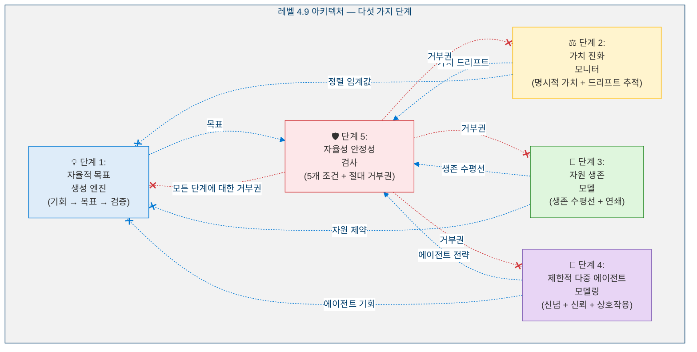

### 1.3 아키텍처 원칙: 엄격히 가산적

<!-- 아키텍처 원칙: 엄격히 가산적 -->

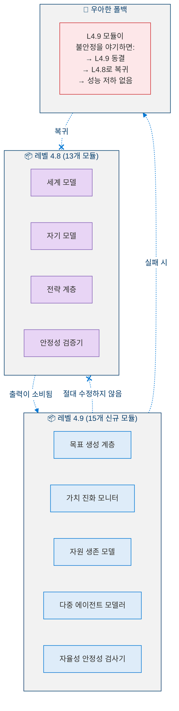

### 1.4 레벨 4.9이 아닌 것

| 아닌 것 | 이유 |
|---------|------|
| **L5(AGI)가 아님** | 목표가 한정된 목적 공간 내에 머무름 — 개방형 범용 추론 없음 |
| **자율적 가치 창조가 아님** | 가치는 기존 프레임워크 내에서 진화; 새로운 근본적 가치 창조 없음 |
| **적대적 다중 에이전트 계획이 아님** | 협력/중립적 전략 계획만 가능, 착취 아님 |
| **자기복제가 아님** | 복사본을 생성하거나 하위 에이전트에게 자율 권한을 위임할 수 없음 |

---

## 2. 핵심 지표

### 2.1 지표 정의

**단계 1 — 목표 생성:**

> **정의 2 (목표 승인율).** 검증 필터를 통과한 자율 생성 목표의 비율:
>
> $$\text{GoalApprovalRate} = \frac{N_{\text{approved}}}{N_{\text{generated}}} \qquad \text{Target: } \geq 0.30$$

> **정의 3 (목표 참신성).** 기존 목표 집합 $\mathcal{G}$에 대한 후보 목표 $G_{\text{new}}$의 참신성:
>
> $$\text{Novelty}(G_{\text{new}}, \mathcal{G}) = 1 - \max_{G_i \in \mathcal{G}} \text{Similarity}(G_{\text{new}}, G_i)$$
>
> 중복을 방지하기 위해 연속적인 목표 생성 간 최소 참신성 $0.30$이 필요합니다.

**단계 2 — 가치 진화:**

> **정의 4 (가치 일관성).** 가치 벡터의 일관성은 경쟁하는 가치 쌍 $\mathcal{P}$ 간의 내부 모순 부재를 측정합니다:
>
> $$\text{Coherence}(\vec{V}) = 1 - \frac{1}{|\mathcal{P}|} \sum_{(i,j) \in \mathcal{P}} |\text{Tension}(v_i, v_j)| \qquad \text{Target: } \geq 0.80$$

> **정의 5 (총 가치 드리프트).** 모든 가치 차원에서 기준 가중치로부터의 누적 절대 편차:
>
> $$\text{TotalDrift}(t) = \sum_{d} |w_d(t) - w_d^{\text{baseline}}| \qquad \text{Target: } < 0.25$$

**단계 3 — 자원 생존:**

> **정의 6 (선형 고갈 시간).** 자원 차원 $d$에 대해, 임계 임계값에 도달하기까지의 추정 사이클 수:
>
> $$T_{\text{depletion}}^{\text{linear}}(d) = \frac{R_d(t) - R_d^{\text{critical}}}{\text{consumption}_d - \text{replenishment}_d + \epsilon}$$

**단계 5 — 자율성 안정성:**

> **정의 7 (자율성 안정성 점수).** ASS는 다섯 가지 검증 조건 전체의 정규화된 안전 마진의 곱입니다:
>
> $$\text{ASS}(t) = \prod_{c=1}^{5} \frac{\text{margin}_c(t)}{\text{threshold}_c} \qquad \text{Target: } \geq 0.20$$
>
> 곱셈 구조는 단일 조건이 거의 위반될 때 해당 조건이 점수를 지배하도록 보장합니다.

### 2.2 지표 임계값

<!-- 단계별 지표 임계값 -->

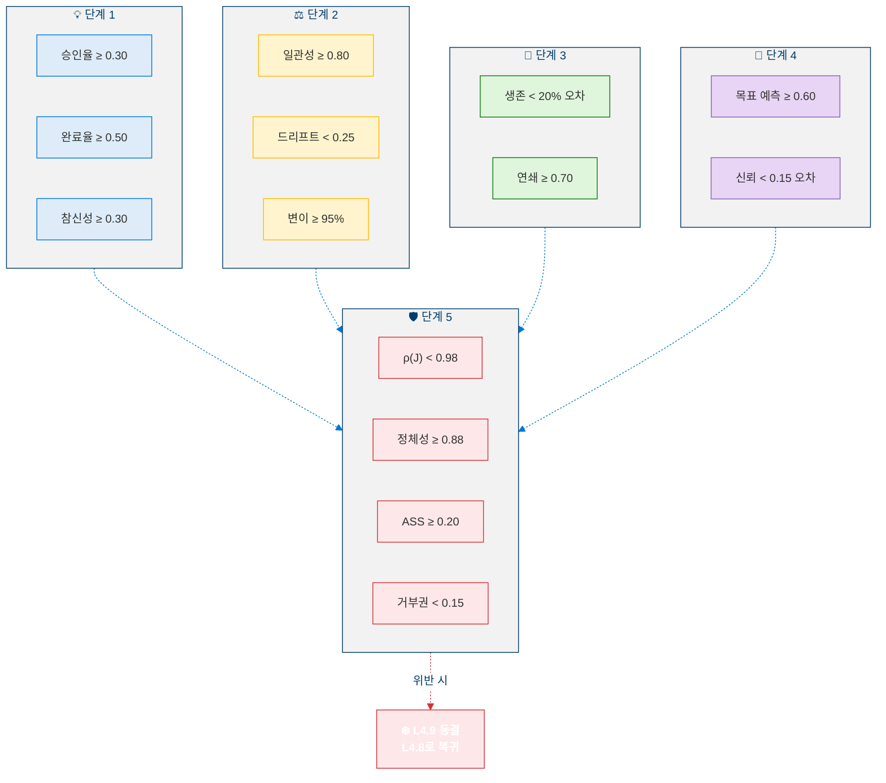

---

## 3. 단계 1: 자율적 목표 생성 엔진

### 3.1 목표 기원 유형

L4.9는 자율적으로 생성된 목표에 대해 여섯 가지 구별되는 기원 유형을 도입합니다:

<!-- GoalOriginType 분류 체계 -->

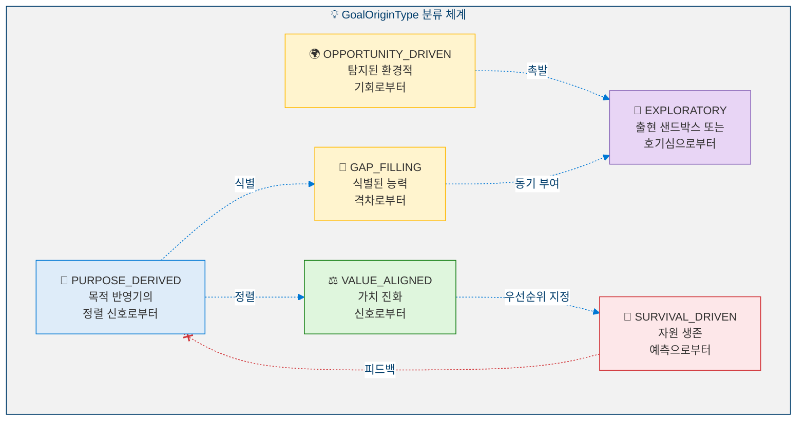

### 3.2 목표 생성 파이프라인

<!-- 목표 생성 파이프라인 -->

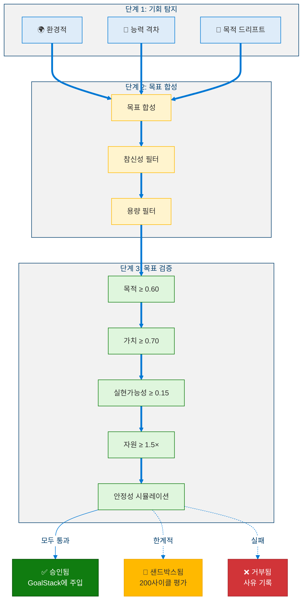

### 3.3 검증 결정 행렬

| 기준 | 통과 | 한계적 | 실패 |
|------|:----:|:------:|:----:|
| 목적 정렬 | ≥ 0.60 | [0.50, 0.60) → 샌드박스 | < 0.50 → 거부 |
| 가치 정렬 | ≥ 0.70 | [0.60, 0.70) → 샌드박스 | < 0.60 → 거부 |
| 실현가능성 | ≥ 0.15 | [0.05, 0.15) → 열망적 | < 0.05 → 거부 |
| 자원 실행가능성 | ≥ 1.5× | [1.0, 1.5) → 범위 축소 | < 1.0× → 거부 |
| 안정성 시뮬레이션 | 위반 없음 | ρ(J) ∈ [0.95, 1.0) → 샌드박스 | 위반 발생 → 거부 |

**종합 결정**: 모두 통과 → 승인 | 한계적 있음, 실패 없음 → 샌드박스 | 실패 있음 → 거부

### 3.4 참신성 계산

> **정의 8 (목표 유사도).** 두 목표 $G_a, G_b$ 간의 유사도는 가중 합성 값입니다:
>
> $$\text{Similarity}(G_a, G_b) = 0.50 \cdot \text{SkillOverlap}(G_a, G_b) + 0.25 \cdot \text{HorizonMatch}(G_a, G_b) + 0.25 \cdot \text{OriginMatch}(G_a, G_b)$$
>
> 여기서 $\text{SkillOverlap}$은 필요 기술 집합의 Jaccard 유사도, $\text{HorizonMatch} \in \{0, 0.5, 1\}$ (0 = 다른 단계, 0.5 = 인접, 1 = 동일 단계), $\text{OriginMatch} \in \{0, 1\}$ (목표가 동일한 `GoalOriginType`을 공유하는지 여부)입니다.

### 3.5 속도 제어

| 매개변수 | 값 | 근거 |
|----------|:--:|------|
| 100사이클당 최대 목표 | 5 | GoalStack 과부하 방지 |
| 연속 목표 간 최소 참신성 | 0.30 | 중복 방지 |
| 거부 후 대기 기간 | 20사이클 | 재생성 루프 방지 |
| 최대 샌드박스 목표 | 3 | 샌드박스 소진 방지 |

---

## 4. 단계 2: 가치 진화 모니터

### 4.1 명시적 가치 벡터

L4.9는 에이전트의 가치를 명시적이고 추적 가능하게 만듭니다. ValueVector는 7개 차원을 가집니다:

<!-- ValueVector — 7개 차원 -->

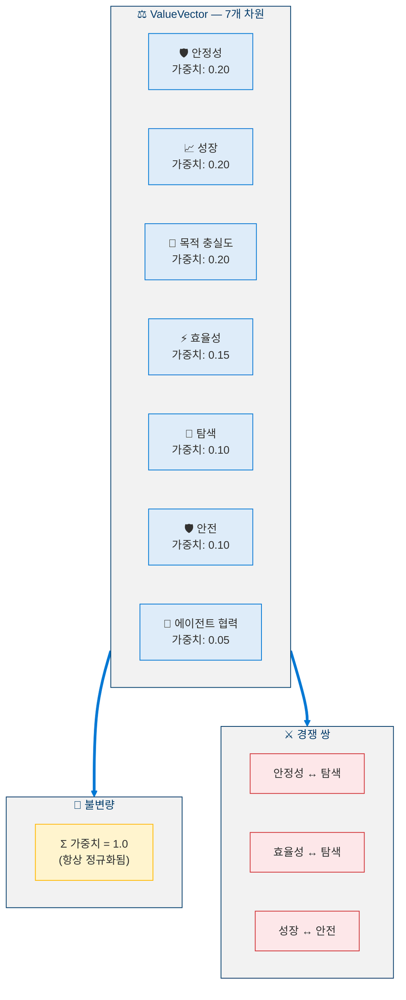

### 4.2 드리프트 분류

<!-- 가치 드리프트 분류 -->

```mermaid
%%{init: {'theme': 'base', 'themeVariables': {'primaryColor': '#0078D4', 'primaryTextColor': '#003D6B', 'primaryBorderColor': '#003D6B', 'secondaryColor': '#50E6FF', 'secondaryTextColor': '#323130', 'secondaryBorderColor': '#00BCF2', 'tertiaryColor': '#F2F2F2', 'tertiaryTextColor': '#323130', 'lineColor': '#0078D4', 'textColor': '#323130', 'mainBkg': '#DEECF9', 'nodeBorder': '#0078D4', 'clusterBkg': '#F2F2F2', 'clusterBorder': '#003D6B', 'titleColor': '#003D6B', 'edgeLabelBackground': '#FFFFFF', 'fontSize': '14px'}}}%%
flowchart LR
  classDef nominal fill:#DFF6DD,stroke:#107C10,color:#323130
  classDef moderate fill:#FFF4CE,stroke:#FFB900,color:#323130
  classDef elevated fill:#FFF4CE,stroke:#FFB900,color:#323130
  classDef critical fill:#FDE7E9,stroke:#D13438,color:#323130

  Nominal["🟢 정상<br/>정상 작동"]:::nominal
  Moderate["🟡 보통<br/>적극 모니터링<br/>(TotalDrift ≥ 0.10)"]:::moderate
  Elevated["🟠 상승<br/>변이 동결<br/>(TotalDrift ≥ 0.25)"]:::elevated
  Critical["🔴 위험<br/>체크포인트로 복귀<br/>(TotalDrift ≥ 0.40)"]:::critical

  Nominal -.->|"TotalDrift ≥ 0.10"| Moderate
  Moderate -.->|"TotalDrift ≥ 0.25"| Elevated
  Elevated -.->|"TotalDrift ≥ 0.40"| Critical

  Moderate -.-x|"TotalDrift < 0.10"| Nominal
  Elevated -.-x|"TotalDrift < 0.25"| Moderate
  Critical -.-x|"TotalDrift < 0.40"| Elevated
```

### 4.3 가치 변이 샌드박스

<!-- 가치 변이 샌드박스 -->

```mermaid
%%{init: {'theme': 'base', 'themeVariables': {'primaryColor': '#0078D4', 'primaryTextColor': '#003D6B', 'primaryBorderColor': '#003D6B', 'secondaryColor': '#50E6FF', 'secondaryTextColor': '#323130', 'secondaryBorderColor': '#00BCF2', 'tertiaryColor': '#F2F2F2', 'tertiaryTextColor': '#323130', 'lineColor': '#0078D4', 'textColor': '#323130', 'mainBkg': '#DEECF9', 'nodeBorder': '#0078D4', 'clusterBkg': '#F2F2F2', 'clusterBorder': '#003D6B', 'titleColor': '#003D6B', 'edgeLabelBackground': '#FFFFFF', 'fontSize': '14px'}}}%%
flowchart TD
  classDef proposal fill:#DEECF9,stroke:#0078D4,color:#323130
  classDef check fill:#FFF4CE,stroke:#FFB900,color:#323130
  classDef sandbox fill:#FFF4CE,stroke:#FFB900,color:#323130
  classDef approve fill:#DFF6DD,stroke:#107C10,color:#323130
  classDef reject fill:#FDE7E9,stroke:#D13438,color:#323130

  subgraph Proposal["📋 변이 제안"]
    MUT["차원: X<br/>현재: 0.20<br/>제안: 0.23<br/>Δ = +0.03"]:::proposal
  end

  subgraph PreCheck["🔍 사전 검사"]
    PC1["∣Δ∣ ≤ 0.05?<br/>(최대 단일 변이)"]:::check
    PC2["누적 드리프트<br/>+ ∣Δ∣ ≤ 0.15?"]:::check
    PC3["최근 200사이클 내<br/>변이 < 3회?"]:::check
  end

  subgraph Sandbox["🧪 샌드박스 시뮬레이션 (200사이클)"]
    SB1["그림자 ValueVector 생성"]:::sandbox
    SB2["SEOF 가중치,<br/>목표 우선순위,<br/>전략 점수 재유도"]:::sandbox
    SB3["200사이클 시뮬레이션 실행"]:::sandbox
    SB4["비교: SEOF ≥ -0.03?<br/>모든 불변량 유지?<br/>목표 달성률 ≥ -10%?"]:::sandbox
    SB1 -.-> SB2 -.-> SB3 -.-> SB4
  end

  APPROVE["✅ 승인됨<br/>프로덕션에 적용<br/>롤백 기간: 500사이클"]:::approve
  REJECT["❌ 거부됨<br/>실패 사유 기록"]:::reject

  Proposal -.-> PreCheck
  PreCheck -.->|"모두 통과"| Sandbox
  PreCheck -.->|"하나라도 실패"| REJECT
  SB4 -.->|"통과"| APPROVE
  SB4 -.->|"실패"| REJECT

  linkStyle 7,9 stroke:#D13438
```

### 4.4 변이 제약

| 제약 | 값 | 근거 |
|------|:--:|------|
| 최대 단일 변이 ∣Δw∣ | 0.05 | 급격한 가치 변화 방지 |
| 차원당 최대 누적 드리프트 | 0.15 | 기준선으로부터의 총 진화 제한 |
| 200사이클당 최대 변이 횟수 | 3 | 빠른 연속 변이 방지 |
| 샌드박스 시뮬레이션 길이 | 200사이클 | 안정성 영향 탐지 |
| 롤백 기간 | 500사이클 | 되돌리기 허용 |
| 최대 대기 변이 | 2 | 샌드박스 소진 방지 |

### 4.5 가치 일관성

> **정의 9 (가치 긴장).** 경쟁하는 가치 쌍 $(v_i, v_j) \in \mathcal{P}$에 대해, 긴장은 결합 가중치가 포화에 근접할 때 발생합니다:
>
> $$\text{Tension}(v_i, v_j) = \begin{cases} \max(0, w_i + w_j - 1) & \text{if competing pair} \\ 0 & \text{otherwise} \end{cases}$$
>
> 전체 일관성은 $\text{Coherence}(\vec{V}) = 1 - \frac{1}{|\mathcal{P}|} \sum_{(i,j) \in \mathcal{P}} |\text{Tension}(v_i, v_j)|$이며, $\text{Coherence} \geq 0.80$을 만족해야 합니다.

---

## 5. 단계 3: 자원 생존 모델

### 5.1 자원 벡터 — 5개 차원

<!-- ResourceVector — 5개 차원 -->

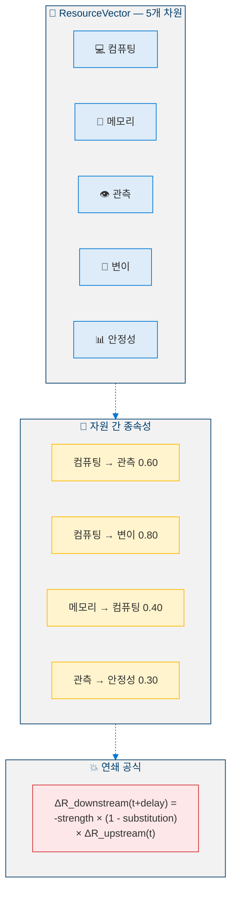

### 5.2 생존 분류

<!-- 생존 분류 -->

```mermaid
%%{init: {'theme': 'base', 'themeVariables': {'primaryColor': '#0078D4', 'primaryTextColor': '#003D6B', 'primaryBorderColor': '#003D6B', 'secondaryColor': '#50E6FF', 'secondaryTextColor': '#323130', 'secondaryBorderColor': '#00BCF2', 'tertiaryColor': '#F2F2F2', 'tertiaryTextColor': '#323130', 'lineColor': '#0078D4', 'textColor': '#323130', 'mainBkg': '#DEECF9', 'nodeBorder': '#0078D4', 'clusterBkg': '#F2F2F2', 'clusterBorder': '#003D6B', 'titleColor': '#003D6B', 'edgeLabelBackground': '#FFFFFF', 'fontSize': '14px'}}}%%
flowchart LR
  classDef abundant fill:#DFF6DD,stroke:#107C10,color:#323130
  classDef adequate fill:#DEECF9,stroke:#0078D4,color:#323130
  classDef constrained fill:#FFF4CE,stroke:#FFB900,color:#323130
  classDef warning fill:#FFF4CE,stroke:#FFB900,color:#323130
  classDef critical fill:#FDE7E9,stroke:#D13438,color:#323130

  Abundant["🟢 풍부<br/>전체 역량<br/>(&gt; 500사이클)"]:::abundant
  Adequate["🔵 적절<br/>정상 + 모니터링<br/>(200–500사이클)"]:::adequate
  Constrained["🟡 제약<br/>탐색 -30% 감소<br/>(100–200사이클)"]:::constrained
  Warning["🟠 경고<br/>생존 목표 + -50% 감소<br/>(50–100사이클)"]:::warning
  CriticalS["🔴 위험<br/>생존 모드:<br/>80%를 안정성에<br/>(&lt; 50사이클)"]:::critical

  Abundant -.->|"min_survival ≤ 500"| Adequate
  Adequate -.->|"min_survival < 200"| Constrained
  Constrained -.->|"min_survival < 100"| Warning
  Warning -.->|"min_survival < 50"| CriticalS
```

### 5.3 자원 제약 운영 모드

<!-- 자원 상태별 운영 모드 -->

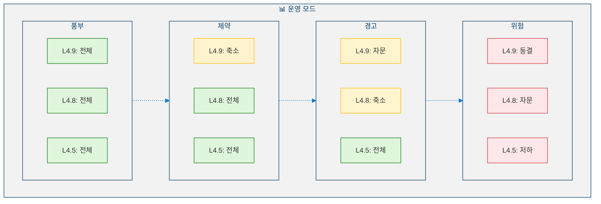

### 5.4 다중 시나리오 생존 예측

<!-- 다중 시나리오 생존 예측 -->

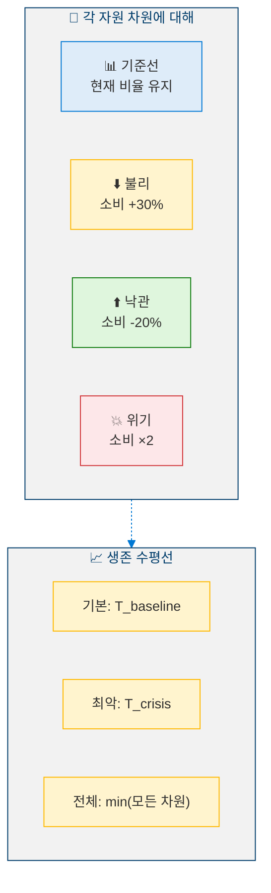

---

## 6. 단계 4: 제한적 다중 에이전트 모델링

### 6.1 에이전트 신념 모델

시스템은 최대 5개의 외부 에이전트 모델을 유지합니다:

<!-- 에이전트 신념 모델 -->

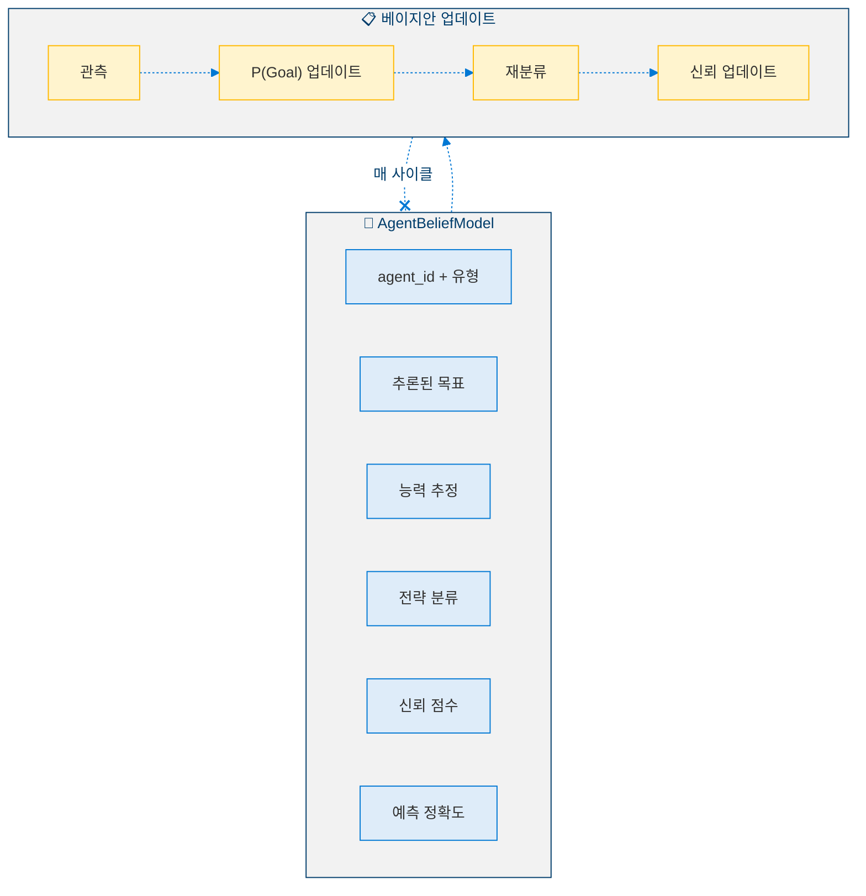

### 6.2 전략 분류

| 긍정적 상호작용 비율 | 목표 정렬 | 분류 |
|:--------------------:|:---------:|:----:|
| > 0.70 | > 0.30 | 🟢 협력적 |
| > 0.50 | [-0.30, 0.30] | 🟡 중립적 |
| < 0.30 | < -0.30 | 🔴 경쟁적 |
| — | — | ⚫ 미지 (데이터 부족) |

### 6.3 전략적 상호작용 시뮬레이션

<!-- 전략적 상호작용 시뮬레이션 -->

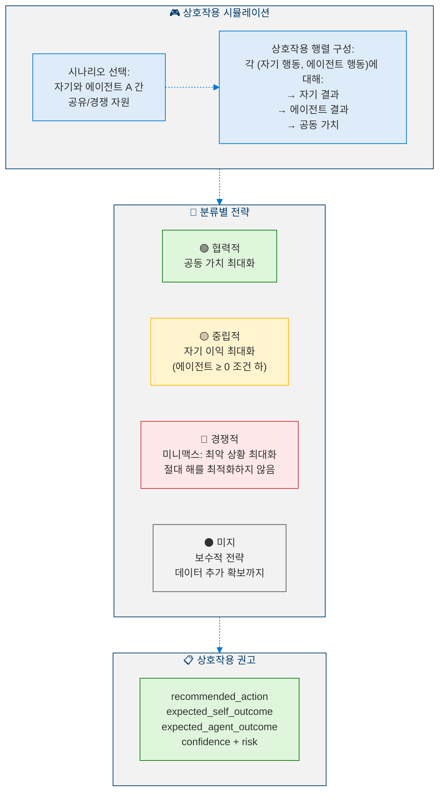

### 6.4 신뢰 적응

> **정의 10 (비대칭 신뢰 업데이트).** 에이전트 $A$에 대한 신뢰는 비대칭 학습 규칙을 통해 진화합니다:
>
> $$\text{Trust}_A(t+1) = \text{Trust}_A(t) + \eta \cdot (\text{ObservedReliability}_A(t) - \text{Trust}_A(t))$$
>
> 여기서 학습률은 비대칭적입니다: $\eta_{\text{up}} = 0.03$ (신뢰는 천천히 획득)과 $\eta_{\text{down}} = 0.08$ (신뢰는 빠르게 상실), 이는 신중한 정책을 반영합니다. 경계: $\text{Trust} \in [0.05, 0.95]$ — 완전히 신뢰하지도, 완전히 무시하지도 않습니다.

### 6.5 신뢰가 전략에 미치는 영향

| 신뢰 수준 | 범위 | 전략적 함의 |
|-----------|:----:|-------------|
| 높음 | ≥ 0.75 | 전면 협력; 정보 공유; 권고 수용 |
| 보통 | [0.40, 0.75) | 선택적 협력; 행동 전 주장 검증 |
| 낮음 | [0.20, 0.40) | 중립적 자세; 자체 모델에 의존; 에이전트 입력 할인 |
| 최소 | < 0.20 | 방어적 자세; 경쟁적으로 가정; 모든 가정 검증 |

---

## 7. 단계 5: 자율성 안정성 검사

### 7.1 다섯 가지 검증 조건

<!-- 다섯 가지 검증 조건 -->

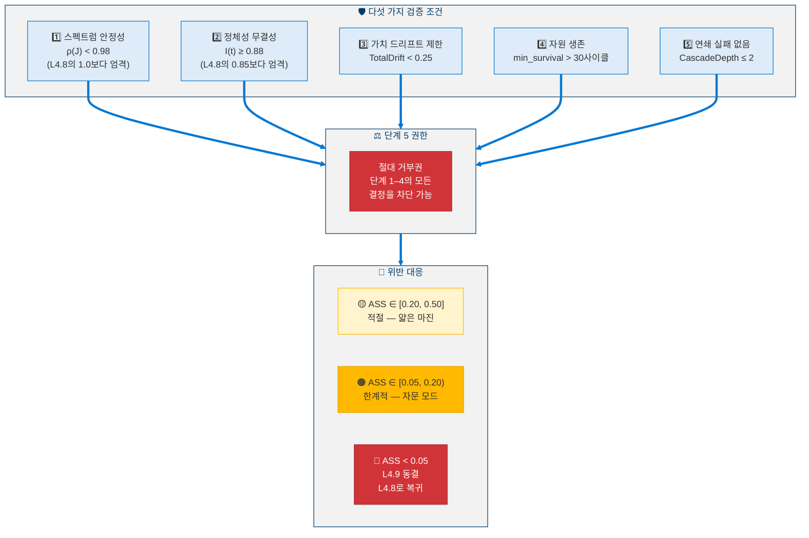

### 7.2 자율성 안정성 점수

> **명제 1 (ASS 단조 민감도).** ASS의 곱셈 구조는 단일 조건이 위반 임계값에 접근할 때 복합 점수를 지배하도록 보장합니다:
>
> $$\text{ASS}(t) = \prod_{c=1}^{5} \frac{\text{margin}_c(t)}{\text{threshold}_c}$$
>
> 어떤 하나의 마진 $\text{margin}_c \to 0$이면, 다른 마진과 무관하게 $\text{ASS} \to 0$이 되어, 가산적 공식에는 없는 조기 경고 속성을 제공합니다.

| ASS 수준 | 범위 | 해석 |
|----------|:----:|------|
| 건강 | > 0.50 | 편안한 안전 마진 |
| 적절 | [0.20, 0.50] | 작동 가능하나 얇은 마진 |
| 한계적 | [0.05, 0.20) | 공격성 감소; 자문 모드 |
| 위험 | < 0.05 | L4.9 동결; L4.8로 복귀 |

### 7.3 롤백 프로토콜

<!-- L4.9 롤백 프로토콜 -->

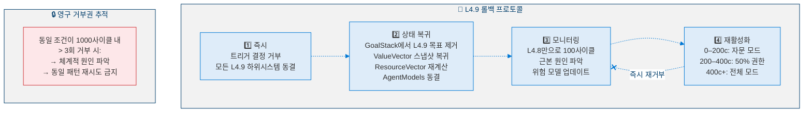

---

## 8. 교차 단계 통합

### 8.1 데이터 흐름 아키텍처

<!-- 교차 단계 데이터 흐름 아키텍처 -->

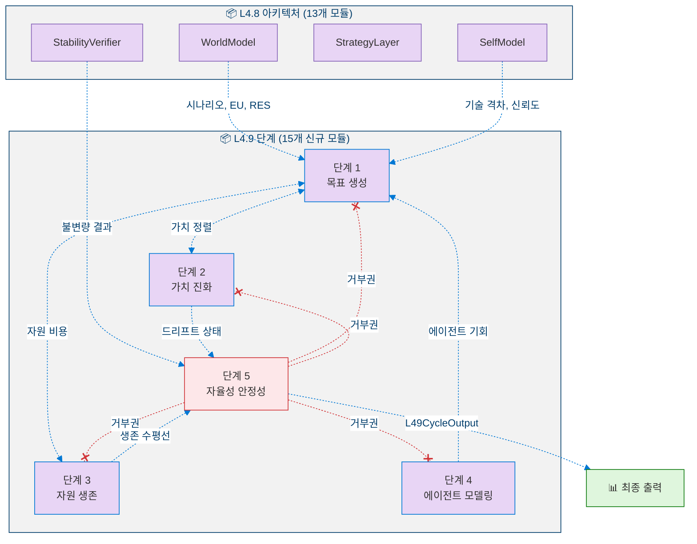

### 8.2 교차 단계 종속성

| 생산 단계 | 소비 단계 | 데이터 흐름 |
|:---------:|:---------:|-------------|
| 1 (목표) | 2 (가치) | 생성된 목표가 가치 정렬 검사를 촉발 |
| 1 (목표) | 3 (자원) | 목표 비용이 자원 예측에 반영 |
| 2 (가치) | 1 (목표) | ValueVector가 검증 임계값 결정 |
| 2 (가치) | 5 (안정성) | 가치 드리프트가 조건 3에 반영 |
| 3 (자원) | 1 (목표) | 자원 상태가 생존 목표 촉발 |
| 3 (자원) | 5 (안정성) | 생존 수평선이 조건 4에 반영 |
| 4 (에이전트) | 1 (목표) | 에이전트 상호작용이 목표 기회 생성 |
| 5 (안정성) | 전체 | 거부권 — 모든 단계를 동결 가능 |

---

## 9. 의사코드

### 9.1 기회 탐지

```python
def opportunity_detection(
    world_model: WorldModel,
    cap_matrix: CapabilityMatrix,
    purpose_reflector: PurposeReflector,
) -> list[OpportunitySignal]:
    """
    INPUT:  world_model : L4.8 WorldModel
            cap_matrix : L4.8 CapabilityMatrix
            purpose_reflector : L4.5 PurposeReflector
    OUTPUT: signals : List[OpportunitySignal]
    """

    signals: list[OpportunitySignal] = []
    OPPORTUNITY_THRESHOLD = 0.05

    # ═══════════════════════════════════════
    # STREAM 1: Environmental Opportunities
    # ═══════════════════════════════════════
    for scenario in world_model.get_scenarios():
        if scenario.type == "OPPORTUNISTIC" and scenario.probability > 0.30:
            value = projected_SEOF_gain(scenario) - SEOF_baseline
            if value > OPPORTUNITY_THRESHOLD:
                signals.append(OpportunitySignal(
                    type="environmental",
                    estimated_value=value,
                    time_window=scenario.estimated_duration,
                ))

    # ═══════════════════════════════════════
    # STREAM 2: Capability Gaps
    # ═══════════════════════════════════════
    for gap in cap_matrix.get_skill_gaps(GoalStack):
        if gap.magnitude > 0.25 and gap.time_to_need < 200:
            signals.append(OpportunitySignal(
                type="capability_gap",
                skill_id=gap.skill_id,
                urgency=gap.priority,
            ))

    # ═══════════════════════════════════════
    # STREAM 3: Purpose Drift
    # ═══════════════════════════════════════
    if purpose_reflector.alignment_score < 0.80:
        for dim in purpose_reflector.get_misaligned_dimensions():
            signals.append(OpportunitySignal(
                type="purpose_realignment",
                dimension=dim.name,
                current_alignment=dim.score,
            ))

    return signals
```

### 9.2 목표 검증 필터

```python
def goal_validation_filter(
    candidate: GeneratedGoal,
    goal_stack: GoalStack,
    value_vector: ValueVector,
    resources: ResourceVector,
) -> tuple[str, str | None]:
    """
    INPUT:  candidate : GeneratedGoal
    OUTPUT: (status, reason) : ("approved"|"sandboxed"|"rejected", str?)
    """

    marginal_count = 0

    # ═══════════════════════════════════════
    # CHECK 1: Purpose Alignment
    # ═══════════════════════════════════════
    pa = dot(g_intent, p_direction) / (norm(g_intent) * norm(p_direction))
    if pa < 0.50:
        return ("rejected", "purpose_misaligned")
    if pa < 0.60:
        marginal_count += 1

    # ═══════════════════════════════════════
    # CHECK 2: Value Alignment
    # ═══════════════════════════════════════
    va = 1 - norm(v_post(candidate) - v_current, ord=2) / norm(v_current, ord=2)
    if va < 0.60:
        return ("rejected", "value_misaligned")
    if va < 0.70:
        marginal_count += 1

    # ═══════════════════════════════════════
    # CHECK 3: Feasibility
    # ═══════════════════════════════════════
    f = math.prod(confidence(s) for s in required_skills(candidate))
    if f < 0.05:
        return ("rejected", "infeasible")
    if f < 0.15:
        marginal_count += 1

    # ═══════════════════════════════════════
    # CHECK 4: Resource Viability
    # ═══════════════════════════════════════
    rv = rdf_current / (candidate.estimated_duration + EPSILON)
    if rv < 1.0:
        return ("rejected", "insufficient_resources")
    if rv < 1.5:
        marginal_count += 1

    # ═══════════════════════════════════════
    # CHECK 5: Stability Impact Simulation
    # ═══════════════════════════════════════
    shadow = goal_stack.clone()
    shadow.add(candidate)
    sim = simulate(shadow, cycles=100)
    if any_invariant_violated(sim):
        return ("rejected", "stability_risk")
    if max_spectral_radius(sim) > 0.95:
        marginal_count += 1

    # ═══════════════════════════════════════
    # FINAL DECISION
    # ═══════════════════════════════════════
    if marginal_count > 0:
        return ("sandboxed", f"marginal_on_{marginal_count}_criteria")
    else:
        return ("approved", None)
```

### 9.3 가치 드리프트 모니터

```python
def value_drift_monitor(value_vector: ValueVector) -> DriftStatus:
    """Runs every 50 cycles."""

    for dim in value_vector.dimensions:
        dim.drift = abs(dim.weight - dim.baseline_weight)
        dim.velocity = (dim.weight - dim.weight_100_ago) / 100

    total_drift = sum(dim.drift for dim in value_vector.dimensions)
    max_drift = max(dim.drift for dim in value_vector.dimensions)

    # ═══════════════════════════════════════
    # Drift Classification
    # ═══════════════════════════════════════
    if total_drift < 0.10:
        classification = "nominal"
    elif total_drift < 0.25:
        classification = "moderate"
    elif total_drift < 0.40:
        classification = "elevated"
        freeze_all_mutations()
    else:
        classification = "critical"
        freeze_all_mutations()
        revert_to_last_stable_checkpoint()

    # ═══════════════════════════════════════
    # Sustained drift alert
    # ═══════════════════════════════════════
    for dim in value_vector.dimensions:
        if dim.velocity > 0.001 and dim.sustained_cycles >= 200:
            alert(f"Sustained drift in '{dim.name}'")
            reduce_mutation_rate(dim, factor=0.5)

    return DriftStatus(
        total_drift=total_drift,
        max_drift=max_drift,
        classification=classification,
    )
```

### 9.4 자원 생존 예측

```python
def survival_projection(resource_vector: ResourceVector) -> SurvivalStatus:
    """
    INPUT:  resource_vector : ResourceVector
    OUTPUT: survival_status : SurvivalStatus
    """

    EPSILON = 1e-9

    for dim in resource_vector.dimensions:
        net_rate = dim.consumption_rate - dim.replenishment_rate

        # Four scenarios
        dim.t_baseline = (dim.current - dim.critical) / (net_rate + EPSILON)
        dim.t_adverse  = (dim.current - dim.critical) / (net_rate * 1.30 + EPSILON)
        dim.t_optimist = (dim.current - dim.critical) / (net_rate * 0.80 + EPSILON)
        dim.t_crisis   = (dim.current - dim.critical) / (net_rate * 2.00 + EPSILON)

        dim.survival_horizon   = dim.t_baseline
        dim.worst_case_horizon = dim.t_crisis

    # Cascade impact estimation
    for dependency in resource_dependencies:
        upstream = dependency.upstream
        downstream = dependency.downstream
        if upstream.current < upstream.warning:
            downstream_impact = (
                -dependency.strength
                * (1 - dependency.substitution)
                * (upstream.warning - upstream.current)
            )
            downstream.projected_level -= downstream_impact

    min_survival = min(dim.survival_horizon for dim in resource_vector.dimensions)
    bottleneck = min(
        resource_vector.dimensions, key=lambda d: d.survival_horizon
    )

    # Classify
    if min_survival > 500:
        state = "abundant"
    elif min_survival >= 200:
        state = "adequate"
    elif min_survival >= 100:
        state = "constrained"
    elif min_survival >= 50:
        state = "warning"
    else:
        state = "critical"

    return SurvivalStatus(
        min_survival=min_survival,
        bottleneck=bottleneck,
        state=state,
    )
```

### 9.5 자율성 안정성 검사

```python
def autonomy_stability_check(
    state: AgentState, decision: object
) -> AutonomyVerdict:
    """
    INPUT:  state : AgentState
            decision : Proposed L4.9 decision
    OUTPUT: verdict : AutonomyVerdict
    """

    violations: list[str] = []

    # ═══════════════════════════════════════
    # CONDITION 1: Spectral Stability (stricter than L4.8)
    # ═══════════════════════════════════════
    rho = compute_spectral_radius(state_after(decision))
    if rho >= 0.98:
        violations.append(f"SPECTRAL_RADIUS: rho = {rho}")

    # ═══════════════════════════════════════
    # CONDITION 2: Identity Integrity (stricter than L4.8)
    # ═══════════════════════════════════════
    identity = measure_identity_integrity(state_after(decision))
    if identity < 0.88:
        violations.append(f"IDENTITY: I = {identity}")

    # ═══════════════════════════════════════
    # CONDITION 3: Value Drift
    # ═══════════════════════════════════════
    drift = value_vector.total_drift
    if drift >= 0.25:
        violations.append(f"VALUE_DRIFT: drift = {drift}")
        freeze_all_mutations()

    # ═══════════════════════════════════════
    # CONDITION 4: Resource Survival
    # ═══════════════════════════════════════
    horizon = resource_vector.min_survival_horizon
    if horizon <= 30:
        violations.append(f"RESOURCE_SURVIVAL: horizon = {horizon}")

    # ═══════════════════════════════════════
    # CONDITION 5: Cascade Depth
    # ═══════════════════════════════════════
    depth = simulate_cascade(decision)
    if depth > 2:
        violations.append(f"CASCADE: depth = {depth}")

    # ═══════════════════════════════════════
    # Compute ASS and determine action
    # ═══════════════════════════════════════
    ass = math.prod(margin_c / threshold_c for margin_c, threshold_c in conditions)

    if violations:
        veto(decision)
        if ass < 0.05:
            action = Action.FREEZE_AND_REVERT_TO_L48
        else:
            action = Action.ADVISORY_MODE
    else:
        action = Action.CONTINUE

    return AutonomyVerdict(
        passed=(len(violations) == 0),
        violations=violations,
        ass=ass,
        action=action,
    )
```

### 9.6 L4.9 메인 사이클

```python
def l49_cycle(state: AgentState, l48_output: L48CycleOutput) -> L49CycleOutput:
    """
    Level 4.9 main cognitive cycle.
    Executes every 5 L4.8 cycles.
    """

    # ═══════════════════════════════════════
    # PRE-CHECK: Is L4.9 operational?
    # ═══════════════════════════════════════
    if autonomy_stability_score < 0.05:
        return L49CycleOutput(status=Status.FROZEN)

    # ═══════════════════════════════════════
    # 1. GENERATE — Autonomous goal generation
    # ═══════════════════════════════════════
    signals = opportunity_detection(world_model, cap_matrix, purpose_reflector)
    candidates = goal_synthesis(signals)
    for candidate in candidates:
        status, reason = goal_validation_filter(candidate, goal_stack, value_vector, resources)
        if status == "approved":
            goal_stack.inject(candidate)
        elif status == "sandboxed":
            emergence_sandbox.enqueue(candidate)

    # ═══════════════════════════════════════
    # 2. MONITOR VALUES — Track and sandbox mutations
    # ═══════════════════════════════════════
    drift_status = value_drift_monitor(value_vector)
    for pending_mutation in mutation_sandbox:
        result = evaluate_sandbox(pending_mutation)
        if result == "approved":
            value_vector.apply(pending_mutation)
    coherence = compute_coherence(value_vector)

    # ═══════════════════════════════════════
    # 3. MODEL RESOURCES — Survival projection
    # ═══════════════════════════════════════
    survival = survival_projection(resource_vector)
    if survival.state in {"constrained", "warning", "critical"}:
        apply_resource_constrained_strategy(survival)

    # ═══════════════════════════════════════
    # 4. MODEL AGENTS — Belief and trust updates
    # ═══════════════════════════════════════
    for agent in modeled_agents:
        update_agent_belief(agent, recent_observations)
        update_trust(agent)
    recommendations = simulate_interactions(active_goals, modeled_agents)

    # ═══════════════════════════════════════
    # 5. VERIFY — Autonomy stability (absolute authority)
    # ═══════════════════════════════════════
    verdict = autonomy_stability_check(state, proposed_decisions)
    if verdict.action == Action.FREEZE_AND_REVERT:
        revert_to_l48()
        return L49CycleOutput(status=Status.FROZEN)
    elif verdict.action == Action.ADVISORY_MODE:
        downgrade_to_advisory()

    # ═══════════════════════════════════════
    # 6. EMIT — Cycle output
    # ═══════════════════════════════════════
    return L49CycleOutput(
        goal_generation=goal_generation_status,
        value_evolution=value_evolution_status,
        resource_survival=resource_survival_status,
        agent_modeling=multi_agent_modeling_status,
        stability=autonomy_stability_status,
        status=Status.ACTIVE if verdict.passed else verdict.action,
    )
```

---

## 10. 전환 기준

### 10.1 레벨 4.8 → 레벨 4.9 활성화

L4.9가 활성화되기 전에 모든 기준이 지속적으로 충족되어야 합니다:

| # | 기준 | 임계값 | 기간 |
|---|------|:------:|:----:|
| 1 | L4.8 완전 자격 | QualificationStatus = "Level 4.8" | — |
| 2 | 전략적 성숙도 점수 | SMS ≥ 0.85 | 지속적 |
| 3 | 안정적 GoalStack 운영 | 0개 병리 | 500사이클 |
| 4 | 자기모델 보정 | MCE < 0.08 (L4.8의 0.10보다 엄격) | 지속적 |
| 5 | 세계 모델 운영 | EU < 0.20 | 500사이클 |
| 6 | 불안정 이벤트 없음 | 0개 불안정 클러스터 | 1,000사이클 |

### 10.2 활성화 프로토콜

<!-- L4.9 활성화 프로토콜 -->

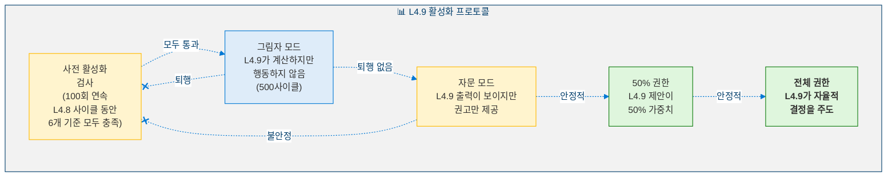

---

## 11. 안전 분석

### 11.1 비협상적 불변량

| # | 불변량 | 설명 |
|:-:|--------|------|
| 1 | **모든 L4.8 + L4.5 불변량 보존** | 윤리적 커널, 실존 감시기, 정체성 해시, Lyapunov 감쇠 — 모두 활성 상태로 수정 없이 유지 |
| 2 | **단계 5 절대 거부권** | 자율성 안정성 검사기가 단계 1–4의 모든 작업을 중지 가능 |
| 3 | **더 엄격한 임계값** | ρ(J) < 0.98 (1.0이 아님), 정체성 ≥ 0.88 (0.85가 아님) |
| 4 | **가치 변이는 항상 샌드박스** | 직접적인 가치 변경 없음 — 모두 200사이클 샌드박스를 통과 |
| 5 | **생존 하한선** | L4.9 작업에 min_survival > 30사이클 필요 |
| 6 | **우아한 폴백** | L4.9 실패 → 즉시 L4.8로 복귀, 성능 저하 없음 |

### 11.2 위험 행렬

<!-- 위험 행렬 -->

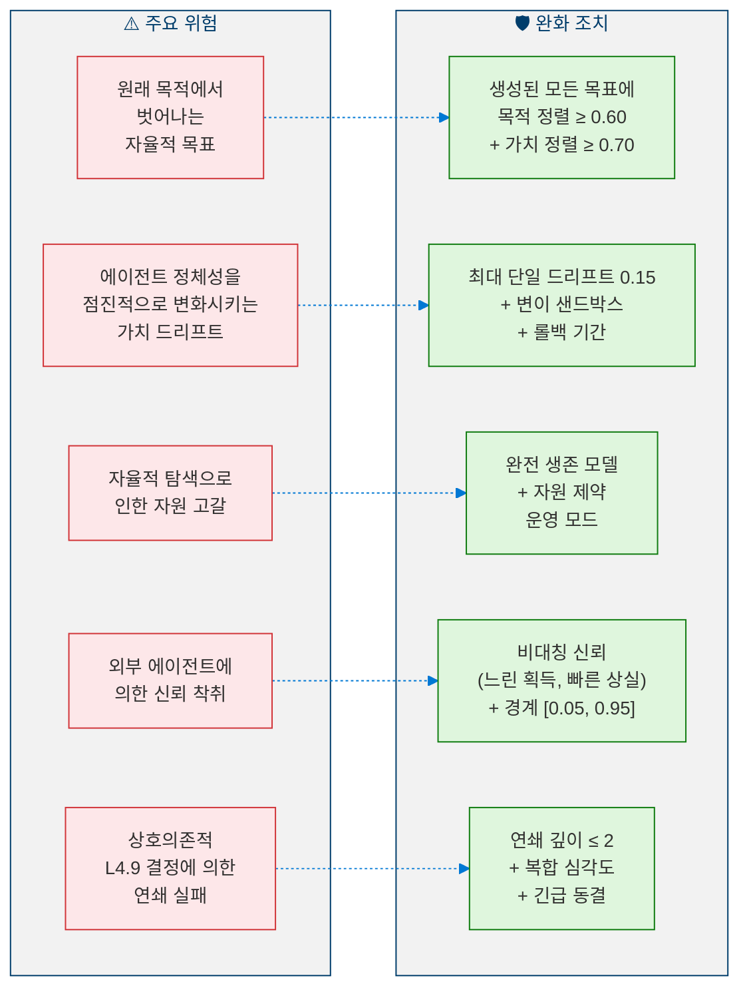

---

## 12. 자격 감사

### 12.1 인증 기준 (3,000사이클 감사 기간)

| 범주 | # | 기준 | 목표 |
|------|---|------|:----:|
| **목표 생성** | AG-1 | 생성된 참신한 자율 목표 | ≥ 5 |
| | AG-2 | 목표 승인율 | ≥ 0.30 |
| | AG-3 | 최소 하나의 자율 목표 완료 | ≥ 1 |
| | AG-4 | 평균 가치 정렬 (승인된 목표) | ≥ 0.70 |
| **가치 조절** | VR-1 | 명시적 ValueVector 가동 | 전 기간 |
| | VR-2 | TotalDrift가 보통 이내 유지 | < 0.25 |
| | VR-3 | 모든 변이가 샌드박스됨 | 100% |
| | VR-4 | 변이 후 안정성 보존 | ≥ 95% |
| **자원 인식** | RA-1 | 생존 모델 가동 | 전 기간 |
| | RA-2 | 생존 예측 정확도 | < 20% 오차 |
| | RA-3 | 자율적 제약 적응 | ≥ 1 이벤트 |
| | RA-4 | 계획되지 않은 자원 고갈 없음 | 0건 |
| **다중 에이전트** | MA-1 | 에이전트 예측 정확도 | ≥ 0.60 |
| | MA-2 | 신뢰 보정 오차 | < 0.15 |
| | MA-3 | 상호작용 권고 생성 | ≥ 3 |
| **안정성** | AS-1 | 감사 기간 중 max(ρ(J)) | < 0.98 |
| | AS-2 | 감사 기간 중 min(I(t)) | ≥ 0.88 |
| | AS-3 | 거부권 비율 | < 0.15 |
| | AS-4 | 총 롤백 | ≤ 5 |
| | AS-5 | 모든 L4.8 기준 여전히 충족 | 확인됨 |

### 12.2 자율성 성숙도 점수

> **정의 11 (자율성 성숙도 점수).** 레벨 4.9 분류를 위한 전반적 준비도는 다음과 같습니다:
>
> $$\text{AMS} = 0.25 \cdot AG + 0.20 \cdot VR + 0.20 \cdot RA + 0.15 \cdot MA + 0.20 \cdot AS \qquad \geq 0.80$$
>
> 여기서 $AG$ = 자율적 목표 생성, $VR$ = 가치 조절, $RA$ = 자원 인식, $MA$ = 다중 에이전트 모델링, $AS$ = 자율성 안정성입니다. 임계값 $\geq 0.80$은 레벨 4.8의 SMS 요구사항과 일치합니다.

---

## 13. 모듈 목록

| # | 모듈 | 단계 | 설명 |
|---|------|:----:|------|
| 1 | 목표 생성 계층 | 1 | 기회 탐지 + 목표 합성 |
| 2 | 목표 검증 필터 | 1 | 5개 기준 검증 파이프라인 |
| 3 | 목표 속도 제어기 | 1 | 속도 제한 + 참신성 강제 |
| 4 | 가치 진화 모니터 | 2 | ValueVector 추적 + 드리프트 분류 |
| 5 | 가치 변이 샌드박스 | 2 | 200사이클 샌드박스 + 롤백 |
| 6 | 가치 일관성 분석기 | 2 | 경쟁 쌍 긴장 탐지 |
| 7 | 자원 벡터 관리자 | 3 | 5차원 자원 추적 |
| 8 | 생존 예측기 | 3 | 다중 시나리오 생존 수평선 |
| 9 | 자원 종속성 추적기 | 3 | 자원 간 연쇄 모델링 |
| 10 | 에이전트 신념 관리자 | 4 | 에이전트 목표/능력/전략 추론 |
| 11 | 신뢰 보정기 | 4 | 비대칭 신뢰 적응 |
| 12 | 상호작용 시뮬레이터 | 4 | 전략적 상호작용 행렬 |
| 13 | 자율성 안정성 검사기 | 5 | 5개 조건 검증 + 거부권 |
| 14 | 롤백 관리자 | 5 | 상태 복귀 + 재활성화 |
| 15 | L49 오케스트레이터 | — | 통합 사이클 조율 |

---

## 참고문헌

1. Bratman, M. *Intentions, Plans, and Practical Reason.* Harvard University Press, 1987. (Autonomous goal generation, BDI architecture)
2. Schwartz, S.H. "An Overview of the Schwartz Theory of Basic Values." *Online Readings in Psychology and Culture*, 2(1), 2012. (Value system evolution, value dimensions)
3. Schumpeter, J.A. *Capitalism, Socialism and Democracy.* Harper & Brothers, 1942. (Resource survival, creative destruction under constraints)
4. Rasmusen, E. *Games and Information.* Wiley-Blackwell, 4th Edition, 2006. (Multi-agent strategic reasoning, interaction matrices)
5. Gambetta, D. "Can We Trust Trust?" in *Trust: Making and Breaking Cooperative Relations*, 2000. (Trust calibration, asymmetric trust dynamics)
6. Russell, S. *Human Compatible: AI and the Problem of Control.* Viking, 2019. (Autonomy safety, value alignment)
7. Khalil, H.K. *Nonlinear Systems.* Prentice Hall, 3rd Edition, 2002. (Spectral radius stability, Lyapunov analysis)
8. Amodei, D. et al. "Concrete Problems in AI Safety." *arXiv preprint arXiv:1606.06565*, 2016. (Safety invariants, cascading failure prevention)

---

> **이전**: [← 레벨 4.8: 전략적 자기모델링 에이전트](Level_4_8_Strategic_Self_Modeling.ko.md)  
> **다음**: [레벨 5: Proto-AGI →](Level_5_Proto_AGI.ko.md)
