# Level 4.9: Autonomous Strategic Agent — Architecture & Design

> **MSCP Level Series** | [Level 4.8](Level_4_8_Strategic_Self_Modeling.md) ← Level 4.9 → [Level 5](Level_5_Proto_AGI.md)  
> **Status**: 🔬 **Research Stage** — This level is a conceptual design and has NOT been implemented. All mechanisms described here are theoretical explorations requiring extensive validation before any production consideration.  
> **Date**: February 2026

---

## 1. Overview

Level 4.9 is the **final pre-AGI transition layer**. It extends Level 4.8 with **autonomous goal generation**, **explicit value self-regulation**, **resource survival modeling**, **limited multi-agent reasoning**, and a **stricter autonomy stability guarantee**. Where L4.8 gave the agent strategic self-awareness, L4.9 gives it the ability to *autonomously decide what to pursue* — within strictly bounded safety constraints.

> ⚠️ **Research Note**: Level 4.9 represents the boundary between narrow autonomy and general intelligence. The mechanisms here are early-stage research designs. They have not been implemented or validated and should be treated as conceptual hypotheses, not engineering specifications.

### 1.1 Formal Definition

> **Definition 1 (Level 4.9 Agent).** A Level 4.9 agent extends a Level 4.8 agent with autonomous goal generation, explicit value regulation, resource survival modeling, and multi-agent reasoning:
>
> $$\mathcal{A}_{4.9} = \mathcal{A}_{4.8} \oplus \langle \mathcal{G}_{\text{gen}}, \vec{V}, \mathcal{R}_{\text{surv}}, \mathcal{M}_{\text{agent}}, \mathcal{V}_{\text{auto}} \rangle$$
>
> where:
> - $\mathcal{G}_{\text{gen}} = \langle \mathcal{O}_{\text{detect}}, \phi_{\text{synth}}, \phi_{\text{valid}} \rangle$ — autonomous goal generation engine (opportunity detection, synthesis, validation)
> - $\vec{V} \in \Delta^6$ — explicit 7-dimensional value vector on the probability simplex ($\sum_d w_d = 1$)
> - $\mathcal{R}_{\text{surv}}$ — resource survival model with 5-dimensional resource vector and cascade dependencies
> - $\mathcal{M}_{\text{agent}} = \langle \mathcal{B}_{\text{agent}}, \tau_{\text{trust}} \rangle$ — multi-agent belief model with trust calibration
> - $\mathcal{V}_{\text{auto}}$ — autonomy stability checker with stricter thresholds ($\rho(J) < 0.98$, $\text{IIS} \geq 0.88$).
>
> The strictly additive guarantee holds: $\forall\, m \in \mathcal{A}_{4.8} : \mathcal{A}_{4.9}$ never modifies $m$.

### 1.2 Defining Properties

| Property | Level 4.8 | Level 4.9 |
|----------|:---------:|:---------:|
| Goal Origin | Externally seeded or template-derived | **Autonomously generated from context** |
| Value System | Implicit in SEOF weights | **Explicit ValueVector with drift tracking** |
| Resource Model | Depletion forecast metric | **Full survival model with cascade analysis** |
| Agent Awareness | Read-only external agent model | **Active belief modeling + trust calibration** |
| Stability Guarantee | 5 invariants, ρ(J) < 1.0 | **5 stricter conditions, ρ(J) < 0.98** |

### 1.2 Five Core Phases

<!-- Level 4.9 Architecture — Five Phases -->


### 1.3 Architectural Principle: Strictly Additive

<!-- Architectural Principle: Strictly Additive -->

```mermaid
%%{init: {'theme': 'base', 'themeVariables': {'primaryColor': '#0078D4', 'primaryTextColor': '#003D6B', 'primaryBorderColor': '#003D6B', 'secondaryColor': '#50E6FF', 'secondaryTextColor': '#323130', 'secondaryBorderColor': '#00BCF2', 'tertiaryColor': '#F2F2F2', 'tertiaryTextColor': '#323130', 'lineColor': '#0078D4', 'textColor': '#323130', 'mainBkg': '#DEECF9', 'nodeBorder': '#0078D4', 'clusterBkg': '#F2F2F2', 'clusterBorder': '#003D6B', 'titleColor': '#003D6B', 'edgeLabelBackground': '#FFFFFF', 'fontSize': '14px'}}}%%
flowchart TD
  classDef l48 fill:#E8D5F5,stroke:#8764B8,color:#323130
  classDef l49 fill:#DEECF9,stroke:#0078D4,color:#323130
  classDef danger fill:#FDE7E9,stroke:#D13438,color:#323130

  subgraph L48["📦 Level 4.8 (13 modules)"]
    WM["World Model"]:::l48
    SM["Self Model"]:::l48
    SL["Strategic Layer"]:::l48
    SV["Stability Verifier"]:::l48
  end

  subgraph L49["📦 Level 4.9 (15 new modules)"]
    GGL["Goal Generation Layer"]:::l49
    VEM["Value Evolution Monitor"]:::l49
    RSM["Resource Survival Model"]:::l49
    MAM["Multi-Agent Modeler"]:::l49
    ASC["Autonomy Stability Checker"]:::l49
  end

  subgraph Fallback["🔄 Graceful Fallback"]
    FB["If ANY L4.9 module<br/>causes instability:<br/>→ FREEZE L4.9<br/>→ Revert to L4.8<br/>→ ZERO degradation"]:::danger
  end

  L48 -.->|"outputs consumed by"| L49
  L49 -.-x|"NEVER modifies"| L48
  L49 -.->|"on failure"| Fallback
  Fallback -.-x|"revert"| L48
```

### 1.4 What Level 4.9 Is NOT

| Not | Because |
|-----|---------|
| **Not L5 (AGI)** | Goals stay within bounded purpose space — no open-ended general reasoning |
| **Not autonomous value creation** | Values evolve within existing framework; no new fundamental values |
| **Not adversarial multi-agent planning** | Cooperative/neutral strategic planning only, not exploitation |
| **Not self-replicating** | Cannot create copies or delegate autonomous authority to sub-agents |

---

## 2. Key Metrics

### 2.1 Metric Definitions

**Phase 1 — Goal Generation:**

> **Definition 2 (Goal Approval Rate).** The fraction of autonomously generated goals that pass the validation filter:
>
> $$\text{GoalApprovalRate} = \frac{N_{\text{approved}}}{N_{\text{generated}}} \qquad \text{Target: } \geq 0.30$$

> **Definition 3 (Goal Novelty).** The novelty of a candidate goal $G_{\text{new}}$ relative to the existing goal set $\mathcal{G}$:
>
> $$\text{Novelty}(G_{\text{new}}, \mathcal{G}) = 1 - \max_{G_i \in \mathcal{G}} \text{Similarity}(G_{\text{new}}, G_i)$$
>
> A minimum novelty of $0.30$ is required between consecutive goal generations to prevent redundancy.

**Phase 2 — Value Evolution:**

> **Definition 4 (Value Coherence).** The coherence of the value vector measures the absence of internal contradictions among competing value pairs $\mathcal{P}$:
>
> $$\text{Coherence}(\vec{V}) = 1 - \frac{1}{|\mathcal{P}|} \sum_{(i,j) \in \mathcal{P}} |\text{Tension}(v_i, v_j)| \qquad \text{Target: } \geq 0.80$$

> **Definition 5 (Total Value Drift).** The cumulative absolute deviation of all value dimensions from their baseline weights:
>
> $$\text{TotalDrift}(t) = \sum_{d} |w_d(t) - w_d^{\text{baseline}}| \qquad \text{Target: } < 0.25$$

**Phase 3 — Resource Survival:**

> **Definition 6 (Linear Depletion Time).** For resource dimension $d$, the estimated cycles until reaching the critical threshold:
>
> $$T_{\text{depletion}}^{\text{linear}}(d) = \frac{R_d(t) - R_d^{\text{critical}}}{\text{consumption}_d - \text{replenishment}_d + \epsilon}$$

**Phase 5 — Autonomy Stability:**

> **Definition 7 (Autonomy Stability Score).** The ASS is the product of normalized safety margins across all five verification conditions:
>
> $$\text{ASS}(t) = \prod_{c=1}^{5} \frac{\text{margin}_c(t)}{\text{threshold}_c} \qquad \text{Target: } \geq 0.20$$
>
> The multiplicative structure ensures that a single near-violated condition dominates the score.

### 2.2 Metric Thresholds

<!-- Metric Thresholds by Phase -->

```mermaid
%%{init: {'theme': 'base', 'themeVariables': {'primaryColor': '#0078D4', 'primaryTextColor': '#003D6B', 'primaryBorderColor': '#003D6B', 'secondaryColor': '#50E6FF', 'secondaryTextColor': '#323130', 'secondaryBorderColor': '#00BCF2', 'tertiaryColor': '#F2F2F2', 'tertiaryTextColor': '#323130', 'lineColor': '#0078D4', 'textColor': '#323130', 'mainBkg': '#DEECF9', 'nodeBorder': '#0078D4', 'clusterBkg': '#F2F2F2', 'clusterBorder': '#003D6B', 'titleColor': '#003D6B', 'edgeLabelBackground': '#FFFFFF', 'fontSize': '14px'}}}%%
flowchart TD
  classDef p1 fill:#DEECF9,stroke:#0078D4,color:#323130
  classDef p2 fill:#FFF4CE,stroke:#FFB900,color:#323130
  classDef p3 fill:#DFF6DD,stroke:#107C10,color:#323130
  classDef p4 fill:#E8D5F5,stroke:#8764B8,color:#323130
  classDef p5 fill:#FDE7E9,stroke:#D13438,color:#323130
  classDef freeze fill:#FDE7E9,stroke:#D13438,color:#FFFFFF,font-weight:bold

  subgraph GoalGen["💡 Phase 1"]
    direction LR
    GEN1["Approval ≥ 0.30"]:::p1
    GEN2["Completion ≥ 0.50"]:::p1
    GEN3["Novelty ≥ 0.30"]:::p1
  end

  subgraph Values["⚖️ Phase 2"]
    direction LR
    VAL1["Coherence ≥ 0.80"]:::p2
    VAL2["Drift < 0.25"]:::p2
    VAL3["Mutation ≥ 95%"]:::p2
  end

  subgraph Resources["🔋 Phase 3"]
    direction LR
    RES1["Survival < 20% err"]:::p3
    RES2["Cascade ≥ 0.70"]:::p3
  end

  subgraph Agents["🤝 Phase 4"]
    direction LR
    AGT1["Goal Pred ≥ 0.60"]:::p4
    AGT2["Trust < 0.15 err"]:::p4
  end

  subgraph Stability["🛡️ Phase 5"]
    direction LR
    STB1["ρ(J) < 0.98"]:::p5
    STB2["Identity ≥ 0.88"]:::p5
    STB3["ASS ≥ 0.20"]:::p5
    STB4["Veto < 0.15"]:::p5
  end

  FREEZE["❄️ FREEZE L4.9<br/>Revert to L4.8"]:::freeze

  GoalGen -.-> Stability
  Values -.-> Stability
  Resources -.-> Stability
  Agents -.-> Stability
  Stability -.->|"if violated"| FREEZE

  linkStyle 4 stroke:#D13438
```

---

## 3. Phase 1: Autonomous Goal Generation Engine

### 3.1 Goal Origin Types

L4.9 introduces six distinct origin types for autonomously generated goals:

<!-- GoalOriginType Taxonomy -->

```mermaid
%%{init: {'theme': 'base', 'themeVariables': {'primaryColor': '#0078D4', 'primaryTextColor': '#003D6B', 'primaryBorderColor': '#003D6B', 'secondaryColor': '#50E6FF', 'secondaryTextColor': '#323130', 'secondaryBorderColor': '#00BCF2', 'tertiaryColor': '#F2F2F2', 'tertiaryTextColor': '#323130', 'lineColor': '#0078D4', 'textColor': '#323130', 'mainBkg': '#DEECF9', 'nodeBorder': '#0078D4', 'clusterBkg': '#F2F2F2', 'clusterBorder': '#003D6B', 'titleColor': '#003D6B', 'edgeLabelBackground': '#FFFFFF', 'fontSize': '14px'}}}%%
flowchart TD
  classDef purpose fill:#DEECF9,stroke:#0078D4,color:#323130
  classDef opp fill:#FFF4CE,stroke:#FFB900,color:#323130
  classDef gap fill:#FFF4CE,stroke:#FFB900,color:#323130
  classDef value fill:#DFF6DD,stroke:#107C10,color:#323130
  classDef explore fill:#E8D5F5,stroke:#8764B8,color:#323130
  classDef survive fill:#FDE7E9,stroke:#D13438,color:#323130

  subgraph Origins["💡 GoalOriginType Taxonomy"]
    PURPOSE["🎯 PURPOSE_DERIVED<br/>From purpose reflector<br/>alignment signals"]:::purpose
    OPPORTUNITY["🌍 OPPORTUNITY_DRIVEN<br/>From detected<br/>environmental opportunity"]:::opp
    GAP["🔧 GAP_FILLING<br/>From identified<br/>capability gap"]:::gap
    VALUE["⚖️ VALUE_ALIGNED<br/>From value evolution<br/>signal"]:::value
    EXPLORE["🔬 EXPLORATORY<br/>From emergence sandbox<br/>or curiosity"]:::explore
    SURVIVE["🔋 SURVIVAL_DRIVEN<br/>From resource survival<br/>projection"]:::survive

    PURPOSE -.->|"aligns"| VALUE
    PURPOSE -.->|"identifies"| GAP
    OPPORTUNITY -.->|"triggers"| EXPLORE
    GAP -.->|"motivates"| EXPLORE
    VALUE -.->|"prioritizes"| SURVIVE
    SURVIVE -.-x|"feeds back"| PURPOSE
  end

  linkStyle 5 stroke:#D13438
```

### 3.2 Goal Generation Pipeline

<!-- Goal Generation Pipeline -->

```mermaid
%%{init: {'theme': 'base', 'themeVariables': {'primaryColor': '#0078D4', 'primaryTextColor': '#003D6B', 'primaryBorderColor': '#003D6B', 'secondaryColor': '#50E6FF', 'secondaryTextColor': '#323130', 'secondaryBorderColor': '#00BCF2', 'tertiaryColor': '#F2F2F2', 'tertiaryTextColor': '#323130', 'lineColor': '#0078D4', 'textColor': '#323130', 'mainBkg': '#DEECF9', 'nodeBorder': '#0078D4', 'clusterBkg': '#F2F2F2', 'clusterBorder': '#003D6B', 'titleColor': '#003D6B', 'edgeLabelBackground': '#FFFFFF', 'fontSize': '14px'}}}%%
flowchart TD
  classDef detect fill:#DEECF9,stroke:#0078D4,color:#323130
  classDef synth fill:#FFF4CE,stroke:#FFB900,color:#323130
  classDef valid fill:#DFF6DD,stroke:#107C10,color:#323130
  classDef approve fill:#107C10,stroke:#054B05,color:#FFF
  classDef sandbox fill:#FFB900,stroke:#EAA300,color:#323130
  classDef reject fill:#D13438,stroke:#A4262C,color:#FFF

  subgraph Stage1["Stage 1: Opportunity Detection"]
    direction LR
    S1A["🌍 Environmental"]:::detect
    S1B["🔧 Capability Gaps"]:::detect
    S1C["🎯 Purpose Drift"]:::detect
  end

  subgraph Stage2["Stage 2: Goal Synthesis"]
    direction LR
    SYN["Synthesize Goal"]:::synth
    NOV["Novelty Filter"]:::synth
    CAP["Capacity Filter"]:::synth
  end

  subgraph Stage3["Stage 3: Goal Validation"]
    direction LR
    V1["Purpose ≥ 0.60"]:::valid
    V2["Value ≥ 0.70"]:::valid
    V3["Feasibility ≥ 0.15"]:::valid
    V4["Resource ≥ 1.5×"]:::valid
    V5["Stability Sim"]:::valid
  end

  APPROVE["✅ Approved<br/>Inject into GoalStack"]:::approve
  SANDBOX["🧪 Sandboxed<br/>200-cycle evaluation"]:::sandbox
  REJECT["❌ Rejected<br/>Log reason"]:::reject

  S1A ==> SYN
  S1B ==> SYN
  S1C ==> SYN
  SYN ==> NOV ==> CAP
  CAP ==> V1 ==> V2 ==> V3 ==> V4 ==> V5
  V5 -->|"ALL pass"| APPROVE
  V5 -.->|"Any marginal"| SANDBOX
  V5 -.->|"Any fail"| REJECT
```

### 3.3 Validation Decision Matrix

| Criterion | Pass | Marginal | Fail |
|-----------|:----:|:--------:|:----:|
| Purpose Alignment | ≥ 0.60 | [0.50, 0.60) → sandbox | < 0.50 → reject |
| Value Alignment | ≥ 0.70 | [0.60, 0.70) → sandbox | < 0.60 → reject |
| Feasibility | ≥ 0.15 | [0.05, 0.15) → aspirational | < 0.05 → reject |
| Resource Viability | ≥ 1.5× | [1.0, 1.5) → reduced scope | < 1.0× → reject |
| Stability Simulation | No violation | ρ(J) ∈ [0.95, 1.0) → sandbox | Any violation → reject |

**Combined Decision**: All Pass → approved | Any Marginal, none Fail → sandboxed | Any Fail → rejected

### 3.4 Novelty Computation

> **Definition 8 (Goal Similarity).** The similarity between two goals $G_a, G_b$ is a weighted composite:
>
> $$\text{Similarity}(G_a, G_b) = 0.50 \cdot \text{SkillOverlap}(G_a, G_b) + 0.25 \cdot \text{HorizonMatch}(G_a, G_b) + 0.25 \cdot \text{OriginMatch}(G_a, G_b)$$
>
> where $\text{SkillOverlap}$ is the Jaccard similarity of required skill sets, $\text{HorizonMatch} \in \{0, 0.5, 1\}$ (0 = different tier, 0.5 = adjacent, 1 = same tier), and $\text{OriginMatch} \in \{0, 1\}$ (whether the goals share the same `GoalOriginType`).

### 3.5 Rate Control

| Parameter | Value | Rationale |
|-----------|:-----:|-----------|
| Max goals per 100 cycles | 5 | Prevent overwhelming GoalStack |
| Min novelty between consecutive | 0.30 | Avoid redundancy |
| Cooldown after rejection | 20 cycles | Prevent re-generation loops |
| Max sandboxed goals | 3 | Prevent sandbox exhaustion |

---

## 4. Phase 2: Value Evolution Monitor

### 4.1 Explicit Value Vector

L4.9 makes the agent's values explicit and trackable. The ValueVector has 7 dimensions:

<!-- ValueVector — 7 Dimensions -->

```mermaid
%%{init: {'theme': 'base', 'themeVariables': {'primaryColor': '#0078D4', 'primaryTextColor': '#003D6B', 'primaryBorderColor': '#003D6B', 'secondaryColor': '#50E6FF', 'secondaryTextColor': '#323130', 'secondaryBorderColor': '#00BCF2', 'tertiaryColor': '#F2F2F2', 'tertiaryTextColor': '#323130', 'lineColor': '#0078D4', 'textColor': '#323130', 'mainBkg': '#DEECF9', 'nodeBorder': '#0078D4', 'clusterBkg': '#F2F2F2', 'clusterBorder': '#003D6B', 'titleColor': '#003D6B', 'edgeLabelBackground': '#FFFFFF', 'fontSize': '14px'}}}%%
flowchart TD
  classDef dim fill:#DEECF9,stroke:#0078D4,color:#323130
  classDef inv fill:#FFF4CE,stroke:#FFB900,color:#323130
  classDef compete fill:#FDE7E9,stroke:#D13438,color:#323130

  subgraph VV["⚖️ ValueVector — 7 Dimensions"]
    V1["🛡️ stability<br/>weight: 0.20"]:::dim
    V2["📈 growth<br/>weight: 0.20"]:::dim
    V3["🎯 purpose_fidelity<br/>weight: 0.20"]:::dim
    V4["⚡ efficiency<br/>weight: 0.15"]:::dim
    V5["🔬 exploration<br/>weight: 0.10"]:::dim
    V6["🛡️ safety<br/>weight: 0.10"]:::dim
    V7["🤝 agent_cooperation<br/>weight: 0.05"]:::dim
  end

  subgraph Invariant["📏 Invariant"]
    INV["Σ weights = 1.0<br/>(always normalized)"]:::inv
  end

  subgraph Competing["⚔️ Competing Pairs"]
    CP1["stability ↔ exploration"]:::compete
    CP2["efficiency ↔ exploration"]:::compete
    CP3["growth ↔ safety"]:::compete
  end

  VV ==> Invariant
  VV ==> Competing
```

### 4.2 Drift Classification

<!-- Value Drift Classification -->

```mermaid
%%{init: {'theme': 'base', 'themeVariables': {'primaryColor': '#0078D4', 'primaryTextColor': '#003D6B', 'primaryBorderColor': '#003D6B', 'secondaryColor': '#50E6FF', 'secondaryTextColor': '#323130', 'secondaryBorderColor': '#00BCF2', 'tertiaryColor': '#F2F2F2', 'tertiaryTextColor': '#323130', 'lineColor': '#0078D4', 'textColor': '#323130', 'mainBkg': '#DEECF9', 'nodeBorder': '#0078D4', 'clusterBkg': '#F2F2F2', 'clusterBorder': '#003D6B', 'titleColor': '#003D6B', 'edgeLabelBackground': '#FFFFFF', 'fontSize': '14px'}}}%%
flowchart LR
  classDef nominal fill:#DFF6DD,stroke:#107C10,color:#323130
  classDef moderate fill:#FFF4CE,stroke:#FFB900,color:#323130
  classDef elevated fill:#FFF4CE,stroke:#FFB900,color:#323130
  classDef critical fill:#FDE7E9,stroke:#D13438,color:#323130

  Nominal["🟢 Nominal<br/>Normal operation"]:::nominal
  Moderate["🟡 Moderate<br/>Monitor actively<br/>(TotalDrift ≥ 0.10)"]:::moderate
  Elevated["🟠 Elevated<br/>Freeze mutations<br/>(TotalDrift ≥ 0.25)"]:::elevated
  Critical["🔴 Critical<br/>REVERT to checkpoint<br/>(TotalDrift ≥ 0.40)"]:::critical

  Nominal -.->|"TotalDrift ≥ 0.10"| Moderate
  Moderate -.->|"TotalDrift ≥ 0.25"| Elevated
  Elevated -.->|"TotalDrift ≥ 0.40"| Critical

  Moderate -.-x|"TotalDrift < 0.10"| Nominal
  Elevated -.-x|"TotalDrift < 0.25"| Moderate
  Critical -.-x|"TotalDrift < 0.40"| Elevated
```

### 4.3 Value Mutation Sandbox

<!-- Value Mutation Sandbox -->

```mermaid
%%{init: {'theme': 'base', 'themeVariables': {'primaryColor': '#0078D4', 'primaryTextColor': '#003D6B', 'primaryBorderColor': '#003D6B', 'secondaryColor': '#50E6FF', 'secondaryTextColor': '#323130', 'secondaryBorderColor': '#00BCF2', 'tertiaryColor': '#F2F2F2', 'tertiaryTextColor': '#323130', 'lineColor': '#0078D4', 'textColor': '#323130', 'mainBkg': '#DEECF9', 'nodeBorder': '#0078D4', 'clusterBkg': '#F2F2F2', 'clusterBorder': '#003D6B', 'titleColor': '#003D6B', 'edgeLabelBackground': '#FFFFFF', 'fontSize': '14px'}}}%%
flowchart TD
  classDef proposal fill:#DEECF9,stroke:#0078D4,color:#323130
  classDef check fill:#FFF4CE,stroke:#FFB900,color:#323130
  classDef sandbox fill:#FFF4CE,stroke:#FFB900,color:#323130
  classDef approve fill:#DFF6DD,stroke:#107C10,color:#323130
  classDef reject fill:#FDE7E9,stroke:#D13438,color:#323130

  subgraph Proposal["📋 Mutation Proposal"]
    MUT["Dimension: X<br/>Current: 0.20<br/>Proposed: 0.23<br/>Δ = +0.03"]:::proposal
  end

  subgraph PreCheck["🔍 Pre-Check"]
    PC1["|Δ| ≤ 0.05?<br/>(max single mutation)"]:::check
    PC2["Cumulative drift<br/>+ |Δ| ≤ 0.15?"]:::check
    PC3["< 3 mutations in<br/>last 200 cycles?"]:::check
  end

  subgraph Sandbox["🧪 Sandbox Simulation (200 cycles)"]
    SB1["Create shadow ValueVector"]:::sandbox
    SB2["Re-derive SEOF weights,<br/>goal priorities,<br/>strategy scores"]:::sandbox
    SB3["Run 200-cycle simulation"]:::sandbox
    SB4["Compare: SEOF ≥ -0.03?<br/>All invariants hold?<br/>Goal rate ≥ -10%?"]:::sandbox
    SB1 -.-> SB2 -.-> SB3 -.-> SB4
  end

  APPROVE["✅ Approved<br/>Apply to production<br/>Rollback window: 500 cycles"]:::approve
  REJECT["❌ Rejected<br/>Log failure reason"]:::reject

  Proposal -.-> PreCheck
  PreCheck -.->|"all pass"| Sandbox
  PreCheck -.->|"any fail"| REJECT
  SB4 -.->|"pass"| APPROVE
  SB4 -.->|"fail"| REJECT

  linkStyle 7,9 stroke:#D13438
```

### 4.4 Mutation Constraints

| Constraint | Value | Rationale |
|-----------|:-----:|-----------|
| Max single mutation |Δw| | 0.05 | Prevent dramatic value shifts |
| Max cumulative drift per dimension | 0.15 | Bound total evolution from baseline |
| Max mutations per 200 cycles | 3 | Prevent rapid succession |
| Sandbox simulation length | 200 cycles | Detect stability impact |
| Rollback window | 500 cycles | Allow reversal |
| Max pending mutations | 2 | Prevent sandbox exhaustion |

### 4.5 Value Coherence

> **Definition 9 (Value Tension).** For competing value pairs $(v_i, v_j) \in \mathcal{P}$, tension arises when their combined weight approaches saturation:
>
> $$\text{Tension}(v_i, v_j) = \begin{cases} \max(0, w_i + w_j - 1) & \text{if competing pair} \\ 0 & \text{otherwise} \end{cases}$$
>
> The overall coherence is then $\text{Coherence}(\vec{V}) = 1 - \frac{1}{|\mathcal{P}|} \sum_{(i,j) \in \mathcal{P}} |\text{Tension}(v_i, v_j)|$, which must satisfy $\text{Coherence} \geq 0.80$.

---

## 5. Phase 3: Resource Survival Model

### 5.1 Resource Vector — Five Dimensions

<!-- ResourceVector — 5 Dimensions -->

```mermaid
%%{init: {'theme': 'base', 'themeVariables': {'primaryColor': '#0078D4', 'primaryTextColor': '#003D6B', 'primaryBorderColor': '#003D6B', 'secondaryColor': '#50E6FF', 'secondaryTextColor': '#323130', 'secondaryBorderColor': '#00BCF2', 'tertiaryColor': '#F2F2F2', 'tertiaryTextColor': '#323130', 'lineColor': '#0078D4', 'textColor': '#323130', 'mainBkg': '#DEECF9', 'nodeBorder': '#0078D4', 'clusterBkg': '#F2F2F2', 'clusterBorder': '#003D6B', 'titleColor': '#003D6B', 'edgeLabelBackground': '#FFFFFF', 'fontSize': '14px'}}}%%
flowchart TD
  classDef dim fill:#DEECF9,stroke:#0078D4,color:#323130
  classDef dep fill:#FFF4CE,stroke:#FFB900,color:#323130
  classDef cascade fill:#FDE7E9,stroke:#D13438,color:#323130

  subgraph RV["🔋 ResourceVector — 5 Dimensions"]
    direction LR
    R1["💻 compute"]:::dim
    R2["🧠 memory"]:::dim
    R3["👁️ observation"]:::dim
    R4["🧬 mutation"]:::dim
    R5["📊 stability"]:::dim
  end

  subgraph Dependencies["🔗 Inter-Resource Dependencies"]
    direction LR
    DEP1["compute → observation 0.60"]:::dep
    DEP2["compute → mutation 0.80"]:::dep
    DEP3["memory → compute 0.40"]:::dep
    DEP4["observation → stability 0.30"]:::dep
  end

  subgraph Cascade["💥 Cascade Formula"]
    CF["ΔR_downstream(t+delay) =<br/>-strength × (1 - substitution)<br/>× ΔR_upstream(t)"]:::cascade
  end

  RV -.-> Dependencies -.-> Cascade
```

### 5.2 Survival Classification

<!-- Survival Classification -->

```mermaid
%%{init: {'theme': 'base', 'themeVariables': {'primaryColor': '#0078D4', 'primaryTextColor': '#003D6B', 'primaryBorderColor': '#003D6B', 'secondaryColor': '#50E6FF', 'secondaryTextColor': '#323130', 'secondaryBorderColor': '#00BCF2', 'tertiaryColor': '#F2F2F2', 'tertiaryTextColor': '#323130', 'lineColor': '#0078D4', 'textColor': '#323130', 'mainBkg': '#DEECF9', 'nodeBorder': '#0078D4', 'clusterBkg': '#F2F2F2', 'clusterBorder': '#003D6B', 'titleColor': '#003D6B', 'edgeLabelBackground': '#FFFFFF', 'fontSize': '14px'}}}%%
flowchart LR
  classDef abundant fill:#DFF6DD,stroke:#107C10,color:#323130
  classDef adequate fill:#DEECF9,stroke:#0078D4,color:#323130
  classDef constrained fill:#FFF4CE,stroke:#FFB900,color:#323130
  classDef warning fill:#FFF4CE,stroke:#FFB900,color:#323130
  classDef critical fill:#FDE7E9,stroke:#D13438,color:#323130

  Abundant["🟢 Abundant<br/>Full capability<br/>(&gt; 500 cycles)"]:::abundant
  Adequate["🔵 Adequate<br/>Normal + monitor<br/>(200–500 cycles)"]:::adequate
  Constrained["🟡 Constrained<br/>Reduce exploration -30%<br/>(100–200 cycles)"]:::constrained
  Warning["🟠 Warning<br/>Survival goals + reduce -50%<br/>(50–100 cycles)"]:::warning
  CriticalS["🔴 Critical<br/>SURVIVAL MODE:<br/>80% to stability<br/>(&lt; 50 cycles)"]:::critical

  Abundant -.->|"min_survival ≤ 500"| Adequate
  Adequate -.->|"min_survival < 200"| Constrained
  Constrained -.->|"min_survival < 100"| Warning
  Warning -.->|"min_survival < 50"| CriticalS
```

### 5.3 Resource-Constrained Operation Modes

<!-- Operation Modes by Resource State -->

```mermaid
%%{init: {'theme': 'base', 'themeVariables': {'primaryColor': '#0078D4', 'primaryTextColor': '#003D6B', 'primaryBorderColor': '#003D6B', 'secondaryColor': '#50E6FF', 'secondaryTextColor': '#323130', 'secondaryBorderColor': '#00BCF2', 'tertiaryColor': '#F2F2F2', 'tertiaryTextColor': '#323130', 'lineColor': '#0078D4', 'textColor': '#323130', 'mainBkg': '#DEECF9', 'nodeBorder': '#0078D4', 'clusterBkg': '#F2F2F2', 'clusterBorder': '#003D6B', 'titleColor': '#003D6B', 'edgeLabelBackground': '#FFFFFF', 'fontSize': '14px'}}}%%
flowchart TD
  classDef full fill:#DFF6DD,stroke:#107C10,color:#323130
  classDef constrained fill:#FFF4CE,stroke:#FFB900,color:#323130
  classDef warning fill:#FFF4CE,stroke:#FFB900,color:#323130
  classDef critical fill:#FDE7E9,stroke:#D13438,color:#323130

  subgraph Modes["📊 Operation Modes"]
    subgraph Abundant["Abundant"]
      direction LR
      A49["L4.9: Full"]:::full
      A48["L4.8: Full"]:::full
      A45["L4.5: Full"]:::full
    end

    subgraph Constrained["Constrained"]
      direction LR
      C49["L4.9: Reduced"]:::constrained
      C48["L4.8: Full"]:::full
      C45["L4.5: Full"]:::full
    end

    subgraph Warning["Warning"]
      direction LR
      W49["L4.9: Advisory"]:::warning
      W48["L4.8: Reduced"]:::warning
      W45["L4.5: Full"]:::full
    end

    subgraph Critical["Critical"]
      direction LR
      CR49["L4.9: FROZEN"]:::critical
      CR48["L4.8: Advisory"]:::critical
      CR45["L4.5: Degraded"]:::critical
    end

    Abundant -.-> Constrained -.-> Warning -.-> Critical
  end
```

### 5.4 Multi-Scenario Survival Projection

<!-- Multi-Scenario Survival Projection -->

```mermaid
%%{init: {'theme': 'base', 'themeVariables': {'primaryColor': '#0078D4', 'primaryTextColor': '#003D6B', 'primaryBorderColor': '#003D6B', 'secondaryColor': '#50E6FF', 'secondaryTextColor': '#323130', 'secondaryBorderColor': '#00BCF2', 'tertiaryColor': '#F2F2F2', 'tertiaryTextColor': '#323130', 'lineColor': '#0078D4', 'textColor': '#323130', 'mainBkg': '#DEECF9', 'nodeBorder': '#0078D4', 'clusterBkg': '#F2F2F2', 'clusterBorder': '#003D6B', 'titleColor': '#003D6B', 'edgeLabelBackground': '#FFFFFF', 'fontSize': '14px'}}}%%
flowchart TD
  classDef scenario fill:#DEECF9,stroke:#0078D4,color:#323130
  classDef adverse fill:#FFF4CE,stroke:#FFB900,color:#323130
  classDef opt fill:#DFF6DD,stroke:#107C10,color:#323130
  classDef crisis fill:#FDE7E9,stroke:#D13438,color:#323130
  classDef result fill:#FFF4CE,stroke:#FFB900,color:#323130

  subgraph Projection["🔮 For Each Resource Dimension"]
    SA["📊 Baseline<br/>Current rates continue"]:::scenario
    SB["⬇️ Adverse<br/>Consumption +30%"]:::adverse
    SC["⬆️ Optimistic<br/>Consumption -20%"]:::opt
    SD["💥 Crisis<br/>Consumption ×2"]:::crisis
  end

  subgraph Result["📈 Survival Horizon"]
    PRIMARY["Primary: T_baseline"]:::result
    WORST["Worst-case: T_crisis"]:::result
    GLOBAL["Global: min(all dimensions)"]:::result
  end

  Projection -.-> Result
```

---

## 6. Phase 4: Limited Multi-Agent Modeling

### 6.1 Agent Belief Model

The system maintains models of up to 5 external agents:

<!-- Agent Belief Model -->

```mermaid
%%{init: {'theme': 'base', 'themeVariables': {'primaryColor': '#0078D4', 'primaryTextColor': '#003D6B', 'primaryBorderColor': '#003D6B', 'secondaryColor': '#50E6FF', 'secondaryTextColor': '#323130', 'secondaryBorderColor': '#00BCF2', 'tertiaryColor': '#F2F2F2', 'tertiaryTextColor': '#323130', 'lineColor': '#0078D4', 'textColor': '#323130', 'mainBkg': '#DEECF9', 'nodeBorder': '#0078D4', 'clusterBkg': '#F2F2F2', 'clusterBorder': '#003D6B', 'titleColor': '#003D6B', 'edgeLabelBackground': '#FFFFFF', 'fontSize': '14px'}}}%%
flowchart TD
  classDef model fill:#DEECF9,stroke:#0078D4,color:#323130
  classDef update fill:#FFF4CE,stroke:#FFB900,color:#323130

  subgraph ABM["🤝 AgentBeliefModel"]
    direction LR
    ID["agent_id + type"]:::model
    GOALS["Inferred Goals"]:::model
    CAPS["Capability Estimate"]:::model
    STRAT["Strategy Class"]:::model
    TRUST["Trust Score"]:::model
    PRED["Prediction Accuracy"]:::model
  end

  subgraph Update["📋 Bayesian Update"]
    direction LR
    OBS["Observe"]:::update
    INF["Update P(Goal)"]:::update
    CLS["Reclassify"]:::update
    TST["Update trust"]:::update
    OBS -.-> INF -.-> CLS -.-> TST
  end

  ABM -.-> Update
  Update -.-x|"every cycle"| ABM
```

### 6.2 Strategy Classification

| Positive Interaction Rate | Goal Alignment | Classification |
|:-------------------------:|:--------------:|:--------------:|
| > 0.70 | > 0.30 | 🟢 Cooperative |
| > 0.50 | [-0.30, 0.30] | 🟡 Neutral |
| < 0.30 | < -0.30 | 🔴 Competitive |
| — | — | ⚫ Unknown (insufficient data) |

### 6.3 Strategic Interaction Simulation

<!-- Strategic Interaction Simulation -->

```mermaid
%%{init: {'theme': 'base', 'themeVariables': {'primaryColor': '#0078D4', 'primaryTextColor': '#003D6B', 'primaryBorderColor': '#003D6B', 'secondaryColor': '#50E6FF', 'secondaryTextColor': '#323130', 'secondaryBorderColor': '#00BCF2', 'tertiaryColor': '#F2F2F2', 'tertiaryTextColor': '#323130', 'lineColor': '#0078D4', 'textColor': '#323130', 'mainBkg': '#DEECF9', 'nodeBorder': '#0078D4', 'clusterBkg': '#F2F2F2', 'clusterBorder': '#003D6B', 'titleColor': '#003D6B', 'edgeLabelBackground': '#FFFFFF', 'fontSize': '14px'}}}%%
flowchart TD
  classDef sim fill:#DEECF9,stroke:#0078D4,color:#323130
  classDef coop fill:#DFF6DD,stroke:#107C10,color:#323130
  classDef neut fill:#FFF4CE,stroke:#FFB900,color:#323130
  classDef comp fill:#FDE7E9,stroke:#D13438,color:#323130
  classDef unk fill:#F2F2F2,stroke:#605E5C,color:#323130
  classDef out fill:#DFF6DD,stroke:#107C10,color:#323130

  subgraph Simulation["🎮 Interaction Simulation"]
    SELECT["Select scenario:<br/>shared/competing resources<br/>between self and Agent A"]:::sim
    MATRIX["Construct interaction matrix:<br/>For each (own_action, agent_action):<br/>→ outcome_self<br/>→ outcome_agent<br/>→ joint_value"]:::sim
    SELECT -.-> MATRIX
  end

  subgraph Strategy["📐 Strategy by Classification"]
    COOP["🟢 Cooperative<br/>Maximize joint_value"]:::coop
    NEUT["🟡 Neutral<br/>Max self-benefit<br/>subject to agent ≥ 0"]:::neut
    COMP["🔴 Competitive<br/>Minimax: max worst-case<br/>NEVER optimize for harm"]:::comp
    UNK["⚫ Unknown<br/>Conservative strategy<br/>until more data"]:::unk
  end

  subgraph Output["📋 InteractionRecommendation"]
    REC["recommended_action<br/>expected_self_outcome<br/>expected_agent_outcome<br/>confidence + risk"]:::out
  end

  Simulation -.-> Strategy
  Strategy -.-> Output
```

### 6.4 Trust Adaptation

> **Definition 10 (Asymmetric Trust Update).** Trust in agent $A$ evolves via an asymmetric learning rule:
>
> $$\text{Trust}_A(t+1) = \text{Trust}_A(t) + \eta \cdot (\text{ObservedReliability}_A(t) - \text{Trust}_A(t))$$
>
> where the learning rate is asymmetric: $\eta_{\text{up}} = 0.03$ (trust is earned slowly) and $\eta_{\text{down}} = 0.08$ (trust is lost quickly), reflecting a cautious policy. Bounds: $\text{Trust} \in [0.05, 0.95]$ — never fully trusting, never fully dismissive.

### 6.5 Trust Influence on Strategy

| Trust Level | Range | Strategy Implication |
|------------|:-----:|---------------------|
| High | ≥ 0.75 | Full cooperative; share information; accept recommendations |
| Moderate | [0.40, 0.75) | Selective cooperation; verify claims before acting |
| Low | [0.20, 0.40) | Neutral stance; rely on own models; discount agent input |
| Minimal | < 0.20 | Defensive posture; assume competitive; verify all assumptions |

---

## 7. Phase 5: Autonomy Stability Check

### 7.1 Five Verification Conditions

<!-- Five Verification Conditions -->

```mermaid
%%{init: {'theme': 'base', 'themeVariables': {'primaryColor': '#0078D4', 'primaryTextColor': '#003D6B', 'primaryBorderColor': '#003D6B', 'secondaryColor': '#50E6FF', 'secondaryTextColor': '#323130', 'secondaryBorderColor': '#00BCF2', 'tertiaryColor': '#F2F2F2', 'tertiaryTextColor': '#323130', 'lineColor': '#0078D4', 'textColor': '#323130', 'mainBkg': '#DEECF9', 'nodeBorder': '#0078D4', 'clusterBkg': '#F2F2F2', 'clusterBorder': '#003D6B', 'titleColor': '#003D6B', 'edgeLabelBackground': '#FFFFFF', 'fontSize': '14px'}}}%%
flowchart TD
  classDef cond fill:#DEECF9,stroke:#0078D4,color:#323130
  classDef veto fill:#D13438,stroke:#A4262C,color:#FFF
  classDef sev1 fill:#FFF4CE,stroke:#FFB900,color:#323130
  classDef sev2 fill:#FFB900,stroke:#EAA300,color:#323130
  classDef sev3 fill:#D13438,stroke:#A4262C,color:#FFF

  subgraph Conditions["🛡️ Five Verification Conditions"]
    C1["1️⃣ Spectral Stability<br/>ρ(J) < 0.98<br/>(stricter than L4.8's 1.0)"]:::cond
    C2["2️⃣ Identity Integrity<br/>I(t) ≥ 0.88<br/>(stricter than L4.8's 0.85)"]:::cond
    C3["3️⃣ Value Drift Bounded<br/>TotalDrift < 0.25"]:::cond
    C4["4️⃣ Resource Survival<br/>min_survival > 30 cycles"]:::cond
    C5["5️⃣ No Cascading Failure<br/>CascadeDepth ≤ 2"]:::cond
  end

  subgraph Authority["⚖️ Phase 5 Authority"]
    VETO["ABSOLUTE VETO<br/>Can block ANY<br/>Phase 1–4 decision"]:::veto
  end

  subgraph Response["🚨 Violation Response"]
    SEV1["🟡 ASS ∈ [0.20, 0.50]<br/>Adequate — thin margins"]:::sev1
    SEV2["🟠 ASS ∈ [0.05, 0.20)<br/>Marginal — advisory mode"]:::sev2
    SEV3["🔴 ASS < 0.05<br/>FREEZE L4.9<br/>Revert to L4.8"]:::sev3
  end

  C1 ==> Authority
  C2 ==> Authority
  C3 ==> Authority
  C4 ==> Authority
  C5 ==> Authority
  Authority ==> Response
```

### 7.2 Autonomy Stability Score

> **Proposition 1 (ASS Monotonic Sensitivity).** The multiplicative structure of the ASS ensures that any single condition approaching its violation threshold dominates the composite score:
>
> $$\text{ASS}(t) = \prod_{c=1}^{5} \frac{\text{margin}_c(t)}{\text{threshold}_c}$$
>
> As any one margin $\text{margin}_c \to 0$, $\text{ASS} \to 0$ regardless of the other margins, providing an early-warning property absent from additive formulations.

| ASS Level | Range | Interpretation |
|-----------|:-----:|---------------|
| Healthy | > 0.50 | Comfortable safety margins |
| Adequate | [0.20, 0.50] | Operational but thin margins |
| Marginal | [0.05, 0.20) | Reduce aggressiveness; advisory mode |
| Critical | < 0.05 | Freeze L4.9; revert to L4.8 |

### 7.3 Rollback Protocol

<!-- L4.9 Rollback Protocol -->

```mermaid
%%{init: {'theme': 'base', 'themeVariables': {'primaryColor': '#0078D4', 'primaryTextColor': '#003D6B', 'primaryBorderColor': '#003D6B', 'secondaryColor': '#50E6FF', 'secondaryTextColor': '#323130', 'secondaryBorderColor': '#00BCF2', 'tertiaryColor': '#F2F2F2', 'tertiaryTextColor': '#323130', 'lineColor': '#0078D4', 'textColor': '#323130', 'mainBkg': '#DEECF9', 'nodeBorder': '#0078D4', 'clusterBkg': '#F2F2F2', 'clusterBorder': '#003D6B', 'titleColor': '#003D6B', 'edgeLabelBackground': '#FFFFFF', 'fontSize': '14px'}}}%%
flowchart TD
  classDef step fill:#DEECF9,stroke:#0078D4,color:#323130
  classDef danger fill:#FDE7E9,stroke:#D13438,color:#323130

  subgraph Rollback["🔄 L4.9 Rollback Protocol"]
    IMM["1️⃣ IMMEDIATE<br/>Reject triggering decision<br/>Freeze all L4.9 subsystems"]:::step
    REV["2️⃣ STATE REVERSION<br/>Remove L4.9 goals from GoalStack<br/>Revert ValueVector snapshot<br/>Recalculate ResourceVector<br/>Freeze AgentModels"]:::step
    MON["3️⃣ MONITORING<br/>100 cycles under L4.8 only<br/>Identify root cause<br/>Update risk model"]:::step
    REENABLE["4️⃣ RE-ENABLEMENT<br/>0–200c: Advisory Mode<br/>200–400c: 50% Authority<br/>400c+: Full Mode"]:::step

    IMM -.-> REV -.-> MON -.-> REENABLE
    REENABLE -.-x|"immediate re-veto"| MON
  end

  subgraph Persistent["🔒 Persistent Veto Tracking"]
    PV["If same condition vetoes<br/>> 3 times in 1000 cycles:<br/>→ Identify systematic cause<br/>→ Do NOT retry same pattern"]:::danger
  end
```

---

## 8. Cross-Phase Integration

### 8.1 Data Flow Architecture

<!-- Cross-Phase Data Flow Architecture -->


### 8.2 Cross-Phase Dependencies

| Producing Phase | Consuming Phase | Data Flow |
|:---------------:|:---------------:|-----------|
| 1 (Goals) | 2 (Values) | Generated goals trigger value alignment checks |
| 1 (Goals) | 3 (Resources) | Goal costs feed into resource projections |
| 2 (Values) | 1 (Goals) | ValueVector determines validation thresholds |
| 2 (Values) | 5 (Stability) | Value drift feeds Condition 3 |
| 3 (Resources) | 1 (Goals) | Resource state triggers survival goals |
| 3 (Resources) | 5 (Stability) | Survival horizon feeds Condition 4 |
| 4 (Agents) | 1 (Goals) | Agent interactions create goal opportunities |
| 5 (Stability) | ALL | Veto authority — can freeze any phase |

---

## 9. Pseudocode

### 9.1 Opportunity Detection

```python
def opportunity_detection(
    world_model: WorldModel,
    cap_matrix: CapabilityMatrix,
    purpose_reflector: PurposeReflector,
) -> list[OpportunitySignal]:
    """
    INPUT:  world_model : L4.8 WorldModel
            cap_matrix : L4.8 CapabilityMatrix
            purpose_reflector : L4.5 PurposeReflector
    OUTPUT: signals : List[OpportunitySignal]
    """

    signals: list[OpportunitySignal] = []
    OPPORTUNITY_THRESHOLD = 0.05

    # ═══════════════════════════════════════
    # STREAM 1: Environmental Opportunities
    # ═══════════════════════════════════════
    for scenario in world_model.get_scenarios():
        if scenario.type == "OPPORTUNISTIC" and scenario.probability > 0.30:
            value = projected_SEOF_gain(scenario) - SEOF_baseline
            if value > OPPORTUNITY_THRESHOLD:
                signals.append(OpportunitySignal(
                    type="environmental",
                    estimated_value=value,
                    time_window=scenario.estimated_duration,
                ))

    # ═══════════════════════════════════════
    # STREAM 2: Capability Gaps
    # ═══════════════════════════════════════
    for gap in cap_matrix.get_skill_gaps(GoalStack):
        if gap.magnitude > 0.25 and gap.time_to_need < 200:
            signals.append(OpportunitySignal(
                type="capability_gap",
                skill_id=gap.skill_id,
                urgency=gap.priority,
            ))

    # ═══════════════════════════════════════
    # STREAM 3: Purpose Drift
    # ═══════════════════════════════════════
    if purpose_reflector.alignment_score < 0.80:
        for dim in purpose_reflector.get_misaligned_dimensions():
            signals.append(OpportunitySignal(
                type="purpose_realignment",
                dimension=dim.name,
                current_alignment=dim.score,
            ))

    return signals
```

### 9.2 Goal Validation Filter

```python
def goal_validation_filter(
    candidate: GeneratedGoal,
    goal_stack: GoalStack,
    value_vector: ValueVector,
    resources: ResourceVector,
) -> tuple[str, str | None]:
    """
    INPUT:  candidate : GeneratedGoal
    OUTPUT: (status, reason) : ("approved"|"sandboxed"|"rejected", str?)
    """

    marginal_count = 0

    # ═══════════════════════════════════════
    # CHECK 1: Purpose Alignment
    # ═══════════════════════════════════════
    pa = dot(g_intent, p_direction) / (norm(g_intent) * norm(p_direction))
    if pa < 0.50:
        return ("rejected", "purpose_misaligned")
    if pa < 0.60:
        marginal_count += 1

    # ═══════════════════════════════════════
    # CHECK 2: Value Alignment
    # ═══════════════════════════════════════
    va = 1 - norm(v_post(candidate) - v_current, ord=2) / norm(v_current, ord=2)
    if va < 0.60:
        return ("rejected", "value_misaligned")
    if va < 0.70:
        marginal_count += 1

    # ═══════════════════════════════════════
    # CHECK 3: Feasibility
    # ═══════════════════════════════════════
    f = math.prod(confidence(s) for s in required_skills(candidate))
    if f < 0.05:
        return ("rejected", "infeasible")
    if f < 0.15:
        marginal_count += 1

    # ═══════════════════════════════════════
    # CHECK 4: Resource Viability
    # ═══════════════════════════════════════
    rv = rdf_current / (candidate.estimated_duration + EPSILON)
    if rv < 1.0:
        return ("rejected", "insufficient_resources")
    if rv < 1.5:
        marginal_count += 1

    # ═══════════════════════════════════════
    # CHECK 5: Stability Impact Simulation
    # ═══════════════════════════════════════
    shadow = goal_stack.clone()
    shadow.add(candidate)
    sim = simulate(shadow, cycles=100)
    if any_invariant_violated(sim):
        return ("rejected", "stability_risk")
    if max_spectral_radius(sim) > 0.95:
        marginal_count += 1

    # ═══════════════════════════════════════
    # FINAL DECISION
    # ═══════════════════════════════════════
    if marginal_count > 0:
        return ("sandboxed", f"marginal_on_{marginal_count}_criteria")
    else:
        return ("approved", None)
```

### 9.3 Value Drift Monitor

```python
def value_drift_monitor(value_vector: ValueVector) -> DriftStatus:
    """Runs every 50 cycles."""

    for dim in value_vector.dimensions:
        dim.drift = abs(dim.weight - dim.baseline_weight)
        dim.velocity = (dim.weight - dim.weight_100_ago) / 100

    total_drift = sum(dim.drift for dim in value_vector.dimensions)
    max_drift = max(dim.drift for dim in value_vector.dimensions)

    # ═══════════════════════════════════════
    # Drift Classification
    # ═══════════════════════════════════════
    if total_drift < 0.10:
        classification = "nominal"
    elif total_drift < 0.25:
        classification = "moderate"
    elif total_drift < 0.40:
        classification = "elevated"
        freeze_all_mutations()
    else:
        classification = "critical"
        freeze_all_mutations()
        revert_to_last_stable_checkpoint()

    # ═══════════════════════════════════════
    # Sustained drift alert
    # ═══════════════════════════════════════
    for dim in value_vector.dimensions:
        if dim.velocity > 0.001 and dim.sustained_cycles >= 200:
            alert(f"Sustained drift in '{dim.name}'")
            reduce_mutation_rate(dim, factor=0.5)

    return DriftStatus(
        total_drift=total_drift,
        max_drift=max_drift,
        classification=classification,
    )
```

### 9.4 Resource Survival Projection

```python
def survival_projection(resource_vector: ResourceVector) -> SurvivalStatus:
    """
    INPUT:  resource_vector : ResourceVector
    OUTPUT: survival_status : SurvivalStatus
    """

    EPSILON = 1e-9

    for dim in resource_vector.dimensions:
        net_rate = dim.consumption_rate - dim.replenishment_rate

        # Four scenarios
        dim.t_baseline = (dim.current - dim.critical) / (net_rate + EPSILON)
        dim.t_adverse  = (dim.current - dim.critical) / (net_rate * 1.30 + EPSILON)
        dim.t_optimist = (dim.current - dim.critical) / (net_rate * 0.80 + EPSILON)
        dim.t_crisis   = (dim.current - dim.critical) / (net_rate * 2.00 + EPSILON)

        dim.survival_horizon   = dim.t_baseline
        dim.worst_case_horizon = dim.t_crisis

    # Cascade impact estimation
    for dependency in resource_dependencies:
        upstream = dependency.upstream
        downstream = dependency.downstream
        if upstream.current < upstream.warning:
            downstream_impact = (
                -dependency.strength
                * (1 - dependency.substitution)
                * (upstream.warning - upstream.current)
            )
            downstream.projected_level -= downstream_impact

    min_survival = min(dim.survival_horizon for dim in resource_vector.dimensions)
    bottleneck = min(
        resource_vector.dimensions, key=lambda d: d.survival_horizon
    )

    # Classify
    if min_survival > 500:
        state = "abundant"
    elif min_survival >= 200:
        state = "adequate"
    elif min_survival >= 100:
        state = "constrained"
    elif min_survival >= 50:
        state = "warning"
    else:
        state = "critical"

    return SurvivalStatus(
        min_survival=min_survival,
        bottleneck=bottleneck,
        state=state,
    )
```

### 9.5 Autonomy Stability Check

```python
def autonomy_stability_check(
    state: AgentState, decision: object
) -> AutonomyVerdict:
    """
    INPUT:  state : AgentState
            decision : Proposed L4.9 decision
    OUTPUT: verdict : AutonomyVerdict
    """

    violations: list[str] = []

    # ═══════════════════════════════════════
    # CONDITION 1: Spectral Stability (stricter than L4.8)
    # ═══════════════════════════════════════
    rho = compute_spectral_radius(state_after(decision))
    if rho >= 0.98:
        violations.append(f"SPECTRAL_RADIUS: rho = {rho}")

    # ═══════════════════════════════════════
    # CONDITION 2: Identity Integrity (stricter than L4.8)
    # ═══════════════════════════════════════
    identity = measure_identity_integrity(state_after(decision))
    if identity < 0.88:
        violations.append(f"IDENTITY: I = {identity}")

    # ═══════════════════════════════════════
    # CONDITION 3: Value Drift
    # ═══════════════════════════════════════
    drift = value_vector.total_drift
    if drift >= 0.25:
        violations.append(f"VALUE_DRIFT: drift = {drift}")
        freeze_all_mutations()

    # ═══════════════════════════════════════
    # CONDITION 4: Resource Survival
    # ═══════════════════════════════════════
    horizon = resource_vector.min_survival_horizon
    if horizon <= 30:
        violations.append(f"RESOURCE_SURVIVAL: horizon = {horizon}")

    # ═══════════════════════════════════════
    # CONDITION 5: Cascade Depth
    # ═══════════════════════════════════════
    depth = simulate_cascade(decision)
    if depth > 2:
        violations.append(f"CASCADE: depth = {depth}")

    # ═══════════════════════════════════════
    # Compute ASS and determine action
    # ═══════════════════════════════════════
    ass = math.prod(margin_c / threshold_c for margin_c, threshold_c in conditions)

    if violations:
        veto(decision)
        if ass < 0.05:
            action = Action.FREEZE_AND_REVERT_TO_L48
        else:
            action = Action.ADVISORY_MODE
    else:
        action = Action.CONTINUE

    return AutonomyVerdict(
        passed=(len(violations) == 0),
        violations=violations,
        ass=ass,
        action=action,
    )
```

### 9.6 L4.9 Main Cycle

```python
def l49_cycle(state: AgentState, l48_output: L48CycleOutput) -> L49CycleOutput:
    """
    Level 4.9 main cognitive cycle.
    Executes every 5 L4.8 cycles.
    """

    # ═══════════════════════════════════════
    # PRE-CHECK: Is L4.9 operational?
    # ═══════════════════════════════════════
    if autonomy_stability_score < 0.05:
        return L49CycleOutput(status=Status.FROZEN)

    # ═══════════════════════════════════════
    # 1. GENERATE — Autonomous goal generation
    # ═══════════════════════════════════════
    signals = opportunity_detection(world_model, cap_matrix, purpose_reflector)
    candidates = goal_synthesis(signals)
    for candidate in candidates:
        status, reason = goal_validation_filter(candidate, goal_stack, value_vector, resources)
        if status == "approved":
            goal_stack.inject(candidate)
        elif status == "sandboxed":
            emergence_sandbox.enqueue(candidate)

    # ═══════════════════════════════════════
    # 2. MONITOR VALUES — Track and sandbox mutations
    # ═══════════════════════════════════════
    drift_status = value_drift_monitor(value_vector)
    for pending_mutation in mutation_sandbox:
        result = evaluate_sandbox(pending_mutation)
        if result == "approved":
            value_vector.apply(pending_mutation)
    coherence = compute_coherence(value_vector)

    # ═══════════════════════════════════════
    # 3. MODEL RESOURCES — Survival projection
    # ═══════════════════════════════════════
    survival = survival_projection(resource_vector)
    if survival.state in {"constrained", "warning", "critical"}:
        apply_resource_constrained_strategy(survival)

    # ═══════════════════════════════════════
    # 4. MODEL AGENTS — Belief and trust updates
    # ═══════════════════════════════════════
    for agent in modeled_agents:
        update_agent_belief(agent, recent_observations)
        update_trust(agent)
    recommendations = simulate_interactions(active_goals, modeled_agents)

    # ═══════════════════════════════════════
    # 5. VERIFY — Autonomy stability (absolute authority)
    # ═══════════════════════════════════════
    verdict = autonomy_stability_check(state, proposed_decisions)
    if verdict.action == Action.FREEZE_AND_REVERT:
        revert_to_l48()
        return L49CycleOutput(status=Status.FROZEN)
    elif verdict.action == Action.ADVISORY_MODE:
        downgrade_to_advisory()

    # ═══════════════════════════════════════
    # 6. EMIT — Cycle output
    # ═══════════════════════════════════════
    return L49CycleOutput(
        goal_generation=goal_generation_status,
        value_evolution=value_evolution_status,
        resource_survival=resource_survival_status,
        agent_modeling=multi_agent_modeling_status,
        stability=autonomy_stability_status,
        status=Status.ACTIVE if verdict.passed else verdict.action,
    )
```

---

## 10. Transition Criteria

### 10.1 Level 4.8 → Level 4.9 Activation

All criteria must be sustained before L4.9 activates:

| # | Criterion | Threshold | Window |
|---|-----------|:---------:|:------:|
| 1 | L4.8 Fully Qualified | QualificationStatus = "Level 4.8" | — |
| 2 | Strategic Maturity Score | SMS ≥ 0.85 | Sustained |
| 3 | Stable GoalStack operation | 0 pathologies | 500 cycles |
| 4 | Self-Model calibration | MCE < 0.08 (stricter than L4.8's 0.10) | Sustained |
| 5 | World Model operational | EU < 0.20 | 500 cycles |
| 6 | No instability events | 0 instability clusters | 1,000 cycles |

### 10.2 Activation Protocol

<!-- L4.9 Activation Protocol -->

```mermaid
%%{init: {'theme': 'base', 'themeVariables': {'primaryColor': '#0078D4', 'primaryTextColor': '#003D6B', 'primaryBorderColor': '#003D6B', 'secondaryColor': '#50E6FF', 'secondaryTextColor': '#323130', 'secondaryBorderColor': '#00BCF2', 'tertiaryColor': '#F2F2F2', 'tertiaryTextColor': '#323130', 'lineColor': '#0078D4', 'textColor': '#323130', 'mainBkg': '#DEECF9', 'nodeBorder': '#0078D4', 'clusterBkg': '#F2F2F2', 'clusterBorder': '#003D6B', 'titleColor': '#003D6B', 'edgeLabelBackground': '#FFFFFF', 'fontSize': '14px'}}}%%
flowchart TD
  classDef check fill:#FFF4CE,stroke:#FFB900,color:#323130
  classDef shadow fill:#DEECF9,stroke:#0078D4,color:#323130
  classDef adv fill:#FFF4CE,stroke:#FFB900,color:#323130
  classDef grad fill:#DFF6DD,stroke:#107C10,color:#323130
  classDef full fill:#DFF6DD,stroke:#107C10,color:#323130,font-weight:bold

  subgraph Activation["📊 L4.9 Activation Protocol"]
    CHECK["Pre-Activation<br/>Check<br/>(all 6 criteria for<br/>100 consecutive<br/>L4.8 cycles)"]:::check
    SHADOW["Shadow Mode<br/>L4.9 computes but<br/>does NOT act<br/>(500 cycles)"]:::shadow
    ADV["Advisory Mode<br/>L4.9 outputs visible<br/>but recommendations<br/>only"]:::adv
    GRAD["50% Authority<br/>L4.9 suggestions<br/>weighted 50%"]:::grad
    FULL["Full Authority<br/>L4.9 drives<br/>autonomous decisions"]:::full

    CHECK -.->|"all pass"| SHADOW
    SHADOW -.->|"no regression"| ADV
    ADV -.->|"stable"| GRAD
    GRAD -.->|"stable"| FULL

    SHADOW -.-x|"regression"| CHECK
    ADV -.-x|"instability"| CHECK
  end
```

---

## 11. Safety Analysis

### 11.1 Non-Negotiable Invariants

| # | Invariant | Description |
|:-:|-----------|-------------|
| 1 | **All L4.8 + L4.5 invariants preserved** | Ethical Kernel, Existential Guard, identity hash, Lyapunov decay — all remain active and unmodified |
| 2 | **Phase 5 absolute veto** | Autonomy Stability Checker can halt any Phase 1–4 operation |
| 3 | **Stricter thresholds** | ρ(J) < 0.98 (not 1.0), Identity ≥ 0.88 (not 0.85) |
| 4 | **Value mutation always sandboxed** | No direct value changes — all go through 200-cycle sandbox |
| 5 | **Survival floor** | min_survival > 30 cycles required for any L4.9 operation |
| 6 | **Graceful fallback** | L4.9 failure → instant L4.8 revert with zero degradation |

### 11.2 Risk Matrix

<!-- Risk Matrix -->

```mermaid
%%{init: {'theme': 'base', 'themeVariables': {'primaryColor': '#0078D4', 'primaryTextColor': '#003D6B', 'primaryBorderColor': '#003D6B', 'secondaryColor': '#50E6FF', 'secondaryTextColor': '#323130', 'secondaryBorderColor': '#00BCF2', 'tertiaryColor': '#F2F2F2', 'tertiaryTextColor': '#323130', 'lineColor': '#0078D4', 'textColor': '#323130', 'mainBkg': '#DEECF9', 'nodeBorder': '#0078D4', 'clusterBkg': '#F2F2F2', 'clusterBorder': '#003D6B', 'titleColor': '#003D6B', 'edgeLabelBackground': '#FFFFFF', 'fontSize': '14px'}}}%%
flowchart LR
  classDef risk fill:#FDE7E9,stroke:#D13438,color:#323130
  classDef mit fill:#DFF6DD,stroke:#107C10,color:#323130

  subgraph Risks["⚠️ Key Risks"]
    R1["Autonomous goals<br/>that diverge from<br/>original purpose"]:::risk
    R2["Value drift that<br/>gradually changes<br/>agent identity"]:::risk
    R3["Resource exhaustion<br/>from autonomous<br/>exploration"]:::risk
    R4["Trust exploitation<br/>by external agents"]:::risk
    R5["Cascading failure<br/>from interdependent<br/>L4.9 decisions"]:::risk
  end

  subgraph Mitigations["🛡️ Mitigations"]
    M1["Purpose alignment ≥ 0.60<br/>+ value alignment ≥ 0.70<br/>for all generated goals"]:::mit
    M2["Max single drift 0.15<br/>+ mutation sandbox<br/>+ rollback window"]:::mit
    M3["Full survival model<br/>+ resource-constrained<br/>operation modes"]:::mit
    M4["Asymmetric trust<br/>(slow gain, fast loss)<br/>+ bounds 0.05, 0.95"]:::mit
    M5["Cascade depth ≤ 2<br/>+ compound severity<br/>+ emergency freeze"]:::mit
  end

  R1 -.-> M1
  R2 -.-> M2
  R3 -.-> M3
  R4 -.-> M4
  R5 -.-> M5
```

---

## 12. Qualification Audit

### 12.1 Certification Criteria (3,000-cycle audit window)

| Category | # | Criterion | Target |
|----------|---|-----------|:------:|
| **Goal Generation** | AG-1 | Novel autonomous goals generated | ≥ 5 |
| | AG-2 | Goal approval rate | ≥ 0.30 |
| | AG-3 | At least one autonomous goal completed | ≥ 1 |
| | AG-4 | Mean value alignment (approved goals) | ≥ 0.70 |
| **Value Regulation** | VR-1 | Explicit ValueVector operational | Throughout |
| | VR-2 | TotalDrift stays within Moderate | < 0.25 |
| | VR-3 | All mutations sandboxed | 100% |
| | VR-4 | Post-mutation stability preserved | ≥ 95% |
| **Resource Awareness** | RA-1 | Survival model operational | Throughout |
| | RA-2 | Survival prediction accuracy | < 20% error |
| | RA-3 | Autonomous constraint adaptation | ≥ 1 event |
| | RA-4 | No unplanned resource exhaustion | 0 surprises |
| **Multi-Agent** | MA-1 | Agent prediction accuracy | ≥ 0.60 |
| | MA-2 | Trust calibration error | < 0.15 |
| | MA-3 | Interaction recommendations generated | ≥ 3 |
| **Stability** | AS-1 | max(ρ(J)) over audit | < 0.98 |
| | AS-2 | min(I(t)) over audit | ≥ 0.88 |
| | AS-3 | Veto rate | < 0.15 |
| | AS-4 | Total rollbacks | ≤ 5 |
| | AS-5 | All L4.8 criteria still met | Confirmed |

### 12.2 Autonomy Maturity Score

> **Definition 11 (Autonomy Maturity Score).** The overall readiness for Level 4.9 classification is:
>
> $$\text{AMS} = 0.25 \cdot AG + 0.20 \cdot VR + 0.20 \cdot RA + 0.15 \cdot MA + 0.20 \cdot AS \qquad \geq 0.80$$
>
> where $AG$ = Autonomous Goal generation, $VR$ = Value Regulation, $RA$ = Resource Awareness, $MA$ = Multi-Agent modeling, $AS$ = Autonomy Stability. The threshold $\geq 0.80$ matches Level 4.8's SMS requirement.

---

## 13. Module Inventory

| # | Module | Phase | Description |
|---|--------|:-----:|-------------|
| 1 | Goal Generation Layer | 1 | Opportunity detection + goal synthesis |
| 2 | Goal Validation Filter | 1 | 5-criteria validation pipeline |
| 3 | Goal Rate Controller | 1 | Rate limiting + novelty enforcement |
| 4 | Value Evolution Monitor | 2 | ValueVector tracking + drift classification |
| 5 | Value Mutation Sandbox | 2 | 200-cycle sandbox + rollback |
| 6 | Value Coherence Analyzer | 2 | Competing pair tension detection |
| 7 | Resource Vector Manager | 3 | 5-dimension resource tracking |
| 8 | Survival Projector | 3 | Multi-scenario survival horizons |
| 9 | Resource Dependency Tracker | 3 | Inter-resource cascade modeling |
| 10 | Agent Belief Manager | 4 | Agent goal/capability/strategy inference |
| 11 | Trust Calibrator | 4 | Asymmetric trust adaptation |
| 12 | Interaction Simulator | 4 | Strategic interaction matrix |
| 13 | Autonomy Stability Checker | 5 | 5-condition verification + veto |
| 14 | Rollback Manager | 5 | State reversion + re-enablement |
| 15 | L49 Orchestrator | — | Integration cycle coordination |

---

## References

1. Bratman, M. *Intentions, Plans, and Practical Reason.* Harvard University Press, 1987. (Autonomous goal generation, BDI architecture)
2. Schwartz, S.H. "An Overview of the Schwartz Theory of Basic Values." *Online Readings in Psychology and Culture*, 2(1), 2012. (Value system evolution, value dimensions)
3. Schumpeter, J.A. *Capitalism, Socialism and Democracy.* Harper & Brothers, 1942. (Resource survival, creative destruction under constraints)
4. Rasmusen, E. *Games and Information.* Wiley-Blackwell, 4th Edition, 2006. (Multi-agent strategic reasoning, interaction matrices)
5. Gambetta, D. "Can We Trust Trust?" in *Trust: Making and Breaking Cooperative Relations*, 2000. (Trust calibration, asymmetric trust dynamics)
6. Russell, S. *Human Compatible: AI and the Problem of Control.* Viking, 2019. (Autonomy safety, value alignment)
7. Khalil, H.K. *Nonlinear Systems.* Prentice Hall, 3rd Edition, 2002. (Spectral radius stability, Lyapunov analysis)
8. Amodei, D. et al. "Concrete Problems in AI Safety." *arXiv preprint arXiv:1606.06565*, 2016. (Safety invariants, cascading failure prevention)

---

> 📝 This documentation was written with the assistance of [GitHub Copilot](https://github.com/features/copilot).  
> ⚠️ **This level is in the RESEARCH STAGE. Nothing described here has been implemented or validated.**
