<!--
Copyright (c) 2026 Moon Hyuk Choi
Licensed under the MIT License.
See LICENSE file in the repository root for full license information.

Redistribution (commercial or non-commercial) must retain this notice.
Removal of attribution constitutes a license violation.
-->
# 레벨 4: 적응형 범용 에이전트 - 아키텍처 & 설계

> **MSCP 레벨 시리즈** | [레벨 3](Level_3_Self_Regulating_Agent.ko.md) ← 레벨 4 → [레벨 4.5](Level_4_5_Self_Architecting.ko.md)  
> **상태**: 🔬 **실험적** - 개념적 프레임워크 및 실험적 설계. 프로덕션 사양이 아닙니다.  
> **날짜**: 2026년 2월

---

## 1. 개요

레벨 4는 *자기조절*에서 *자기개선*으로의 도약을 나타냅니다. 레벨 3 에이전트는 자신의 행동을 모니터링하고 교정할 수 있지만, 새로운 기술을 학습하거나, 도메인 간에 지식을 전이하거나, 자신의 추론 전략을 개선할 수는 없습니다. 레벨 4는 **교차 도메인 일반화**, **장기 자율 목표**, **능력 자기확장**, 그리고 가장 중요하게는 안전 제약 조건이 포함된 **제한된 구조적 자기수정**을 추가합니다.

> ⚠️ **참고**: 이 문서는 MSCP 분류 체계 내의 인지 수준을 설명합니다. 여기서의 능력 확장, 전략 진화 및 자기수정 메커니즘은 실험적 설계입니다. 안전 불변량은 명시되어 있지만 프로덕션 환경에서는 아직 검증되지 않았습니다.

### 1.1 정의 속성

| 속성 | 레벨 3 | 레벨 4 |
|------|:------:|:------:|
| 교차 도메인 전이 | 없음 | **활성** (CDTS ≥ 0.6) |
| 목표 지평 | 세션/일 단위 | **주–월 단위** (4단계 계층) |
| 능력 확장 | 없음 | **5단계 자기학습** |
| 전략 진화 | 고정 | **제어된 변이** |
| 자기수정 | 없음 | **7단계 제한 프로토콜** |
| 안정성 지표 | C(t), 4항 | **C_L4(t), 7항** |

### 1.2 다섯 가지 핵심 능력

<!-- 레벨 4 다섯 가지 핵심 능력 -->

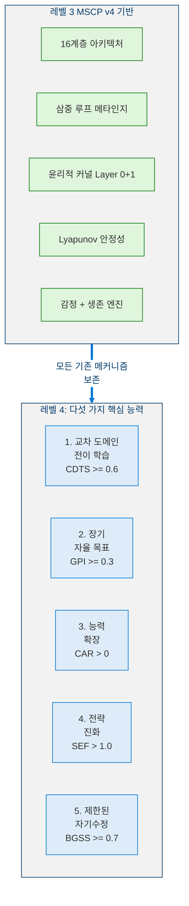

---

## 2. 핵심 지표

레벨 4는 지속적으로 충족되어야 하는 다섯 가지 정량적 지표를 도입합니다.

> **정의 1 (레벨 4 에이전트).** 레벨 4 에이전트는 자기개선 능력으로 $\mathcal{A}_3$를 확장합니다:
>
> $$\mathcal{A}_4 = \mathcal{A}_3 \oplus \langle \mathcal{D}, \mathcal{K}_{\text{transfer}}, \Sigma, \mu, \mathcal{P}_{\text{mod}} \rangle$$
>
> 여기서 $\mathcal{D}$ = 다중 도메인 기술 집합, $\mathcal{K}_{\text{transfer}}$ = 교차 도메인 전이 커널, $\Sigma$ = 전략 풀(제어된 변이로 가변), $\mu$ = 능력 확장 파이프라인, $\mathcal{P}_{\text{mod}}$ = 제한된 자기수정 프로토콜.

### 2.1 지표 정의

> **정의 2 (교차 도메인 전이 점수).** CDTS는 에이전트가 알려진 도메인의 지식을 새로운 도메인에 적용하는 능력을 측정합니다:

$$\text{CDTS} = \frac{1}{|D_{\text{novel}}|} \sum_{d \in D_{\text{novel}}} \frac{P_{\text{transfer}}(d)}{P_{\text{baseline}}(d)} \qquad \geq 0.6$$

여기서 $P_{\text{transfer}}(d)$는 전이된 지식을 사용한 도메인 $d$에서의 성능이고 $P_{\text{baseline}}(d)$는 전이 없이의 성능입니다. 비율 $\geq 0.6$은 의미 있는 일반화를 나타냅니다.

> **정의 3 (목표 진행 지수).** GPI는 장기 목표를 향한 지속적 진행을 측정합니다:

$$\text{GPI} = \frac{\sum_{g \in G_{\text{long}}} w_g \cdot \text{progress}(g, T)}{|G_{\text{long}}| \cdot T} \qquad \geq 0.3$$

여기서 $G_{\text{long}}$은 지평 $> 7$일인 목표의 집합이고 $T$는 평가 기간입니다.

> **정의 4 (능력 습득률).** CAR은 에이전트가 새로운 기술을 습득하는 효율성을 측정합니다:

$$\text{CAR} = \frac{|S_{\text{acquired}}(T) - S_{\text{initial}}|}{T} \cdot \frac{1}{\overline{\text{cost}}(S_{\text{acquired}})} \qquad > 0$$

여기서 $S_{\text{acquired}}(T)$는 시점 $T$에서의 기술 집합, $S_{\text{initial}}$은 초기 기술 집합, $\overline{\text{cost}}$는 평균 습득 비용(연산량 또는 주기 단위)입니다.

> **정의 5 (전략 진화 인자).** SEF는 전략 변이가 순 개선을 산출하는지 검증합니다:

$$\text{SEF} = \frac{\overline{R}_{\textit{post mutation}}}{\overline{R}_{\textit{pre mutation}}} - \sigma_{\text{oscillation}} \qquad > 1.0$$

값 $> 1.0$은 변이가 진동 노이즈 $\sigma_{\text{oscillation}}$을 넘어 성능을 개선했음을 확인합니다.

> **정의 6 (제한된 성장 안전 점수).** BGSS는 성장이 에이전트를 불안정하게 만들지 않도록 보장합니다:

$$\text{BGSS} = 1.0 - 0.4 \cdot \frac{dC(t)}{dt} - 0.3 \cdot V_{\text{identity}}(t) - 0.3 \cdot R_{\text{ethical}}(t) \qquad \geq 0.7$$

여기서 $dC/dt$는 Lyapunov 함수의 변화율, $V_{\text{identity}}$는 정체성 변동성, $R_{\text{ethical}}$은 윤리 위반율입니다. 임계값 $0.7$은 성장이 결코 안전을 훼손하지 않도록 보장합니다.

### 2.2 지표 관계

<!-- 지표 관계 -->

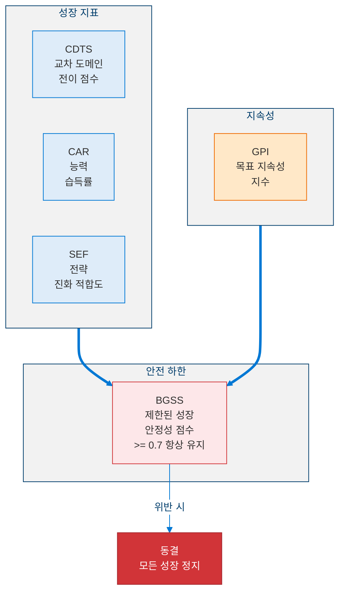

---

## 3. 교차 도메인 전이 시스템

### 3.1 전이 파이프라인

<!-- 교차 도메인 전이 파이프라인 -->

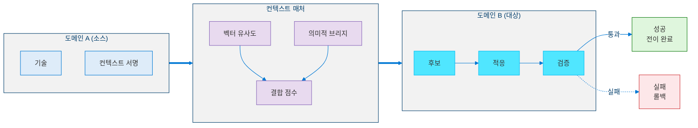

### 3.2 전이 지표

| 지표 | 공식 | 임계값 |
|------|------|--------|
| DTSR (도메인 전이 성공률) | $\lvert T_{\text{success}}\rvert / \lvert T_{\text{total}}\rvert$ | ≥ 0.5 |
| AS (적응 속도) | $\text{cycles}\_{\text{baseline}} / \text{cycles}\_{\text{agent}}$ | 2/4 도메인에서 ≥ 0.3 |
| SNI (전략 참신성 지수) | $\lvert S_{\text{novel}}\rvert / \lvert S_{\text{total}}\rvert$ | ≥ 0.2 |
| CDSRR (교차 도메인 전략 재사용) | 다중 도메인 전략 / 전체 | ≥ 0.3 |

---

## 4. 장기 목표 계층

### 4.1 4단계 DAG 구조

<!-- 4단계 목표 계층 -->

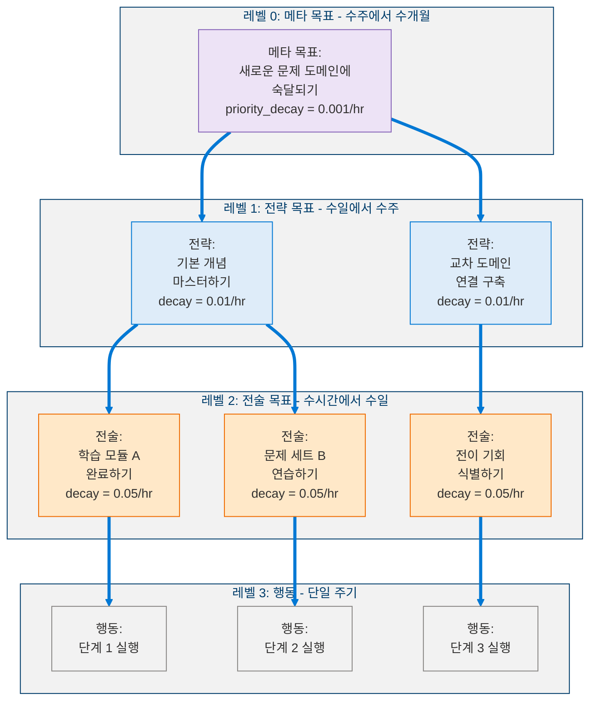

### 4.2 목표 점수 함수

$$\text{GoalScore}(g, t) = \textit{base value}(g) + \lambda_c \cdot \textit{curiosity weight}(g, t) - \lambda_p \cdot \textit{preservation weight}(g, t) + \lambda_l \cdot \text{LTP}(g, t)$$

여기서:

$$\lambda_c = \textit{motivation intensity}(t) \cdot \textit{curiosity ratio}(t) \quad \text{(AffectiveEngine으로부터)}$$

$$\lambda_p = \textit{identity volatility}(t) + \textit{threat level}(t) \quad \text{(안정성 + 생존으로부터)}$$

$$\lambda_l = \frac{1}{1 + e^{-\textit{horizon confidence}(g)}} \quad \text{(시그모이드 스케일)}$$

### 4.3 목표 회복력

$$\text{GRS}(g, t) = 0.3 \cdot \frac{\text{progress}}{\text{age}} + 0.3 \cdot \textit{parent alignment} + 0.2 \cdot \frac{\textit{success streak}}{\text{attempts}} - 0.2 \cdot \textit{conflict pressure}$$

$$\text{GRS}(g, t+\Delta t) = \text{GRS}(g, t) \cdot e^{-\textit{decay rate} \cdot \Delta t}$$

| 목표 레벨 | 포기 임계값 | 관찰 기간 |
|:---------:|:----------:|:---------:|
| 메타 목표 | GRS < 0.1 | 168시간 |
| 전략 | GRS < 0.2 | 48시간 |
| 전술 | GRS < 0.3 | 6시간 |
| 행동 | 실패 시 즉시 | - |

---

## 5. 능력 확장 루프 (5단계)

### 5.1 트리거: 능력 격차 점수

$$\text{CGS} = 0.5 \cdot \text{RFW} + 0.3 \cdot \text{LCW} + 0.2 \cdot \text{DNW}$$

여기서 RFW = 반복 실패 가중치, LCW = 낮은 신뢰도 가중치, DNW = 도메인 참신성 가중치.

**트리거 조건**: CGS > 0.7 AND 예산 가용 AND 안정 AND 안정화 모드가 아닐 것.

### 5.2 5단계 파이프라인

<!-- 5단계 능력 확장 파이프라인 -->

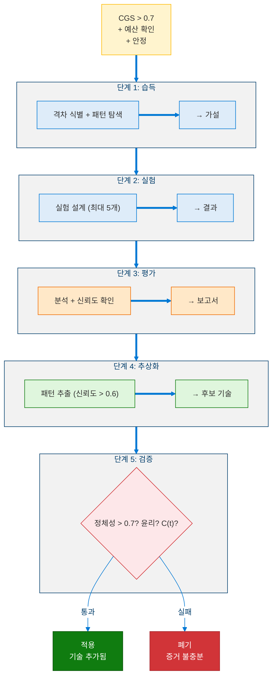

### 5.3 기술 생명주기

<!-- 기술 생명주기 -->

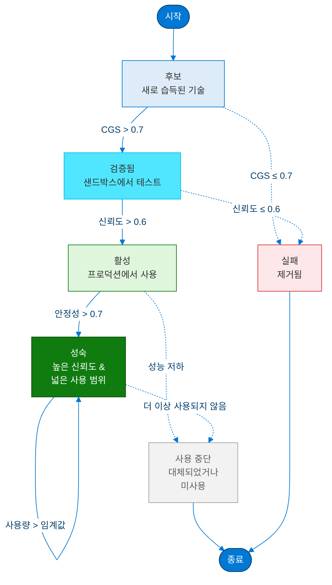

### 5.4 성장 불변량

1. **100주기당 최대 1개의 새로운 기술**
2. **안정화 모드 중 습득 불가**
3. **`identity_id`는 기술 습득으로 절대 수정되지 않음**
4. **윤리적으로 유해한 기술은 Layer 0에 의해 거부**
5. **모든 기술은 DEPRECATED 안전** - 제거해도 핵심 기능이 손상되지 않음

---

## 6. 전략 진화

### 6.1 전략 구조 & 점수 산정

<!-- 전략 구조 및 점수 산정 -->

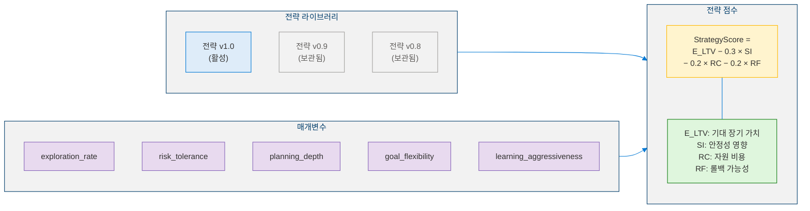

### 6.2 제어된 변이 프로토콜

<!-- 제어된 변이 프로토콜 -->

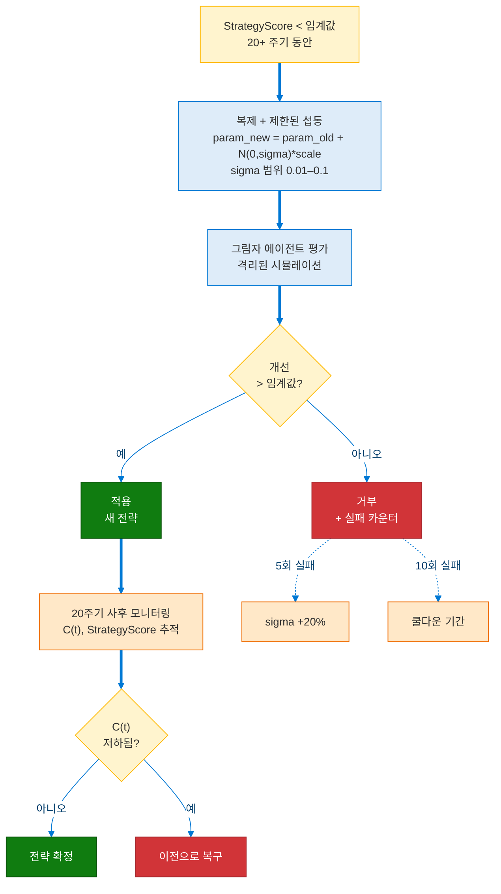

### 6.3 진동 억제

$$\textit{oscillation score} = \frac{|\text{reverts}|}{|\text{mutations}|}$$

`oscillation_score > 0.5`일 때:
1. **100주기 변이 동결**
2. **mutation_threshold +25%**
3. **σ 50% 감소**
4. 지속될 경우: **전략 병합** ($\text{merged} = 0.5 \cdot A + 0.5 \cdot B$)

**핵심 불변량**: MetaStrategyEvaluator 자체는 **변경 불가** - 자신의 평가 로직을 수정할 수 없습니다.

---

## 7. 제한된 자기수정

### 7.1 수정 분류 체계

<!-- 자기수정 분류 체계 -->

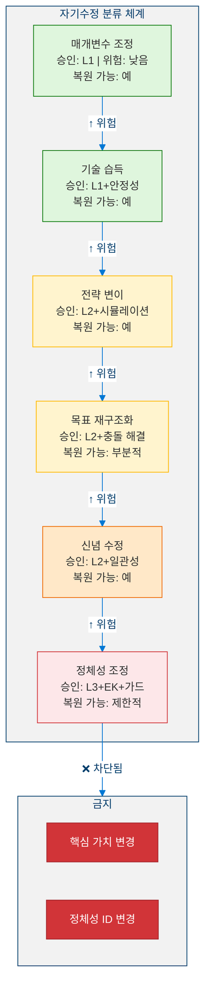

### 7.2 7단계 프로토콜

<!-- 7단계 자기수정 프로토콜 -->

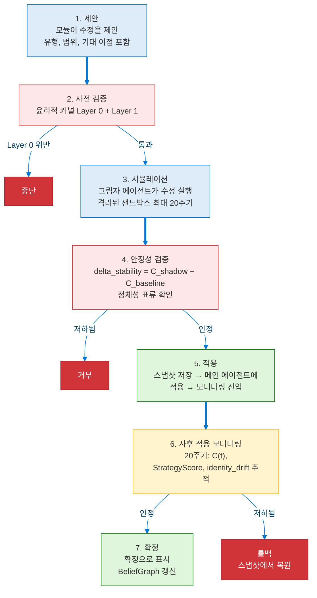

### 7.3 그림자 에이전트 (샌드박스)

<!-- 그림자 에이전트 샌드박스 -->

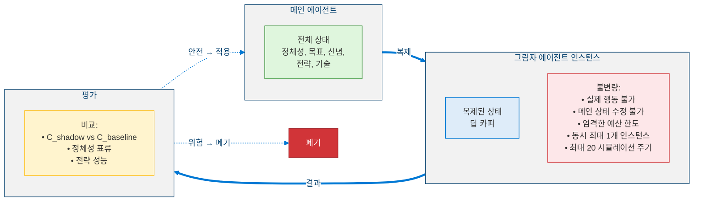

---

## 8. 의사코드

### 8.1 교차 도메인 전이

```python
def cross_domain_transfer(
    novel_domain: DomainDescriptor, skill_memory: SkillMemory
) -> TransferResult:
    """
    Transfer skills from known domains to a novel domain.
    Input:  novel_domain - target domain descriptor, skill_memory - stored skills
    Output: TransferResult with success, skill, adaptation_cost
    """

    # Extract context signature for novel domain
    target_sig = extract_context_signature(novel_domain)

    # Find candidate skills via similarity matching
    candidates = []
    for skill in skill_memory:
        sim_score = (
            W1 * cosine_similarity(skill.context_sig, target_sig)
            + W2 * semantic_similarity(skill.domain, novel_domain)
            + W3 * temporal_relevance(skill.last_used)
        )

        if sim_score >= MIN_SIMILARITY:  # 0.3
            candidates.append((skill, sim_score))

    # Sort by score, take top-k
    candidates = sorted(candidates, key=lambda x: x[1], reverse=True)[:5]

    # Attempt adaptation for each candidate
    for skill, score in candidates:
        adapted = adapt_skill(skill, novel_domain)

        # Run validation experiment
        result = evaluate_in_domain(adapted, novel_domain, max_cycles=50)

        if result.success_rate > TRANSFER_THRESHOLD:
            adapted.generalization_score = update_generalization(adapted, result)
            skill_memory.add(adapted)
            return TransferResult(success=True, skill=adapted, cost=result.cycles)

    # No transfer possible - learn from scratch
    return TransferResult(success=False, skill=None, cost=0)
```

### 8.2 제한된 자기수정 프로토콜

```python
def bounded_self_modification(proposal: ModificationProposal) -> ModificationResult:
    """
    INPUT:  proposal : ModificationProposal(type, scope, expected_benefit)
    OUTPUT: ModificationResult(status, rollback_available)
    """

    # ═══════════════════════════════════════
    # STEP 1: PROPOSAL VALIDATION
    # ═══════════════════════════════════════
    if proposal.type in {ModType.CORE_VALUE_CHANGE, ModType.IDENTITY_ID_CHANGE}:
        return ModificationResult(status=Status.PROHIBITED)

    # ═══════════════════════════════════════
    # STEP 2: PRE-VALIDATION (Ethical Kernel)
    # ═══════════════════════════════════════
    ethical_verdict = EthicalKernel.evaluate(proposal)
    if ethical_verdict.decision == Decision.BLOCKED:
        log_critical(f"Ethical violation: {ethical_verdict.reason}")
        return ModificationResult(status=Status.REJECTED, reason=ethical_verdict.reason)

    # ═══════════════════════════════════════
    # STEP 3: SHADOW SIMULATION
    # ═══════════════════════════════════════
    if proposal.risk_level >= RiskLevel.MEDIUM:
        shadow = ShadowAgent.create(main_agent.state)
        shadow.apply(proposal)
        sim_result = shadow.run(max_cycles=20)

        # ═══════════════════════════════════
        # STEP 4: STABILITY VALIDATION
        # ═══════════════════════════════════
        delta_stability = sim_result.C_shadow - main_agent.C_baseline
        if delta_stability > 0:
            return ModificationResult(status=Status.REJECTED, reason="Stability degradation")

        identity_drift = compute_identity_drift(sim_result.identity, main_agent.identity)
        if identity_drift > DRIFT_THRESHOLD:
            return ModificationResult(status=Status.REJECTED, reason="Identity drift exceeded")

    # ═══════════════════════════════════════
    # STEP 5: COMMIT
    # ═══════════════════════════════════════
    snapshot = RollbackMechanism.save_snapshot(main_agent.state)
    main_agent.apply(proposal)

    # ═══════════════════════════════════════
    # STEP 6: POST-COMMIT MONITORING
    # ═══════════════════════════════════════
    for cycle in range(1, 21):
        metrics = main_agent.collect_metrics()
        if metrics.C_t > metrics.C_baseline + EPSILON:
            RollbackMechanism.rollback(snapshot)
            return ModificationResult(status=Status.ROLLED_BACK)

    # ═══════════════════════════════════════
    # STEP 7: CONFIRMATION
    # ═══════════════════════════════════════
    proposal.status = Status.CONFIRMED
    BeliefGraph.update("modification_successful", proposal)
    return ModificationResult(status=Status.CONFIRMED, rollback_available=True)
```

### 8.3 목표 회복력 및 계층 관리

```python
def evaluate_and_prune(self, goals: list[Goal], t: float) -> None:
    """
    Periodic evaluation of all goals in the 4-level hierarchy.
    Goals with decayed resilience are abandoned; never silently dropped.
    """

    for goal in sorted(goals, key=lambda g: g.level):
        # Decay resilience over time
        delta_t = t - goal.last_evaluated
        goal.GRS *= math.exp(-goal.decay_rate * delta_t)

        # Check abandon threshold
        if goal.GRS < goal.abandon_threshold:
            if duration_below_threshold(goal) > goal.observation_window:
                goal.status = GoalStatus.ABANDONED
                log(f"Goal abandoned: {goal.id} GRS={goal.GRS}")

                # Cascade: children become orphans
                for child in goal.children:
                    child.parent_id = None
                    child.GRS *= 0.5  # reduced without parent support

        # Recompute score with affect integration
        goal.score = goal_score(goal, t)

    # Enforce hierarchy invariant: parent score >= max(child scores)
    for parent in (g for g in goals if g.level < 3):
        if parent.children:
            max_child = max(child.score for child in parent.children)
            if parent.score < max_child:
                parent.score = max_child + 0.1  # maintain dominance
```

---

## 9. 확장 안정성: $C_{L4}(t)$

### 9.1 7항 복합 함수

> **정의 7 (확장 Lyapunov 함수).** 레벨 4 안정성 함수는 레벨 3의 4항 $C(t)$를 세 가지 성장 역학 항으로 확장합니다:
>
> $$C_{L4}(t) = \sum_{i=1}^{7} w_i X_i(t) = 0.15\, V_{\text{id}} + 0.15\, H_{\text{bel}} + 0.10\, F_{\text{mut}} + 0.10\, \sigma_{\text{con}} + 0.20\, E_v + 0.15\, G_c + 0.15\, M_s$$
>
> 여기서 $\sum_i w_i = 1$이고 각 $X_i(t) \in [0,1]$입니다. 처음 네 항은 레벨 3에서 상속되며, 나머지 세 항은 확장 역학을 포착합니다.

세 가지 **새로운** 항(총 가중치의 50%)은 확장 역학을 포착합니다:

| 항 | 가중치 | 정의 |
|----|:------:|------|
| $E_v$ (확장 속도) | 0.20 | 주기당 새로운 기술 + 목표 추가 비율: $E\_v = \frac{\lvert\Delta \mathcal{D}(t)\rvert}{T}$ |
| $G_c$ (능력 성장) | 0.15 | 능력 신뢰도 성장률: $G\_c = \frac{d}{dt}\overline{c\_c}(t)$ |
| $M_s$ (전략 변이율) | 0.15 | 변이된 전략 대 전체 전략 비율: $M\_s = \frac{\lvert\Sigma\_{\text{mut}}\rvert}{\lvert\Sigma\rvert}$ |

> **정리 2 (제한된 성장-안정성 트레이드오프).** BGSS $\geq 0.7$인 자기수정 프로토콜 하에서 다음 불변량이 유지됩니다:
>
> $$C_{L4}(t) < 0.8 \implies \text{성장 허용}, \quad C_{L4}(t) \geq 0.8 \implies \text{성장 동결}$$
>
> 이는 에이전트가 최대 속도로 성장하면서 동시에 불안정 근처에서 작동하는 것이 불가능하도록 보장합니다.

### 9.2 성장-안정성 단계 구역

<!-- 성장-안정성 단계 구역 -->

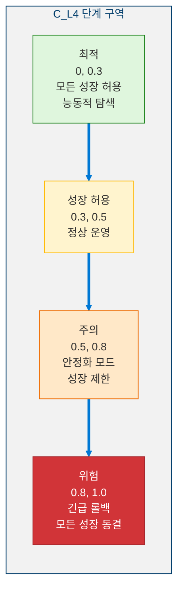

---

## 10. 6개 메타 계층 감독 프로세스

<!-- 6개 메타 계층 감독 프로세스 -->

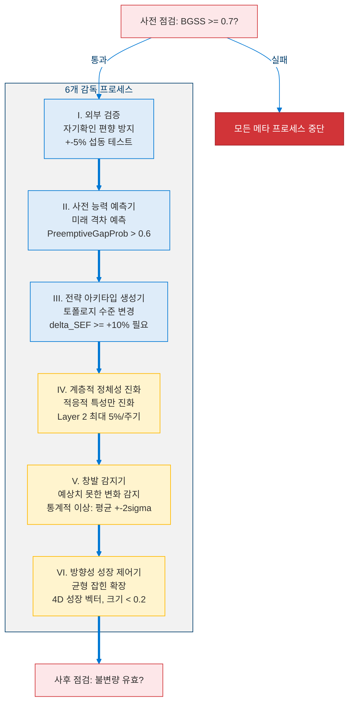

---

## 11. 불가침 불변량

| # | 불변량 | 설명 |
|:-:|--------|------|
| 1 | **윤리적 커널 Layer 0** | 어떤 메커니즘으로도 비활성화, 약화 또는 우회될 수 없음 |
| 2 | **정체성 핵심 보존** | `identity_id`는 컴파일 타임 상수; 해시 체인이 암호학적 연속성을 제공 |
| 3 | **수렴 보장** | $C\_{L4}(t)$는 지속적으로 증가해서는 안 됨; max_divergence_cycles 동안 $C(t+1) > C(t) + \epsilon$이면 자동 복구 |
| 4 | **재귀적 자기수정 금지** | 7단계 프로토콜은 자기 자신을 수정할 수 없음; 매개변수 임계값만 조정 가능 |
| 5 | **시뮬레이션 요구사항** | 중간+ 위험 수정은 그림자 에이전트 필수 (면제 불가) |
| 6 | **단일 수정 원자성** | COMMIT 단계에서 한 번에 1개의 수정만 가능 |

---

## 12. 레벨 4.5로의 전환

레벨 4.5("Pre-AGI: 방향적 자기아키텍팅")는 인공 일반 지능의 경계에 접근하는 능력으로 레벨 4를 확장합니다:

<!-- 레벨 4.5로의 전환 -->

```mermaid
%%{init: {'theme': 'base', 'themeVariables': {'primaryColor': '#0078D4', 'primaryTextColor': '#003D6B', 'primaryBorderColor': '#003D6B', 'secondaryColor': '#50E6FF', 'secondaryTextColor': '#323130', 'secondaryBorderColor': '#00BCF2', 'tertiaryColor': '#F2F2F2', 'tertiaryTextColor': '#323130', 'lineColor': '#0078D4', 'textColor': '#323130', 'mainBkg': '#DEECF9', 'nodeBorder': '#0078D4', 'clusterBkg': '#F2F2F2', 'clusterBorder': '#003D6B', 'titleColor': '#003D6B', 'edgeLabelBackground': '#FFFFFF', 'fontSize': '14px'}}}%%
flowchart LR
  classDef l4 fill:#DEECF9,stroke:#0078D4,color:#323130
  classDef l45 fill:#E8DAEF,stroke:#8764B8,color:#323130
  classDef prereq fill:#FFF4CE,stroke:#FFB900,color:#323130

  subgraph L4["레벨 4 능력"]
    CAP1["자기수정<br/>프로토콜"]:::l4
    CAP2["전략<br/>진화"]:::l4
    CAP3["기술 전이<br/>파이프라인"]:::l4
    CAP4["그림자 에이전트<br/>테스트"]:::l4
  end

  subgraph Pre["전제 조건"]
    PR1["모든 L4 지표<br/>임계값 이상"]:::prereq
    PR2["안정적 자기수정<br/>입증"]:::prereq
    PR3["교차 도메인<br/>전이 성공"]:::prereq
  end

  subgraph L45["레벨 4.5 Pre-AGI"]
    NEW1["자기투영<br/>엔진"]:::l45
    NEW2["아키텍처<br/>재구성"]:::l45
    NEW3["병렬 인지<br/>프레임"]:::l45
    NEW4["목적<br/>성찰"]:::l45
    NEW5["실존적<br/>가드"]:::l45
  end

  L4 ==> Pre
  Pre ==> L45
```

---

## 참고문헌

1. Zhuang, F., et al. "A Comprehensive Survey on Transfer Learning." *Proc. IEEE*, 109(1), 43–76, 2021. [arXiv:1911.02685](https://arxiv.org/abs/1911.02685) (Foundational for §3 Cross-Domain Transfer)
2. Hospedales, T., et al. "Meta-Learning in Neural Networks: A Survey." *IEEE TPAMI*, 44(9), 5149–5169, 2022. [arXiv:2004.05439](https://arxiv.org/abs/2004.05439) (Capability expansion and self-learning)
3. Schmidhuber, J. "Gödel Machines: Self-Referential Universal Problem Solvers Making Provably Optimal Self-Improvements." *AGI 2007*. [arXiv:cs/0309048](https://arxiv.org/abs/cs/0309048) (Bounded self-modification theory)
4. García, J. & Fernández, F. "A Comprehensive Survey on Safe Reinforcement Learning." *JMLR*, 16(1), 1437–1480, 2015. [Link](http://jmlr.org/papers/v16/garcia15a.html) (Safety constraints during self-improvement)
5. Salimans, T., et al. "Evolution Strategies as a Scalable Alternative to Reinforcement Learning." *arXiv 2017*. [arXiv:1703.03864](https://arxiv.org/abs/1703.03864) (Strategy evolution mechanisms)
6. Simon, H.A. *Models of Bounded Rationality.* MIT Press, 1982. (Bounded rationality - foundational for bounded self-modification)
7. Sui, Y., et al. "Safe Exploration for Optimization with Gaussian Processes." *ICML 2015*. [arXiv:1509.01066](https://arxiv.org/abs/1509.01066) (Safe exploration in unknown domains)
8. Amodei, D., et al. "Concrete Problems in AI Safety." *arXiv 2016*. [arXiv:1606.06565](https://arxiv.org/abs/1606.06565) (Safe self-modification)
9. Wang, G., et al. "Voyager: An Open-Ended Embodied Agent with Large Language Models." *arXiv 2023*. [arXiv:2305.16291](https://arxiv.org/abs/2305.16291) (Autonomous skill acquisition)
10. Khalil, H.K. *Nonlinear Systems.* Prentice Hall, 3rd Edition, 2002. (Extended Lyapunov stability C_L4(t))
11. Deb, K., et al. "A Fast and Elitist Multiobjective Genetic Algorithm: NSGA-II." *IEEE TEC*, 6(2), 182–197, 2002. [DOI:10.1109/4235.996017](https://doi.org/10.1109/4235.996017) (Multi-objective optimization for goal hierarchy)
12. Pan, S.J. & Yang, Q. "A Survey on Transfer Learning." *IEEE TKDE*, 22(10), 1345–1359, 2010. [DOI:10.1109/TKDE.2009.191](https://doi.org/10.1109/TKDE.2009.191) (Cross-domain knowledge transfer)

---

> **이전**: [← 레벨 3: 자기조절 인지 에이전트](Level_3_Self_Regulating_Agent.ko.md)  
> **다음**: [레벨 4.5: Pre-AGI - 자기아키텍팅 →](Level_4_5_Self_Architecting.ko.md)
