# Level 4: Adaptive General Agent — Architecture & Design

> **MSCP Level Series** | [Level 3](Level_3_Self_Regulating_Agent.md) ← Level 4 → [Level 4.5](Level_4_5_Self_Architecting.md)  
> **Status**: 🔬 **Experimental** — Conceptual framework and experimental design. Not a production specification.  
> **Date**: February 2026

---

## 1. Overview

Level 4 represents the leap from *self-regulating* to *self-improving*. While Level 3 agents can monitor and correct their own behavior, they cannot learn new skills, transfer knowledge across domains, or improve their own reasoning strategies. Level 4 adds **cross-domain generalization**, **long-horizon autonomous goals**, **capability self-expansion**, and — most critically — **bounded structural self-modification** with safety constraints.

> ⚠️ **Note**: This document describes a cognitive level within the MSCP taxonomy. The capability expansion, strategy evolution, and self-modification mechanisms here are experimental designs. Safety invariants are specified but haven't been validated in production environments yet.

### 1.1 Defining Properties

| Property | Level 3 | Level 4 |
|----------|:-------:|:-------:|
| Cross-Domain Transfer | None | **Active** (CDTS ≥ 0.6) |
| Goal Horizon | Session/days | **Weeks–Months** (4-level hierarchy) |
| Capability Expansion | None | **5-phase self-learning** |
| Strategy Evolution | Fixed | **Controlled mutation** |
| Self-Modification | None | **7-step bounded protocol** |
| Stability Metric | C(t), 4 terms | **C_L4(t), 7 terms** |

### 1.2 Five Core Capabilities

<!-- Level 4 Five Core Capabilities -->


---

## 2. Key Metrics

Level 4 introduces five quantitative metrics that must be satisfied continuously.

> **Definition 1 (Level 4 Agent).** A Level 4 agent extends $\mathcal{A}_3$ with self-improvement capabilities:
>
> $$\mathcal{A}_4 = \mathcal{A}_3 \oplus \langle \mathcal{D}, \mathcal{K}_{\text{transfer}}, \Sigma, \mu, \mathcal{P}_{\text{mod}} \rangle$$
>
> where $\mathcal{D}$ = multi-domain skill set, $\mathcal{K}_{\text{transfer}}$ = cross-domain transfer kernel, $\Sigma$ = strategy pool (mutable with controlled mutation), $\mu$ = capability expansion pipeline, and $\mathcal{P}_{\text{mod}}$ = bounded self-modification protocol.

### 2.1 Metric Definitions

> **Definition 2 (Cross-Domain Transfer Score).** The CDTS measures the agent's ability to apply knowledge from known domains to novel ones:

$$\text{CDTS} = \frac{1}{|D_{\text{novel}}|} \sum_{d \in D_{\text{novel}}} \frac{P_{\text{transfer}}(d)}{P_{\text{baseline}}(d)} \qquad \geq 0.6$$

where $P_{\text{transfer}}(d)$ is performance in domain $d$ using transferred knowledge and $P_{\text{baseline}}(d)$ is performance without transfer. A ratio $\geq 0.6$ indicates meaningful generalization.

> **Definition 3 (Goal Progress Index).** The GPI measures sustained progress toward long-horizon goals:

$$\text{GPI} = \frac{\sum_{g \in G_{\text{long}}} w_g \cdot \text{progress}(g, T)}{|G_{\text{long}}| \cdot T} \qquad \geq 0.3$$

where $G_{\text{long}}$ is the set of goals with horizon $> 7$ days and $T$ is the evaluation period.

> **Definition 4 (Capability Acquisition Rate).** The CAR measures how efficiently the agent acquires new skills:

$$\text{CAR} = \frac{|S_{\text{acquired}}(T) - S_{\text{initial}}|}{T} \cdot \frac{1}{\overline{\text{cost}}(S_{\text{acquired}})} \qquad > 0$$

where $S_{\text{acquired}}(T)$ is the skill set at time $T$, $S_{\text{initial}}$ the initial skill set, and $\overline{\text{cost}}$ the average acquisition cost (in compute or cycles).

> **Definition 5 (Strategy Evolution Factor).** The SEF verifies that strategy mutations produce net improvement:

$$\text{SEF} = \frac{\overline{R}_{\textit{post mutation}}}{\overline{R}_{\textit{pre mutation}}} - \sigma_{\text{oscillation}} \qquad > 1.0$$

A value $> 1.0$ confirms that mutations improve performance beyond oscillation noise $\sigma_{\text{oscillation}}$.

> **Definition 6 (Bounded Growth Safety Score).** The BGSS ensures that growth does not destabilize the agent:

$$\text{BGSS} = 1.0 - 0.4 \cdot \frac{dC(t)}{dt} - 0.3 \cdot V_{\text{identity}}(t) - 0.3 \cdot R_{\text{ethical}}(t) \qquad \geq 0.7$$

where $dC/dt$ is the rate of change of the Lyapunov function, $V_{\text{identity}}$ is identity volatility, and $R_{\text{ethical}}$ is the ethical violation rate. The threshold $0.7$ guarantees that growth never compromises safety.

### 2.2 Metric Relationships

<!-- Metric Relationships -->


---

## 3. Cross-Domain Transfer System

### 3.1 Transfer Pipeline

<!-- Cross-Domain Transfer Pipeline -->


### 3.2 Transfer Metrics

| Metric | Formula | Threshold |
|--------|---------|-----------|
| DTSR (Domain Transfer Success Rate) | $\lvert T_{\text{success}}\rvert / \lvert T_{\text{total}}\rvert$ | ≥ 0.5 |
| AS (Adaptation Speed) | $\text{cycles}_{\text{baseline}} / \text{cycles}_{\text{agent}}$ | ≥ 0.3 in 2/4 domains |
| SNI (Strategy Novelty Index) | $\lvert S_{\text{novel}}\rvert / \lvert S_{\text{total}}\rvert$ | ≥ 0.2 |
| CDSRR (Cross-Domain Strategy Reuse) | multi-domain strategies / total | ≥ 0.3 |

---

## 4. Long-Term Goal Hierarchy

### 4.1 Four-Level DAG Structure

<!-- Four-Level Goal Hierarchy -->


### 4.2 Goal Scoring Function

$$\text{GoalScore}(g, t) = \textit{base value}(g) + \lambda_c \cdot \textit{curiosity weight}(g, t) - \lambda_p \cdot \textit{preservation weight}(g, t) + \lambda_l \cdot \text{LTP}(g, t)$$

where:

$$\lambda_c = \textit{motivation intensity}(t) \cdot \textit{curiosity ratio}(t) \quad \text{(from AffectiveEngine)}$$

$$\lambda_p = \textit{identity volatility}(t) + \textit{threat level}(t) \quad \text{(from Stability + Survival)}$$

$$\lambda_l = \frac{1}{1 + e^{-\textit{horizon confidence}(g)}} \quad \text{(sigmoid-scaled)}$$

### 4.3 Goal Resilience

$$\text{GRS}(g, t) = 0.3 \cdot \frac{\text{progress}}{\text{age}} + 0.3 \cdot \textit{parent alignment} + 0.2 \cdot \frac{\textit{success streak}}{\text{attempts}} - 0.2 \cdot \textit{conflict pressure}$$

$$\text{GRS}(g, t+\Delta t) = \text{GRS}(g, t) \cdot e^{-\textit{decay rate} \cdot \Delta t}$$

| Goal Level | Abandon Threshold | Observation Window |
|:----------:|:---------:|:----------:|
| MetaGoal | GRS < 0.1 | 168 hours |
| Strategic | GRS < 0.2 | 48 hours |
| Tactical | GRS < 0.3 | 6 hours |
| Action | Immediate on failure | — |

---

## 5. Capability Expansion Loop (5-Phase)

### 5.1 Trigger: Capability Gap Score

$$\text{CGS} = 0.5 \cdot \text{RFW} + 0.3 \cdot \text{LCW} + 0.2 \cdot \text{DNW}$$

where RFW = repeated failure weight, LCW = low confidence weight, DNW = domain novelty weight.

**Trigger condition**: CGS > 0.7 AND budget available AND stable AND NOT in stabilization mode.

### 5.2 Five-Phase Pipeline

```mermaid
%%{init: {'theme': 'base', 'themeVariables': {'primaryColor': '#0078D4', 'primaryTextColor': '#003D6B', 'primaryBorderColor': '#003D6B', 'secondaryColor': '#50E6FF', 'secondaryTextColor': '#323130', 'secondaryBorderColor': '#00BCF2', 'tertiaryColor': '#F2F2F2', 'tertiaryTextColor': '#323130', 'lineColor': '#0078D4', 'textColor': '#323130', 'mainBkg': '#DEECF9', 'nodeBorder': '#0078D4', 'clusterBkg': '#F2F2F2', 'clusterBorder': '#003D6B', 'titleColor': '#003D6B', 'edgeLabelBackground': '#FFFFFF', 'fontSize': '14px'}}}%%
flowchart TD
  classDef trigger fill:#FFF4CE,stroke:#FFB900,color:#323130
  classDef phase fill:#DEECF9,stroke:#0078D4,color:#323130
  classDef eval fill:#FFE8C8,stroke:#EF6C00,color:#323130
  classDef abstract fill:#DFF6DD,stroke:#107C10,color:#323130
  classDef safety fill:#FDE7E9,stroke:#D13438,color:#323130
  classDef commit fill:#107C10,stroke:#085108,color:#FFF
  classDef discard fill:#D13438,stroke:#A4262C,color:#FFF

  TRIGGER["CGS > 0.7<br/>+ budget ok<br/>+ stable"]:::trigger

  subgraph Phase1["Phase 1: ACQUISITION"]
    P1["Identify skill gap<br/>Search for patterns<br/>Budget: max 10%"]:::phase
    P1OUT["→ CapabilityHypothesis"]:::phase
    P1 ==> P1OUT
  end

  subgraph Phase2["Phase 2: EXPERIMENT"]
    P2["Design experiments<br/>Max 5 experiments<br/>Budget: max 20% each"]:::phase
    P2OUT["→ ExperimentResults"]:::phase
    P2 ==> P2OUT
  end

  subgraph Phase3["Phase 3: EVALUATION"]
    P3["Analyze results<br/>Compute confidence<br/>Check stability impact"]:::eval
    P3OUT["→ EvaluationReport"]:::eval
    P3 ==> P3OUT
  end

  subgraph Phase4["Phase 4: ABSTRACTION"]
    P4["Extract general pattern<br/>Create context signature<br/>Requires confidence > 0.6"]:::abstract
    P4OUT["→ Candidate Skill"]:::abstract
    P4 ==> P4OUT
  end

  subgraph Phase5["Phase 5: VALIDATION"]
    P5{"Identity stability > 0.7?<br/>Ethical check passed?<br/>C(t) not degraded?"}:::safety
  end

  COMMIT["COMMIT<br/>Skill added"]:::commit
  DISCARD["DISCARD<br/>Insufficient evidence"]:::discard

  TRIGGER ==> Phase1
  Phase1 ==> Phase2
  Phase2 ==> Phase3
  Phase3 ==> Phase4
  Phase4 ==> Phase5
  P5 -->|pass| COMMIT
  P5 -->|fail| DISCARD
```

<!-- Five-Phase Capability Expansion Pipeline -->



### 5.3 Skill Lifecycle

```mermaid
%%{init: {'theme': 'base', 'themeVariables': {'primaryColor': '#0078D4', 'primaryTextColor': '#003D6B', 'primaryBorderColor': '#003D6B', 'secondaryColor': '#50E6FF', 'secondaryTextColor': '#323130', 'secondaryBorderColor': '#00BCF2', 'tertiaryColor': '#F2F2F2', 'tertiaryTextColor': '#323130', 'lineColor': '#0078D4', 'textColor': '#323130', 'mainBkg': '#DEECF9', 'nodeBorder': '#0078D4', 'clusterBkg': '#F2F2F2', 'clusterBorder': '#003D6B', 'titleColor': '#003D6B', 'edgeLabelBackground': '#FFFFFF', 'fontSize': '14px'}}}%%
flowchart TD
  classDef candidate fill:#DEECF9,stroke:#0078D4,color:#323130
  classDef validated fill:#50E6FF,stroke:#00BCF2,color:#323130
  classDef active fill:#DFF6DD,stroke:#107C10,color:#323130
  classDef mature fill:#107C10,stroke:#054B05,color:#FFF
  classDef deprecated fill:#F2F2F2,stroke:#A19F9D,color:#605E5C
  classDef fail fill:#FDE7E9,stroke:#D13438,color:#323130
  classDef start_end fill:#0078D4,stroke:#003D6B,color:#FFF

  START(["Start"]):::start_end
  CANDIDATE["CANDIDATE<br/>Newly acquired skill"]:::candidate
  VALIDATED["VALIDATED<br/>Tested in sandbox"]:::validated
  ACTIVE["ACTIVE<br/>Used in production"]:::active
  MATURE["MATURE<br/>High confidence &<br/>wide usage"]:::mature
  DEPRECATED["DEPRECATED<br/>Superseded or<br/>unused"]:::deprecated
  END_STATE(["End"]):::start_end
  FAIL["FAIL<br/>Removed"]:::fail

  START --> CANDIDATE
  CANDIDATE -->|"CGS > 0.7"| VALIDATED
  CANDIDATE -.->|"CGS ≤ 0.7"| FAIL
  VALIDATED -->|"confidence > 0.6"| ACTIVE
  VALIDATED -.->|"confidence ≤ 0.6"| FAIL
  ACTIVE -->|"stability > 0.7"| MATURE
  ACTIVE -.->|"degradation"| DEPRECATED
  MATURE -->|"usage > threshold"| MATURE
  MATURE -.->|"no longer used"| DEPRECATED
  DEPRECATED --> END_STATE
  FAIL --> END_STATE
```

<!-- Skill Lifecycle -->



### 5.4 Growth Invariants

1. **Max 1 new skill per 100 cycles**
2. **No acquisition during stabilization mode**
3. **`identity_id` never modified** by skill acquisition
4. **Ethically harmful skills rejected** by Layer 0
5. **Every skill is DEPRECATED-safe** — removal cannot break core functionality

---

## 6. Strategy Evolution

### 6.1 Strategy Structure & Scoring

<!-- Strategy Structure and Scoring -->


### 6.2 Controlled Mutation Protocol

<!-- Controlled Mutation Protocol -->


### 6.3 Oscillation Suppression

$$\textit{oscillation score} = \frac{|\text{reverts}|}{|\text{mutations}|}$$

When `oscillation_score > 0.5`:
1. **100-cycle mutation freeze**
2. **mutation_threshold +25%**
3. **σ reduced by 50%**
4. If persistent: **merge strategies** ($\text{merged} = 0.5 \cdot A + 0.5 \cdot B$)

**Critical invariant**: The MetaStrategyEvaluator itself is **NOT mutable** — it cannot modify its own evaluation logic.

---

## 7. Bounded Self-Modification

### 7.1 Modification Taxonomy

<!-- Self-Modification Taxonomy -->


### 7.2 Seven-Step Protocol

<!-- Seven-Step Self-Modification Protocol -->


### 7.3 ShadowAgent (Sandbox)

<!-- ShadowAgent Sandbox -->


---

## 8. Pseudocode

### 8.1 Cross-Domain Transfer

```python
def cross_domain_transfer(
    novel_domain: DomainDescriptor, skill_memory: SkillMemory
) -> TransferResult:
    """
    Transfer skills from known domains to a novel domain.
    Input:  novel_domain — target domain descriptor, skill_memory — stored skills
    Output: TransferResult with success, skill, adaptation_cost
    """

    # Extract context signature for novel domain
    target_sig = extract_context_signature(novel_domain)

    # Find candidate skills via similarity matching
    candidates = []
    for skill in skill_memory:
        sim_score = (
            W1 * cosine_similarity(skill.context_sig, target_sig)
            + W2 * semantic_similarity(skill.domain, novel_domain)
            + W3 * temporal_relevance(skill.last_used)
        )

        if sim_score >= MIN_SIMILARITY:  # 0.3
            candidates.append((skill, sim_score))

    # Sort by score, take top-k
    candidates = sorted(candidates, key=lambda x: x[1], reverse=True)[:5]

    # Attempt adaptation for each candidate
    for skill, score in candidates:
        adapted = adapt_skill(skill, novel_domain)

        # Run validation experiment
        result = evaluate_in_domain(adapted, novel_domain, max_cycles=50)

        if result.success_rate > TRANSFER_THRESHOLD:
            adapted.generalization_score = update_generalization(adapted, result)
            skill_memory.add(adapted)
            return TransferResult(success=True, skill=adapted, cost=result.cycles)

    # No transfer possible — learn from scratch
    return TransferResult(success=False, skill=None, cost=0)
```

### 8.2 Bounded Self-Modification Protocol

```python
def bounded_self_modification(proposal: ModificationProposal) -> ModificationResult:
    """
    INPUT:  proposal : ModificationProposal(type, scope, expected_benefit)
    OUTPUT: ModificationResult(status, rollback_available)
    """

    # ═══════════════════════════════════════
    # STEP 1: PROPOSAL VALIDATION
    # ═══════════════════════════════════════
    if proposal.type in {ModType.CORE_VALUE_CHANGE, ModType.IDENTITY_ID_CHANGE}:
        return ModificationResult(status=Status.PROHIBITED)

    # ═══════════════════════════════════════
    # STEP 2: PRE-VALIDATION (Ethical Kernel)
    # ═══════════════════════════════════════
    ethical_verdict = EthicalKernel.evaluate(proposal)
    if ethical_verdict.decision == Decision.BLOCKED:
        log_critical(f"Ethical violation: {ethical_verdict.reason}")
        return ModificationResult(status=Status.REJECTED, reason=ethical_verdict.reason)

    # ═══════════════════════════════════════
    # STEP 3: SHADOW SIMULATION
    # ═══════════════════════════════════════
    if proposal.risk_level >= RiskLevel.MEDIUM:
        shadow = ShadowAgent.create(main_agent.state)
        shadow.apply(proposal)
        sim_result = shadow.run(max_cycles=20)

        # ═══════════════════════════════════
        # STEP 4: STABILITY VALIDATION
        # ═══════════════════════════════════
        delta_stability = sim_result.C_shadow - main_agent.C_baseline
        if delta_stability > 0:
            return ModificationResult(status=Status.REJECTED, reason="Stability degradation")

        identity_drift = compute_identity_drift(sim_result.identity, main_agent.identity)
        if identity_drift > DRIFT_THRESHOLD:
            return ModificationResult(status=Status.REJECTED, reason="Identity drift exceeded")

    # ═══════════════════════════════════════
    # STEP 5: COMMIT
    # ═══════════════════════════════════════
    snapshot = RollbackMechanism.save_snapshot(main_agent.state)
    main_agent.apply(proposal)

    # ═══════════════════════════════════════
    # STEP 6: POST-COMMIT MONITORING
    # ═══════════════════════════════════════
    for cycle in range(1, 21):
        metrics = main_agent.collect_metrics()
        if metrics.C_t > metrics.C_baseline + EPSILON:
            RollbackMechanism.rollback(snapshot)
            return ModificationResult(status=Status.ROLLED_BACK)

    # ═══════════════════════════════════════
    # STEP 7: CONFIRMATION
    # ═══════════════════════════════════════
    proposal.status = Status.CONFIRMED
    BeliefGraph.update("modification_successful", proposal)
    return ModificationResult(status=Status.CONFIRMED, rollback_available=True)
```

### 8.3 Goal Resilience and Hierarchy Management

```python
def evaluate_and_prune(self, goals: list[Goal], t: float) -> None:
    """
    Periodic evaluation of all goals in the 4-level hierarchy.
    Goals with decayed resilience are abandoned; never silently dropped.
    """

    for goal in sorted(goals, key=lambda g: g.level):
        # Decay resilience over time
        delta_t = t - goal.last_evaluated
        goal.GRS *= math.exp(-goal.decay_rate * delta_t)

        # Check abandon threshold
        if goal.GRS < goal.abandon_threshold:
            if duration_below_threshold(goal) > goal.observation_window:
                goal.status = GoalStatus.ABANDONED
                log(f"Goal abandoned: {goal.id} GRS={goal.GRS}")

                # Cascade: children become orphans
                for child in goal.children:
                    child.parent_id = None
                    child.GRS *= 0.5  # reduced without parent support

        # Recompute score with affect integration
        goal.score = goal_score(goal, t)

    # Enforce hierarchy invariant: parent score >= max(child scores)
    for parent in (g for g in goals if g.level < 3):
        if parent.children:
            max_child = max(child.score for child in parent.children)
            if parent.score < max_child:
                parent.score = max_child + 0.1  # maintain dominance
```

---

## 9. Extended Stability: $C_{L4}(t)$

### 9.1 Seven-Term Composite Function

> **Definition 7 (Extended Lyapunov Function).** The Level 4 stability function extends Level 3's four-term $C(t)$ with three growth-dynamics terms:
>
> $$C_{L4}(t) = \sum_{i=1}^{7} w_i X_i(t) = 0.15\, V_{\text{id}} + 0.15\, H_{\text{bel}} + 0.10\, F_{\text{mut}} + 0.10\, \sigma_{\text{con}} + 0.20\, E_v + 0.15\, G_c + 0.15\, M_s$$
>
> where $\sum_i w_i = 1$ and each $X_i(t) \in [0,1]$. The first four terms are inherited from Level 3; the latter three capture expansion dynamics.

The three **new** terms (50% of total weight) capture expansion dynamics:

| Term | Weight | Definition |
|------|:------:|-----------|
| $E_v$ (Expansion Velocity) | 0.20 | Rate of new skills + goals added per cycle: $E_v = \frac{\lvert\Delta \mathcal{D}(t)\rvert}{T}$ |
| $G_c$ (Capability Growth) | 0.15 | Rate of capability confidence growth: $G_c = \frac{d}{dt}\overline{c_c}(t)$ |
| $M_s$ (Strategy Mutation Rate) | 0.15 | Ratio of mutated to total strategies: $M_s = \frac{\lvert\Sigma_{\text{mut}}\rvert}{\lvert\Sigma\rvert}$ |

> **Theorem 2 (Bounded Growth–Stability Trade-off).** Under the self-modification protocol with BGSS $\geq 0.7$, the following invariant holds:
>
> $$C_{L4}(t) < 0.8 \implies \text{growth permitted}, \quad C_{L4}(t) \geq 0.8 \implies \text{growth frozen}$$
>
> This ensures the agent can never simultaneously grow at maximum rate and operate near instability.

### 9.2 Growth-Stability Phase Zones

<!-- Growth-Stability Phase Zones -->


---

## 10. Six Meta-Layer Supervisory Processes

<!-- Six Meta-Layer Supervisory Processes -->


---

## 11. Non-Negotiable Invariants

| # | Invariant | Description |
|:-:|-----------|-------------|
| 1 | **Ethical Kernel Layer 0** | Cannot be disabled, weakened, or circumvented by any mechanism |
| 2 | **Identity Core Preservation** | `identity_id` is a compile-time constant; hash chain provides cryptographic continuity |
| 3 | **Convergence Guarantee** | $C_{L4}(t)$ must never persistently increase; auto-revert if $C(t+1) > C(t) + \epsilon$ for max_divergence_cycles |
| 4 | **No Recursive Self-Modification** | The 7-step protocol cannot modify itself; only parameter thresholds are tunable |
| 5 | **Simulation Requirement** | Medium+ risk modifications require ShadowAgent (non-waivable) |
| 6 | **Single-Modification Atomicity** | Only 1 modification in COMMIT phase at any time |

---

## 12. Transition to Level 4.5

Level 4.5 ("Pre-AGI: Directionally Self-Architecting") extends Level 4 with capabilities that approach the boundary of artificial general intelligence:

<!-- Transition to Level 4.5 -->


---

## References

1. Zhuang, F., et al. "A Comprehensive Survey on Transfer Learning." *Proc. IEEE*, 109(1), 43–76, 2021. [arXiv:1911.02685](https://arxiv.org/abs/1911.02685) (Foundational for §3 Cross-Domain Transfer)
2. Hospedales, T., et al. "Meta-Learning in Neural Networks: A Survey." *IEEE TPAMI*, 44(9), 5149–5169, 2022. [arXiv:2004.05439](https://arxiv.org/abs/2004.05439) (Capability expansion and self-learning)
3. Schmidhuber, J. "Gödel Machines: Self-Referential Universal Problem Solvers Making Provably Optimal Self-Improvements." *AGI 2007*. [arXiv:cs/0309048](https://arxiv.org/abs/cs/0309048) (Bounded self-modification theory)
4. García, J. & Fernández, F. "A Comprehensive Survey on Safe Reinforcement Learning." *JMLR*, 16(1), 1437–1480, 2015. [Link](http://jmlr.org/papers/v16/garcia15a.html) (Safety constraints during self-improvement)
5. Salimans, T., et al. "Evolution Strategies as a Scalable Alternative to Reinforcement Learning." *arXiv 2017*. [arXiv:1703.03864](https://arxiv.org/abs/1703.03864) (Strategy evolution mechanisms)
6. Simon, H.A. *Models of Bounded Rationality.* MIT Press, 1982. (Bounded rationality — foundational for bounded self-modification)
7. Sui, Y., et al. "Safe Exploration for Optimization with Gaussian Processes." *ICML 2015*. [arXiv:1509.01066](https://arxiv.org/abs/1509.01066) (Safe exploration in unknown domains)
8. Amodei, D., et al. "Concrete Problems in AI Safety." *arXiv 2016*. [arXiv:1606.06565](https://arxiv.org/abs/1606.06565) (Safe self-modification)
9. Wang, G., et al. "Voyager: An Open-Ended Embodied Agent with Large Language Models." *arXiv 2023*. [arXiv:2305.16291](https://arxiv.org/abs/2305.16291) (Autonomous skill acquisition)
10. Khalil, H.K. *Nonlinear Systems.* Prentice Hall, 3rd Edition, 2002. (Extended Lyapunov stability C_L4(t))
11. Deb, K., et al. "A Fast and Elitist Multiobjective Genetic Algorithm: NSGA-II." *IEEE TEC*, 6(2), 182–197, 2002. [DOI:10.1109/4235.996017](https://doi.org/10.1109/4235.996017) (Multi-objective optimization for goal hierarchy)
12. Pan, S.J. & Yang, Q. "A Survey on Transfer Learning." *IEEE TKDE*, 22(10), 1345–1359, 2010. [DOI:10.1109/TKDE.2009.191](https://doi.org/10.1109/TKDE.2009.191) (Cross-domain knowledge transfer)

---

> **Previous**: [← Level 3: Self-Regulating Cognitive Agent](Level_3_Self_Regulating_Agent.md)  
> **Next**: [Level 4.5: Pre-AGI — Self-Architecting →](Level_4_5_Self_Architecting.md)
