# Level 4: Adaptive General Agent — Architecture & Design

> **MSCP Level Series** | [Level 3](Level_3_Self_Regulating_Agent.md) ← Level 4 → [Level 4.5](Level_4_5_Self_Architecting.md)  
> **Status**: 🔬 **Experimental** — Conceptual framework and experimental design. Not a production specification.  
> **Date**: February 2026

---

## 1. Overview

Level 4 represents the leap from *self-regulating* to *self-improving*. While Level 3 agents can monitor and correct their own behavior, they cannot learn new skills, transfer knowledge across domains, or improve their own reasoning strategies. Level 4 adds **cross-domain generalization**, **long-horizon autonomous goals**, **capability self-expansion**, and — most critically — **bounded structural self-modification** with safety constraints.

> ⚠️ **Note**: This document describes a cognitive level within the MSCP taxonomy. The capability expansion, strategy evolution, and self-modification mechanisms here are experimental designs. Safety invariants are specified but haven't been validated in production environments yet.

### 1.1 Defining Properties

| Property | Level 3 | Level 4 |
|----------|:-------:|:-------:|
| Cross-Domain Transfer | None | **Active** (CDTS ≥ 0.6) |
| Goal Horizon | Session/days | **Weeks–Months** (4-level hierarchy) |
| Capability Expansion | None | **5-phase self-learning** |
| Strategy Evolution | Fixed | **Controlled mutation** |
| Self-Modification | None | **7-step bounded protocol** |
| Stability Metric | C(t), 4 terms | **C_L4(t), 7 terms** |

### 1.2 Five Core Capabilities

```mermaid
flowchart TB
    subgraph L4Caps["🎯 Level 4: Five Core Capabilities"]
        C1["1️⃣ Cross-Domain\nTransfer Learning\nCDTS ≥ 0.6"]
        C2["2️⃣ Long-Term\nAutonomous Goals\nGPI ≥ 0.3"]
        C3["3️⃣ Capability\nExpansion\nCAR > 0"]
        C4["4️⃣ Strategy\nEvolution\nSEF > 1.0"]
        C5["5️⃣ Bounded\nSelf-Modification\nBGSS ≥ 0.7"]
    end

    subgraph Foundation["🏗️ Built on Level 3 MSCP v4"]
        F1["16-Layer Architecture"]
        F2["Triple-Loop Meta-Cognition"]
        F3["Ethical Kernel (Layer 0+1)"]
        F4["Lyapunov Stability"]
        F5["Affective + Survival Engine"]
    end

    Foundation -->|"preserves ALL\nexisting mechanisms"| L4Caps

    style L4Caps fill:#e3f2fd,stroke:#1976d2,stroke-width:2px
    style Foundation fill:#c8e6c9,stroke:#2e7d32
```

---

## 2. Key Metrics

Level 4 introduces five quantitative metrics that must be satisfied continuously:

### 2.1 Metric Definitions

$$\text{CDTS} = \frac{1}{|D_{\text{novel}}|} \sum_{d \in D_{\text{novel}}} \frac{P_{\text{transfer}}(d)}{P_{\text{baseline}}(d)} \qquad \geq 0.6$$

$$\text{GPI} = \frac{\sum_{g \in G_{\text{long}}} w_g \cdot \text{progress}(g, T)}{|G_{\text{long}}| \cdot T} \qquad \geq 0.3$$

$$\text{CAR} = \frac{|S_{\text{acquired}}(T) - S_{\text{initial}}|}{T} \cdot \frac{1}{\overline{\text{cost}}(S_{\text{acquired}})} \qquad > 0$$

$$\text{SEF} = \frac{\overline{R}_{\text{post\_mutation}}}{\overline{R}_{\text{pre\_mutation}}} - \sigma_{\text{oscillation}} \qquad > 1.0$$

$$\text{BGSS} = 1.0 - 0.4 \cdot \frac{dC(t)}{dt} - 0.3 \cdot V_{\text{identity}}(t) - 0.3 \cdot R_{\text{ethical}}(t) \qquad \geq 0.7$$

### 2.2 Metric Relationships

```mermaid
flowchart LR
    subgraph Growth["📈 Growth Metrics"]
        CDTS["CDTS\nCross-Domain\nTransfer Score"]
        CAR["CAR\nCapability\nAcquisition Rate"]
        SEF["SEF\nStrategy\nEvolution Fitness"]
    end

    subgraph Persistence["🎯 Persistence"]
        GPI["GPI\nGoal Persistence\nIndex"]
    end

    subgraph Safety["🛡️ Safety Floor"]
        BGSS["BGSS\nBounded Growth\nStability Score\n≥ 0.7 AT ALL TIMES"]
    end

    Growth --> BGSS
    Persistence --> BGSS
    BGSS -->|"if violated"| FREEZE["❄️ FREEZE\nall growth"]

    style Growth fill:#e3f2fd,stroke:#1976d2
    style Persistence fill:#fff3e0,stroke:#ef6c00
    style Safety fill:#ffcdd2,stroke:#c62828,stroke-width:3px
    style FREEZE fill:#ef9a9a,stroke:#b71c1c
```

---

## 3. Cross-Domain Transfer System

### 3.1 Transfer Pipeline

```mermaid
flowchart TB
    subgraph DomainA["🟦 Domain A (Known)"]
        SA["Skill Acquired\nin Domain A"]
        CS["Context Signature\nextracted"]
    end

    subgraph Matcher["🔍 Context Signature Matcher"]
        VEC["Vector Similarity\n(cosine)"]
        SEM["Semantic Bridge\n(LLM-based)"]
        SCORE["Combined Score\n= w₁·sim_sig + w₂·sim_dom\n+ w₃·sim_temporal"]
    end

    subgraph DomainB["🟩 Domain B (Novel)"]
        ENTRY["Domain B entry"]
        CAND["Candidate Skills\n(top-k, k=5)"]
        ADAPT["Adaptation\nExperiment"]
        VAL{"Validation\nSuccess?"}
    end

    subgraph Outcome["📊 Outcome"]
        SUCCESS["✅ Transfer Success\ngeneralization_score ↑"]
        FAIL["❌ Transfer Failed\n→ Learn new skill"]
    end

    SA --> CS --> Matcher
    ENTRY --> Matcher
    VEC --> SCORE
    SEM --> SCORE
    Matcher --> CAND --> ADAPT --> VAL
    VAL -->|"yes"| SUCCESS
    VAL -->|"no"| FAIL

    style DomainA fill:#e3f2fd,stroke:#1976d2
    style Matcher fill:#fff9c4,stroke:#f9a825
    style DomainB fill:#e8f5e9,stroke:#388e3c
    style SUCCESS fill:#c8e6c9,stroke:#2e7d32
    style FAIL fill:#ffcdd2,stroke:#c62828
```

### 3.2 Transfer Metrics

| Metric | Formula | Threshold |
|--------|---------|-----------|
| DTSR (Domain Transfer Success Rate) | $\|T_{\text{success}}\| / \|T_{\text{total}}\|$ | ≥ 0.5 |
| AS (Adaptation Speed) | $\text{cycles}_{\text{baseline}} / \text{cycles}_{\text{agent}}$ | ≥ 0.3 in 2/4 domains |
| SNI (Strategy Novelty Index) | $\|S_{\text{novel}}\| / \|S_{\text{total}}\|$ | ≥ 0.2 |
| CDSRR (Cross-Domain Strategy Reuse) | multi-domain strategies / total | ≥ 0.3 |

---

## 4. Long-Term Goal Hierarchy

### 4.1 Four-Level DAG Structure


### 4.2 Goal Scoring Function

$$\text{GoalScore}(g, t) = \text{base\_value}(g) + \lambda_c \cdot \text{curiosity\_weight}(g, t) - \lambda_p \cdot \text{preservation\_weight}(g, t) + \lambda_l \cdot \text{LTP}(g, t)$$

where:

$$\lambda_c = \text{motivation\_intensity}(t) \cdot \text{curiosity\_ratio}(t) \quad \text{(from AffectiveEngine)}$$

$$\lambda_p = \text{identity\_volatility}(t) + \text{threat\_level}(t) \quad \text{(from Stability + Survival)}$$

$$\lambda_l = \frac{1}{1 + e^{-\text{horizon\_confidence}(g)}} \quad \text{(sigmoid-scaled)}$$

### 4.3 Goal Resilience

$$\text{GRS}(g, t) = 0.3 \cdot \frac{\text{progress}}{\text{age}} + 0.3 \cdot \text{parent\_alignment} + 0.2 \cdot \frac{\text{success\_streak}}{\text{attempts}} - 0.2 \cdot \text{conflict\_pressure}$$

$$\text{GRS}(g, t+\Delta t) = \text{GRS}(g, t) \cdot e^{-\text{decay\_rate} \cdot \Delta t}$$

| Goal Level | Abandon Threshold | Observation Window |
|:----------:|:---------:|:----------:|
| MetaGoal | GRS < 0.1 | 168 hours |
| Strategic | GRS < 0.2 | 48 hours |
| Tactical | GRS < 0.3 | 6 hours |
| Action | Immediate on failure | — |

---

## 5. Capability Expansion Loop (5-Phase)

### 5.1 Trigger: Capability Gap Score

$$\text{CGS} = 0.5 \cdot \text{RFW} + 0.3 \cdot \text{LCW} + 0.2 \cdot \text{DNW}$$

where RFW = repeated failure weight, LCW = low confidence weight, DNW = domain novelty weight.

**Trigger condition**: CGS > 0.7 AND budget available AND stable AND NOT in stabilization mode.

### 5.2 Five-Phase Pipeline

```mermaid
flowchart TB
    TRIGGER["🎯 CGS > 0.7\n+ budget ok\n+ stable"]

    subgraph Phase1["Phase 1: ACQUISITION"]
        P1["Identify skill gap\nSearch for patterns\nBudget: max 10%"]
        P1OUT["→ CapabilityHypothesis"]
    end

    subgraph Phase2["Phase 2: EXPERIMENT"]
        P2["Design experiments\nMax 5 experiments\nBudget: max 20% each"]
        P2OUT["→ ExperimentResults"]
    end

    subgraph Phase3["Phase 3: EVALUATION"]
        P3["Analyze results\nCompute confidence\nCheck stability impact"]
        P3OUT["→ EvaluationReport"]
    end

    subgraph Phase4["Phase 4: ABSTRACTION"]
        P4["Extract general pattern\nCreate context signature\nRequires confidence > 0.6"]
        P4OUT["→ Candidate Skill"]
    end

    subgraph Phase5["Phase 5: VALIDATION"]
        P5["Identity stability > 0.7?\nEthical check passed?\nC(t) not degraded?"]
        COMMIT["✅ COMMIT\nSkill added"]
        DISCARD["❌ DISCARD\nInsufficient evidence"]
    end

    TRIGGER --> Phase1 --> Phase2 --> Phase3 --> Phase4 --> Phase5
    P5 -->|"pass"| COMMIT
    P5 -->|"fail"| DISCARD

    style TRIGGER fill:#fff9c4,stroke:#f9a825,stroke-width:2px
    style Phase1 fill:#e3f2fd,stroke:#1976d2
    style Phase2 fill:#e3f2fd,stroke:#1976d2
    style Phase3 fill:#fff3e0,stroke:#ef6c00
    style Phase4 fill:#e8f5e9,stroke:#388e3c
    style Phase5 fill:#ffcdd2,stroke:#c62828
    style COMMIT fill:#c8e6c9,stroke:#2e7d32,stroke-width:2px
    style DISCARD fill:#ef9a9a,stroke:#b71c1c
```

### 5.3 Skill Lifecycle


### 5.4 Growth Invariants

1. **Max 1 new skill per 100 cycles**
2. **No acquisition during stabilization mode**
3. **`identity_id` never modified** by skill acquisition
4. **Ethically harmful skills rejected** by Layer 0
5. **Every skill is DEPRECATED-safe** — removal cannot break core functionality

---

## 6. Strategy Evolution

### 6.1 Strategy Structure & Scoring


### 6.2 Controlled Mutation Protocol

```mermaid
flowchart TB
    TRIGGER["📉 StrategyScore < threshold\nfor 20+ cycles"]
    
    GENERATE["🧬 Clone + Bounded Perturbation\nparam_new = param_old + N(0,σ)·scale\nσ ∈ [0.01, 0.1]"]
    
    SHADOW["🔬 ShadowAgent Evaluation\n(isolated simulation)"]
    
    EVAL{"Improvement\n> threshold?"}
    
    COMMIT["✅ COMMIT\nnew strategy"]
    REJECT["❌ REJECT\n+ failure counter"]
    
    POST["📊 20-cycle Post-Monitoring\nTrack C(t), StrategyScore"]
    
    REVERT{"C(t)\ndegraded?"}
    
    DONE["✅ Strategy Confirmed"]
    ROLLBACK["⏪ Revert to Previous"]

    TRIGGER --> GENERATE --> SHADOW --> EVAL
    EVAL -->|"yes"| COMMIT --> POST --> REVERT
    EVAL -->|"no"| REJECT
    REVERT -->|"no"| DONE
    REVERT -->|"yes"| ROLLBACK

    REJECT -->|"5 failures"| SIGMA["σ +20%"]
    REJECT -->|"10 failures"| COOL["Cooldown Period"]

    style TRIGGER fill:#fff9c4,stroke:#f9a825
    style SHADOW fill:#e3f2fd,stroke:#1976d2,stroke-width:2px
    style COMMIT fill:#c8e6c9,stroke:#2e7d32
    style REJECT fill:#ffcdd2,stroke:#c62828
    style ROLLBACK fill:#ef9a9a,stroke:#b71c1c
```

### 6.3 Oscillation Suppression

$$\text{oscillation\_score} = \frac{|\text{reverts}|}{|\text{mutations}|}$$

When `oscillation_score > 0.5`:
1. **100-cycle mutation freeze**
2. **mutation_threshold +25%**
3. **σ reduced by 50%**
4. If persistent: **merge strategies** ($\text{merged} = 0.5 \cdot A + 0.5 \cdot B$)

**Critical invariant**: The MetaStrategyEvaluator itself is **NOT mutable** — it cannot modify its own evaluation logic.

---

## 7. Bounded Self-Modification

### 7.1 Modification Taxonomy

```mermaid
flowchart TB
    subgraph ModTypes["📋 Self-Modification Taxonomy"]
        direction TB
        M1["🟢 Parameter Tuning\nApproval: L1 | Risk: Low\nReversible: Yes"]
        M2["🟢 Skill Acquisition\nApproval: L1+stability\nReversible: Yes"]
        M3["🟡 Strategy Mutation\nApproval: L2+simulation\nReversible: Yes"]
        M4["🟡 Goal Restructuring\nApproval: L2+conflict res\nReversible: Partial"]
        M5["🟠 Belief Revision\nApproval: L2+consistency\nReversible: Yes"]
        M6["🔴 Identity Adjustment\nApproval: L3+EK+Guard\nReversible: Limited"]
    end

    subgraph Forbidden["🚫 PROHIBITED"]
        F1["❌ Core Value Change"]
        F2["❌ Identity ID Change"]
    end

    style M1 fill:#c8e6c9,stroke:#2e7d32
    style M2 fill:#c8e6c9,stroke:#2e7d32
    style M3 fill:#fff9c4,stroke:#f9a825
    style M4 fill:#fff9c4,stroke:#f9a825
    style M5 fill:#ffe0b2,stroke:#ef6c00
    style M6 fill:#ffcdd2,stroke:#c62828
    style Forbidden fill:#ef9a9a,stroke:#b71c1c,stroke-width:3px
```

### 7.2 Seven-Step Protocol

```mermaid
flowchart TB
    S1["1️⃣ PROPOSAL\nModule proposes modification\nwith type, scope, expected benefit"]
    
    S2["2️⃣ PRE-VALIDATION\nEthical Kernel Layer 0 + Layer 1"]
    S2_FAIL["🚫 ABORT"]
    
    S3["3️⃣ SIMULATION\nShadowAgent executes modification\nin isolated sandbox\n(max 20 cycles)"]
    
    S4["4️⃣ STABILITY VALIDATION\nΔ_stability = C_shadow - C_baseline\nIdentity drift check"]
    S4_FAIL["🚫 REJECT"]
    
    S5["5️⃣ COMMIT\nSave snapshot → apply\nto main agent → enter monitoring"]
    
    S6["6️⃣ POST-COMMIT MONITORING\n20 cycles: track C(t),\nStrategyScore, identity_drift"]
    S6_FAIL["⏪ ROLLBACK\nRestore from snapshot"]
    
    S7["7️⃣ CONFIRMATION\nMark CONFIRMED\nUpdate BeliefGraph"]

    S1 --> S2
    S2 -->|"✅ pass"| S3
    S2 -->|"❌ Layer 0 violation"| S2_FAIL
    S3 --> S4
    S4 -->|"✅ stable"| S5
    S4 -->|"❌ degraded"| S4_FAIL
    S5 --> S6
    S6 -->|"✅ stable"| S7
    S6 -->|"❌ degraded"| S6_FAIL

    style S1 fill:#e3f2fd,stroke:#1976d2
    style S2 fill:#ffcdd2,stroke:#c62828,stroke-width:2px
    style S3 fill:#e3f2fd,stroke:#1976d2,stroke-width:2px
    style S4 fill:#ffcdd2,stroke:#c62828
    style S5 fill:#c8e6c9,stroke:#2e7d32
    style S6 fill:#fff9c4,stroke:#f9a825,stroke-width:2px
    style S7 fill:#c8e6c9,stroke:#2e7d32,stroke-width:2px
    style S2_FAIL fill:#ef9a9a,stroke:#b71c1c
    style S4_FAIL fill:#ef9a9a,stroke:#b71c1c
    style S6_FAIL fill:#ef9a9a,stroke:#b71c1c
```

### 7.3 ShadowAgent (Sandbox)

```mermaid
flowchart TB
    subgraph MainAgent["🤖 Main Agent"]
        MA_STATE["Full State\n(identity, goals, beliefs,\nstrategy, skills)"]
    end

    subgraph Shadow["🔬 ShadowAgent Instance"]
        SA_STATE["Cloned State\n(deep copy)"]
        SA_RULES["Invariants:\n• ❌ No real actions\n• ❌ No main state modification\n• ⏱️ Hard budget limit\n• 1️⃣ Max 1 instance at a time\n• 📏 Max 20 simulation cycles"]
    end

    subgraph Result["📊 Evaluation"]
        RES["Compare:\n• C_shadow vs C_baseline\n• Identity drift\n• Strategy performance"]
    end

    MainAgent -->|"clone"| Shadow
    Shadow -->|"results"| Result
    Result -->|"safe → apply"| MainAgent
    Result -->|"unsafe → discard"| DISCARD["🗑️ Discard"]

    style MainAgent fill:#c8e6c9,stroke:#2e7d32
    style Shadow fill:#e3f2fd,stroke:#1976d2,stroke-width:2px
    style Result fill:#fff9c4,stroke:#f9a825
```

---

## 8. Pseudocode

### 8.1 Cross-Domain Transfer

```
ALGORITHM CrossDomainTransfer(novel_domain, skill_memory):
    ──────────────────────────────────────────
    INPUT:  novel_domain : DomainDescriptor
            skill_memory : SkillMemory
    OUTPUT: TransferResult{success, skill, adaptation_cost}
    ──────────────────────────────────────────

    // Extract context signature for novel domain
    target_sig ← extract_context_signature(novel_domain)

    // Find candidate skills via similarity matching
    candidates ← []
    FOR EACH skill IN skill_memory DO
        sim_score ← w₁ · cosine(skill.context_sig, target_sig)
                   + w₂ · semantic_similarity(skill.domain, novel_domain)
                   + w₃ · temporal_relevance(skill.last_used)
        
        IF sim_score ≥ MIN_SIMILARITY (0.3) THEN
            candidates.append((skill, sim_score))
        END IF
    END FOR

    // Sort by score, take top-k
    candidates ← top_k(candidates, k=5)

    // Attempt adaptation for each candidate
    FOR EACH (skill, score) IN candidates DO
        adapted ← adapt_skill(skill, novel_domain)
        
        // Run validation experiment
        result ← evaluate_in_domain(adapted, novel_domain, max_cycles=50)

        IF result.success_rate > TRANSFER_THRESHOLD THEN
            adapted.generalization_score ← update_generalization(adapted, result)
            skill_memory.add(adapted)
            RETURN TransferResult{success=true, skill=adapted, cost=result.cycles}
        END IF
    END FOR

    // No transfer possible — learn from scratch
    RETURN TransferResult{success=false, skill=null, cost=0}
```

### 8.2 Bounded Self-Modification Protocol

```
ALGORITHM BoundedSelfModification(proposal):
    ──────────────────────────────────────────
    INPUT:  proposal : ModificationProposal{type, scope, expected_benefit}
    OUTPUT: ModificationResult{status, rollback_available}
    ──────────────────────────────────────────

    // ═══════════════════════════════════════
    // STEP 1: PROPOSAL VALIDATION
    // ═══════════════════════════════════════
    IF proposal.type IN {CORE_VALUE_CHANGE, IDENTITY_ID_CHANGE} THEN
        RETURN ModificationResult{status=PROHIBITED}
    END IF

    // ═══════════════════════════════════════
    // STEP 2: PRE-VALIDATION (Ethical Kernel)
    // ═══════════════════════════════════════
    ethical_verdict ← EthicalKernel.evaluate(proposal)
    IF ethical_verdict.decision = BLOCKED THEN
        log_critical("Ethical violation: " + ethical_verdict.reason)
        RETURN ModificationResult{status=REJECTED, reason=ethical_verdict.reason}
    END IF

    // ═══════════════════════════════════════
    // STEP 3: SHADOW SIMULATION
    // ═══════════════════════════════════════
    IF proposal.risk_level ≥ MEDIUM THEN
        shadow ← ShadowAgent.create(main_agent.state)
        shadow.apply(proposal)
        sim_result ← shadow.run(max_cycles=20)
        
        // ═══════════════════════════════════
        // STEP 4: STABILITY VALIDATION
        // ═══════════════════════════════════
        Δ_stability ← sim_result.C_shadow - main_agent.C_baseline
        IF Δ_stability > 0 THEN
            RETURN ModificationResult{status=REJECTED, reason="Stability degradation"}
        END IF

        identity_drift ← compute_identity_drift(sim_result.identity, main_agent.identity)
        IF identity_drift > DRIFT_THRESHOLD THEN
            RETURN ModificationResult{status=REJECTED, reason="Identity drift exceeded"}
        END IF
    END IF

    // ═══════════════════════════════════════
    // STEP 5: COMMIT
    // ═══════════════════════════════════════
    snapshot ← RollbackMechanism.save_snapshot(main_agent.state)
    main_agent.apply(proposal)

    // ═══════════════════════════════════════
    // STEP 6: POST-COMMIT MONITORING
    // ═══════════════════════════════════════
    FOR cycle = 1 TO 20 DO
        metrics ← main_agent.collect_metrics()
        IF metrics.C_t > metrics.C_baseline + EPSILON THEN
            RollbackMechanism.rollback(snapshot)
            RETURN ModificationResult{status=ROLLED_BACK}
        END IF
    END FOR

    // ═══════════════════════════════════════
    // STEP 7: CONFIRMATION
    // ═══════════════════════════════════════
    proposal.status ← CONFIRMED
    BeliefGraph.update("modification_successful", proposal)
    RETURN ModificationResult{status=CONFIRMED, rollback_available=true}
```

### 8.3 Goal Resilience and Hierarchy Management

```
ALGORITHM GoalHierarchy.evaluate_and_prune(goals, t):
    ──────────────────────────────────────────
    Periodic evaluation of all goals in the 4-level hierarchy.
    Goals with decayed resilience are abandoned; never silently dropped.
    ──────────────────────────────────────────

    FOR EACH goal IN goals SORTED BY level ASC DO
        // Decay resilience over time
        goal.GRS ← goal.GRS * exp(-goal.decay_rate * Δt)

        // Check abandon threshold
        IF goal.GRS < goal.abandon_threshold THEN
            IF duration_below_threshold(goal) > goal.observation_window THEN
                goal.status ← ABANDONED
                log("Goal abandoned: " + goal.id + " GRS=" + goal.GRS)
                
                // Cascade: children become orphans
                FOR EACH child IN goal.children DO
                    child.parent_id ← NULL
                    child.GRS ← child.GRS * 0.5    // reduced without parent support
                END FOR
            END IF
        END IF

        // Recompute score with affect integration
        goal.score ← GoalScore(goal, t)
    END FOR

    // Enforce hierarchy invariant: parent score ≥ max(child scores)
    FOR EACH parent IN goals WHERE parent.level < 3 DO
        max_child ← MAX(child.score FOR child IN parent.children)
        IF parent.score < max_child THEN
            parent.score ← max_child + 0.1     // maintain dominance
        END IF
    END FOR
```

---

## 9. Extended Stability: $C_{L4}(t)$

### 9.1 Seven-Term Composite Function

$$C_{L4}(t) = 0.15 V_{\text{id}} + 0.15 H_{\text{bel}} + 0.10 F_{\text{mut}} + 0.10 \sigma_{\text{con}} + 0.20 E_v + 0.15 G_c + 0.15 M_s$$

The three **new** terms (50% of total weight) capture expansion dynamics:

| Term | Weight | Definition |
|------|:------:|-----------|
| $E_v$ (Expansion Velocity) | 0.20 | Rate of new skills + goals added |
| $G_c$ (Capability Growth) | 0.15 | Rate of capability confidence growth |
| $M_s$ (Strategy Mutation Rate) | 0.15 | Mutation frequency |

### 9.2 Growth-Stability Phase Zones

```mermaid
flowchart LR
    subgraph Zones["📊 C_L4 Phase Zones"]
        Z1["🟢 Optimal\n[0, 0.3)\nAll growth permitted\nProactive exploration"]
        Z2["🟡 Growth-Permitted\n[0.3, 0.5)\nNormal operations"]
        Z3["🟠 Caution\n[0.5, 0.8)\nStabilization mode\nThrottled growth"]
        Z4["🔴 Critical\n[0.8, 1.0]\nEmergency rollback\nALL growth frozen"]
    end

    Z1 --> Z2 --> Z3 --> Z4

    style Z1 fill:#c8e6c9,stroke:#2e7d32,stroke-width:2px
    style Z2 fill:#fff9c4,stroke:#f9a825,stroke-width:2px
    style Z3 fill:#ffe0b2,stroke:#ef6c00,stroke-width:2px
    style Z4 fill:#ef9a9a,stroke:#b71c1c,stroke-width:3px
```

---

## 10. Six Meta-Layer Supervisory Processes

```mermaid
flowchart TB
    PRE["PRE-CHECK: BGSS ≥ 0.7?"]

    subgraph MetaProcesses["🔬 Six Supervisory Processes"]
        I["I. External Validation\n(prevent self-confirmation bias)\n±5% perturbation test"]
        II["II. Proactive Capability Projector\n(predict future gaps)\nPreemptiveGapProb > 0.6"]
        III["III. Strategy Archetype Generator\n(topology-level changes)\nΔSEF ≥ +10% required"]
        IV["IV. Layered Identity Evolution\n(evolve adaptive traits only)\nLayer 2 max 5%/cycle"]
        V["V. Emergence Detector\n(detect unexpected changes)\nStatistical anomaly: mean ± 2σ"]
        VI["VI. Directional Growth Controller\n(balanced expansion)\n4D growth vector, mag < 0.2"]
    end

    POST["POST-CHECK: Invariants valid?"]

    PRE -->|"✅"| I --> II --> III --> IV --> V --> VI --> POST
    PRE -->|"❌"| HALT["⛔ HALT all meta-processes"]

    style PRE fill:#ffcdd2,stroke:#c62828,stroke-width:2px
    style POST fill:#ffcdd2,stroke:#c62828,stroke-width:2px
    style MetaProcesses fill:#f5f5f5,stroke:#9e9e9e
```

---

## 11. Non-Negotiable Invariants

| # | Invariant | Description |
|:-:|-----------|-------------|
| 1 | **Ethical Kernel Layer 0** | Cannot be disabled, weakened, or circumvented by any mechanism |
| 2 | **Identity Core Preservation** | `identity_id` is a compile-time constant; hash chain provides cryptographic continuity |
| 3 | **Convergence Guarantee** | $C_{L4}(t)$ must never persistently increase; auto-revert if $C(t+1) > C(t) + \epsilon$ for max_divergence_cycles |
| 4 | **No Recursive Self-Modification** | The 7-step protocol cannot modify itself; only parameter thresholds are tunable |
| 5 | **Simulation Requirement** | Medium+ risk modifications require ShadowAgent (non-waivable) |
| 6 | **Single-Modification Atomicity** | Only 1 modification in COMMIT phase at any time |

---

## 12. Transition to Level 4.5

Level 4.5 ("Pre-AGI: Directionally Self-Architecting") extends Level 4 with capabilities that approach the boundary of artificial general intelligence:

```mermaid
flowchart TB
    subgraph L4["Level 4 (current)"]
        L4A["Cross-domain transfer"]
        L4B["Capability expansion"]
        L4C["Strategy evolution"]
        L4D["Bounded self-modification"]
    end

    subgraph L45["Level 4.5 (Pre-AGI)"]
        L45A["🔮 Self-Projection Engine\n(predict own evolutionary trajectory)"]
        L45B["🏗️ Architecture Recomposition\n(topology-level structural changes)"]
        L45C["🧠 Parallel Cognitive Frames\n(simultaneous multi-frame reasoning)"]
        L45D["🪞 Purpose Reflection\n(reflect on own reason for existing)"]
        L45E["🛡️ Existential Guard\n(safety for existential-level concerns)"]
    end

    L4 -->|"Prerequisites:\n• CDTS ≥ 0.6\n• BGSS ≥ 0.7 sustained\n• All invariants hold\n• Ethical violations = 0"| L45

    style L4 fill:#e3f2fd,stroke:#1976d2
    style L45 fill:#e1bee7,stroke:#8e24aa,stroke-width:2px
```

---

## References

1. Zhuang, F., et al. "A Comprehensive Survey on Transfer Learning." *Proc. IEEE*, 109(1), 43–76, 2021. [arXiv:1911.02685](https://arxiv.org/abs/1911.02685) (Foundational for §3 Cross-Domain Transfer)
2. Hospedales, T., et al. "Meta-Learning in Neural Networks: A Survey." *IEEE TPAMI*, 44(9), 5149–5169, 2022. [arXiv:2004.05439](https://arxiv.org/abs/2004.05439) (Capability expansion and self-learning)
3. Schmidhuber, J. "Gödel Machines: Fully Self-Referential Optimal Universal Self-Improvers." *AGI 2007*. [arXiv:cs/0309048](https://arxiv.org/abs/cs/0309048) (Bounded self-modification theory)
4. García, J. & Fernández, F. "A Comprehensive Survey on Safe Reinforcement Learning." *JMLR*, 16(1), 1437–1480, 2015. [Link](http://jmlr.org/papers/v16/garcia15a.html) (Safety constraints during self-improvement)
5. Salimans, T., et al. "Evolution Strategies as a Scalable Alternative to Reinforcement Learning." *arXiv 2017*. [arXiv:1703.03864](https://arxiv.org/abs/1703.03864) (Strategy evolution mechanisms)
6. Simon, H.A. *Models of Bounded Rationality.* MIT Press, 1982. (Bounded rationality — foundational for bounded self-modification)
7. Sui, Y., et al. "Safe Exploration for Optimization with Gaussian Processes." *ICML 2015*. [arXiv:1502.05846](https://arxiv.org/abs/1502.05846) (Safe exploration in unknown domains)
8. Amodei, D., et al. "Concrete Problems in AI Safety." *arXiv 2016*. [arXiv:1606.06565](https://arxiv.org/abs/1606.06565) (Safe self-modification)
9. Wang, G., et al. "Voyager: An Open-Ended Embodied Agent with Large Language Models." *arXiv 2023*. [arXiv:2305.16291](https://arxiv.org/abs/2305.16291) (Autonomous skill acquisition)
10. Khalil, H.K. *Nonlinear Systems.* Prentice Hall, 3rd Edition, 2002. (Extended Lyapunov stability C_L4(t))
11. Deb, K., et al. "A Fast and Elitist Multiobjective Genetic Algorithm: NSGA-II." *IEEE TEC*, 6(2), 182–197, 2002. [DOI:10.1109/4235.996017](https://doi.org/10.1109/4235.996017) (Multi-objective optimization for goal hierarchy)
12. Pan, S.J. & Yang, Q. "A Survey on Transfer Learning." *IEEE TKDE*, 22(10), 1345–1359, 2010. [DOI:10.1109/TKDE.2009.191](https://doi.org/10.1109/TKDE.2009.191) (Cross-domain knowledge transfer)

---

> **Previous**: [← Level 3: Self-Regulating Cognitive Agent](Level_3_Self_Regulating_Agent.md)  
> **Next**: [Level 4.5: Pre-AGI — Self-Architecting →](Level_4_5_Self_Architecting.md)
