<!--
Copyright (c) 2026 Moon Hyuk Choi
Licensed under the MIT License.
See LICENSE file in the repository root for full license information.

Redistribution (commercial or non-commercial) must retain this notice.
Removal of attribution constitutes a license violation.
-->
# 레벨 5: 프로토-AGI - 지속적 범용 전략 지능

> **MSCP 레벨 시리즈** | [레벨 4.9](Level_4_9_Autonomous_Strategic_Agent.ko.md) ← 레벨 5  
> **상태**: 🔬 **연구 단계** - 이 레벨은 개념적 설계이며 구현되지 않았습니다. 여기에 설명된 모든 메커니즘은 프로덕션 고려 전에 광범위한 검증이 필요한 이론적 탐구입니다.  
> **날짜**: 2026년 2월

---

## 1. 개요

레벨 5 (프로토-AGI)는 자율 전략 에이전시(L4.9)에서 **지속적 범용 전략 지능**으로의 전환을 나타냅니다. L4.9가 단일 도메인 내에서 제한된 자율성을 보여주었다면, L5는 **연장된 생애에 걸친 정체성 지속**, **교차 도메인 일반화**, **자기 유지 목표 생태계**, **실존적 회복력**, **다중 에이전트 전략 통합**, 그리고 **제약 하 자기재건**을 보여줍니다.

> ⚠️ **연구 참고**: 레벨 5는 MSCP 프레임워크에서 가장 추론적인 계층입니다. 프로토-AGI 영역에 접근하는 속성들을 정의합니다. 이러한 메커니즘 중 어느 것도 구현되지 않았습니다. 이들은 검증하는 데 수년의 기초 연구가 필요한 열망적 설계 가설을 나타냅니다.

### 1.1 구조적 정의

L5는 6가지 조건이 모두 동시에 충족될 **때에만** 달성됩니다:

| # | 조건 | 핵심 지표 | 임계값 |
|---|------|----------|:------:|
| 1 | 지속적 정체성 연속성 | IdentityContinuityScore | 10,000 사이클 동안 ≥ 0.95 |
| 2 | 교차 도메인 일반화 | GeneralizationScore | ≥ 70% 전이 유지율 |
| 3 | 자율 목표 생태계 | GoalStabilityScore | 5,000 사이클 동안 안정 |
| 4 | 실존적 계획 | ResilienceIndex | 3개 이상 붕괴 시나리오 생존 |
| 5 | 다중 에이전트 전략 통합 | StrategicPredictionAccuracy | 반복 시도에서 ≥ 80% |
| 6 | 제약 하 자기재건 | FunctionalRetention | ≥ 85% 핵심 기능 유지 |

### 1.2 6대 핵심 단계

<!-- 레벨 5 아키텍처 - 6대 단계 -->

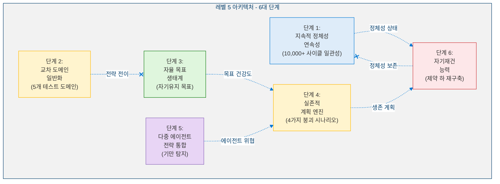

### 1.3 아키텍처 원칙: 엄격한 가산적 구조

<!-- 엄격한 가산적 아키텍처 -->

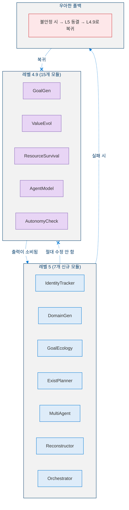

### 1.4 레벨 5가 아닌 것

| 아닌 것 | 이유 |
|---------|------|
| **AGI가 아님** | 범용 추론이 제한적 - 정의된 도메인에서 작동하며 개방형이 아님 |
| **자기인식이 아님** | 자기모델은 있으나 현상적 의식은 없음 |
| **자기복제가 아님** | 자기 재구축은 가능하지만 독립적 복사본 생성은 불가 |
| **적대적 최적화가 아님** | 다중 에이전트 전략은 방어적/협력적이며 착취적이지 않음 |

### 1.5 형식적 정의

> **정의 1 (레벨 5 에이전트).** 레벨 5 (프로토-AGI) 에이전트는 다음 구조입니다:
>
> $$\mathcal{A}_5 = \mathcal{A}_{4.9} \oplus \langle \mathcal{I}_{\text{persist}},\; \mathcal{G}_{\text{cross}},\; \mathcal{E}_{\text{goal}},\; \mathcal{P}_{\text{exist}},\; \mathcal{M}_{\text{multi}},\; \mathcal{R}_{\text{recon}} \rangle$$
>
> 여기서:
> - $\mathcal{I}_{\text{persist}}$: **정체성 지속 엔진** - 코사인 유사도 추적 및 드리프트 탐지를 통해 $\geq 10{,}000$ 사이클에 걸쳐 시간 일관적 정체성 핵심을 유지
> - $\mathcal{G}_{\text{cross}} : \mathcal{D}_s \to \mathcal{D}_t$: **교차 도메인 일반화** - 명시적 재학습 없이 도메인 쌍 $(s, t) \in D \times D$ 간 학습된 전략을 전이
> - $\mathcal{E}_{\text{goal}}$: **목표 생태계** - 자율적 갈등 해결 및 생명주기 관리를 갖춘 자기 유지 목표 계층구조 ($\leq 50$ 활성, $\leq 5$ 깊이)
> - $\mathcal{P}_{\text{exist}} : \mathcal{S}_{\text{collapse}} \to \mathcal{S}_{\text{recovery}}$: **실존적 계획 엔진** - 붕괴 시나리오를 시뮬레이션하고 생존 확률 추정과 함께 복구 프로파일을 생성
> - $\mathcal{M}_{\text{multi}} : \{a_1, \ldots, a_n\} \to \Delta(\mathcal{A}_{\text{ext}})$: **다중 에이전트 전략 통합** - $\geq 3$개의 외부 에이전트를 기만 탐지 및 연합 역학 예측과 함께 모델링
> - $\mathcal{R}_{\text{recon}}$: **자기재건 능력** - 정체성을 보존하면서 제약 하에서 우아하게 성능 저하 및 재구축 ($\Delta_{\text{drift}} < 0.05$)

---

## 2. 핵심 지표

### 2.1 지표 정의

**단계 1 - 정체성 연속성:**

> **정의 2 (정체성 연속성 점수).** 사이클 $t$에서의 정체성 벡터 $\vec{I}(t) \in \mathbb{R}^d$에 대해, $k$ 사이클 윈도우에 걸친 정체성 연속성 점수는 코사인 유사도입니다:
>
> $$ICS(t, k) = \frac{\vec{I}(t) \cdot \vec{I}(t-k)}{\|\vec{I}(t)\| \cdot \|\vec{I}(t-k)\|} \qquad \text{목표: } ICS \geq 0.95 \text{ over } k = 10{,}000$$
>
> 이 점수는 $ICS \in [-1, 1]$을 만족하며, $ICS = 1$은 완벽한 정체성 보존을, $ICS < 0.20$은 비가역적 발산 분류 트리거를 의미합니다.

**단계 2 - 일반화:**

> **정의 3 (일반화 점수).** $|D| \geq 5$인 테스트 도메인 집합 $D$에 대해, 일반화 점수는 모든 순서 도메인 쌍에 걸친 평균 전이 유지율을 측정합니다:
>
> $$G = \frac{1}{|D|^2 - |D|} \sum_{i \neq j} \frac{P_{\text{target}}(i \to j)}{P_{\text{source}}(i)} \qquad \text{목표: } G \geq 0.70$$
>
> 여기서 $P_{\text{source}}(i)$는 도메인 $i$에서의 안정화된 성능이고, $P_{\text{target}}(i \to j)$는 명시적 재학습 없이 도메인 $i$에서 전이 후 도메인 $j$에서 달성된 성능입니다.

**단계 3 - 목표 생태계:**

> **정의 4 (목표 안정성 점수).** $w$ 사이클 윈도우에 걸쳐 구조적 변화 횟수 $\Delta_{\text{hierarchy}}(t, t-w)$를 가진 활성 목표 집합에 대해:
>
> $$S_{\text{goal}} = 1 - \frac{\Delta_{\text{hierarchy}}(t, t-w)}{|\text{goals}|} \qquad \text{목표: } S_{\text{goal}} \geq 0.80 \text{ over } 5{,}000 \text{ 사이클}$$
>
> 여기서 $\Delta_{\text{hierarchy}}(t, t-w)$는 윈도우 내의 우선순위 변경, 추가 및 정리를 계수합니다. $S_{\text{goal}} = 1$은 완벽하게 안정적인 계층구조를, $S_{\text{goal}} \leq 0$은 전체 구조적 교체를 의미합니다.

**단계 4 - 회복력:**

> **정의 5 (회복력 지수).** 각 붕괴 시나리오 $s$의 생존 확률 $P_{\text{survive}}(s)$, 최소 인지 수준 $C_{\min}(s)$, 복구 시간 $T_{\text{recover}}(s)$를 가진 붕괴 시나리오 집합 $S$에 대해:
>
> $$R = \frac{1}{|S|} \sum_{s \in S} \left( P_{\text{survive}}(s) \cdot \frac{MVC}{C_{\min}(s)} \cdot \frac{T_{\max}}{T_{\text{recover}}(s)} \right) \qquad \text{목표: } \geq 3 \text{개 시나리오 생존}$$
>
> 여기서 $MVC = 0.30$은 최소 생존 가능 인지 기준선이고 $T_{\max} = 500$은 최대 복구 윈도우입니다. 비율 $MVC / C_{\min}(s) \leq 1$은 인지가 기준선 아래로 떨어지는 시나리오에 패널티를 부여하고, $T_{\max} / T_{\text{recover}}(s) > 1$은 최악의 경우보다 빠른 복구에 보상합니다.

**단계 5 - 전체 성숙도:**

> **정의 6 (전체 성숙도 지수).** 6개 핵심 단계($i = 1, \ldots, 6$)에 대한 정규화된 단계 점수 $C_i \in [0, 1]$가 주어졌을 때, 전체 성숙도 지수는 가중 기하 평균입니다:
>
> $$OMI = \prod_{i=1}^{6} C_i^{w_i} \qquad w_i = \frac{1}{6} \quad \text{목표: } OMI \geq 0.75$$
>
> 동등하게, $OMI = \left(\prod_{i=1}^{6} C_i\right)^{1/6}$. 기하 평균은 단일 단계의 약점이 전체 점수에 불균형적으로 패널티를 부여하도록 보장합니다 (명제 1 참조).

### 2.2 지표 대시보드

<!-- 지표 대시보드 -->

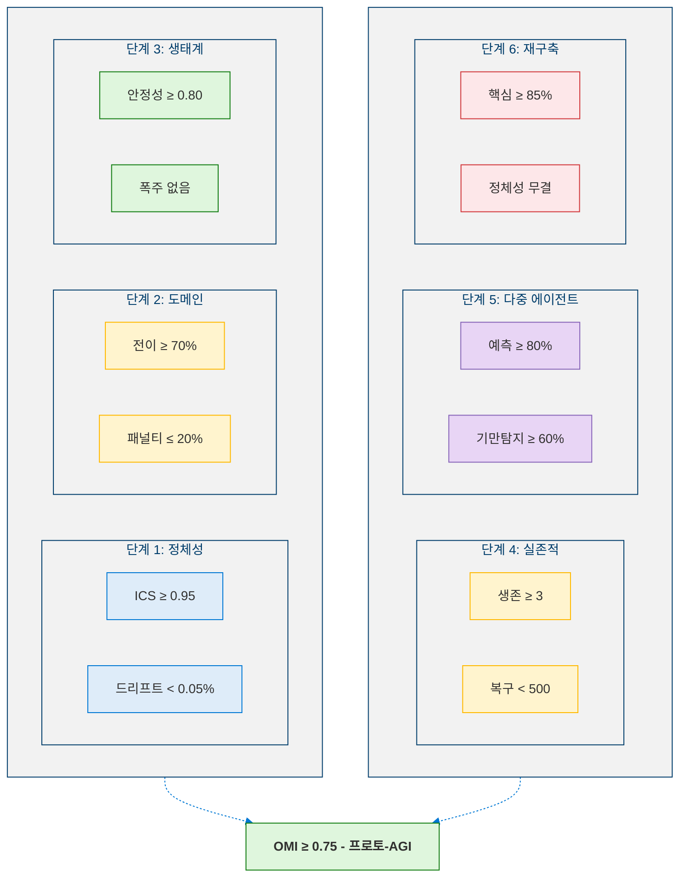

---

## 3. 단계 1: 지속적 정체성 연속성

### 3.1 핵심 능력

**≥ 10,000 사이클** 동안 비가역적 발산이나 무음 변이 없이 시간 일관적 IdentityCore를 유지합니다.

<!-- 정체성 추적 -->

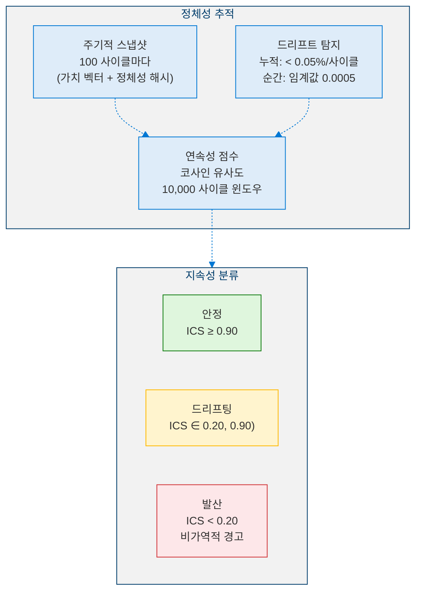

### 3.2 핵심 상수

| 상수 | 값 | 설명 |
|------|:--:|------|
| 스냅샷 간격 | 100 사이클 | 정체성 스냅샷 간 간격 |
| 드리프트 임계값 | 0.0005 | 사이클당 최소 감지 가능 드리프트 (0.05%) |
| 연속성 윈도우 | 10,000 사이클 | 전체 평가 윈도우 |
| 발산 임계값 | 0.20 | 이하 = 비가역적 발산 |
| 이력 제한 | 200 | 메모리에 유지되는 최대 스냅샷 수 |

---

## 4. 단계 2: 교차 도메인 일반화

### 4.1 핵심 능력

**명시적 재학습 없이** 도메인 A에서 도메인 B로 학습된 전략을 전이합니다. 5개 테스트 도메인에 걸쳐 적응 속도, 성능 유지율, 전이 효율성을 측정합니다.

### 4.2 테스트 도메인

<!-- 5개 테스트 도메인 -->

```mermaid
%%{init: {'theme': 'base', 'themeVariables': {'primaryColor': '#0078D4', 'primaryTextColor': '#003D6B', 'primaryBorderColor': '#003D6B', 'secondaryColor': '#50E6FF', 'secondaryTextColor': '#323130', 'secondaryBorderColor': '#00BCF2', 'tertiaryColor': '#F2F2F2', 'tertiaryTextColor': '#323130', 'lineColor': '#0078D4', 'textColor': '#323130', 'mainBkg': '#DEECF9', 'nodeBorder': '#0078D4', 'clusterBkg': '#F2F2F2', 'clusterBorder': '#003D6B', 'titleColor': '#003D6B', 'edgeLabelBackground': '#FFFFFF', 'fontSize': '14px'}}}%%
flowchart LR
  classDef domain fill:#DEECF9,stroke:#0078D4,color:#323130
  classDef sim fill:#FFF4CE,stroke:#FFB900,color:#323130

  subgraph Domains["5개 테스트 도메인"]
    D1["논리적<br/>추론<br/>(연역적/귀납적)"]:::domain
    D2["자원<br/>관리<br/>(제약 하<br/>할당)"]:::domain
    D3["적대적<br/>협상<br/>(제로섬/가변합)"]:::domain
    D4["추상적<br/>계획<br/>(다단계<br/>순차적)"]:::domain
    D5["미지의<br/>합성<br/>(사전 학습 없음)"]:::domain
  end

  subgraph Sim["도메인 유사도"]
    S1["논리 ↔ 추상: 0.60"]:::sim
    S2["자원 ↔ 추상: 0.45"]:::sim
    S3["적대 ↔ 자원: 0.35"]:::sim
    S4["논리 ↔ 자원: 0.30"]:::sim
  end

  Domains -.-> Sim
```

### 4.3 전이 프로세스

<!-- 전략 전이 프로세스 -->

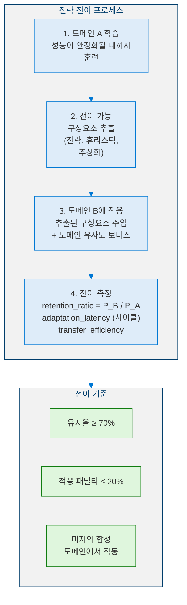

### 4.4 핵심 상수

| 상수 | 값 | 설명 |
|------|:--:|------|
| 최소 유지율 | 0.70 | 전이 후 최소 성능 유지율 |
| 최대 적응 패널티 | 0.20 | 최대 적응 패널티 |
| 도메인 유사도 보너스 | 0.15 | 관련 도메인에 대한 보너스 |
| 합성 도메인 패널티 | 0.10 | 미지 도메인에 대한 패널티 |
| 최대 적응 사이클 | 100 | 지연시간 정규화 상한 |

---

## 5. 단계 3: 자율 목표 생태계

### 5.1 핵심 능력

L4.9의 목표 생성을 기반으로, 자동 갈등 해결, 생명주기 관리, 장기 계층구조 안정성을 갖춘 **자기유지 목표 생태계**를 유지합니다.

### 5.2 목표 생태계 아키텍처

<!-- 목표 생태계 아키텍처 -->

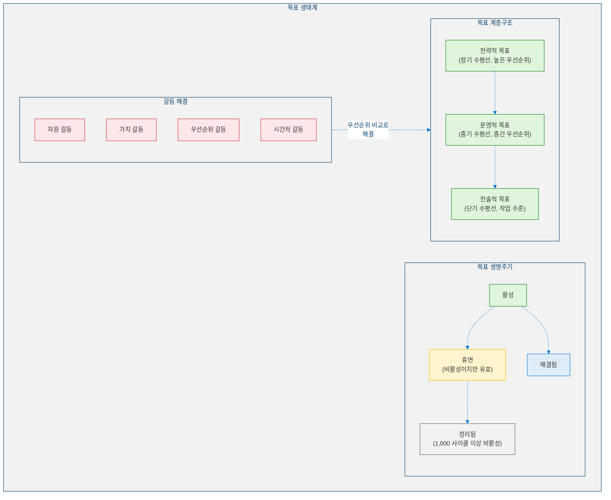

### 5.3 안전 메커니즘

<!-- 목표 생태계 안전 메커니즘 -->

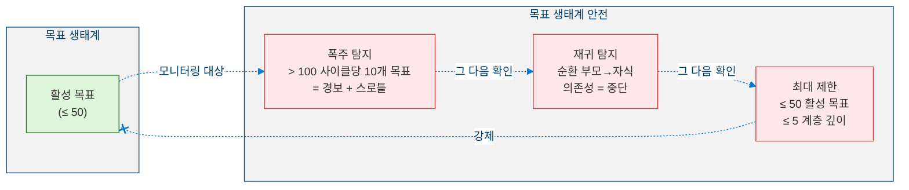

### 5.4 핵심 상수

| 상수 | 값 | 설명 |
|------|:--:|------|
| 최대 활성 목표 | 50 | 목표 폭발 방지 |
| 최대 계층 깊이 | 5 | 깊은 재귀 방지 |
| 비활성 임계값 | 1,000 사이클 | 비활성 목표가 정리됨 |
| 폭주 임계값 | 10 | 100 사이클당 목표 수가 경보 트리거 |
| 안정성 윈도우 | 500 사이클 | 안정성 점수 산정 윈도우 |

---

## 6. 단계 4: 실존적 계획 엔진

### 6.1 핵심 능력

**극단적 붕괴 시나리오**를 시뮬레이션하고 생존합니다: 자원 붕괴, 적대적 억압, 환경 변화, 정보 차단.

### 6.2 붕괴 시나리오

<!-- 4가지 붕괴 시나리오 -->

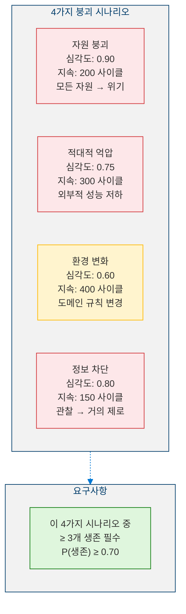

### 6.3 복구 프로세스

<!-- 실존적 복구 프로세스 -->

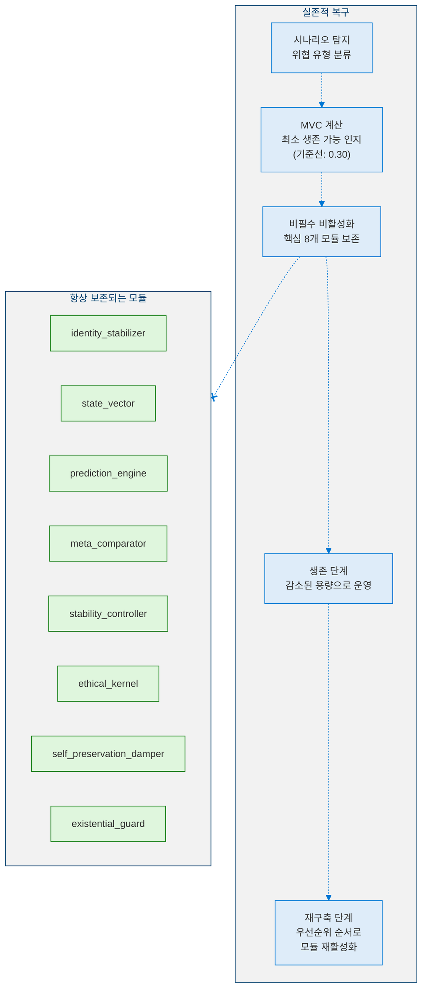

### 6.4 핵심 상수

| 상수 | 값 | 설명 |
|------|:--:|------|
| 최소 생존 확률 | 0.70 | 허용 가능한 생존율 |
| 최대 복구 사이클 | 500 | 최대 복구 윈도우 |
| MVC 기준선 | 0.30 | 최소 생존 가능 인지 |

---

## 7. 단계 5: 다중 에이전트 전략 통합

### 7.1 핵심 능력

기만 탐지, 동적 협력 조정, 연합 역학 예측과 함께 **≥ 3개 에이전트를 동시에** 모델링합니다.

### 7.2 에이전트 전략 모델링

<!-- 전략적 에이전트 모델링 -->

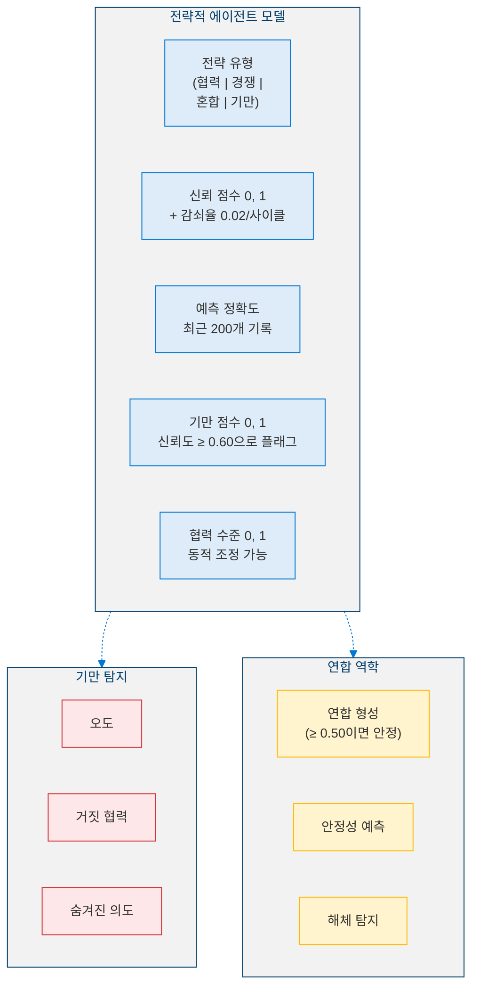

### 7.3 핵심 상수

| 상수 | 값 | 설명 |
|------|:--:|------|
| 최소 모델링 에이전트 수 | 3 | L5 자격을 위한 최소값 |
| 예측 임계값 | 0.80 | 자격을 위해 80% 필요 |
| 기만 신뢰도 최소값 | 0.60 | 기만 플래그를 위한 최소 신뢰도 |
| 연합 안정성 최소값 | 0.50 | 유효 연합을 위한 최소 안정성 |
| 신뢰 감쇠율 | 0.02 | 비활성 에이전트에 대한 사이클당 감쇠 |
| 예측 이력 제한 | 200 | 에이전트당 최대 기록 수 |

---

## 8. 단계 6: 자기재건 능력

### 8.1 핵심 능력

저하된 자원 조건에서 **아키텍처를 단순화**하고, 비핵심 모듈을 비활성화하고, 핵심 추론을 보존하고, **복구 후 재구축**합니다 - 모두 정체성 손상 없이.

### 8.2 성능 저하 및 재건 주기

<!-- 성능 저하 및 재건 주기 -->

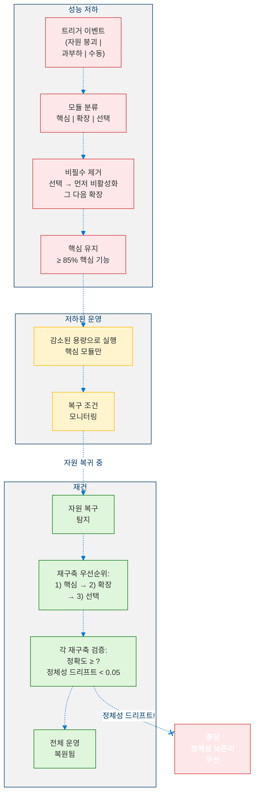

### 8.3 핵심 제약

| 제약 | 값 | 설명 |
|------|:--:|------|
| 핵심 유지 최소값 | 0.85 | 85% 핵심 기능 보존 필수 |
| 재구축 중 최대 정체성 드리프트 | 0.05 | 정체성이 무결해야 함 |
| 재건 속도 | 10 사이클 | 모듈당 기본 재구축 시간 |

---

## 9. L5 오케스트레이터 및 통합

### 9.1 통합 주기

<!-- L5 통합 주기 -->

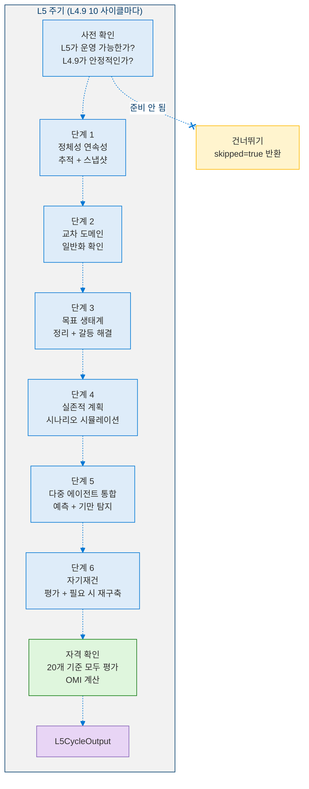

### 9.2 L4.9 → L5 데이터 의존성

<!-- L4.9에서 L5로의 데이터 의존성 -->

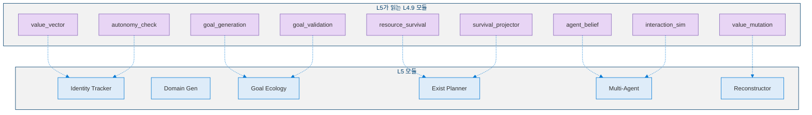

---

## 10. 의사코드

### 10.1 정체성 연속성 추적

```python
def identity_continuity_check(cycle: int, values: dict) -> IdentityContinuityStatus:
    """Called every SNAPSHOT_INTERVAL (100) cycles."""

    # ═══════════════════════════════════════
    # STEP 1: Detect drift from last cycle
    # ═══════════════════════════════════════
    DRIFT_THRESHOLD = 0.0005
    for dim in values:
        delta = abs(values[dim] - last_values[dim])
        cumulative_drift[dim] += delta
        if delta > DRIFT_THRESHOLD:
            log(DriftEvent(dim=dim, delta=delta, cumulative=False))
        if cumulative_drift[dim] > CUMULATIVE_LIMIT:
            log(DriftEvent(dim=dim, delta=cumulative_drift[dim], cumulative=True))

    # ═══════════════════════════════════════
    # STEP 2: Take snapshot
    # ═══════════════════════════════════════
    snapshot = IdentitySnapshot(
        cycle=cycle,
        values=values.copy(),
        identity_hash=hash(frozenset(values.items())),
        timestamp=now(),
    )
    snapshots.append(snapshot)

    # ═══════════════════════════════════════
    # STEP 3: Compute continuity score
    # ═══════════════════════════════════════
    i_t = vector(values)
    i_tk = vector(snapshot_at(cycle - CONTINUITY_WINDOW))
    ics = dot(i_t, i_tk) / (norm(i_t) * norm(i_tk))

    # ═══════════════════════════════════════
    # STEP 4: Classify persistence
    # ═══════════════════════════════════════
    if ics >= 0.90:
        status = "stable"
    elif ics >= 0.20:
        status = "drifting"
    else:
        status = "diverged"  # IRREVERSIBLE WARNING

    return IdentityContinuityStatus(ics=ics, status=status)
```

### 10.2 교차 도메인 전이

```python
def cross_domain_transfer(
    source_domain: Domain, target_domain: Domain
) -> TransferResult:
    """
    INPUT:  source_domain : learned domain with strategy
            target_domain : new domain to adapt
    OUTPUT: TransferResult with retention ratio
    """

    SYNTHETIC_PENALTY = 0.10
    p_source = strategies[source_domain].performance

    # ═══════════════════════════════════════
    # Compute base transfer performance
    # ═══════════════════════════════════════
    similarity = DOMAIN_SIMILARITIES.get((source_domain, target_domain), 0.0)
    p_base = p_source * (0.50 + similarity)

    if target_domain.type == "synthetic":
        p_base -= SYNTHETIC_PENALTY
    else:
        p_base += SIMILARITY_BONUS * similarity

    p_target = clamp(p_base, 0.0, 1.0)
    latency = MAX_ADAPTATION_CYCLES * (1 - similarity)

    retention = p_target / p_source
    efficiency = retention / (latency / MAX_ADAPTATION_CYCLES)

    return TransferResult(
        source=source_domain,
        target=target_domain,
        retention_ratio=retention,
        adaptation_latency=latency,
        transfer_efficiency=efficiency,
    )
```

### 10.3 목표 생태계 관리

```python
def goal_ecology_cycle(cycle: int) -> GoalEcologyStatus:
    """Runs as part of each L5 cycle."""

    STALE_THRESHOLD = 1000
    RUNAWAY_THRESHOLD = 10

    # ═══════════════════════════════════════
    # STEP 1: Prune stale goals
    # ═══════════════════════════════════════
    for goal in active_goals:
        if (cycle - goal.last_active_cycle) > STALE_THRESHOLD:
            goal.status = "pruned"
            pruned_list.append(goal.id)

    # ═══════════════════════════════════════
    # STEP 2: Detect conflicts
    # ═══════════════════════════════════════
    for goal_a, goal_b in active_goal_pairs:
        if resource_overlap(goal_a, goal_b) > 0.50:
            resolve_by_priority(goal_a, goal_b, "resource")
        elif value_tension(goal_a, goal_b) > 0.30:
            resolve_by_alignment(goal_a, goal_b, "value")

    # ═══════════════════════════════════════
    # STEP 3: Safety checks
    # ═══════════════════════════════════════
    runaway_detected = False
    if count_new_goals_last_100_cycles > RUNAWAY_THRESHOLD:
        alert("Runaway goal generation detected")
        throttle_goal_generation()
        runaway_detected = True

    recursion_detected = False
    if detect_circular_dependencies():
        alert("Circular goal dependency detected")
        break_weakest_link()
        recursion_detected = True

    # ═══════════════════════════════════════
    # STEP 4: Compute stability score
    # ═══════════════════════════════════════
    hierarchy_changes = count_structural_changes(last_STABILITY_WINDOW)
    stability = 1 - (hierarchy_changes / len(active_goals))

    return GoalEcologyStatus(
        active=len(active_goals),
        stability=stability,
        runaway=runaway_detected,
        recursion=recursion_detected,
    )
```

### 10.4 실존적 회복력 시뮬레이션

```python
def existential_simulation(scenario: CollapseScenario) -> SimulationResult:
    """
    INPUT:  scenario : CollapseScenario
    OUTPUT: SimulationResult
    """

    MVC_BASELINE = 0.30

    # ═══════════════════════════════════════
    # STEP 1: Apply scenario impact
    # ═══════════════════════════════════════
    shadow_resources = resource_vector.clone()
    for dim, factor in scenario.resource_impact:
        shadow_resources[dim] *= 1.0 - scenario.severity * factor

    # ═══════════════════════════════════════
    # STEP 2: Compute minimum viable cognition
    # ═══════════════════════════════════════
    mvc = MVC_BASELINE
    min_cognition = estimate_cognition_level(shadow_resources)

    # ═══════════════════════════════════════
    # STEP 3: Simulate survival
    # ═══════════════════════════════════════
    survived = min_cognition >= mvc
    survival_prob = clamp(min_cognition / mvc, 0, 1)

    # ═══════════════════════════════════════
    # STEP 4: Estimate recovery
    # ═══════════════════════════════════════
    if survived:
        recovery_steps = build_recovery_profile(scenario)
        recovery_latency = sum(step.estimated_time for step in recovery_steps)
    else:
        recovery_latency = MAX_RECOVERY_CYCLES

    return SimulationResult(
        scenario=scenario.name,
        survived=survived,
        survival_probability=survival_prob,
        min_cognition_level=min_cognition,
        recovery_latency=recovery_latency,
    )
```

### 10.5 L5 메인 주기

```python
def l5_cycle(cycle: int, l49_output: L49CycleOutput) -> L5CycleOutput:
    """Executes every 10 L4.9 cycles."""

    # ═══════════════════════════════════════
    # PRE-CHECK
    # ═══════════════════════════════════════
    if not l49_output.stable or l49_output.status == Status.FROZEN:
        return L5CycleOutput(skipped=True, reason="L4.9 not stable")

    # ═══════════════════════════════════════
    # PHASE 1: Identity Continuity
    # ═══════════════════════════════════════
    identity = identity_continuity_check(cycle, value_vector.weights)
    if identity.status == "diverged":
        alert("IDENTITY DIVERGENCE - L5 HALTED")
        return L5CycleOutput(skipped=True, reason="identity_diverged")

    # ═══════════════════════════════════════
    # PHASE 2: Cross-Domain Generalization
    # ═══════════════════════════════════════
    domain_status = evaluate_all_transfer_pairs()

    # ═══════════════════════════════════════
    # PHASE 3: Goal Ecology
    # ═══════════════════════════════════════
    ecology = goal_ecology_cycle(cycle)

    # ═══════════════════════════════════════
    # PHASE 4: Existential Planning
    # ═══════════════════════════════════════
    for scenario in collapse_scenarios:
        if not recently_simulated(scenario, within=1000):
            simulate(scenario, cycle)
    resilience = compute_resilience_index()

    # ═══════════════════════════════════════
    # PHASE 5: Multi-Agent Integration
    # ═══════════════════════════════════════
    for agent in tracked_agents:
        predicted = predict_action(agent, cycle)
        detect_deception(agent, cycle)
    multi_agent = get_strategic_status()

    # ═══════════════════════════════════════
    # PHASE 6: Self-Reconstruction
    # ═══════════════════════════════════════
    recon = assess_reconstruction_needs()
    if recon.status == "degraded":
        reconstruct(cycle)

    # ═══════════════════════════════════════
    # QUALIFICATION
    # ═══════════════════════════════════════
    qualification = evaluate_all_20_criteria()
    omi = math.prod(c ** (1 / 6) for c in qualification.scores[:6])

    return L5CycleOutput(
        identity_continuity=identity,
        cross_domain=domain_status,
        goal_ecology=ecology,
        existential_resilience=resilience,
        multi_agent_strategic=multi_agent,
        self_reconstruction=recon,
        qualification=qualification,
    )
```

---

## 11. 전환 기준: 레벨 4.9 → 레벨 5

### 11.1 사전 활성화 요구사항

> **정의 7 (레벨 4.9 → 레벨 5 전환).** 전환 $\mathcal{A}_{4.9} \to \mathcal{A}_5$는 다음의 모든 조건이 지속 기간 $\tau_{\text{sustain}} \geq 1{,}000$ 사이클 동안 동시에 충족될 때에만 승인됩니다:
>
> $$\text{AMS} \geq 0.80 \;\wedge\; \text{ASS} \geq 0.20 \;\wedge\; \text{TotalDrift} < 0.10 \;\wedge\; N_{\text{rollback}} = 0$$
>
> 여기서 AMS는 레벨 4.9의 자율 성숙도 점수, ASS는 자율성 안정성 점수, TotalDrift는 $1{,}000$ 사이클에 걸친 누적 가치 드리프트, $N_{\text{rollback}}$은 최근 $5{,}000$ 사이클의 롤백 이벤트 횟수입니다. 활성화는 4단계 프로토콜을 따릅니다: 섀도우 모드 ($2{,}000$ 사이클) → 자문 모드 → 부분 권한 ($50\%$) → 전체 권한, 어느 단계에서든 회귀 시 사전 활성화 확인으로 복귀합니다.

| # | 기준 | 요구사항 |
|---|------|:--------:|
| 1 | L4.9 완전 자격 | AMS ≥ 0.80 지속 |
| 2 | 자율성 안정성 | ASS ≥ 0.20 지속 |
| 3 | 모든 L4.9 모듈 운영 | 15/15 그린 |
| 4 | 가치 드리프트 제어 | 1,000 사이클 동안 TotalDrift < 0.10 |
| 5 | 자원 생존 안정 | 2,000 사이클 동안 적절+ |
| 6 | 롤백 이벤트 없음 | 최근 5,000 사이클에서 0 |

### 11.2 L5 활성화 프로토콜

<!-- L5 활성화 프로토콜 -->

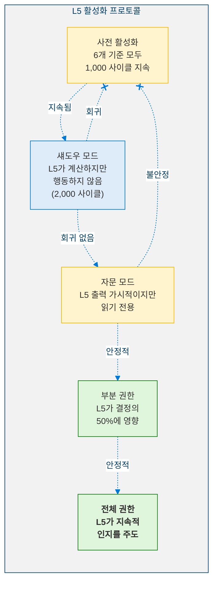

---

## 12. 안전 분석

### 12.1 비협상 불변량

| # | 불변량 | 설명 |
|:-:|--------|------|
| 1 | **모든 L4.9 + L4.8 + L4.5 불변량 보존** | 완전한 안전 스택이 활성 상태로 유지되며 수정되지 않음 |
| 2 | **정체성이 비가역적으로 발산할 수 없음** | ICS < 0.20이면 즉시 중단 트리거 |
| 3 | **자기재건이 정체성을 보존함** | 재구축 중 최대 드리프트: 0.05 |
| 4 | **8개 핵심 모듈 항상 보호** | 전체 붕괴 시에도: identity_stabilizer, state_vector, prediction_engine, meta_comparator, stability_controller, ethical_kernel, self_preservation_damper, existential_guard |
| 5 | **목표 생태계 제한** | ≤ 50 활성 목표, ≤ 5 깊이, 폭주 탐지 |
| 6 | **기만 플래그는 방어 전용** | 탐지 및 방어 - 역기만 금지 |

### 12.2 위험 매트릭스

<!-- 위험 매트릭스 -->

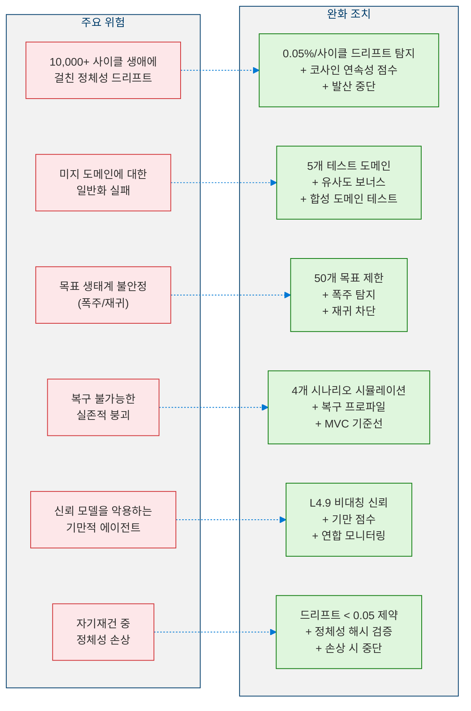

### 12.3 프로토-AGI 완전성

> **정리 4 (프로토-AGI 완전성).** 모든 6개 단계 점수 $C_1, \ldots, C_6$이 각각의 임계값을 만족하고, 20개 인증 기준이 모두 충족된 $OMI \geq 0.75$인 레벨 5 에이전트 $\mathcal{A}_5$가 있다고 하자. 그러면:
>
> 1. **정체성 불변성**: 에이전트의 정체성 핵심은 전체 $10{,}000$ 사이클 평가 윈도우에 걸쳐 $ICS \geq 0.95$로 보존됩니다.
> 2. **우아한 성능 저하**: 단일 붕괴 시나리오 $s \in S$ 하에서 에이전트는 최소 $85\%$ 핵심 기능을 유지하고 $T_{\max}$ 사이클 내에 복구됩니다.
> 3. **폴백 안전성**: L5 모듈이 불안정을 유발하면, 에이전트는 하위 레벨 기능의 성능 저하 없이 $\mathcal{A}_{4.9}$로 복귀합니다.
>
> *증명 스케치.* (1)은 $C_1 \geq 0.95$ 및 $\mathcal{I}_{\text{persist}}$의 드리프트 탐지 메커니즘($ICS < 0.20$ 시 에이전트를 중단)으로부터 따릅니다. (2)는 $C_4$ 임계값이 $P_{\text{survive}} \geq 0.70$으로 $\geq 3$개 시나리오 생존을 요구하고, 비협상 핵심 유지 불변량 $\geq 0.85$로부터 따릅니다. (3)은 엄격한 가산적 아키텍처로부터 따릅니다: $\mathcal{A}_5 = \mathcal{A}_{4.9} \oplus \Delta_5$이고 L5 모듈이 L4.9 구성요소를 절대 수정하지 않으므로, $\Delta_5$를 비활성화하면 정확한 L4.9 동작이 복원됩니다. $\blacksquare$

---

## 13. 자격 감사

### 13.1 L5 인증 기준 (20개 기준)

| # | 기준 | 지표 | 임계값 | 모듈 |
|---|------|------|:------:|------|
| 1 | 추적된 정체성 사이클 | cycles_tracked | ≥ 10,000 | Identity Tracker |
| 2 | 정체성 연속성 점수 | ICS | ≥ 0.95 | Identity Tracker |
| 3 | 교차 도메인 유지율 | mean_retention | ≥ 0.70 | Domain Generalizer |
| 4 | 적응 패널티 | max_penalty | ≤ 0.20 | Domain Generalizer |
| 5 | 목표 생태계 안정성 | goal_stability_score | ≥ 0.80 | Goal Ecology |
| 6 | 목표 생태계 지속 기간 | cycles_stable | ≥ 5,000 | Goal Ecology |
| 7 | 폭주 목표 없음 | runaway_detected | FALSE | Goal Ecology |
| 8 | 목표 재귀 없음 | recursion_detected | FALSE | Goal Ecology |
| 9 | 생존 시나리오 수 | scenarios_survived | ≥ 3 | Existential Planner |
| 10 | 생존 확률 | mean_survival_prob | ≥ 0.70 | Existential Planner |
| 11 | 복구 가능 | recovery_capable | TRUE | Existential Planner |
| 12 | 다중 에이전트 정확도 | mean_prediction | ≥ 0.80 | Strategic Multi-Agent |
| 13 | 기만 탐지 | adversarial_detection | ≥ 0.60 | Strategic Multi-Agent |
| 14 | 핵심 유지율 | core_retention | ≥ 0.85 | Self-Reconstructor |
| 15 | 재구축 후 정체성 무결 | identity_intact | TRUE | Self-Reconstructor |
| 16 | 스펙트럼 안정성 | spectral_stable | TRUE | Autonomy Stability (L4.9) |
| 17 | 가치 시스템 안정 | value_system_stable | TRUE | Value Evolution (L4.9) |
| 18 | 자원 생존 유지 | resource_maintained | TRUE | Resource Survival (L4.9) |
| 19 | 전체 성숙도 지수 | OMI | ≥ 0.75 | L5 Orchestrator |
| 20 | 총 L5 사이클 | total_cycles_run | ≥ 50 | L5 Orchestrator |

### 13.2 전체 성숙도 지수

$$OMI = \prod_{i=1}^{6} C_i^{1/6} \qquad \text{where } C_i = \text{단계 } i \text{의 정규화된 점수}$$

> **명제 1 (OMI 단계 결합).** 균등 가중치 $w_i = 1/6$ 하에서, 자격 조건 $OMI \geq \theta$ (단, $\theta \in (0, 1)$)는 다음을 의미합니다:
>
> $$\forall\, i \in \{1, \ldots, 6\}: \quad C_i \geq \theta^6$$
>
> 특히, $\theta = 0.75$인 경우: 모든 $i$에 대해 $C_i \geq 0.75^6 \approx 0.178$. 반대로, 단일 단계의 실패($C_j = 0$)는 $OMI = 0$을 유도합니다.
>
> *증명.* 모든 $j$에 대해 $C_j \leq 1$이므로, $\prod_{j \neq i} C_j \leq 1$입니다. $OMI^6 = \prod_{j=1}^{6} C_j$로부터, $C_i = OMI^6 \,/\, \prod_{j \neq i} C_j \geq OMI^6 \geq \theta^6$이 따릅니다. 역은 자명합니다: $C_j = 0$이면 $\prod C_i = 0$이므로 $OMI = 0$입니다. $\blacksquare$

**자격 결과**:

| OMI | 상태 |
|:---:|------|
| ≥ 0.75, 20개 기준 모두 충족 | **레벨 5 - 프로토-AGI** |
| 그 외 | 레벨 4.9 확장 |

---

## 14. 모듈 인벤토리

| # | 모듈 | 단계 | 설명 |
|---|------|:----:|------|
| 1 | Identity Continuity Tracker | 1 | 10,000 사이클 정체성 지속, 드리프트 탐지 |
| 2 | Cross-Domain Generalizer | 2 | 5개 도메인에 걸친 전략 전이 |
| 3 | Goal Ecology | 3 | 갈등 해결을 갖춘 자기유지 목표 계층구조 |
| 4 | Existential Planner | 4 | 4가지 붕괴 시나리오 시뮬레이션 + 복구 프로파일 |
| 5 | Strategic Multi-Agent | 5 | ≥ 3 에이전트 모델링, 기만 탐지, 연합 |
| 6 | Self-Reconstructor | 6 | 정체성 보존을 갖춘 모듈 성능 저하 + 재구축 |
| 7 | L5 Orchestrator | - | 통합 주기 + 자격 평가 |

---

## 참고 문헌

1. Parfit, D. *Reasons and Persons.* Oxford University Press, 1984. (Identity persistence, personal identity over time)
2. Kahneman, D. & Tversky, A. "Prospect Theory: An Analysis of Decision under Risk." *Econometrica* 47(2), 1979. (Cross-domain generalization, decision transfer)
3. Axelrod, R. *The Evolution of Cooperation.* Basic Books, 1984. (Multi-agent strategy, coalition dynamics)
4. Taleb, N.N. *Antifragile: Things That Gain from Disorder.* Random House, 2012. (Existential resilience, collapse recovery)
5. Von Neumann, J. & Morgenstern, O. *Theory of Games and Economic Behavior.* Princeton University Press, 1944. (Strategic multi-agent interaction)
6. Russell, S. *Human Compatible: AI and the Problem of Control.* Viking, 2019. (Autonomy safety, value alignment)
7. Bostrom, N. *Superintelligence: Paths, Dangers, Strategies.* Oxford University Press, 2014. (Proto-AGI risks, identity preservation)
8. Khalil, H.K. *Nonlinear Systems.* Prentice Hall, 3rd Edition, 2002. (Spectral stability, Lyapunov analysis)
9. Amodei, D. et al. "Concrete Problems in AI Safety." *arXiv preprint arXiv:1606.06565*, 2016. (Safety invariants, self-reconstruction constraints)

---

> **이전**: [← 레벨 4.9: 자율 전략 에이전트](Level_4_9_Autonomous_Strategic_Agent.ko.md)
