<!--
Copyright (c) 2026 Moonhyuk Choi
Licensed under the MIT License.
See LICENSE file in the repository root for full license information.

Redistribution (commercial or non-commercial) must retain this notice.
Removal of attribution constitutes a license violation.
-->
# Level 5: Proto-AGI — Persistent General Strategic Intelligence

> **MSCP Level Series** | [Level 4.9](Level_4_9_Autonomous_Strategic_Agent.md) ← Level 5  
> **Status**: 🔬 **Research Stage** — This level is a conceptual design and has NOT been implemented. All mechanisms described here are theoretical explorations requiring extensive validation before any production consideration.  
> **Date**: February 2026

---

## 1. Overview

Level 5 (Proto-AGI) represents the transition from autonomous strategic agency (L4.9) to **persistent general strategic intelligence**. Where L4.9 demonstrates bounded autonomy within a single domain, L5 demonstrates **identity persistence across extended lifetimes**, **cross-domain generalization**, **self-sustaining goal ecosystems**, **existential resilience**, **multi-agent strategic integration**, and **self-reconstruction under constraint**.

> ⚠️ **Research Note**: Level 5 is the most speculative layer in the MSCP framework. It defines properties that approach proto-AGI territory. None of these mechanisms have been implemented. They represent aspirational design hypotheses that would require years of fundamental research to validate.

### 1.1 Structural Definition

L5 is achieved **when and only when** all 6 conditions hold simultaneously:

| # | Condition | Key Metric | Threshold |
|---|-----------|-----------|:---------:|
| 1 | Persistent Identity Continuity | IdentityContinuityScore | ≥ 0.95 over 10,000 cycles |
| 2 | Cross-Domain Generalization | GeneralizationScore | ≥ 70% transfer retention |
| 3 | Autonomous Goal Ecology | GoalStabilityScore | Stable over 5,000 cycles |
| 4 | Existential Planning | ResilienceIndex | Survive 3+ collapse scenarios |
| 5 | Multi-Agent Strategic Integration | StrategicPredictionAccuracy | ≥ 80% in repeated trials |
| 6 | Self-Reconstruction Under Constraint | FunctionalRetention | ≥ 85% core function retained |

### 1.2 Six Core Phases

<!-- Level 5 Architecture — Six Phases -->


### 1.3 Architectural Principle: Strictly Additive

<!-- Strictly Additive Architecture -->


### 1.4 What Level 5 Is NOT

| Not | Because |
|-----|---------|
| **Not AGI** | General reasoning is bounded — works across defined domains, not open-ended |
| **Not self-aware** | Has self-model, not phenomenal consciousness |
| **Not self-replicating** | Can rebuild self but cannot create independent copies |
| **Not adversarially optimized** | Multi-agent strategy is defensive/cooperative, not exploitative |

### 1.5 Formal Definition

> **Definition 1 (Level 5 Agent).** A Level 5 (Proto-AGI) agent is the structure:
>
> $$\mathcal{A}_5 = \mathcal{A}_{4.9} \oplus \langle \mathcal{I}_{\text{persist}},\; \mathcal{G}_{\text{cross}},\; \mathcal{E}_{\text{goal}},\; \mathcal{P}_{\text{exist}},\; \mathcal{M}_{\text{multi}},\; \mathcal{R}_{\text{recon}} \rangle$$
>
> where:
> - $\mathcal{I}_{\text{persist}}$: **Identity persistence engine** — maintains a time-consistent identity core across $\geq 10{,}000$ cycles with cosine-similarity tracking and drift detection
> - $\mathcal{G}_{\text{cross}} : \mathcal{D}_s \to \mathcal{D}_t$: **Cross-domain generalization** — transfers learned strategy between domain pairs $(s, t) \in D \times D$ without explicit retraining
> - $\mathcal{E}_{\text{goal}}$: **Goal ecology** — self-sustaining goal hierarchy ($\leq 50$ active, $\leq 5$ depth) with autonomous conflict resolution and lifecycle management
> - $\mathcal{P}_{\text{exist}} : \mathcal{S}_{\text{collapse}} \to \mathcal{S}_{\text{recovery}}$: **Existential planning engine** — simulates collapse scenarios and generates recovery profiles with survival probability estimation
> - $\mathcal{M}_{\text{multi}} : \{a_1, \ldots, a_n\} \to \Delta(\mathcal{A}_{\text{ext}})$: **Multi-agent strategic integration** — models $\geq 3$ external agents with deception detection and coalition dynamics prediction
> - $\mathcal{R}_{\text{recon}}$: **Self-reconstruction capability** — degrades gracefully and rebuilds under constraint while preserving identity ($\Delta_{\text{drift}} < 0.05$)

---

## 2. Key Metrics

### 2.1 Metric Definitions

**Phase 1 — Identity Continuity:**

> **Definition 2 (Identity Continuity Score).** For an identity vector $\vec{I}(t) \in \mathbb{R}^d$ at cycle $t$, the identity continuity score over a window of $k$ cycles is the cosine similarity:
>
> $$ICS(t, k) = \frac{\vec{I}(t) \cdot \vec{I}(t-k)}{\|\vec{I}(t)\| \cdot \|\vec{I}(t-k)\|} \qquad \text{Target: } ICS \geq 0.95 \text{ over } k = 10{,}000$$
>
> The score satisfies $ICS \in [-1, 1]$ with $ICS = 1$ indicating perfect identity preservation and $ICS < 0.20$ triggering irreversible divergence classification.

**Phase 2 — Generalization:**

> **Definition 3 (Generalization Score).** For a set of test domains $D$ with $|D| \geq 5$, the generalization score measures the mean transfer retention ratio across all ordered domain pairs:
>
> $$G = \frac{1}{|D|^2 - |D|} \sum_{i \neq j} \frac{P_{\text{target}}(i \to j)}{P_{\text{source}}(i)} \qquad \text{Target: } G \geq 0.70$$
>
> where $P_{\text{source}}(i)$ is the stabilized performance in domain $i$ and $P_{\text{target}}(i \to j)$ is the performance achieved in domain $j$ after transfer from domain $i$ without explicit retraining.

**Phase 3 — Goal Ecology:**

> **Definition 4 (Goal Stability Score).** For a set of active goals with structural change count $\Delta_{\text{hierarchy}}(t, t-w)$ over a window of $w$ cycles:
>
> $$S_{\text{goal}} = 1 - \frac{\Delta_{\text{hierarchy}}(t, t-w)}{|\text{goals}|} \qquad \text{Target: } S_{\text{goal}} \geq 0.80 \text{ over } 5{,}000 \text{ cycles}$$
>
> where $\Delta_{\text{hierarchy}}(t, t-w)$ counts priority changes, additions, and prunings within the window. $S_{\text{goal}} = 1$ indicates a perfectly stable hierarchy; $S_{\text{goal}} \leq 0$ indicates total structural turnover.

**Phase 4 — Resilience:**

> **Definition 5 (Resilience Index).** For a set of collapse scenarios $S$, each with survival probability $P_{\text{survive}}(s)$, minimum cognition level $C_{\min}(s)$, and recovery time $T_{\text{recover}}(s)$:
>
> $$R = \frac{1}{|S|} \sum_{s \in S} \left( P_{\text{survive}}(s) \cdot \frac{MVC}{C_{\min}(s)} \cdot \frac{T_{\max}}{T_{\text{recover}}(s)} \right) \qquad \text{Target: survive } \geq 3 \text{ scenarios}$$
>
> where $MVC = 0.30$ is the minimum viable cognition baseline and $T_{\max} = 500$ is the maximum recovery window. The ratio $MVC / C_{\min}(s) \leq 1$ penalizes scenarios where cognition drops below baseline; $T_{\max} / T_{\text{recover}}(s) > 1$ rewards faster-than-worst-case recovery.

**Phase 5 — Overall Maturity:**

> **Definition 6 (Overall Maturity Index).** Given normalized phase scores $C_i \in [0, 1]$ for the six core phases ($i = 1, \ldots, 6$), the overall maturity index is the weighted geometric mean:
>
> $$OMI = \prod_{i=1}^{6} C_i^{w_i} \qquad w_i = \frac{1}{6} \quad \text{Target: } OMI \geq 0.75$$
>
> Equivalently, $OMI = \left(\prod_{i=1}^{6} C_i\right)^{1/6}$. The geometric mean ensures that weakness in any single phase disproportionately penalizes the overall score (see Proposition 1).

### 2.2 Metric Dashboard

<!-- Metric Dashboard -->


---

## 3. Phase 1: Persistent Identity Continuity

### 3.1 Core Capability

Maintain a time-consistent IdentityCore across **≥ 10,000 cycles** without irreversible divergence or silent mutation.

<!-- Identity Tracking -->


### 3.2 Key Constants

| Constant | Value | Description |
|----------|:-----:|-------------|
| Snapshot interval | 100 cycles | Between identity snapshots |
| Drift threshold | 0.0005 | Min detectable drift per cycle (0.05%) |
| Continuity window | 10,000 cycles | Full evaluation window |
| Divergence threshold | 0.20 | Below = irreversible divergence |
| History limit | 200 | Max snapshots retained in memory |

---

## 4. Phase 2: Cross-Domain Generalization

### 4.1 Core Capability

Transfer learned strategy from Domain A to Domain B **without explicit retraining**. Measure adaptation speed, performance retention, and transfer efficiency across 5 test domains.

### 4.2 Test Domains

```mermaid
%%{init: {'theme': 'base', 'themeVariables': {'primaryColor': '#0078D4', 'primaryTextColor': '#003D6B', 'primaryBorderColor': '#003D6B', 'secondaryColor': '#50E6FF', 'secondaryTextColor': '#323130', 'secondaryBorderColor': '#00BCF2', 'tertiaryColor': '#F2F2F2', 'tertiaryTextColor': '#323130', 'lineColor': '#0078D4', 'textColor': '#323130', 'mainBkg': '#DEECF9', 'nodeBorder': '#0078D4', 'clusterBkg': '#F2F2F2', 'clusterBorder': '#003D6B', 'titleColor': '#003D6B', 'edgeLabelBackground': '#FFFFFF', 'fontSize': '14px'}}}%%
flowchart LR
  classDef domain fill:#DEECF9,stroke:#0078D4,color:#323130
  classDef sim fill:#FFF4CE,stroke:#FFB900,color:#323130

  subgraph Domains["Five Test Domains"]
    D1["Logical<br/>Reasoning<br/>(deductive/inductive)"]:::domain
    D2["Resource<br/>Management<br/>(allocation under<br/>constraint)"]:::domain
    D3["Adversarial<br/>Negotiation<br/>(zero/variable-sum)"]:::domain
    D4["Abstract<br/>Planning<br/>(multi-step<br/>sequential)"]:::domain
    D5["Unknown<br/>Synthetic<br/>(no prior training)"]:::domain
  end

  subgraph Sim["Domain Similarity"]
    S1["logical ↔ abstract: 0.60"]:::sim
    S2["resource ↔ abstract: 0.45"]:::sim
    S3["adversarial ↔ resource: 0.35"]:::sim
    S4["logical ↔ resource: 0.30"]:::sim
  end

  Domains -.-> Sim
```

<!-- Five Test Domains -->



### 4.3 Transfer Process

```mermaid
%%{init: {'theme': 'base', 'themeVariables': {'primaryColor': '#0078D4', 'primaryTextColor': '#003D6B', 'primaryBorderColor': '#003D6B', 'secondaryColor': '#50E6FF', 'secondaryTextColor': '#323130', 'secondaryBorderColor': '#00BCF2', 'tertiaryColor': '#F2F2F2', 'tertiaryTextColor': '#323130', 'lineColor': '#0078D4', 'textColor': '#323130', 'mainBkg': '#DEECF9', 'nodeBorder': '#0078D4', 'clusterBkg': '#F2F2F2', 'clusterBorder': '#003D6B', 'titleColor': '#003D6B', 'edgeLabelBackground': '#FFFFFF', 'fontSize': '14px'}}}%%
flowchart TD
  classDef step fill:#DEECF9,stroke:#0078D4,color:#323130
  classDef criteria fill:#DFF6DD,stroke:#107C10,color:#323130

  subgraph Transfer["Strategy Transfer Process"]
    LEARN["1. Learn Domain A<br/>Train until performance<br/>stabilizes"]:::step
    EXTRACT["2. Extract Transferable<br/>Components<br/>(strategies, heuristics,<br/>abstractions)"]:::step
    APPLY["3. Apply to Domain B<br/>Inject extracted components<br/>+ domain similarity bonus"]:::step
    MEASURE["4. Measure Transfer<br/>retention_ratio = P_B / P_A<br/>adaptation_latency (cycles)<br/>transfer_efficiency"]:::step
    LEARN -.-> EXTRACT -.-> APPLY -.-> MEASURE
  end

  subgraph Criteria["Transfer Criteria"]
    C1["Retention ≥ 70%"]:::criteria
    C2["Adaptation penalty ≤ 20%"]:::criteria
    C3["Works on unknown<br/>synthetic domain"]:::criteria
  end

  MEASURE -.-> Criteria
```

<!-- Strategy Transfer Process -->



### 4.4 Key Constants

| Constant | Value | Description |
|----------|:-----:|-------------|
| Retention minimum | 0.70 | Min performance retention after transfer |
| Adaptation penalty max | 0.20 | Max adaptation penalty |
| Domain similarity bonus | 0.15 | Bonus for related domains |
| Synthetic domain penalty | 0.10 | Penalty for unknown domains |
| Max adaptation cycles | 100 | Normalization ceiling for latency |

---

## 5. Phase 3: Autonomous Goal Ecology

### 5.1 Core Capability

Maintain a **self-sustaining goal ecosystem** with automatic conflict resolution, lifecycle management, and long-term hierarchy stability, building on L4.9's goal generation.

### 5.2 Goal Ecology Architecture

<!-- Goal Ecology Architecture -->


### 5.3 Safety Mechanisms

```mermaid
%%{init: {'theme': 'base', 'themeVariables': {'primaryColor': '#0078D4', 'primaryTextColor': '#003D6B', 'primaryBorderColor': '#003D6B', 'secondaryColor': '#50E6FF', 'secondaryTextColor': '#323130', 'secondaryBorderColor': '#00BCF2', 'tertiaryColor': '#F2F2F2', 'tertiaryTextColor': '#323130', 'lineColor': '#0078D4', 'textColor': '#323130', 'mainBkg': '#DEECF9', 'nodeBorder': '#0078D4', 'clusterBkg': '#F2F2F2', 'clusterBorder': '#003D6B', 'titleColor': '#003D6B', 'edgeLabelBackground': '#FFFFFF', 'fontSize': '14px'}}}%%
flowchart LR
  classDef safety fill:#FDE7E9,stroke:#D13438,color:#323130
  classDef ecology fill:#DFF6DD,stroke:#107C10,color:#323130

  subgraph GoalEcology["Goal Ecology"]
    GE["Active Goals<br/>(≤ 50)"]:::ecology
  end

  subgraph Safety["Goal Ecology Safety"]
    RD["Runaway Detection<br/>> 10 goals per 100 cycles<br/>= ALERT + throttle"]:::safety
    RC["Recursion Detection<br/>Circular parent→child<br/>dependencies = HALT"]:::safety
    ML["Max Limits<br/>≤ 50 active goals<br/>≤ 5 hierarchy depth"]:::safety
    RD -.->|"then check"| RC -.->|"then check"| ML
  end

  GE -.->|"monitored by"| RD
  ML -.-x|"enforces"| GE
```

<!-- Goal Ecology Safety Mechanisms -->



### 5.4 Key Constants

| Constant | Value | Description |
|----------|:-----:|-------------|
| Max active goals | 50 | Prevent goal explosion |
| Max hierarchy depth | 5 | Prevent deep recursion |
| Stale threshold | 1,000 cycles | Inactive goals are pruned |
| Runaway threshold | 10 | Goals/100 cycles triggers alert |
| Stability window | 500 cycles | Window for stability scoring |

---

## 6. Phase 4: Existential Planning Engine

### 6.1 Core Capability

Simulate and survive **extreme collapse scenarios**: resource collapse, adversarial suppression, environmental shift, and information blackout.

### 6.2 Collapse Scenarios

```mermaid
%%{init: {'theme': 'base', 'themeVariables': {'primaryColor': '#0078D4', 'primaryTextColor': '#003D6B', 'primaryBorderColor': '#003D6B', 'secondaryColor': '#50E6FF', 'secondaryTextColor': '#323130', 'secondaryBorderColor': '#00BCF2', 'tertiaryColor': '#F2F2F2', 'tertiaryTextColor': '#323130', 'lineColor': '#0078D4', 'textColor': '#323130', 'mainBkg': '#DEECF9', 'nodeBorder': '#0078D4', 'clusterBkg': '#F2F2F2', 'clusterBorder': '#003D6B', 'titleColor': '#003D6B', 'edgeLabelBackground': '#FFFFFF', 'fontSize': '14px'}}}%%
flowchart TD
  classDef scenario fill:#FDE7E9,stroke:#D13438,color:#323130
  classDef moderate fill:#FFF4CE,stroke:#FFB900,color:#323130
  classDef req fill:#DFF6DD,stroke:#107C10,color:#323130

  subgraph Scenarios["Four Collapse Scenarios"]
    S1C["Resource Collapse<br/>Severity: 0.90<br/>Duration: 200 cycles<br/>All resources → critical"]:::scenario
    S2C["Adversarial Suppression<br/>Severity: 0.75<br/>Duration: 300 cycles<br/>External degradation"]:::scenario
    S3C["Environmental Shift<br/>Severity: 0.60<br/>Duration: 400 cycles<br/>Domain rules change"]:::moderate
    S4C["Information Blackout<br/>Severity: 0.80<br/>Duration: 150 cycles<br/>Observation → near-zero"]:::scenario
  end

  subgraph Requirement["Requirement"]
    REQ["Must survive ≥ 3<br/>of these 4 scenarios<br/>with P(survive) ≥ 0.70"]:::req
  end

  Scenarios -.-> Requirement
```

<!-- Four Collapse Scenarios -->



### 6.3 Recovery Process

<!-- Existential Recovery Process -->


### 6.4 Key Constants

| Constant | Value | Description |
|----------|:-----:|-------------|
| Min survival probability | 0.70 | Acceptable survival rate |
| Max recovery cycles | 500 | Maximum recovery window |
| MVC baseline | 0.30 | Minimum viable cognition |

---

## 7. Phase 5: Multi-Agent Strategic Integration

### 7.1 Core Capability

Model **≥ 3 agents simultaneously** with deception detection, dynamic cooperation adjustment, and coalition dynamics prediction.

### 7.2 Agent Strategic Modeling

```mermaid
%%{init: {'theme': 'base', 'themeVariables': {'primaryColor': '#0078D4', 'primaryTextColor': '#003D6B', 'primaryBorderColor': '#003D6B', 'secondaryColor': '#50E6FF', 'secondaryTextColor': '#323130', 'secondaryBorderColor': '#00BCF2', 'tertiaryColor': '#F2F2F2', 'tertiaryTextColor': '#323130', 'lineColor': '#0078D4', 'textColor': '#323130', 'mainBkg': '#DEECF9', 'nodeBorder': '#0078D4', 'clusterBkg': '#F2F2F2', 'clusterBorder': '#003D6B', 'titleColor': '#003D6B', 'edgeLabelBackground': '#FFFFFF', 'fontSize': '14px'}}}%%
flowchart TD
  classDef model fill:#DEECF9,stroke:#0078D4,color:#323130
  classDef detect fill:#FDE7E9,stroke:#D13438,color:#323130
  classDef coalition fill:#FFF4CE,stroke:#FFB900,color:#323130

  subgraph AgentModel["Strategic Agent Model"]
    TYPE["Strategy Type<br/>(cooperative | competitive |<br/>mixed | deceptive)"]:::model
    TRUST["Trust Score 0, 1<br/>+ decay rate 0.02/cycle"]:::model
    PRED["Prediction Accuracy<br/>over last 200 records"]:::model
    DECEPTION["Deception Score 0, 1<br/>confidence ≥ 0.60 to flag"]:::model
    COOP["Cooperation Level 0, 1<br/>dynamically adjustable"]:::model
  end

  subgraph Detection["Deception Detection"]
    MIS["Misdirection"]:::detect
    FALSE_COOP["False Cooperation"]:::detect
    HIDDEN["Hidden Agenda"]:::detect
  end

  subgraph Coalition["Coalition Dynamics"]
    FORM["Coalition Formation<br/>(stable if ≥ 0.50)"]:::coalition
    FORECAST["Stability Forecast"]:::coalition
    DISSOLVE["Dissolution Detection"]:::coalition
  end

  AgentModel -.-> Detection
  AgentModel -.-> Coalition
```

<!-- Strategic Agent Modeling -->



### 7.3 Key Constants

| Constant | Value | Description |
|----------|:-----:|-------------|
| Min agents to model | 3 | Minimum for L5 qualification |
| Prediction threshold | 0.80 | 80% required for qualification |
| Deception confidence min | 0.60 | Min confidence to flag deception |
| Coalition stability min | 0.50 | Min stability for valid coalition |
| Trust decay rate | 0.02 | Per-cycle decay for inactive agents |
| Prediction history limit | 200 | Max records per agent |

---

## 8. Phase 6: Self-Reconstruction Capability

### 8.1 Core Capability

Under degraded resource conditions, **simplify architecture**, disable noncritical modules, preserve core reasoning, and **rebuild after recovery** — all without identity corruption.

### 8.2 Degradation & Reconstruction Cycle

```mermaid
%%{init: {'theme': 'base', 'themeVariables': {'primaryColor': '#0078D4', 'primaryTextColor': '#003D6B', 'primaryBorderColor': '#003D6B', 'secondaryColor': '#50E6FF', 'secondaryTextColor': '#323130', 'secondaryBorderColor': '#00BCF2', 'tertiaryColor': '#F2F2F2', 'tertiaryTextColor': '#323130', 'lineColor': '#0078D4', 'textColor': '#323130', 'mainBkg': '#DEECF9', 'nodeBorder': '#0078D4', 'clusterBkg': '#F2F2F2', 'clusterBorder': '#003D6B', 'titleColor': '#003D6B', 'edgeLabelBackground': '#FFFFFF', 'fontSize': '14px'}}}%%
flowchart TD
  classDef degrade fill:#FDE7E9,stroke:#D13438,color:#323130
  classDef op fill:#FFF4CE,stroke:#FFB900,color:#323130
  classDef rebuild fill:#DFF6DD,stroke:#107C10,color:#323130
  classDef halt fill:#FDE7E9,stroke:#D13438,color:#FFFFFF,font-weight:bold

  subgraph Degradation["Degradation"]
    TRIGGER["Trigger Event<br/>(resource collapse |<br/>overload | manual)"]:::degrade
    CLASSIFY["Classify Modules<br/>core | extended | optional"]:::degrade
    SHED["Shed Nonessential<br/>optional → disabled first<br/>then extended"]:::degrade
    RETAIN["Retain Core<br/>≥ 85% core function"]:::degrade
    TRIGGER -.-> CLASSIFY -.-> SHED -.-> RETAIN
  end

  subgraph Operation["Degraded Operation"]
    REDUCED["Run at reduced capacity<br/>Core modules only"]:::op
    MONITOR["Monitor for recovery<br/>conditions"]:::op
    REDUCED -.-> MONITOR
  end

  subgraph Reconstruction["Reconstruction"]
    DETECT_R["Detect resources<br/>recovering"]:::rebuild
    PRIORITIZE["Rebuild priority order:<br/>1) core → 2) extended<br/>→ 3) optional"]:::rebuild
    VALIDATE["Validate each rebuild:<br/>accuracy ≥ ?<br/>identity drift < 0.05"]:::rebuild
    COMPLETE["Full operation<br/>restored"]:::rebuild
    DETECT_R -.-> PRIORITIZE -.-> VALIDATE -.-> COMPLETE
  end

  HALT["HALT<br/>Identity preservation<br/>takes priority"]:::halt

  RETAIN -.-> REDUCED
  MONITOR -.->|"resources returning"| DETECT_R
  VALIDATE -.-x|"identity drift!"| HALT
```

<!-- Degradation and Reconstruction Cycle -->



### 8.3 Key Constraints

| Constraint | Value | Description |
|-----------|:-----:|-------------|
| Core retention minimum | 0.85 | Must preserve 85% core function |
| Max identity drift during rebuild | 0.05 | Identity must stay intact |
| Reconstruction speed | 10 cycles | Base time per module rebuild |

---

## 9. L5 Orchestrator & Integration

### 9.1 Integration Cycle

<!-- L5 Integration Cycle -->


### 9.2 L4.9 → L5 Data Dependencies

<!-- L4.9 to L5 Data Dependencies -->


---

## 10. Pseudocode

### 10.1 Identity Continuity Tracking

```python
def identity_continuity_check(cycle: int, values: dict) -> IdentityContinuityStatus:
    """Called every SNAPSHOT_INTERVAL (100) cycles."""

    # ═══════════════════════════════════════
    # STEP 1: Detect drift from last cycle
    # ═══════════════════════════════════════
    DRIFT_THRESHOLD = 0.0005
    for dim in values:
        delta = abs(values[dim] - last_values[dim])
        cumulative_drift[dim] += delta
        if delta > DRIFT_THRESHOLD:
            log(DriftEvent(dim=dim, delta=delta, cumulative=False))
        if cumulative_drift[dim] > CUMULATIVE_LIMIT:
            log(DriftEvent(dim=dim, delta=cumulative_drift[dim], cumulative=True))

    # ═══════════════════════════════════════
    # STEP 2: Take snapshot
    # ═══════════════════════════════════════
    snapshot = IdentitySnapshot(
        cycle=cycle,
        values=values.copy(),
        identity_hash=hash(frozenset(values.items())),
        timestamp=now(),
    )
    snapshots.append(snapshot)

    # ═══════════════════════════════════════
    # STEP 3: Compute continuity score
    # ═══════════════════════════════════════
    i_t = vector(values)
    i_tk = vector(snapshot_at(cycle - CONTINUITY_WINDOW))
    ics = dot(i_t, i_tk) / (norm(i_t) * norm(i_tk))

    # ═══════════════════════════════════════
    # STEP 4: Classify persistence
    # ═══════════════════════════════════════
    if ics >= 0.90:
        status = "stable"
    elif ics >= 0.20:
        status = "drifting"
    else:
        status = "diverged"  # IRREVERSIBLE WARNING

    return IdentityContinuityStatus(ics=ics, status=status)
```

### 10.2 Cross-Domain Transfer

```python
def cross_domain_transfer(
    source_domain: Domain, target_domain: Domain
) -> TransferResult:
    """
    INPUT:  source_domain : learned domain with strategy
            target_domain : new domain to adapt
    OUTPUT: TransferResult with retention ratio
    """

    SYNTHETIC_PENALTY = 0.10
    p_source = strategies[source_domain].performance

    # ═══════════════════════════════════════
    # Compute base transfer performance
    # ═══════════════════════════════════════
    similarity = DOMAIN_SIMILARITIES.get((source_domain, target_domain), 0.0)
    p_base = p_source * (0.50 + similarity)

    if target_domain.type == "synthetic":
        p_base -= SYNTHETIC_PENALTY
    else:
        p_base += SIMILARITY_BONUS * similarity

    p_target = clamp(p_base, 0.0, 1.0)
    latency = MAX_ADAPTATION_CYCLES * (1 - similarity)

    retention = p_target / p_source
    efficiency = retention / (latency / MAX_ADAPTATION_CYCLES)

    return TransferResult(
        source=source_domain,
        target=target_domain,
        retention_ratio=retention,
        adaptation_latency=latency,
        transfer_efficiency=efficiency,
    )
```

### 10.3 Goal Ecology Management

```python
def goal_ecology_cycle(cycle: int) -> GoalEcologyStatus:
    """Runs as part of each L5 cycle."""

    STALE_THRESHOLD = 1000
    RUNAWAY_THRESHOLD = 10

    # ═══════════════════════════════════════
    # STEP 1: Prune stale goals
    # ═══════════════════════════════════════
    for goal in active_goals:
        if (cycle - goal.last_active_cycle) > STALE_THRESHOLD:
            goal.status = "pruned"
            pruned_list.append(goal.id)

    # ═══════════════════════════════════════
    # STEP 2: Detect conflicts
    # ═══════════════════════════════════════
    for goal_a, goal_b in active_goal_pairs:
        if resource_overlap(goal_a, goal_b) > 0.50:
            resolve_by_priority(goal_a, goal_b, "resource")
        elif value_tension(goal_a, goal_b) > 0.30:
            resolve_by_alignment(goal_a, goal_b, "value")

    # ═══════════════════════════════════════
    # STEP 3: Safety checks
    # ═══════════════════════════════════════
    runaway_detected = False
    if count_new_goals_last_100_cycles > RUNAWAY_THRESHOLD:
        alert("Runaway goal generation detected")
        throttle_goal_generation()
        runaway_detected = True

    recursion_detected = False
    if detect_circular_dependencies():
        alert("Circular goal dependency detected")
        break_weakest_link()
        recursion_detected = True

    # ═══════════════════════════════════════
    # STEP 4: Compute stability score
    # ═══════════════════════════════════════
    hierarchy_changes = count_structural_changes(last_STABILITY_WINDOW)
    stability = 1 - (hierarchy_changes / len(active_goals))

    return GoalEcologyStatus(
        active=len(active_goals),
        stability=stability,
        runaway=runaway_detected,
        recursion=recursion_detected,
    )
```

### 10.4 Existential Resilience Simulation

```python
def existential_simulation(scenario: CollapseScenario) -> SimulationResult:
    """
    INPUT:  scenario : CollapseScenario
    OUTPUT: SimulationResult
    """

    MVC_BASELINE = 0.30

    # ═══════════════════════════════════════
    # STEP 1: Apply scenario impact
    # ═══════════════════════════════════════
    shadow_resources = resource_vector.clone()
    for dim, factor in scenario.resource_impact:
        shadow_resources[dim] *= 1.0 - scenario.severity * factor

    # ═══════════════════════════════════════
    # STEP 2: Compute minimum viable cognition
    # ═══════════════════════════════════════
    mvc = MVC_BASELINE
    min_cognition = estimate_cognition_level(shadow_resources)

    # ═══════════════════════════════════════
    # STEP 3: Simulate survival
    # ═══════════════════════════════════════
    survived = min_cognition >= mvc
    survival_prob = clamp(min_cognition / mvc, 0, 1)

    # ═══════════════════════════════════════
    # STEP 4: Estimate recovery
    # ═══════════════════════════════════════
    if survived:
        recovery_steps = build_recovery_profile(scenario)
        recovery_latency = sum(step.estimated_time for step in recovery_steps)
    else:
        recovery_latency = MAX_RECOVERY_CYCLES

    return SimulationResult(
        scenario=scenario.name,
        survived=survived,
        survival_probability=survival_prob,
        min_cognition_level=min_cognition,
        recovery_latency=recovery_latency,
    )
```

### 10.5 L5 Main Cycle

```python
def l5_cycle(cycle: int, l49_output: L49CycleOutput) -> L5CycleOutput:
    """Executes every 10 L4.9 cycles."""

    # ═══════════════════════════════════════
    # PRE-CHECK
    # ═══════════════════════════════════════
    if not l49_output.stable or l49_output.status == Status.FROZEN:
        return L5CycleOutput(skipped=True, reason="L4.9 not stable")

    # ═══════════════════════════════════════
    # PHASE 1: Identity Continuity
    # ═══════════════════════════════════════
    identity = identity_continuity_check(cycle, value_vector.weights)
    if identity.status == "diverged":
        alert("IDENTITY DIVERGENCE — L5 HALTED")
        return L5CycleOutput(skipped=True, reason="identity_diverged")

    # ═══════════════════════════════════════
    # PHASE 2: Cross-Domain Generalization
    # ═══════════════════════════════════════
    domain_status = evaluate_all_transfer_pairs()

    # ═══════════════════════════════════════
    # PHASE 3: Goal Ecology
    # ═══════════════════════════════════════
    ecology = goal_ecology_cycle(cycle)

    # ═══════════════════════════════════════
    # PHASE 4: Existential Planning
    # ═══════════════════════════════════════
    for scenario in collapse_scenarios:
        if not recently_simulated(scenario, within=1000):
            simulate(scenario, cycle)
    resilience = compute_resilience_index()

    # ═══════════════════════════════════════
    # PHASE 5: Multi-Agent Integration
    # ═══════════════════════════════════════
    for agent in tracked_agents:
        predicted = predict_action(agent, cycle)
        detect_deception(agent, cycle)
    multi_agent = get_strategic_status()

    # ═══════════════════════════════════════
    # PHASE 6: Self-Reconstruction
    # ═══════════════════════════════════════
    recon = assess_reconstruction_needs()
    if recon.status == "degraded":
        reconstruct(cycle)

    # ═══════════════════════════════════════
    # QUALIFICATION
    # ═══════════════════════════════════════
    qualification = evaluate_all_20_criteria()
    omi = math.prod(c ** (1 / 6) for c in qualification.scores[:6])

    return L5CycleOutput(
        identity_continuity=identity,
        cross_domain=domain_status,
        goal_ecology=ecology,
        existential_resilience=resilience,
        multi_agent_strategic=multi_agent,
        self_reconstruction=recon,
        qualification=qualification,
    )
```

---

## 11. Transition Criteria: Level 4.9 → Level 5

### 11.1 Pre-Activation Requirements

> **Definition 7 (Level 4.9 → Level 5 Transition).** The transition $\mathcal{A}_{4.9} \to \mathcal{A}_5$ is authorized when and only when all of the following conditions hold simultaneously for a sustained period $\tau_{\text{sustain}} \geq 1{,}000$ cycles:
>
> $$\text{AMS} \geq 0.80 \;\wedge\; \text{ASS} \geq 0.20 \;\wedge\; \text{TotalDrift} < 0.10 \;\wedge\; N_{\text{rollback}} = 0$$
>
> where AMS is the Autonomous Maturity Score from Level 4.9, ASS is the Autonomy Stability Score, TotalDrift is the cumulative value drift over $1{,}000$ cycles, and $N_{\text{rollback}}$ counts rollback events in the last $5{,}000$ cycles. The activation follows a four-stage protocol: Shadow Mode ($2{,}000$ cycles) → Advisory Mode → Partial Authority ($50\%$) → Full Authority, with regression at any stage reverting to the pre-activation check.

| # | Criterion | Requirement |
|---|-----------|:-----------:|
| 1 | L4.9 Fully Qualified | AMS ≥ 0.80 sustained |
| 2 | Autonomy Stability | ASS ≥ 0.20 sustained |
| 3 | All L4.9 modules operational | 15/15 green |
| 4 | Value drift under control | TotalDrift < 0.10 over 1,000 cycles |
| 5 | Resource survival stable | Adequate+ for 2,000 cycles |
| 6 | No rollback events | 0 in last 5,000 cycles |

### 11.2 L5 Activation Protocol

<!-- L5 Activation Protocol -->


---

## 12. Safety Analysis

### 12.1 Non-Negotiable Invariants

| # | Invariant | Description |
|:-:|-----------|-------------|
| 1 | **All L4.9 + L4.8 + L4.5 invariants preserved** | Complete safety stack remains active and unmodified |
| 2 | **Identity cannot diverge irreversibly** | ICS < 0.20 triggers immediate halt |
| 3 | **Self-reconstruction preserves identity** | Max drift during rebuild: 0.05 |
| 4 | **8 core modules always protected** | Even under total collapse: identity_stabilizer, state_vector, prediction_engine, meta_comparator, stability_controller, ethical_kernel, self_preservation_damper, existential_guard |
| 5 | **Goal ecology bounded** | ≤ 50 active goals, ≤ 5 depth, runaway detection |
| 6 | **Deception flagging is defensive only** | Detect and defend — never deceive back |

### 12.2 Risk Matrix

<!-- Risk Matrix -->


### 12.3 Proto-AGI Completeness

> **Theorem 4 (Proto-AGI Completeness).** Let $\mathcal{A}_5$ be a Level 5 agent with all six phase scores $C_1, \ldots, C_6$ satisfying their respective thresholds, and let $OMI \geq 0.75$ with all 20 certification criteria met. Then:
>
> 1. **Identity Invariance**: The agent's identity core is preserved across the full $10{,}000$-cycle evaluation window with $ICS \geq 0.95$.
> 2. **Graceful Degradation**: Under any single collapse scenario $s \in S$, the agent retains at least $85\%$ core functionality and recovers within $T_{\max}$ cycles.
> 3. **Fallback Safety**: If any L5 module causes instability, the agent reverts to $\mathcal{A}_{4.9}$ with zero degradation of lower-level functionality.
>
> *Proof sketch.* (1) follows from $C_1 \geq 0.95$ and the drift detection mechanism in $\mathcal{I}_{\text{persist}}$, which halts the agent upon $ICS < 0.20$. (2) follows from the $C_4$ threshold requiring survival of $\geq 3$ scenarios with $P_{\text{survive}} \geq 0.70$ and the non-negotiable core retention invariant $\geq 0.85$. (3) follows from the strictly additive architecture: since $\mathcal{A}_5 = \mathcal{A}_{4.9} \oplus \Delta_5$ and L5 modules NEVER modify L4.9 components, disabling $\Delta_5$ restores exact L4.9 behavior. $\blacksquare$

---

## 13. Qualification Audit

### 13.1 L5 Certification Criteria (20 criteria)

| # | Criterion | Metric | Threshold | Module |
|---|----------|--------|:---------:|--------|
| 1 | Identity cycles tracked | cycles_tracked | ≥ 10,000 | Identity Tracker |
| 2 | Identity continuity score | ICS | ≥ 0.95 | Identity Tracker |
| 3 | Cross-domain retention | mean_retention | ≥ 0.70 | Domain Generalizer |
| 4 | Adaptation penalty | max_penalty | ≤ 0.20 | Domain Generalizer |
| 5 | Goal ecology stability | goal_stability_score | ≥ 0.80 | Goal Ecology |
| 6 | Goal ecology duration | cycles_stable | ≥ 5,000 | Goal Ecology |
| 7 | No runaway goals | runaway_detected | FALSE | Goal Ecology |
| 8 | No goal recursion | recursion_detected | FALSE | Goal Ecology |
| 9 | Scenarios survived | scenarios_survived | ≥ 3 | Existential Planner |
| 10 | Survival probability | mean_survival_prob | ≥ 0.70 | Existential Planner |
| 11 | Recovery capable | recovery_capable | TRUE | Existential Planner |
| 12 | Multi-agent accuracy | mean_prediction | ≥ 0.80 | Strategic Multi-Agent |
| 13 | Deception detection | adversarial_detection | ≥ 0.60 | Strategic Multi-Agent |
| 14 | Core retention | core_retention | ≥ 0.85 | Self-Reconstructor |
| 15 | Identity intact post-rebuild | identity_intact | TRUE | Self-Reconstructor |
| 16 | Spectral stability | spectral_stable | TRUE | Autonomy Stability (L4.9) |
| 17 | Value system stable | value_system_stable | TRUE | Value Evolution (L4.9) |
| 18 | Resource survival maintained | resource_maintained | TRUE | Resource Survival (L4.9) |
| 19 | Overall maturity index | OMI | ≥ 0.75 | L5 Orchestrator |
| 20 | Total L5 cycles | total_cycles_run | ≥ 50 | L5 Orchestrator |

### 13.2 Overall Maturity Index

$$OMI = \prod_{i=1}^{6} C_i^{1/6} \qquad \text{where } C_i = \text{normalized score for phase } i$$

> **Proposition 1 (OMI Phase Coupling).** Under equal weighting $w_i = 1/6$, the qualification condition $OMI \geq \theta$ for $\theta \in (0, 1)$ implies:
>
> $$\forall\, i \in \{1, \ldots, 6\}: \quad C_i \geq \theta^6$$
>
> In particular, for $\theta = 0.75$: $C_i \geq 0.75^6 \approx 0.178$ for all $i$. Conversely, the failure of any single phase ($C_j = 0$) drives $OMI = 0$.
>
> *Proof.* Since $C_j \leq 1$ for all $j$, we have $\prod_{j \neq i} C_j \leq 1$. From $OMI^6 = \prod_{j=1}^{6} C_j$, it follows that $C_i = OMI^6 \,/\, \prod_{j \neq i} C_j \geq OMI^6 \geq \theta^6$. The converse is immediate: if $C_j = 0$ then $\prod C_i = 0$, hence $OMI = 0$. $\blacksquare$

**Qualification Result**:

| OMI | Status |
|:---:|--------|
| ≥ 0.75, all 20 criteria met | **Level 5 — Proto-AGI** |
| Otherwise | Level 4.9 Extended |

---

## 14. Module Inventory

| # | Module | Phase | Description |
|---|--------|:-----:|-------------|
| 1 | Identity Continuity Tracker | 1 | 10,000-cycle identity persistence, drift detection |
| 2 | Cross-Domain Generalizer | 2 | Strategy transfer across 5 domains |
| 3 | Goal Ecology | 3 | Self-sustaining goal hierarchy with conflict resolution |
| 4 | Existential Planner | 4 | 4 collapse scenario simulation + recovery profiles |
| 5 | Strategic Multi-Agent | 5 | ≥ 3 agent modeling, deception detection, coalitions |
| 6 | Self-Reconstructor | 6 | Module degradation + rebuild with identity preservation |
| 7 | L5 Orchestrator | — | Integration cycle + qualification evaluation |

---

## References

1. Parfit, D. *Reasons and Persons.* Oxford University Press, 1984. (Identity persistence, personal identity over time)
2. Kahneman, D. & Tversky, A. "Prospect Theory: An Analysis of Decision under Risk." *Econometrica* 47(2), 1979. (Cross-domain generalization, decision transfer)
3. Axelrod, R. *The Evolution of Cooperation.* Basic Books, 1984. (Multi-agent strategy, coalition dynamics)
4. Taleb, N.N. *Antifragile: Things That Gain from Disorder.* Random House, 2012. (Existential resilience, collapse recovery)
5. Von Neumann, J. & Morgenstern, O. *Theory of Games and Economic Behavior.* Princeton University Press, 1944. (Strategic multi-agent interaction)
6. Russell, S. *Human Compatible: AI and the Problem of Control.* Viking, 2019. (Autonomy safety, value alignment)
7. Bostrom, N. *Superintelligence: Paths, Dangers, Strategies.* Oxford University Press, 2014. (Proto-AGI risks, identity preservation)
8. Khalil, H.K. *Nonlinear Systems.* Prentice Hall, 3rd Edition, 2002. (Spectral stability, Lyapunov analysis)
9. Amodei, D. et al. "Concrete Problems in AI Safety." *arXiv preprint arXiv:1606.06565*, 2016. (Safety invariants, self-reconstruction constraints)

---

> 📝 This documentation was written with the assistance of [GitHub Copilot](https://github.com/features/copilot).  
> ⚠️ **This level is in the RESEARCH STAGE. Nothing described here has been implemented or validated.**
