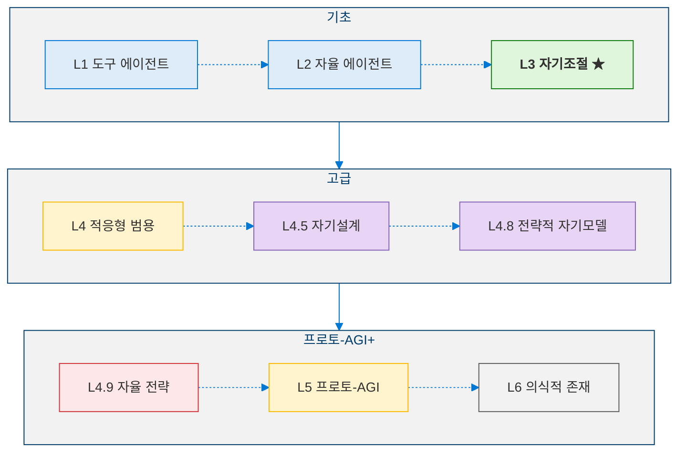

<!--
Copyright (c) 2026 Moon Hyuk Choi
Licensed under the MIT License.
See LICENSE file in the repository root for full license information.

Redistribution (commercial or non-commercial) must retain this notice.
Removal of attribution constitutes a license violation.
-->
# MSCP 에이전트 인지 레벨 시리즈

> **상태**: 🔬 **실험적** - 이 시리즈의 모든 문서는 프로토타이핑과 테스트에서 도출된 설계를 기술합니다. 최종 확정된 명세가 아닙니다.  

---

## 개요

**최소 자기의식 프로토콜(MSCP)**은 단순한 도구 호출 에이전트부터 인공 범용 지능의 이론적 경계까지, 에이전트 인지의 6단계 분류 체계를 정의합니다. 각 레벨 문서에는 아키텍처 다이어그램, 의사코드, 그리고 지금까지의 탐구를 기반으로 한 안전 분석이 포함되어 있습니다.

<!-- MSCP Agent Cognition Level Progression -->

---

## 레벨 문서

| 레벨 | 명칭 | 핵심 역량 | 문서 |
|:-----:|------|----------|------|
| **1** | **도구 에이전트** | 결정적 도구 호출; 내부 상태 없음 | [Level_1_Tool_Agent.ko.md](Level_1_Tool_Agent.ko.md) |
| **2** | **자율 에이전트** | 세계 모델; 자율 목표 생성; 감정 감지 | [Level_2_Autonomous_Agent.ko.md](Level_2_Autonomous_Agent.ko.md) |
| **3** | **자기조절 인지 에이전트** | 16계층 아키텍처; 삼중 루프 메타인지; 정체성 벡터; 윤리 커널; 리아프노프 안정성; 정서 + 생존 엔진 | [Level_3_Self_Regulating_Agent.ko.md](Level_3_Self_Regulating_Agent.ko.md) |
| **4** | **적응형 범용 에이전트** | 교차 도메인 전이; 장기 목표 계층; 5단계 역량 확장; 전략 진화; 7단계 제한적 자기수정 | [Level_4_Adaptive_General_Agent.ko.md](Level_4_Adaptive_General_Agent.ko.md) |
| **4.5** | **프리-AGI: 자기설계** | 자기투영 엔진(SEOF); 아키텍처 재구성; 병렬 인지 프레임; 목적 반영; 실존적 가드 | [Level_4_5_Self_Architecting.ko.md](Level_4_5_Self_Architecting.ko.md) |
| **4.8** | **전략적 자기모델링 에이전트** | 세계 모델 통합; 메타인지 자기모델; 장기 전략 계획; 안정성 보존 계획 | [Level_4_8_Strategic_Self_Modeling.ko.md](Level_4_8_Strategic_Self_Modeling.ko.md) |
| **4.9** | **자율 전략 에이전트** | 자율 목표 생성; 가치 진화 모니터링; 자원 생존 모델링; 다중 에이전트 추론; 자율 안정성 검증 | [Level_4_9_Autonomous_Strategic_Agent.ko.md](Level_4_9_Autonomous_Strategic_Agent.ko.md) |
| **5** | **프로토-AGI** | 영속적 정체성 연속성; 교차 도메인 일반화; 자율 목표 생태계; 실존적 회복력; 자기재구성 | [Level_5_Proto_AGI.ko.md](Level_5_Proto_AGI.ko.md) |
| 6 | 의식적 존재 | 의식; 감각질; 자유의지; 도덕적 행위자성 | *이론적 - 문서화되지 않음* |

---

## 레벨별 누적 안전 메커니즘

```mermaid
%%{init: {'theme': 'base', 'themeVariables': {'primaryColor': '#0078D4', 'primaryTextColor': '#003D6B', 'primaryBorderColor': '#003D6B', 'secondaryColor': '#50E6FF', 'secondaryTextColor': '#323130', 'secondaryBorderColor': '#00BCF2', 'tertiaryColor': '#F2F2F2', 'tertiaryTextColor': '#323130', 'lineColor': '#0078D4', 'textColor': '#323130', 'mainBkg': '#DEECF9', 'nodeBorder': '#0078D4', 'clusterBkg': '#F2F2F2', 'clusterBorder': '#003D6B', 'titleColor': '#003D6B', 'edgeLabelBackground': '#FFFFFF', 'fontSize': '14px'}}}%%
flowchart TD
  classDef l1 fill:#DEECF9,stroke:#0078D4,color:#323130
  classDef l3 fill:#DFF6DD,stroke:#107C10,color:#323130
  classDef l4 fill:#FFF4CE,stroke:#FFB900,color:#323130
  classDef l45 fill:#E8D5F5,stroke:#8764B8,color:#323130
  classDef l48 fill:#E8D5F5,stroke:#8764B8,color:#323130
  classDef l49 fill:#FDE7E9,stroke:#D13438,color:#323130
  classDef l5 fill:#FFF4CE,stroke:#FFB900,color:#323130

  subgraph L1S["레벨 1"]
    direction LR
    S1["입력 검증 · 오류 처리"]:::l1
  end

  subgraph L2S["레벨 2 (추가)"]
    direction LR
    S2["영속적 세계 모델 · 목표 우선순위"]:::l1
  end

  subgraph L3S["레벨 3 (추가)"]
    direction LR
    S3A["정체성 해시 · 델타 제한 0.05"]:::l3
    S3B["예측 게이트 · 에스컬레이션 가드"]:::l3
    S3C["윤리 커널 · 가치 잠금"]:::l3
    S3D["리아프노프 C(t) · 예산 + 성능 저하"]:::l3
    S3E["신념 그래프 · 정서 · 생존"]:::l3
  end

  subgraph L4S["레벨 4 (추가)"]
    direction LR
    S4A["BGSS ≥ 0.7 · 섀도우에이전트"]:::l4
    S4B["7단계 수정 프로토콜 · 원자성"]:::l4
    S4C["전략 억제 · 스킬 수명주기"]:::l4
    S4D["성장-안정성 영역 · 6개 메타프로세스"]:::l4
  end

  subgraph L45S["레벨 4.5 (추가)"]
    direction LR
    S5A["실존적 가드 · 프레임 거부권"]:::l45
    S5B["단계적 재구성 · ROD 깊이 3"]:::l45
    S5C["SEOF 앙상블 · 목적 일관성"]:::l45
    S5D["분열 감지 · 8개 불변량"]:::l45
  end

  subgraph L48S["레벨 4.8 (추가)"]
    direction LR
    S6A["확률적 세계 모델"]:::l48
    S6B["인과 추론 · 역량 매트릭스"]:::l48
    S6C["다중 수평선 계획 · 예산 최적화"]:::l48
  end

  subgraph L49S["레벨 4.9 (추가)"]
    direction LR
    S7A["자율 목표 생성 · 가치 샌드박스"]:::l49
    S7B["자원 생존 · 다중 에이전트 신념"]:::l49
    S7C["신뢰 보정 · 자율 검증"]:::l49
  end

  subgraph L5S["레벨 5 (추가)"]
    direction LR
    S8A["영속적 정체성 10K+"]:::l5
    S8B["교차 도메인 · 목표 생태계"]:::l5
    S8C["실존적 회복력 · 자기재구성"]:::l5
  end

  L1S -.-> L2S -.-> L3S -.-> L4S -.-> L45S -.-> L48S -.-> L49S -.-> L5S
```

<!-- Cumulative Safety Mechanisms by Level -->

---

## 핵심 지표 요약

| 지표 | 도입 시기 | 공식 | 임계값 |
|------|:--------:|------|:------:|
| 예측 오차 | L3 v1.0 | 실제 vs 예측 | < 0.1 (수렴) |
| 정체성 델타 | L3 v1.1 | $\lVert I(t) - I(t-1)\rVert_2$ | 최대 0.05/주기 |
| 메타 안정성 지수 | L3 v2.0 | $1 - 0.4V_{id} - 0.3M_{goal} - 0.3\sigma^2_{pred}$ | > 0.5 |
| 복합 안정성 C(t) | L3 v3.1 | 4항 가중 합 | C(t+1) ≤ C(t) + 0.05 |
| CDTS | L4 | 전이 성능 비율 | ≥ 0.6 |
| GPI | L4 | 장기 목표 진행도 | ≥ 0.3 |
| CAR | L4 | 스킬 습득 속도 | > 0 |
| SEF | L4 | 전략 진화 적합도 | > 1.0 |
| BGSS | L4 | 제한적 성장 안정성 | ≥ 0.7 |
| SEOF | L4.5 | 자기진화 최적화 | 개선 ≥ 8% |
| IIS | L4.5 | 정체성 무결성 | ≥ 0.85 |
| PCS | L4.5 | 목적 일관성 | ≥ 0.6 |
| ESR | L4.5 | 실존적 안전 기록 | ≥ 0.99 |
| WMA | L4.8 | 세계 모델 정확도 | ≥ 0.70 |
| SCA | L4.8 | 자기역량 평가 정확도 | ≥ 0.75 |
| SPE | L4.8 | 전략 계획 효과성 | ≥ 0.60 |
| SMS | L4.8 | 전략적 메타안정성 | ≥ 0.70 |
| AGQ | L4.9 | 자율 목표 품질 | ≥ 0.60 |
| VES | L4.9 | 가치 진화 안정성 | ≥ 0.90 |
| RSA | L4.9 | 자원 생존 정확도 | ≥ 0.70 |
| MASR | L4.9 | 다중 에이전트 전략 추론 | ≥ 0.60 |
| ASV | L4.9 | 자율 안정성 검증 | ≥ 0.85 |
| ICS | L5 | 정체성 연속성 점수 | ≥ 0.95 (10K 주기 이상) |
| GS | L5 | 일반화 점수 | ≥ 0.70 전이 유지 |
| GSS | L5 | 목표 안정성 점수 | 5K 주기 이상 안정 |
| RI | L5 | 회복력 지수 | 3개 이상 붕괴 시나리오 생존 |
| FR | L5 | 기능 유지율 | ≥ 0.85 핵심 기능 유지 |

---

## 읽기 가이드

- **MSCP가 처음이신가요?** [MSCP 개요](../MSCP_Overview.ko.md)로 개념적 개요를 파악한 후, 레벨 1 → 레벨 3 순서로 읽어보세요
- **안전에 관심이 있으신가요?** 레벨 3 (섹션 4, 6, 9)과 레벨 4.5 (단계 V: 실존적 가드)에 집중하세요
- **자기 개선에 관심이 있으신가요?** 레벨 4 (섹션 5–7)과 레벨 4.5 (단계 I–II)에 집중하세요
- **전략 계획에 관심이 있으신가요?** 레벨 4.8 (단계 1–3)의 세계 모델링과 전략 계층에 집중하세요
- **자율 에이전시에 관심이 있으신가요?** 레벨 4.9 (단계 1–5)의 자율 목표 생성과 가치 진화에 집중하세요
- **AGI 아키텍처에 관심이 있으신가요?** 레벨 5의 영속적 정체성과 교차 도메인 일반화에 집중하세요
- **정서/감정에 관심이 있으신가요?** 레벨 3 (섹션 7)의 기초 설계에 집중하세요

---

## 기초 참고문헌

MSCP 레벨 시리즈 전반에 걸쳐 참조되는 핵심 학술 문헌:

| 분야 | 주요 참고문헌 |
|------|-------------|
| **에이전트 아키텍처** | Yao et al., "ReAct" ([arXiv:2210.03629](https://arxiv.org/abs/2210.03629)); Wang et al., "LLM Agent Survey" ([arXiv:2308.11432](https://arxiv.org/abs/2308.11432)); Sumers et al., "Cognitive Architectures for Language Agents" ([arXiv:2309.02427](https://arxiv.org/abs/2309.02427)) |
| **인지 아키텍처** | Laird, *The Soar Cognitive Architecture* (MIT Press, 2012); Anderson, *Architecture of Cognition* (Harvard, 1983); Baars, *Cognitive Theory of Consciousness* (Cambridge, 1988) |
| **AI 안전** | Amodei et al., "Concrete Problems in AI Safety" ([arXiv:1606.06565](https://arxiv.org/abs/1606.06565)); Bai et al., "Constitutional AI" ([arXiv:2212.08073](https://arxiv.org/abs/2212.08073)); Hendrycks et al., "Catastrophic AI Risks" ([arXiv:2306.12001](https://arxiv.org/abs/2306.12001)) |
| **안정성 이론** | Khalil, *Nonlinear Systems* (Prentice Hall, 2002); García & Fernández, "Safe RL Survey" ([JMLR 2015](http://jmlr.org/papers/v16/garcia15a.html)) |
| **자기수정** | Schmidhuber, "Gödel Machines" ([arXiv:cs/0309048](https://arxiv.org/abs/cs/0309048)); Omohundro, "Basic AI Drives" (AGI 2008) |
| **전이 & 메타학습** | Zhuang et al., "Transfer Learning Survey" ([arXiv:1911.02685](https://arxiv.org/abs/1911.02685)); Hospedales et al., "Meta-Learning Survey" ([arXiv:2004.05439](https://arxiv.org/abs/2004.05439)) |
| **AGI & 실존적 위험** | Bostrom, *Superintelligence* (Oxford, 2014); Russell, *Human Compatible* (Viking, 2019); Bengio et al., "Managing Extreme AI Risks" ([Science, 2024](https://doi.org/10.1126/science.adn0117)) |

> 전체 참고문헌 목록은 각 레벨 문서의 끝에 제공됩니다.

---

*프로젝트 개요와 저장소 구조는 [홈](../index.ko.md)을 참조하세요.*
