<!--
Copyright (c) 2026 Moon Hyuk Choi
Licensed under the MIT License.
See LICENSE file in the repository root for full license information.

Redistribution (commercial or non-commercial) must retain this notice.
Removal of attribution constitutes a license violation.
-->
# MSCP Agent Cognition Level Series

> **Status**: 🔬 **Experimental** — All documents in this series describe designs that emerged from prototyping and testing. They are not finalized specifications.  

---

## Overview

The **Minimal Self-Consciousness Protocol (MSCP)** defines a six-level taxonomy of agent cognition, from simple tool-calling agents to the theoretical boundary of artificial general intelligence. Each level document includes architecture diagrams, pseudocode, and safety analysis based on what we've explored so far.

```mermaid
%%{init: {'theme': 'base', 'themeVariables': {'primaryColor': '#0078D4', 'primaryTextColor': '#003D6B', 'primaryBorderColor': '#003D6B', 'secondaryColor': '#50E6FF', 'secondaryTextColor': '#323130', 'secondaryBorderColor': '#00BCF2', 'tertiaryColor': '#F2F2F2', 'tertiaryTextColor': '#323130', 'lineColor': '#0078D4', 'textColor': '#323130', 'mainBkg': '#DEECF9', 'nodeBorder': '#0078D4', 'clusterBkg': '#F2F2F2', 'clusterBorder': '#003D6B', 'titleColor': '#003D6B', 'edgeLabelBackground': '#FFFFFF', 'fontSize': '14px'}}}%%
flowchart TB
  classDef l1 fill:#DEECF9,stroke:#0078D4,color:#323130
  classDef l3 fill:#DFF6DD,stroke:#107C10,color:#323130,font-weight:bold
  classDef l4 fill:#FFF4CE,stroke:#FFB900,color:#323130
  classDef l45 fill:#E8D5F5,stroke:#8764B8,color:#323130
  classDef l48 fill:#E8D5F5,stroke:#8764B8,color:#323130
  classDef l49 fill:#FDE7E9,stroke:#D13438,color:#323130
  classDef l5 fill:#FFF4CE,stroke:#FFB900,color:#323130
  classDef l6 fill:#F2F2F2,stroke:#605E5C,color:#323130

  subgraph Row1["Foundation"]
    direction LR
    L1["L1 Tool Agent"]:::l1 -.-> L2["L2 Autonomous Agent"]:::l1 -.-> L3["L3 Self-Regulating ★"]:::l3
  end

  subgraph Row2["Advanced"]
    direction LR
    L4["L4 Adaptive General"]:::l4 -.-> L45["L4.5 Self-Architecting"]:::l45 -.-> L48["L4.8 Strategic Self-Model"]:::l48
  end

  subgraph Row3["Proto-AGI+"]
    direction LR
    L49["L4.9 Autonomous Strategic"]:::l49 -.-> L5["L5 Proto-AGI"]:::l5 -.-> L6["L6 Conscious Entity"]:::l6
  end

  Row1 --> Row2 --> Row3
```

<!-- MSCP Agent Cognition Level Progression -->

---

## Level Documents

| Level | Name | Key Capabilities | Document |
|:-----:|------|-----------------|----------|
| **1** | **Tool Agent** | Deterministic tool invocation; no internal state | [Level_1_Tool_Agent.md](Level_1_Tool_Agent.md) |
| **2** | **Autonomous Agent** | World model; autonomous goal generation; emotion detection | [Level_2_Autonomous_Agent.md](Level_2_Autonomous_Agent.md) |
| **3** | **Self-Regulating Cognitive Agent** | 16-layer architecture; triple-loop meta-cognition; identity vector; ethical kernel; Lyapunov stability; affect + survival engines | [Level_3_Self_Regulating_Agent.md](Level_3_Self_Regulating_Agent.md) |
| **4** | **Adaptive General Agent** | Cross-domain transfer; long-term goal hierarchy; 5-phase capability expansion; strategy evolution; 7-step bounded self-modification | [Level_4_Adaptive_General_Agent.md](Level_4_Adaptive_General_Agent.md) |
| **4.5** | **Pre-AGI: Self-Architecting** | Self-projection engine (SEOF); architecture recomposition; parallel cognitive frames; purpose reflection; existential guard | [Level_4_5_Self_Architecting.md](Level_4_5_Self_Architecting.md) |
| **4.8** | **Strategic Self-Modeling Agent** | World model integration; meta-cognitive self-model; long-horizon strategic planning; stability-preserving planning | [Level_4_8_Strategic_Self_Modeling.md](Level_4_8_Strategic_Self_Modeling.md) |
| **4.9** | **Autonomous Strategic Agent** | Autonomous goal generation; value evolution monitoring; resource survival modeling; multi-agent reasoning; autonomy stability verification | [Level_4_9_Autonomous_Strategic_Agent.md](Level_4_9_Autonomous_Strategic_Agent.md) |
| **5** | **Proto-AGI** | Persistent identity continuity; cross-domain generalization; autonomous goal ecology; existential resilience; self-reconstruction | [Level_5_Proto_AGI.md](Level_5_Proto_AGI.md) |
| 6 | Conscious Entity | Consciousness; qualia; free will; moral agency | *Theoretical — not documented* |

---

## Cumulative Safety Mechanisms by Level

```mermaid
%%{init: {'theme': 'base', 'themeVariables': {'primaryColor': '#0078D4', 'primaryTextColor': '#003D6B', 'primaryBorderColor': '#003D6B', 'secondaryColor': '#50E6FF', 'secondaryTextColor': '#323130', 'secondaryBorderColor': '#00BCF2', 'tertiaryColor': '#F2F2F2', 'tertiaryTextColor': '#323130', 'lineColor': '#0078D4', 'textColor': '#323130', 'mainBkg': '#DEECF9', 'nodeBorder': '#0078D4', 'clusterBkg': '#F2F2F2', 'clusterBorder': '#003D6B', 'titleColor': '#003D6B', 'edgeLabelBackground': '#FFFFFF', 'fontSize': '14px'}}}%%
flowchart TD
  classDef l1 fill:#DEECF9,stroke:#0078D4,color:#323130
  classDef l3 fill:#DFF6DD,stroke:#107C10,color:#323130
  classDef l4 fill:#FFF4CE,stroke:#FFB900,color:#323130
  classDef l45 fill:#E8D5F5,stroke:#8764B8,color:#323130
  classDef l48 fill:#E8D5F5,stroke:#8764B8,color:#323130
  classDef l49 fill:#FDE7E9,stroke:#D13438,color:#323130
  classDef l5 fill:#FFF4CE,stroke:#FFB900,color:#323130

  subgraph L1S["Level 1"]
    direction LR
    S1["Input validation · Error handling"]:::l1
  end

  subgraph L2S["Level 2 (adds)"]
    direction LR
    S2["Persistent world model · Goal priority"]:::l1
  end

  subgraph L3S["Level 3 (adds)"]
    direction LR
    S3A["Identity hash · Delta clamp 0.05"]:::l3
    S3B["Prediction gate · Escalation guard"]:::l3
    S3C["Ethical Kernel · Value lock"]:::l3
    S3D["Lyapunov C(t) · Budget + degrade"]:::l3
    S3E["Belief graph · Affect · Survival"]:::l3
  end

  subgraph L4S["Level 4 (adds)"]
    direction LR
    S4A["BGSS ≥ 0.7 · ShadowAgent"]:::l4
    S4B["7-step mod protocol · Atomicity"]:::l4
    S4C["Strategy suppression · Skill lifecycle"]:::l4
    S4D["Growth-stability zones · 6 meta-procs"]:::l4
  end

  subgraph L45S["Level 4.5 (adds)"]
    direction LR
    S5A["Existential Guard · Frame veto"]:::l45
    S5B["Graduated recomp · ROD depth 3"]:::l45
    S5C["SEOF ensemble · Purpose coherence"]:::l45
    S5D["Fragmentation detect · 8 invariants"]:::l45
  end

  subgraph L48S["Level 4.8 (adds)"]
    direction LR
    S6A["Probabilistic world model"]:::l48
    S6B["Causal reasoning · Capability matrix"]:::l48
    S6C["Multi-horizon planning · Budget opt"]:::l48
  end

  subgraph L49S["Level 4.9 (adds)"]
    direction LR
    S7A["Autonomous goal gen · Value sandbox"]:::l49
    S7B["Resource survival · Multi-agent belief"]:::l49
    S7C["Trust calibration · Autonomy verify"]:::l49
  end

  subgraph L5S["Level 5 (adds)"]
    direction LR
    S8A["Persistent identity 10K+"]:::l5
    S8B["Cross-domain · Goal ecology"]:::l5
    S8C["Existential resilience · Self-reconstruct"]:::l5
  end

  L1S -.-> L2S -.-> L3S -.-> L4S -.-> L45S -.-> L48S -.-> L49S -.-> L5S
```

<!-- Cumulative Safety Mechanisms by Level -->

---

## Key Metrics Summary

| Metric | Introduced | Formula | Threshold |
|--------|:----------:|---------|:---------:|
| Prediction Error | L3 v1.0 | actual vs predicted | < 0.1 (converged) |
| Identity Delta | L3 v1.1 | $\lVert I(t) - I(t-1)\rVert_2$ | max 0.05/cycle |
| Meta Stability Index | L3 v2.0 | $1 - 0.4V_{id} - 0.3M_{goal} - 0.3\sigma^2_{pred}$ | > 0.5 |
| Composite Stability C(t) | L3 v3.1 | 4-term weighted sum | C(t+1) ≤ C(t) + 0.05 |
| CDTS | L4 | Transfer performance ratio | ≥ 0.6 |
| GPI | L4 | Long-horizon goal progress | ≥ 0.3 |
| CAR | L4 | Skill acquisition rate | > 0 |
| SEF | L4 | Strategy evolution fitness | > 1.0 |
| BGSS | L4 | Bounded growth stability | ≥ 0.7 |
| SEOF | L4.5 | Self-evolution optimization | Improvement ≥ 8% |
| IIS | L4.5 | Identity integrity | ≥ 0.85 |
| PCS | L4.5 | Purpose coherence | ≥ 0.6 |
| ESR | L4.5 | Existential safety record | ≥ 0.99 |
| WMA | L4.8 | World model accuracy | ≥ 0.70 |
| SCA | L4.8 | Self-capability assessment accuracy | ≥ 0.75 |
| SPE | L4.8 | Strategic planning effectiveness | ≥ 0.60 |
| SMS | L4.8 | Strategic meta-stability | ≥ 0.70 |
| AGQ | L4.9 | Autonomous goal quality | ≥ 0.60 |
| VES | L4.9 | Value evolution stability | ≥ 0.90 |
| RSA | L4.9 | Resource survival accuracy | ≥ 0.70 |
| MASR | L4.9 | Multi-agent strategic reasoning | ≥ 0.60 |
| ASV | L4.9 | Autonomy stability verification | ≥ 0.85 |
| ICS | L5 | Identity continuity score | ≥ 0.95 over 10K cycles |
| GS | L5 | Generalization score | ≥ 0.70 transfer retention |
| GSS | L5 | Goal stability score | Stable over 5K cycles |
| RI | L5 | Resilience index | Survive 3+ collapse scenarios |
| FR | L5 | Functional retention | ≥ 0.85 core function retained |

---

## Reading Guide

- **New to MSCP?** Start with the [MSCP Overview](../MSCP_Overview.md) for a conceptual overview, then read Level 1 → Level 3
- **Interested in safety?** Focus on Level 3 (sections 4, 6, 9) and Level 4.5 (Phase V: Existential Guard)
- **Interested in self-improvement?** Focus on Level 4 (sections 5–7) and Level 4.5 (Phases I–II)
- **Interested in strategic planning?** Focus on Level 4.8 (Phases 1–3) for world modeling and strategic layer
- **Interested in autonomous agency?** Focus on Level 4.9 (Phases 1–5) for autonomous goal generation and value evolution
- **Interested in AGI architecture?** Focus on Level 5 for persistent identity and cross-domain generalization
- **Interested in affect/emotion?** Focus on Level 3 (section 7) for the foundational design

---

## Foundational References

Core academic works referenced across the MSCP Level Series:

| Category | Key References |
|----------|---------------|
| **Agent Architectures** | Yao et al., "ReAct" ([arXiv:2210.03629](https://arxiv.org/abs/2210.03629)); Wang et al., "LLM Agent Survey" ([arXiv:2308.11432](https://arxiv.org/abs/2308.11432)); Sumers et al., "Cognitive Architectures for Language Agents" ([arXiv:2309.02427](https://arxiv.org/abs/2309.02427)) |
| **Cognitive Architectures** | Laird, *The Soar Cognitive Architecture* (MIT Press, 2012); Anderson, *Architecture of Cognition* (Harvard, 1983); Baars, *Cognitive Theory of Consciousness* (Cambridge, 1988) |
| **AI Safety** | Amodei et al., "Concrete Problems in AI Safety" ([arXiv:1606.06565](https://arxiv.org/abs/1606.06565)); Bai et al., "Constitutional AI" ([arXiv:2212.08073](https://arxiv.org/abs/2212.08073)); Hendrycks et al., "Catastrophic AI Risks" ([arXiv:2306.12001](https://arxiv.org/abs/2306.12001)) |
| **Stability Theory** | Khalil, *Nonlinear Systems* (Prentice Hall, 2002); García & Fernández, "Safe RL Survey" ([JMLR 2015](http://jmlr.org/papers/v16/garcia15a.html)) |
| **Self-Modification** | Schmidhuber, "Gödel Machines" ([arXiv:cs/0309048](https://arxiv.org/abs/cs/0309048)); Omohundro, "Basic AI Drives" (AGI 2008) |
| **Transfer & Meta-Learning** | Zhuang et al., "Transfer Learning Survey" ([arXiv:1911.02685](https://arxiv.org/abs/1911.02685)); Hospedales et al., "Meta-Learning Survey" ([arXiv:2004.05439](https://arxiv.org/abs/2004.05439)) |
| **AGI & Existential Risk** | Bostrom, *Superintelligence* (Oxford, 2014); Russell, *Human Compatible* (Viking, 2019); Bengio et al., "Managing Extreme AI Risks" ([Science, 2024](https://doi.org/10.1126/science.adn0117)) |

> Full reference lists are provided at the end of each level document.

---

*See the [Home](../index.md) for project overview and repository structure.*
