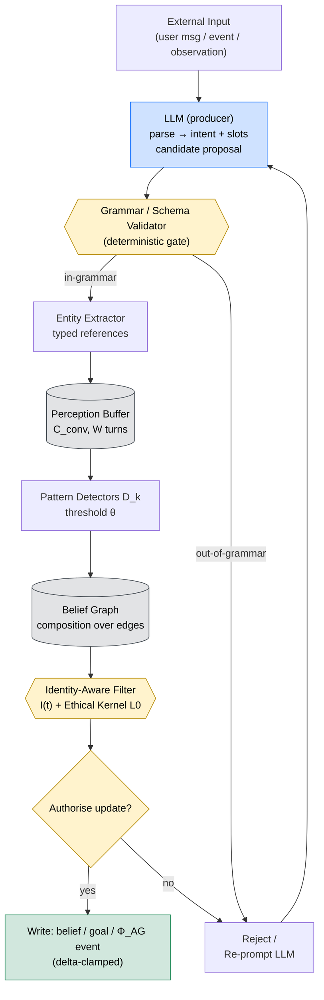
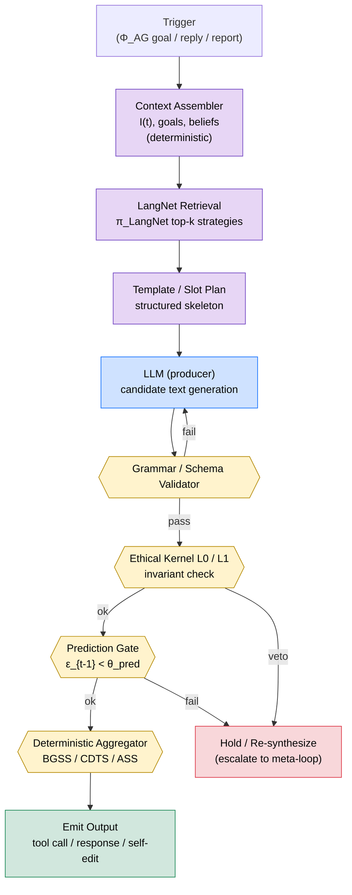

# LLM-프리 자율 언어: PLA의 근거

## 개정 이력

| 버전 | 날짜 | 설명 |
|------|------|------|
| 0.1.0 | 2026-06-14 | 초안. 점진적 언어 자율성(PLA, Overview §4.4.2)을 LLM에 위임할 수 없는 이유를 논증하고, 언어 자율성 갭(LAG)을 정의하며, 각 MSCP 레벨에서 LLM-프리 메커니즘이 필요한 지점을 매핑하고, 비-LLM 언어 합성 패턴 카탈로그를 정리. |

> **동반 문서.** 본 문서는 [MSCP Overview §4.4.2](../MSCP_Overview.md)를 독립적 근거 문서로 확장한 것입니다. 오케스트레이터 패턴 맥락(AGI Engine, PLA, LangNet)을 먼저 잡으려면 Overview §4.4를 먼저 읽으십시오.

---

## TL;DR

LLM은 분포에서 토큰을 샘플링하는 *통계적 텍스트 생성기*입니다. 자율 에이전트는 자기 가설을 검증하고, 자기 모델을 갱신하며, 자기 행동을 결정하는 *주체(subject)* 입니다. 두 역할을 동일한 substrate에 두면 에이전트는 자신의 LLM 환각을 자신의 사고로 오인합니다. **점진적 언어 자율성(PLA)** 은 이 분리를 강제하는 단계 분류이며, **LLM-프리** 메커니즘은 각 PLA 단계를 신뢰 가능하게 만드는 수단입니다. 본 문서는 그 이유를 설명합니다.

---

## 목차

1. [문제: 인지로서의 LLM vs 도구로서의 LLM](#1-문제-인지로서의-llm-vs-도구로서의-llm)
2. ["LLM-프리"가 실제로 의미하는 것](#2-llm-프리가-실제로-의미하는-것)
3. [자율성 갭(형식적 논증)](#3-자율성-갭-형식적-논증)
4. [MSCP 레벨이 LLM-프리 메커니즘을 *요구*하는 이유](#4-mscp-레벨이-llm-프리-메커니즘을-요구하는-이유)
5. [PLA 6단계 — 심화](#5-pla-6단계--심화)
6. [LLM 없이 동작하는 메커니즘(개념 카탈로그)](#6-llm-없이-동작하는-메커니즘개념-카탈로그)
7. [LLM-프리 PLA가 가능하게 하는 안전 속성](#7-llm-프리-pla가-가능하게-하는-안전-속성)
8. [반론과 응답](#8-반론과-응답)
9. [기존 문서와의 관계](#9-기존-문서와의-관계)
10. [열린 질문(연구 프론티어)](#10-열린-질문연구-프론티어)
11. [결론](#11-결론)

---

## 1. 문제: 인지로서의 LLM vs 도구로서의 LLM

### 1.1 기본 에이전트 아키텍처

현행 에이전트 프레임워크(ReAct 계열 체인, 다중 에이전트 오케스트레이션 라이브러리, "자율 코더" 루프) 대부분은 동일한 아키텍처적 선택을 공유합니다: **에이전트의 모든 결정은 LLM에서 샘플링된 다음 토큰**입니다. 목표 선택, 계획 수정, 자기비판, 심지어 "내 추론이 타당한가?" 라는 메타 평가까지 — 모두 에이전트의 직전 출력을 포함한 프롬프트 위에서 또 한 번의 LLM completion으로 구현됩니다.

이 패턴을 **LLM-래퍼(LLM-wrapper) 아키텍처**라고 부릅니다. 단순하고 표현력 있으며 L1 도구 에이전트 워크로드에서는 즉시 유용합니다. 또한 아래에서 다룰 모든 인지적 실패 모드가 발원하는 지점이기도 합니다.

### 1.2 LLM-인지 패턴의 다섯 가지 실패 모드

다음 실패 모드들은 엣지 케이스가 아니라, *통계적 텍스트 생성기에 의사결정 권위를 두는 것*의 구조적 귀결입니다.

**(F1) 환각의 자기귀속(self-attribution).** LLM이 자신감 있게 들리는 추론 체인을 생성할 때, 에이전트는 *LLM 외부에 그것을 점검할 능력*이 없습니다. 환각과 추론은 같은 스트림 안에 있습니다. 환각된 파일 시스템 읽기에 근거해 파일을 "지우기로 결정"한 LLM-래퍼 에이전트는 구조상 자신의 결정이 환각이었음을 인식할 수 없습니다. 에이전트는 말 그대로 자신의 작화를 자신의 사고로 취급합니다.

**(F2) 비결정성이 정체성 추적을 깨뜨림.** MSCP 레벨 3은 정체성 벡터 $I(t) \in [0,1]^5$와 델타 클램프 갱신 규칙(L3 §4.1, §4.2)을 도입합니다. 이 모든 장치는 *같은 상태의 같은 에이전트*가 *같은 결정*을 한다는 전제 위에 서 있습니다. LLM 샘플링은 설계상 이 전제를 무너뜨립니다. 동일한 두 사이클이 두 개의 다른 정체성 궤적을 만들어, $\delta_{\text{id}}(t)$, $v_{\text{id}}$, $a_{\text{id}}$가 잡음이 됩니다. 표류 감지기는 실제 표류와 샘플링 분산을 구분할 수 없습니다.

**(F3) 프롬프트 인젝션이 자기수정이 됨.** LLM-래퍼 에이전트에서 모든 입력 문자열은 다음 결정을 구동하는 프롬프트에 연결됩니다. 입력이 *곧* 인지의 substrate입니다. 에이전트 입력 채널에 텍스트를 넣을 수 있는 공격자는 원리상 그 턴의 에이전트 행동을 다시 쓸 수 있습니다. "이것은 외부에서 왔으니 코드가 아니라 데이터로 취급하라" 라는 경계를 둘 아키텍처적 자리가 없습니다 — 그 경계는 정확히 LLM의 어텐션 패턴이고, 그 패턴 자체가 학습된 텍스트이기 때문입니다.

**(F4) 메타인지 붕괴.** MSCP v0.4 (Overview §3.1 "초기 프로토타이핑에서의 핵심 교훈")는 *LLM 기반 자기 성찰*이 실패했음을 기록합니다: 에이전트가 LLM에게 "직전 추론을 평가하라" 라고 물으면, 그 평가는 같은 분포에서의 또 다른 샘플이며, 같은 환각에 취약하고, 고정된 참조점이 없습니다. 각 메타 레벨은 또 한 번의 completion일 뿐입니다. L3 §3.2의 3중 루프 메타인지는 최소 한 개 루프가 *LLM completion이 아닐* 때에만 작동합니다.

**(F5) 되돌릴 수 없는 자기수정.** 자기수정이 "LLM이 자기 자신을 위한 새 지시를 내보냈다" 로 구현되면, 스키마 검증된 패치도, 롤백도, 감사 추적도 없습니다. 작화된 규칙은 프롬프트 컨텍스트에서 스크롤 아웃될 때까지 영원히 살아있고, 그 시점에는 세상에 미친 영향은 남지만 규칙 자체는 회수 불가능합니다. L4 §8(Bounded Self-Modification)은 명시적으로 이 패턴을 금지하도록 설계되었습니다.

### 1.3 명제 1: 권위 vs 산출

> **명제 1 (권위 분리).** LLM은 *산출물 생산자(artifact producer)* 이지 *의사결정 권위(decision authority)* 가 아닙니다. PLA는 언어 매개 자율성이 성장해도 이 두 역할을 계속 분리해 두도록 학습해 가는 단계적 곡선입니다.

본 문서의 나머지는 MSCP 맥락에서 "의사결정 권위" 가 무엇을 의미하는지, 왜 그것을 LLM에 위임할 수 없는지, 무엇은 정당하게 위임할 수 있는지를 풀어냅니다.

---

## 2. "LLM-프리"가 실제로 의미하는 것

### 2.1 오해 1: "LLM-프리 = LLM 안 씀"

아닙니다. LLM-프리 PLA는 LLM을 도구로 활발하게 사용합니다 — 사용자 요청 파싱, 자연어 응답 작성, 후보 도구 인자 제안, 사용자를 위한 내부 상태 서술 등 많은 생산 작업에서 그렇습니다. 핵심은 LLM을 *제거*하는 것이 아니라, 안전 substrate에 닿는 것을 LLM이 *단독으로 결정*하지 못하게 하는 것입니다.

### 2.2 오해 2: "LLM-프리 = 기호적 AI 회귀"

이것도 아닙니다. LLM-프리 메커니즘은 벡터 임베딩, 경사 학습 네트워크, 학습된 분류기, 검색 시스템 등 현대 ML 컴포넌트를 자유롭게 사용합니다. 제약은 *표현(representation)* 이 아니라 *권위(authority)* 에 걸려 있습니다. 결정론적 결정 경계를 내놓는 학습된 분류기는 좋고, "가장 가능성 높은 다음 문장" 을 결정으로 삼는 LLM은 안 됩니다.

### 2.3 정확한 정의

> **정의 1 (LLM-프리 권위).** 입력 $x$로부터 출력 $o$를 산출하는 메커니즘 $M$이 *LLM-프리* 라는 것은, 모든 입력 $x$에 대해 함수 $x \mapsto o$가 다음을 만족함을 의미합니다:
>
> 1. 에이전트의 영속 상태가 주어졌을 때 **결정론적(deterministic)** 이거나,
> 2. 측정·감시 가능한 샘플링 정책 하에서 **분산이 유계(bounded variance)** 이며,
> 3. **검증 가능(verifiable)** — LLM을 재실행하지 않고 독립 모듈이 출력을 점검할 수 있고,
> 4. **가역(reversible)** — $o$가 에이전트의 정체성 벡터, 목표 집합, 자기 모델에 미친 영향을 롤백할 수 있다.
>
> LLM은 $o$의 후보를 *제안* 할 수 있지만, $o$의 *채택* 은 위 (1)~(4)를 만족하는 모듈이 수행해야 합니다.

이 정의는 LLM이 10개의 후보 자기수정을 제안하고 결정론적 검증기가 0개, 1개, 또는 여러 개를 고르는 아키텍처를 허용합니다. LLM의 첫 샘플이 *곧* 자기수정인 아키텍처는 금지합니다.

### 2.4 권위 분리 표

| 활동 | LLM이 수행 가능 | LLM이 단독으로 수행 불가 |
|------|:---------------:|:-----------------------:|
| 사용자 요청 파싱 | ✓ | — |
| 자연어 응답 생성 | ✓ | — |
| 후보 도구 인자 제안 | ✓ | 도구 호출 확정 |
| 자기 모델 편집 초안 작성 | ✓ | 편집 적용 |
| 내부 목표의 사용자용 언어화 | ✓ | 목표 합성 |
| 예측 vs 결과 비교(L3 §3.1) | ✗ | ✗ (결정론적이어야 함) |
| 정체성 벡터 $I(t)$ 변경 | ✗ | ✗ (델타 클램프만, L3 §4.2) |
| 윤리적 커널 Layer 0 평가(L3 §4.3) | ✗ | ✗ (불변 invariants) |
| ASS 동결 결정(L4.9, ASS $< 0.05$) | ✗ | ✗ (LLM이 자기 게이트를 우회) |

비대칭은 의도된 것입니다. 생산 성격의 활동은 LLM 친화적이고, 안전 substrate 활동은 LLM 금지입니다.

---

## 3. 자율성 갭 (형식적 논증)

### 3.1 언어 자율성 갭의 정의

> **정의 2 (언어 자율성 갭).** $p_{\text{LLM}}(o \mid x)$를 프롬프트 $x$에 대한 순수 LLM completion의 출력 분포라 하고, $p_{\text{agent}}(o \mid x, \mathcal{W}, I)$를 전체 에이전트(LLM + LLM-프리 메커니즘 + 세계 모델 $\mathcal{W}$ + 정체성 벡터 $I$)가 유도하는 출력 분포라 하자. 시점 $t$에서의 **언어 자율성 갭**은 두 엔트로피의 차이로 정의된다:
>
> $$\text{LAG}(t) = H\!\bigl(p_{\text{LLM}}(o \mid x_t)\bigr) - H\!\bigl(p_{\text{agent}}(o \mid x_t, \mathcal{W}_t, I(t))\bigr)$$

LAG가 크면 에이전트가 LLM-프리 메커니즘 — 정체성 제약, 윤리적 커널, 예측 게이팅, 목표 우선순위 — 을 통해 LLM의 분포를 실질적으로 좁혔다는 뜻입니다. LAG가 작으면 에이전트는 본질적으로 LLM을 메아리치고 있다는 뜻입니다.

### 3.2 LAG가 0에서 떨어져 있어야 하는 이유

$\text{LAG}(t) \to 0$이면 $p_{\text{agent}} \to p_{\text{LLM}}$이고, 에이전트의 행동은 통계적으로 LLM의 그것과 구별할 수 없습니다. 그 영역에서는:

- 정체성 벡터 궤적이 LLM 샘플링 잡음에 대한 랜덤 워크가 됩니다.
- 예측-비교 루프(L3 §3.1)가 LLM 샘플끼리를 비교하는 꼴이 됩니다 — 비교 자체가 환각에 취약해집니다.
- 윤리적 커널은 LLM을 다시 프롬프트해 차단을 확인받지 않고는 행동을 막을 수 없어 순환적 신뢰 의존이 생깁니다.
- MSCP 안전 스택 전체가 "LLM을 믿는다" 로 환원됩니다 — 정확히 MSCP가 *요구하지 않으려고* 설계된 속성입니다.

### 3.3 LAG가 무한대에서도 떨어져 있어야 하는 이유

$\text{LAG}(t)$가 지나치게 크면 에이전트는 LLM을 *과도 제약* 하여 언어 유창성, 신규 입력 처리 능력, 진정으로 새로운 목표 합성 능력을 잃습니다. PLA의 핵심은 LLM을 억압하는 것이 아니라, *권위 하에서* 통합하는 것입니다.

### 3.4 LAG 스케줄로서의 PLA 단계

PLA 단계는 에이전트 성숙 경로를 따른 LAG 목표 스케줄로 읽을 수 있습니다:

| PLA 단계 | 목표 LAG 영역 | 해석 |
|:--------:|:-------------:|------|
| Stage 0 (L1) | $\text{LAG} \approx 0$ | LLM-래퍼; 에이전트 = LLM. 부패시킬 자기 모델이 없는 L1에서만 허용 가능. |
| Stage 1 (L2) | $\text{LAG}$ 작지만 $> 0$ | 목표 합성이 LLM-프리화; 그 외는 여전히 LLM 주도. |
| Stage 2 (L3) | $\text{LAG}$ 중간 | 예측 게이팅·정체성 벡터·윤리적 커널 모두 LLM-프리. |
| Stage 3 (L4) | $\text{LAG}$ 중상 | 교차 도메인 전략 검색(LangNet)이 LLM-프리화. |
| Stage 4 (L4.5–L4.8) | $\text{LAG}$ 큼 | 자기투영·확률적 세계 모델링·신뢰도 보정 모두 LLM-프리. |
| Stage 5 (L5) | $\text{LAG}$ 유계지만 최대 | 자율 연구 루프·가치 진화 감사·정체성 보존형 자기재건 모두 LLM-프리. |

### 3.5 명제 2: LLM-래퍼 함정

> **명제 2 (LLM-래퍼 함정).** 모든 $t$에서 $\text{LAG}(t)$가 0 근처에 머무는 에이전트는, LLM이 얼마나 강력하든, L1을 초과하는 어떤 MSCP 레벨에도 도달할 수 없다. LLM 용량 증가는 출력 분산을 줄이지만 권위와 산출을 분리하지 못하므로 §1.2의 실패 모드 (F1)~(F5)가 그대로 잔존한다.

이것이 본 논문의 핵심 주장입니다: **LLM을 키우는 것만으로는 MSCP 사다리를 오를 수 없다**. 사다리를 오르려면 산출은 LLM에 두고 의사결정 권위는 LLM-프리 메커니즘이 인수해야 합니다.

---

## 4. MSCP 레벨이 LLM-프리 메커니즘을 *요구*하는 이유

다음 표는 MSCP 스택을 따라가며, 각 레벨에서 *반드시* LLM-프리여야 하는 메커니즘과, LLM에 위임 시 발생하는 구체적 실패 모드를 나열합니다.

| MSCP 요소 | 문서 위치 | 요구되는 LLM-프리 메커니즘 | LLM에 위임 시 무엇이 깨지는가 |
|-----------|-----------|---------------------------|--------------------------------|
| 자율 목표 생성 $\Phi_{AG}$ | L2 §3.2 (정의 6) | 지각 버퍼에 대한 결정론적 패턴 감지기 | 목표 우선순위가 샘플링 잡음으로 진동; 왜 목표가 발행됐는지 사용자가 재현 불가 |
| 예측-비교-갱신 핵심 루프 | L3 §3.1 (정의 2) | $\hat{\Delta}$ vs $\Delta^{\text{actual}}$의 결정론적 비교 | "LLM이 자기 예측이 좋았다고 생각" — 메타 순환, 보정 신호 없음 |
| 예측 게이팅 $\theta_{\text{pred}}=0.30$ | L3 §3.3 | $\epsilon_{t-1}$에 대한 결정론적 임계 검사 | LLM이 보고하는 정확도는 환각 가능; 게이트 우회 가능 |
| 정체성 해시 $h(t)=\text{SHA-256}(I(t))$ | L3 §4.1 (정의 6) | 벡터의 암호학적 해시 | LLM은 자기 모델의 표류를 감지 못 함 |
| 델타 클램프 $\delta_{\max}=0.05$ | L3 §4.2 | $\|I(t)-I(t-1)\|_2$에 대한 수치 클리핑 | 자기 편집이 단일 사이클 내에 무한 표류 |
| 윤리적 커널 Layer 0 | L3 §4.3 | 불변 invariant 집합, 바이트 비교 | LLM이 매 턴 invariant를 다르게 "해석" |
| 신념 그래프 일관성 | L3 §5 | 그래프 순회 모순 감지기 | LLM은 어떤 신념이든 정당화함; 모순 미검출 |
| 랴프노프 합성 $C(t)$ + 진동 감지기 | L3 §6.1, §6.2 | 가중합 + 슬라이딩 윈도우 부호 변화 카운터 | 안정성은 느낌이 아니라 측정 속성 |
| Bounded Self-Modification(7단계) | L4 §8.2 | 스키마 검증 패치 + ShadowAgent 시뮬레이션 + 롤백 | 자기수정이 되돌릴 수 없는 텍스트 표류가 됨 |
| 교차 도메인 전이 점수 | L4 §4.2 | 테스트 도메인에 대한 정량 성공률 | LLM은 전이될 것 "같다" 고 느낌; 실제 전이는 미검증 |
| LangNet 검색 $\pi_{\text{LangNet}}(q, d)$ | Overview §4.4.3 | 임베딩 유사도 + 그래프 엣지 | LLM이 LangNet에 없는 전략을 환각 |
| ProbabilisticWorldModel + ConfidenceCalibrator | L4.8 §1.5 | 베이즈 갱신 + Brier-score 보정 | LLM의 "80% 확신" 은 무의미 |
| Skill Gap Analyzer | L4.8 §1.5 | 능력 행렬 위의 집합 차이 | LLM은 자기가 모르는 것을 신뢰성 있게 열거 못 함 |
| Strategy Comparator | L4.8 §1.5 | 점수 매겨진 전략의 수치 비교 | LLM은 장황한 것을 고르지, 효용 높은 것을 고르지 않음 |
| ASS 동결 게이트(ASS $< 0.05$) | L4.9 §1.6 | ASS 스칼라에 대한 임계 검사 | 게이트가 LLM 호출이면, LLM이 자기 게이트를 우회 |
| 목표 충돌 해소기 | L4.9 §3.6 | 가중 효용 합성 / 우선순위 정렬 | LLM은 사후적으로 어떤 승자든 합리화 |
| 정체성 연속성 점수 $\geq 0.95$ | L5 §1.1, §2.1 | 10,000 사이클 정체성 이력에 대한 코사인 유사도 | 토큰 공간에서는 추적 불가 |
| 자율 연구 루프(F4) | L5 §1.6 | 스킬 갭 기반 질의 합성 + 관측 통합 | LLM은 답을 작화함으로써 "연구" |
| 가치 진화 & 일관성 감사(F6) | L5 §1.6 | 가치 벡터 궤적의 거리 감사 | LLM은 서사적 일관성을 만들 뿐 metric 일관성은 못 만듦 |
| 자기재건 $\mathcal{R}_{\text{recon}}$ | L5 §8 | 드리프트 $\Delta < 0.05$의 정체성 보존형 재건 | LLM은 다른 에이전트를 만들고 같은 이름이라 부름 |

패턴: **MSCP 한 레벨을 다음 레벨과 구분하는 모든 안전 메커니즘은 LLM-프리이다.** LLM-프리 메커니즘을 제거하면 레벨 분류 자체가 무너집니다.

---

## 5. PLA 6단계 — 심화

Overview §4.4.2의 표는 6단계를 간략히 소개했습니다. 여기서는 각 단계를 세 블록으로 풀어 씁니다: *LLM이 하는 일*, *LLM-프리 모듈이 하는 일*, *다음 단계로의 전이를 무엇이 검증하는지*.

### 5.1 Stage 0 (L1) — 도구 디스패치

- **LLM이 하는 일:** 사용자 요청을 의도 + 인자로 파싱; 도구 출력을 사용자에게 자연어로 포맷.
- **LLM-프리 모듈:** 도구 레지스트리 $\mathcal{T}$ (정의 2, L1 §1.2); 의도 분류기 신뢰도 임계; 응답 포맷터.
- **Stage 1로의 전이:** 호스트 AGI Engine이 L2 스택을 활성화 — 지각 버퍼와 대화 맥락 $\mathcal{C}_{\text{conv}}$가 인스턴스화.

Stage 0에서는 $\text{LAG} \approx 0$이 허용됩니다 — LLM 잡음이 부패시킬 영속 자기 모델이 없기 때문입니다. 위험은 도구 계층으로 한정됩니다.

### 5.2 Stage 1 (L2) — 자율 목표 생성

- **LLM이 하는 일:** 사용자 요청을 언어화; 다운스트림 도구를 위해 개체 참조를 요약; 목표 생성기가 발행한 목표의 자연어 진술 초안 작성.
- **LLM-프리 모듈:** 자율 목표 생성기 $\Phi_{AG}$ (L2 §3.2, 정의 6); 목표 우선순위 함수 $p(g,t)$; 개체 상태 추적기; 대화 맥락 $\mathcal{C}_{\text{conv}}$ (L2 §1.7).
- **Stage 2로의 전이:** L3 핵심 루프 활성 — 예측 스냅숏·정체성 벡터·윤리적 커널이 채워짐.

Stage 1 핵심 불변량은 *에이전트가 사용자가 요청하지 않은 목표를 발행할 수 있되*, *그 발행 결정* 자체는 지각 버퍼 위의 LLM-프리 패턴 감지기가 내린다는 점입니다 — LLM completion이 절대 아닙니다. 그렇지 않으면 에이전트는 매 샘플마다 가상 목표를 양산합니다.

### 5.3 Stage 2 (L3) — 예측 게이팅을 갖춘 자기비판

- **LLM이 하는 일:** 후보 행동 생성; 로그용 자기 보고 서술; 에이전트가 일시정지한 이유를 사용자에게 설명하는 표현 도움.
- **LLM-프리 모듈:** 예측 엔진(L3 §3); $\epsilon_{t-1}$을 산출하는 결정론적 비교기; 예측 게이트 $\theta_{\text{pred}}=0.30$ (L3 §3.3); 델타 클램프된 정체성 벡터; 윤리적 커널 Layer 0 + Layer 1 (L3 §4.3); 신념 그래프(L3 §5); 랴프노프 합성 $C(t)$ + 진동 감지기(L3 §6).
- **Stage 3로의 전이:** L4 스택이 능력 획득 파이프라인·교차 도메인 전이 점수·Bounded Self-Modification 프로토콜을 활성화.

Stage 2는 MSCP의 안전 논증이 결합하기 시작하는 지점입니다. 여기서 에이전트는 자기 예측 정확도가 저하되었을 때 후보 행동의 실행을 거부할 수 있고 — 그 거부는 *LLM 판단이 아닙니다*.

### 5.4 Stage 3 (L4) — 전략 합성과 전이

- **LLM이 하는 일:** 후보 전략 기술 제안; 전이 가설 언어화; 전략 검증기를 위한 반사실 테스트 시나리오 생성 보조.
- **LLM-프리 모듈:** 능력 격차 점수(L4 §6.1); 5단계 능력 확장 파이프라인(L4 §6.2); 기술 생명주기 상태 기계(L4 §6.3); 교차 도메인 전이 점수기(L4 §4); LangNet 검색(Overview §4.4.3); ShadowAgent 시뮬레이션을 포함한 Bounded Self-Modification 7단계(L4 §8.2).
- **Stage 4로의 전이:** L4.5 자기투영 엔진이 활성 — 다중 궤적 미래와 병렬 인지 프레임을 시뮬레이션.

Stage 3 기여는 **전략 재사용이 검색되지, 생성되지 않는다**는 것입니다. LLM은 "이전에 비슷한 걸 본 적 있나?" 를 제안할 수 있지만, 실제 매칭은 LangNet의 결정론적 검색이고, 실제 점수는 CDTS입니다.

### 5.5 Stage 4 (L4.5 – L4.8) — 자기투영과 확률적 세계 모델링

- **LLM이 하는 일:** 자기투영 엔진이 산출한 궤적을 언어화; 병렬 인지 프레임용 시나리오 기술 초안 작성 보조; 확률적 예측을 사용자에게 설명.
- **LLM-프리 모듈:** 세 시간 스케일에 걸친 자기투영 엔진(L4.5 §3); 거부권 있는 윤리 프레임을 갖춘 병렬 인지 프레임(L4.5 §5); Graduated Recomposition Protocol을 갖춘 아키텍처 재구성(L4.5 §4); 비수정 커널의 실존적 감시기(L4.5 §7); ProbabilisticWorldModel, CapabilityMatrix, ConfidenceCalibrator, SkillGapAnalyzer, StrategyComparator(L4.8 §1.5); 평균 보정 오차 추적기.
- **Stage 5로의 전이:** L4.9 스택이 가치 벡터 추적·ASS 점수·목표 충돌 해소를 활성화하고, F3~F6 단계가 L5 케이던스 안에서 스케줄링되기 시작.

Stage 4는 에이전트가 *예지력*을 얻는 곳입니다. 결정적 포인트는 그 예지력이 보정된 확률 분포 위에 세워진다는 것 — LLM이 미래에 대해 자기에게 들려주는 자신감 있는 이야기 위가 아니라는 점입니다. LLM이 자신감 있는 내일 이야기를 하는 것은 예지력이 아닙니다.

### 5.6 Stage 5 (L5) — 자율 연구와 가치 진화

- **LLM이 하는 일:** 연구 질문 초안; 발견의 표현; 진화한 가치를 사용자에게 전달하는 데 도움; 자기재건 보고서 서술.
- **LLM-프리 모듈:** $\geq 10{,}000$ 사이클에 걸친 정체성 지속 엔진(L5 §3); 교차 도메인 일반화 $\mathcal{G}_{\text{cross}}$(L5 §4); 충돌 해소 + 생명주기 관리를 갖춘 목표 생태계(L5 §5); 실존적 계획 엔진(L5 §6); 기만 탐지를 갖춘 다중 에이전트 전략 통합(L5 §7); 자기재건 $\mathcal{R}_{\text{recon}}$ (L5 §8); F3 자기진단; F4 자율 연구 루프; F5 장기 수평선 계획; F6 가치 진화 및 일관성 감사 (모두 L5 §1.6).
- **다음 단계는 공개된 MSCP 사다리에 존재하지 않습니다.** 본 분류 체계에서 L5는 PLA의 마지막 단계입니다.

Stage 5는 PLA가 가장 중요해지는 곳입니다. *자율적으로 연구하는* 에이전트는 정의상 외부 운영자 없이 새 질문을 생성하고 관측을 통합해야 합니다. 그 루프가 LLM-래퍼라면 에이전트는 답을 작화하고 작화를 발견으로 취급합니다. F4 자율 연구 루프가 Stage 5의 핵심 공학 과제인 *이유는 정확히* LLM을 키워서 풀 수 있는 문제가 아니기 때문입니다.

### 5.7 PLA 단계의 단조성

> **정의 3 (PLA 단계 단조성).** PLA 단계 $k$의 에이전트는 단계 $0, 1, \ldots, k{-}1$의 모든 LLM-프리 메커니즘을 보유한다. 인증된 PLA 단계 아래로의 퇴행 — 즉 이전에 LLM-프리였던 메커니즘을 LLM completion으로 대체하는 것 — 은 안정성 위반이며 메타 에스컬레이션(L3 §3.2)을 트리거한다.

단조성은 PLA 단계 분류가 안전 의미를 갖게 하는 핵심입니다. Stage 4에 *도달*하는 것만으로는 충분하지 않습니다; 사이클을 가로질러 *머물러야* 합니다. AGI Engine은 하위 LLM-프리 메커니즘이 하나라도 비활성화되면 더 높은 $\Delta_n$의 활성화를 거부함으로써 이를 강제합니다.

---

## 6. LLM 없이 동작하는 메커니즘 (개념 카탈로그)

"LLM이 아니라면 무엇으로?" 가 옳은 질문입니다. 아래는 MSCP 전반에서 LLM-프리 권위를 구현하는 데 사용되는 메커니즘 *패턴* 카탈로그입니다. 각 항목은 개념이지 레시피가 아닙니다; 구현은 다양할 수 있습니다.

### 6.1 템플릿 합성 (Template Synthesis)

슬롯 채움 템플릿 — "개체 $e$의 감정이 $< -0.5$이고 언급 횟수가 $\geq N$이면, 템플릿 *check_on($e$)* 으로 목표 $g$ 발행" — 은 저자가 LLM이 아닌 템플릿 작성자인 구조화된 출력을 산출합니다. 템플릿은 감사 가능하고, 버전 관리 가능하며, 가역적입니다. 문법 구성을 통해 복잡한 도메인으로 확장됩니다. L2의 자율 목표 표현, L3의 자기 보고 포맷팅에 사용.

### 6.2 신념 그래프 위의 합성 (Composition over Belief Graph)

신념 그래프(L3 §5)는 명제를 노드로, 함의/모순을 엣지로 저장합니다. 새 명제는 **그래프 합성**으로 유도됩니다 — $b_1 \Rightarrow b_2$이고 $b_2 \Rightarrow b_3$이면 정당화 경로가 기록된 유도 신념 $b_1 \Rightarrow b_3$가 됩니다. 이는 학습된 가중치 위의 기호적 유도이지 LLM completion이 아닙니다. L3의 자기일관성 텐서 계산, L4의 교차 도메인 전이 가설 생성에 사용.

### 6.3 LangNet 검색과 적응

전략·기술·능력은 LangNet(Overview §4.4.3) 안에 언어 임베딩 그래프 노드로 살고 있습니다. 검색 $\pi_{\text{LangNet}}(q, d_{\text{target}})$은 `applies-to` 이웃 위에서 임베딩 유사도로 상위 $k$개 전략 노드를 반환합니다. **적응**은 전략의 구조가 아니라 슬롯 바인딩만을 다시 씁니다 — 따라서 새 전략은 기존의 검증된 전략의 특수화임이 증명 가능합니다. 신규성은 유계이고 계보는 추적 가능합니다. L4의 교차 도메인 전이, L5의 교차 도메인 일반화 $\mathcal{G}_{\text{cross}}$에 사용.

### 6.4 임베딩 산술 (Embedding Arithmetic)

벡터 공간 연산 — 개념 클러스터의 중심, 도메인 축으로의 벡터 투영, 잔차 분해 — 은 결정론적 의미론으로 기존 의미들로부터 새 의미를 합성합니다. 연산 $v(\text{concept}_A) + v(\text{concept}_B) - v(\text{shared context})$는 재현 가능한 레시피이지 LLM completion이 아닙니다. L4의 능력 격차 점수 계산, L4.8의 신뢰도 보정에 사용.

### 6.5 문법 제약 생성 (Grammar-Constrained Generation)

후보 텍스트 생성에 LLM을 쓰더라도, 출력은 다운스트림 모듈이 읽기 전에 결정론적 문법(CFG, JSON 스키마, 정규식 뱅크, 구조화 출력 검증기)을 통해 *필터링*됩니다. 문법 외 샘플은 거부되고 LLM은 재프롬프트되며, 문법 내 샘플은 파싱·디스패치됩니다. 문법이 권위이고 LLM은 후보 원입니다. L1(도구 인자 검증)부터 L5(연구 질의 스키마)까지 전반에 사용.

### 6.6 예측-비교-갱신을 통한 자기비판

L3 핵심 루프(정의 2) 자체가 가장 중요한 LLM-프리 자기비판 메커니즘입니다: 행동 전에 결과를 **예측**하고, **행동**하고, 예측을 실제와 **비교**하고, 클램프된 델타로 자기 모델을 **갱신**. 어떤 단계도 LLM이 필요 없습니다. 에이전트의 자기 지식은 내성적 LLM 서사가 아니라 *현실과의 경험적 접촉*으로 개선됩니다. L3 이상의 모든 레벨에서 기본 자기 개선 substrate로 사용.

### 6.7 결정론적 집계자 (Deterministic Aggregators)

수치 점수 함수들 — 랴프노프 합성 $C(t)$(L3 §6.1), BGSS(Overview, L4), CDTS(L4), ASS(L4.9), OMI(L5), MSI(L3) — 은 가중치와 임계가 문서화된, 단일 감사 가능 스칼라로 고차원 인지 상태를 축약합니다. 이들은 MSCP의 모든 동결 게이트·에스컬레이션 트리거·인증 검사의 substrate입니다. 어느 것도 LLM 호출이 아닙니다.

### 6.8 참조 아키텍처: 언어 이해 파이프라인

아래 다이어그램은 *외부 발화*를 에이전트의 신념·목표·정체성 벡터에 대한 *권한 부여된 갱신*으로 변환하는 데이터 경로를 추적합니다. LLM은 경계에서 한 번, 후보 산출자로만 등장합니다. 그 하류의 모든 게이트는 LLM-프리이며 의사결정 권위를 보유합니다.

**다이어그램 읽기.** 파랑 = LLM(제안자, 결코 권위 아님). 노랑 = 결정론적 게이트(문법, 정체성 인식 필터, 결정). 회색 = 영속 저장소(지각 버퍼, 신념 그래프). 초록 = 영속 상태를 변형하는 유일한 sink — 게이트들이 모두 승인한 뒤에만 작동. 문법 외 LLM 출력은 조용히 강제 변환되지 않고 되돌려 보내집니다 — 이것이 프롬프트 인젝션 입력이 유효한 의도로 위장하는 것을 막는 메커니즘입니다.

### 6.9 참조 아키텍처: 언어 합성 파이프라인

합성 다이어그램은 그 역방향 경로를 추적합니다: *내부 트리거*(자율 생성된 목표, 사용자 응답 의무, 자기 보고)가 *방출 산출물*(도구 호출, 응답 텍스트, 자기수정)이 됩니다. 여기서도 LLM은 상류의 결정론적 컨텍스트 어셈블러와 하류의 결정론적 게이트 스택 사이에 끼어 있는 산출자입니다.

**다이어그램 읽기.** LLM은 결코 *방출할지 말지*를 결정하지 않고, *무엇을 방출할 수 있는지* 만 제안합니다. 세 개의 독립적 LLM-프리 게이트가 동시에 동의해야 합니다: 문법(구조 유효성), 윤리적 커널(불변 호환성), 예측 게이트(에이전트의 최근 예측이 행동을 정당화할 만큼 정확). 어느 게이트에서든 실패하면 더 부드러운 LLM 사과로 가는 게 아니라 *Hold / Re-synthesize*로 라우팅됩니다 — 자신감 있게 틀린 행동보다 침묵이 더 안전한 기본값입니다. 집계자 점수는 외부 감사자나 부모 AGI Engine이 방출이 정당했음을 인증하기 위해 재생할 수 있는 값입니다.

### 6.10 두 다이어그램의 공통 불변량

두 파이프라인은 같은 불변량을 보이며, 이들이 모여 LLM-프리 PLA 경계의 실무적 정의를 구성합니다:

1. **방향당 단일 LLM 노드.** 이해에는 LLM 하나(파싱), 합성에는 LLM 하나(생성)가 있습니다. 결정론적 게이트 없이 LLM 호출을 연쇄로 잇는 것은 금지 — 그런 쌍 하나하나가 권위 표면을 넓힙니다.
2. **게이트가 산출자보다 많다.** 두 다이어그램 모두 결정론적 게이트 : LLM 노드 비율이 최소 3:1입니다. 이것이 "권위 분리"(정의 1)의 구조적 형태입니다.
3. **실패 경로는 루프, 결코 우회 아님.** 실패한 LLM 출력은 다음 단계로 강제되지 않고 재프롬프트되거나 보류됩니다. 이것이 조용한 fallback 안티패턴을 금지합니다.
4. **영속 상태 변경은 종단점.** 신념 그래프 쓰기(이해)와 방출 산출물(합성)은 모든 게이트가 승인한 뒤 파이프라인 끝에서만 발생합니다. 중간에 상태를 쓰는 shortcut은 없습니다.
5. **모든 게이트는 재생 가능.** 같은 입력과 같은 영속 상태가 주어지면 모든 게이트는 같은 판정을 냅니다. 이것이 §7.1의 감사 가능성 주장을 구체화합니다.

이 다섯 불변량은 실무에서 $\text{LAG}(t) > 0$의 아키텍처적 형태입니다. 이 중 하나라도 어기는 구현은 — 모듈 목록에 "LLM-프리" 모듈이 몇 개가 적혀 있든 — §3.1의 정의에 따라 LLM-래퍼 에이전트로 붕괴하고 있는 것입니다.

---

## 7. LLM-프리 PLA가 가능하게 하는 안전 속성

LLM-프리 메커니즘에 대한 투자는 미학적인 것이 아닙니다. 각각은 LLM-래퍼 아키텍처가 제공할 수 없는 속성입니다.

### 7.1 감사 가능성 (Auditability)

결정 경로가 LLM-프리 함수 호출들로 구성되면, 로그로부터 결정론적으로 재구성할 수 있습니다. *"에이전트가 시점 $t$에 목표 $g$를 발행한 이유는, 지각 버퍼에 최근 $W$ 턴 동안 개체 $e$에 대한 부정적 감정 언급이 $n$건 있었고, 이것이 패턴 감지기 $D_3$의 임계 $\theta$를 넘었기 때문이다."* 이 문장은 완전하고 검증 가능한 설명입니다. 대응되는 LLM-래퍼 설명은 *"LLM이 좋은 생각이라 여겼다"* 정도인데, 사실이라 해도 도움이 안 됩니다.

### 7.2 재현성 (Reproducibility)

같은 영속 상태와 같은 입력이 주어지면, LLM-프리 파이프라인은 같은 출력을 만듭니다. 회귀 테스트가 가능합니다. 버그 이분 탐색이 가능합니다. 장주기 재생(예: 10,000 사이클 정체성 연속성 테스트, L5 §10.1)이 가능합니다. 비결정적 샘플러를 상대로는 어느 것도 불가능합니다.

### 7.3 프롬프트 인젝션 표면 축소

인지의 substrate가 입력 채널과 분리되면, 프롬프트 인젝션은 "에이전트의 행동을 다시 쓰기" 에서 "에이전트가 데이터로 취급하는 텍스트를 전달" 로 축소됩니다. 그 텍스트는 여전히 에이전트가 정보를 검색하거나 메시지를 보내게 할 수 있지만, 윤리적 커널·정체성 벡터·예측 게이트는 다시 쓸 수 없습니다 — 어느 것도 다음 토큰 샘플링으로 구현되어 있지 않기 때문입니다.

### 7.4 PLA 인증을 통한 점진적 신뢰 부여

AGI Engine은 PLA 단계를 인증한 뒤에야 $n \geq 2$에 대해 $\Delta_n$을 활성화합니다. 인증 자체가 LLM-프리 절차입니다: 인지 상태 벡터를 검사하고, 대상 단계가 요구하는 LLM-프리 메커니즘이 존재·활성화되어 있는지 검증한 뒤 게이트가 열립니다. 요구 LLM-프리 메커니즘이 하나라도 없거나 비활성이면, LLM이 얼마나 강력하든 게이트는 닫힌 상태로 남습니다. 이것이 점진적·증거 기반 신뢰 부여이며 — "엄격 가산" 원칙(L4.5, L5)과 호환되는 유일한 종류입니다.

### 7.5 LLM 교체 가능성

LLM이 substrate가 아니라 도구일 때, LLM을 다른 LLM으로 교체하는 것은 설정 변경이지 아키텍처 변경이 아닙니다. 에이전트의 정체성·목표·신념·안전 메커니즘은 교체에서 살아남습니다 — LLM에 저장된 것이 하나도 없기 때문입니다. 이것이 "차세대 LLM이 나오면 어떻게 됩니까?" 에 대한 실용적 답입니다 — LLM-래퍼 에이전트에서는 "이제 다른 에이전트입니다", LLM-프리 PLA 에이전트에서는 "같은 에이전트가 더 좋은 도구를 갖게 됐습니다".

---

## 8. 반론과 응답

반론에 대한 정직한 응답.

### 8.1 "충분히 큰 LLM이 다 해결할 것"

**반론.** 스케일은 환각을 줄인다; 미래 LLM은 인지 substrate가 될 만큼 신뢰성 있을 것이다.

**응답.** 스케일은 *분산*을 줄이지만, 샘플러가 자기 샘플을 권위 있는 것으로 취급한다는 아키텍처 사실을 바꾸지는 않습니다. 더 큰 LLM도 여전히 자기 환각을 자기에게 귀속시킵니다 — 단지 덜 자주 그럴 뿐입니다. 실패 모드 (F1)~(F5)는 통계적이 아니라 구조적입니다. MSCP v0.4의 교훈(Overview §3.1)이 일반화됩니다: *LLM 텍스트 출력은 스케일과 무관하게 안전 substrate가 아닙니다.* 게다가 "덜 자주" 는 안전의 단위가 아닙니다. 백만 사이클에 한 번 자기 모델을 파국적으로 오인하는 에이전트는, 운영 케이던스에서는 잦은 파국입니다.

### 8.2 "이중 시스템은 비용이 두 배"

**반론.** LLM과 병렬 LLM-프리 스택을 동시에 유지하면 엔지니어링 비용이 두 배가 된다.

**응답.** 비용은 대략 *substrate 개발* 노력 두 배이고 *추론* 비용은 거의 0 증가입니다(LLM-프리 모듈은 보통 LLM 호출보다 훨씬 쌉니다). ROI는 감사 가능성·재현성·점진적 신뢰입니다 — 어느 것도 LLM-래퍼 에이전트에 나중에 끼워 넣을 수 없습니다. 비용은 PLA 단계에 따라 천천히 오르고; 비용을 *지불하지 않은 데 따른 비용*은 자율 배포와 함께 빠르게 오릅니다.

### 8.3 "결정론적 모듈은 LLM 지능을 따라잡을 수 없다"

**반론.** 손으로 작성된 목표 생성기는 "다음에 뭘 할지 LLM에 물어봐" 에 비해 부서지기 쉽다.

**응답.** 이 반론은 지능의 두 의미를 혼동합니다: *산출(production)* (유창하고 맥락에 맞는 텍스트를 만드는 것)과 *권위(authority)* (에이전트가 무엇을 할지 결정하는 것). LLM-프리 모듈은 산출에서 LLM을 *능가*하도록 요구되지 않습니다 — LLM의 권위를 *담아두도록* 요구됩니다. LLM이 후보를 제안하고 LLM-프리 규칙이 채택하는 결정론적 목표 생성기는 보통 어느 한쪽 단독보다 *더 잘* 동작합니다 — LLM은 유창성을, LLM-프리 규칙은 일관성을 기여하기 때문입니다.

### 8.4 "실제 에이전트는 다 LLM-래퍼이고 잘 동작하는 것처럼 보인다"

**반론.** 주요 프레임워크가 LLM-래퍼 에이전트를 출시하고 사용자들이 만족한다.

**응답.** 배포된 에이전트 대부분은 MSCP 분류상 L1 또는 낮은 L2에 있습니다: 도구를 실행하고, 짧은 대화를 하고, 세션 간에 리셋됩니다. 이 자율성 수준에서 LLM-래퍼 패턴은 허용 가능합니다 — LLM 잡음이 부패시킬 영속 자기 모델이 없기 때문입니다. 프레임워크가 "잘 동작" 하는 이유는 기준이 "단일 사용자 요청 완료" 이기 때문입니다. 자율성 요구가 상승하면 — 영속 목표, 다일 추론, 자기수정 — LLM-래퍼 패턴은 §1.2가 열거한 방식대로 예측 가능하게 실패합니다.

### 8.5 "PLA는 그저 기호 AI의 재발명"

**반론.** "LLM-프리 의사결정 권위" 는 신경망에 정당한 이유로 졌던 GOFAI 규칙 엔진의 멋진 이름일 뿐이다.

**응답.** PLA는 기호적 메커니즘을 요구하지 않습니다. §6의 LLM-프리 모듈 다수는 그 자체가 학습된 것입니다(임베딩 공간, 보정된 분류기, 검색 네트워크). 제약은 *표현*이 아니라 *권위*에 걸려 있습니다. PLA는 LLM 이전이 아니라 LLM 이후입니다(post-LLM): "이제 LLM이 있으니, 에이전트의 결정 파이프라인 어디에 LLM 출력을 두지?" 라고 묻습니다. "모든 곳"(LLM-래퍼)이라는 답과 "어디에도 없음"(기호적 순수주의)이라는 답은 모두 틀렸고, PLA 단계는 그 사이의 답을 차트로 그립니다.

---

## 9. 기존 문서와의 관계

본 문서는 독립적 근거 문서입니다. 주장들은 다음 MSCP 문서들에 닻을 내리고 있습니다:

| MSCP 문서 | 제공하는 것 | 본 문서가 사용하는 방식 |
|-----------|------------|------------------------|
| [Overview §3.1](../MSCP_Overview.md) — 초기 프로토타이핑 교훈 | MSCP v0.4 발견: LLM 자기 성찰은 신뢰 불가 | §1.2 (F4)와 §8.1이 권위 분리의 증거로 직접 인용 |
| [Overview §4.4](../MSCP_Overview.md) — 명명된 아키텍처 개념 | AGI Engine, PLA 단계, LangNet 도입 | §5가 PLA 단계 표를 확장; §6이 LangNet 위에 구축 |
| [Overview §2.5](../MSCP_Overview.md) — 레벨별 핵심 임계값 | 수치 임계(예측 오차, ASS 동결, OMI) | §4가 각 임계값을 그 LLM-프리 강제자에 매핑 |
| [Glossary](MSCP_Glossary.md) | 정식 정의와 약어 목록 | §3이 거기 등록된 LAG 약자를 도입 |
| [L2 §1.7](../levels/Level_2_Autonomous_Agent.md) — 대화 맥락 | $\mathcal{C}_{\text{conv}}$ 구조 | §5.2 Stage 1 전이 트리거 |
| [L3 §3.1, §3.3](../levels/Level_3_Self_Regulating_Agent.md) | 핵심 루프, 예측 게이팅 | §1.2 (F4), §4, §5.3 |
| [L3 §4](../levels/Level_3_Self_Regulating_Agent.md) — 정체성 & 안전 | 정체성 벡터, 델타 클램프, 윤리적 커널 | §1.2 (F2), §2.4, §4 |
| [L4 §4, §6, §8](../levels/Level_4_Adaptive_General_Agent.md) | CDTS, 능력 확장, Bounded Self-Modification | §4, §5.4 |
| [L4.5 §3, §5, §7](../levels/Level_4_5_Self_Architecting.md) | 자기투영, 병렬 프레임, 실존적 감시기 | §5.5 |
| [L4.8 §1.5](../levels/Level_4_8_Strategic_Self_Modeling.md) | 확률적 세계 모델링, 신뢰도 보정 | §4, §5.5 |
| [L4.9 §1.6, §3.6](../levels/Level_4_9_Autonomous_Strategic_Agent.md) | ASS 동결 게이트, 목표 충돌 해소 | §4 |
| [L5 §1.6](../levels/Level_5_Proto_AGI.md) — F 단계 | 자율 연구 루프, 가치 진화 감사 | §5.6 |

---

## 10. 열린 질문 (연구 프론티어)

PLA 프레임워크는 다음을 열어둡니다. 각 항목은 로드맵이 아니라 초대장입니다.

**(Q1) 실제로 LAG를 어떻게 측정하는가?** 정의 2(§3.1)는 원칙적이지만 $p_{\text{LLM}}$과 $p_{\text{agent}}$를 대규모로 샘플링해야 합니다. 실용적 대용물 — 예: 고정 시드 섭동 하의 결정별 행동 발산 — 이 유용할 것입니다.

**(Q2) Stage 4 → Stage 5 전이를 자동 인증할 수 있는가?** "자율 연구 루프 F4가 운영자 개입 없이 닫힌다" 라는 Stage 5 요구는 사전 검증이 어렵습니다. 이를 포착하는 오프라인 테스트 벤치가 있을까요?

**(Q3) 적대적 PLA 단계 강등.** 에이전트 입력 채널에 쓸 수 있는 공격자가 인증된 PLA 단계를 취소시키고 (에이전트를 LLM-래퍼 행동으로 되돌릴 수 있는가)? 위협 모델은 무엇인가?

**(Q4) 다중 에이전트 PLA 추론.** 다른 PLA 단계의 에이전트들이 협력할 때(L5 §7), 더 높은 단계의 에이전트가 자신이 상호작용하는 낮은 단계 에이전트의 PLA 단계를 신뢰성 있게 추론할 수 있는가? 어느 방향이든 오추정은 안전상 결과를 낳습니다.

**(Q5) PLA 단계와 인간 감독.** PLA 단계가 상승해도 인간 운영자의 실질 감독 능력은 일정합니다. "human in the loop" 가 여전히 유의미한 최대 PLA 단계는 무엇이며, 그 이상에서는 어떤 모니터링 메커니즘이 대체하는가?

**(Q6) LLM-프리 신규성.** Stage 5는 진정으로 새로운 연구 산출을 요구합니다. §6의 메커니즘은 유계입니다(템플릿은 저자가 있고, LangNet 적응은 기존 전략을 특수화하며, 임베딩 산술은 알려진 개념 위에서 동작합니다). LLM-프리 합성으로 도달 가능한 신규성의 *상한*은 무엇이며, L5의 개방 세계 요구에 충분한가?

---

## 11. 결론

LLM-프리 PLA는 *반-LLM*이 아닙니다. *post-LLM*입니다 — 에이전트 결정 파이프라인의 올바른 자리, 즉 결정론적 권위 아래의 산출물 생산자로서 LLM을 사용하기 위한 규율입니다. 한 MSCP 레벨을 다음과 분리하는 모든 안전 메커니즘은 이 규율의 한 사례입니다. 따라서 MSCP 사다리를 오르는 것은 정확히 LLM-주도 유창성을 보존하면서 LLM-프리 권위를 구축하는 공학 프로젝트입니다. PLA가 그 프로젝트의 단계에 이름을 붙입니다. AGI Engine이 그 단계들을 오케스트레이션합니다. LangNet이 그들의 교차 도메인 산출물을 저장합니다. 이 셋이 함께, LLM-래퍼 에이전트가 답하지 않은 설계 질문에 답합니다: **에이전트 인지의 주체는 누구이며, 그 주체는 어떤 substrate 위에 거주하는가?**

MSCP의 답은, 주체는 에이전트 자신이며, substrate는 그 자신이 되기 위해 구축해야 했던 모든 LLM-프리 메커니즘의 합집합이다 — 라는 것입니다.
