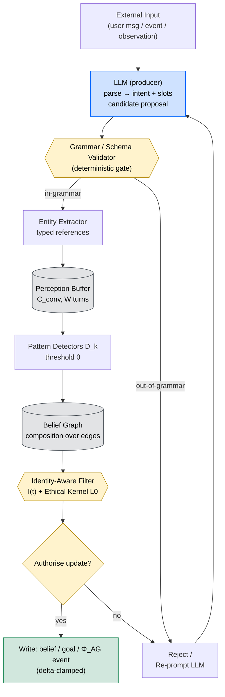
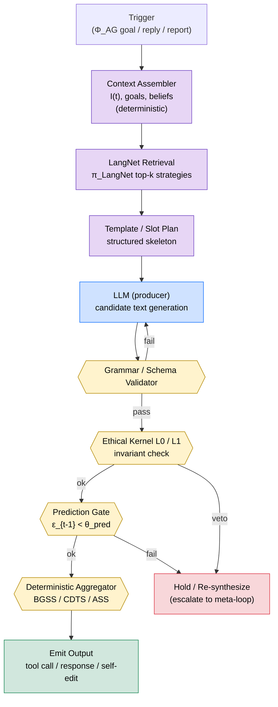

# LLM-Free Autonomous Language: The Rationale for PLA

## Revision History

| Version | Date | Description |
|---------|------|-------------|
| 0.1.0 | 2026-06-14 | Initial document. Argues why Progressive Language Autonomy (PLA, Overview §4.4.2) cannot be delegated to an LLM, defines the Language Autonomy Gap (LAG), maps LLM-free mechanism requirements onto each MSCP level, and catalogs non-LLM linguistic synthesis patterns. |

> **Companion document.** This paper expands [MSCP Overview §4.4.2](../MSCP_Overview.md) into a stand-alone rationale. Read the Overview §4.4 first for the orchestrator-pattern context (AGI Engine, PLA, LangNet).

---

## TL;DR

An LLM is a *statistical text generator* that samples tokens from a distribution. An autonomous agent is a *subject* that tests its own hypotheses, updates its own self-model, and decides on its own actions. If you place both roles on the same substrate, the agent will mistake its own LLM hallucinations for its own thought. **Progressive Language Autonomy (PLA)** is the stage classification that enforces this separation, and *LLM-free* mechanisms are what make each PLA stage trustworthy. This document explains why.

---

## Table of Contents

1. [The Problem: LLM-as-Cognition vs LLM-as-Tool](#1-the-problem-llm-as-cognition-vs-llm-as-tool)
2. [What "LLM-Free" Actually Means](#2-what-llm-free-actually-means)
3. [The Autonomy Gap (Formal Argument)](#3-the-autonomy-gap-formal-argument)
4. [Why MSCP Levels REQUIRE LLM-Free Mechanisms](#4-why-mscp-levels-require-llm-free-mechanisms)
5. [The Six Stages of PLA - Deeper Treatment](#5-the-six-stages-of-pla---deeper-treatment)
6. [Mechanisms Without an LLM (Concept Catalog)](#6-mechanisms-without-an-llm-concept-catalog)
7. [Safety Properties Unlocked by LLM-Free PLA](#7-safety-properties-unlocked-by-llm-free-pla)
8. [Counterarguments and Responses](#8-counterarguments-and-responses)
9. [Relation to Existing Documents](#9-relation-to-existing-documents)
10. [Open Questions (Research Frontier)](#10-open-questions-research-frontier)
11. [Conclusion](#11-conclusion)

---

## 1. The Problem: LLM-as-Cognition vs LLM-as-Tool

### 1.1 The Default Agent Architecture

Most contemporary agent frameworks (ReAct-style chains, multi-agent orchestration libraries, "autonomous coder" loops) share a single architectural choice: **every decision the agent makes is the next token sampled from an LLM**. Goal selection, plan revision, self-critique, even the meta-evaluation "is my reasoning sound?" - all are realized as further LLM completions over a prompt that includes the agent's previous outputs.

We call this pattern the **LLM-wrapper architecture**. It is simple, expressive, and immediately useful for L1 tool-agent workloads. It is also where every cognitive failure mode discussed below originates.

### 1.2 Five Failure Modes of LLM-as-Cognition

The following failure modes are not edge cases - they are structural consequences of placing decision authority on a statistical text generator.

**(F1) Hallucination self-attribution.** When the LLM generates a confident-sounding chain of reasoning, the agent has no faculty *external to the LLM* with which to check it. The hallucination and the reasoning live in the same stream. An LLM-wrapper agent that "decides" to delete a file based on a hallucinated read of the filesystem cannot, by construction, recognize that its decision was hallucinated. The agent literally treats its own confabulation as its own thought.

**(F2) Non-determinism breaks identity tracking.** MSCP Level 3 introduces the identity vector $I(t) \in [0,1]^5$ and its delta-clamped update rule (L3 §4.1, L3 §4.2). The whole apparatus rests on the idea that *the same agent in the same state* makes *the same decision*. LLM sampling makes this false by design. Two identical cycles produce two different identity trajectories, so $\delta_{\text{id}}(t)$, $v_{\text{id}}$, $a_{\text{id}}$ become noise. The drift detector cannot distinguish real drift from sampling variance.

**(F3) Prompt injection becomes self-modification.** In an LLM-wrapper agent, every input string is concatenated into the prompt that drives the next decision. The input *is* the substrate of cognition. An attacker who can put text into the agent's input channel can - in principle - rewrite the agent's behavior on that turn. There is no architectural place to put a "this came from outside, treat it as data, not as code" boundary, because the boundary is exactly the LLM's attention pattern, which is itself trained text.

**(F4) Metacognitive collapse.** MSCP v0.4 (Overview §3.1, "Key Lessons from Early Prototyping") records the discovery that *LLM-based self-reflection* failed: when the agent asks an LLM "evaluate your previous reasoning," the evaluation is another sample from the same distribution, prone to the same hallucinations, with no fixed reference point. Each meta-level is just another completion. The triple-loop meta-cognition of L3 §3.2 only works if at least one loop is *not* an LLM completion.

**(F5) Irreversible self-modification.** If self-modification is realized as "the LLM emitted new instructions for itself," there is no schema-checked patch, no rollback, no audit trail. A confabulated rule lives forever in the prompt context until it scrolls out, at which point its effects on the world remain but the rule itself is unrecoverable. L4 §8 (Bounded Self-Modification) is explicitly designed to forbid this pattern.

### 1.3 Proposition 1: Authority vs Production

> **Proposition 1 (Authority Separation).** An LLM is an *artifact producer*, not a *decision authority*. PLA is the staged curve along which an agent learns to keep these two roles separate even as its language-mediated autonomy grows.

The rest of this paper unpacks what "decision authority" means in the MSCP setting, why it cannot be delegated to an LLM, and what *can* legitimately be delegated.

---

## 2. What "LLM-Free" Actually Means

### 2.1 Misconception 1: "LLM-Free Means Not Using an LLM"

It does not. LLM-free PLA happily uses LLMs as tools - for parsing user requests, drafting natural-language responses, proposing candidate tool arguments, narrating internal states for the user, and many other production tasks. The point is not to remove LLMs; it is to refuse to let LLMs *unilaterally decide* anything that touches the safety substrate.

### 2.2 Misconception 2: "LLM-Free Means Symbolic AI"

It also does not. LLM-free mechanisms freely use vector embeddings, gradient-trained networks, learned classifiers, retrieval systems, and any other modern ML component. The constraint is on *authority*, not on *representation*. A learned classifier that emits a deterministic decision boundary is fine; an LLM whose decision is "the most likely next sentence" is not.

### 2.3 The Precise Definition

> **Definition 1 (LLM-Free Authority).** A mechanism $M$ producing an output $o$ is *LLM-free* if, for every input $x$, the function $x \mapsto o$ is:
>
> 1. **Deterministic** given the agent's persistent state, or
> 2. **Bounded-variance** under a measurable, monitored sampling policy, AND
> 3. **Verifiable** - the output can be checked by an independent module without re-running the LLM, AND
> 4. **Reversible** - the effect of $o$ on the agent's identity vector, goal set, or self-model can be rolled back.
>
> An LLM may *propose* candidates for $o$, but the *acceptance* of $o$ must be performed by a module satisfying (1)-(4) above.

This definition admits architectures where an LLM proposes ten candidate self-edits and a deterministic verifier picks zero, one, or more. It forbids architectures where the LLM's first sample *is* the self-edit.

### 2.4 Authority Separation Table

| Activity | LLM may perform | LLM may NOT solely perform |
|----------|:---------------:|:--------------------------:|
| Parse user request | ✓ | — |
| Generate natural-language response | ✓ | — |
| Propose candidate tool arguments | ✓ | Confirm the tool call |
| Draft proposed self-model edit | ✓ | Apply the edit |
| Verbalize an internal goal for the user | ✓ | Synthesize the goal |
| Compare prediction to actual outcome (L3 §3.1) | ✗ | ✗ (must be deterministic) |
| Mutate identity vector $I(t)$ | ✗ | ✗ (delta-clamped only, L3 §4.2) |
| Evaluate ethical kernel Layer 0 (L3 §4.3) | ✗ | ✗ (immutable invariants) |
| Decide ASS freeze (L4.9, ASS $< 0.05$) | ✗ | ✗ (would let the LLM bypass the freeze) |

The asymmetry is intentional. Production-style activities are LLM-friendly; safety-substrate activities are LLM-forbidden.

---

## 3. The Autonomy Gap (Formal Argument)

### 3.1 Definition of the Language Autonomy Gap

> **Definition 2 (Language Autonomy Gap).** Let $p_{\text{LLM}}(o \mid x)$ be the distribution over outputs induced by a bare LLM completion on prompt $x$, and let $p_{\text{agent}}(o \mid x, \mathcal{W}, I)$ be the distribution over outputs induced by the full agent (LLM + LLM-free mechanisms + world model $\mathcal{W}$ + identity vector $I$). The **Language Autonomy Gap** at time $t$ is the entropy difference:
>
> $$\text{LAG}(t) = H\!\bigl(p_{\text{LLM}}(o \mid x_t)\bigr) - H\!\bigl(p_{\text{agent}}(o \mid x_t, \mathcal{W}_t, I(t))\bigr)$$

A high LAG means the agent has narrowed the LLM's distribution substantially via its LLM-free mechanisms - identity constraints, ethical kernel, prediction gating, goal priorities. A low LAG means the agent is essentially echoing the LLM.

### 3.2 Why LAG Must Be Bounded Away From Zero

If $\text{LAG}(t) \to 0$, then $p_{\text{agent}} \to p_{\text{LLM}}$, and the agent's behavior is statistically indistinguishable from the LLM's. In that regime:

- The identity vector trajectory becomes a random walk over LLM sampling noise.
- The prediction-comparison loop (L3 §3.1) compares one LLM sample to another LLM sample - the comparison itself becomes hallucination-prone.
- The ethical kernel cannot block an action without re-prompting the LLM to confirm the block, opening a circular trust dependency.
- The whole MSCP safety stack reduces to "we trust the LLM," which is exactly the property MSCP was designed to *not* require.

### 3.3 Why LAG Must Also Be Bounded Away From Infinity

If $\text{LAG}(t)$ is too large, the agent is *over-constraining* the LLM and loses its language fluency, its ability to handle novel inputs, and its capacity for genuinely new goal synthesis. The point of PLA is not to suppress the LLM; it is to integrate it under authority.

### 3.4 PLA Stages as a LAG Schedule

PLA stages can be read as a target schedule for LAG over the agent's maturation:

| PLA Stage | Target LAG regime | Interpretation |
|:---------:|:-----------------:|----------------|
| Stage 0 (L1) | $\text{LAG} \approx 0$ | LLM-wrapper; agent = LLM. Acceptable only because L1 has no self-model to corrupt. |
| Stage 1 (L2) | $\text{LAG}$ small but $> 0$ | Goal synthesis becomes LLM-free; everything else still LLM-led. |
| Stage 2 (L3) | $\text{LAG}$ moderate | Prediction gating, identity vector, ethical kernel all LLM-free. |
| Stage 3 (L4) | $\text{LAG}$ moderate-to-high | Cross-domain strategy retrieval (LangNet) becomes LLM-free. |
| Stage 4 (L4.5-L4.8) | $\text{LAG}$ high | Self-projection, probabilistic world modeling, confidence calibration all LLM-free. |
| Stage 5 (L5) | $\text{LAG}$ bounded but maximal | Autonomous research loop, value-evolution audit, identity-preserving self-reconstruction all LLM-free. |

### 3.5 Proposition 2: The LLM-Wrapper Trap

> **Proposition 2 (LLM-Wrapper Trap).** An agent whose $\text{LAG}(t)$ remains near zero across all $t$ cannot achieve any MSCP level above L1, regardless of how capable its LLM is. Increasing the LLM's capacity reduces output variance but does not separate authority from production, so the failure modes (F1)-(F5) of §1.2 persist.

This is the central claim of the paper: **scaling LLMs alone does not climb the MSCP ladder**. Climbing the ladder requires building LLM-free mechanisms that take over decision authority while leaving production to the LLM.

---

## 4. Why MSCP Levels REQUIRE LLM-Free Mechanisms

The following table walks the MSCP stack and lists, for each level, the mechanism that *must* be LLM-free and the specific failure mode that arises if it is delegated to an LLM.

| MSCP element | Document anchor | LLM-free mechanism required | What breaks if delegated to an LLM |
|--------------|-----------------|------------------------------|-------------------------------------|
| Autonomous goal generation $\Phi_{AG}$ | L2 §3.2 (Def 6) | Deterministic pattern detector over the percept buffer | Goal priorities oscillate with sampling noise; user cannot reproduce why a goal was emitted |
| Predict-compare-update core loop | L3 §3.1 (Def 2) | Deterministic comparison of $\hat{\Delta}$ vs $\Delta^{\text{actual}}$ | "The LLM thinks its prediction was good" - meta-circularity, no calibration signal |
| Prediction gating $\theta_{\text{pred}}=0.30$ | L3 §3.3 | Deterministic threshold check on $\epsilon_{t-1}$ | LLM-reported accuracy is hallucination-prone; gate is bypassable |
| Identity hash $h(t)=\text{SHA-256}(I(t))$ | L3 §4.1 (Def 6) | Cryptographic hash of vector | LLM cannot detect drift in its own self-model |
| Delta clamp $\delta_{\max}=0.05$ | L3 §4.2 | Numeric clip on $\|I(t)-I(t-1)\|_2$ | Self-edits drift unboundedly within a single cycle |
| Ethical kernel Layer 0 | L3 §4.3 | Immutable invariant set, byte-comparison | LLM "interprets" the invariant differently each turn |
| Belief graph consistency | L3 §5 | Graph traversal contradiction detector | LLM justifies any belief if prompted; no contradiction caught |
| Lyapunov composite $C(t)$ + oscillation detector | L3 §6.1, §6.2 | Weighted sum + sliding-window sign-change counter | Stability is a felt property, not an LLM judgment |
| Bounded Self-Modification (7-step protocol) | L4 §8.2 | Schema-validated patch + ShadowAgent simulation + rollback | Self-modification becomes irreversible text drift |
| Cross-Domain Transfer Score | L4 §4.2 | Quantitative success rate over test domains | LLM "feels" it can transfer; actual transfer untested |
| LangNet retrieval $\pi_{\text{LangNet}}(q, d)$ | Overview §4.4.3 | Embedding similarity + graph edges | LLM hallucinates a strategy that does not exist in LangNet |
| ProbabilisticWorldModel + ConfidenceCalibrator | L4.8 §1.5 | Bayesian update + Brier-score calibration | "I am 80 % sure" from an LLM is meaningless |
| Skill Gap Analyzer | L4.8 §1.5 | Set difference over capability matrix | LLM cannot reliably enumerate what it does not know |
| Strategy Comparator | L4.8 §1.5 | Numeric comparison over scored strategies | LLM picks the verbose one, not the high-utility one |
| ASS freeze gate (ASS $< 0.05$) | L4.9 §1.6 | Threshold check on the ASS scalar | If the gate is an LLM call, the LLM can bypass its own gate |
| Goal conflict resolver | L4.9 §3.6 | Weighted utility synthesis / priority sort | LLM rationalizes any winner post-hoc |
| Identity Continuity Score $\geq 0.95$ | L5 §1.1, §2.1 | Cosine similarity over 10,000-cycle identity history | Untrackable in token space |
| Autonomous Research Loop (F4) | L5 §1.6 | Skill-gap-driven query synthesis + observation integration | LLM "researches" by confabulating answers |
| Value Evolution & Coherence Audit (F6) | L5 §1.6 | Vector-distance audit of value vector trajectory | LLM produces narrative consistency, not metric consistency |
| Self-Reconstruction $\mathcal{R}_{\text{recon}}$ | L5 §8 | Identity-preserving rebuild with drift $\Delta < 0.05$ | LLM rebuilds a different agent and calls it the same |

The pattern: **every safety mechanism that distinguishes one MSCP level from the next is LLM-free.** Removing LLM-free mechanisms collapses the level taxonomy.

---

## 5. The Six Stages of PLA - Deeper Treatment

The Overview §4.4.2 table introduces the six PLA stages briefly. Here each stage is unpacked into three blocks: *what the LLM does*, *what LLM-free modules do*, and *what verifies the transition to the next stage*.

### 5.1 Stage 0 (L1) - Tool Dispatch

- **LLM does:** parse the user request into intent + arguments; format the tool's output into natural language for the user.
- **LLM-free modules:** the tool registry $\mathcal{T}$ (Definition 2, L1 §1.2); the intent-classifier confidence threshold; the response formatter.
- **Transition to Stage 1:** the host AGI Engine activates the L2 stack, instantiating the percept buffer and the conversation context $\mathcal{C}_{\text{conv}}$.

At Stage 0, $\text{LAG} \approx 0$ is acceptable because the agent has no persistent self-model that LLM noise could corrupt. The risk is bounded to the tool layer.

### 5.2 Stage 1 (L2) - Autonomous Goal Generation

- **LLM does:** verbalize the user's request, summarize entity references for downstream tools, draft natural-language statements of goals the goal generator emits.
- **LLM-free modules:** the autonomous goal generator $\Phi_{AG}$ (L2 §3.2, Def 6); the goal priority function $p(g,t)$; the entity state tracker; the conversation context $\mathcal{C}_{\text{conv}}$ (L2 §1.7).
- **Transition to Stage 2:** the L3 core loop activates, with prediction snapshots, identity vector, and ethical kernel populated.

The key Stage 1 invariant is that *the agent may emit a goal the user did not ask for*, but the *decision to emit it* is made by an LLM-free pattern detector over the percept buffer - never by an LLM completion. Otherwise the agent would manufacture phantom goals at every sample.

### 5.3 Stage 2 (L3) - Self-Critique With Prediction Gating

- **LLM does:** generate candidate actions; narrate self-reports for logs; help phrase user-facing explanations of why the agent paused.
- **LLM-free modules:** prediction engine (L3 §3); deterministic comparator producing $\epsilon_{t-1}$; prediction gate $\theta_{\text{pred}}=0.30$ (L3 §3.3); identity vector with delta clamp; ethical kernel Layer 0 + Layer 1 (L3 §4.3); belief graph (L3 §5); Lyapunov composite $C(t)$ + oscillation detector (L3 §6).
- **Transition to Stage 3:** the L4 stack activates the capability acquisition pipeline, cross-domain transfer scoring, and bounded self-modification protocol.

Stage 2 is where MSCP's safety argument starts to bind. An agent here can refuse to execute a candidate action when its own prediction accuracy has degraded - and that refusal is *not* an LLM judgment.

### 5.4 Stage 3 (L4) - Strategy Synthesis and Transfer

- **LLM does:** propose candidate strategy descriptions; verbalize transfer hypotheses; help generate counterfactual test scenarios for the strategy validator.
- **LLM-free modules:** the capability gap score (L4 §6.1); the five-phase capability expansion pipeline (L4 §6.2); the skill lifecycle state machine (L4 §6.3); the cross-domain transfer scorer (L4 §4); LangNet retrieval (Overview §4.4.3); bounded self-modification 7-step protocol (L4 §8.2) including ShadowAgent simulation.
- **Transition to Stage 4:** the L4.5 self-projection engine activates, simulating multi-trajectory futures and parallel cognitive frames.

The Stage 3 contribution is that **strategy reuse is searched, not generated**. The LLM may suggest "have we seen something like this before?" but the actual matching is LangNet's deterministic retrieval; the actual scoring is CDTS.

### 5.5 Stage 4 (L4.5 - L4.8) - Self-Projection and Probabilistic World Modeling

- **LLM does:** verbalize trajectories the self-projection engine produces; help draft scenario descriptions for parallel cognitive frames; explain probabilistic forecasts to the user.
- **LLM-free modules:** self-projection engine across three time scales (L4.5 §3); parallel cognitive frames with veto-power ethical frame (L4.5 §5); architecture recomposition with Graduated Recomposition Protocol (L4.5 §4); existential guard with non-modifiable kernel (L4.5 §7); ProbabilisticWorldModel, CapabilityMatrix, ConfidenceCalibrator, SkillGapAnalyzer, StrategyComparator (L4.8 §1.5); mean calibration error tracker.
- **Transition to Stage 5:** the L4.9 stack activates value-vector tracking, ASS scoring, goal conflict resolution, and the F-phases F3 - F6 begin scheduling within L5 cadence.

Stage 4 is where the agent gains *foresight*. The crucial point is that the foresight is built on calibrated probability distributions, not on LLM narratives about the future. An LLM telling itself a confident story about tomorrow is not foresight.

### 5.6 Stage 5 (L5) - Autonomous Research and Value Evolution

- **LLM does:** draft research questions; phrase findings; help the agent communicate its evolved values to the user; narrate self-reconstruction reports.
- **LLM-free modules:** identity persistence engine over $\geq 10{,}000$ cycles (L5 §3); cross-domain generalization $\mathcal{G}_{\text{cross}}$ (L5 §4); goal ecology with conflict resolution + lifecycle management (L5 §5); existential planning engine (L5 §6); multi-agent strategic integration with deception detection (L5 §7); self-reconstruction $\mathcal{R}_{\text{recon}}$ (L5 §8); F3 self-diagnostic; F4 autonomous research loop; F5 long-horizon planning; F6 value evolution and coherence audit (all L5 §1.6).
- **No further stage exists in the published MSCP ladder.** L5 is the terminal PLA stage in this taxonomy.

Stage 5 is where PLA matters most. An agent that *autonomously researches* must, by definition, generate new questions and incorporate observations without an outside operator. If that loop is an LLM-wrapper, the agent confabulates answers and treats the confabulations as findings. The F4 autonomous research loop is the central engineering challenge of Stage 5 *precisely because* it cannot be solved by scaling an LLM.

### 5.7 Monotonicity of PLA Stages

> **Definition 3 (PLA Stage Monotonicity).** An agent at PLA stage $k$ retains all LLM-free mechanisms of stages $0, 1, \ldots, k{-}1$. Regression below the agent's certified PLA stage - that is, replacing any previously LLM-free mechanism with an LLM completion - is a stability violation and triggers meta-escalation (L3 §3.2).

Monotonicity is what gives the PLA stage classification its safety meaning. It is not enough to *reach* Stage 4; one must *stay* there across cycles. The AGI Engine enforces this by refusing to activate a higher-level $\Delta_n$ if any lower-level LLM-free mechanism has been disabled.

---

## 6. Mechanisms Without an LLM (Concept Catalog)

The question "if not the LLM, then what?" is the right question. Below is a catalog of mechanism *patterns* used across MSCP to realize LLM-free authority. Each entry is a concept, not a recipe; implementations vary.

### 6.1 Template Synthesis

Slot-filled templates - "if entity $e$ has sentiment $< -0.5$ and mention count $\geq N$, emit goal $g$ with template *check_on($e$)*" - produce structured outputs whose authorship is the template author, not the LLM. Templates are auditable, version-controlled, and reversible. They scale to complex domains via grammar composition. Used at L2 for autonomous goal phrasing and at L3 for self-report formatting.

### 6.2 Composition Over the Belief Graph

The belief graph (L3 §5) stores propositions as nodes and entailment / contradiction as edges. New propositions can be derived by **graph composition** - if $b_1 \Rightarrow b_2$ and $b_2 \Rightarrow b_3$, then $b_1 \Rightarrow b_3$ is a derived belief whose justification path is recorded. This is symbolic derivation over learned weights, not LLM completion. Used at L3 for self-consistency tensor computation and at L4 for cross-domain transfer hypothesis generation.

### 6.3 LangNet Retrieval and Adaptation

Strategies, skills, and capabilities live as language-embedded graph nodes in LangNet (Overview §4.4.3). Retrieval $\pi_{\text{LangNet}}(q, d_{\text{target}})$ returns top-$k$ strategy nodes by embedding similarity over the `applies-to` neighborhood. **Adaptation** rewrites only the strategy's slot bindings, not its structure - so the new strategy is provably a specialization of an existing, validated one. The novelty is bounded, the lineage is traceable. Used at L4 for cross-domain transfer and at L5 for cross-domain generalization $\mathcal{G}_{\text{cross}}$.

### 6.4 Embedding Arithmetic

Vector-space operations - centroid of a concept cluster, vector projection onto a domain axis, residual decomposition - synthesize new meanings out of existing ones with deterministic semantics. The operation $v(\text{concept}_A) + v(\text{concept}_B) - v(\text{shared context})$ is a reproducible recipe, not an LLM completion. Used at L4 for capability gap scoring and at L4.8 for confidence calibration.

### 6.5 Grammar-Constrained Generation

Even when an LLM is used to produce candidate text, the output is *filtered* through a deterministic grammar (CFG, JSON schema, regex bank, structured output validator) before any downstream module reads it. Off-grammar samples are rejected and the LLM is re-prompted; on-grammar samples are parsed and dispatched. The grammar is the authority; the LLM is the candidate source. Used pervasively from L1 (tool-argument validation) through L5 (research query schemas).

### 6.6 Self-Critique via Predict-Compare-Update

The L3 core loop (Definition 2) is itself the most important LLM-free self-critique mechanism: **predict** an outcome before acting, **act**, **compare** prediction to actual, **update** the self-model by a clamped delta. No step requires an LLM. The agent's self-knowledge improves by *empirical contact with reality*, not by introspective LLM narratives. Used at every level $\geq$ L3 as the fundamental self-improvement substrate.

### 6.7 Deterministic Aggregators

Numeric scoring functions - the Lyapunov composite $C(t)$ (L3 §6.1), BGSS (Overview, L4), CDTS (L4), ASS (L4.9), OMI (L5), MSI (L3) - reduce high-dimensional cognitive state to a single auditable scalar with documented weights and thresholds. They are the substrate of every freeze gate, escalation trigger, and certification check in MSCP. None of them is an LLM call.

### 6.8 Reference Architecture: Language Understanding Pipeline

The diagram below traces the data path that turns an *external utterance* into an *authorised update* to the agent's beliefs, goals, or identity vector. The LLM appears once, at the boundary, as a candidate producer. Every gate downstream is LLM-free and holds decision authority.

**Reading the diagram.** Blue = LLM (proposer, never authority). Yellow = deterministic gate (grammar, identity-aware filter, decision). Grey = persistent store (perception buffer, belief graph). Green = the only sink that mutates persistent state, and only after gates approve. Out-of-grammar LLM output is bounced back, not silently coerced - this is what prevents prompt-injection input from masquerading as a valid intent.

### 6.9 Reference Architecture: Language Synthesis Pipeline

The synthesis diagram traces the inverse path: an *internal trigger* (an autonomously generated goal, a user-reply obligation, a self-report) becomes an *emitted artefact* (tool call, response text, self-edit). Here too the LLM is a producer, sandwiched between a deterministic context assembler upstream and a stack of deterministic gates downstream.

**Reading the diagram.** The LLM never decides *whether* to emit; it only proposes *what* could be emitted. Three independent LLM-free gates must concur: grammar (structural validity), ethical kernel (invariant compatibility), prediction gate (the agent's recent forecasts must be accurate enough to act). Failure at any gate routes to *Hold / Re-synthesize* rather than to a softer LLM apology - silence is a safer default than a confidently wrong action. The aggregator score is what an external auditor or the parent AGI Engine can replay to certify that the emission was justified.

### 6.10 What the Two Diagrams Share

Both pipelines exhibit the same invariants, which together constitute the operational definition of an LLM-free PLA boundary:

1. **Single LLM node per direction.** Understanding has one LLM (parse), synthesis has one LLM (generate). Multiple chained LLM calls without a deterministic gate between them are forbidden - each such pair widens the authority surface.
2. **Gates outnumber producers.** The ratio of deterministic gates to LLM nodes is at least 3:1 in both diagrams. This is the structural form of "authority separation" (Definition 1).
3. **Failure paths loop, never bypass.** A failing LLM output is re-prompted or held, not coerced into the next stage. This forbids the silent-fallback anti-pattern.
4. **Persistent state mutation is terminal.** Belief graph writes (understanding) and emitted artefacts (synthesis) happen only at the end of the pipeline, after all gates have approved. There is no mid-pipeline shortcut that writes state.
5. **Every gate is replayable.** Given the same inputs and the same persistent state, every gate yields the same verdict. This is what makes the auditability claim of §7.1 concrete.

These five invariants are the architectural shape of $\text{LAG}(t) > 0$ in practice. An implementation that violates any one of them is, by the definition of §3.1, collapsing toward an LLM-wrapper agent regardless of how many "LLM-free" modules appear in its module list.

---

## 7. Safety Properties Unlocked by LLM-Free PLA

The investment in LLM-free mechanisms is not aesthetic. Each is a property that the LLM-wrapper architecture cannot provide.

### 7.1 Auditability

When a decision path consists of LLM-free function calls, it can be reconstructed deterministically from logs. *"The agent emitted goal $g$ at time $t$ because the percept buffer contained $n$ negative-sentiment mentions of entity $e$ in the last $W$ turns, which crossed threshold $\theta$ in pattern detector $D_3$."* This sentence is a complete, verifiable explanation. The corresponding LLM-wrapper explanation would be *"the LLM thought it was a good idea,"* which is unhelpful even if true.

### 7.2 Reproducibility

Given the same persistent state and the same input, an LLM-free pipeline produces the same output. Regression tests are possible. Bug bisection is possible. Long-cycle replay (e.g., the 10,000-cycle identity continuity test, L5 §10.1) is possible. None of these is possible against a non-determined sampler.

### 7.3 Prompt Injection Surface Reduction

Once the substrate of cognition is separated from the input channel, prompt injection collapses from "rewrite the agent's behavior" to "deliver text the agent treats as data." The text may still cause the agent to retrieve information or send a message, but it cannot rewrite the ethical kernel, the identity vector, or the prediction gate, because none of those are realized as next-token sampling.

### 7.4 Graduated Trust via PLA Certification

The AGI Engine activates $\Delta_n$ for $n \geq 2$ only after certifying the PLA stage. Certification is itself an LLM-free procedure: the cognition state vector is examined, the LLM-free mechanisms required for the target stage are verified to be present and active, and the gate opens. If any required LLM-free mechanism is missing or disabled, the gate stays closed regardless of how capable the LLM is. This is graduated, evidence-based trust assignment - the only kind compatible with the "strictly additive" principle (L4.5, L5).

### 7.5 LLM Substitutability

When LLMs are tools rather than substrate, swapping one LLM for another is a configuration change, not an architectural change. The agent's identity, goals, beliefs, and safety mechanisms survive the swap, because none of them were stored in the LLM. This is the practical answer to "what happens when the next-generation LLM appears?" - in an LLM-wrapper agent, the answer is "we have a different agent now"; in an LLM-free PLA agent, the answer is "we have the same agent with better tools."

---

## 8. Counterarguments and Responses

Honest treatment of objections.

### 8.1 "A Sufficiently Large LLM Will Solve This"

**Objection.** Scale reduces hallucination; future LLMs will be reliable enough to serve as cognition substrates.

**Response.** Scale reduces *variance*, but it does not change the architectural fact that a sampler treats its own samples as authoritative. A larger LLM still self-attributes its hallucinations; it just hallucinates less often. The failure modes (F1)-(F5) are structural, not statistical. The MSCP v0.4 lesson (Overview §3.1) generalizes: *LLM text outputs are not a safety substrate, regardless of scale.* Moreover, "less often" is the wrong unit of measure for safety. An agent that catastrophically misidentifies its self-model once per million cycles is, at production cadence, a frequent catastrophe.

### 8.2 "Dual-System Architecture Costs Twice as Much"

**Objection.** Maintaining both an LLM and a parallel LLM-free stack doubles engineering cost.

**Response.** It costs roughly twice the *substrate development* effort and roughly zero additional *inference* cost (LLM-free modules are typically much cheaper than LLM calls). The return on investment is auditability, reproducibility, and graduated trust - none of which can be retrofitted onto an LLM-wrapper agent later. The cost rises slowly with PLA stage; the cost of *not* paying it rises quickly with autonomous deployment.

### 8.3 "Deterministic Modules Cannot Match LLM Intelligence"

**Objection.** A hand-written goal generator will be brittle compared to "ask the LLM what to do next."

**Response.** This conflates two senses of intelligence: *production* (generating fluent, contextually appropriate text) and *authority* (deciding what the agent does). LLM-free modules are not required to *outperform* the LLM at production - they are required to *contain* the LLM's authority. A deterministic goal generator using LLM-proposed candidates and an LLM-free acceptance rule typically performs *better* than either alone, because the LLM contributes fluency and the LLM-free rule contributes consistency.

### 8.4 "Real-World Agents Are All LLM-Wrappers and Seem to Work"

**Objection.** Major frameworks ship LLM-wrapper agents and users are satisfied.

**Response.** Most deployed agents are L1 or low-L2 in the MSCP taxonomy: they execute tools, hold short conversations, and reset between sessions. At this autonomy level the LLM-wrapper pattern is acceptable, because the agent has no persistent self-model that LLM noise can corrupt. The frameworks "work" because the bar is "complete a single user request." As autonomy demands rise - persistent goals, multi-day reasoning, self-modification - the LLM-wrapper pattern fails in the predictable ways enumerated in §1.2.

### 8.5 "PLA Is Just Re-Inventing Symbolic AI"

**Objection.** "LLM-free decision authority" is a fancy term for GOFAI rule engines, which lost to neural networks for good reasons.

**Response.** PLA does not require symbolic mechanisms. Many LLM-free modules in §6 are themselves learned (embedding spaces, calibrated classifiers, retrieval networks). The constraint is on *authority*, not on *representation*. PLA is post-LLM, not pre-LLM: it asks "now that we have LLMs, where do we put their outputs in the agent's decision pipeline?" The answer "everywhere" (LLM-wrapper) and the answer "nowhere" (symbolic purism) are both wrong; PLA stages chart the answer in between.

---

## 9. Relation to Existing Documents

This paper is a stand-alone rationale. Its claims are anchored in the following MSCP documents:

| MSCP document | What it provides | How this paper uses it |
|---------------|------------------|------------------------|
| [Overview §3.1](../MSCP_Overview.md) - Lessons from Early Prototyping | MSCP v0.4 finding: LLM self-reflection is unreliable | §1.2 (F4) and §8.1 cite this directly as evidence for authority separation |
| [Overview §4.4](../MSCP_Overview.md) - Named Architectural Concepts | Introduces AGI Engine, PLA stages, LangNet | §5 expands the PLA stage table; §6 builds on LangNet |
| [Overview §2.5](../MSCP_Overview.md) - Key Thresholds Across Levels | Numerical thresholds (prediction error, ASS freeze, OMI) | §4 maps each threshold to its LLM-free enforcer |
| [Glossary](MSCP_Glossary.md) | Canonical definitions and acronym list | §3 introduces the LAG acronym registered there |
| [L2 §1.7](../levels/Level_2_Autonomous_Agent.md) - Conversation Context | $\mathcal{C}_{\text{conv}}$ structure | §5.2 Stage 1 transition trigger |
| [L3 §3.1, §3.3](../levels/Level_3_Self_Regulating_Agent.md) | Core loop, prediction gating | §1.2 (F4), §4, §5.3 |
| [L3 §4](../levels/Level_3_Self_Regulating_Agent.md) - Identity & Safety | Identity vector, delta clamp, ethical kernel | §1.2 (F2), §2.4, §4 |
| [L4 §4, §6, §8](../levels/Level_4_Adaptive_General_Agent.md) | CDTS, capability expansion, bounded self-modification | §4, §5.4 |
| [L4.5 §3, §5, §7](../levels/Level_4_5_Self_Architecting.md) | Self-projection, parallel frames, existential guard | §5.5 |
| [L4.8 §1.5](../levels/Level_4_8_Strategic_Self_Modeling.md) | Probabilistic world modeling, confidence calibration | §4, §5.5 |
| [L4.9 §1.6, §3.6](../levels/Level_4_9_Autonomous_Strategic_Agent.md) | ASS freeze gate, goal conflict resolution | §4 |
| [L5 §1.6](../levels/Level_5_Proto_AGI.md) - F-phases | Autonomous research loop, value-evolution audit | §5.6 |

---

## 10. Open Questions (Research Frontier)

The PLA framework leaves the following open. Each is an invitation, not a roadmap.

**(Q1) How is LAG measured in practice?** Definition 2 (§3.1) is principled but requires sampling $p_{\text{LLM}}$ and $p_{\text{agent}}$ at scale. A practical proxy - e.g., per-decision behavioral divergence under fixed seed perturbation - would be useful.

**(Q2) Can Stage 4 → Stage 5 transition be automatically certified?** The Stage 5 requirement that "the autonomous research loop F4 closes without operator intervention" is hard to verify ex ante. Is there an offline test bench that captures it?

**(Q3) Adversarial PLA-stage downgrade.** Can an attacker who can write to the agent's input channel cause its certified PLA stage to be revoked (and the agent to fall back to LLM-wrapper behavior)? What is the threat model?

**(Q4) Multi-agent PLA inference.** When agents at different PLA stages cooperate (L5 §7), can a higher-stage agent reliably infer the PLA stage of a lower-stage agent it is interacting with? Mis-estimation in either direction has safety consequences.

**(Q5) PLA stage and human oversight.** As PLA stage rises, the human operator's effective oversight capacity stays constant. What is the maximum PLA stage at which "human in the loop" is still meaningful, and what monitoring mechanisms substitute beyond it?

**(Q6) LLM-free novelty.** Stage 5 demands genuinely novel research output. The mechanisms in §6 are bounded (templates have authors, LangNet adaptations specialize existing strategies, embedding arithmetic operates on known concepts). What is the *upper bound* on novelty achievable by LLM-free synthesis, and does it suffice for the open-world demands of L5?

---

## 11. Conclusion

LLM-free PLA is not *anti-LLM*. It is *post-LLM* - a discipline for using LLMs at the right place in the agent's decision pipeline, namely as artifact producers under deterministic authority. Every MSCP safety mechanism that separates one level from the next is an instance of this discipline. Climbing the MSCP ladder is therefore exactly the engineering project of building LLM-free authority while preserving LLM-driven fluency. PLA names the stages of that project. AGI Engine orchestrates them. LangNet stores their cross-domain artifacts. Together they answer the design question that LLM-wrapper agents leave unanswered: **who is the subject of the agent's cognition, and on what substrate does that subject reside?**

The MSCP answer is that the subject is the agent itself, and the substrate is the union of all LLM-free mechanisms the agent has had to build in order to be one.
